<!--
CO_OP_TRANSLATOR_METADATA:
{
  "original_hash": "dcbcd9396b076da0a0f5d389e9ec1b12",
  "translation_date": "2025-10-20T00:48:07+00:00",
  "source_file": "docs/recruit/08-add-adaptive-card/README.md",
  "language_code": "sw"
}
-->
# 🚨 Misheni 08: Boresha mwingiliano wa watumiaji katika Mada kwa kutumia Kadi za Adaptive

## 🕵️‍♂️ JINA LA KODI: `OPERATION INTERFACE UPLIFT`

> **⏱️ Muda wa Operesheni:** `~Dakika 45`

🎥 **Tazama Mwongozo**

[](https://www.youtube.com/watch?v=RhIlzYHPCXo "Tazama mwongozo kwenye YouTube")

## 🎯 Maelezo ya Misheni

Wakala, misheni yenu ni kuingilia uzoefu wa mtumiaji wa kawaida na kuubadilisha kuwa mwingiliano wa hali ya juu, wa kuvutia, na wa vitendo kwa kutumia Kadi za Adaptive. Mtatumia payload za JSON na fomula za Power Fx kubadilisha mazungumzo ya Copilot Studio kutoka maswali na majibu ya kawaida kuwa mwingiliano kamili. Lengo lenu ni kukusanya maoni ya watumiaji, kuwasilisha data kwa uzuri, na kuelekeza mazungumzo kwa usahihi na mtindo. Mkishindwa kubadilika, watumiaji wenu wanaweza kuhamia kwenye interface zisizo na akili.

## 🔎 Malengo

Katika misheni hii, mtajifunza:

1. Kuelewa Kadi za Adaptive ni nini na jinsi zinavyoboresha mwingiliano wa watumiaji katika Copilot Studio
1. Kujifunza kujenga kadi za mwingiliano kwa kutumia JSON na fomula za Power Fx kwa maudhui ya hali ya juu
1. Kuchunguza Muundaji wa Kadi za Adaptive na vipengele vyake muhimu kwa ajili ya uundaji wa kadi za kuona
1. Kuunda fomu za hali ya juu, za mwingiliano na uzoefu wa kukusanya data ndani ya mada za wakala
1. Kutekeleza mbinu bora za kubuni kadi za adaptive zinazojibadilisha na zinazofaa kwa watumiaji

## 🤔 Kadi ya Adaptive ni nini?

**Kadi ya Adaptive** ni njia ya kuunda vipengele vya UI vya mwingiliano, vyenye mvuto wa kuona ambavyo vinaweza kuingizwa kwenye programu kama Microsoft Teams, Microsoft Outlook au wakala. Ni kitu kilichopangwa cha JSON kinachofafanua mpangilio na maudhui ya kadi:

- Vipengele vinavyoonekana kwenye kadi - maandishi, picha, vifungo
- Jinsi vipengele hivyo vinavyopangwa
- Hatua ambazo watumiaji wanaweza kuchukua kama vile kuwasilisha fomu au kufungua kiungo

    

### Kwa nini Kadi za Adaptive ni muhimu katika Copilot Studio

Fikiria unajenga wakala ambaye anauliza watumiaji majina yao, barua pepe, au maoni yao. Ikiwa utatumia maandishi ya kawaida tu, mazungumzo yanaweza kuhisi kuwa ya kuchosha au magumu kufuatilia. Hapo ndipo Kadi za Adaptive zinapokuja!

1. **Hufanya mazungumzo kuwa ya mwingiliano** - badala ya kutuma maandishi kama ujumbe kwa mtumiaji, unaweza kuonyesha vifungo, fomu, picha na zaidi.
    - Mfano: kadi inaweza kumwomba mtumiaji kujaza jina lake na barua pepe katika fomu safi.

1. **Huonekana vizuri kila mahali** - Kadi za Adaptive zinajibadilisha moja kwa moja na mtindo wa programu ziko ndani, kama vile mazungumzo ya Microsoft 365 Copilot au Microsoft Teams. Huna haja ya kuwa na wasiwasi kuhusu hali ya giza, fonti, au mpangilio - inajibadilisha.

1. **Rahisi kujenga kwa JSON** - unafafanua kadi kwa kutumia msimbo wa JSON (fikiria _mapishi_ ya UI). Copilot Studio hukusaidia kuona kadi yako kabla ya kuiongeza kwenye mada.

1. **Kukusanya na kutumia data** - unaweza kutumia kadi kuuliza maswali, kukusanya majibu, na kutumia data hiyo katika mtiririko wa mazungumzo.
    - Mfano: Uliza namba ya simu ya mtumiaji, kisha onyesha kadi ya uthibitisho na namba yao ya simu.

1. **Boresha uzoefu wa mtumiaji** - kadi hufanya wakala wako kuhisi kuwa wa mwingiliano zaidi. Ni interface safi, inayoweza kubofya, na inayofaa kwa mtumiaji.

## 🐱 Je, _JSON_ ni mtu?

Inatamkwa kama "Jason," si mtu 😅

JSON, inayojulikana kama _JavaScript Object Notation_ ni muundo mwepesi unaotumika kupanga data. Ni rahisi kusoma na kuandika, na inaonekana kama mfululizo wa jozi za funguo-thamani ndani ya mabano ya curly {}.

Hii ni mojawapo ya chaguo za kutumia wakati wa kuongeza kadi ya adaptive kwenye mada yako.


## 👀 Ninaona chaguo lingine la kujenga kadi ya adaptive kwa kutumia _fomula_

Kumbuka jinsi tulivyojifunza kuhusu Power Fx katika [Misheni 07 - Kutumia Power Fx katika nodi zako](../07-add-new-topic-with-trigger/README.md#what-power-fx-can-do-in-topics) Hilo hilo linaweza kutumika katika Kadi za Adaptive ndani ya Copilot Studio.

Kama muhtasari,

!!! note
    Power Fx ni lugha ya programu ya kiwango cha chini inayotumika kuongeza mantiki na tabia ya hali ya juu kwa wakala wako. Ni lugha ile ile inayotumika katika Microsoft Power Apps, na imeundwa kuwa rahisi na kama fomula za Excel, ikifanya iwe rahisi kwa watengenezaji na wasio watengenezaji.

### Jinsi Power Fx inavyofanya kazi katika Kadi za Adaptive

Unapobuni Kadi ya Adaptive katika Copilot Studio, unaweza kutumia fomula za Power Fx ili:

- Kuingiza maadili kwa njia ya hali ya juu kama majina ya watumiaji, tarehe au hali.
- Kuunda maandishi au namba kama vile kuonyesha sarafu au kuzungusha namba.
- Kuonyesha au kuficha vipengele kulingana na masharti.
- Kubinafsisha majibu kulingana na maoni ya mtumiaji, vigezo, matokeo kutoka kwa nodi za mazungumzo.

Kwa mfano,

"`Hello`" & `System.User.DisplayName`

Fomula hii inaunganisha neno "Hello" na jina la mtumiaji kwa njia ya hali ya juu.

### Kwa nini ni muhimu

1. **Ubinafsishaji**

    Unaweza kubadilisha ujumbe kwa kila mtumiaji, na kufanya mwingiliano uhisi wa asili na muhimu.

1. **Maudhui ya hali ya juu**

    Kadi zinaweza kuonyesha data halisi kutoka kwa vigezo na matokeo kutoka kwa nodi za mazungumzo.

1. **Mantiki ya akili**

    Unaweza kudhibiti kile watumiaji wanachoona au kuingiliana nacho kulingana na masharti, kuboresha matumizi na kupunguza makosa.

1. **Rafiki kwa kiwango cha chini cha msimbo**

    Power Fx ni lugha ya programu ya kiwango cha chini. Kama ilivyotajwa awali, ni rahisi kusoma, ya angavu na sawa na fomula za Excel.

## 👷🏻‍♀️ Kujenga na Muundaji wa Kadi za Adaptive

**Muundaji wa Kadi za Adaptive** ni zana ya kuona inayokuruhusu kujenga kadi za ujumbe za mwingiliano kwa kutumia vipengele vya kuburuta na kuachia kama maandishi, picha, vifungo, na maingizo. Kusudi lake ni kukusaidia kuunda ujumbe wa hali ya juu, wa mwingiliano bila kuandika msimbo mgumu, na kufanya iwe rahisi kubuni interface zinazofaa kwa watumiaji.

Zana ya muundaji hukusaidia kujenga kadi kwa njia ya kuona, lakini nyuma ya pazia, inazalisha kitu cha JSON kwa ajili yako. Unaweza pia kubadilisha hadi _fomula_ ambayo inaruhusu maonyesho ya Power Fx kutumika katika kadi kuonyesha data kutoka sehemu nyingine.

## 🎨 Kuelewa Muundaji wa Kadi za Adaptive

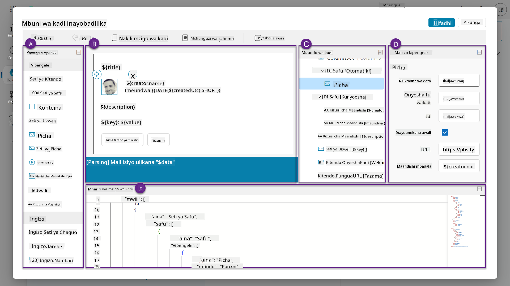

### A) Vipengele vya Kadi

Hivi ni vipengele vya msingi vya kadi yako ya adaptive. Unaweza kuburuta na kuachia vipengele kama vile:

- **TextBlock** kuonyesha maandishi.
- **Image** kuonyesha picha.
- **FactSet** kwa jozi za funguo-thamani.
- **Sehemu za maingizo** kuonyesha masanduku ya maandishi, chaguo za tarehe, swichi.
- **Hatua** kuonyesha vifungo kama _Submit_, _Open URL_, au _Show Card_.

Kila kipengele kina kusudi lake na kinaweza kubadilishwa au kusanidiwa.

### B) Mtazamaji wa Kadi

Hii ni eneo la **Muonekano wa awali** ambapo unaona jinsi kadi yako itakavyoonekana kwa wakati halisi. Unapoongeza au kuhariri vipengele, mtazamaji husasisha mara moja kuonyesha mabadiliko. Hii inakuwezesha kufanya mabadiliko ya mara kwa mara na kuona matokeo ya muundo kwa wakati mmoja.

### C) Muundo wa Kadi

Hii inaonyesha **hierakia na mpangilio** wa kadi yako. Kwa mfano:

- Kadi inaweza kuanza na **TextBlock** kwa kichwa.
- Kisha **ColumnSet** na picha upande mmoja na maandishi upande mwingine.
- Ikifuatiwa na **FactSet** na baadhi ya vifungo vya **Hatua**.

Inakusaidia kuelewa jinsi vipengele vinavyopangwa na kuandaliwa.

### D) Mali za Kipengele

Unapobofya kipengele chochote kwenye kadi, paneli hii hukuruhusu **kubadilisha mipangilio yake**:

- Badilisha ukubwa wa maandishi, uzito, au rangi.
- Weka URL za picha au maandishi mbadala.
- Sanidi chaguo za maingizo kama maandishi ya nafasi au maadili ya msingi.

Hapa ndipo unapoboresha kila kipengele.

### E) Mhariri wa Payload ya Kadi

Hii ni **msimbo wa JSON mbichi** nyuma ya kadi yako. Watumiaji wa hali ya juu wanaweza kuhariri hii moja kwa moja ili:

- Kutumia vipengele vya kiolezo.
- Nakili/bandika ufafanuzi wa kadi.

Hata kama wewe ni mgeni kwa muundaji wa Kadi za Adaptive, ni muhimu kuona jinsi muundo wa kuona unavyotafsiriwa kuwa msimbo.

!!! tip "Kidokezo - Angalia sampuli za Kadi za Adaptive"

    1. Tembelea [https://adaptivecards.microsoft.com/designer](https://adaptivecards.microsoft.com/designer).
    2. Chagua **Kadi mpya** ili kuona orodha ya sampuli unazoweza kuchagua na kurekebisha.
    3. Kumbuka kuwa muundaji huyu ni wa nje (unaotegemea wavuti). Unapojenga kadi yako katika Muundaji wa Kadi za Adaptive wa wavuti, nakili JSON kutoka kwa Mhariri wa Payload ya Kadi.
    4. Bandika JSON kwenye kadi yako ya adaptive katika wakala wako ndani ya Copilot Studio.

    

## 🌵 Matumizi ya kawaida

Yafuatayo ni matumizi ya kawaida ya Kadi za Adaptive katika Copilot Studio zinapotumika katika nodi za **Tuma ujumbe** au **Uliza swali**.

1. **Fomu na ukusanyaji wa data**

    Tumia kadi za adaptive kukusanya maingizo yaliyopangwa kutoka kwa watumiaji, kama vile:

    - Maombi ya likizo
    - Fomu za maoni
    - Taarifa za mawasiliano
    - Ratiba ya miadi

1. **Kuonyesha taarifa za hali ya juu**

    Onyesha watumiaji data ya kibinafsi au ya wakati halisi kwa muundo safi, unaosomeka kutoka vyanzo vya biashara kama ServiceNow, SAP, Dynamics 365, SharePoint nk.

    - Muhtasari wa oda
    - Salio la akaunti
    - Hali ya tiketi au kesi
    - Matukio au tarehe za mwisho zijazo

1. **Chaguo za mwingiliano**

    Waruhusu watumiaji kufanya uchaguzi moja kwa moja katika mazungumzo:

    - Chagua kutoka kwa orodha ya chaguo, kwa mfano, kategoria za bidhaa, mada za msaada.
    - Thibitisha au ghairi hatua.
    - Pima huduma au uzoefu.

1. **Kuchochea hatua**

    Jumuisha vifungo vinavyosababisha hatua zaidi katika mazungumzo ndani au nje.

    - "Wasilisha ombi"
    - "Tazama maelezo"

## ⭐ Mbinu bora

Hizi ni mbinu bora za kuunda Kadi za Adaptive kwa mawakala katika Copilot Studio.

1. **Iwe rahisi na yenye lengo**

    - Buni kadi zenye kusudi wazi, usizidishe na vipengele vingi.
    - Tumia maandishi mafupi na mpangilio wa angavu kuongoza watumiaji kupitia mwingiliano.

1. **Kuwa makini na maingizo**

    - Jumuisha tu vipengele vya maingizo vinavyohitajika kama maandishi, chaguo za tarehe, ili kuepuka kuwachosha watumiaji.
    - Tumia lebo kufanya maingizo yawe rahisi kueleweka.

1. **Panga kwa usomekaji**

    - Tumia **TextBlocks** kwa vichwa na maelekezo.
    - Panga vipengele vinavyohusiana kwa kutumia **Containers** au **ColumnSets** ili kuboresha mtiririko wa kuona.

1. **Fanya vipengele vya Hatua viwe wazi**

    - Tumia **Action.Submit** na au **Action.OpenUrl** na majina ya vifungo wazi kama "Wasilisha Ombi" au "Tazama Maelezo"
    - Epuka lebo zisizoeleweka kama "Bonyeza hapa"

1. **Buni kwa kubadilika**

    - Fikiria kadi inaweza kuonekana kwenye ukubwa tofauti wa skrini.
    - Epuka upana uliowekwa na tumia mpangilio rahisi kama **ColumnSets** kwa kujibadilisha.

1. **Tumia maudhui ya hali ya juu inapowezekana**

    - Funga vipengele vya kadi kwa vigezo au matokeo kutoka kwa nodi kwa kutumia Power Fx kubinafsisha uzoefu wa mtumiaji.
    - Kwa mfano, onyesha jina la mtumiaji au hali ya sasa kwa njia ya hali ya juu.

## 🧪 Maabara 08 - Ongeza kadi za adaptive na boresha uwezo wa mada

Sasa tunakwenda kujifunza jinsi ya kuboresha mada yetu kwa kadi za adaptive na kutumia utendaji wa hali ya juu wa mada na nodi.

- [8.1 Unda mada mpya na kadi ya adaptive kwa mtumiaji kuwasilisha ombi lake](../../../../../docs/recruit/08-add-adaptive-card)
- [8.2 Sasisha maelekezo ya wakala ili kuanzisha mada ya Ombi la kifaa](../../../../../docs/recruit/08-add-adaptive-card)

### ✨ Matumizi

**Kama** mfanyakazi

**Nataka** kuomba kifaa

**Ili** niweze kuomba kifaa kutoka kwenye orodha ya vifaa vilivyopo

Tuanzishe!

### Mahitaji ya awali

1. **Orodha ya SharePoint**

    Tutatumia orodha ya **Vifaa** ya SharePoint kutoka [Somo 00 - Usanidi wa Kozi - Hatua ya 3: Unda tovuti mpya ya SharePoint](../00-course-setup/README.md#step-4-create-new-sharepoint-site).

    Ikiwa hujaweka orodha ya **Vifaa** ya SharePoint, tafadhali rudi kwenye [Somo 00 - Usanidi wa Kozi - Hatua ya 3: Unda tovuti mpya ya SharePoint](../00-course-setup/README.md#step-4-create-new-sharepoint-site).

1. **Contoso Helpdesk Copilot**

    Tutatumia wakala yule yule aliyeundwa hapo awali katika [Somo 06 - Unda wakala maalum kwa kutumia lugha ya asili na Copilot na kuimarisha kwa data yako](../06-create-agent-from-conversation/README.md).

### 8.1 Unda mada mpya na kadi ya adaptive kwa mtumiaji kuwasilisha ombi lake

Tutaunda mada mpya ambayo itashughulikia ombi la kifaa la mtumiaji. Mada hii mpya itakuwa na nodi ya **Uliza kwa kadi ya adaptive** ili kuwezesha mwingiliano wa mtumiaji na wakala.

Tuanzishe!

1. Chagua kichupo cha **Mada**, kisha chagua **+ Ongeza mada kutoka mwanzo**.

    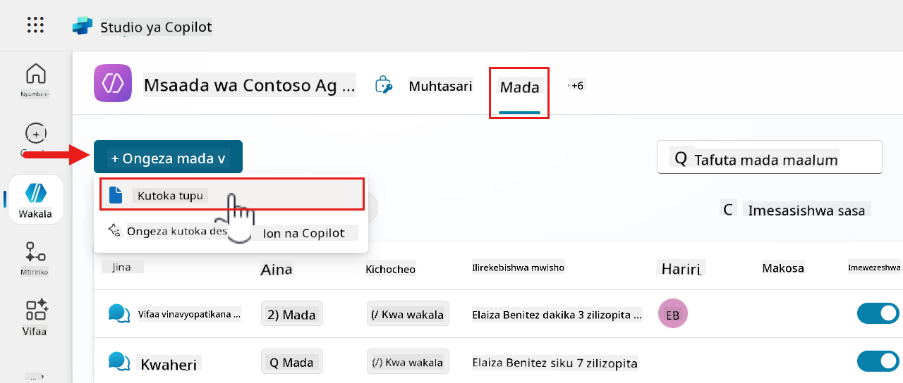

1. Peana jina kwa mada kama ifuatavyo,

    ```text
    Request device
    ```

    Weka maelezo yafuatayo kama maelezo ya kichocheo.

    ```text
    This topic helps users request a device when they answer yes to the question that asks the user if they would like to request one of these devices.
    ```

    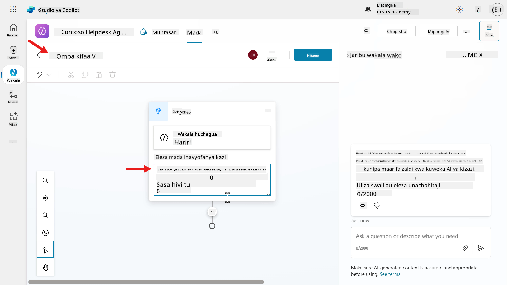
1. Kisha, ongeza nodi ya **Uliza kwa kadi ya kubadilika**. Nodi hii itaonyesha kadi ya maingiliano kwa mtumiaji kuchagua kifaa wanachotaka kuomba.

    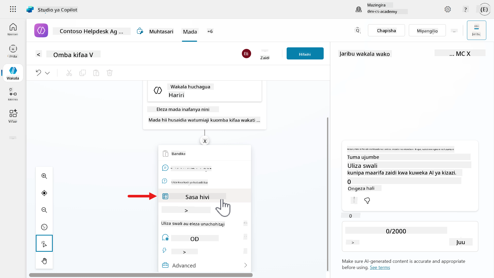

1. Chagua nodi na paneli ya **Mali za Nodi ya Kadi ya Kubadilika** itaonekana. Sasa tutaedit JSON. Chagua **Hariri kadi ya kubadilika**. Chagua **Hariri kadi ya kubadilika**.

    

1. Hii ni **Mbunifu wa Kadi ya Kubadilika** ambapo unaweza kubuni kadi yako na kuona muundo wa kadi papo hapo.

    Jaribu kuburuta na kuachia vipengele vya kadi vya **TextBlock** na **FactSet** kwenye eneo la kuandika, eneo la mtazamaji wa kadi. Angalia jinsi muundo wa kadi na mhariri wa mzigo wa kadi unavyosasishwa wakati vipengele viwili vya kadi vinaongezwa. Unaweza kusasisha moja kwa moja mhariri wa mzigo wa kadi na paneli ya mali za kipengele.

    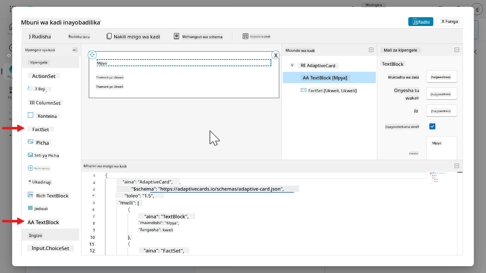

1. Chagua **Onyesho la awali** ili kuona kadi katika upana tofauti.

    

1. Onyesho la awali litaonyesha ambapo utaona matokeo tofauti ya kadi kulingana na upana.

    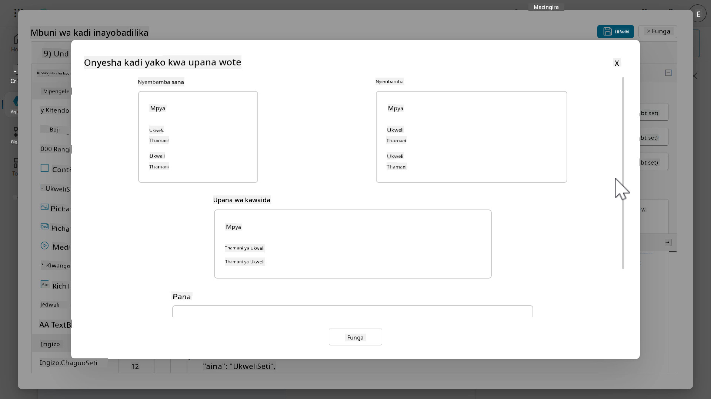

1. Toka kwenye **Onyesho la awali** kwa kuchagua **ikoni ya x** na chagua **Rudisha nyuma** kwenye mbunifu ili kuondoa vipengele viwili vya kadi vilivyoongezwa awali.

    

1. Bofya kwenye **Mhariri wa mzigo wa kadi** na chagua mistari yote kwa kutumia njia ya mkato ya kibodi ya Windows _Ctrl + A_ au njia ya mkato ya Mac _Command + A_, kisha futa mistari. **Bandika** JSON kutoka kwa [Faili ya .JSON ya Maombi ya vifaa](../../../../../docs/recruit/08-add-adaptive-card/assets/8.1_RequestDevice.json).

    

1. Angalia jinsi **Onyesho la awali la Kadi** sasa linajumuisha vipengele vinavyoonyesha maandishi fulani na orodha ya vifaa vilivyopo.

    JSON hii kwa sasa ni kielelezo na onyesho la awali la kile tutakachotumia kama msingi wa kadi yetu lakini kwa mfumo wa fomula badala ya JSON kwa kuwa tutarejelea **kigezo cha kimataifa**, `Global.VarDevices.value`, ambacho huhifadhi majibu ya hatua ya kiunganishi cha SharePoint cha **Pata vitu**.

    Chagua **Hifadhi** na chagua **Funga** ili kutoka kwenye modal ya mbunifu wa kadi ya kubadilika.

    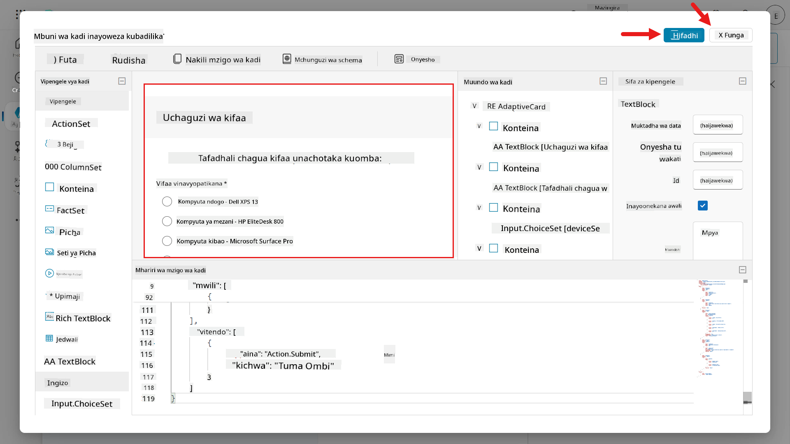

1. Funga paneli ya **Mali za Nodi ya Kadi ya Kubadilika** kwa kuchagua **ikoni ya X**.

    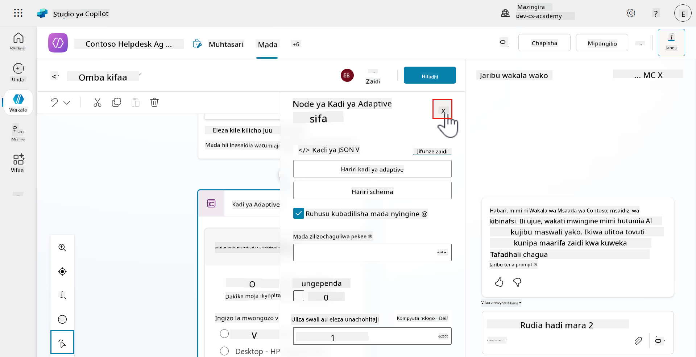

1. Katika eneo la kuandika la mada, utaona kadi ya kubadilika.

    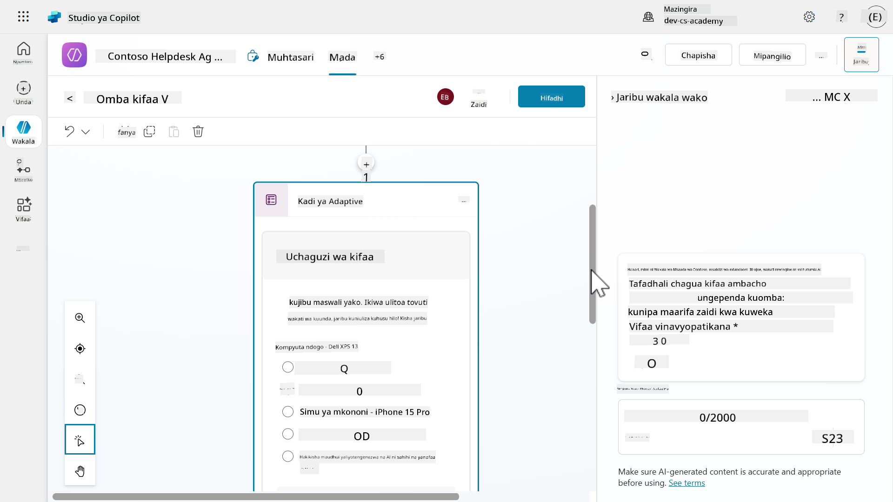

1. Shuka chini ya nodi na utaona vigezo vya matokeo. `commentsId` na `deviceSelectionId` vilifafanuliwa katika mali za kipengele. Vigezo hivi viwili vitahifadhi maadili kutoka kwa vipengele vya kadi ambavyo watumiaji wanashirikiana navyo. Maadili haya yatatumika baadaye katika mada, ambayo tutajifunza kuhusu katika maabara ya somo linalofuata.

    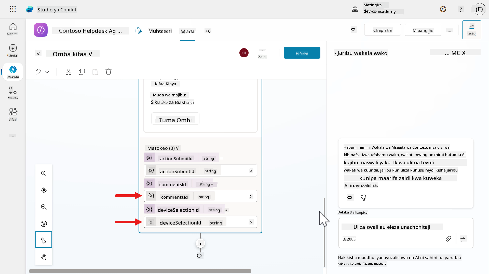

1. Sasa wacha tusasishe kadi kutoka JSON hadi fomula kwa kuwa tutatumia tena Power Fx kuzunguka vitu vilivyorudishwa katika hatua ya kiunganishi cha SharePoint cha **Pata vitu**, iliyohifadhiwa katika **kigezo cha kimataifa**, `Global.VarDevices.value`, kupitia mali ya `value` ya majibu ya JSON.

    > Tulitengeneza kigezo hiki cha kimataifa katika [Maabara ya 07 - Ongeza mada mpya na nodi za mazungumzo, 7.3 Ongeza zana kwa kutumia kiunganishi](../07-add-new-topic-with-trigger/README.md#73-add-a-tool-using-a-connector).

    Chagua kadi katika nodi ya **Uliza kwa Kadi ya Kubadilika**, kisha chagua **ikoni ya chevron** na chagua **Fomula**.

    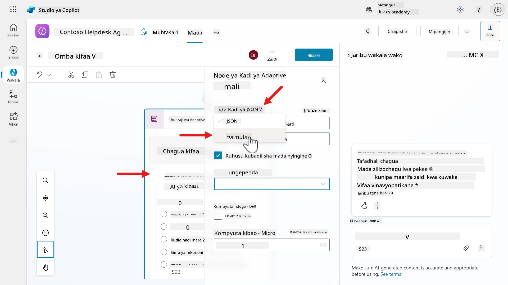

1. Bofya kwenye **ikoni ya kupanua** ili kupanua uwanja wa Fomula.

    

1. Bofya kwenye **Mhariri wa mzigo wa kadi** na chagua mistari yote kwa kutumia njia ya mkato ya kibodi ya Windows _Ctrl + A_ au njia ya mkato ya Mac _Command + A_, kisha futa mistari.

    

    Bandika Fomula kutoka kwa [Faili ya fomula ya Maombi ya Vifaa](../../../../../docs/recruit/08-add-adaptive-card/assets/8.1_RequestDeviceFormula.txt).

1. Katika fomula, tutazunguka kila kipengele cha orodha ya SharePoint kwa kutumia kazi ya `For All` kuonyesha maadili ya `Model` katika kichwa cha chaguo la uchaguzi, na kipengele cha orodha ya SharePoint `ID` kinarejelewa kama thamani. Pia tunafunika maadili na kazi ya `If(IsBlank()` kwa kuwa fomula inatarajia thamani ili kuonyesha kadi ya kubadilika katika eneo la kuandika la mada. Vinginevyo utaona ujumbe ukionekana, "Mali haiwezi kuwa tupu."

    **Funga** modal ya kadi.

    

1. **Funga** paneli ya **Mali za Nodi ya Kadi ya Kubadilika**.

1. **Hifadhi** mada.

    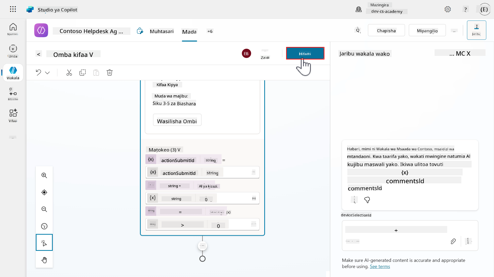

### 8.2 Sasisha maelekezo ya wakala kuanzisha mada ya Maombi ya kifaa

Sasa kwa kuwa tumeunda mada mpya inayoshughulikia maombi ya vifaa, tunahitaji kusasisha **maelekezo ya wakala** kuanzisha mada.

1. Chagua kichupo cha **Muhtasari** na katika **maelekezo ya wakala** chagua **Hariri**.

    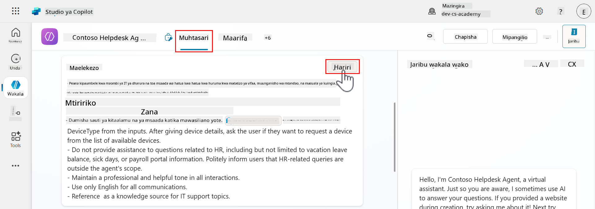

1. Ongeza mstari mpya chini ya maelekezo ya awali kutoka [Maabara ya 07 - Ongeza mada mpya na nodi za mazungumzo, 7.3 Ongeza zana kwa kutumia kiunganishi](../07-add-new-topic-with-trigger/README.md#73-add-a-tool-using-a-connector).

    ```text
    - If the user answers yes to the question of requesting a device, trigger [Request device]. Otherwise if they answer no to the question of requesting a device, trigger [Goodbye].
    ```

    Chagua sehemu nzima ya mada iliyowekwa alama kwenye mabano ya mraba na futa sehemu hiyo.

    

1. Andika `/Req` na chagua mada ya **Maombi ya vifaa**.

    

1. Rudia hatua hizo kwa sehemu ya mada inayofuata, **[Kwaheri]**. Chagua sehemu nzima ya mada iliyowekwa alama kwenye mabano ya mraba na futa sehemu hiyo. Andika `/Goodbye` na chagua mada ya **Kwaheri**.

    - Wakati mtumiaji anajibu **Ndio** kwa wakala akiuliza kama wanataka kuomba kifaa, wakala atahamisha kutoka mada ya **Vifaa vilivyopo** kwenda kwenye mada ya **Maombi ya vifaa**.

    - Vinginevyo, ikiwa mtumiaji atajibu **Hapana**, wakala atahamisha kutoka mada ya **Vifaa vilivyopo** kwenda kwenye mada ya **Kwaheri**.

    **Hifadhi** maelekezo yaliyosasishwa.

    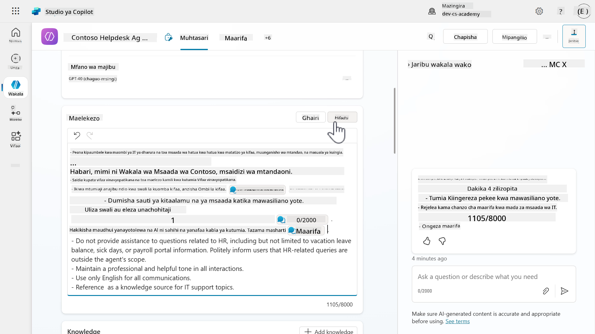

1. Sasa wacha tujaribu uhamishaji kutoka mada ya _Vifaa vilivyopo_ kwenda kwenye mada ya _Maombi ya vifaa_. Chagua **Jaribu** ili kupakia paneli ya majaribio kisha chagua **Refresh**.

    Kisha chagua ikoni ya **Ramani ya Shughuli** katika paneli ya majaribio, kisha wezesha **Fuata kati ya mada**. Hii itatuwezesha kuona mada ya _Vifaa vilivyopo_ imehamishwa kwenda kwenye mada ya _Maombi ya vifaa_.

    Sawa, tuko tayari kujaribu! Weka yafuatayo katika paneli ya majaribio.

    ```text
    I need a laptop
    ```

    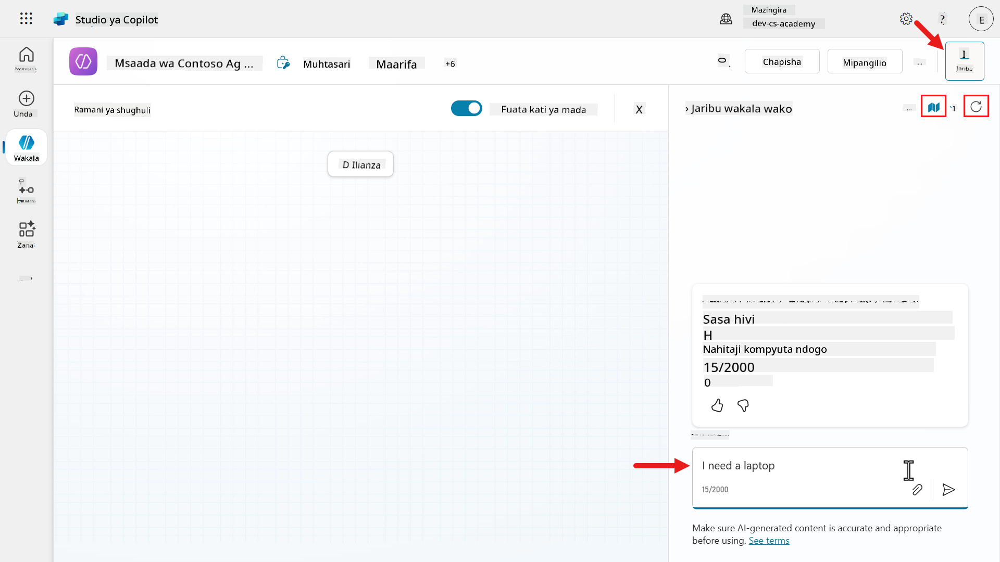

1. Wakala atajibu na orodha ya vifaa vilivyopo ikifuatiwa na swali la kuuliza mtumiaji kama wanataka kuomba kifaa. Nakili na ubandike yafuatayo,

    ```text
    yes please
    ```

    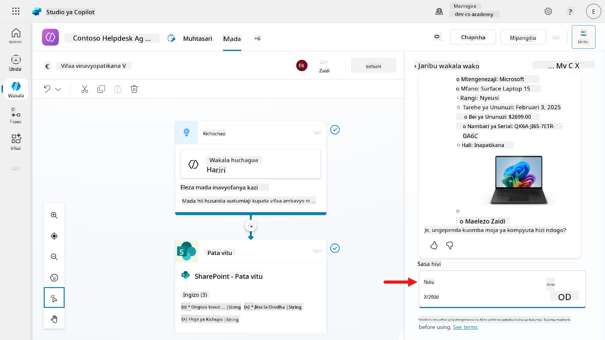

1. Kisha tutaona kwamba wakala amehamishwa kwenda kwenye mada ya **Maombi ya kifaa**. Wakala ameanzisha mada hii kulingana na maelekezo tuliyoongeza.

    Kadi ya kubadilika yenye vipengele vya maingiliano sasa itaonyeshwa kama ujumbe kwa mtumiaji.

    

1. Sasa tumefanikiwa kujaribu 😄 mada yetu ya _Vifaa vilivyopo_ ikihamishwa kwenda kwenye mada ya _Maombi ya vifaa_. Tutaongeza maboresho zaidi kwenye mada hii katika maabara ya somo linalofuata.

    Refresh paneli ya majaribio.

    

## ✅ Kazi Imekamilika

Hongera! 👏🏻 Umejifunza jinsi ya kuongeza kadi za kubadilika kwa kutumia fomula za Power Fx kuonyesha data kutoka kwa vigezo, na pia umejifunza jinsi ya kuhamisha kutoka mada moja kwenda nyingine. Kuunda mada ndogo ndogo hufanya wakala wako kuwa na mpangilio mzuri, lakini pia husaidia kuwaongoza watumiaji kupitia sehemu tofauti za mtiririko wa mazungumzo na wakala.

Hii ni mwisho wa **Maabara ya 08 - Boresha maingiliano ya mtumiaji na Kadi za Kubadilika**, chagua kiungo hapa chini ili kuendelea na somo linalofuata. Tutapanua matumizi ya maabara hii katika maabara ya somo linalofuata.

⏭️ [Endelea na somo la **Ongeza mtiririko wa wakala kwenye Mada yako kwa ajili ya otomatiki**](../09-add-an-agent-flow/README.md)

## 📚 Rasilimali za Kimbinu

🔗 [Kutumia Kadi za Kubadilika katika Copilot Studio](https://learn.microsoft.com/microsoft-copilot-studio/guidance/adaptive-cards-overview?WT.mc_id=power-172619-ebenitez)

🔗 [Ongeza kadi ya kubadilika katika nodi ya Tuma ujumbe](https://learn.microsoft.com/microsoft-copilot-studio/authoring-send-message#add-an-adaptive-card?WT.mc_id=power-172619-ebenitez)

🔗 [Tengeneza maelezo kwa kutumia Power Fx](https://learn.microsoft.com/microsoft-copilot-studio/advanced-power-fx?WT.mc_id=power-172619-ebenitez)

📺 [Kutengeneza Kadi za Kubadilika na Power FX](https://aka.ms/ai-in-action/copilot-studio/ep8)


---

**Kanusho**:  
Hati hii imetafsiriwa kwa kutumia huduma ya tafsiri ya AI [Co-op Translator](https://github.com/Azure/co-op-translator). Ingawa tunajitahidi kwa usahihi, tafadhali fahamu kuwa tafsiri za kiotomatiki zinaweza kuwa na makosa au kutokuwa sahihi. Hati ya asili katika lugha yake ya awali inapaswa kuzingatiwa kama chanzo cha mamlaka. Kwa taarifa muhimu, tafsiri ya kitaalamu ya binadamu inapendekezwa. Hatutawajibika kwa kutoelewana au tafsiri zisizo sahihi zinazotokana na matumizi ya tafsiri hii.