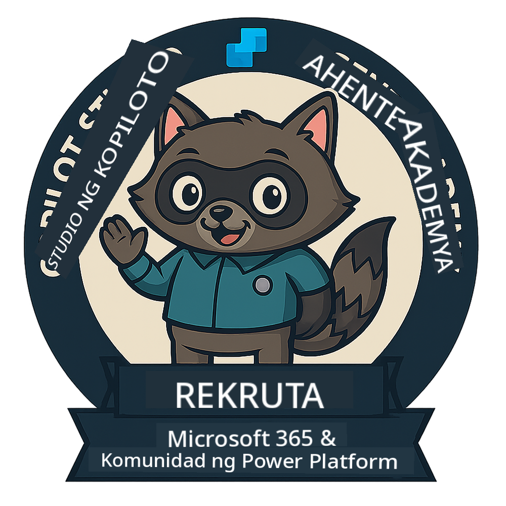
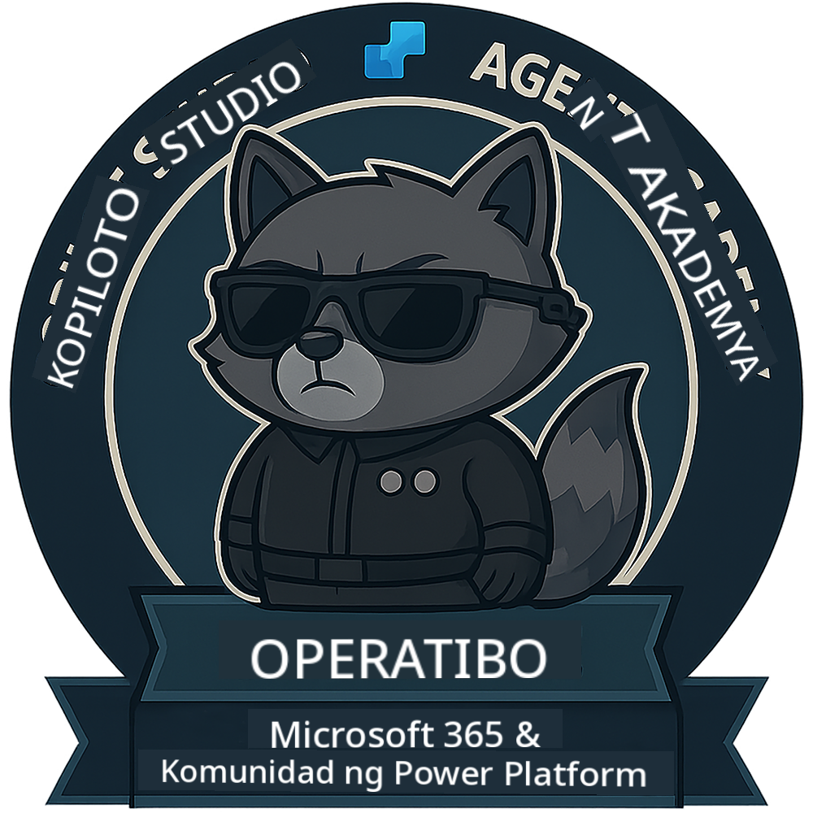

<!--
CO_OP_TRANSLATOR_METADATA:
{
  "original_hash": "15e57e059ce7689d602d7853187235cd",
  "translation_date": "2025-10-22T18:46:56+00:00",
  "source_file": "docs/index.md",
  "language_code": "tl"
}
-->
---
hide:
- navigation
---

# Copilot Studio Agent Academy

**Maligayang pagdating sa Copilot Studio Agent Academy.**  

Ang iyong misyon—kung pipiliin mong tanggapin ito—ay ang pag-master sa sining ng paggawa ng mga agent gamit ang **Microsoft Copilot Studio**.

Ang hands-on training na ito ang iyong simula sa **mundo ng mga agent**: mula sa grounded prompts hanggang sa Adaptive Cards at agent flows, matututo kang gumawa, mag-scale, at mag-deploy ng mga intelligent agent gamit ang mga tunay na tools at use cases.

---

## 🏅 Pag-usad ng Ranggo

Ang **Copilot Studio Agent Academy** ay isang multi-phase na programa ng pagsasanay na dinisenyo upang palawakin ang iyong kakayahan sa tatlong ranggo ng agent. Ang bawat antas ay may kasamang badge at tumataas na responsibilidad:

| Ranggo           | Antas | Visual |
|------------------|:-----:|--------|
| 🟢 **Recruit**  [🚀 Magsimula](https://aka.ms/agent-academy-recruit){ .md-button .md-button--primary }     | •     | { width="300" }     |
| 🔵 **Operative** (Malapit Na)   | ••    | { width="300" } |
| 🟡 **Commander** (Malapit Na)    | •••   | { width="300" } |

Ang bawat antas ay nagtatayo sa naunang antas. Tapusin ang iyong misyon bilang Recruit, at abangan ang susunod na antas upang mapalawak ang iyong mga kakayahan bilang agent.

---

## 🎒 Iba Pang Kurso

Tingnan ang iba pang mga kurso upang ipagpatuloy ang pag-aaral tungkol sa AI at Agents:

- [Microsoft Copilot Studio <3 MCP Lab](https://aka.ms/mcsmcplab)
- [Copilot Developer Camp](https://microsoft.github.io/copilot-camp/)
- [AI Agents for Beginners](https://microsoft.github.io/ai-agents-for-beginners/)
- [Model Context Protocol (MCP) For Beginners](https://github.com/microsoft/mcp-for-beginners)

---

## 🚑 Mga Isyu

Lubos naming pinahahalagahan ang inyong feedback! Mangyaring gamitin ang [listahan ng mga isyu](https://github.com/microsoft/agent-academy/issues) upang ibahagi ang inyong mga komento at isyu. Salamat!

---

## 📜 Code of Conduct

Ang proyektong ito ay nagpatibay ng [Microsoft Open Source Code of Conduct](https://opensource.microsoft.com/codeofconduct/).

!!! info "Mga Resources:"

    - [Microsoft Open Source Code of Conduct](https://opensource.microsoft.com/codeofconduct/)
    - [Microsoft Code of Conduct FAQ](https://opensource.microsoft.com/codeofconduct/faq/)
    - Makipag-ugnayan sa [opencode@microsoft.com](mailto:opencode@microsoft.com) para sa mga tanong o alalahanin

---

[⭐️ I-star ang aming repo](https://github.com/microsoft/agent-academy){ .md-button .md-button--primary }

<!-- markdownlint-disable-next-line MD033 -->

---

**Paunawa**:  
Ang dokumentong ito ay isinalin gamit ang AI translation service na [Co-op Translator](https://github.com/Azure/co-op-translator). Bagamat sinisikap naming maging tumpak, pakatandaan na ang mga awtomatikong pagsasalin ay maaaring maglaman ng mga pagkakamali o hindi pagkakatugma. Ang orihinal na dokumento sa kanyang katutubong wika ang dapat ituring na opisyal na sanggunian. Para sa mahalagang impormasyon, inirerekomenda ang propesyonal na pagsasalin ng tao. Hindi kami mananagot sa anumang hindi pagkakaunawaan o maling interpretasyon na dulot ng paggamit ng pagsasaling ito.