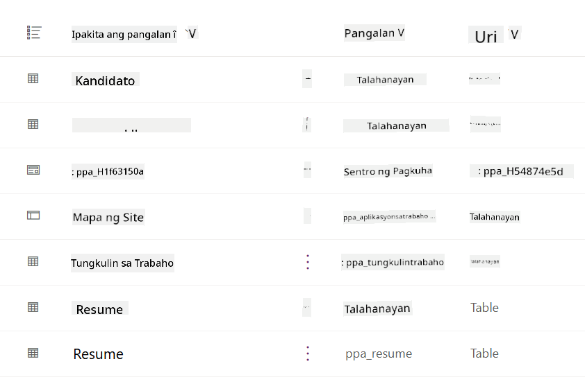
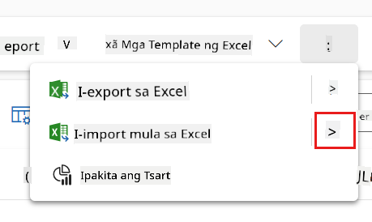
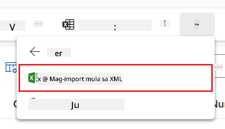
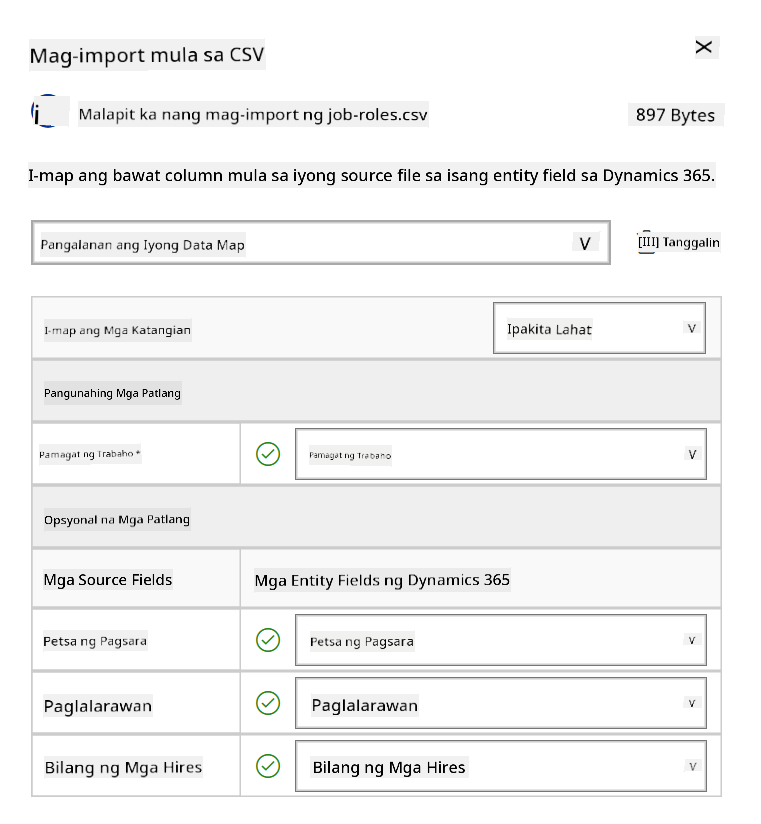
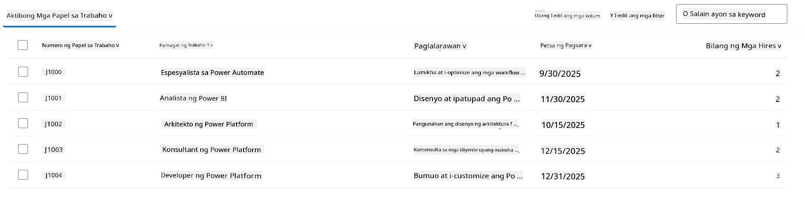
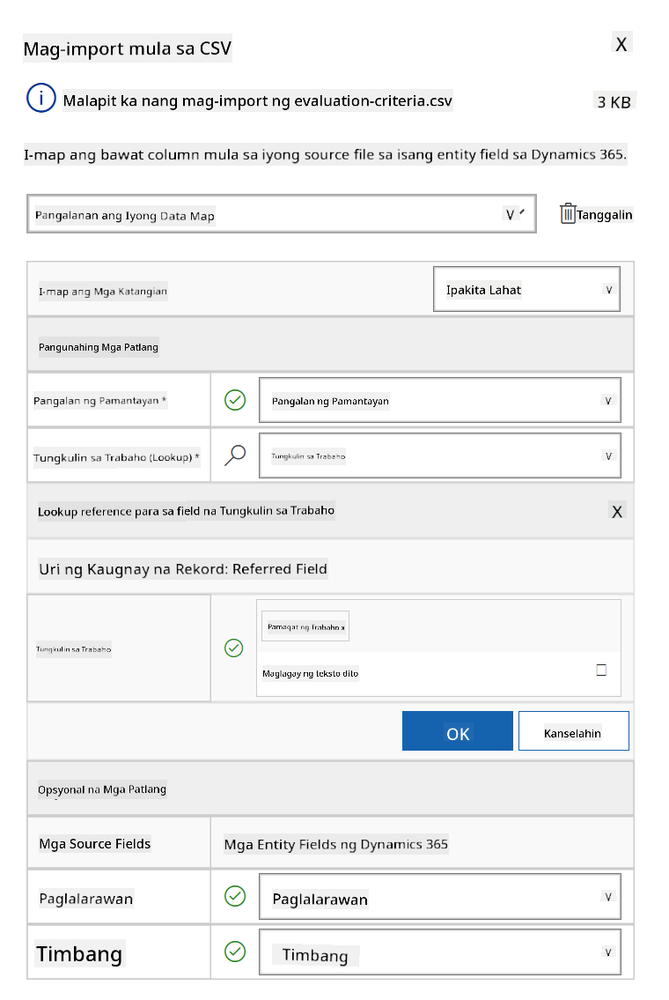
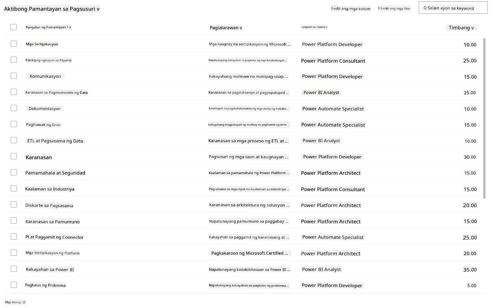

<!--
CO_OP_TRANSLATOR_METADATA:
{
  "original_hash": "2620cf9eaf09a3fc6be7fa31a3a62956",
  "translation_date": "2025-10-22T19:09:41+00:00",
  "source_file": "docs/operative-preview/01-get-started/README.md",
  "language_code": "tl"
}
-->
# 🚨 Misyon 01: Magsimula sa Hiring Agent

--8<-- "disclaimer.md"

## 🕵️‍♂️ CODENAME: `OPERATION TALENT SCOUT`

> **⏱️ Oras ng Operasyon:** `~45 minuto`

## 🎯 Misyon Brief

Maligayang pagdating, Ahente. Ang iyong unang assignment ay **Operation Talent Scout** - pagtatatag ng pundasyon para sa isang AI-powered recruitment system na magbabago kung paano natutukoy at nahihire ng mga organisasyon ang pinakamahusay na talento.

Ang iyong misyon, kung pipiliin mong tanggapin ito, ay i-deploy at i-configure ang isang komprehensibong hiring management system gamit ang Microsoft Copilot Studio. Mag-iimport ka ng isang pre-built na solusyon na naglalaman ng lahat ng kinakailangang data structures, pagkatapos ay gagawa ka ng iyong unang AI agent - ang **Hiring Agent** - na magsisilbing pangunahing tagapag-ayos para sa lahat ng hinaharap na recruitment operations.

Ang paunang deployment na ito ang magtatatag ng command center na iyong palalawakin sa buong Agent Academy Operative program. Isipin ito bilang iyong base ng operasyon - ang pundasyon kung saan mo itatayo ang isang buong network ng mga specialized agents sa mga susunod na misyon.

---

## 🔎 Mga Layunin

Sa pagtatapos ng misyon na ito, ikaw ay:

- **Pag-unawa sa Scenario**: Makakakuha ng komprehensibong kaalaman sa mga hamon at solusyon sa hiring automation
- **Pag-deploy ng Solusyon**: Matagumpay na mai-import at ma-configure ang mga pangunahing aspeto ng isang hiring management system
- **Paglikha ng Ahente**: Makakagawa ng hiring agent na simula ng scenario na iyong itatayo bilang isang Agent Academy Operative

---

## 🔍 Mga Kinakailangan

Bago simulan ang misyon na ito, tiyakin na mayroon kang:

- Lisensya sa Copilot Studio
- Access sa isang Microsoft Power Platform environment
- Mga administrative permissions para makagawa ng mga solusyon at ahente

---

## 🏢 Pag-unawa sa Hiring Automation Scenario

Ang scenario na ito ay nagpapakita kung paano magagamit ng isang kumpanya ang Microsoft Copilot Studio upang mapabuti at ma-automate ang kanilang hiring process. Ipinapakilala nito ang isang sistema ng mga ahente na nagtutulungan upang magawa ang mga gawain tulad ng pagsusuri ng mga resume, pagrekomenda ng mga job roles, paghahanda ng mga materyales para sa interview, at pagsusuri ng mga kandidato.

### Halaga sa Negosyo

Ang solusyon ay tumutulong sa mga HR team na makatipid ng oras at makagawa ng mas mahusay na desisyon sa pamamagitan ng:

- Awtomatikong pagproseso ng mga resume na natatanggap sa pamamagitan ng email.
- Pagmumungkahi ng angkop na job roles batay sa mga profile ng kandidato.
- Paglikha ng mga job applications at interview guides na naaayon sa bawat kandidato.
- Pagtiyak ng patas at compliant na hiring practices sa pamamagitan ng built-in na safety at moderation features.
- Pagkolekta ng feedback upang mapabuti ang solusyon.

### Paano Ito Gumagana

- Ang central **Hiring Agent** ang nagko-coordinate ng proseso at nag-iimbak ng data sa Microsoft Dataverse.
- Ang **Application Intake Agent** ang nagbabasa ng mga resume at gumagawa ng mga job applications.
- Ang **Interview Prep Agent** ang bumubuo ng mga tanong sa interview at mga dokumento batay sa background ng kandidato.
- Ang sistema ay maaaring i-publish sa isang demo website, na nagbibigay-daan sa mga stakeholder na makipag-ugnayan dito.

Ang scenario na ito ay perpekto para sa mga organisasyong naghahanap na gawing moderno ang kanilang recruitment workflows gamit ang AI-powered automation, habang pinapanatili ang transparency, fairness, at efficiency.

---

## 🧪 Lab: I-setup ang Hiring Agent

Sa hands-on lab na ito, itatatag mo ang pundasyon para sa iyong hiring automation system. Magsisimula ka sa pag-import ng isang pre-configured na solusyon na naglalaman ng lahat ng kinakailangang Dataverse tables at data structure para sa pamamahala ng mga kandidato, job positions, at hiring workflows. Susunod, pupunuin mo ang mga table na ito ng sample data na susuporta sa iyong pag-aaral sa buong module at magbibigay ng realistic na mga scenario para sa testing. Sa wakas, gagawa ka ng Hiring Agent sa Copilot Studio, na magse-setup ng basic conversational interface na magsisilbing pundasyon para sa lahat ng iba pang features na idaragdag mo sa mga susunod na misyon.

### 🧪 Lab 1.1: Import solution

1. Pumunta sa **[Copilot Studio](https://copilotstudio.microsoft.com)**
1. Piliin ang **...** sa kaliwang navigation at piliin ang **Solutions**
1. Piliin ang **Import Solution** button sa itaas
1. **[I-download](https://raw.githubusercontent.com/microsoft/agent-academy/refs/heads/main/docs/operative-preview/01-get-started/assets/Operative_1_0_0_0.zip)** ang prepared solution
1. Piliin ang **Browse** at piliin ang na-download na solution mula sa nakaraang hakbang
1. Piliin ang **Next**
1. Piliin ang **Import**

!!! success
    Kapag matagumpay, makakakita ka ng berdeng notification bar na may sumusunod na mensahe kapag tapos na:  
    "Solution "Operative" imported successfully."

Kapag na-import na ang solution, tingnan ang iyong na-import sa pamamagitan ng pagpili sa display name ng solution (`Operative`).



Ang mga sumusunod na components ang na-import:

| Display Name | Uri | Deskripsyon |
|-------------|------|-------------|
| Candidate | Table | Impormasyon ng kandidato |
| Evaluation Criteria | Table | Mga pamantayan sa pagsusuri para sa role |
| Hiring Hub | Model-Driven App | Application para sa pamamahala ng hiring process |
| Hiring Hub | Site Map | Navigation structure para sa Hiring Hub app |
| Job Application | Table | Mga job applications |
| Job Role | Table | Mga job roles |
| Resume | Table | Mga resume ng mga kandidato |

Bilang huling gawain para sa lab na ito, piliin ang **Publish all customizations** button sa itaas ng pahina.

### 🧪 Lab 1.2: Import sample data

Sa lab na ito, magdadagdag ka ng sample data sa ilang mga table na iyong na-import sa lab 1.1.

#### I-download ang mga file para i-import

1. **[I-download](https://raw.githubusercontent.com/microsoft/agent-academy/refs/heads/main/docs/operative-preview/01-get-started/assets/evaluation-criteria.csv)** ang CSV-file na may evaluation criteria
1. **[I-download](https://raw.githubusercontent.com/microsoft/agent-academy/refs/heads/main/docs/operative-preview/01-get-started/assets/job-roles.csv)** ang CSV-file na may job roles

#### I-import ang Job Role sample data

1. Bumalik sa solution na iyong na-import sa nakaraang lab
1. Piliin ang **Hiring Hub** Model-Driven App sa pamamagitan ng pagpili sa checkmark sa harap ng row
1. Piliin ang **Play** button sa itaas

    !!! warning
        Maaaring kailanganin mong mag-login muli. Siguraduhing gawin ito. Pagkatapos nito, makikita mo ang Hiring Hub app.

1. Piliin ang **Job Roles** sa kaliwang navigation
1. Piliin ang **More** icon (tatlong tuldok na magkakasunod) sa command bar
1. Piliin ang **kanang arrow** sa tabi ng *Import from Excel*

    

1. Piliin ang **Import from CSV**

    

1. Piliin ang **Choose File** button, piliin ang **job-roles.csv** file na iyong na-download at pagkatapos ay piliin ang **Open**
1. Piliin ang **Next**
1. Iwanan ang susunod na hakbang na gaya ng dati at piliin ang **Review Mapping**

    

1. Siguraduhing tama ang mapping at piliin ang **Finish Import**

    !!! info
        Magsisimula ito ng import at maaari mong subaybayan ang progreso o tapusin ang proseso kaagad sa pamamagitan ng pagpili sa **Done**

1. Piliin ang **Done**

Maaaring tumagal ito ng kaunting oras, ngunit maaari mong pindutin ang **Refresh** button upang makita kung matagumpay ang import.



#### I-import ang Evaluation Criteria sample data

1. Piliin ang **Evaluation Criteria** sa kaliwang navigation
1. Piliin ang **More** icon (tatlong tuldok na magkakasunod) sa command bar
1. Piliin ang **kanang arrow** sa tabi ng *Import from Excel*

    

1. Piliin ang **Import from CSV**

    

1. Piliin ang **Choose File** button, piliin ang **evaluation-criteria.csv** file na iyong na-download at pagkatapos ay piliin ang **Open**
1. Piliin ang **Next**
1. Iwanan ang susunod na hakbang na gaya ng dati at piliin ang **Review Mapping**

    

1. Ngayon kailangan nating gumawa ng kaunting trabaho para sa mapping. Piliin ang magnifying glass(🔎 icon) sa tabi ng Job Role field
1. Siguraduhing **Job Title** ang napili dito, at kung hindi - idagdag ito
1. Piliin ang **OK**
1. Siguraduhing tama rin ang natitirang mapping at piliin ang **Finish Import**

    !!! info
        Magsisimula ulit ito ng import at maaari mong subaybayan ang progreso o tapusin ang proseso kaagad sa pamamagitan ng pagpili sa **Done**

1. Piliin ang **Done**

Maaaring tumagal ito ng kaunting oras, ngunit maaari mong pindutin ang **Refresh** button upang makita kung matagumpay ang import.



### 🧪 Lab 1.3: Gumawa ng hiring agent

Ngayon tapos ka na sa setup ng mga kinakailangan, oras na para sa aktwal na trabaho! Magdagdag muna tayo ng Hiring Agent!

1. Pumunta sa **[Copilot Studio](https://copilotstudio.microsoft.com)** at siguraduhing nasa parehong environment ka kung saan mo in-import ang solution at data
1. Piliin ang **Agents** sa kaliwang navigation
1. Piliin ang **New Agent**
1. Piliin ang **Configure**
1. Para sa **Name**, ilagay:

    ```text
    Hiring Agent
    ```

1. Para sa **Description**, ilagay:

    ```text
    Central orchestrator for all hiring activities
    ```

1. Piliin ang **...** sa tabi ng *Create* button sa kanang itaas na sulok
1. Piliin ang **Update advanced settings**
1. Bilang **Solution**, piliin ang `Operative`
1. Piliin ang **Update**
1. Piliin ang **Create** sa kanang itaas na sulok

Ito ay lilikha ng Hiring Agent para sa iyo, na gagamitin mo sa buong Operative course.

---

## 🎉 Misyon Kumpleto

Natapos na ang Misyon 01! Ikaw ngayon ay may mastered na mga sumusunod na kasanayan:

✅ **Pag-unawa sa Scenario**: Komprehensibong kaalaman sa mga hamon at solusyon sa hiring automation  
✅ **Pag-deploy ng Solusyon**: Matagumpay na na-import at na-configure ang mga pangunahing aspeto ng isang hiring management system  
✅ **Paglikha ng Ahente**: Nakagawa ng hiring agent na simula ng scenario na iyong itatayo bilang isang Agent Academy Operative  

Susunod na ang [Misyon 02](../02-multi-agent/README.md): Gawing multi-agent ready ang iyong ahente gamit ang mga konektadong ahente.

---

## 📚 Mga Taktikal na Resources

📖 [Microsoft Copilot Studio - Gumawa ng ahente](https://learn.microsoft.com/microsoft-copilot-studio/authoring-first-bot)  
📖 [Microsoft Dataverse Documentation](https://learn.microsoft.com/power-apps/maker/data-platform)

---

**Paunawa**:  
Ang dokumentong ito ay isinalin gamit ang AI translation service na [Co-op Translator](https://github.com/Azure/co-op-translator). Bagama't sinisikap naming maging tumpak, mangyaring tandaan na ang mga awtomatikong pagsasalin ay maaaring maglaman ng mga pagkakamali o hindi pagkakatugma. Ang orihinal na dokumento sa kanyang katutubong wika ang dapat ituring na mapagkakatiwalaang pinagmulan. Para sa mahalagang impormasyon, inirerekomenda ang propesyonal na pagsasalin ng tao. Hindi kami mananagot sa anumang hindi pagkakaunawaan o maling interpretasyon na dulot ng paggamit ng pagsasaling ito.