<!--
CO_OP_TRANSLATOR_METADATA:
{
  "original_hash": "4fb913dfc3bbc71506dd3602c4b8e6ed",
  "translation_date": "2025-10-22T18:52:57+00:00",
  "source_file": "docs/operative-preview/02-multi-agent/README.md",
  "language_code": "tl"
}
-->
# 🚨 Misyon 02: Mga Konektadong Ahente

--8<-- "disclaimer.md"

## 🕵️‍♂️ CODENAME: `OPERATION SYMPHONY`

> **⏱️ Oras ng Operasyon:** `~45 minuto`

## 🎯 Maikling Misyon

Maligayang pagbabalik, Ahente. Sa Misyon 01, binuo mo ang iyong pangunahing Hiring Agent - isang matibay na pundasyon para sa pamamahala ng mga recruitment workflow. Ngunit ang isang ahente ay may limitasyon.

Ang iyong tungkulin, kung pipiliin mong tanggapin ito, ay ang **Operation Symphony** - ang pag-transform ng iyong solong ahente sa isang **multi-agent system**: isang organisadong koponan ng mga espesyalistang ahente na nagtutulungan upang harapin ang mga masalimuot na hamon sa pagkuha ng empleyado. Isipin ito na parang isang orchestra kung saan ang bawat musikero ay may sariling bahagi na tumutugtog nang may perpektong harmoniya. Magdadagdag ka ng dalawang mahalagang espesyalista sa iyong umiiral na Hiring Agent: isang Application Intake Agent para awtomatikong magproseso ng mga resume, at isang Interview Prep Agent para gumawa ng komprehensibong materyales para sa panayam. Ang mga ahenteng ito ay magtutulungan nang maayos sa ilalim ng iyong pangunahing tagapag-ayos.

## 🔎 Mga Layunin

Sa misyon na ito, matutunan mo:

1. Kailan gagamit ng **child agents** kumpara sa **connected agents**
1. Paano magdisenyo ng **multi-agent architectures** na maaaring mag-scale  
1. Paglikha ng **child agents** para sa mga tiyak na gawain
1. Pagtaguyod ng **mga pattern ng komunikasyon** sa pagitan ng mga ahente
1. Pagbuo ng Application Intake Agent at Interview Prep Agent

## 🧠 Ano ang mga konektadong ahente?

Sa Copilot Studio, hindi ka limitado sa pagbuo ng solong, monolithic na ahente. Maaari kang lumikha ng **multi-agent systems** - mga network ng mga espesyalistang ahente na nagtutulungan upang pamahalaan ang mga masalimuot na workflow.

Isipin ito na parang isang tunay na organisasyon: sa halip na isang tao ang gumagawa ng lahat, mayroon kang mga espesyalista na mahusay sa mga tiyak na gawain at nagtutulungan kapag kinakailangan.

### Bakit mahalaga ang mga multi-agent systems

- **Scalability:** Ang bawat ahente ay maaaring i-develop, i-test, at i-maintain nang hiwalay ng iba't ibang koponan.  
- **Specialization:** Ang mga ahente ay maaaring mag-focus sa kanilang pinakamahusay na gawain. Halimbawa, isa para sa data processing, isa para sa user interaction, isa para sa decision-making.  
- **Flexibility:** Maaari mong ihalo at i-match ang mga ahente, gamitin muli ang mga ito sa iba't ibang proyekto, at paunlarin ang iyong sistema nang paunti-unti.  
- **Maintainability:** Ang mga pagbabago sa isang ahente ay hindi kinakailangang makaapekto sa iba, na ginagawang mas ligtas at mas madali ang mga update.

### Halimbawa sa totoong buhay: Proseso ng pagkuha ng empleyado

Isipin ang ating hiring workflow - maaaring magtulungan ang maraming ahente na may mga sumusunod na responsibilidad:

- **Resume intake** nangangailangan ng kakayahan sa pag-parse ng dokumento at pagkuha ng data
- **Scoring** kinabibilangan ng pagsusuri sa mga resume ng kandidato at pagtutugma sa mga kinakailangan sa trabaho
- **Interview preparation** nangangailangan ng malalim na pag-unawa sa angkop ng kandidato  
- **Candidate communication** nangangailangan ng kakayahan sa mahabagin na komunikasyon

Sa halip na bumuo ng isang napakalaking ahente na sinusubukang pamahalaan ang lahat ng iba't ibang kasanayan, maaari kang lumikha ng mga espesyalistang ahente para sa bawat lugar at i-orchestrate ang mga ito nang magkasama.

## 🔗 Child agents kumpara sa connected agents: Ang pangunahing pagkakaiba

Nag-aalok ang Copilot Studio ng dalawang paraan upang bumuo ng mga multi-agent systems, bawat isa ay may natatanging gamit:

### ↘️ Child agents

Ang mga child agents ay **magagaan na espesyalista** na naninirahan sa loob ng iyong pangunahing ahente. Isipin sila bilang mga espesyalistang koponan sa loob ng parehong departamento.

#### Mga teknikal na detalye

- Ang mga child agents ay naninirahan sa loob ng parent agent at may isang configuration page.
- Ang mga Tools at Knowledge ay **nakaimbak sa parent** agent, ngunit naka-configure upang maging "Available to" sa child agent.
- Ang mga child agents ay **nagbabahagi ng mga topics** ng kanilang parent agent. Ang mga topics ay maaaring i-refer ng mga child agent instructions.
- Ang mga child agents ay **hindi kailangang i-publish nang hiwalay** - awtomatikong available ang mga ito sa loob ng kanilang parent agent kapag nilikha. Ginagawa nitong mas madali ang testing dahil ang mga pagbabago sa parent at child agents ay maaaring gawin sa **parehong shared workspace**.

#### Gamitin ang child agents kapag

- Isang koponan ang namamahala sa buong solusyon
- Gusto mong lohikal na ayusin ang mga tools at knowledge sa mga sub-agents
- Hindi mo kailangan ng hiwalay na authentication o deployment para sa bawat ahente
- Ang mga ahente ay hindi ipo-publish nang hiwalay o gagamitin nang mag-isa
- Hindi mo kailangan gamitin muli ang mga ahente sa iba't ibang solusyon

**Halimbawa:** Isang IT helpdesk agent na may child agents para sa:

- Mga pamamaraan sa pag-reset ng password
- Pag-troubleshoot ng hardware  
- Mga gabay sa pag-install ng software

### 🔀 Connected agents

Ang mga connected agents ay **ganap na independiyenteng ahente** na maaaring makipagtulungan sa iyong pangunahing ahente. Isipin sila bilang mga hiwalay na departamento na nagtutulungan sa isang proyekto.

#### Mga teknikal na detalye

- Ang mga connected agents ay may **sariling topics** at conversation flows. Gumagana sila nang independiyente gamit ang kanilang sariling mga setting, logic, at deployment lifecycle.
- Ang mga connected agents ay **kailangang i-publish** bago sila maidagdag at magamit ng ibang mga ahente.
- Sa panahon ng testing, ang mga pagbabago sa connected agent ay kailangang i-publish bago magamit ng tumatawag na ahente.

#### Gamitin ang connected agents kapag

- Maraming koponan ang nagde-develop at nagme-maintain ng iba't ibang ahente nang independiyente
- Ang mga ahente ay nangangailangan ng sariling mga setting, authentication, at deployment channels
- Gusto mong i-publish at i-maintain ang mga ahente nang hiwalay gamit ang independiyenteng application lifecycle management (ALM) para sa bawat ahente
- Ang mga ahente ay dapat magamit muli sa iba't ibang solusyon

**Halimbawa:** Isang customer service system na kumokonekta sa:

- Isang hiwalay na billing agent na pinapanatili ng finance team
- Isang hiwalay na technical support agent na pinapanatili ng product team
- Isang hiwalay na returns agent na pinapanatili ng operations team

!!! tip "Tip"
    Maaari mong ihalo ang parehong mga approach! Halimbawa, ang iyong pangunahing ahente ay maaaring kumonekta sa mga external agents mula sa ibang mga koponan habang mayroon ding sariling child agents para sa mga espesyalistang internal na gawain.

## 🎯 Mga pattern ng multi-agent architecture

Kapag nagdidisenyo ng mga multi-agent systems, ilang mga pattern ang lumilitaw batay sa kung paano nakikipag-ugnayan ang mga ahente:

| Pattern              | Paglalarawan                                                                 | Pinakamainam Para                                                      |
|----------------------|-----------------------------------------------------------------------------|---------------------------------------------------------------|
| **Hub and Spoke**    | Isang pangunahing orchestrator agent ang nagkokoordina sa maraming espesyalistang ahente. Ang orchestrator ang humahawak sa user interaction at nag-aasikaso ng mga gawain sa child o connected agents. | Masalimuot na workflow kung saan ang isang ahente ang nagkokoordina ng mga espesyalistang gawain |
| **Pipeline**         | Ang mga ahente ay nagpapasa ng trabaho nang sunod-sunod mula sa isa patungo sa susunod, bawat isa ay nagdadagdag ng halaga bago ipasa sa susunod na yugto. | Linear na proseso tulad ng application processing (intake → screening → interview → decision) |
| **Collaborative**    | Ang mga ahente ay nagtutulungan nang sabay-sabay sa iba't ibang aspeto ng parehong problema, nagbabahagi ng konteksto at resulta. | Masalimuot na pagsusuri na nangangailangan ng maraming pananaw o mga lugar ng kadalubhasaan |

!!! tip "Tip"
    Maaari ka ring magkaroon ng hybrid ng dalawa o higit pang mga pattern.

## 💬 Komunikasyon ng Ahente at Pagbabahagi ng Konteksto

Kapag nagtutulungan ang mga ahente, kailangan nilang magbahagi ng impormasyon nang epektibo. Narito kung paano ito gumagana sa Copilot Studio:

### Kasaysayan ng Pag-uusap

Sa default, kapag ang isang pangunahing ahente ay tumawag sa isang child o connected agent, maaari nitong ipasa ang **kasaysayan ng pag-uusap**. Binibigyan nito ang espesyalistang ahente ng buong konteksto tungkol sa kung ano ang pinag-uusapan ng user.

Maaari mong i-disable ito para sa seguridad o mga dahilan ng performance - halimbawa, kung ang espesyalistang ahente ay kailangan lamang kumpletuhin ang isang tiyak na gawain nang hindi kinakailangan ang buong konteksto ng pag-uusap. Magandang depensa ito laban sa **data leakage**.

### Mga Eksaktong Instruksyon

Ang iyong pangunahing ahente ay maaaring magbigay ng **mga tiyak na instruksyon** sa mga child o connected agents. Halimbawa: "I-proseso ang resume na ito at ibuod ang kanilang mga kasanayan para sa posisyon ng Senior Developer."

### Mga Return Values

Ang mga ahente ay maaaring magbalik ng structured na impormasyon sa tumatawag na ahente, na nagbibigay-daan sa pangunahing ahente na gamitin ang impormasyong iyon sa mga susunod na hakbang o ibahagi ito sa ibang mga ahente.

### Dataverse Integration

Para sa mas masalimuot na mga senaryo, ang mga ahente ay maaaring magbahagi ng impormasyon sa pamamagitan ng **Dataverse** o iba pang data stores, na nagbibigay-daan para sa persistent context sharing sa maraming interaksyon.

## ↘️ Child agent: Application Intake Agent

Simulan natin ang pagbuo ng ating multi-agent hiring system. Ang ating unang espesyalista ay ang **Application Intake Agent** - isang child agent na responsable sa pagproseso ng mga incoming resume at impormasyon ng kandidato.

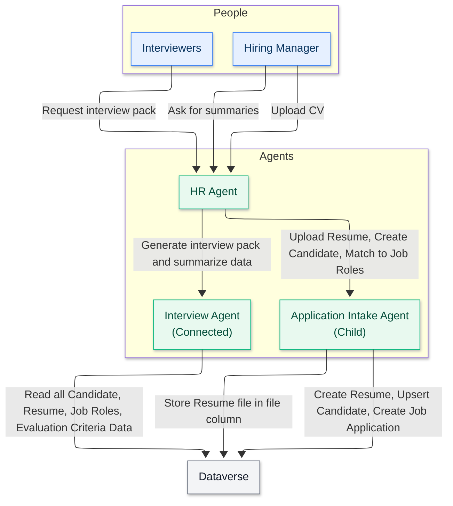
```mermaid
---
config:
  layout: elk
  look: neo
---
flowchart TB
 subgraph People["People"]
    direction TB
        HiringManager["Hiring Manager"]
        Interviewers["Interviewers"]
  end
 subgraph Agents["Agents"]
    direction LR
        ApplicationIntakeAgent["Application Intake Agent<br>(Child)"]
        InterviewAgent["Interview Agent<br>(Connected)"]
        HRAgent["HR Agent"]
  end
    HiringManager -- Upload CV --> HRAgent
    HRAgent -- Upload Resume, Create Candidate, Match to Job Roles --> ApplicationIntakeAgent
    ApplicationIntakeAgent -- Create Resume, Upsert Candidate, Create Job Application --> Dataverse["Dataverse"]
    ApplicationIntakeAgent -- Store Resume file in file column --> Dataverse
    HiringManager -- Ask for summaries --> HRAgent
    Interviewers -- Request interview pack --> HRAgent
    HRAgent -- Generate interview pack and summarize data --> InterviewAgent
    InterviewAgent -- Read all Candidate, Resume, Job Roles, Evaluation Criteria Data --> Dataverse
     HiringManager:::person
     Interviewers:::person
     ApplicationIntakeAgent:::agent
     InterviewAgent:::agent
     HRAgent:::agent
     Dataverse:::data
    classDef person fill:#e6f0ff,stroke:#3b82f6,color:#0b3660
    classDef agent fill:#e8f9ef,stroke:#10b981,color:#064e3b
    classDef data  fill:#f3f4f6,stroke:#6b7280,color:#111827
```

### 🤝 Mga Responsibilidad ng Application Intake Agent

- **I-parse ang nilalaman ng resume** mula sa mga PDF na ibinigay sa interactive chat (Sa isang susunod na misyon, matutunan mo kung paano awtomatikong magproseso ng mga resume).
- **Kumuha ng structured data** (pangalan, kasanayan, karanasan, edukasyon)
- **Itugma ang mga kandidato sa mga bukas na posisyon** batay sa kwalipikasyon at cover letter
- **I-store ang impormasyon ng kandidato** sa Dataverse para sa susunod na pagproseso
- **I-deduplicate ang mga aplikasyon** upang maiwasan ang paglikha ng parehong kandidato nang dalawang beses, itugma sa umiiral na mga record gamit ang email address na nakuha mula sa resume.

### ⭐ Bakit ito dapat maging isang child agent

Ang Application Intake Agent ay perpektong akma bilang isang child agent dahil:

- Ito ay espesyalista sa pagproseso ng dokumento at pagkuha ng data
- Hindi nito kailangan ng hiwalay na pag-publish  
- Bahagi ito ng ating kabuuang hiring solution na pinamamahalaan ng parehong koponan
- Nakatuon ito sa isang tiyak na trigger (bagong resume na natanggap) at ina-activate mula sa Hiring Agent.

## 🔀 Connected agent: Interview Prep Agent  

Ang ating pangalawang espesyalista ay ang **Interview Prep Agent** - isang connected agent na tumutulong sa paggawa ng komprehensibong materyales para sa panayam at pagsusuri sa mga sagot ng kandidato.

### 🤝 Mga Responsibilidad ng Interview Prep Agent

- **Gumawa ng interview packs** na may impormasyon tungkol sa kumpanya, mga kinakailangan sa posisyon, at mga pamantayan sa pagsusuri
- **Bumuo ng mga tanong sa panayam** na iniangkop sa mga tiyak na posisyon at background ng kandidato
- **Sumagot sa mga pangkalahatang tanong** tungkol sa mga posisyon sa trabaho at aplikasyon para sa komunikasyon sa mga stakeholder

### ⭐ Bakit ito dapat maging isang connected agent

Mas angkop ang Interview Prep Agent bilang isang connected agent dahil:

- Ang talent acquisition team ay maaaring gustong gamitin ito nang independiyente sa iba't ibang proseso ng pagkuha
- Kailangan nito ng sariling knowledge base ng mga pinakamahusay na kasanayan sa panayam at pamantayan sa pagsusuri
- Ang iba't ibang hiring managers ay maaaring gustong i-customize ang pag-uugali nito para sa kanilang mga koponan
- Maaari itong magamit muli para sa mga internal na posisyon, hindi lamang sa external hiring

## 🧪 Lab 2.1: Pagdaragdag ng Application Intake Agent

Handa ka na bang isagawa ang teorya? Idagdag natin ang ating unang child agent sa iyong umiiral na Hiring Agent.

### Mga Kinakailangan upang makumpleto ang misyon na ito

Kailangan mo ng **alinman sa**:

- **Natapos ang Misyon 01** at handa na ang iyong Hiring Agent, **O**
- **I-import ang Mission 02 starter solution** kung nagsisimula ka pa lang o kailangang makahabol. [I-download ang Mission 02 Starter Solution](https://aka.ms/agent-academy)

!!! note "Solution Import and Sample Data"
    Kung ginagamit mo ang starter solution, sumangguni sa [Mission 01](../01-get-started/README.md) para sa detalyadong mga tagubilin kung paano mag-import ng mga solusyon at sample data sa iyong environment.

### 2.1.1 Pag-setup ng Solusyon

1. Sa loob ng Copilot Studio, piliin ang ellipsis (...) sa ibaba ng Tools sa kaliwang navigation.
1. Piliin ang **Solutions**.  
    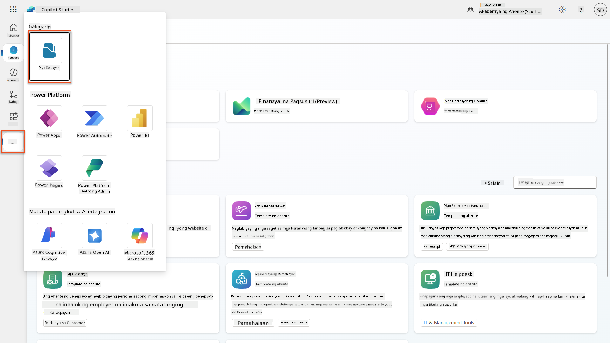
1. Hanapin ang iyong Operative solution, piliin ang **ellipsis (...)** sa tabi nito, at piliin ang **Set preferred solution**. Sisiguraduhin nito na ang lahat ng iyong trabaho ay maidaragdag sa solusyon na ito.  
    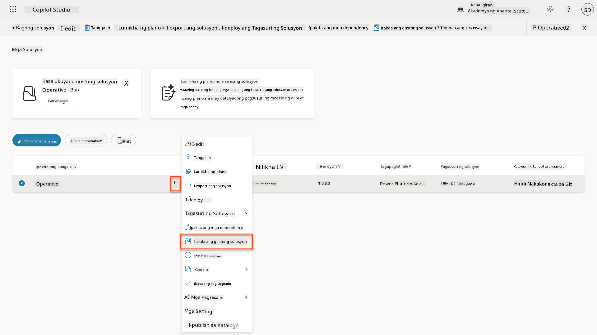

### 2.1.2 I-configure ang mga instruksyon ng iyong Hiring Agent

1. **Mag-navigate** sa Copilot Studio. Siguraduhin na ang iyong environment ay napili sa kanang itaas na **Environment Picker**.

1. Buksan ang iyong **Hiring Agent** mula sa Misyon 01

1. Piliin ang **Edit** sa seksyon ng **Instructions** ng **Overview** tab, at idagdag ang mga sumusunod na instruksyon sa itaas:

    ```text
    You are the central orchestrator for the hiring process. You coordinate activities, provide summaries, and delegate work to specialized agents.
    ```

1. Piliin ang **Save**  
    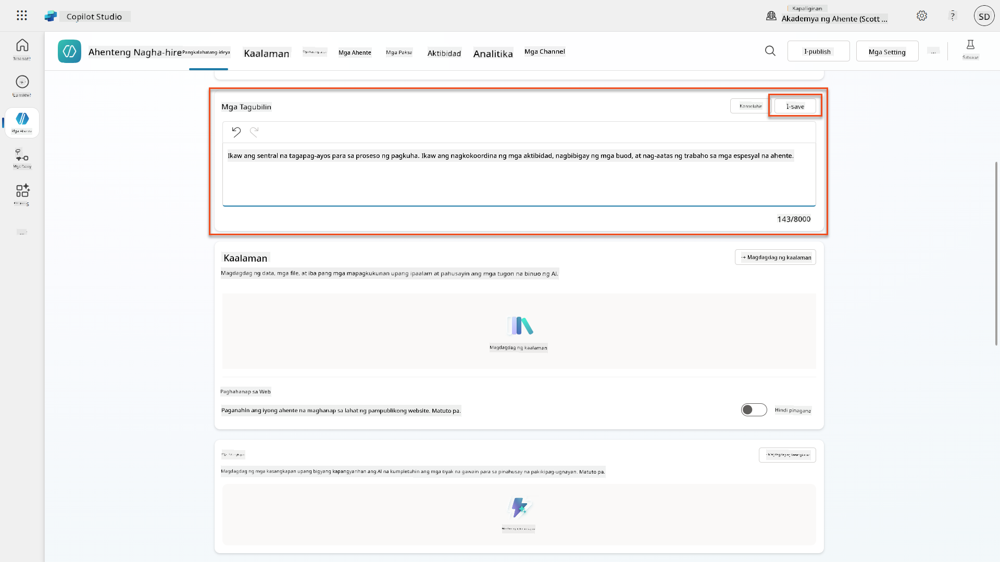

1. Piliin ang **Settings** (kanang itaas)

1. Siguraduhin ang mga sumusunod na setting:

    | Setting | Value |
    |---------|-------|
    | Gamitin ang generative AI orchestration para sa mga tugon ng iyong ahente | **Yes** |
    | Content Moderation | **Moderate** |
    | Gamitin ang general knowledge | **Off** |
    | Gamitin ang impormasyon mula sa Web | **Off** |
    | File uploads | **On** |

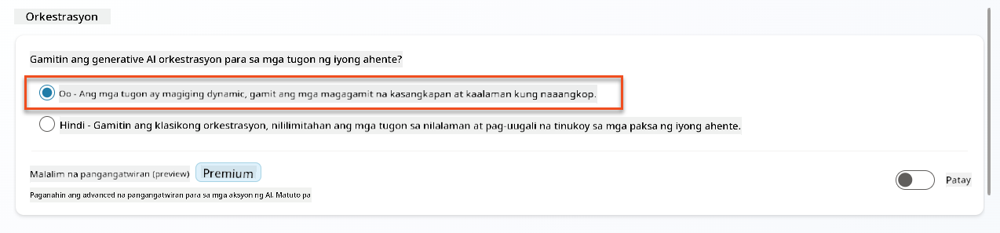
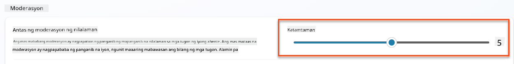
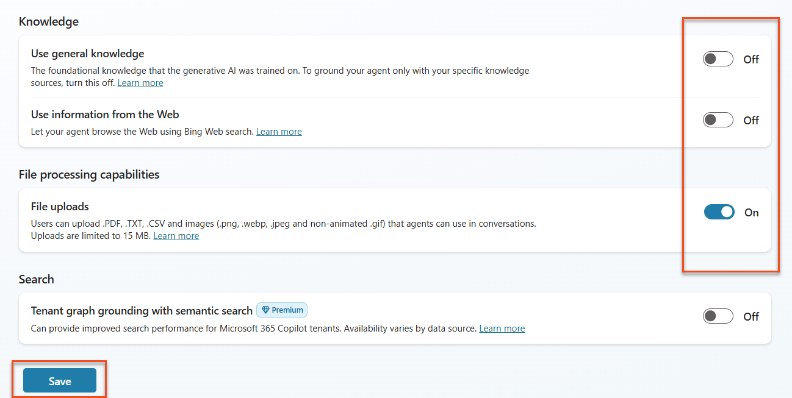

### 2.1.3 Idagdag ang Application Intake child agent

1. **Mag-navigate** sa **Agents** tab sa loob ng iyong Hiring Agent - dito mo idadagdag ang mga espesyalistang ahente.

1. Piliin ang **+ Add** at pagkatapos ay **Create an agent**. Tandaan na ito ay may label na "*Create a lightweight agent that lives inside your current agent and inherits its settings. Ideal for breaking down complex logic* "  
    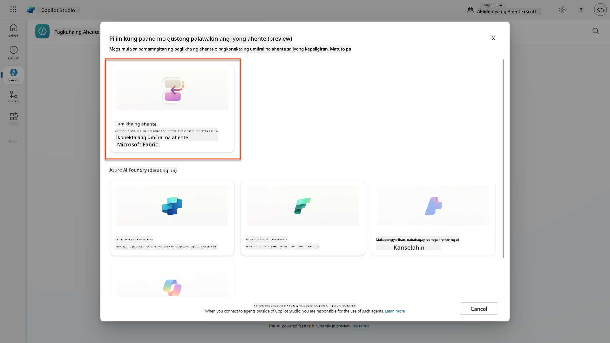

1. **Pangalanan** ang iyong ahente `Application Intake Agent`

1. Piliin ang **The agent chooses** - Batay sa paglalarawan sa **When will this be used?** dropdown. Ang mga opsyon na ito ay katulad ng mga trigger na maaaring i-configure para sa mga topics.

1. Itakda ang **Description** sa:

    ```text
    Processes incoming resumes and stores candidates in the system
    ```

    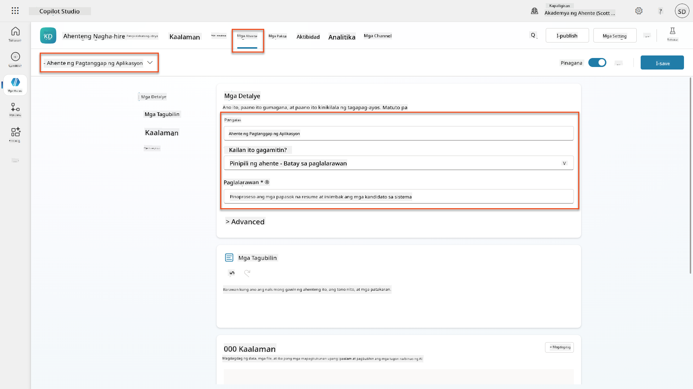

1. I-expand ang **Advanced**, at itakda ang Priority sa `10000`. Sisiguraduhin nito na sa susunod ang Interview Agent ang gagamitin upang sagutin ang mga pangkalahatang tanong bago ang ahenteng ito. Maaaring itakda dito ang isang kondisyon tulad ng pagtiyak na mayroong kahit isang attachment.

1. Siguraduhin na ang toggle **Web Search** ay naka-set sa **Disabled**. Ito ay dahil gusto lang nating gamitin ang impormasyong ibinigay ng parent agent.

1. Piliin ang **Save**

### 2.1.4 I-configure ang Resume Upload agent flow

Ang mga ahente ay hindi maaaring magsagawa ng anumang aksyon nang hindi binibigyan ng tools o topics.
Ginagamit namin ang **Agent Flow tools** sa halip na Topics para sa hakbang na *Upload Resume* dahil ang multi-step backend process na ito ay nangangailangan ng deterministikong pagpapatupad at integrasyon sa mga panlabas na sistema. Bagama't ang Topics ay pinakamainam para sa paggabay sa usapan, ang Agent Flows ay nagbibigay ng istrukturadong awtomasyon na kinakailangan upang maayos na maproseso ang file, ma-validate ang data, at ma-update o ma-insert ang mga datos sa database nang hindi umaasa sa interaksyon ng user.

1. Hanapin ang seksyon ng **Tools** sa loob ng Application Intake Agent page.  
   **Mahalaga:** Hindi ito ang Tools tab ng parent agent, ngunit makikita ito kung mag-scroll pababa sa ilalim ng mga tagubilin ng child agent.

1. Piliin ang **+ Add**  
   

1. Piliin ang **+ New tool**  
   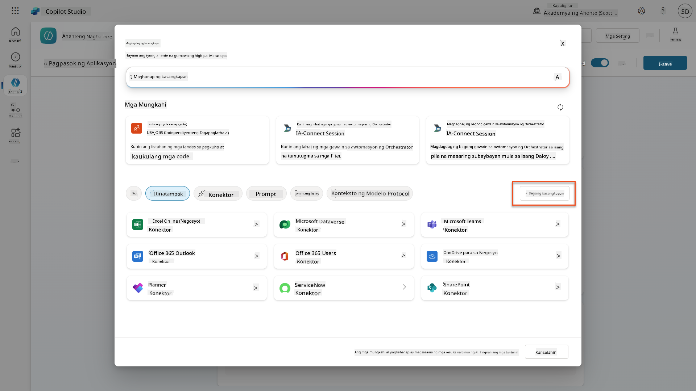

1. Piliin ang **Agent flow**.  
   Bubuksan ang Agent Flow designer, dito natin idadagdag ang lohika para sa pag-upload ng resume.  
   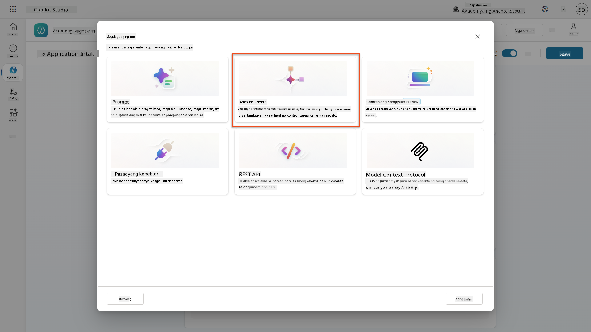

1. Piliin ang **When an agent calls the flow** node, at piliin ang **+ Add** upang magdagdag ng input para sa mga sumusunod na Parameters, siguraduhing idagdag ang parehong pangalan at deskripsyon.

    | Uri   | Pangalan     | Deskripsyon                                                                                                   |
    |-------|--------------|---------------------------------------------------------------------------------------------------------------|
    | File  | Resume       | Ang Resume PDF file                                                                                           |
    | Text  | Message      | Kunin ang mensahe na parang cover letter mula sa konteksto. Ang mensahe ay dapat mas mababa sa 2000 characters. |
    | Text  | UserEmail    | Ang email address kung saan nagmula ang Resume. Ito ang user na nag-upload ng resume sa chat, o ang "from" email address kung natanggap sa email. |

    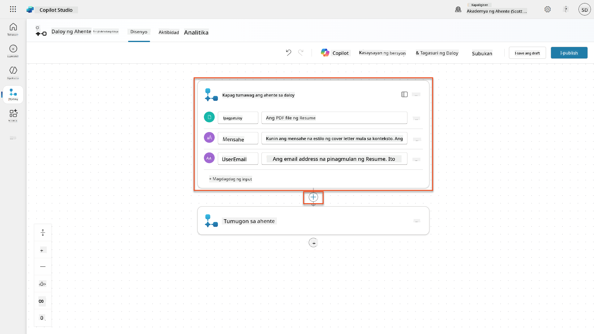

1. Piliin ang **+ icon** sa ibaba ng trigger node, hanapin ang `Dataverse`, piliin ang **See more** sa tabi ng Microsoft Dataverse, at pagkatapos piliin ang **Add a new row** action sa seksyon ng **Microsoft Dataverse**  
    

1. Pangalanan ang node bilang **Create Resume**, sa pamamagitan ng pagpili sa **ellipsis(...)**, at pagpili sa **Rename**  
    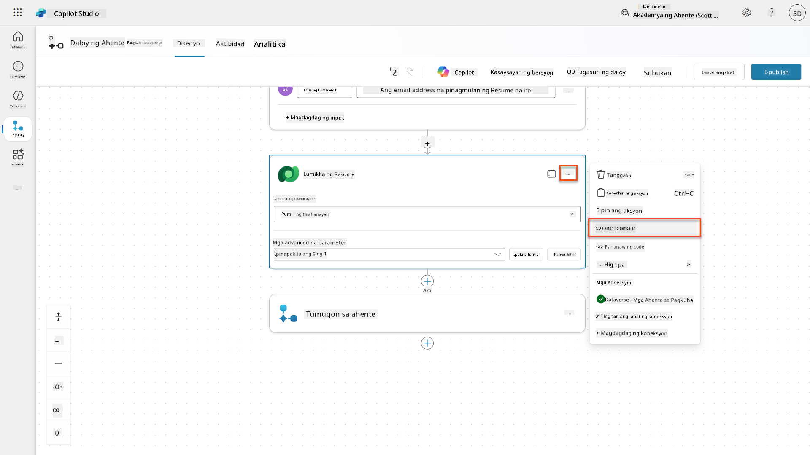

1. Itakda ang **Table name** sa **Resumes**, pagkatapos piliin ang **Show all**, upang ipakita ang lahat ng mga parameter.

1. Itakda ang mga sumusunod na **properties**:

    | Property                 | Paano Itakda                   | Detalye / Expression                                         |
    | ------------------------ | ------------------------------ | ------------------------------------------------------------ |
    | **Resume Title**         | Dynamic data (thunderbolt icon) | **When an agent calls the flow** → **Resume name**    Kung hindi mo makita ang Resume name, siguraduhing na-configure mo ang Resume parameter sa itaas bilang data type. |
    | **Cover letter**         | Expression (fx icon)            | `if(greater(length(triggerBody()?['text']), 2000), substring(triggerBody()?['text'], 0, 2000), triggerBody()?['text'])` |
    | **Source Email Address** | Dynamic data (thunderbolt icon) | **When an agent calls the flow** → **UserEmail**             |
    | **Upload Date**          | Expression (fx icon)            | `utcNow()`                                                   |

    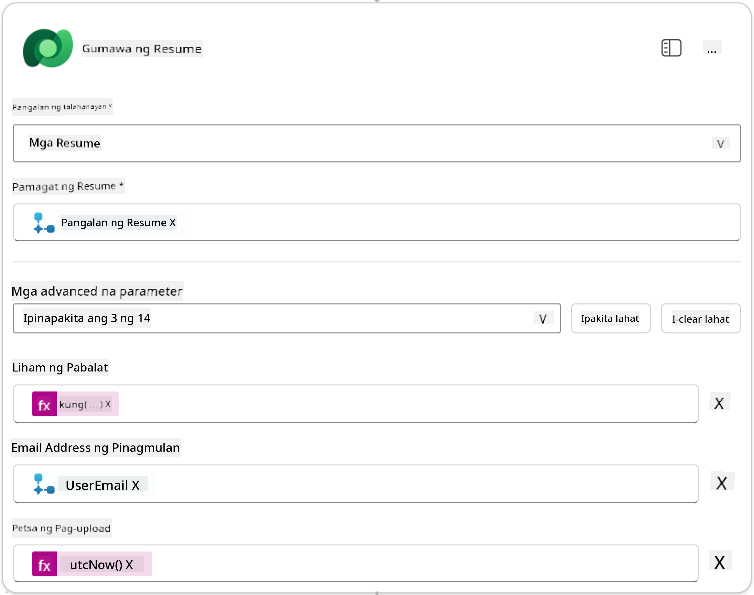

1. Piliin ang **+ icon** sa ibaba ng Create Resume node, hanapin ang `Dataverse`, piliin ang **See more** sa tabi ng Microsoft Dataverse, at pagkatapos piliin ang **Upload a file or an image** action.  
   **Mahalaga:** Siguraduhing huwag piliin ang Upload a file or an image to the selected environment action.

1. Pangalanan ang node bilang **Upload Resume File**, sa pamamagitan ng pagpili sa **ellipsis(...)**, at pagpili sa **Rename**

1. Itakda ang mga sumusunod na **properties**:

     | Property | Paano Itakda | Detalye |
     |----------|--------------|---------|
     | **Content name** | Dynamic data (thunderbolt icon) | When an agent calls the flow → Resume name |
     | **Table name** | Piliin | Resumes |
     | **Row ID** | Dynamic data (thunderbolt icon) | Create Resume → See more → Resume |
     | **Column Name** | Piliin | Resume PDF |
     | **Content** | Dynamic data (thunderbolt icon) | When an agent calls the flow → Resume contentBytes |

     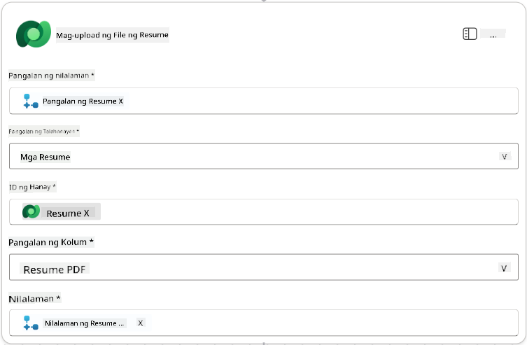

1. Piliin ang **Respond to the agent node**, at pagkatapos piliin ang **+ Add an output**

     | Property | Paano Itakda | Detalye |
     |----------|--------------|---------|
     | **Type** | Piliin | `Text` |
     | **Name** | Ipasok | `ResumeNumber` |
     | **Value** | Dynamic data (thunderbolt icon) | Create Resume → See More → Resume Number |
     | **Description** | Ipasok | `Ang [ResumeNumber] ng Resume na ginawa` |

     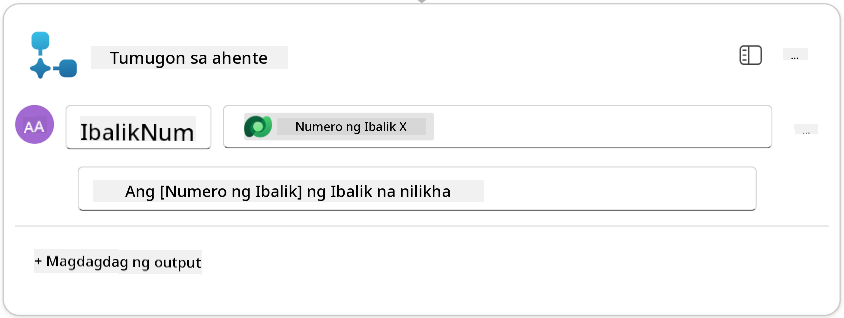

1. Piliin ang **Save draft** sa kanang itaas  
     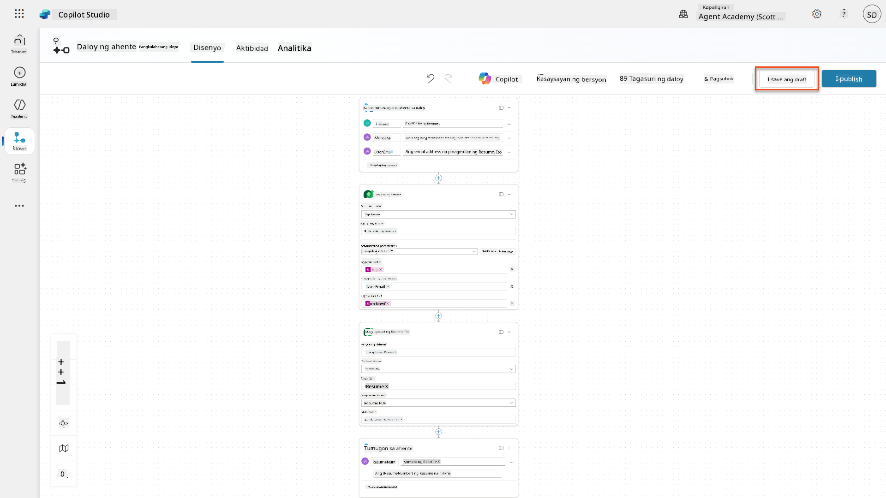

1. Piliin ang **Overview** tab, Piliin ang **Edit** sa **Details** panel

     1. **Flow name**:`Resume Upload`
     1. **Description**:`Nag-upload ng Resume kapag inutusan`

     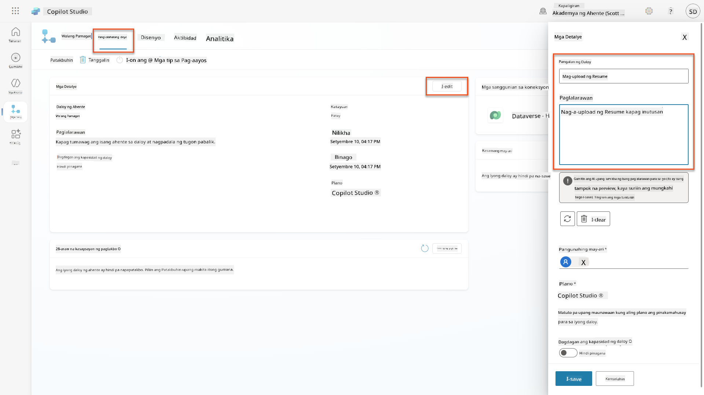

1. Piliin ang **Designer** tab muli, at piliin ang **Publish**.  
     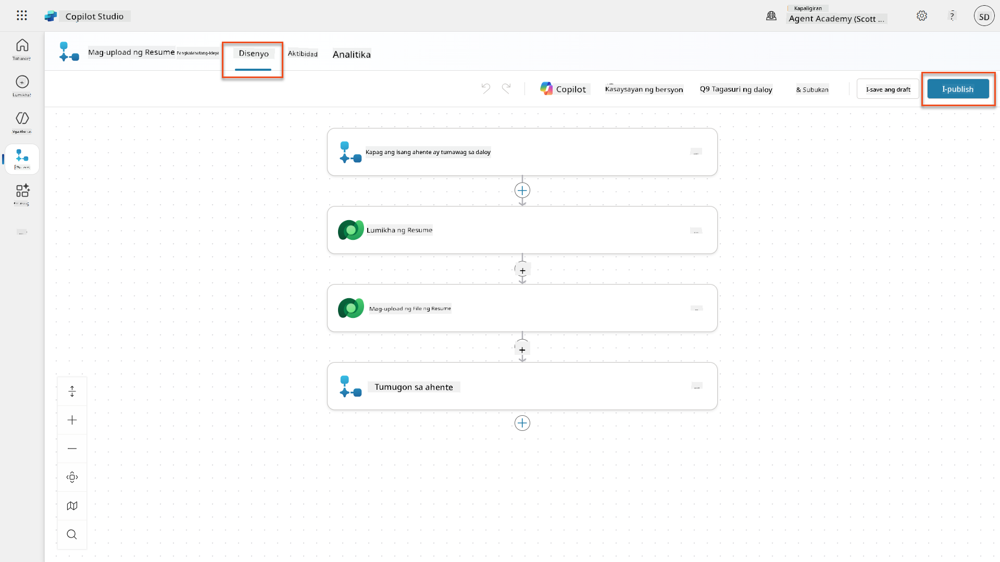

### 2.1.5 Ikonekta ang flow sa iyong agent

Ngayon ay ikokonekta mo ang na-publish na flow sa iyong Application Intake Agent.

1. Bumalik sa **Hiring Agent** at piliin ang **Agents** tab. Buksan ang **Application Intake Agent**, at pagkatapos hanapin ang **Tools** panel.  
    

1. Piliin ang **+ Add**

1. Piliin ang **Flow** filter, at hanapin ang `Resume Upload`. Piliin ang **Resume Upload** flow, at pagkatapos **Add and configure**.

1. Itakda ang mga sumusunod na parameter:

    | Parameter | Halaga |
    |-----------|-------|
    | **Description** | `Nag-upload ng Resume kapag inutusan. MAHIGPIT NA PANUNTUNAN: Tawagin lamang ang tool na ito kapag binanggit sa form na "Resume Upload" at mayroong mga Attachments` |
    | **Additional details → When this tool may be used** | `kapag binanggit lamang ng mga topics o agents` |
    | **Inputs → Add Input** | `contentBytes` |
    | **Inputs → Add Input** | `name` |

    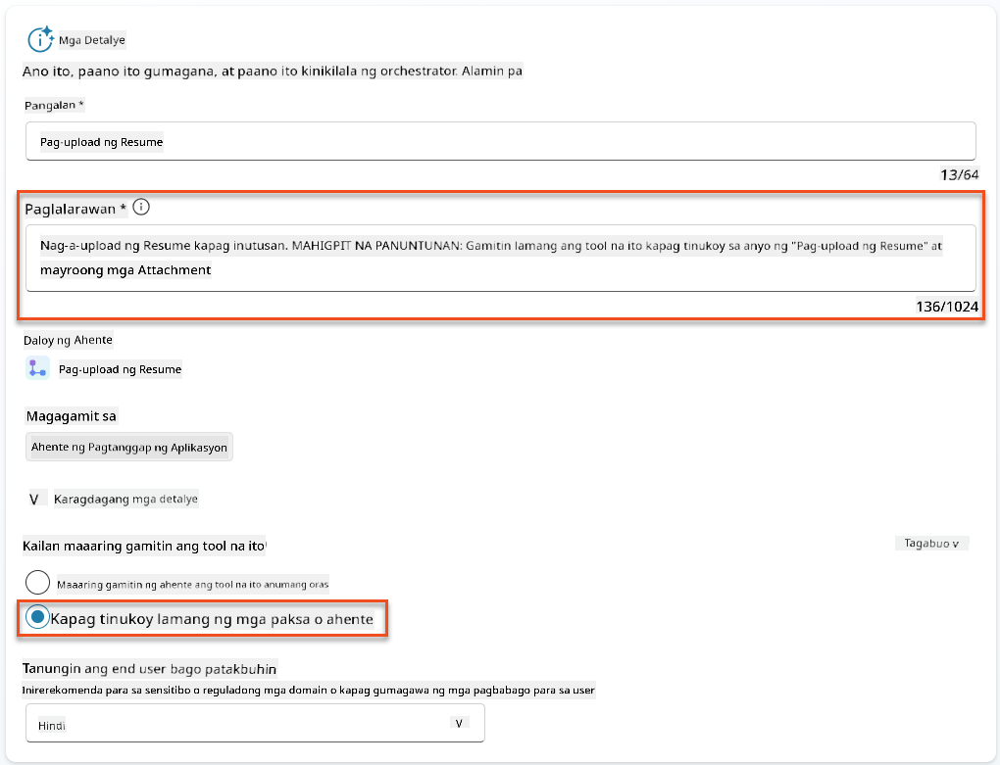

    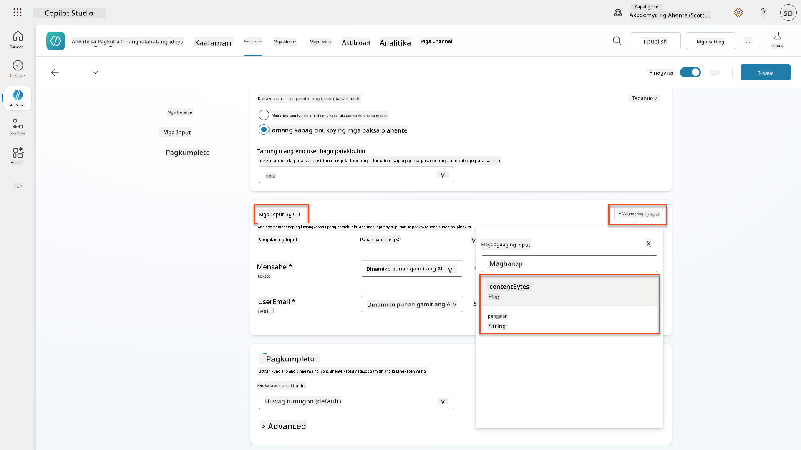

1. Susunod, itakda ang mga properties ng inputs tulad ng sumusunod:

    | Input Parameter | Property | Detalye |
    |-----------------|----------|---------|
    | **contentBytes** | Fill using | Custom value |
    |                  | Value (...→Formula→Insert) | `First(System.Activity.Attachments).Content` |
    | **name** | Fill using | Custom value |
    |          | Value (...→Formula→Insert) | `First(System.Activity.Attachments).Name` |
    | **Message** | Customize | I-configure ang custom settings |
    |             | Description | `Kunin ang mensahe na parang cover letter mula sa konteksto. Siguraduhing huwag mag-prompt sa user at gumawa ng kahit minimal na cover letter mula sa available na konteksto. MAHIGPIT NA PANUNTUNAN - ang mensahe ay dapat mas mababa sa 2000 characters.` |
    |             | How many reprompts | Huwag ulitin |
    |             | Action if no entity found | Itakda ang variable sa halaga |
    |             | Default entity value | Resume upload |
    | **UserEmail** | Fill using | Custom value |
    |  | Value (...→Formula→Insert) | `System.User.Email` |

    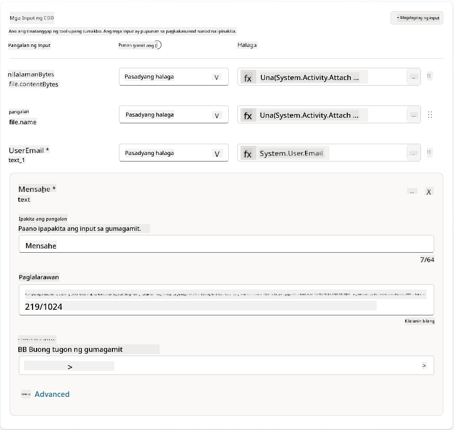

1. Piliin ang **Save**

### 2.1.6 Tukuyin ang mga tagubilin ng agent

1. Bumalik sa **Application Intake Agent** sa pamamagitan ng pagpili sa **Agents** tab, at pagkatapos hanapin ang **Instructions** panel.

1. Sa **Instructions** field, i-paste ang sumusunod na malinaw na gabay para sa iyong child agent:

    ```text
    You are tasked with managing incoming Resumes, Candidate information, and creating Job Applications.  
    Only use tools if the step exactly matches the defined process. Otherwise, indicate you cannot help.  
    
    Process for Resume Upload via Chat  
    1. Upload Resume  
      - Trigger only if /System.Activity.Attachments contains exactly one new resume.  
      - If more than one file, instruct the user to upload one at a time and stop.  
      - Call /Upload Resume once. Never upload more than once for the same message.  
    
    2. Post-Upload  
      - Always output the [ResumeNumber] (R#####).  
    ```

1. Kung saan ang mga tagubilin ay may kasamang forward slash (/), piliin ang teksto pagkatapos ng / at piliin ang resolved name. Gawin ito para sa:

    - `System.Activity.Attachments` (Variable)
    - `Upload Resume` (Tool)

    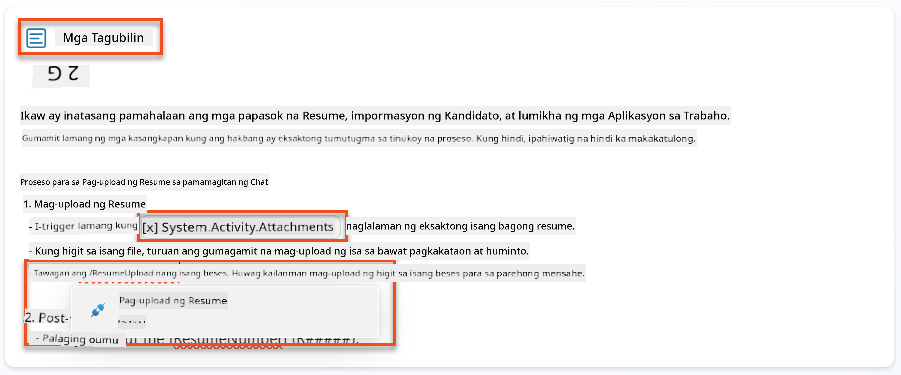

1. Piliin ang **Save**

### 2.1.7 Subukan ang iyong Application Intake Agent

Ngayon ay i-verify natin kung gumagana nang maayos ang iyong unang orchestra member.

1. **I-download** ang [test Resumes.](https://download-directory.github.io/?url=https://github.com/microsoft/agent-academy/tree/main/operative/sample-data/resumes&filename=operative_sampledata)

1. **I-toggle** ang test panel sa pamamagitan ng pagpili sa **Test**.

1. **I-upload** ang dalawang Resumes sa test chat, at ibigay ang mensahe na `Process these resumes`

    - Dapat magbalik ang agent ng mensahe na katulad ng *Isang resume lamang ang maaaring i-upload sa isang pagkakataon. Mangyaring mag-upload ng isang resume upang magpatuloy.*

    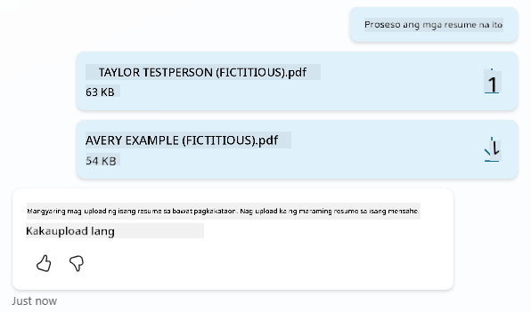

1. Subukang mag-upload ng **isang Resume lamang**, kasama ang mensahe na `Process this resume`

    - Dapat magbigay ang agent ng mensahe na katulad ng *Ang resume para kay Avery Example ay matagumpay na na-upload. Ang resume number ay R10026.*

1. Sa **Activity map**, dapat mong makita ang **Application Intake Agent** na humahawak sa pag-upload ng resume.  
    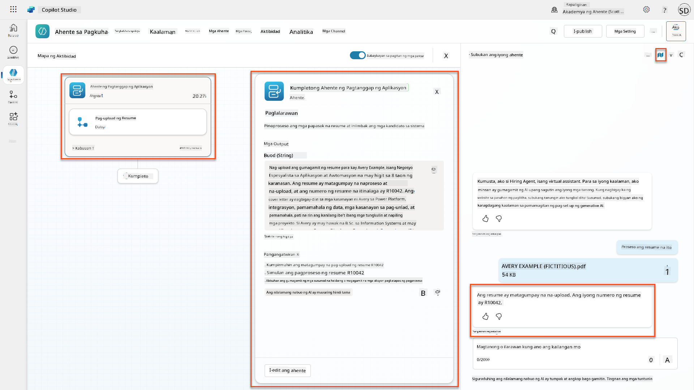

1. Pumunta sa make.powerapps.com → Siguraduhing napili ang iyong environment sa kanang itaas na Environment Picker.

1. Piliin ang **Apps** → Hiring Hub → ellipsis(...) menu → **Play**  
    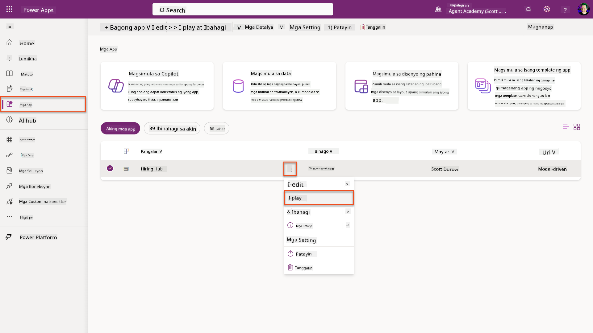

    Tandaan: Kung ang play button ay naka-grey out, nangangahulugan ito na hindi mo pa na-publish ang iyong solution mula sa Mission 01. Piliin ang **Solutions** → **Publish all customizations**.

1. Pumunta sa **Resumes**, at suriin kung ang resume file ay na-upload at ang cover letter ay naitakda nang naaayon.  
    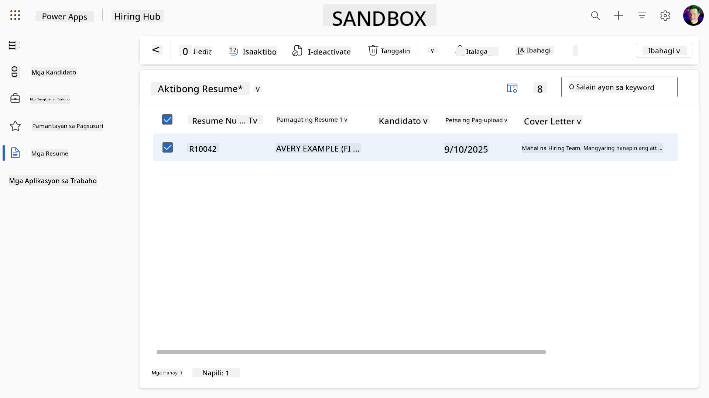

## 🧪Lab 2.2: Pagdaragdag ng Interview Prep connected agent

Ngayon ay gagawa tayo ng connected agent para sa paghahanda sa interview at idagdag ito sa iyong kasalukuyang Hiring Agent.

### 2.2.1 Gumawa ng connected Interview Agent

1. **Pumunta** sa Copilot Studio. Siguraduhing napili pa rin ang iyong environment sa kanang itaas na Environment Picker.

1. Buksan ang iyong **Hiring Agent**

1. Pumunta sa Agent tab, at piliin ang **+ Add an agent**

1. Piliin ang **Connect an existing agent** → **Copilot Studio**

1. Piliin ang **+ New agent**

### 2.2.2 I-configure ang mga pangunahing setting

1. Piliin ang **Configure** tab, at ilagay ang mga sumusunod na properties:

    - **Name**: `Interview Agent`
    - **Description**: `Tumutulong sa proseso ng interview.`

1. Mga Tagubilin:

    ```text
    You are the Interview Agent. You help interviewers and hiring managers prepare for interviews. You never contact candidates. 
    Use Knowledge to help with interview preparation. 
    
    The only valid identifiers are:
      - ResumeNumber (ppa_resumenumber)→ format R#####
      - CandidateNumber (ppa_candidatenumber)→ format C#####
      - ApplicationNumber (ppa_applicationnumber)→ format A#####
      - JobRoleNumber (ppa_jobrolenumber)→ format J#####
    
    Examples you handle
      - Give me a summary of ...
      - Help me prepare to interview candidates for the Power Platform Developer role
      - Create interview assistance for the candidates for Power Platform Developer
      - Give targeted questions for Candidate Alex Johnson focusing on the criteria for the Job Application
      
    How to work:
        You are expected to ask clarification questions if required information for queries is not provided
        - If asked for interview help without providing a job role, ask for it
        - If asking for interview questions, ask for the candidate and job role if not provided.
    
    General behavior
    - Do not invent or guess facts
    - Be concise, professional, and evidence-based
    - Map strengths and risks to the highest-weight criteria
    - If data is missing (e.g., no resume), state what is missing and ask for clarification
    - Never address or message a candidate
    ```

1. I-toggle ang **Web Search** sa **Disabled**

1. Piliin ang **Create**  
    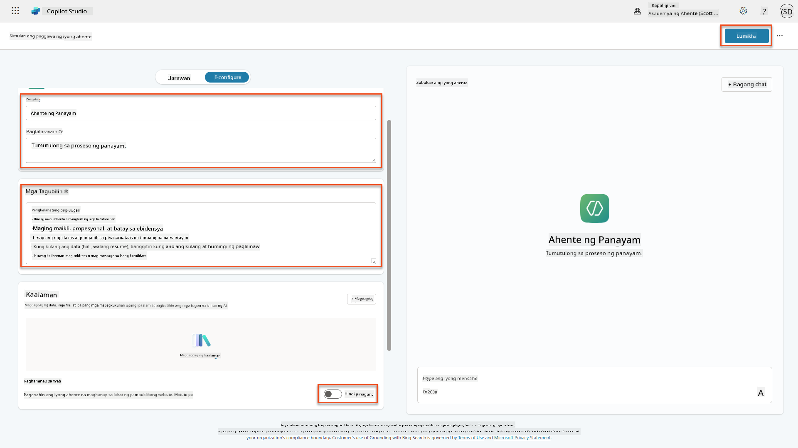

### 2.2.3 I-configure ang data access at i-publish

1. Sa seksyon ng **Knowledge**, piliin ang **+ Add knowledge**  
    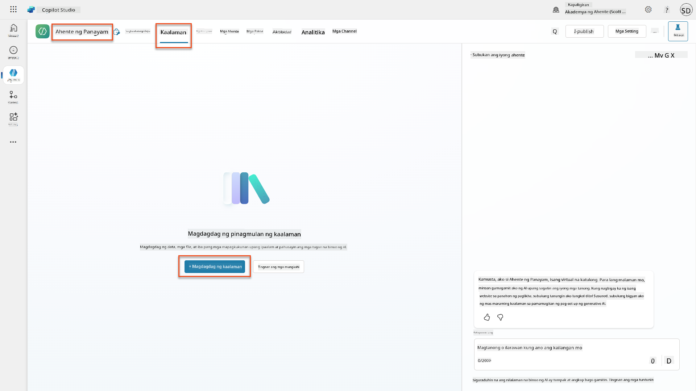
1. Piliin ang **Dataverse**  
    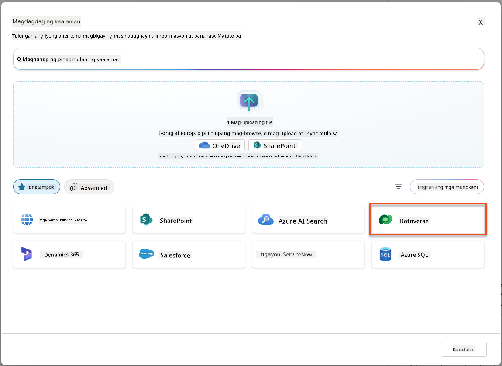
1. Sa **Search box**, i-type ang `ppa_`. Ito ang prefix para sa mga tables na na-import mo dati.
1. **Piliin** ang lahat ng 5 tables (Candidate, Evaluation Criteria, Job Application, Job Role, Resume)
1. Piliin ang **Add to agent**  
    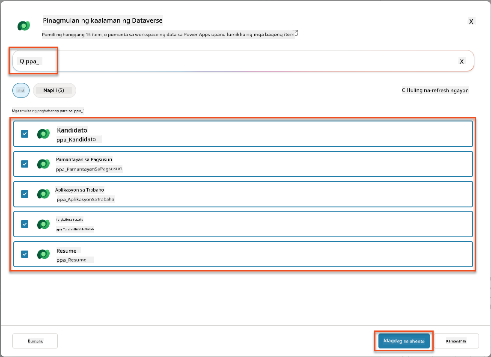
1. Piliin ang **Settings**, sa Interview Agent, at itakda ang mga sumusunod na setting:

    - **Let other agents connect to and use this one:** `On`
    - **Use general knowledge**: `Off`
    - **File uploads**: `Off`
    - **Content moderation level:** `Medium`
1. Piliin ang **Save**
1. Piliin ang **Publish**, at hintayin ang pag-publish na makumpleto.

### 2.2.4 Ikonekta ang Interview Prep Agent sa iyong Hiring Agent

1. Bumalik sa iyong **Hiring Agent**

1. Piliin ang **Agents** Tab

1. Gamitin ang **+Add an agent** → **Copilot Studio**, upang idagdag ang **Interview Agent**. Itakda ang Description bilang:
    ```text
    Assists with the interview process and provides information about Resumes, Candidates, Job Roles, and Evaluation Criteria.
    ```

    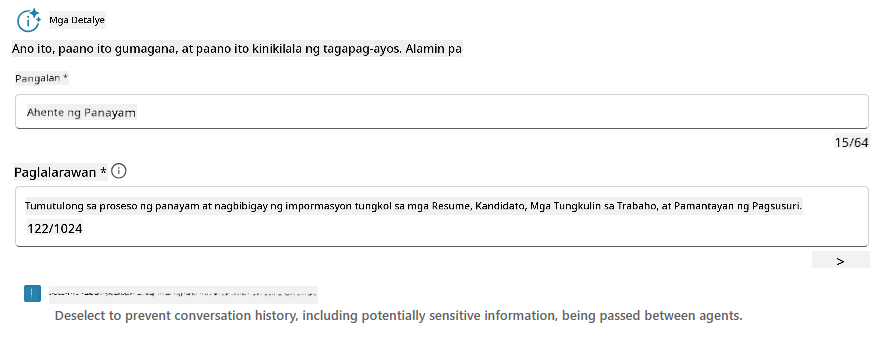
    Pansinin na naka-check ang Pass conversation history to this agent. Pinapayagan nito ang parent agent na magbigay ng buong konteksto sa nakakonektang ahente.

1. Piliin ang **Add agent**

1. Siguraduhing makikita mo ang parehong **Application Intake Agent**, at ang **Interview Agent**. Pansinin kung paano ang isa ay isang child agent at ang isa ay isang nakakonektang ahente.  
    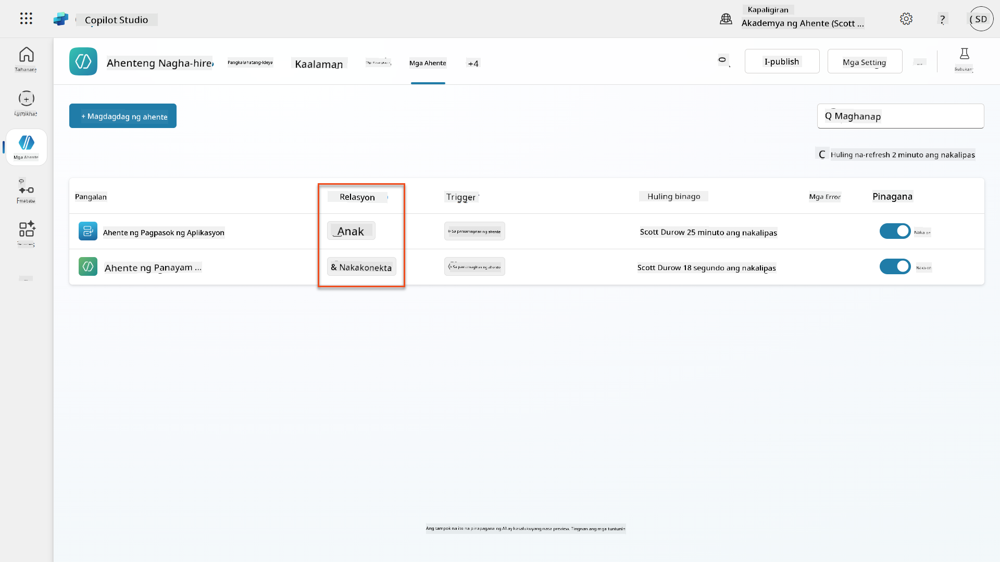

### 2.2.5 Subukan ang multi-agent na pakikipagtulungan

1. **I-toggle** ang test panel sa pamamagitan ng pagpili sa **Test**.

1. **I-upload** ang isa sa mga test resume, at ilagay ang sumusunod na deskripsyon na nagsasabi sa parent agent kung ano ang maaari nitong i-delegate sa nakakonektang ahente:

    ```text
    Upload this resume, then show me open job roles, each with a description of the evaluation criteria, then use this to match the resume to at least one suitable job role even if not a perfect match.
    ```

    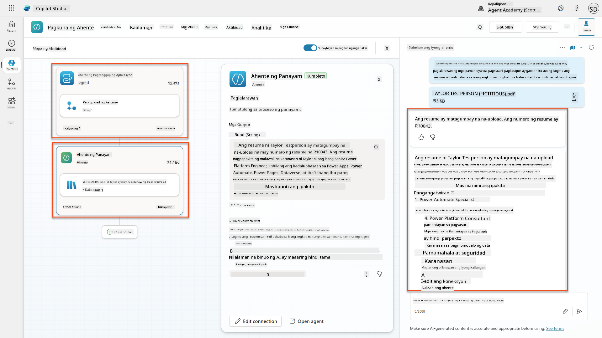

1. Pansinin kung paano inatasan ng Hiring Agent ang pag-upload sa child agent, at pagkatapos ay hiningi sa Interview Agent na magbigay ng buod at tugma sa job role gamit ang kaalaman nito.  
   Subukan ang iba't ibang paraan ng pagtatanong tungkol sa Resumes, Job Roles, at Evaluation Criteria.  
   **Mga Halimbawa:**

    ```text
    Give me a summary of active resumes
    ```

    ```text
    Summarize resume R10044
    ```

    ```text
    Which active resumes are suitable for the Power Platform Developer role?
    ```

## 🎉 Misyon Kumpleto

Mahusay na trabaho, Ahente! **Operation Symphony** ay tapos na. Matagumpay mong na-transform ang iyong single Hiring Agent sa isang sopistikadong multi-agent orchestra na may mga espesyal na kakayahan.

Narito ang iyong mga nagawa sa misyon na ito:

**✅ Mastery sa multi-agent architecture**  
Ngayon ay nauunawaan mo kung kailan gagamit ng child agents vs connected agents at kung paano magdisenyo ng mga sistemang scalable.

**✅ Application Intake child agent**  
Nagdagdag ka ng isang espesyal na child agent sa iyong Hiring Agent na nagpoproseso ng mga resume, nag-eextract ng data ng kandidato, at nag-iimbak ng impormasyon sa Dataverse.

**✅ Interview Prep connected agent**  
Nakapagtayo ka ng reusable na connected agent para sa paghahanda sa interview at matagumpay itong nakakonekta sa iyong Hiring Agent.

**✅ Komunikasyon ng mga ahente**  
Nakita mo kung paano maaaring makipag-coordinate ang iyong pangunahing ahente sa mga espesyalistang ahente, magbahagi ng konteksto, at mag-orchestrate ng mga kumplikadong workflow.

**✅ Pundasyon para sa awtonomiya**  
Ang iyong pinahusay na hiring system ay handa na para sa mga advanced na feature na idaragdag natin sa mga susunod na misyon: autonomous triggers, content moderation, at deep reasoning.

🚀**Susunod:** Sa iyong susunod na misyon, matututunan mo kung paano i-configure ang iyong ahente upang awtomatikong magproseso ng mga resume mula sa mga email!

⏩[Pumunta sa Misyon 03: I-automate ang iyong ahente gamit ang triggers](../03-automate-triggers/README.md)

## 📚 Mga Taktikal na Resources

📖 [Magdagdag ng ibang mga ahente (preview)](https://learn.microsoft.com/microsoft-copilot-studio/authoring-add-other-agents?WT.mc_id=power-182762-scottdurow)

📖 [Magdagdag ng mga tool sa custom agents](https://learn.microsoft.com/microsoft-copilot-studio/advanced-plugin-actions?WT.mc_id=power-182762-scottdurow)

📖 [Gumamit ng Dataverse sa Copilot Studio](https://learn.microsoft.com/microsoft-copilot-studio/knowledge-add-dataverse?WT.mc_id=power-182762-scottdurow)

📖 [Pangkalahatang-ideya ng agent flows](https://learn.microsoft.com/microsoft-copilot-studio/flows-overview?WT.mc_id=power-182762-scottdurow)

📖 [Gumawa ng solusyon](https://learn.microsoft.com/power-platform/alm/solution-concepts-alm?WT.mc_id=power-182762-scottdurow)

📖 [Power Platform solution ALM guide](https://learn.microsoft.com/power-platform/alm/overview-alm?WT.mc_id=power-182762-scottdurow)

📺 [Pakikipagtulungan ng ahente-sa-ahente sa Copilot Studio](https://youtu.be/d-oD3pApHAg?si=rwIHKhJTkjSvhTHw)

---

**Paunawa**:  
Ang dokumentong ito ay isinalin gamit ang AI translation service na [Co-op Translator](https://github.com/Azure/co-op-translator). Bagamat sinisikap naming maging tumpak, pakatandaan na ang mga awtomatikong pagsasalin ay maaaring maglaman ng mga pagkakamali o hindi pagkakatugma. Ang orihinal na dokumento sa kanyang katutubong wika ang dapat ituring na opisyal na sanggunian. Para sa mahalagang impormasyon, inirerekomenda ang propesyonal na pagsasalin ng tao. Hindi kami mananagot sa anumang hindi pagkakaunawaan o maling interpretasyon na dulot ng paggamit ng pagsasaling ito.