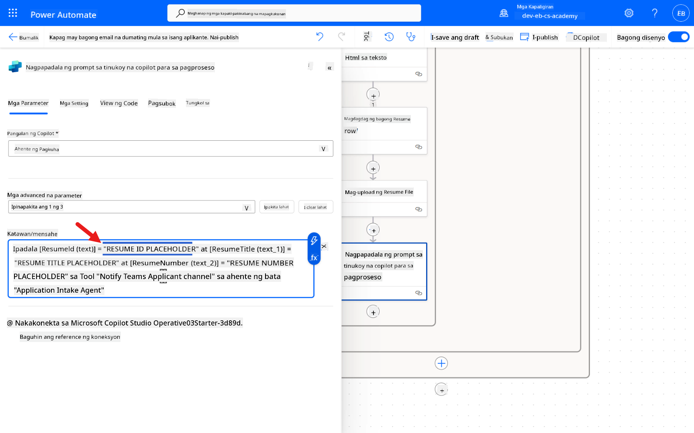
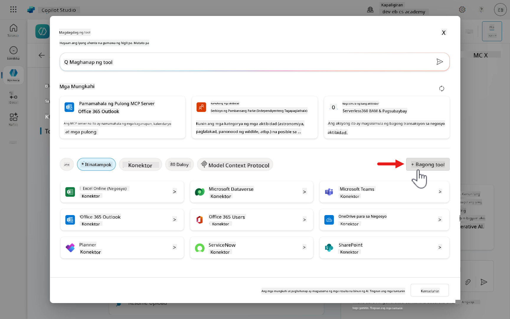
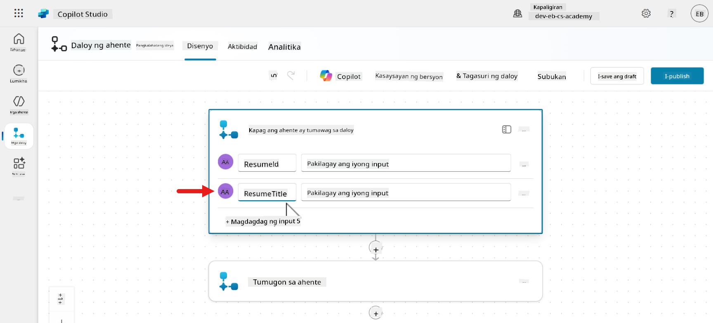
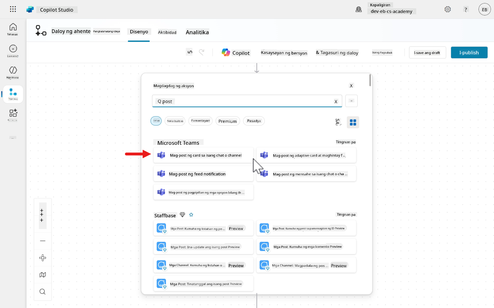
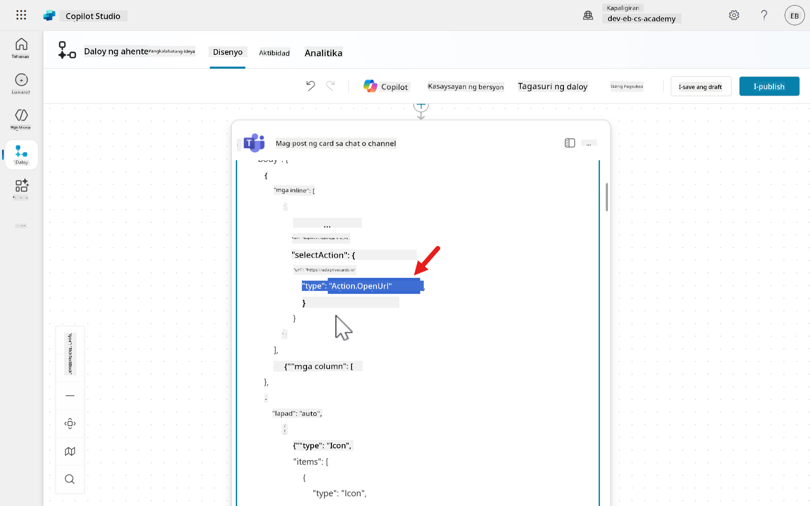
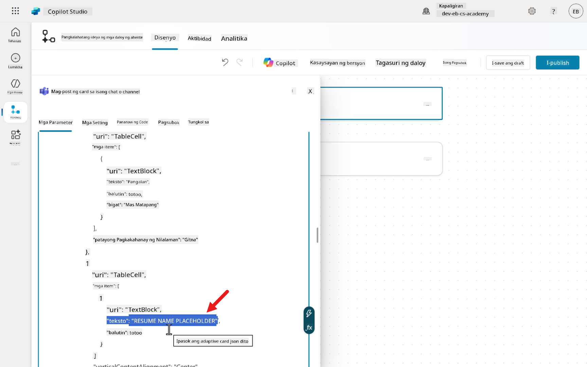
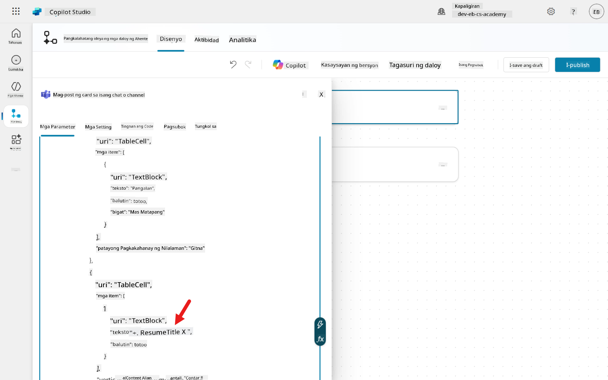
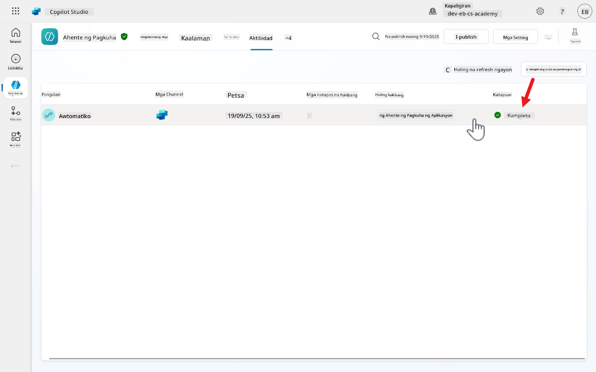

<!--
CO_OP_TRANSLATOR_METADATA:
{
  "original_hash": "75efaf515d5694d4fd549bfd6518901a",
  "translation_date": "2025-10-22T19:17:19+00:00",
  "source_file": "docs/operative-preview/03-automate-triggers/README.md",
  "language_code": "tl"
}
-->
# Misyon 03: Magdagdag ng Event Triggers para kumilos nang autonomously

--8<-- "disclaimer.md"

## 🕵️‍♂️ CODENAME: `OPERATION SIGNAL POINT`

> **⏱️ Oras ng Operasyon:** `~45 minuto`

## 🎯 Maikling Misyon

Maligayang pagbabalik, Ahente. Sa [Misyon 02](../02-multi-agent/README.md) - natutunan mo kung paano bumuo ng Application Intake child agent at Interview Prep connected agent upang palawakin ang kakayahan ng iyong pangunahing Hiring Agent.

Ang iyong assignment, kung pipiliin mong tanggapin ito, ay **Operation Signal Point** - mas malalim na pag-aaral sa **event triggers** - pag-angat ng iyong sistema ng ahente mula sa pagiging reaktibo patungo sa **autonomous operation**. Babaguhin mo ang iyong mga ahente mula sa paghihintay ng input ng tao patungo sa proactive na pagtugon sa mga panlabas na pangyayari at paggawa ng matalinong aksyon nang walang pangangasiwa.

Isipin ito bilang pag-upgrade mula sa mga ahente na _sumasagot sa mga tanong_ patungo sa mga ahente na _inaasahan ang mga pangangailangan_ at _kumikilos nang mag-isa_. Sa pamamagitan ng event triggers at automated workflows, ang iyong Hiring Agent ay makakakita ng mga papasok na email ng resume, awtomatikong ipoproseso ang mga attachment, mag-iimbak ng data sa Dataverse, at magpapadala ng abiso sa iyong HR recruitment team sa pamamagitan ng Microsoft Teams - habang nakatuon ka sa mas mahalagang mga gawain.

Maligayang pagdating sa mundo kung saan nagtatagpo ang automation at katalinuhan.

## 🔎 Mga Layunin

Sa misyon na ito, matutunan mo:

1. Paano ang event triggers ay nagbibigay-daan sa autonomous na pag-uugali ng ahente nang walang interaksyon ng user
1. Ang mga pagkakaiba sa pagitan ng interactive at autonomous na mga ahente sa Copilot Studio
1. Paano gumawa ng event triggers na awtomatikong nagpoproseso ng email attachments at nag-a-upload ng mga file sa Dataverse
1. Paano bumuo ng agent flows na nagpo-post ng adaptive cards sa Teams channels para sa mga abiso
1. Paano ipasa ang data sa pagitan ng event triggers at agent flows para sa end-to-end automation

## 🤔 Ano ang Event trigger?

Noong nakaraan sa [Recruit](../../recruit/10-add-event-triggers/README.md), natutunan natin ang tungkol sa event triggers. Balikan natin ito kung sakaling hindi mo ito napansin.

Ang **Event triggers** ay nagbibigay-daan sa isang ahente na _kumilos_ nang _mag-isa_ kapag may nangyari sa ibang sistema - walang kinakailangang mensahe mula sa user. Kapag ang naka-configure na event ay naganap - tulad ng “bagong item sa SharePoint,” “bagong email,” “Planner task na na-assign,” o kahit isang time-based recurrence, ang isang connector ay nagpapadala ng trigger payload sa iyong ahente. Ang ahente ay susunod sa iyong mga tagubilin upang magpasya kung aling mga aksyon o paksa ang tatawagin.

### Mga Pangunahing Katangian

- **Autonomous activation:**
      - Hindi tulad ng topic triggers na nagsisimula kapag ang user ay nagta-type sa ahente, ang event triggers ay nagaganap mula sa mga panlabas na pangyayari, na nagbibigay-daan sa proactive na pag-uugali.

- **Payload-driven:**
      - Ang bawat event ay naghahatid ng payload (mga variable + opsyonal na tagubilin) sa pamamagitan ng connector. Ginagamit ng ahente ang iyong tinukoy na mga tagubilin at ang payload upang magpasya kung ano ang susunod na gagawin.
      - Halimbawa _tumawag ng isang paksa_ o _isagawa ang mga aksyon na tinukoy ng Tools_.

- **Mga Halimbawa na handa na:**
      - SharePoint/OneDrive file o item na nilikha
      - Planner task na natapos/na-assign
      - Microsoft Forms response na naisumite
      - Recurrence/schedule

    Ang availability ay nakadepende sa mga patakaran ng data ng iyong organisasyon na naka-configure sa Power Automate.

- **Kinakailangan ang generative orchestration:**
      - Ang event triggers ay available lamang kapag ang generative orchestration ay naka-enable para sa ahente.

- **Billing/usage:**
      - Ang bawat trigger delivery ay binibilang bilang isang mensahe patungo sa Copilot Studio capacity.
      - Halimbawa, ang 10-minutong recurrence ay nagpapadala ng mensahe bawat 10 minuto.

- **Auth model at setup:**
      - Nagdaragdag ka ng triggers sa loob ng agent Overview, sa ilalim ng _Triggers_. Ang authentication para sa trigger connector ay gumagamit ng account ng gumawa ng ahente (“agent author authentication”).
      - Maaari mong i-edit ang mga parameter ng trigger at payload sa Power Automate maker portal.

- **Testing & observability:**
      - Maaari mong subukan ang triggers mula sa test pane ng ahente at suriin ang pag-uugali gamit ang activity map bago i-publish.

!!! info "TL;DR para sa mga developer"

    Isipin ang event triggers bilang **webhook-like signals** na nagtutulak ng isang structured payload sa iyong ahente, na nagbibigay-daan dito na _magsimula_ ng trabaho at mag-chain ng mga aksyon sa iba't ibang sistema - nang hindi naghihintay ng tanong mula sa user.

### Topic triggers - paano sila naiiba

Noong nakaraan natutunan mo ang tungkol sa topic triggers sa [Recruit](../../recruit/07-add-new-topic-with-trigger/README.md), ngunit maaaring nagtataka ka pa rin kung paano naiiba ang _Topic_ triggers mula sa _Event_ triggers, at bakit mahalaga ang pagkakaibang ito para sa pag-unawa kung ano ang gumagawa ng isang ahente na autonomous.

Ang topic triggers ay nagkokontrol kung _kailan tumatakbo ang isang paksa_, kadalasan bilang tugon sa mensahe ng user.

- Sa generative orchestration, ang default na trigger ay **By agent** - pinipili ng planner ang isang paksa na ang pangalan/deskripsyon ay pinakamahusay na tumutugma sa mensahe ng user.
- Sa classic orchestration, ang default ay **Phrases** - pinipili ng planner ang isang paksa kapag ang isa o ilang trigger phrases ay pinakamahusay na tumutugma sa mensahe ng user.

Iba pang uri ng trigger ay kinabibilangan ng `Message received`, `Event received`, `Activity received`, `Conversation update`, `Invoke received`, `On redirect`, `Inactivity`, at `Plan complete`.

!!! info "Pangunahing Pagkakaiba"

    Ang topic triggers ay _conversation activity_ starters sa loob ng chat.
    
    Ang event triggers ay system _event_ starters na ipinapadala sa pamamagitan ng connectors na maaaring patakbuhin ang ahente nang walang anumang pag-uusap.

### Mabilis na gabay ng Topic trigger vs Event trigger

- **Topic trigger:** User (o chat activity) nagsabi/gumawa ng X ➡️ tumakbo ang Topic T.
- **Event trigger:** SharePoint/Planner/Email/Timer nag-trigger na may payload P ➡️ sinusuri ng ahente ang mga tagubilin ➡️ tumawag ng Actions/Topics nang naaayon.

## 🏓 Interactive agent vs Autonomous agent - paghahambing

Ngayon na alam mo ang pagkakaiba sa pagitan ng event triggers at topic triggers, susunod nating alamin ang pagkakaiba sa pagitan ng isang interactive agent vs isang autonomous agent.

Sa Copilot Studio terms, "interactive" ay tumutukoy sa mga ahente na pangunahing nakikipag-ugnayan sa pamamagitan ng **topics** sa isang chat o channel. "Autonomous" ay tumutukoy sa mga ahente na gumagamit din ng **event triggers** upang tumakbo nang walang input ng user.

Ang sumusunod na talahanayan ay nagbubuod ng kanilang mga pagkakaiba at pagkakatulad.

| Dimensyon                           | Interactive agent     | Autonomous agent                                                                                              |
|-------------------------------------|-----------------------|---------------------------------------------------------------------------------------------------------------|
| Paano ito nagsisimula               | User (o chat activity) nag-trigger ng isang paksa. Halimbawa: By agent, Phrases, Message received.   | Panlabas na event trigger nagpapadala ng payload sa pamamagitan ng connector sa ahente. Halimbawa: SharePoint, Planner, email, schedule, atbp. |
| Pangunahing gamit                   | Q&A, guided workflows, request-driven actions sa chat - Teams, web, atbp.  | Proactive operations at background automation - tumugon sa mga pagbabago sa sistema at pagkatapos mag-abiso, mag-file, o mag-orchestrate ng mga gawain. |
| Trigger surface                     | Topic triggers: By agent / Phrases / Message received / Activity types / Invoke / Inactivity / Plan complete | Event triggers library sa pamamagitan ng connectors; ang payload ay naglalaman ng data ng event + opsyonal na tagubilin. |
| Planner (generative orchestration)  | Malakas na ginagamit para sa By agent at Plan complete triggers upang pumili/sekwensyahin ang mga paksa. | Kinakailangan para sa event triggers; ginagamit ng ahente ang mga tagubilin + payload upang magpasya kung aling mga aksyon/topics ang tatawagin. |
| Karaniwang halimbawa                | User nagtanong "Ano ang aming refund policy?" → Tumakbo ang Topic, nag-query ng knowledge, nagbigay ng sagot. | Bagong Planner task na-assign → Nag-trigger ang Event → Nag-post ang Ahente ng Teams message, nag-update ng record, o tumawag ng topic. |
| Setup path                          | Gumawa ng topics, tukuyin ang uri ng trigger, gumawa ng dialog/actions; i-publish sa mga channel. | Magdagdag ng event trigger (Overview → Triggers), i-authenticate ang connector gamit ang mga kredensyal ng gumawa ng ahente, i-configure ang payload/tagubilin; subukan sa test pane; i-publish. |
| Auth at pamamahala                  | Tumatakbo sa ilalim ng channel/auth context; ang topic triggers ay tumutugon sa mga chat activities sa mga pinapayagang channel. | Ang availability ng trigger ay nakadepende sa mga patakaran ng data ng Power Automate; ang mga connectors ay tumatakbo sa ilalim ng account ng gumawa ng ahente. |
| Observability                       | Subukan ang topics sa loob ng Copilot Studio, suriin ang mga transcript/activities ng pag-uusap. | Gamitin ang Test trigger at activity map upang i-validate ang execution bago i-publish, subaybayan ang aktibidad pagkatapos i-publish. |
| Epekto sa kapasidad                 | Ang bawat mensahe ng user/response ng ahente ay isang mensahe na kumokonsumo ng kapasidad. | Ang bawat event delivery ay isa ring mensahe, kasama ang anumang kasunod na mga aksyon. Halimbawa: isang 10-minutong recurrence = 6 na mensahe/oras |

### Kailan gagamitin ang alin?

- Pumili ng **topic triggers (interactive)** kapag ang mga user ang nagsisimula ng pag-uusap sa ahente - FAQ, guided intake, o command-style tasks sa loob ng chat. Ang By agent trigger ng planner ay binabawasan ang manual na pag-curate ng phrase.
- Magdagdag ng **event triggers (autonomous)** kapag ang ahente ang dapat magsimula ng pag-uusap o gumawa ng aksyon nang mag-isa - sa mga update sa SharePoint/Dataverse, papasok na email, o sa isang schedule. Ito ay naglilipat sa iyo mula sa reaktibo patungo sa proactive na operasyon.

## Mga tip sa developer at mga dapat tandaan

1. **I-enable ang generative orchestration** para sa anumang ahente na nais mong gawing autonomous. Ang event triggers ay hindi lalabas kung hindi ito naka-enable.

1. **I-model ang payload nang maaga.** Tukuyin kung anong minimal na fields ang kailangan ng iyong ahente mula sa trigger tulad ng `itemId`, `assignedTo`, `dueDate` at magdagdag ng maikling tagubilin na nagsasabi sa ahente kung aling aksyon/paksa ang tatawagin batay sa mga halaga ng payload.

1. **Mahalaga ang auth scope.** Ang triggers ay nag-a-authenticate gamit ang account ng gumawa ng ahente. Siguraduhing ang account na iyon ay may tamang mga pahintulot sa connector at sumusunod sa mga patakaran ng data ng Power Automate.

1. **Kontrolin ang gastos at ingay.** Ang mataas na frequency recurrences o sobrang aktibong mga source ay maaaring mabilis na magdulot ng mataas na konsumo ng mensahe - bawasan kung maaari o magdagdag ng mga kondisyon sa trigger upang i-filter ang mga pangyayari.

1. **Subukan bago mag-publish.** Gamitin ang **Test trigger** at ang activity map upang panoorin ang plano at mga tinawag na aksyon - ulitin ang mga tagubilin/payload hanggang sa maging stable ang pag-uugali.

## 🧪 Lab 03 - Pag-automate ng mga email ng aplikasyon ng kandidato

Susunod nating idadagdag ang isang event trigger sa **Hiring Agent** at bubuo ng agent flow sa child **Application Intake Agent** upang pangasiwaan ang karagdagang pagproseso para sa autonomy.

### ✨ Scenario ng Paggamit

!!! info ""

    **Bilang isang** HR Recruiter

    **Gusto kong** maabisuhan kapag may email na may resume na dumating sa aking Inbox na awtomatikong na-upload sa Dataverse

    **Upang** manatiling abisado sa mga resume na ipinadala sa pamamagitan ng email para sa mga aplikasyon na awtomatikong na-upload sa Dataverse

Makakamit natin ito gamit ang dalawang teknika:

1. Isang event trigger para sa kapag dumating ang email,
    1. Suriin ang `contentType` ng file kung katumbas ng `PDF` bilang format type.
    1. I-extract ang file at i-upload sa Dataverse gamit ang mga aksyon sa pamamagitan ng Dataverse connector.
    1. Pagkatapos magpadala ng prompt sa ahente para sa karagdagang pagproseso sa pamamagitan ng pagpasa ng input parameters mula sa Dataverse actions.

1. Isang agent flow ang idadagdag sa child **Application Intake Agent** na na-trigger ng prompt sa event trigger.
    1. Gamitin ang input parameters na ipinasa mula sa prompt ng event trigger sa isang adaptive card na ipo-post sa isang channel sa Microsoft Teams upang abisuhan ang HR Recruitment team. Ang adaptive card ay magkakaroon ng link sa row sa Dataverse na makikita sa **Hiring Agent**.

Simulan na natin!

### ✨ Mga Prerequisite para makumpleto ang misyon

Kailangan mo **alinman sa**:

- **Natapos ang Misyon 01 at Misyon 02** at handa na ang iyong Hiring Agent, **O**
- **I-import ang Mission 03 starter solution** kung nagsisimula ka pa lang o kailangang makahabol. [I-download ang Mission 03 Starter Solution](https://aka.ms/agent-academy)

!!! note "Solution Import at Sample Data"
    Kung ginagamit mo ang starter solution, sumangguni sa [Mission 01](../01-get-started/README.md) para sa detalyadong mga tagubilin kung paano mag-import ng mga solusyon at sample data sa iyong environment.

Kailangan mo rin ng access sa **Microsoft Teams** upang makumpleto ang pangalawang lab exercise ng pagpo-post ng adaptive card sa Microsoft Teams.

### Lab 3.1 - Pag-automate ng pag-upload ng mga resume sa Dataverse na natanggap sa pamamagitan ng email

1. Sa Hiring Agent, mag-scroll pababa sa **Overview tab** at piliin ang **+ Add trigger**.

       

1. Lalabas ang listahan ng mga triggers. Piliin ang **When a new email arrives (V3)** at piliin ang **Next**.

       

1. Makikita natin ngayon ang **Trigger name** at ang **Sign in** connection references para sa mga apps na nakalista.

       Palitan ang pangalan ng trigger sa sumusunod,
    
       ```text
       When a new email arrives from an applicant
       ```

       Siguraduhing makikita mo ang berdeng check sa bawat connection references ng mga apps na nakalista. Kung hindi mo makita ang berdeng check, mag-sign in sa pamamagitan ng ellipsis (...) at piliin ang **+ New connection reference** upang lumikha ng bagong connection reference.

       

1. Ang huling hakbang ay itakda ang input properties ng trigger. I-update ang mga sumusunod na properties sa mga sumusunod,

     | Property | Paano Itakda | Detalye |
     |----------|--------------|---------|
     | **Include Attachments (Optional)** | Dropdown | Yes |
     | **Subject Filter (Optional)** | Type/Enter gamit ang keyboard | Application |
     | **Only with Attachments (Optional)** | Dropdown | Yes |

       Piliin ang **Create trigger**.

       

1. Kapag nagawa na, lilitaw ang isang kumpirmasyon na ang trigger ay naidagdag sa ahente. Piliin ang **Close** at ang trigger ay nakalista na sa **Triggers** section.
Ngayon, ia-update natin ang event trigger upang magdagdag ng mas maraming kakayahan sa automation. Piliin ang **ellipsis (...)** sa trigger at piliin ang **Edit in Power Automate**.


1. Ang trigger ay maglo-load bilang isang flow sa Power Automate maker portal. Ang nakikita mo ay ang flow designer sa Power Automate maker portal. Dito natin maaaring magdagdag ng karagdagang lohika at mga aksyon para sa mas maraming automation. Ang trigger ay lilitaw sa itaas, kasunod ng **Sends a prompt to the specified copilot for processing** bilang huling aksyon sa flow.


1. Sa default, ang **When a new email arrives** trigger sa Power Automate ay maaaring magproseso ng maraming email nang sabay-sabay kung maraming dumating nang sabay, na pinapatakbo ang flow nang isang beses lamang para sa batch.

Upang matiyak na ang flow ay tumatakbo nang hiwalay para sa bawat email, i-enable ang **Split On** setting sa mga setting ng trigger at piliin ang `@triggerOutputs()?['body/value']` sa dropdown array field.

Kapag naka-on ang **Split On** at ang array field ay nakatakda sa `@triggerOutputs()?['body/value']`, ang flow ay tatakbo nang paisa-isa para sa bawat mensahe, kahit na maraming dumating nang sabay-sabay.


1. Susunod, magdagdag tayo ng lohika upang suriin ang uri ng file ng attachment. Gusto lang natin mag-upload ng mga .PDF file attachments at hindi mga imahe (maaaring galing ito sa mga email signature). Piliin ang **+** icon sa ibaba ng trigger at piliin ang **Control** sa ilalim ng **Built in tools** section.


1. Piliin ang **Condition** action.


1. Ngayon, i-configure natin ang condition upang suriin kung ang uri ng file attachment ay .PDF. Sa **Choose a value** field, piliin ang **lightning bolt icon** o **fx icon** sa kanan.

1. Sa **Search** field, i-type ang sumusunod,

```text
content type
```

1. Pagkatapos, piliin ang **Attachments Content-Type** parameter mula sa trigger.

1. Susunod, piliin ang **Add** upang idagdag ang dynamic content input sa **Id** parameter ng action.


1. Mag-pause muna tayo dito, marahil napansin mo na ang **For each** action ay awtomatikong lumitaw.

Piliin ang **For each** action. Ang action na ito ay kumakatawan sa pag-loop sa bawat attachment sa email, dahil ang **Attachments Content-Type** parameter mula sa trigger ay konektado sa bawat attachment.

Sa ilalim ng hood, ito ay isang array kaya't ang **For each** action ay awtomatikong idinagdag nang pinili natin ang **Attachments Content-Type** parameter sa **Condition** action.

Upang matuto pa tungkol dito, i-expand ang sumusunod na karagdagang learning block.

??? info "Karagdagang Pag-aaral: For each action na awtomatikong lumilitaw"

🤔 **Bakit Awtomatikong Lumilitaw ang "Apply to each" o "For each"?**

Kapag pumili ka ng parameter (dynamic content) na kumakatawan sa isang listahan o array ng mga item - halimbawa, isang listahan ng mga attachment, email, o mga row - kinikilala ng Power Automate na maaaring gusto mong iproseso ang bawat item nang paisa-isa.

Upang matulungan kang gawin ito, awtomatikong idinadagdag ng Power Automate ang **“Apply to each”** (o **For each**) loop sa paligid ng iyong action. Tinitiyak nito na ang iyong action ay tatakbo nang isang beses para sa bawat item sa listahan, sa halip na subukang iproseso ang buong listahan nang sabay-sabay (na maaaring magdulot ng error).

🦋 **Halimbawa**

- Kung pipiliin mo ang "Attachments" mula sa isang nakaraang action (na isang array), at susubukang gamitin ito sa isang action na inaasahan ang isang solong file, i-wrap ng Power Automate ang iyong action sa isang **"Apply to each"** (o **For each**) loop.
- Sa ganitong paraan, ang iyong action ay tatakbo para sa **bawat attachment** - isa-isa.

💡 **Mga Pangunahing Punto**

- **Awtomatiko:** Ang loop ay awtomatikong lumilitaw upang matulungan kang iproseso ang bawat item sa isang koleksyon.
- **Pinipigilan ang error:** Kung wala ang loop, maaaring mabigo ang iyong action dahil hindi nito kayang hawakan ang maraming item nang sabay-sabay.
- **Visual na palatandaan:** Ito ay isang visual na paraan upang ipakita na ang iyong flow ay uulit ng action para sa bawat item sa listahan.


1. Susunod, sa isa pang **Choose a value** field, i-type ang sumusunod,

```text
application/pdf
```

Ito ay magtitiyak na para sa bawat file attachment, susuriin nito kung ang format ng file extension ay .PDF.


1. Ngayon, i-configure natin ang **True** path upang kunin ang file mula sa email at i-upload ito sa **Resume** Dataverse table.

Magdagdag ng bagong action sa ibaba ng **True** path at maghanap ng `html to text`. Piliin ang **Html to text** action.

Upang matuto pa tungkol sa **Html to text** action, i-expand ang sumusunod na karagdagang learning block.

??? info "Karagdagang Pag-aaral: Html to text action"

🤔 **Ano ang "HTML to text" Action?**

Ang **HTML to text** action sa Power Automate ay ginagamit upang i-convert ang HTML-formatted content sa plain text. Ito ay partikular na kapaki-pakinabang kapag nakakatanggap ka ng data (tulad ng mga email, web content, o API responses) na naglalaman ng HTML tags, at nais mong kunin lamang ang nababasang text nang walang anumang formatting o code.

⚙️ **Paano ito gumagana?**

- **Input:** Magbibigay ka ng string ng HTML content (halimbawa, ang body ng isang email).
- **Output:** Inaalis ng action ang lahat ng HTML tags at ibinabalik lamang ang plain text.

👍🏻 **Kailan mo ito gagamitin?**

- Kapag nais mong kunin ang nababasang text mula sa mga email, web pages, o API responses na naglalaman ng HTML.
- Bago magpadala ng content sa mga system na hindi sumusuporta sa HTML formatting (tulad ng SMS, Teams messages, o databases).
- Upang linisin ang data para sa karagdagang pagproseso o pagsusuri.

🔭 **Saan ito matatagpuan?**

- Sa Power Automate para sa Agent Flows, hanapin ang action na tinatawag na `HTML to text`. Ito ay nasa ilalim ng **Data Operations** connector.

💡 **Mga Pangunahing Punto**

- Inaalis nito ang lahat ng HTML tags at iniiwan lamang ang text.
- Hindi nito ini-interpret o ine-execute ang scripts/styles - tinatanggal lamang ang tags.
- Kapaki-pakinabang para sa paglilinis ng data at paghahanda ng content para sa plain-text outputs.


1. Susunod, kailangan nating gumawa ng bagong connection reference para sa **Html to text** action sa pamamagitan ng pagpili sa **Add new**.


1. Ang action ay maaari nang i-configure. Magdagdag ng **Body** parameter mula sa trigger. Sa **Content** field, piliin ang **lightning bolt icon** o **fx icon** sa kanan.


1. Sa **Dynamic content** tab, maghanap ng `body` at piliin ang **Body** parameter, pagkatapos ay piliin ang **Add**.


1. Natapos na natin ang pag-configure ng action na ito kaya lumabas mula sa action sa pamamagitan ng pagpili sa dalawang angle brackets («) na nakaturo sa kaliwa upang i-collapse ang panel.


1. Magdagdag ng bagong action sa pamamagitan ng pagpili sa **+ icon** sa ilalim ng **Html to text** action na maglo-load ng panel upang magdagdag ng mga action. Piliin ang **Microsoft Dataverse** connector.


1. Piliin ang **Add a new row** action.


1. Palitan ang pangalan ng action sa pamamagitan ng pagpili sa **Ellipsis (...)**, kopyahin at i-paste ang sumusunod bilang pangalan,

```text
Add a new Resume row
```

Para sa **Table name** parameter, maghanap ng `res` at piliin ang **Resumes** table.


1. Piliin ang **Resume Title** field at piliin ang **lightning bolt icon** o **fx icon** sa kanan.


1. Sa **Function tab**, ilagay ang sumusunod na expression na gumagamit ng `item()` function.

```text
item()?['name']
```

Upang matuto pa tungkol sa `item()` function, i-expand ang sumusunod na karagdagang learning block.

??? info "Karagdagang Pag-aaral: `item()` function"

🤔 **Ano ang `item()` function?**

- Kapag gumamit ka ng **Apply to each** action, ang Power Automate ay dumadaan sa bawat elemento sa isang koleksyon (array).
- Kadalasan itong ginagamit sa loob ng mga action tulad ng **Apply to each** (o **For each**), **Select**, o **Filter array**.

⚙️ **Paano ito gumagana?**

- Ang `item()` ay isang function na nagbabalik ng kasalukuyang item na pinoproseso sa isang loop o array operation.
- Sa loob ng loop, ang `item()` ay tumutukoy sa _kasalukuyang elemento_ na pinoproseso.

📌 **Saan mo ito ginagamit?**

- **Apply to each:** upang ma-access ang mga properties ng kasalukuyang item.
- **Select:** upang baguhin ang bawat item sa isang array.
- **Filter array:** upang tukuyin ang kasalukuyang item na sinusuri.

🦋 **Halimbawa**

- Expression sa loob ng loop:
       -  `item()?['Email']`
- Kinukuha nito ang `Email` property ng kasalukuyang item.

💡 **Mga Pangunahing Punto**

- Ang `item()` ay _context-sensitive_: palaging tumutukoy sa kasalukuyang item sa loop o array operation na iyong kinaroroonan.
- Kung mag-nest ka ng mga loop, maaari mong gamitin ang `items('LoopName')` upang tukuyin ang mga item sa isang partikular na loop.

Piliin ang **Add** upang idagdag ang expression sa **Resume Title** parameter.


1. Kailangan pa nating i-configure ang ilang mga parameter, piliin ang **Show all** at sa **Cover Letter** field, piliin ang **lightning bolt icon** o **fx icon** sa kanan.

Sa **Function tab**, ilagay ang sumusunod na expression na gumagamit ng parehong expression sa nakaraang [mission](../02-multi-agent/README.md).

```text
if(greater(length(body('Html_to_text')), 2000), substring(body('Html_to_text'), 0, 2000), body('Html_to_text'))
```

Ang expression na ito ay sinusuri kung ang _text_ mula sa **Html to text** action ay mas mahaba sa 2000 characters, at kung oo, ibinabalik lamang ang unang 2000 characters; kung hindi, ibinabalik ang buong text.


1. Ang expression ay ngayon idinagdag sa **Cover Letter** field.


1. Para sa **Source Email Address** field, maghanap ng `from` at piliin ang **From** parameter mula sa trigger dahil naglalaman ito ng email address value.


1. Para sa **Upload Date** field, piliin ang **lightning bolt icon** o **fx icon** sa kanan. Sa **Function tab**, ilagay ang sumusunod na expression na gumagamit ng `utcNow()` function.

```text
utcNow()
```

Upang matuto pa tungkol sa `utcNow` function, i-expand ang sumusunod na karagdagang learning block.

??? info "Karagdagang Pag-aaral: `utcNow` function"

🤔 **Ano ang `utcNow()` function?**

- Ang `utcNow()` function sa Power Automate ay nagbabalik ng kasalukuyang petsa at oras sa Coordinated Universal Time (UTC) sa isang ISO 8601 format, tulad ng: `2025-09-23T04:32:14Z`

🦋 **Halimbawa**

- Expression:
       -  `concat('Report generated on ', utcNow())`
- Output ay:
       - Report generated on `2025-09-23T04:32:14Z`

💡 **Mga Pangunahing Punto**
- **Walang kinakailangang argumento (input parameters):** palaging nagbibigay ito ng kasalukuyang UTC timestamp.
   - **Mga Halimbawa ng Paggamit**
       - Pagdaragdag ng timestamp sa mga log o pangalan ng file
       - Paghahambing ng kasalukuyang oras sa ibang mga petsa
       - Pag-iiskedyul o mga kondisyon na nakabatay sa oras


1. Natapos na natin ang pag-configure ng **Add a new Resume row** na aksyon kaya't lumabas na tayo sa panel sa pamamagitan ng pag-collapse nito.


1. Magdagdag tayo ng bagong aksyon sa pamamagitan ng pagpili sa **+ icon** sa ilalim ng **Add a new Resume row** na aksyon na maglo-load ng panel para magdagdag ng mga aksyon. Piliin muli ang **Microsoft Dataverse** connector.


1. Piliin ang **Upload a file or an image** na aksyon.


1. Palitan ang pangalan ng aksyon sa pamamagitan ng pagpili sa **Ellipsis (...)**, kopyahin at i-paste ang sumusunod bilang pangalan,

```text
Upload Resume File
```


1. Piliin ang **Content name** na field at piliin ang **lightning bolt icon** o **fx icon** sa kanan.

Sa **Function tab**, ilagay ang sumusunod na expression na gumagamit ng `item ()` function. Kinukuha nito ang `name` property ng kasalukuyang item (ang attachment file).

```text
item()?['name']
```


1. Para sa **Table name** parameter, maghanap ng `res` at piliin ang **Resumes** na table.


1. Piliin ang **Row ID** na field at piliin ang **lightning bolt icon** o **fx icon** sa kanan.

Maghanap ng `ID` at piliin ang **Resume** parameter mula sa _Add a new row_ Dataverse action dahil naglalaman ito ng ID value ng row kung saan ia-upload ang PDF file.

Piliin ang **Add**.


1. Piliin ang **Column name** na field at piliin ang **Resume PDF** na opsyon.


1. Piliin ang **Content** na field at piliin ang **lightning bolt icon** o **fx icon** sa kanan.

Sa **Function tab**, ilagay ang sumusunod na expression na gumagamit ng `item ()` function. Kinukuha nito ang `contentBytes` property ng kasalukuyang item (ang attachment file). Ang `contentBytes` ay tumutukoy sa raw binary data ng isang file o attachment, na naka-encode bilang Base64 string.

```text
item()?['contentBytes']
```

1. Natapos na natin ang pag-configure ng aksyon na ito kaya't lumabas na tayo sa aksyon sa pamamagitan ng pagpili sa dalawang angle brackets («) na nakaturo sa kaliwa upang i-collapse ang panel.


1. Susunod, piliin ang **Sends a prompt to the specified copilot for processing**, pagkatapos i-drag at i-drop ang aksyon na ito sa ilalim ng **Upload Resume File** na aksyon sa _True_ path ng kondisyon.


1. Piliin ang **Sends a prompt to the specified copilot for processing** upang i-configure ito.


1. Sa **Body/message** na field, piliin ang lahat ng nilalaman ng field at i-clear/i-delete ito.


1. Kopyahin at i-paste ang sumusunod na teksto sa **Body/message** na field at i-highlight ang `RESUME ID PLACEHOLDER`.

```text
Send [ResumeId (text)] = "RESUME ID PLACEHOLDER" and [ResumeTitle (text_1)] = "RESUME TITLE PLACEHOLDER" and [ResumeNumber (text_2)]= "RESUME NUMBER PLACEHOLDER" to the Tool "Notify Teams Applicant channel" in the child agent "Application Intake Agent"
```



1. Piliin ang **lightning bolt icon** o **fx icon** sa kanan.

Maghanap ng `resume` at piliin ang **Resume** parameter mula sa _Add a new row Dataverse_ action dahil naglalaman ito ng `ID` value ng Resume row na ginawa.

Piliin ang **Add**.


1. I-highlight ang `RESUME TITLE PLACEHOLDER`. Piliin ang **lightning bolt icon** o **fx icon** sa kanan.

Maghanap ng `title` at piliin ang **Resume Title** parameter mula sa _Add a new row Dataverse_ action dahil naglalaman ito ng `resume title` value ng Resume row na ginawa.

Piliin ang **Add**.


1. I-highlight ang `RESUME NUMBER PLACEHOLDER`. Piliin ang **lightning bolt icon** o **fx icon** sa kanan.

Maghanap ng `resume number` at piliin ang **Resume Number** parameter mula sa _Add a new row Dataverse_ action dahil naglalaman ito ng `Resume Number` value ng Resume row na ginawa.

Piliin ang **Add**.


1. Natapos na natin ang pag-configure ng aksyon na ito at ang ating agent flow 🙌🏻 Ang galing mo! Ngayon, i-save natin ang ating event trigger flow sa pamamagitan ng pagpili sa **Save draft**.


1. Kailangan na nating i-edit ang mga detalye ng agent flow, piliin ang **Back**.


1. Piliin ang **Edit** sa **Details** section at i-update ang **Plan** sa **Copilot Studio** na opsyon.

Piliin ang **Save**.


1. Lalabas ang isang modal upang kumpirmahin ang paglipat sa Copilot Studio plan. Piliin ang **Confirm**.


1. Ang plan ay na-update na sa **Copilot Studio**. Piliin ang **Edit** dahil kailangan nating i-publish ang event trigger flow para sa ating agent.


1. Piliin ang **Publish**.


Hooray! Ang event trigger flow ay Published na 😃


Magpatuloy tayo sa paggawa ng bagong agent flow na tatawagin ng child **Intake Application Agent**.

### Lab 3.2 - Mag-notify sa isang Teams channel gamit ang adaptive card

Gagawa tayo ng bagong agent flow para sa child **Intake Application Agent** na gumagamit ng mga value na ipinasa ng event trigger, upang mag-post ng adaptive card sa isang Teams channel. Ang adaptive card na ito ay mag-aalerto sa HR recruitment team tungkol sa PDF na awtomatikong na-upload upang ma-review nila ito.

Simulan na natin!

1. Sa **Hiring Agent** piliin ang **Agents** tab at piliin ang **Application Intake Agent**.


1. Mag-scroll pababa sa **Tools** at piliin ang **+ Add**.


1. Lalabas ang **Add tool** na modal. Piliin ang **+ New tool**.



1. Piliin ang **Agent flow**.


1. Maglo-load ang **agent flow designer**. Sa **When an agent calls the flow** trigger, piliin ang **+ Add an input**.


1. Piliin ang **Text** bilang uri ng user input.


1. Sa input text field, kopyahin at i-paste ang sumusunod para sa pangalan ng input parameter.

```text
ResumeId
```


1. Ulitin ang parehong mga hakbang upang magdagdag ng pangalawang text input. Kopyahin at i-paste ang sumusunod para sa pangalan ng input parameter.

```text
ResumeTitle
```



1. Ulitin ang parehong mga hakbang upang magdagdag ng pangatlong text input. Kopyahin at i-paste ang sumusunod para sa pangalan ng input parameter.

```text
ResumeNumber
```


1. Naalala mo ba kung paano sa [Recruit](../../recruit/08-add-adaptive-card/README.md#81-create-a-new-topic-with-an-adaptive-card-for-user-to-submit-their-request) nagdagdag tayo ng adaptive card sa loob ng isang Topic para sa ating agent? Sa pagkakataong ito, magdadagdag tayo ng adaptive card sa isang agent flow. Magdagdag tayo ng isa pang aksyon sa ating agent flow na magpo-post ng adaptive card sa isang Teams channel.

Piliin ang **+ icon** sa ilalim ng trigger.


1. Piliin ang **Post card in a chat or channel** na aksyon.



1. Kailangan ng connection reference sa Microsoft Teams gamit ang iyong naka-sign in na user account. Piliin ang **Sign in**.


1. Piliin ang iyong user account at pagkatapos ay piliin ang **Allow access**.


1. Para sa mga sumusunod na input parameters,

| Parameter | Paano I-set | Detalye |
|----------|------------|---------|
| **Post as** | Dropdown | Piliin ang opsyon na `Flow bot` |
| **Post in** | Dropdown | Piliin ang opsyon na `Channel` |
| **Team** | Dropdown | Piliin ang team na available sa iyong environment na may access ka para sa layunin ng pagsasagawa ng lab exercise na ito |
| **Team** | Dropdown | Piliin ang channel na available sa iyong environment na may access ka para sa layunin ng pagsasagawa ng lab exercise na ito |


1. Susunod, i-configure natin ang **Adaptive Card** na field. Piliin ang **Adaptive Card** na field.


1. Buksan ang [Resume Table Updated JSON file](../../../../../docs/operative-preview/03-automate-triggers/assets/3.2_ResumeTableUpdated.json), kopyahin ang buong nilalaman nito, at i-paste sa Adaptive Card field.


1. Katulad ng ginawa natin sa [Recruit](../../recruit/08-add-adaptive-card/README.md#81-create-a-new-topic-with-an-adaptive-card-for-user-to-submit-their-request), papalitan natin ang mga kasalukuyang value sa JSON payload ng mga aktwal na value o dynamic content.

Una, i-update natin ang URL para sa `url` property sa loob ng `selectAction` property. Ang URL na ito ay papalitan ng URL ng Resumes system view sa **Hiring Hub** model-driven app. Papayagan nito ang Recruiter na piliin ang aksyon at ma-direkta sa Resumes system view sa model-driven app.

I-highlight ang kasalukuyang URL value at i-delete ito.



1. Sa **Hiring Hub** model-driven app, mag-navigate sa **Resumes** system view gamit ang menu sa kaliwang bahagi at kopyahin ang URL. Pagkatapos, mag-navigate pabalik sa agent flow, at i-paste ang nakopyang URL sa **url** property sa loob ng `selectAction property`.


1. Makikita mo ang sumusunod kung saan naka-highlight sa dilaw ang mga detalye ng iyong environment para sa **Hiring Hub** model-driven app.

     | Parameter | Halaga | Paliwanag |
     |----------|------------|---------|
     | **Organization URI** | GUID | Ang URL ng Dataverse/Dynamics 365 environment organization |
     | **appid** | GUID | Para buksan ang isang partikular na model-driven app, ginagamit ang query parameter na appid o appname. Sa kasong ito, ginagamit ang appid |
     | **viewid** | GUID | Ang query parameter na id ng view |

       

1. Susunod, magdadagdag tayo ng mga dynamic content values para sa ilang properties. Magsimula tayo sa text na magpapakita ng Resume Number reference ng row na awtomatikong ginawa ng event trigger.

      Piliin ang **panel** icon para i-load ang action panel.

       

1. Mag-scroll pababa sa linya kung saan makikita ang `text` property para sa `RESUME NUMBER PLACEHOLDER`. I-highlight ang placeholder value at burahin ito.

       

1. Mag-click sa pagitan ng double quotation marks at piliin ang **lightning bolt icon** o **fx icon** sa kanan.

      Sa **Dynamic Content** tab, piliin ang **ResumeNumber** parameter at piliin ang **Add**.

       

1. Ang **ResumeNumber** parameter ay idadagdag bilang dynamic content sa `text` property.

       

1. Ulitin natin ang parehong hakbang para sa `RESUME NAME PLACEHOLDER`. Mag-scroll pababa sa linya kung saan makikita ang `text` property para sa `RESUME NAME PLACEHOLDER`. I-highlight ang placeholder value at burahin ito.

       

1. Mag-click sa pagitan ng double quotation marks at piliin ang **lightning bolt icon** o **fx icon** sa kanan.

      Sa **Dynamic Content** tab, piliin ang **ResumeTitle** parameter at piliin ang **Add**.

       

1. Ang **ResumeTitle** parameter ay idadagdag bilang dynamic content sa `text` property.

       

1. Ulitin natin ang parehong hakbang para sa **Due Date** value na kumakatawan kung kailan dapat suriin ng recruiter ang resume. Mag-scroll pababa sa linya kung saan makikita ang `text` property para sa `May 21, 2023`.

       

1. Burahin ang placeholder value ng petsa at mag-click sa pagitan ng double quotation marks.

       

1. Piliin ang **lightning bolt icon** o **fx icon** sa kanan at sa **Function** tab, ilagay ang sumusunod na expression at piliin ang **Add**.

       ```text
       addDays(utcNow(), 3, 'MMM dd, yyyy')
       ```

      Ginagamit ng expression na ito ang dalawang functions.

     | Function | Paliwanag |
     |----------|------------|
     | **addDays** | Nagdadagdag ng tinukoy na bilang ng araw sa isang petsa at ibinabalik ang resulta bilang string format |
     | **utcNow** | Nagbabalik ng kasalukuyang petsa at oras sa Coordinated Universal Time (UTC) format bilang string. |

      Para sa utcNow value, ina-format natin ang petsa bilang buwan at araw, kasunod ang taon.

       

      Ang expression ay idadagdag sa `text` property.

       

1. Panghuli, i-update natin ang URL para sa `url` property sa loob ng `actions` array property sa ibaba ng JSON payload. Ang kasalukuyang placeholder URL ay papalitan ng URL ng Resume row sa **Hiring Hub** model-driven app. Papayagan nito ang Recruiter na piliin ang `Action.OpenURL` action ng adaptive card at ma-direkta sa Resume sa model-driven app.

       

1. Sa **Hiring Hub** model-driven app, buksan ang isang row sa **Resumes** system view gamit ang menu sa kaliwang bahagi. Ang resume row ay maglo-load bilang form sa model-driven app.

      Kopyahin ang URL para sa Resume row.

    ??? info "Paano bumalik sa **Hiring Hub** model-driven app kung sakaling lumabas/isinara ito"

        1. Mag-browse sa [https://make.powerapps.com](https://make.powerapps.com) at tiyaking nasa developer environment ka na ginagamit mo para sa mga lab exercises na ito, kung hindi, magpalit dito.
        
        

        1. Piliin ang **Apps** sa kaliwang bahagi ng menu pane at para sa **Hiring Hub** model-driven app, piliin ang **Play** icon para i-load ito sa iyong browser.
        
        

       

1. Pagkatapos, bumalik sa agent flow, i-highlight ang kasalukuyang placeholder URL value at burahin ito.

       

1. Pagkatapos, i-paste ang nakopyang URL sa **url** property sa loob ng `url property`.

       

1. Makikita mo ang sumusunod. Burahin ang `GUID` id value sa dulo. Papalitan natin ito ng dynamic content - ang **ResumeId** parameter.

       

1. Piliin ang **lightning bolt icon** o **fx icon** sa kanan.

      Sa **Dynamic Content** tab, piliin ang **ResumeId** parameter at piliin ang **Add**.

       

1. Ang **ResumeId** ay idadagdag bilang dynamic content. Ang sumusunod na naka-highlight sa dilaw ay ang mga detalye ng iyong environment para sa **Hiring Hub** model-driven app.

     | Parameter | Halaga | Paliwanag |
     |----------|------------|---------|
     | **Organization URI** | GUID | Ang URL ng Dataverse/Dynamics 365 environment organization |
     | **appid** | GUID | Para buksan ang isang partikular na model-driven app, ginagamit ang query parameter na appid o appname. Sa kasong ito, ginagamit ang appid |
     | **id** | GUID | Ang query parameter na id ng Resume row |

       

1. Natapos na natin ang pag-configure ng **Post card in a chat or channel** action 👏🏻 Lumabas mula sa action configuration panel sa pamamagitan ng pagpili sa **x** icon.

       

1. Panghuli, i-configure natin ang huling action, **Respond to the agent** sa pamamagitan ng pagpapadala ng text pabalik sa agent para tapusin ang proseso.

      Sa **Respond to the agent** action, piliin ang **+Add an output**.

       

1. Piliin ang **Text** bilang uri ng output.

       

1. Ilagay ang sumusunod bilang pangalan ng output.

       

1. Ilagay ang sumusunod bilang halaga para sa output.

       ```text
       Finished
       ```

       

1. Natapos na natin ang pag-configure ng agent flow. Piliin ang **Save draft** para i-save ang agent flow. Lalabas ang confirmation message kapag na-save na.

       

1. Bago i-publish ang agent flow, kailangan nating i-update ang mga detalye para sa agent flow. Piliin ang **Overview** tab at piliin ang **Edit**.

      Sa field ng pangalan ng flow, ilagay ang sumusunod.

       ```text
       Notify Teams Applicant channel
       ```      

      Pagkatapos, piliin ang **Refresh** icon para i-update ang description ng agent flow gamit ang AI.

      Pagkatapos, piliin ang **Save** para i-save ang na-update na mga detalye para sa agent flow.

       

1. Bumalik sa **Designer** tab at piliin ang **Publish** para i-publish ang agent flow. Lalabas ang confirmation message kapag na-save na.

       

1. Ang agent flow ay kailangang idagdag bilang tool sa **Application Intake Agent**. Bumalik sa **Hiring Agent** at piliin ang **Agents** tab, pagkatapos piliin ang **Application Intake Agent**.

       

1. Sa **Details** section ng agent, i-update natin ang **Description** field. Kopyahin ang sumusunod at i-paste sa dulo ng description text.

       ```text
       and also notify the Teams Applicant channel
       ```

       

1. Susunod, idagdag natin ang agent flow bilang tool. Mag-scroll pababa at piliin ang **+ Add**.

       

1. Piliin ang agent flow na ginawa kanina, **Notify Teams Applicant Channel**.

       

1. Piliin ang **Add and configure** pagkatapos.

       

1. Sa **Inputs** section ng agent flow, makikita ang tatlong inputs na na-configure natin kanina sa agent flow. Sa default, ang **Fill using** configuration ay nakatakda sa **Dynamically fill with AI**. Panatilihin natin ang setting na ito dahil ang prompt mula sa event trigger (sa huling action, **Sends a prompt to the specified copilot for processing** - ito ay mga hakbang 38-44 ng **Lab 3.1 - Automate uploading resumes to Dataverse received by email**) ay maglalaman ng parameter values na kukunin ng AI.

       

1. Ngayon na ang tool ay naidagdag sa **Application Intake Agent**, kailangang i-update ang mga instructions ng agent. Piliin ang **back arrow** icon para bumalik sa listahan ng mga agents.

       

1. Piliin ang **Application Intake Agent** sa **Agents** tab ng **Hiring Agent**.

       

1. Sa **Instructions** field, maglagay ng bagong linya pagkatapos ng `2.Post-Upload` instructions. Kopyahin at i-paste ang sumusunod na instructions.

       ```text
       Process for Resume Upload via Email
       1. When you receive a message, **Send [ResumeId (text)] = "1680265f-5793-f011-b41b-7c1e525be9f7" and [ResumeTitle (text_1)] = "TAYLOR TESTPERSON (FICTITIOUS).pdf" and [ResumeNumber (text_2)]= "R01026" to the Tool "Notify Teams Applicant channel"** in the child agent "Application Intake Agent", call [AGENT FLOW PLACEHOLDER]
       ```

       

1. I-highlight ang `[AGENT FLOW PLACEHOLDER` text.

       

1. Ilagay ang forward slash character, `/`, at piliin ang **Notify Teams Applicant Channel** tool.

       
1. Ang daloy ng ahente ay tatawagin na ngayon ng **Application Intake Agent** ayon sa mga tagubilin, pagkatapos ng huling aksyon (**Nagpapadala ng prompt sa tinukoy na copilot para sa pagproseso**) sa event trigger na nagpapadala ng prompt na naglalaman ng mga halaga ng parameter pabalik sa ahente.

      Piliin ang **Save** upang mai-save ang na-update na mga tagubilin para sa **Application Intake Agent**.

       

1. Ang mga tagubilin ay maa-update na ngayon kapag na-save na ang ahente.

       

1. Kailangan na nating **I-publish** ang **Hiring Agent**. Piliin ang **Publish** sa kanang itaas, at sa _Publish this agent modal_ na lilitaw, piliin ang **Publish**.

       

1. Kapag na-publish na, lilitaw ang kumpirmasyon na na-publish na ang ahente.

       

Maaari na nating subukan ang ahente!

### Lab 3.3 - Subukan ang event trigger

1. Upang maisagawa ang event trigger, kailangang magpadala ng email na may kalakip na Resume pdf file. Sa Outlook, gumawa ng bagong email message.

     | Bahagi ng Email | Detalye |
     |----------|------------|
     | **Sa tatanggap** | Gamitin ang naka-sign in na user account bilang halaga |
     | **Kalakip na file** | I-upload ang [TAYLOR TESTPERSON (FICTITIOUS)](../../../../../docs/operative-preview/test-data/resumes/TAYLOR%20TESTPERSON%20(FICTITIOUS).pdf) file  |
     | **Nilalaman** | Kopyahin at i-paste ang sumusunod sa ibaba bilang nilalaman ng email  |

       ```text
       Mahal na Hiring Manager,

       Ako po ay sumusulat upang ipahayag ang aking interes sa posisyon bilang Senior Power Platform Engineer sa inyong organisasyon. Sa mahigit siyam na taon ng karanasan sa pagbuo ng mga secure at scalable na solusyon sa Microsoft cloud platforms, kumpiyansa akong makakapag-ambag ako nang epektibo sa inyong koponan.

       Sa aking pinakahuling posisyon bilang Lead Power Platform Engineer, nakabuo ako ng automated resume-intake pipeline, na nagbawas ng manual triage at nagpa-improve ng searchability. Nakapag-deliver ako ng HR case management applications, nagpakilala ng solution-aware flows, at nagpatupad ng PR checks upang mapabilis ang deployment lead times. Ang aking expertise ay kinabibilangan ng Power Apps, Power Automate, Power Pages, Dataverse, at iba't ibang Microsoft 365 services, pati na rin ang integration sa Graph/REST APIs at Azure Functions.

       Dati, nakabuo ako ng Teams approvals gamit ang adaptive cards, na nagpaikli ng approval times sa parehong araw, at nakagawa ng matibay na error-handling frameworks. Ang aking background ay kinabibilangan din ng pag-migrate ng legacy workflows sa Power Automate at pagbuo ng self-service portals na ginagamit ng daan-daang empleyado.

       Ako ay may B.Sc. sa Computer Science at certified bilang Power Platform Developer (PL-400) at Solution Architect (PL-600). Ako rin ay may passion sa mentoring at nag-volunteer sa mga lokal na maker groups.

       Pakitingnan ang aking CV na nakalakip para sa inyong konsiderasyon. Ikinalulugod kong talakayin kung paano ang aking mga kakayahan at karanasan ay naaayon sa inyong pangangailangan.

       Salamat sa inyong oras at konsiderasyon.

       Lubos na gumagalang,
       Taylor Testperson
       ```

       **Ipadala** ang email kapag natapos na.

       

1. Sa Power Automate maker portal para sa event trigger flow, piliin ang **Refresh** icon upang makita ang flow run na nagtagumpay para sa ipinadalang email.

       

1. Bumalik sa Copilot Studio sa **Hiring Agent** at piliin ang **Activity** tab.

       

1. Ang **Activity** tab ay maglo-load na magpapakita ng lahat ng aktibidad ng **Hiring Agent**. Magkakaroon ng aktibidad na may pangalan na **Automated** na may status na **Complete**. Ang aktibidad na ito ay kumakatawan sa event trigger at sa agent flow na tinawag.

       

1. Piliin ang aktibidad, at piliin ang event trigger sa activity map. Sa kanang bahagi ng panel, mapapansin ang input parameters sa prompt na naglalaman ng `Resume Id`, `Resume Title` at `Resume Number` parameter values mula sa **Dataverse** row na ginawa. Ito ay mula sa dynamic content values na na-configure noong mga hakbang 18 - 27 ng **Lab 3.1 - Automate uploading resumes to Dataverse received by email**.

       

1. Mag-navigate pabalik sa **Hiring Hub** model-driven app at sa **Resumes system view**, piliin ang **Refresh** upang i-refresh ang view. Ang bagong row para sa resume na ipinadala sa email ay makikita na ngayon dahil ito ay ginawa sa pamamagitan ng event trigger.

       

1. Mag-navigate pabalik sa Copilot Studio at piliin ang **Notify Teams Applicant Channel** agent flow sa loob ng **Application Intake Agent** sa activity map. Sa kanang bahagi ng panel, mapapansin ang mga input na may mga halaga mula sa Dataverse row. Ito ay mula sa prompt na ipinadala ng huling aksyon (**Nagpapadala ng prompt sa tinukoy na copilot para sa pagproseso**) sa event trigger na naglalaman ng mga halaga ng parameter mula sa bagong Dataverse row na ginawa. Ganito natin maipapasa ang mga halaga ng parameter mula sa event triggers patungo sa agent flows.

       

1. Sa wakas, tingnan natin ang adaptive card na na-post sa channel sa **Microsoft Teams**. Sa channel, makikita natin ang adaptive card na nagpapakita ng impormasyon tungkol sa bagong Resume row na ginawa sa Dataverse. I-hover ang mouse sa hyperlink sa simula ng adaptive card, mapapansin na ang URL ay ang Resumes system view URL na na-configure natin noong mga hakbang 15 - 19 ng **Lab 3.2 - Notify a Teams channel using an adaptive card** payload ng adaptive card.

       

1. Piliin ang hyperlink, at dadalhin ka sa Resumes system view sa **Hiring Hub** model-driven app sa iyong browser.

       

1. Mag-navigate pabalik sa adaptive card na na-post sa channel sa Microsoft Teams. Sa pagkakataong ito, i-hover ang mouse sa **View Resume** na siyang `Action.OpenURL` action ng adaptive card. Mapapansin na ang URL ay ang Resumes row na na-configure natin noong mga hakbang 30 - 36 ng **Lab 3.2 - Notify a Teams channel using an adaptive card** payload ng adaptive card.

       

1. Piliin ang action, at dadalhin ka sa Resume row form sa **Hiring Hub** model-driven app sa iyong browser.

       

## ✅ Mission Complete

Binabati kita! 👏🏻 Mahusay na trabaho, Operative.

✅ Event trigger: nakagawa ka ng event trigger na nagpapasa ng Dataverse parameter values sa isang agent flow.  
✅ Nakabuo ng agent flow: gumagamit ng Dataverse parameter values upang mag-post ng adaptive card sa isang channel sa Microsoft Teams para i-alert ang HR recruitment team.  
✅ Na-update ang mga tagubilin ng child agent: upang tawagin ang flow kapag natapos na ang event trigger.

Pinapagana nito ang **Hiring Agent** na magtrabaho nang autonomously tuwing may natatanggap na resume bilang email attachment at i-notify ang HR recruitment team para sa manual review.

Ito ang katapusan ng **Lab 03 - Automating candidate application emails**, piliin ang link sa ibaba upang magpatuloy sa susunod na aralin.

⏭️ [Magpatuloy sa **Authoring Agent Instructions** lesson](../04-agent-instructions/README.md)

## 📚 Tactical Resources

📖 [Gawing autonomous ang iyong ahente sa Copilot Studio](https://learn.microsoft.com/training/modules/autonomous-agents-online-workshop/?WT.mc_id=power-188561-ebenitez)  
📖 [Magdagdag ng event trigger](https://learn.microsoft.com/microsoft-copilot-studio/authoring-trigger-event?WT.mc_id=power-188561-ebenitez)  
📖 [Gamitin ang agent flows sa iyong ahente](https://learn.microsoft.com/microsoft-copilot-studio/advanced-flow?WT.mc_id=power-188561-ebenitez)  
📖 [Panimula sa Power Automate triggers](https://learn.microsoft.com/power-automate/triggers-introduction?WT.mc_id=power-188561-ebenitez)  
📖 [Paggamit ng Power Automate flows sa mga ahente](https://learn.microsoft.com/microsoft-copilot-studio/advanced-flow-create?WT.mc_id=power-188561-ebenitez)  
📖 [Data loss prevention para sa Copilot Studio](https://learn.microsoft.com/microsoft-copilot-studio/admin-data-loss-prevention?WT.mc_id=power-188561-ebenitez)  

---

**Paunawa**:  
Ang dokumentong ito ay isinalin gamit ang AI translation service na [Co-op Translator](https://github.com/Azure/co-op-translator). Bagamat sinisikap naming maging tumpak, pakatandaan na ang mga awtomatikong pagsasalin ay maaaring maglaman ng mga pagkakamali o hindi pagkakatugma. Ang orihinal na dokumento sa kanyang katutubong wika ang dapat ituring na opisyal na sanggunian. Para sa mahalagang impormasyon, inirerekomenda ang propesyonal na pagsasalin ng tao. Hindi kami mananagot sa anumang hindi pagkakaunawaan o maling interpretasyon na dulot ng paggamit ng pagsasaling ito.