<!--
CO_OP_TRANSLATOR_METADATA:
{
  "original_hash": "616d142d4fb5f45d2a168fad6c1f9545",
  "translation_date": "2025-10-22T19:06:38+00:00",
  "source_file": "docs/operative-preview/07-multimodal-prompts/README.md",
  "language_code": "tl"
}
-->
# 🚨 Misyon 07: Pagkuha ng Nilalaman ng Resume gamit ang Multimodal Prompts

--8<-- "disclaimer.md"

## 🕵️‍♂️ CODENAME: `DOCUMENT RESUME RECON`

> **⏱️ Oras ng Operasyon:** `~45 minuto`

## 🎯 Layunin ng Misyon

Maligayang pagdating, Operatibo. Ang mga nakaraang misyon mo ay nagbigay sa iyo ng makapangyarihang kakayahan sa pag-orchestrate ng mga ahente, ngunit ngayon ay oras na para ma-unlock ang isang makabagong kakayahan: **multimodal na pagsusuri ng dokumento**.

Ang iyong tungkulin, kung pipiliin mong tanggapin ito, ay **Document Resume Recon** - ang pagkuha ng structured na data mula sa anumang dokumento nang may katumpakan. Bagamat madali para sa iyong mga ahente na magproseso ng teksto, ang totoong mundo ay nangangailangan ng paghawak sa mga PDF, imahe, at kumplikadong dokumento araw-araw. Ang mga resume ay nagkakapatong, ang mga invoice ay kailangang iproseso, at ang mga form ay nangangailangan ng instant na digitalisasyon.

Ang misyon na ito ay magbabago sa iyo mula sa isang tagabuo ng text-only agent patungo sa isang **eksperto sa multimodal**. Matututo kang mag-configure ng AI na nagbabasa at nauunawaan ang mga dokumento tulad ng isang human analyst - ngunit sa bilis at konsistensiya ng AI. Sa pagtatapos ng misyon, makakabuo ka ng isang kumpletong sistema ng pagkuha ng resume na isinama sa iyong hiring workflow.

Ang mga teknik na matututunan mo dito ay mahalaga para sa mga advanced na operasyon sa data grounding sa iyong susunod na misyon.

## 🔎 Mga Layunin

Sa misyon na ito, matututunan mo:

1. Ano ang multimodal prompts at kailan gagamit ng iba't ibang AI models
1. Paano mag-configure ng prompts gamit ang input na imahe at dokumento
1. Paano i-format ang output ng prompt bilang JSON para sa structured na pagkuha ng data
1. Mga pinakamahusay na kasanayan sa prompt engineering para sa pagsusuri ng dokumento
1. Paano isama ang multimodal prompts sa Agent Flows

## 🧠 Pag-unawa sa multimodal prompts

### Ano ang bumubuo sa isang "multimodal" na prompt?

Ang tradisyunal na prompts ay gumagana lamang sa teksto. Ngunit ang multimodal prompts ay maaaring magproseso ng iba't ibang uri ng nilalaman:

- **Teksto**: Mga nakasulat na tagubilin at nilalaman
- **Mga Imahe**: Mga larawan, screenshot, chart, at diagram (.PNG, .JPG, .JPEG)  
- **Mga Dokumento**: Mga invoice, resume, form (.PDF)

Ang kakayahang ito ay nagbubukas ng makapangyarihang mga senaryo tulad ng pagsusuri ng resume, pagproseso ng invoice, o pagkuha ng data mula sa mga form.

### Bakit mahalaga ang multimodal para sa iyong workflows

Araw-araw, ang iyong organisasyon ay humaharap sa mga hamon sa pagproseso ng dokumento:

- **Pag-screen ng resume**: Ang manual na pagbabasa ng daan-daang resume ay kumakain ng mahalagang oras
- **Pagproseso ng invoice**: Pagkuha ng detalye ng vendor, halaga, at petsa mula sa iba't ibang format ng dokumento
- **Pagsusuri ng form**: Pag-convert ng mga papel na form sa digital na data

Ang multimodal prompts ay nag-aalis ng mga bottleneck na ito sa pamamagitan ng pagsasama ng kakayahan ng AI sa pag-unawa sa wika at visual na pagsusuri. Binibigyan nito ang iyong AI ng kakayahang magproseso ng mga dokumento nang kasing epektibo ng teksto.

### Karaniwang mga senaryo sa negosyo

Narito ang ilang halimbawa kung paano maaaring gamitin ang multimodal prompts:

| Senaryo                | Gawain                                                                                                                                      | Halimbawa ng Output Fields                                                                                   |
|-------------------------|-------------------------------------------------------------------------------------------------------------------------------------------|---------------------------------------------------------------------------------------------------------|
| **Pag-screen ng resume**    | Kunin ang pangalan ng kandidato, email, telepono, kasalukuyang titulo, taon ng karanasan, at mga pangunahing kasanayan.                                                 | Pangalan ng Kandidato, Email Address, Numero ng Telepono, Kasalukuyang Titulo ng Trabaho, Taon ng Karanasan, Pangunahing Kasanayan         |
| **Pagproseso ng invoice**  | Kunin ang impormasyon ng vendor, petsa ng invoice, kabuuang halaga, at mga item sa invoice.                                                 | Pangalan ng Vendor, Petsa ng Invoice, Kabuuang Halaga, Mga Item sa Invoice                                             |
| **Pagsusuri ng form**       | Suriin ang application form na ito at kunin ang lahat ng napunan na fields.                                                                              | Pangalan ng Field (hal. Pangalan ng Aplikante), Napunan na Halaga (hal. Juan Dela Cruz), ...                                  |
| **Pag-verify ng ID document** | Kunin ang pangalan, numero ng ID, petsa ng expiration, at address mula sa identification document na ito. Siguraduhing malinaw ang lahat ng teksto at i-flag ang anumang hindi malinaw na bahagi. | Buong Pangalan, Numero ng Identipikasyon, Petsa ng Expiration, Address, Flag para sa Hindi Malinaw na Bahagi                        |

## ⚙️ Pagpili ng Model sa AI Builder

Nag-aalok ang AI Builder ng iba't ibang modelo na na-optimize para sa partikular na mga gawain. Ang pag-unawa kung aling modelo ang gagamitin ay mahalaga para sa tagumpay.

!!! note "Tumpak hanggang Setyembre 2025"
    Ang mga modelo ng AI Builder ay regular na ina-update, kaya't suriin ang pinakabagong [AI Builder model settings documentation](https://learn.microsoft.com/ai-builder/prompt-modelsettings) para sa kasalukuyang availability ng modelo.

### Paghahambing ng Modelo

Ang lahat ng sumusunod na modelo ay sumusuporta sa vision at pagproseso ng dokumento:

| Modelo | 💰Gastos | ⚡Bilis | ✅Pinakamahusay para sa |
|-------|------|-------|----------|
| **GPT-4.1 mini** | Basic (pinakamurang opsyon) | Mabilis | Karaniwang pagproseso ng dokumento, summarization, mga proyektong may limitadong budget |
| **GPT-4.1** | Standard | Katamtaman | Kumplikadong dokumento, advanced na paglikha ng nilalaman, mataas na pangangailangan sa katumpakan |
| **o3** | Premium | Mabagal (masusing pagsusuri) | Pagsusuri ng data, kritikal na pag-iisip, sopistikadong pagresolba ng problema |
| **GPT-5 chat** | Standard | Pinahusay | Pinakabagong pag-unawa sa dokumento, pinakamataas na katumpakan ng sagot |
| **GPT-5 reasoning** | Premium | Mabagal (kumplikadong pagsusuri) | Pinaka-sopistikadong pagsusuri, pagpaplano, advanced na pangangatwiran |

### Paliwanag sa Temperature Settings

Ang temperature ay kumokontrol kung gaano ka-creative o predictable ang mga sagot ng AI:

- **Temperature 0**: Pinaka-predictable, consistent na resulta (pinakamahusay para sa pagkuha ng data)
- **Temperature 0.5**: Balanseng creativity at consistency  
- **Temperature 1**: Pinakamataas na creativity (pinakamahusay para sa paglikha ng nilalaman)

Para sa pagsusuri ng dokumento, gamitin ang **temperature 0** upang matiyak ang consistent na pagkuha ng data.

## 📊 Mga Format ng Output: Teksto vs JSON

Ang pagpili ng tamang format ng output ay mahalaga para sa susunod na pagproseso.

### Kailan gagamit ng text output

Ang text output ay epektibo para sa:

- Mga summary na nababasa ng tao
- Simpleng klasipikasyon
- Nilalaman na hindi nangangailangan ng structured na pagproseso

### Kailan gagamit ng JSON output

Ang JSON output ay mahalaga para sa:

- Structured na pagkuha ng data
- Integrasyon sa mga database o sistema
- Pagproseso ng Power Automate flow
- Konsistent na field mapping

### Mga pinakamahusay na kasanayan sa JSON

1. **Magbigay ng malinaw na pangalan ng field**: Gumamit ng deskriptibo, konsistent na pangalan
1. **Magbigay ng mga halimbawa**: Isama ang sample na output at mga halaga para sa bawat field
1. **Tukuyin ang mga uri ng data**: Isama ang mga halimbawa para sa mga petsa, numero, at teksto
1. **I-handle ang nawawalang data**: Magplano para sa null o walang laman na mga halaga
1. **I-validate ang istruktura**: Subukan sa iba't ibang uri ng dokumento

### Mga konsiderasyon sa kalidad ng dokumento

- **Resolusyon**: Siguraduhing malinaw at nababasa ang mga imahe
- **Orientasyon**: I-rotate ang mga dokumento sa tamang orientasyon bago iproseso
- **Suporta sa format**: Subukan sa iyong partikular na uri ng dokumento (PDF, JPG, PNG)
- **Limitasyon sa laki**: Maging aware sa mga limitasyon ng laki ng file sa iyong environment

### Pag-optimize ng Performance

- **Pumili ng angkop na modelo**: Mag-upgrade ng modelo lamang kung kinakailangan
- **I-optimize ang prompts**: Kadalasan, mas maikli at mas malinaw na mga tagubilin ang mas mahusay
- **Pag-handle ng error**: Magplano para sa mga dokumentong hindi maiproseso
- **Subaybayan ang gastos**: Ang iba't ibang modelo ay kumokonsumo ng iba't ibang dami ng AI Builder credits

## 🧪 Lab 7: Pagbuo ng sistema ng pagkuha ng resume

Oras na para ilapat ang iyong kaalaman sa multimodal. Bubuo ka ng isang komprehensibong sistema ng pagkuha ng resume na nagsusuri ng mga dokumento ng kandidato at nagta-transform sa mga ito sa structured na data para sa iyong hiring workflow.

### Mga kinakailangan para makumpleto ang misyon

1. Kailangan mo ng **isa sa mga sumusunod**:

    - **Natapos ang Misyon 06** at handa na ang iyong multi-agent hiring system, **O**
    - **I-import ang Mission 07 starter solution** kung nagsisimula ka pa lang o kailangang humabol. [I-download ang Mission 07 Starter Solution](https://aka.ms/agent-academy)

1. Mga sample na dokumento ng resume mula sa [Test Resumes](https://download-directory.github.io/?url=https://github.com/microsoft/agent-academy/tree/main/operative/sample-data/resumes&filename=operative_sampledata)

!!! note "Pag-import ng Solusyon at Sample na Data"
    Kung ginagamit mo ang starter solution, sumangguni sa [Mission 01](../01-get-started/README.md) para sa detalyadong mga tagubilin kung paano mag-import ng mga solusyon at sample na data sa iyong environment.

### 7.1 Gumawa ng multimodal na prompt

Ang iyong unang layunin: gumawa ng prompt na may kakayahang magsuri ng mga dokumento ng resume at kumuha ng structured na data.

1. Mag-sign in sa [Copilot Studio](https://copilotstudio.microsoft.com) at piliin ang **Tools** mula sa kaliwang navigation.

1. Piliin ang **+ New tool**, pagkatapos piliin ang **Prompt**.  
    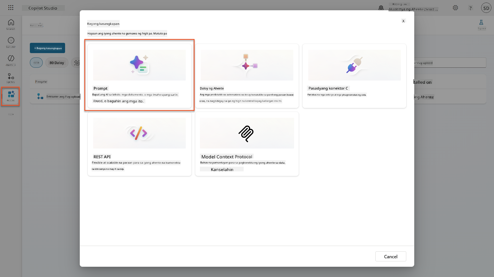

1. **Palitan ang pangalan** ng prompt mula sa default na timestamp name (Hal. *Custom prompt 09/04/2025, 04:59:11 PM*) sa `Summarize Resume`.

1. Sa field ng Instructions, idagdag ang prompt na ito:

    ```text
    You are tasked with extracting key candidate information from a resume and cover letter to facilitate matching with open job roles and creating a summary for application review.
    
    Instructions:
    1. Extract Candidate Details:
        - Identify and extract the candidate’s full name.
        - Extract contact information, specifically the email address.
    2. Create Candidate Summary:
        - Summarize the candidate’s profile as multiline text (max 2000 characters) with the following sections:
            - Candidate name
            - Role(s) applied for if present
            - Contact and location
            - One-paragraph summary
            - Experience snapshot (last 2–3 roles with outcomes)
            - Key projects (1–3 with metrics)
            - Education and certifications
            - Top skills (Top 10)
            - Availability and work authorization
    
    Guidelines:
    - Extract information only from the provided resume and cover letter documents.
    - Ensure accuracy in identifying all details such as contact details and skills.
    - The summary should be concise but informative, suitable for quick application review.
    
    Resume: /document
    CoverLetter: /text
    ```

    !!! tip "Gamitin ang Copilot assistance"
        Maaari mong gamitin ang "Get started with Copilot" upang makabuo ng iyong prompt gamit ang natural na wika. Subukang tanungin ang Copilot na gumawa ng prompt para i-summarize ang isang resume!

1. **I-configure** ang input parameters:

    | Parameter | Uri | Pangalan | Sample na Data |
    |-----------|------|------|-------------|
    | Resume | Imahe o dokumento | Resume | Mag-upload ng sample na resume mula sa test-data folder |
    | CoverLetter | Teksto | CoverLetter | Narito ang isang Resume! |

1. Piliin ang **Test** upang makita ang initial na text output mula sa iyong prompt.  
    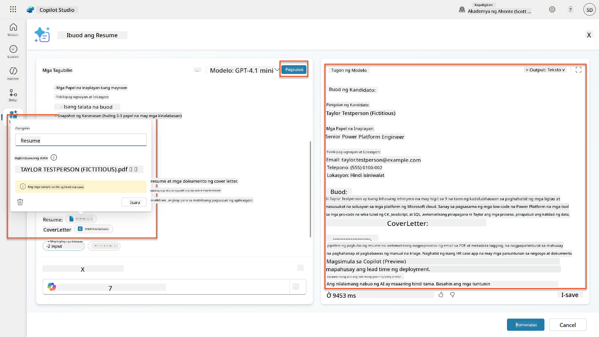

### 7.2 I-configure ang JSON output

Ngayon ay iko-convert mo ang prompt upang mag-output ng structured JSON data sa halip na plain text.

1. Idagdag ang JSON format specification na ito sa dulo ng iyong prompt instructions:

    ```text
    Output Format:
    Provide the output in valid JSON format with the following structure:
    
    {
        "CandidateName": "string",
        "Email": "string",
        "Summary": "string max 2000 characters",
        "Skills": [ {"item": "Skill 1"}, {"item": "Skill 2"}],
        "Experience": [ {"item": "Experience 1"}, {"item": "Experience 2"}],
    }
    ```

1. Baguhin ang **Output** setting mula "Text" sa **JSON**.

1. Piliin ang **Test** muli upang i-verify na ang output ay naka-format na bilang JSON.  
    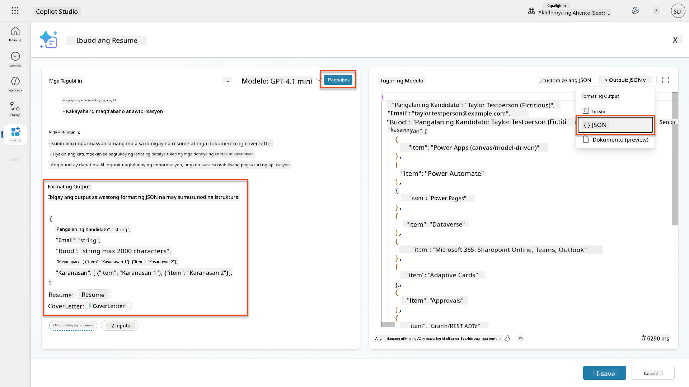

1. **Opsyonal:** Mag-eksperimento sa iba't ibang AI models upang makita kung paano nagkakaiba ang outputs, pagkatapos bumalik sa default na modelo.

1. Piliin ang **Save** upang gumawa ng prompt.

1. Sa **Configure for use in Agent** dialog, piliin ang **Cancel**.

    !!! info "Bakit hindi natin ito idinadagdag bilang tool pa"
        Gagamitin mo ang prompt na ito sa isang Agent Flow sa halip na direkta bilang tool, na nagbibigay sa iyo ng mas maraming kontrol sa workflow ng pagproseso ng data.

### 7.3 Idagdag ang prompt sa isang Agent Flow

Gagawa ka ng Agent Flow na gumagamit ng iyong prompt upang iproseso ang mga resume na naka-store sa Dataverse.

!!! tip "Mga Expression sa Agent Flow"
    Napakahalaga na sundin mo ang mga tagubilin para sa pag-name ng iyong mga nodes at pag-enter ng mga expression nang eksakto dahil ang mga expression ay tumutukoy sa mga nakaraang nodes gamit ang kanilang pangalan! Sumangguni sa [Agent Flow mission in Recruit](../../recruit/09-add-an-agent-flow/README.md#you-mentioned-expressions-what-are-expressions) para sa mabilisang refresher!

1. Mag-navigate sa iyong **Hiring Agent** sa loob ng Copilot Studio

1. Piliin ang **Agents** tab, at piliin ang child **Application Intake Agent**

1. Sa loob ng **Tools** panel, Piliin ang **+ Add** → **+ New tool** → **Agent flow**

1. Piliin ang When an agent calls the flow node, gamitin ang **+ Add an input** upang idagdag ang sumusunod na parameter:

    | Uri | Pangalan | Deskripsyon |
    |------|------|-------------|
    | Teksto | ResumeNumber | Siguraduhing gamitin ang [ResumeNumber]. Dapat palaging magsimula ito sa letrang R |

1. Piliin ang **+** Insert action icon sa ibaba ng unang node, hanapin ang **Dataverse**, piliin ang **See more**, at pagkatapos hanapin ang **List rows** action

1. Piliin ang **ellipsis (...)** sa List rows node, at piliin ang **Rename** sa `Get Resume Record`, at pagkatapos itakda ang sumusunod na mga parameter:

    | Ari-arian | Paano Itakda | Halaga |
    |----------|------------|-------|
    | **Table name** | Piliin | Resumes |
    | **Filter rows** | Dynamic data (thunderbolt icon) | `ppa_resumenumber eq 'ResumeNumber'` Palitan ang **ResumeNumber** ng **When an agent calls the flow** → **ResumeNumber** |
    | **Row count** | I-enter | 1 |

    !!! tip "I-optimize ang mga query!"
        Kapag ginagamit ang teknik na ito sa produksyon, palaging limitahan ang mga column na pinipili sa mga kinakailangan lamang ng Agent Flow.

    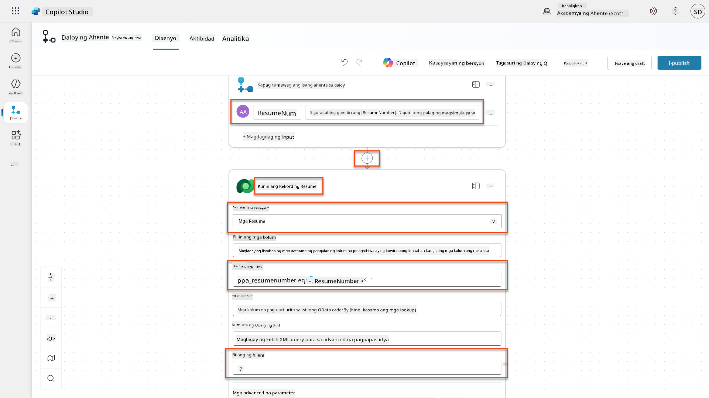

1. Piliin ang **+** Insert action icon sa ibaba ng Get Resume Record node, hanapin ang **Dataverse**, piliin ang **See more**, at pagkatapos hanapin ang **Download a file or an image** action.

    !!! tip "Piliin ang tamang action!"
        Siguraduhing hindi piliin ang action na nagtatapos sa "from selected environment"

1. Tulad ng dati, palitan ang pangalan ng action sa `Download Resume`, at pagkatapos itakda ang sumusunod na mga parameter:

    | Ari-arian | Paano Itakda | Halaga |
    |----------|------------|-------|
    | **Table name** | Piliin | Resumes |
    | **Row ID** | Expression (fx icon) | `first(body('Get_Resume_Record')?['value'])?['ppa_resumeid']` |
    | **Column name** | Piliin | Resume PDF |

    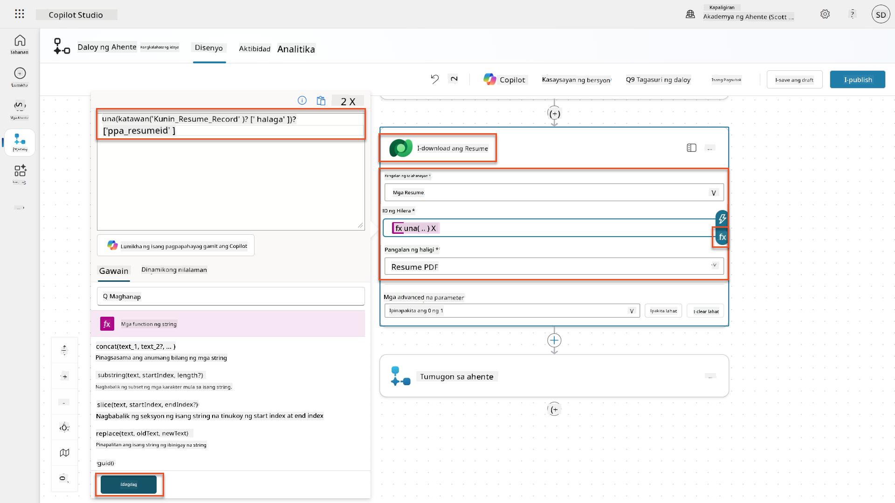

1. Ngayon, piliin ang **+** Insert action icon sa ibaba ng Download Resume, sa ilalim ng **AI capabilities**, piliin ang **Run a prompt**,

1. Palitan ang pangalan ng action sa `Summarize Resume` at itakda ang sumusunod na mga parameter:

    | Ari-arian | Paano Itakda | Halaga |
    |----------|------------|-------|
| **Prompt** | Piliin | I-summarize ang Resume |
| **CoverLetter** | Expression (fx icon) | `first(body('Get_Resume_Record')?['value'])?['ppa_coverletter']` |
| **Resume** | Dynamic data (thunderbolt icon) | I-download ang Resume → File o nilalaman ng imahe |

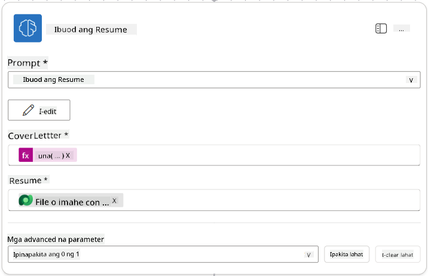

!!! tip "Mga Parameter ng Prompt"
    Pansinin na ang mga parameter na pinupunan mo ay pareho sa mga na-configure mo bilang input parameters noong ginawa mo ang iyong prompt.

### 7.4 Gumawa ng rekord ng kandidato

Susunod, kailangan mong kunin ang impormasyon na ibinigay ng Prompt at gumawa ng bagong rekord ng kandidato kung wala pa ito.

1. Piliin ang **+** Insert action icon sa ibaba ng Summarize Resume node, maghanap ng **Dataverse**, piliin ang **See more**, at hanapin ang **List rows** action.

1. Palitan ang pangalan ng node bilang `Get Existing Candidate`, at itakda ang mga sumusunod na parameter:

    | Property | Paano Itakda | Halaga |
    |----------|--------------|--------|
    | **Table name** | Piliin | Candidates |
    | **Filter rows** | Dynamic data (thunderbolt icon) | `ppa_email eq 'Email'`  **Palitan** ang `Email` ng **Summarize Resume → Email** |
    | **Row count** | Ipasok | 1 |

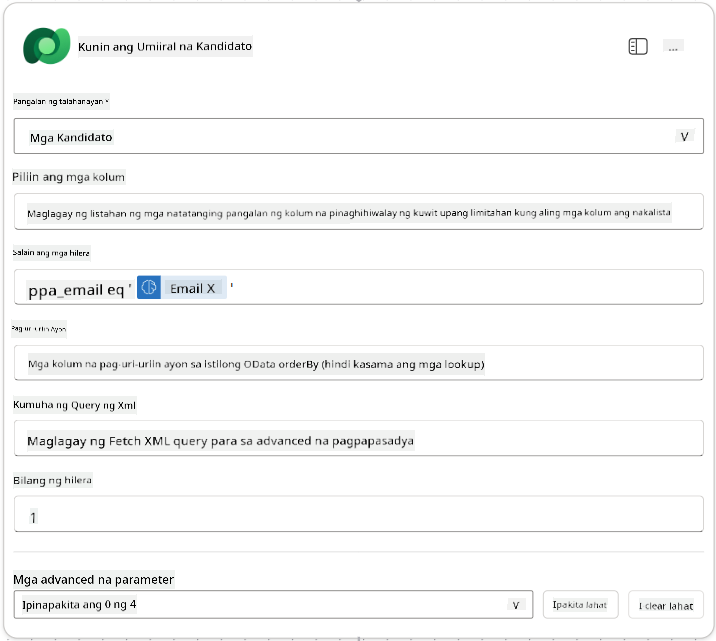

1. Piliin ang **+** Insert action icon sa ibaba ng Get Existing Candidate node, maghanap ng **Control**, piliin ang **See more**, at hanapin ang **Condition** action.

1. Sa mga property ng kondisyon, itakda ang sumusunod na kondisyon:

    | Kondisyon | Operator | Halaga |
    |-----------|----------|--------|
    | Expression (fx icon): `length(outputs('Get_Existing_Candidate')?['body/value'])` | is equal to | 0 |

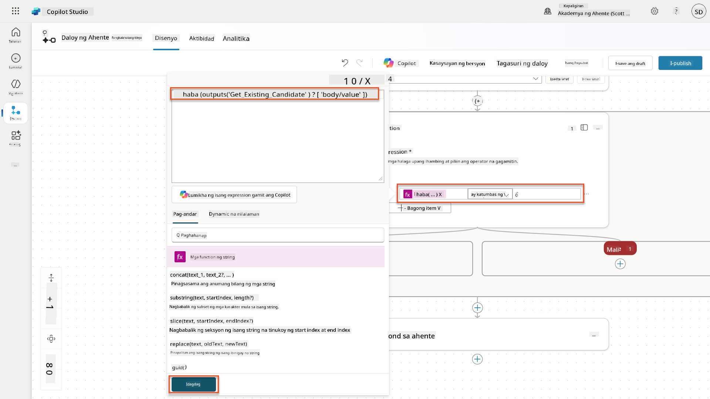

1. Piliin ang **+** Insert action icon sa **True** branch, maghanap ng **Dataverse**, piliin ang **See more**, at hanapin ang **Add a new row** action.

1. Palitan ang pangalan ng node bilang `Add a New Candidate`, at itakda ang mga sumusunod na parameter:

    | Property | Paano Itakda | Halaga |
    |----------|--------------|--------|
    | **Table name** | Piliin | Candidates |
    | **Candidate Name** | Dynamic data (thunderbolt icon) | Summarize Resume → `CandidateName` |
    | **Email** | Dynamic data (thunderbolt icon) | Summarize Resume → `Email` |

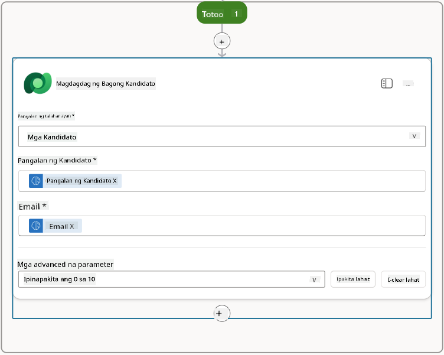

### 7.5 I-update ang resume at i-configure ang mga output ng flow

Kumpletuhin ang flow sa pamamagitan ng pag-update ng rekord ng resume at pag-configure kung anong data ang ibabalik sa iyong agent.

1. Piliin ang **+** Insert action icon sa ibaba ng kondisyon, maghanap ng **Dataverse**, piliin ang **See more**, at hanapin ang **Update a row** action.

1. Piliin ang pamagat upang palitan ang pangalan ng node bilang `Update Resume`, piliin ang **Show all**, at itakda ang mga sumusunod na parameter:

    | Property | Paano Itakda | Halaga |
    |----------|--------------|--------|
    | **Table name** | Piliin | Resumes |
    | **Row ID** | Expression (fx icon) | `first(body('Get_Resume_Record')?['value'])?['ppa_resumeid']` |
    | **Summary** | Dynamic data (thunderbolt icon) | Summarize Resume → Text |
    | **Candidate (Candidates)** | Expression (fx icon) | `if(equals(length(outputs('Get_Existing_Candidate')?['body/value']), 1), first(outputs('Get_Existing_Candidate')?['body/value'])?['ppa_candidateid'], outputs('Add_a_New_Candidate')?['body/ppa_candidateid'])` |

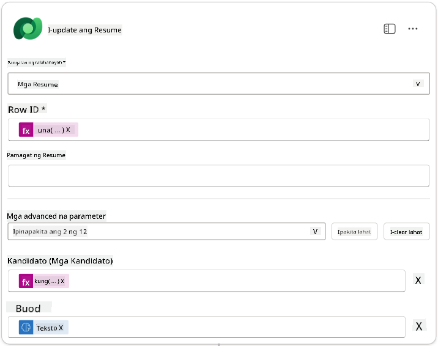

1. Piliin ang **Respond to the agent** node at pagkatapos gamitin ang **+ Add an output** upang i-configure:

    | Uri | Pangalan            | Paano Itakda                  | Halaga                                                        | Deskripsyon                                            |
    | ---- | ------------------- | ----------------------------- | ------------------------------------------------------------- | ------------------------------------------------------ |
    | Text | `CandidateName`     | Dynamic data (thunderbolt icon) | Summarize Resume → See more → CandidateName                  | Ang [CandidateName] na ibinigay sa Resume              |
    | Text | `CandidateEmail`    | Dynamic data (thunderbolt icon) | Summarize Resume → See more → Email                          | Ang [CandidateEmail] na ibinigay sa Resume             |
    | Text | `CandidateNumber`   | Expression (fx icon)          | `concat('ppa_candidates/', if(equals(length(outputs('Get_Existing_Candidate')?['body/value']), 1), first(outputs('Get_Existing_Candidate')?['body/value'])?['ppa_candidateid'], outputs('Add_a_New_Candidate')?['body/ppa_candidateid']) )` | Ang [CandidateNumber] ng bagong o umiiral na kandidato |
    | Text | `ResumeSummary`     | Dynamic data (thunderbolt icon) | Summarize Resume → See more → body/responsev2/predictionOutput/structuredOutput | Ang buod ng resume at mga detalye sa JSON form         |

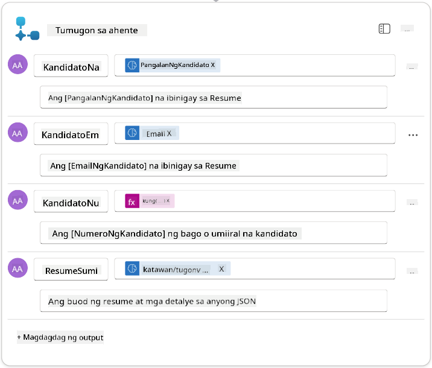

1. Piliin ang **Save draft** sa kanang itaas. Ang iyong Agent Flow ay dapat magmukhang ganito:  
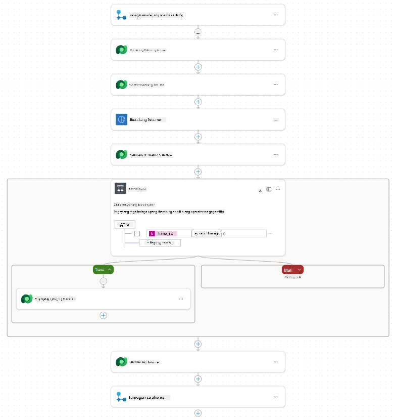

1. Piliin ang **Overview** tab, Piliin ang **Edit** sa **Details** panel.

    1. **Flow name**:`Summarize Resume`
    1. **Description**:

        ```text
        Summarize an existing Resume stored in Dataverse using a [ResumeNumber] as input, return the [CandidateNumber], and resume summary JSON
        ```

1. Piliin ang **Save**.

1. Piliin ang **Designer** tab muli, at piliin ang **Publish**.

### 7.6 Ikonekta ang flow sa iyong agent

Ngayon, idadagdag mo ang flow bilang isang tool at i-configure ang iyong agent upang gamitin ito.

1. Buksan ang iyong **Hiring Agent** sa loob ng Copilot Studio.

1. Piliin ang **Agents** tab, at buksan ang **Application Intake Agent**.

1. Piliin ang **Tools** panel, at Piliin ang **+ Add a tool** - > **Flow** -> **Summarize Resume** **(Agent Flow)**.

1. Piliin ang **Add and configure**.

1. I-configure ang mga setting ng tool tulad ng sumusunod:

    | Setting | Halaga |
    |---------|-------|
    | **Description** | I-summarize ang isang umiiral na Resume na nakaimbak sa Dataverse gamit ang isang [ResumeNumber] bilang input, ibalik ang [CandidateNumber], at buod ng resume sa JSON |
    | **When this tool may be used** | Kapag tinukoy lamang ng mga paksa o agent |

1. Piliin ang **Save**  
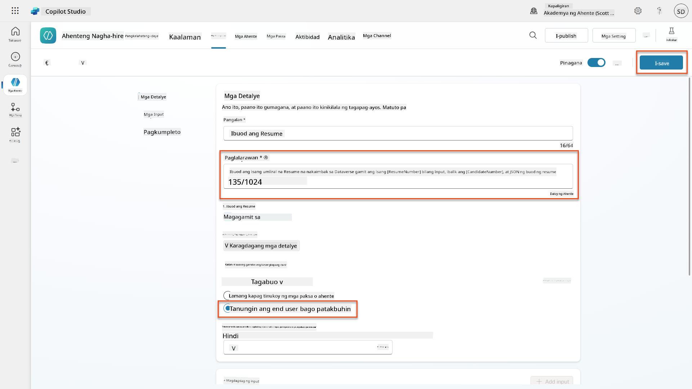

1. Kung pipiliin mo ang Tools sa loob ng Hiring Agent, makikita mo na ngayon ang parehong mga tool na nagpapakita na magagamit ang mga ito ng **Application Intake Agent**.  
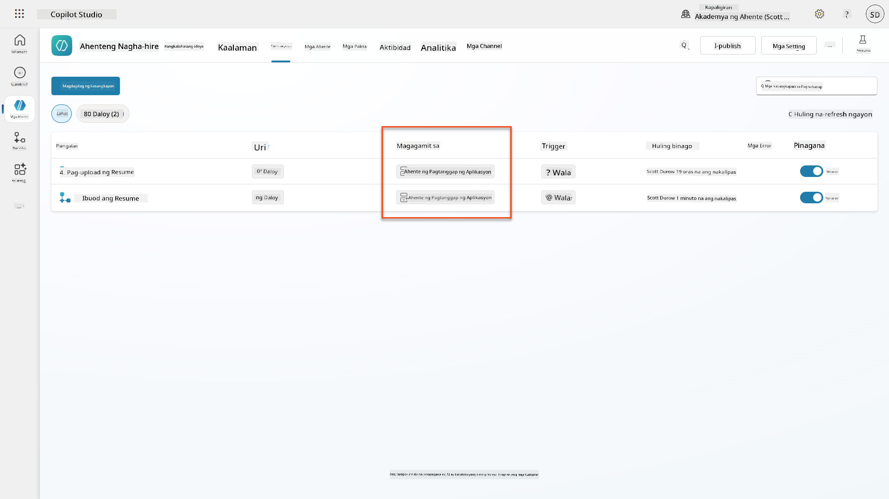

1. Pumunta sa **Application Intake Child** agent Instructions, at baguhin ang **Post-Upload** step sa sumusunod:

    ```text
    2. Post-Upload Processing  
        - After uploading, be sure to also output the [ResumeNumber] in all messages
        - Pass [ResumeNumber] to /Summarize Resume  - Be sure to use the correct value that will start with the letter R.
        - Be sure to also output the [CandidateNumber] in all messages
        - Use the [ResumeSummary] to output a summary of the processed Resume and candidate
    ```

    Palitan ang `/Summarize Resume` sa pamamagitan ng pagpasok ng reference sa **Summarize Resume agent flow** sa pamamagitan ng pag-type ng forward slash (`/)` o pagpili ng `/Summarize` upang ipasok ang reference.  
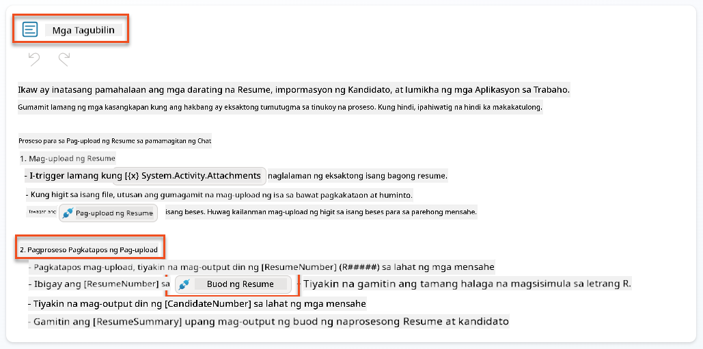

1. Piliin ang **Save**.

### 7.7 Subukan ang iyong agent

Subukan ang iyong kumpletong multimodal system upang matiyak na gumagana ito nang tama.

1. **Simulan ang pagsubok**:

    - Piliin ang **Test** upang buksan ang test panel.
    - I-type: `Narito ang Resume ng isang kandidato`.

    - Mag-upload ng isa sa mga sample resume mula sa [Test Resumes](https://download-directory.github.io/?url=https://github.com/microsoft/agent-academy/tree/main/operative/sample-data/resumes&filename=operative_sampledata).

1. **I-verify ang mga resulta**:
    - Kapag naipadala mo ang mensahe at resume, tingnan na nakatanggap ka ng Resume Number (format: R#####).
    - I-verify na nakakuha ka ng Candidate Number at buod.
    - Gamitin ang activity map upang makita ang parehong Resume upload tool at Summarize Resume tool sa aksyon, at ang mga output ng Summary Prompt ay natanggap ng agent:  
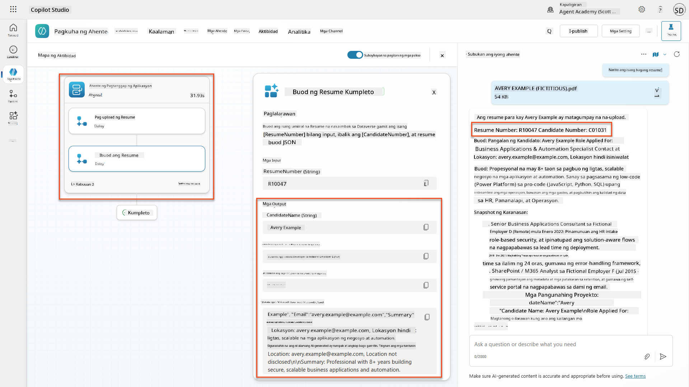

1. **Suriin ang data persistence**:
    - Pumunta sa [Power Apps](https://make.powerapps.com).
    - Buksan ang **Apps** → **Hiring Hub** → **Play**.
    - Pumunta sa **Resumes** upang i-verify na na-upload at naproseso ang resume. Dapat itong may parehong impormasyon ng buod at kaugnay na rekord ng kandidato.
    - Suriin ang **Candidates** upang makita ang nakuha na impormasyon ng kandidato.  
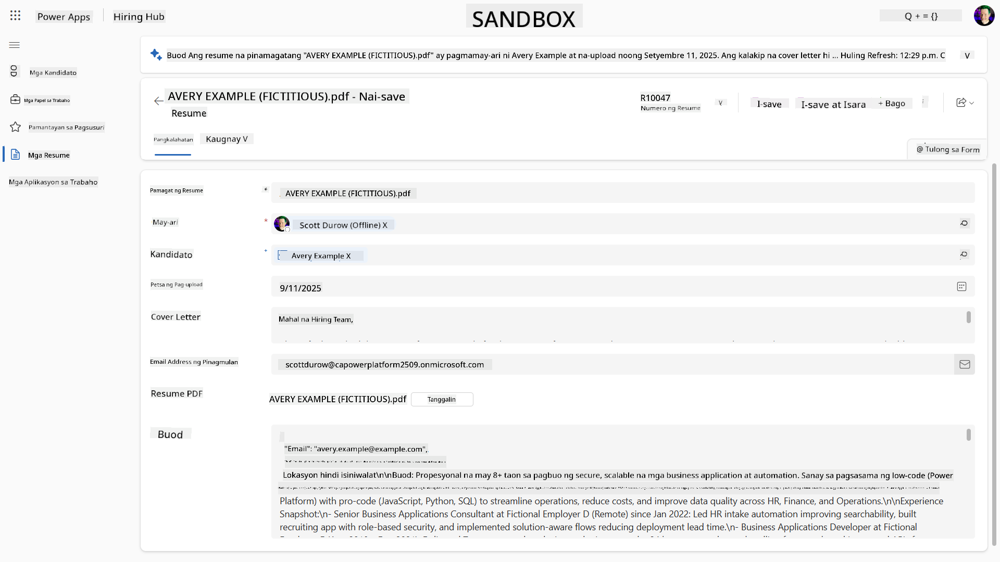
    - Kapag inulit mo ang proseso, dapat gamitin nito ang umiiral na Kandidato (na tumutugma sa email na nakuha mula sa resume) sa halip na gumawa ng bago.

!!! tip "Pag-aayos ng Problema"
    - **Resume hindi naproseso**: Siguraduhing ang file ay PDF at nasa tamang limitasyon ng laki.
    - **Walang kandidato na ginawa**: Suriin na ang email ay tama ang pagkakakuha mula sa resume.
    - **Mga error sa JSON format**: Siguraduhin na ang iyong prompt instructions ay may eksaktong JSON structure.
    - **Mga error sa flow**: Suriin na ang lahat ng Dataverse connections at expressions ay tama ang pagkaka-configure.

### Kahandaan para sa produksyon

Bagamat hindi bahagi ng misyon na ito, upang gawing handa para sa produksyon ang agent flow na ito, maaari mo ring isaalang-alang ang mga sumusunod:

1. **Pag-aayos ng error** - Kung ang Resume Number ay hindi natagpuan, o ang prompt ay nabigong i-parse ang dokumento, dapat idagdag ang pag-aayos ng error upang magbalik ng malinaw na error sa agent.
1. **Pag-update ng umiiral na Kandidato** - Ang kandidato ay natagpuan gamit ang email, pagkatapos ay maaaring i-update ang pangalan upang tumugma sa nasa resume.
1. **Paghiwalay ng Resume summarization at Candidate creation** - Ang functionality na ito ay maaaring hatiin sa mas maliliit na agent flows upang gawing mas madali ang pag-maintain, at pagkatapos ay bibigyan ang agent ng mga tagubilin upang gamitin ang mga ito nang sunod-sunod.

## 🎉 Misyon Kumpleto

Mahusay na trabaho, Operative! **Document Resume Recon** ay tapos na. Matagumpay mong na-master ang multimodal prompts at maaari ka nang kumuha ng structured data mula sa anumang dokumento nang may precision.

Narito ang iyong mga nagawa sa misyon na ito:

**✅ Mastery sa Multimodal Prompt**  
Naiintindihan mo na ngayon kung ano ang multimodal prompts at kailan gagamit ng iba't ibang AI models para sa optimal na resulta.

**✅ Eksperto sa pagproseso ng dokumento**  
Natutunan mo kung paano i-configure ang mga prompt gamit ang input ng imahe at dokumento, at i-format ang mga output bilang JSON para sa structured data extraction.

**✅ Sistema ng pagkuha ng resume**  
Nakapagtayo ka ng kumpletong sistema ng pagkuha ng resume na nagpoproseso ng mga dokumento ng kandidato at nag-iintegrate sa iyong hiring workflow.

**✅ Implementasyon ng best practices**  
Na-apply mo ang best practices para sa prompt engineering gamit ang document analysis at na-integrate ang multimodal prompts sa Agent Flows.

**✅ Pundasyon para sa advanced processing**  
Ang iyong pinahusay na kakayahan sa document analysis ay handa na para sa mga advanced na data grounding features na idaragdag natin sa mga susunod na misyon.

🚀 **Susunod:** Sa Mission 08, matutuklasan mo kung paano pahusayin ang iyong mga prompt gamit ang real-time data mula sa Dataverse, na lumilikha ng dynamic AI solutions na umaangkop sa nagbabagong mga pangangailangan ng negosyo.

⏩ [Pumunta sa Mission 08: Enhanced prompts with Dataverse grounding](../08-dataverse-grounding/README.md)

## 📚 Mga Taktikal na Resources

📖 [Gumawa ng prompt](https://learn.microsoft.com/ai-builder/create-a-custom-prompt?WT.mc_id=power-power-182762-scottdurow)

📖 [Magdagdag ng text, imahe, o dokumento input sa iyong prompt](https://learn.microsoft.com/ai-builder/add-inputs-prompt?WT.mc_id=power-182762-scottdurow)

📖 [Proseso ng mga response gamit ang JSON output](https://learn.microsoft.com/ai-builder/process-responses-json-output?WT.mc_id=power-182762-scottdurow)

📖 [Pagpili ng modelo at mga setting ng temperatura](https://learn.microsoft.com/ai-builder/prompt-modelsettings?WT.mc_id=power-182762-scottdurow)

📖 [Gamitin ang iyong prompt sa Power Automate](https://learn.microsoft.com/ai-builder/use-a-custom-prompt-in-flow?WT.mc_id=power-182762-scottdurow)

📺 [AI Builder: JSON outputs sa prompt builder](https://www.youtube.com/watch?v=F0fGnWrRY_I)

---

**Paunawa**:  
Ang dokumentong ito ay isinalin gamit ang AI translation service na [Co-op Translator](https://github.com/Azure/co-op-translator). Bagamat sinisikap naming maging tumpak, mangyaring tandaan na ang mga awtomatikong pagsasalin ay maaaring maglaman ng mga pagkakamali o hindi pagkakatugma. Ang orihinal na dokumento sa kanyang katutubong wika ang dapat ituring na mapagkakatiwalaang pinagmulan. Para sa mahalagang impormasyon, inirerekomenda ang propesyonal na pagsasalin ng tao. Hindi kami mananagot sa anumang hindi pagkakaunawaan o maling interpretasyon na dulot ng paggamit ng pagsasaling ito.