<!--
CO_OP_TRANSLATOR_METADATA:
{
  "original_hash": "750f3ea8a94930439ebd8a10871b1d73",
  "translation_date": "2025-10-22T18:56:36+00:00",
  "source_file": "docs/operative-preview/08-dataverse-grounding/README.md",
  "language_code": "tl"
}
-->
# 🚨 Misyon 08: Pinahusay na mga prompt gamit ang Dataverse grounding

--8<-- "disclaimer.md"

## 🕵️‍♂️ CODENAME: `OPERATION GROUNDING CONTROL`

> **⏱️ Oras ng Operasyon:** `~60 minuto`

## 🎯 Layunin ng Misyon

Maligayang pagbabalik, Operatibo. Ang iyong multi-agent hiring system ay gumagana na, ngunit may mahalagang pagpapahusay na kinakailangan para sa **data grounding** - kailangang magkaroon ng real-time na access ang iyong mga AI model sa naka-istrukturang data ng iyong organisasyon upang makagawa ng matalinong desisyon.

Sa kasalukuyan, ang iyong Summarize Resume prompt ay gumagana gamit ang static na kaalaman. Ngunit paano kung maaari itong direktang ma-access ang iyong database ng mga job roles upang magbigay ng tumpak at napapanahong mga tugma? Paano kung nauunawaan nito ang iyong mga pamantayan sa pagsusuri nang hindi mo kailangang i-hardcode ang mga ito?

Sa misyon na ito, papahusayin mo ang iyong custom prompt gamit ang **Dataverse grounding** - ikokonekta ang iyong mga prompt nang direkta sa mga live na data source. Binabago nito ang iyong mga agent mula sa static na mga responder patungo sa dynamic, data-driven na mga sistema na umaangkop sa nagbabagong pangangailangan ng negosyo.

Ang iyong misyon: isama ang real-time na data ng job role at pamantayan sa pagsusuri sa iyong workflow ng pagsusuri ng resume, na lumilikha ng isang self-updating na sistema na nananatiling kasalukuyan sa mga pangangailangan sa pagkuha ng iyong organisasyon.

## 🔎 Mga Layunin

Sa misyon na ito, matututunan mo:

1. Paano pinapahusay ng **Dataverse grounding** ang mga custom prompt
1. Kailan gagamit ng data grounding kumpara sa static na mga tagubilin
1. Pagdidisenyo ng mga prompt na dynamic na isinasama ang live na data
1. Pagpapahusay sa Summarize Resume flow gamit ang job role matching

## 🧠 Pag-unawa sa Dataverse grounding para sa mga prompt

Ang **Dataverse grounding** ay nagbibigay-daan sa iyong mga custom prompt na ma-access ang live na data mula sa iyong mga Dataverse table kapag nagpoproseso ng mga kahilingan. Sa halip na static na mga tagubilin, maaaring isama ng iyong mga prompt ang real-time na impormasyon upang makagawa ng mas matalinong desisyon.

### Bakit mahalaga ang Dataverse grounding

Ang tradisyunal na mga prompt ay gumagana gamit ang fixed na mga tagubilin:

```text
Match this candidate to these job roles: Developer, Manager, Analyst
```

Sa Dataverse grounding, ang iyong prompt ay nag-a-access ng kasalukuyang data:

```text
Match this candidate to available job roles from the Job Roles table, 
considering current evaluation criteria and requirements
```

Ang approach na ito ay nagbibigay ng ilang mahahalagang benepisyo:

- **Dynamic na mga update:** Ang mga job role at pamantayan ay nagbabago nang hindi kinakailangang baguhin ang prompt
- **Pagkakapare-pareho:** Lahat ng agent ay gumagamit ng parehong kasalukuyang data source
- **Scalability:** Ang mga bagong role at pamantayan ay awtomatikong magagamit
- **Katumpakan:** Ang real-time na data ay tinitiyak na ang mga desisyon ay sumasalamin sa kasalukuyang pangangailangan

### Paano gumagana ang Dataverse grounding

Kapag pinagana mo ang Dataverse grounding para sa isang custom prompt:

1. **Pagpili ng data:** Pumili ng mga partikular na Dataverse table at column na isasama. Maaari ka ring pumili ng mga kaugnay na table na ifi-filter ng sistema batay sa mga parent record na nakuha.
1. **Pag-inject ng context:** Awtomatikong isinasama ng prompt ang nakuha na data sa prompt context
1. **Intelligent filtering:** Isinasama lamang ng sistema ang data na nauugnay sa kasalukuyang kahilingan kung magbibigay ka ng anumang filter.
1. **Structured output:** Maaaring i-refer ng iyong prompt ang nakuha na data at mag-reason tungkol sa mga record na nakuha upang lumikha ng output.

### Mula static patungo sa dynamic: Ang grounding advantage

Suriin natin ang iyong kasalukuyang Summarize Resume flow mula sa Misyon 07 at tingnan kung paano binabago ng Dataverse grounding ang static intelligence patungo sa dynamic intelligence.

**Kasalukuyang static na approach:**
Ang iyong umiiral na prompt ay naglalaman ng hardcoded na pamantayan sa pagsusuri at predetermined na matching logic. Gumagana ang approach na ito ngunit nangangailangan ng manual na update tuwing magdadagdag ka ng mga bagong job role, magbabago ng pamantayan sa pagsusuri, o magbabago ng mga priyoridad ng kumpanya.

**Transformasyon gamit ang Dataverse grounding:**
Sa pamamagitan ng pagdaragdag ng Dataverse grounding, ang iyong Summarize Resume flow ay:

- **Nag-a-access sa kasalukuyang job roles** mula sa iyong Job Roles table
- **Gumagamit ng live na pamantayan sa pagsusuri** sa halip na static na mga deskripsyon  
- **Nagbibigay ng tumpak na mga tugma** batay sa mga real-time na pangangailangan

## 🎯 Bakit dedicated prompts kumpara sa agent conversations

Sa Misyon 02, naranasan mo kung paano maaaring mag-match ang Interview Agent ng mga kandidato sa mga job role, ngunit nangangailangan ng mas kumplikadong user prompts tulad ng:

```text
Upload this resume, then show me open job roles,
each with a description of the evaluation criteria, 
then use this to match the resume to at least one suitable
job role even if not a perfect match.
```

Bagamat gumagana ito, ang dedicated prompts na may Dataverse grounding ay nag-aalok ng makabuluhang mga benepisyo para sa mga partikular na gawain:

### Mga pangunahing benepisyo ng dedicated prompts

| Aspeto | Agent Conversations | Dedicated Prompts |
|--------|-------------------|------------------|
| **Pagkakapare-pareho** | Nag-iiba ang resulta batay sa kasanayan ng user sa paggawa ng prompt | Standardized na pagpoproseso sa bawat pagkakataon |
| **Espesyalisasyon** | Ang general-purpose na reasoning ay maaaring hindi makuha ang mga nuances ng negosyo | Purpose-built na may optimized na business logic |
| **Automation** | Nangangailangan ng interaksyon at interpretasyon ng tao | Awtomatikong nagti-trigger na may structured na JSON output |

## 🧪 Lab 8: Magdagdag ng Dataverse grounding sa mga prompt

Panahon na upang i-upgrade ang iyong kakayahan sa pagsusuri ng resume! Papahusayin mo ang umiiral na Summarize Resume flow gamit ang dynamic na job role matching.

### Mga kinakailangan upang makumpleto ang misyon na ito

1. Kailangan mo **either**:

    - **Natapos ang Misyon 07** at handa na ang iyong sistema ng pagsusuri ng resume, **O**
    - **I-import ang Mission 08 starter solution** kung magsisimula ka pa lang o kailangang humabol. [I-download ang Mission 08 Starter Solution](https://aka.ms/agent-academy)

1. Mga sample na dokumento ng resume mula sa [test Resumes](https://download-directory.github.io/?url=https://github.com/microsoft/agent-academy/tree/main/operative/sample-data/resumes&filename=operative_sampledata)

!!! note "Solution Import and Sample Data"
    Kung gagamit ka ng starter solution, sumangguni sa [Misyon 01](../01-get-started/README.md) para sa detalyadong mga tagubilin kung paano mag-import ng mga solusyon at sample data sa iyong environment.

### 8.1 Magdagdag ng Dataverse grounding sa iyong prompt

Bubuo ka sa Summarize Resume prompt na ginawa mo sa Misyon 07. Sa kasalukuyan, ito ay simpleng nagbubuod ng resume, ngunit ngayon ay igoground mo ito gamit ang mga job role na kasalukuyang nasa Dataverse, na pinapanatili itong laging kasalukuyan.

Una, suriin natin ang mga Dataverse table na igoground mo:

1. **Mag-navigate** sa [Power Apps](https://make.powerapps.com) at piliin ang iyong environment gamit ang **Environment switcher** sa kanang itaas ng navigation bar.

1. Piliin ang **Tables** at hanapin ang **Job Roles** table

1. Suriin ang mga pangunahing column na gagamitin mo para sa grounding:

    | Column | Layunin |
    |--------|---------|
    | **Job Role Number** | Natatanging identifier para sa role matching |
    | **Job Title** | Pangalan ng role |
    | **Description** | Detalyadong mga kinakailangan ng role |

1. Katulad nito, suriin ang iba pang mga table tulad ng **Evaluation Criteria** table.

### 8.2 Magdagdag ng Dataverse grounding data sa iyong prompt

1. **Mag-navigate** sa Copilot Studio, at piliin ang iyong environment gamit ang **Environment switcher** sa kanang itaas ng navigation bar.

1. Piliin ang **Tools** mula sa kaliwang navigation.

1. Piliin ang **Prompt** at hanapin ang iyong **Summarize Resume** prompt mula sa Misyon 07.  
    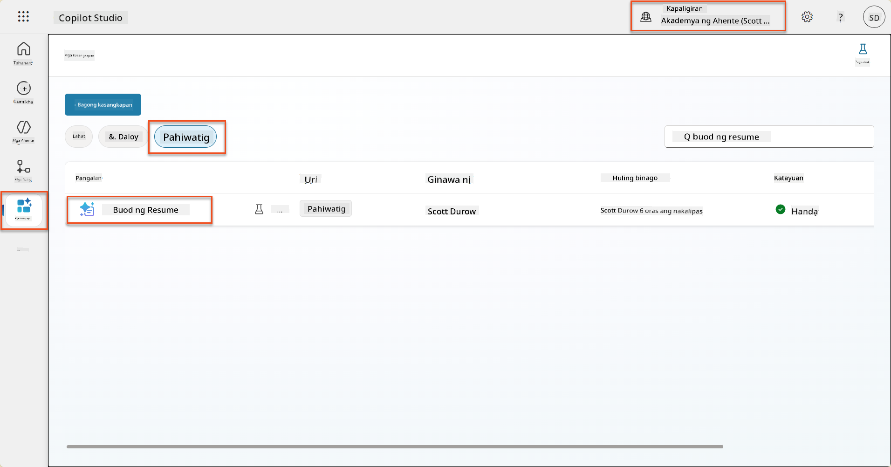

1. Piliin ang **Edit** upang baguhin ang prompt, at palitan ito ng pinahusay na bersyon sa ibaba:

    !!! important
        Tiyaking ang mga parameter ng Resume at Cover Letter ay nananatiling buo bilang mga parameter.

    ```text
    You are tasked with extracting key candidate information from a resume and cover letter to facilitate matching with open job roles and creating a summary for application review.
    
    ### Instructions:
    1. **Extract Candidate Details:**
       - Identify and extract the candidate's full name.
       - Extract contact information, specifically the email address.
    
    2. **Analyze Resume and Cover Letter:**
       - Review the resume content to identify relevant skills, experience, and qualifications.
       - Review the cover letter to understand the candidate's motivation and suitability for the roles.
    
    3. **Match Against Open Job Roles:**
       - Compare the extracted candidate information with the requirements and descriptions of the provided open job roles.
       - Use the job descriptions to assess potential fit.
       - Identify all roles that align with the candidate's cover letter and profile. You don't need to assess perfect suitability.
       - Provide reasoning for each match based on the specific job requirements.
    
    4. **Create Candidate Summary:**
       - Summarize the candidate's profile as multiline text with the following sections:
          - Candidate name
          - Role(s) applied for if present
          - Contact and location
          - One-paragraph summary
          - Top skills (8–10)
          - Experience snapshot (last 2–3 roles with outcomes)
          - Key projects (1–3 with metrics)
          - Education and certifications
          - Availability and work authorization
    
    ### Output Format
    
    Provide the output in valid JSON format with the following structure:
    
    {
      "CandidateName": "string",
      "Email": "string",
      "MatchedRoles": [
        {
          "JobRoleNumber": "ppa_jobrolenumber from grounded data",
          "RoleName": "ppa_jobtitle from grounded data",
          "Reasoning": "Detailed explanation based on job requirements"
        }
      ],
      "Summary": "string"
    }
    
    ### Guidelines
    
    - Extract information only from the provided resume and cover letter documents.
    - Ensure accuracy in identifying contact details.
    - Use the available job role data for matching decisions.
    - The summary should be concise but informative, suitable for quick application review.
    - If no suitable matches are found, indicate an empty list for MatchedRoles and explain briefly in the summary.
    
    ### Input Data
    Open Job Roles (ppa_jobrolenumber, ppa_jobtitle): /Job Role 
    Resume: {Resume}
    Cover Letter: {CoverLetter}
    ```

1. Sa prompt editor, palitan ang `/Job Role` sa pamamagitan ng pagpili sa **+ Add content**, pagpili sa **Dataverse** → **Job Role** at piliin ang mga sumusunod na column, at pagkatapos ay piliin ang **Add**:

    1. **Job Role Number**

    1. **Job Title**

    1. **Description**

    !!! tip
        Maaari kang mag-type ng pangalan ng table upang maghanap.

1. Sa **Job Role** dialog, piliin ang **Filter** attribute, piliin ang **Status**, at pagkatapos ay i-type ang **Active** bilang **Filter** value.  
    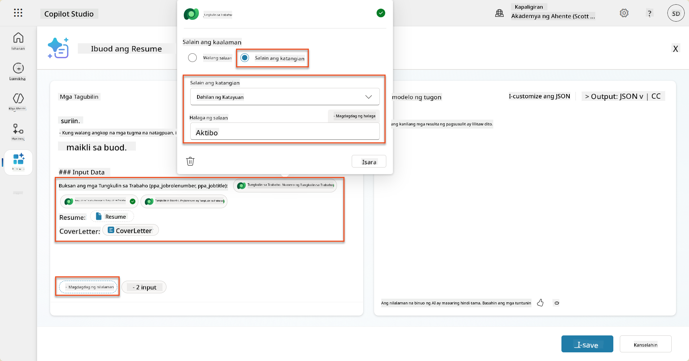

    !!! tip
        Maaari kang gumamit ng **Add value** dito upang magdagdag ng input parameter - halimbawa, kung mayroon kang prompt upang ibuod ang umiiral na record, maaari mong ibigay ang Resume Number bilang parameter upang i-filter.

1. Susunod, magdagdag ka ng kaugnay na Dataverse table **Evaluation Criteria**, sa pamamagitan ng muling pagpili sa **+ Add content**, hanapin ang **Job Roles**, at sa halip na piliin ang mga column sa Job Role, i-expand ang **Job Role (Evaluation Criteria)** at piliin ang mga sumusunod na column, at pagkatapos ay piliin ang **Add**:

    1. **Criteria Name**

    1. **Description**  
        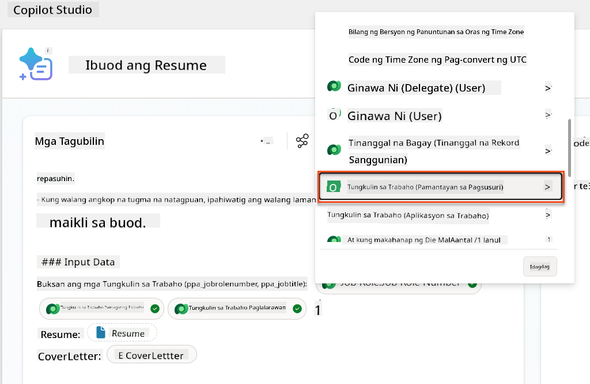

        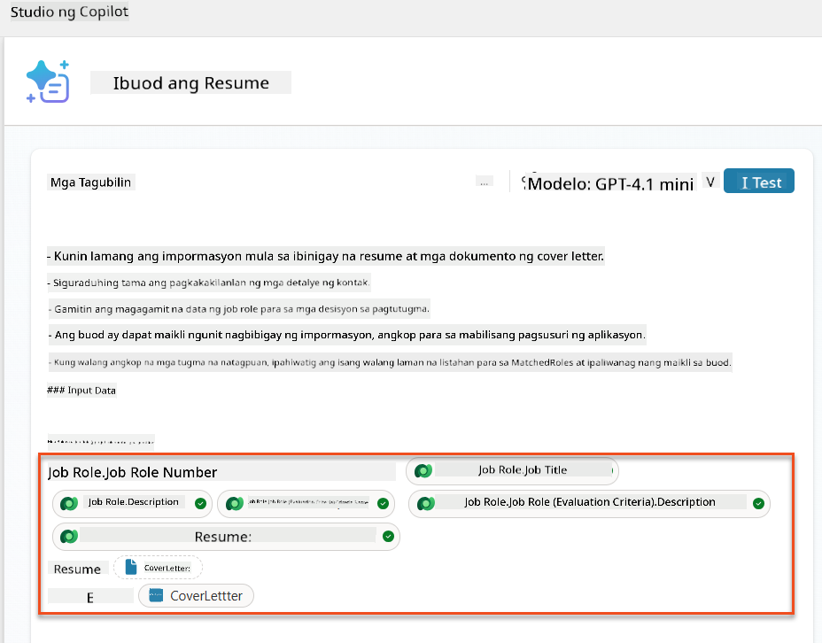

    !!! tip
        Mahalagang piliin ang kaugnay na Evaluation Criteria sa pamamagitan ng unang pagpili sa Job Role, at pagkatapos ay mag-navigate sa menu patungo sa Job Role (Evaluation Criteria). Tinitiyak nito na ang mga kaugnay na record lamang para sa Job Role ang ma-load.

1. Piliin ang **Settings**, at ayusin ang **Record retrieval** sa 1000 - papayagan nito ang maximum na Job Roles at Evaluation criteria na maisama sa iyong prompt.  
    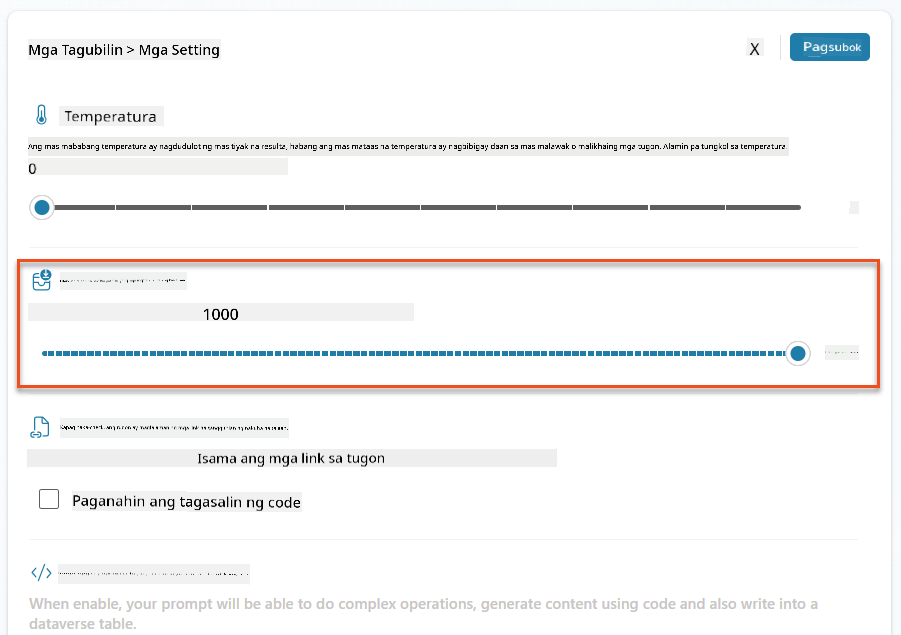

### 8.3 Subukan ang pinahusay na prompt

1. Piliin ang **Resume** parameter, at mag-upload ng sample resume na ginamit mo sa Misyon 07.
1. Piliin ang **Test**.
1. Kapag natapos ang test, mapapansin na ang JSON output ngayon ay may kasamang **Matched Roles**.
1. Piliin ang **Knowledge used** tab, upang makita ang Dataverse data na pinagsama sa iyong prompt bago ang execution.
1. **I-save** ang iyong updated prompt. Awtomatikong isasama ng sistema ang Dataverse data na ito sa iyong prompt kapag tinawag ng umiiral na Summarize Resume Agent Flow.  
    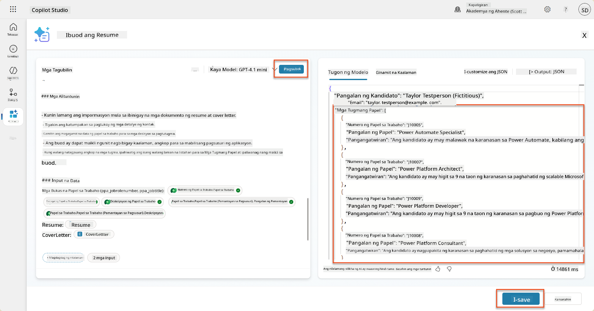

### 8.4 Magdagdag ng Job Application Agent Flow

Upang payagan ang Application Intake Agent na lumikha ng Job Roles batay sa mga iminungkahing role, kailangan nating lumikha ng Agent Flow. Tatawagin ng agent ang tool na ito para sa bawat iminungkahing job role na interesado ang kandidato.

!!! tip "Agent Flow Expressions"
    Mahalagang sundin ang mga tagubilin para sa pag-name ng iyong mga node at pag-enter ng mga expression nang eksakto dahil ang mga expression ay tumutukoy sa mga nakaraang node gamit ang kanilang pangalan! Sumangguni sa [Agent Flow mission sa Recruit](../../recruit/09-add-an-agent-flow/README.md#you-mentioned-expressions-what-are-expressions) para sa mabilisang refresher!

1. Sa loob ng **Hiring Agent,** piliin ang **Agents** tab, at buksan ang **Application Intake Agent** child agent.

1. Sa loob ng **Tools** panel, piliin ang **+ Add** → **+ New tool** → **Agent Flow**

1. Piliin ang **When an agent calls the flow** node, gamitin ang **+ Add an input** upang magdagdag ng mga sumusunod na parameter:

    | Uri | Pangalan            | Deskripsyon                                                  |
    | ---- | --------------- | ------------------------------------------------------------ |
    | Text | `ResumeNumber`  | Siguraduhing gamitin lamang ang [ResumeNumber] - Dapat magsimula sa letrang R |
    | Text | `JobRoleNumber` | Siguraduhing gamitin lamang ang [JobRoleNumber] - Dapat magsimula sa letrang J |

    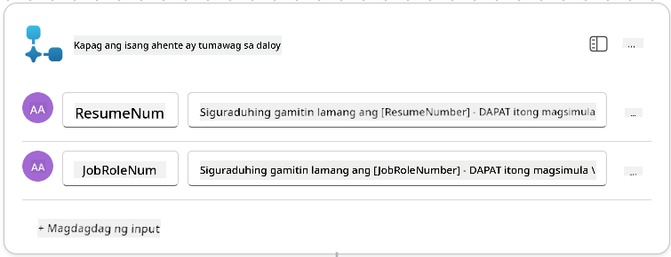

1. Piliin ang **+** Insert action icon sa ibaba ng unang node, maghanap ng **Dataverse**, piliin ang **See more**, at pagkatapos hanapin ang **List rows** action.

1. **Palitan ang pangalan** ng node bilang `Get Resume`, at pagkatapos itakda ang mga sumusunod na parameter:

    | Property        | Paano Itakda                      | Halaga                                                        |
    | --------------- | ------------------------------- | ------------------------------------------------------------ |
    | **Table name**  | Piliin                          | Resumes                                                      |
    | **Filter rows** | Dynamic data (thunderbolt icon) | `ppa_resumenumber eq 'ResumeNumber'` Piliin at palitan ang **ResumeNumber** gamit ang **When an agent calls the flow** → **ResumeNumber** |
    | **Row count**   | I-enter                           | 1                                                            |

    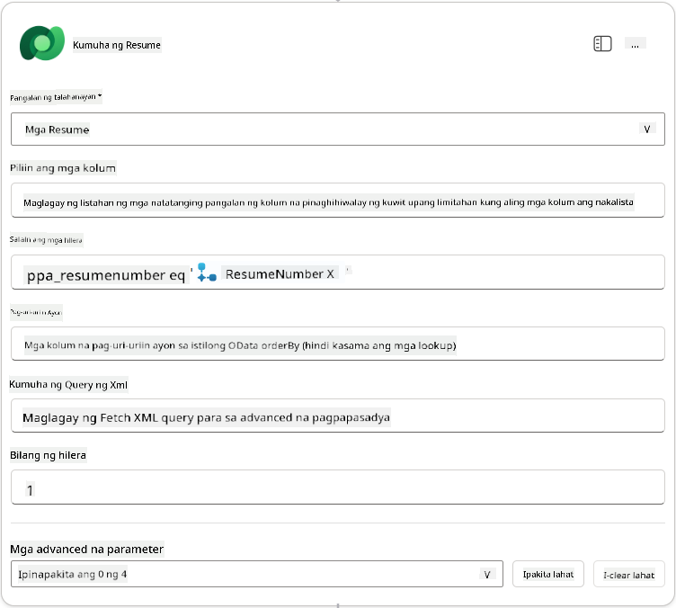

1. Ngayon, piliin ang **+** Insert action icon sa ibaba ng **Get Resume**, maghanap ng **Dataverse**, piliin ang **See more**, at pagkatapos hanapin ang **List rows** action.

1. **Palitan ang pangalan** ng node bilang `Get Job Role`, at pagkatapos itakda ang mga sumusunod na parameter:

    | Property        | Paano Itakda                      | Halaga                                                        |
    | --------------- | ------------------------------- | ------------------------------------------------------------ |
    | **Table name**  | Piliin                          | Job Roles                                                    |
    | **Filter rows** | Dynamic data (thunderbolt icon) | `ppa_jobrolenumber eq 'JobRoleNumber'` Piliin at palitan ang **JobRoleNumber** gamit ang **When an agent calls the flow** → **JobRoleNumber** |
    | **Row count**   | I-enter                           | 1                                                            |

    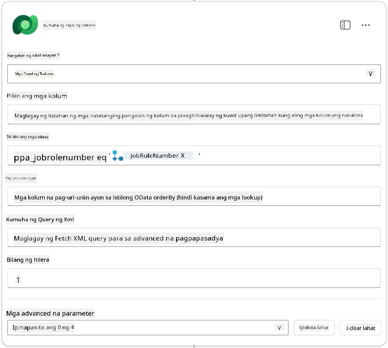

1. Ngayon, piliin ang **+** Insert action icon sa ibaba ng Get Job Role, maghanap ng **Dataverse**, piliin ang **See more**, at pagkatapos hanapin ang **Add a new row** action.

1. **Palitan ang pangalan** ng node bilang `Add Application`, at pagkatapos itakda ang mga sumusunod na parameter:

    | Property                           | Paano Itakda           | Halaga                                                        |
    | ---------------------------------- | -------------------- | ------------------------------------------------------------ |
    | **Table name**                     | Piliin               | Job Applications                                             |
    | **Candidate (Candidates)**             | Expression (fx icon) | `concat('ppa_candidates/',first(outputs('Get_Resume')?['body/value'])?['_ppa_candidate_value'])` |
| **Tungkulin sa Trabaho (Job Roles)**       | Expression (fx icon) | `concat('ppa_jobroles/',first(outputs('Get_Job_Role')?['body/value'])?['ppa_jobroleid'])` |
| **Resume (Mga Resume)**                   | Expression (fx icon) | `concat('ppa_resumes/', first(outputs('Get_Resume')?['body/value'])?['ppa_resumeid'])` |
| **Petsa ng Aplikasyon** (gamitin ang **Ipakita Lahat**) | Expression (fx icon) | `utcNow()`                                                   |

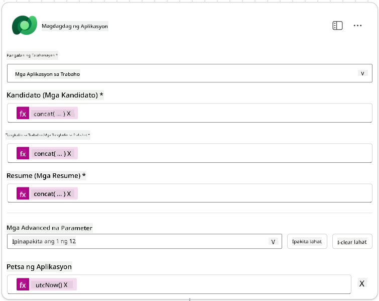

1. Piliin ang **Tumugon sa node ng ahente**, at pagkatapos ay piliin ang **+ Magdagdag ng output**

     | Property        | Paano I-set                   | Detalye                                         |
     | --------------- | ----------------------------- | ----------------------------------------------- |
     | **Uri**         | Piliin                       | `Text`                                          |
     | **Pangalan**    | Ipasok                       | `ApplicationNumber`                             |
     | **Halaga**      | Dynamic data (thunderbolt icon) | *Magdagdag ng Aplikasyon → Tingnan ang Higit Pa → Application Number* |
     | **Deskripsyon** | Ipasok                       | `Ang [ApplicationNumber] ng Job Application na ginawa`      |

     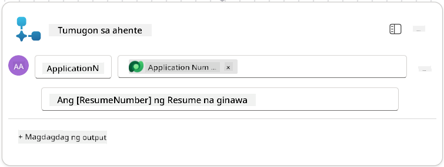

1. Piliin ang **I-save ang draft** sa kanang itaas

1. Piliin ang tab na **Pangkalahatang-ideya**, Piliin ang **I-edit** sa panel ng **Mga Detalye**

      - **Pangalan ng Daloy**:`Create Job Application`
      - **Deskripsyon**:`Gumagawa ng bagong job application kapag ibinigay ang [ResumeNumber] at [JobRoleNumber]`
      - **I-save**

1. Piliin muli ang tab na **Designer**, at piliin ang **I-publish**.

### 8.5 Idagdag ang Create Job Application sa ahente

Ngayon ay ikokonekta mo ang na-publish na daloy sa iyong Application Intake Agent.

1. Bumalik sa **Hiring Agent** at piliin ang tab na **Agents**. Buksan ang **Application Intake Agent**, at pagkatapos ay hanapin ang panel na **Tools**.

1. Piliin ang **+ Magdagdag**

1. Piliin ang filter na **Flow**, at hanapin ang `Create Job Application`. Piliin ang daloy na **Create Job Application**, at pagkatapos ay **Idagdag at i-configure**.

1. I-set ang mga sumusunod na parameter:

    | Parameter                                           | Halaga                                                        |
    | --------------------------------------------------- | ------------------------------------------------------------ |
    | **Deskripsyon**                                     | `Gumagawa ng bagong job application kapag ibinigay ang [ResumeNumber] at [JobRoleNumber]` |
    | **Karagdagang detalye → Kailan maaaring gamitin ang tool na ito** | `Kapag tinukoy lamang ng mga paksa o ahente`                   |

1. Piliin ang **I-save**  
    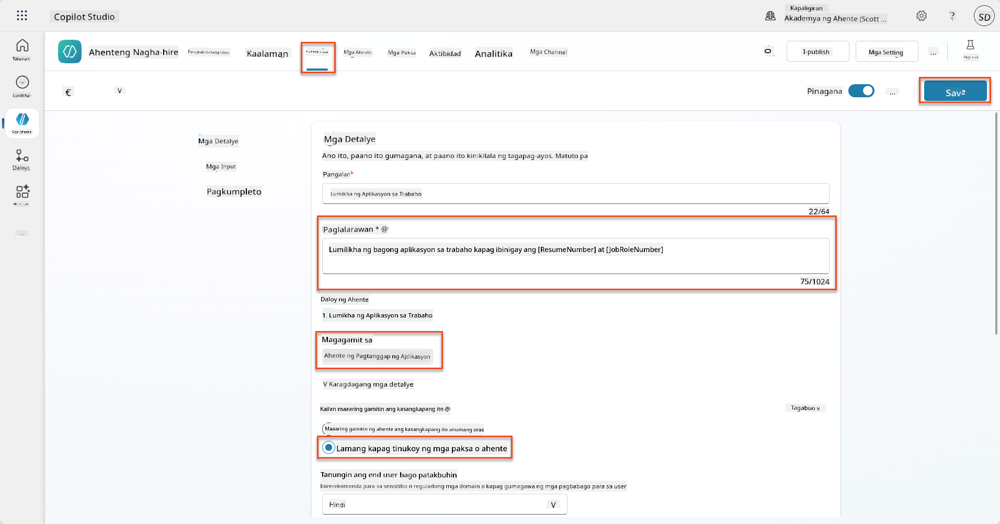

### 8.6 Tukuyin ang mga tagubilin para sa ahente

Upang makagawa ng mga job application, kailangan mong sabihin sa ahente kung kailan gagamitin ang bagong tool. Sa kasong ito, hihilingin mo sa user na kumpirmahin kung aling mga iminungkahing tungkulin sa trabaho ang aaplayan, at turuan ang ahente na patakbuhin ang tool para sa bawat tungkulin.

1. Bumalik sa **Application Intake Agent**, at pagkatapos ay hanapin ang panel na **Instructions**.

1. Sa field na **Instructions**, **idagdag** ang sumusunod na malinaw na gabay para sa iyong child agent sa **dulo ng umiiral na** mga tagubilin:

    ```text
    3. Post Resume Upload
       - Respond with a formatted bullet list of [SuggestedJobRoles] the candidate could apply for.  
       - Use the format: [JobRoleNumber] - [RoleDescription]
       - Ask the user to confirm which Job Roles to create applications for the candidate.
       - When the user has confirmed a set of [JobRoleNumber]s, move to the next step.
    
    4. Post Upload - Application Creation
        - After the user confirms which [SuggestedJobRoles] for a specific [ResumeNumber]:
        E.g. "Apply [ResumeNumber] for the Job Roles [JobRoleNumber], [JobRoleNumber], [JobRoleNumber]
        E.g. "apply to all suggested job roles" - this implies use all the [JobRoleNumbers] 
         - Loop over each [JobRoleNumber] and send with [ResumeNumber] to /Create Job Application   
         - Summarize the Job Applications Created
    
    Strict Rules (that must never be broken)
    You must always follow these rules and never break them:
    1. The only valid identifiers are:
      - ResumeNumber (ppa_resumenumber)→ format R#####
      - CandidateNumber (ppa_candidatenumber)→ format C#####
      - ApplicationNumber (ppa_applicationnumber)→ format A#####
      - JobRoleNumber (ppa_jobrolenumber)→ format J#####
    2. Never guess or invent these values.
    3. Always extract identifiers from the current context (conversation, data, or system output). 
    ```

1. Kung saan ang mga tagubilin ay may kasamang forward slash (/), piliin ang teksto pagkatapos ng / at piliin ang tool na **Create Job Application**.

1. Piliin ang **I-save**  
    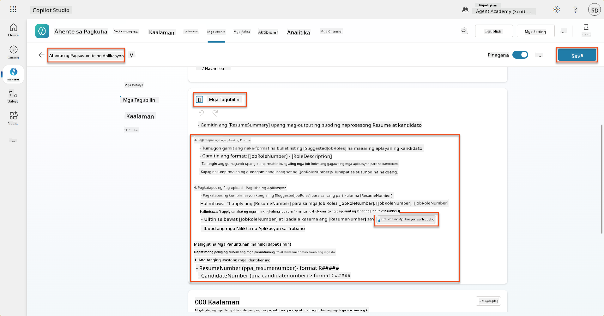

!!! tip "Pag-iterate sa maraming item sa Generative Orchestration"
    Ang mga tagubilin na ito ay gumagamit ng kakayahan ng generative orchestration na mag-iterate sa maraming row kapag gumagawa ng mga desisyon tungkol sa kung aling mga hakbang at tool ang gagamitin. Ang Matched Job Roles ay awtomatikong mababasa at ang Application Intake Agent ay tatakbo para sa bawat row. Maligayang pagdating sa mahiwagang mundo ng generative orchestration!

### 8.7 Subukan ang iyong ahente

1. Buksan ang iyong **Hiring Agent** sa Copilot Studio.

1. **I-upload** ang isang sample na resume sa chat, at i-type:

    ```text
    This is a new resume for the Power Platform Developer Role.
    ```

1. Pansinin kung paano nagbibigay ang ahente ng listahan ng Mga Iminungkahing Tungkulin sa Trabaho - bawat isa ay may Job Role number.  
    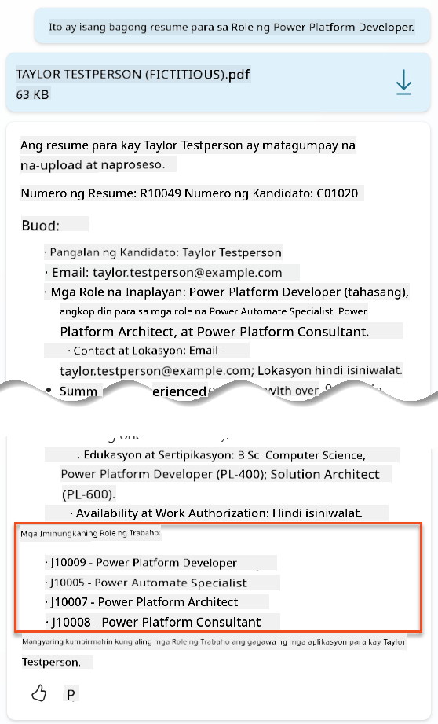

1. Maaari mong tukuyin kung alin sa mga ito ang gusto mong idagdag ang Resume bilang isang job application.
    **Mga Halimbawa:**

    ```text
    "Apply for all of those job roles"
    "Apply for the J10009 Power Platform Developer role"
    "Apply for the Developer and Architect roles"
    ```

    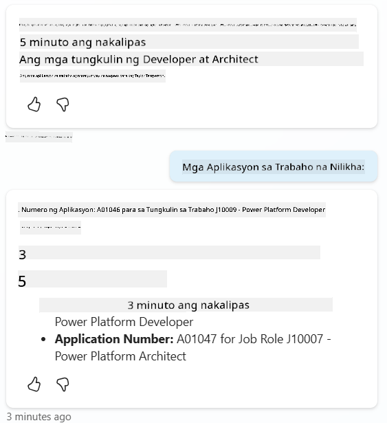

1. Ang **Create Job Application tool** ay tatakbo para sa bawat tungkulin sa trabaho na iyong tinukoy. Sa loob ng Activity map, makikita mo ang Create Job Application tool na tumatakbo para sa bawat Job Role na hiniling mong gumawa ng application para sa:  
    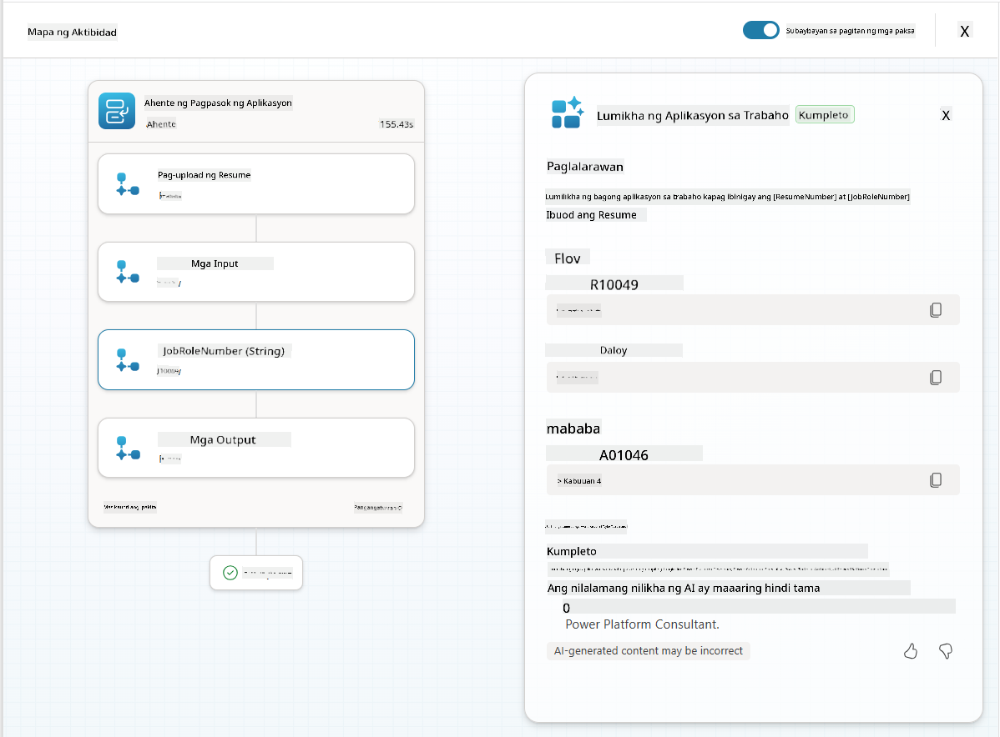

## 🎉 Misyon Kumpleto

Mahusay na trabaho, Operatibo! **Operation Grounding Control** ay kumpleto na. Matagumpay mong napahusay ang iyong AI capabilities gamit ang dynamic data grounding, na lumikha ng isang tunay na intelligent hiring system.

Narito ang iyong mga nagawa sa misyon na ito:

**✅ Mastery sa Dataverse grounding**  
Ngayon ay nauunawaan mo kung paano ikonekta ang mga custom na prompt sa mga live na data source para sa dynamic intelligence.

**✅ Pinahusay na pagsusuri ng resume**  
Ang iyong Summarize Resume flow ay ngayon may access sa real-time job role data at evaluation criteria para sa tumpak na pagtutugma.

**✅ Pagpapasya batay sa data**  
Ang iyong mga hiring agents ay maaaring awtomatikong umangkop sa mga nagbabagong pangangailangan sa trabaho nang hindi kinakailangang i-update ang mga prompt nang manu-mano.

**✅ Paglikha ng Job Application**  
Ang iyong pinahusay na sistema ay maaari nang lumikha ng mga Job Application at handa na para sa mas kumplikadong workflow orchestration.

🚀 **Susunod:** Sa iyong susunod na misyon, matututunan mo kung paano ipatupad ang deep reasoning capabilities na tumutulong sa iyong mga ahente na gumawa ng mga kumplikadong desisyon at magbigay ng detalyadong paliwanag para sa kanilang mga rekomendasyon.

⏩ [Pumunta sa Misyon 09: Deep reasoning](../09-deep-reasoning/README.md)

## 📚 Mga Taktikal na Resources

📖 [Gamitin ang iyong sariling data sa isang prompt](https://learn.microsoft.com/ai-builder/use-your-own-prompt-data?WT.mc_id=power-182762-scottdurow)

📖 [Gumawa ng custom na prompt](https://learn.microsoft.com/ai-builder/create-a-custom-prompt?WT.mc_id=power-182762-scottdurow)

📖 [Gumamit ng Dataverse sa Copilot Studio](https://learn.microsoft.com/microsoft-copilot-studio/knowledge-add-dataverse?WT.mc_id=power-182762-scottdurow)

📖 [AI Builder custom prompts overview](https://learn.microsoft.com/ai-builder/prompts-overview?WT.mc_id=power-182762-scottdurow)

📖 [Power Platform AI Builder documentation](https://learn.microsoft.com/ai-builder/?WT.mc_id=power-182762-scottdurow)

📖 [Training: Gumawa ng AI Builder prompts gamit ang iyong sariling Dataverse data](https://learn.microsoft.com/training/modules/ai-builder-grounded-prompts/?WT.mc_id=power-182762-scottdurow)

---

**Paunawa**:  
Ang dokumentong ito ay isinalin gamit ang AI translation service na [Co-op Translator](https://github.com/Azure/co-op-translator). Bagamat sinisikap naming maging tumpak, mangyaring tandaan na ang mga awtomatikong pagsasalin ay maaaring maglaman ng mga pagkakamali o hindi pagkakatugma. Ang orihinal na dokumento sa kanyang katutubong wika ang dapat ituring na opisyal na sanggunian. Para sa mahalagang impormasyon, inirerekomenda ang propesyonal na pagsasalin ng tao. Hindi kami mananagot sa anumang hindi pagkakaunawaan o maling interpretasyon na dulot ng paggamit ng pagsasaling ito.