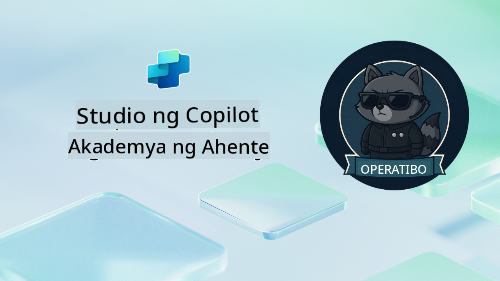

<!--
CO_OP_TRANSLATOR_METADATA:
{
  "original_hash": "24fcbe9a57d3439e05f8866e550c0a84",
  "translation_date": "2025-10-22T18:47:56+00:00",
  "source_file": "docs/operative-preview/README.md",
  "language_code": "tl"
}
-->
# Maligayang Pagdating Operatibo

**Maligayang pagdating, Operatibo.**  
Ang iyong advanced na misyon—kung pipiliin mong tanggapin ito—ay ang pag-master sa sining ng pagbuo ng **enterprise-grade multi-agent systems** gamit ang **Microsoft Copilot Studio**.

Ang masinsinang pagsasanay na ito ay magdadala sa iyo lampas sa simpleng paglikha ng ahente patungo sa mas sopistikadong mundo ng **multi-agent orchestration**: mula sa hiring automation hanggang sa AI safety, matutunan mong bumuo, mag-coordinate, at mag-deploy ng mga intelligent agent ecosystems gamit ang mga tunay na enterprise scenarios.

--8<-- "disclaimer.md"

---

## 🎯 Layunin ng Misyon

Sa pagtatapos ng Agent Academy Operative program, magagawa mong:

- Magdisenyo at magpatupad ng **multi-agent systems** para sa mga kumplikadong business scenarios  
- Mag-master ng **agent orchestration** at mga pattern ng kolaborasyon  
- Magpatupad ng **AI safety at content moderation** sa mga production systems  
- Bumuo ng **multi-modal prompts** para sa pagproseso at pagsusuri ng mga dokumento  
- Mag-deploy ng **enterprise-ready agents** na may tamang pamamahala at pagsusuri  

---

## 🧪 Mga Kinakailangan

Upang makumpleto ang lahat ng misyon, kakailanganin mo:

- Natapos ang **Agent Academy Recruit** training  
- Isang Microsoft Power Platform environment na may **Copilot Studio** license  
- Access sa **Microsoft Dataverse**  
- Mga administrative permissions para makagawa ng mga solusyon at ahente  

---

## 🧬 Para Kanino Ito

Ang advanced na kursong ito ay perpekto para sa:

- **Solution architects** na nagdidisenyo ng enterprise AI systems  
- **Developers** na bumubuo ng production-ready agent solutions  
- **IT professionals** na nagpapatupad ng AI governance at safety  
- **Business analysts** na gumagawa ng mga kumplikadong automation workflows  
- Sinumang handang **mag-level up** mula sa basic agents patungo sa enterprise systems  

---

## 🧭 Pangkalahatang Kurikulum

Ang akademya na ito ay nakaayos bilang isang progresibong serye ng mga field operations—ang bawat misyon ay bumubuo sa nauna upang makalikha ng isang komprehensibong hiring automation system.

| Misyon | Pamagat | Operation Briefing |
|--------|---------|--------------------|
| `01` | 🚨 [Simulan ang Hiring Agent](./01-get-started/README.md) | I-deploy ang pundasyong imprastraktura at lumikha ng iyong central orchestrator agent |
| `02` | 🎭 [Gawing multi-agent ready ang iyong ahente gamit ang mga konektadong ahente](./02-multi-agent/README.md) | I-transform ang single agent sa coordinated multi-agent system |
| `03` | ⚡ [I-automate ang iyong ahente gamit ang Triggers](./03-automate-triggers/README.md) | Magpatupad ng autonomous agent behaviors gamit ang event-driven triggers |
| `04` | 📝 [Paglikha ng Agent Instructions](./04-agent-instructions/README.md) | Masterin ang eksaktong komunikasyon ng ahente at kontrol sa pag-uugali |
| `05` | 💬 [Pag-personalize ng Agent Responses](./05-agent-responses/README.md) | I-customize ang mga tugon ng ahente para sa maximum na epekto at engagement |
| `06` | 🛡️ [Mga Pangunahing Kaalaman sa Content Moderation at AI Safety](./06-ai-safety/README.md) | Magpatupad ng enterprise-grade safety at compliance measures |
| `07` | 🎨 [Pagkuha ng Nilalaman ng Resume gamit ang Multi-Modal Prompts](./07-multimodal-prompts/README.md) | Magproseso ng mga dokumento at imahe gamit ang advanced AI capabilities |
| `08` | 🗄️ [Prompts - Dataverse Grounding](./08-dataverse-grounding/README.md) | I-ground ang mga ahente sa enterprise data para sa tumpak na mga tugon |
| `09` | 🧠 [Paglalapat ng Deep Reasoning para sa Pagsusuri ng Candidate Fit at Paghahanda sa Panayam](./09-deep-reasoning/README.md) | Magpatupad ng sopistikadong AI reasoning para sa mga kumplikadong desisyon |
| `10` | 📄 [Bumuo ng Candidate Specific Interview Docs gamit ang Prompts](./10-generate-documents/README.md) | Lumikha ng dynamic na mga dokumento batay sa pagsusuri ng ahente |
| `11` | 📊 [Kumuha ng Feedback ng User gamit ang Adaptive Cards](./11-obtain-user-feedback/README.md) | Kolektahin at iproseso ang feedback ng user para sa patuloy na pagpapabuti |
| `12` | 🌐 [I-publish ang Iyong mga Ahente sa isang Demo Website para sa Stakeholder Testing](./12-demo-website/README.md) | I-deploy ang kumpletong solusyon para sa demonstrasyon at pagsusuri ng stakeholder |

!!! note
    ✅ Ang pagtatapos ng kurikulum na ito ay magbibigay sa iyo ng **Operative** badge.  
    🔓 Ang **Commander** ay ma-unlock sa mga susunod na yugto.

<!-- markdownlint-disable-next-line MD033 -->

---

**Paunawa**:  
Ang dokumentong ito ay isinalin gamit ang AI translation service na [Co-op Translator](https://github.com/Azure/co-op-translator). Bagamat sinisikap naming maging tumpak, mangyaring tandaan na ang mga awtomatikong pagsasalin ay maaaring maglaman ng mga pagkakamali o hindi pagkakatugma. Ang orihinal na dokumento sa kanyang katutubong wika ang dapat ituring na opisyal na sanggunian. Para sa mahalagang impormasyon, inirerekomenda ang propesyonal na pagsasalin ng tao. Hindi kami mananagot sa anumang hindi pagkakaunawaan o maling interpretasyon na dulot ng paggamit ng pagsasaling ito.