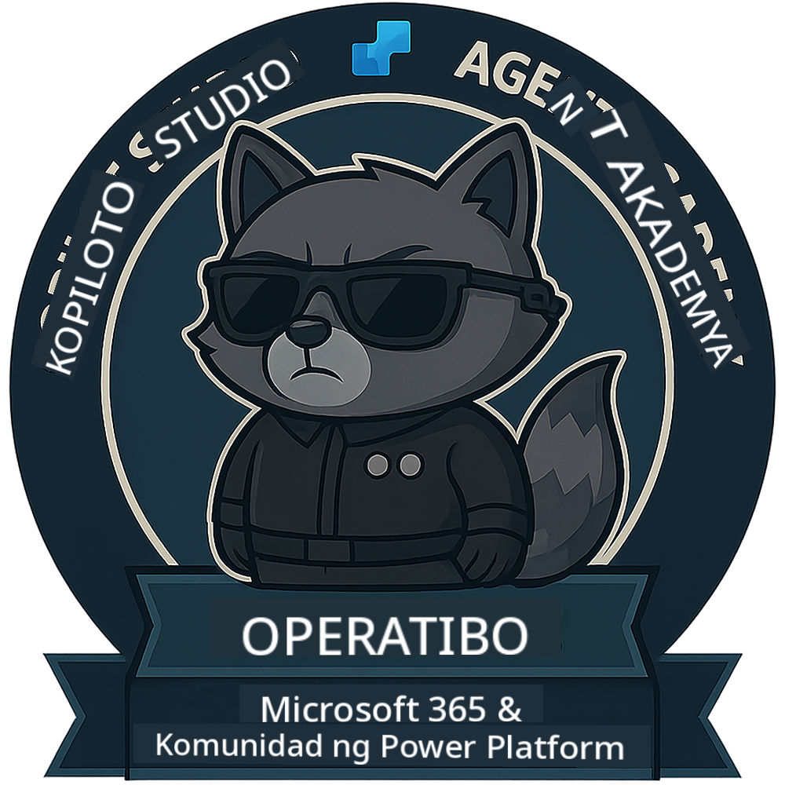

<!--
CO_OP_TRANSLATOR_METADATA:
{
  "original_hash": "1c5c8f18a1c1ec8fcbbb271403cf2ac6",
  "translation_date": "2025-10-22T19:59:30+00:00",
  "source_file": "docs/operative/README.md",
  "language_code": "tl"
}
-->
---
hide:
- navigation
---

# Operatibo (Paparating na)

Ang kursong ito ay napaka-lihim pa. Ito ay bubuksan sa hinaharap! 🔓

{ width="300" }

<!-- markdownlint-disable-next-line MD033 -->

---

**Paunawa**:  
Ang dokumentong ito ay isinalin gamit ang AI translation service [Co-op Translator](https://github.com/Azure/co-op-translator). Bagamat sinisikap naming maging tumpak, mangyaring tandaan na ang mga awtomatikong pagsasalin ay maaaring maglaman ng mga pagkakamali o hindi pagkakatugma. Ang orihinal na dokumento sa kanyang katutubong wika ang dapat ituring na opisyal na sanggunian. Para sa mahalagang impormasyon, inirerekomenda ang propesyonal na pagsasalin ng tao. Hindi kami mananagot sa anumang hindi pagkakaunawaan o maling interpretasyon na dulot ng paggamit ng pagsasaling ito.