<!--
CO_OP_TRANSLATOR_METADATA:
{
  "original_hash": "d9cd8cd1a4fbd8915171a2ed972cc322",
  "translation_date": "2025-10-22T19:58:22+00:00",
  "source_file": "docs/recruit/00-course-setup/README.md",
  "language_code": "tl"
}
-->
# 🚨 Misyon 00: Pagsasaayos ng Kurso

## 🕵️‍♂️ CODENAME: `OPERATION DEPLOYMENT READY`

> **⏱️ Oras ng Operasyon:** `~30 minuto`  

## 🎯 Panimula ng Misyon

Maligayang pagdating sa unang misyon ng iyong pagsasanay bilang isang Copilot Studio Agent.  
Bago ka makapagsimula sa paggawa ng iyong unang AI agent, kailangan mong magtatag ng isang **development environment na handa para sa field**.

Ang panimulang ito ay naglalahad ng mga sistema, mga kredensyal sa pag-access, at mga hakbang sa pagsasaayos na kinakailangan upang matagumpay na makapag-operate sa Microsoft 365 ecosystem.

## 🔎 Mga Layunin

Kasama sa iyong misyon ang:

1. Pagkuha ng Microsoft 365 account  
1. Pagkakaroon ng access sa Microsoft Copilot Studio  
1. (Opsyonal) Pagkuha ng Microsoft 365 Copilot license para sa production publishing  
1. Paglikha ng developer environment bilang iyong Copilot Studio environment para sa paggawa  
1. Paglikha ng SharePoint site na magsisilbing data source sa mga susunod na misyon  

---

## 🔍 Mga Kinakailangan

Bago ka magsimula, tiyakin na mayroon ka ng:

1. Isang **email address para sa trabaho o paaralan** (hindi sinusuportahan ang personal na @outlook.com, @gmail.com, atbp.).
1. Access sa internet at isang modernong browser (inirerekomenda ang Edge, Chrome, o Firefox).  
1. Pangunahing kaalaman sa Microsoft 365 (halimbawa, pag-login sa Office apps o Teams).  
1. (Opsyonal) Isang credit card o paraan ng pagbabayad kung plano mong bumili ng mga bayad na lisensya.

---

## Hakbang 1: Kumuha ng Microsoft 365 Account

Ang Copilot Studio ay nasa loob ng Microsoft 365, kaya kailangan mo ng Microsoft 365 account upang ma-access ito. Maaari kang gumamit ng umiiral na account kung mayroon ka na o sundin ang mga hakbang na ito upang makakuha ng angkop na lisensya:

1. **Kumuha ng Bayad na Microsoft 365 Business Subscription**  
   1. Pumunta sa [Microsoft 365 Business Plans and Pricing Page](https://www.microsoft.com/microsoft-365/business/microsoft-365-plans-and-pricing)
   1. Ang pinakamurang opsyon upang makapagsimula ay ang Microsoft 365 Business Basic plan. Piliin ang `Try for free` at sundin ang guided form upang punan ang iyong subscription, mga detalye ng account, at impormasyon sa pagbabayad.
   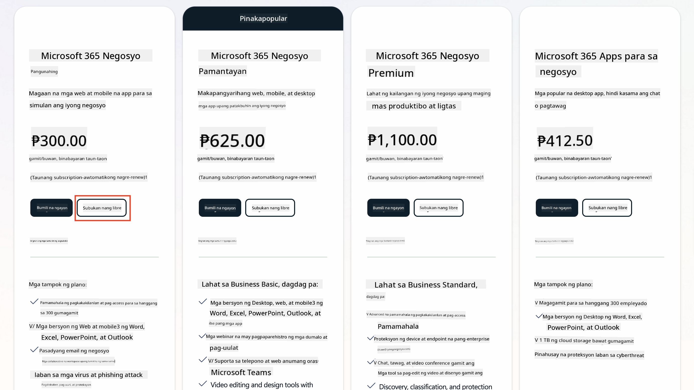
   1. Kapag mayroon ka nang bagong account, mag-login.

    !!! Tip
        Kung plano mong mag-publish ng mga agent sa Microsoft 365 Copilot Chat o kumonekta sa organizational data (SharePoint, OneDrive, Dataverse), kinakailangan ang Microsoft 365 Copilot license. Ito ay isang add-on license na maaari mong malaman pa [sa licensing site](https://www.microsoft.com/microsoft-365/copilot#plans)

---

## Hakbang 2: Simulan ang Copilot Studio Trial

Kapag mayroon ka nang Microsoft 365 Tenant, kailangan mong makakuha ng access sa Copilot Studio. Maaari kang makakuha ng libreng 30-araw na trial sa pamamagitan ng pagsunod sa mga hakbang na ito:

1. Pumunta sa [aka.ms/TryCopilotStudio](https://aka.ms/TryCopilotStudio).  
1. Ipasok ang email address mula sa bagong account na iyong na-configure sa nakaraang hakbang at piliin ang `Next`.  
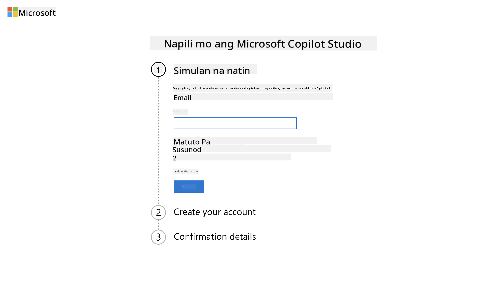
1. Dapat nitong makilala ang iyong account. Piliin ang `Sign In`.
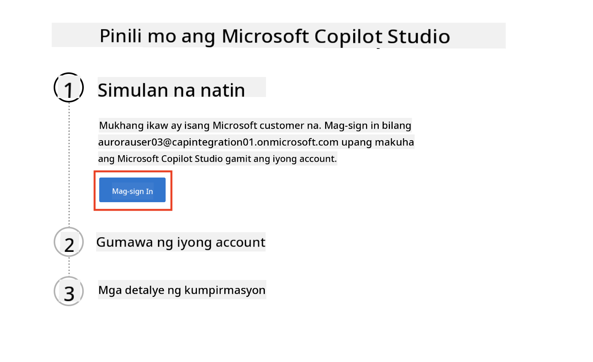  
1. Piliin ang `Start Free Trial`.
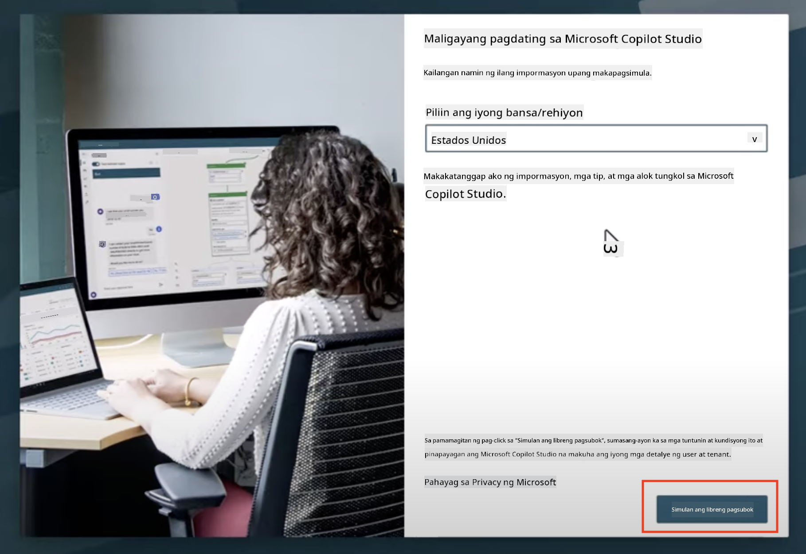

!!! info "Mga Tala sa Trial"  
     1. Ang libreng trial ay nagbibigay ng **buong kakayahan ng Copilot Studio**.
     1. Makakatanggap ka ng mga email notification tungkol sa expiration ng iyong trial. Maaari mong i-extend ang trial sa 30-araw na increments (hanggang 90 araw ng runtime ng agent).  
     1. Kung ang iyong tenant administrator ay nag-disable ng self-service sign-up, makakakita ka ng error—makipag-ugnayan sa iyong Microsoft 365 admin upang i-enable ito muli.

---

## Hakbang 3: Gumawa ng bagong developer environment

### Mag-sign up para sa Power Apps Developer Plan

Gamit ang parehong Microsoft 365 tenant sa Hakbang 1, mag-sign up para sa Power Apps Developer Plan upang makagawa ng libreng development environment para sa paggawa at pagsubok gamit ang Copilot Studio.

1. Mag-sign up sa [Power Apps Developer Plan website](https://aka.ms/PowerAppsDevPlan).

    - Ipasok ang iyong email address
    - I-tick ang checkbox
    - Piliin ang **Start free**

    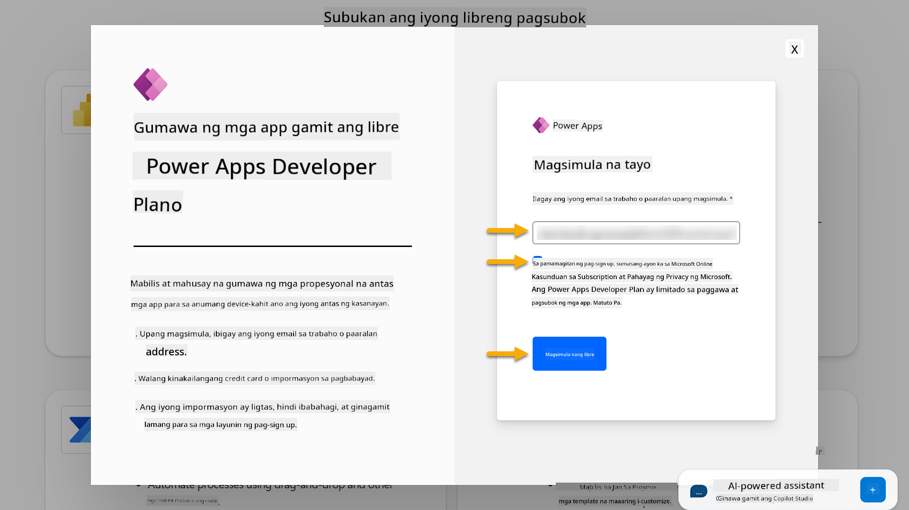

1. Pagkatapos mag-sign up para sa Developer Plan, ire-redirect ka sa [Power Apps](https://make.powerapps.com/). Ang environment ay gagamit ng iyong pangalan, halimbawa **Adele Vance's environment**. Kung mayroon nang environment na may parehong pangalan, ang bagong developer environment ay tatawaging **Adele Vance's (1)** environment.

    Gamitin ang developer environment na ito sa Copilot Studio kapag tinatapos ang mga lab.

!!! Note
    Kung gumagamit ka ng umiiral na Microsoft 365 account at hindi gumawa ng bago sa Hakbang 1, halimbawa - gamit ang sarili mong account sa iyong work organization, maaaring na-disable ng iyong IT administrator (o katumbas na team) ang proseso ng sign up. Sa ganitong kaso, mangyaring makipag-ugnayan sa iyong administrator, o gumawa ng test tenant ayon sa Hakbang 1.

---

## Hakbang 4: Gumawa ng bagong SharePoint site

Kailangan gumawa ng bagong SharePoint site na gagamitin sa [Lesson 06 - Gumawa ng custom agent gamit ang conversational creation experience kasama ang Copilot at grounding ito sa iyong data](../06-create-agent-from-conversation/README.md#62-add-an-internal-knowledge-source-using-a-sharepoint-site).

1. Piliin ang waffle icon sa kaliwang itaas na bahagi ng Microsoft Copilot Studio upang makita ang menu. Piliin ang SharePoint mula sa menu.

    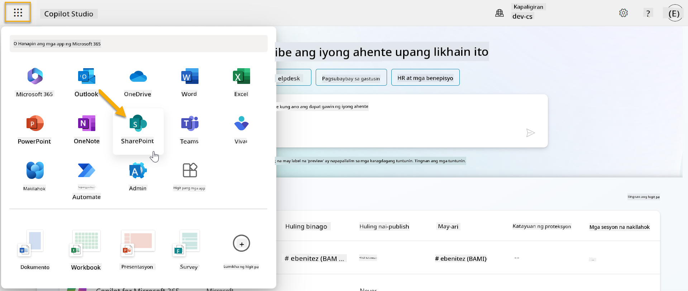

1. Maglo-load ang SharePoint. Piliin ang **+ Create site** upang gumawa ng bagong SharePoint site.

    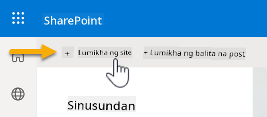

1. Lalabas ang isang dialog upang gabayan ka sa paggawa ng bagong SharePoint site. Piliin ang **Team site**.

    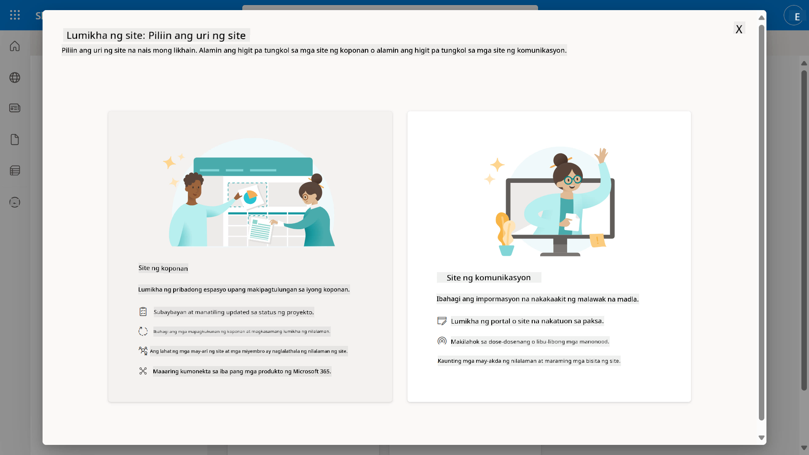

1. Sa susunod na hakbang, maglo-load ang listahan ng mga Microsoft template bilang default. Mag-scroll pababa at piliin ang **IT help desk** template.

    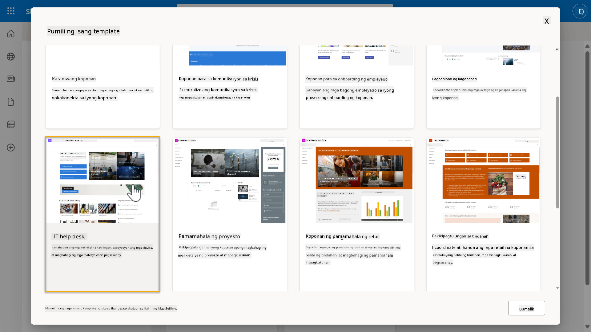

1. Piliin ang **Use template** upang gumawa ng bagong SharePoint site gamit ang IT help desk template.

    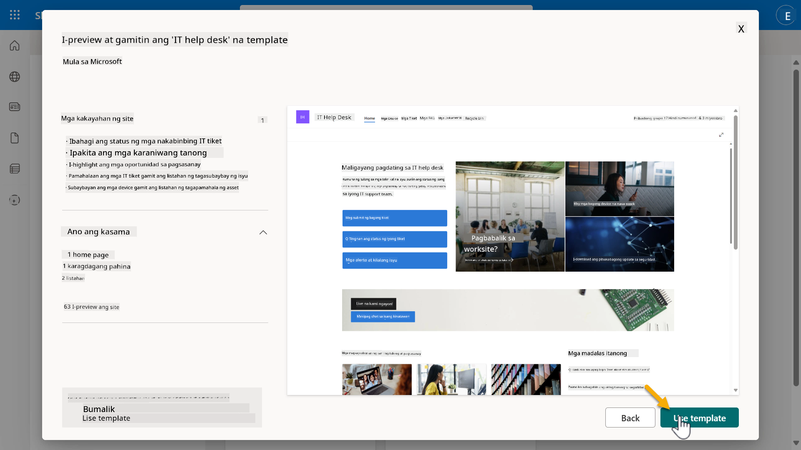

1. Ipasok ang impormasyon para sa iyong site. Ang sumusunod ay isang halimbawa:

    | Field | Value |
    | --- | --- |
    | Site name | Contoso IT |
    | Site description | Copilot Studio para sa mga Baguhan |
    | Site address | ContosoIT |

    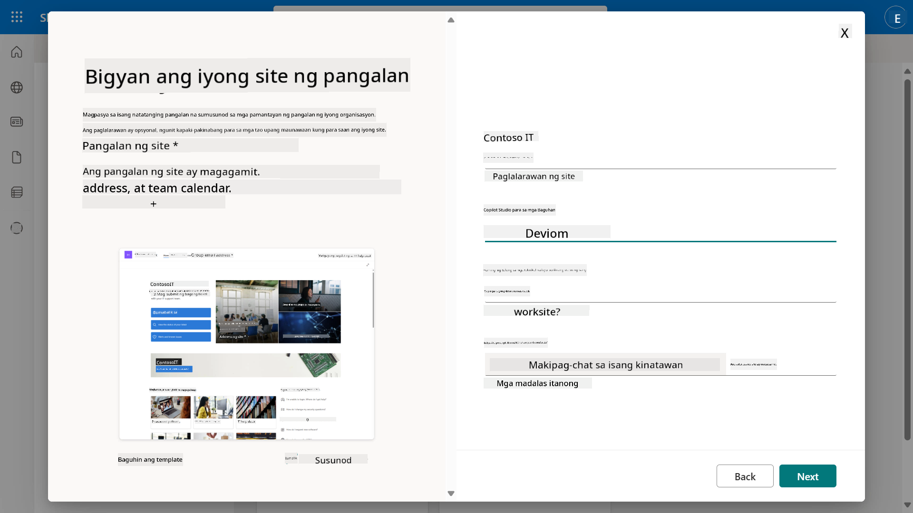

1. Sa huling hakbang, maaaring pumili ng wika para sa SharePoint site. Bilang default, ito ay **English**. Iwanan ang Wika bilang **English** at piliin ang **Create site**.

    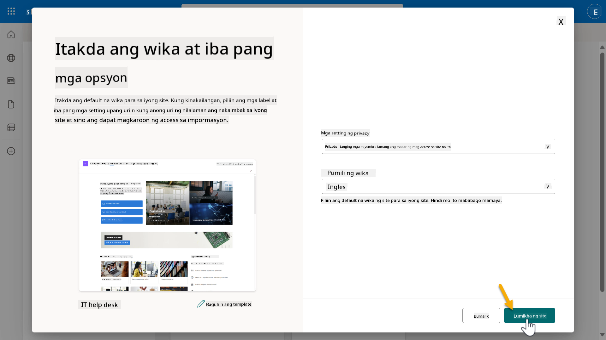

1. Ang SharePoint site ay magpo-provision sa loob ng ilang segundo. Sa panahong ito, maaari kang magdagdag ng ibang mga user sa iyong site sa pamamagitan ng pagpasok ng kanilang email address sa **Add members** field. Kapag natapos, piliin ang **Finish**.

    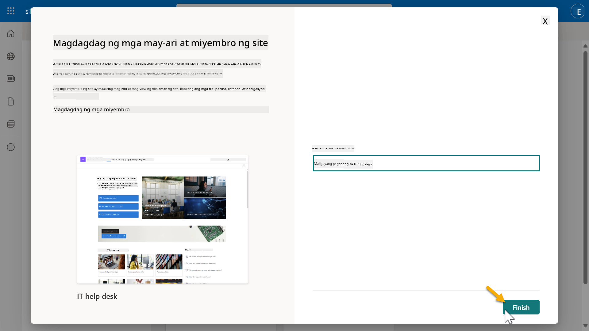

1. Ang home page ng SharePoint site ay maglo-load. **Kopyahin** ang URL ng SharePoint site.

1. Ang template na ito ay nagbibigay ng mga pahina na may sample data tungkol sa iba't ibang IT policies at dalawang sample lists (Tickets at Devices).

### Gamitin ang Devices SharePoint list

Gagamitin natin ang **Devices** list para sa [Mission 07 - Magdagdag ng bagong topic na may trigger at nodes](../07-add-new-topic-with-trigger/README.md#73-add-a-tool-using-a-connector).

### Magdagdag ng bagong column

Mag-scroll sa dulong kanan ng listahan at piliin ang **+ Add column** button. Piliin ang **hyperlink** type, ipasok ang **Image** para sa pangalan ng column, at piliin ang add.

### Gumawa ng sample data sa Devices SharePoint list

Siguraduhing punan ang listahan na ito ng hindi bababa sa 4 na sample data items at magdagdag ng isang karagdagang column sa listahan na ito.  

Kapag nagdadagdag ng sample data, siguraduhing ang mga sumusunod na fields ay napunan:

- Device photo - gamitin ang mga imahe mula sa [device images folder](https://github.com/microsoft/agent-academy/tree/main/docs/recruit/00-course-setup/images/device-images)
- Title
- Status
- Manufacturer
- Model
- Asset Type
- Color
- Serial Number
- Purchase Date
- Purchase Price,
- Order #
- Image - gamitin ang mga sumusunod na link

|Device  |URL  |
|---------|---------|
|Surface Laptop 13     | [https://raw.githubusercontent.com/microsoft/agent-academy/refs/heads/main/docs/recruit/00-course-setup/images/device-images/Surface-Laptop-13.png](https://raw.githubusercontent.com/microsoft/agent-academy/refs/heads/main/docs/recruit/00-course-setup/images/device-images/Surface-Laptop-13.png)        |
|Surface Laptop 15     | [https://raw.githubusercontent.com/microsoft/agent-academy/refs/heads/main/docs/recruit/00-course-setup/images/device-images/Surface-Laptop-15.png](https://raw.githubusercontent.com/microsoft/agent-academy/refs/heads/main/docs/recruit/00-course-setup/images/device-images/Surface-Laptop-15.png)        |
|Surface Pro    | [https://raw.githubusercontent.com/microsoft/agent-academy/refs/heads/main/docs/recruit/00-course-setup/images/device-images/Surface-Pro-12.png](https://raw.githubusercontent.com/microsoft/agent-academy/refs/heads/main/docs/recruit/00-course-setup/images/device-images/Surface-Pro-12.png)        |
|Surface Studio    | [https://raw.githubusercontent.com/microsoft/agent-academy/refs/heads/main/docs/recruit/00-course-setup/images/device-images/Surface-Studio.png](https://raw.githubusercontent.com/microsoft/agent-academy/refs/heads/main/docs/recruit/00-course-setup/images/device-images/Surface-Studio.png)        |

---

## ✅ Misyon Kumpleto

Matagumpay mong:

- Na-set up ang Microsoft 365 dev environment  
- Na-activate ang Copilot Studio trial  
- Nakagawa ng SharePoint site para sa grounding agents  
- Napunan ang Devices list para sa paggamit sa mga susunod na misyon

Ikaw ay opisyal nang handa upang simulan ang iyong **Recruit-level agent training** sa [Lesson 01](../01-introduction-to-agents/README.md).  

<!-- markdownlint-disable-next-line MD033 -->

---

**Paunawa**:  
Ang dokumentong ito ay isinalin gamit ang AI translation service [Co-op Translator](https://github.com/Azure/co-op-translator). Bagamat sinisikap naming maging tumpak, mangyaring tandaan na ang mga awtomatikong pagsasalin ay maaaring maglaman ng mga pagkakamali o hindi pagkakatugma. Ang orihinal na dokumento sa kanyang katutubong wika ang dapat ituring na opisyal na pinagmulan. Para sa mahalagang impormasyon, inirerekomenda ang propesyonal na pagsasalin ng tao. Hindi kami mananagot sa anumang hindi pagkakaunawaan o maling interpretasyon na dulot ng paggamit ng pagsasaling ito.