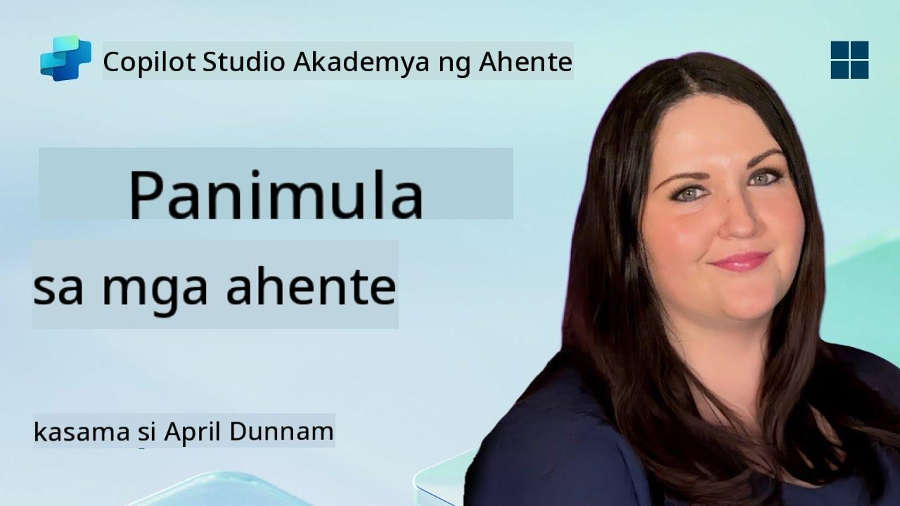

<!--
CO_OP_TRANSLATOR_METADATA:
{
  "original_hash": "d6706e107678264168d77b2e107710b1",
  "translation_date": "2025-10-22T19:31:11+00:00",
  "source_file": "docs/recruit/01-introduction-to-agents/README.md",
  "language_code": "tl"
}
-->
# 🚨 Misyon 01: Panimula sa Mga Ahente

## 🕵️‍♂️ CODENAME: `OPERATION AI AGENT DECODE`

> **⏱️ Oras ng Operasyon:** `~30 minuto – impormasyon lamang, walang kinakailangang fieldwork`

🎥 **Panoorin ang Walkthrough**

## 🎯 Misyon Brief

Maligayang pagdating, Rekruto. Bago tayo magsimula sa paggawa ng mga ahente, kailangan mong maunawaan ang mga konsepto ng AI na nagpapatakbo sa kanila. Ang misyon na ito ay magbibigay sa iyo ng pundasyong kaalaman tungkol sa conversational AI, large language models (LLMs), retrieval-augmented generation (RAG), at mga uri ng ahente na maaari mong likhain sa Copilot Studio.

## 🔎 Mga Layunin

Sa misyon na ito, matututunan mo:

1. Ano ang conversational AI at bakit ito mahalaga  
1. Paano pinapagana ng Large Language Models (LLMs) ang mga karanasan sa chat  
1. Ano ang naidudulot ng Retrieval-Augmented Generation (RAG)  
1. Ang pagkakaiba ng conversational agents at autonomous agents  
1. Paano ginagamit ng mga ahente sa Copilot Studio ang mga konseptong ito  

Simulan na natin!

---

## Ano ang Conversational AI?

Ang Conversational AI ay tumutukoy sa anumang sistema na kayang umunawa, magproseso, at tumugon sa wika ng tao – maging ito ay teksto o boses – sa paraang natural. Isipin ang mga chatbot sa help desks o virtual personal assistants sa iyong mga paboritong apps. Sa likod nito, karamihan sa mga modernong conversational AI ay umaasa sa Large Language Models (LLMs), na tatalakayin natin sa susunod.

### Bakit Ito Mahalaga

- **User Experience:** Mas intuitive ang mga conversational interface kaysa sa pag-click sa mga menu.  
- **Scalability:** Isang ahente ang kayang humawak ng sampu o daan-daang sabay-sabay na pag-uusap.  
- **Efficiency:** Sa halip na gumawa ng custom na rule-based scripts, ang mga LLM-powered agents ay umaangkop sa input ng user.  
- **Extensibility:** Sa tamang disenyo, maaaring magamit ng mga ahente ang mga knowledge base, kumonekta sa mga API, o kumilos bilang “digital coworkers” sa mga workflow ng negosyo.

---

## Large Language Models (LLMs) 101

Sa core ng karamihan sa mga conversational AI systems ay ang **Large Language Models** – neural networks na sinanay sa napakalaking text corpora. Natutunan nila ang mga statistical pattern ng wika kaya kaya nilang bumuo ng maayos na mga pangungusap, sumagot sa mga tanong, o magbigay ng mga ideya. Mga pangunahing punto na dapat maunawaan:

1. **Training Data:** Ang LLMs ay kumakain ng terabytes ng teksto (mga web page, libro, artikulo). Ang “world knowledge” na ito ang nagbibigay-daan sa kanila na sumagot sa maraming paksa.  
1. **Tokenization:** Ang teksto ay hinahati sa mas maliliit na yunit na tinatawag na tokens (mga salita, subwords, o characters). Ang modelo ay hinuhulaan ang isang token sa bawat pagkakataon.  
1. **Context Window:** Ang bawat LLM ay may limitasyon sa kung ilang tokens ang kaya nitong “makita” nang sabay-sabay. Kapag lumampas sa limitasyon, ang mga naunang tokens ay tinatanggal.  
1. **Prompting:** Nakikipag-ugnayan ka sa isang LLM sa pamamagitan ng pagpapadala ng prompt. Mas maganda ang iyong prompt, mas nakatuon at nauugnay ang sagot.  
1. **Zero-shot vs. Fine-tuning:** Ang Zero-shot ay paggamit ng LLM na walang pagbabago (raw weights lamang). Ang Fine-tuning ay pag-aadjust sa modelo gamit ang domain-specific na data para mas maging tumpak ang sagot nito sa iyong pangangailangan.

!!! Tip "Pro Tip"
    Isang karaniwang analogy ay ang LLM ay parang “super-smart autocomplete.” Hindi nito tunay na nauunawaan ang kahulugan tulad ng utak ng tao, ngunit napakahusay nitong maghulaan ng susunod na pinakamahusay na salita (o parirala) sa isang sequence.

---

## Retrieval-Augmented Generation (RAG)

Kapag ang LLMs ay umaasa lamang sa static training data, maaaring magkamali o maging luma ang impormasyon. Inaayos ito ng RAG sa pamamagitan ng pagpapahintulot sa modelo na “maghanap” ng sariwang impormasyon bago bumuo ng sagot. Sa mataas na antas, gumagana ang RAG nang ganito:

1. **User Query:** Nagtatanong ang user (hal., “Ano ang pinakabagong balita sa kita ng Contoso ngayong quarter?”).  
1. **Retriever Step:** Ang sistema ay naghahanap sa isang knowledge source (mga dokumento, internal databases, SharePoint libraries, atbp.) upang makahanap ng mga kaugnay na bahagi.  
1. **Augmentation:** Ang mga nahanap na bahagi ay idinadagdag o inilalagay bago ang LLM prompt.  
1. **Generation:** Ang LLM ay nagpoproseso ng tanong ng user at ng nahanap na konteksto, pagkatapos ay bumubuo ng sagot na nakabatay sa pinakabagong data.  

Sa RAG, maaaring maghanap ang iyong ahente sa mga internal na wiki ng kumpanya, plugin APIs, o maghanap sa isang FAQ knowledge base—at magbigay ng mga sagot na hindi limitado sa statically published model parameters.

---

## Conversational vs. Autonomous Agents

Sa konteksto ng Copilot Studio, ang terminong **ahente** ay maaaring tumukoy sa iba't ibang uri ng AI assistants. Mahalagang maunawaan ang pagkakaiba sa pagitan ng:

**Conversational Agents:**

- Pangunahing nakatuon sa two-way na pag-uusap.  
- Pinapanatili ang konteksto sa maraming palitan ng usapan.  
- Karaniwang pinamamahalaan sa pamamagitan ng mga predefined na flow o trigger (hal., “Kapag sinabi ng user ang X, tumugon ng Y”).  
- Perpekto para sa customer support, FAQs, guided interactions, scheduling, o simpleng Q&A.  
  - Mga Halimbawa:  
    - Isang chatbot sa Teams na sumasagot sa mga tanong tungkol sa HR policies.  
    - Isang Power Virtual Agents bot sa isang SharePoint page upang gabayan ang mga user sa isang form.  

**Autonomous Agents:**

- Lumalampas sa simpleng palitan ng usapan; kaya nilang **kumilos** para sa user.  
- Gumagamit ng LLM reasoning loops (isipin ang “plan → act → observe → replan”) upang tapusin ang mga gawain.  
- Kumokonekta sa mga external tools o APIs (hal., tumawag sa isang Power Automate flow, magpadala ng mga imbitasyon sa kalendaryo, magmanipula ng data sa Dataverse).  
- Gumagana nang walang patuloy na prompt mula sa tao—kapag na-trigger, kaya nilang hawakan ang mga multi-step na proseso nang mag-isa.  
  - Mga Halimbawa:  
    - Isang ahente na gumagawa ng itinerary ng biyahe, nagbu-book ng mga flight, at nagpapadala ng mga kumpirmasyon sa email.  
    - Isang “Meeting Summarizer” na ahente na sumasali sa isang Teams call, nagta-transcribe nito nang real-time, at gumagawa ng executive summary sa OneNote.  

!!! Info "Pangunahing Pagkakaiba"
    Ang mga conversational agents ay naghihintay ng input mula sa user at nakatuon sa pag-uusap. Ang mga autonomous agents ay proactive na nagpaplano at gumagawa ng sunod-sunod na hakbang gamit ang mas malawak na access sa tools.

---

## Mga Ahente sa Copilot Studio

Ang **Copilot Studio** ay pinagsasama ang parehong conversational at autonomous na mga senaryo sa ilalim ng isang framework. Narito kung paano ka matutulungan ng Copilot Studio na bumuo ng mga ahente:

1. **Visual Agent Designer:** Isang low-code na canvas upang tukuyin ang mga prompt, memory, at tools para sa parehong chat at action workflows.  
1. **LLM Configurations:** Pumili mula sa iba't ibang OpenAI models o Microsoft’s enterprise-grade GPT upang tumugma sa iyong performance at cost needs.  
1. **Retrieval Connectors:** Mga prebuilt na integrasyon para sa SharePoint, OneDrive, Azure Cognitive Search, at Dataverse, na nagbibigay-daan sa RAG nang direkta.  
1. **Custom Tools & Functions:** Tukuyin ang mga custom na HTTP actions o Power Automate flows na maaaring gamitin ng iyong ahente nang autonomously.  
1. **Multi-Modal Support:** Bukod sa teksto, maaaring magproseso ang mga Copilot Studio agents ng mga imahe, files, o structured data upang mapalawak ang konteksto.  
1. **Publishing & Distribution:** Kapag handa na ang iyong ahente, maaari mo itong i-publish sa Microsoft 365 Copilot (upang magamit ng mga user sa Teams, SharePoint, Outlook, atbp.) o i-embed ito bilang isang standalone na chat widget sa isang webpage.

---

## 🎉 Misyon Kumpleto

Natapos mo na ang iyong panimula sa mga ahente at mga pundasyong konsepto ng AI. Nauunawaan mo na:

1. **LLMs = Ang “Utak” ng Iyong Ahente**  
   - Responsable para sa pag-unawa at pagbuo ng wika.  
   - Mas maraming tokens = mas mayamang konteksto, ngunit mas mataas din ang gastos sa bawat tawag.  

1. **RAG = Real-Time na Integrasyon ng Kaalaman**  
   - Pinupunan ang agwat sa pagitan ng isang static na LLM at mga pabago-bagong data sources.  
   - Naghahanap at nag-iinject ng mga kaugnay na dokumento o talaan sa LLM prompt.  

1. **Conversational vs. Autonomous**  
   - **Conversational:** Nakatuon sa daloy ng pag-uusap at pagpapanatili ng konteksto (hal., “Session Memory”).  
   - **Autonomous:** Nagdaragdag ng “Action Blocks” na nagpapahintulot sa ahente na kumonekta sa mga external tools o serbisyo.

---
Susunod, iyong susuriin ang [mga pundasyon ng Copilot Studio](../02-copilot-studio-fundamentals/README.md)!

Manatiling alerto, Rekruto - nagsisimula pa lang ang iyong AI na paglalakbay!

## 📚 Mga Taktikal na Resources

🔗 [Copilot Studio Documentation Home](https://learn.microsoft.com/microsoft-copilot-studio/)

---

<!-- markdownlint-disable-next-line MD033 -->

---

**Paunawa**:  
Ang dokumentong ito ay isinalin gamit ang AI translation service na [Co-op Translator](https://github.com/Azure/co-op-translator). Bagama't sinisikap naming maging tumpak, mangyaring tandaan na ang mga awtomatikong pagsasalin ay maaaring maglaman ng mga pagkakamali o hindi pagkakatugma. Ang orihinal na dokumento sa kanyang katutubong wika ang dapat ituring na mapagkakatiwalaang pinagmulan. Para sa mahalagang impormasyon, inirerekomenda ang propesyonal na pagsasalin ng tao. Hindi kami mananagot sa anumang hindi pagkakaunawaan o maling interpretasyon na dulot ng paggamit ng pagsasaling ito.