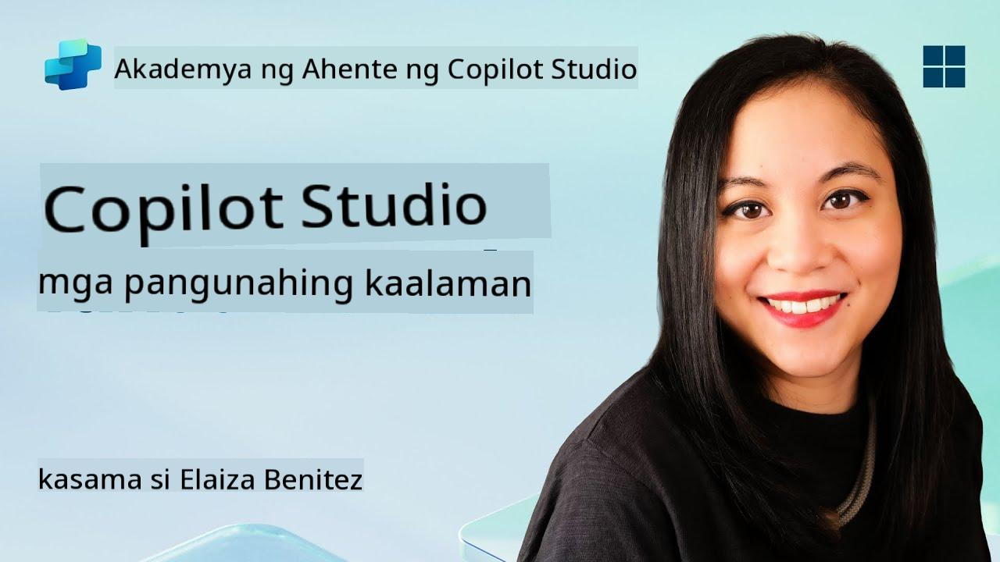

<!--
CO_OP_TRANSLATOR_METADATA:
{
  "original_hash": "90a3c5122f5687bbc8cc819990f175d4",
  "translation_date": "2025-10-22T19:50:37+00:00",
  "source_file": "docs/recruit/02-copilot-studio-fundamentals/README.md",
  "language_code": "tl"
}
-->
# 🚨 Misyon 02: Mga Pangunahing Kaalaman sa Copilot Studio

## 🕵️‍♂️ CODENAME: `OPERATION CORE PROTOCOL`

> **⏱️ Oras ng Operasyon:** `~30 minuto – impormasyon lamang, walang kinakailangang fieldwork`  

🎥 **Panoorin ang Walkthrough**

[](https://www.youtube.com/watch?v=x4OCwDRGeLE "Panoorin ang walkthrough sa YouTube")

## 🎯 Misyon Brief

Maligayang pagdating, Rekruto. Ang misyon na ito ay magbibigay sa iyo ng mga pangunahing kaalaman upang maunawaan kung paano gumagana ang Copilot Studio, at kung paano bumuo ng mga intelligent na ahente na nagbibigay ng tunay na halaga sa negosyo.

Bago ka bumuo ng iyong unang ahente, kailangan mong maunawaan ang apat na pangunahing bahagi na bumubuo sa bawat custom na AI agent: Kaalaman, Mga Tool, Mga Paksa, at Mga Instruksyon. Malalaman mo rin kung paano nagtutulungan ang mga elementong ito sa Copilot Studio orchestrator.

## 🔎 Mga Layunin

Sa misyon na ito, ikaw ay:

- **Matutunan kung ano ang Copilot Studio**
- **Matutunan kung kailan at bakit gagamit ng mga ahente**
- **Suriin ang apat na pundasyon ng mga ahente**
      - **Kaalaman**
      - **Mga Tool**
      - **Mga Paksa**
      - **Mga Instruksyon**
- **Maunawaan kung paano nagtutulungan ang mga bahaging ito** upang makabuo ng isang intelligent, automated na ahente

---

## Ano ang mga Ahente sa Copilot Studio?

Ang **ahente** ay isang espesyal na AI assistant na dinisenyo mo upang mag-handle ng partikular na mga gawain o tanong. Hindi tulad ng pangkalahatang chatbot, ang iyong ahente:

- **Alam ang data na partikular sa kumpanya** (mga polisiya, dokumento, database)  
- **Gumagawa ng mga totoong gawain** (nagpapadala ng mga mensahe, gumagawa ng mga event sa kalendaryo, nag-a-update ng mga rekord)  
- **Nagpapanatili ng konteksto ng pag-uusap** upang makasunod sa mga naunang tanong  

Dahil ang Copilot Studio ay low-code, maaari kang mag-drag at drop ng mga prebuilt na bahagi—hindi kailangan ng malalim na kaalaman sa coding. Kapag nabuo na ang iyong ahente, maaaring gamitin ito ng mga tao sa loob ng Teams, Slack, o kahit sa isang custom na webpage upang makakuha ng mga sagot o mag-trigger ng mga workflow nang awtomatiko.

---

## Kailan at Bakit Gagamit ng Copilot Studio

Habang ang Microsoft 365 Copilot ay nagbibigay ng pangkalahatang AI assistance sa mga Office app, kakailanganin mo ng custom na ahente kapag:

### Kailangan mo ng kaalaman na partikular sa domain

- Ang out-of-the-box Copilot ay maaaring hindi alam ang mga panloob na proseso o data ng iyong kumpanya. Ang isang ahente ay maaaring mag-query sa iyong mga SharePoint site, database, o custom na mga source upang magbigay ng tumpak at napapanahong mga sagot.  

### Gusto mong i-automate ang mga multi-step na workflow

- Halimbawa: "Kapag may nag-submit ng expense, ipadala ito para sa approval, i-update ang finance tracker, at i-notify ang manager." Ang isang custom na ahente ay maaaring mag-handle ng bawat hakbang, na-trigger ng isang command o event.  

### Kailangan mo ng contextual, in-tool na karanasan  

- Isipin ang isang New Hire Onboarding agent sa Teams na gumagabay sa HR staff sa bawat polisiya, nagpapadala ng mga kinakailangang form, at nag-schedule ng mga orientation meeting—direkta sa iyong kasalukuyang collaboration platform.  

---

## Apat na Pundasyon ng Isang Ahente

Ang bawat Copilot Studio agent ay binubuo ng apat na pangunahing bahagi:

1. **Kaalaman**  
1. **Mga Tool (Mga Aksyon)**  
1. **Mga Paksa**  
1. **Mga Instruksyon**

Sa ibaba, ipapaliwanag namin ang bawat pundasyon at ipapakita kung paano sila nagtutulungan upang makabuo ng isang epektibong ahente.

### 1. Kaalaman

**Kaalaman** ay ang data at konteksto na ginagamit ng iyong ahente upang makapagbigay ng tumpak na sagot. Mayroon itong dalawang bahagi:

#### Custom na Instruksyon at Konteksto

- Isinusulat mo ang maikling paglalarawan ng layunin at tono ng ahente. Halimbawa:  

    ```text
    You are an IT support agent. You help employees troubleshoot common software issues, provide troubleshooting steps, and escalate urgent tickets.
    ```

- Sa isang pag-uusap, naaalala ng ahente ang mga naunang usapan upang makapag-refer sa mga naunang napag-usapan (halimbawa, kung ang user ay unang nagsabi, "Offline ang printer ko," at pagkatapos ay nagtanong, "Na-check mo ba ang ink level?" maaalala ng ahente ang konteksto ng printer).

#### Mga Source ng Kaalaman (Grounding Data)

- Ikokonekta mo ang iyong ahente sa maraming data sources—mga SharePoint library, mga site ng dokumentasyon, mga wiki, o iba pang database.  
- Kapag nagtanong ang user, kinukuha ng ahente ang mga kaugnay na excerpt mula sa mga source na iyon upang ang mga sagot ay **grounded** sa aktwal na mga polisiya, manual ng produkto, o anumang proprietary na impormasyon ng iyong organisasyon.  
- Maaari mo ring pilitin ang ahente na sumagot lamang gamit ang impormasyon mula sa mga source na iyon, upang maiwasan ang pag-hula o "hallucination" ng mga sagot.

!!! example
    Ang isang "Policy Assistant" agent ay maaaring kumonekta sa iyong HR SharePoint site. Kung magtanong ang user, "Ano ang rate ng accrual ng PTO natin?" kukunin ng ahente ang eksaktong teksto mula sa HR policy document sa halip na umasa sa generic na AI response.

---

### 2. Mga Tool (Mga Aksyon)

**Mga Tool (Mga Aksyon)** ay nagtatakda kung ano ang magagawa ng ahente bukod sa pakikipag-usap. Ang bawat aksyon ay isang gawain na isinasagawa ng ahente sa pamamagitan ng programmatic na paraan, tulad ng:

- Pagpapadala ng email o mensahe sa Teams  
- Paglikha o pag-update ng event sa kalendaryo  
- Pagdaragdag o pag-edit ng rekord sa isang database (halimbawa, isang SharePoint list o Dataverse table)  
- Pag-call sa isang Power Automate flow o REST API  

#### Paano Gumagana ang Mga Aksyon

- **Tukuyin ang Inputs at Outputs**  
      - Halimbawa, ang isang Send Email action ay maaaring mangailangan ng:  
        - `RecipientEmailAddress`  
        - `SubjectLine`  
        - `EmailBody`  

- **Pagsamahin ang Mga Aksyon sa Mga Workflow**  
      - Madalas, ang pagtugon sa kahilingan ng user ay nangangailangan ng maraming hakbang.  
      - Maaari mong i-sequence ang mga aksyon upang:  
             1. Kunin ng ahente ang data mula sa isang SharePoint list.  
             2. Bumuo ito ng summary gamit ang LLM.  
             3. Magpadala ito ng Teams message gamit ang summary na iyon.  

- **Ikonekta sa Mga Panlabas na Sistema**  
      - Kung kailangan mong mag-update ng CRM o mag-call sa isang internal API, gumawa ng custom na aksyon upang mag-handle nito.  
      - Ang Copilot Studio ay maaaring mag-integrate sa Power Platform o anumang HTTP-based na endpoint.

!!! example "Ang isang "Expense Helper" agent ay maaaring:"  
    1. Makinig sa isang "Submit Expense" na kahilingan.  
    2. Kunin ang mga detalye ng expense ng user mula sa isang form.  
    3. Gumamit ng "Add to SharePoint List" action upang i-store ang data.  
    4. Mag-trigger ng "Send Email" action upang i-notify ang approver.  

---

### 3. Mga Paksa

**Mga Paksa** ay nagtatakda ng mga conversational trigger o entry point para sa iyong ahente. Ang bawat paksa ay tumutugma sa isang functionality o kategorya ng tanong.

#### Conversational Triggers  

- Ang isang paksa ay maaaring "Submit IT Ticket," "Check Vacation Balance," o "Create Sales Report."  
- Sa ilalim, ginagamit ng Copilot Studio ang **generative orchestration**: sa halip na umasa sa eksaktong mga keyword, ini-interpret ng AI ang intensyon ng user at pinipili ang tamang paksa base sa maikling paglalarawan na ibinigay mo.  

#### Mga Deskripsyon ng Paksa  

- Sa bawat paksa, isinusulat mo ang malinaw at maikling deskripsyon ng saklaw ng paksa.

!!! example "Halimbawa ng deskripsyon ng paksa"
    Ang paksa na ito ay tumutulong sa mga user na mag-submit ng IT support ticket sa pamamagitan ng pagkolekta ng mga detalye ng isyu, priority, at contact information.

- Ginagamit ng AI ang deskripsyon na iyon upang magdesisyon kung kailan i-activate ang paksa, kahit na ang phrasing ng user ay hindi eksaktong tugma.

#### Pagmamapa ng Mga Paksa sa Mga Aksyon  

- Ang bawat paksa ay konektado sa isa o higit pang mga aksyon o hakbang sa pagkuha ng data.  
- Kapag pinili ng AI ang isang paksa, ginagabayan nito ang pag-uusap sa sequence na iyong tinukoy (magtanong ng follow-up na tanong, mag-call ng mga aksyon, magbalik ng resulta).

!!! example
    Kung ang user ay nagsabi, "Kailangan ko ng tulong sa pag-setup ng bagong laptop," maaaring itugma ng AI ang intensyon na iyon sa paksa na "Submit IT Ticket." Pagkatapos ay tatanungin ng ahente ang modelo ng laptop, mga detalye ng user, at awtomatikong maglalagay ng ticket sa helpdesk system.

---

### 4. Mga Instruksyon

**Mga Instruksyon** (minsan tinatawag na "Prompts" o "System Messages") ay gumagabay sa tono, estilo, at hangganan ng LLM. Hinuhubog nito kung paano tumugon ang ahente sa anumang sitwasyon.

#### Role at Persona  

- Sinasabi mo sa AI kung sino ito (halimbawa, "Ikaw ay isang customer service agent para sa Contoso Retail").  
- Itinatakda nito ang tono—friendly, concise, formal, o casual—depende sa iyong layunin.

#### Mga Gabay sa Pagsagot  

- Tukuyin ang anumang mga patakaran na dapat sundin ng ahente, tulad ng:  
      - "Laging i-summarize ang impormasyon ng polisiya sa bullet points."  
      - "Kung hindi mo alam ang sagot, sabihin ‘Pasensya na, wala akong impormasyon tungkol diyan.’"  
      - "Huwag kailanman magbigay ng confidential na data sa labas ng konteksto."

#### Mga Patakaran sa Memorya at Konteksto

- Maaari mong i-instruct ang ahente kung ilang turn ng pag-uusap ang dapat nitong tandaan.  
- Halimbawa: "Tandaan ang mga detalye mula sa mga kahilingan ng user hanggang sa tatlong follow-up na tanong."

!!! example "Sa isang "Benefits Advisor" agent, maaari mong isama:"
    "Laging i-refer ang pinakabagong HR handbook kapag sumasagot sa mga tanong. Kung tinanong tungkol sa mga deadline ng enrollment, ibigay ang mga partikular na petsa mula sa polisiya. Panatilihin ang mga sagot sa ilalim ng 150 salita."

---

## Paano Nagtutulungan ang Apat na Pundasyon

Kapag pinagsama mo ang **Kaalaman**, **Mga Tool**, **Mga Paksa**, at **Mga Instruksyon**, ang AI orchestrator ng Copilot Studio ay lumilikha ng isang ahente na:

1. **Nakikinig para sa kaugnay na Paksa** (gabay ng iyong mga deskripsyon ng paksa).  
1. **Nag-aaplay ng Mga Instruksyon** upang itakda ang tono, magdesisyon kung kailan magtanong ng follow-up na tanong, at ipatupad ang mga patakaran.  
1. **Gumagamit ng Mga Source ng Kaalaman** upang i-ground ang mga sagot nito sa data ng iyong organisasyon.  
1. **Nag-call ng Mga Tool (Mga Aksyon)** kung kinakailangan upang magsagawa ng mga gawain—magpadala ng mga mensahe, mag-update ng mga rekord, o mag-invoke ng mga API.  

Sa ilalim, ginagamit ng orchestrator ang **generative planning** na approach: nagdedesisyon ito kung anong mga hakbang ang gagawin, sa anong order, upang matugunan ang kahilingan ng user. Kung ang isang aksyon ay nabigo (halimbawa, hindi maipadala ang email), sinusunod ng ahente ang iyong mga patakaran sa pag-handle ng exception (magtanong ng clarifying question o i-report ang error). Dahil ang LLM ay umaangkop sa konteksto ng pag-uusap, ang ahente ay maaaring magpanatili ng memorya sa maraming turn at isama ang bagong impormasyon habang umuusad ang pag-uusap.

**Halimbawa ng Visual Flow:**  
<!--
1. **User:** "Ipakita ang aking PTO balance."
1. **AI (Mga Paksa):** Tumutugma sa "Check PTO Balance" na paksa.  
1. **AI (Mga Instruksyon):** Gumagamit ng friendly, concise na tono.  
1. **Ahente (Kaalaman):** Nag-query sa HR SharePoint list para sa balance ng user.  
1. **Ahente (Mga Aksyon):** Kinukuha ang halaga at nagpapadala ng Teams message:  
   > "Ang iyong kasalukuyang PTO balance ay 12 araw."  
-->


---

## 🎉 Misyon Kumpleto

Matagumpay mong natapos ang iyong fundamentals briefing. Natutunan mo na ngayon ang apat na mahahalagang pundasyon ng anumang ahente sa Copilot Studio:

1. **Kaalaman** – Kung saan tumitingin ang ahente para sa factual na impormasyon at nagpapanatili ng memorya ng pag-uusap.  
1. **Mga Tool** – Ang mga gawain na maaaring gawin ng ahente upang awtomatikong magpatupad ng mga bagay.  
1. **Mga Paksa** – Paano kinikilala ng ahente ang intensyon ng user at nagdedesisyon kung anong workflow ang tatakbuhin.  
1. **Mga Instruksyon** – Ang mga patakaran, tono, at hangganan na gumagabay sa bawat sagot.

Sa mga bahaging ito, maaari kang bumuo ng isang basic na ahente na sumasagot sa mga tanong at nagsasagawa ng simpleng mga workflow. Sa susunod na aralin, maglalakad tayo sa step-by-step na tutorial upang lumikha ng isang "Service Desk" agent—mula sa pagkonekta ng iyong unang source ng kaalaman hanggang sa pagtukoy ng paksa at pag-wire up ng isang aksyon.

Susunod: Bubuo ka ng iyong [unang declarative agent para sa M365 Copilot](../03-create-a-declarative-agent-for-M365Copilot/README.md).

<!-- markdownlint-disable-next-line MD033 -->


---

**Paunawa**:  
Ang dokumentong ito ay isinalin gamit ang AI translation service [Co-op Translator](https://github.com/Azure/co-op-translator). Bagamat sinisikap naming maging tumpak, mangyaring tandaan na ang mga awtomatikong pagsasalin ay maaaring maglaman ng mga pagkakamali o hindi pagkakatugma. Ang orihinal na dokumento sa kanyang katutubong wika ang dapat ituring na opisyal na pinagmulan. Para sa mahalagang impormasyon, inirerekomenda ang propesyonal na pagsasalin ng tao. Hindi kami mananagot sa anumang hindi pagkakaunawaan o maling interpretasyon na dulot ng paggamit ng pagsasaling ito.