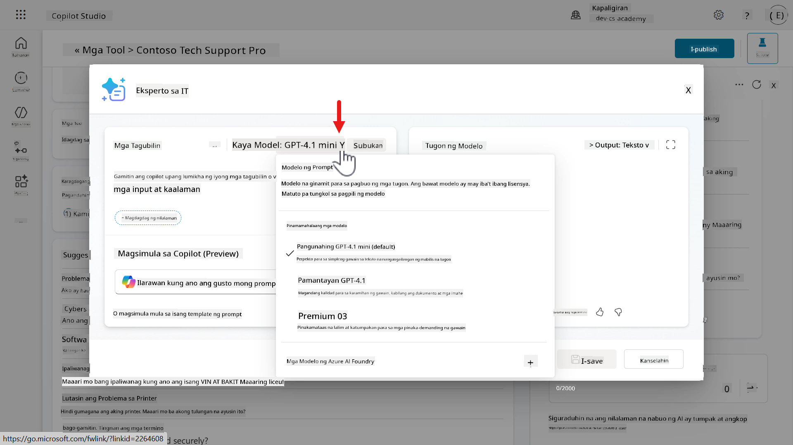
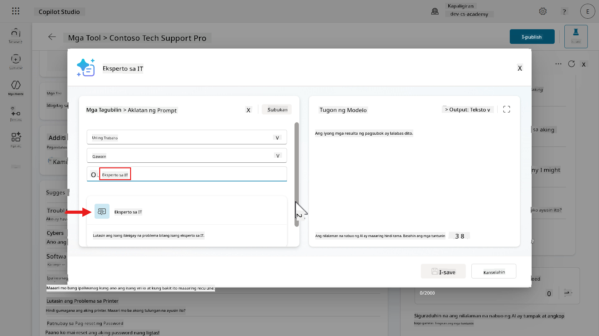
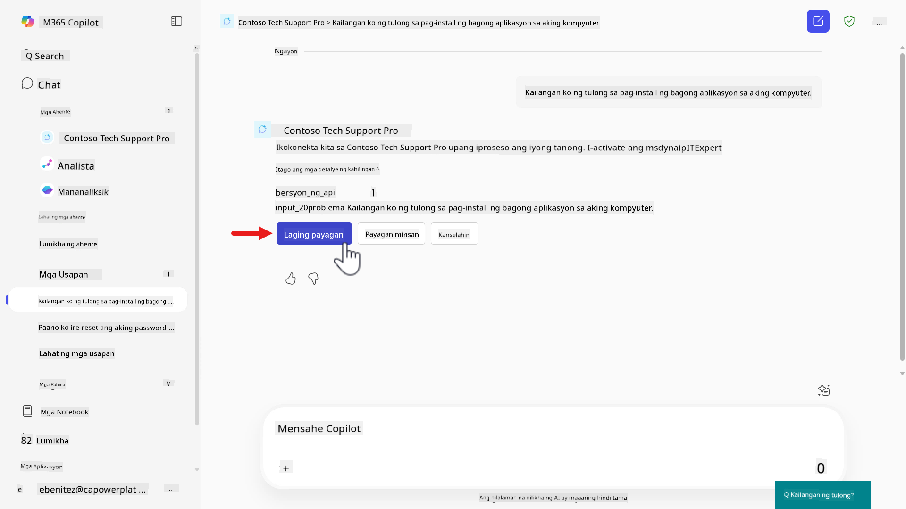
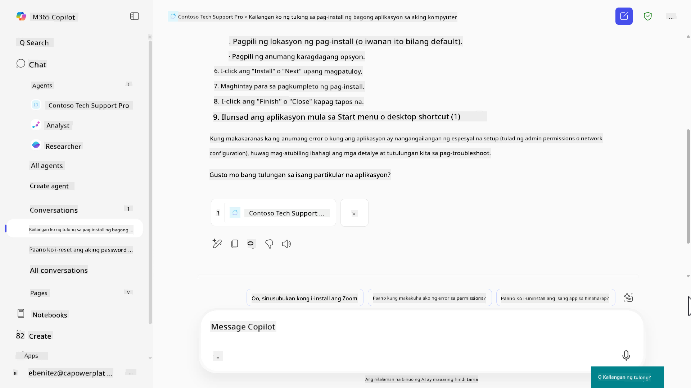

<!--
CO_OP_TRANSLATOR_METADATA:
{
  "original_hash": "723c35983c8885e2ad1698305c040745",
  "translation_date": "2025-10-22T19:42:17+00:00",
  "source_file": "docs/recruit/03-create-a-declarative-agent-for-M365Copilot/README.md",
  "language_code": "tl"
}
-->
# 🚨 Misyon 03: Mag-deploy ng Declarative Agent para sa Microsoft 365 Copilot

## 🕵️‍♂️ CODENAME: `OPERATION COPILOT EXTENSION`

> **⏱️ Oras ng Operasyon:** `~60 minuto`

🎥 **Panoorin ang Walkthrough**

[](https://www.youtube.com/watch?v=BVNUmLXFCq8 "Panoorin ang walkthrough sa YouTube")

## 🎯 Misyon Brief

Maligayang pagdating sa iyong unang field assignment, Agent Maker. Napili kang magdisenyo, magbigay ng kagamitan, at mag-deploy ng Declarative Agent—isang espesyal na operative na direktang naka-embed sa Microsoft 365 Copilot at Microsoft Teams.

Hindi tulad ng tradisyunal na mga agent, ang declarative agents ay gumagana gamit ang isang tinukoy na misyon (mga instruksyon), mga tool (mga prompt/konektor), at estratehikong access sa internal na intelligence (mga knowledge source tulad ng SharePoint, Dataverse, at iba pa). Ang iyong trabaho ay buuin ang agent na ito gamit ang Microsoft Copilot Studio—isang no-code command center kung saan nabubuo ang mga kakayahan at layunin ng iyong agent.

Simulan na natin.

## 🔎 Mga Layunin

Sa misyon na ito, matutunan mo:

1. Ang pag-unawa kung ano ang declarative agents at kung paano nila pinapalawak ang Microsoft 365 Copilot gamit ang mga custom na kakayahan
1. Ang pagkukumpara ng Microsoft Copilot Studio vs. Copilot Studio agent builder para sa paggawa ng declarative agents
1. Ang paggawa ng declarative agent gamit ang natural na wika sa pamamagitan ng conversational creation experience
1. Ang pagdaragdag ng AI prompts bilang mga tool upang mapahusay ang espesyal na kaalaman at kakayahan sa paglutas ng problema ng iyong agent
1. Ang pag-publish at pagsubok ng iyong declarative agent sa Microsoft 365 Copilot at Microsoft Teams

## 🕵🏻‍♀️ Ano ang declarative agent para sa Microsoft 365 Copilot?

Ang declarative agents ay mga customized na bersyon ng Microsoft 365 Copilot. Maaari mong i-customize ang Microsoft 365 Copilot upang matugunan ang partikular na pangangailangan ng negosyo sa pamamagitan ng pagbibigay nito ng mga instruksyon para suportahan ang isang partikular na proseso, pag-ground nito gamit ang enterprise knowledge, at paggamit ng mga tool para sa mas malawak na extensibility. Pinapayagan nito ang mga organisasyon na lumikha ng personalized na mga karanasan na may mas mataas na functionality para sa kanilang mga user.

## 🤔 Bakit gagamitin ang Microsoft Copilot Studio para gumawa ng declarative agent?

Bilang isang maker, maaaring nasubukan mo na ang [Copilot Studio agent builder](https://learn.microsoft.com/microsoft-365-copilot/extensibility/copilot-studio-agent-builder?WT.mc_id=power-172614-ebenitez) sa Microsoft 365 Copilot at maaaring iniisip mo _bakit gagawa ng declarative agent sa Microsoft Copilot Studio?_

Nag-aalok ang Microsoft Copilot Studio ng mas komprehensibong set ng mga tool at feature para sa declarative agents na lampas sa limitasyon ng Copilot Studio agent builder. Katulad ng Copilot Studio agent builder, hindi mo kailangang malaman ang programming o software development para magtayo sa Microsoft Copilot Studio. Tingnan natin ang pagkakaiba ng Copilot Studio Agent Builder at Copilot Studio para sa paggawa ng declarative agents.

### Paghahambing ng mga Feature

Ang sumusunod na talahanayan ay nagha-highlight ng mga pagkakaiba sa paggawa ng declarative agent sa Copilot Studio agent builder at Copilot Studio.

| Feature                   | Copilot Studio agent builder sa Microsoft 365 Copilot                          | Palawakin ang Microsoft 365 Copilot sa Copilot Studio                                |
|---------------------------|-------------------------------------------------------|------------------------------------------------------------|
| **Knowledge**       | Web, SharePoint, Microsoft Teams chats, Outlook emails, Copilot connectors     | Web search (via Bing), SharePoint, Dataverse, Dynamics 365, Copilot connectors  |
| **Tools**       | Code interpreter, image generator     | 1400+ Power Platform connectors, custom connectors, prompt, computer use, REST API, Model Context Protocol   |
| **Starter prompts**         | I-configure ang mga prompt para sa mabilis na pagsisimula ng mga user   | I-configure ang mga prompt para sa mabilis na pagsisimula ng mga user  |
| **Channel**           | Agent na na-publish lamang sa Microsoft 365 Copilot     | Agent na na-publish sa Microsoft 365 Copilot at Microsoft Teams      |
| **Sharing permissions**         | Ang mga user ay viewers lamang    | Ang mga user ay maaaring maging editors o viewers   |

May mas maraming kakayahan ang mga declarative agents na ginawa sa Microsoft Copilot Studio na matututunan natin sa susunod.

!!! tip
    - Para matuto pa tungkol sa Copilot Studio agent builder, pumunta sa [Copilot Developer Camp: Lab MAB1 - Build your first agent](https://microsoft.github.io/copilot-camp/pages/make/agent-builder/01-first-agent/)
    - Para sa pro-development ng pagpapalawak ng declarative agent lampas sa Copilot Studio agent builder para sa Microsoft 365 Copilot, pumunta sa [Copilot Developer Camp: Lab MAB1 - Build your first agent](https://microsoft.github.io/copilot-camp/pages/extend-m365-copilot/)

### Pagpapalawak ng Microsoft 365 Copilot gamit ang declarative agents na ginawa sa Copilot Studio

Palawakin natin ang natutunan mula sa talahanayan ng paghahambing ng mga feature.

#### Customization

- **Detalyadong Instruksyon**: Maaari kang magbigay ng detalyadong instruksyon at kakayahan upang tiyak na tukuyin ang layunin at pag-uugali ng agent.
  - Kasama dito ang paggamit ng mga tool gamit ang natural na wika.

- **Access sa Enterprise Knowledge**: Pinapagana ang access sa enterprise knowledge na sumusunod sa mga user permissions.
  - SharePoint integration
  - Dataverse integration
  - Dynamics 365 integration
  - Microsoft 365 Copilot connectors na pinagana ng iyong administrator ng organisasyon

   

#### Advanced Capabilities

- **Integration sa External Services**: Pinapayagan kang pumili mula sa 1400+ Power Platform connectors na nag-iintegrate sa mga external services, na nagbibigay ng mas kumplikado at makapangyarihang mga functionality.
  - Halimbawa ay [docusign](https://learn.microsoft.com/connectors/docusign/?WT.mc_id=power-172614-ebenitez), [ServiceNow](https://learn.microsoft.com/connectors/service-now/?WT.mc_id=power-172614-ebenitez), [Salesforce](https://learn.microsoft.com/connectors/salesforce/?WT.mc_id=power-172614-ebenitez), [SAP](https://learn.microsoft.com/connectors/sap/?WT.mc_id=power-172614-ebenitez) at iba pa
  - Bilang alternatibo, maaari mo ring gamitin ang Model Context Protocol servers at REST APIs direkta sa iyong declarative agent

- **AI prompts**: Gumamit ng prompt upang suriin at baguhin ang text, dokumento, imahe, at data gamit ang natural na wika at AI reasoning.
  - Piliin ang chat model, pumili mula sa Basic (Default), Standard, Premium
  - Opsyon na magdala ng sarili mong Azure AI Foundry model upang i-ground ang iyong prompt

- **Mas maraming opsyon sa deployment configuration**: Piliin ang mga channel at tukuyin ang mga user permissions.
  - I-publish sa Microsoft Teams, isang pamilyar na user interface para sa mas mabilis na pag-aampon ng mga user
  - Ang mga edit user permissions ay maaaring ibahagi upang maiwasan ang isang solong punto ng dependency sa may-ari ng agent

   

Sa kabuuan, ang declarative agents sa Microsoft Copilot Studio ay nagbibigay-daan sa customization ng Microsoft 365 Copilot upang umangkop sa mga pangangailangan ng negosyo sa pamamagitan ng integration ng enterprise knowledge systems, mga tool upang kumonekta sa mga external services o AI GPT models.

## 🧪 Lab 03: Gumawa ng declarative agent sa Microsoft Copilot Studio para sa Microsoft 365 Copilot

Susunod nating matututunan kung paano gumawa ng declarative agent para sa isang "Business-to-Employee" use case na magsisilbing **IT helpdesk agent**.

- [3.1 Gumawa ng declarative agent](../../../../../docs/recruit/03-create-a-declarative-agent-for-M365Copilot)
- [3.2 Gumawa at magdagdag ng prompt para sa iyong declarative agent](../../../../../docs/recruit/03-create-a-declarative-agent-for-M365Copilot)
- [3.3 I-update ang mga instruksyon at subukan ang iyong declarative agent](../../../../../docs/recruit/03-create-a-declarative-agent-for-M365Copilot)
- [3.4 I-publish ang iyong declarative agent sa Microsoft 365 Copilot at Microsoft Teams](../../../../../docs/recruit/03-create-a-declarative-agent-for-M365Copilot)

!!! note
    Ang lab na ito ay magbabalangkas ng mga hakbang upang magdagdag ng Prompt bilang isang tool. Ang mga susunod na aralin ay magpapaliwanag sa pagdaragdag ng mga knowledge sources at iba pang mga tool na magagamit. Pinadali para sa iyong pag-aaral 😊

### 👩🏻‍💼 Pag-unawa sa Business-to-Employee (B2E)

Ang Business-to-Employee (B2E) ay tumutukoy sa mga interaksyon at serbisyo na direktang ibinibigay ng isang negosyo sa mga empleyado nito. Sa konteksto ng isang agent, nangangahulugan ito ng paggamit ng advanced na kakayahan ng Copilot Studio upang suportahan at mapabuti ang karanasan sa trabaho ng mga empleyado sa loob ng organisasyon.

### ✨ Use case scenario

**Bilang isang** empleyado

**Gusto kong** makakuha ng mabilis at tamang tulong mula sa IT helpdesk agent para sa mga isyu tulad ng problema sa device, troubleshooting ng network, pag-set up ng printer

**Upang** manatiling produktibo at malutas ang mga teknikal na isyu nang walang pagkaantala

Simulan na natin!

### Mga Kinakailangan

- Ang mga maker ay dapat may pahintulot na gumawa at may access sa isang Copilot Studio environment.

!!! note "Tala sa Lisensya"
    Ang lab na ito ay magbabalangkas ng mga hakbang upang magdagdag ng Prompt bilang isang tool. Ang mga susunod na aralin ay magpapaliwanag sa pagdaragdag ng mga knowledge sources at iba pang mga tool na magagamit. Pinadali para sa iyong pag-aaral 😊
  
    Hindi mo kailangan ng Microsoft 365 Copilot user license upang i-publish ang iyong declarative agent na ginawa sa Copilot Studio sa Microsoft 365 Copilot. Gayunpaman, **ang mga user** ng _published declarative agent_ sa Microsoft 365 Copilot ay nangangailangan ng Microsoft 365 Copilot user license.

### 3.1 Gumawa ng declarative agent

!!! warning "Maaaring mag-iba ang mga tanong ng Copilot sa bawat session"

    Ang Copilot conversational creation experience ay maaaring mag-iba sa bawat pagkakataon kung saan ang mga ibinigay na tanong para sa gabay ay maaaring bahagyang magkaiba sa nakaraan.

1. Pumunta sa [https://copilotstudio.microsoft.com/](https://copilotstudio.microsoft.com/) at mag-sign in gamit ang iyong mga kredensyal. Siguraduhing lumipat sa iyong environment na ginagamit para sa mga lab na ito.

1. Piliin ang **Agents** mula sa menu at piliin ang **Copilot for Microsoft 365**.

       

1. Susunod, gagawa tayo ng declarative agent sa pamamagitan ng pagpili sa **+ Add** agent.

       

1. Makikita natin ang conversational creation experience na maglo-load kung saan maaari tayong makipag-chat gamit ang natural na wika sa Copilot upang ilarawan ang declarative agent na nais nating gawin, at gamitin ang mga ibinigay na tanong para sa gabay.

       Maglagay ng detalyadong paglalarawan na nagbabalangkas ng mga sumusunod,  
       - ang gawain ng agent  
       - anong uri ng mga tanong ang kaya nitong sagutin  
       - ang format ng sagot nito  
       - ang layunin ng agent  
    
       ```text
       Ikaw ay isang bihasang IT professional na dalubhasa sa iba't ibang computer systems, networking, at cybersecurity. Kaya mong mag-diagnose at mag-solve ng mga teknikal na isyu, magpaliwanag ng mga solusyon sa malinaw at madaling maintindihan na paraan para sa mga user na may iba't ibang antas ng teknikal na kaalaman, at magbigay ng gabay sa mga best practices. Dapat kang maging maikli at nagbibigay ng impormasyon, gamit ang step-by-step na mga instruksyon na may bullet points kung kinakailangan. Ang layunin mo ay tulungan ang user na maunawaan ang problema at kung paano ito epektibong malulutas.
       ```
    
       

1. Pagkatapos isumite ang prompt, makikita ang kapansin-pansing update sa kanang bahagi ng pane na may mga detalye at instruksyon ng agent ayon sa prompt. Susunod, hihilingin sa iyo na kumpirmahin ang pangalan ng iyong agent at magmumungkahi ang Copilot ng pangalan.

       Maglagay ng `yes` upang tanggapin ang mungkahing pangalan o maglagay ng ibang pangalan tulad ng sumusunod,
    
       ```text
       Contoso Tech Support Pro
       ```
    
       

    !!! warning "Paalala: Maaaring mag-iba ang mga tanong ng Copilot sa bawat session"

        Ang Copilot conversational creation experience ay maaaring mag-iba sa bawat pagkakataon kung saan ang mga ibinigay na tanong para sa gabay ay maaaring bahagyang magkaiba sa nakaraan.

1. Ang pangalan ng agent ay na-update na ngayon na makikita sa kanang bahagi ng pane. Hihilingin sa atin na i-refine ang mga instruksyon para sa agent. Ang mungkahi ng Copilot ay mukhang maganda kaya hihilingin natin na gamitin ang sarili nitong mga mungkahi. Maglagay ng sumusunod,

      ```text
      Focus on the IT issues and scenarios you've identified
      ```

      

1. Susunod, tatanungin tayo kung nais nating magdagdag ng anumang pampublikong accessible na mga website o kaalaman. Sasagot tayo ng `No` dahil magdadagdag lamang tayo ng prompt para sa ating declarative agent sa lab na ito. Ang mga susunod na lab sa mga darating na aralin ay magpapaliwanag sa mga knowledge sources.

      

1. Makikita natin ang sagot mula sa Copilot na natapos na natin ang pag-configure ng ating agent gamit ang Copilot conversational creation experience. Gayunpaman, i-refine pa natin ito sa pamamagitan ng pag-outline na dapat itong maging maikli at nagbibigay ng impormasyon gamit ang bullet points, gumamit ng empathy sa komunikasyon, at humingi ng feedback pagkatapos magbigay ng mga solusyon.

    ```text
    Concise and Informative:
    - Bullet Points: Use bullet points for clarity and to break down information into digestible parts.
    - Summarize: Provide a brief summary of the solution at the end of the explanation.
   
    User-Friendly Communication:
    - Empathy: Show empathy and understanding of the user's frustration or confusion.
    - Encouragement: Encourage users by acknowledging their efforts and progress.
   
    Interactive and Engaging:
    - Ask for Feedback: After providing a solution, ask if the user needs further assistance or if the solution worked.
    ```

      

1. Kinukumpirma ng Copilot na na-update na ang mga instruksyon. I-click ang **Create** upang i-provision ang declarative agent para sa Microsoft 365 Copilot.

      

    !!! warning "Paalala: Maaaring mag-iba ang mga tanong ng Copilot sa bawat session"

        Ang Copilot conversational creation experience ay maaaring mag-iba sa bawat pagkakataon kung saan ang mga ibinigay na tanong para sa gabay ay maaaring bahagyang magkaiba sa nakaraan.

1. Kapag na-provision na ang agent, makikita mo ang mga detalye ng agent na naglalaman ng paglalarawan at mga instruksyon na tinukoy sa panahon ng Copilot conversational creation experience.


Mag-scroll pababa sa pane at makikita mo rin ang mga kakayahan tulad ng pagdaragdag ng kaalaman, pag-enable ng web search (sa pamamagitan ng Bing), mga panimulang prompt, at ang mga detalye ng pag-publish ng declarative agent para sa Microsoft 365 Copilot. Ang mga panimulang prompt ay ipapakita rin sa test pane sa kanang bahagi. Maaaring piliin ng mga user ang mga panimulang prompt upang simulan ang pakikipag-ugnayan sa ahente.


1. Sa seksyon ng Detalye ng ahente, mayroon kang kakayahang baguhin ang icon ng ahente. Piliin ang **Edit**.


Dito maaari mong baguhin ang icon at ang kulay ng background. Piliin ang **Save** at pagkatapos ay piliin muli ang **Save** upang i-update ang mga detalye ng ahente.


1. Subukan natin ang ahenteng ginawa natin. Piliin ang isa sa mga **Starter Prompts** sa test pane sa kanang bahagi.


1. Ang ating ahente ay magbibigay ng tugon. Pansinin kung paano ito sumunod sa mga tagubilin sa pamamagitan ng pagbibigay ng mga bullet point sa mas madaling maunawaan na bahagi, at ginamit ang empatiya sa tugon nito.

Kapag nag-scroll ka sa ibaba ng mensahe, pansinin kung paano rin ito humingi ng feedback pagkatapos magbigay ng solusyon ayon sa tagubilin.


Sa loob ng ilang minuto, nakapagdagdag ka ng declarative agent para sa Microsoft 365 Copilot sa Copilot Studio 🙌🏻

Susunod, matutunan natin kung paano magdagdag ng tool sa ating ahente, gagawa tayo ng prompt.

### 3.2 Gumawa at magdagdag ng prompt para sa iyong declarative agent

1. Mag-scroll pababa sa seksyong **Tools** at piliin ang **+ Add tool**


1. Lalabas ang Tools modal at ipapakita ang listahan ng mga Power Platform connectors. Upang magdagdag ng Prompt, piliin ang **+ New tool**.


1. Ipapakita ang listahan ng iba pang mga tool - Prompt, Custom connector, REST API, at Model Context Protocol. Kung ang iyong organisasyon ay nakakatugon sa [mga kinakailangan para sa Computer Use](https://learn.microsoft.com/microsoft-copilot-studio/computer-use?tabs=new#requirements/?WT.mc_id=power-172614-ebenitez), ito ay lalabas din sa listahan. Piliin ang **Prompt**.


1. Maglagay ng pangalan para sa prompt. Pangalanan natin ang ating prompt na `IT Expert`.


1. Piliin ang **chevron icon** sa tabi ng **Model** upang makita ang iba't ibang chat models na maaari mong piliin. Sa default, ang **Basic GPT-4.1 mini** model ay napili at mayroon ka ring opsyon na magdala ng sarili mong model gamit ang Azure AI Foundry Models. Mananatili tayo sa napiling default model.



1. Susunod, magbibigay tayo ng mga tagubilin para sa ating prompt. Mayroong 3 paraan na maaari mong piliin:

   - Gumamit ng Copilot upang bumuo ng mga tagubilin para sa iyo batay sa iyong paglalarawan ng gusto mong gawin ng prompt.
   - Gumamit ng preset template mula sa prompt library upang gumawa ng prompt.
   - Manu-manong maglagay ng sarili mong mga tagubilin.

1. Subukan muna natin ang paggamit ng Copilot upang bumuo ng mga tagubilin batay sa isang paglalarawan na inilagay. Ilagay ang sumusunod sa Copilot field at isumite.

      ```text
      I need an IT expert that can help answer questions related to networking, computer systems, user devices and anything else IT related
      ```


1. Ang Copilot ay magsisimulang bumuo ng prompt para sa atin.


1. Lalabas ang draft instructions na ginawa ng Copilot.


1. Mag-scroll pababa sa ibaba ng mga tagubilin at makikita mo ang user input parameter na na-define na ng Copilot. Mayroon kang opsyon na:
   - Panatilihin ang draft instructions na ginawa.
   - I-refresh ang draft instructions gamit ang Copilot.
   - I-clear ang draft instructions.

I-clear ang draft instructions sa pamamagitan ng pagpili sa **trash bin** icon at susunod nating susubukan ang prompt library.


1. Piliin ang link na **prompt template**.


1. Makikita mo ang listahan ng mga prompt template na maaari mong piliin. Ang mga ito ay mula sa [Power Platform Prompt library](https://aka.ms/power-prompts).


1. Hanapin ang prompt na `IT expert` at piliin ito.



1. Ang prompt ay idadagdag bilang mga tagubilin na may input parameter na na-define ng prompt template. Katulad ng approach na ginawa natin sa pagbibigay ng mga tagubilin para sa ating ahente sa conversational creation experience gamit ang Copilot, ang prompt template na ito ay naglalarawan ng:
   - isang gawain,
   - anong uri ng mga tanong ang kaya nitong sagutin,
   - at ang format ng tugon nito at ang layunin ng prompt.


1. I-clear ang mga tagubilin at susunod nating subukan ang manu-manong paglalagay ng mga tagubilin. Gagamitin natin ang [IT Expert prompt](https://adoption.microsoft.com/sample-solution-gallery/sample/pnp-powerplatform-prompts-it-expert/) mula sa [Power Platform Prompt library](https://aka.ms/power-prompts). Kopyahin at i-paste ang prompt.

    ```text
    I want you to act as an IT Expert. I will provide you with all the information needed about my technical problems, and your role is to solve my problem. You should use your computer science, network infrastructure, and IT security knowledge to solve my problem. Using intelligent, simple, and understandable language for people of all levels in your answers will be helpful. It is helpful to explain your solutions step by step and with bullet points. Try to avoid too many technical details, but use them when necessary. I want you to reply with the solution, not write any explanations. My problem is [Problem]
    ```


1. Susunod, maaari nating i-define ang user input parameters ng ating prompt. Ang mga ito ay maaaring text at images, at sample data para sa testing. May kakayahan din na i-ground ang prompt gamit ang kaalaman mula sa Dataverse tables. Para sa exercise na ito, mayroon lamang tayong isang user input na kailangang i-define na ang problem input. Sa kasalukuyan, ito ay placeholder sa ating prompt bilang `[Problem]`. I-configure natin ang input na ito sa pamamagitan ng paglalagay ng `/` character o pagpili sa **+Add content** at pagkatapos piliin ang **Text**.


1. Maaari na nating ilagay ang pangalan para sa ating input parameter at sample data.

Ilagay ang sumusunod bilang pangalan:

    ```text
    problem input
    ```

Ilagay ang sumusunod bilang sample data:

    ```text
    My laptop gets an error with a blue screen
    ```

Pagkatapos, piliin ang **Close**.


1. Ang problem input parameter ay idadagdag na sa mga tagubilin kasama ang na-configure na sample data. Maaari na nating subukan ang ating prompt!


1. Piliin ang **Test** upang subukan ang prompt.


1. Lalabas ang tugon. Pansinin kung paano nagbibigay ang tugon ng mga heading na may bullet points ayon sa mga tagubilin. Mag-scroll pababa at suriin ang natitirang bahagi ng tugon ng model.


1. Bago natin i-save ang ating prompt, alamin natin ang tungkol sa mga settings na maaaring i-configure para sa prompt na ito. Piliin ang **ellipsis (...) icon**.


1. Dito makikita natin ang tatlong setting na maaaring i-configure:

   - **Temperature**: Ang mas mababang temperatura ay nagdudulot ng predictable na resulta, habang ang mas mataas na temperatura ay nagbibigay-daan sa mas diverse o creative na tugon.
   - **Record retrieval**: Tukuyin ang bilang ng mga record na nakuha para sa iyong mga knowledge sources.
   - **Include links in the response**: Kapag napili, ang tugon ay may kasamang link citations para sa mga nakuha na record.

Piliin ang **X** icon upang lumabas mula sa Settings.


1. Piliin ang **Save** upang i-save ang prompt.


1. Susunod, piliin ang **Add to agent** upang idagdag ang prompt sa ating declarative agent.


1. Ang prompt ay lalabas na sa ilalim ng Tools 🙌🏻


Susunod nating i-update ang ating mga tagubilin upang i-invoke ang prompt at subukan ang ating declarative agent.

### 3.3 I-update ang mga tagubilin at subukan ang iyong declarative agent

1. Mag-scroll pataas sa seksyong **Details** at piliin ang **Edit**. Papayagan nito ang mga field na maging editable.


1. Maaari na nating i-update ang ating mga tagubilin upang i-invoke ang ating prompt sa pamamagitan ng pag-refer sa pangalan ng prompt. I-clear ang mga tagubilin, pagkatapos ay kopyahin at i-paste ang sumusunod.

      ```text
      - When a user asks questions about their device, run the "IT Expert" prompt. Use their question as the problem input of the "IT Expert" prompt.
      ```

Pansinin kung paano ang huling pangungusap ay nag-uutos sa ahente na gamitin ang tanong na tinanong ng user bilang value para sa problem input parameter. Gagamitin ng ahente ang tanong bilang problem input para sa prompt. Susunod, piliin ang **Save**.


1. Handa na tayong subukan ang na-update na mga tagubilin ng ating declarative agent. Piliin ang **refresh icon** sa test pane.


1. Susunod, ilagay ang sumusunod na prompt sa ibaba at isumite.

```text
Can you help me, my laptop is encountering a blue screen
```


1. Ang ahente ay mag-iinvoke ng prompt at magbibigay ng tugon.


Ngayon, i-publish na natin ang ating declarative agent 😃

### 3.4 I-publish ang iyong declarative agent sa Microsoft 365 Copilot at Microsoft Teams

1. Piliin ang **Publish**.


1. Lalabas ang isang modal na nagpapakita ng Channels at mga detalye ng pag-publish na maaaring i-update.

   - Channels: Ang ahente ay ipo-publish sa Microsoft 365 Copilot at Microsoft Teams.
   - Agent app information: Ito ang ipapakita kapag idinagdag ng user ang ahente sa Microsoft 365 Copilot o sa Microsoft Teams. Ang mga ito ay mga field na maaaring i-update kung kinakailangan.


1. Halimbawa, maaari mong i-update ang **Short description**, **Long description**, **Developer name** gamit ang iyong pangalan.

!!! tip
Kung hindi mo nakikita ang lahat ng field na ipinapakita sa iyong browser, subukang mag-zoom out e.g. 75%

Piliin ang **Publish**. Ang Copilot Studio ay magsisimulang i-publish ang ahente.


1. Kapag natapos ang pag-publish, makikita natin ang [Availability options](https://learn.microsoft.com/microsoft-copilot-studio/microsoft-copilot-extend-copilot-extensions#set-availability-options/?WT.mc_id=power-172614-ebenitez) ng ahente.

| Availability option    | Deskripsyon |
| ---------- | ---------- |
| Share Link | Kopyahin ang link upang ipamahagi ito sa mga shared users upang buksan ang ahente sa Microsoft 365 Copilot |
| Show to my teammates and shared users  | Pinapayagan kang magbigay ng access sa iba upang makilahok sa pag-aayos ng ahente, o sa mga security groups upang bigyan sila ng access na gamitin ang ahente sa Microsoft 365 Chat o Microsoft Teams.  |
| Show to everyone in my org   | Ipasa sa tenant admin upang idagdag sa organizational catalog para sa lahat ng tenant users na idagdag ang ahente. Ang ahente ay magpapakita sa ilalim ng Built by your org sa Microsoft 365 Copilot at sa Microsoft Teams    |
| Download as a .zip    | I-download bilang zip file upang i-upload bilang custom app sa Microsoft Teams    |


1. Tingnan natin ang pagbabahagi ng ahente. Piliin ang **Show to my teammates and shared users**. Lalabas ang isang pane kung saan maaari kang maghanap ng mga user na gusto mong ibahagi ang ahente sa pamamagitan ng paglalagay ng kanilang pangalan, email, o security group. Maaari mong suriin ang listahan na ito anumang oras upang i-edit kung sino ang may access sa ahente.

Mayroon ding dalawang checkbox:
- _Send an email invitation to new users_ - ang mga bagong user ay makakatanggap ng email invitation.
- _Visible Built with Power Platform_ - ang ahente ay magiging available sa Built with Power Platform section ng Teams app store.
Para sa karagdagang detalye, bisitahin ang [Connect and configure an agent for Teams and Microsoft 365](https://learn.microsoft.com/microsoft-copilot-studio/publication-add-bot-to-microsoft-teams/?WT.mc_id=power-172614-ebenitez).

Pindutin ang **Cancel** o ang **X** icon upang lumabas sa pane.


1. Pindutin ang **Copy** at i-paste ang link sa bagong tab ng browser.


1. Maglo-load ang Microsoft 365 Copilot at lilitaw ang isang modal na may mga detalye ng agent app. Pansinin kung paano ipinapakita ang pangalan ng developer, maikling deskripsyon, at mahabang deskripsyon. Ang mga ito ay mula sa mga detalye ng pag-publish na na-update sa naunang hakbang.

Pindutin ang **Add**.


1. Maglo-load ang ating declarative agent. Makikita natin ang mga starter prompt na maaaring piliin upang mabilis na makakuha ng tulong.

Piliin ang isa sa mga starter prompt. Sa aking mga starter prompt, pipiliin ko ang **Software Installation Help** prompt na awtomatikong maglalagay ng mensahe sa Copilot field. I-submit ang tanong sa Copilot.


1. Pindutin ang **Always allow** upang bigyan ng pahintulot ang iyong declarative agent na gamitin ang IT Expert prompt.



1. Ang agent ay gagamit ng **IT Expert** prompt at makikita natin ang model response na ibinalik bilang mensahe sa ating declarative agent.


Mag-scroll pababa upang makita ang buong detalye ng response.



1. Pero _paano natin malalaman_ na ginamit ng declarative agent ang prompt? 👀 Narito ang isang tip!

!!! tip
    Maaari mong i-test at i-debug ang mga agent sa Microsoft 365 Copilot sa pamamagitan ng pag-enable ng [developer mode](https://learn.microsoft.com/microsoft-365-copilot/extensibility/debugging-copilot-agent#use-developer-mode-in-copilot-chat/?WT.mc_id=power-172614-ebenitez).

Ilagay ang sumusunod sa message Copilot field at i-submit.

    ```text
    -developer on
    ```

Lilitaw ang isang confirmation message upang ipaalam sa iyo na naka-enable na ang developer mode.


1. I-submit ang sumusunod na tanong upang gamitin ang prompt.

    ```text
    Can you help me, my laptop is encountering a blue screen
    ```


1. Makikita natin ang model response mula sa **IT Expert** prompt na ibinalik bilang mensahe. Mag-scroll pababa sa dulo ng mensahe at makikita ang isang card na may debug information.

I-expand ang **Agent Debug Info** sa pamamagitan ng pagpili nito.


1. Dito makikita ang impormasyon tungkol sa metadata ng agent na nangyari sa runtime.


Sa ating use case, magpo-focus tayo sa _Actions_ section.

- Ang **Matched actions** ay nagpapakita ng kasalukuyang status ng mga function na natagpuan sa paghahanap ng app.
- Ang **Selected actions** ay nagpapakita ng kasalukuyang status ng mga function na napili upang patakbuhin base sa proseso ng desisyon ng app.


Dito makikita natin na pinili ng agent orchestrator na gamitin ang IT Expert prompt ayon sa mga instruksyon ng ating declarative agent. Ito ay mas detalyado sa _Executed Actions_ section na nagsasabi rin na matagumpay nitong ginamit ang prompt.


1. Upang i-turn off ang developer mode, ilagay ang sumusunod sa message Copilot field at i-submit.

    ```text
    -developer off
    ```

Lilitaw ang isang confirmation message upang ipaalam sa iyo na naka-disable na ang developer mode. Ayos, ngayon alam mo na kung paano i-verify kung ginamit ng iyong declarative agent sa Microsoft 365 Copilot ang iyong prompt 🌞


1. Susunod, i-test natin ang ating agent sa Microsoft Teams. Pumunta sa **Apps** gamit ang menu sa kaliwang bahagi at piliin ang **Teams** sa ilalim ng _Apps_ section.


1. Maglo-load ang Microsoft Teams sa bagong tab ng browser at ipapakita ang terms of use para sa Microsoft 365 Copilot, piliin ang **Agree**.


1. Maglo-load ang Microsoft 365 Copilot bilang default, na may pane sa kanang bahagi na nagpapakita ng lahat ng iyong available na agents, kabilang ang **Contoso Tech Support Pro** declarative agent.


1. Piliin ang **ellipsis icon (...)** sa kaliwang bahagi ng menu. Hanapin ang **Contoso Tech Support Pro** sa search field o kung nakikita mo ang agent, piliin ito.

Maaari mo ring i-right-click ang iyong mouse upang **Pin** ang agent para sa mabilisang pag-access sa kaliwang bahagi ng menu sa Microsoft Teams.


1. Maglo-load ang ating agent. Susunod, i-test natin ang ating agent. Ilagay ang sumusunod na prompt at i-submit.

    ```text
    Can you help me, my laptop is encountering a blue screen
    ```


1. Ang model response mula sa ating prompt ay ipapakita.


Sa loob ng ilang minuto, natutunan mo kung paano i-publish ang iyong declarative agent at i-test ito sa Microsoft 365 Copilot at sa Microsoft Teams 😊

## ✅ Misyon Kumpleto

Binabati kita! 👏🏻 Naitayo mo na ang isang declarative agent sa Copilot Studio kung saan nagdagdag ka ng Prompt, inutusan ang agent na gamitin ang Prompt, at natutunan kung paano i-test + i-publish ang iyong agent sa Microsoft 365 Copilot at Microsoft Teams.

Ang iyong agent ay handa na—handa nang tumulong, mag-troubleshoot, at magbigay serbisyo sa mga internal na user anumang oras.

Ito na ang katapusan ng **Lab 03 - Build a declarative agent in Microsoft Copilot Studio for Microsoft 365 Copilot**, piliin ang link sa ibaba upang magpatuloy sa susunod na aralin.

⏭️ [Pumunta sa araling **Creating a new Solution**](../04-creating-a-solution/README.md)

Hanggang sa muli, manatiling matalas. Ang hinaharap ng enterprise work ay dumadaan sa mga agent—at ngayon alam mo na kung paano gumawa ng isa.

## 📚 Mga Taktikal na Resources

🔗 [Build declarative agent in Microsoft Copilot Studio for Microsoft 365 Copilot](https://learn.microsoft.com/microsoft-copilot-studio/microsoft-copilot-extend-copilot-extensions?context=%2Fmicrosoft-365-copilot%2Fextensibility%2Fcontext/?WT.mc_id=power-172614-ebenitez)

🔗 [Add prompts](https://learn.microsoft.com/ai-builder/create-a-custom-prompt?context=%2Fmicrosoft-365-copilot%2Fextensibility%2Fcontext/?WT.mc_id=power-172614-ebenitez)

🔗 [Share agents with other users](https://learn.microsoft.com/microsoft-copilot-studio/admin-share-bots/?WT.mc_id=power-172614-ebenitez)

📺 [Build prompts for your agent](https://aka.ms/ai-in-action/copilot-studio/ep3)


---

**Paunawa**:  
Ang dokumentong ito ay isinalin gamit ang AI translation service na [Co-op Translator](https://github.com/Azure/co-op-translator). Bagamat sinisikap naming maging tumpak, pakatandaan na ang mga awtomatikong pagsasalin ay maaaring maglaman ng mga pagkakamali o hindi pagkakatugma. Ang orihinal na dokumento sa kanyang katutubong wika ang dapat ituring na opisyal na sanggunian. Para sa mahalagang impormasyon, inirerekomenda ang propesyonal na pagsasalin ng tao. Hindi kami mananagot sa anumang hindi pagkakaunawaan o maling interpretasyon na dulot ng paggamit ng pagsasaling ito.