<!--
CO_OP_TRANSLATOR_METADATA:
{
  "original_hash": "0c51aabca81d6256990caf4c015e6195",
  "translation_date": "2025-10-22T19:33:18+00:00",
  "source_file": "docs/recruit/04-creating-a-solution/README.md",
  "language_code": "tl"
}
-->
# 🚨 Misyon 04: Paglikha ng Solusyon para sa Iyong Ahente

## 🕵️‍♂️ CODENAME: `OPERATION CTRL-ALT-PACKAGE`

> **⏱️ Oras ng Operasyon:** `~45 minuto`

🎥 **Panoorin ang Walkthrough**

[](https://www.youtube.com/watch?v=1iATbkgfcpU "Panoorin ang walkthrough sa YouTube")

## 🎯 Misyon Brief

Tagagawa ng Ahente, maligayang pagdating sa iyong susunod na taktikal na operasyon. Sa misyon na ito, matututo kang mag-assemble ng Solusyon - ang opisyal na deployment vehicle para sa iyong IT Helpdesk Agent na ginawa gamit ang Microsoft Copilot Studio. Isipin ito bilang paglikha ng isang digital na maleta na naglalaman ng iyong ahente at mga artifact nito.

Ang bawat ahente ay nangangailangan ng maayos na tahanan. Iyan ang ibinibigay ng Power Platform solution - kaayusan, portability, at kahandaan para sa produksyon.

Simulan na natin ang pag-iimpake.

## 🔎 Mga Layunin

Sa misyon na ito, matututo ka:

1. Ang pag-unawa sa kung ano ang Power Platform solutions at ang kanilang papel sa pag-develop ng ahente
1. Ang pag-aaral ng mga benepisyo ng paggamit ng solutions para sa pag-aayos at pag-deploy ng mga ahente
1. Ang pag-explore ng solution publishers at ang kanilang kahalagahan sa pamamahala ng mga component
1. Ang pag-unawa sa lifecycle ng Power Platform solution mula sa development hanggang production
1. Ang paglikha ng sarili mong solution publisher at custom solution para sa iyong IT Helpdesk Agent

## 🕵🏻‍♀️ Solusyon? Ano iyon?

Sa Microsoft Power Platform, ang mga solusyon ay parang mga lalagyan o package na naglalaman ng lahat ng bahagi ng iyong mga app o ahente - maaaring ito ay mga talahanayan, form, flow, at custom na lohika. Ang mga solusyon ay mahalaga para sa Application Lifecycle Management (ALM), pinapadali nito ang pamamahala ng iyong app at mga ahente mula sa ideya hanggang sa development, testing, deployment, at updates.

Sa Copilot Studio, ang bawat ahente na iyong nilikha ay naka-imbak sa isang Power Platform solution. Sa default, ang mga ahente ay nililikha sa Default solution, maliban kung lumikha ka ng bagong custom solution para sa iyong ahente. Ito ang matututunan natin 🤓 sa araling ito at sa hands-on lab.

Tradisyonal na nililikha ang mga solusyon sa **Power Apps maker portal** - isang web-based na interface kung saan maaari kang magtayo at mag-customize ng mga app, Dataverse, flow, mag-explore ng mga AI component, at iba pa.

   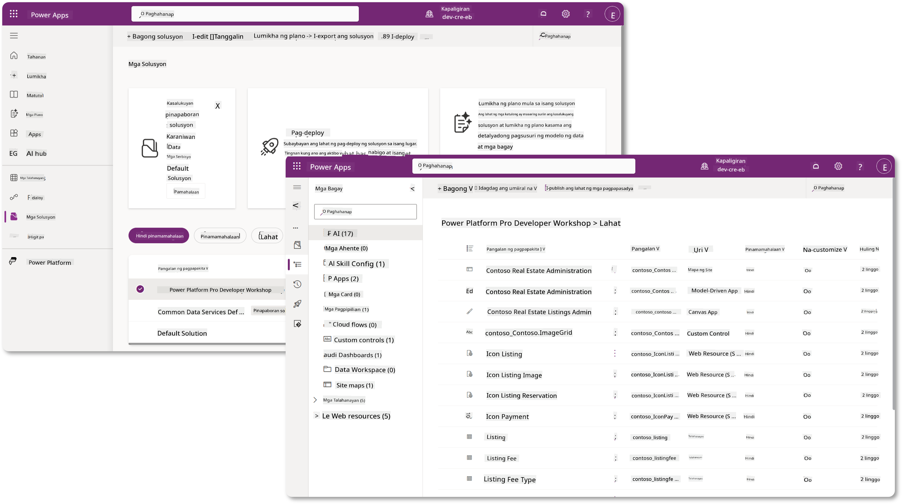

Sa Copilot Studio, mayroon na ngayong **Solution Explorer** kung saan maaari mong pamahalaan ang iyong mga solusyon nang direkta. Hindi mo na kailangang lumipat sa Power Apps maker portal para pamahalaan ang iyong mga solusyon, maaari itong gawin sa loob mismo ng Copilot Studio 🪄

Ibig sabihin, magagawa mo ang karaniwang mga gawain na may kaugnayan sa solusyon:

- **Lumikha ng solusyon** - ang mga custom solution ay nagbibigay-daan sa mga ahente na ma-export at ma-import sa pagitan ng mga environment.
- **Itakda ang iyong preferred solution** - piliin ang solution kung saan ang mga ahente, app, at iba pa ay malilikha bilang default.
- **Magdagdag o mag-alis ng mga component** - maaaring ang iyong ahente ay nagre-refer sa ibang mga component tulad ng environment variables o cloud flows. Kaya't ang mga component na ito ay kailangang isama sa solusyon.
- **Mag-export ng mga solusyon** - upang ilipat ang mga solusyon sa ibang target environment.
- **Mag-import ng mga solusyon** - mag-import ng mga solusyon na nilikha sa ibang lugar, kabilang ang pag-upgrade o pag-update ng mga solusyon.
- **Lumikha at pamahalaan ang mga solution pipeline** - i-automate ang deployment ng mga solusyon sa pagitan ng mga environment.
- **Git integration** - nagbibigay-daan sa mga developer na ikonekta ang mga solusyon sa Git repositories para sa version control, collaboration, at ALM. Nilalayon na gamitin lamang sa mga developer environment.

   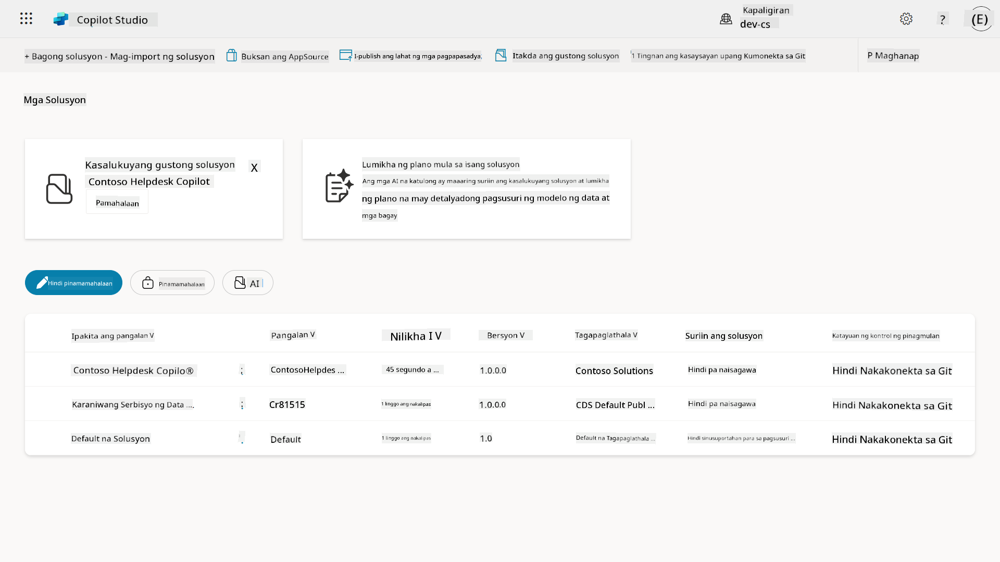

Mayroong dalawang uri ng solusyon:

- **Unmanaged solutions** - ginagamit sa panahon ng development. Maaari mong malayang i-edit at i-customize ayon sa pangangailangan.
- **Managed solutions** - ginagamit kapag handa ka nang i-deploy ang iyong app sa testing o production. Ang mga ito ay naka-lock upang maiwasan ang hindi sinasadyang pagbabago.

## 🤔 Bakit _dapat_ akong gumamit ng Solusyon para sa aking ahente?

Isipin ang Solutions bilang isang _toolbox_. Kapag kailangan mong ayusin o bumuo ng isang bagay (isang ahente) sa ibang lokasyon (environment), kinokolekta mo ang lahat ng kinakailangang tools (mga component) at inilalagay ito sa iyong toolbox (Solution). Maaari mo nang dalhin ang toolbox na ito sa bagong lokasyon (environment) at gamitin ang mga tools (mga component) upang tapusin ang iyong trabaho, o magdagdag ng bagong tools (mga component) upang i-customize ang iyong ahente o proyekto na iyong binubuo.

!!! quote "Elaiza, ang iyong kaibigang cloud advocate na sumisingit dito 🙋🏻‍♀️ upang magbahagi ng ilang salita:"
    May kasabihan kami sa New Zealand, "Maging malinis na Kiwi!" na isang tawag sa aksyon para sa mga taga-New Zealand 🥝 upang magpakita ng responsibilidad para sa kanilang kapaligiran sa pamamagitan ng tamang pagtatapon ng basura at pagpapanatili ng kalinisan ng mga pampublikong lugar. Maaari nating gamitin ang parehong konteksto para sa mga ahente sa pamamagitan ng pagpapanatili ng kaayusan at portability ng lahat ng may kaugnayan sa iyong ahente, at makakatulong ito sa iyo na mapanatili ang maayos na environment.

Magandang kasanayan ang paglikha ng ahente sa isang dedikadong solusyon sa iyong source (developer) environment. Narito kung bakit mahalaga ang mga solusyon:

🧩 **Organisadong development**

- Pinapanatili mong hiwalay ang iyong ahente mula sa Default solution na naglalaman ng lahat ng nasa environment. Ang lahat ng component ng iyong ahente ay nasa isang lugar 🎯

- Ang lahat ng kailangan mo para sa iyong ahente ay nasa isang solusyon, na ginagawang mas madali ang pag-export at pag-import sa target environment 👉🏻 ito ay isang magandang kasanayan sa ALM.

🧩 **Ligtas na deployment**

- Maaari mong i-export ang iyong app o ahente bilang isang managed solution at i-deploy ito sa ibang target environment (tulad ng testing o production) nang hindi nanganganib sa hindi sinasadyang mga pagbabago.

🧩 **Version control**

- Maaari kang lumikha ng mga patch (target fixes), updates (mas malawak na pagbabago) o upgrades (pagpapalit ng solusyon - karaniwang malalaking pagbabago at pagpapakilala ng mga bagong feature).

- Tumutulong ito sa iyo na mag-roll out ng mga pagbabago sa isang kontroladong paraan.

🧩 **Pamamahala ng dependency**

- Ang mga solusyon ay nagta-track kung aling mga bahagi ang umaasa sa iba. Pinipigilan ka nitong masira ang mga bagay kapag gumawa ka ng mga pagbabago.

🧩 **Team collaboration**

- Ang mga developer at maker ay maaaring magtulungan gamit ang unmanaged solutions sa development, pagkatapos ay magbigay ng managed solution para sa deployment.

## 🪪 Pag-unawa sa Solution Publishers

Ang Solution Publisher sa Power Platform ay parang label o brand na tumutukoy kung sino ang gumawa o nagmamay-ari ng solusyon. Ito ay isang maliit ngunit mahalagang bahagi ng pamamahala ng iyong mga app, ahente, at flow customizations, lalo na kapag nagtatrabaho sa mga team o sa iba't ibang environment.

Kapag lumikha ka ng solusyon, kailangan mong pumili ng publisher. Ang publisher na ito ang tumutukoy sa:

- Isang prefix na idinadagdag sa lahat ng custom components (halimbawa - mga talahanayan, field, at flow).

- Pangalan at contact info para sa organisasyon o tao na nagmamay-ari ng solusyon.

### 🤔 Bakit ito mahalaga?

1. **Madaling pagkakakilanlan** - ang prefix (Halimbawa - `new_` o `abc_`) ay tumutulong sa mabilis na pagkilala kung aling mga component ang kabilang sa aling solusyon o team.

1. **Iwasan ang mga conflict** - kung ang dalawang team ay lumikha ng isang column na tinatawag na status, ang kanilang mga prefix (`teamA_status`, `teamB_status`) ay pumipigil sa mga naming collision.

1. **Sumusuporta sa ALM** - kapag inilipat ang mga solusyon sa pagitan ng mga environment (Dev → Test → Prod), ang publisher ay tumutulong sa pag-track ng ownership at pagpapanatili ng consistency.

### ✨ Halimbawa

Sabihin nating lumikha ka ng publisher na tinatawag na Contoso Solutions na may prefix na `cts_`.

Kung magdagdag ka ng custom column na tinatawag na _Priority_, ito ay maiimbak bilang `cts_Priority` sa solusyon.

Ang sinumang makakakita sa column sa solution level anuman ang environment na kanilang kinaroroonan, madali nilang makikilala ito bilang isang column na nauugnay sa Contoso Solutions.

## 🧭 Lifecycle ng Power Platform Solution

Ngayon na nauunawaan mo ang layunin ng isang Solusyon, susunod nating alamin ang lifecycle nito.

**1. Lumikha ng Solusyon sa Development environment** - magsimula sa pamamagitan ng paglikha ng bagong solusyon sa iyong Development environment.

**2. Magdagdag ng mga Component** - magdagdag ng mga app, flow, talahanayan, at iba pang elemento sa iyong solusyon.

**3. I-export bilang Managed solution** - i-package ang iyong solusyon para sa deployment sa pamamagitan ng pag-export nito bilang Managed solution.

**4. I-import sa Test environment** - subukan ang iyong solusyon sa isang hiwalay na Test environment upang matiyak na gumagana ang lahat ng inaasahan.

**5. I-import sa Production environment** - i-deploy ang nasubukang solusyon sa iyong live Production environment.

**6. Mag-apply ng Patches, Updates o Upgrades** - gumawa ng mga pagpapabuti o pag-aayos gamit ang patches, updates, o upgrades. 🔁 Ulitin ang cycle!

### ✨ Halimbawa

Isipin na gumagawa ka ng isang IT helpdesk agent upang tulungan ang mga empleyado sa mga isyu tulad ng problema sa device, troubleshooting ng network, pag-setup ng printer, at iba pa.

- Magsisimula ka sa isang Development environment gamit ang isang unmanaged solution.

- Kapag handa na ito, i-export mo ito bilang isang managed solution at i-import ito sa isang target environment tulad ng System Test o User Acceptance Testing (UAT) environment.

- Pagkatapos ng testing, ililipat mo ito sa Production environment - lahat ng ito nang hindi inaantig ang orihinal na bersyon ng development.

## 🧪 Lab 04: Lumikha ng bagong Solusyon

Ngayon ay matututo tayo

- [4.1 Paano lumikha ng Solution publisher](../../../../../docs/recruit/04-creating-a-solution)
- [4.2 Paano lumikha ng Solusyon](../../../../../docs/recruit/04-creating-a-solution)

Mananatili tayo sa halimbawa mula kanina, kung saan lilikha tayo ng solusyon sa dedikadong Copilot Studio environment upang bumuo ng ating IT helpdesk agent.

Simulan na natin!

### Mga Kinakailangan

#### Security role

Sa Copilot Studio, kung ano ang _maaari mong gawin_ sa solution explorer ay nakadepende sa iyong user security role.
Kung wala kang pahintulot na pamahalaan ang mga solusyon sa Power Apps admin center, hindi mo magagawa ang mga gawain na iyon sa Copilot Studio.

Upang matiyak na maayos ang lahat, siguraduhing mayroon kang tamang security roles at mga pahintulot. O kung hindi mo pinamamahalaan ang mga environment sa iyong organisasyon, magtanong sa iyong IT administrator (o katumbas na team) na namamahala sa iyong tenant/environment.

Ang mga sumusunod ay ang mga security roles na nagbibigay-daan sa mga user na lumikha ng solusyon sa kanilang environment.

| Security role    | Deskripsyon |
| ---------- | ---------- |
| Environment Maker | Nagbibigay ng kinakailangang mga pahintulot upang lumikha, mag-customize, at pamahalaan ang mga resources sa loob ng isang partikular na environment, kabilang ang mga solusyon  |
| System Customizer  | Mas malawak na mga pahintulot kaysa sa Environment Maker, kabilang ang kakayahang mag-customize ng environment at pamahalaan ang mga security roles |
| System Administrator   | Pinakamataas na antas ng mga pahintulot at maaaring pamahalaan ang lahat ng aspeto ng environment, kabilang ang paglikha at pag-assign ng mga security roles     |

#### Developer environment

Siguraduhing lumipat sa iyong dedikadong developer environment, sumangguni sa [Lesson 00 - Course Setup - Step 3: Create new developer](../00-course-setup/README.md#step-3-create-new-developer-environment).

1. Sa kanang itaas, piliin ang **Cog wheel** icon at lumipat mula sa default environment patungo sa iyong environment, halimbawa **Adele Vance's environment**.

    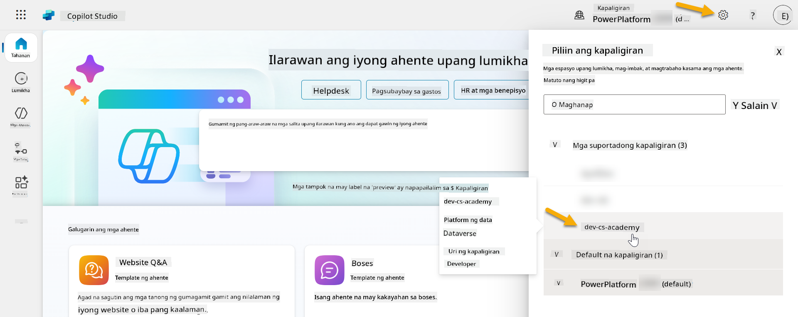

### 4.1 Lumikha ng Solution publisher

1. Gamit ang parehong Copilot Studio environment na ginamit sa nakaraang aralin, piliin ang **ellipsis icon (. . .)** sa kaliwang bahagi ng menu sa Copilot Studio. Piliin ang **Solutions** sa ilalim ng **Explore** header.

    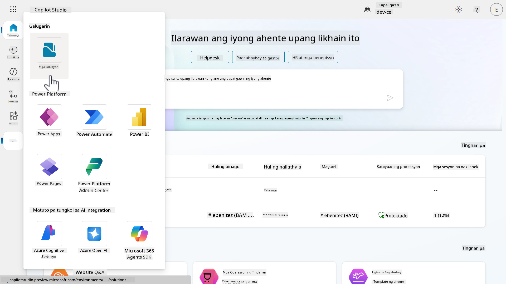

1. Ang **Solution Explorer** sa Copilot Studio ay maglo-load. Piliin ang **+ New solution**

    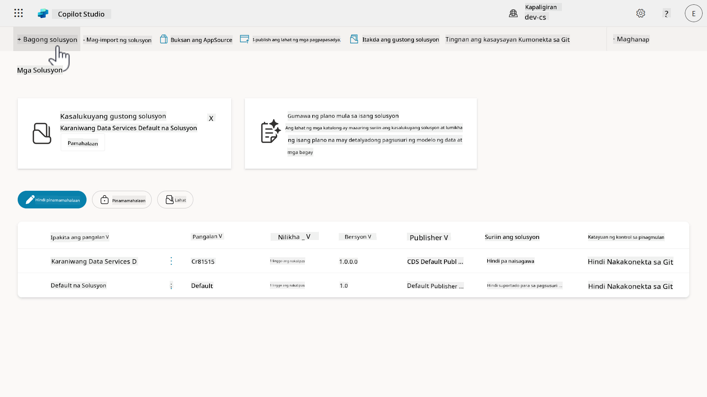

1. Lalabas ang **New solution** pane kung saan maaari nating tukuyin ang mga detalye ng ating solusyon. Una, kailangan nating lumikha ng bagong publisher. Piliin ang **+ New publisher**.

    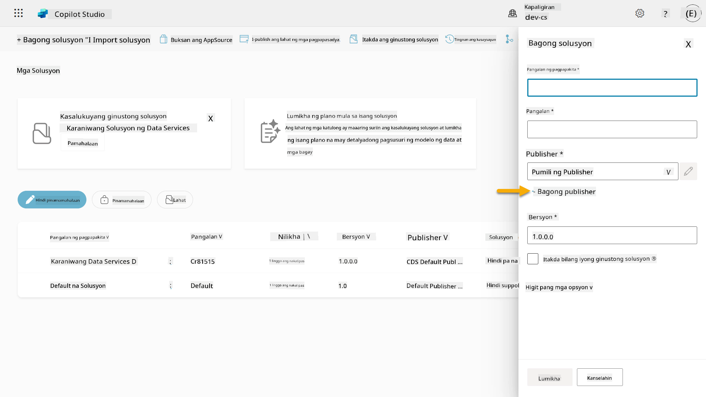  

1. Lalabas ang **Properties** tab ng **New publisher** pane na may mga kinakailangan at hindi kinakailangang field na kailangang punan sa **Properties** tab. Dito natin ma-outline ang mga detalye ng publisher na gagamitin bilang label o brand na tumutukoy kung sino ang gumawa o nagmamay-ari ng solusyon.

    | Property    | Deskripsyon | Kinakailangan |
    | ---------- | ---------- | :----------: |
    | Display name | Display name para sa publisher | Oo   |
    | Name  | Ang unique name at schema name para sa publisher  | Oo    |
    | Description   | Naglalarawan ng layunin ng solusyon    | Hindi     |
    | Prefix    | Publisher prefix na ilalapat sa mga bagong nilikhang component   | Oo      |
    | Choice value prefix   | Gumagawa ng numero batay sa publisher prefix. Ang numerong ito ay ginagamit kapag nagdagdag ng mga opsyon sa mga choice at nagbibigay ng indikasyon kung aling solusyon ang ginamit upang idagdag ang opsyon.   | Oo      |

    Kopyahin at i-paste ang sumusunod bilang **Display name**,

    ```text
    Contoso Solutions
    ```

    Kopyahin at i-paste ang sumusunod bilang **Name**,

    ```text
    ContosoSolutions
    ```

    Kopyahin at i-paste ang sumusunod bilang **Description**,

    ```text
    Copilot Studio Agent Academy
    ```

    Kopyahin at i-paste ang sumusunod para sa **Prefix**,

    ```text
    cts
    ```

    Sa default, ang **Choice value** prefix ay magpapakita ng integer value. I-update ang integer value na ito sa pinakamalapit na libo. Halimbawa, sa aking screenshot sa ibaba, ito ay unang `77074`. I-update ito mula `77074` patungong `77000`.

    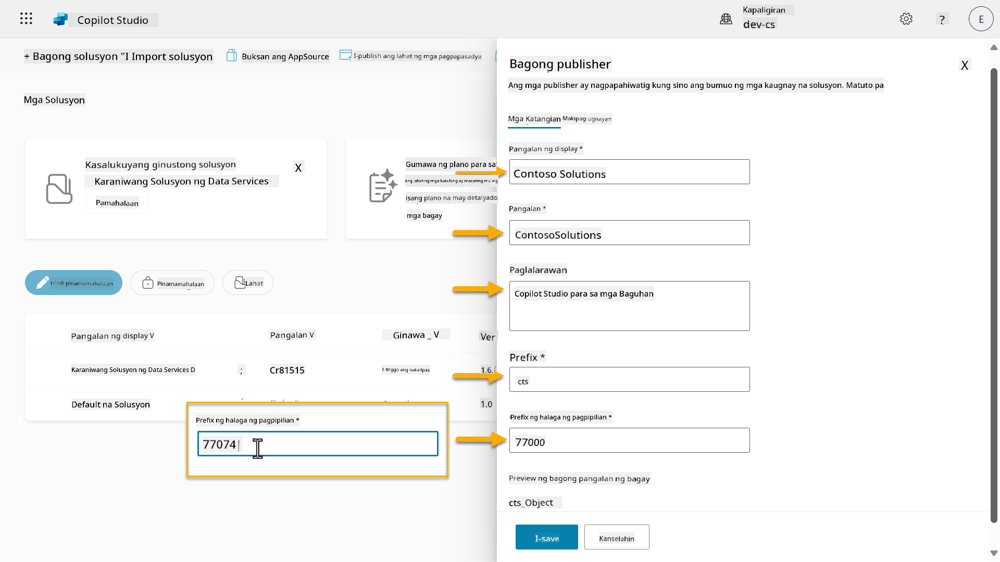  

1. Kung nais mong magbigay ng contact details para sa Solusyon, piliin ang **Contact** tab at punan ang mga sumusunod na column na ipinapakita.

    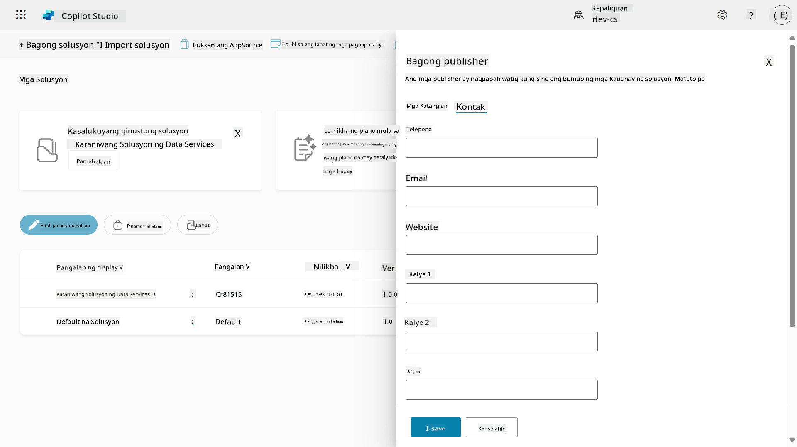

1. Piliin ang **Properties** tab at piliin ang **Save** upang lumikha ng Publisher.

    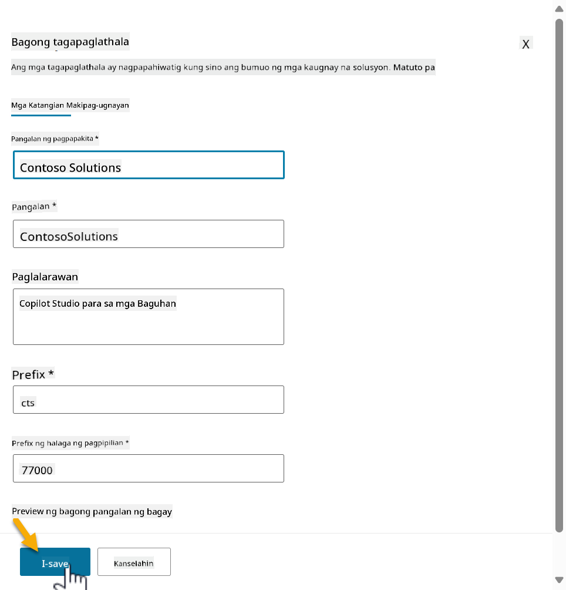
1. Ang pane ng Bagong Publisher ay magsasara at ibabalik ka sa **Bagong Solusyon** pane na may napiling bagong Publisher.

    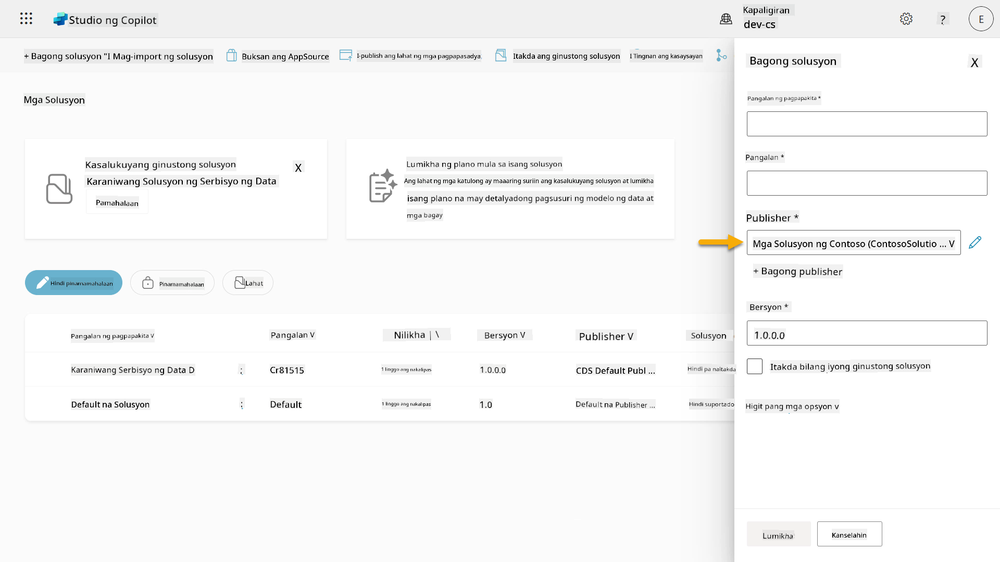  

High five, nakagawa ka na ng Solution Publisher! 🙌🏻 Susunod nating matututunan kung paano gumawa ng bagong custom na solusyon.

### 4.2 Gumawa ng Bagong Solusyon

1. Ngayon na nagawa na natin ang ating mga solusyon, maaari na nating kumpletuhin ang natitirang bahagi ng form sa **Bagong Solusyon** pane.

    Kopyahin at i-paste ang sumusunod bilang **Display name**,

    ```text
    Contoso Helpdesk Agent
    ```

    Kopyahin at i-paste ang sumusunod bilang **Name**,

    ```text
    ContosoHelpdeskAgent
    ```

    Dahil gumagawa tayo ng bagong solusyon, ang [**Version** number](https://learn.microsoft.com/power-apps/maker/data-platform/update-solutions#understanding-version-numbers-for-updates/?WT.mc_id=power-172615-ebenitez) ay default na `1.0.0.0`.

    I-tick ang checkbox na **Set as your preferred solution**.

    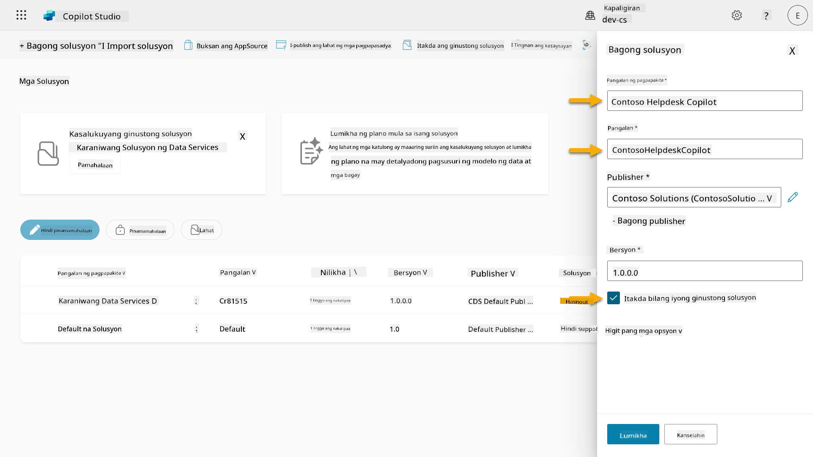  

1. I-expand ang **More options** upang makita ang karagdagang detalye na maaaring ibigay sa isang solusyon.

    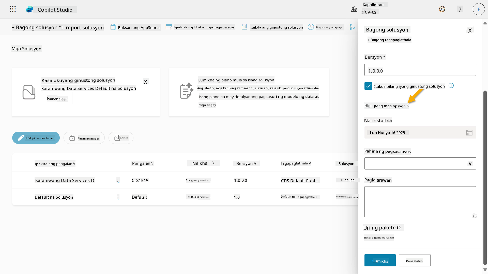

1. Makikita mo ang mga sumusunod,

    - **Installed on** - ang petsa kung kailan na-install ang Solusyon.

    - **Configuration page** - ang mga developer ay nagse-set up ng HTML web resource upang matulungan ang mga user na makipag-ugnayan sa kanilang app, agent, o tool kung saan ito lilitaw bilang isang web page sa seksyon ng Impormasyon na may mga tagubilin o mga button. Kadalasan itong ginagamit ng mga kumpanya o developer na gumagawa at nagbabahagi ng mga solusyon sa iba.

    - **Description** - naglalarawan sa solusyon o isang mataas na antas na paglalarawan ng configuration page.

    Iiwan natin itong blangko para sa lab na ito.

    Piliin ang **Create**.

    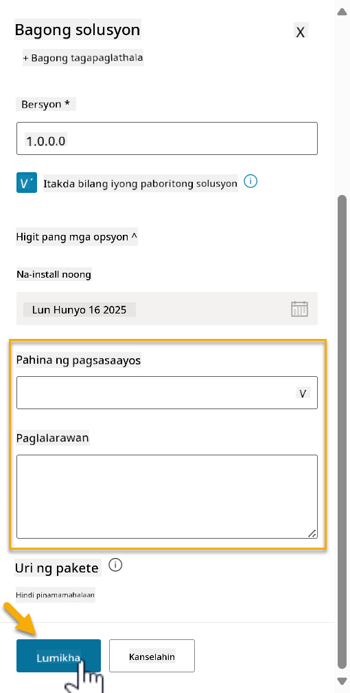

1. Ang solusyon para sa Contoso Helpdesk Agent ay nagawa na. Magkakaroon ng zero components hanggang sa gumawa tayo ng agent sa Copilot Studio.

    Piliin ang icon na **back arrow** upang bumalik sa Solution Explorer.

    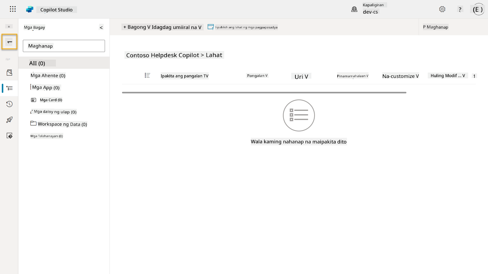

1. Pansinin kung paano ang Contoso Helpdesk Agent ay nagpapakita na bilang **Current preferred solution** dahil tinick natin ang checkbox na **Set as your preferred solution** kanina.

    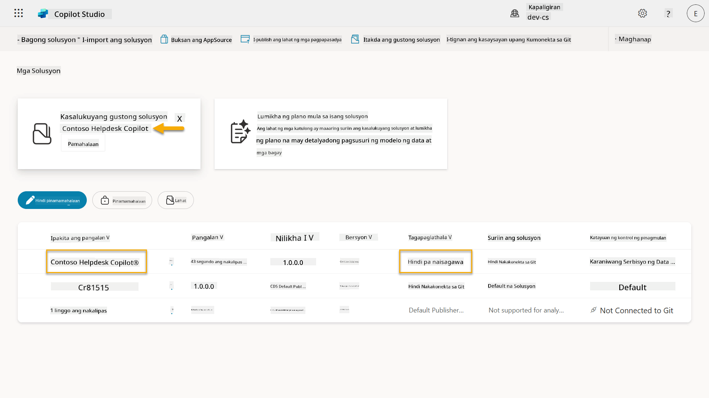

## ✅ Mission Complete

Binabati kita! 👏🏻 Nakagawa ka ng Publisher at ginamit ito sa iyong bagong solusyon upang makabuo ng iyong agent!

Magaling, Agent Maker. Ang maayos na digital footprint ay unang hakbang patungo sa operability sa mas malawak na saklaw. Ngayon ay mayroon ka nang mga tools at mindset para sa sustainable, enterprise-ready agent development.

Ito ang katapusan ng **Lab 04 - Creating a Solution**, piliin ang link sa ibaba upang lumipat sa susunod na aralin. Ang solusyon na ginawa mo sa lab na ito ay gagamitin sa lab ng susunod na aralin.

⏭️ [Lumipat sa aralin na **Get started quickly with pre-built agents**](../05-using-prebuilt-agents/README.md)

## 📚 Tactical Resources

🔗 [Gumawa ng solusyon](https://learn.microsoft.com/power-apps/maker/data-platform/create-solution/?WT.mc_id=power-172615-ebenitez)

🔗 [Gumawa at pamahalaan ang mga solusyon sa Copilot Studio](https://learn.microsoft.com/microsoft-copilot-studio/authoring-solutions-overview/?WT.mc_id=power-172615-ebenitez)

🔗 [Ibahagi ang mga agent sa ibang user](https://learn.microsoft.com/microsoft-copilot-studio/admin-share-bots/?WT.mc_id=power-172615-ebenitez)

🔗 [Buod ng mga resources na available sa predefined security roles](https://learn.microsoft.com/power-platform/admin/database-security#summary-of-resources-available-to-predefined-security-roles/?WT.mc_id=power-172615-ebenitez)

🔗 [I-upgrade o i-update ang solusyon](https://learn.microsoft.com/power-apps/maker/data-platform/update-solutions/?WT.mc_id=power-172615-ebenitez)

🔗 [Pangkalahatang-ideya ng pipelines sa Power Platform](https://learn.microsoft.com/power-platform/alm/pipelines/?WT.mc_id=power-172615-ebenitez)

🔗 [Pangkalahatang-ideya ng Git integration sa Power Platform](https://learn.microsoft.com/power-platform/alm/git-integration/overview/?WT.mc_id=power-172615-ebenitez)

<!-- markdownlint-disable-next-line MD033 -->


---

**Paunawa**:  
Ang dokumentong ito ay isinalin gamit ang AI translation service na [Co-op Translator](https://github.com/Azure/co-op-translator). Bagama't sinisikap naming maging tumpak, pakitandaan na ang mga awtomatikong pagsasalin ay maaaring maglaman ng mga pagkakamali o hindi pagkakatugma. Ang orihinal na dokumento sa kanyang katutubong wika ang dapat ituring na opisyal na pinagmulan. Para sa mahalagang impormasyon, inirerekomenda ang propesyonal na pagsasalin ng tao. Hindi kami mananagot sa anumang hindi pagkakaunawaan o maling interpretasyon na dulot ng paggamit ng pagsasaling ito.