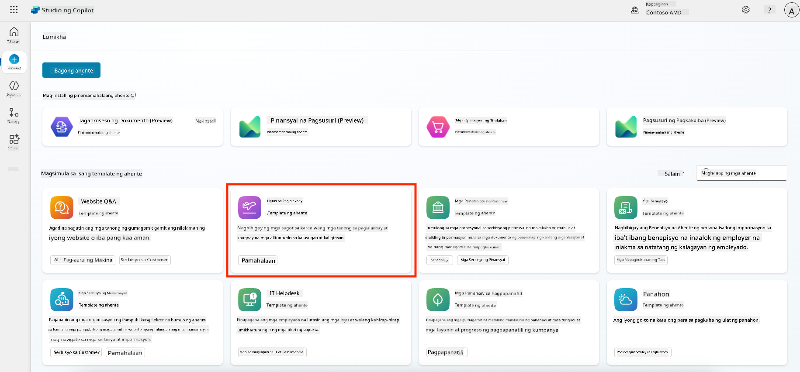

<!--
CO_OP_TRANSLATOR_METADATA:
{
  "original_hash": "8e2c64a7f9303e58329ec8bb468c80b4",
  "translation_date": "2025-10-22T19:44:02+00:00",
  "source_file": "docs/recruit/05-using-prebuilt-agents/README.md",
  "language_code": "tl"
}
-->
# 🧰 Misyon 05: Paggamit ng Pre-Built Agent  

## 🕵️‍♂️ CODENAME: `OPERASYON LIGTAS NA PAGLALAKBAY`

> **⏱️ Oras ng Operasyon:** `~30 minuto`

🎥 **Panoorin ang Walkthrough**

## 🎯 Misyon Brief

Maligayang pagdating sa iyong susunod na misyon sa Copilot Studio Agent Academy. Tuklasin mo ang mundo ng **pre-built agents**—mga matatalinong agent na may tiyak na layunin na ginawa ng Microsoft upang mapabilis ang deployment at mabawasan ang oras ng pag-abot sa layunin.

Sa halip na magsimula mula sa simula, ang mga pre-built agents (tinatawag ding **agent templates**) ay nagbibigay sa iyo ng panimulang hakbang sa pamamagitan ng mga handa nang gamitin na senaryo na maaari mong i-customize at i-deploy sa loob ng ilang minuto.

Sa misyon na ito, magde-deploy ka ng **Safe Travels** agent—isang agent na tumutulong sa mga user na maghanda para sa business travel, maunawaan ang mga polisiya ng kumpanya, at mapadali ang pagpaplano.

---

## 🧭 Mga Layunin

Ang mga layunin mo para sa misyon na ito ay:

1. Maunawaan kung ano ang pre-built agents at bakit ito mahalaga  
1. I-deploy ang **Safe Travels** agent template  
1. I-customize ang mga sagot at nilalaman ng agent  
1. Subukan at i-publish ang agent  

---

## 🧠 Ano ang Pre-Built Agents?

Ang pre-built agents ay mga AI agent na handa nang gamitin na ginawa ng Microsoft na:

- Tumutugon sa mga karaniwang pangangailangan ng negosyo (tulad ng travel, HR, IT support)
- May kasamang ganap na gumaganang mga topic, trigger phrases, mga instruksyon, at sample na kaalaman.
- Maaaring i-edit, palawakin, at i-ground gamit ang sarili mong data

Ang mga agent na ito ay perpekto para sa mabilisang pagsisimula o pag-aaral kung paano istruktura ang mga agent.

---

## 🧪 Lab 05: Mabilis na magsimula gamit ang pre-built agent

Ngayon ay matututo tayo kung paano pumili ng pre-built agent at i-customize ito.

- [5.1 I-launch ang Copilot Studio](../../../../../docs/recruit/05-using-prebuilt-agents)
- [5.2 Piliin ang Safe Travels Agent Template](../../../../../docs/recruit/05-using-prebuilt-agents)
- [5.3 I-customize ang Agent](../../../../../docs/recruit/05-using-prebuilt-agents)
- [5.4 Subukan at I-publish](../../../../../docs/recruit/05-using-prebuilt-agents)

Mananatili tayo sa halimbawa mula kanina, kung saan gagawa tayo ng solusyon sa dedikadong Copilot Studio environment upang bumuo ng IT helpdesk agent.

Simulan na natin!

### 5.1 I-launch ang Copilot Studio

1. Pumunta sa [https://copilotstudio.microsoft.com](https://copilotstudio.microsoft.com)

1. Mag-sign in gamit ang iyong Microsoft 365 work o school account

!!! warning
    Dapat kang nasa tenant kung saan naka-enable ang Copilot Studio. Kung hindi mo makita ang Copilot Studio, balikan ang [Misyon 00](../00-course-setup/README.md) upang kumpletuhin ang iyong setup.

### 5.2 Piliin ang Safe Travels Agent Template

1. Mula sa homepage ng Copilot Studio, i-click ang **+ Create**
    

1. Mag-scroll pababa sa seksyong **Start with an agent template**

1. Hanapin at piliin ang **Safe Travels**

    

1. Mapapansin na ang template ay may kasamang description, mga instruksyon, at kaalaman.

    

1. I-click ang **Create**

    

Ito ay gagawa ng bagong agent sa iyong environment base sa Safe Travels configuration.

### 5.3 I-customize ang Agent

Ngayon na nagawa na ang agent, i-tailor ito para sa iyong organisasyon:

1. Piliin ang **Enabled generative AI** upang i-on ang generative AI feature para magamit nito ang mga instruksyon sa template.

    

1. Ngayon ay bibigyan natin ang agent ng karagdagang source ng kaalaman upang makasagot ito sa mga tanong tungkol sa paglalakbay sa Europa. Upang gawin ito, mag-scroll pababa sa seksyong **knowledge** at piliin ang **Add knowledge**

    

1. Piliin ang **Public websites**

    

1. Sa text input, i-paste ang **<https://european-union.europa.eu/>** at piliin ang **Add**

    

1. Piliin ang **Add to agent**

    

### 5.4 Subukan at I-publish

1. I-click ang **Test** sa kanang itaas upang i-launch ang test window  

1. Subukan ang mga parirala tulad ng:

    - `“Kailangan ko ba ng visa para maglakbay mula US papuntang Amsterdam?”`
    - `“Gaano katagal bago makakuha ng US Passport?”`
    - `“Nasaan ang pinakamalapit na US embassy sa Valencia, Spain?”`

1. Kumpirmahin na ang agent ay nagbibigay ng tamang at kapaki-pakinabang na impormasyon at obserbahan ang Activity Map upang makita kung saan nito nakuha ang impormasyon.

    

1. Kapag handa na, i-click ang **Publish**

    

1. Piliin ang **Publish** muli sa dialog box
    

1. Opsyonal, idagdag ang agent sa Microsoft Teams gamit ang built-in na **Channels** feature.

!!! note "🧳 Bonus na Layunin"
    Subukang i-ground ang Safe Travels agent gamit ang SharePoint site o FAQ file upang mas maging relevant ito sa travel policies ng iyong kumpanya.

## ✅ Misyon Kumpleto

Matagumpay mong:

- Na-deploy ang Microsoft pre-built agent  
- Na-customize ang agent  
- Nasubukan at na-publish ang sarili mong bersyon ng **Safe Travels** agent template

⏭️ [Pumunta sa **Paglikha ng custom agent mula sa simula** na aralin](../06-create-agent-from-conversation/README.md).

<!-- markdownlint-disable-next-line MD033 -->

---

**Paunawa**:  
Ang dokumentong ito ay isinalin gamit ang AI translation service [Co-op Translator](https://github.com/Azure/co-op-translator). Bagamat sinisikap naming maging tumpak, mangyaring tandaan na ang mga awtomatikong pagsasalin ay maaaring maglaman ng mga pagkakamali o hindi eksaktong impormasyon. Ang orihinal na dokumento sa kanyang katutubong wika ang dapat ituring na opisyal na sanggunian. Para sa mahalagang impormasyon, inirerekomenda ang propesyonal na pagsasalin ng tao. Hindi kami mananagot sa anumang hindi pagkakaunawaan o maling interpretasyon na dulot ng paggamit ng pagsasaling ito.