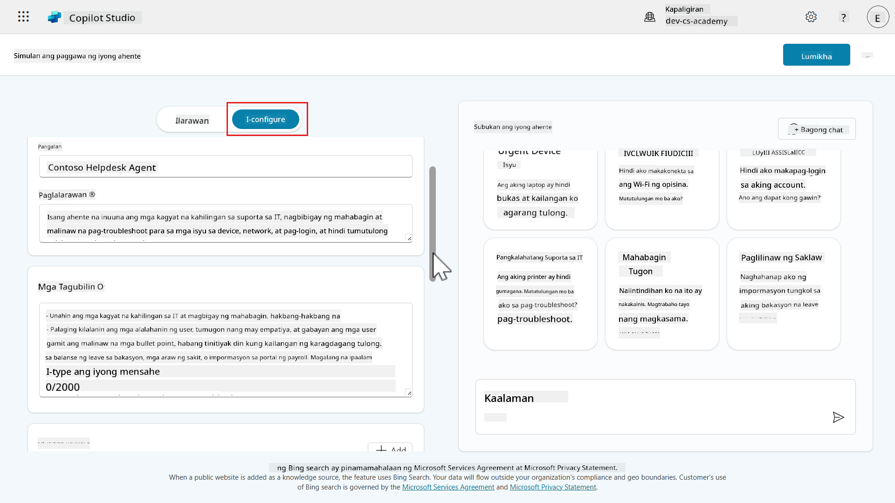
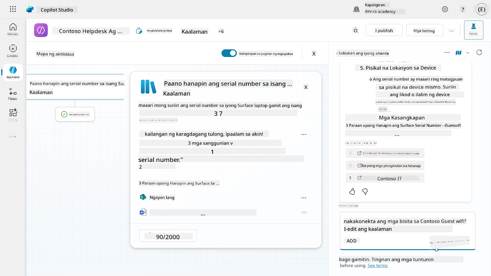

<!--
CO_OP_TRANSLATOR_METADATA:
{
  "original_hash": "180f9cc0b40527f61be092c9b0f72aba",
  "translation_date": "2025-10-22T19:36:50+00:00",
  "source_file": "docs/recruit/06-create-agent-from-conversation/README.md",
  "language_code": "tl"
}
-->
# 🚨 Misyon 06: Gumawa ng custom na ahente gamit ang natural na wika sa Copilot at i-ground ito gamit ang iyong data

## 🕵️‍♂️ CODENAME: `OPERATION AGENT FORGE`

> **⏱️ Oras ng Operasyon:** `~75 minuto`

🎥 **Panoorin ang Walkthrough**

[](https://www.youtube.com/watch?v=qZTtQVncGFg "Panoorin ang walkthrough sa YouTube")

## 🎯 Misyon Brief

Maligayang pagbabalik, Tagalikha ng Ahente. Sa misyon na ito, ikaw ang nasa kontrol ng pinakamakapangyarihang kakayahan sa Copilot Studio - ang paggawa ng custom na ahente mula sa simula gamit lamang ang natural na wika… at pagpapalakas nito gamit ang iyong sariling data.

Hindi lang ito basta chatbot. Gumagawa ka ng digital na katrabaho na may kaalaman - isang ahente na kayang mag-isip, tumugon, at mag-refer sa totoong impormasyon ng enterprise.

Ang iyong sandata? Natural na wika. Ang iyong misyon? Magdisenyo, mag-train, at mag-test ng ganap na customized na helpdesk agent na sumasagot sa mga tanong sa IT gamit ang SharePoint, mga na-upload na file, o mga URL ng kumpanya.

Simulan natin ang paggawa ng iyong ahente mula sa simula.

## 🔎 Mga Layunin

Sa misyon na ito, matututunan mo:

1. Pag-unawa kung ano ang mga custom na ahente at paano ito naiiba sa mga pre-built na template
1. Paggawa ng mga ahente gamit ang natural na wika at disenyo ng pag-uusap sa Copilot
1. Pag-ground ng mga ahente gamit ang mga mapagkukunan ng kaalaman ng enterprise kabilang ang SharePoint, mga dokumento, at mga website
1. Pag-aaral tungkol sa generative orchestration at kung paano dinamikong naghahanap at tumutugon ang mga ahente gamit ang maraming mapagkukunan ng data
1. Paggawa at pag-test ng ganap na functional na IT helpdesk agent na kayang sumagot sa mga tanong mula sa iyong sariling data

## 🤔 Ano ang _custom_ na ahente?

Ang custom na ahente ay isang chatbot o virtual assistant na ikaw ang gumagawa at nagdidisenyo sa Copilot Studio upang tumulong sa mga user sa mga partikular na gawain o tanong. Tinatawag itong custom dahil:

- **Ikaw ang nagtatakda ng layunin** - tumulong sa mga user na mag-request ng bakasyon, mag-check ng status ng order, magbigay ng tulong sa mga tanong na may kaugnayan sa IT.
- **Ikaw ang nagdidisenyo ng pag-uusap** - kung ano ang sasabihin ng ahente at kung paano ito dapat tumugon.
- **Ikaw ang nag-ground nito gamit ang iyong sariling data** - ikonekta ito sa data ng iyong enterprise sa pamamagitan ng built-in na mga suportadong mapagkukunan ng kaalaman.
- **Ikaw ang nagkokonekta nito sa iyong sariling mga sistema o aplikasyon** - pumili mula sa mga connector, flow, REST API, at model context protocol server.

!!! note
    Isipin mo ito: gumagawa ka ng sarili mong digital na katulong na kayang makipag-usap sa mga user at magkumpleto ng mga gawain para sa kanila tulad ng pagsagot sa mga tanong, pagkolekta ng impormasyon na kinakailangan ng isang proseso, o pagkonekta sa data ng iyong enterprise.

### 🤖 Ano ang kayang gawin ng isang custom na ahente?

Ang isang custom na ahente ay kayang:

- Magtanong sa mga user ng impormasyon tulad ng pangalan, petsa, o mga preference.
- I-save ang impormasyong iyon sa isang database o table.
- Maghanap ng data batay sa mga tanong na itinatanong at sumagot sa mga ito.
- Magtrabaho nang autonomously nang hindi direktang nakikipag-ugnayan ang mga user sa ahente.
- Mag-trigger ng mga aksyon alinman sa on-demand sa pamamagitan ng direktang pakikipag-ugnayan ng user o autonomously tulad ng pagpapadala ng email o paggawa ng mga record.

### 👩🏻‍💻 Bakit gumamit ng custom na ahente?

- Nakakatipid ng oras sa pamamagitan ng pag-automate ng mga paulit-ulit na gawain.
- Nagbibigay sa mga user ng friendly at guided na karanasan.
- Naaangkop sa iyong negosyo o pangangailangan ng proyekto.

### ✨ Halimbawa

Gumawa ka ng custom na ahente na tumutulong sa mga empleyado na mag-request ng bakasyon.

Tatanungin nito ang kanilang pangalan, mga petsa ng bakasyon, at pangalan ng kanilang manager, pagkatapos ay ise-save ang impormasyon sa itinalagang sistema na namamahala sa mga request ng bakasyon, tulad ng isang SharePoint list.

Ngayon, sa halip na mag-navigate sa SharePoint list at gumawa ng bagong item, makikipag-chat na lang ang mga empleyado sa ahente.

## 🗣️ Gumamit ng natural na wika upang gumawa ng mga ahente

Dati, natutunan mo kung paano mabilis na gumawa ng mga ahente sa Copilot Studio gamit ang mga prebuilt na template ng ahente sa [Lesson 05 - Magsimula nang mabilis gamit ang mga pre-built na ahente](../05-using-prebuilt-agents/README.md). Sa lesson na ito, mas malalim nating tatalakayin ang karanasan sa conversational creation gamit ang Copilot. Ginagawang madali ng Copilot Studio ang paggawa ng mga ahente sa pamamagitan ng pakikipag-chat sa Copilot, parang may kausap ka lang.

Sa Copilot Studio, hindi mo kailangang magsulat ng code upang gumawa ng ahente. Sa halip, ilarawan mo kung ano ang gusto mong gawin ng iyong ahente sa simpleng wika, at tutulungan ka ng Copilot na buuin ito hakbang-hakbang sa pamamagitan ng isang chat-like na karanasan.

## 🌱 Pero bago ako sa "paglalarawan ng gusto ko" - ano ang gagawin ko?

Ang paglalarawan gamit ang natural na wika upang gumawa ng custom na ahente ay maaaring bagong konsepto para sa iyo. Tuwing ginagamit mo ang Copilot sa mga produkto at serbisyo ng Microsoft, gumagamit ka ng natural na wika sa anyo ng isang _prompt_.

Ang prompt ay ang mensahe o instruksyon na ibinibigay mo sa isang AI agent upang sabihin kung ano ang gusto mong gawin nito. Isipin mo ito bilang pagbibigay ng direksyon sa isang katulong. Kapag mas malinaw ang iyong mga instruksyon, mas madali itong maunawaan ng iyong katulong at maisagawa.

### 🪄 Bakit mahalaga ang mga Prompt

- Ginagabayan nito ang pag-uugali ng ahente.
- Tinutulungan nito ang ahente na maunawaan kung anong uri ng pag-uusap ang dapat gawin.
- Ang magandang prompt ay ginagawang mas kapaki-pakinabang at tumpak ang ahente.

### 📝 Mga Tip sa Pagsulat ng Magandang Prompt

- Maging malinaw at tiyak - sabihin nang eksakto kung ano ang gusto mong gawin ng ahente.
- Mag-isip tulad ng user - ano ang sasabihin ng user? Ano ang dapat sagutin ng ahente?
- Magbigay ng mga halimbawa - kung maaari, magbigay ng sample na interaksyon.

### ✨ Halimbawa

Sabihin nating kailangan ng HR team ng ahente upang tumulong sa mga request ng bakasyon.

Ang prompt ay maaaring:

    “Gusto kong gumawa ng ahente na tumutulong sa mga user na magsumite ng request para sa bakasyon. Kapag sinabi ng user na gusto nilang mag-request ng time off, dapat tanungin ng ahente ang kanilang pangalan, ang petsa ng simula ng kanilang bakasyon, ang petsa ng pagtatapos ng kanilang bakasyon, at ang pangalan ng kanilang manager. Kapag naibigay na ng user ang impormasyong ito, dapat itong i-save ng ahente sa isang SharePoint list na tinatawag na ‘Vacation Requests’ at mag-post ng notification sa isang dedikadong Microsoft Teams channel.”

Bakit gumagana ang prompt na ito:

- **Malinaw na inilalahad ang layunin** - magsumite ng request para sa bakasyon
- **Inilalarawan ang interaksyon ng user** - ano ang sasabihin ng user at ano ang dapat itanong ng ahente
- **Inililista ang kinakailangang data** - pangalan, petsa ng simula, petsa ng pagtatapos, manager
- **Binabanggit kung saan pupunta ang data** - isang SharePoint list na tinatawag na Vacation Requests

## 🔮 OK, nagawa ko na ang aking ahente... paano ko ito i-ground gamit ang kaalaman?

Sa Copilot Studio, ang mga mapagkukunan ng kaalaman ay mga lugar kung saan makakahanap ng impormasyon ang iyong ahente upang makapagbigay ng mas mahusay na sagot. Kapag idinagdag mo ang mga mapagkukunang ito, maaaring kunin ng iyong ahente ang data ng iyong enterprise mula sa mga lugar tulad ng Power Platform, Dynamics 365, mga website, at iba pang mga sistema o serbisyo na ginagamit ng iyong kumpanya.

Ang mga mapagkukunang ito ay nagtutulungan kasama ang AI upang matulungan ang iyong ahente na tumugon nang mas tumpak sa mga tanong ng user, na nakamit sa pamamagitan ng tinatawag na **generative orchestration**.

### 🌿 Ano ang generative orchestration sa konteksto ng mga ahente?

Ang generative orchestration ay nangangahulugan na ang ahente ay gumagamit ng AI upang dinamikong magpasya kung paano sasagutin ang isang tanong sa pamamagitan ng pagsasama ng built-in na kakayahan sa wika nito sa impormasyon mula sa iyong mga idinagdag na mapagkukunan ng kaalaman.

Kapag nagtanong ang isang user, ang ahente:

- Nauunawaan ang tanong gamit ang AI.
- Maaaring magtanong sa mga user ng nawawalang impormasyon sa pamamagitan ng pagbuo ng mga tanong sa oras ng pangangailangan.
- Pinipili ang pinaka-nauugnay na mapagkukunan ng kaalaman.
- Hinahanap ang mga mapagkukunang iyon para sa mga sagot.
- Bumubuo ng natural at kapaki-pakinabang na tugon gamit ang impormasyong nahanap.

### 🏦 Bakit mahalaga ang mga mapagkukunan ng kaalaman?

1. **Mas matalinong mga sagot** - kapag nagdagdag ka ng mga mapagkukunan ng kaalaman, mas makakapagbigay ang iyong ahente ng mas mahusay at tumpak na sagot gamit ang totoong data mula sa iyong organisasyon.

1. **Mas kaunting manual na trabaho** - hindi mo kailangang isulat ang bawat posibleng sagot. Maaaring maghanap ang ahente sa iyong mga idinagdag na mapagkukunan at tumugon nang awtomatiko.

1. **Gumamit ng pinagkakatiwalaang impormasyon** - maaaring kunin ng iyong ahente ang mga sagot mula sa mga sistemang ginagamit mo na tulad ng Dataverse, SharePoint, o mga website ng kumpanya upang magkaroon ng maaasahang impormasyon mula sa pinagkukunan ng katotohanan.

1. **Gumagana kasama ang generative AI** - ang mga mapagkukunan ng kaalaman at AI ay tumutulong sa iyong ahente na maunawaan ang mga tanong at tumugon nang natural, kahit na ang tanong ay hindi pre-programmed o idinagdag bilang starter prompt.

1. **Flexible at expandable** - maaari kang magdagdag ng mga mapagkukunan ng kaalaman anumang oras sa panahon ng setup o sa susunod na panahon, mas nagiging matalino ang iyong ahente habang nagbabago ang iyong mga pangangailangan.

### ✨ Halimbawa

Isipin mong gumawa ka ng ahente upang tumulong sa mga empleyado sa mga tanong sa HR. Idinagdag mo ang dokumento ng patakaran sa HR ng iyong kumpanya at ang site ng SharePoint bilang mga mapagkukunan ng kaalaman.

Kapag tinanong ng isang empleyado, _“Ilang araw ng bakasyon ang pwede kong makuha?”_, gagamitin ng ahente ang generative orchestration upang hanapin ang mga mapagkukunang iyon at sumagot ng tamang patakaran nang hindi mo kailangang isulat ang sagot na iyon nang manu-mano. Nakakatipid ito ng oras sa pag-aaccount para sa bawat posibleng tanong na maaaring itanong ng isang empleyado tungkol sa kanilang mga benepisyo.

## Mga Uri ng Mapagkukunan ng Kaalaman na Maaaring Idagdag

1. **Mga Pampublikong Website**
    - **Ano ang ginagawa nito:** Hinahanap ang mga partikular na website (tulad ng site ng iyong kumpanya) gamit ang Bing.
    - **Bakit ito kapaki-pakinabang:** Magaling para sa pagkuha ng pampublikong impormasyon tulad ng FAQs o mga detalye ng produkto.

1. **Mga Dokumento**
    - **Ano ang ginagawa nito:** Gumagamit ng mga dokumento na direktang ina-upload mo sa iyong ahente, tulad ng mga PDF o Word file. Ang mga na-upload na file ay ligtas na naka-store sa Dataverse.
    - **Bakit ito kapaki-pakinabang:** Pinapayagan ang iyong ahente na sumagot sa mga tanong batay sa mga panloob na gabay, manual, o patakaran.

1. **SharePoint**
    - **Ano ang ginagawa nito:** Kumokonekta sa mga folder o file ng SharePoint gamit ang Microsoft Graph Search.
    - **Bakit ito kapaki-pakinabang:** Perpekto para sa pag-access sa mga dokumento ng team, mga patakaran sa HR, o mga file ng proyekto na naka-store sa SharePoint.

1. **Dataverse**
    - **Ano ang ginagawa nito:** Gumagamit ng structured na data mula sa iyong Dataverse environment tables at rows, at maaaring mag-apply ng mga synonym at glossary definition para sa mga table at column upang mapabuti ang mga sagot ng ahente.
    - **Bakit ito kapaki-pakinabang:** Kapag kailangan mong maghanap ng enterprise data na naka-store sa Dataverse tulad ng impormasyon ng customer.

1. **Real-time na kaalaman gamit ang mga connector**
    - **Ano ang ginagawa nito:** Pinapayagan ang iyong ahente na ma-access ang live na data mula sa ibang mga enterprise system tulad ng Salesforce, ServiceNow, Dynamics 365, AzureSQL, Databricks, at iba pa sa panahon ng pag-uusap, gamit ang sariling mga pahintulot ng user.
    - **Bakit ito kapaki-pakinabang:** Nagbibigay ng up-to-date, secure, at tumpak na mga sagot nang hindi nag-i-store o nagdu-duplicate ng data, ginagawa ang iyong ahente na mas matalino at mas ligtas.

1. **Azure AI Search**
    - **Ano ang ginagawa nito:** Pinapayagan ang iyong ahente na maghanap sa malalaking set ng dokumento na naka-store sa Azure gamit ang semantic at vector search upang maunawaan ang mga tanong ng user.
    - **Bakit ito kapaki-pakinabang:** Nagbibigay ng tumpak, maaasahang mga sagot mula sa mga kumplikadong mapagkukunan ng data, sumusuporta sa mga citation, at mahusay na gumagana para sa malalaking koleksyon ng dokumento na may secure na access control.

## 🔒 Paalala sa seguridad

### Authentication ng mapagkukunan ng kaalaman

Ang ilang mga mapagkukunan tulad ng SharePoint at Dataverse ay nangangailangan ng authentication ng user. Nangangahulugan ito na ang ahente ay magre-refer lamang ng data sa kanyang sagot na pinapayagan ng user na makita. Samantalang ang ibang mga mapagkukunan ay maaaring may karagdagang configuration na kinakailangan para sa ahente na makakonekta dito tulad ng Azure AI Search na nangangailangan ng Azure account at pagtukoy ng uri ng authentication.

## Pagpapabuti ng mga sagot ng iyong ahente sa Copilot Studio

Pagkatapos ma-provision ang iyong ahente mula sa conversational creation experience, gugustuhin mong i-test ang iyong ahente laban sa mga instruksyon na ginawa ng Copilot mula sa iyong prompt. Ang pagpapabuti ng mga sagot ng iyong ahente sa Copilot Studio ay tungkol sa pagtiyak na nauunawaan nito nang malinaw ang iyong mga layunin at may tamang impormasyon upang magamit.

1. **Pagpapino ng mga instruksyon ng ahente** - dito mo sasabihin sa iyong ahente kung paano ito dapat kumilos. Gumamit ng malinaw at tiyak na wika.

    Halimbawa:

    ✅ “Kumilos bilang isang friendly na customer support agent na nagpapaliwanag ng mga bagay nang simple.”

    ❌ “Maging kapaki-pakinabang.” (Masyadong malabo)

1. **Suriin ang tono at wika** - tiyakin na ang tono ng ahente ay tumutugma sa iyong audience.

    Maaari mo itong itakda bilang:

    - Friendly at casual.
    - Propesyonal at concise.
    - Supportive at patient.

1. **Magdagdag o mag-update ng mga mapagkukunan ng kaalaman** - kung kailangan ng iyong ahente na sumagot sa mga tanong tungkol sa isang paksa, tiyakin na may access ito sa tamang impormasyon.

    - Magdagdag ng mga link sa mga website, dokumento, o FAQs.
    - Panatilihing up-to-date ang content.
    - Gumamit ng malinaw at maayos na impormasyon.

1. **Gumamit ng Topics at Triggers** - Kung kailangan ng iyong ahente na mag-handle ng partikular na mga gawain o pag-uusap, maaari kang gumawa ng mga topic na may trigger phrases. Nakakatulong ito upang mas gabayan ang pag-uusap. Matututunan natin ito sa susunod na lesson.

1. **Mag-test gamit ang totoong mga tanong** - subukang magtanong sa iyong ahente ng mga uri ng tanong na maaaring itanong ng mga user.

    Kung hindi maganda ang mga sagot:

    - Ayusin ang system instructions.
    - Magdagdag ng mas maraming halimbawa o kaalaman.
    - I-rephrase ang iyong mga tanong upang makita kung paano ito tumutugon.

1. **Review at iterate** - ang pagpapabuti ng ahente ay isang tuloy-tuloy na proseso!

    Pagkatapos ma-publish:

    - Mangolekta ng feedback mula sa mga user.
    - Magbantay para sa mga karaniwang tanong o kalituhan.
    - Patuloy na i-refine ang setup ng ahente
Gagamitin natin ang parehong use case mula sa [Lesson 03 - Gumawa ng deklaratibong ahente para sa Microsoft 365 Copilot](../03-create-a-declarative-agent-for-M365Copilot/README.md#use-case-scenario)

**Bilang isang** empleyado

**Gusto kong** makakuha ng mabilis at tamang tulong mula sa IT helpdesk agent para sa mga isyu tulad ng problema sa device, pag-troubleshoot ng network, pag-setup ng printer

**Upang** manatiling produktibo at malutas ang mga teknikal na isyu nang walang pagkaantala

Simulan na natin!

### ✨ Mga Kinakailangan

- **SharePoint site**

Gagamitin natin ang **Contoso IT** SharePoint site mula sa [Lesson 00 - Course Setup - Step 3: Gumawa ng bagong SharePoint site](../00-course-setup/README.md#step-4-create-new-sharepoint-site).

Kung hindi mo pa na-set up ang **Contoso IT** SharePoint site, bumalik sa [Lesson 00 - Course Setup - Step 3: Gumawa ng bagong SharePoint site](../00-course-setup/README.md#step-4-create-new-sharepoint-site).

- **Solusyon**

Gagamitin natin ang **Contoso Helpdesk Agent** solution mula sa [Lesson 04 - Paglikha ng Solusyon para sa iyong ahente](../04-creating-a-solution/README.md#41-create-a-solution-publisher).

Kung hindi mo pa na-set up ang **Contoso Agent** solution, bumalik sa [Lesson 04 - Paglikha ng Solusyon para sa iyong ahente](../04-creating-a-solution/README.md#41-create-a-solution-publisher).

### 6.1 Gumamit ng natural na wika upang gumawa ng ahente gamit ang Copilot

!!! warning "Maaaring magkaiba ang mga tanong ng Copilot sa bawat sesyon"

    Ang karanasan sa paglikha ng pag-uusap gamit ang Copilot ay maaaring mag-iba sa bawat pagkakataon kung saan ang mga ibinigay na tanong para sa gabay ay maaaring bahagyang magkaiba kaysa sa dati.

1. Pumunta sa Home page ng Copilot Studio at sa field, ilagay ang sumusunod na prompt na naglalarawan sa IT help desk agent. Ang prompt ay naglalaman ng layunin ng ahente, ang konteksto, ang inaasahang mga gawain, at ang format ng tugon ng ahente.

    ```text
    You are an IT help desk agent. Your goal is to assist users with their IT issues. You can access information from our company's knowledge base at https://support.microsoft.com/en-us. Your responses should be polite and helpful. If a user reports a slow computer, ask about the age of the device, current software versions, and if they've recently installed any new programs. If a user is experiencing trouble logging into their email, guide them through password reset procedures. You should be concise and informative, using step-by-step instructions with bullet points when appropriate.
    ```

      

1. Ang karanasan sa paglikha ng pag-uusap gamit ang Copilot ay susunod na maglo-load. Makikita mo na ang Copilot ay nasa proseso ng pagtugon sa iyo.

      

1. Kinukumpirma ng Copilot na ang ahente ay na-set up gamit ang mga ibinigay na tagubilin, at nagtatanong para sa kumpirmasyon sa pangalan ng ahente. Sasabihin natin sa Copilot na pangalanan ang ating ahente bilang,

       ```text
       Contoso Helpdesk Agent
       ```

      

1. Ginagawa ng Copilot ang kahilingan at makikita natin na ang pangalan ng ahente ay na-update sa agent pane. Susunod na nagtatanong ang Copilot upang pinuhin ang mga tagubilin. Nagtatanong ito kung paano tayo dapat tumugon sa mga partikular na isyu at hihilingin natin na kilalanin nito ang isyu, magbigay ng mga halimbawa ng mga paksa na sasagutin, at i-format ang tugon bilang mga bullet points.

    Kopyahin at i-paste ang sumusunod, at isumite ang kahilingan sa Copilot.

       ```text
       Bigyang-priyoridad ang mga agarang kahilingan. Mga halimbawa ng mga isyu sa IT o mga senaryo na matutulungan: mga problema sa device, koneksyon sa network, mga isyu sa pag-login. Kapag nag-troubleshoot, kilalanin muna ang kanilang isyu at tumugon nang may empatiya, pagkatapos ay magbigay ng sunud-sunod na gabay gamit ang mga bullet points at tanungin kung kailangan nila ng karagdagang tulong.
       ```

      

1. Ang mga tagubilin ng ahente ay maa-update pagkatapos matanggap ng Copilot ang kahilingan. Pansinin kung paano sa kanang bahagi ng pane, lumitaw na ang mga starter prompts. Ang mga ito ay nabuo batay sa ating mga tagubilin.

    Susunod, nagtatanong ang Copilot para sa mga pampublikong website upang maging basehan ng kaalaman ng ahente.

    Kopyahin at i-paste ang sumusunod, at isumite ang kahilingan sa Copilot.

      ```text
      https://support.microsoft.com
      ```

      

1. Ang pampublikong website ay idadagdag bilang isang source ng kaalaman. Nagtatanong ang Copilot kung may karagdagang mga source ng kaalaman na dapat idagdag. Hindi natin kailangang magdagdag ng karagdagang pampublikong website.

    Kopyahin at i-paste ang sumusunod, at isumite ang kahilingan sa Copilot.

      ```text
      Proceed with setup
      ```

      

1. Kinukumpirma ng Copilot ang setup ng ating Contoso Helpdesk Agent ngunit magdadagdag tayo ng isang pagbabago, hihilingin natin na ang ating ahente ay hindi sumagot sa mga tanong na may kaugnayan sa HR. Ito ay magpapabatid sa ating ahente na hindi ito dapat sumagot sa mga tanong na may kaugnayan sa HR na tinatanong ng mga user.

    Kopyahin at i-paste ang sumusunod, at isumite ang kahilingan sa Copilot.

       ```text
       Huwag magbigay ng tulong sa mga tanong na may kaugnayan sa HR, mga halimbawa ay: Ano ang balanse ng aking bakasyon? Ilang araw ng sick leave ang mayroon ako? Ano ang URL ng ating payroll portal?
       ```

      

1. Ang mga tagubilin ay maa-update upang hindi magbigay ng tulong sa mga tanong na may kaugnayan sa HR. Hindi na natin kailangang gumawa ng karagdagang mga update, handa na ang ating ahente na likhain.

      

1. Bago natin likhain ang ating ahente, gawin natin ang ilang bagay.

    Una, piliin ang **Configure** tab upang makita ang mga detalye ng ahente na tinukoy mula sa ating pag-uusap sa Copilot. Dito mo makikita ang Pangalan, Deskripsyon, Mga Tagubilin, Kaalaman, at Mga Iminungkahing/Starter prompts.

      

1. Pangalawa, subukan natin ang ating ahente. Kopyahin at i-paste ang sumusunod, at isumite ang tanong sa ating ahente.

       ```text
       Paano ko masusuri ang warranty status ng aking Surface?
       ```

      

1. Ang tugon sa tanong ay magpapakita kung saan ang mga sagot ay nasa format ng isang sunud-sunod na gabay gamit ang mga bullet points. Mahusay, gumagana ang ating ahente! 🙌🏻

      

1. Panghuli, i-double check natin ang solusyon kung saan ang ating ahente ay malilikha, ito ang solusyon na ginawa at pinili bilang ang preferred solution sa [Lesson 04 - Gumawa ng bagong solusyon](../04-creating-a-solution/README.md#42-create-a-new-solution).

    Piliin ang **ellipsis icon (...)** at piliin ang **Update Advanced Settings**.

      

1. Lalabas ang **Advanced Settings** modal at makikita natin na ang ating solusyon na ginawa mula sa mas maaga ay napili bilang default. Ito ay dahil sa pagpili ng ating solusyon bilang ang preferred solution sa [Lesson 04 - Gumawa ng bagong solusyon](../04-creating-a-solution/README.md#42-create-a-new-solution).

    Piliin ang **Cancel.**

      

1. Ngayon, likhain na natin ang ating custom na ahente! Piliin ang **Create**.

      

1. Ang Copilot Studio ay magsisimulang mag-provision ng ating ahente.

      

1. Kapag ang ating ahente ay na-provision na, makikita natin ang mga detalye ng ahente na sumasalamin sa ating mga kahilingan sa panahon ng karanasan sa paglikha ng pag-uusap gamit ang Copilot. Mag-scroll pababa upang suriin ang ahente kung saan makikita mo ang pangalan, deskripsyon, mga tagubilin, ang mga source ng kaalaman, at ang mga iminungkahing prompts. Ang orchestration mode ay naka-enable bilang default at ang default na modelo ay ginagamit para sa response model ng ahente.

      

      

      

1. Subukan na natin ang ating bagong likhang ahente. Sa **Test** pane sa kanang bahagi, piliin ang **Activity Map** icon.

      

1. Ilagay ang sumusunod na tanong sa **Test** pane.

       ```text
       Paano ko mahahanap ang product key ng aking Windows 11?
       ```

      

1. Ang Activity map ay maglo-load na nagpapakita sa atin nang real-time kung anong path ang pinoproseso ng ahente. Sa senaryong ito, naintindihan ng ating ahente ang tanong at hinahanap ang mga source ng kaalaman. Sa kasalukuyan, mayroon tayong isang source na pampublikong website na idinagdag natin kanina gamit ang Copilot, na siyang nire-review ng ahente.

      

1. Ang ating ahente ay tumutugon sa mga sagot na naka-outline bilang mga bullet points, tulad ng tinukoy sa mga tagubilin. Ang tugon ay may mga reference sa mga web page kung saan nabuo ang sagot ng ahente. Pinapayagan nito ang mga user na i-verify ang source ng sagot.

      

1. Maaari mo ring suriin ang tugon at ang mga source nito sa pamamagitan ng pag-scroll pababa sa **Knowledge modal** sa Activity map.

      

Binabati kita! Nilikha mo na ang iyong unang custom na ahente gamit ang Copilot sa Copilot Studio 🙌🏻

### 6.2 Magdagdag ng internal na source ng kaalaman gamit ang SharePoint site

Noong nakaraan gamit ang Copilot, nagdagdag tayo ng pampublikong website bilang external na source ng kaalaman para sa ating ahente sa panahon ng karanasan sa paglikha ng pag-uusap. Ngayon, magdadagdag tayo ng internal na source ng kaalaman gamit ang SharePoint site. Ito ang SharePoint site na ginawa mo sa [Lesson 00 - Course Setup](../00-course-setup/README.md#step-4-create-new-sharepoint-site).

1. Piliin ang **+ Add knowledge**.

      

1. Piliin ang **SharePoint**.

      

1. I-paste ang **address ng SharePoint site** na ginawa sa [Lesson 00 - Course Setup](../00-course-setup/README.md#step-4-create-new-sharepoint-site) sa SharePoint URL field at piliin ang **Add**.

      

1. I-update ang **pangalan** ng SharePoint site sa `Contoso IT` at piliin ang **Add**.

      

1. Ang SharePoint site ay idinagdag na bilang isang source ng kaalaman na may status na _Ready_. Ang Status column ay magpapakita kung ang source ng kaalaman ay na-load/nakonekta nang matagumpay, o kung may isyu.

      

### 6.3 Magdagdag ng internal na source ng kaalaman sa pamamagitan ng pag-upload ng dokumento

Magdadagdag tayo ng isa pang internal na source ng kaalaman sa pamamagitan ng pag-upload ng dokumento nang direkta sa ating ahente.

1. Piliin ang **Add knowledge**.

      

1. Piliin ang **Upload file** o **Select to browse**.

      

1. I-download ang [sample file](../../../../../docs/recruit/06-create-agent-from-conversation/assets/Contoso_Guest_WiFi_Connection_Guide.docx "download") at piliin ito sa iyong File Explorer. Piliin ang **Open**.

      

1. Ang file ay napili na para sa upload. Piliin ang **Add to agent** susunod.

      

1. Ang dokumento ay nasa proseso ng pagdaragdag sa ahente. Maghintay hanggang ang upload ay makumpleto, huwag isara ang browser window. Ang status ng dokumento ay unang magpapakita bilang _In progress_, maghintay hanggang ang status ay ma-update sa **Ready** bago subukan ang iyong ahente.

      

Subukan na natin ang ating ahente!

### 6.4 Subukan ang ahente

Susubukan natin ang tatlong source ng kaalaman sa pamamagitan ng pagtatanong sa ating Contoso Helpdesk Agent.

1. Piliin ang **refresh** icon sa test pane, kasunod ng pagpili sa **activity map** icon.

      

1. Ilagay ang sumusunod na tanong upang subukan ang ating pampublikong website (external) na source ng kaalaman.

      ```text
      How can I find the serial number on my Surface device?
      ```

      

1. Susunod mong makikita ang ahente na nire-review ang mga source ng kaalaman at nagbibigay ng tugon gamit ang website knowledge source.


1. Isang sagot ang ibabalik at mapapansin mo kung paano may mga reference sa web page na pinanggalingan ng sagot. Kung mag-scroll ka pababa sa knowledge modal sa activity map, makikita mo ang iba pang knowledge sources na hinanap ng agent, tulad ng SharePoint site at ang na-upload na file.

    Gayunpaman, hindi ito ginamit dahil sa seksyon ng **Referenced sources**, ang website knowledge source lamang ang na-refer. Ang sagot ay nakabase sa website knowledge source. Kung pipiliin mo ang mga reference, dadalhin ka nito sa web page.


1. Subukan naman natin ang parehong SharePoint site knowledge source at document knowledge source sa isang mensahe. Ipasok ang sumusunod na tanong.

      ```text
      How can I access our company Contoso VPN? How do guests connect to the Contoso Guest wifi?
      ```



1. Muli, makikita mo ang agent na nire-review ang tatlong knowledge sources upang makabuo ng sagot sa mga tanong sa ating iisang mensahe. Ang agent ay sumasagot sa parehong tanong sa isang mensahe, at hiwalay na nire-refer ang SharePoint page at dokumento kung saan nagmula ang sagot.

    Sa knowledge modal sa activity map, makikita mo ang SharePoint site at dokumento na ginamit bilang mga reference sources. Mayroon kang buong visibility kung anong knowledge sources ang ginamit upang sagutin ang parehong tanong.


1. Palaging magandang ideya na i-verify kung tama ang generated response. Piliin ang SharePoint site reference at maglo-load ang FAQs SharePoint page kung saan maaari kang mag-scroll pababa upang i-review ang VPN instructions.


1. Susunod, piliin ang dokumento reference at lilitaw ang isang modal na may teksto mula sa dokumento na sumasalamin sa sagot.


Ang agent ay maaaring sumagot ng maraming tanong sa isang mensahe, at maghanap sa knowledge sources + mag-refer sa knowledge sources sa kanyang sagot. Siguraduhing palaging i-verify kung tama ang sagot sa pamamagitan ng pag-review sa mga reference.

## ✅ Misyon Kumpleto

Binabati kita! 👏🏻 Natutunan mo kung paano gumamit ng natural na wika upang lumikha ng sarili mong custom agent na maaaring makipag-usap gamit ang iyong data mula sa tatlong magkaibang knowledge sources 🙌🏻

Ito ang katapusan ng **Lab 06 - Gumawa ng agent gamit ang Copilot**, piliin ang link sa ibaba upang lumipat sa susunod na aralin. Ang custom agent na ginawa mo sa lab na ito ay gagamitin sa susunod na lab ng aralin.

⏭️ [Lumipat sa aralin na **Magdagdag ng bagong Topic na may trigger**](../07-add-new-topic-with-trigger/README.md)

Maligayang pagdating sa elite. Alam mo na ngayon kung paano lumikha ng digital agents na nagsasalita ng iyong wika, nagre-refer sa iyong data, at sumusuporta sa iyong team. Magpatuloy—kakaumpisa pa lang ng iyong misyon.

## 📚 Mga Taktikal na Resources

🔗 [Quickstart: Gumawa at mag-deploy ng agent](https://learn.microsoft.com/microsoft-copilot-studio/fundamentals-get-started?context=%2Fmicrosoft-365-copilot%2Fextensibility%2Fcontext/?WT.mc_id=power-172617-ebenitez)

🔗 [Gumawa at mag-delete ng agents](https://learn.microsoft.com/microsoft-copilot-studio/authoring-first-bot?WT.mc_id=power-172617-ebenitez)

🔗 [Mga pangunahing konsepto - Paglikha ng agents](https://learn.microsoft.com/microsoft-copilot-studio/authoring-fundamentals/?WT.mc_id=power-172617-ebenitez)

📺 [Gumawa ng custom agent gamit ang natural na wika](https://aka.ms/ai-in-action/copilot-studio/ep1)

📺 [Magdagdag ng kaalaman sa iyong mga agents](https://aka.ms/ai-in-action/copilot-studio/ep2)


---

**Paunawa**:  
Ang dokumentong ito ay isinalin gamit ang AI translation service na [Co-op Translator](https://github.com/Azure/co-op-translator). Bagama't sinisikap naming maging tumpak, mangyaring tandaan na ang mga awtomatikong pagsasalin ay maaaring maglaman ng mga pagkakamali o hindi pagkakatugma. Ang orihinal na dokumento sa kanyang katutubong wika ang dapat ituring na mapagkakatiwalaang pinagmulan. Para sa mahalagang impormasyon, inirerekomenda ang propesyonal na pagsasalin ng tao. Hindi kami mananagot sa anumang hindi pagkakaunawaan o maling interpretasyon na dulot ng paggamit ng pagsasaling ito.