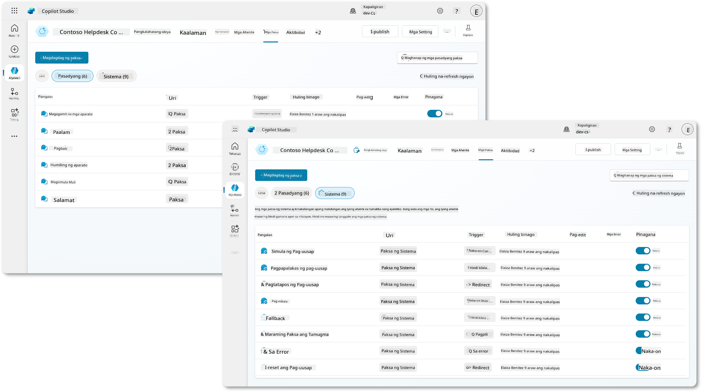
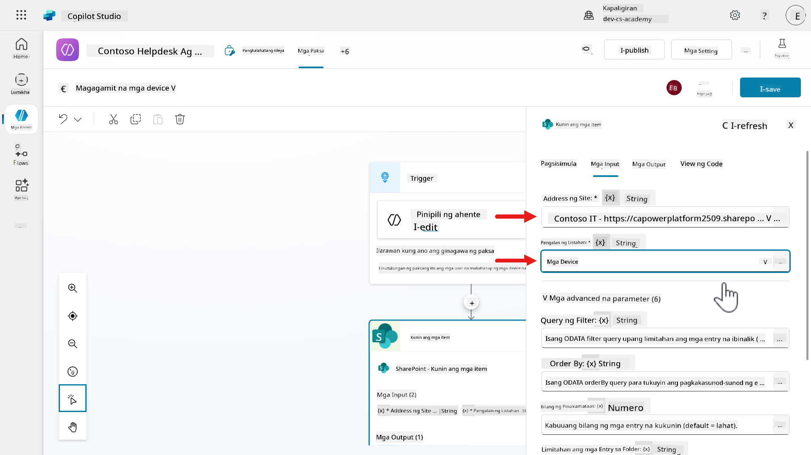
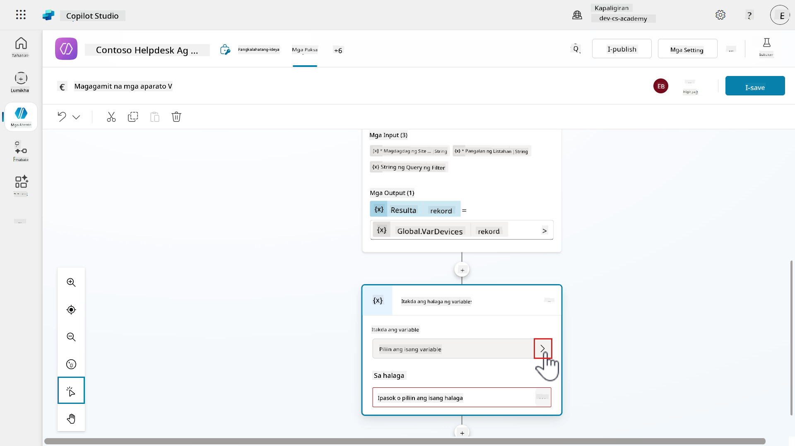

<!--
CO_OP_TRANSLATOR_METADATA:
{
  "original_hash": "c04b3587170139bc23e3b5cfc24c89ac",
  "translation_date": "2025-10-22T19:55:18+00:00",
  "source_file": "docs/recruit/07-add-new-topic-with-trigger/README.md",
  "language_code": "tl"
}
-->
# 🚨 Misyon 07: Magdagdag ng bagong paksa gamit ang trigger at nodes

## 🕵️‍♂️ CODENAME: `OPERASYON MANATILI SA PAKSA`

> **⏱️ Oras ng Operasyon:** `~60 minuto`

🎥 **Panoorin ang Walkthrough**

[](https://www.youtube.com/watch?v=7iPAZaA8nJs "Panoorin ang walkthrough sa YouTube")

## 🎯 Misyon Brief

Nakagawa ka na ng isang agent. Nakikinig, natututo, at sumasagot sa mga tanong - pero oras na para maging mas taktikal. Sa misyon na ito, mas malalim mong tuturuan ang iyong agent kung paano tumugon sa mga tiyak na tanong nang may eksaktong sagot.

Sa pamamagitan ng Topics at Triggers, magagawa ng iyong agent na:

- Kilalanin ang intensyon

- Mag-route ng mga usapan gamit ang lohika

- Magtipon at mag-imbak ng mga variable

- Mag-trigger ng mga flow at kumilos

Hindi ka lang gumagawa ng dialogue, binubuo mo ang decision-making cortex nito. Maligayang pagdating sa Neural Nexus.

## 🔎 Mga Layunin

Sa misyon na ito, matututunan mo:

1. Ang pag-unawa kung ano ang mga topics at ang papel nito sa paglikha ng structured na usapan para sa iyong agent
1. Ang pag-aaral ng anatomy ng topics kabilang ang trigger phrases at conversation nodes
1. Ang pag-explore ng iba't ibang uri ng conversation nodes at kung paano gamitin ang Power Fx para sa dynamic na lohika
1. Ang paggawa ng custom topics mula sa simula para sa pag-handle ng tiyak na mga kahilingan at gawain ng user
1. Ang pagbuo ng functional topic na konektado sa SharePoint data gamit ang connectors at tools

## 🤔 Ano ang Topic?

Ang topic ay isang structured na usapan na tumutulong sa iyong agent na tumugon sa tiyak na tanong o gawain ng user. Isipin ang topic bilang isang mini-conversation o gawain na kayang i-handle ng iyong agent. Ang bawat topic ay idinisenyo upang tumugon sa tiyak na tanong o kahilingan ng user.

### 🌌 Layunin ng isang topic

May tatlong karaniwang layunin para sa mga topics batay sa pangangailangan ng user:

**Impormasyon** - sumasagot sa mga tanong tulad ng:

- `Ano ang …?`
- `Kailan ang …?`
- `Bakit …?`
- `Pwede mo bang sabihin sa akin …?`

**Pagkumpleto ng Gawain** - tumutulong sa user na _gumawa_ ng isang bagay:

- `"Gusto kong …"`
- `"Paano ko …?"`
- `"Kailangan ko …?"`

**Pag-aayos ng Problema** - naglutas ng mga problema:

- `May hindi gumagana …`
- `Nakakaranas ako ng error message …`
- `May nakikita akong hindi inaasahan …?`

Pwede ka ring gumawa ng topics para sa mga hindi malinaw na tanong tulad ng `Kailangan ko ng tulong`, na nagtatanong sa user ng mas detalyado bago magpatuloy.

## 🐦 Bakit kapaki-pakinabang ang mga topics?

Ang mga topics ay tumutulong sa iyo na:

- Ayusin ang kaalaman ng iyong agent.

- Gawing natural ang mga usapan.

- Epektibong lutasin ang mga problema ng user.

## 🪺 Mga Uri ng Topics

1. **System topics** - built-in ito at nagha-handle ng mga karaniwang event tulad ng:
    - Pagsisimula ng usapan
    - Pagtatapos ng usapan
    - Pag-handle ng mga error
    - Paghingi sa user na mag-sign in
    - Pag-escalate sa human agent

1. **Custom topics** - ikaw ang gumagawa nito para sa pag-handle ng tiyak na mga gawain o tanong tulad ng:
    - Kahilingan sa pag-leave ng empleyado
    - Pag-request ng bagong o kapalit na device



## 🧬 Anatomy ng isang Topic

Ang bawat topic ay karaniwang naglalaman ng mga sumusunod.

### 🗣️ Trigger phrases

Ito ang mga salita o pangungusap na maaaring sabihin ng user upang simulan ang topic.

**Mga Halimbawa:**

Para sa leave request topic, ang mga trigger phrases ay maaaring:

- `Gusto kong magbakasyon`
- `Mag-request ng bakasyon`
- `Mag-apply para sa leave`
- `Paano ako magre-request ng leave?`

Para sa request device topic, ang mga trigger phrases ay maaaring:

- `Kailangan ko ng bagong device`
- `Pwede ba akong mag-request ng device?`
- `Pwede mo ba akong tulungan sa pag-request ng device`

### 💬 Conversation nodes

Ang topic ay binubuo ng mga nodes na mga hakbang na sinusunod ng agent kapag na-trigger ang topic. Ikonekta ang mga hakbang na ito upang bumuo ng conversation flow na susundin ng iyong agent kapag nakikipag-usap sa mga user.

Isipin ang mga ito bilang mga tagubilin o aksyon tulad ng:

- Pagtatanong sa user
- Pagpapadala ng mga mensahe
- Pagtawag sa external service tulad ng leave management system
- Pag-set o pag-check ng mga variable
- Paggamit ng mga kondisyon upang mag-branch ang usapan
- Pag-direkta sa ibang topic


Ang mga sumusunod ay ang pangunahing uri ng nodes na maaari mong idagdag sa isang agent:

#### Magpadala ng mensahe

- **Layunin** - nagpapadala ng mensahe sa user.
- **Halimbawa** - `Salamat sa iyong request! Tutulungan kita diyan.`

Ang node na ito ay nagpapahintulot sa iyong agent na magpadala ng mga mensahe sa mga user, na maaaring simpleng text o rich content tulad ng mga imahe, video, cards, quick replies, at adaptive cards.

Pwede mong i-personalize ang mga mensahe gamit ang mga variable, magdagdag ng maraming variation ng mensahe para sa variety, at kahit i-customize ang speech output para sa voice-enabled channels.

!!! tip
    Isipin ito bilang "sabihin ang isang bagay" na block na tumutulong sa iyong agent na makipag-usap nang malinaw at interaktibo sa mga user.

#### Magtanong

- **Layunin** - nagtatanong sa user at naghihintay ng sagot.
- **Halimbawa** - `Ano ang petsa ng iyong bakasyon?`

Ang node na ito ay ginagamit upang magtanong sa user ng tiyak na impormasyon sa panahon ng usapan at i-store ang kanilang sagot sa mga variable para magamit sa hinaharap.

Pwede mong i-customize ang uri ng tanong tulad ng text input o gumamit ng entities para sa defined list ng mga value na pipiliin ng user, at tukuyin kung paano dapat kumilos ang agent kung ang user ay nagbigay ng invalid na sagot o nilaktawan ang tanong.

!!! tip
    Isipin ito bilang "magtanong at makinig" na block na tumutulong sa iyong agent na makipag-ugnayan sa mga user sa isang structured na paraan na iyong tinukoy.

#### Magtanong gamit ang adaptive card

- **Layunin** - magpadala ng rich, interactive card gamit ang JSON.
- **Halimbawa** - isang card na nagpapakita ng calendar date picker para piliin ng user ang petsa.

Ang node na ito ay nagpapakita ng rich, interactive cards na maaaring punan at isumite ng mga user tulad ng mga form na may text boxes, buttons, at images. Kinukuha nito ang input ng user at ini-store ito sa mga variable na magagamit ng iyong agent sa susunod na usapan.

!!! tip
    Isipin ito bilang "form builder" block na nagpapaganda sa iyong agent at nagbibigay kakayahan na mangolekta ng detalyadong impormasyon mula sa mga user.

#### Magdagdag ng kondisyon

- **Layunin** - magdagdag ng lohika sa usapan. Tinitingnan nito ang isang bagay at nagdedesisyon kung ano ang susunod na gagawin.
- **Halimbawa** - kung sinabi ng user na `Oo`, pumunta sa susunod na hakbang. Kung `Hindi`, tapusin ang usapan.

Ang node na ito ay lumilikha ng mga decision points sa conversation flow ng iyong agent sa pamamagitan ng pag-check kung ang isang variable ay tumutugma sa tiyak na criteria. Batay sa kung ang kondisyon ay totoo o mali, susundin ng agent ang iba't ibang landas.

!!! tip
    Isipin ito bilang "if-else" block na tumutulong sa iyong agent na magdesisyon batay sa input ng user o naka-store na data sa mga variable.

#### Pamamahala ng Variable

- **Layunin** - nag-iimbak o naglilinis ng impormasyon (tinatawag na variables) sa panahon ng usapan.
- **Halimbawa** - ini-store ang petsa na pinili ng user sa Ask a question node na nagpapakita ng adaptive card.

Ang node na ito ay nagpapahintulot sa iyong agent na mag-imbak at mag-manage ng impormasyon sa panahon ng usapan, maaaring pangalan ng user, sagot, o mga preference. Maaari kang gumamit ng iba't ibang uri ng variables tulad ng text, numbers, o dates, at maaari itong ma-scope sa isang topic, ma-share sa mga topics (global), o kahit makuha mula sa system o environment.

!!! tip
    Isipin ito bilang "memory box" na tumutulong sa iyong agent na tandaan ang impormasyon at gamitin ito habang nagpapatuloy ang usapan sa user.

#### Pamamahala ng Topic

- **Layunin** - ilipat ang usapan sa ibang topic o hakbang sa loob ng topic, i-transfer ang usapan, o tapusin ang topic o usapan.
- **Halimbawa** - mag-redirect sa "Leave Policy" topic.

Ang node na ito ay nagpapahintulot sa iyong agent na lumipat mula sa isang topic patungo sa iba nang hindi nire-restart ang usapan, tapusin ang topic, i-transfer o tapusin ang usapan, o pumunta sa ibang hakbang sa parehong topic. Tumutulong ito sa pag-gabay sa mga user sa iba't ibang bahagi ng conversation flow sa pamamagitan ng maayos na paglipat sa pagitan ng mga topic, at maaari mong ipasa ang mga variable sa pagitan ng mga ito upang mapanatili ang konteksto.

!!! tip
    Isipin ito bilang "pumunta sa ibang seksyon/hakbang" block na tumutulong sa iyong agent na maging flexible sa pakikipag-usap sa mga user.

#### Magdagdag ng tool

- **Layunin** - kumonekta sa mga tool tulad ng connectors, agent flows, prompts, custom search, search query, skills, model context protocol.
- **Halimbawa** - Agent flow na na-execute pagkatapos isumite ng user ang kanilang vacation leave request.

Ang node na ito ay nagbibigay kakayahan sa iyong agent na makipag-ugnayan sa mga external systems o magsagawa ng tiyak na mga gawain, tulad ng pagpapadala ng emails, pag-check ng weather, o pag-access sa databases. Maaari kang magdagdag ng tools gamit ang built-in connectors, custom APIs, agent flows, prompts, o kumonekta sa Model Context Protocol (MCP) servers, at kahit graphical user interface automation para sa desktop apps sa pamamagitan ng computer use tool.

!!! tip
    Isipin ang tools bilang "action blocks" na nagbibigay ng superpowers sa iyong agent upang gawin ang mga bagay na lampas sa _pakikipag-usap_, tulad ng pagtawag sa API, pag-run ng proseso, o awtomatikong pagkuha ng input ng user.

#### Generative answers node

- **Layunin** - gumagamit ng malaking language model upang makabuo ng natural, human-like na sagot batay sa tanong ng user at anumang konektadong data.
- **Halimbawa** - gumagamit ng konektadong knowledge source na naglalaman ng impormasyon tungkol sa vacation leave entitlements upang sagutin ang mga tanong ng user tungkol sa vacation requests.

Ang node na ito ay nagbibigay kakayahan sa iyong agent na tumugon sa mga tanong ng user gamit ang impormasyon mula sa iba't ibang knowledge sources, tulad ng websites, documents, SharePoint, o custom data. Maaari itong gamitin bilang fallback kapag walang natagpuang matching topic, o sa loob ng isang topic upang magbigay ng mas detalyado at dynamic na sagot batay sa mga tiyak na sources na na-configure mo para sa iyong agent.

!!! tip
    Isipin ito bilang "smart answer block" na tumutulong sa iyong agent na magbigay ng kapaki-pakinabang at tamang sagot sa pamamagitan ng paghahanap sa mga pinagkakatiwalaang content na iyong tinukoy.

#### HTTP request node

- **Layunin** - ikonekta ang iyong agent sa mga external systems sa pamamagitan ng pagpapadala ng API calls (halimbawa `GET` o `POST`) upang kumuha o mag-update ng data.
- **Halimbawa** - kapag tinanong ng user ang kanilang vacation days balance, ang agent ay nagpe-perform ng `GET` request sa leave management system at kinukuha ang `remainingLeaveDays` mula sa API response at sumasagot sa user gamit ang value.

Ang node na ito ay nagpapahintulot sa iyong agent na kumonekta sa mga external systems sa pamamagitan ng pagpapadala ng REST API calls, tulad ng `GET` o `POST` requests. Maaari mong i-customize ang request gamit ang headers, body content, at kahit gumamit ng Power Fx upang isama ang dynamic na data, pagkatapos ay i-store ang response sa mga variable para magamit sa susunod na usapan.

!!! tip
    Isipin ito bilang "maghanap at kumuha ng impormasyon" block na tumutulong sa iyong agent na makipag-usap sa ibang serbisyo tulad ng pagkuha ng detalye ng user o pagpapadala ng data sa ibang system.

#### Magpadala ng event

- **Layunin** - nagpapahintulot sa iyong agent na magpadala ng non-message actions, tulad ng system updates o tool triggers - sa client o channel, na tumutulong sa pagganap ng mga gawain.
- **Halimbawa** - tumutugon sa pag-join ng user sa chat sa pamamagitan ng pagpapakita ng welcome message.

Ang node na ito ay nagpapahintulot sa iyong agent na magpadala ng non-message actions sa mga external systems o channels, na maaaring magdesisyon kung paano tumugon. Bibigyan mo ang bawat event ng pangalan at mag-attach ng value, na maaaring simpleng numero o text, variable, o Power Fx formula, at ito ay ipapadala bilang JSON object.

!!! tip
    Isipin ito bilang "silent trigger" block na tumutulong sa iyong agent na gumawa ng mga bagay sa likod ng eksena o makipag-ugnayan sa mga external tools nang hindi kailangan ang user na magsabi ng kahit ano.

## 🏋🏻‍♀️ Paggamit ng Power Fx sa iyong nodes

Sa Copilot Studio, ang Power Fx ay isang low-code programming language na ginagamit upang magdagdag ng lohika at dynamic na behavior sa iyong agent. Pareho itong wika na ginagamit sa Microsoft Power Apps, at idinisenyo upang maging simple at Excel-like, kaya madali para sa mga developer at non-developers.


### Ano ang magagawa ng Power Fx sa topics

- Mag-set at mag-manipulate ng mga variable
      - Halimbawa: `Set(userName, "Adele Vance")`
- Gumawa ng mga kondisyon
      - Halimbawa: `If(score > 80, "Pass", "Fail")`
- Mag-format at mag-transform ng data
      - Halimbawa: `Text(DateValue, "dd/mm/yyyy")`

### Bakit gamitin ang Power Fx?

- **Flexible:** maaari kang bumuo ng lohika nang hindi nagsusulat ng buong linya ng code.

- **Pamilyar:** kung gumamit ka na ng Excel formulas, parang ganito rin ang pakiramdam.

- **Makapangyarihan:** nagbibigay ito ng kakayahan na i-personalize ang mga usapan, i-validate ang input, at kontrolin kung paano kumilos ang iyong agent batay sa data ng user.

## 🏗️ Paano gumawa at mag-edit ng topics?

May dalawang paraan upang makagawa at mag-edit ng topics para sa iyong agents.

### 1. Gumawa mula sa simula

Pinapayagan ka nitong bumuo ng custom conversation flows mula sa simula, at maaari kang magdagdag o magtanggal ng nodes ayon sa pangangailangan kapag ine-edit ang iyong topic.


#### Bakit ito kapaki-pakinabang

- Binibigyan ka nito ng buong kontrol kung paano tumugon ang iyong agent.
- Maaari mong i-customize ang lohika gamit ang mga variable, Power Fx, at mga kondisyon.
- Perpekto ito para sa pagbuo ng mga tailored na karanasan para sa tiyak na pangangailangan ng negosyo.

### 2. Gumawa gamit ang Copilot
Pinapayagan ka nitong ilarawan ang gusto mo gamit ang natural na wika, at si Copilot ang bubuo ng usapan para sa iyo. Pareho rin ang proseso kapag ina-edit ang iyong paksa, gamitin ang natural na wika at si Copilot ang magre-review at magbabago ng paksa para sa iyo.

#### Ano ang sinusuportahan ni Copilot

- Maaaring gumawa at mag-edit ng:
      - Mga node ng mensahe
      - Mga node ng tanong
      - Mga node ng kondisyon
- Hindi sinusuportahan ang mga advanced na setting tulad ng kung paano muling magtanong sa user kung hindi sila sumagot o kung paano pamahalaan ang mga interruption sa panahon ng tanong. Maaari mo pa ring ayusin ang mga setting na ito nang manu-mano kung kinakailangan.

#### Bakit ito kapaki-pakinabang

- Pinapabilis ang pag-develop gamit ang tulong ng AI.
- Pinapayagan kang mag-focus sa lohika at karanasan ng user sa halip na paulit-ulit na setup.
- Pinapadali ang pag-iterate at pagpapabuti ng daloy ng usapan nang may kaunting pagsisikap.

#### ✨ Mga Halimbawa ng Prompt

- **Gumawa ng paksa**
      - `Tanggapin ang pangalan, edad, at petsa ng kapanganakan ng user at ulitin ang kanilang mga sagot sa kanila`
      - `Kolektahin ang street address, estado, at zip code ng user. Dapat makapag-retry ang user ng bawat tanong hanggang 4 na beses`

- **I-edit ang paksa**
      - `Magdagdag ng tanong na humihingi ng petsa ng kapanganakan ng user`
      - `I-summarize ang nakolektang impormasyon sa isang Adaptive Card.`

## 👩🏻‍🎨 OK, paano ako magdidisenyo ng mga paksa para sa aking agent?

### 🧙🏻‍♂️ Hakbang 1 - Unawain ang pangangailangan ng mga user

Simulan sa pag-identify ng mga karaniwang tanong o gawain na itatanong ng mga user sa iyong agent. Maaaring ito ay:

- Mga tanong na madalas itanong ng mga user tulad ng, `ano ang entitlement ko para sa sick days?`
- Mga karaniwang gawain na gustong tapusin ng mga user tulad ng pagsusumite ng form
- Mga problema na madalas harapin ng mga user tulad ng mga isyu sa pag-login

### 📦 Hakbang 2 - I-grupo ang mga senaryo

I-organisa ang mga pangangailangan ng user sa tatlong kategorya batay sa natutunan natin kanina - ang layunin ng isang paksa:

- Impormasyon - gusto ng user na malaman ang isang bagay
- Pagtatapos ng gawain - gusto ng user na gawin ang isang bagay
- Pag-troubleshoot - kailangan ng user ng tulong sa pagresolba ng isang isyu

### 🗺️ Hakbang 3 - I-mapa ang usapan

Gumuhit ng simpleng daloy ng usapan kung paano dapat tumugon ang agent

- Simulan sa pagbati o kumpirmasyon
- Magtanong ng mga follow-up na tanong para makuha ang mga detalye
- Magbigay ng sagot o magsagawa ng mga aksyon

!!! tip
    Panatilihing maikli at nakatuon ang usapan. Magtanong lamang ng kinakailangan.

### 🔀 Hakbang 4 - Pamahalaan ang iba't ibang uri ng usapan

Magdisenyo para sa parehong:

- **Single-turn** - isang tanong, isang sagot

- **Multi-turn** - isang usapan na may palitan ng mga follow-up na tanong

Halimbawa:

- User: `Gusto kong mag-apply para sa vacation leave.`

- Agent: `Sige! Anong petsa mo gustong magsimula ang leave?`

- User: `July 15th`

- Agent: `Nakuha. At kailan magtatapos ang leave mo?`

- User: `July 22nd.`

- Agent: `Salamat! Ano ang dahilan ng leave mo?`

- User: `Family vacation.`

- Agent: `Salamat sa mga detalye. Na-submit ko na ang leave request mo mula July 15th hanggang July 22nd para sa family vacation. Makakatanggap ka ng kumpirmasyon sa lalong madaling panahon.`

### 🤖 Hakbang 5 - Gumamit ng AI para sa mga hindi inaasahang tanong

Kahit na nagdisenyo ka ng paksa para sa mga leave request, maaaring magtanong ang mga user ng mga tanong na hindi direktang sakop. Dito papasok ang mga AI feature tulad ng _Conversational boosting_ system topic.

Ang topic na ito ay may generative answers node, na nagpapahintulot sa iyong agent na magsimulang gumamit ng mga konektadong knowledge sources kaagad. Ang anumang knowledge sources na idinagdag sa antas ng agent ay awtomatikong kasama sa generative answers node sa loob ng _Conversational boosting_ system topic.

#### Halimbawa

- User: `Pwede ko bang dalhin ang mga hindi nagamit na vacation days sa susunod na taon?`

Ang tanong na ito ay maaaring hindi bahagi ng iyong predefined topic flow, lalo na kung ang paksa mo ay para lamang sa pagsusumite ng leave requests.

#### Paano nakakatulong ang AI

Kung ang iyong agent ay konektado sa mga dokumento ng HR policy ng iyong kumpanya o internal na website, ang AI ay maaaring:

- Maghanap ng kaugnay na leave policy
- Unawain at i-summarize ang mga patakaran
- Agent tumugon ng: `Ayon sa HR policy, maaari mong dalhin ang mga hindi nagamit na vacation days sa susunod na kalendaryo taon. Para sa karagdagang detalye, tingnan ang leave policy section sa HR portal.`

#### Bakit ito kapaki-pakinabang

- Hindi mo kailangang manu-manong gumawa ng paksa para sa bawat tanong na may kaugnayan sa policy.
- Ang AI ay maaaring kumuha ng tamang sagot mula sa mga pinagkakatiwalaang knowledge sources.
- Pinapabuti ang karanasan ng user sa pamamagitan ng pagpaparamdam na mas matalino at mas responsive ang agent.

### 🔬 Hakbang 6 - Subukan ang paksa, ang daloy ng usapan

Bago i-publish ang iyong paksa:

- Subukan gamit ang mga totoong tanong o totoong sample inputs.
- Siguraduhing natural at kapaki-pakinabang ang tunog nito.

!!! tip
    Mag-apply ng mga pagpapabuti sa iyong paksa ayon sa iyong pagsusuri, tulad ng pagdaragdag ng mas maraming node o pag-aalis ng mga node kapalit ng pag-redirect sa ibang paksa.

### ⚠️ Hakbang 7 - Iwasan ang pag-duplicate ng nilalaman ng website

Huwag kopyahin ang mga bagay na nasa iyong website na.

- Mag-focus sa mga paksa na madalas itanong ng mga user.
- Magdagdag ng mga bagong paksa batay sa chat history o mga support request.

### ✨ Halimbawa ng daloy ng usapan

Narito ang isang halimbawa ng paksa na humahawak sa mga leave request.

#### Hakbang 1: Trigger phrase

User nagta-type,

`Gusto kong mag-request ng vacation leave`

#### Hakbang 2: Agent nagtatanong ng mga detalye gamit ang Adaptive card

Agent nagtatanong,

`Sige! Anong mga petsa ang gusto mong i-take off?`

Ang Adaptive card ay may start date at end date calendar picker control.

#### Hakbang 3: User nagbibigay ng mga petsa

User pumipili ng start date bilang August 5 2025 at end date August 10 2025, at nagsusumite ng card. Ang mga value ng petsa ay naka-store sa output ng adaptive card bilang mga variable.

#### Hakbang 4: Cloud flow na-execute

Isang Power Automate cloud flow ang na-execute na gumagawa ng bagong request sa leave management system at nagpapadala ng email para i-notify ang manager ng leave request.

#### Hakbang 5: Magpadala ng confirmation message sa user

Agent tumutugon ng,

`Na-submit na ang vacation leave request mo mula August 5 hanggang August 10. Ang iyong manager ay magre-review at babalikan ka sa lalong madaling panahon.`

## 🧪 Lab 07 - Magdagdag ng bagong paksa gamit ang mga conversation node

Ngayon ay matututo tayo kung paano magdagdag ng bagong paksa gamit ang trigger at mga tool. Ang lab na ito ay magko-cover ng paggawa ng paksa mula sa simula upang maunawaan mo kung paano i-customize ang mga paksa ayon sa iyong pangangailangan.

- [7.1 Magdagdag ng bagong paksa mula sa simula](../../../../../docs/recruit/07-add-new-topic-with-trigger)
- [7.2 Tukuyin ang mga input at output ng trigger](../../../../../docs/recruit/07-add-new-topic-with-trigger)
- [7.3 Magdagdag ng tool gamit ang connector](../../../../../docs/recruit/07-add-new-topic-with-trigger)

### ✨ Gamit

**Bilang isang** empleyado

**Gusto kong** malaman kung anong mga device ang available

**Para magkaroon ako ng** listahan ng mga available na device

Simulan na natin!

### Mga Kinakailangan

1. **SharePoint list**

    Gagamitin natin ang **Devices** SharePoint list mula sa [Lesson 00 - Course Setup - Step 3: Gumawa ng bagong SharePoint site](../00-course-setup/README.md#step-4-create-new-sharepoint-site).

    Kung hindi mo pa na-set up ang **Devices** SharePoint list, bumalik sa [Lesson 00 - Course Setup - Step 3: Gumawa ng bagong SharePoint site](../00-course-setup/README.md#step-4-create-new-sharepoint-site).

1. **Contoso Helpdesk Agent**

    Gagamitin natin ang parehong agent na ginawa dati sa [Lesson 06 - Gumawa ng custom agent gamit ang natural language kasama si Copilot at i-ground ito gamit ang iyong data](../06-create-agent-from-conversation/README.md).

### 7.1 Magdagdag ng bagong paksa mula sa simula

1. Piliin ang **Topics tab** malapit sa pangalan ng agent. Kung hindi mo ito nakikita, piliin ang **+6** at makikita mo ang **Topics** na nakalista.

    

1. Maglo-load ang **Topics** tab at sa default ang _Custom_ topics ang ipapakita. Maaari mong i-filter ang mga paksa sa All, Custom, at System. Ang mga custom at system topics na kasalukuyang nakikita mo ay awtomatikong ginawa noong na-provision ang agent.

    Piliin ang **+ Add a topic** at piliin ang **From blank**.

    

1. Maglagay ng pangalan para sa paksa. Kopyahin at i-paste ang sumusunod.

    ```text
    Available devices
    ```

    

1. Maglagay ng trigger description na naglalarawan kung ano ang ginagawa ng paksa. Kopyahin at i-paste ang sumusunod.

    ```text
    This topic helps users find devices that are available from our SharePoint Devices list. User can ask to see available devices and it will return a list of devices that are available which can include laptops, smartphones, accessories and more.
    ```

    

### 7.2 Tukuyin ang mga input at output ng trigger

1. Susunod, magdagdag tayo ng bagong input variable na gagamitin ng generative AI sa orchestration nito upang kunin ang value ng device type mula sa mensahe ng user. Piliin ang **More ellipsis (...)** sa paksa at piliin ang **Details** upang makita ang topic details pane.

    

1. Nag-load na ang **Topic details** pane. Piliin ang **Input** tab.

    

1. Piliin ang **Create a new variable**.

    

1. Maglagay ng pangalan para sa variable. Kopyahin at i-paste ang sumusunod.

    ```text
    VarDeviceType
    ```

    

1. Kailangan nating tukuyin ang ating input at output variables. Ang mga sumusunod ay mga properties na maaaring tukuyin para sa mga input at output ng paksa.

    | Field    | Value |
    | ---------- | :--------- |
    | Paano pupunan ng agent ang input na ito? | Tinutukoy kung paano pupunan ng agent ang variable na ito ng value bago patakbuhin ang paksa. Sa default ito ay naka-set sa _Dynamically fill with the best option_. Kung hindi, maaari mong i-override ang input gamit ang value sa halip na magtanong sa user|
    | Variable data type  | Ang data type ng variable. Ang mga sinusuportahang data types ay `String`, `Boolean`, `Number`, `Date`, `DateTime`, `DateTimeNoTimeZone`, `Time`, `Record`, `Table`, `Unspecified`, `From sample data` |
    | Display name   | Pangalan ng variable   |
    | Identify as  | Uri ng entity para makuha ng agent ang tamang uri ng value  |
    | Description    | Ang description ay tumutulong sa agent na awtomatikong punan ang inputs bago patakbuhin ang paksa o bumuo ng mga tanong para sa mga value   |

    Ang _Paano pupunan ng agent ang input na ito?_, _Variable data type_ at _Display name_ ay maaaring manatili sa kasalukuyang setting. I-update ang **Identify as** property sa **User's entire response**.

    

1. Kopyahin at i-paste ang sumusunod bilang description.

    ```text
    List of possible values: Laptop, Desktop, Smartphone
    ```

    

1. Susunod, tukuyin natin ang output para sa paksa. Piliin ang **Output** tab.

    

1. Piliin ang **Create a new variable**.

    

1. I-update ang mga sumusunod na properties.

    **Variable name** - Kopyahin at i-paste ang sumusunod.

    ```text
    VarAvailableDevices
    ```

    **Variable data type** - Piliin ang **Table** bilang data type.

    **Variable description** - Kopyahin at i-paste ang sumusunod.

    ```text
    List of available devices by device type
    ```

    

1. Natapos na natin ang pag-tukoy ng inputs at outputs ng paksa. Piliin ang **X icon** upang lumabas mula sa **Topic details** pane.

    

### 7.3 Magdagdag ng tool gamit ang connector

1. Susunod, magdagdag tayo ng node na nagpapahintulot sa agent na kunin ang listahan ng mga device mula sa **Devices** SharePoint list. Piliin ang **+ icon** sa ibaba ng trigger.

    

1. Piliin ang **Add a tool** node, pagkatapos piliin ang **Connector** tab. Maghanap ng `Get items` at piliin ang **Get items** SharePoint connector action.

    

1. Kailangan gumawa ng bagong koneksyon para sa connector. Piliin ang **chevron** icon at piliin ang **Create new connection**.

    

1. Dalawang opsyon ang ipapakita na nagpapahintulot sa iyo na kumonekta direkta sa SharePoint Online o sa isang on-premises SharePoint. Sa default ang **Connect directly (cloud-services)** option ang naka-select, na siyang gagamitin natin para sa ating koneksyon.
Piliin ang **Lumikha**.


1. Piliin ang naka-sign in na user account.


1. Susunod, kailangan mong kumpirmahin na magagamit ang iyong user account para sa koneksyon sa SharePoint connector. Piliin ang **Payagan ang access**.


1. Piliin ang **Isumite** para sa **Get items** na aksyon ng SharePoint connector upang maidagdag bilang isang node sa paksa.


1. Ang **Get items** na aksyon ng SharePoint connector ay ngayon idinagdag sa paksa. Maaari na nating simulan ang pag-configure ng mga input ng aksyon. Piliin ang **ellipsis (...) icon** at piliin ang **Properties**.


1. Lalabas ang **Get items** na configuration pane at sa default, makikita mo ang **Inputs** tab. Piliin ang **Initiation** tab at maglagay ng paglalarawan sa field na **Usage Description**. Kopyahin at i-paste ang sumusunod.

    ```text
    Retrieves devices from SharePoint list
    ```

> Magiging kapaki-pakinabang ito kapag tiningnan natin ang _Manage your connections_ na pahina ng ating agent. Babalikan natin ito mamaya.


1. Piliin ang **Inputs** tab at piliin ang **Contoso IT** site at ang **Devices** list na iyong na-setup sa [Lesson 00 - Course Setup - Step 3: Create new SharePoint site](../00-course-setup/README.md#step-4-create-new-sharepoint-site).



1. Ngayon, upang ipakita lamang ang mga device mula sa SharePoint list base sa
   - napiling halaga,
   - at mga device lamang kung saan ang status ay _Available_,

   kailangan nating mag-apply ng filter. Magagawa ito sa pamamagitan ng pagpasok ng filter query gamit ang Power Fx. Piliin ang **ellipsis (...) icon**.


1. Sa default, nasa **Custom** tab ka. Piliin ang **Formula** tab.


1. Piliin ang **expand** icon upang palakihin ang **Formula** field. Kopyahin at i-paste ang sumusunod na Power Fx expression.

Ginagamit natin ang `Concatenate` function upang lumikha ng expression na magfi-filter
   - ang SharePoint column ng **Status** ay katumbas ng _Available_
   - at ang SharePoint column ng **Asset type** ay katumbas ng _napiling device mula sa question node_.

    ```text
    Concatenate("Status eq 'Available' and AssetType eq '", Topic.VarDeviceType, "'")
    ```

Piliin ang **Insert**.


1. Ang Power Fx expression ay ngayon na-apply sa Filter Query input parameter ng **Get items** na aksyon. Susunod, piliin ang **All items** view sa **Limit Columns by View**. Ito ay magre-retrieve lamang ng mga column sa list base sa napiling view.


1. Susunod, i-update natin ang pangalan ng variable para sa output. Piliin ang **Outputs** tab at piliin ang `GetItems` variable.


1. I-update ang pangalan sa sumusunod.

    ```text
    VarDevices
    ```


1. Mag-scroll pababa at sa **Usage** section, piliin ang **Global**. Gagawin nitong accessible ang variable sa anumang paksa.


1. **Isara** ang **Variable properties** pane.


1. Piliin ang **plus +** icon upang magdagdag ng bagong node, piliin ang **Variable management** kasunod ng pagpili sa **Set a variable value**.


1. Piliin ang **greater than** icon para sa **Set variable** input parameter.



1. Piliin ang Topic output na ginawa kanina bilang variable, **VarAvailableDevices**.


1. Susunod, piliin ang **ellipsis (...) icon** upang tukuyin ang halaga ng variable.


1. Gagamit tayo ng PowerFx expression upang i-set ang halaga ng variable bilang `value` property na ibinalik sa **Get items** na response, at gawing [scope ng variable](https://learn.microsoft.com/microsoft-copilot-studio/advanced-power-fx?WT.mc_id=power-172618-ebenitez) global sa pamamagitan ng pagdagdag ng prefix na `Global`.

Piliin ang **Insert** at **i-save** ang topic.


1. Susunod, kailangan nating i-update ang mga tagubilin ng agent. Piliin ang **Overview** tab at piliin ang **Edit**.


1. Magdagdag ng bagong linya sa mga tagubilin, kopyahin at i-paste ang sumusunod.

    ```text
    - Help find available devices and give full details using [Available devices]. Always extract the VarDeviceType from the inputs. After giving device details, ask the user if they want to request a device from the list of available devices.
    ```

Ang tagubiling ito ay gagabay sa generative AI upang i-invoke ang **Available devices** trigger upang ipakita ang listahan ng mga available na device mula sa **Devices** SharePoint list. Piliin ang buong placeholder ng topic sa square brackets.


1. I-type ang forward slash character `/` at lalabas ang listahan ng mga topic. Piliin ang **Available devices** topic.


1. **I-save** ang na-update na mga tagubilin.


1. Ngayon ay susubukan natin ang na-update na agent. Piliin ang **Test** sa kanang itaas upang ipakita ang test pane at **i-refresh** ang test pane. Ipasok ang sumusunod na mensahe sa agent.

    ```text
    I need a laptop
    ```


1. Bago magpatuloy ang agent, kailangang i-verify ng user na magagamit ang kanilang koneksyon. Piliin ang **Payagan**.


1. I-eexecute ng agent ang SharePoint tool na nagre-retrieve ng filtered list ng mga device kung saan ang uri ng device ay "laptop" at ang status ay "available," mula sa Power Fx expression na ginamit. Ang response na naka-format sa anyo ng mga bullet points ay ibabalik para mabasa ng user.


1. Isang huling bagay na dapat matutunan ay ang pagtingin sa mga koneksyon na ginamit sa pamamagitan ng pagtingin sa _Manage your connections_ na pahina ng agent. Piliin ang **ellipsis (...)** at piliin ang **Manage Connection**.


1. Ang pahinang ito ay kung saan makikita natin ang lahat ng koneksyon na ginamit ng agent. Sa kasalukuyan, isang koneksyon lamang ang nakalista na nauugnay sa SharePoint tool na idinagdag sa Topic. Piliin ang **1 tool** sa **Used By** column.


1. Dito natin makikita ang mga detalye ng Get items na aksyon at naaalala mo ba ang _usage description_ na inilagay natin kanina? Dito natin makikita ang usage description. Piliin ang **Isara**.

> Ipinapakita nito sa atin kung anong mga aksyon ang ginagamit at ang layunin nito. Pinapanatili nitong maayos ang ating mga koneksyon 📁.


1. Bumalik sa iyong browser tab na may Copilot Studio at **i-refresh** ang test pane upang i-clear ang test.

## ✅ Misyon Kumpleto

Binabati kita! 👏🏻 Natutunan mo kung paano magdagdag ng bagong paksa mula sa simula, kung paano magdagdag ng tool na tumatawag sa Get items na aksyon ng SharePoint connector at gumamit ng Power Fx upang i-filter ang response para ibalik lamang ang mga device kung saan ang status ay available at ang uri ng device ay laptop. 🙌🏻

Ito ang katapusan ng **Lab 07 - Magdagdag ng bagong paksa na may conversation nodes**, piliin ang link sa ibaba upang lumipat sa susunod na aralin. Palalawakin natin ang use case sa lab na ito sa susunod na aralin.

⏭️ [Lumipat sa **Pagandahin ang interaksyon ng user gamit ang Adaptive Cards** na aralin](../08-add-adaptive-card/README.md)

## 📚 Mga Mapagkukunan ng Taktika

🔗 [Gumamit ng mga system topics](https://learn.microsoft.com/microsoft-copilot-studio/authoring-system-topics?mc_id=power-172618-ebenitez)

🔗 [Mga topic sa Microsoft Copilot Studio](https://learn.microsoft.com/microsoft-copilot-studio/guidance/topics-overview?WT.mc_id=power-172618-ebenitez)

🔗 [Mag-set ng topic triggers](https://learn.microsoft.com/microsoft-copilot-studio/authoring-triggers?WT.mc_id=power-172618-ebenitez)

🔗 [Pagde-define ng mga agent topics](https://learn.microsoft.com/microsoft-copilot-studio/guidance/defining-chatbot-topics?WT.mc_id=power-172618-ebenitez)

🔗 [Gumawa ng mga expression gamit ang Power Fx](https://learn.microsoft.com/microsoft-copilot-studio/advanced-power-fx?WT.mc_id=power-172618-ebenitez)

📺 [Mag-author ng mga topic gamit ang natural language](https://aka.ms/ai-in-action/copilot-studio/ep6)

📺 [Magdagdag ng mga aksyon sa mga agent gamit ang connectors](https://aka.ms/ai-in-action/copilot-studio/ep4)

<!-- markdownlint-disable-next-line MD033 -->


---

**Paunawa**:  
Ang dokumentong ito ay isinalin gamit ang AI translation service na [Co-op Translator](https://github.com/Azure/co-op-translator). Bagama't sinisikap naming maging tumpak, mangyaring tandaan na ang mga awtomatikong pagsasalin ay maaaring maglaman ng mga pagkakamali o hindi pagkakatugma. Ang orihinal na dokumento sa kanyang katutubong wika ang dapat ituring na mapagkakatiwalaang pinagmulan. Para sa mahalagang impormasyon, inirerekomenda ang propesyonal na pagsasalin ng tao. Hindi kami mananagot sa anumang hindi pagkakaunawaan o maling interpretasyon na dulot ng paggamit ng pagsasaling ito.