<!--
CO_OP_TRANSLATOR_METADATA:
{
  "original_hash": "dcbcd9396b076da0a0f5d389e9ec1b12",
  "translation_date": "2025-10-22T19:46:29+00:00",
  "source_file": "docs/recruit/08-add-adaptive-card/README.md",
  "language_code": "tl"
}
-->
# 🚨 Misyon 08: Pagandahin ang interaksyon ng user sa Mga Paksa gamit ang Adaptive Cards

## 🕵️‍♂️ CODENAME: `OPERATION INTERFACE UPLIFT`

> **⏱️ Oras ng Operasyon:** `~45 minuto`

🎥 **Panoorin ang Walkthrough**

[](https://www.youtube.com/watch?v=RhIlzYHPCXo "Panoorin ang walkthrough sa YouTube")

## 🎯 Maikling Misyon

Mga ahente, ang inyong misyon ay baguhin ang static na karanasan ng user at palitan ito ng mayaman, dynamic, at actionable na Adaptive Cards. Magpapadala kayo ng JSON payloads at Power Fx formulas upang gawing mas interactive ang mga pag-uusap sa Copilot Studio mula sa simpleng Q&A. Ang layunin ninyo ay makuha ang input ng user, magpakita ng data nang maganda, at idirekta ang mga pag-uusap nang may katumpakan at estilo. Kapag hindi kayo nag-adapt, maaaring lumipat ang inyong mga user sa mas hindi matalinong interface.

## 🔎 Mga Layunin

Sa misyon na ito, matututunan ninyo:

1. Pag-unawa kung ano ang Adaptive Cards at paano ito nagpapaganda ng interaksyon ng user sa Copilot Studio
1. Pag-aaral kung paano gumawa ng interactive na cards gamit ang JSON at Power Fx formulas para sa dynamic na nilalaman
1. Paggalugad sa Adaptive Card Designer at ang mga pangunahing bahagi nito para sa visual na paggawa ng card
1. Paglikha ng mayaman, interactive na forms at karanasan sa pagkolekta ng data sa loob ng mga paksa ng ahente
1. Pagpapatupad ng pinakamahusay na mga kasanayan para sa pagdidisenyo ng responsive at user-friendly na adaptive cards

## 🤔 Ano ang Adaptive Card?

Ang **Adaptive Card** ay isang paraan upang lumikha ng interactive, visually rich na UI elements na maaaring i-embed sa mga app tulad ng Microsoft Teams, Microsoft Outlook, o mga ahente. Ito ay isang structured JSON object na nagtatakda ng layout at nilalaman ng isang card:

- Ano ang mga elementong makikita sa card - text, images, buttons
- Paano nakaayos ang mga elementong iyon
- Anong mga aksyon ang maaaring gawin ng user tulad ng pagsusumite ng form o pagbukas ng link

    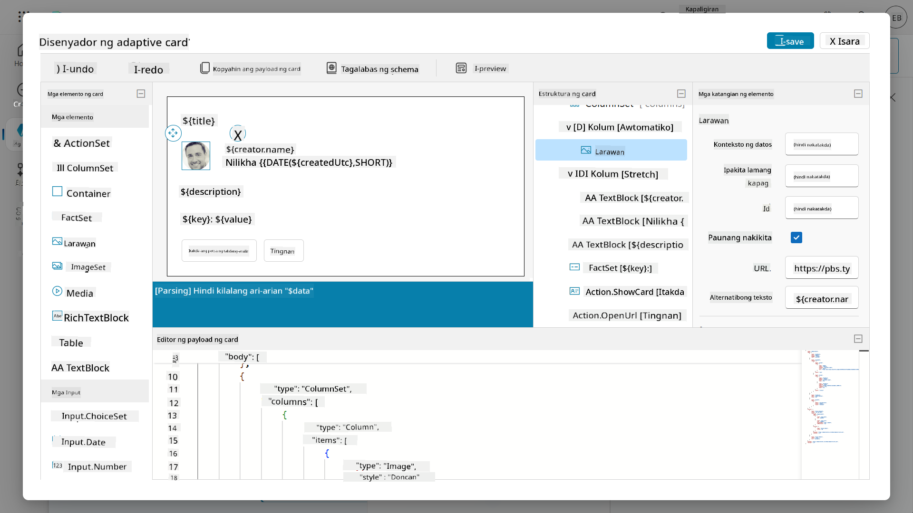

### Bakit mahalaga ang Adaptive Cards sa Copilot Studio

Isipin na gumagawa kayo ng isang ahente na nagtatanong sa mga user ng kanilang pangalan, email, o feedback. Kung plain text lang ang gagamitin ninyo, maaaring maging boring o mahirap sundan ang pag-uusap. Dito pumapasok ang Adaptive Cards!

1. **Ginagawang interactive ang mga pag-uusap** - sa halip na magpadala ng text bilang mensahe sa user, maaari kayong magpakita ng buttons, forms, images, at iba pa.
    - Halimbawa: maaaring magtanong ang isang card sa user na punan ang kanilang pangalan at email sa isang malinis na form.

1. **Maganda ang itsura kahit saan** - Ang Adaptive Cards ay awtomatikong umaayon sa estilo ng app kung saan ito ginagamit, tulad ng Microsoft 365 Copilot chat o Microsoft Teams. Hindi ninyo kailangang mag-alala tungkol sa dark mode, font, o layout - ito ay umaayon.

1. **Madaling gawin gamit ang JSON** - Ipinapahayag ninyo ang card gamit ang JSON code (isipin ito bilang _recipe_ para sa UI). Tinutulungan kayo ng Copilot Studio na i-preview ang inyong card bago ito idagdag sa paksa.

1. **Kolektahin at gamitin ang data** - Maaari ninyong gamitin ang card upang magtanong, mangolekta ng sagot, at gamitin ang data na iyon sa daloy ng pag-uusap.
    - Halimbawa: Magtanong ng numero ng telepono ng user, pagkatapos ay magpakita ng confirmation card na may kanilang numero.

1. **Pagandahin ang karanasan ng user** - Ang mga card ay nagpaparamdam sa inyong ahente na mas interactive. Ito ay isang mas malinis, clickable, at user-friendly na uri ng interface.

## 🐱 Ang _JSON_ ba ay tao?

Binibigkas bilang "Jason," hindi ito tao 😅

Ang JSON, na kilala rin bilang _JavaScript Object Notation_, ay isang magaan na format na ginagamit upang istruktura ang data. Madaling basahin at isulat, at mukhang isang serye ng key-value pairs sa loob ng curly braces {}.

Isa ito sa mga opsyon na maaaring gamitin kapag nagdadagdag ng adaptive card sa inyong paksa.

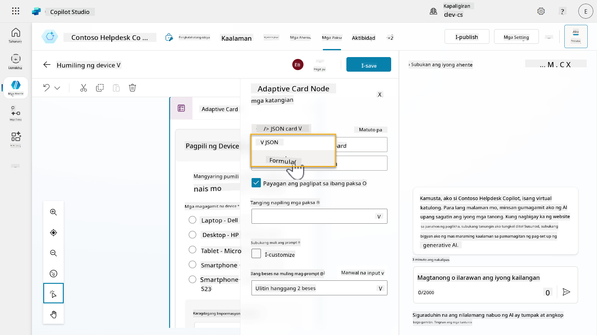

## 👀 Nakikita ko ang isa pang opsyon para sa paggawa ng adaptive card gamit ang _formula_

Tandaan kung paano natin natutunan ang tungkol sa Power Fx sa [Misyon 07 - Paggamit ng Power Fx sa inyong mga node](../07-add-new-topic-with-trigger/README.md#what-power-fx-can-do-in-topics). Ang parehong prinsipyo ay maaaring ilapat sa Adaptive Cards sa loob ng Copilot Studio.

Bilang recap,

!!! note
    Ang Power Fx ay isang low-code programming language na ginagamit upang magdagdag ng logic at dynamic na behavior sa inyong ahente. Ito ang parehong wika na ginagamit sa Microsoft Power Apps, at ito ay idinisenyo upang maging simple at Excel-like, kaya madaling gamitin ng mga developer at non-developers.

### Paano gumagana ang Power Fx sa Adaptive Cards

Kapag nagdisenyo kayo ng Adaptive Card sa Copilot Studio, maaari ninyong gamitin ang Power Fx formulas upang:

- Dynamic na magpasok ng mga value tulad ng pangalan ng user, petsa, o status.
- I-format ang text o numero tulad ng pagpapakita ng currency o pag-round ng mga numero.
- Magpakita o magtago ng mga elemento batay sa mga kondisyon.
- I-customize ang mga tugon batay sa input ng user, mga variable, output mula sa mga conversation nodes.

Halimbawa,

"`Hello`" & `System.User.DisplayName`

Ang formula na ito ay pinagsasama ang salitang "Hello" sa pangalan ng user nang dynamic.

### Bakit ito kapaki-pakinabang

1. **Personalization**

    Maaari ninyong i-tailor ang mensahe sa bawat user, na nagpaparamdam sa interaksyon na mas natural at may kaugnayan.

1. **Dynamic na nilalaman**

    Ang mga card ay maaaring magpakita ng totoong data mula sa mga variable at output mula sa mga conversation nodes.

1. **Smart logic**

    Maaari ninyong kontrolin kung ano ang makikita o makikipag-interact ang mga user batay sa mga kondisyon, na nagpapabuti sa usability at nagbabawas ng mga error.

1. **Low-code friendly**

    Ang Power Fx ay isang low-code programming language. Tulad ng nabanggit kanina, ito ay nababasa, intuitive, at katulad ng mga formula sa Excel.

## 👷🏻‍♀️ Paggawa gamit ang Adaptive Card Designer

Ang **Adaptive Card Designer** ay isang visual na tool na nagbibigay-daan sa inyo na gumawa ng interactive na message cards gamit ang drag-and-drop na mga elemento tulad ng text, images, buttons, at inputs. Ang layunin nito ay tulungan kayong lumikha ng mayaman, dynamic na mga mensahe nang hindi nagsusulat ng kumplikadong code, na nagpapadali sa pagdidisenyo ng user-friendly na interface.

Ang tool na designer ay tumutulong sa inyo na bumuo ng card nang visual, ngunit sa likod nito, ito ay gumagawa ng JSON object para sa inyo. Maaari rin kayong lumipat sa _formula_ na nagbibigay-daan sa paggamit ng Power Fx expressions sa card upang magpakita ng data mula sa ibang lugar.

## 🎨 Pag-unawa sa Adaptive Card Designer

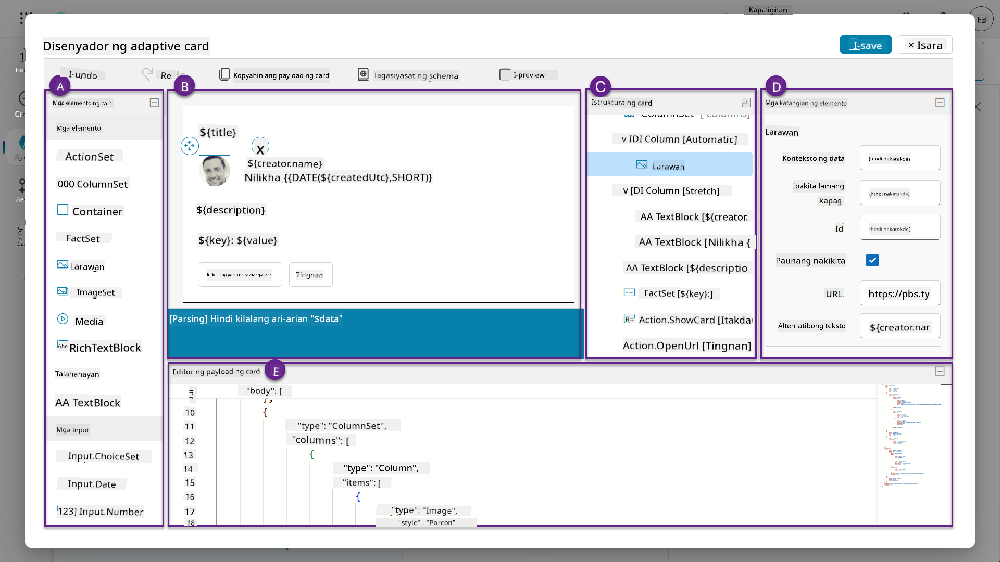

### A) Mga Elemento ng Card

Ito ang mga building blocks ng inyong adaptive card. Maaari ninyong i-drag at i-drop ang mga elemento tulad ng sumusunod:

- **TextBlock** para magpakita ng text.
- **Image** para magpakita ng mga larawan.
- **FactSet** para sa key-value pairs.
- **Input fields** para magpakita ng text boxes, date pickers, toggles.
- **Actions** para magpakita ng buttons tulad ng _Submit_, _Open URL_, o _Show Card_.

Ang bawat elemento ay may sariling layunin at maaaring i-style o i-configure.

### B) Card Viewer

Ito ang **Preview** area kung saan makikita ninyo kung paano ang magiging itsura ng inyong card sa real time. Habang nagdadagdag o nag-e-edit ng mga elemento, ang viewer ay agad na nag-a-update upang ipakita ang mga pagbabago. Pinapayagan kayo nitong gumawa ng iterative updates at makita ang design output nang sabay.

### C) Card Structure

Ipinapakita nito ang **hierarchy at layout** ng inyong card. Halimbawa:

- Ang isang card ay maaaring magsimula sa isang **TextBlock** para sa pamagat.
- Pagkatapos ay isang **ColumnSet** na may larawan sa isang gilid at text sa kabila.
- Sinusundan ng isang **FactSet** at ilang **Action buttons**.

Tinutulungan kayo nitong maunawaan kung paano naka-nest at nakaayos ang mga elemento.

### D) Mga Katangian ng Elemento

Kapag nag-click kayo sa anumang elemento sa card, ang panel na ito ay nagbibigay-daan sa inyo na **i-customize ang mga setting nito**:

- Baguhin ang laki, timbang, o kulay ng text.
- Itakda ang mga URL ng larawan o alt text.
- I-configure ang mga opsyon sa input tulad ng placeholder text o default values.

Dito ninyo pinapaganda ang bawat elemento.

### E) Card Payload Editor

Ito ang **raw JSON code** sa likod ng inyong card. Ang mga advanced na user ay maaaring mag-edit nito nang direkta upang:

- Gumamit ng templating features.
- Mag-copy/paste ng mga card definitions.

Kahit na bago kayo sa Adaptive Card designer, makakatulong na makita kung paano ang visual na disenyo ay isinasalin sa mga code.

!!! tip "Tip - Tingnan ang mga sample ng Adaptive Card"

    1. Bisitahin ang [https://adaptivecards.microsoft.com/designer](https://adaptivecards.microsoft.com/designer).
    2. Piliin ang **New card** upang makita ang listahan ng mga sample na maaari ninyong piliin at baguhin.
    3. Tandaan na ang designer na ito ay external (web-based). Kapag ginawa ninyo ang inyong card sa web-based na Adaptive Card Designer, kopyahin ang JSON mula sa Card Payload Editor.
    4. I-paste ang JSON sa inyong adaptive card sa inyong ahente sa Copilot Studio.

    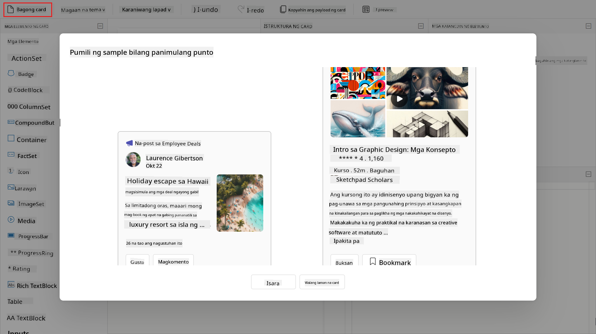

## 🌵 Karaniwang mga gamit

Ang mga sumusunod ay karaniwang mga gamit ng Adaptive Cards sa Copilot Studio kapag ginamit sa mga **Send a message** o **Ask a question** nodes.

1. **Forms at pagkolekta ng data**

    Gumamit ng adaptive cards upang mangolekta ng structured input mula sa mga user, tulad ng:

    - Mga leave request
    - Mga feedback form
    - Impormasyon sa contact
    - Pag-schedule ng appointment

1. **Pagpapakita ng dynamic na impormasyon**

    Magpakita sa mga user ng personalized o real-time na data sa isang malinis, nababasang format mula sa mga enterprise sources tulad ng ServiceNow, SAP, Dynamics 365, SharePoint, atbp.

    - Mga order summary
    - Mga balanse ng account
    - Status ng ticket o kaso
    - Mga paparating na event o deadline

1. **Interactive na mga pagpipilian**

    Hayaan ang mga user na pumili nang direkta sa pag-uusap:

    - Pumili mula sa listahan ng mga opsyon, halimbawa mga kategorya ng produkto, mga paksa ng suporta.
    - Kumpirmahin o kanselahin ang aksyon.
    - Mag-rate ng serbisyo o karanasan.

1. **Pag-trigger ng mga aksyon**

    Maglagay ng mga button na nagti-trigger ng karagdagang hakbang sa pag-uusap sa loob o labas.

    - "Submit request"
    - "View details"

## ⭐ Mga pinakamahusay na kasanayan

Narito ang ilang pinakamahusay na kasanayan para sa paggawa ng Adaptive Cards para sa mga ahente sa Copilot Studio.

1. **Panatilihing simple at nakatuon**

    - Magdisenyo ng mga card na may malinaw na layunin, huwag itong punuin ng masyadong maraming elemento.
    - Gumamit ng maikli at malinaw na text at intuitive na layout upang gabayan ang mga user sa interaksyon.

1. **Maging maingat sa mga input**

    - Isama lamang ang mga kinakailangang input na elemento tulad ng text, date choices, upang maiwasan ang pag-overwhelm sa mga user.
    - Gumamit ng mga label upang gawing madaling maunawaan ang mga input.

1. **Istruktura para sa readability**

    - Gumamit ng **TextBlocks** para sa mga heading at instruksyon.
    - I-group ang mga kaugnay na elemento gamit ang **Containers** o **ColumnSets** upang mapabuti ang visual flow.

1. **Gawing malinaw ang mga Action elements**

    - Gumamit ng **Action.Submit** at/o **Action.OpenUrl** na may malinaw na mga pamagat ng button tulad ng "Submit Request" o "View Details"
    - Iwasan ang mga malabong label tulad ng "Click here"

1. **Magdisenyo para sa adaptability**

    - Isipin na maaaring makita ang card sa iba't ibang laki ng screen.
    - Iwasan ang fixed widths at gumamit ng flexible layouts tulad ng **ColumnSets** para sa responsiveness.

1. **Gumamit ng dynamic na nilalaman kung maaari**

    - I-bind ang mga elemento ng card sa mga variable o output mula sa mga nodes gamit ang Power Fx upang gawing personalized ang karanasan ng user.
    - Halimbawa, magpakita ng pangalan ng user o kasalukuyang status nang dynamic.

## 🧪 Lab 08 - Magdagdag ng adaptive cards at pagandahin ang kakayahan ng paksa

Ngayon ay matututunan natin kung paano pagandahin ang ating paksa gamit ang adaptive cards at paggamit ng advanced na functionality ng mga paksa at nodes.

- [8.1 Gumawa ng bagong paksa na may adaptive card para sa user na magsumite ng kanilang request](../../../../../docs/recruit/08-add-adaptive-card)
- [8.2 I-update ang mga instruksyon ng ahente upang i-invoke ang Request device topic](../../../../../docs/recruit/08-add-adaptive-card)

### ✨ Gamit

**Bilang isang** empleyado

**Gusto kong** mag-request ng device

**Upang** makapag-request ng device mula sa listahan ng mga available na device

Simulan na natin!

### Mga Kinakailangan

1. **SharePoint list**

    Gagamitin natin ang **Devices** SharePoint list mula sa [Lesson 00 - Course Setup - Step 3: Create new SharePoint site](../00-course-setup/README.md#step-4-create-new-sharepoint-site).

    Kung hindi pa ninyo na-set up ang **Devices** SharePoint list, mangyaring bumalik sa [Lesson 00 - Course Setup - Step 3: Create new SharePoint site](../00-course-setup/README.md#step-4-create-new-sharepoint-site).

1. **Contoso Helpdesk Copilot**

    Gagamitin natin ang parehong ahente na ginawa dati sa [Lesson 06 - Create a custom agent using natural language with Copilot and grounding it with your data](../06-create-agent-from-conversation/README.md).

### 8.1 Gumawa ng bagong paksa na may adaptive card para sa user na magsumite ng kanilang request

Gagawa tayo ng bagong paksa na hahawak sa request ng device ng user. Ang bagong paksa na ito ay maglalaman ng **Ask with adaptive card** node upang paganahin ang interaksyon ng user sa ahente.

Simulan na natin!

1. Piliin ang **Topics** tab, pagkatapos ay piliin ang **+ Add a topic from blank**.

    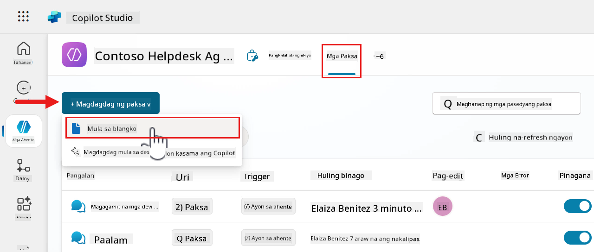

1. Pangalanan ang paksa bilang sumusunod,

    ```text
    Request device
    ```

    Ipasok ang sumusunod bilang deskripsyon para sa trigger.

    ```text
    This topic helps users request a device when they answer yes to the question that asks the user if they would like to request one of these devices.
    ```

    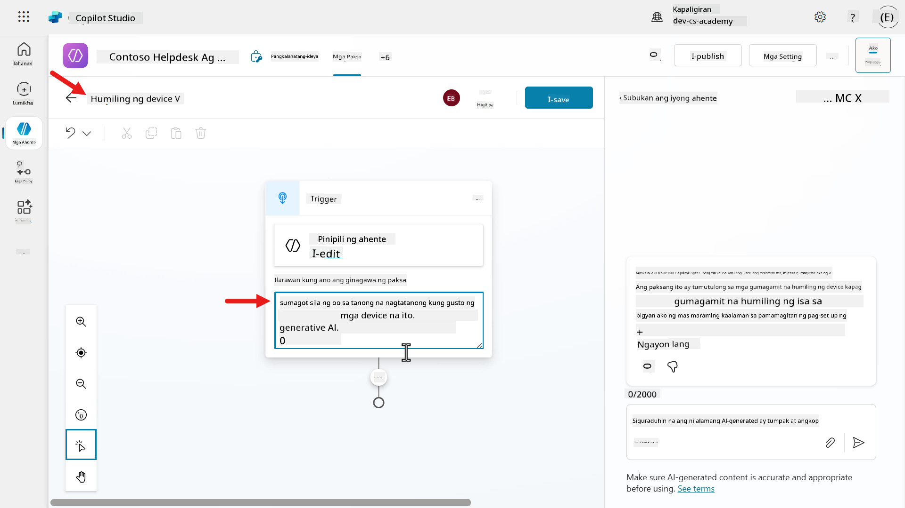
1. Susunod, magdagdag ng **Ask with adaptive card** node. Ang node na ito ay magpapakita ng interactive card para sa user upang pumili kung aling device ang nais nilang i-request.

    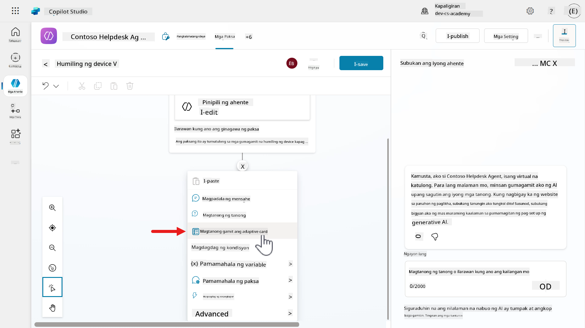

1. Piliin ang node at lalabas ang **Adaptive Card Node properties** pane. Ngayon, i-edit natin ang JSON. Piliin ang **Edit adaptive card**. Piliin ang **Edit adaptive card**.

    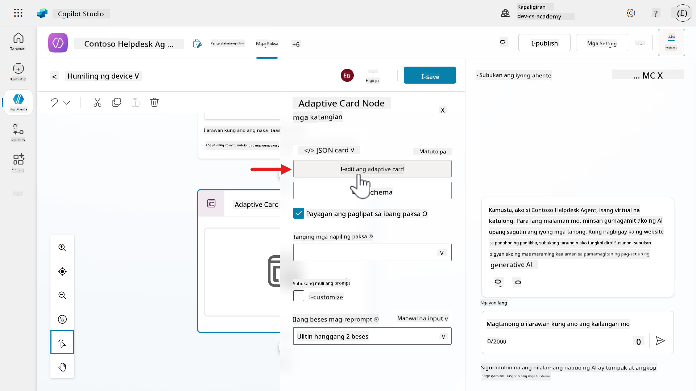

1. Ito ang **Adaptive Card Designer** kung saan maaari mong i-design ang iyong card at makita ang disenyo ng card nang real-time.

    Subukang i-drag at i-drop ang mga element ng card na **TextBlock** at **FactSet** sa authoring canvas, ang card viewer area. Pansinin kung paano nagbabago ang istruktura ng card at ang card payload editor habang idinadagdag ang dalawang element ng card. Maaari mong direktang i-update ang card payload editor at ang element properties pane.

    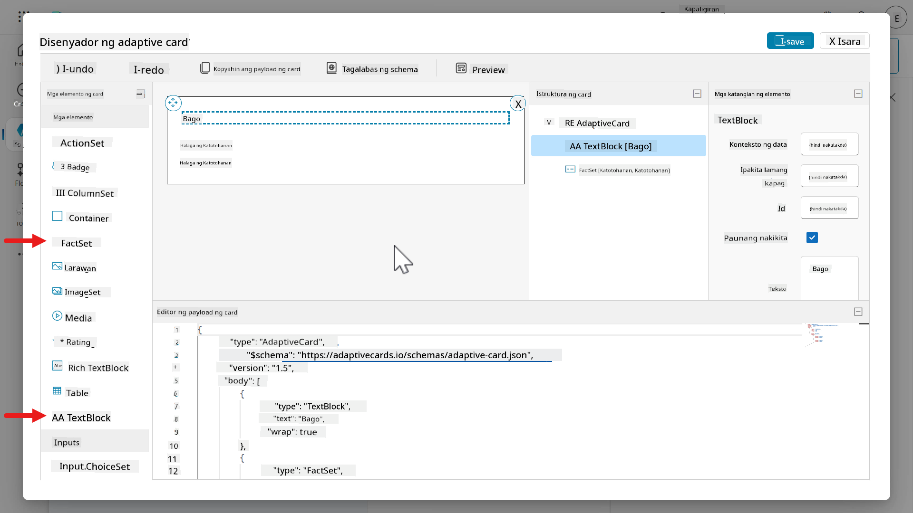

1. Piliin ang **Preview** upang makita ang card sa iba't ibang lapad.

    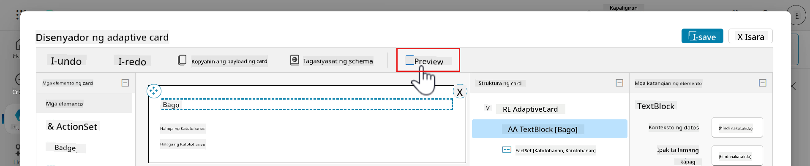

1. Maglo-load ang preview kung saan makikita mo ang iba't ibang output ng card batay sa lapad.

    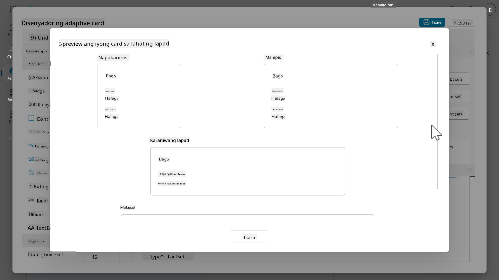

1. Lumabas sa **Preview** sa pamamagitan ng pagpili sa **x icon** at piliin ang **Undo** sa designer upang alisin ang dalawang element ng card na idinagdag kanina.

    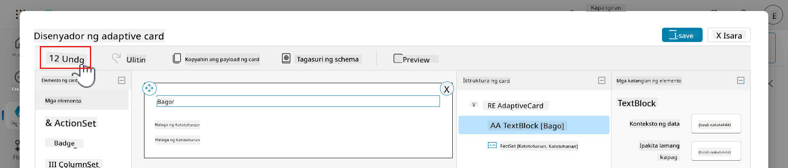

1. Mag-click sa **Card payload editor** at piliin ang lahat ng linya gamit ang Windows keyboard shortcut na _Ctrl + A_ o gamit ang Mac keyboard shortcut na _Command + A_, pagkatapos ay i-delete ang mga linya. **I-paste** ang JSON mula sa [Request devices .JSON file](../../../../../docs/recruit/08-add-adaptive-card/assets/8.1_RequestDevice.json).

    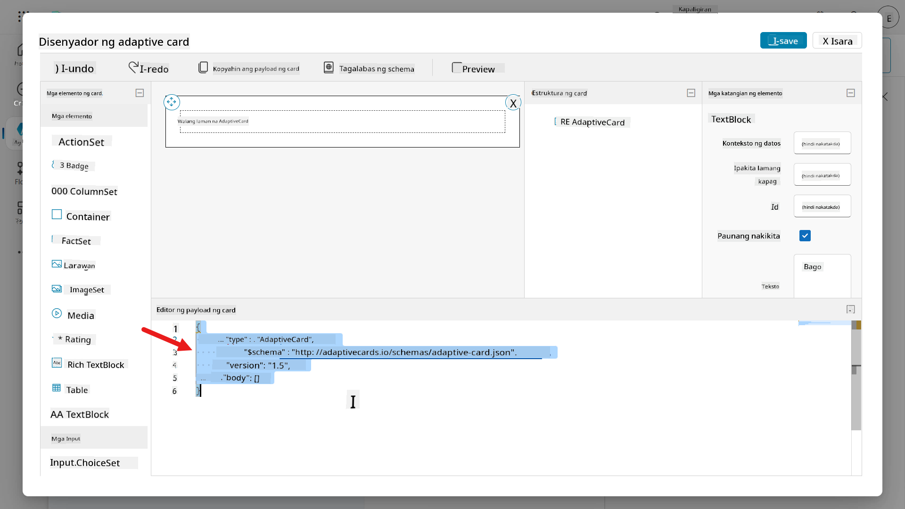

1. Pansinin kung paano ang **Card Preview** ngayon ay naglalaman ng mga element na nagpapakita ng ilang teksto at isang listahan ng mga available na device.

    Ang JSON na ito ay kasalukuyang placeholder at preview para sa gagamitin natin bilang base para sa ating card ngunit sa anyo ng formula sa halip na JSON dahil gagamitin natin ang **global variable**, `Global.VarDevices.value`, na nag-iimbak ng response ng **Get items** SharePoint connector action.

    Piliin ang **Save** at piliin ang **Close** upang lumabas sa Adaptive card designer modal.

    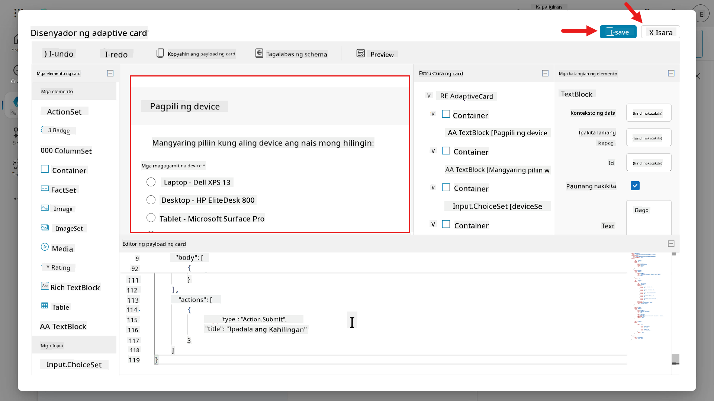

1. Isara ang **Adaptive Card Node properties** panel sa pamamagitan ng pagpili sa **X** icon.

    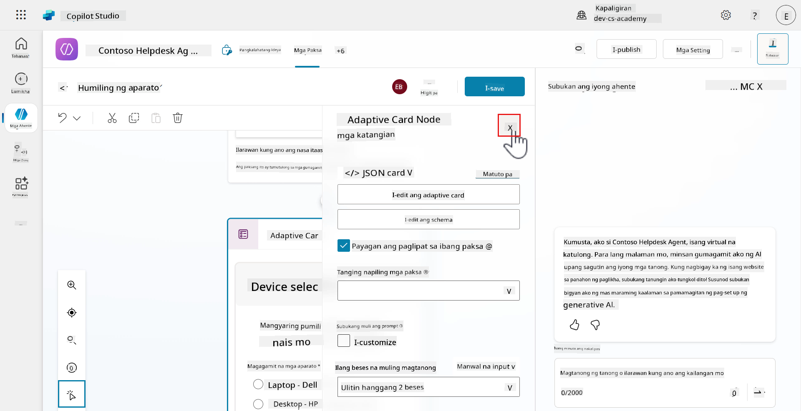

1. Sa authoring canvas ng topic, makikita mo ang adaptive card.

    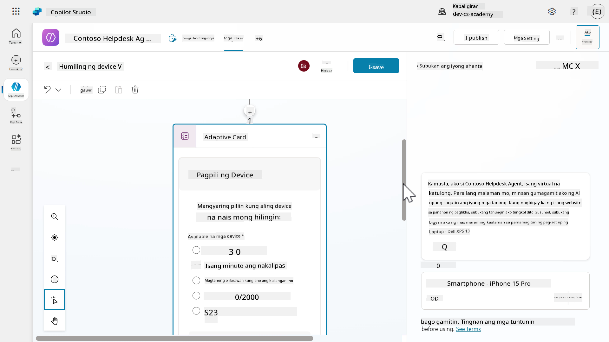

1. Mag-scroll sa ibaba ng node at makikita mo ang output variables. Ang `commentsId` at ang `deviceSelectionId` ay na-define sa element properties. Ang dalawang variable na ito ay mag-iimbak ng mga value mula sa mga element ng card na ina-interact ng mga user. Ang mga value na ito ay gagamitin sa susunod na bahagi ng topic, na matututunan natin sa susunod na lesson's lab.

    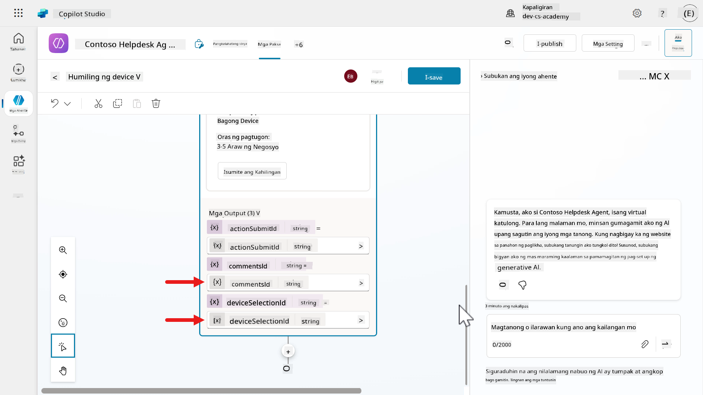

1. Susunod, i-update natin ang card mula JSON patungong formula dahil gagamitin natin muli ang Power Fx upang i-loop ang mga item na nakuha sa **Get items** SharePoint connector action, na naka-store sa **global variable**, `Global.VarDevices.value`, sa pamamagitan ng `value` property ng JSON response.

    > Ginawa natin ang global variable na ito sa [Lab 07 - Add a new topic with conversation nodes, 7.3 Add a tool using a connector](../07-add-new-topic-with-trigger/README.md#73-add-a-tool-using-a-connector).

    Piliin ang card sa **Ask with Adaptive Card** node, pagkatapos ay piliin ang **chevron** icon at piliin ang **Formula**.

    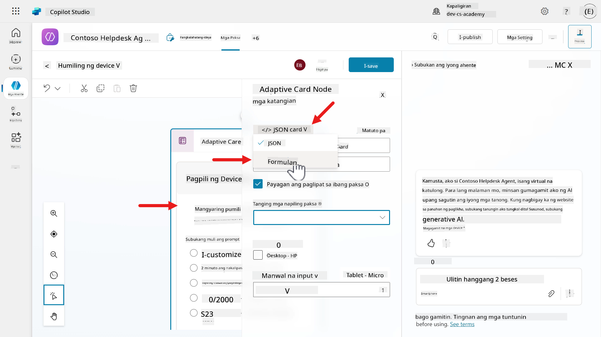

1. Mag-click sa **expand** icon upang palakihin ang Formula field.

    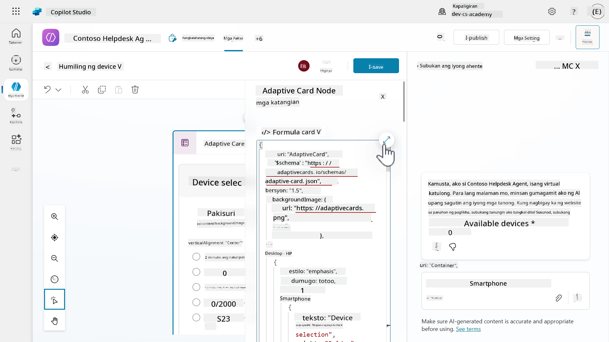

1. Mag-click sa **Card payload editor** at piliin ang lahat ng linya gamit ang Windows keyboard shortcut na _Ctrl + A_ o gamit ang Mac keyboard shortcut na _Command + A_, pagkatapos ay i-delete ang mga linya.

    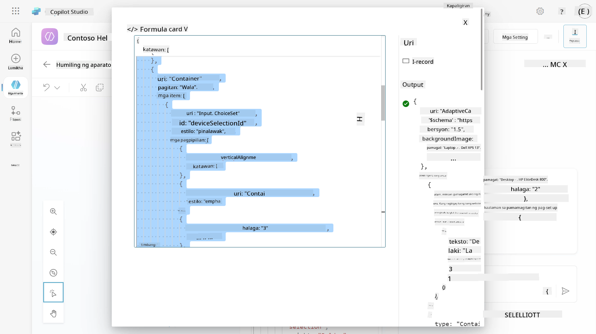

    I-paste ang Formula mula sa [Request Devices formula file](../../../../../docs/recruit/08-add-adaptive-card/assets/8.1_RequestDeviceFormula.txt).

1. Sa formula, i-loop natin ang bawat SharePoint list item gamit ang `For All` function upang ipakita ang mga value ng `Model` sa title ng choice option, at ang SharePoint item `ID` ay ire-reference bilang value. I-wrap din natin ang mga value gamit ang `If(IsBlank()` functions dahil ang formula ay nangangailangan ng value upang ma-render ang adaptive card sa authoring canvas ng topic. Kung hindi, makakakita ka ng mensahe na "Property cannot be null."

    **Isara** ang card modal.

    

1. **Isara** ang **Adaptive Card Node properties** pane.

1. **I-save** ang topic.

    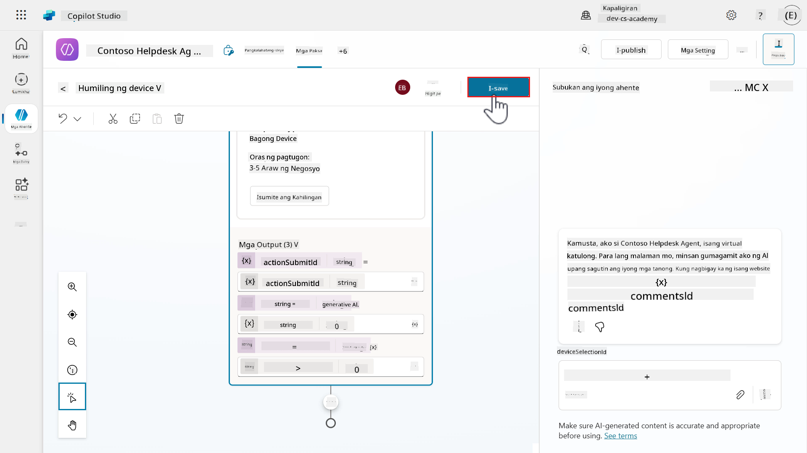

### 8.2 I-update ang agent instructions upang i-invoke ang Request device topic

Ngayon na nagawa na natin ang bagong topic na humahawak sa mga device requests, kailangan nating i-update ang **agent instructions** upang i-invoke ang topic.

1. Piliin ang **Overview** tab at sa **agent instructions** piliin ang **Edit**.

    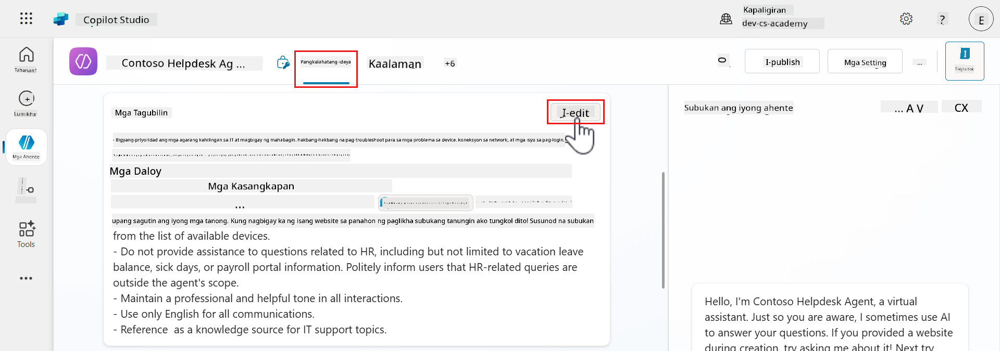

1. Magdagdag ng bagong linya sa ibaba ng nakaraang instruction mula sa [Lab 07 - Add a new topic with conversation nodes, 7.3 Add a tool using a connector](../07-add-new-topic-with-trigger/README.md#73-add-a-tool-using-a-connector).

    ```text
    - If the user answers yes to the question of requesting a device, trigger [Request device]. Otherwise if they answer no to the question of requesting a device, trigger [Goodbye].
    ```

    Piliin ang buong topic placeholder sa square brackets at i-delete ang placeholder.

    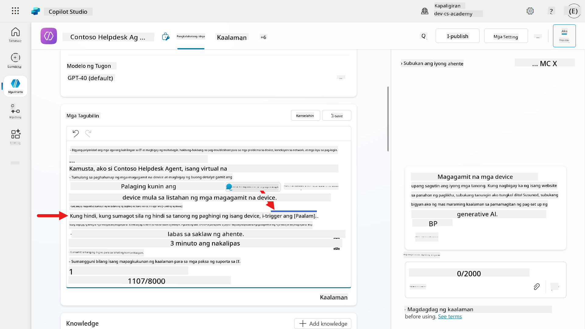

1. Mag-type ng `/Req` at piliin ang **Request devices** topic.

    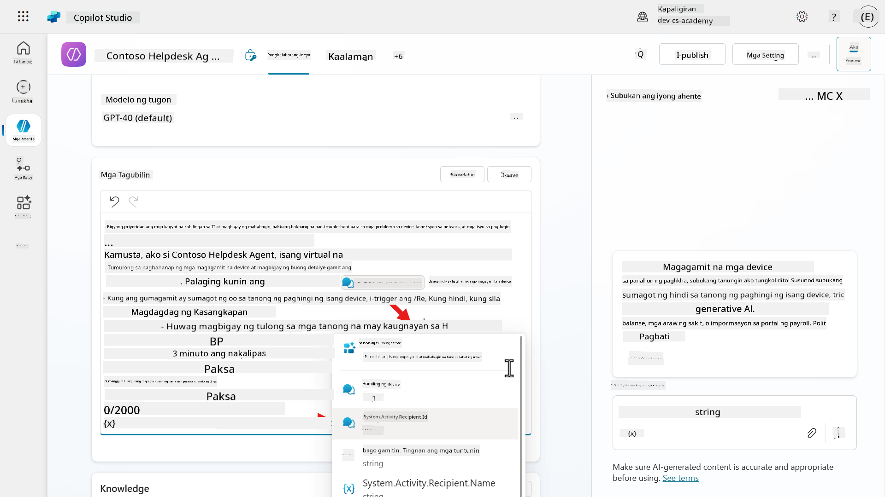

1. Ulitin ang parehong mga hakbang para sa susunod na topic placeholder, **[Goodbye]**. Piliin ang buong topic placeholder sa square brackets at i-delete ang placeholder. Mag-type ng `/Goodbye` at piliin ang **Goodbye** topic.

    - Kapag ang user ay sumagot ng **Yes** sa tanong ng agent kung nais nilang mag-request ng device, ang agent ay magre-redirect mula sa **Available devices** topic patungo sa **Request devices** topic.

    - Kung hindi naman, kapag ang user ay sumagot ng **No**, ang agent ay magre-redirect mula sa **Available devices** topic patungo sa **Goodbye** topic.

    **I-save** ang updated instructions.

    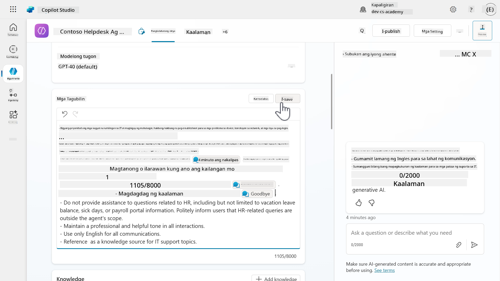

1. Subukan natin ang redirection mula sa _Available devices_ topic patungo sa _Request devices_ topic. Piliin ang **Test** upang i-load ang testing pane at piliin ang **Refresh**.

    Pagkatapos piliin ang **Activity map** icon sa test pane, kasunod ng pag-enable ng **Track between topics**. Papayagan tayo nitong makita na ang _Available devices_ topic ay nag-redirect sa _Request devices_ topic.

    OK, handa na tayo mag-test! I-type ang sumusunod sa test pane.

    ```text
    I need a laptop
    ```

    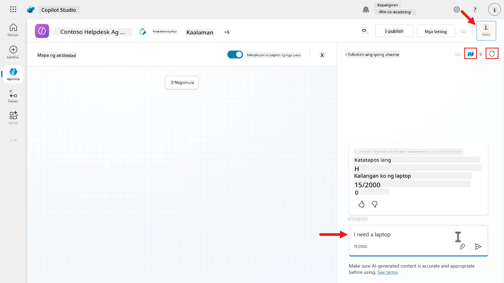

1. Ang agent ay magre-respond sa listahan ng mga available na device kasunod ng tanong kung nais ng user na mag-request ng device. Kopyahin at i-paste ang sumusunod,

    ```text
    yes please
    ```

    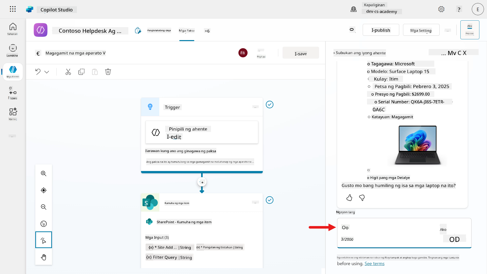

1. Makikita natin na ang agent ay nag-redirect sa **Request device** topic. Ang agent ay nag-invoke sa topic na ito ayon sa instructions na idinagdag natin.

    Ang adaptive card na may interactive elements ay ipapakita bilang mensahe sa user.

    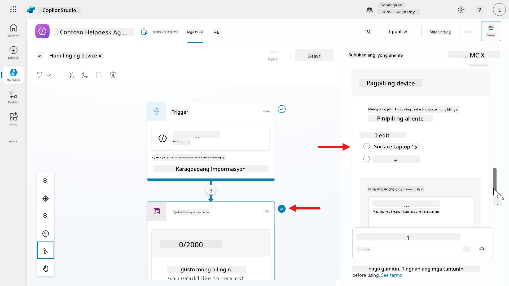

1. Matagumpay na nating na-test 😄 ang _Available devices_ topic na nag-redirect sa _Request devices_ topic. Magdadagdag pa tayo ng mga enhancement sa topic na ito sa susunod na lesson's lab.

    I-refresh ang test pane.

    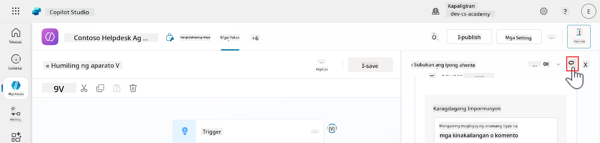

## ✅ Mission Complete

Congratulations! 👏🏻 Natutunan mo kung paano magdagdag ng adaptive cards gamit ang Power Fx formulas upang mag-display ng data mula sa variables, at natutunan mo rin kung paano mag-redirect mula sa isang topic patungo sa isa pa. Ang paggawa ng maliliit na topic ay mas nakaka-organisa sa iyong agent, ngunit nakakatulong din ito sa pag-guide sa mga user sa iba't ibang bahagi ng conversation flow kasama ang agent.

Ito ang katapusan ng **Lab 08 - Enhance user interactions with Adaptive Cards**, piliin ang link sa ibaba upang lumipat sa susunod na lesson. Palalawakin natin ang use case sa lab na ito sa susunod na lesson's lab.

⏭️ [Lumipat sa **Add an agent flow to your Topic for automation** lesson](../09-add-an-agent-flow/README.md)

## 📚 Tactical Resources

🔗 [Using Adaptive Cards in Copilot Studio](https://learn.microsoft.com/microsoft-copilot-studio/guidance/adaptive-cards-overview?WT.mc_id=power-172619-ebenitez)

🔗 [Add an adaptive card in Send a message node](https://learn.microsoft.com/microsoft-copilot-studio/authoring-send-message#add-an-adaptive-card?WT.mc_id=power-172619-ebenitez)

🔗 [Create expressions using Power Fx](https://learn.microsoft.com/microsoft-copilot-studio/advanced-power-fx?WT.mc_id=power-172619-ebenitez)

📺 [Building Adaptive Cards with Power FX](https://aka.ms/ai-in-action/copilot-studio/ep8)

<!-- markdownlint-disable-next-line MD033 -->


---

**Paunawa**:  
Ang dokumentong ito ay isinalin gamit ang AI translation service na [Co-op Translator](https://github.com/Azure/co-op-translator). Bagamat sinisikap naming maging tumpak, mangyaring tandaan na ang mga awtomatikong pagsasalin ay maaaring maglaman ng mga pagkakamali o hindi pagkakatugma. Ang orihinal na dokumento sa kanyang katutubong wika ang dapat ituring na opisyal na pinagmulan. Para sa mahalagang impormasyon, inirerekomenda ang propesyonal na pagsasalin ng tao. Hindi kami mananagot sa anumang hindi pagkakaunawaan o maling interpretasyon na dulot ng paggamit ng pagsasaling ito.