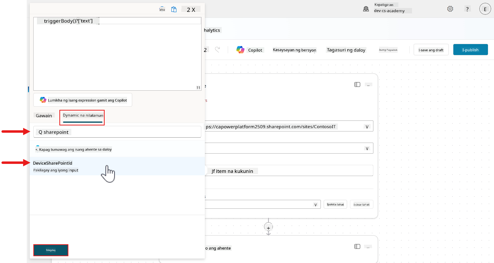
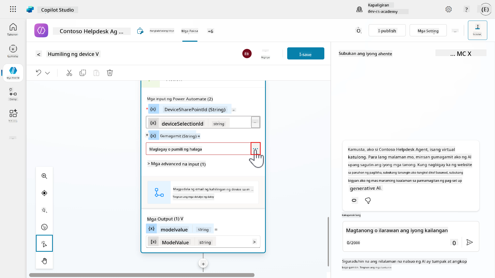
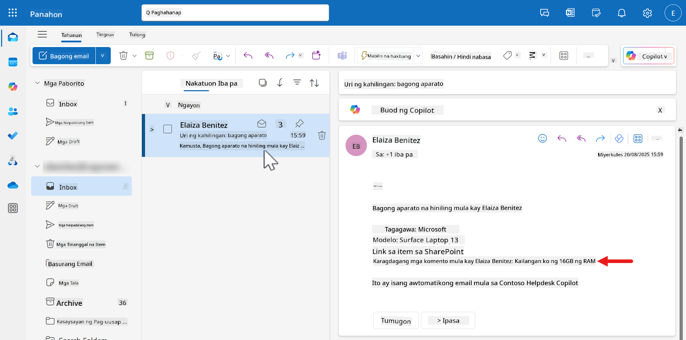

<!--
CO_OP_TRANSLATOR_METADATA:
{
  "original_hash": "cc4afa4a5a11c9d03896decfbcbd4060",
  "translation_date": "2025-10-22T19:28:44+00:00",
  "source_file": "docs/recruit/09-add-an-agent-flow/README.md",
  "language_code": "tl"
}
-->
# 🚨 Misyon 09: Magdagdag ng daloy ng ahente sa iyong Paksa para sa awtomasyon

## 🕵️‍♂️ CODENAME: `OPERATION AUTOMATION POWERHOUSE`

> **⏱️ Oras ng Operasyon:** `~30 minuto`  

🎥 **Panoorin ang Walkthrough**

[](https://www.youtube.com/watch?v=vtLZJT3eBXg "Panoorin ang walkthrough sa YouTube")

## 🎯 Misyon Brief

Ang iyong ahente ay maaari nang makipag-usap sa mga gumagamit at magbigay ng impormasyon, ngunit ang tunay na kahusayan sa operasyon ay nangangailangan ng kakayahan ng iyong ahente na kumilos. Ang misyon na ito ay magpapalakas sa iyong conversational agent sa pamamagitan ng pagdaragdag ng mga daloy ng ahente para sa awtomasyon.

Sa pagtatapos ng misyon, makakagawa ka ng isang end-to-end na awtomasyon ng kahilingan sa device na kumukuha ng input ng gumagamit sa pamamagitan ng adaptive card, kumukuha ng data mula sa SharePoint, nagpapadala ng mga notification sa mga manager sa pamamagitan ng email, at nagbibigay ng seamless na feedback sa gumagamit - lahat ay pinamamahalaan ng iyong ahente sa pamamagitan ng intelligent workflow automation.

## 🔎 Mga Layunin

Sa misyon na ito, matututunan mo:

1. Pag-unawa kung ano ang mga daloy ng ahente at paano ito naiiba sa Power Automate cloud flows para sa awtomasyon
1. Pag-aaral ng mga pangunahing tampok na nagpapalakas sa mga daloy ng ahente kabilang ang AI actions at natural language authoring
1. Paggalugad sa agent flow designer at kung paano gamitin ang mga expression para sa dynamic na paghawak ng data
1. Paglikha ng kumpletong awtomasyon ng kahilingan sa device na nag-iintegrate ng data ng SharePoint at mga email notification

## 🤔 Ano ang daloy ng ahente?

Ang mga daloy ng ahente ay isang makapangyarihang paraan upang awtomatikong gawin ang mga paulit-ulit na gawain at i-integrate ang iyong mga app at serbisyo. Isipin ito bilang mga structured, step-by-step na workflows na maaaring isagawa ng iyong ahente upang awtomatikong gawin ang mga gawain o kumonekta sa iba pang mga application at serbisyo. Para itong mini workflows na tumutulong sa iyong ahente na gumawa ng mga bagay tulad ng pagpapadala ng mga notification, pag-update ng mga record, o pagtugon sa mga kaganapan.

Hindi tulad ng mga autonomous agents na gumagamit ng AI upang gumawa ng mga desisyon sa sandaling iyon, ang mga daloy ng ahente ay **deterministic workflows** - ibig sabihin, sinusunod nila ang parehong landas sa bawat oras, na tinitiyak ang pare-pareho at maaasahang resulta.

Sa simpleng salita:

- Tinutulungan nila ang iyong ahente na _gumawa ng mga bagay_, hindi lang _magsalita_ sa mga gumagamit.
- Maaaring magamit muli sa iba't ibang mga paksa at ahente, at maaaring ma-trigger ng mga mensahe ng gumagamit, mga kaganapan, o iba pang mga application at serbisyo.

## 🙋🏽 Oo, pero paano ito naiiba sa Power Automate cloud flows?

Parehong tumutulong ang mga daloy ng ahente at Power Automate cloud flows sa awtomasyon ng mga gawain. Ang mga ito ay dinisenyo para sa iba't ibang layunin at gumagana sa iba't ibang paraan.

### 🤖 Daloy ng ahente sa Copilot Studio

**Para saan ito:**

- Ginawa para sa mga conversational at autonomous agents (sa pamamagitan ng agent instructions) sa Copilot Studio.
- Nakatuon sa matalino, AI-driven na awtomasyon na nakikipag-ugnayan sa mga business systems.

**Bakit ito kapaki-pakinabang:**

- Madaling gawin at pamahalaan direkta sa Copilot Studio.
- Mahusay para sa awtomasyon ng mga gawain na nangyayari _habang nakikipag-usap_ sa mga gumagamit tulad ng pagsusumite ng leave request.
- Hindi mo kailangan ng hiwalay na Power Automate license dahil ang billing ay batay sa paggamit sa loob ng Copilot Studio. Makakatipid ito ng oras at gastos para sa mga enterprise teams.

**Mga Limitasyon:**

- Hindi mo ito maibabahagi, makokopya, o maaasign ang co-owners.
- Ang mga daloy ng ahente ay makikita at magagamit lamang sa loob ng Copilot Studio.
- Sa kasalukuyan, ang mga event triggers para sa mga ahente ay maaaring i-edit sa Power Automate maker portal.

### ☁️ Power Automate cloud flows

**Para saan ito:**

- Dinisenyo para sa pangkalahatang awtomasyon sa maraming apps at serbisyo.
- Maaaring tumakbo nang mag-isa o magtrabaho kasabay ng mga daloy ng ahente.

**Bakit ito kapaki-pakinabang:**

- Nag-aalok ng malawak na hanay ng mga connectors.
- Perpekto para sa awtomasyon ng mga proseso sa labas ng mga ahente.
- Maaaring ibahagi, magamit muli, at pamahalaan sa mga teams.

**Mga Kinakailangan:**

- Kailangan mo ng Power Automate license upang magamit ito.

### 📗 Buod

| Gamitin ito | Kapag gusto mong |
| :- | :- |
| Daloy ng ahente | Awtomatikong gawin ang mga gawain sa loob ng isang ahente, gumamit ng AI, at panatilihin ang lahat sa Copilot Studio |  
| Power Automate cloud flows | Awtomatikong gawin ang mga gawain sa iba't ibang apps at serbisyo, o gumawa ng workflows sa labas ng mga ahente |

## 👍🏻 Bakit gamitin ang mga daloy ng ahente

Ang mga daloy ng ahente ay palaging sumusunod sa isang nakatakdang landas - ginagawa nila ang parehong bagay sa bawat oras kapag binigyan ng parehong input.

Ginagawa nitong:

- **Maaasahan** - maaari kang magtiwala na palagi silang gagana sa parehong paraan.
- **Predictable** - alam mo kung anong resulta ang aasahan kapag tumakbo ang daloy.
- **Rule-based** - sinusunod nila ang mga hakbang na iyong tinukoy.

Iba pang mga benepisyo:

- **Awtomasyon** - pinapayagan ang iyong ahente na hawakan ang mga paulit-ulit na gawain tulad ng pagsusumite ng mga form o pagpapadala ng mga notification.
- **Konektado** - kumonekta sa 1400+ connectors tulad ng ServiceNow, SharePoint, Salesforce. Maaari ka ring gumawa ng sarili mong custom connector.
- **Mahigpit na integrated** - ang mga daloy ng ahente ay bahagi ng lohika ng ahente, na-trigger direkta ng mga mensahe ng gumagamit o mga aksyon sa pag-uusap.
- **Scalability** - magamit muli ang mga daloy sa maraming ahente o senaryo.
- **No-code o low-code** - maaari kang gumawa ng mga daloy gamit ang natural na wika o isang visual designer.
- **All-in-one-platform** - maaari mong idisenyo, subukan, at i-deploy ang mga daloy ng ahente sa isang lugar - Copilot Studio. Walang kailangang lumipat sa pagitan ng mga platform.

## 🏄🏻‍♂️ Paano pinapalakas ng mga daloy ng ahente ang iyong ahente?

Pinalalawak ng mga daloy ng ahente ang kakayahan ng iyong ahente na lampas sa "pakikipag-usap" sa mga gumagamit. Pinapayagan nito ang ahente na kumilos at makipag-ugnayan sa mga sistema.

Halimbawa, kung ikaw ay nagtatrabaho sa isang finance department at nakakatanggap ng maraming invoices mula sa mga vendor. Karaniwan, may kailangang magbasa ng bawat invoice, kunin ang mahalagang detalye - ang halaga, petsa, kung sino ang nagpadala, at suriin kung tumutugma ang lahat sa iyong mga record. Pagkatapos ay ipadala ito sa tamang tao para sa pag-apruba. Ito ay kumakain ng oras at lakas.

Sa tulong ng mga daloy ng ahente sa Copilot Studio, maaari mong awtomatikong gawin ang prosesong ito. Kapag dumating ang invoice, ang ahente:

1. Binabasa ang dokumento gamit ang intelligent document processing upang hanapin ang mahalagang impormasyon.
1. Sinusuri ang mga detalye laban sa iyong enterprise data upang matiyak na tama ang lahat.
1. Ipinapasa ito para sa pag-apruba sa tamang tao.

Nakakatipid ito ng oras, nababawasan ang mga pagkakamali, at pinapadali ang buong proseso.

### Isipin ito sa ganitong paraan

- **Mga Ahente**: ang matalinong gumagawa ng desisyon
- **Mga Daloy ng Ahente**: ang maaasahang tagapagpatupad

### Bakit ito mahalaga

- Nakukuha mo ang pinakamahusay sa parehong mundo: maaasahang awtomasyon at flexible na AI.
- Madaling gumawa at mag-update ng mga daloy habang nagbabago ang pangangailangan ng negosyo.
- Maaari mong palawakin ang awtomasyon sa iba't ibang teams.

## 🔌 Mga pangunahing tampok na nagpapalakas sa mga daloy ng ahente

1. **Natural language authoring**
    - Maaari mong ilarawan kung ano ang gusto mong gawin ng daloy sa simpleng Ingles.
    - Naiintindihan ng Copilot ang iyong layunin at binubuo ang daloy para sa iyo.
    - Walang kailangang magsulat ng code - ipaliwanag lang ang iyong ideya.

1. **AI actions**

    Gumamit ng AI upang:

    - Basahin at unawain ang mga dokumento o larawan.
    - Ibuod ang mahabang nilalaman sa maikli at kapaki-pakinabang na sagot.
    - Gumawa ng matalinong rekomendasyon o desisyon.

1. **Generative actions**
    - Pinapayagan ng mga ito ang daloy na umangkop sa real-time.
    - Maaaring magplano at mag-adjust ang ahente ng mga hakbang batay sa nagbabagong impormasyon.

1. **Integration actions**
    - Ikonekta ang iyong daloy sa iba pang mga tool tulad ng Outlook, Microsoft Teams, ServiceNow, SharePoint at iba pang mga application at serbisyo, sa pamamagitan ng +1400 built-in connectors o sa sarili mong custom connector.
    - Tinutulungan nito ang iyong ahente na magtrabaho gamit ang mga app na ginagamit na ng iyong team.

1. **Human in the loop**
    - Magdagdag ng mga hakbang sa pag-apruba kung saan kailangang suriin o kumpirmahin ng isang tao ang isang bagay.
    - [Advanced approvals](https://learn.microsoft.com/microsoft-copilot-studio/flows-advanced-approvals?WT.mc_id=power-172621-ebenitez) ay sumusuporta sa mga paalala, delegasyon, at multi-stage approvals.

## ⚙️ Paano ito gumagana

1. **Trigger**

    Isang kaganapan ang nagsisimula sa daloy - tulad ng isang gumagamit na nagtatanong, pag-trigger ng daloy mula sa isang paksa, isang naka-schedule na oras, o isang kaganapan sa ibang sistema.

1. **Actions**

    Ito ang mga hakbang na sinusunod ng ahente - magpadala ng email, tumawag sa isang API, mag-update ng ticket sa ServiceNow.

## 🧶 Paano gumawa ng daloy ng ahente

1. **Natural language**: ilarawan kung ano ang gusto mong gawin ng ahente, at binubuo ito ng Copilot para sa iyo.
1. **Designer canvas**: i-drag at i-drop ang mga actions, conditions, at loops sa agent flow designer upang buuin ang iyong daloy ng ahente.

## 🎨 Ano ang agent flow designer?

Ito ay isang visual na tool sa Copilot Studio na tumutulong sa iyo na bumuo, mag-edit, at pamahalaan ang mga daloy ng ahente na nagbibigay ng step-by-step na mga tagubilin na sinusunod ng iyong ahente upang makumpleto ang mga gawain. Dinisenyo ito upang maging madaling gamitin, kahit na bago ka sa mga daloy ng ahente.

### Mga pangunahing tampok ng agent flow designer

1. **Visual canvas**
    - Makikita mo ang buong daloy na naka-layout tulad ng isang diagram.
    - Madaling mag-zoom in/out, i-fit ang view o gumamit ng minimap upang mag-navigate sa malalaking daloy.

1. **Magdagdag at mag-alis ng mga actions**
    - I-click ang _plus (+)_ button upang magdagdag ng bagong action tulad ng pagpapadala ng mensahe o pag-update ng item sa isang SharePoint list.
    - Maaari kang maghanap ng mga actions mula sa connectors, at i-configure ang mga ito sa pamamagitan ng settings nito.
    - Upang alisin ang isang action, i-click ang _three dots (⋮)_ at piliin ang _Delete_.

1. **Suriin ang mga parameters**
    - I-click ang anumang action upang tingnan o i-edit ang settings nito na tinatawag na _parameters_.
    - Maaari kang maglagay ng mga halaga nang manu-mano o gumamit ng _expressions_ upang gawing dynamic ang mga ito.

1. **Version history**
    - Sa tuwing ise-save mo ang iyong daloy, isang bersyon ang naitatala.
    - Maaari kang bumalik at tingnan o ibalik ang nakaraang bersyon kung kinakailangan.

1. **Error checking**
    - Ang _Flow Checker_ ay nagha-highlight ng anumang mga error.
    - Ang lahat ng error ay kailangang maayos bago i-publish ang iyong daloy.

1. **Publish and test**
    - Kapag walang error ang iyong daloy, i-publish upang maging live ito.
    - Gamitin ang _Test_ feature upang patakbuhin ang iyong daloy nang manu-mano o awtomatiko, at suriin kung gumagana ito ayon sa inaasahan.

### Bakit gamitin ang agent flow designer?

- **Visual at intuitive** - maaari kang bumuo ng mga daloy sa pamamagitan ng pag-drag at pag-click.
- **Ligtas na mag-eksperimento** - ang version history ay nagbibigay-daan sa iyo na i-undo ang mga pagbabago.
- **Built-in testing** - tumutulong sa iyo na tiyakin na gumagana ang lahat bago ito maging live.

## 🔤 Nabanggit mo ang _expressions_ - ano ang expressions?

Ang expressions ay maliliit na formula o utos na tumutulong sa iyong daloy ng ahente na magtrabaho gamit ang data. Ginagamit mo ang mga ito upang kalkulahin ang mga halaga, i-format ang teksto, gumawa ng desisyon, o kunin ang partikular na impormasyon mula sa mga input.

### Bakit gamitin ang expressions?

Ang expressions ay nagbibigay-daan sa iyo na:

- **I-customize kung paano hinahawakan ang data** - pagsamahin ang mga pangalan, i-format ang mga petsa.
- **Gumawa ng desisyon** - kung ang isang halaga ay mas malaki sa 10, gumawa ng isang bagay.
- **Baguhin ang data** - gawing lowercase ang teksto, kunin ang bahagi ng isang string.
- **Awtomatikong lohika** - nang hindi nagsusulat ng buong code.

### Ano ang hitsura ng expressions?

Ang expressions ay gumagamit ng mga functions. Hihiramin ko ang paliwanag ng kung ano ang functions mula sa dating Microsoft MVP, Jerry Weinstock.

!!! quote
    Ang mga functions ay built-in na lohika upang baguhin ang iyong data sa pamamagitan ng simple o kumplikadong operasyon sa iyong expression.

Ang mga functions ay nagbibigay-daan sa iyo na bumuo ng expressions nang hindi mo kailangang magsulat ng anumang code.

Ang paraan na gusto kong ilarawan ito, ay ang isang function sa mga daloy ng ahente ay katulad ng mga Excel functions. Maaari kang magsagawa ng operasyon sa data upang baguhin ito sa nais na output. Kapag gumagawa ng iyong formula sa Excel, pinipili mo ang iyong input value mula sa mga cells sa isang table o range, at pagkatapos ay nag-aapply ng functions upang manipulahin ang data output. Halimbawa ay ang paggamit ng `COUNT` function upang malaman ang bilang ng mga cells na naglalaman ng mga numero mula sa isang range.

Sa mga daloy ng ahente, sa halip na mag-refer sa data mula sa mga cells sa isang table, nagre-refer ka sa mga data outputs mula sa trigger o actions kapag gumagawa ng iyong expressions. Sa pagpapatuloy ng nakaraang halimbawa, gamitin ang function na `length` upang kunin ang bilang ng mga items na ibinalik mula sa _Get items_ SharePoint connector action.

### Bakit mahalaga ang functions?

Ginagawa ng paggamit ng functions ang iyong mga daloy ng ahente na:

- **Mas matalino** - maaari silang tumugon sa iba't ibang input o kondisyon.
- **Flexible** - maaari mong i-customize kung paano hinahawakan ang data.
- **Efficient** - iniiwasan mo ang manu-manong mga hakbang sa pamamagitan ng awtomatikong lohika.

### Pinakakapaki-pakinabang na functions

Ang mga sumusunod ay karaniwang functions na ginagamit sa mga daloy ng ahente. Para sa buong listahan ng functions, pumunta sa [reference guide](https://learn.microsoft.com/azure/logic-apps/workflow-definition-language-functions-reference?WT.mc_id=power-172621-ebenitez).

#### 🔡 Teksto

- `concat()` - Pinagsasama ang dalawa o higit pang piraso ng teksto.
      - Halimbawa: `concat('Hello ', firstName)` → “Hello John”

- `toLower()` / `toUpper()` - Binabago ang teksto sa lowercase o uppercase.
      - Kapaki-pakinabang para sa pag-standardize ng input.

- `substring()` - Kinukuha ang bahagi ng isang string.
      - Halimbawa: Kunin ang unang 3 letra ng isang pangalan.

- `trim()` - Tinatanggal ang mga espasyo mula sa simula at dulo ng teksto.

#### 🔢 Math at numero

- `add()`, `sub()`, `mul()`, `div()` - Mga pangunahing operasyon sa matematika.
      - Halimbawa: `add(5, 3)` - ang output ay 8

#### 📅 Petsa at oras

- `utcNow()` - Kinukuha ang kasalukuyang petsa at oras sa UTC.
      - Mahusay para sa timestamps.

- `addDays()`, `addHours()` - Nagdaragdag ng oras sa isang petsa.
- Halimbawa: `addDays(utcNow(), 7)` output ay 7 araw mula ngayon.

- `formatDateTime()` - Inaayos ang petsa sa isang nababasang string.
      - Halimbawa: Lunes, Hulyo 7, 2025

#### ✅ Lohikal

- `if()` - Tumatakbo ng isang halaga kung totoo, iba naman kung mali.
      - Halimbawa: `if(score > 50, 'Pass', 'Fail')`

- `equals()` - Tinitingnan kung magkapareho ang dalawang halaga.

- `and()`, `or()`, `not()` - Pinagsasama ang maraming kondisyon.

#### 🪣 Iba pang kapaki-pakinabang na mga function

- `coalesce()` - Ibinabalik ang unang hindi bakanteng halaga.
      - Kapaki-pakinabang para sa fallback/default na mga halaga.

- `guid()` - Gumagawa ng natatanging ID.
      - Kapaki-pakinabang para sa pagsubaybay o pag-log.

- `length()` - Binibilang kung ilang karakter o item ang nasa string o array.

## ⭐ Mga pinakamahusay na kasanayan

Narito ang ilang pinakamahusay na kasanayan para sa paggawa ng mga daloy ng ahente sa Copilot Studio.

1. **Magsimula sa simple at unti-unting magdagdag**

    - Magsimula sa isang maliit, malinaw na gawain tulad ng pagpapadala ng mensahe.
    - Magdagdag ng higit pang mga hakbang pagkatapos masubukan ang mga pangunahing automation.

1. **Gumamit ng malinaw at deskriptibong pangalan ng aksyon**

    - Lagyan ng label ang bawat hakbang nang malinaw upang maunawaan mo at ng iyong koponan kung ano ang ginagawa nito.
    - Halimbawa: sa halip na default na pangalan na "Update item" para sa aksyon ng SharePoint connector, palitan ito ng kung ano ang ina-update, tulad ng "Update device status."

1. **Suriin ang mga error bago mag-publish**

    - Gamitin ang **flow checker** upang mahanap at maayos ang anumang isyu.
    - Hindi mo maipapublish ang mga daloy kung may mga error, kaya subukang ayusin ang mga ito kapag lumitaw.

1. **Subukan ang iyong daloy nang maigi**

    - Hindi dahil nai-save at na-publish, ibig sabihin ay gumagana ito ayon sa inaasahan.
    - Gamitin ang _Test_ na tampok upang patakbuhin ang iyong daloy nang manu-mano o awtomatiko, at suriin ang mga resulta.

1. **Gamitin ang Version History**

    - I-save ang iyong daloy nang madalas upang maibalik mo ang mga naunang bersyon kung kinakailangan.
    - Maaari mong tingnan at ibalik ang mga nakaraang bersyon gamit ang _Version History_ panel.

1. **Gamitin ang mga parameter at expression nang maayos**

    - Kapag nag-configure ng mga aksyon, gumamit ng mga parameter upang gawing dynamic ang iyong daloy.
    - Maaari kang maglagay ng mga halaga nang manu-mano o gumamit ng mga expression upang kalkulahin ang mga ito, o pagsamahin ito sa mga halaga mula sa mga aksyon sa itaas gamit ang _dynamic content_ picker.

1. **Tanggalin ang mga hindi nagagamit na aksyon**

    - Kung nagdagdag ka ng isang aksyon at kalaunan ay nagpasya kang hindi mo ito kailangan, alisin ito upang mapanatiling malinis ang iyong daloy.

## 🧪 Lab 09 - Magdagdag ng daloy ng ahente para sa automation at pagbutihin ang kakayahan ng topic

Ngayon ay matututo tayong pagbutihin ang ating topic gamit ang adaptive cards at paggamit ng advanced functionality ng topics at nodes.

- [9.1 Gumawa ng daloy ng ahente](../../../../../docs/recruit/09-add-an-agent-flow)
- [9.2 Magdagdag ng daloy ng ahente sa topic](../../../../../docs/recruit/09-add-an-agent-flow)
- [9.3 I-update ang Request device topic gamit ang ilang nodes para sa mas magandang karanasan ng user](../../../../../docs/recruit/09-add-an-agent-flow)
- [9.4 Subukan ang ahente gamit ang ilang mga senaryo](../../../../../docs/recruit/09-add-an-agent-flow)

### ✨ Gamit na kaso

**Bilang isang** manager ng empleyado

**Gusto kong** makatanggap ng mga request para sa device

**Upang** ma-review ko ang device na nire-request ng empleyado.

Simulan na natin!

### Mga kinakailangan

1. **SharePoint list**

    Gagamitin natin ang **Devices** SharePoint list mula sa [Lesson 00 - Course Setup - Step 3: Gumawa ng bagong SharePoint site](../00-course-setup/README.md#step-4-create-new-sharepoint-site).

    Kung hindi mo pa na-set up ang **Devices** SharePoint list, bumalik sa [Lesson 00 - Course Setup - Step 3: Gumawa ng bagong SharePoint site](../00-course-setup/README.md#step-4-create-new-sharepoint-site).

1. **Contoso Helpdesk Agent**

    Gagamitin natin ang parehong ahente na ginawa dati sa [Lesson 06 - Gumawa ng custom na ahente gamit ang natural language sa Copilot at i-ground ito gamit ang iyong data](../06-create-agent-from-conversation/README.md).

### 9.1 Gumawa ng daloy ng ahente

Sa exercise na ito, gagawa tayo ng daloy ng ahente na kumukuha ng SharePoint item ng napiling device at magpapadala ng email sa manager na may detalye ng device.

1. Sa **Request device** topic, mag-scroll pababa sa **Ask with adaptive card** node at magdagdag ng bagong node. Piliin ang **Add a tool** at sa **Basic tools** tab ng fly out pane, piliin ang **New Agent flow**.

    

1. Ang **Designer** ng Agent flows ay maglo-load na may trigger at action.

    - **Trigger** - Kapag tinawag ng ahente ang daloy
        - Ito ang mag-trigger ng daloy mula sa Copilot Studio agent.

    - **Action** - Tumugon sa ahente
        - Magpapadala ito ng tugon na maaaring maglaman ng output values pabalik sa Copilot Studio agent.

    Piliin ang trigger.

    

1. Susunod, magdadagdag tayo ng ilang inputs para sa daloy ng ahente.

    - `DeviceSharePointId` - ito ang mag-iimbak ng halaga, ID, ng SharePoint item. Ang ID value na ito ay output mula sa Ask with adaptive card node kung saan pinili ng user ang device.

    - `User` - ito ang magiging pangalan ng user na magmumula sa system variable ng ahente.

    - `AdditionalComments` - ito ang magiging komento na ipinasok ng user, na output mula sa Ask with adaptive card node.

    Una nating idadagdag ang `DeviceSharePointId` bilang input para sa trigger. Piliin ang **+ Add an input**.

    

1. Para sa uri ng user input, piliin ang **Text**.

    

1. Para sa pangalan ng input, ipasok ang sumusunod.

    ```text
    DeviceSharePointId
    ```

    

1. Idadagdag na natin ang pangalawang input, `User`. Ulitin ang parehong mga hakbang, piliin ang **+ Add an input** at piliin ang **Text**.

    

1. Para sa pangalan ng input, ipasok ang sumusunod.

    ```text
    User
    ```

    

1. Idadagdag na natin ang pangatlong input, `AdditionalComments`. Ulitin ang parehong mga hakbang, piliin ang **+ Add an input** at piliin ang **Text**.

    

1. Para sa pangalan ng input, ipasok ang sumusunod.

    ```text
    AdditionalComments
    ```

    

1. Para sa `AdditionalComments` input, i-update natin ito upang gawing opsyonal. Piliin ang **ellipsis (...) icon** at piliin ang **Make the field optional**.

    

1. Magaling! Ang trigger ay na-configure na, magpatuloy tayo. Piliin ang **plus + icon** sa ilalim ng trigger upang magpasok ng bagong action.

    

1. Lalabas ang **Actions pane** kung saan makikita mo ang mga aksyon mula sa 1400+ built-in connectors sa Microsoft at third-party services. Sa **search field** ipasok ang sumusunod,

    ```text
    Get item
    ```

    Magpapakita ang listahan ng mga aksyon sa search results. Piliin ang **Get item** action mula sa **SharePoint connector**.

    

1. Maaari na tayong magsimulang mag-configure ng **Get item** action.

    Piliin ang **Ellipsis (...)** icon sa **Get item** action.

    

1. Piliin ang **Rename**.

    

1. Palitan ang pangalan ng action sa,

    ```text
    Get Device
    ```

    

1. Sa **Site Address** field, piliin ang **Site address** ng Contoso IT SharePoint site na ginawa sa [Lesson 00 - Course Setup - Step 3: Gumawa ng bagong SharePoint site](../00-course-setup/README.md#step-4-create-new-sharepoint-site).

    Sa **List Name** field, piliin ang **Devices** SharePoint list.

    

1. Sa **Id** field, piliin ang **lightning bolt icon** o **fx icon** sa kanan.

    

1. Sa **Dynamic content** tab ng flyout pane, ipasok ang sumusunod,

    ```text
    sharepoint
    ```

    Ang mga resulta ng paghahanap ay magpapakita ng mga input parameters na tumutugma sa halagang hinanap. Piliin ang **DeviceSharePointId** parameter mula sa trigger.

    Susunod, piliin ang **Add** upang idagdag ang dynamic content input sa **Id** parameter ng action.

    

1. Ang dynamic content input mula sa trigger ay ngayon na-refer sa **Id** parameter ng action. I-update natin ang isa sa mga advanced parameters. Piliin ang **Show all** upang makita ang advanced parameters.

    

1. Ang **Limit Columns by View** parameter ay ipapakita at default na naka-set sa **Use all columns (Do not limit)**. I-update natin ang value na ito sa isang view upang limitahan ang mga column na ibinalik sa response ng action. Piliin ang **Limit Columns by View** parameter upang makita ang listahan ng mga view.

    

1. Piliin ang **All Items** view.

    

1. Piliin ang **plus + icon** sa ilalim ng _Get Device_ action upang magpasok ng bagong action.

    

1. Sa search field ipasok ang sumusunod,

    ```text
    send an email
    ```

    Magpapakita ang listahan ng mga aksyon sa search results. Piliin ang **Send an email (V2)** action mula sa **Office 365 Outlook connector**.

    

1. Kailangan nating gumawa ng koneksyon para sa connector action. Piliin ang **Sign in**.

    

1. Piliin ang iyong naka-sign in na user account.

    

1. Piliin ang **Allow access**. Ang koneksyon ay nagawa na.

    

1. Palitan ang pangalan ng action sa sumusunod,

    ```text
    Send an email to manager
    ```

    Susunod, tukuyin natin ang input parameters ng ating action.

    Para sa **To** input parameter, piliin ang iyong sarili. Karaniwan ito ay ang iyong manager o gagamit tayo ng ibang action na kumukuha ng iyong manager base sa iyong Entra ID profile ngunit para sa layunin ng lesson na ito, piliin ang iyong sarili.

    Para sa **Subject** input parameter, ipasok ang sumusunod,

    ```text
    Request type: new device
    ```

    Para sa **Body** input parameter, ipasok ang sumusunod,

    ```text
    Hi,

    New device requested from

    Manufacturer:
    Model:
    Link to item in SharePoint
    Additional comments from:

    This is an automated email from Contoso Helpdesk Copilot
    ```

    

1. Susunod, i-update natin ang **Body** input parameter gamit ang mga reference sa dynamic content input mula sa **trigger** o **Get item** action. Maglagay ng espasyo pagkatapos ng pangalawang linya dahil mag-iinsert tayo ng pangalan ng user mula sa trigger input, **User**.

    Piliin ang **lightning bolt icon** o **fx icon** sa kanan.

    

1. Sa **Dynamic content** tab ng flyout pane, piliin ang **User** input mula sa trigger.

    Piliin ang **Add** upang idagdag ang dynamic content **User** input sa **Body** parameter ng action.

    
1. Ang dynamic na nilalaman mula sa trigger ay ngayon tinutukoy sa **Body** parameter ng aksyon. Uulitin natin ang parehong proseso para sa natitirang mga linya sa katawan ng mensahe ng email.

    

1. Mag-click sa espasyo sa tabi ng `Manufacturer:`. Piliin ang **lightning bolt icon** o **fx icon** sa kanan.

    Sa **Dynamic content** tab ng flyout pane, ilagay ang sumusunod sa search field,

    ```text
    manufacturer
    ```

    Piliin ang **Manufacturer value** input mula sa trigger at piliin ang **Add**.

    

1. Mag-click sa espasyo sa tabi ng `Model:`. Piliin ang **lightning bolt icon** o **fx icon** sa kanan.

    Sa **Dynamic content** tab ng flyout pane, ilagay ang sumusunod sa search field,

    ```text
    model
    ```

    Piliin ang **Model** input mula sa **Get item** action at piliin ang **Add**.

    

1. Para sa `Link to item in SharePoint` na teksto, ia-update natin ito upang maging isang hyperlink sa katawan ng mensahe ng email. Mag-click sa simula ng linya at piliin ang **lightning bolt icon** o **fx icon** sa kanan.

    

1. Mag-click pagkatapos ng HTML anchor tag at piliin ang **lightning bolt icon** o **fx icon** sa kanan.

    Sa **Dynamic content** tab ng flyout pane, ilagay ang sumusunod sa search field,

    ```text
    link to item
    ```

    Piliin ang **Link to item** input mula sa **Get item** action at piliin ang **Add**.

    

1. Kailangan nating lumipat sa HTML editor sa pamamagitan ng pagpili sa **&lt;/&gt;** icon.

    

1. Ang HTML editor ay ngayon naka-enable. Mag-click bago ang `Link to item in SharePoint` na teksto, magdagdag ng HTML anchor tag upang lumikha ng hyperlink. Kopyahin at i-paste ang sumusunod.

    ```text
    <a href="
    ```

    

1. Ang dynamic na nilalaman ng **Link to item** ay ngayon tinutukoy sa **Body** parameter. Mag-click pagkatapos ng **Link to item** input, kopyahin at i-paste ang sumusunod.

    ```text
    ">
    ```

    

1. Mag-click pagkatapos ng `Link to item in SharePoint` na teksto, isara ang html anchor tag. Kopyahin at i-paste ang sumusunod.

    ```text
    </a>
    ```

    

1. Piliin ang **&lt;/&gt;** icon upang i-toggle ang code view.

    

1. Pagkatapos ay muling piliin ang **&lt;/&gt;** icon upang i-toggle muli ang code view.

    

1. Mapapansin na may ilang dagdag na karakter na `&lt;br&gt;`. Tanggalin ang mga karakter na ito.

    

1. Tapos na tayo sa pagdaragdag ng hyperlink sa katawan ng mensahe ng email 😎 Piliin ang **&lt;/&gt;** icon upang i-toggle ang code view.

    

1. Mag-click pagkatapos ng `Additional comments from` na teksto bago ang colon character at piliin ang **lightning bolt icon** o **fx icon** sa kanan.

    

1. Sa **Dynamic content** tab ng flyout pane, ilagay ang sumusunod sa search field,

    ```text
    user
    ```

    Piliin ang **User** parameter mula sa trigger at piliin ang **Add**.

    

1. Ngayon ay maglalagay tayo ng expression na magpapakita ng halaga ng Additional Comments kung ibinigay ng user sa **Ask an adaptive card** node, kung hindi ay magpapakita ng "None" kung walang ibinigay na komento ang user.

    Mag-click pagkatapos ng colon at piliin ang **lightning bolt icon** o **fx icon** sa kanan.

    

1. Sa **Function** tab ng flyout pane at sa expression field sa itaas, ilagay ang sumusunod,

    ```text
    if(empty())
    ```

    Ang expression na ito ay gumagamit ng `if` function para sa isang if-else statement.

    Ang susunod na function na ginamit ay `empty` na nagche-check kung mayroong halaga o wala sa isang string parameter. Ang string parameter na tinutukoy ay ang `AdditionalComments` input parameter value mula sa trigger.

    

1. Susunod, mag-click **sa loob ng mga bracket** pagkatapos ng `empty` function. Maglalagay tayo ng `AdditionalComments` input parameter mula sa trigger.

    Piliin ang **Dynamic content** tab. Ilagay ang sumusunod sa search field,

    ```text
    Additional
    ```

    Mag-scroll pababa sa pane at piliin ang **AdditionalComments** input mula sa trigger. Ang parameter ay ngayon idadagdag bilang isang string parameter sa expression.

    

1. Susunod, itatakda natin ang **_true_** logic, kung saan kung ang `AdditionalComments` string parameter ay walang laman, gusto nating ipakita ang string (text) na `None`.

    Pagkatapos ng bracket na nag-e-enclose sa string parameter, ilagay ang sumusunod,

    ```text
    , 'None',
    ```

    

1. Sa wakas, itatakda natin ang **_false_** logic, kung saan kung ang `AdditionalComments` string parameter ay hindi walang laman, gusto nating ipakita ang halaga ng **AdditionalComments** input parameter mula sa ating trigger.

    > Paalala na ang halagang ito ay mula sa Additional Comments field ng adaptive card sa **Ask with adaptive card** node sa **Request device** topic.

    Pagkatapos ng comma pagkatapos ng ating **_true_** logic, piliin ang **Dynamic content** tab. Ilagay ang sumusunod sa search field,

    ```text
    Additional
    ```

    Mag-scroll pababa sa pane at piliin ang **AdditionalComments** input mula sa trigger. Ang parameter ay ngayon idadagdag bilang isang string parameter sa expression.

    Ngayon idagdag ito sa ating **Body** parameter sa pamamagitan ng pagpili sa **Add**.

    

1. Mahusay, tapos na ang ating expression! Ang expression ay ngayon idinagdag sa **Body** parameter. Sa huli, i-format ang huling linya sa Italics.

    

1. Ngayon ay ia-update natin ang **Respond to the agent** action upang ipadala ang halaga ng **Model value** parameter mula sa **Get item** action pabalik sa agent.

    Pindutin ang kaliwang key ng iyong mouse at gumalaw pataas sa loob ng designer upang makita ang **Respond to the agent** action.

    Piliin ang **Respond to the agent** action at piliin ang **Text** output bilang uri.

    

1. Ilagay ang sumusunod bilang pangalan ng output.

    ```text
    ModelValue
    ```

    

1. Piliin ang value field at piliin ang **lightning bolt icon** o **fx icon** sa kanan.

    

1. Sa **Dynamic content** tab ng flyout pane, ilagay ang sumusunod sa search field,

    ```text
    model
    ```

    Piliin ang **Model** parameter mula sa **Get item** action at piliin ang **Add**.

    

1. Ang **Model** parameter ay ngayon ang halaga ng text output. Piliin ang **Save draft** upang mai-save ang ating agent flow.

    Tapos na natin ang ating agent flow 👏🏻

    

1. Gawin natin ang isang huling update sa ating agent flow bago ito i-publish. Piliin ang **Overview** tab at piliin ang **Edit**.

    

1. Para sa **Flow name**, kopyahin at i-paste ang sumusunod.

    ```text
    Send device request email
    ```

    Para sa **Description**, piliin ang **refresh icon** upang gamitin ang AI sa awtomatikong pagbuo ng deskripsyon batay sa trigger at mga aksyon sa agent flow.

    Piliin ang **Save** upang mai-save ang updated na pangalan at deskripsyon ng agent flow.

    

1. Piliin ang **Designer** tab at piliin ang **Publish** upang i-publish ang agent flow upang ito ay maidagdag bilang isang node sa **Request device** topic.

    

1. Isang confirmation message ang lalabas sa ilang sandali upang kumpirmahin na ang agent flow ay na-publish.

    

### 9.2 Idagdag ang agent flow sa topic

Ngayon ay idagdag natin ang agent flow sa **Request device** topic.

1. Piliin ang **Agents** sa kaliwang bahagi ng menu at piliin ang **Contoso Helpdesk Agent**.

    

1. Piliin ang **Topics** tab.

    

1. Piliin ang **Request device** topic.

    

1. Mag-scroll pababa sa **Ask with adaptive card** node at magdagdag ng bagong node.

    Piliin ang **Add a tool** at sa **Basic tools** tab ng flyout pane, piliin ang **Send device request email** agent flow na kamakailan lang nating ginawa at na-publish.

    

1. Para sa trigger inputs ng ating agent flow, kailangan nating piliin ang variable outputs mula sa **Ask with adaptive card** node.

    Piliin ang **ellipsis (...) icon** para sa **DeviceSharePointId** input.

    

1. Piliin ang **deviceSelectionId** variable na isa sa mga outputs na tinukoy sa **Ask with adaptive card** node.

    

1. Susunod, piliin ang **ellipsis (...) icon** para sa **User** input.

    

1. Piliin ang **System** tab sa flyout variable pane at piliin ang **User.DisplayName**. Ang variable na ito ay naglalaman ng display name ng internal user na nakikipag-ugnayan sa agent.

    

1. Susunod, piliin ang **greater than icon** para sa **Advanced inputs** upang i-expand at makita ang **AdditionalComments** input.

    

1. Piliin ang **ellipsis (...) icon** para sa AdditionalComments input.

    

1. Piliin ang **Formula** tab at ang expand icon sa flyout variable pane dahil gagamit tayo ng Power Fx expression.

    

1. Katulad ng expression sa agent flow na gumagawa ng conditional check gamit ang _if_ function, ngunit sa pagkakataong ito
    - gamit ang Power Fx functions,
    - at naglalagay ng walang halaga, o ang halaga ng `commentsId` output variable mula sa **Ask with adaptive card** node.

    Ilagay ang sumusunod na functions sa Power Fx field,

    ```text
    If(IsBlank())
    ```

Ang ekspresyong ito ay gumagamit ng `If` function para sa isang if-else na pahayag.

Ang susunod na function na ginamit ay `IsBlank` na nagche-check kung mayroong halaga o wala sa isang string parameter. Ang string parameter na ire-refer ay ang `commentsId` output variable mula sa **Ask with adaptive card** node.


1. Susunod, i-click ang **loob ng mga bracket** pagkatapos ng `IsBlank` function. Ipapasok natin ang `commentsId` output variable mula sa **Ask with adaptive card** node.

    Ipasok ang sumusunod sa loob ng mga bracket,

    ```text
    Topic.commentsId
    ```

    At magdagdag ng comma pagkatapos ng bracket.

    

1. Susunod, ide-define natin ang lohika

    - kapag **_true_** - kung ang `Topic.commentsId` string parameter ay walang laman, hindi tayo maglalagay ng halaga.
    - kapag **_false_** - kung ang `Topic.commentsId` string parameter ay hindi walang laman, ilalagay ang halaga ng commentsId variable.

    Pagkatapos ng bracket na nag-e-enclose sa string parameter, ipasok ang sumusunod,

    ```text
    "", Topic.commentsId)
    ```

    Ang Power Fx expression ay dapat ganito,

    ```text
    If(IsBlank(Topic.commentsId), "", Topic.commentsId)
    ```

    Magaling, tapos na ang ating expression! 🙌🏻 Ngayon piliin ang **Insert** para i-set ang input parameter ng agent flow sa Power Fx expression.

    

1. **I-save** ang topic.

### 9.3 I-update ang Request device topic gamit ang ilang nodes para sa mas magandang karanasan ng user

Magdadagdag tayo ng dalawang nodes:

- **Send a message** - magsisilbing confirmation message na nagre-refer sa napiling device at na-submit na ang kanilang request.
- **Topic management** - para tapusin ang usapan, ire-redirect natin sa **End of conversation** node.

Simulan na natin!

1. Piliin ang **plus + icon** sa ibaba ng agent flow node at piliin ang **Send a message** node.

    

1. Ipasok ang sumusunod sa message field,

    ```text
    Thanks
    ```

    Pagkatapos piliin ang **Insert variable** dahil ire-refer natin ang pangalan ng user.

    

1. Piliin ang **System** tab at hanapin ang `User` sa search field. Piliin ang **User.DisplayName** variable.

    

1. Ipasok ang sumusunod sa message field,

    ```text
    . Your selected device,
    ```

    Pagkatapos piliin ang **Insert variable** at sa pagkakataong ito sa **Custom** tab, piliin ang **ModelValue** variable.

    Pagkatapos ipasok ang sumusunod para tapusin ang mensahe.

    ```text
    , has been submitted and will be reviewed by your manager.
    ```

    Ang mensahe ay dapat ganito.

    

1. Sa huli, piliin ang **plus + icon** sa ibaba ng **Send a message** node at piliin ang **Topic management**, kasunod ng **Go to another topic** at piliin ang **End of Conversation**.

    

1. **I-save** ang topic.

    

### 9.4 Subukan ang agent gamit ang ilang scenarios

Magaling!!! 😁 Maaari na nating subukan ang ating agent.

#### 9.4.1 Mag-request ng device at maglagay ng comment sa adaptive card

1. **I-refresh** ang test pane, piliin ang **activity map** icon at ipasok ang sumusunod bilang mensahe sa agent.

    ```text
    I need a laptop
    ```

    

1. Ang agent ay magti-trigger ng **Available devices** at magre-respond gamit ang listahan ng available devices. Ipasok ang sumusunod bilang sagot sa tanong kung gusto nating mag-request ng device.

    ```text
    Yes
    ```

    

1. Pansinin kung paano na-trigger ng agent ang **Request device** ayon sa mga tagubilin ng agent at na-display na ang adaptive card sa mensahe ng agent.

    Piliin ang **Surface Laptop 15** device at maglagay ng sumusunod bilang comment.

    ```text
    I need 16GB of RAM please
    ```

    

1. Mag-scroll pababa hanggang makita ang **Submit Request** button at piliin ito para i-submit ang adaptive card sa agent.

    

1. Piliin ang **Allow** para magamit ng agent ang iyong credentials para sa connection authentication ng dalawang connector actions.

    

1. Ang agent ay magdi-display ng confirmation message na kasama ang napiling model, kasunod ng pag-redirect sa **End of Conversation** topic. Astig!

    

1. Piliin ang **Oo** para i-verify ang natitirang bahagi ng **End of Conversation** topic.

    

1. Susunod, i-rate ang karanasan sa pamamagitan ng pagpili ng alinman sa mga bituin sa rating scale card.

    Ang agent ay magpapatuloy sa final **Question** node sa **End of Conversation** topic. Piliin ang **Hindi**.

    

1. Ang topic ay magtatapos at isang final message ang ma-display sa test pane.

    

1. I-check ang Inbox ng iyong email account para i-review ang email na ipinadala sa manager ng agent flow. Makikita mo ang mga detalye ng napiling device, at ang note na inilagay sa adaptive card.

    

1. I-click ang hyperlink at dapat mag-load ang browser ng SharePoint item ng device. Ang galing!

    

#### 9.4.2 Mag-request ng device at huwag maglagay ng comment sa adaptive card

Subukan natin ang scenario kung saan walang inilagay na comment.

1. Ulitin ang parehong mga hakbang ng

    - **I-refresh** ang test pane at piliin ang **activity map** icon
    - Ipasok ang mensahe, `I need a laptop`
    - Mag-respond ng `Yes` sa tanong ng pagre-request ng device

    

1. Sa pagkakataong ito piliin ang **Surface Laptop 13** bilang device at huwag maglagay ng comment.

    

1. **I-submit** ang request sa pamamagitan ng pagpili sa **Submit Request** button.

    

1. Sa pagkakataong ito ang email na natanggap sa iyong Inbox ay magdi-display ng **None** bilang comment.

    

#### 9.4.3 Huwag mag-request ng device

Subukan natin ang final scenario kung saan hindi magre-request ng device, at ang **Goodbye** topic ay ma-trigger ayon sa mga tagubilin ng agent.

1. Ulitin ang parehong mga hakbang ng

    - **I-refresh** ang test pane at piliin ang **activity map** icon
    - Ipasok ang mensahe, `I need a laptop`
    - Sa pagkakataong ito mag-respond ng `No` sa tanong ng pagre-request ng device

    

1. Ang agent ay nag-trigger ng **Goodbye** topic at ang tanong na na-define sa topic ay naitanong.

    

## ✅ Mission Complete

Binabati kita! 👏🏻 Natutunan mo kung paano bumuo ng iyong agent flow at idagdag ito sa ating existing **Request device** topic, at kung paano i-redirect ang agent sa ibang topic.

Ito ang katapusan ng **Lab 09 - Add an agent flow for automation and enhance topic capabilities**, piliin ang link sa ibaba para lumipat sa susunod na lesson. Palalawakin natin ang use case sa lab na ito sa susunod na lesson's lab.

⏭️ [Lumipat sa **Add Event Triggers - Enable autonomous agent capabilities** lesson](../10-add-event-triggers/README.md)

## 📚 Tactical Resources

🔗 [Introducing agent flows: Transforming automation with AI-first workflows](https://www.microsoft.com/microsoft-copilot/blog/copilot-studio/introducing-agent-flows-transforming-automation-with-ai-first-workflows/)

🔗 [Agent flows overview](https://learn.microsoft.com/microsoft-copilot-studio/flows-overview?WT.mc_id=power-172621-ebenitez)

🔗 [Use agent flows with your agent](https://learn.microsoft.com/microsoft-copilot-studio/advanced-flow?WT.mc_id=power-172621-ebenitez)

🔗 [List of functions in the reference guide](https://learn.microsoft.com/azure/logic-apps/workflow-definition-language-functions-reference?WT.mc_id=power-172621-ebenitez)

📺 [Agent Flows in Copilot Studio](https://www.youtube.com/watch?v=VJTKyk3Pr7s)


---

**Paunawa**:  
Ang dokumentong ito ay isinalin gamit ang AI translation service [Co-op Translator](https://github.com/Azure/co-op-translator). Bagamat sinisikap naming maging tumpak, mangyaring tandaan na ang mga awtomatikong pagsasalin ay maaaring maglaman ng mga pagkakamali o hindi pagkakatugma. Ang orihinal na dokumento sa kanyang katutubong wika ang dapat ituring na awtoritatibong pinagmulan. Para sa mahalagang impormasyon, inirerekomenda ang propesyonal na pagsasalin ng tao. Hindi kami mananagot sa anumang hindi pagkakaunawaan o maling interpretasyon na dulot ng paggamit ng pagsasaling ito.