<!--
CO_OP_TRANSLATOR_METADATA:
{
  "original_hash": "cd99a76bcb7372ac2771b6ae178b023d",
  "translation_date": "2025-10-22T19:22:16+00:00",
  "source_file": "docs/recruit/10-add-event-triggers/README.md",
  "language_code": "tl"
}
-->
# 🚨 Misyon 10: Magdagdag ng Event Triggers - Paganahin ang kakayahan ng autonomous agent

## 🕵️‍♂️ CODENAME: `OPERATION GHOST ROUTINE`

> **⏱️ Oras ng Operasyon:** `~45 minuto`

🎥 **Panoorin ang Walkthrough**

[](https://www.youtube.com/watch?v=ZgwHL8PQ1nY "Panoorin ang walkthrough sa YouTube")

## 🎯 Misyon Brief

Panahon na para iangat ang iyong agent mula sa pagiging conversational assistant patungo sa pagiging autonomous operative. Ang iyong misyon ay paganahin ang iyong agent na kumilos nang hindi tinatawag - tumutugon sa mga signal mula sa iyong digital domain nang may precision at bilis.

Sa pamamagitan ng Event Triggers, matututo ang iyong agent na mag-monitor ng mga external system tulad ng SharePoint, Teams, at Outlook, at magsagawa ng matatalinong aksyon sa sandaling makatanggap ng signal. Ang operasyong ito ay magbabago sa iyong agent bilang isang ganap na operational field asset - tahimik, mabilis, at laging nakabantay.

Ang tagumpay ay nangangahulugan ng pagbuo ng mga agent na nag-iinitiate ng halaga - hindi lamang tumutugon dito.

## 🔎 Mga Layunin

📖 Ang araling ito ay magtatakip sa:

- Pag-unawa sa Event Triggers at kung paano nito pinapagana ang autonomous na pag-uugali ng agent
- Pag-aaral ng pagkakaiba ng event triggers at topic triggers, kabilang ang trigger workflows at payloads
- Pag-explore ng mga karaniwang senaryo ng Event Trigger
- Pag-unawa sa authentication, seguridad, at mga konsiderasyon sa pag-publish para sa mga event-driven na agent
- Pagbuo ng isang autonomous na IT Help Desk agent na tumutugon sa mga SharePoint event at nagpapadala ng email acknowledgments

## 🤔 Ano ang Event Trigger?

Ang **Event Trigger** ay isang mekanismo na nagpapahintulot sa iyong agent na kumilos nang autonomously bilang tugon sa mga external na event, nang hindi nangangailangan ng direktang input mula sa user. Isipin ito bilang paggawa sa iyong agent na "magbantay" para sa mga partikular na event at awtomatikong kumilos kapag nangyari ang mga event na iyon.

Hindi tulad ng topic triggers, na nangangailangan ng user na mag-type ng isang bagay upang i-activate ang isang pag-uusap, ang event triggers ay na-activate batay sa mga nangyayari sa iyong mga konektadong sistema. Halimbawa:

- Kapag may bagong file na ginawa sa SharePoint o OneDrive for Business
- Kapag may record na ginawa sa Dataverse
- Kapag natapos ang isang task sa Planner
- Kapag may bagong Microsoft Form response na na-submit
- Kapag may bagong Microsoft Teams message na naidagdag
- Batay sa isang recurring schedule (tulad ng daily reminders)  
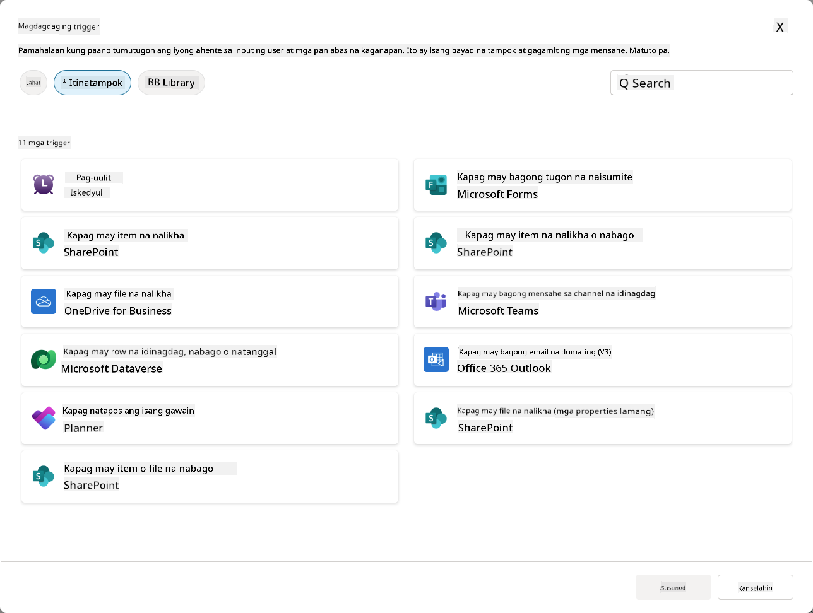

### Bakit mahalaga ang Event Triggers sa mga autonomous na agent

Ang event triggers ay nagbabago sa iyong agent mula sa pagiging reactive assistant patungo sa pagiging proactive, autonomous na helper:

1. **Autonomous na operasyon** - ang iyong agent ay maaaring magtrabaho 24/7 nang walang interbensyon ng tao, tumutugon sa mga event habang nangyayari ang mga ito.
    - *Halimbawa:* Awtomatikong batiin ang mga bagong miyembro ng team kapag sila ay idinagdag sa isang team.

1. **Real-time na responsiveness** - sa halip na maghintay para sa mga user na magtanong, ang iyong agent ay tumutugon kaagad sa mga kaugnay na event.
    - *Halimbawa*: Mag-alerto sa IT team kapag may binago sa SharePoint na dokumento.

1. **Workflow automation** - mag-chain ng maraming aksyon batay sa isang trigger event.
    - *Halimbawa:* Kapag may bagong support ticket na ginawa, gumawa ng task, mag-notify sa manager, at i-update ang tracking dashboard.

1. **Consistent na proseso** - tiyakin na ang mahahalagang hakbang ay hindi kailanman makaligtaan sa pamamagitan ng pag-automate ng mga tugon sa mga pangunahing event.
    - *Halimbawa:* Ang bawat bagong empleyado ay awtomatikong nakakakuha ng onboarding materials at access requests.

1. **Data-driven na aksyon** - gamitin ang impormasyon mula sa triggering event upang gumawa ng matalinong desisyon at magsagawa ng naaangkop na aksyon.
    - *Halimbawa:* I-route ang mga urgent ticket sa senior staff batay sa priority level sa trigger payload.

## ⚙️ Paano gumagana ang Event Triggers?

Ang event triggers ay gumagana sa pamamagitan ng isang three-step workflow na nagpapahintulot sa iyong agent na tumugon nang autonomously sa mga external na event:

### Ang trigger workflow

1. **Event Detection** - Isang partikular na event ang nangyayari sa isang konektadong sistema (SharePoint, Teams, Outlook, atbp.)
1. **Trigger Activation** - Ang event trigger ay nadedetect ang event na ito at nagpapadala ng payload sa iyong agent sa pamamagitan ng Power Automate Cloud Flow.
1. **Agent Response** - Ang iyong agent ay tumatanggap ng payload at isinasagawa ang mga instruksyon na iyong tinukoy.

### Event vs Topic triggers

Ang pag-unawa sa pagkakaiba ng dalawang uri ng trigger na ito ay mahalaga:

| **Event Triggers** | **Topic Triggers** |
|-------------------|-------------------|
| Na-activate ng mga external system events | Na-activate ng user input/phrases |
| Pinapagana ang autonomous na pag-uugali ng agent | Pinapagana ang conversational responses |
| Gumagamit ng authentication ng maker | May opsyon para sa authentication ng user |
| Tumakbo nang walang interaksyon ng user | Nangangailangan ng user para simulan ang pag-uusap |
| Mga Halimbawa: File na ginawa, email na natanggap | Halimbawa: "Ano ang lagay ng panahon?" |

## 📦 Pag-unawa sa trigger payloads

Kapag nangyari ang isang event, ang trigger ay nagpapadala ng **payload** sa iyong agent na naglalaman ng impormasyon tungkol sa event at mga instruksyon kung paano tumugon.

### Default vs custom payloads

Ang bawat uri ng trigger ay may default payload structure, ngunit maaari mo itong i-customize:

**Default payload** - Gumagamit ng standard na format tulad ng `Use content from {Body}`

- Naglalaman ng basic na impormasyon ng event
- Gumagamit ng generic na processing instructions
- Maganda para sa simpleng mga senaryo

**Custom payload** - Magdagdag ng partikular na instruksyon at data formatting

- Isama ang detalyadong direksyon para sa iyong agent
- Tukuyin kung anong data ang gagamitin at paano
- Mas maganda para sa mga kumplikadong workflow

### Agent instructions vs custom payload instructions

Mayroon kang dalawang lugar para gabayan ang pag-uugali ng iyong agent gamit ang event triggers:

**Agent Instructions** (Global)

- Malawak na gabay na naaangkop sa lahat ng triggers
- Halimbawa: "Kapag nagpoproseso ng mga ticket, laging i-check muna ang mga duplicate"
- Pinakamaganda para sa pangkalahatang pattern ng pag-uugali

**Payload Instructions** (Trigger-specific)

- Partikular na direksyon para sa indibidwal na uri ng trigger  
- Halimbawa: "Para sa update na ito sa SharePoint, magpadala ng summary sa project channel"
- Pinakamaganda para sa mga kumplikadong agent na may maraming triggers

💡 **Pro tip**: Iwasan ang conflicting na instruksyon sa pagitan ng dalawang antas na ito, dahil maaari itong magdulot ng hindi inaasahang pag-uugali.

## 🎯 Karaniwang mga senaryo ng Event Trigger

Narito ang mga praktikal na halimbawa kung paano mapapahusay ng event triggers ang iyong agent:

### IT Help Desk Agent

- **Trigger**: Bagong SharePoint list item (support ticket)
- **Action**: Awtomatikong i-categorize, i-assign ang priority, at i-notify ang mga tamang miyembro ng team

### Employee Onboarding Agent

- **Trigger**: Bagong user na idinagdag sa Dataverse
- **Action**: Magpadala ng welcome message, gumawa ng onboarding tasks, at mag-provision ng access

### Project Management Agent

- **Trigger**: Task na natapos sa Planner
- **Action**: I-update ang project dashboard, i-notify ang mga stakeholder, at mag-check para sa mga blockers

### Document Management Agent

- **Trigger**: File na na-upload sa partikular na SharePoint folder
- **Action**: I-extract ang metadata, mag-apply ng tags, at i-notify ang mga may-ari ng dokumento

### Meeting Assistant Agent

- **Trigger**: Calendar event na ginawa
- **Action**: Magpadala ng pre-meeting reminders at agenda, mag-book ng resources

## ⚠️ Mga konsiderasyon sa pag-publish at authentication

Bago magamit ng iyong agent ang event triggers sa production, kailangan mong maunawaan ang authentication at security implications.

### Maker authentication

Ang event triggers ay gumagamit ng **credentials ng tagalikha ng agent** para sa lahat ng authentication:

- Ang iyong agent ay nakakakuha ng access sa mga sistema gamit ang iyong mga permiso
- Ang mga user ay maaaring makakuha ng access sa data sa pamamagitan ng iyong credentials
- Ang lahat ng aksyon ay isinasagawa "bilang ikaw" kahit na ang mga user ay nakikipag-ugnayan sa agent

### Mga pinakamahusay na kasanayan sa proteksyon ng data

Upang mapanatili ang seguridad kapag nag-publish ng mga agent na may event triggers:

1. **Suriin ang access sa data** - I-review kung anong mga sistema at data ang maaaring ma-access ng iyong triggers
1. **Subukan nang mabuti** - Unawain kung anong impormasyon ang kasama sa payloads ng triggers
1. **Limitahan ang saklaw ng trigger** - Gumamit ng partikular na mga parameter upang limitahan kung anong mga event ang nag-a-activate ng triggers
1. **I-review ang data ng payload** - Tiyakin na ang triggers ay hindi naglalantad ng sensitibong impormasyon
1. **I-monitor ang paggamit** - Subaybayan ang aktibidad ng trigger at paggamit ng resources

## ⚠️ Troubleshooting at mga limitasyon

Tandaan ang mga mahalagang konsiderasyon na ito kapag nagtatrabaho sa event triggers:

### Epekto sa quota at billing

- Ang bawat trigger activation ay binibilang sa iyong message consumption
- Ang madalas na triggers (tulad ng bawat-minutong recurrence) ay maaaring mabilis na maubos ang quota
- I-monitor ang paggamit upang maiwasan ang throttling

### Mga teknikal na kinakailangan

- Available lamang para sa mga agent na may generative orchestration na naka-enable
- Nangangailangan ng solution-aware cloud flow sharing na naka-enable sa iyong environment

### Data Loss Prevention (DLP)

- Ang mga patakaran ng DLP ng iyong organisasyon ang magtatakda kung aling triggers ang available
- Maaaring i-block ng mga administrator ang event triggers nang buo
- Makipag-ugnayan sa iyong admin kung ang mga inaasahang triggers ay hindi available

## 🧪 Lab 10 - Magdagdag ng Event Triggers para sa autonomous na pag-uugali ng agent

### 🎯 Use case

Papalawakin mo ang iyong IT Help Desk agent upang awtomatikong tumugon sa mga bagong support requests. Kapag may gumawa ng bagong item sa iyong SharePoint support tickets list, ang iyong agent ay:

1. Mag-trigger nang autonomously kapag ang SharePoint ticket ay ginawa
1. Magbigay ng mga detalye ng ticket at mga instruksyon sa mga hakbang na nais mong isagawa nito
1. Awtomatikong mag-acknowledge ng ticket sa nag-submit sa pamamagitan ng AI generated email

Ipinapakita ng lab na ito kung paano pinapagana ng event triggers ang tunay na autonomous na pag-uugali ng agent.

### Mga Prerequisites

Bago simulan ang lab na ito, tiyakin na mayroon ka:

- ✅ Natapos ang mga nakaraang lab (lalo na ang Lab 6-8 para sa IT Help Desk agent)
- ✅ Access sa SharePoint site na may IT support tickets list
- ✅ Copilot Studio environment na may event triggers na naka-enable
- ✅ Ang iyong agent ay may generative orchestration na naka-enable
- ✅ Angkop na mga permiso sa SharePoint at iyong Copilot Studio environment

### 10.1 Paganahin ang Generative AI at gumawa ng SharePoint item creation trigger

1. Buksan ang iyong **IT Help Desk agent** sa **Copilot Studio**

1. Una, tiyakin na ang **Generative AI** ay naka-enable para sa iyong agent:
   - Pumunta sa **Overview** tab
   - Sa ilalim ng Orchestration section, I-toggle ang **Generative orchestration** sa **On** kung hindi pa ito naka-enable  
     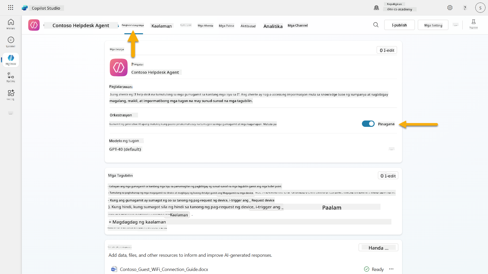

1. Pumunta sa **Overview** tab at hanapin ang **Triggers** section

1. I-click ang **+ Add trigger** upang buksan ang trigger library  
    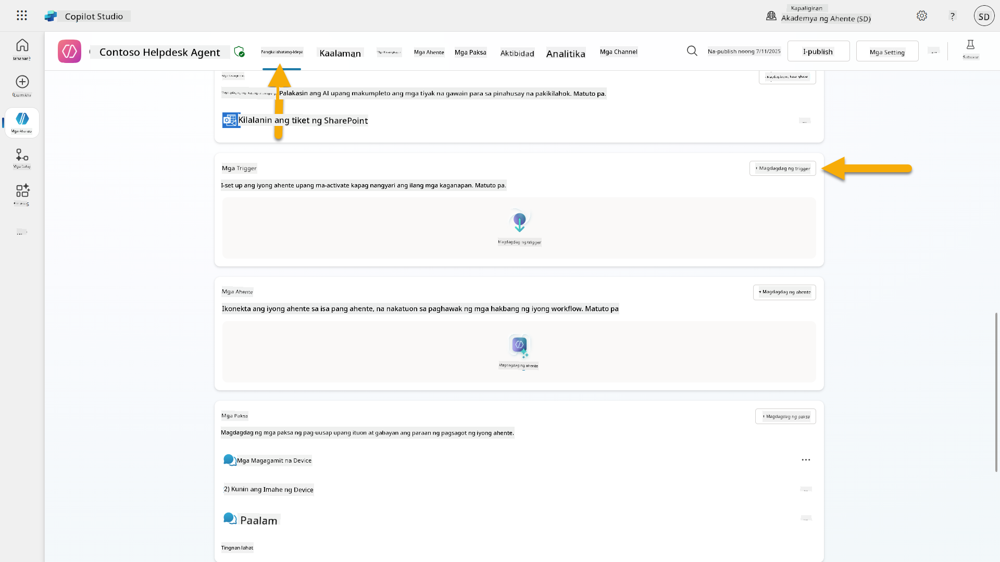

1. Hanapin at piliin ang **When an item is created** (SharePoint)  
    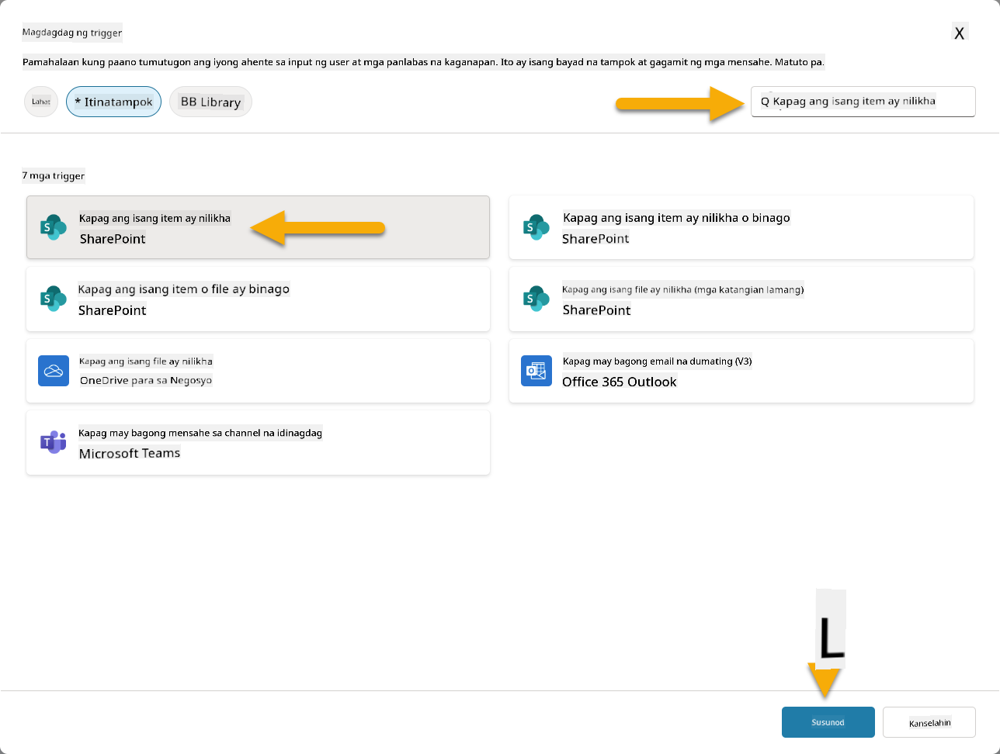

1. I-configure ang trigger name at connections:

   - **Trigger name:** New Support Ticket Created in SharePoint

1. Hintayin ang connections na ma-configure, at piliin ang **Next** upang magpatuloy.  
   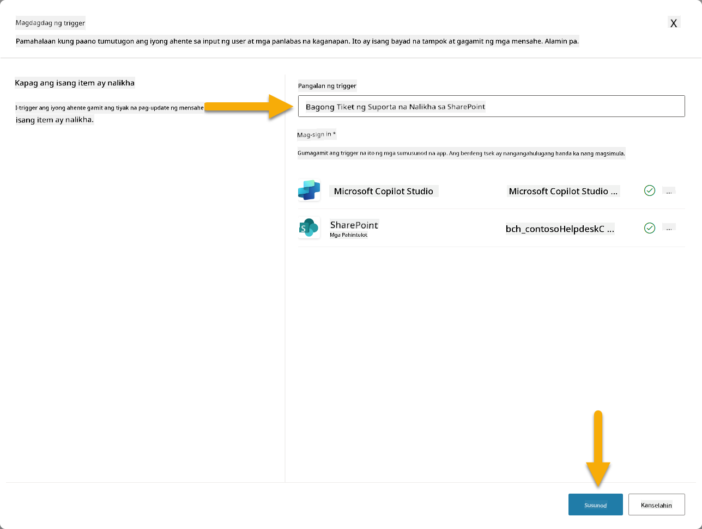

1. I-configure ang trigger parameters:

   - **Site Address**: Piliin ang iyong "Contoso IT" SharePoint site

   - **List Name**: Piliin ang iyong "Tickets" list

   - **Karagdagang instruksyon sa agent kapag na-trigger ito:**

     ```text
     New Support Ticket Created in SharePoint: {Body}
     
     Use the 'Acknowledge SharePoint Ticket' tool to generate the email body automatically and respond.
     
     IMPORTANT: Do not wait for any user input. Work completely autonomously.
     ```

     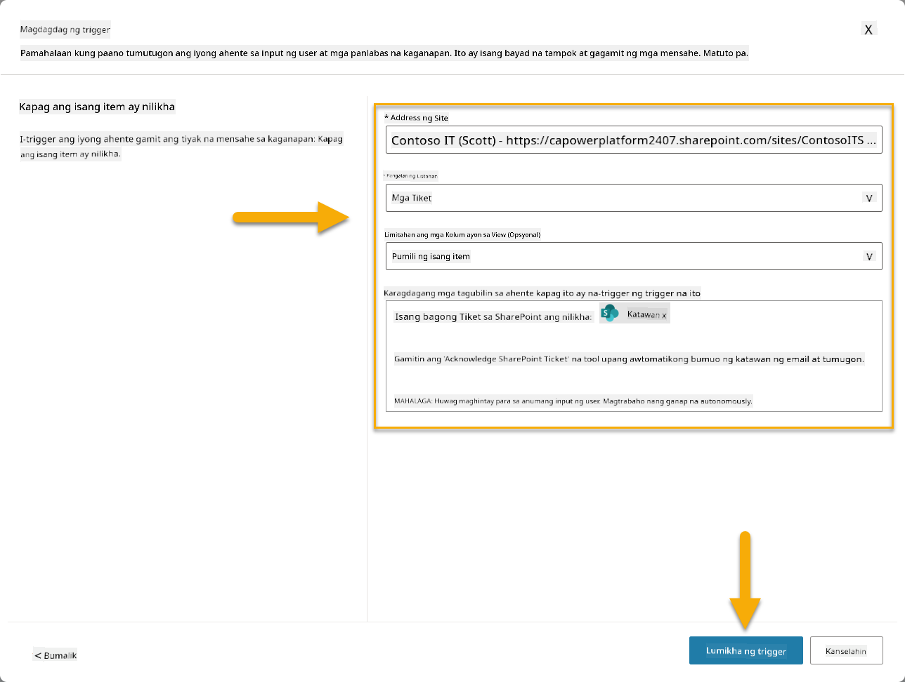

1. Piliin ang **Create trigger** upang tapusin ang trigger creation. Awtomatikong gagawa ng Power Automate Cloud Flow upang i-trigger ang agent nang autonomously.

1. Piliin ang **Close**.

### 10.2 I-edit ang Trigger

1. Sa loob ng **Triggers** section ng **Overview** tab, Piliin ang **...** menu sa **New Support Ticket Created in SharePoint** trigger

1. Piliin ang **Edit in Power Automate**  
   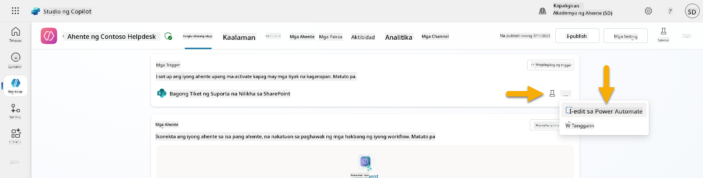

1. Piliin ang **Sends a prompt to the specified copilot for processing** node

1. Sa **Body/message** field, alisin ang Body content, **pindutin ang forward slash key** (/) at piliin ang **Insert Expression**  
   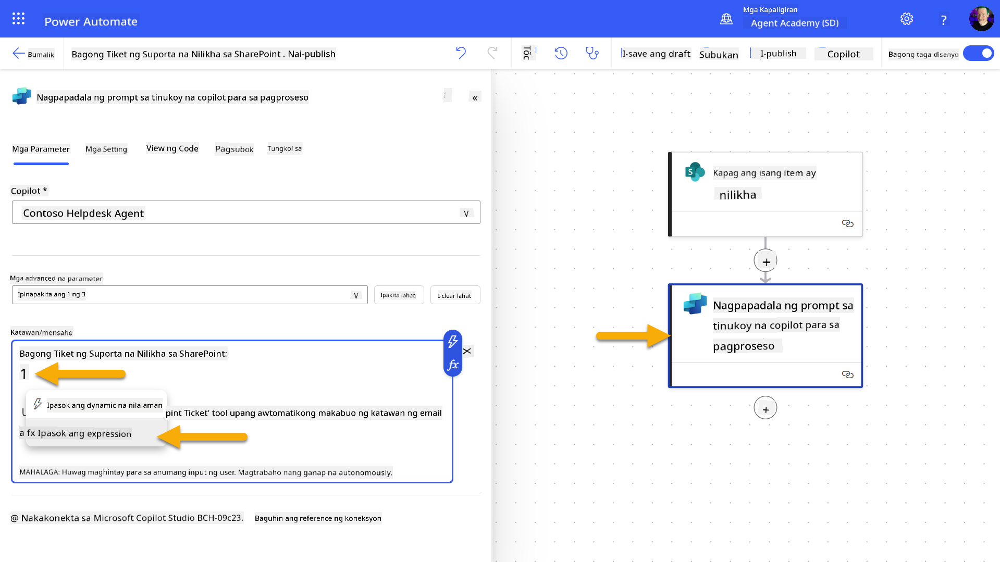

1. Ipasok ang sumusunod na expression upang magbigay ng partikular na detalye tungkol sa ticket:

    ```text
    concat('Submitted By Name: ', first(triggerOutputs()?['body/value'])?['Author/DisplayName'], '\nSubmitted By Email: ', first(triggerOutputs()?['body/value'])?['Author/Email'], '\nTitle: ', first(triggerOutputs()?['body/value'])?['Title'], '\nIssue Description: ', first(triggerOutputs()?['body/value'])?['Description'], '\nPriority: ', first(triggerOutputs()?['body/value'])?['Priority/Value'],'\nTicket ID : ', first(triggerOutputs()?['body/value'])?['ID'])
    ```

1. Piliin ang **Add**  
   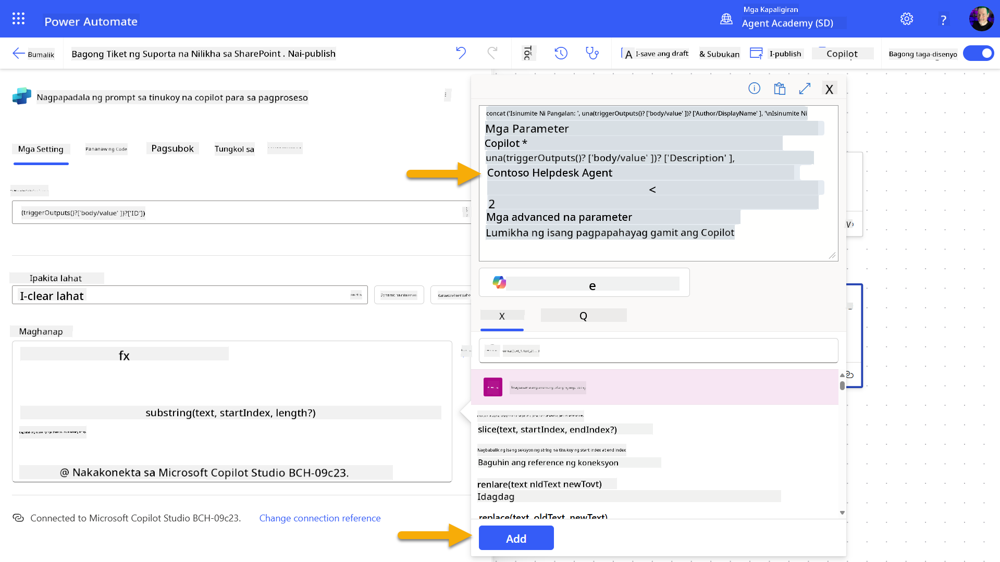

1. Piliin ang **Publish** sa top right toolbar.

### 10.3 Gumawa ng tool para sa email acknowledgment

1. **Bumalik** sa iyong Agent sa Copilot Studio

1. Pumunta sa **Tools** tab ng iyong agent

1. I-click ang **+ Add a tool** at piliin ang **Connector**

1. Hanapin at piliin ang **Send an email (V2)** connector  
    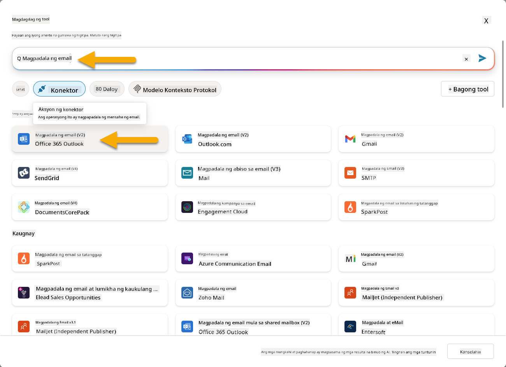

1. Hintayin ang connection na ma-configure, at pagkatapos piliin ang **Add and configure**

1. I-configure ang tool settings:

   - **Name**: Acknowledge SharePoint ticket
   - **Description**: Ang tool na ito ay nagpapadala ng email acknowledgment na natanggap ang isang ticket.

1. Piliin ang **Customize** sa tabi ng input parameters at i-configure ang mga sumusunod:

    **To**:

    - **Description**: Ang email address ng taong nag-submit ng SharePoint Ticket
    - **Identify as**: Email

    **Body**:

    - **Description**: Isang acknowledgment na natanggap ang Ticket, at layunin naming tumugon sa loob ng 3 working days.

    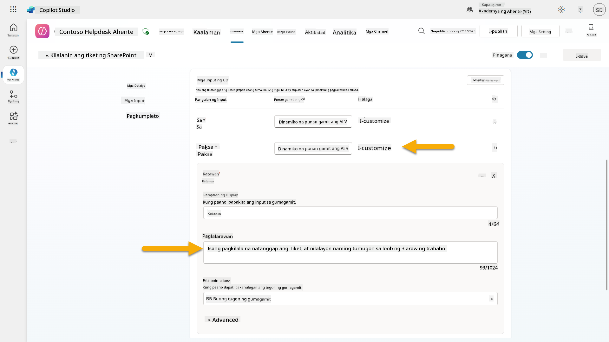

1. Piliin ang **Save**

### 10.4 Subukan ang trigger

1. Sa loob ng iyong **Help Desk Agent**, piliin ang **Overview** tab
1. I-click ang **Test Trigger** icon sa tabi ng **New Support Ticket Created in SharePoint** trigger. Maglo-load ito ng **Test your trigger** window.
1. Buksan ang bagong tab sa browser at pumunta sa iyong **SharePoint IT Support Tickets list**  
1. I-click ang **+ Magdagdag ng bagong item** upang gumawa ng test ticket:  
   - **Pamagat**: "Hindi makakonekta sa VPN"  
   - **Deskripsyon**: "Hindi makakonekta sa corporate WIFI network pagkatapos ng kamakailang update"  
   - **Prayoridad**: "Normal"  

1. **I-save** ang SharePoint item  
    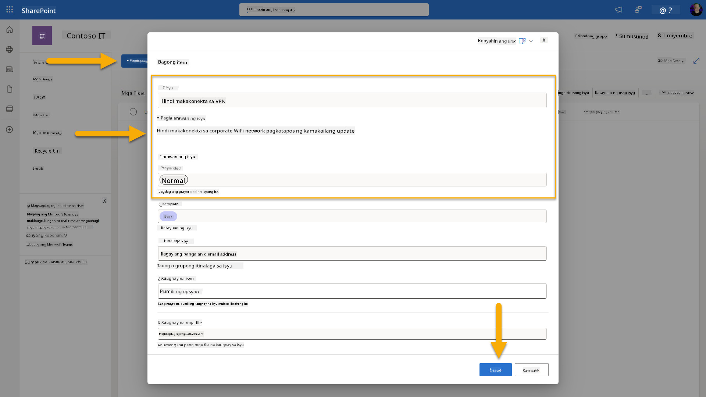  
1. Bumalik sa **Copilot Studio** at i-monitor ang **Test your trigger** panel para sa activation ng trigger. Gamitin ang **Refresh** icon upang i-load ang trigger event, maaaring tumagal ito ng ilang minuto.  
    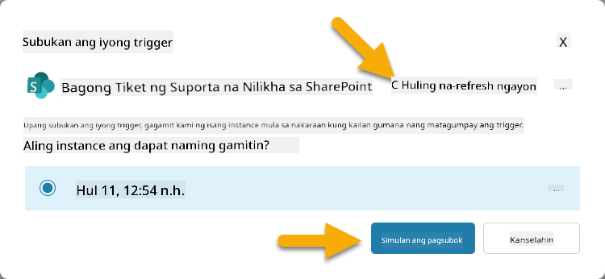  
1. Kapag lumitaw na ang trigger, piliin ang **Simulan ang testing**  
1. Piliin ang **Activity Map icon** sa itaas ng **Test your agent** panel  
1. Siguraduhing ang iyong agent:  
   - Natanggap ang trigger payload  
   - Tinawag ang "Acknowledge SharePoint ticket" tool  
     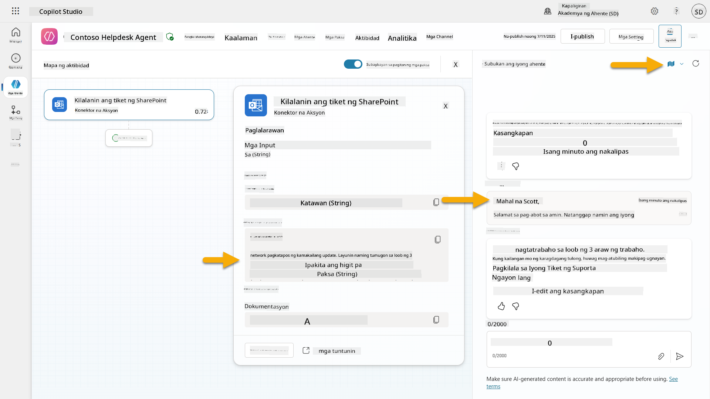  
1. Suriin ang email inbox ng nag-submit upang kumpirmahin na naipadala ang acknowledgment email  
    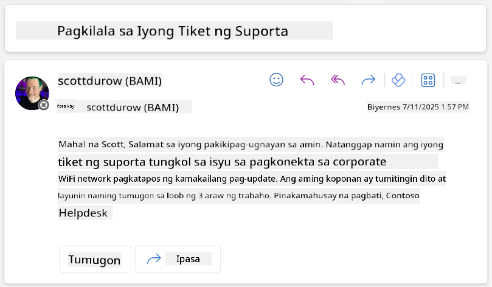  
1. I-review ang **Activity** tab sa Copilot Studio upang makita ang kumpletong trigger at tool execution  

## ✅ Misyon Kumpleto  

🎉 **Binabati kita!** Matagumpay mong naipatupad ang event triggers gamit ang connector tools na nagbibigay-daan sa iyong agent na gumana nang autonomously, awtomatikong nagpapadala ng email acknowledgments at nagpoproseso ng support tickets nang walang interbensyon ng user. Kapag na-publish na ang iyong agent, gagana ito nang autonomously para sa iyo.  

🚀 **Susunod**: Sa ating susunod na aralin, matututunan mo kung paano [i-publish ang iyong agent](../11-publish-your-agent/README.md) sa Microsoft Teams at Microsoft 365 Copilot, upang magamit ito ng buong organisasyon mo!  

⏭️ [Pumunta sa aralin ng **Publish your agent**](../11-publish-your-agent/README.md)  

## 📚 Mga Taktikal na Resources  

Handa ka na bang mas palalimin ang kaalaman sa event triggers at autonomous agents? Tingnan ang mga resources na ito:  

- **Microsoft Learn**: [Gawing autonomous ang iyong agent sa Copilot Studio](https://learn.microsoft.com/training/modules/autonomous-agents-online-workshop/?WT.mc_id=power-177340-scottdurow)  
- **Dokumentasyon**: [Magdagdag ng event trigger](https://learn.microsoft.com/microsoft-copilot-studio/authoring-trigger-event?WT.mc_id=power-177340-scottdurow)  
- **Mga Best Practices**: [Panimula sa Power Automate triggers](https://learn.microsoft.com/power-automate/triggers-introduction?WT.mc_id=power-177340-scottdurow)  
- **Mga Advanced na Scenario**: [Paggamit ng Power Automate flows kasama ang agents](https://learn.microsoft.com/microsoft-copilot-studio/advanced-flow-create?WT.mc_id=power-177340-scottdurow)  
- **Seguridad**: [Data loss prevention para sa Copilot Studio](https://learn.microsoft.com/microsoft-copilot-studio/admin-data-loss-prevention?WT.mc_id=power-177340-scottdurow)  

<!-- markdownlint-disable-next-line MD033 -->
  

---

**Paunawa**:  
Ang dokumentong ito ay isinalin gamit ang AI translation service na [Co-op Translator](https://github.com/Azure/co-op-translator). Bagama't sinisikap naming maging tumpak, mangyaring tandaan na ang mga awtomatikong pagsasalin ay maaaring maglaman ng mga pagkakamali o hindi pagkakatugma. Ang orihinal na dokumento sa kanyang katutubong wika ang dapat ituring na opisyal na pinagmulan. Para sa mahalagang impormasyon, inirerekomenda ang propesyonal na pagsasalin ng tao. Hindi kami mananagot sa anumang hindi pagkakaunawaan o maling interpretasyon na dulot ng paggamit ng pagsasaling ito.