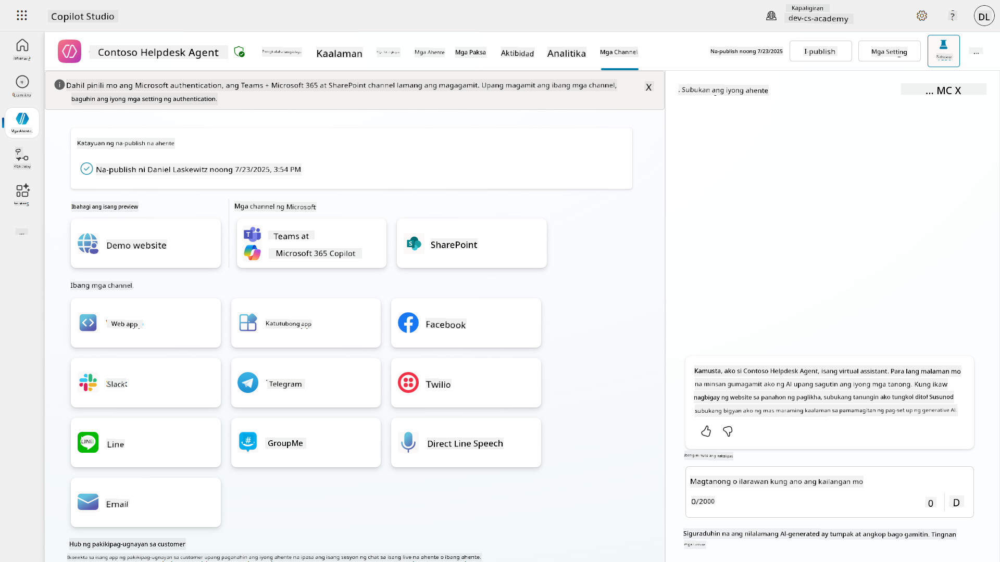

<!--
CO_OP_TRANSLATOR_METADATA:
{
  "original_hash": "9dceeba2eae2bb73e328602a060eddab",
  "translation_date": "2025-10-22T19:48:49+00:00",
  "source_file": "docs/recruit/11-publish-your-agent/README.md",
  "language_code": "tl"
}
-->
# 🚨 Misyon 11: I-publish ang Iyong Ahente

## 🕵️‍♂️ CODENAME: `OPERASYON PUBLISH PUBLISH PUBLISH`

> **⏱️ Oras ng Operasyon:** `~30 minuto`  

🎥 **Panoorin ang Walkthrough**

## 🎯 Misyon Brief

Matapos makumpleto ang serye ng mahihirap na modules, Agent Maker, handa ka na para sa pinakamahalagang hakbang: ang pag-publish ng iyong ahente. Panahon na para gawing available ang iyong nilikha sa mga user sa Microsoft Teams at Microsoft 365 Copilot.

Ang iyong ahente—na may malinaw na misyon, makapangyarihang tools, at access sa mahahalagang kaalaman—ay handa nang maglingkod. Sa paggamit ng Microsoft Copilot Studio, maide-deploy mo ang iyong ahente upang magsimulang tumulong sa mga tunay na user, kung saan sila nagtatrabaho.

Ilunsad na ang iyong ahente sa aksyon.

## 🔎 Mga Layunin

📖 Saklaw ng araling ito:

1. Bakit mahalaga ang pag-publish ng iyong ahente
1. Ano ang nangyayari kapag na-publish ang iyong ahente
1. Paano magdagdag ng channel (Microsoft Teams & Microsoft 365 Copilot)
1. Paano idagdag ang ahente sa Microsoft Teams
1. Paano gawing available ang ahente sa Microsoft Teams para sa buong organisasyon

## 🚀 I-publish ang isang ahente

Tuwing nagtatrabaho ka sa isang ahente sa Copilot Studio, maaaring i-update mo ito sa pamamagitan ng pagdaragdag ng kaalaman o tools. Kapag handa ka na sa lahat ng pagbabago, at nasubukan mo nang mabuti, handa ka nang i-publish ito. Ang pag-publish ay nagsisiguro na ang pinakabagong updates ay live. Kapag in-update mo ang iyong ahente ng bagong tools, ngunit hindi mo pinindot ang publish button, hindi pa ito available para sa mga end user.

Siguraduhing palaging pindutin ang publish button kapag nais mong i-push ang updates sa mga user ng iyong ahente. Ang iyong ahente ay maaaring may mga channel na idinagdag dito, at kapag pinindot mo ang publish, ang mga updates ay magiging available sa lahat ng channel na idinagdag mo sa ahente.

## ⚙️ I-configure ang mga channel

Ang mga channel ang nagtatakda kung saan maaaring ma-access at makipag-ugnayan ang mga user sa iyong ahente. Pagkatapos mong i-publish ang iyong ahente, maaari mo itong gawing available sa maraming channel. Ang bawat channel ay maaaring magpakita ng nilalaman ng iyong ahente nang iba.

Maaari mong idagdag ang iyong ahente sa mga sumusunod na channel:

- **Microsoft Teams at Microsoft 365 Copilot** - Gawing available ang iyong ahente sa Teams chats at meetings, at sa loob ng Microsoft 365 Copilot experiences ([Matuto pa](https://learn.microsoft.com/microsoft-copilot-studio/publication-add-bot-to-microsoft-teams))
- **Demo website** - Subukan ang iyong ahente sa demo website na ibinigay ng Copilot Studio ([Matuto pa](https://learn.microsoft.com/microsoft-copilot-studio/publication-connect-bot-to-web-channels))
- **Custom website** - I-embed ang iyong ahente nang direkta sa iyong sariling website ([Matuto pa](https://learn.microsoft.com/microsoft-copilot-studio/publication-connect-bot-to-web-channels))
- **Mobile app** - I-integrate ang iyong ahente sa custom mobile application ([Matuto pa](https://learn.microsoft.com/microsoft-copilot-studio/publication-connect-bot-to-custom-application))
- **SharePoint** - Idagdag ang iyong ahente sa SharePoint sites para sa tulong sa dokumento at site ([Matuto pa](https://learn.microsoft.com/microsoft-copilot-studio/publication-add-bot-to-sharepoint))
- **Facebook Messenger** - Kumonekta sa mga user sa pamamagitan ng messaging platform ng Facebook ([Matuto pa](https://learn.microsoft.com/microsoft-copilot-studio/publication-add-bot-to-facebook))
- **Power Pages** - I-integrate ang iyong ahente sa Power Pages websites ([Matuto pa](https://learn.microsoft.com/microsoft-copilot-studio/publication-add-bot-to-power-pages))
- **Azure Bot Service channels** - Ma-access ang karagdagang channels kabilang ang Slack, Telegram, Twilio SMS, at iba pa ([Matuto pa](https://learn.microsoft.com/microsoft-copilot-studio/publication-connect-bot-to-azure-bot-service-channels))

Para magdagdag ng channel, pumunta sa **Channels** tab sa iyong ahente at piliin ang channel na nais mong i-configure. Ang bawat channel ay may partikular na mga kinakailangan sa setup at maaaring mangailangan ng karagdagang authentication o configuration steps.

## 📺 Mga karanasan sa channel

Ang iba't ibang channel ay may iba't ibang karanasan para sa user. Kapag gumagawa ng ahente para sa maraming channel, siguraduhing alam mo ang mga pagkakaiba sa bawat channel. Palaging magandang estratehiya ang subukan ang iyong ahente sa maraming channel upang makita kung talagang ginagawa nito ang iyong nilalayon.

| Karanasan                        | Website       | Teams at Microsoft 365 Copilot         | Facebook                 | Dynamics Omnichannel para sa Customer Service                   |
| --------------------------------- | ------------- | --------------------------------------- | ------------------------ | ----------------------------------------------------------- |
| [Customer satisfaction survey][1] | Adaptive card | Text-only                               | Text-only                | Text-only                                                   |
| [Multiple-choice options][1]      | Supported     | [Supported hanggang anim (bilang hero card)][4] | [Supported hanggang 13][6]  | [Partially Supported][8]                                    |
| [Markdown][2]                     | Supported     | [Partially Supported][5]                | [Partially supported][7] | [Partially Supported][9]                                    |
| [Welcome message][1]              | Supported     | Supported                               | Not supported            | Supported para sa [Chat][10]. Hindi supported para sa ibang channels. |
| [Did-You-Mean][3]                 | Supported     | Supported                               | Supported                | Supported para sa [Microsoft Teams][11], [Chat][10], Facebook, at text-only channels (short message service (SMS) via [TeleSign][12] at [Twilio][13], [WhatsApp][14], [WeChat][15], at [Twitter][16]). Ang mga suggested actions ay ipinapakita bilang text-only list; kailangang i-retype ng user ang isang opsyon para tumugon. |

[1]: https://learn.microsoft.com/microsoft-copilot-studio/authoring-create-edit-topics
[2]: https://daringfireball.net/projects/markdown/
[3]: https://learn.microsoft.com/microsoft-copilot-studio/advanced-ai-features
[4]: https://learn.microsoft.com/microsoftteams/platform/concepts/cards/cards-reference#hero-card
[5]: https://learn.microsoft.com/microsoftteams/platform/bots/how-to/format-your-bot-messages#text-only-messages
[6]: https://developers.facebook.com/docs/messenger-platform/send-messages/quick-replies/
[7]: https://www.facebook.com/help/147348452522644?helpref=related
[8]: https://learn.microsoft.com/dynamics365/customer-service/asynchronous-channels#suggested-actions-support
[9]: https://learn.microsoft.com/dynamics365/customer-service/asynchronous-channels#preview-support-for-formatted-messages
[10]: https://learn.microsoft.com/dynamics365/customer-service/set-up-chat-widget
[11]: https://learn.microsoft.com/dynamics365/customer-service/configure-microsoft-teams
[12]: https://learn.microsoft.com/dynamics365/customer-service/configure-sms-channel
[13]: https://learn.microsoft.com/dynamics365/customer-service/configure-sms-channel-twilio
[14]: https://learn.microsoft.com/dynamics365/customer-service/configure-whatsapp-channel
[15]: https://learn.microsoft.com/dynamics365/customer-service/configure-wechat-channel
[16]: https://learn.microsoft.com/dynamics365/customer-service/configure-twitter-channel

> [!NOTE]
> May ilang halimbawa kung saan maaari kang gumamit ng iba't ibang logic para sa iba't ibang channel. Isang halimbawa nito ay matatagpuan sa Power Platform Snippets repository:
>
> Ibinahagi ni Henry Jammes ang isang halimbawa kung paano magpakita ng ibang adaptive card kapag ang channel ay Microsoft Teams. ([Link sa halimbawa](https://github.com/pnp/powerplatform-snippets/blob/main/copilot-studio/multiple-topics-matched-topic/source/multiple-topics-matched.yaml#L40))

## 🧪 Lab 11: I-publish ang iyong ahente sa Teams at Microsoft 365 Copilot

### 🎯 Gamit

Ang iyong Contoso IT Help Desk agent ay ganap nang naka-configure na may makapangyarihang kakayahan—maaari nitong ma-access ang SharePoint knowledge sources, gumawa ng support tickets, magpadala ng proactive notifications, at tumugon nang matalino sa mga tanong ng user. Gayunpaman, ang lahat ng mga feature na ito ay kasalukuyang available lamang sa development environment kung saan mo ito ginawa.

**Ang Hamon:** Hindi makikinabang ang mga end user sa kakayahan ng iyong ahente hangga't hindi ito maayos na na-publish at nagawang accessible sa mga channel kung saan sila aktwal na nagtatrabaho.

**Ang Solusyon:** Ang pag-publish ng iyong ahente ay nagsisiguro na ang pinakabagong bersyon—kasama ang lahat ng iyong kamakailang updates, bagong topics, pinahusay na knowledge sources, at configured flows—ay available sa mga tunay na user. Kung hindi na-publish, ang mga user ay makikipag-ugnayan pa rin sa mas lumang bersyon ng iyong ahente na maaaring kulang sa mahahalagang functionality.

Ang pagdaragdag ng Teams at Microsoft 365 Copilot channel ay mahalaga dahil:

- **Teams Integration**: Ang mga empleyado ng iyong organisasyon ay gumugugol ng karamihan ng kanilang araw sa Microsoft Teams para sa pakikipagtulungan, mga pulong, at komunikasyon. Sa pamamagitan ng pagdaragdag ng iyong ahente sa Teams, makakakuha ang mga user ng IT support nang hindi umaalis sa kanilang pangunahing work environment.

- **Microsoft 365 Copilot**: Maaaring ma-access ng mga user ang iyong espesyal na IT help desk agent nang direkta sa loob ng kanilang Microsoft 365 Copilot experience, na ginagawang seamless ang integration nito sa kanilang pang-araw-araw na workflow sa mga Office application.

- **Centralized Access**: Sa halip na alalahanin ang magkakahiwalay na websites o applications, maaaring ma-access ng mga user ang IT support sa pamamagitan ng mga platform na ginagamit na nila, na nagpapababa ng friction at nagpapataas ng adoption.

Ang misyon na ito ay nagta-transform ng iyong development work sa isang production-ready solution na nagbibigay ng tunay na halaga sa mga end user ng iyong organisasyon.

### Mga Kinakailangan

Bago simulan ang lab na ito, tiyaking mayroon ka:

- ✅ Nakumpleto ang mga nakaraang lab at may ganap na naka-configure na Contoso Helpdesk Agent
- ✅ Nasubukan ang iyong ahente at handa na para sa production use
- ✅ Mga permiso sa iyong Copilot Studio environment para mag-publish ng mga ahente
- ✅ Access sa Microsoft Teams sa iyong organisasyon

### 11.1 I-publish ang iyong ahente

Ngayon na tapos na ang lahat ng ating trabaho sa ahente, kailangan nating tiyakin na ang lahat ng ating ginawa ay available para sa mga end user na gagamit ng ating ahente. Para matiyak na ang nilalaman ay available para sa lahat ng user, kailangan nating i-publish ang ating ahente.

1. Pumunta sa Contoso Helpdesk Agent sa Copilot Studio (sa pamamagitan ng [Copilot Studio maker portal](https://copilotstudio.microsoft.com))

    Sa Copilot Studio, madali lang i-publish ang iyong ahente. Pindutin lamang ang publish button sa itaas ng agent overview.

    

1. Piliin ang **Publish** button sa iyong ahente

    Magbubukas ito ng publish pop-up - upang kumpirmahin na nais mo talagang i-publish ang iyong ahente.

    

1. Piliin ang **Publish** upang kumpirmahin ang pag-publish ng iyong ahente

    Ngayon ay magpapakita ng mensahe na ang iyong ahente ay na-publish. Hindi mo kailangang panatilihing bukas ang popup na iyon. Makakatanggap ka ng abiso kapag na-publish na ang ahente.

    

    Kapag tapos na ang pag-publish ng ahente, makikita mo ang abiso sa itaas ng agent page.

    

Ngunit - na-publish lang natin ang ahente, hindi pa natin ito idinagdag sa isang channel, kaya ayusin natin ito ngayon!

### 11.2 Idagdag ang Teams at Microsoft 365 Copilot channel

1. Para idagdag ang Teams at Microsoft 365 Copilot channel sa ating ahente, kailangan nating piliin ang **Channel** sa itaas na navigation ng ahente

    

    Dito makikita natin ang lahat ng channel na maaari nating idagdag sa ahente.

1. Piliin ang **Teams at Microsoft 365**

    

1. Piliin ang **Add channel** upang makumpleto ang wizard at idagdag ang channel sa ahente

    

    Maghihintay ng kaunti hanggang sa ito ay maidagdag. Pagkatapos maidagdag, lilitaw ang berdeng abiso sa itaas ng sidebar.

    

1. Piliin ang **See agent in Teams** upang magbukas ng bagong tab

    

1. Piliin ang **Add** upang idagdag ang Contoso Helpdesk Agent sa Teams

    

    Maghihintay ng kaunti. Pagkatapos, dapat itong magpakita ng sumusunod na screen:

    

1. Piliin ang **Open** upang buksan ang ahente sa Teams

    Bubuksan nito ang ahente sa Teams bilang isang Teams app

    

Ngayon ay na-publish na natin ang ahente upang gumana para sa iyo sa Microsoft Teams, ngunit maaaring nais mong gawing available ito para sa mas maraming tao.

### 11.3 Gawing available ang ahente para sa lahat ng user sa tenant

1. Isara ang browser tab kung saan nakabukas ang Contoso Helpdesk Agent

    Dapat kang bumalik sa Copilot Studio kung saan ang Teams at Microsoft 365 Copilot side panel ay bukas pa rin. Binuksan lang natin ang ahente sa Teams ngayon, ngunit marami pa tayong magagawa dito. Maaari nating i-edit ang mga detalye ng ahente, i-deploy ang ahente sa mas maraming user, at marami pa.

1. Piliin ang **Edit details**

    
Ito ay magbubukas ng pane kung saan maaari nating baguhin ang iba't ibang detalye at mga setting ng agent. Maaari nating baguhin ang mga pangunahing detalye tulad ng icon, ang kulay ng background ng icon, at ang mga deskripsyon. Maaari rin nating baguhin ang mga setting ng Teams (halimbawa, pahintulutan ang isang user na idagdag ang agent sa isang team, o pahintulutan ang paggamit ng agent na ito sa group at meeting chats) dito. Kapag pinili mo ang *more*, maaari mo ring baguhin ang mga detalye ng developer tulad ng pangalan ng developer, ang website, ang privacy statement, at ang terms of use.

1. Piliin ang **Cancel** upang isara ang Edit details pane.

1. Piliin ang **Availability options**.

Ito ay magbubukas ng availability options pane, kung saan maaari kang mag-copy ng link upang ipadala sa mga user para magamit ang agent na ito (tandaan, kailangan mo ring i-share ang agent sa user) at maaari kang mag-download ng file upang idagdag ang iyong agent sa Microsoft Teams o Microsoft 365 store. Upang maipakita ang agent sa store, mayroon kang iba pang mga opsyon: maaari mo itong ipakita sa iyong mga kasamahan at mga shared users (upang maipakita sa seksyong *Built with Power Platform*) o maaari mo itong ipakita sa lahat sa iyong organisasyon (kailangan ng pag-apruba ng administrator).

1. Piliin ang **Show to everyone in my org**.

1. Piliin ang **Submit for admin approval**.

Ngayon, kailangang aprubahan ng iyong administrator ang submission ng iyong agent. Magagawa nila ito sa pamamagitan ng pagpunta sa Teams Admin Center at hanapin ang Contoso Helpdesk Agent sa Apps. Sa screenshot, makikita mo kung ano ang makikita ng administrator sa Teams Admin Center.

Kailangang piliin ng administrator ang Contoso Helpdesk Agent at piliin ang *Publish* upang ma-publish ang Contoso Helpdesk Agent sa lahat.

Kapag na-publish na ng administrator ang submission ng agent, maaari mong i-refresh ang Copilot Studio at makikita mo ang *available in app store* banner sa availability options.

Mayroon pang mas maraming posibilidad dito. Ang iyong admin ay maaaring baguhin ang global setup policy at awtomatikong i-install ang Contoso Helpdesk Agent para sa lahat sa tenant. Bukod pa rito, maaari mong i-pin ang Contoso Helpdesk Agent sa kaliwang bahagi ng rail upang madali itong ma-access ng lahat.

## ✅ Misyon Kumpleto

🎉 **Binabati kita!** Matagumpay mong na-publish ang iyong agent at naidagdag ito sa Teams at Microsoft 365 Copilot! Ang susunod na misyon ay ang huling bahagi ng kurso: Pag-unawa sa licensing.

⏭️ [Pumunta sa **Pag-unawa sa licensing** na aralin](../12-understanding-licensing/README.md)

## 📚 Mga Taktikal na Resources

🔗 [Dokumentasyon ng publish channels](https://learn.microsoft.com/microsoft-copilot-studio/publication-fundamentals-publish-channels)

---

**Paunawa**:  
Ang dokumentong ito ay isinalin gamit ang AI translation service na [Co-op Translator](https://github.com/Azure/co-op-translator). Bagama't sinisikap naming maging tumpak, mangyaring tandaan na ang mga awtomatikong pagsasalin ay maaaring maglaman ng mga pagkakamali o hindi pagkakatugma. Ang orihinal na dokumento sa kanyang katutubong wika ang dapat ituring na awtoritatibong pinagmulan. Para sa mahalagang impormasyon, inirerekomenda ang propesyonal na pagsasalin ng tao. Hindi kami mananagot sa anumang hindi pagkakaunawaan o maling interpretasyon na dulot ng paggamit ng pagsasaling ito.