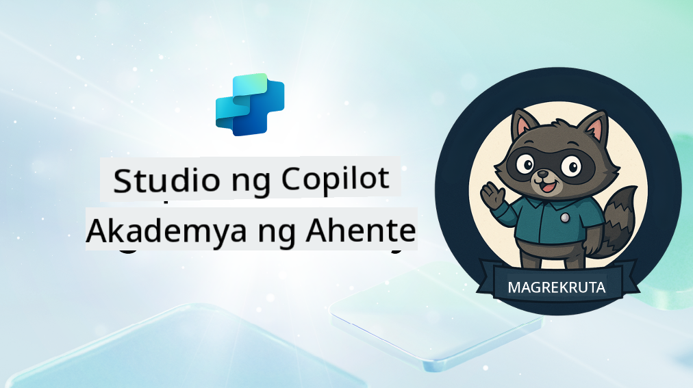

<!--
CO_OP_TRANSLATOR_METADATA:
{
  "original_hash": "8b5ecad9d5d073ea3f4c2b844e80f2e5",
  "translation_date": "2025-10-22T19:19:48+00:00",
  "source_file": "docs/recruit/README.md",
  "language_code": "tl"
}
-->
# Maligayang Pagdating Rekruto

**Maligayang pagdating, Rekruto.**  
Ang iyong misyon—kung pipiliin mong tanggapin ito—ay ang matutunan ang sining ng paggawa ng mga ahente gamit ang **Microsoft Copilot Studio**.

Ang praktikal na pagsasanay na ito ang iyong unang hakbang sa **mundo ng mga ahente**: mula sa mga grounded prompts hanggang sa Adaptive Cards at agent flows, matutunan mong gumawa, mag-scale, at mag-deploy ng mga intelligent agents gamit ang mga tunay na tools at use cases.

---

## 🎯 Layunin ng Misyon

Sa pagtatapos ng Agent Academy, magagawa mong:

- Maunawaan kung ano ang mga ahente sa konteksto ng Microsoft Copilot Studio
- Tuklasin kung paano nagsasama-sama ang Large Language Models (LLMs), retrieval-augmented generation (RAG), at orchestration sa isang ahente
- Gumawa ng parehong **declarative** at **custom agents**
- Pagandahin ang mga ahente gamit ang **Topics**, **Adaptive Cards**, at **Agent Flows**
- I-deploy ang mga ahente sa **Microsoft Teams** at **Microsoft 365 Copilot**

---

## 🧪 Mga Kinakailangan

Upang makumpleto ang lahat ng misyon, kakailanganin mo:

- Isang Microsoft 365 Developer tenant (na may SharePoint na naka-enable)
- Access sa **Microsoft Copilot Studio** (trial o licensed)
- Opsyonal: Pangunahing kaalaman sa SharePoint, Power Platform, o Power Fx

---

## 🧬 Para Kanino Ito

Ang kursong ito ay perpekto para sa:

- Mga tagalikha at developer na nag-eexplore sa **Copilot Studio**
- Mga IT pro na gumagawa ng **Microsoft 365 Copilot extensions**
- Mga Power Platform enthusiasts na gustong **mag-level up** gamit ang intelligent agents
- Sinumang mas gustong matuto sa pamamagitan ng **pagkilos**

---

## 🧭 Pangkalahatang Kurikulum

Ang akademya na ito ay nahahati sa mga progresibong aralin—bawat isa ay idinisenyo bilang isang field mission upang mahasa ang iyong kakayahan sa paggawa ng ahente.

| Aralin | Pamagat | Misyon Briefing |
|--------|---------|-----------------|
| `00` | 🧰 [Course Setup](./00-course-setup/README.md) | I-set up ang iyong dev environment, Copilot Studio trial, at SharePoint site |
| `01` | 🧠 [Introduction to Agents](./01-introduction-to-agents/README.md) | Maunawaan ang mga konsepto ng conversational AI, LLMs, at autonomous vs. declarative agents |
| `02` | 🛠️ [Copilot Studio Fundamentals](./02-copilot-studio-fundamentals/README.md) | Matutunan ang mga building blocks: knowledge, skills, autonomy |
| `03` | 👩‍💻 [Create a Declarative Agent](./03-create-a-declarative-agent-for-M365Copilot/README.md) | Magdagdag ng sarili mong ahente sa Microsoft 365 Copilot, grounded sa isang prompt |
| `04` | 🧩 [Creating a Solution](./04-creating-a-solution/README.md) | I-package ang iyong ahente sa isang reusable solution para sa environment management |
| `05` | 🚀 [Get Started with Pre-Built Agents](./05-using-prebuilt-agents/README.md) | Gumamit at i-customize ang isang template agent para mapabilis ang setup |
| `06` | ✍️ [Build a Custom Agent](./06-create-agent-from-conversation/README.md) | Gumawa ng bagong Copilot na grounded sa mga knowledge sources |
| `07` | 🧠 [Add a Topic with Triggers](./07-add-new-topic-with-trigger/README.md) | Gumamit ng Topics para mag-define ng custom na question/answer paths |
| `08` | 🪪 [Enhance with Adaptive Cards](./08-add-adaptive-card/README.md) | Gumawa ng Adaptive Card gamit ang Power Fx at SharePoint |
| `09` | 🔁 [Automate with Agent Flows](./09-add-an-agent-flow/README.md) | Gumamit ng Adaptive Card input para mag-trigger ng back-end flows |
| `10` | 🧭 [Add Event Triggers](./10-add-event-triggers/README.md) | Pahintulutan ang iyong ahente na kumilos nang autonomously gamit ang event-based logic |
| `11` | 📢 [Publish Your Agent](./11-publish-your-agent/README.md) | I-deploy ang iyong ahente sa Microsoft Teams at Microsoft 365 Copilot |
| `12` | 🪪 [Understanding Licensing](./12-understanding-licensing/README.md) | Alamin kung paano gumagana ang licensing at billing sa Copilot Studio |
| `13` | 🚨 [Securing Your Recruit Badge](./course-completion-badges-recruit/README.md) | Kunin ang iyong badge at markahan ang iyong achievement! |

!!! note
    ✅ Ang pagkumpleto sa kurikulum na ito ay magbibigay sa iyo ng **Recruit** badge.  
    🔓 Ang **Operative** at **Commander** ay ma-unlock sa mga susunod na yugto.

<!-- markdownlint-disable-next-line MD033 -->

---

**Paunawa**:  
Ang dokumentong ito ay isinalin gamit ang AI translation service [Co-op Translator](https://github.com/Azure/co-op-translator). Bagamat sinisikap naming maging tumpak, mangyaring tandaan na ang mga awtomatikong pagsasalin ay maaaring maglaman ng mga pagkakamali o hindi pagkakatugma. Ang orihinal na dokumento sa kanyang katutubong wika ang dapat ituring na opisyal na pinagmulan. Para sa mahalagang impormasyon, inirerekomenda ang propesyonal na pagsasalin ng tao. Hindi kami mananagot sa anumang hindi pagkakaunawaan o maling interpretasyon na dulot ng paggamit ng pagsasaling ito.