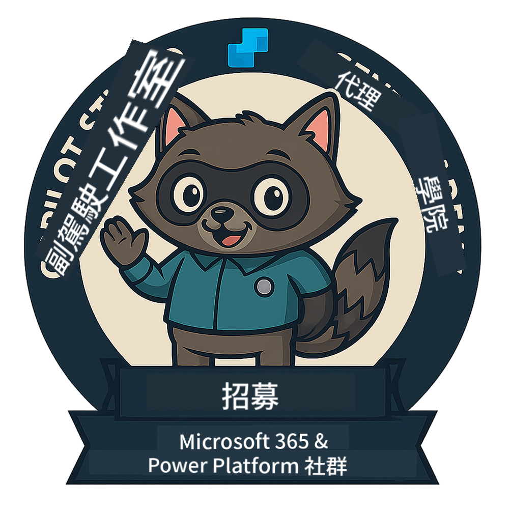
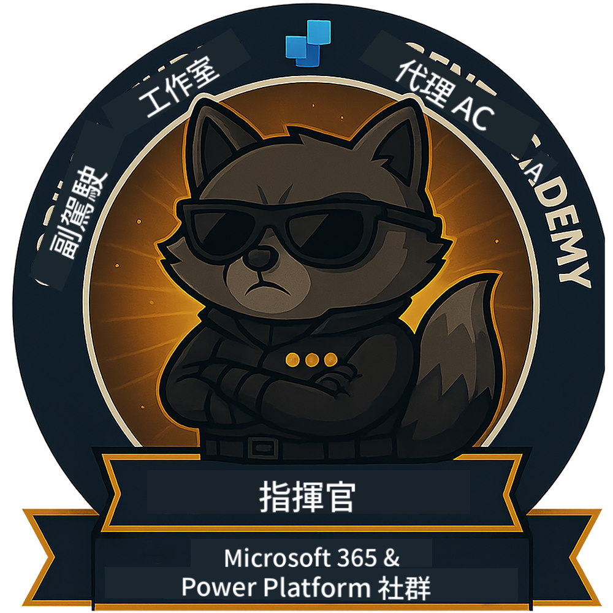

<!--
CO_OP_TRANSLATOR_METADATA:
{
  "original_hash": "15e57e059ce7689d602d7853187235cd",
  "translation_date": "2025-10-22T18:46:30+00:00",
  "source_file": "docs/index.md",
  "language_code": "tw"
}
-->
---
hide:
- navigation
---

# Copilot Studio Agent Academy

**歡迎來到 Copilot Studio Agent Academy。**  

您的任務——如果您選擇接受——是掌握使用 **Microsoft Copilot Studio** 建立代理的技術。

這項實作訓練是您進入 **代理世界** 的起點：從基礎提示到 Adaptive Cards 和代理流程，您將學習如何使用真實工具和案例來建立、擴展及部署智能代理。

---

## 🏅 排名進階

**Copilot Studio Agent Academy** 是一個多階段的訓練計劃，旨在提升您的技能，涵蓋三個代理等級。每個等級都包含一枚徽章以及逐步增加的責任：

| 排名             | 等級 | 視覺化 |
|------------------|:-----:|--------|
| 🟢 **新兵**  [🚀 開始學習](https://aka.ms/agent-academy-recruit){ .md-button .md-button--primary }     | •     | { width="300" }     |
| 🔵 **特工** (即將推出)   | ••    | { width="300" } |
| 🟡 **指揮官** (即將推出)    | •••   | { width="300" } |

每個等級都建立在前一級的基礎上。完成您的新兵任務，並密切關注以提升您的代理資格。

---

## 🎒 其他課程

查看以下其他課程，繼續學習有關 AI 和代理的知識：

- [Microsoft Copilot Studio <3 MCP Lab](https://aka.ms/mcsmcplab)
- [Copilot Developer Camp](https://microsoft.github.io/copilot-camp/)
- [AI Agents for Beginners](https://microsoft.github.io/ai-agents-for-beginners/)
- [Model Context Protocol (MCP) For Beginners](https://github.com/microsoft/mcp-for-beginners)

---

## 🚑 問題

我們非常感謝您的反饋！請使用 [問題列表](https://github.com/microsoft/agent-academy/issues) 分享您的意見和問題。謝謝！

---

## 📜 行為準則

此專案已採用 [Microsoft 開源行為準則](https://opensource.microsoft.com/codeofconduct/)。

!!! info "資源："

    - [Microsoft 開源行為準則](https://opensource.microsoft.com/codeofconduct/)
    - [Microsoft 行為準則 FAQ](https://opensource.microsoft.com/codeofconduct/faq/)
    - 如有疑問或擔憂，請聯繫 [opencode@microsoft.com](mailto:opencode@microsoft.com)

---

[⭐️ 為我們的倉庫加星](https://github.com/microsoft/agent-academy){ .md-button .md-button--primary }

<!-- markdownlint-disable-next-line MD033 -->

---

**免責聲明**：  
本文件已使用 AI 翻譯服務 [Co-op Translator](https://github.com/Azure/co-op-translator) 進行翻譯。儘管我們致力於提供準確的翻譯，請注意自動翻譯可能包含錯誤或不準確之處。原始文件的母語版本應被視為權威來源。對於關鍵信息，建議使用專業人工翻譯。我們對因使用此翻譯而引起的任何誤解或誤釋不承擔責任。