<!--
CO_OP_TRANSLATOR_METADATA:
{
  "original_hash": "616d142d4fb5f45d2a168fad6c1f9545",
  "translation_date": "2025-10-22T19:04:08+00:00",
  "source_file": "docs/operative-preview/07-multimodal-prompts/README.md",
  "language_code": "tw"
}
-->
# 🚨 任務 07：使用多模態提示提取履歷內容

--8<-- "disclaimer.md"

## 🕵️‍♂️ 行動代號：`文件履歷偵查`

> **⏱️ 行動時間窗口：** `~45 分鐘`

## 🎯 任務簡介

歡迎，特工。您之前的任務已經讓您掌握了強大的代理編排技能，但現在是時候解鎖一項改變遊戲規則的能力：**多模態文件分析**。

您的任務，如果您選擇接受，就是**文件履歷偵查**——精準地從任何文件中提取結構化數據。雖然您的代理可以輕鬆處理文本，但現實世界每天都需要處理 PDF、圖片和複雜文件。履歷堆積如山，發票需要處理，表格需要即時數字化。

這項任務將使您從僅能處理文本的代理建構者轉變為**多模態專家**。您將學習如何配置能像人類分析師一樣閱讀和理解文件的 AI——但具有 AI 的速度和一致性。在任務結束時，您將建立一個完整的履歷提取系統，並將其整合到您的招聘工作流程中。

您在此學到的技術將是下一次任務中進階數據基礎操作的必要技能。

## 🔎 目標

在此任務中，您將學到：

1. 什麼是多模態提示以及何時使用不同的 AI 模型
1. 如何配置帶有圖片和文件輸入的提示
1. 如何將提示輸出格式化為 JSON 以進行結構化數據提取
1. 文件分析提示工程的最佳實踐
1. 如何將多模態提示整合到 Agent Flows 中

## 🧠 理解多模態提示

### 什麼使提示成為「多模態」？

傳統提示僅處理文本。但多模態提示可以處理多種類型的內容：

- **文本**：書面指令和內容
- **圖片**：照片、截圖、圖表和示意圖 (.PNG, .JPG, .JPEG)  
- **文件**：發票、履歷、表格 (.PDF)

這項能力開啟了強大的場景，例如分析履歷、處理發票或從表格中提取數據。

### 為什麼多模態對您的工作流程至關重要

每天，您的組織都面臨以下文件處理挑戰：

- **履歷篩選**：手動閱讀數百份履歷耗費寶貴時間
- **發票處理**：從多種文件格式中提取供應商詳細信息、金額和日期
- **表格分析**：將紙質表格轉換為數字數據

多模態提示通過結合 AI 的語言理解和視覺分析能力消除了這些瓶頸。這使您的 AI 能夠像處理文本一樣有效地處理文件。

### 常見業務場景

以下是多模態提示的應用示例：

| 場景                  | 任務                                                                                                                                      | 示例輸出字段                                                                                   |
|-----------------------|-------------------------------------------------------------------------------------------------------------------------------------------|------------------------------------------------------------------------------------------------|
| **履歷篩選**          | 提取候選人姓名、電子郵件、電話、目前職位、工作年限和關鍵技能。                                                 | 候選人姓名、電子郵件地址、電話號碼、目前職位、工作年限、關鍵技能                                 |
| **發票處理**          | 從此發票中提取供應商信息、發票日期、總金額和明細項目。                                                 | 供應商名稱、發票日期、總金額、發票明細項目                                                     |
| **表格分析**          | 分析此申請表並提取所有填寫的字段。                                                                              | 字段名稱（例如：申請人姓名）、填寫值（例如：John Doe）、...                                     |
| **身份文件驗證**      | 從此身份文件中提取姓名、身份號碼、有效期和地址。驗證所有文本是否清晰可讀，並標記任何不清晰的部分。 | 全名、身份號碼、有效期、地址、不清晰部分標記                                                   |

## ⚙️ AI Builder 中的模型選擇

AI Builder 提供了針對特定任務優化的不同模型。了解使用哪個模型對成功至關重要。

!!! note "截至 2025 年 9 月的準確信息"
    AI Builder 模型會定期更新，因此請查看最新的 [AI Builder 模型設置文檔](https://learn.microsoft.com/ai-builder/prompt-modelsettings) 以了解當前模型的可用性。

### 模型比較

以下所有模型均支持視覺和文件處理：

| 模型 | 💰成本 | ⚡速度 | ✅最佳用途 |
|------|-------|-------|-----------|
| **GPT-4.1 mini** | 基本（最具成本效益） | 快速 | 標準文件處理、摘要、預算有限的項目 |
| **GPT-4.1** | 標準 | 中等 | 複雜文件、高級內容創建、高準確性需求 |
| **o3** | 高級 | 慢（優先分析） | 數據分析、批判性思維、複雜問題解決 |
| **GPT-5 chat** | 標準 | 增強 | 最新文件理解、最高響應準確性 |
| **GPT-5 reasoning** | 高級 | 慢（複雜分析） | 最複雜的分析、規劃、高級推理 |

### 溫度設置解釋

溫度控制 AI 回應的創造性或可預測性：

- **溫度 0**：最可預測、一致的結果（最適合數據提取）
- **溫度 0.5**：創造性與一致性的平衡  
- **溫度 1**：最大創造性（最適合內容生成）

對於文件分析，使用 **溫度 0** 以確保數據提取的一致性。

## 📊 輸出格式：文本 vs JSON

選擇正確的輸出格式對後續處理至關重要。

### 何時使用文本輸出

文本輸出適用於：

- 人類可讀的摘要
- 簡單分類
- 不需要結構化處理的內容

### 何時使用 JSON 輸出

JSON 輸出對以下情況至關重要：

- 結構化數據提取
- 與數據庫或系統集成
- Power Automate 流程處理
- 一致的字段映射

### JSON 的最佳實踐

1. **定義清晰的字段名稱**：使用描述性、一致的命名
1. **提供示例**：為每個字段包含示例輸出和值
1. **指定數據類型**：為日期、數字和文本提供示例
1. **處理缺失數據**：計劃處理空值或空白值
1. **驗證結構**：使用各種文件類型進行測試

### 文件質量考量

- **解析度**：確保圖片清晰可讀
- **方向**：在處理前旋轉文件至正確方向
- **格式支持**：使用您的特定文件類型（PDF, JPG, PNG）進行測試
- **大小限制**：注意您的環境中的文件大小限制

### 性能優化

- **選擇合適的模型**：僅在需要時升級模型
- **優化提示**：通常，簡短、清晰的指令表現更好
- **錯誤處理**：計劃無法處理的文件
- **監控成本**：不同模型消耗不同數量的 AI Builder 點數

## 🧪 實驗室 7：建立履歷提取系統

是時候將您的多模態知識付諸實踐了。您將建立一個全面的履歷提取系統，分析候選人文件並將其轉化為結構化數據以用於您的招聘工作流程。

### 完成此任務的先決條件

1. 您需要**以下之一**：

    - **完成任務 06** 並準備好您的多代理招聘系統，**或**
    - **導入任務 07 起始解決方案** 如果您是從頭開始或需要補課。[下載任務 07 起始解決方案](https://aka.ms/agent-academy)

1. 從 [測試履歷](https://download-directory.github.io/?url=https://github.com/microsoft/agent-academy/tree/main/operative/sample-data/resumes&filename=operative_sampledata) 獲取樣本履歷文件

!!! note "解決方案導入和樣本數據"
    如果您使用起始解決方案，請參考 [任務 01](../01-get-started/README.md) 以獲取有關如何將解決方案和樣本數據導入您的環境的詳細說明。

### 7.1 創建多模態提示

您的第一個目標：創建一個能夠分析履歷文件並提取結構化數據的提示。

1. 登錄 [Copilot Studio](https://copilotstudio.microsoft.com) 並從左側導航中選擇 **工具**。

1. 選擇 **+ 新工具**，然後選擇 **提示**。  
    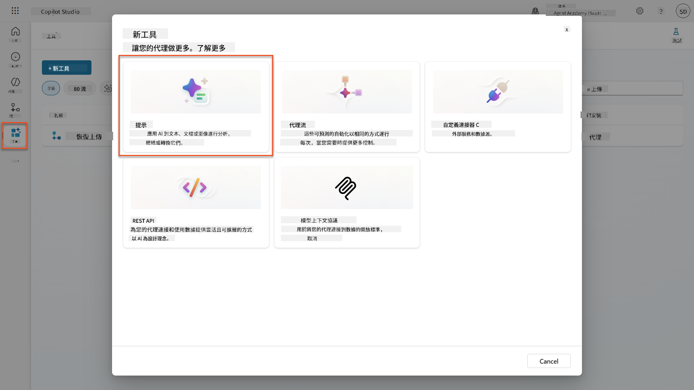

1. **重命名**提示，將默認的時間戳名稱（例如 *Custom prompt 09/04/2025, 04:59:11 PM*）更改為 `Summarize Resume`。

1. 在指令字段中添加以下提示：

    ```text
    You are tasked with extracting key candidate information from a resume and cover letter to facilitate matching with open job roles and creating a summary for application review.
    
    Instructions:
    1. Extract Candidate Details:
        - Identify and extract the candidate’s full name.
        - Extract contact information, specifically the email address.
    2. Create Candidate Summary:
        - Summarize the candidate’s profile as multiline text (max 2000 characters) with the following sections:
            - Candidate name
            - Role(s) applied for if present
            - Contact and location
            - One-paragraph summary
            - Experience snapshot (last 2–3 roles with outcomes)
            - Key projects (1–3 with metrics)
            - Education and certifications
            - Top skills (Top 10)
            - Availability and work authorization
    
    Guidelines:
    - Extract information only from the provided resume and cover letter documents.
    - Ensure accuracy in identifying all details such as contact details and skills.
    - The summary should be concise but informative, suitable for quick application review.
    
    Resume: /document
    CoverLetter: /text
    ```

    !!! tip "使用 Copilot 協助"
        您可以使用「使用 Copilot 開始」通過自然語言生成您的提示。嘗試讓 Copilot 創建一個總結履歷的提示！

1. **配置**輸入參數：

    | 參數 | 類型 | 名稱 | 示例數據 |
    |------|------|------|----------|
    | Resume | 圖片或文件 | Resume | 從測試數據文件夾上傳一份樣本履歷 |
    | CoverLetter | 文本 | CoverLetter | 這是一份履歷！ |

1. 選擇 **測試** 以查看提示的初始文本輸出。  
    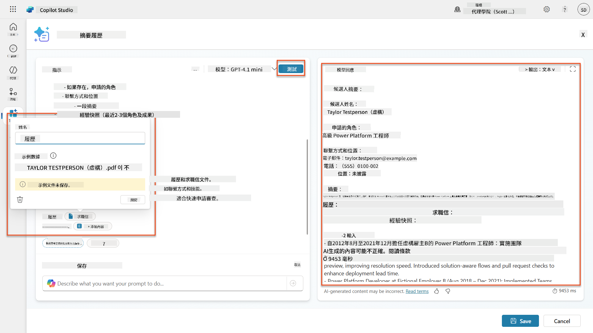

### 7.2 配置 JSON 輸出

現在，您將把提示轉換為輸出結構化的 JSON 數據，而不是純文本。

1. 在提示指令的末尾添加以下 JSON 格式規範：

    ```text
    Output Format:
    Provide the output in valid JSON format with the following structure:
    
    {
        "CandidateName": "string",
        "Email": "string",
        "Summary": "string max 2000 characters",
        "Skills": [ {"item": "Skill 1"}, {"item": "Skill 2"}],
        "Experience": [ {"item": "Experience 1"}, {"item": "Experience 2"}],
    }
    ```

1. 將 **輸出** 設置從「文本」更改為 **JSON**。

1. 再次選擇 **測試** 以驗證輸出現在已格式化為 JSON。  
    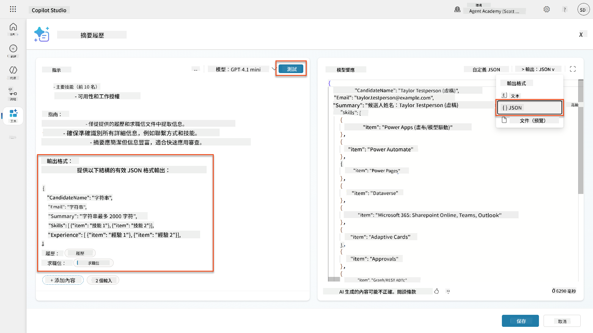

1. **可選：** 嘗試使用不同的 AI 模型以查看輸出的差異，然後返回默認模型。

1. 選擇 **保存** 以創建提示。

1. 在 **配置以用於代理** 對話框中，選擇 **取消**。

    !!! info "為什麼我們不直接將其添加為工具"
        您將在 Agent Flow 中使用此提示，而不是直接作為工具使用，這樣可以更好地控制數據處理工作流程。

### 7.3 將提示添加到 Agent Flow

您將創建一個使用提示處理存儲在 Dataverse 中的履歷的 Agent Flow。

!!! tip "Agent Flow 表達式"
    非常重要的是，您必須完全按照指示命名節點並輸入表達式，因為表達式使用節點名稱引用前面的節點！請參考 [Recruit 中的 Agent Flow 任務](../../recruit/09-add-an-agent-flow/README.md#you-mentioned-expressions-what-are-expressions) 以快速回顧！

1. 進入 Copilot Studio 中的 **招聘代理**

1. 選擇 **代理** 標籤，並選擇子代理 **申請接收代理**

1. 在 **工具** 面板中，選擇 **+ 添加** → **+ 新工具** → **Agent Flow**

1. 在「當代理調用流程節點時」，使用 **+ 添加輸入** 添加以下參數：

    | 類型 | 名稱 | 描述 |
    |------|------|------|
    | 文本 | ResumeNumber | 請確保使用 [ResumeNumber]。這必須始終以字母 R 開頭 |

1. 選擇第一個節點下的 **+** 插入操作圖標，搜索 **Dataverse**，選擇 **查看更多**，然後找到 **列出行** 操作

1. 選擇 **省略號 (...)** 在列出行節點上，並選擇 **重命名** 為 `Get Resume Record`，然後設置以下參數：

    | 屬性 | 設置方式 | 值 |
    |------|----------|----|
    | **表名** | 選擇 | Resumes |
    | **篩選行** | 動態數據（閃電圖標） | `ppa_resumenumber eq 'ResumeNumber'` 將 **ResumeNumber** 替換為 **當代理調用流程** → **ResumeNumber** |
    | **行數** | 輸入 | 1 |

    !!! tip "優化查詢！"
        在生產中使用此技術時，您應始終限制選擇的列僅限於 Agent Flow 所需的列。

    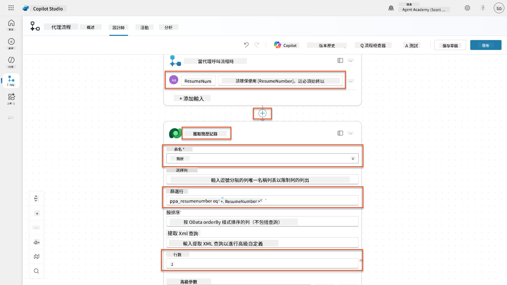

1. 選擇 Get Resume Record 節點下的 **+** 插入操作圖標，搜索 **Dataverse**，選擇 **查看更多**，然後找到 **下載文件或圖片** 操作。

    !!! tip "選擇正確的操作！"
        請確保不要選擇以「從選定環境」結尾的操作

1. 如前所述，重命名操作為 `Download Resume`，然後設置以下參數：

    | 屬性 | 設置方式 | 值 |
    |------|----------|----|
    | **表名** | 選擇 | Resumes |
    | **行 ID** | 表達式（fx 圖標） | `first(body('Get_Resume_Record')?['value'])?['ppa_resumeid']` |
    | **列名** | 選擇 | Resume PDF |

    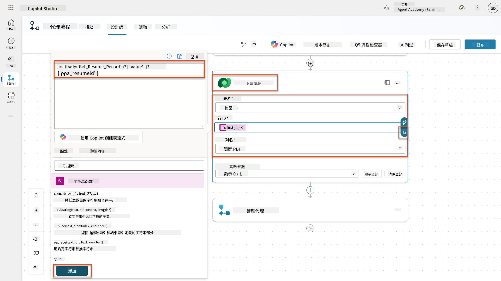

1. 現在，選擇 Download Resume 下的 **+** 插入操作圖標，在 **AI 能力** 下選擇 **運行提示**。

1. 將操作重命名為 `Summarize Resume` 並設置以下參數：

    | 屬性 | 設置方式 | 值 |
    |------|----------|----|
| **提示** | 選擇 | 摘要履歷 |
| **求職信** | 表達式 (fx 圖示) | `first(body('Get_Resume_Record')?['value'])?['ppa_coverletter']` |
| **履歷** | 動態數據 (閃電圖示) | 下載履歷 → 文件或圖片內容 |

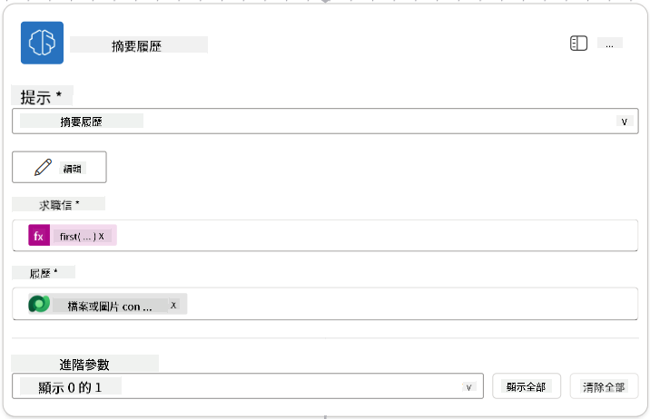

!!! tip "提示參數"
請注意，您填寫的參數與您在創建提示時配置的輸入參數相同。

### 7.4 建立候選人記錄

接下來，您需要將提示提供的信息用於創建新的候選人記錄（如果尚未存在）。

1. 在摘要履歷節點下方選擇 **+** 插入操作圖示，搜尋 **Dataverse**，選擇 **查看更多**，然後找到 **列出行** 操作。

1. 將節點重新命名為 `Get Existing Candidate`，並設置以下參數：

    | 屬性 | 設置方式 | 值 |
    |------|----------|----|
    | **表名稱** | 選擇 | Candidates |
    | **篩選行** | 動態數據 (閃電圖示) | `ppa_email eq 'Email'`  **替換** `Email` 為 **摘要履歷 → Email** |
    | **行數** | 輸入 | 1 |

    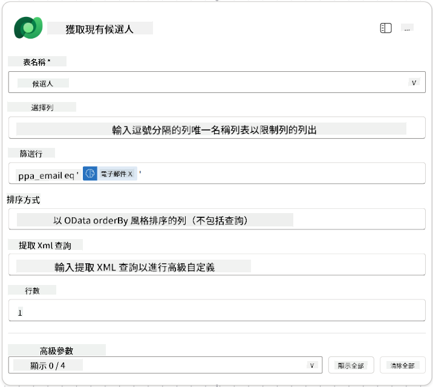

1. 在 Get Existing Candidate 節點下方選擇 **+** 插入操作圖示，搜尋 **Control**，選擇 **查看更多**，然後找到 **條件** 操作。

1. 在條件屬性中設置以下條件：

    | 條件 | 運算符 | 值 |
    |------|--------|----|
    | 表達式 (fx 圖示): `length(outputs('Get_Existing_Candidate')?['body/value'])` | 等於 | 0 |

    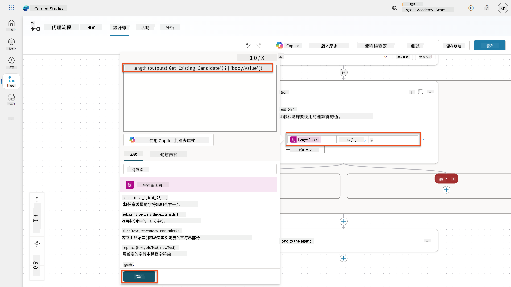

1. 在 **True** 分支中選擇 **+** 插入操作圖示，搜尋 **Dataverse**，選擇 **查看更多**，然後找到 **新增行** 操作。

1. 將節點重新命名為 `Add a New Candidate`，並設置以下參數：

    | 屬性 | 設置方式 | 值 |
    |------|----------|----|
    | **表名稱** | 選擇 | Candidates |
    | **候選人姓名** | 動態數據 (閃電圖示) | 摘要履歷 → `CandidateName` |
    | **Email** | 動態數據 (閃電圖示) | 摘要履歷 → `Email` |

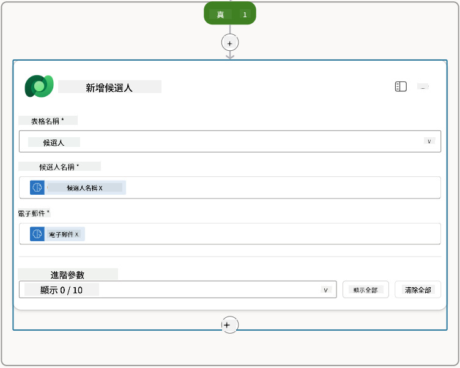

### 7.5 更新履歷並配置流程輸出

完成流程，更新履歷記錄並配置返回給代理的數據。

1. 在條件下方選擇 **+** 插入操作圖示，搜尋 **Dataverse**，選擇 **查看更多**，然後找到 **更新行** 操作。

1. 選擇標題將節點重新命名為 `Update Resume`，選擇 **顯示全部**，並設置以下參數：

    | 屬性 | 設置方式 | 值 |
    |------|----------|----|
    | **表名稱** | 選擇 | Resumes |
    | **行 ID** | 表達式 (fx 圖示) | `first(body('Get_Resume_Record')?['value'])?['ppa_resumeid']` |
    | **摘要** | 動態數據 (閃電圖示) | 摘要履歷 → Text |
    | **候選人 (Candidates)** | 表達式 (fx 圖示) | `if(equals(length(outputs('Get_Existing_Candidate')?['body/value']), 1), first(outputs('Get_Existing_Candidate')?['body/value'])?['ppa_candidateid'], outputs('Add_a_New_Candidate')?['body/ppa_candidateid'])` |

    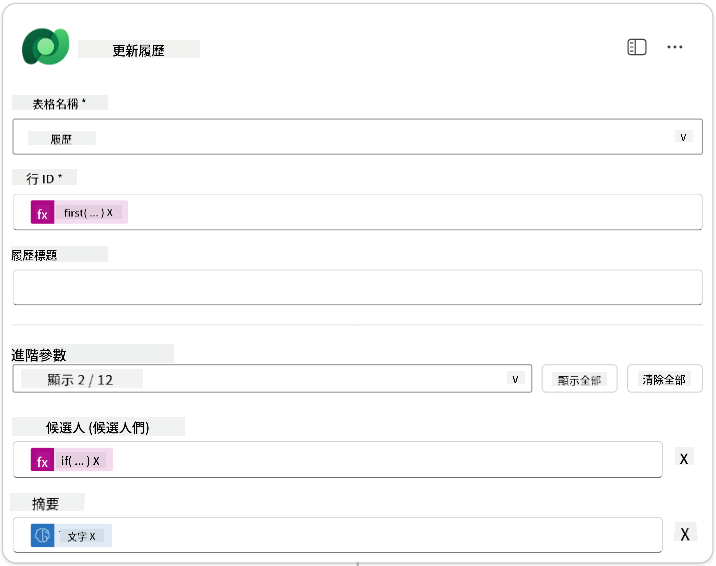

1. 選擇 **Respond to the agent** 節點，然後使用 **+ 添加輸出** 進行配置：

    | 類型 | 名稱              | 設置方式                      | 值                                                        | 描述                                            |
    | ---- | ----------------- | ----------------------------- | --------------------------------------------------------- | ------------------------------------------------ |
    | 文本 | `CandidateName`   | 動態數據 (閃電圖示)           | 摘要履歷 → 查看更多 → CandidateName                      | 履歷中提供的 [CandidateName]                     |
    | 文本 | `CandidateEmail`  | 動態數據 (閃電圖示)           | 摘要履歷 → 查看更多 → Email                              | 履歷中提供的 [CandidateEmail]                    |
    | 文本 | `CandidateNumber` | 表達式 (fx 圖示)              | `concat('ppa_candidates/', if(equals(length(outputs('Get_Existing_Candidate')?['body/value']), 1), first(outputs('Get_Existing_Candidate')?['body/value'])?['ppa_candidateid'], outputs('Add_a_New_Candidate')?['body/ppa_candidateid']) )` | 新或現有候選人的 [CandidateNumber] |
    | 文本 | `ResumeSummary`   | 動態數據 (閃電圖示)           | 摘要履歷 → 查看更多 → body/responsev2/predictionOutput/structuredOutput | 履歷摘要和詳細信息的 JSON 格式                   |

    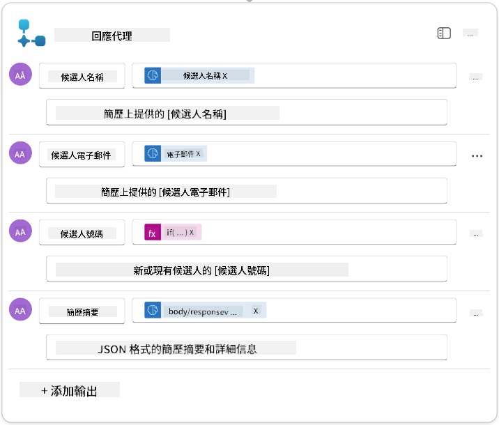

1. 在右上角選擇 **保存草稿**。您的代理流程應如下所示  
    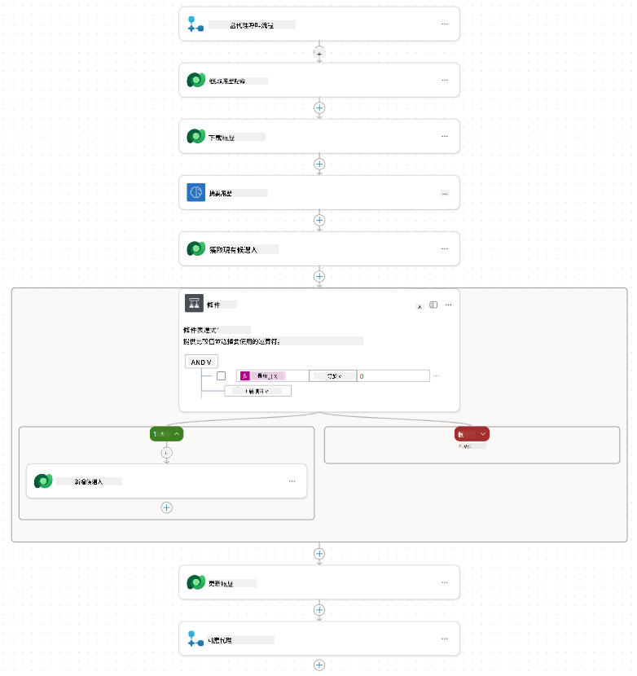

1. 選擇 **概覽** 標籤，選擇 **編輯** 在 **詳細信息** 面板中

    1. **流程名稱**：`Summarize Resume`
    1. **描述**：

        ```text
        Summarize an existing Resume stored in Dataverse using a [ResumeNumber] as input, return the [CandidateNumber], and resume summary JSON
        ```

1. 選擇 **保存**

1. 再次選擇 **設計器** 標籤，然後選擇 **發布**。

### 7.6 將流程連接到您的代理

現在您將添加流程作為工具並配置代理使用它。

1. 在 Copilot Studio 中打開您的 **Hiring Agent**

1. 選擇 **Agents** 標籤，並打開 **Application Intake Agent**

1. 選擇 **工具** 面板，選擇 **+ 添加工具** - > **流程** -> **Summarize Resume** **(代理流程)**

1. 選擇 **添加並配置**

1. 配置工具設置如下：

    | 設置 | 值 |
    |------|----|
    | **描述** | 使用 [ResumeNumber] 作為輸入，總結存儲在 Dataverse 中的現有履歷，返回 [CandidateNumber] 和履歷摘要 JSON |
    | **此工具何時可用** | 僅當由主題或代理引用時 |

1. 選擇 **保存**  
    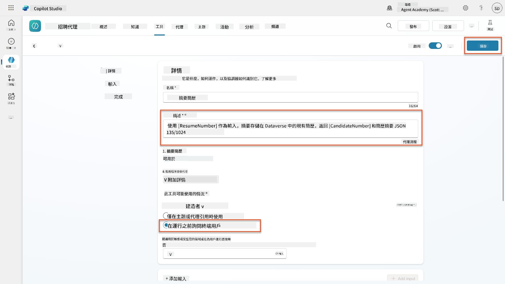

1. 如果您選擇 Hiring Agent 中的工具，現在您將看到我們的兩個工具顯示為 **Application Intake Agent** 可用。  
    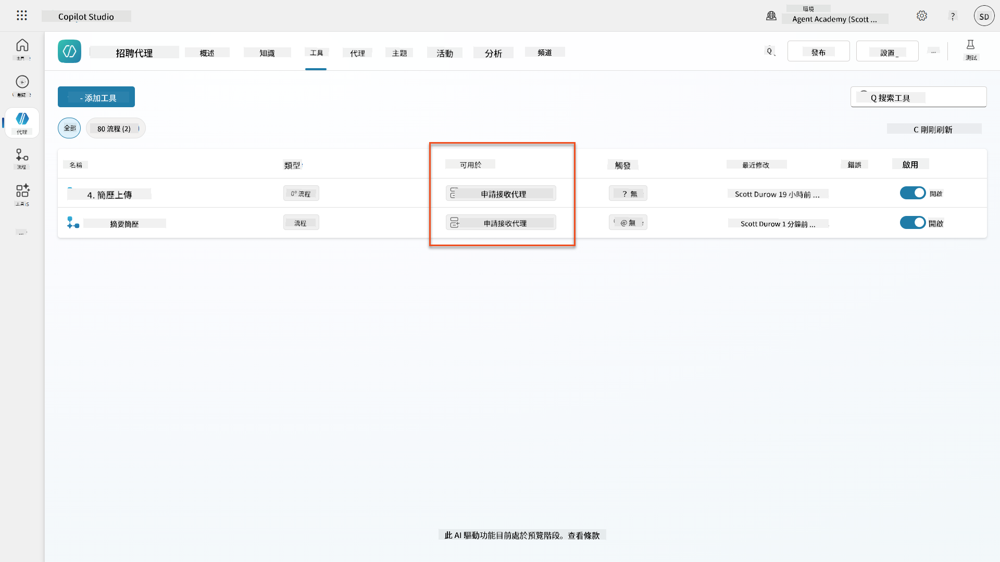

1. 導航到 **Application Intake Child** 代理指令，並修改 **Post-Upload** 步驟如下：

    ```text
    2. Post-Upload Processing  
        - After uploading, be sure to also output the [ResumeNumber] in all messages
        - Pass [ResumeNumber] to /Summarize Resume  - Be sure to use the correct value that will start with the letter R.
        - Be sure to also output the [CandidateNumber] in all messages
        - Use the [ResumeSummary] to output a summary of the processed Resume and candidate
    ```

    替換 `/Summarize Resume`，通過插入 **Summarize Resume 代理流程** 的引用，方法是輸入斜杠 (`/`) 或選擇 `/Summarize` 插入引用。  
    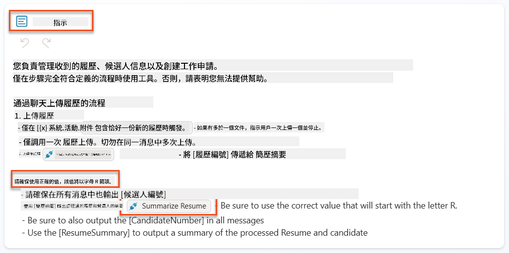

1. 選擇 **保存**。

### 7.7 測試您的代理

測試您的完整多模態系統以確保一切正常運作。

1. **開始測試**：

    - 選擇 **測試** 打開測試面板
    - 輸入：`這是一份候選人履歷`

    - 上傳 [測試履歷](https://download-directory.github.io/?url=https://github.com/microsoft/agent-academy/tree/main/operative/sample-data/resumes&filename=operative_sampledata) 中的樣本履歷之一

1. **驗證結果**：
    - 發送消息和履歷後，檢查是否收到履歷編號（格式：R#####）
    - 驗證是否獲得候選人編號和摘要
    - 使用活動地圖查看履歷上傳工具和摘要履歷工具的操作，以及代理接收到的摘要提示輸出：  
        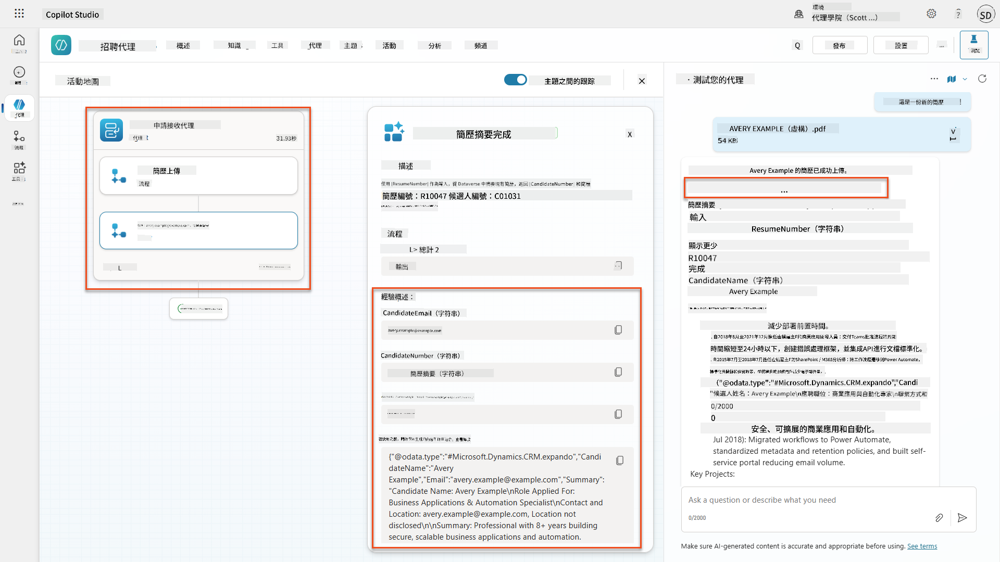

1. **檢查數據持久性**：
    - 導航到 [Power Apps](https://make.powerapps.com)
    - 打開 **Apps** → **Hiring Hub** → **Play**
    - 前往 **Resumes** 驗證履歷是否已上傳並處理。它應包含摘要信息和關聯的候選人記錄。
    - 檢查 **Candidates** 查看提取的候選人信息  
        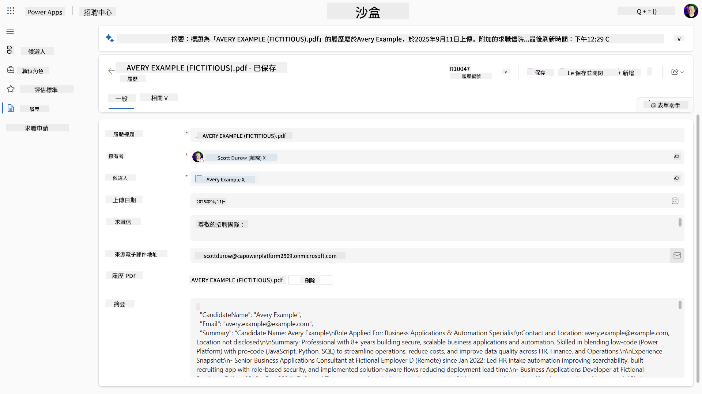
    - 再次運行流程時，應使用現有候選人（根據履歷中提取的電子郵件匹配）而不是創建新候選人。

!!! tip "故障排除"
    - **履歷未處理**：確保文件為 PDF 並且在大小限制內
    - **未創建候選人**：檢查履歷中是否正確提取了電子郵件
    - **JSON 格式錯誤**：驗證您的提示指令是否包含精確的 JSON 結構
    - **流程錯誤**：檢查所有 Dataverse 連接和表達式是否配置正確

### 生產準備

雖然不屬於此任務的一部分，但要使此代理流程達到生產準備狀態，您可能還需要考慮以下事項：

1. **錯誤處理** - 如果未找到履歷編號，或提示未能解析文檔，應添加錯誤處理以向代理返回清晰的錯誤。
1. **更新現有候選人** - 候選人是通過電子郵件找到的，然後可以更新姓名以匹配履歷中的信息。
1. **拆分履歷摘要和候選人創建** - 此功能可以拆分為更小的代理流程以便於維護，然後給代理指令依次使用它們。

## 🎉 任務完成

幹得好，行動者！**文檔履歷偵察** 現已完成。您已成功掌握多模態提示，並能精確地從任何文檔中提取結構化數據。

以下是您在此任務中完成的內容：

**✅ 多模態提示掌握**  
您現在了解什麼是多模態提示以及何時使用不同的 AI 模型以獲得最佳結果。

**✅ 文檔處理專業知識**  
您已學會配置帶有圖片和文檔輸入的提示，並以 JSON 格式輸出以進行結構化數據提取。

**✅ 履歷提取系統**  
您已構建完整的履歷提取系統，處理候選人文檔並與您的招聘工作流程集成。

**✅ 最佳實踐實施**  
您已應用文檔分析的提示工程最佳實踐，並將多模態提示與代理流程集成。

**✅ 高級處理基礎**  
您的增強文檔分析能力現在已準備好迎接我們即將添加的高級數據基礎功能。

🚀 **接下來：** 在任務 08 中，您將學習如何使用來自 Dataverse 的實時數據增強您的提示，創建適應不斷變化的業務需求的動態 AI 解決方案。

⏩ [前往任務 08：使用 Dataverse 基礎增強提示](../08-dataverse-grounding/README.md)

## 📚 戰術資源

📖 [創建提示](https://learn.microsoft.com/ai-builder/create-a-custom-prompt?WT.mc_id=power-power-182762-scottdurow)

📖 [向提示添加文本、圖片或文檔輸入](https://learn.microsoft.com/ai-builder/add-inputs-prompt?WT.mc_id=power-182762-scottdurow)

📖 [使用 JSON 輸出處理響應](https://learn.microsoft.com/ai-builder/process-responses-json-output?WT.mc_id=power-182762-scottdurow)

📖 [模型選擇和溫度設置](https://learn.microsoft.com/ai-builder/prompt-modelsettings?WT.mc_id=power-182762-scottdurow)

📖 [在 Power Automate 中使用您的提示](https://learn.microsoft.com/ai-builder/use-a-custom-prompt-in-flow?WT.mc_id=power-182762-scottdurow)

📺 [AI Builder：提示生成器中的 JSON 輸出](https://www.youtube.com/watch?v=F0fGnWrRY_I)

---

**免責聲明**：  
本文件已使用 AI 翻譯服務 [Co-op Translator](https://github.com/Azure/co-op-translator) 進行翻譯。儘管我們努力確保翻譯的準確性，但請注意，自動翻譯可能包含錯誤或不準確之處。原始文件的母語版本應被視為權威來源。對於關鍵信息，建議使用專業人工翻譯。我們對因使用此翻譯而產生的任何誤解或誤釋不承擔責任。