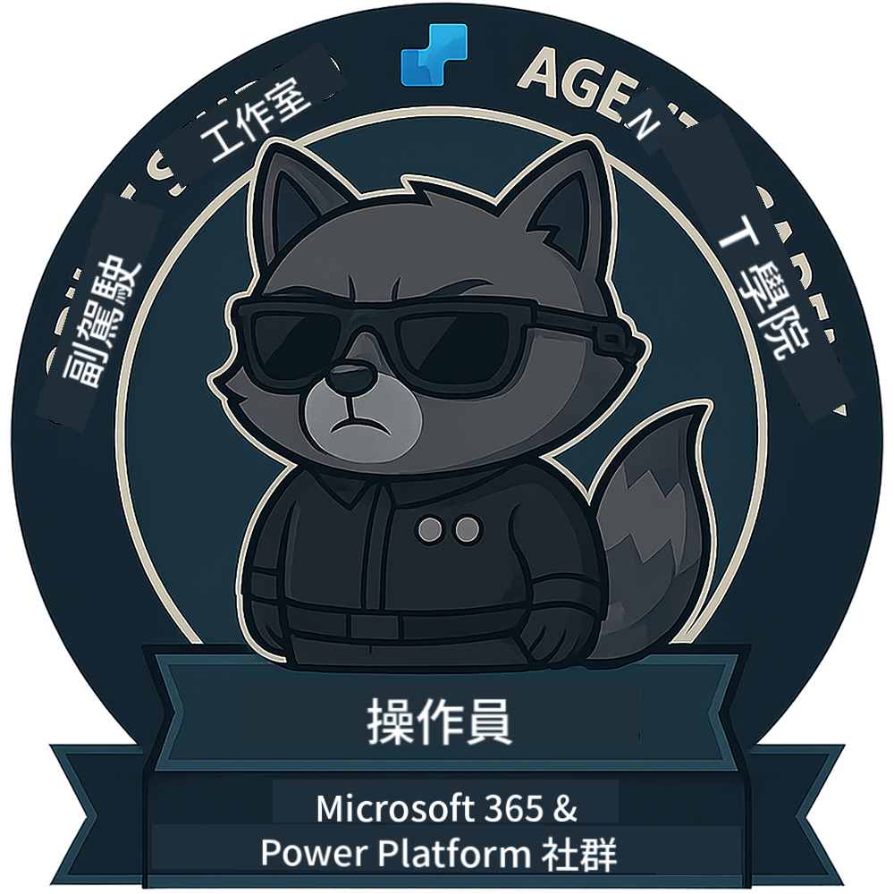

<!--
CO_OP_TRANSLATOR_METADATA:
{
  "original_hash": "1c5c8f18a1c1ec8fcbbb271403cf2ac6",
  "translation_date": "2025-10-22T19:59:17+00:00",
  "source_file": "docs/operative/README.md",
  "language_code": "tw"
}
-->
---
hide:
- navigation
---

# 行動特工（即將推出）

這門課程仍然非常機密。未來將會解鎖！🔓

{ width="300" }

<!-- markdownlint-disable-next-line MD033 -->

---

**免責聲明**：  
本文件已使用 AI 翻譯服務 [Co-op Translator](https://github.com/Azure/co-op-translator) 進行翻譯。儘管我們致力於提供準確的翻譯，請注意自動翻譯可能包含錯誤或不準確之處。原始文件的母語版本應被視為權威來源。對於關鍵資訊，建議使用專業人工翻譯。我們對因使用此翻譯而引起的任何誤解或誤釋不承擔責任。