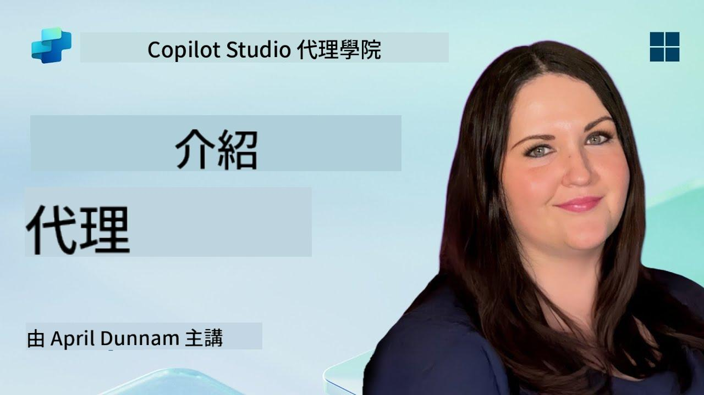

<!--
CO_OP_TRANSLATOR_METADATA:
{
  "original_hash": "d6706e107678264168d77b2e107710b1",
  "translation_date": "2025-10-22T19:30:09+00:00",
  "source_file": "docs/recruit/01-introduction-to-agents/README.md",
  "language_code": "tw"
}
-->
# 🚨 任務 01：代理的介紹

## 🕵️‍♂️ 代號：`AI代理解碼行動`

> **⏱️ 行動時間窗口：** `~30分鐘 – 僅限情報，不需外勤工作`

🎥 **觀看操作指南**

## 🎯 任務簡介

歡迎，招募者。在我們深入建立代理之前，您需要牢牢掌握驅動它們的 AI 概念。本次任務將為您提供有關對話式 AI、大型語言模型（LLMs）、檢索增強生成（RAG）以及您可以在 Copilot Studio 中創建的代理類型的基礎知識。

## 🔎 目標

在本次任務中，您將學習：

1. 什麼是對話式 AI，以及它為什麼重要  
1. 大型語言模型（LLMs）如何驅動聊天體驗  
1. 檢索增強生成（RAG）帶來的價值  
1. 對話式代理與自主代理的區別  
1. Copilot Studio 中的代理如何利用這些概念  

讓我們開始吧！

---

## 什麼是對話式 AI？

對話式 AI 是指任何能夠理解、處理並以自然方式回應人類語言（無論是文字還是語音）的系統。想想客服聊天機器人或您喜愛應用中的虛擬個人助理。在其背後，大多數現代對話式 AI 都依賴於大型語言模型（LLMs），我們接下來會進一步探討。

### 為什麼重要

- **用戶體驗：** 對話式界面通常比點擊菜單更直觀。  
- **可擴展性：** 一個代理可以同時處理數十或數百個對話。  
- **效率：** 與其構建自定義的基於規則的腳本，LLM 驅動的代理能根據用戶輸入即時適應。  
- **可擴展性：** 設計得當的代理可以訪問知識庫、連接 API，或作為業務流程中的“數字同事”。

---

## 大型語言模型（LLMs）101

大多數對話式 AI 系統的核心是**大型語言模型**——基於大量文本語料庫訓練的神經網絡。它們學習語言的統計模式，因此能生成連貫的句子、回答問題，甚至提出創意。以下是關鍵點：

1. **訓練數據：** LLMs 會吸收數兆字節的文本（網頁、書籍、文章）。這種“世界知識”使它們能在多個主題上回應。  
1. **分詞：** 文本被分解為稱為 token 的小單元（單詞、子詞或字符）。模型一次預測一個 token。  
1. **上下文窗口：** 每個 LLM 都有一個限制，表示它一次能“看到”的 token 數量。超過該限制，之前的 token 會被截斷。  
1. **提示：** 您通過發送提示與 LLM 交互。提示越好，回應越集中且相關。  
1. **零樣本 vs. 微調：** 零樣本指直接使用 LLM（僅原始權重）。微調指根據特定領域數據調整模型，使其更準確地回答您的需求。

!!! Tip "專業提示"
    一個常見的比喻是，LLM 就像一個“超級智能的自動完成工具”。它不像人類大腦那樣真正理解含義，但它非常擅長預測序列中的下一個最佳單詞（或短語）。

---

## 檢索增強生成（RAG）

當 LLMs 僅依賴靜態訓練數據時，它們可能會出現幻覺或過時。RAG 通過讓模型在生成答案之前“查詢”最新信息來解決這個問題。從高層次來看，RAG 的工作原理如下：

1. **用戶查詢：** 用戶提出問題（例如，“Contoso 最新的季度收益如何？”）。  
1. **檢索步驟：** 系統查詢知識來源（文檔、內部數據庫、SharePoint 資料庫等）以找到相關段落。  
1. **增強：** 檢索到的段落被附加或前置於 LLM 提示之前。  
1. **生成：** LLM 同時吸收用戶的問題和檢索到的上下文，然後生成基於最新數據的回應。  

通過 RAG，您的代理可以調用內部公司維基、插件 API 或搜索 FAQ 知識庫，並返回不僅限於靜態模型參數的答案。

---

## 對話式代理 vs. 自主代理

在 Copilot Studio 的上下文中，**代理**一詞可以指多種 AI 助手。劃分如下：

**對話式代理：**

- 主要專注於雙向對話。  
- 在多輪對話中保持上下文。  
- 通常通過預定義的流程或觸發器進行編排（例如，“如果用戶說 X，則回應 Y”）。  
- 適合客戶支持、FAQ、引導式交互、排程或簡單的問答。  
  - 示例：  
    - 一個回答 HR 政策問題的 Teams 聊天機器人。  
    - 一個在 SharePoint 頁面上的 Power Virtual Agents 機器人，引導用戶完成表單。  

**自主代理：**

- 超越簡單的聊天；它們可以**代表用戶採取行動**。  
- 使用 LLM 的推理循環（例如“計劃 → 行動 → 觀察 → 再計劃”）完成任務。  
- 連接到外部工具或 API（例如，調用 Power Automate 流程、發送日曆邀請、操作 Dataverse 中的數據）。  
- 無需持續的人工提示——一旦觸發，它們可以自主處理多步驟流程。  
  - 示例：  
    - 一個生成旅行行程、預訂航班並發送確認郵件的代理。  
    - 一個“會議摘要”代理，加入 Teams 通話，實時轉錄並將執行摘要寫入 OneNote。  

!!! Info "關鍵區別"
    對話式代理等待用戶輸入並專注於對話。自主代理則主動計劃並執行一系列步驟，使用更廣泛的工具訪問。

---

## Copilot Studio 中的代理

**Copilot Studio** 將對話式和自主場景統一在一個框架下。以下是 Copilot Studio 幫助您構建代理的方式：

1. **可視化代理設計器：** 一個低代碼畫布，用於定義提示、記憶和工具，適用於聊天和行動工作流。  
1. **LLM 配置：** 從多種 OpenAI 模型或 Microsoft 的企業級 GPT 中選擇，以匹配您的性能和成本需求。  
1. **檢索連接器：** 為 SharePoint、OneDrive、Azure Cognitive Search 和 Dataverse 提供預構建集成，支持即時 RAG。  
1. **自定義工具和功能：** 定義自定義 HTTP 操作或 Power Automate 流程，供您的代理自主調用。  
1. **多模態支持：** 除了文本，Copilot Studio 代理還可以吸收圖片、文件或結構化數據以豐富上下文。  
1. **發布與分發：** 當您的代理準備就緒後，您可以將其發布到 Microsoft 365 Copilot（讓用戶在 Teams、SharePoint、Outlook 等中調用它），或將其嵌入為網頁上的獨立聊天小部件。

---

## 🎉 任務完成

您已完成代理和基礎 AI 概念的介紹。您了解了：

1. **LLMs = 您代理的“大腦”**  
   - 負責語言理解和生成。  
   - 更多 token = 更豐富的上下文，但每次調用的成本也更高。  

1. **RAG = 實時知識整合**  
   - 彌補靜態 LLM 與不斷變化的數據源之間的差距。  
   - 檢索並將相關文檔或記錄注入 LLM 提示中。  

1. **對話式 vs. 自主**  
   - **對話式：** 專注於對話流程和保持上下文（例如，“會話記憶”）。  
   - **自主：** 添加“行動模塊”，讓代理調用外部工具或服務。

---
接下來，您將探索 [Copilot Studio 的基礎知識](../02-copilot-studio-fundamentals/README.md)！

保持警惕，招募者——您的 AI 旅程才剛剛開始！

## 📚 戰術資源

🔗 [Copilot Studio 文件首頁](https://learn.microsoft.com/microsoft-copilot-studio/)

---

---

**免責聲明**：  
本文件已使用 AI 翻譯服務 [Co-op Translator](https://github.com/Azure/co-op-translator) 進行翻譯。儘管我們致力於提供準確的翻譯，請注意自動翻譯可能包含錯誤或不準確之處。原始文件的母語版本應被視為權威來源。對於關鍵資訊，建議使用專業人工翻譯。我們對因使用此翻譯而產生的任何誤解或誤釋不承擔責任。