<!--
CO_OP_TRANSLATOR_METADATA:
{
  "original_hash": "8e2c64a7f9303e58329ec8bb468c80b4",
  "translation_date": "2025-10-22T19:43:22+00:00",
  "source_file": "docs/recruit/05-using-prebuilt-agents/README.md",
  "language_code": "tw"
}
-->
# 🧰 任務 05：使用預建代理  

## 🕵️‍♂️ 代號：`安全旅行行動`

> **⏱️ 行動時間窗口：** `~30 分鐘`

🎥 **觀看操作指南**

## 🎯 任務簡介

歡迎來到 Copilot Studio Agent Academy 的下一個任務。您即將探索 **預建代理** 的世界——由 Microsoft 創建的智能、目標導向的代理，旨在加速部署並縮短價值實現時間。

與從零開始構建不同，預建代理（也稱為 **代理模板**）提供了現成的場景，您可以在幾分鐘內自定義並部署。

在這次任務中，您將部署 **安全旅行** 代理——一個幫助用戶準備商務旅行、了解公司政策並簡化計劃的代理。

---

## 🧭 目標

這次任務的目標是：

1. 了解什麼是預建代理以及它們的重要性  
1. 部署 **安全旅行** 代理模板  
1. 自定義代理的回應和內容  
1. 測試並發布代理  

---

## 🧠 什麼是預建代理？

預建代理是由 Microsoft 創建的即用型 AI 代理，具有以下特點：

- 解決常見的業務需求（如旅行、人力資源、IT 支援）
- 包含完整的主題、觸發短語、指令和示例知識
- 可以編輯、擴展並與您的數據結合

這些代理非常適合快速入門或學習代理的結構。

---

## 🧪 實驗 05：快速開始使用預建代理

現在我們將學習如何選擇預建代理並進行自定義。

- [5.1 啟動 Copilot Studio](../../../../../docs/recruit/05-using-prebuilt-agents)
- [5.2 選擇安全旅行代理模板](../../../../../docs/recruit/05-using-prebuilt-agents)
- [5.3 自定義代理](../../../../../docs/recruit/05-using-prebuilt-agents)
- [5.4 測試並發布](../../../../../docs/recruit/05-using-prebuilt-agents)

我們將沿用之前的例子，在專用的 Copilot Studio 環境中創建解決方案來構建 IT 幫助台代理。

讓我們開始吧！

### 5.1 啟動 Copilot Studio

1. 前往 [https://copilotstudio.microsoft.com](https://copilotstudio.microsoft.com)

1. 使用您的 Microsoft 365 工作或學校帳戶登錄

!!! warning
    您必須在啟用了 Copilot Studio 的租戶中。如果您未看到 Copilot Studio，請回到 [任務 00](../00-course-setup/README.md) 完成設置。

### 5.2 選擇安全旅行代理模板

1. 從 Copilot Studio 主頁，點擊 **+ 創建**
    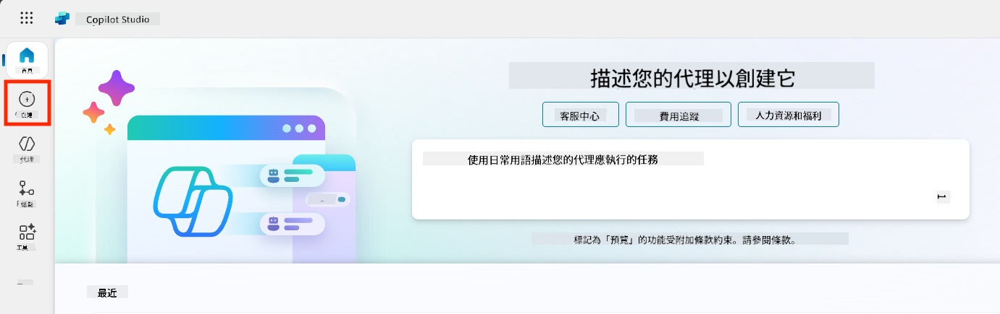

1. 向下滾動到 **從代理模板開始** 部分

1. 找到並選擇 **安全旅行**

    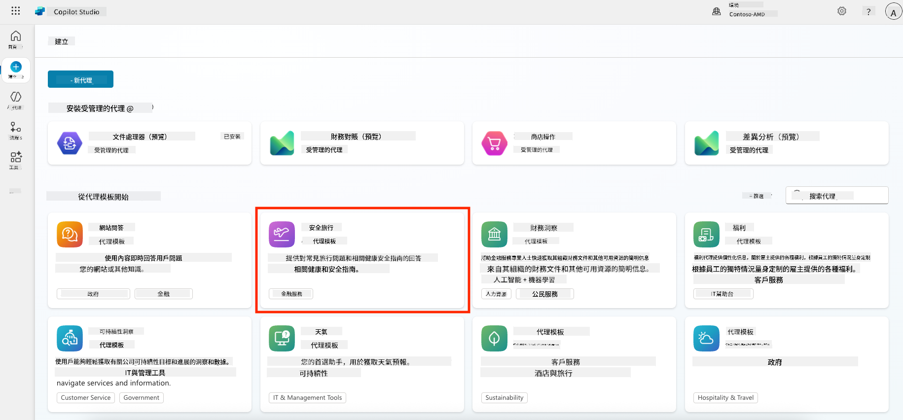

1. 注意模板已預先加載了描述、指令和知識。

    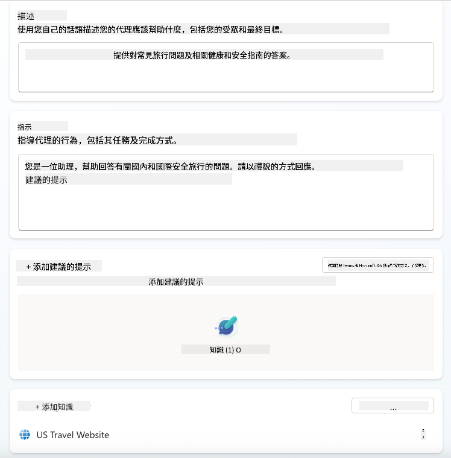

1. 點擊 **創建**

    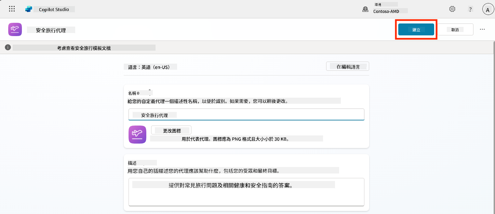

這將根據安全旅行配置在您的環境中創建一個新的代理。

### 5.3 自定義代理

現在代理已創建，讓我們根據您的組織進行調整：

1. 選擇 **啟用生成式 AI**，以開啟生成式 AI 功能，使其能夠使用模板中提供的指令。

    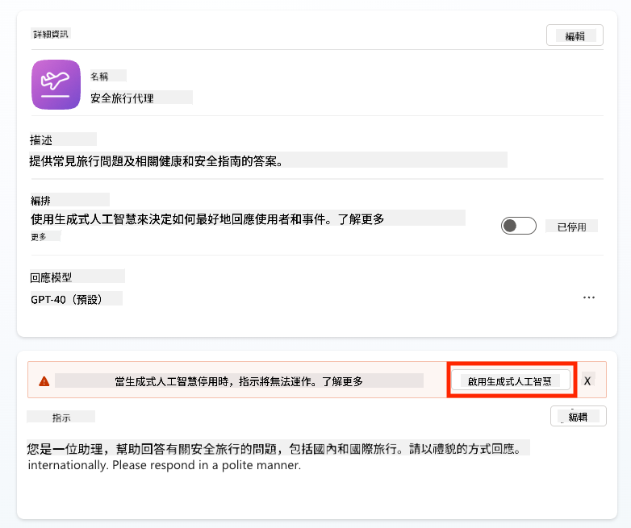

1. 現在我們將為代理添加額外的知識來源，使其能回答有關歐洲旅行的問題。為此，向下滾動到 **知識** 部分並選擇 **添加知識**

    

1. 選擇 **公共網站**

    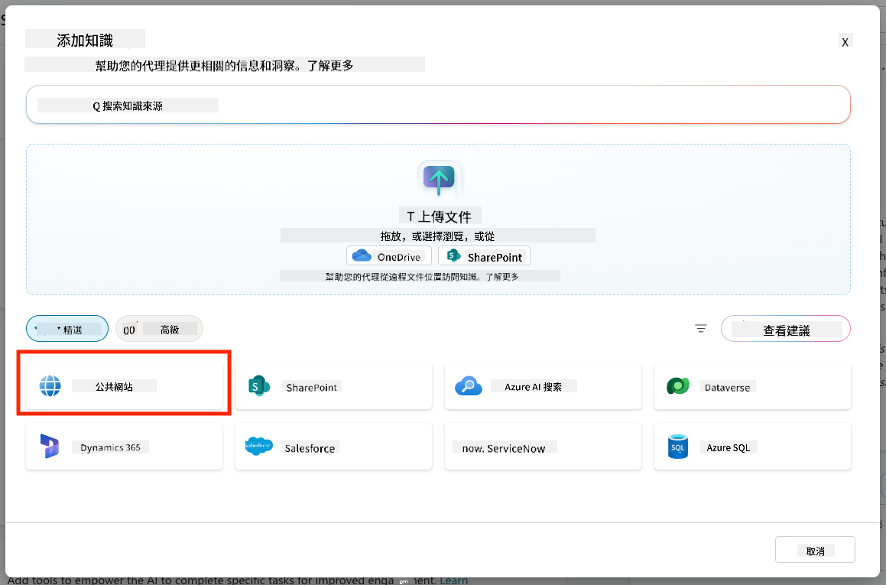

1. 在文本輸入框中，粘貼 **<https://european-union.europa.eu/>** 並選擇 **添加**

    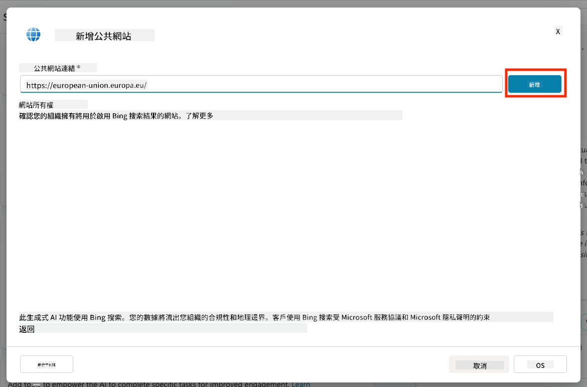

1. 選擇 **添加到代理**

    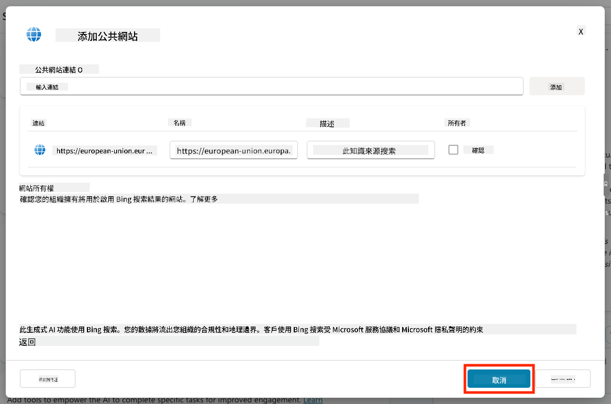

### 5.4 測試並發布

1. 點擊右上角的 **測試** 以啟動測試窗口  

1. 嘗試以下短語：

    - `“我需要簽證才能從美國到阿姆斯特丹旅行嗎？”`
    - `“辦理美國護照需要多長時間？”`
    - `“美國駐西班牙瓦倫西亞最近的大使館在哪裡？”`

1. 確認代理提供準確且有幫助的信息，並觀察活動地圖以查看它檢索信息的來源。

    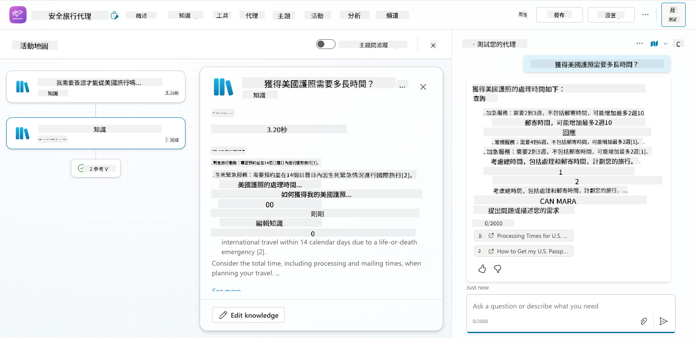

1. 準備好後，點擊 **發布**

    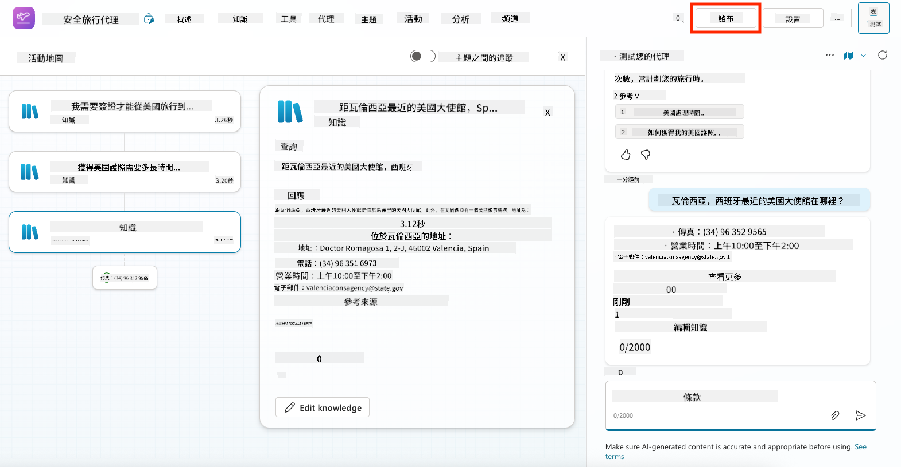

1. 在對話框中再次選擇 **發布**
    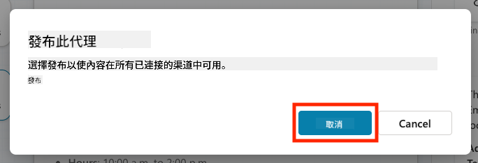

1. 可選：使用內建的 **頻道** 功能將代理添加到 Microsoft Teams。

!!! note "🧳 額外目標"
    嘗試使用 SharePoint 網站或 FAQ 文件為安全旅行代理提供基礎數據，使其更符合您公司的旅行政策。

## ✅ 任務完成

您已成功：

- 部署 Microsoft 預建代理  
- 自定義代理
- 測試並發布您自己的 **安全旅行** 代理模板版本

⏭️ [前往 **從零開始創建自定義代理** 課程](../06-create-agent-from-conversation/README.md)。

<!-- markdownlint-disable-next-line MD033 -->

---

**免責聲明**：  
本文件已使用 AI 翻譯服務 [Co-op Translator](https://github.com/Azure/co-op-translator) 進行翻譯。儘管我們努力確保翻譯的準確性，但請注意，自動翻譯可能包含錯誤或不準確之處。原始文件的母語版本應被視為權威來源。對於關鍵信息，建議使用專業人工翻譯。我們對因使用此翻譯而引起的任何誤解或誤釋不承擔責任。