<!--
CO_OP_TRANSLATOR_METADATA:
{
  "original_hash": "9dceeba2eae2bb73e328602a060eddab",
  "translation_date": "2025-10-22T19:47:11+00:00",
  "source_file": "docs/recruit/11-publish-your-agent/README.md",
  "language_code": "tw"
}
-->
# 🚨 任務 11：發佈您的代理

## 🕵️‍♂️ 行動代號：`行動發佈發佈發佈`

> **⏱️ 行動時間窗口：** `~30分鐘`  

🎥 **觀看操作指南**

[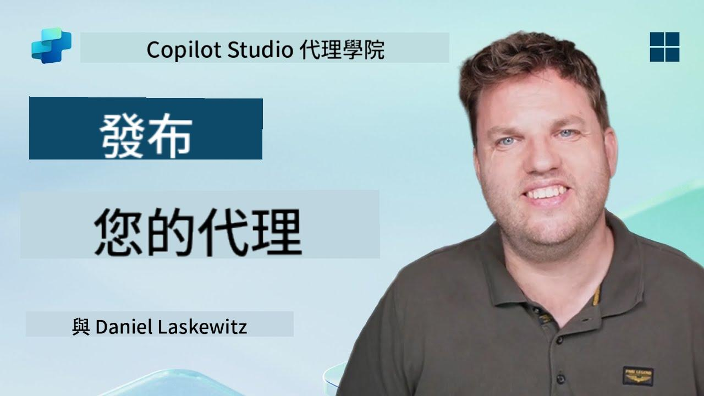](https://www.youtube.com/watch?v=eVZmljhYlSI "在 YouTube 上觀看操作指南")

## 🎯 任務簡介

完成了一系列挑戰模組後，代理製作者，您現在已準備好進行最關鍵的一步：發佈您的代理。是時候讓您的創作在 Microsoft Teams 和 Microsoft 365 Copilot 中向用戶提供服務了。

您的代理——配備了明確的任務、強大的工具以及關鍵知識來源——已準備好提供服務。使用 Microsoft Copilot Studio，您可以部署您的代理，讓它開始在用戶的工作環境中提供協助。

讓我們啟動您的代理進入行動。

## 🔎 目標

📖 本課程涵蓋：

1. 為什麼發佈您的代理很重要
1. 發佈代理時會發生什麼
1. 如何新增頻道（Microsoft Teams 和 Microsoft 365 Copilot）
1. 如何將代理新增到 Microsoft Teams
1. 如何讓代理在 Microsoft Teams 中向整個組織提供服務

## 🚀 發佈代理

每次您在 Copilot Studio 中工作代理時，可能會透過新增知識或工具來更新它。當您完成所有更改並進行充分測試後，您就可以準備發佈它了。發佈確保最新更新已上線。如果您更新了代理的工具，但未按下發佈按鈕，這些更新將無法供最終用戶使用。

確保每次您希望將更新推送給代理的用戶時，都按下發佈按鈕。您的代理可能已新增了頻道，當您按下發佈按鈕時，更新將可供您代理新增的所有頻道使用。

## ⚙️ 配置頻道

頻道決定了您的用戶可以在哪裡訪問並與您的代理互動。發佈代理後，您可以讓它在多個頻道中可用。每個頻道可能會以不同的方式顯示您的代理內容。

您可以將代理新增到以下頻道：

- **Microsoft Teams 和 Microsoft 365 Copilot** - 讓您的代理可用於 Teams 聊天和會議，以及 Microsoft 365 Copilot 的使用體驗中（[了解更多](https://learn.microsoft.com/microsoft-copilot-studio/publication-add-bot-to-microsoft-teams)）
- **演示網站** - 在 Copilot Studio 提供的演示網站上測試您的代理（[了解更多](https://learn.microsoft.com/microsoft-copilot-studio/publication-connect-bot-to-web-channels)）
- **自訂網站** - 將您的代理直接嵌入到您自己的網站中（[了解更多](https://learn.microsoft.com/microsoft-copilot-studio/publication-connect-bot-to-web-channels)）
- **移動應用程式** - 將您的代理整合到自訂移動應用程式中（[了解更多](https://learn.microsoft.com/microsoft-copilot-studio/publication-connect-bot-to-custom-application)）
- **SharePoint** - 將您的代理新增到 SharePoint 網站以提供文件和網站協助（[了解更多](https://learn.microsoft.com/microsoft-copilot-studio/publication-add-bot-to-sharepoint)）
- **Facebook Messenger** - 通過 Facebook 的消息平台與用戶連接（[了解更多](https://learn.microsoft.com/microsoft-copilot-studio/publication-add-bot-to-facebook)）
- **Power Pages** - 將您的代理整合到 Power Pages 網站中（[了解更多](https://learn.microsoft.com/microsoft-copilot-studio/publication-add-bot-to-power-pages)）
- **Azure Bot Service 頻道** - 訪問其他頻道，包括 Slack、Telegram、Twilio SMS 等（[了解更多](https://learn.microsoft.com/microsoft-copilot-studio/publication-connect-bot-to-azure-bot-service-channels)）

要新增頻道，請導航到代理中的 **Channels** 標籤並選擇您想要配置的頻道。每個頻道都有特定的設置要求，可能需要額外的身份驗證或配置步驟。

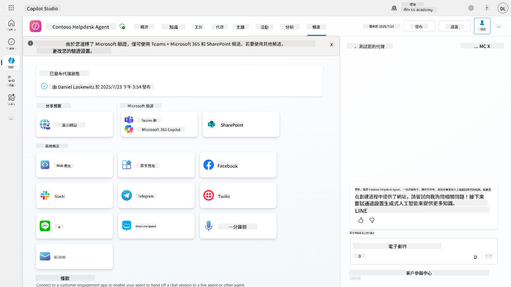

## 📺 頻道體驗

不同頻道有不同的用戶體驗。當為多個頻道構建代理時，請確保了解每個頻道的差異。測試您的代理在多個頻道中的表現，確保它能夠達到您的預期是一個不錯的策略。

| 體驗                              | 網站          | Teams 和 Microsoft 365 Copilot         | Facebook                 | Dynamics Omnichannel for Customer Service                   |
| --------------------------------- | ------------- | --------------------------------------- | ------------------------ | ----------------------------------------------------------- |
| [客戶滿意度調查][1]               | 自適應卡片    | 僅限文字                               | 僅限文字                | 僅限文字                                                   |
| [多選選項][1]                     | 支援          | [最多支援六個（作為英雄卡）][4]        | [最多支援13個][6]       | [部分支援][8]                                              |
| [Markdown][2]                     | 支援          | [部分支援][5]                          | [部分支援][7]           | [部分支援][9]                                              |
| [歡迎消息][1]                     | 支援          | 支援                                   | 不支援                  | 支援 [聊天][10]。其他頻道不支援。                          |
| [您是否想要][3]                   | 支援          | 支援                                   | 支援                    | 支援 [Microsoft Teams][11]、[聊天][10]、Facebook 和僅限文字頻道（通過 [TeleSign][12] 和 [Twilio][13] 的短消息服務 (SMS)、[WhatsApp][14]、[WeChat][15] 和 [Twitter][16]）。建議的操作以僅限文字列表呈現；用戶必須重新輸入選項以回應。 |

[1]: https://learn.microsoft.com/microsoft-copilot-studio/authoring-create-edit-topics
[2]: https://daringfireball.net/projects/markdown/
[3]: https://learn.microsoft.com/microsoft-copilot-studio/advanced-ai-features
[4]: https://learn.microsoft.com/microsoftteams/platform/concepts/cards/cards-reference#hero-card
[5]: https://learn.microsoft.com/microsoftteams/platform/bots/how-to/format-your-bot-messages#text-only-messages
[6]: https://developers.facebook.com/docs/messenger-platform/send-messages/quick-replies/
[7]: https://www.facebook.com/help/147348452522644?helpref=related
[8]: https://learn.microsoft.com/dynamics365/customer-service/asynchronous-channels#suggested-actions-support
[9]: https://learn.microsoft.com/dynamics365/customer-service/asynchronous-channels#preview-support-for-formatted-messages
[10]: https://learn.microsoft.com/dynamics365/customer-service/set-up-chat-widget
[11]: https://learn.microsoft.com/dynamics365/customer-service/configure-microsoft-teams
[12]: https://learn.microsoft.com/dynamics365/customer-service/configure-sms-channel
[13]: https://learn.microsoft.com/dynamics365/customer-service/configure-sms-channel-twilio
[14]: https://learn.microsoft.com/dynamics365/customer-service/configure-whatsapp-channel
[15]: https://learn.microsoft.com/dynamics365/customer-service/configure-wechat-channel
[16]: https://learn.microsoft.com/dynamics365/customer-service/configure-twitter-channel

> [!NOTE]
> 以下是一些可以針對不同頻道使用不同邏輯的示例。Henry Jammes 分享了一個示例，展示如何在頻道為 Microsoft Teams 時顯示不同的自適應卡片。（[示例連結](https://github.com/pnp/powerplatform-snippets/blob/main/copilot-studio/multiple-topics-matched-topic/source/multiple-topics-matched.yaml#L40)）

## 🧪 實驗 11：將您的代理發佈到 Teams 和 Microsoft 365 Copilot

### 🎯 使用案例

您的 Contoso IT 幫助台代理現在已完全配置了強大的功能——它可以訪問 SharePoint 知識來源、創建支持票據、發送主動通知，並智能地回應用戶查詢。然而，所有這些功能目前僅在您構建它的開發環境中可用。

**挑戰：** 最終用戶無法受益於您的代理功能，直到它被正確發佈並通過用戶實際工作的頻道提供訪問。

**解決方案：** 發佈您的代理確保最新版本——包括您最近的更新、新主題、增強的知識來源和配置的流程——可供真實用戶使用。如果不進行發佈，用戶仍然會與代理的舊版本互動，可能會缺少關鍵功能。

新增 Teams 和 Microsoft 365 Copilot 頻道同樣至關重要，因為：

- **Teams 整合：** 您的組織員工大部分時間都在 Microsoft Teams 中進行協作、開會和溝通。通過將您的代理新增到 Teams，用戶可以在不離開主要工作環境的情況下獲得 IT 支援。

- **Microsoft 365 Copilot：** 用戶可以直接在 Microsoft 365 Copilot 體驗中訪問您的專業 IT 幫助台代理，無縫整合到他們的日常工作流程中。

- **集中訪問：** 用戶無需記住單獨的網站或應用程式，可以通過他們已經使用的平台訪問 IT 支援，減少摩擦並提高採用率。

此任務將您的開發工作轉化為一個生產就緒的解決方案，為您的組織的最終用戶提供真正的價值。

### 先決條件

在開始此實驗之前，請確保您已：

- ✅ 完成之前的實驗並擁有完全配置的 Contoso 幫助台代理
- ✅ 您的代理已經過測試並準備好投入生產使用
- ✅ 擁有在 Copilot Studio 環境中發佈代理的權限
- ✅ 擁有您組織中 Microsoft Teams 的訪問權限

### 11.1 發佈您的代理

現在我們已完成代理的所有工作，我們必須確保所有工作都可供將要使用代理的最終用戶使用。為確保內容可供所有用戶使用，我們需要發佈代理。

1. 在 Copilot Studio 中進入 Contoso 幫助台代理（通過 [Copilot Studio 製作人入口](https://copilotstudio.microsoft.com)）

    在 Copilot Studio 中，發佈您的代理非常簡單。您只需在代理概覽的頂部選擇發佈按鈕。

    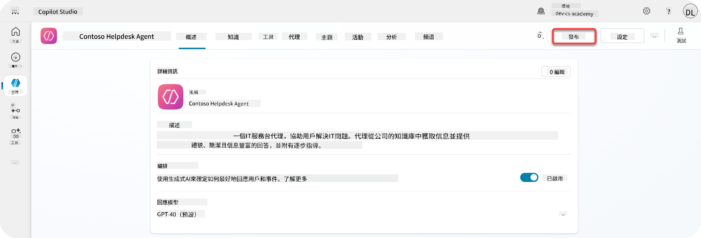

1. 在您的代理中選擇 **Publish** 按鈕

    它會打開發佈彈出窗口——確認您確實希望發佈您的代理。

    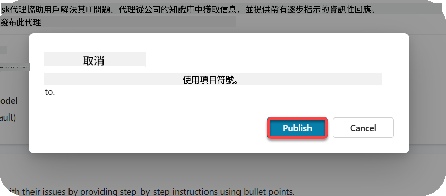

1. 選擇 **Publish** 以確認發佈您的代理

    現在會顯示一條消息，表明您的代理正在發佈。您不需要保持該彈出窗口開啟。代理發佈完成後，您會收到通知。

    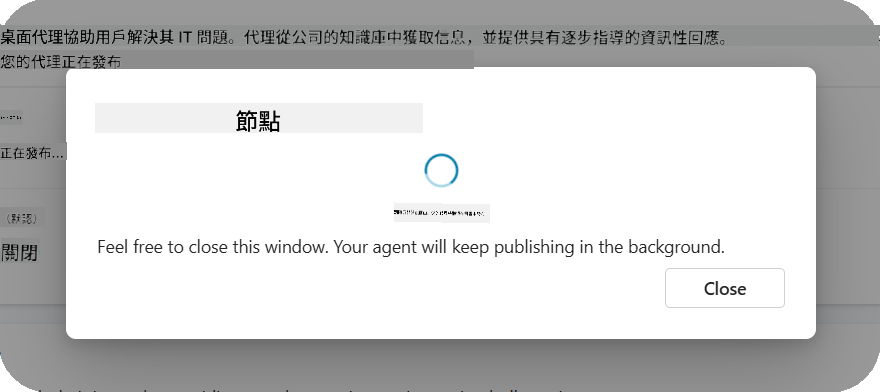

    當代理發佈完成後，您會在代理頁面頂部看到通知。

    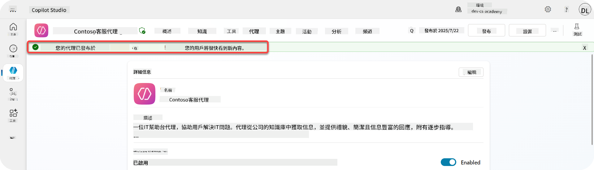

但是——我們僅僅發佈了代理，還沒有將它新增到頻道中，所以現在讓我們來解決這個問題！

### 11.2 新增 Teams 和 Microsoft 365 Copilot 頻道

1. 要將 Teams 和 Microsoft 365 Copilot 頻道新增到我們的代理，我們需要在代理的頂部導航中選擇 **Channel**

    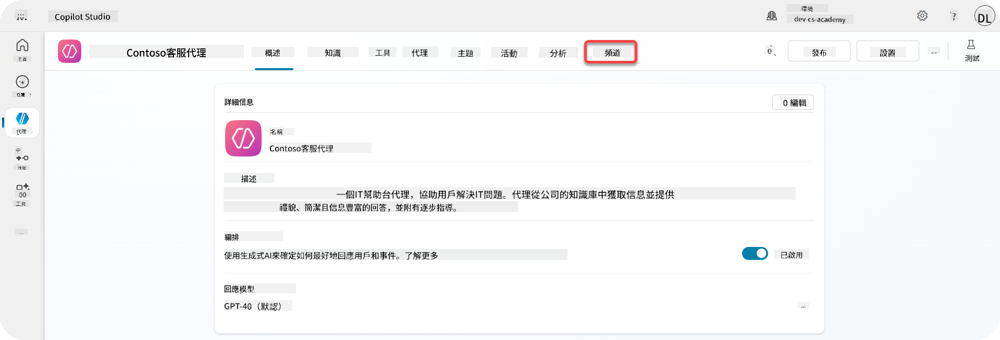

    在這裡，我們可以看到所有可以新增到此代理的頻道。

1. 選擇 **Teams 和 Microsoft 365**

    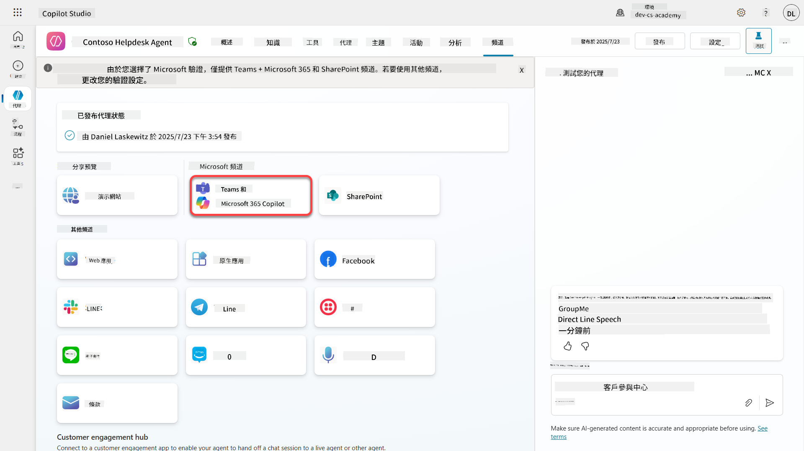

1. 選擇 **Add channel** 完成向導並將頻道新增到代理

    

    新增頻道需要一段時間。新增完成後，側邊欄頂部會出現綠色通知。

    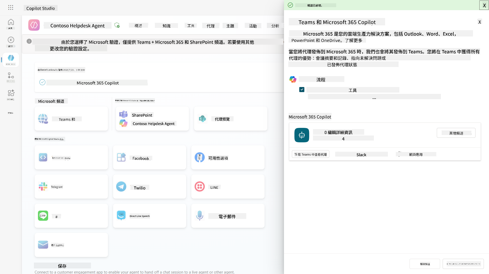

1. 選擇 **See agent in Teams** 打開新標籤頁

    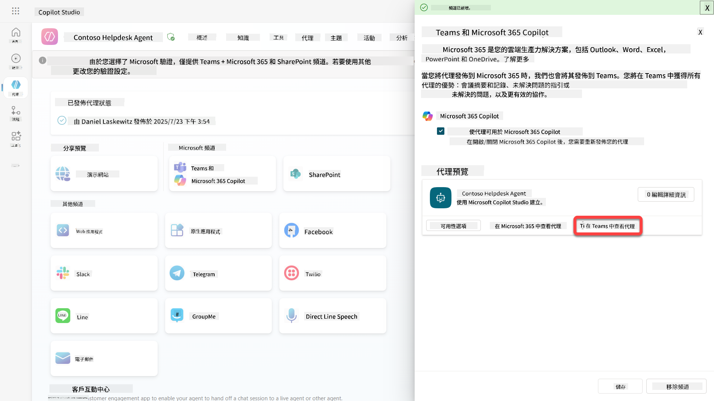

1. 選擇 **Add** 將 Contoso 幫助台代理新增到 Teams

    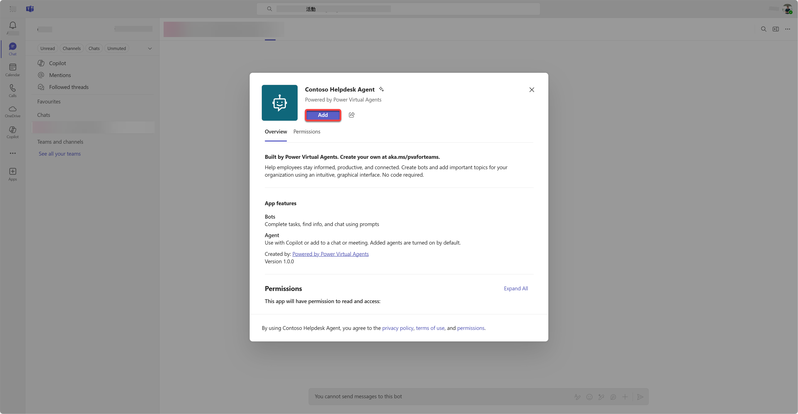

    這需要一段時間。完成後應顯示以下畫面：

    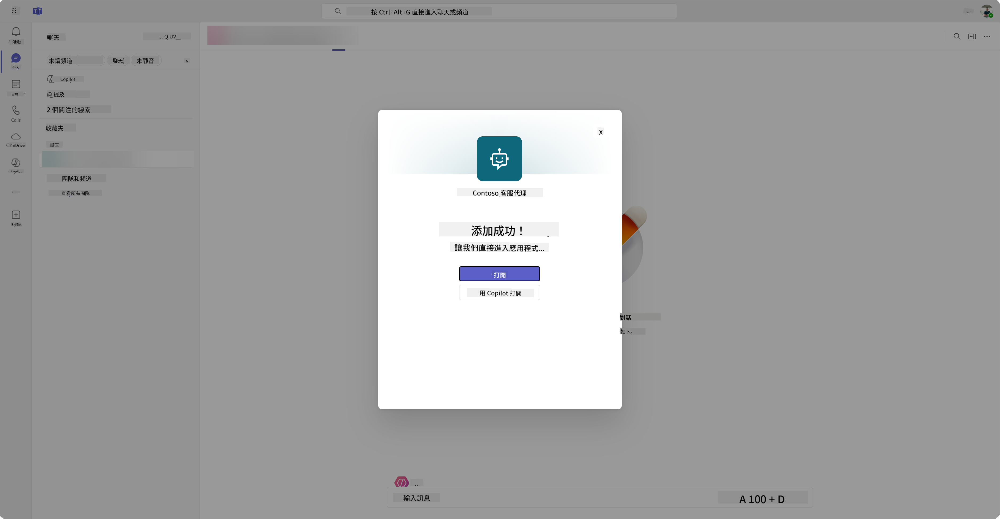

1. 選擇 **Open** 在 Teams 中打開代理

    這將在 Teams 中以 Teams 應用程式的形式打開代理

    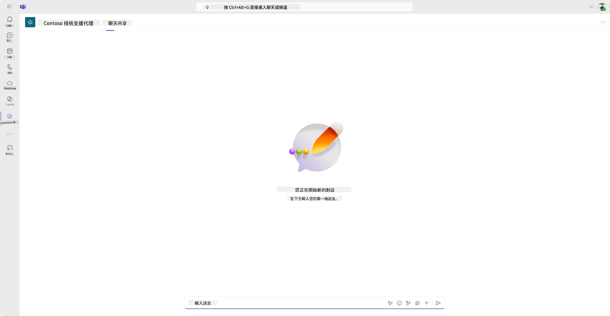

現在我們已將代理發佈到 Microsoft Teams 中供您使用，但您可能希望讓更多人可以使用它。

### 11.3 讓代理在租戶中向所有用戶提供服務

1. 關閉打開 Contoso 幫助台代理的瀏覽器標籤

    這應該會將您帶回 Copilot Studio，Teams 和 Microsoft 365 Copilot 側邊欄仍然開啟。我們現在僅在 Teams 中打開了代理，但我們可以做更多事情。我們可以編輯代理的詳細信息，將代理部署給更多用戶等等。

1. 選擇 **Edit details**

    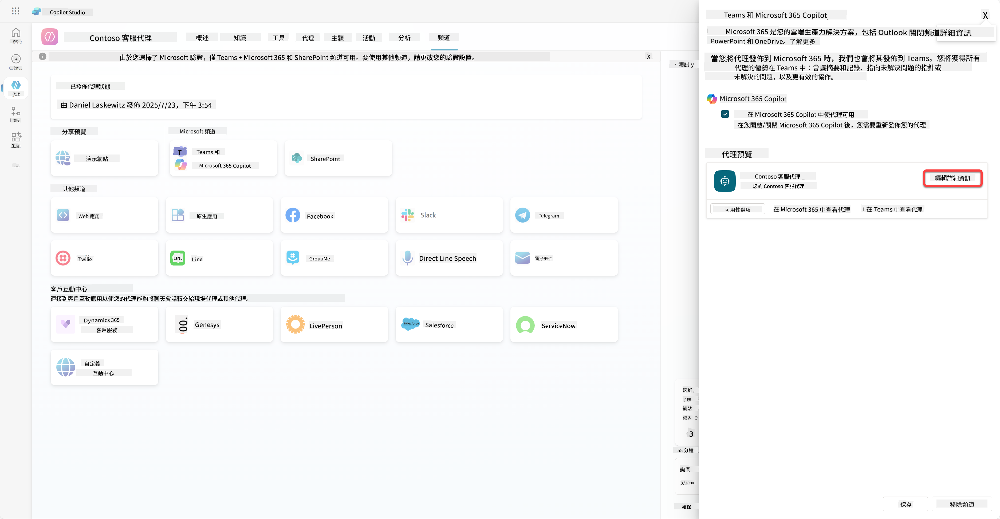
這將開啟一個窗格，讓我們可以更改代理的多項細節和設定。我們可以更改基本細節，例如圖示、圖示的背景顏色以及描述。我們也可以在此更改 Teams 的設定（例如允許使用者將代理新增到團隊，或允許在群組和會議聊天中使用此代理）。選擇 *更多* 時，還可以更改開發者的細節，例如開發者名稱、網站、隱私聲明和使用條款。

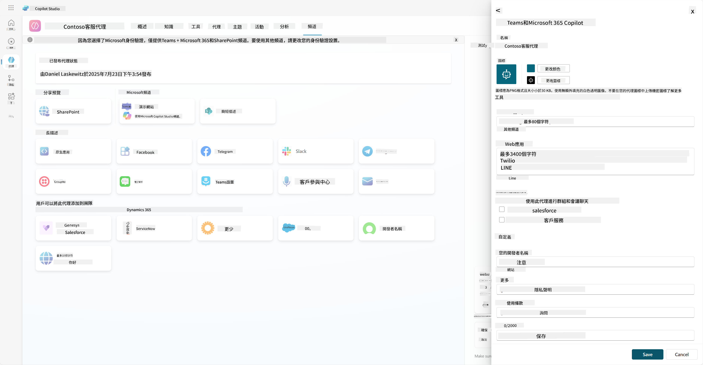

1. 選擇 **取消** 以關閉編輯細節窗格

1. 選擇 **可用性選項**

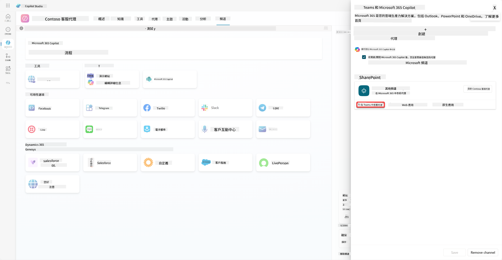

這將開啟可用性選項窗格，您可以複製一個連結以發送給使用者使用此代理（請注意，您需要與使用者分享代理），並且可以下載一個檔案以將您的代理新增到 Microsoft Teams 或 Microsoft 365 商店。若要在商店中顯示代理，您還有其他選項：您可以將其顯示給您的團隊成員和共享使用者（顯示在 *使用 Power Platform 建立* 區段中），或者您可以將其顯示給組織中的所有人（這需要管理員批准）。

1. 選擇 **顯示給我的組織中的所有人**

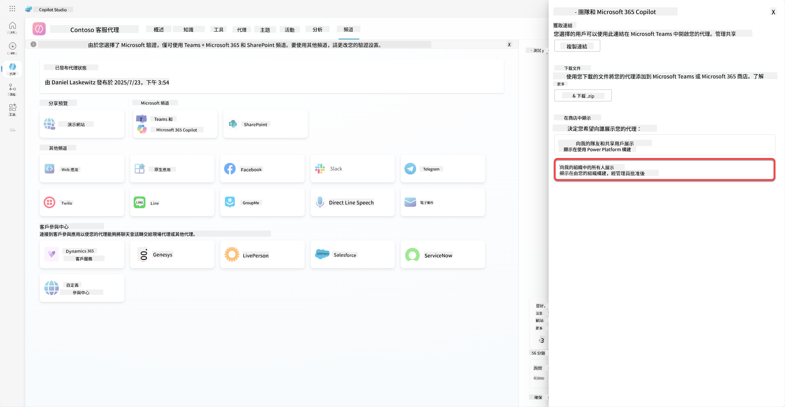

1. 選擇 **提交以供管理員批准**

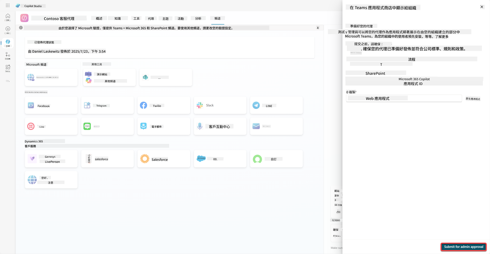

現在，您的管理員需要批准您的代理提交。他們可以前往 Teams 管理中心，並在應用程式中查找 Contoso Helpdesk Agent。在截圖中，您可以看到管理員在 Teams 管理中心會看到的內容。

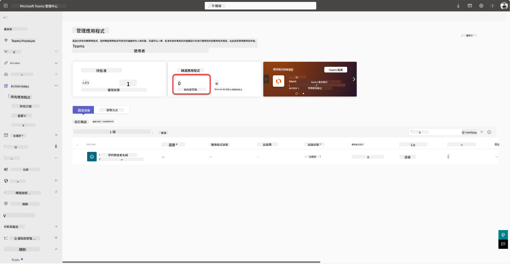

管理員需要選擇 Contoso Helpdesk Agent 並選擇 *發佈*，以將 Contoso Helpdesk Agent 發佈給所有人。

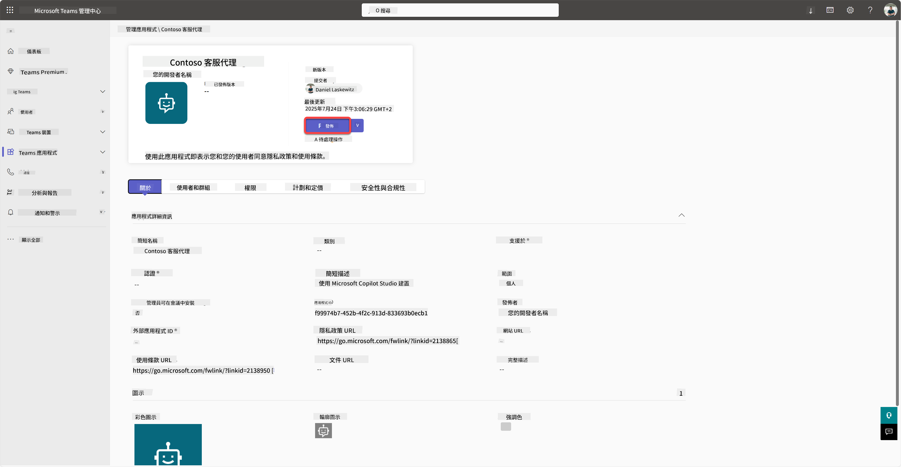

當管理員發佈了代理提交後，您可以刷新 Copilot Studio，並應該在可用性選項中看到 *在應用程式商店中可用* 的橫幅。

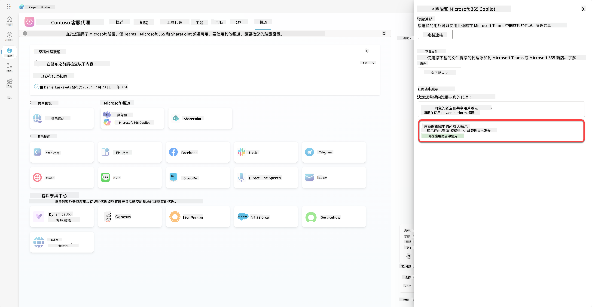

這裡還有更多可能性。您的管理員可以更改全域設定政策，並自動為租戶中的所有人安裝 Contoso Helpdesk Agent。此外，您還可以將 Contoso Helpdesk Agent 固定到左側欄，讓所有人都能輕鬆存取。

## ✅ 任務完成

🎉 **恭喜！** 您成功發佈了您的代理並將其新增到 Teams 和 Microsoft 365 Copilot！接下來是課程的最後一個任務：了解授權。

⏭️ [前往 **了解授權** 課程](../12-understanding-licensing/README.md)

## 📚 策略資源

🔗 [發佈管道文件](https://learn.microsoft.com/microsoft-copilot-studio/publication-fundamentals-publish-channels)

---

**免責聲明**：  
本文件已使用 AI 翻譯服務 [Co-op Translator](https://github.com/Azure/co-op-translator) 進行翻譯。儘管我們致力於提供準確的翻譯，請注意自動翻譯可能包含錯誤或不準確之處。原始文件的母語版本應被視為權威來源。對於關鍵資訊，建議使用專業人工翻譯。我們對因使用此翻譯而引起的任何誤解或誤釋不承擔責任。