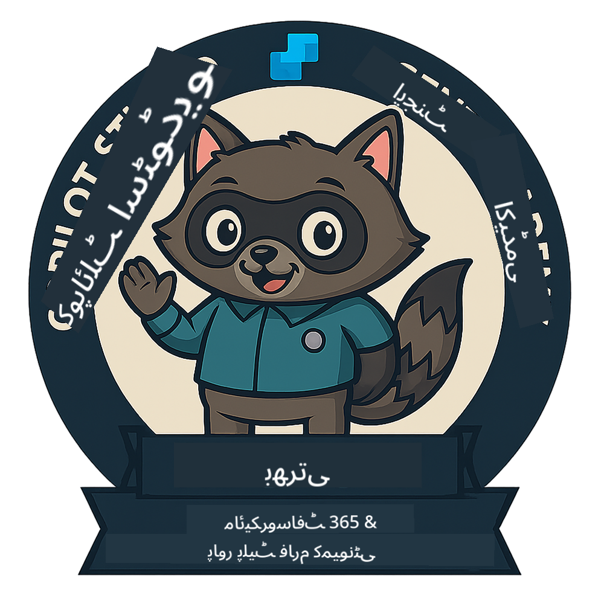
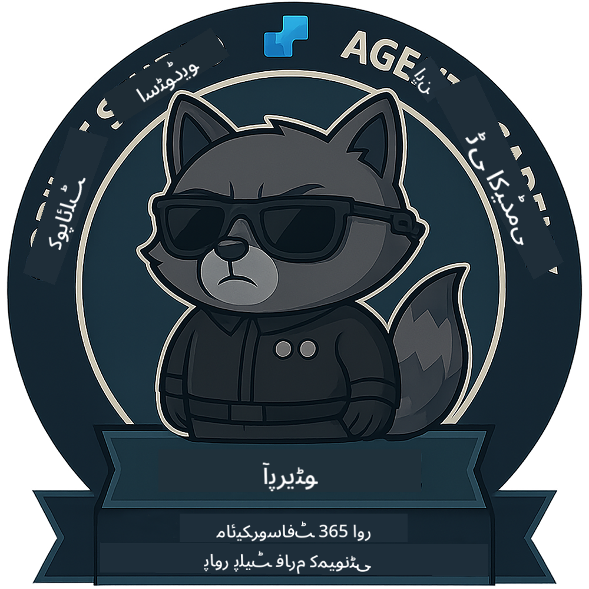
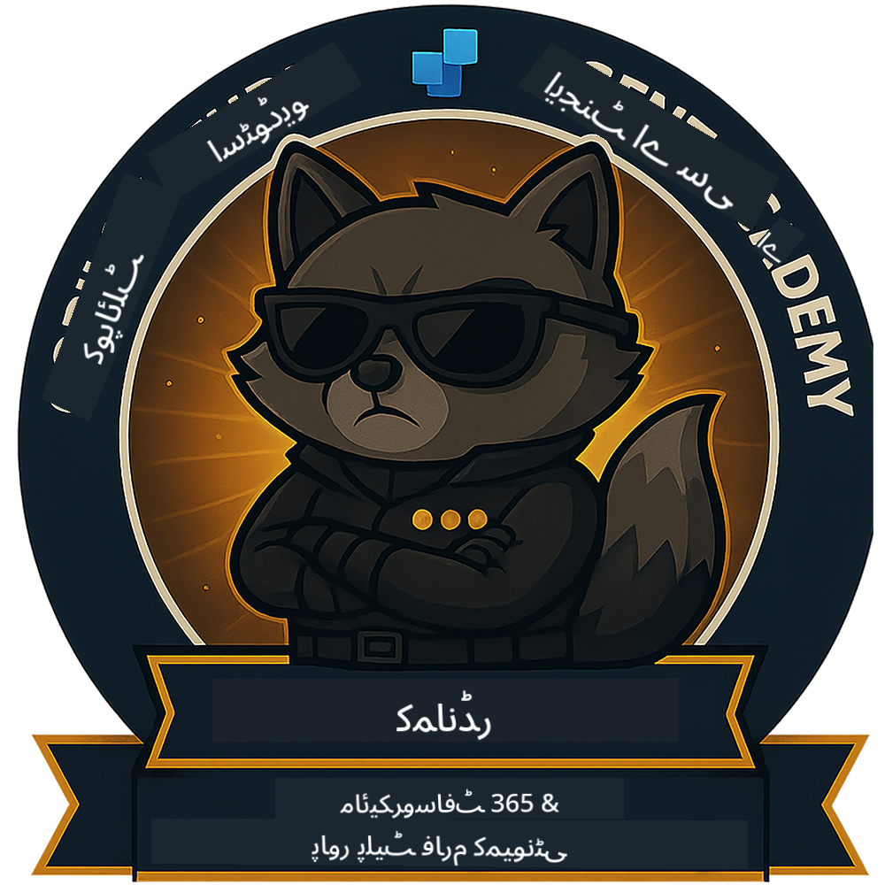

<!--
CO_OP_TRANSLATOR_METADATA:
{
  "original_hash": "15e57e059ce7689d602d7853187235cd",
  "translation_date": "2025-10-22T18:46:46+00:00",
  "source_file": "docs/index.md",
  "language_code": "ur"
}
-->
---
hide:
- navigation
---

# کوپائلٹ اسٹوڈیو ایجنٹ اکیڈمی

**کوپائلٹ اسٹوڈیو ایجنٹ اکیڈمی میں خوش آمدید۔**  

آپ کا مشن—اگر آپ اسے قبول کرتے ہیں—**مائیکروسافٹ کوپائلٹ اسٹوڈیو** کے ذریعے ایجنٹس بنانے کے فن میں مہارت حاصل کرنا ہے۔

یہ عملی تربیت آپ کو **ایجنٹس کی دنیا** میں داخل ہونے کا موقع فراہم کرتی ہے: بنیادی پرامپٹس سے لے کر ایڈاپٹیو کارڈز اور ایجنٹ فلو تک، آپ حقیقی دنیا کے ٹولز اور استعمال کے کیسز کے ذریعے ذہین ایجنٹس بنانے، بڑھانے اور تعینات کرنے کا طریقہ سیکھیں گے۔

---

## 🏅 رینک کی ترقی

**کوپائلٹ اسٹوڈیو ایجنٹ اکیڈمی** ایک کثیر مرحلہ تربیتی پروگرام ہے جو آپ کی مہارتوں کو تین ایجنٹ رینکس میں بڑھانے کے لیے ڈیزائن کیا گیا ہے۔ ہر سطح میں ایک بیج اور بڑھتی ہوئی ذمہ داریاں شامل ہیں:

| رینک             | سطح | بصری |
|------------------|:-----:|--------|
| 🟢 **ریکروٹ**  [🚀 شروعات کریں](https://aka.ms/agent-academy-recruit){ .md-button .md-button--primary }     | •     | { width="300" }     |
| 🔵 **آپریٹو** (جلد آرہا ہے)   | ••    | { width="300" } |
| 🟡 **کمانڈر** (جلد آرہا ہے)    | •••   | { width="300" } |

ہر سطح پچھلی سطح پر مبنی ہوتی ہے۔ اپنی ریکروٹ مشن مکمل کریں، اور اپنی ایجنٹ اسناد کو بڑھانے کے لیے تیار رہیں۔

---

## 🎒 دیگر کورسز

AI اور ایجنٹس کے بارے میں مزید سیکھنے کے لیے ان دیگر کورسز کو دیکھیں:

- [مائیکروسافٹ کوپائلٹ اسٹوڈیو <3 MCP لیب](https://aka.ms/mcsmcplab)
- [کوپائلٹ ڈیولپر کیمپ](https://microsoft.github.io/copilot-camp/)
- [AI ایجنٹس برائے ابتدائی افراد](https://microsoft.github.io/ai-agents-for-beginners/)
- [ماڈل کانٹیکسٹ پروٹوکول (MCP) برائے ابتدائی افراد](https://github.com/microsoft/mcp-for-beginners)

---

## 🚑 مسائل

ہم آپ کی رائے کی بہت قدر کرتے ہیں! براہ کرم اپنے تبصرے اور مسائل شیئر کرنے کے لیے [مسائل کی فہرست](https://github.com/microsoft/agent-academy/issues) کا استعمال کریں۔ شکریہ!

---

## 📜 ضابطہ اخلاق

اس پروجیکٹ نے [مائیکروسافٹ اوپن سورس ضابطہ اخلاق](https://opensource.microsoft.com/codeofconduct/) کو اپنایا ہے۔

!!! info "وسائل:"

    - [مائیکروسافٹ اوپن سورس ضابطہ اخلاق](https://opensource.microsoft.com/codeofconduct/)
    - [مائیکروسافٹ ضابطہ اخلاق FAQ](https://opensource.microsoft.com/codeofconduct/faq/)
    - سوالات یا خدشات کے لیے [opencode@microsoft.com](mailto:opencode@microsoft.com) سے رابطہ کریں

---

[⭐️ ہمارے ریپو کو اسٹار کریں](https://github.com/microsoft/agent-academy){ .md-button .md-button--primary }

<!-- markdownlint-disable-next-line MD033 -->

---

**ڈسکلیمر**:  
یہ دستاویز AI ترجمہ سروس [Co-op Translator](https://github.com/Azure/co-op-translator) کا استعمال کرتے ہوئے ترجمہ کی گئی ہے۔ ہم درستگی کے لیے کوشش کرتے ہیں، لیکن براہ کرم آگاہ رہیں کہ خودکار ترجمے میں غلطیاں یا غیر درستیاں ہو سکتی ہیں۔ اصل دستاویز کو اس کی اصل زبان میں مستند ذریعہ سمجھا جانا چاہیے۔ اہم معلومات کے لیے، پیشہ ور انسانی ترجمہ کی سفارش کی جاتی ہے۔ ہم اس ترجمے کے استعمال سے پیدا ہونے والی کسی بھی غلط فہمی یا غلط تشریح کے ذمہ دار نہیں ہیں۔