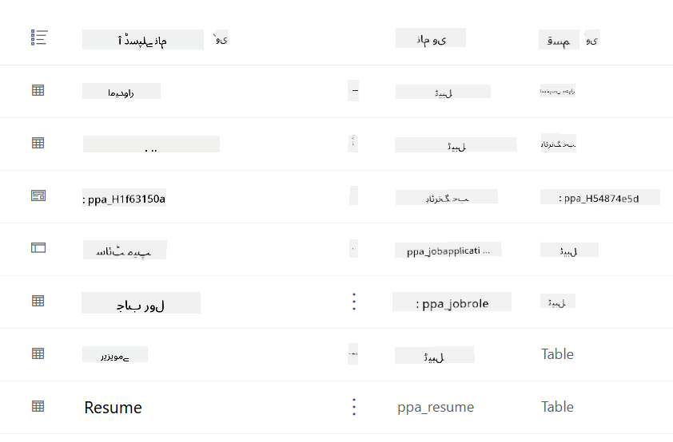
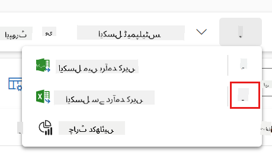
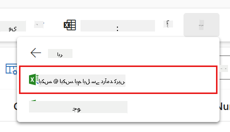
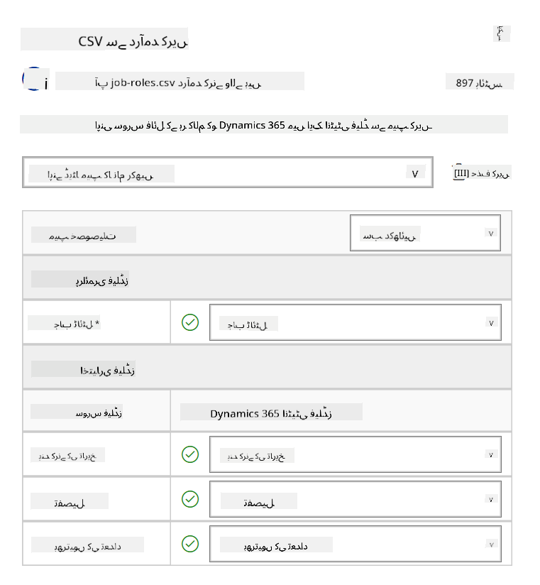
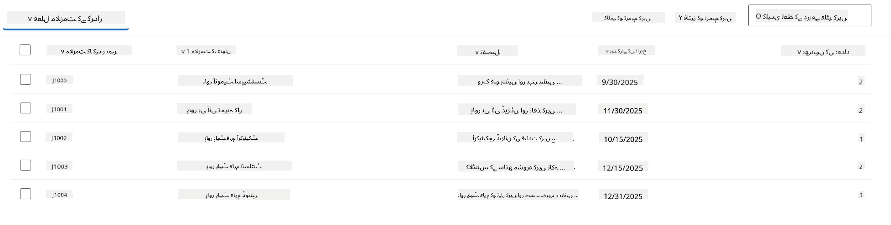
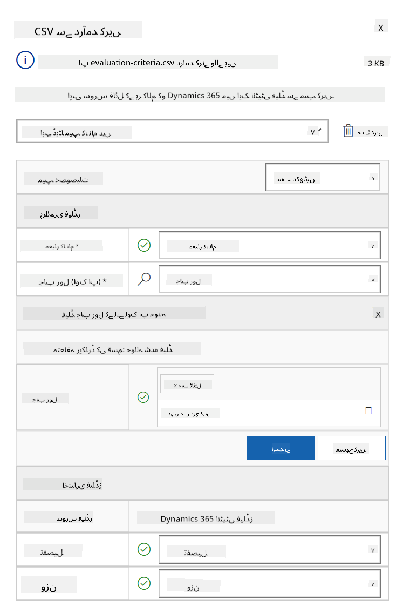
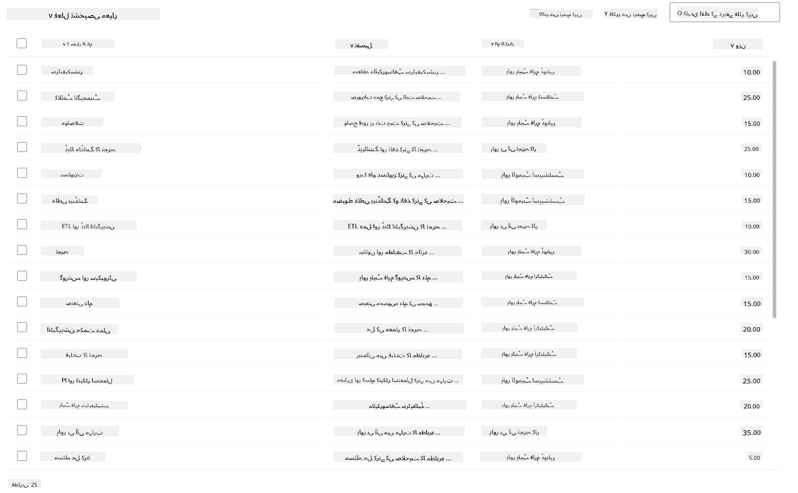

<!--
CO_OP_TRANSLATOR_METADATA:
{
  "original_hash": "2620cf9eaf09a3fc6be7fa31a3a62956",
  "translation_date": "2025-10-22T19:09:18+00:00",
  "source_file": "docs/operative-preview/01-get-started/README.md",
  "language_code": "ur"
}
-->
# 🚨 مشن 01: ہائرنگ ایجنٹ کے ساتھ شروعات کریں

--8<-- "disclaimer.md"

## 🕵️‍♂️ کوڈ نیم: `آپریشن ٹیلنٹ اسکاؤٹ`

> **⏱️ آپریشن کا وقت:** `~45 منٹ`

## 🎯 مشن کا خلاصہ

خوش آمدید، ایجنٹ۔ آپ کا پہلا کام **آپریشن ٹیلنٹ اسکاؤٹ** ہے - ایک AI سے چلنے والے بھرتی کے نظام کے بنیادی ڈھانچے کو قائم کرنا جو تنظیموں کو بہترین ٹیلنٹ کی شناخت اور بھرتی کے طریقے کو تبدیل کرے گا۔

آپ کا مشن، اگر آپ اسے قبول کرتے ہیں، تو Microsoft Copilot Studio کا استعمال کرتے ہوئے ایک جامع ہائرنگ مینجمنٹ سسٹم کو تعینات اور ترتیب دینا ہے۔ آپ ایک پہلے سے تیار شدہ حل درآمد کریں گے جس میں تمام ضروری ڈیٹا اسٹرکچرز شامل ہوں گے، پھر اپنا پہلا AI ایجنٹ بنائیں گے - **ہائرنگ ایجنٹ** - جو مستقبل کے تمام بھرتی آپریشنز کے لیے مرکزی منتظم کے طور پر کام کرے گا۔

یہ ابتدائی تعیناتی کمانڈ سینٹر قائم کرتی ہے جسے آپ ایجنٹ اکیڈمی آپریٹو پروگرام کے دوران بہتر بنائیں گے۔ اسے اپنے آپریشنز کی بنیاد سمجھیں - وہ بنیاد جس پر آپ اگلے مشنز میں خصوصی ایجنٹس کا پورا نیٹ ورک بنائیں گے۔

---

## 🔎 مقاصد

اس مشن کو مکمل کرکے، آپ:

- **منظر نامے کی سمجھ**: ہائرنگ آٹومیشن کے چیلنجز اور حل کے بارے میں جامع معلومات حاصل کریں گے
- **حل کی تعیناتی**: ہائرنگ مینجمنٹ سسٹم کے بنیادی اصولوں کو کامیابی سے درآمد اور ترتیب دیں گے
- **ایجنٹ کی تخلیق**: ایک ہائرنگ ایجنٹ بنائیں گے جو اس منظر نامے کا آغاز ہوگا جسے آپ ایجنٹ اکیڈمی آپریٹو کے طور پر بنائیں گے

---

## 🔍 ضروریات

اس مشن پر جانے سے پہلے، یقینی بنائیں کہ آپ کے پاس:

- Copilot Studio لائسنس
- Microsoft Power Platform ماحول تک رسائی
- حل اور ایجنٹس بنانے کے لیے انتظامی اجازتیں

---

## 🏢 ہائرنگ آٹومیشن منظر نامے کو سمجھنا

یہ منظر نامہ ظاہر کرتا ہے کہ ایک کمپنی Microsoft Copilot Studio کا استعمال کرکے اپنے ہائرنگ کے عمل کو کیسے بہتر اور خودکار بنا سکتی ہے۔ یہ ایجنٹس کے ایک نظام کو متعارف کراتا ہے جو کاموں کو سنبھالنے کے لیے مل کر کام کرتے ہیں جیسے کہ ریزیومے کا جائزہ لینا، نوکری کے کردار تجویز کرنا، انٹرویو مواد تیار کرنا، اور امیدواروں کا جائزہ لینا۔

### کاروباری قدر

یہ حل HR ٹیموں کو وقت بچانے اور بہتر فیصلے کرنے میں مدد دیتا ہے:

- ای میل کے ذریعے موصول ہونے والے ریزیومے کو خود بخود پروسیس کرنا۔
- امیدواروں کے پروفائلز کی بنیاد پر موزوں نوکری کے کردار تجویز کرنا۔
- ہر امیدوار کے لیے نوکری کی درخواستیں اور انٹرویو گائیڈز تیار کرنا۔
- بلٹ ان سیفٹی اور ماڈریشن فیچرز کے ذریعے منصفانہ اور تعمیل شدہ ہائرنگ کے طریقے یقینی بنانا۔
- حل کو بہتر بنانے کے لیے فیڈبیک جمع کرنا۔

### یہ کیسے کام کرتا ہے

- ایک مرکزی **ہائرنگ ایجنٹ** عمل کو مربوط کرتا ہے اور Microsoft Dataverse میں ڈیٹا محفوظ کرتا ہے۔
- ایک **ایپلیکیشن انٹیک ایجنٹ** ریزیومے پڑھتا ہے اور نوکری کی درخواستیں بناتا ہے۔
- ایک **انٹرویو پریپ ایجنٹ** امیدوار کے پس منظر کی بنیاد پر انٹرویو کے سوالات اور دستاویزات تیار کرتا ہے۔
- نظام کو ایک ڈیمو ویب سائٹ پر شائع کیا جا سکتا ہے، جس سے اسٹیک ہولڈرز کو اس کے ساتھ تعامل کرنے کی اجازت ملتی ہے۔

یہ منظر نامہ ان تنظیموں کے لیے مثالی ہے جو AI سے چلنے والی آٹومیشن کا استعمال کرتے ہوئے اپنے بھرتی کے ورک فلو کو جدید بنانا چاہتے ہیں، جبکہ شفافیت، انصاف، اور کارکردگی کو برقرار رکھتے ہیں۔

---

## 🧪 لیب: ہائرنگ ایجنٹ کو ترتیب دینا

اس ہینڈز آن لیب میں، آپ اپنے ہائرنگ آٹومیشن سسٹم کی بنیاد قائم کریں گے۔ آپ ایک پہلے سے ترتیب شدہ حل درآمد کرکے شروع کریں گے جس میں امیدواروں، نوکری کے عہدوں، اور ہائرنگ ورک فلو کو منظم کرنے کے لیے تمام ضروری Dataverse ٹیبلز اور ڈیٹا اسٹرکچر شامل ہوں گے۔ اس کے بعد، آپ ان ٹیبلز کو نمونہ ڈیٹا سے بھر دیں گے جو اس ماڈیول کے دوران آپ کی سیکھنے میں مدد کرے گا اور ٹیسٹنگ کے لیے حقیقت پسندانہ منظر نامے فراہم کرے گا۔ آخر میں، آپ Copilot Studio میں ہائرنگ ایجنٹ بنائیں گے، ایک بنیادی گفتگو کا انٹرفیس ترتیب دیں گے جو آپ کے مستقبل کے مشنز میں شامل ہونے والی تمام دیگر خصوصیات کے لیے سنگ بنیاد کے طور پر کام کرے گا۔

### 🧪 لیب 1.1: حل درآمد کریں

1. **[Copilot Studio](https://copilotstudio.microsoft.com)** پر جائیں
1. بائیں نیویگیشن میں **...** منتخب کریں اور **Solutions** منتخب کریں
1. اوپر **Import Solution** بٹن منتخب کریں
1. تیار کردہ حل **[Download](https://raw.githubusercontent.com/microsoft/agent-academy/refs/heads/main/docs/operative-preview/01-get-started/assets/Operative_1_0_0_0.zip)** کریں
1. **Browse** منتخب کریں اور پچھلے مرحلے سے ڈاؤن لوڈ کردہ حل منتخب کریں
1. **Next** منتخب کریں
1. **Import** منتخب کریں

!!! success
    کامیابی پر، آپ کو ایک سبز نوٹیفکیشن بار نظر آئے گا جس میں درج ذیل پیغام ہوگا:  
    "Solution "Operative" imported successfully."

جب حل درآمد ہو جائے، تو درآمد کردہ مواد کو دیکھنے کے لیے حل کا ڈسپلے نام (`Operative`) منتخب کریں۔



درج ذیل اجزاء درآمد کیے گئے ہیں:

| ڈسپلے نام | قسم | وضاحت |
|-------------|------|-------------|
| امیدوار | ٹیبل | امیدوار کی معلومات |
| تشخیصی معیار | ٹیبل | کردار کے لیے تشخیصی معیار |
| ہائرنگ حب | ماڈل ڈرائیون ایپ | ہائرنگ کے عمل کو منظم کرنے کے لیے ایپ |
| ہائرنگ حب | سائٹ میپ | ہائرنگ حب ایپ کے لیے نیویگیشن کا ڈھانچہ |
| نوکری کی درخواست | ٹیبل | نوکری کی درخواستیں |
| نوکری کا کردار | ٹیبل | نوکری کے کردار |
| ریزیومے | ٹیبل | امیدواروں کے ریزیومے |

اس لیب کے آخری کام کے طور پر، صفحے کے اوپر **Publish all customizations** بٹن منتخب کریں۔

### 🧪 لیب 1.2: نمونہ ڈیٹا درآمد کریں

اس لیب میں، آپ ان ٹیبلز میں نمونہ ڈیٹا شامل کریں گے جو آپ نے لیب 1.1 میں درآمد کیے تھے۔

#### درآمد کرنے کے لیے فائلیں ڈاؤن لوڈ کریں

1. تشخیصی معیار کے ساتھ CSV فائل **[Download](https://raw.githubusercontent.com/microsoft/agent-academy/refs/heads/main/docs/operative-preview/01-get-started/assets/evaluation-criteria.csv)** کریں
1. نوکری کے کردار کے ساتھ CSV فائل **[Download](https://raw.githubusercontent.com/microsoft/agent-academy/refs/heads/main/docs/operative-preview/01-get-started/assets/job-roles.csv)** کریں

#### نوکری کے کردار کا نمونہ ڈیٹا درآمد کریں

1. اس حل پر واپس جائیں جو آپ نے پچھلے لیب میں درآمد کیا تھا
1. **Hiring Hub** ماڈل ڈرائیون ایپ کو منتخب کریں، صف میں چیک مارک منتخب کریں
1. اوپر **Play** بٹن منتخب کریں

    !!! warning
        آپ کو دوبارہ لاگ ان کرنے کا کہا جا سکتا ہے۔ یقینی بنائیں کہ آپ ایسا کریں۔ ایسا کرنے کے بعد، آپ کو ہائرنگ حب ایپ نظر آئے گی۔

1. بائیں نیویگیشن میں **Job Roles** منتخب کریں
1. کمانڈ بار میں **More** آئیکن (تین نقطے ایک دوسرے کے نیچے) منتخب کریں
1. *Import from Excel* کے نیچے **right arrow** منتخب کریں

    

1. **Import from CSV** منتخب کریں

    

1. **Choose File** بٹن منتخب کریں، **job-roles.csv** فائل منتخب کریں جو آپ نے ابھی ڈاؤن لوڈ کی تھی اور پھر **Open** منتخب کریں
1. **Next** منتخب کریں
1. اگلے مرحلے کو جیسا ہے ویسا چھوڑیں اور **Review Mapping** منتخب کریں

    

1. یقینی بنائیں کہ میپنگ درست ہے اور **Finish Import** منتخب کریں

    !!! info
        یہ ایک درآمد شروع کرے گا اور آپ **Done** منتخب کرکے پیش رفت کو ٹریک کرسکتے ہیں یا عمل کو فوری طور پر مکمل کرسکتے ہیں

1. **Done** منتخب کریں

یہ تھوڑا وقت لے سکتا ہے، لیکن آپ **Refresh** بٹن کو دباکر دیکھ سکتے ہیں کہ آیا درآمد کامیاب ہوئی ہے۔



#### تشخیصی معیار کا نمونہ ڈیٹا درآمد کریں

1. بائیں نیویگیشن میں **Evaluation Criteria** منتخب کریں
1. کمانڈ بار میں **More** آئیکن (تین نقطے ایک دوسرے کے نیچے) منتخب کریں
1. *Import from Excel* کے نیچے **right arrow** منتخب کریں

    

1. **Import from CSV** منتخب کریں

    

1. **Choose File** بٹن منتخب کریں، **evaluation-criteria.csv** فائل منتخب کریں جو آپ نے ابھی ڈاؤن لوڈ کی تھی اور پھر **Open** منتخب کریں
1. **Next** منتخب کریں
1. اگلے مرحلے کو جیسا ہے ویسا چھوڑیں اور **Review Mapping** منتخب کریں

    

1. اب ہمیں میپنگ کے لیے تھوڑا سا مزید کام کرنا ہوگا۔ **Job Role** فیلڈ کے ساتھ میگنیفائنگ گلاس (🔎 آئیکن) منتخب کریں
1. یقینی بنائیں کہ یہاں **Job Title** منتخب ہے، اور اگر نہیں - تو اسے شامل کریں
1. **OK** منتخب کریں
1. یقینی بنائیں کہ باقی میپنگ بھی درست ہے اور **Finish Import** منتخب کریں

    !!! info
        یہ دوبارہ ایک درآمد شروع کرے گا اور آپ **Done** منتخب کرکے پیش رفت کو ٹریک کرسکتے ہیں یا عمل کو فوری طور پر مکمل کرسکتے ہیں

1. **Done** منتخب کریں

یہ تھوڑا وقت لے سکتا ہے، لیکن آپ **Refresh** بٹن کو دباکر دیکھ سکتے ہیں کہ آیا درآمد کامیاب ہوئی ہے۔



### 🧪 لیب 1.3: ہائرنگ ایجنٹ بنائیں

اب جب کہ آپ نے ضروریات کی ترتیب مکمل کر لی ہے، اصل کام کا وقت آ گیا ہے! آئیے پہلے اپنا ہائرنگ ایجنٹ شامل کریں!

1. **[Copilot Studio](https://copilotstudio.microsoft.com)** پر جائیں اور یقینی بنائیں کہ آپ اسی ماحول میں ہیں جہاں آپ نے حل اور ڈیٹا درآمد کیا تھا
1. بائیں نیویگیشن میں **Agents** منتخب کریں
1. **New Agent** منتخب کریں
1. **Configure** منتخب کریں
1. **Name** کے لیے درج کریں:

    ```text
    Hiring Agent
    ```

1. **Description** کے لیے درج کریں:

    ```text
    Central orchestrator for all hiring activities
    ```

1. اوپر دائیں کونے میں *Create* بٹن کے ساتھ **...** منتخب کریں
1. **Update advanced settings** منتخب کریں
1. **Solution** کے طور پر `Operative` منتخب کریں
1. **Update** منتخب کریں
1. اوپر دائیں کونے میں **Create** منتخب کریں

یہ آپ کے لیے ہائرنگ ایجنٹ بنائے گا، جسے آپ اس آپریٹو کورس کے دوران استعمال کریں گے۔

---

## 🎉 مشن مکمل

مشن 01 مکمل ہو گیا! آپ نے درج ذیل مہارتوں میں مہارت حاصل کر لی ہے:

✅ **منظر نامے کی سمجھ**: ہائرنگ آٹومیشن کے چیلنجز اور حل کے بارے میں جامع معلومات  
✅ **حل کی تعیناتی**: ہائرنگ مینجمنٹ سسٹم کے بنیادی اصولوں کو کامیابی سے درآمد اور ترتیب دیا  
✅ **ایجنٹ کی تخلیق**: ایک ہائرنگ ایجنٹ بنایا جو اس منظر نامے کا آغاز ہوگا جسے آپ ایجنٹ اکیڈمی آپریٹو کے طور پر بنائیں گے  

اگلا مشن [مشن 02](../02-multi-agent/README.md): اپنے ایجنٹ کو کنیکٹڈ ایجنٹس کے ساتھ ملٹی ایجنٹ کے لیے تیار کریں۔

---

## 📚 حکمت عملی وسائل

📖 [Microsoft Copilot Studio - ایجنٹ بنائیں](https://learn.microsoft.com/microsoft-copilot-studio/authoring-first-bot)  
📖 [Microsoft Dataverse دستاویزات](https://learn.microsoft.com/power-apps/maker/data-platform)  

---

**ڈسکلیمر**:  
یہ دستاویز AI ترجمہ سروس [Co-op Translator](https://github.com/Azure/co-op-translator) کا استعمال کرتے ہوئے ترجمہ کی گئی ہے۔ ہم درستگی کے لیے کوشش کرتے ہیں، لیکن براہ کرم آگاہ رہیں کہ خودکار ترجمے میں غلطیاں یا غیر درستیاں ہو سکتی ہیں۔ اصل دستاویز کو اس کی اصل زبان میں مستند ذریعہ سمجھا جانا چاہیے۔ اہم معلومات کے لیے، پیشہ ور انسانی ترجمہ کی سفارش کی جاتی ہے۔ ہم اس ترجمے کے استعمال سے پیدا ہونے والی کسی بھی غلط فہمی یا غلط تشریح کے ذمہ دار نہیں ہیں۔