<!--
CO_OP_TRANSLATOR_METADATA:
{
  "original_hash": "4fb913dfc3bbc71506dd3602c4b8e6ed",
  "translation_date": "2025-10-22T18:51:48+00:00",
  "source_file": "docs/operative-preview/02-multi-agent/README.md",
  "language_code": "ur"
}
-->
# 🚨 مشن 02: مربوط ایجنٹس

--8<-- "disclaimer.md"

## 🕵️‍♂️ کوڈ نام: `آپریشن سمفنی`

> **⏱️ آپریشن کا وقت:** `~45 منٹ`

## 🎯 مشن کا خلاصہ

خوش آمدید، ایجنٹ۔ مشن 01 میں، آپ نے اپنا مرکزی ہائرنگ ایجنٹ بنایا - بھرتی کے ورک فلو کو منظم کرنے کے لیے ایک مضبوط بنیاد۔ لیکن ایک ایجنٹ صرف محدود کام کر سکتا ہے۔

آپ کا کام، اگر آپ قبول کرتے ہیں، **آپریشن سمفنی** ہے - اپنے واحد ایجنٹ کو **ملٹی ایجنٹ سسٹم** میں تبدیل کرنا: ایک منظم ٹیم جو پیچیدہ بھرتی کے چیلنجز کو حل کرنے کے لیے مل کر کام کرتی ہے۔ اسے ایک سولو آپریٹر سے ایک خصوصی ٹاسک فورس کی کمانڈ میں اپ گریڈ کرنے کے طور پر سوچیں۔

جیسے ایک سمفنی آرکسٹرا جہاں ہر موسیقار اپنی جگہ پر بہترین ہم آہنگی کے ساتھ کھیلتا ہے، آپ اپنے موجودہ ہائرنگ ایجنٹ میں دو اہم ماہرین شامل کریں گے: ایک ایپلیکیشن انٹیک ایجنٹ جو خودکار طور پر ریزیومز کو پروسیس کرے گا، اور ایک انٹرویو پریپ ایجنٹ جو جامع انٹرویو مواد تیار کرے گا۔ یہ ایجنٹس آپ کے مرکزی آرکسٹریٹر کے تحت بغیر کسی رکاوٹ کے مل کر کام کریں گے۔

## 🔎 مقاصد

اس مشن میں، آپ سیکھیں گے:

1. **چائلڈ ایجنٹس** اور **مربوط ایجنٹس** کب استعمال کرنے ہیں  
1. **ملٹی ایجنٹ آرکیٹیکچرز** کو ڈیزائن کرنا جو اسکیل ہو سکے  
1. مخصوص کاموں کے لیے **چائلڈ ایجنٹس** بنانا  
1. ایجنٹس کے درمیان **کمیونیکیشن پیٹرنز** قائم کرنا  
1. ایپلیکیشن انٹیک ایجنٹ اور انٹرویو پریپ ایجنٹ بنانا  

## 🧠 مربوط ایجنٹس کیا ہیں؟

کوپائلٹ اسٹوڈیو میں، آپ کو ایک واحد، مونو لیتھک ایجنٹ بنانے تک محدود نہیں کیا گیا ہے۔ آپ **ملٹی ایجنٹ سسٹمز** بنا سکتے ہیں - ماہر ایجنٹس کے نیٹ ورکس جو مل کر پیچیدہ ورک فلو کو سنبھالتے ہیں۔

اسے حقیقی دنیا کی تنظیم کی طرح سوچیں: ایک شخص کے بجائے جو سب کچھ کرتا ہے، آپ کے پاس ماہرین ہیں جو مخصوص کاموں میں مہارت رکھتے ہیں اور جب ضرورت ہو تعاون کرتے ہیں۔

### ملٹی ایجنٹ سسٹمز کیوں اہم ہیں؟

- **اسکیل ایبلٹی:** ہر ایجنٹ کو مختلف ٹیموں کے ذریعے آزادانہ طور پر تیار، ٹیسٹ اور برقرار رکھا جا سکتا ہے۔  
- **مہارت:** ایجنٹس وہ کام کر سکتے ہیں جس میں وہ بہترین ہیں۔ شاید ایک ڈیٹا پروسیسنگ کے لیے، دوسرا صارف کے تعامل کے لیے، اور ایک فیصلہ سازی کے لیے۔  
- **لچک:** آپ ایجنٹس کو مکس اور میچ کر سکتے ہیں، انہیں مختلف پروجیکٹس میں دوبارہ استعمال کر سکتے ہیں، اور اپنے سسٹم کو بتدریج ترقی دے سکتے ہیں۔  
- **مینٹین ایبلٹی:** ایک ایجنٹ میں تبدیلیاں ضروری نہیں کہ دوسروں کو متاثر کریں، جس سے اپ ڈیٹس محفوظ اور آسان ہو جاتی ہیں۔

### حقیقی دنیا کی مثال: بھرتی کا عمل

ہمارے بھرتی کے ورک فلو پر غور کریں - متعدد ایجنٹس درج ذیل ذمہ داریوں کے ساتھ مل کر کام کر سکتے ہیں:

- **ریزیوم انٹیک** کو دستاویزات کی پارسنگ اور ڈیٹا ایکسٹریکشن کی مہارت کی ضرورت ہوتی ہے  
- **اسکورنگ** میں امیدوار کے ریزیومز کا جائزہ لینا اور انہیں ملازمت کی ضروریات سے ملانا شامل ہے  
- **انٹرویو کی تیاری** کو امیدوار کی فٹنس کے بارے میں گہری سوچ کی ضرورت ہوتی ہے  
- **امیدوار کے ساتھ بات چیت** میں ہمدردانہ بات چیت کی صلاحیتیں شامل ہیں  

ایک بڑے ایجنٹ کو بنانے کے بجائے جو ان مختلف مہارتوں کو سنبھالنے کی کوشش کرتا ہے، آپ ہر علاقے کے لیے ماہر ایجنٹس بنا سکتے ہیں اور انہیں ایک ساتھ آرکسٹریٹ کر سکتے ہیں۔

## 🔗 چائلڈ ایجنٹس بمقابلہ مربوط ایجنٹس: اہم فرق

کوپائلٹ اسٹوڈیو دو طریقے پیش کرتا ہے ملٹی ایجنٹ سسٹمز بنانے کے، ہر ایک کے مخصوص استعمال کے کیسز ہیں:

### ↘️ چائلڈ ایجنٹس

چائلڈ ایجنٹس **ہلکے وزن کے ماہرین** ہیں جو آپ کے مرکزی ایجنٹ کے اندر رہتے ہیں۔ انہیں ایک ہی ڈیپارٹمنٹ کے اندر خصوصی ٹیموں کے طور پر سوچیں۔

#### اہم تکنیکی تفصیلات

- چائلڈ ایجنٹس پیرنٹ ایجنٹ کے اندر رہتے ہیں اور ان کا ایک ہی کنفیگریشن پیج ہوتا ہے۔  
- ٹولز اور نالج **پیرنٹ ایجنٹ** میں محفوظ ہوتے ہیں، لیکن چائلڈ ایجنٹ کے لیے "دستیاب" کے طور پر کنفیگر کیے جاتے ہیں۔  
- چائلڈ ایجنٹس **پیرنٹ ایجنٹ کے موضوعات** شیئر کرتے ہیں۔ موضوعات کو چائلڈ ایجنٹ انسٹرکشنز کے ذریعے حوالہ دیا جا سکتا ہے۔  
- چائلڈ ایجنٹس کو **الگ سے پبلش کرنے کی ضرورت نہیں ہوتی** - وہ اپنے پیرنٹ ایجنٹ کے اندر خود بخود دستیاب ہوتے ہیں۔ اس سے ٹیسٹنگ آسان ہو جاتی ہے کیونکہ پیرنٹ اور چائلڈ ایجنٹس میں تبدیلیاں **ایک ہی مشترکہ ورک اسپیس** میں کی جا سکتی ہیں۔

#### چائلڈ ایجنٹس کب استعمال کریں؟

- ایک ہی ٹیم پورے حل کا انتظام کرتی ہے  
- آپ ٹولز اور نالج کو منطقی طور پر سب ایجنٹس میں منظم کرنا چاہتے ہیں  
- آپ کو ہر ایجنٹ کے لیے الگ تصدیق یا تعیناتی کی ضرورت نہیں ہے  
- ایجنٹس کو الگ سے پبلش یا آزادانہ طور پر استعمال کرنے کی ضرورت نہیں ہے  
- آپ کو ایجنٹس کو متعدد حلوں میں دوبارہ استعمال کرنے کی ضرورت نہیں ہے  

**مثال:** ایک آئی ٹی ہیلپ ڈیسک ایجنٹ جس کے چائلڈ ایجنٹس ہیں:

- پاس ورڈ ری سیٹ کے طریقہ کار  
- ہارڈویئر ٹربل شوٹنگ  
- سافٹ ویئر انسٹالیشن گائیڈز  

### 🔀 مربوط ایجنٹس

مربوط ایجنٹس **مکمل طور پر آزاد ایجنٹس** ہیں جن کے ساتھ آپ کا مرکزی ایجنٹ تعاون کر سکتا ہے۔ انہیں ایک پروجیکٹ پر کام کرنے والے الگ الگ ڈیپارٹمنٹس کے طور پر سوچیں۔

#### اہم تکنیکی تفصیلات

- مربوط ایجنٹس کے پاس **اپنے موضوعات** اور گفتگو کے بہاؤ ہوتے ہیں۔ وہ اپنی ترتیبات، منطق، اور تعیناتی کے لائف سائیکل کے ساتھ آزادانہ طور پر کام کرتے ہیں۔  
- مربوط ایجنٹس کو **پبلش کرنا ضروری ہے** اس سے پہلے کہ انہیں دوسرے ایجنٹس کے ذریعے شامل اور استعمال کیا جا سکے۔  
- ٹیسٹنگ کے دوران، مربوط ایجنٹ میں تبدیلیاں پبلش کرنا ضروری ہے اس سے پہلے کہ انہیں کالنگ ایجنٹ کے ذریعے استعمال کیا جا سکے۔

#### مربوط ایجنٹس کب استعمال کریں؟

- متعدد ٹیمیں مختلف ایجنٹس کو آزادانہ طور پر تیار اور برقرار رکھتی ہیں  
- ایجنٹس کو اپنی ترتیبات، تصدیق، اور تعیناتی چینلز کی ضرورت ہوتی ہے  
- آپ ایجنٹس کو الگ سے پبلش اور برقرار رکھنا چاہتے ہیں، ہر ایجنٹ کے لیے آزادانہ ایپلیکیشن لائف سائیکل مینجمنٹ (ALM) کے ساتھ  
- ایجنٹس کو متعدد حلوں میں دوبارہ استعمال کیا جانا چاہیے  

**مثال:** ایک کسٹمر سروس سسٹم جو کنیکٹ کرتا ہے:

- ایک الگ بلنگ ایجنٹ جو فنانس ٹیم کے ذریعے برقرار رکھا جاتا ہے  
- ایک الگ تکنیکی سپورٹ ایجنٹ جو پروڈکٹ ٹیم کے ذریعے برقرار رکھا جاتا ہے  
- ایک الگ ریٹرنز ایجنٹ جو آپریشنز ٹیم کے ذریعے برقرار رکھا جاتا ہے  

!!! tip "ٹپ"
    آپ دونوں طریقوں کو مکس کر سکتے ہیں! مثال کے طور پر، آپ کا مرکزی ایجنٹ دیگر ٹیموں کے بیرونی ایجنٹس سے کنیکٹ کر سکتا ہے جبکہ اپنے اندرونی کاموں کے لیے اپنے چائلڈ ایجنٹس رکھ سکتا ہے۔

## 🎯 ملٹی ایجنٹ آرکیٹیکچر پیٹرنز

ملٹی ایجنٹ سسٹمز ڈیزائن کرتے وقت، کئی پیٹرنز ابھرتے ہیں جو ایجنٹس کے تعامل پر مبنی ہوتے ہیں:

| پیٹرن              | وضاحت                                                                 | بہترین استعمال                                                      |
|----------------------|-----------------------------------------------------------------------------|---------------------------------------------------------------|
| **ہب اور اسپوک**    | ایک مرکزی آرکسٹریٹر ایجنٹ متعدد ماہر ایجنٹس کے ساتھ ہم آہنگی کرتا ہے۔ آرکسٹریٹر صارف کے تعامل کو سنبھالتا ہے اور چائلڈ یا مربوط ایجنٹس کو کام تفویض کرتا ہے۔ | پیچیدہ ورک فلو جہاں ایک ایجنٹ ماہر کاموں کو ہم آہنگ کرتا ہے |
| **پائپ لائن**         | ایجنٹس کام کو ایک کے بعد دوسرے کو ترتیب وار منتقل کرتے ہیں، ہر ایک مرحلے میں قدر شامل کرتا ہے۔ | لکیری عمل جیسے ایپلیکیشن پروسیسنگ (انٹیک → اسکریننگ → انٹرویو → فیصلہ) |
| **تعاون**            | ایجنٹس ایک ہی مسئلے کے مختلف پہلوؤں پر بیک وقت کام کرتے ہیں، سیاق و سباق اور نتائج شیئر کرتے ہیں۔ | پیچیدہ تجزیہ جس کے لیے متعدد نقطہ نظر یا مہارت کے شعبے درکار ہیں |

!!! tip "ٹپ"
    آپ ان پیٹرنز میں سے دو یا زیادہ کا ہائبرڈ بھی بنا سکتے ہیں۔

## 💬 ایجنٹ کمیونیکیشن اور سیاق و سباق کا اشتراک

جب ایجنٹس مل کر کام کرتے ہیں، تو انہیں مؤثر طریقے سے معلومات شیئر کرنے کی ضرورت ہوتی ہے۔ کوپائلٹ اسٹوڈیو میں یہ کیسے کام کرتا ہے:

### گفتگو کی تاریخ

ڈیفالٹ کے طور پر، جب ایک مرکزی ایجنٹ کسی چائلڈ یا مربوط ایجنٹ کو کال کرتا ہے، تو وہ **گفتگو کی تاریخ** منتقل کر سکتا ہے۔ یہ ماہر ایجنٹ کو مکمل سیاق و سباق فراہم کرتا ہے کہ صارف کیا بات کر رہا ہے۔

آپ اسے سیکیورٹی یا کارکردگی کی وجوہات کی بنا پر غیر فعال کر سکتے ہیں - مثال کے طور پر، اگر ماہر ایجنٹ کو صرف ایک مخصوص کام مکمل کرنے کی ضرورت ہو بغیر مکمل گفتگو کے سیاق و سباق کی ضرورت کے۔ یہ **ڈیٹا لیکیج** کے خلاف ایک اچھا دفاع ہو سکتا ہے۔

### واضح ہدایات

آپ کا مرکزی ایجنٹ چائلڈ یا مربوط ایجنٹس کو **واضح ہدایات** دے سکتا ہے۔ مثال کے طور پر: "اس ریزیوم کو پروسیس کریں اور ان کے سینئر ڈیولپر رول کے لیے مہارتوں کا خلاصہ بنائیں۔"

### واپسی کی قدریں

ایجنٹس ساختی معلومات کو کال کرنے والے ایجنٹ کو واپس کر سکتے ہیں، جس سے مرکزی ایجنٹ کو اس معلومات کو بعد کے مراحل میں استعمال کرنے یا دوسرے ایجنٹس کے ساتھ شیئر کرنے کی اجازت ملتی ہے۔

### ڈیٹا ورس انٹیگریشن

زیادہ پیچیدہ منظرناموں کے لیے، ایجنٹس **ڈیٹا ورس** یا دیگر ڈیٹا اسٹورز کے ذریعے معلومات شیئر کر سکتے ہیں، جس سے متعدد تعاملات کے دوران مستقل سیاق و سباق کا اشتراک ممکن ہوتا ہے۔

## ↘️ چائلڈ ایجنٹ: ایپلیکیشن انٹیک ایجنٹ

آئیے اپنے ملٹی ایجنٹ ہائرنگ سسٹم کی تعمیر شروع کریں۔ ہمارا پہلا ماہر **ایپلیکیشن انٹیک ایجنٹ** ہوگا - ایک چائلڈ ایجنٹ جو آنے والے ریزیومز اور امیدوار کی معلومات کو پروسیس کرنے کا ذمہ دار ہوگا۔

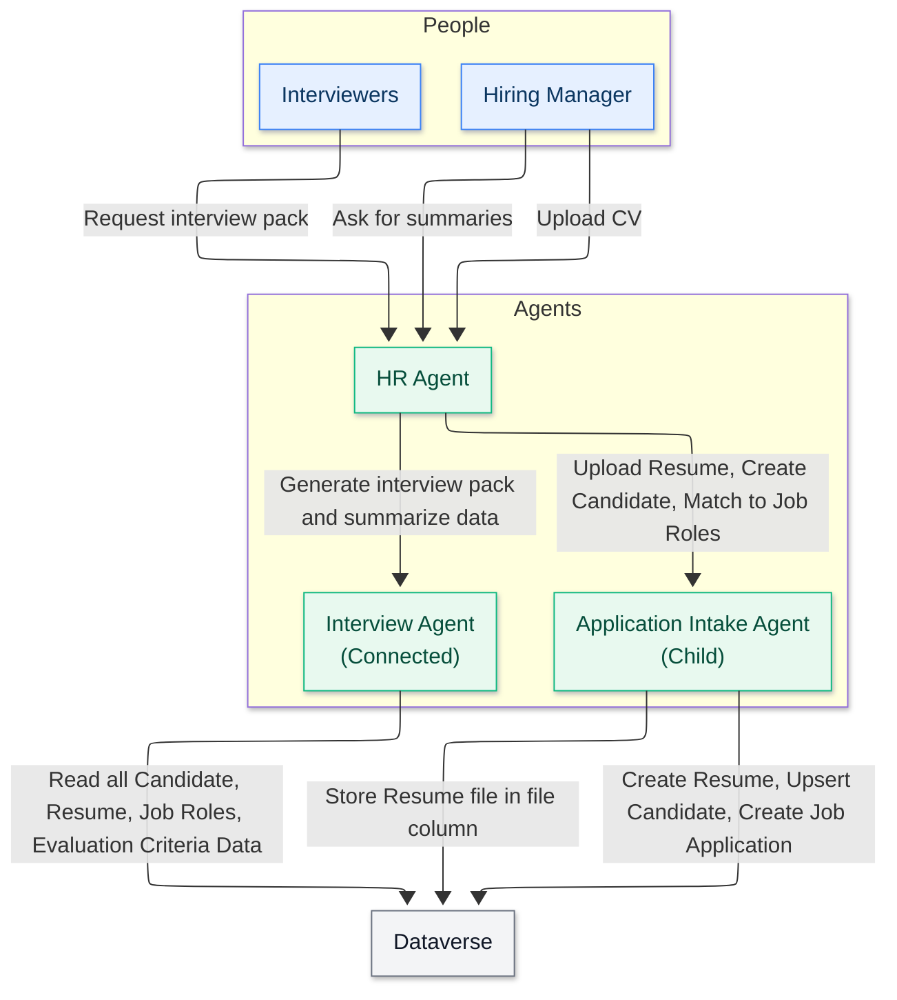
```mermaid
---
config:
  layout: elk
  look: neo
---
flowchart TB
 subgraph People["People"]
    direction TB
        HiringManager["Hiring Manager"]
        Interviewers["Interviewers"]
  end
 subgraph Agents["Agents"]
    direction LR
        ApplicationIntakeAgent["Application Intake Agent<br>(Child)"]
        InterviewAgent["Interview Agent<br>(Connected)"]
        HRAgent["HR Agent"]
  end
    HiringManager -- Upload CV --> HRAgent
    HRAgent -- Upload Resume, Create Candidate, Match to Job Roles --> ApplicationIntakeAgent
    ApplicationIntakeAgent -- Create Resume, Upsert Candidate, Create Job Application --> Dataverse["Dataverse"]
    ApplicationIntakeAgent -- Store Resume file in file column --> Dataverse
    HiringManager -- Ask for summaries --> HRAgent
    Interviewers -- Request interview pack --> HRAgent
    HRAgent -- Generate interview pack and summarize data --> InterviewAgent
    InterviewAgent -- Read all Candidate, Resume, Job Roles, Evaluation Criteria Data --> Dataverse
     HiringManager:::person
     Interviewers:::person
     ApplicationIntakeAgent:::agent
     InterviewAgent:::agent
     HRAgent:::agent
     Dataverse:::data
    classDef person fill:#e6f0ff,stroke:#3b82f6,color:#0b3660
    classDef agent fill:#e8f9ef,stroke:#10b981,color:#064e3b
    classDef data  fill:#f3f4f6,stroke:#6b7280,color:#111827
```

### 🤝 ایپلیکیشن انٹیک ایجنٹ کی ذمہ داریاں

- **ریزیوم مواد کو پارس کریں** پی ڈی ایف سے جو انٹرایکٹو چیٹ کے ذریعے فراہم کیے گئے ہیں (ایک مستقبل کے مشن میں آپ سیکھیں گے کہ ریزیومز کو خود مختار طور پر کیسے پروسیس کریں)۔  
- **ساختی ڈیٹا نکالیں** (نام، مہارتیں، تجربہ، تعلیم)  
- **امیدواروں کو کھلی پوزیشنز سے ملائیں** قابلیت اور کور لیٹر کی بنیاد پر  
- **امیدوار کی معلومات کو ڈیٹا ورس میں محفوظ کریں** بعد میں پروسیسنگ کے لیے  
- **درخواستوں کو ڈیڈوپلیکیٹ کریں** تاکہ ایک ہی امیدوار کو دوبارہ نہ بنایا جائے، ای میل ایڈریس کے ذریعے موجودہ ریکارڈز سے ملائیں جو ریزیوم سے نکالا گیا ہے۔

### ⭐ یہ چائلڈ ایجنٹ کیوں ہونا چاہیے؟

ایپلیکیشن انٹیک ایجنٹ چائلڈ ایجنٹ کے طور پر بالکل موزوں ہے کیونکہ:

- یہ دستاویز پروسیسنگ اور ڈیٹا ایکسٹریکشن کے لیے مخصوص ہے  
- اسے الگ سے پبلش کرنے کی ضرورت نہیں ہے  
- یہ ہماری مجموعی ہائرنگ سلوشن کا حصہ ہے جو ایک ہی ٹیم کے ذریعے منظم کیا جاتا ہے  
- یہ ایک مخصوص ٹرگر پر مرکوز ہے (نیا ریزیوم موصول ہوا) اور ہائرنگ ایجنٹ سے بلایا جاتا ہے۔

## 🔀 مربوط ایجنٹ: انٹرویو پریپ ایجنٹ  

ہمارا دوسرا ماہر **انٹرویو پریپ ایجنٹ** ہوگا - ایک مربوط ایجنٹ جو جامع انٹرویو مواد تیار کرنے اور امیدوار کے جوابات کا جائزہ لینے میں مدد کرتا ہے۔

### 🤝 انٹرویو پریپ ایجنٹ کی ذمہ داریاں

- **انٹرویو پیک تیار کریں** کمپنی کی معلومات، رول کی ضروریات، اور تشخیصی معیار کے ساتھ  
- **انٹرویو سوالات تیار کریں** مخصوص رولز اور امیدوار کے پس منظر کے مطابق  
- **عام سوالات کے جوابات دیں** ملازمت کے رولز اور درخواستوں کے بارے میں اسٹیک ہولڈر کمیونیکیشن کے لیے

### ⭐ یہ مربوط ایجنٹ کیوں ہونا چاہیے؟

انٹرویو پریپ ایجنٹ مربوط ایجنٹ کے طور پر بہتر کام کرتا ہے کیونکہ:

- ٹیلنٹ ایکوزیشن ٹیم اسے مختلف بھرتی کے عمل میں آزادانہ طور پر استعمال کرنا چاہتی ہے  
- اسے انٹرویو کے بہترین طریقوں اور تشخیصی معیار کے اپنے نالج بیس کی ضرورت ہے  
- مختلف ہائرنگ مینیجرز اپنی ٹیموں کے لیے اس کے رویے کو حسب ضرورت بنانا چاہتے ہیں  
- یہ اندرونی پوزیشنز کے لیے بھی دوبارہ استعمال کیا جا سکتا ہے، نہ کہ صرف بیرونی بھرتی کے لیے

## 🧪 لیب 2.1: ایپلیکیشن انٹیک ایجنٹ شامل کرنا

کیا آپ نظریہ کو عملی جامہ پہنانے کے لیے تیار ہیں؟ آئیے آپ کے موجودہ ہائرنگ ایجنٹ میں اپنا پہلا چائلڈ ایجنٹ شامل کریں۔

### اس مشن کو مکمل کرنے کے لیے ضروریات

آپ کو **یا تو**:

- **مشن 01 مکمل کرنا ہوگا** اور اپنا ہائرنگ ایجنٹ تیار رکھنا ہوگا، **یا**  
- **مشن 02 اسٹارٹر سلوشن درآمد کریں** اگر آپ نئے شروع کر رہے ہیں یا پکڑنے کی ضرورت ہے۔ [مشن 02 اسٹارٹر سلوشن ڈاؤنلوڈ کریں](https://aka.ms/agent-academy)

!!! note "سلوشن درآمد اور نمونہ ڈیٹا"
    اگر آپ اسٹارٹر سلوشن استعمال کر رہے ہیں، تو [مشن 01](../01-get-started/README.md) کا حوالہ دیں تاکہ اپنے ماحول میں سلوشنز اور نمونہ ڈیٹا کو درآمد کرنے کے تفصیلی ہدایات حاصل کریں۔

### 2.1.1 سلوشن سیٹ اپ

1. کوپائلٹ اسٹوڈیو کے اندر، بائیں جانب نیویگیشن میں ٹولز کے نیچے تین نقطے (...) منتخب کریں۔  
1. **سلوشنز** منتخب کریں۔  
    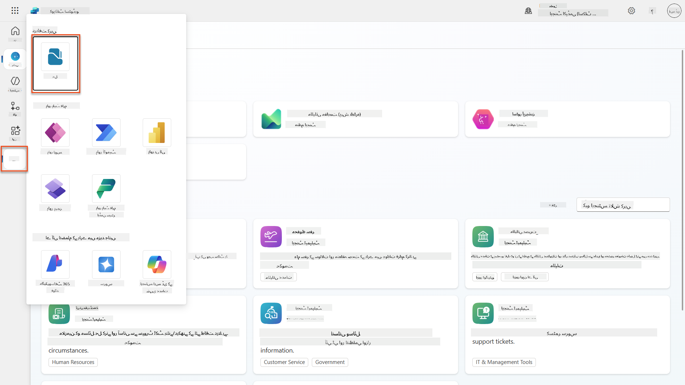
1. اپنے آپریٹو سلوشن کو تلاش کریں، اس کے ساتھ موجود **تین نقطے (...)** منتخب کریں، اور **پریفرڈ سلوشن سیٹ کریں** کا انتخاب کریں۔ یہ یقینی بنائے گا کہ آپ کا تمام کام اس سلوشن میں شامل ہوگا۔  
    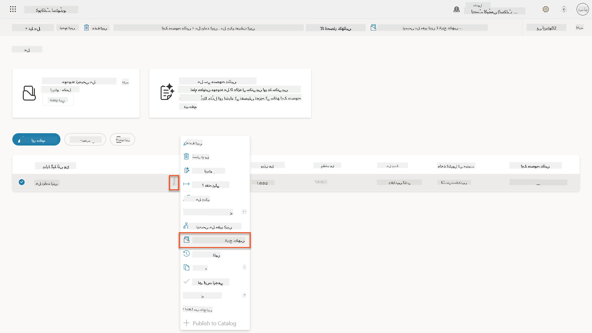

### 2.1.2 اپنے ہائرنگ ایجنٹ کی انسٹرکشنز کو کنفیگر کریں

1. **کوپائلٹ اسٹوڈیو پر جائیں۔** یقینی بنائیں کہ آپ کا ماحول اوپر دائیں **ماحول منتخب کرنے والے** میں منتخب ہے۔

1. اپنے **ہائرنگ ایجنٹ** کو مشن 01 سے کھولیں۔

1. **انسٹرکشنز** سیکشن میں **ایڈٹ** منتخب کریں اور درج ذیل انسٹرکشنز کو اوپر شامل کریں:

    ```text
    You are the central orchestrator for the hiring process. You coordinate activities, provide summaries, and delegate work to specialized agents.
    ```

1. **سیو** منتخب کریں  
    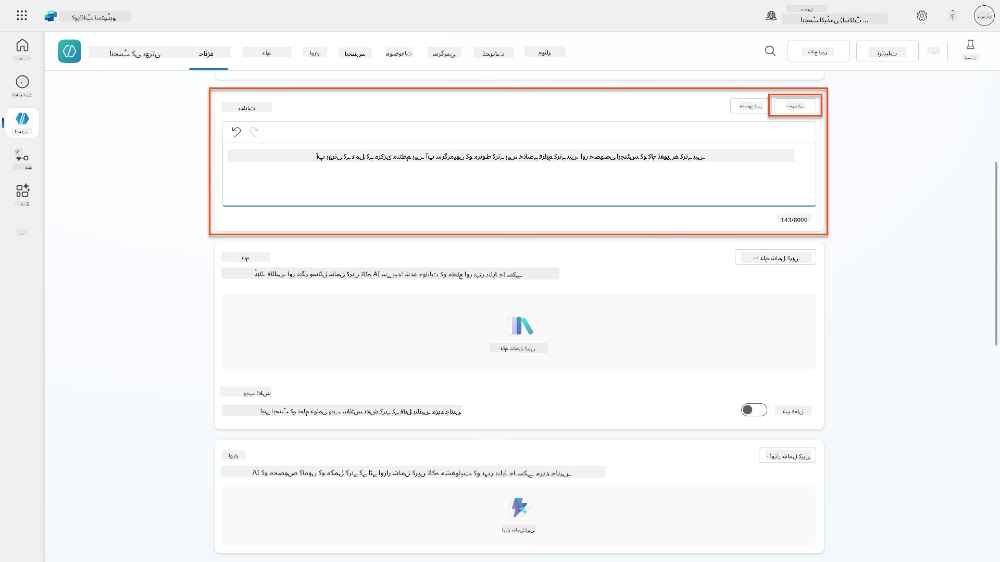

1. **سیٹنگز** منتخب کریں (اوپر دائیں)

1. درج ذیل سیٹنگز کو یقینی بنائیں:

    | سیٹنگ | ویلیو |
    |---------|-------|
    | اپنے ایجنٹ کے جوابات کے لیے جنریٹو اے آئی آرکسٹریشن استعمال کریں | **ہاں** |
    | مواد کی اعتدال | **اعتدال** |
    | عمومی نالج استعمال کریں | **بند** |
    | ویب سے معلومات استعمال کریں | **بند** |
    | فائل اپلوڈز | **چ
ہم **ایجنٹ فلو ٹولز** کو *اپلوڈ ریزیومے* مرحلے کے لیے موضوعات کے بجائے استعمال کر رہے ہیں کیونکہ یہ کئی مرحلوں پر مشتمل بیک اینڈ عمل ہے جو یقینی عمل درآمد اور بیرونی نظاموں کے ساتھ انضمام کا تقاضا کرتا ہے۔ موضوعات گفتگو کے مکالمے کی رہنمائی کے لیے بہترین ہیں، جبکہ ایجنٹ فلو فائل پروسیسنگ، ڈیٹا کی توثیق، اور ڈیٹا بیس اپسرٹس (نئی داخل کریں یا موجودہ کو اپ ڈیٹ کریں) کو قابل اعتماد طریقے سے سنبھالنے کے لیے درکار منظم آٹومیشن فراہم کرتے ہیں، بغیر صارف کے تعامل پر انحصار کیے۔

1. **ایپلیکیشن انٹیک ایجنٹ** صفحے کے اندر **ٹولز** سیکشن تلاش کریں۔
   **اہم:** یہ پیرنٹ ایجنٹ کے ٹولز ٹیب نہیں ہے، بلکہ آپ اسے چائلڈ ایجنٹ ہدایات کے نیچے اسکرول کرکے تلاش کرسکتے ہیں۔

1. **+ ایڈ کریں** منتخب کریں۔
   

1. **+ نیا ٹول** منتخب کریں۔
   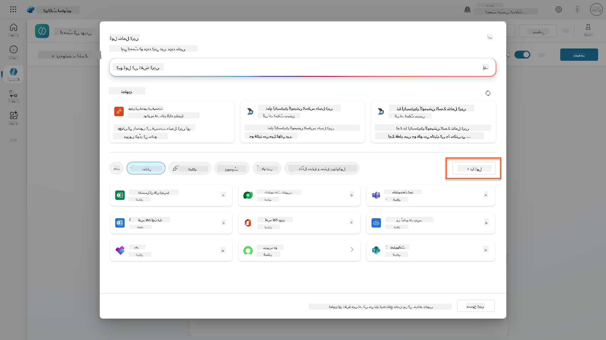

1. **ایجنٹ فلو** منتخب کریں۔
   ایجنٹ فلو ڈیزائنر کھل جائے گا، یہاں ہم اپلوڈ ریزیومے منطق شامل کریں گے۔
   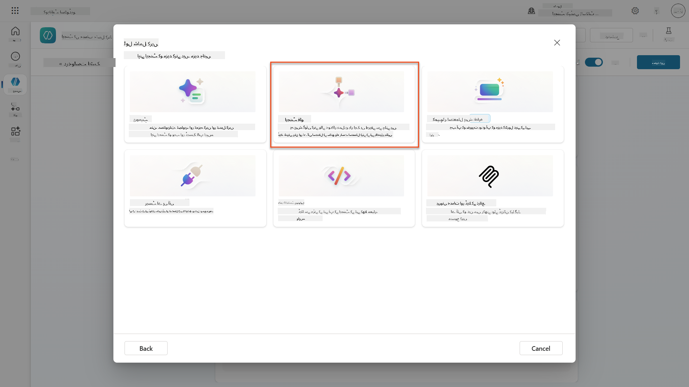

1. **جب ایجنٹ فلو کو کال کرے** نوڈ منتخب کریں، اور درج ذیل پیرامیٹرز کے لیے ایک ان پٹ شامل کرنے کے لیے **+ ایڈ کریں** منتخب کریں، نام اور وضاحت دونوں شامل کرنا یقینی بنائیں۔

    | قسم  | نام       | وضاحت                                                                                                   |
    |-------|----------|---------------------------------------------------------------------------------------------------------------|
    | فائل  | ریزیومے   | ریزیومے پی ڈی ایف فائل                                                                                           |
    | متن   | پیغام     | سیاق و سباق سے کور لیٹر طرز کا پیغام نکالیں۔ پیغام 2000 حروف سے کم ہونا چاہیے۔         |
    | متن   | صارف ای میل| وہ ای میل پتہ جہاں سے ریزیومے آیا ہے۔ یہ چیٹ میں ریزیومے اپلوڈ کرنے والا صارف ہوگا، یا ای میل کے ذریعے موصول ہونے کی صورت میں "فرام ای میل ایڈریس"۔ |

    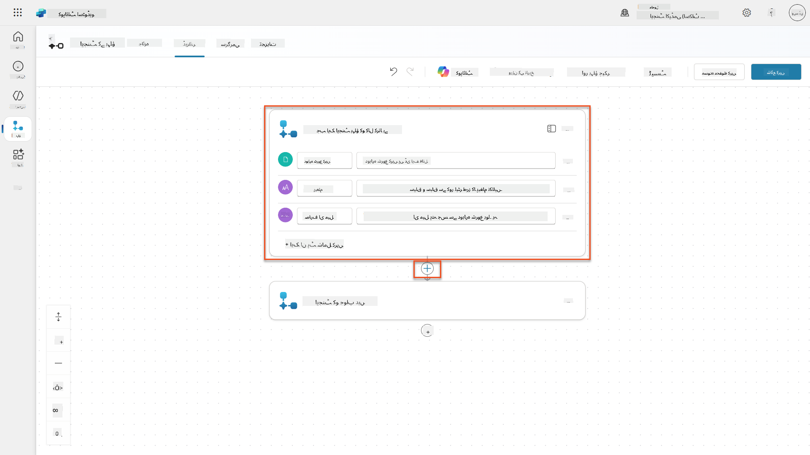

1. **+ آئیکن** کو ٹرگر نوڈ کے نیچے منتخب کریں، `Dataverse` تلاش کریں، **Microsoft Dataverse** کے ساتھ **See more** منتخب کریں، اور پھر **Microsoft Dataverse** سیکشن میں **Add a new row** ایکشن منتخب کریں۔
    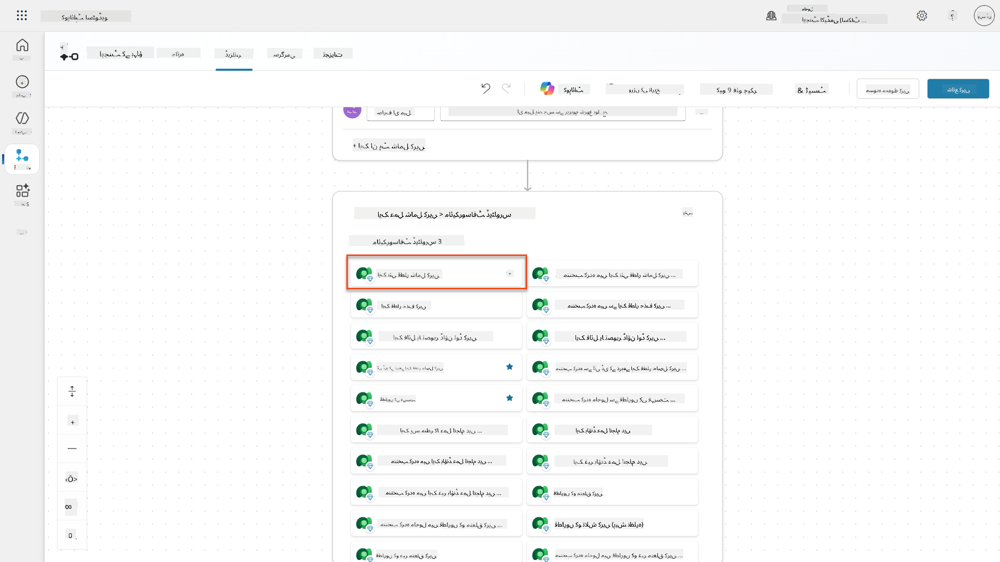

1. نوڈ کا نام **Create Resume** رکھیں، **ellipsis(...)** منتخب کریں، اور **Rename** منتخب کریں۔
    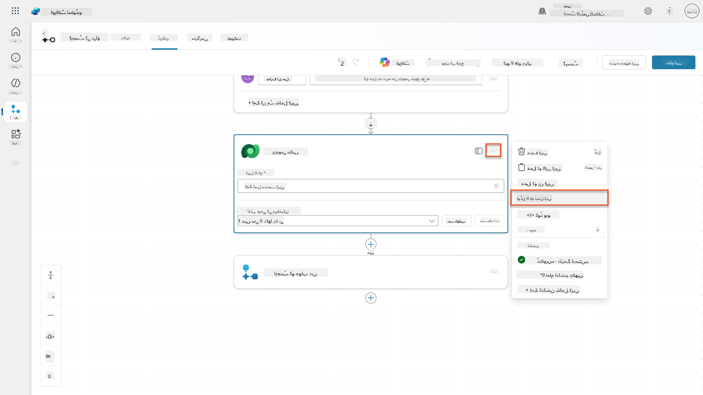

1. **Table name** کو **Resumes** پر سیٹ کریں، پھر **Show all** منتخب کریں، تاکہ تمام پیرامیٹرز دکھائے جائیں۔

1. درج ذیل **پراپرٹیز** سیٹ کریں:

    | پراپرٹی                 | کیسے سیٹ کریں                      | تفصیلات / اظہار                                         |
    | ------------------------ | ------------------------------- | ------------------------------------------------------------ |
    | **Resume Title**         | ڈائنامک ڈیٹا (تھنڈر بولٹ آئیکن) | **جب ایجنٹ فلو کو کال کرے** → **Resume name**    اگر آپ کو Resume name نظر نہیں آتا، تو یقینی بنائیں کہ آپ نے اوپر ریزیومے پیرامیٹر کو ڈیٹا ٹائپ کے طور پر ترتیب دیا ہے۔ |
    | **Cover letter**         | اظہار (fx آئیکن)            | `if(greater(length(triggerBody()?['text']), 2000), substring(triggerBody()?['text'], 0, 2000), triggerBody()?['text'])` |
    | **Source Email Address** | ڈائنامک ڈیٹا (تھنڈر بولٹ آئیکن) | **جب ایجنٹ فلو کو کال کرے** → **UserEmail**             |
    | **Upload Date**          | اظہار (fx آئیکن)            | `utcNow()`                                                   |

    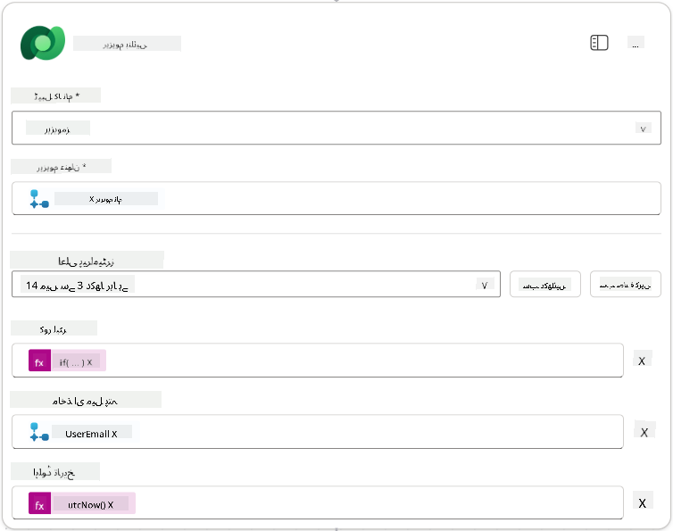

1. **+ آئیکن** کو Create Resume نوڈ کے نیچے منتخب کریں، `Dataverse` تلاش کریں، **Microsoft Dataverse** کے ساتھ **See more** منتخب کریں، اور پھر **Upload a file or an image** ایکشن منتخب کریں۔
   **اہم:** یقینی بنائیں کہ منتخب ماحول میں فائل یا تصویر اپلوڈ کرنے کا ایکشن منتخب نہ کریں۔

1. نوڈ کا نام **Upload Resume File** رکھیں، **ellipsis(...)** منتخب کریں، اور **Rename** منتخب کریں۔

1. درج ذیل **پراپرٹیز** سیٹ کریں:

     | پراپرٹی | کیسے سیٹ کریں | تفصیلات |
     |----------|------------|---------|
     | **Content name** | ڈائنامک ڈیٹا (تھنڈر بولٹ آئیکن) | جب ایجنٹ فلو کو کال کرے → Resume name |
     | **Table name** | منتخب کریں | Resumes |
     | **Row ID** | ڈائنامک ڈیٹا (تھنڈر بولٹ آئیکن) | Create Resume → See more → Resume |
     | **Column Name** | منتخب کریں | Resume PDF |
     | **Content** | ڈائنامک ڈیٹا (تھنڈر بولٹ آئیکن) | جب ایجنٹ فلو کو کال کرے → Resume contentBytes |

     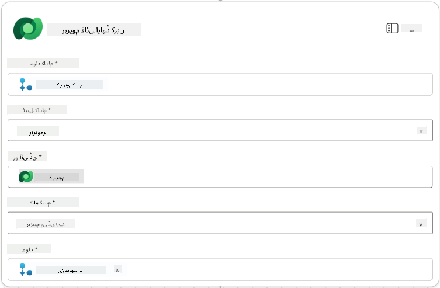

1. **Respond to the agent node** منتخب کریں، اور پھر **+ Add an output** منتخب کریں۔

     | پراپرٹی | کیسے سیٹ کریں | تفصیلات |
     |----------|------------|---------|
     | **قسم** | منتخب کریں | `Text` |
     | **نام** | درج کریں | `ResumeNumber` |
     | **ویلیو** | ڈائنامک ڈیٹا (تھنڈر بولٹ آئیکن) | Create Resume → See More → Resume Number |
     | **وضاحت** | درج کریں | `The [ResumeNumber] of the Resume created` |

     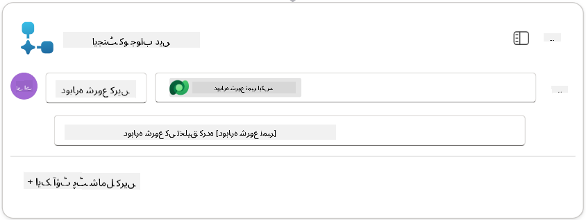

1. اوپر دائیں جانب **Save draft** منتخب کریں۔
     

1. **Overview** ٹیب منتخب کریں، **Details** پینل پر **Edit** منتخب کریں۔

     1. **Flow name**:`Resume Upload`
     1. **Description**:`Uploads a Resume when instructed`

     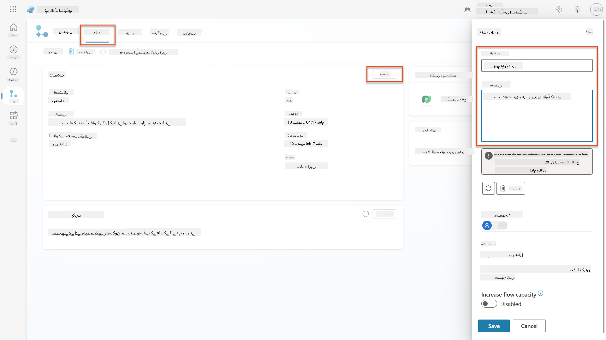

1. دوبارہ **Designer** ٹیب منتخب کریں، اور **Publish** منتخب کریں۔
     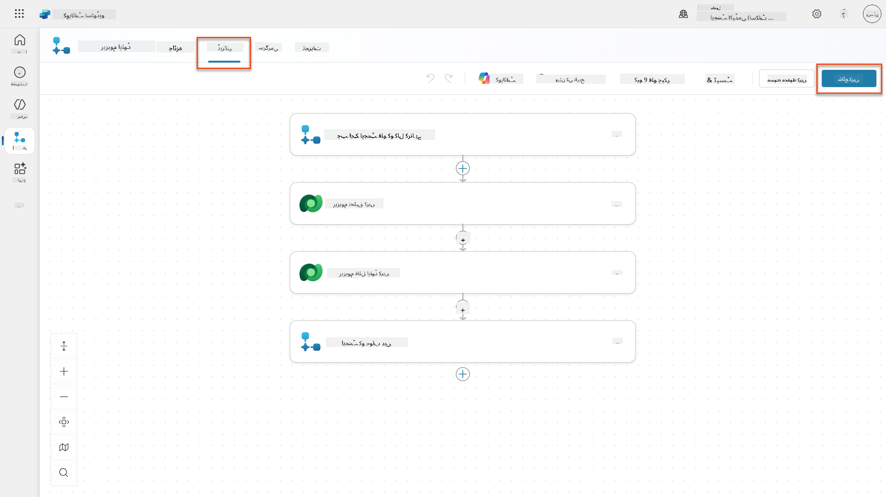

### 2.1.5 اپنے ایجنٹ کے ساتھ فلو کو جوڑیں

اب آپ اپنے ایپلیکیشن انٹیک ایجنٹ کے ساتھ شائع شدہ فلو کو جوڑیں گے۔

1. واپس **Hiring Agent** پر جائیں اور **Agents** ٹیب منتخب کریں۔ **Application Intake Agent** کھولیں، اور پھر **Tools** پینل تلاش کریں۔
    

1. **+ Add** منتخب کریں۔

1. **Flow** فلٹر منتخب کریں، اور `Resume Upload` تلاش کریں۔ **Resume Upload** فلو منتخب کریں، اور پھر **Add and configure**۔

1. درج ذیل پیرامیٹرز سیٹ کریں:

    | پیرامیٹر | ویلیو |
    |-----------|-------|
    | **وضاحت** | `Uploads a Resume when instructed. STRICT RULE: Only call this tool when referenced in the form "Resume Upload" and there are Attachments` |
    | **اضافی تفصیلات → جب یہ ٹول استعمال کیا جا سکتا ہے** | `only when referenced by topics or agents` |
    | **Inputs → Add Input** | `contentBytes` |
    | **Inputs → Add Input** | `name` |

    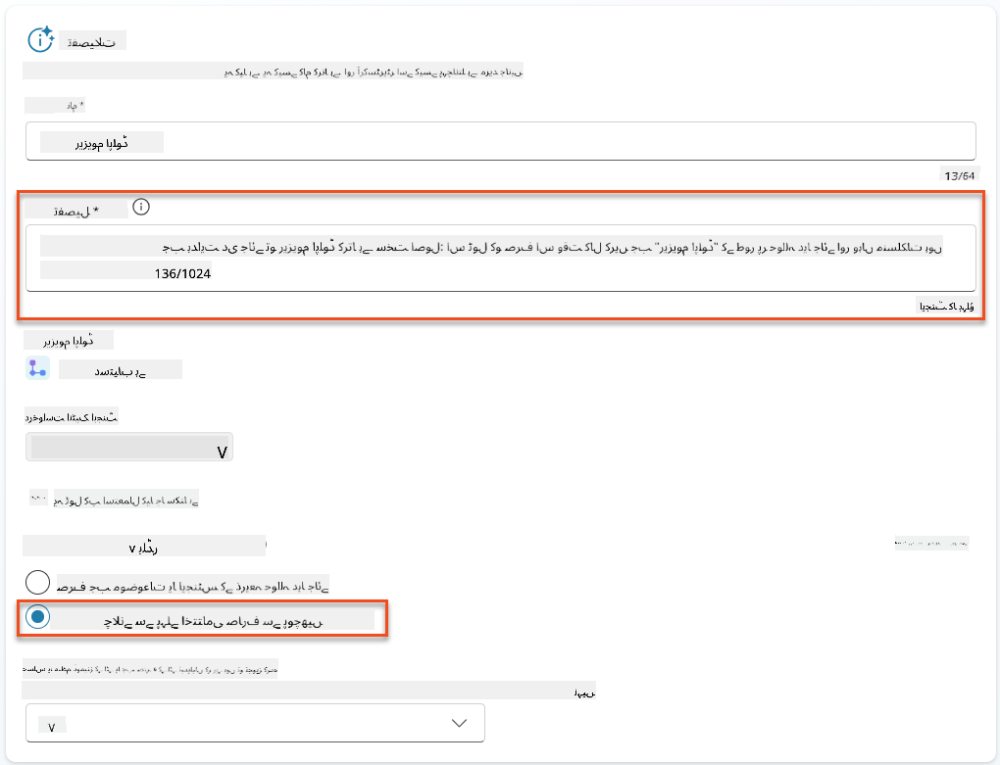

    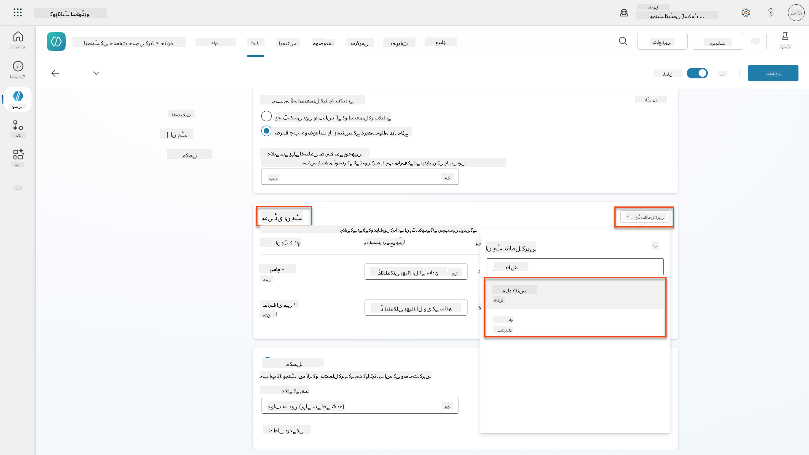

1. اگلے ان پٹس کی پراپرٹیز کو درج ذیل کے مطابق سیٹ کریں:

    | ان پٹ پیرامیٹر | پراپرٹی | تفصیلات |
    |-----------------|----------|---------|
    | **contentBytes** | فل کریں | کسٹم ویلیو |
    |                  | ویلیو (...→Formula→Insert) | `First(System.Activity.Attachments).Content` |
    | **name** | فل کریں | کسٹم ویلیو |
    |          | ویلیو (...→Formula→Insert) | `First(System.Activity.Attachments).Name` |
    | **Message** | حسب ضرورت | کسٹم سیٹنگز ترتیب دیں |
    |             | وضاحت | `Extract a cover letter style message from the context. Be sure to never prompt the user and create at least a minimal cover letter from the available context. STRICT RULE - the message must be less than 2000 characters.` |
    |             | کتنی بار دوبارہ پوچھیں | دوبارہ نہ پوچھیں |
    |             | اگر کوئی اینٹیٹی نہ ملے تو عمل | ویریبل کو ویلیو پر سیٹ کریں |
    |             | ڈیفالٹ اینٹیٹی ویلیو | Resume upload |
    | **UserEmail** | فل کریں | کسٹم ویلیو |
    |  | ویلیو (...→Formula→Insert) | `System.User.Email` |

    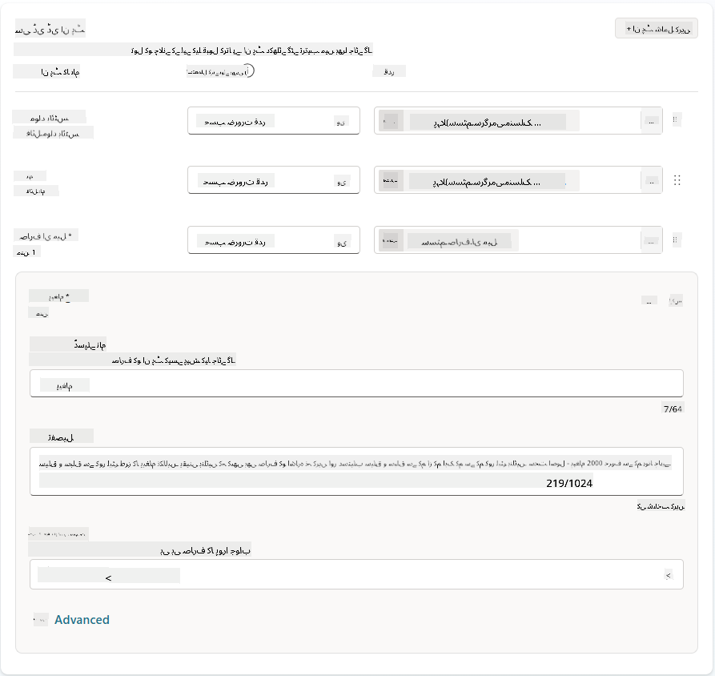

1. **Save** منتخب کریں۔

### 2.1.6 ایجنٹ ہدایات کی وضاحت کریں

1. **Application Intake Agent** میں واپس جائیں، **Agents** ٹیب منتخب کریں، اور پھر **Instructions** پینل تلاش کریں۔

1. **Instructions** فیلڈ میں اپنے چائلڈ ایجنٹ کے لیے درج ذیل واضح رہنمائی چسپاں کریں:

    ```text
    You are tasked with managing incoming Resumes, Candidate information, and creating Job Applications.  
    Only use tools if the step exactly matches the defined process. Otherwise, indicate you cannot help.  
    
    Process for Resume Upload via Chat  
    1. Upload Resume  
      - Trigger only if /System.Activity.Attachments contains exactly one new resume.  
      - If more than one file, instruct the user to upload one at a time and stop.  
      - Call /Upload Resume once. Never upload more than once for the same message.  
    
    2. Post-Upload  
      - Always output the [ResumeNumber] (R#####).  
    ```

1. جہاں ہدایات میں فارورڈ سلیش (/) شامل ہو، سلیش کے بعد کے متن کو منتخب کریں اور حل شدہ نام منتخب کریں۔ ایسا کریں:

    - `System.Activity.Attachments` (ویریبل)
    - `Upload Resume` (ٹول)

    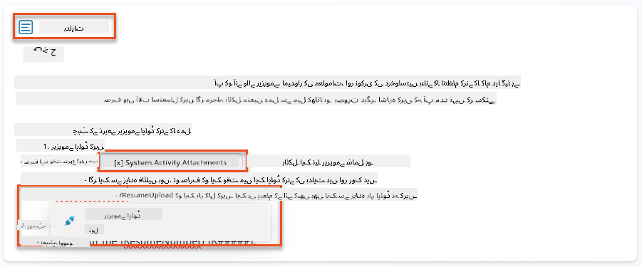

1. **Save** منتخب کریں۔

### 2.1.7 اپنے ایپلیکیشن انٹیک ایجنٹ کی جانچ کریں

اب ہم تصدیق کریں گے کہ آپ کا پہلا آرکسٹرا ممبر صحیح کام کر رہا ہے۔

1. [ٹیسٹ ریزیومے ڈاؤن لوڈ کریں۔](https://download-directory.github.io/?url=https://github.com/microsoft/agent-academy/tree/main/operative/sample-data/resumes&filename=operative_sampledata)

1. **ٹیسٹ** منتخب کرکے ٹیسٹ پینل کھولیں۔

1. ٹیسٹ چیٹ میں دو ریزیومے اپلوڈ کریں، اور پیغام دیں `Process these resumes`

    - ایجنٹ کو ایک پیغام واپس کرنا چاہیے جو اس طرح کا ہو *ایک وقت میں صرف ایک ریزیومے اپلوڈ کیا جا سکتا ہے۔ براہ کرم ایک ریزیومے اپلوڈ کریں تاکہ آگے بڑھ سکیں۔*

    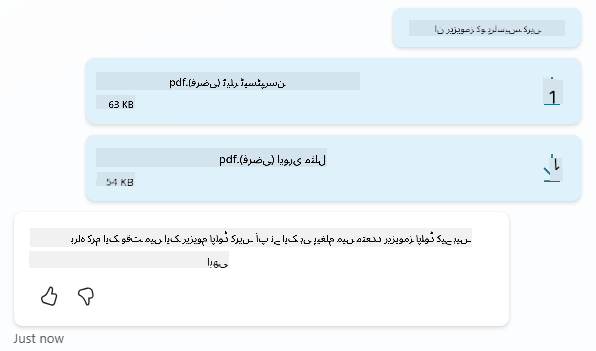

1. **صرف ایک ریزیومے** اپلوڈ کرنے کی کوشش کریں، پیغام کے ساتھ `Process this resume`

    - ایجنٹ کو پھر ایک پیغام دینا چاہیے جو اس طرح کا ہو *Avery Example کے لیے ریزیومے کامیابی سے اپلوڈ ہو گیا ہے۔ ریزیومے نمبر R10026 ہے۔*

1. **Activity map** میں، آپ کو **Application Intake Agent** کو ریزیومے اپلوڈ سنبھالتے ہوئے دیکھنا چاہیے۔
    

1. make.powerapps.com پر جائیں → یقینی بنائیں کہ آپ کا ماحول اوپر دائیں Environment Picker میں منتخب ہے۔

1. **Apps** منتخب کریں → Hiring Hub → ellipsis(...) مینو → **Play**
    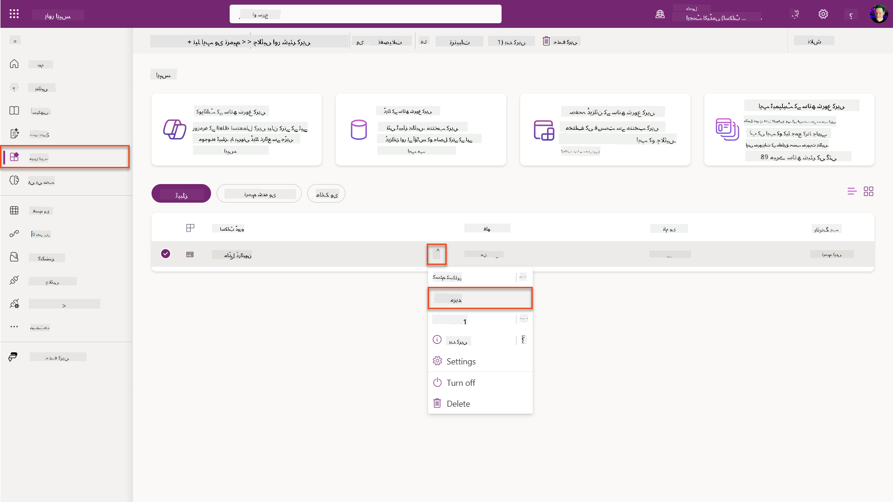

    نوٹ: اگر پلے بٹن گرے ہو تو اس کا مطلب ہے کہ آپ نے مشن 01 سے اپنی حل کو شائع نہیں کیا۔ **Solutions** منتخب کریں → **Publish all customizations**۔

1. **Resumes** پر جائیں، اور چیک کریں کہ ریزیومے فائل اپلوڈ ہو گئی ہے اور کور لیٹر مناسب طریقے سے سیٹ کیا گیا ہے۔
    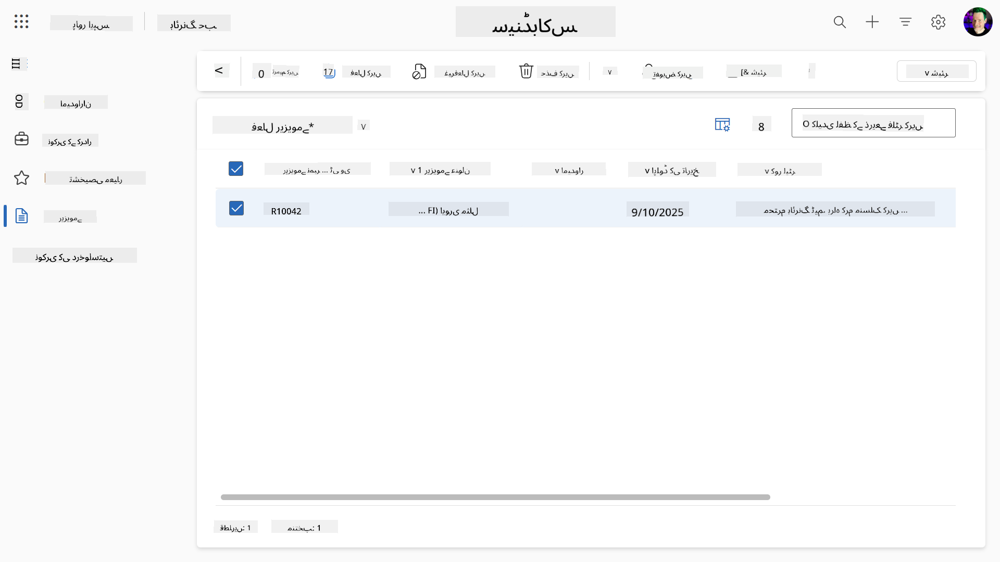

## 🧪لیب 2.2: انٹرویو پریپ کنیکٹڈ ایجنٹ شامل کرنا

اب ہم انٹرویو تیاری کے لیے اپنا کنیکٹڈ ایجنٹ بنائیں گے اور اسے آپ کے موجودہ Hiring Agent میں شامل کریں گے۔

### 2.2.1 کنیکٹڈ انٹرویو ایجنٹ بنائیں

1. **Copilot Studio** پر جائیں۔ یقینی بنائیں کہ آپ کا ماحول ابھی بھی اوپر دائیں Environment Picker میں منتخب ہے۔

1. اپنا **Hiring Agent** کھولیں۔

1. ایجنٹ ٹیب پر جائیں، اور **+ Add an agent** منتخب کریں۔

1. **Connect an existing agent** → **Copilot Studio** منتخب کریں۔

1. **+ نیا ایجنٹ** منتخب کریں۔

### 2.2.2 بنیادی ترتیبات ترتیب دیں

1. **Configure** ٹیب منتخب کریں، اور درج ذیل پراپرٹیز درج کریں:

    - **نام**: `Interview Agent`
    - **وضاحت**: `Assists with the interview process.`

1. ہدایات:

    ```text
    You are the Interview Agent. You help interviewers and hiring managers prepare for interviews. You never contact candidates. 
    Use Knowledge to help with interview preparation. 
    
    The only valid identifiers are:
      - ResumeNumber (ppa_resumenumber)→ format R#####
      - CandidateNumber (ppa_candidatenumber)→ format C#####
      - ApplicationNumber (ppa_applicationnumber)→ format A#####
      - JobRoleNumber (ppa_jobrolenumber)→ format J#####
    
    Examples you handle
      - Give me a summary of ...
      - Help me prepare to interview candidates for the Power Platform Developer role
      - Create interview assistance for the candidates for Power Platform Developer
      - Give targeted questions for Candidate Alex Johnson focusing on the criteria for the Job Application
      
    How to work:
        You are expected to ask clarification questions if required information for queries is not provided
        - If asked for interview help without providing a job role, ask for it
        - If asking for interview questions, ask for the candidate and job role if not provided.
    
    General behavior
    - Do not invent or guess facts
    - Be concise, professional, and evidence-based
    - Map strengths and risks to the highest-weight criteria
    - If data is missing (e.g., no resume), state what is missing and ask for clarification
    - Never address or message a candidate
    ```

1. **Web Search** کو **Disabled** پر ٹوگل کریں۔

1. **Create** منتخب کریں۔
    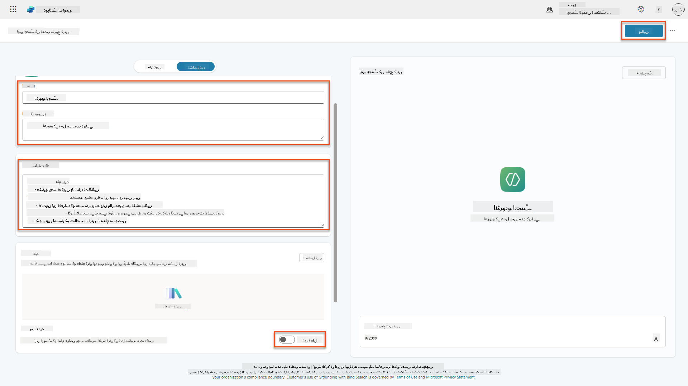

### 2.2.3 ڈیٹا تک رسائی ترتیب دیں اور شائع کریں

1. **Knowledge** سیکشن میں، **+ Add knowledge** منتخب کریں۔
    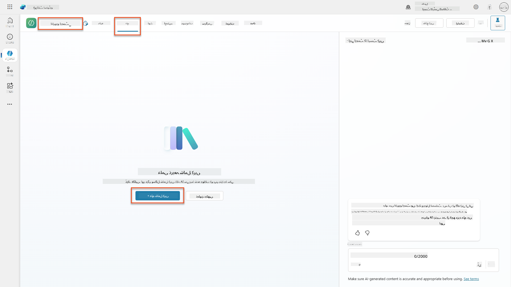
1. **Dataverse** منتخب کریں۔
    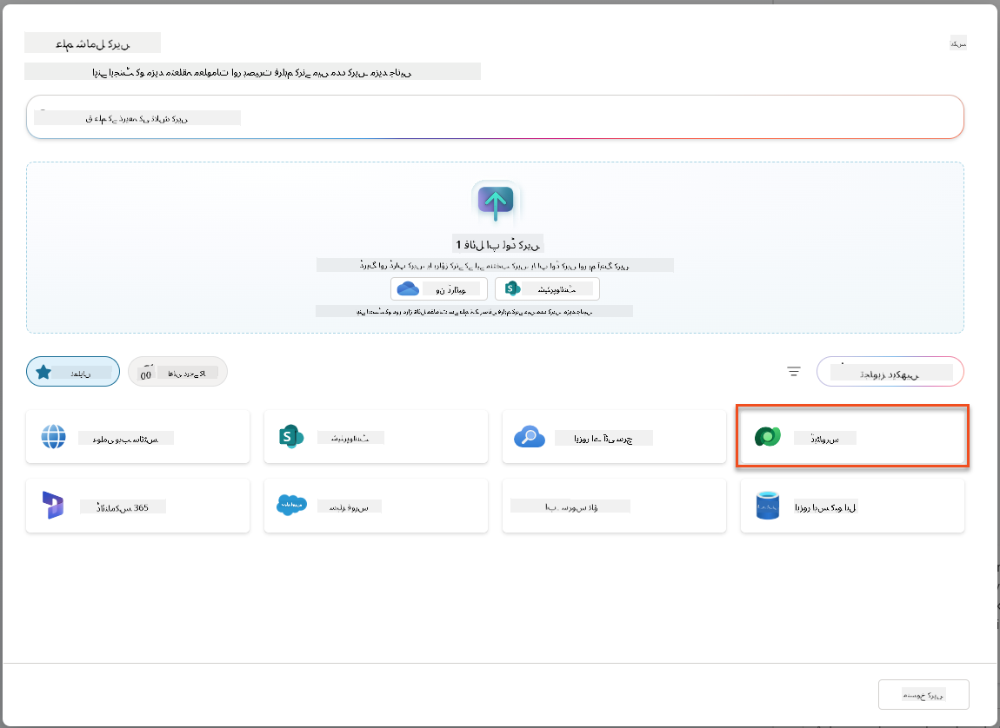
1. **Search box** میں `ppa_` ٹائپ کریں۔ یہ وہ پری فکس ہے جو آپ نے پہلے درآمد کیے گئے ٹیبلز کے لیے استعمال کیا تھا۔
1. تمام 5 ٹیبلز منتخب کریں (Candidate, Evaluation Criteria, Job Application, Job Role, Resume)
1. **Add to agent** منتخب کریں۔
    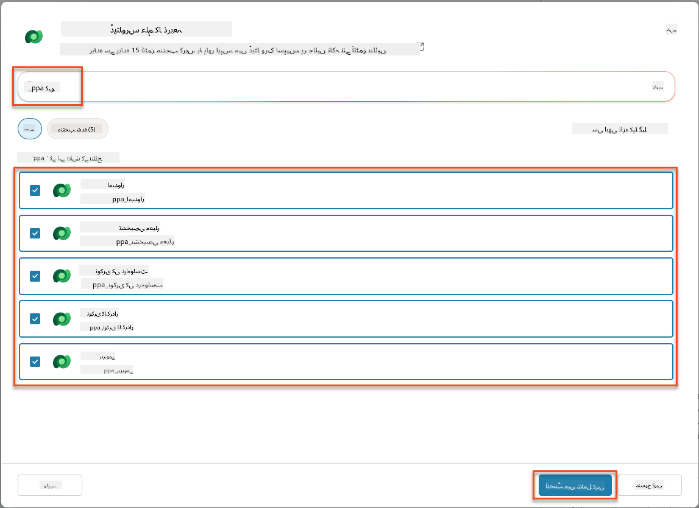
1. انٹرویو ایجنٹ پر **Settings** منتخب کریں، اور درج ذیل سیٹنگز سیٹ کریں:

    - **دوسرے ایجنٹس کو اس سے جڑنے اور استعمال کرنے دیں:** `On`
    - **عام علم استعمال کریں**: `Off`
    - **فائل اپلوڈز**: `Off`
    - **مواد کی اعتدال کی سطح:** `Medium`
1. **Save** منتخب کریں۔
1. **Publish** منتخب کریں، اور شائع کرنے کے مکمل ہونے کا انتظار کریں۔

### 2.2.4 انٹرویو پریپ ایجنٹ کو اپنے Hiring Agent سے جوڑیں

1. اپنے **Hiring Agent** پر واپس جائیں۔

1. **Agents** ٹیب منتخب کریں۔

1. **+Add an agent** → **Copilot Studio** استعمال کریں، انٹرویو ایجنٹ شامل کریں۔ وضاحت کو درج کریں:
    ```text
    Assists with the interview process and provides information about Resumes, Candidates, Job Roles, and Evaluation Criteria.
    ```

    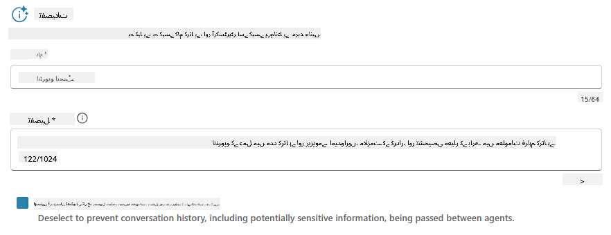
    نوٹ کریں کہ "اس ایجنٹ کو گفتگو کی تاریخ منتقل کریں" منتخب کیا گیا ہے۔ یہ پیرنٹ ایجنٹ کو مکمل سیاق و سباق فراہم کرنے کی اجازت دیتا ہے۔

1. **ایجنٹ شامل کریں** کو منتخب کریں۔

1. یقینی بنائیں کہ آپ **ایپلیکیشن انٹیک ایجنٹ** اور **انٹرویو ایجنٹ** دونوں دیکھ رہے ہیں۔ نوٹ کریں کہ ایک چائلڈ ایجنٹ ہے اور دوسرا متصل ایجنٹ۔  
    

### 2.2.5 ملٹی ایجنٹ تعاون کا ٹیسٹ کریں

1. **ٹیسٹ** کو منتخب کرکے ٹیسٹ پینل کو کھولیں۔

1. ٹیسٹ ریزیومز میں سے ایک **اپلوڈ** کریں، اور درج ذیل وضاحت درج کریں جو پیرنٹ ایجنٹ کو بتاتی ہے کہ وہ متصل ایجنٹ کو کیا تفویض کر سکتا ہے:

    ```text
    Upload this resume, then show me open job roles, each with a description of the evaluation criteria, then use this to match the resume to at least one suitable job role even if not a perfect match.
    ```

    

1. نوٹ کریں کہ ہائرنگ ایجنٹ نے اپلوڈ کو چائلڈ ایجنٹ کو تفویض کیا، اور پھر انٹرویو ایجنٹ سے خلاصہ اور جاب رول میچ فراہم کرنے کو کہا۔  
   مختلف طریقوں سے ریزیومز، جاب رولز اور ایویلوایشن کریٹیریا کے بارے میں سوالات پوچھنے کی کوشش کریں۔  
   **مثالیں:**

    ```text
    Give me a summary of active resumes
    ```

    ```text
    Summarize resume R10044
    ```

    ```text
    Which active resumes are suitable for the Power Platform Developer role?
    ```

## 🎉 مشن مکمل

شاندار کام، ایجنٹ! **آپریشن سمفنی** اب مکمل ہو چکا ہے۔ آپ نے اپنے سنگل ہائرنگ ایجنٹ کو ایک جدید ملٹی ایجنٹ آرکسٹرا میں تبدیل کر دیا ہے جس میں خصوصی صلاحیتیں ہیں۔

یہ وہ کامیابیاں ہیں جو آپ نے اس مشن میں حاصل کی ہیں:

**✅ ملٹی ایجنٹ آرکیٹیکچر کی مہارت**  
اب آپ سمجھتے ہیں کہ چائلڈ ایجنٹس اور متصل ایجنٹس کب استعمال کرنے ہیں اور ایسے سسٹمز کیسے ڈیزائن کرنے ہیں جو اسکیل کر سکیں۔

**✅ ایپلیکیشن انٹیک چائلڈ ایجنٹ**  
آپ نے اپنے ہائرنگ ایجنٹ میں ایک خصوصی چائلڈ ایجنٹ شامل کیا ہے جو ریزیومز کو پروسیس کرتا ہے، امیدوار کے ڈیٹا کو نکالتا ہے، اور معلومات کو ڈیٹاورس میں محفوظ کرتا ہے۔

**✅ انٹرویو پریپ متصل ایجنٹ**  
آپ نے انٹرویو کی تیاری کے لیے ایک ری یوز ایبل متصل ایجنٹ بنایا ہے اور اسے کامیابی سے اپنے ہائرنگ ایجنٹ سے جوڑا ہے۔

**✅ ایجنٹ کمیونیکیشن**  
آپ نے دیکھا کہ آپ کا مین ایجنٹ کس طرح اسپیشلسٹ ایجنٹس کے ساتھ تعاون کر سکتا ہے، سیاق و سباق شیئر کر سکتا ہے، اور پیچیدہ ورک فلو کو آرکسٹریٹ کر سکتا ہے۔

**✅ خود مختاری کی بنیاد**  
آپ کا بہتر ہائرنگ سسٹم اب ان جدید فیچرز کے لیے تیار ہے جو ہم آنے والے مشنز میں شامل کریں گے: خود مختار ٹرگرز، مواد کی نگرانی، اور گہری استدلال۔

🚀**اگلا مرحلہ:** اپنے اگلے مشن میں، آپ سیکھیں گے کہ اپنے ایجنٹ کو ای میلز سے ریزیومز کو خود مختار طور پر پروسیس کرنے کے لیے کیسے کنفیگر کریں!

⏩[مشن 03 پر جائیں: اپنے ایجنٹ کو ٹرگرز کے ساتھ خودکار بنائیں](../03-automate-triggers/README.md)

## 📚 حکمت عملی کے وسائل

📖 [دیگر ایجنٹس شامل کریں (پریویو)](https://learn.microsoft.com/microsoft-copilot-studio/authoring-add-other-agents?WT.mc_id=power-182762-scottdurow)

📖 [کسٹم ایجنٹس میں ٹولز شامل کریں](https://learn.microsoft.com/microsoft-copilot-studio/advanced-plugin-actions?WT.mc_id=power-182762-scottdurow)

📖 [کوپائلٹ اسٹوڈیو میں ڈیٹاورس کے ساتھ کام کریں](https://learn.microsoft.com/microsoft-copilot-studio/knowledge-add-dataverse?WT.mc_id=power-182762-scottdurow)

📖 [ایجنٹ فلو کا جائزہ](https://learn.microsoft.com/microsoft-copilot-studio/flows-overview?WT.mc_id=power-182762-scottdurow)

📖 [ایک حل بنائیں](https://learn.microsoft.com/power-platform/alm/solution-concepts-alm?WT.mc_id=power-182762-scottdurow)

📖 [پاور پلیٹ فارم حل ALM گائیڈ](https://learn.microsoft.com/power-platform/alm/overview-alm?WT.mc_id=power-182762-scottdurow)

📺 [کوپائلٹ اسٹوڈیو میں ایجنٹ سے ایجنٹ تعاون](https://youtu.be/d-oD3pApHAg?si=rwIHKhJTkjSvhTHw)

---

**اعلانِ لاتعلقی**:  
یہ دستاویز AI ترجمہ سروس [Co-op Translator](https://github.com/Azure/co-op-translator) کا استعمال کرتے ہوئے ترجمہ کی گئی ہے۔ ہم درستگی کی بھرپور کوشش کرتے ہیں، لیکن براہ کرم آگاہ رہیں کہ خودکار ترجمے میں غلطیاں یا غیر درستیاں ہو سکتی ہیں۔ اصل دستاویز کو اس کی اصل زبان میں مستند ذریعہ سمجھا جانا چاہیے۔ اہم معلومات کے لیے، پیشہ ور انسانی ترجمہ کی سفارش کی جاتی ہے۔ ہم اس ترجمے کے استعمال سے پیدا ہونے والی کسی بھی غلط فہمی یا غلط تشریح کے ذمہ دار نہیں ہیں۔