<!--
CO_OP_TRANSLATOR_METADATA:
{
  "original_hash": "75efaf515d5694d4fd549bfd6518901a",
  "translation_date": "2025-10-22T19:15:21+00:00",
  "source_file": "docs/operative-preview/03-automate-triggers/README.md",
  "language_code": "ur"
}
-->
# مشن 03: ایونٹ ٹرگرز شامل کریں تاکہ خود مختار طور پر کام کریں

--8<-- "disclaimer.md"

## 🕵️‍♂️ کوڈ نام: `آپریشن سگنل پوائنٹ`

> **⏱️ آپریشن کا وقت:** `~45 منٹ`

## 🎯 مشن کا خلاصہ

خوش آمدید، ایجنٹ۔ [مشن 02](../02-multi-agent/README.md) میں - آپ نے سیکھا کہ کس طرح ایک ایپلیکیشن انٹیک چائلڈ ایجنٹ اور ایک انٹرویو پریپ کنیکٹڈ ایجنٹ بنا کر اپنے مین ہائرنگ ایجنٹ کی صلاحیتوں کو وسیع کیا جا سکتا ہے۔

آپ کا کام، اگر آپ اسے قبول کرتے ہیں، **آپریشن سگنل پوائنٹ** ہے - **ایونٹ ٹرگرز** میں گہرائی سے جانا - اپنے ایجنٹ سسٹم کو ردعمل سے **خود مختار آپریشن** میں بلند کرنا۔ آپ اپنے ایجنٹس کو انسانی ان پٹ کا انتظار کرنے سے لے کر بیرونی ایونٹس پر فعال طور پر ردعمل دینے اور بغیر نگرانی کے ذہین کارروائی کرنے کے قابل بنائیں گے۔

اسے ایسے ایجنٹس میں اپ گریڈ کرنے کے طور پر سوچیں جو _سوالات کے جواب دیتے ہیں_ سے لے کر ایجنٹس تک جو _ضرورتوں کا اندازہ لگاتے ہیں_ اور _خود مختار طور پر عمل کرتے ہیں_۔ ایونٹ ٹرگرز اور خودکار ورک فلو کے ذریعے، آپ کا ہائرنگ ایجنٹ آنے والے ریزیومے ای میلز کا پتہ لگائے گا، منسلکات کو خود بخود پروسیس کرے گا، ڈیٹا کو ڈیٹا ورس میں اسٹور کرے گا، اور آپ کی ایچ آر ریکروٹمنٹ ٹیم کو مائیکروسافٹ ٹیمز کے ذریعے مطلع کرے گا - جبکہ آپ اعلیٰ قدر کے کاموں پر توجہ مرکوز کریں گے۔

خودکاریت اور ذہانت کے امتزاج کی دنیا میں خوش آمدید۔

## 🔎 مقاصد

اس مشن میں، آپ سیکھیں گے:

1. ایونٹ ٹرگرز کس طرح صارف کے تعامل کے بغیر خود مختار ایجنٹ کے رویے کو فعال کرتے ہیں
1. کوپائلٹ اسٹوڈیو میں انٹرایکٹو اور خود مختار ایجنٹس کے درمیان فرق
1. ایونٹ ٹرگرز کیسے بنائیں جو ای میل منسلکات کو خود بخود پروسیس کریں اور فائلز کو ڈیٹا ورس میں اپ لوڈ کریں
1. ایجنٹ فلو کیسے بنائیں جو ٹیمز چینلز میں نوٹیفکیشن کے لیے ایڈاپٹیو کارڈز پوسٹ کریں
1. ایونٹ ٹرگرز اور ایجنٹ فلو کے درمیان ڈیٹا کو اینڈ ٹو اینڈ خودکاریت کے لیے کیسے پاس کریں

## 🤔 ایونٹ ٹرگر کیا ہے؟

پہلے [ریکروٹ](../../recruit/10-add-event-triggers/README.md) میں، ہم نے ایونٹ ٹرگرز کے بارے میں سیکھا۔ آئیے اس پر ایک مختصر نظر ڈالیں اگر آپ نے اسے یاد کیا ہو۔

**ایونٹ ٹرگرز** ایجنٹ کو _اپنے_ طور پر _عمل_ کرنے دیتے ہیں جب کسی دوسرے سسٹم میں کچھ ہوتا ہے - صارف کے پیغام کی ضرورت نہیں ہوتی۔ جب کنفیگرڈ ایونٹ فائر ہوتا ہے - جیسے "نیا شیئرپوائنٹ آئٹم"، "نیا ای میل"، "پلانر ٹاسک اسائنڈ"، یا یہاں تک کہ وقت پر مبنی تکرار، ایک کنیکٹر ایجنٹ کو ٹرگر پے لوڈ بھیجتا ہے۔ پھر ایجنٹ آپ کی ہدایات پر عمل کرتا ہے تاکہ فیصلہ کرے کہ کون سے اعمال یا موضوعات کو کال کرنا ہے۔

### اہم خصوصیات

- **خود مختار ایکٹیویشن:**
      - موضوع ٹرگرز کے برعکس جو اس وقت شروع ہوتے ہیں جب صارف ایجنٹ کو ٹائپ کرتا ہے، ایونٹ ٹرگرز بیرونی ایونٹس سے فائر ہوتے ہیں، جو فعال رویے کو فعال کرتے ہیں۔

- **پے لوڈ سے چلنے والا:**
      - ہر ایونٹ ایک پے لوڈ (ویریبلز + اختیاری ہدایات) کنیکٹر کے ذریعے فراہم کرتا ہے۔ ایجنٹ آپ کی تعریف کردہ ہدایات اور پے لوڈ کا استعمال کرتا ہے تاکہ فیصلہ کرے کہ آگے کیا کرنا ہے۔
      - مثال کے طور پر _ایک موضوع کو کال کریں_ یا _ٹولز کے ذریعے ڈیفائن کردہ اعمال کو انجام دیں_۔

- **آؤٹ آف دی باکس مثالیں:**
      - شیئرپوائنٹ/ون ڈرائیو فائل یا آئٹم بنایا گیا
      - پلانر ٹاسک مکمل/اسائنڈ
      - مائیکروسافٹ فارمز کا جواب جمع کرایا گیا
      - تکرار/شیڈول

    دستیابی آپ کی تنظیم کی ڈیٹا پالیسیوں پر منحصر ہے جو پاور آٹومیٹ میں کنفیگر کی گئی ہیں۔

- **جنریٹو آرکسٹریشن کی ضرورت ہے:**
      - ایونٹ ٹرگرز صرف اس وقت دستیاب ہوتے ہیں جب ایجنٹ کے لیے جنریٹو آرکسٹریشن فعال ہو۔

- **بلنگ/استعمال:**
      - ہر ٹرگر ڈیلیوری کو کوپائلٹ اسٹوڈیو کیپیسٹی کی طرف ایک پیغام کے طور پر شمار کیا جاتا ہے۔
      - مثال کے طور پر 10 منٹ کی تکرار ہر 10 منٹ میں ایک پیغام بھیجتی ہے۔

- **اتھ ماڈل اور سیٹ اپ:**
      - آپ ایجنٹ کے اوورویو میں، _ٹرگرز_ کے تحت ٹرگرز شامل کرتے ہیں۔ ٹرگر کنیکٹر کے لیے تصدیق ایجنٹ میکر کے اکاؤنٹ ("ایجنٹ آتھر آتھینٹیکیشن") کا استعمال کرتی ہے۔
      - آپ پاور آٹومیٹ میکر پورٹل میں ٹرگر پیرامیٹرز اور پے لوڈ میں ترمیم کر سکتے ہیں۔

- **ٹیسٹنگ اور مشاہدہ:**
      - آپ ایجنٹ کے ٹیسٹ پین سے ٹرگرز کی جانچ کر سکتے ہیں اور شائع کرنے سے پہلے سرگرمی کے نقشے کے ساتھ رویے کا معائنہ کر سکتے ہیں۔

!!! info "ڈویلپرز کے لیے خلاصہ"

    ایونٹ ٹرگرز کو **ویب ہک جیسے سگنلز** کے طور پر سوچیں جو آپ کے ایجنٹ میں ایک منظم پے لوڈ کو دھکیلتے ہیں، اسے _کام شروع کرنے_ اور سسٹمز کے درمیان اعمال کو جوڑنے کی اجازت دیتے ہیں - بغیر کسی صارف کے پوچھنے کا انتظار کیے۔

### موضوع ٹرگرز - ان میں فرق کیسے ہے

پہلے آپ نے [ریکروٹ](../../recruit/07-add-new-topic-with-trigger/README.md) میں موضوع ٹرگرز کے بارے میں سیکھا، تاہم آپ اب بھی سوچ رہے ہوں گے کہ _موضوع_ ٹرگرز _ایونٹ_ ٹرگرز سے کیسے مختلف ہیں، اور یہ فرق ایجنٹ کو خود مختار بنانے کے لیے کیوں اہم ہے۔

موضوع ٹرگرز کنٹرول کرتے ہیں کہ _موضوع کب چلتا ہے_، عام طور پر صارف کے پیغام کے جواب میں۔

- جنریٹو آرکسٹریشن میں، ڈیفالٹ ٹرگر **ایجنٹ کے ذریعے** ہے - منصوبہ ساز ایک موضوع کا انتخاب کرتا ہے جس کا نام/تفصیل صارف کے پیغام سے بہترین میل کھاتا ہے۔
- کلاسک آرکسٹریشن میں، ڈیفالٹ **فریسز** ہے - منصوبہ ساز ایک موضوع کا انتخاب کرتا ہے جب ایک یا کئی ٹرگر فریسز صارف کے پیغام سے بہترین میل کھاتے ہیں۔

دیگر ٹرگر اقسام میں شامل ہیں `پیغام موصول ہوا`, `ایونٹ موصول ہوا`, `سرگرمی موصول ہوئی`, `گفتگو اپ ڈیٹ`, `ان ووک موصول ہوا`, `غیر فعالیت`, اور `منصوبہ مکمل`.

!!! info "بنیادی فرق"

    موضوع ٹرگرز چیٹ کے اندر _گفتگو کی سرگرمی_ شروع کرنے والے ہیں۔
    
    ایونٹ ٹرگرز سسٹم _ایونٹ_ شروع کرنے والے ہیں جو کنیکٹرز کے ذریعے فراہم کیے جاتے ہیں اور کسی بھی گفتگو کے بغیر ایجنٹ کو چلا سکتے ہیں۔

### موضوع ٹرگر بمقابلہ ایونٹ ٹرگر کا فوری گائیڈ

- **موضوع ٹرگر:** صارف (یا چیٹ سرگرمی) نے X کہا/کیا ➡️ موضوع T چلائیں۔
- **ایونٹ ٹرگر:** شیئرپوائنٹ/پلانر/ای میل/ٹائمر نے پے لوڈ P کے ساتھ فائر کیا ➡️ ایجنٹ ہدایات کا جائزہ لیتا ہے ➡️ اعمال/موضوعات کو مناسب طریقے سے کال کریں۔

## 🏓 انٹرایکٹو ایجنٹ بمقابلہ خود مختار ایجنٹ - موازنہ

اب جب کہ آپ کو ایونٹ ٹرگرز اور موضوعات ٹرگرز کے درمیان فرق معلوم ہو گیا ہے، آئیے اگلے مرحلے میں انٹرایکٹو ایجنٹ اور خود مختار ایجنٹ کے درمیان فرق کے بارے میں سیکھتے ہیں۔

کوپائلٹ اسٹوڈیو کی اصطلاحات میں، "انٹرایکٹو" ان ایجنٹس سے مطابقت رکھتا ہے جو بنیادی طور پر چیٹ یا چینل میں **موضوعات** کے ذریعے مشغول ہوتے ہیں۔ "خود مختار" ان ایجنٹس سے مطابقت رکھتا ہے جو **ایونٹ ٹرگرز** کا بھی فائدہ اٹھاتے ہیں تاکہ صارف کے ان پٹ کے بغیر چل سکیں۔

ذیل میں دی گئی جدول ان کے فرق اور مماثلتوں کا خلاصہ کرتی ہے۔

| پہلو                                | انٹرایکٹو ایجنٹ       | خود مختار ایجنٹ                                                                                              |
|-------------------------------------|-----------------------|---------------------------------------------------------------------------------------------------------------|
| یہ کیسے شروع ہوتا ہے                | صارف (یا چیٹ سرگرمی) ایک موضوع کو ٹرگر کرتا ہے۔ مثال: ایجنٹ کے ذریعے، فریسز، پیغام موصول ہوا۔   | بیرونی ایونٹ ٹرگر کنیکٹر کے ذریعے ایجنٹ کو پے لوڈ بھیجتا ہے۔ مثال: شیئرپوائنٹ، پلانر، ای میل، شیڈول، وغیرہ۔ |
| بنیادی استعمال                     | سوال و جواب، گائیڈڈ ورک فلو، چیٹ میں درخواست پر مبنی اعمال - ٹیمز، ویب، وغیرہ۔  | فعال آپریشنز اور پس منظر خودکاریت - سسٹم میں تبدیلیوں پر ردعمل ظاہر کریں اور پھر اطلاع دیں، فائل کریں، یا کاموں کو آرکسٹریٹ کریں۔ |
| ٹرگر سطح                            | موضوع ٹرگرز: ایجنٹ کے ذریعے / فریسز / پیغام موصول ہوا / سرگرمی کی اقسام / ان ووک / غیر فعالیت / منصوبہ مکمل | ایونٹ ٹرگرز لائبریری کنیکٹرز کے ذریعے؛ پے لوڈ میں ایونٹ ڈیٹا + اختیاری ہدایات شامل ہیں۔ |
| منصوبہ ساز (جنریٹو آرکسٹریشن)       | ایجنٹ کے ذریعے اور منصوبہ مکمل ٹرگرز کے لیے مضبوطی سے فائدہ اٹھایا گیا تاکہ موضوعات کو منتخب/ترتیب دیا جا سکے۔ | ایونٹ ٹرگرز کے لیے ضروری؛ ایجنٹ ہدایات + پے لوڈ کا استعمال کرتا ہے تاکہ فیصلہ کرے کہ کون سے اعمال/موضوعات کو کال کرنا ہے۔ |
| عام مثال                            | صارف پوچھتا ہے "ہماری ریفنڈ پالیسی کیا ہے؟" → موضوع چلتا ہے، علم کو کوئری کرتا ہے، جواب دیتا ہے۔ | نیا پلانر ٹاسک اسائنڈ → ایونٹ ٹرگر فائر ہوتا ہے → ایجنٹ ٹیمز پیغام پوسٹ کرتا ہے، ریکارڈ اپ ڈیٹ کرتا ہے، یا موضوع کو کال کرتا ہے۔ |
| سیٹ اپ کا راستہ                     | موضوعات بنائیں، ٹرگر کی قسم کی وضاحت کریں، ڈائیلاگ/اعمال کو تحریر کریں؛ چینلز پر شائع کریں۔ | ایونٹ ٹرگر شامل کریں (اوورویو → ٹرگرز)، ایجنٹ آتھر کی اسناد کے ساتھ کنیکٹر کی تصدیق کریں، پے لوڈ/ہدایات کو کنفیگر کریں؛ ٹیسٹ پین کے ذریعے ٹیسٹ کریں؛ شائع کریں۔ |
| اتھ اور گورننس                      | چینل/اتھ سیاق و سباق کے تحت چلتا ہے؛ موضوع ٹرگرز اجازت شدہ چینلز میں چیٹ سرگرمیوں کا جواب دیتے ہیں۔ | ٹرگر کی دستیابی پاور آٹومیٹ ڈیٹا پالیسیوں پر منحصر ہے؛ کنیکٹرز ایجنٹ میکر کے اکاؤنٹ کے تحت چلتے ہیں۔ |
| مشاہدہ                              | کوپائلٹ اسٹوڈیو کے اندر موضوعات کی جانچ کریں، گفتگو کے ٹرانسکرپٹس/سرگرمیوں کا معائنہ کریں۔ | شائع کرنے سے پہلے عملدرآمد کی توثیق کرنے کے لیے ٹیسٹ ٹرگر اور سرگرمی کا نقشہ استعمال کریں، شائع کرنے کے بعد سرگرمی کی نگرانی کریں۔ |
| کیپیسٹی اثر                         | ہر صارف پیغام/ایجنٹ جواب ایک پیغام ہے جو کیپیسٹی کو استعمال کرتا ہے۔ | ہر ایونٹ ڈیلیوری بھی ایک پیغام ہے، اس کے علاوہ کوئی بھی بعد کے اعمال۔ مثال: 10 منٹ کی تکرار = 6 پیغامات/گھنٹہ |

### کب کون سا استعمال کریں؟

- **موضوع ٹرگرز (انٹرایکٹو)** کا انتخاب کریں جب صارفین ایجنٹ گفتگو شروع کریں - FAQ، گائیڈڈ انٹیک، یا چیٹ کے اندر کمانڈ اسٹائل کام۔ منصوبہ ساز کا ایجنٹ کے ذریعے ٹرگر دستی کوریٹیشن کو کم کرتا ہے۔
- **ایونٹ ٹرگرز (خود مختار)** شامل کریں جب ایجنٹ کو گفتگو شروع کرنی چاہیے یا خود سے کارروائی کرنی چاہیے - شیئرپوائنٹ/ڈیٹا ورس میں اپ ڈیٹس پر، آنے والے ای میل پر، یا شیڈول پر۔ یہ آپ کو ردعمل سے فعال آپریشنز میں منتقل کرتا ہے۔

## ڈویلپر کے نکات اور احتیاطیں

1. **جنریٹو آرکسٹریشن کو فعال کریں** کسی بھی ایجنٹ کے لیے جسے آپ خود مختار بنانا چاہتے ہیں۔ ایونٹ ٹرگرز بصورت دیگر ظاہر نہیں ہوں گے۔

1. **پے لوڈ کو جلدی ماڈل کریں۔** فیصلہ کریں کہ ٹرگر سے آپ کے ایجنٹ کو کون سے کم از کم فیلڈز کی ضرورت ہے جیسے `itemId`, `assignedTo`, `dueDate` اور مختصر ہدایات شامل کریں جو ایجنٹ کو بتائیں کہ پے لوڈ ویلیوز کی بنیاد پر کون سا عمل/موضوع کال کرنا ہے۔

1. **اتھ اسکوپ اہم ہے۔** ٹرگرز ایجنٹ میکر کے اکاؤنٹ کا استعمال کرتے ہوئے تصدیق کرتے ہیں۔ یقینی بنائیں کہ اس اکاؤنٹ کے پاس صحیح کنیکٹر اجازتیں ہیں اور پاور آٹومیٹ ڈیٹا پالیسیوں کے مطابق ہے۔

1. **لاگت اور شور کو کنٹرول کریں۔** زیادہ تعدد والی تکرار یا انتہائی چیٹی ذرائع جلدی سے پیغام کی کھپت کو بڑھا سکتے ہیں - جہاں ممکن ہو تھروٹل کریں یا ایونٹس کو فلٹر کرنے کے لیے ٹرگر میں شرائط شامل کریں۔

1. **شائع کرنے سے پہلے ٹیسٹ کریں۔** **ٹیسٹ ٹرگر** اور سرگرمی کا نقشہ استعمال کریں تاکہ منصوبہ اور کال کردہ اعمال کو دیکھ سکیں - ہدایات/پے لوڈ پر اس وقت تک تکرار کریں جب تک کہ رویہ مستحکم نہ ہو۔

## 🧪 لیب 03 - امیدواروں کے درخواست ای میلز کو خودکار بنانا

ہم اگلے مرحلے میں **ہائرنگ ایجنٹ** میں ایک ایونٹ ٹرگر شامل کریں گے اور چائلڈ **ایپلیکیشن انٹیک ایجنٹ** میں ایک ایجنٹ فلو بنائیں گے تاکہ خود مختاری کے لیے مزید پروسیسنگ کو ہینڈل کیا جا سکے۔

### ✨ استعمال کا منظر نامہ

!!! info ""

    **بطور** ایچ آر ریکروٹر

    **میں چاہتا ہوں** کہ جب میرے ان باکس میں ایک ای میل ریزیومے کے ساتھ آئے جو خود بخود ڈیٹا ورس میں اپ لوڈ ہو جائے تو مجھے مطلع کیا جائے

    **تاکہ میں** ای میل کے ذریعے بھیجی گئی درخواستوں کے ریزیومے کے بارے میں مطلع رہ سکوں جو خود بخود ڈیٹا ورس میں اپ لوڈ ہو گئے ہیں

ہم یہ دو تکنیکوں کا استعمال کرتے ہوئے حاصل کریں گے:

1. ایک ایونٹ ٹرگر جب ای میل آئے،
    1. چیک کریں کہ فائل کا `contentType` `PDF` کے فارمیٹ ٹائپ کے برابر ہے۔
    1. فائل نکالیں اور ڈیٹا ورس میں اپ لوڈ کریں ڈیٹا ورس کنیکٹر کے ذریعے اعمال کا استعمال کرتے ہوئے۔
    1. پھر ایجنٹ کو مزید پروسیسنگ کے لیے ایونٹ ٹرگر کے ان پٹ پیرامیٹرز پاس کرتے ہوئے ایک پرامپٹ بھیجیں۔

1. ایک ایجنٹ فلو چائلڈ **ایپلیکیشن انٹیک ایجنٹ** میں شامل کیا جائے گا جو ایونٹ ٹرگر کے پرامپٹ کے ذریعے انووک کیا جائے گا۔
    1. ایونٹ ٹرگر کے پرامپٹ سے پاس کیے گئے ان پٹ پیرامیٹرز کا استعمال کرتے ہوئے مائیکروسافٹ ٹیمز میں ایک چینل میں ایڈاپٹیو کارڈ پوسٹ کریں تاکہ ایچ آر ریکروٹمنٹ ٹیم کو مطلع کیا جا سکے۔ ایڈاپٹیو کارڈ میں ڈیٹا ورس میں موجود قطار کے لنک شامل ہوں گے جو **ہائرنگ ایجنٹ** میں دیکھا جائے گا۔

آئیے شروع کریں!

### ✨ اس مشن کو مکمل کرنے کے لیے ضروریات

آپ کو **یا تو**:

- **مشن 01 اور مشن 02 مکمل کر لیا ہو** اور آپ کا ہ
ہم اب ایونٹ ٹرگر کو اپ ڈیٹ کرنے جا رہے ہیں تاکہ مزید آٹومیشن کی صلاحیتیں شامل کی جا سکیں۔ ٹرگر کے ساتھ **ellipsis (...)** منتخب کریں اور **Edit in Power Automate** کو منتخب کریں۔


1. ٹرگر پھر Power Automate میکر پورٹل میں ایک فلو کے طور پر لوڈ ہوگا۔ جو آپ دیکھ رہے ہیں وہ Power Automate میکر پورٹل میں فلو ڈیزائنر ہے۔ یہ وہ جگہ ہے جہاں ہم مزید منطق اور اعمال شامل کر سکتے ہیں تاکہ مزید آٹومیشن حاصل ہو۔ ٹرگر اوپر ظاہر ہوگا، اس کے بعد **Sends a prompt to the specified copilot for processing** فلو میں آخری عمل کے طور پر ہوگا۔

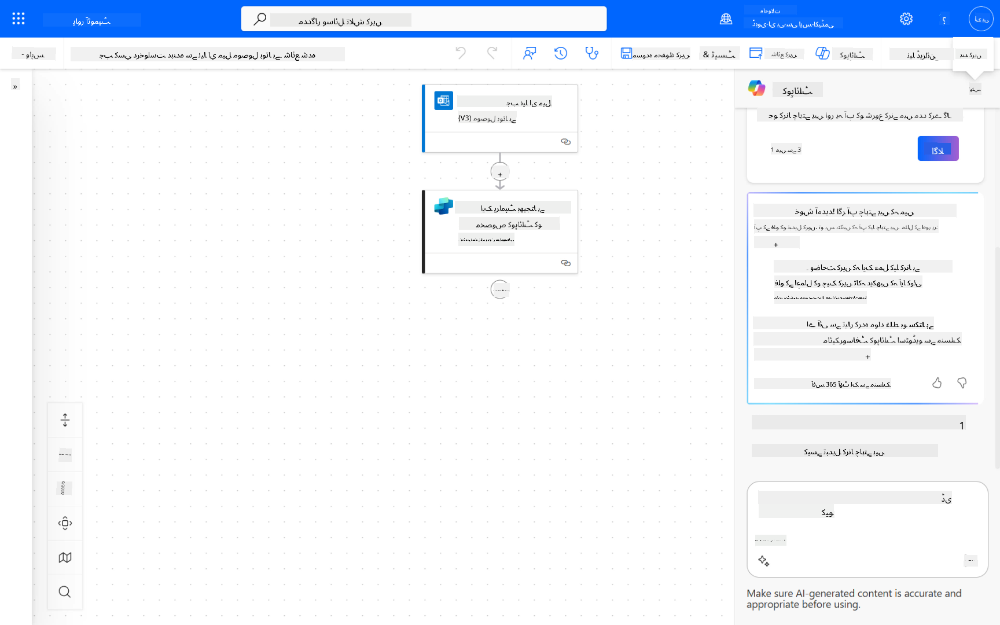

1. ڈیفالٹ کے طور پر، Power Automate میں **When a new email arrives** ٹرگر ایک ساتھ کئی ای میلز کو پروسیس کر سکتا ہے اگر ایک ساتھ کئی ای میلز آئیں، اور فلو صرف ایک بار بیچ کے لیے چلتا ہے۔

فلو کو ہر ای میل کے لیے الگ الگ چلانے کے لیے، ٹرگر کی سیٹنگز میں **Split On** سیٹنگ کو فعال کریں اور ڈراپ ڈاؤن آرے فیلڈ میں `@triggerOutputs()?['body/value']` منتخب کریں۔

**Split On** کو فعال کرنے اور آرے فیلڈ کو `@triggerOutputs()?['body/value']` پر سیٹ کرنے کے ساتھ، فلو ہر پیغام کے لیے الگ الگ چلے گا، چاہے ایک ساتھ کئی آئیں۔

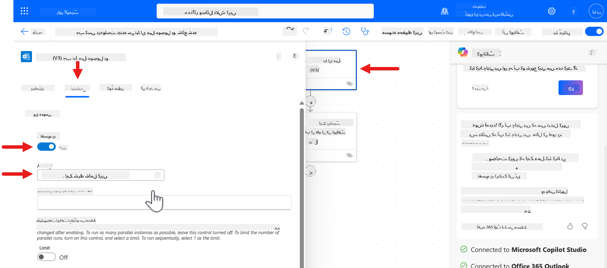

1. اگلا، ہم کچھ منطق شامل کریں گے تاکہ اٹیچمنٹ کی فائل ٹائپ چیک کریں، ہم صرف .PDF فائل اٹیچمنٹس اپ لوڈ کرنا چاہتے ہیں اور تصاویر نہیں (یہ ای میل دستخطوں سے آ سکتی ہیں)۔ ٹرگر کے نیچے **+** آئیکن منتخب کریں اور **Built in tools** سیکشن کے تحت **Control** منتخب کریں۔

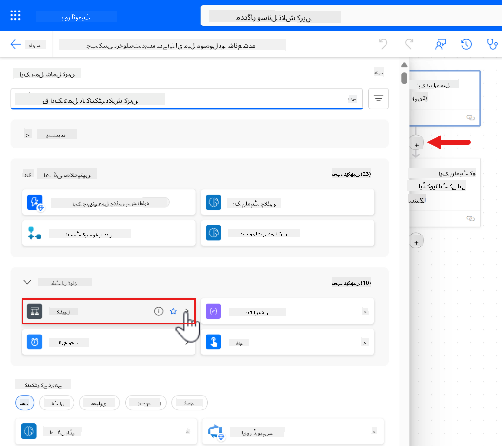

1. **Condition** ایکشن منتخب کریں۔

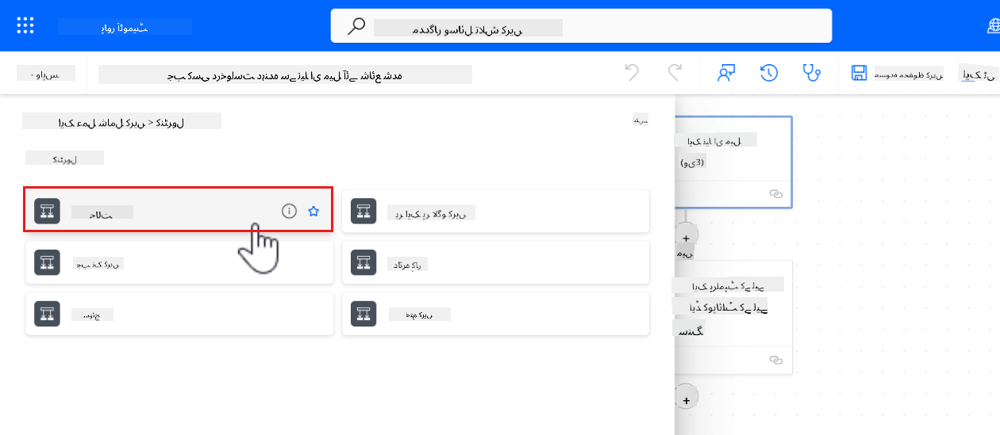

1. اب ہم کنڈیشن کو ترتیب دیں گے تاکہ چیک کریں کہ آیا فائل اٹیچمنٹ کی ٹائپ .PDF ہے۔ **Choose a value** فیلڈ میں، دائیں طرف **lightning bolt icon** یا **fx icon** منتخب کریں۔

1. **Search** فیلڈ میں درج کریں:

```text
content type
```

1. پھر ٹرگر سے **Attachments Content-Type** پیرامیٹر منتخب کریں۔

1. اگلا، **Id** پیرامیٹر میں ڈائنامک کنٹینٹ ان پٹ شامل کرنے کے لیے **Add** منتخب کریں۔

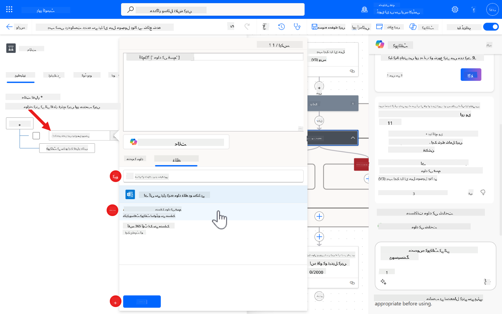

1. یہاں ایک لمحے کے لیے رکیں، آپ نے شاید دیکھا ہوگا کہ **For each** ایکشن خود بخود ظاہر ہوا۔

**For each** ایکشن منتخب کریں۔ یہ ایکشن ای میل میں ہر اٹیچمنٹ کے ذریعے لوپنگ کی نمائندگی کرتا ہے، کیونکہ ٹرگر سے **Attachments Content-Type** پیرامیٹر ہر اٹیچمنٹ سے جڑا ہوا ہے۔

اندرونی طور پر، یہ ایک آرے ہے اور اسی وجہ سے **For each** ایکشن خود بخود شامل کیا گیا جب ہم نے **Condition** ایکشن میں **Attachments Content-Type** پیرامیٹر منتخب کیا۔

اس کے بارے میں مزید جاننے کے لیے، درج ذیل اضافی سیکھنے کے بلاک کو وسعت دیں۔

??? info "اضافی سیکھنا: For each ایکشن خود بخود ظاہر ہونا"

🤔 **"Apply to each" یا "For each" خود بخود کیوں ظاہر ہوتا ہے؟**

جب آپ کسی پیرامیٹر (ڈائنامک کنٹینٹ) کو منتخب کرتے ہیں جو آئٹمز کی فہرست یا آرے کی نمائندگی کرتا ہے - مثال کے طور پر، اٹیچمنٹس، ای میلز، یا قطاروں کی فہرست - Power Automate پہچانتا ہے کہ آپ ہر آئٹم کو انفرادی طور پر پروسیس کرنا چاہتے ہیں۔

آپ کی مدد کرنے کے لیے، Power Automate خود بخود ایک **“Apply to each”** (یا **For each**) لوپ آپ کے ایکشن کے ارد گرد شامل کرتا ہے۔ یہ یقینی بناتا ہے کہ آپ کا ایکشن فہرست میں ہر آئٹم کے لیے ایک بار چلے گا، بجائے اس کے کہ پوری فہرست کو ایک ساتھ پروسیس کرنے کی کوشش کرے (جو غلطیاں پیدا کر سکتا ہے)۔

🦋 **مثال**

- اگر آپ کسی پچھلے ایکشن سے "Attachments" منتخب کرتے ہیں (جو ایک آرے ہے)، اور اسے کسی ایکشن میں استعمال کرنے کی کوشش کرتے ہیں جو ایک فائل کی توقع کرتا ہے، Power Automate آپ کے ایکشن کو **"Apply to each"** (یا **For each**) لوپ میں لپیٹ دیتا ہے۔
- اس طرح، آپ کا ایکشن **ہر اٹیچمنٹ** کے لیے چلے گا - ایک وقت میں ایک۔

💡 **اہم نکات**

- **خودکار:** لوپ خود بخود ظاہر ہوتا ہے تاکہ آپ فہرست میں ہر آئٹم کو پروسیس کر سکیں۔
- **غلطیوں کو روکتا ہے:** لوپ کے بغیر، آپ کا ایکشن ناکام ہو سکتا ہے کیونکہ یہ ایک وقت میں متعدد آئٹمز کو ہینڈل نہیں کر سکتا۔
- **بصری اشارہ:** یہ ایک بصری طریقہ ہے یہ دکھانے کے لیے کہ آپ کا فلو فہرست میں ہر آئٹم کے لیے ایکشن کو دہرائے گا۔

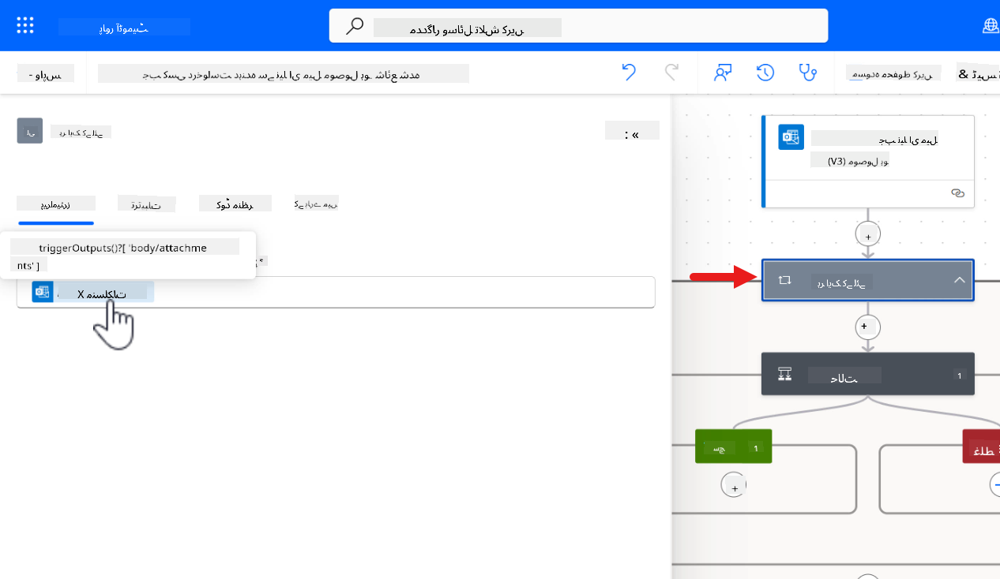

1. اگلا، دوسرے **Choose a value** فیلڈ میں درج کریں:

```text
application/pdf
```

یہ یقینی بنائے گا کہ ہر فائل اٹیچمنٹ کے لیے، یہ چیک کرے گا کہ فائل ایکسٹینشن فارمیٹ .PDF ہے۔

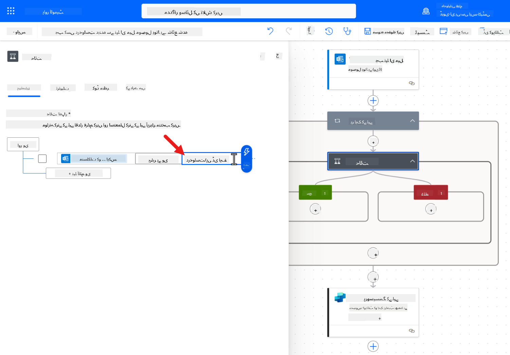

1. اب ہم **True** راستہ ترتیب دیں گے تاکہ ای میل سے فائل نکالیں اور اسے **Resume** Dataverse ٹیبل میں اپ لوڈ کریں۔

**True** راستے میں نیچے ایک نیا ایکشن شامل کریں اور `html to text` تلاش کریں۔ **Html to text** ایکشن منتخب کریں۔

**Html to text** ایکشن کے بارے میں مزید جاننے کے لیے، درج ذیل اضافی سیکھنے کے بلاک کو وسعت دیں۔

??? info "اضافی سیکھنا: Html to text ایکشن"

🤔 **"HTML to text" ایکشن کیا ہے؟**

Power Automate میں **HTML to text** ایکشن HTML فارمیٹڈ مواد کو سادہ متن میں تبدیل کرنے کے لیے استعمال ہوتا ہے۔ یہ خاص طور پر مفید ہے جب آپ کو ڈیٹا (جیسے ای میلز، ویب مواد، یا API جوابات) ملتا ہے جس میں HTML ٹیگز شامل ہوتے ہیں، اور آپ صرف قابل پڑھنے متن نکالنا چاہتے ہیں بغیر کسی فارمیٹنگ یا کوڈ کے۔

⚙️ **یہ کیسے کام کرتا ہے؟**

- **ان پٹ:** آپ HTML مواد کی ایک سٹرنگ فراہم کرتے ہیں (مثال کے طور پر، ای میل کا باڈی)۔
- **آؤٹ پٹ:** ایکشن تمام HTML ٹیگز کو ہٹا دیتا ہے اور صرف سادہ متن واپس کرتا ہے۔

👍🏻 **آپ کو کب استعمال کرنا چاہیے؟**

- جب آپ ای میلز، ویب صفحات، یا API جوابات سے قابل پڑھنے متن نکالنا چاہتے ہیں جن میں HTML شامل ہو۔
- ایسے سسٹمز کو مواد بھیجنے سے پہلے جو HTML فارمیٹنگ کو سپورٹ نہیں کرتے (جیسے SMS، Teams پیغامات، یا ڈیٹا بیس)۔
- ڈیٹا کو مزید پروسیسنگ یا تجزیہ کے لیے صاف کرنے کے لیے۔

🔭 **یہ کہاں ملتا ہے؟**

- Power Automate میں Agent Flows کے لیے، ایکشن کو `HTML to text` کے نام سے تلاش کریں۔ یہ **Data Operations** کنیکٹر کے تحت ہے۔

💡 **اہم نکات**

- یہ تمام HTML ٹیگز کو ہٹا دیتا ہے اور صرف متن چھوڑتا ہے۔
- یہ اسکرپٹس/اسٹائلز کو انٹرپریٹ یا ایکزیکیوٹ نہیں کرتا - صرف ٹیگز کو ہٹاتا ہے۔
- ڈیٹا کی صفائی اور سادہ متن آؤٹ پٹس کے لیے مواد تیار کرنے کے لیے مفید۔

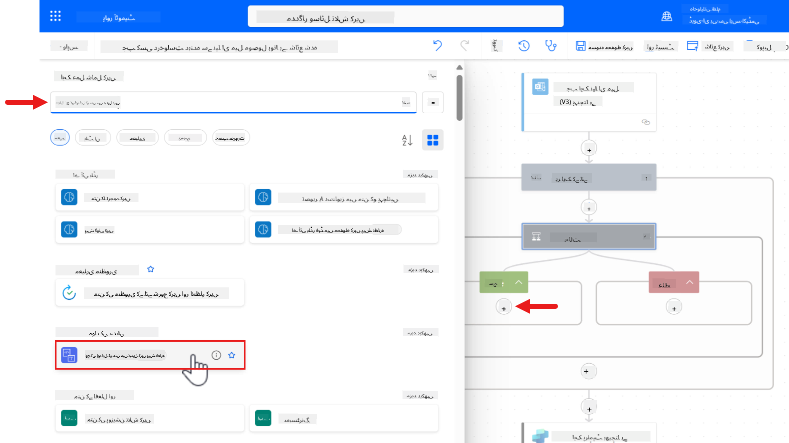

1. اگلا، ہم **Html to text** ایکشن کے لیے ایک نیا کنکشن ریفرنس بنائیں گے۔ **Add new** منتخب کریں۔

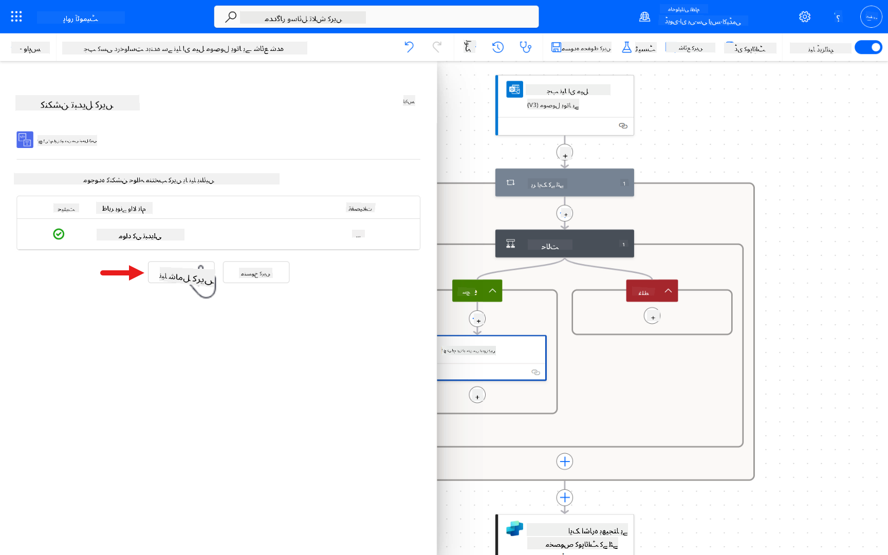

1. ایکشن اب ترتیب دیا جا سکتا ہے۔ ٹرگر سے **Body** پیرامیٹر شامل کریں۔ **Content** فیلڈ میں، دائیں طرف **lightning bolt icon** یا **fx icon** منتخب کریں۔

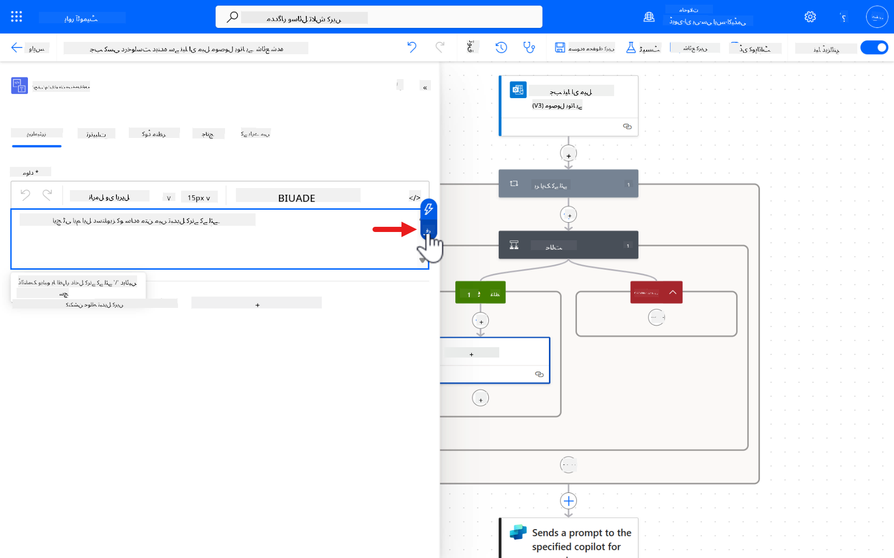

1. **Dynamic content** ٹیب میں `body` تلاش کریں اور **Body** پیرامیٹر منتخب کریں، پھر **Add** منتخب کریں۔

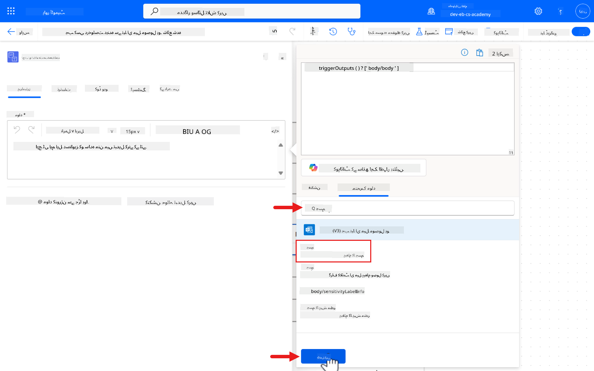

1. ہم نے اس ایکشن کی ترتیب مکمل کر لی ہے، لہذا ایکشن سے باہر نکلنے کے لیے بائیں طرف اشارہ کرنے والے دو زاویہ بریکٹ («) منتخب کریں تاکہ پینل کو بند کیا جا سکے۔

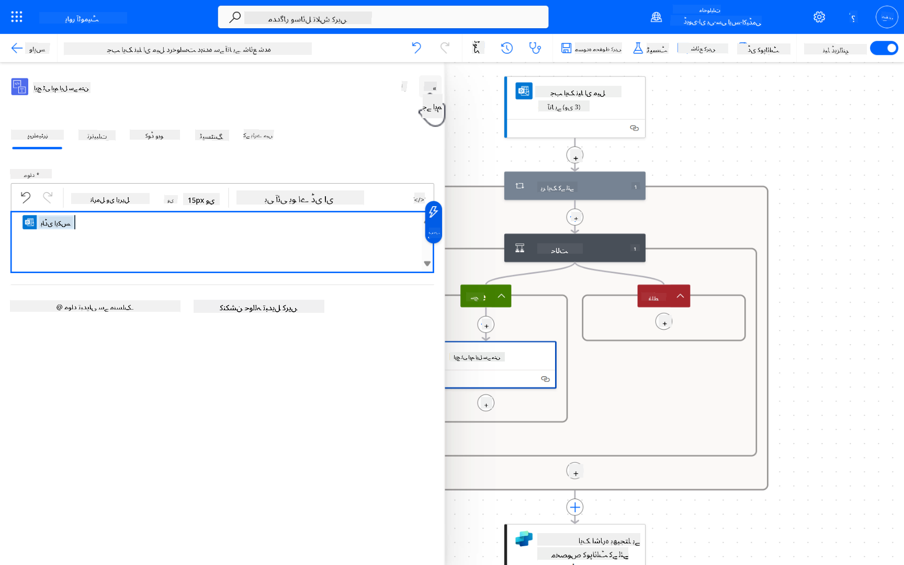

1. ہم ایک نیا ایکشن شامل کریں گے، **Html to text** ایکشن کے نیچے **+ آئیکن** منتخب کریں جو ایکشنز شامل کرنے کے لیے پینل لوڈ کرے گا۔ **Microsoft Dataverse** کنیکٹر منتخب کریں۔

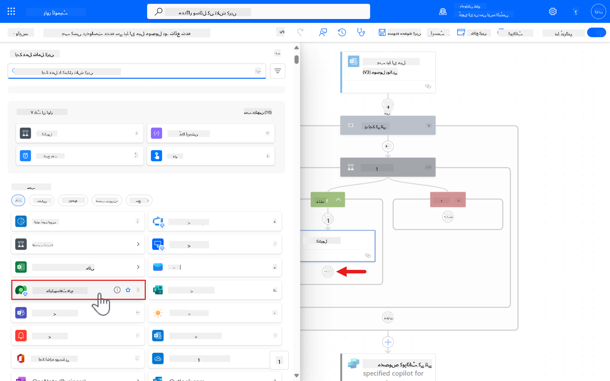

1. **Add a new row** ایکشن منتخب کریں۔

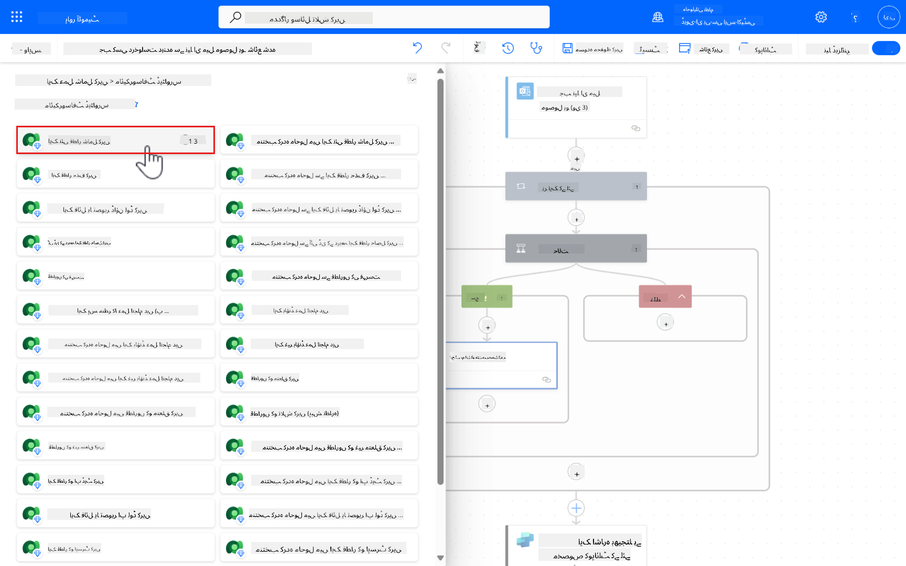

1. ایکشن کا نام تبدیل کریں، **Ellipsis (...)** منتخب کریں، اور درج ذیل کو نام کے طور پر کاپی اور پیسٹ کریں:

```text
Add a new Resume row
```

**Table name** پیرامیٹر کے لیے، `res` تلاش کریں اور **Resumes** ٹیبل منتخب کریں۔

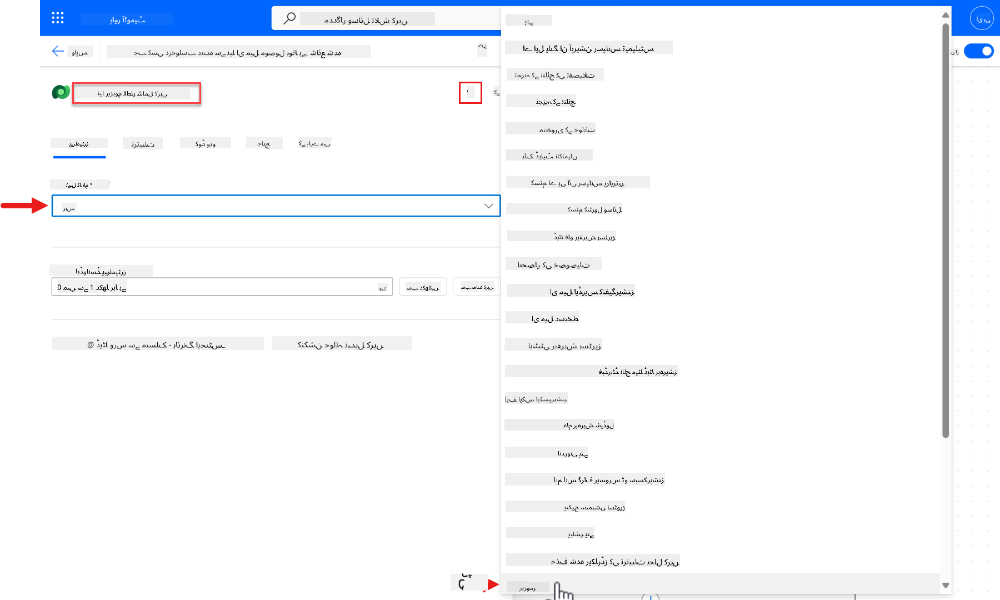

1. اگلا، **Resume Title** فیلڈ منتخب کریں اور دائیں طرف **lightning bolt icon** یا **fx icon** منتخب کریں۔

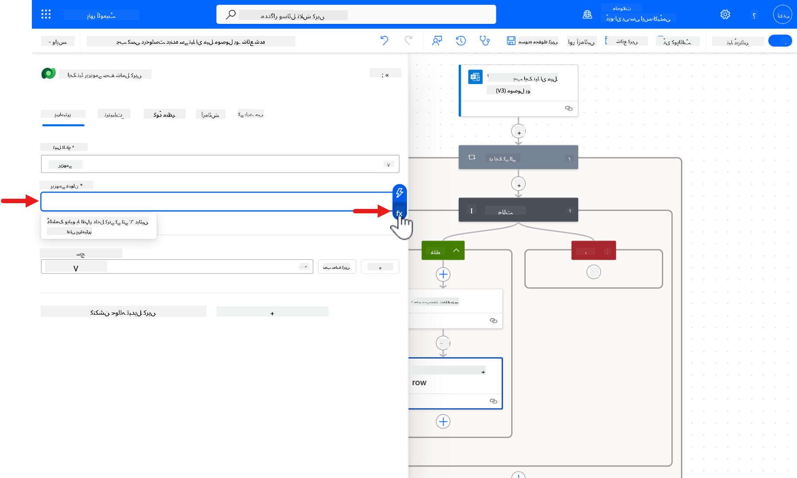

1. **Function tab** میں، درج ذیل اظہار درج کریں جو `item()` فنکشن استعمال کرتا ہے:

```text
item()?['name']
```

`item ()` فنکشن کے بارے میں مزید جاننے کے لیے، درج ذیل اضافی سیکھنے کے بلاک کو وسعت دیں۔

??? info "اضافی سیکھنا: `item()` فنکشن"

🤔 **`item()` فنکشن کیا ہے؟**

- جب آپ **Apply to each** ایکشن استعمال کرتے ہیں، Power Automate ایک کلیکشن (آرے) میں ہر عنصر کے ذریعے جاتا ہے۔
- یہ اکثر ایکشنز جیسے **Apply to each** (یا **For each**)، **Select**، یا **Filter array** کے اندر استعمال ہوتا ہے۔

⚙️ **یہ کیسے کام کرتا ہے؟**

- `item()` ایک فنکشن ہے جو لوپ یا آرے آپریشن میں پروسیس کیے جا رہے موجودہ آئٹم کو واپس کرتا ہے۔
- اس لوپ کے اندر، `item()` پروسیس کیے جا رہے _موجودہ عنصر_ کی نمائندگی کرتا ہے۔

📌 **آپ اسے کہاں استعمال کرتے ہیں؟**

- **Apply to each:** موجودہ آئٹم کی پراپرٹیز تک رسائی کے لیے۔
- **Select:** آرے میں ہر آئٹم کو تبدیل کرنے کے لیے۔
- **Filter array:** موجودہ آئٹم کا جائزہ لینے کے لیے۔

🦋 **مثال**

- لوپ کے اندر اظہار:
       -  `item()?['Email']`
- یہ موجودہ آئٹم کی `Email` پراپرٹی حاصل کرتا ہے۔

💡 **اہم نکات**

- `item()` _کانٹیکسٹ حساس_ ہے: یہ ہمیشہ اس لوپ یا آرے آپریشن میں موجودہ آئٹم کی نمائندگی کرتا ہے جس میں آپ ہیں۔
- اگر آپ لوپس کو نیسٹ کرتے ہیں، تو آپ کسی خاص لوپ میں آئٹمز کا حوالہ دینے کے لیے `items('LoopName')` استعمال کر سکتے ہیں۔

**Resume Title** پیرامیٹر میں اظہار شامل کرنے کے لیے **Add** منتخب کریں۔

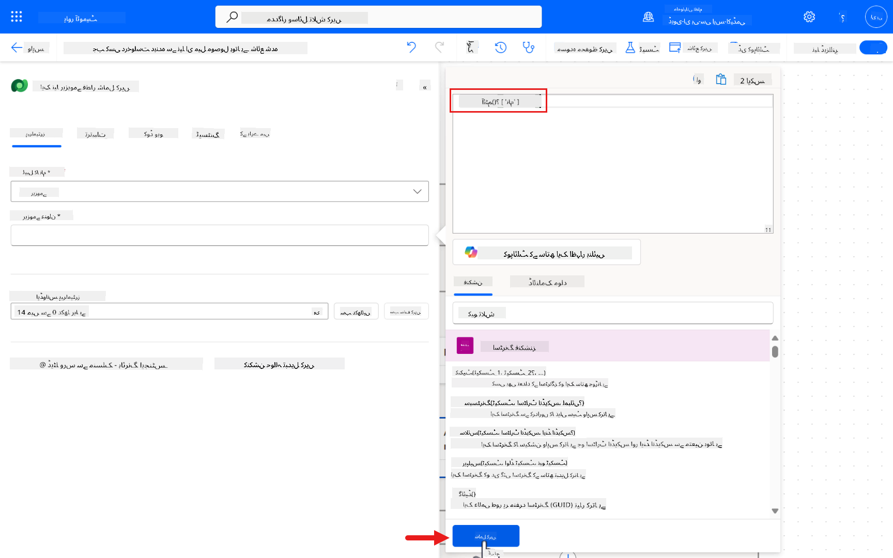

1. ہمیں ابھی بھی کئی مزید پیرامیٹرز ترتیب دینے کی ضرورت ہے، **Show all** منتخب کریں اور **Cover Letter** فیلڈ میں، دائیں طرف **lightning bolt icon** یا **fx icon** منتخب کریں۔

**Function tab** میں، درج ذیل اظہار درج کریں جو پچھلے [مشن](../02-multi-agent/README.md) میں استعمال ہونے والے اظہار کو استعمال کرتا ہے:

```text
if(greater(length(body('Html_to_text')), 2000), substring(body('Html_to_text'), 0, 2000), body('Html_to_text'))
```

یہ اظہار چیک کرتا ہے کہ آیا **Html to text** ایکشن سے _متن_ 2000 حروف سے زیادہ لمبا ہے، اور اگر ایسا ہے تو، صرف پہلے 2000 حروف واپس کرتا ہے؛ بصورت دیگر، یہ مکمل متن واپس کرتا ہے۔

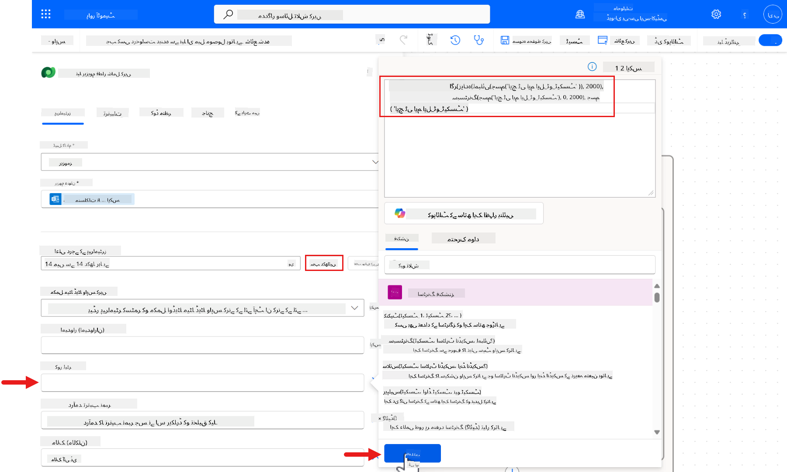

1. اظہار اب **Cover Letter** فیلڈ میں شامل کر دیا جائے گا۔

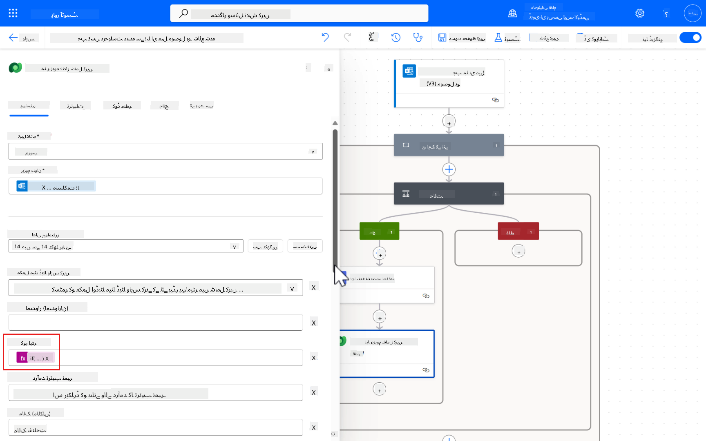

1. **Source Email Address** فیلڈ کے لیے، `from` تلاش کریں اور ٹرگر سے **From** پیرامیٹر منتخب کریں کیونکہ اس میں ای میل ایڈریس کی ویلیو شامل ہے۔

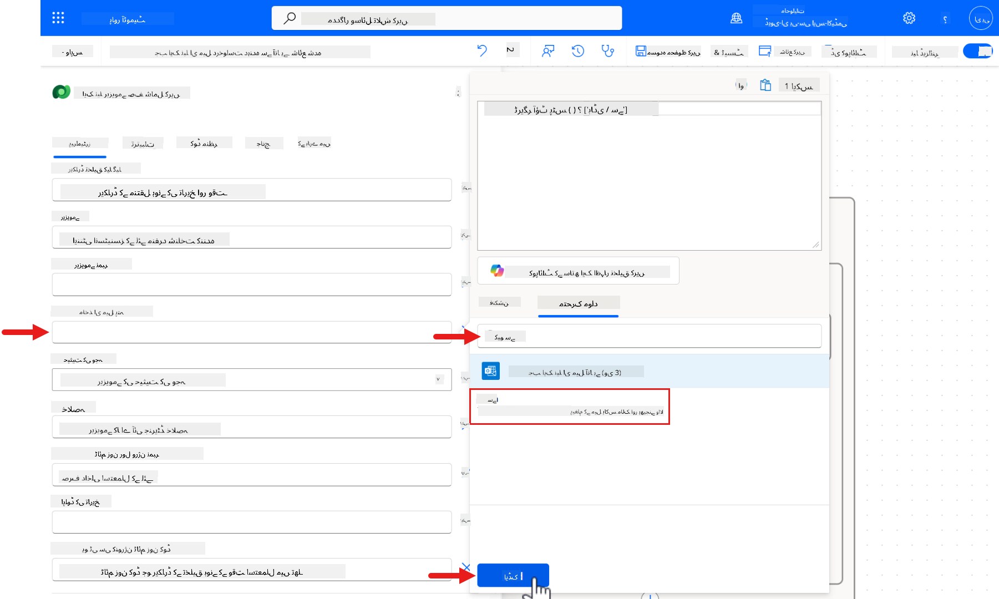

1. **Upload Date** فیلڈ کے لیے، دائیں طرف **lightning bolt icon** یا **fx icon** منتخب کریں۔ **Function tab** میں، درج ذیل اظہار درج کریں جو `utcNow()` فنکشن استعمال کرتا ہے:

```text
utcNow()
```

`utcNow` فنکشن کے بارے میں مزید جاننے کے لیے، درج ذیل اضافی سیکھنے کے بلاک کو وسعت دیں۔

??? info "اضافی سیکھنا: `utcNow` فنکشن"

🤔 **`utcNow()` فنکشن کیا ہے؟**

- Power Automate میں utcnow() فنکشن موجودہ تاریخ اور وقت کو Coordinated Universal Time (UTC) میں ISO 8601 فارمیٹ میں واپس کرتا ہے، جیسے: `2025-09-23T04:32:14Z`

🦋 **مثال**

- اظہار:
       -  `concat('Report generated on ', utcnow())`
- آؤٹپٹ ہے:
       - Report generated on `2025-09-23T04:32:14Z`

💡 **اہم نکات**
- **کوئی دلائل (ان پٹ پیرامیٹرز) کی ضرورت نہیں:** یہ ہمیشہ موجودہ UTC ٹائم اسٹیمپ فراہم کرتا ہے۔
   - **استعمال کے مواقع**
       - لاگز یا فائل ناموں میں ٹائم اسٹیمپ شامل کرنا
       - موجودہ وقت کا دوسرے تاریخوں کے ساتھ موازنہ کرنا
       - شیڈولنگ یا وقت پر مبنی شرائط

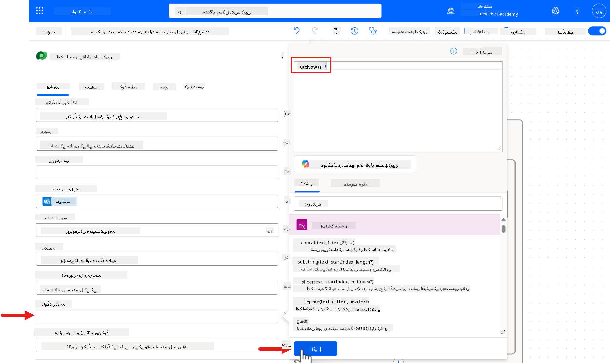

1. ہم نے **ایک نیا ریزیومے رو شامل کریں** ایکشن کی ترتیب مکمل کر لی ہے، اب پینل سے باہر نکلنے کے لیے اسے بند کریں۔

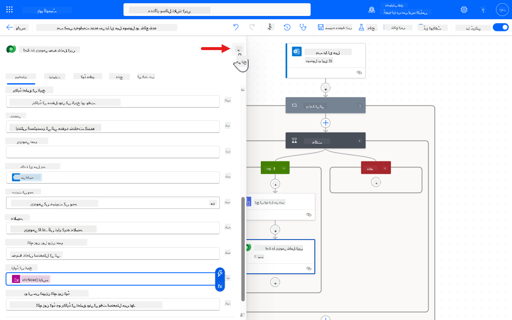

1. ہم ایک نیا ایکشن شامل کریں گے، **+ آئیکن** کو **ایک نیا ریزیومے رو شامل کریں** ایکشن کے نیچے منتخب کریں، جو ایکشنز شامل کرنے کے لیے پینل کو لوڈ کرے گا۔ دوبارہ **Microsoft Dataverse** کنیکٹر منتخب کریں۔

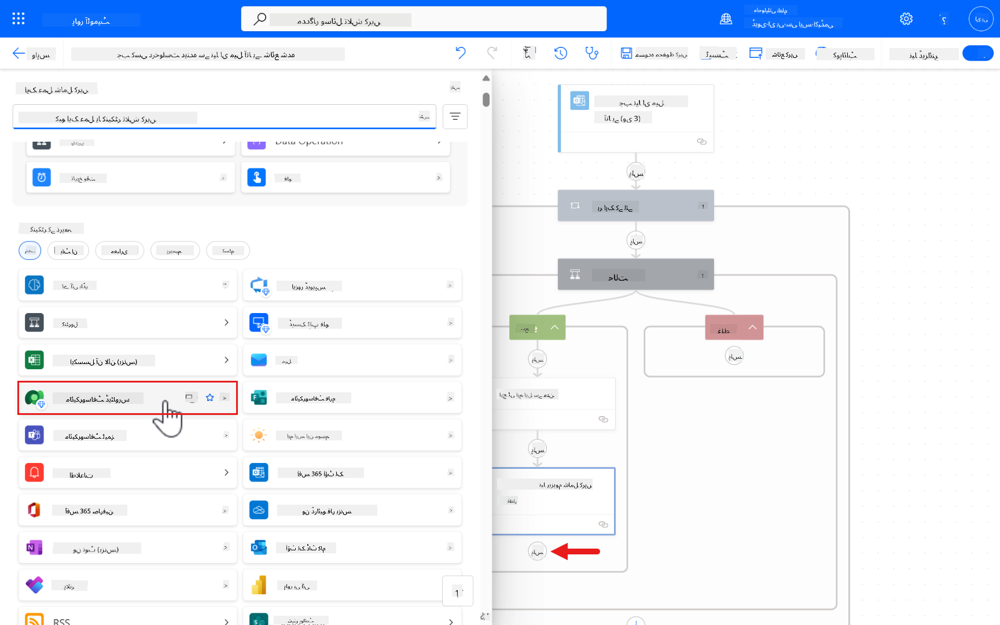

1. **ایک فائل یا تصویر اپلوڈ کریں** ایکشن منتخب کریں۔

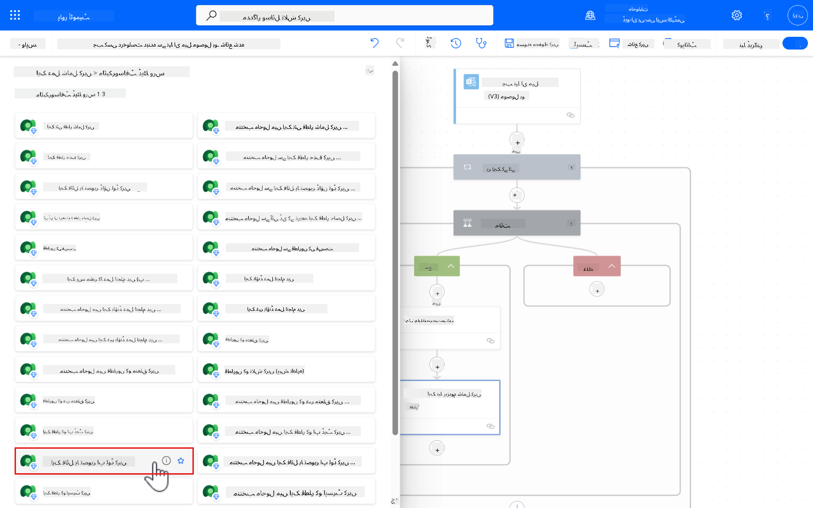

1. ایکشن کا نام تبدیل کرنے کے لیے **Ellipsis (...)** منتخب کریں، اور درج ذیل کو نام کے طور پر کاپی اور پیسٹ کریں،

```text
Upload Resume File
```

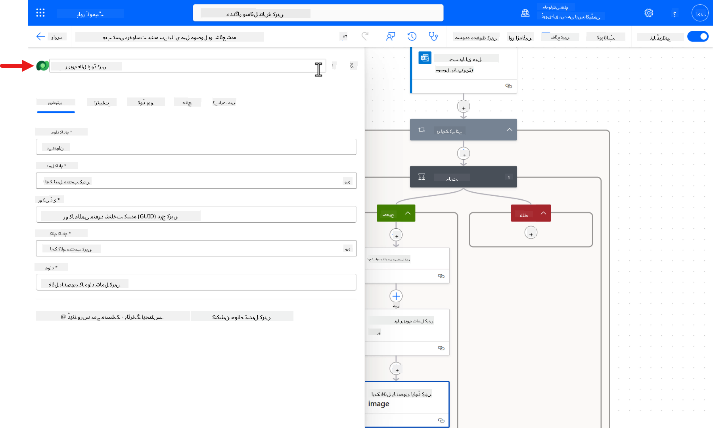

1. اگلے مرحلے میں **Content name** فیلڈ منتخب کریں اور دائیں طرف **lightning bolt icon** یا **fx icon** منتخب کریں۔

**Function tab** میں، درج ذیل اظہار درج کریں جو `item ()` فنکشن استعمال کرتا ہے۔ یہ موجودہ آئٹم (اٹیچمنٹ فائل) کی `name` پراپرٹی حاصل کرتا ہے۔

```text
item()?['name']
```

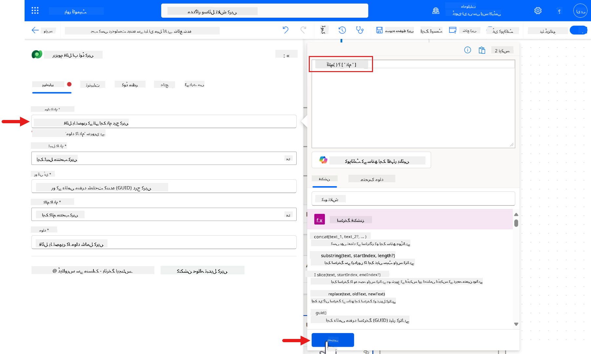

1. **Table name** پیرامیٹر کے لیے، `res` تلاش کریں اور **Resumes** ٹیبل منتخب کریں۔

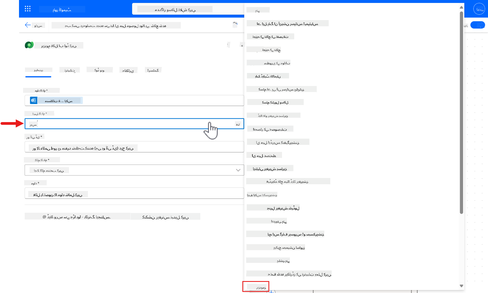

1. اگلے مرحلے میں **Row ID** فیلڈ منتخب کریں اور دائیں طرف **lightning bolt icon** یا **fx icon** منتخب کریں۔

`ID` تلاش کریں اور _Add a new row_ Dataverse ایکشن سے **Resume** پیرامیٹر منتخب کریں کیونکہ اس میں پی ڈی ایف فائل اپلوڈ کرنے کے لیے رو کا ID ویلیو موجود ہے۔

**Add** منتخب کریں۔

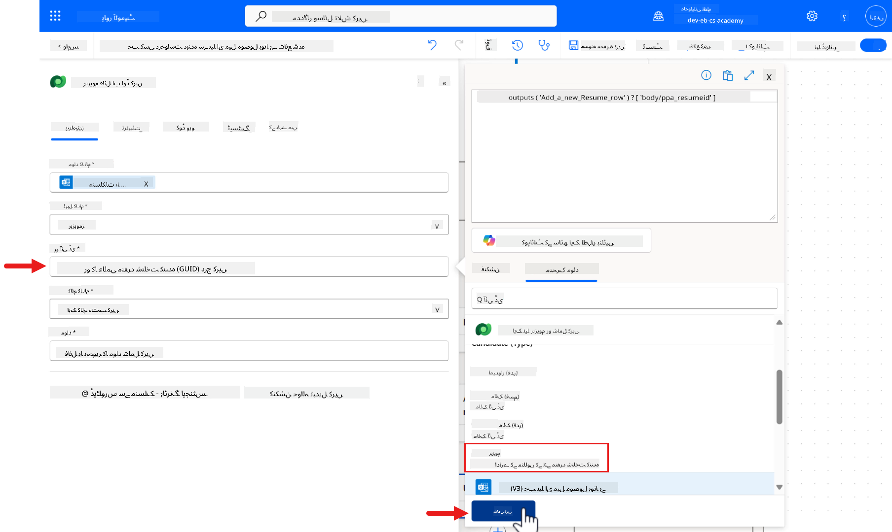

1. **Column name** فیلڈ منتخب کریں اور **Resume PDF** آپشن منتخب کریں۔

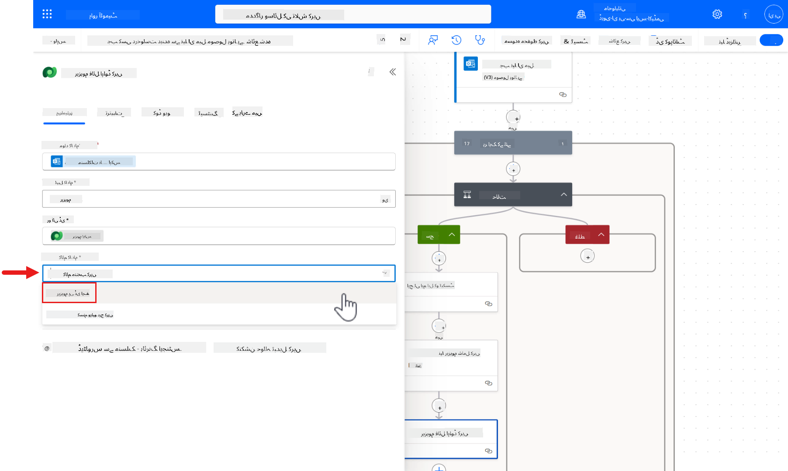

1. **Content** فیلڈ منتخب کریں اور دائیں طرف **lightning bolt icon** یا **fx icon** منتخب کریں۔

**Function tab** میں، درج ذیل اظہار درج کریں جو `item ()` فنکشن استعمال کرتا ہے۔ یہ موجودہ آئٹم (اٹیچمنٹ فائل) کی `contentBytes` پراپرٹی حاصل کرتا ہے۔ `contentBytes` فائل یا اٹیچمنٹ کے خام بائنری ڈیٹا کو ظاہر کرتا ہے، جو Base64 سٹرنگ کے طور پر انکوڈ کیا گیا ہے۔

```text
item()?['contentBytes']
```

1. ہم نے اس ایکشن کی ترتیب مکمل کر لی ہے، اب ایکشن سے باہر نکلنے کے لیے دو زاویہ بریکٹ («) منتخب کریں جو بائیں طرف اشارہ کر رہے ہیں تاکہ پینل بند ہو جائے۔

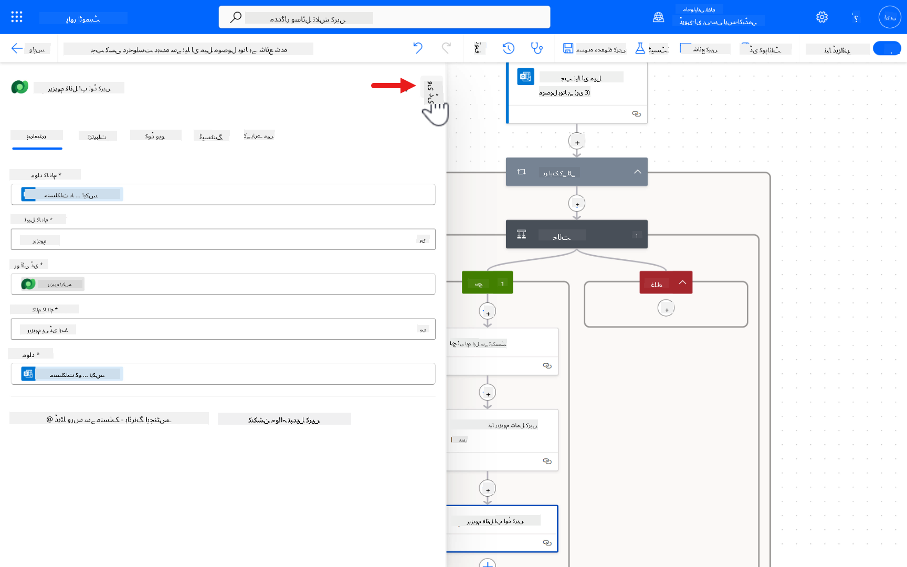

1. اگلے مرحلے میں **Sends a prompt to the specified copilot for processing** منتخب کریں، پھر اس ایکشن کو **Upload Resume File** ایکشن کے نیچے _True_ راستے میں ڈریگ اور ڈراپ کریں۔

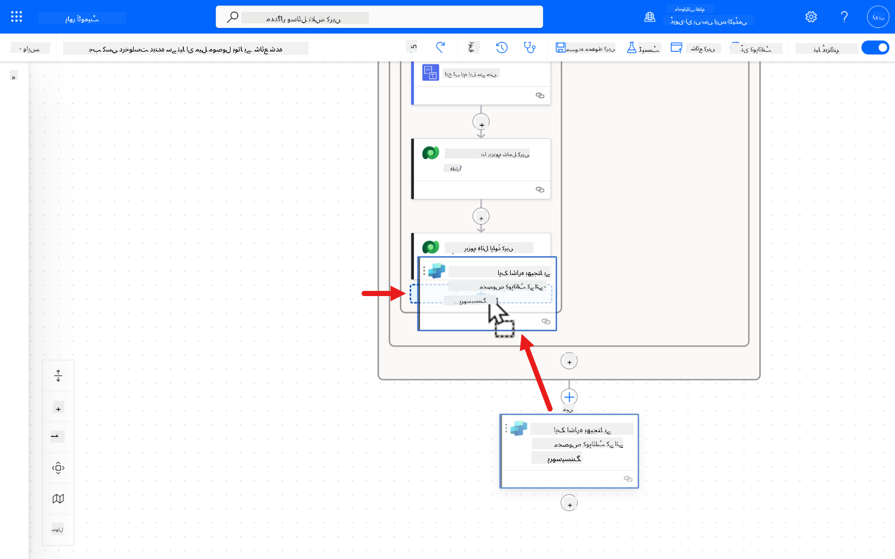

1. **Sends a prompt to the specified copilot for processing** منتخب کریں تاکہ اسے ترتیب دیا جا سکے۔

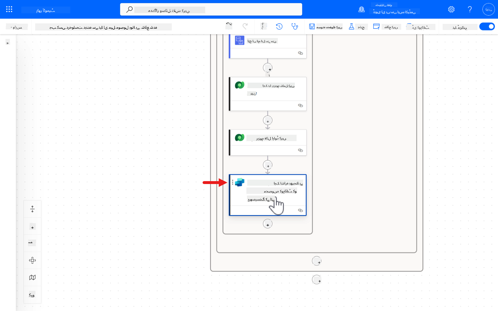

1. **Body/message** فیلڈ میں جائیں، تمام مواد منتخب کریں اور اسے صاف/حذف کریں۔

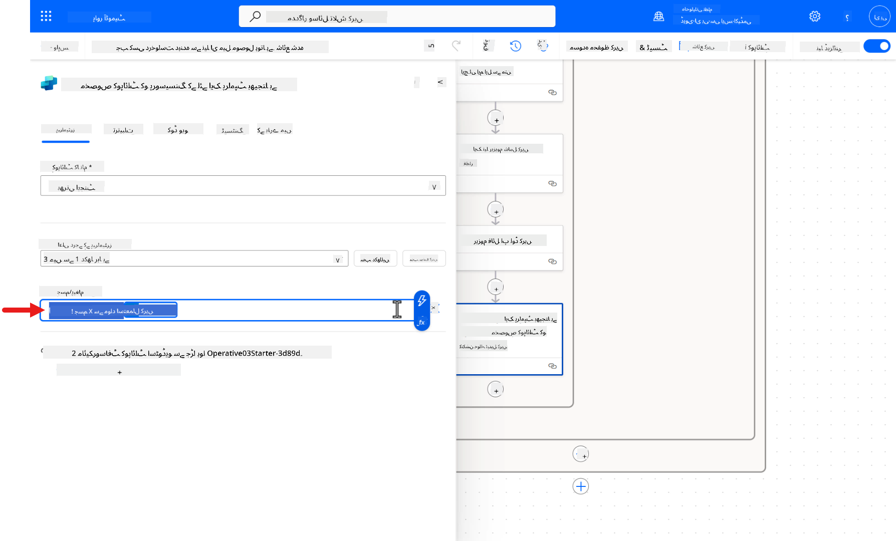

1. درج ذیل متن کو **Body/message** فیلڈ میں کاپی اور پیسٹ کریں اور `RESUME ID PLACEHOLDER` کو نمایاں کریں۔

```text
Send [ResumeId (text)] = "RESUME ID PLACEHOLDER" and [ResumeTitle (text_1)] = "RESUME TITLE PLACEHOLDER" and [ResumeNumber (text_2)]= "RESUME NUMBER PLACEHOLDER" to the Tool "Notify Teams Applicant channel" in the child agent "Application Intake Agent"
```


1. دائیں طرف **lightning bolt icon** یا **fx icon** منتخب کریں۔

`resume` تلاش کریں اور _Add a new row Dataverse_ ایکشن سے **Resume** پیرامیٹر منتخب کریں کیونکہ اس میں بنائے گئے Resume رو کا `ID` ویلیو موجود ہے۔

**Add** منتخب کریں۔


1. `RESUME TITLE PLACEHOLDER` کو نمایاں کریں۔ دائیں طرف **lightning bolt icon** یا **fx icon** منتخب کریں۔

`title` تلاش کریں اور _Add a new row Dataverse_ ایکشن سے **Resume Title** پیرامیٹر منتخب کریں کیونکہ اس میں بنائے گئے Resume رو کا `resume title` ویلیو موجود ہے۔

**Add** منتخب کریں۔

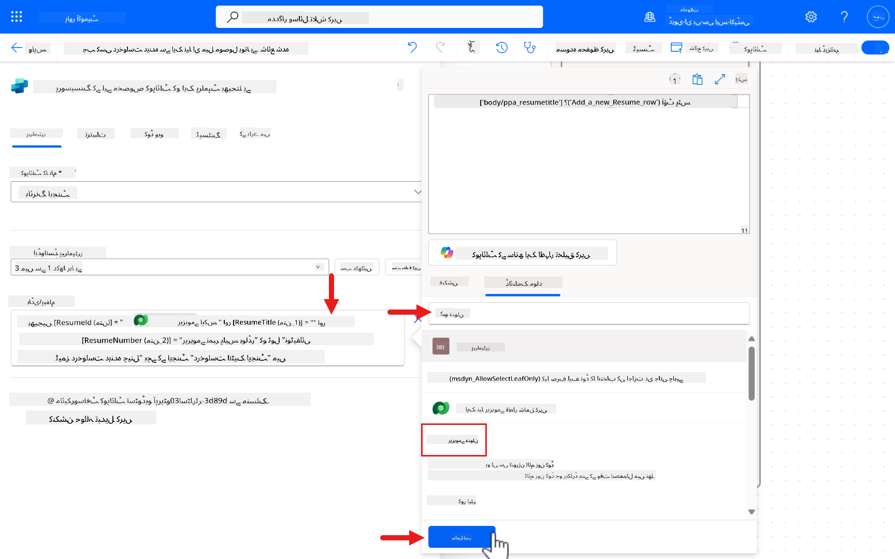

1. `RESUME NUMBER PLACEHOLDER` کو نمایاں کریں۔ دائیں طرف **lightning bolt icon** یا **fx icon** منتخب کریں۔

`resume number` تلاش کریں اور _Add a new row Dataverse_ ایکشن سے **Resume Number** پیرامیٹر منتخب کریں کیونکہ اس میں بنائے گئے Resume رو کا `Resume Number` ویلیو موجود ہے۔

**Add** منتخب کریں۔

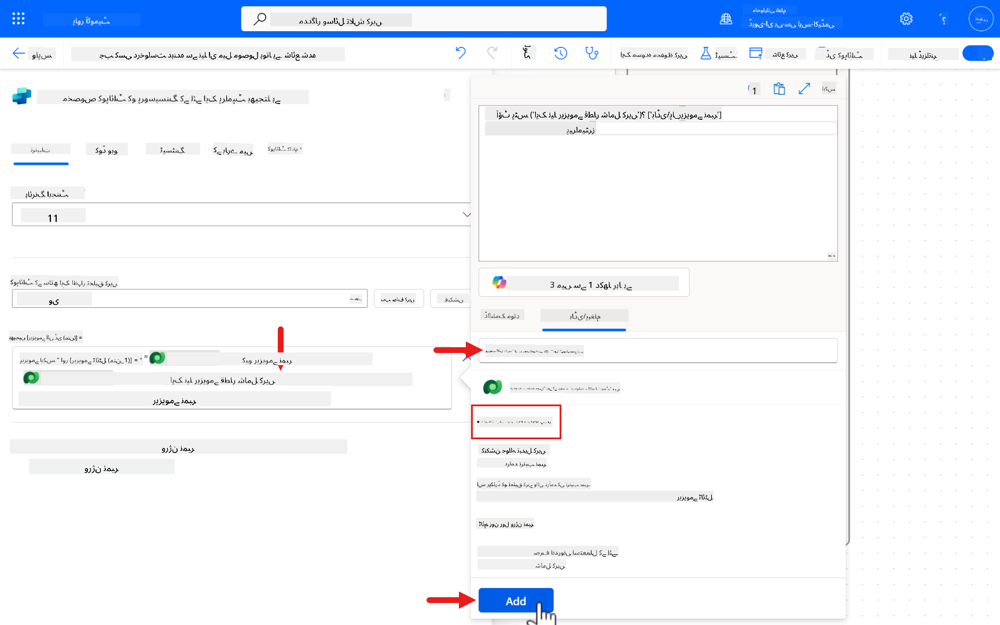

1. ہم نے اس ایکشن کی ترتیب مکمل کر لی ہے اور ہمارا ایجنٹ فلو 🙌🏻 آپ بہت اچھا کر رہے ہیں! اب **Save draft** منتخب کر کے اپنے ایونٹ ٹریگر فلو کو محفوظ کریں۔

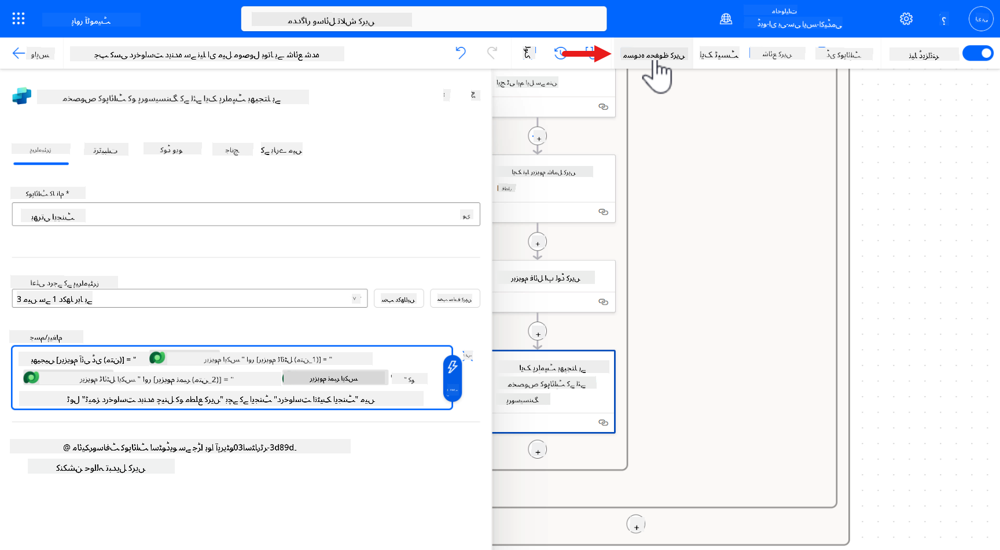

1. اب ہمیں ایجنٹ فلو کی تفصیلات میں ترمیم کرنے کی ضرورت ہے، **Back** منتخب کریں۔

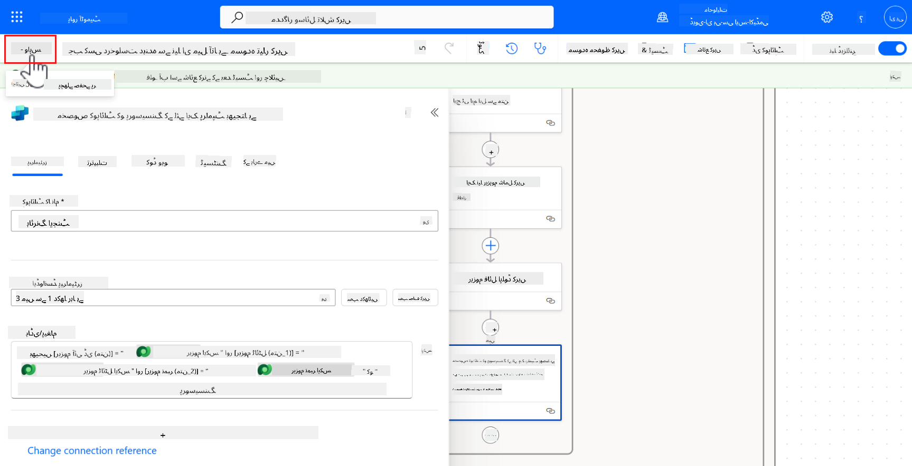

1. **Details** سیکشن میں **Edit** منتخب کریں اور **Plan** کو **Copilot Studio** آپشن میں اپ ڈیٹ کریں۔

**Save** منتخب کریں۔

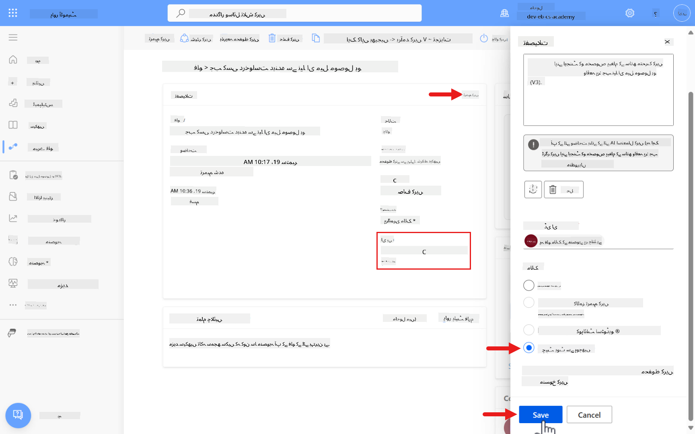

1. ایک موڈل ظاہر ہوگا جو آپ سے Copilot Studio پلان میں تبدیل کرنے کی تصدیق کرنے کے لیے کہے گا۔ **Confirm** منتخب کریں۔

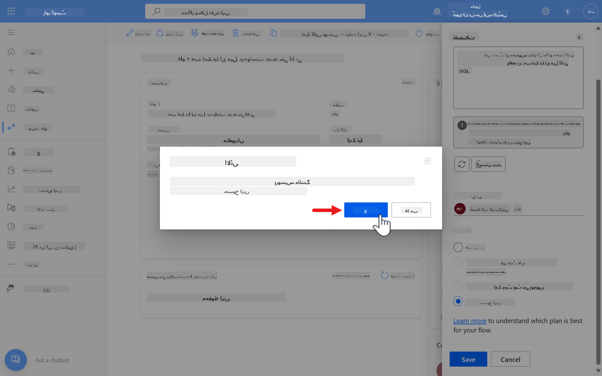

1. پلان اب **Copilot Studio** میں اپ ڈیٹ ہو گیا ہے۔ **Edit** منتخب کریں کیونکہ ہمیں اپنے ایجنٹ کے لیے ایونٹ ٹریگر فلو کو پبلش کرنا ہے۔

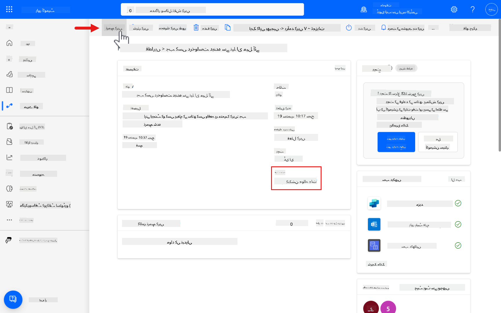

1. **Publish** منتخب کریں۔

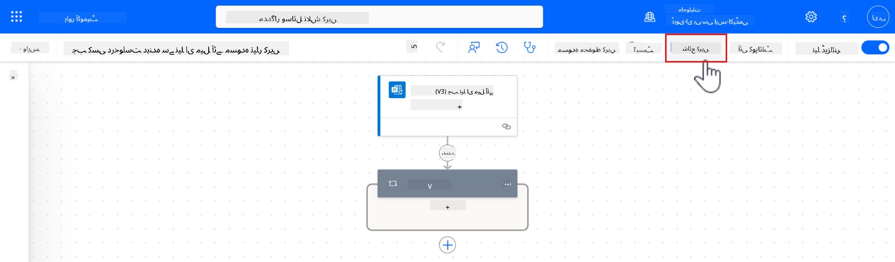

واہ! ایونٹ ٹریگر فلو اب پبلش ہو گیا ہے 😃

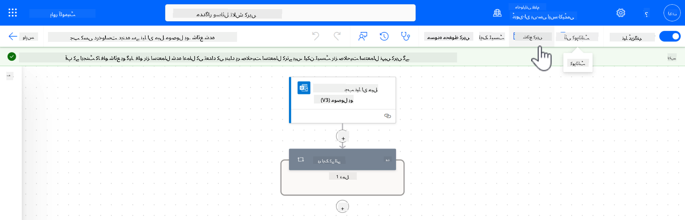

چلیں ایک نیا ایجنٹ فلو بنانے کی طرف بڑھتے ہیں جو بچے **Intake Application Agent** کے ذریعے چلایا جائے گا۔

### لیب 3.2 - ایک ایڈاپٹیو کارڈ استعمال کرتے ہوئے Teams چینل کو مطلع کریں

اب ہم بچے **Intake Application Agent** کے لیے ایک نیا ایجنٹ فلو بنانے جا رہے ہیں جو ایونٹ ٹریگر کے ذریعے دی گئی ویلیوز استعمال کرے گا، تاکہ ایک ایڈاپٹیو کارڈ کو Teams چینل پر پوسٹ کیا جا سکے۔ یہ ایڈاپٹیو کارڈ HR ریکروٹمنٹ ٹیم کو اس پی ڈی ایف کے بارے میں مطلع کرے گا جو خودکار طور پر اپلوڈ کی گئی ہے تاکہ وہ اسے جائزہ لے سکیں۔

چلیں شروع کرتے ہیں!

1. **Hiring Agent** میں **Agents** ٹیب منتخب کریں اور **Application Intake Agent** منتخب کریں۔

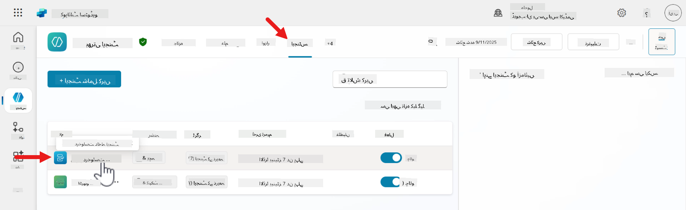

1. **Tools** تک نیچے سکرول کریں اور **+ Add** منتخب کریں۔

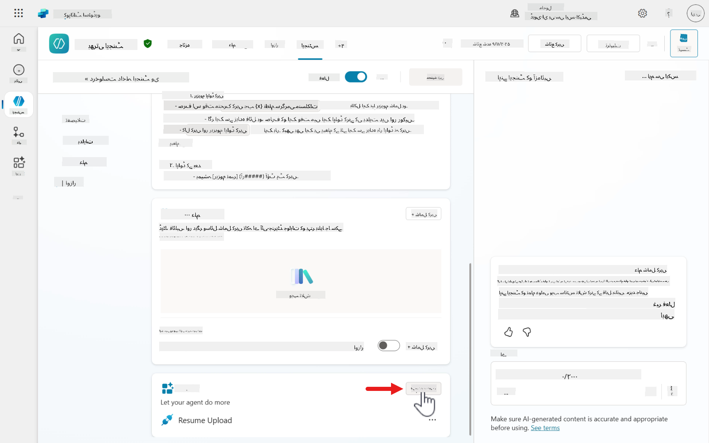

1. **Add tool** موڈل ظاہر ہوگا۔ **+ New tool** منتخب کریں۔

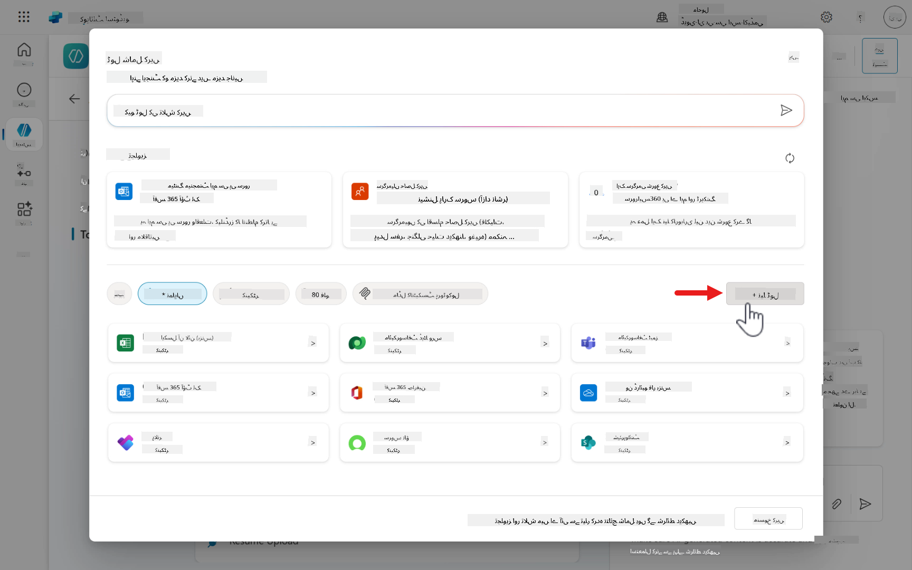

1. **Agent flow** منتخب کریں۔


1. **ایجنٹ فلو ڈیزائنر** اگلے مرحلے میں لوڈ ہوگا۔ **When an agent calls the flow** ٹریگر میں، **+ Add an input** منتخب کریں۔

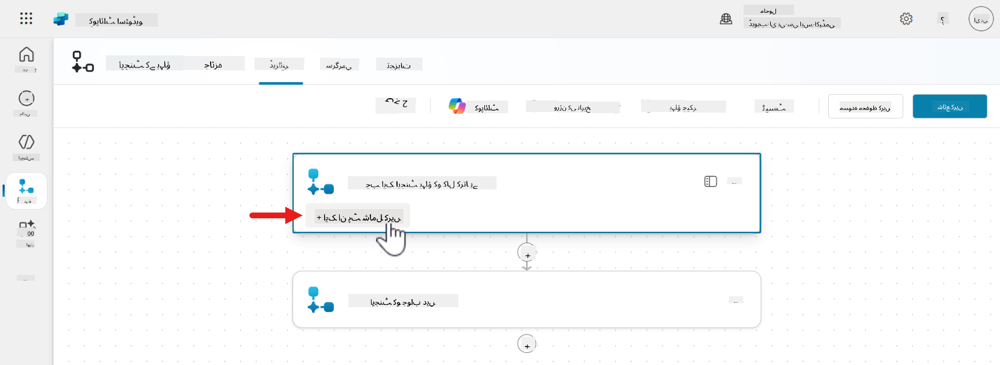

1. صارف انپٹ کی قسم کے طور پر **Text** منتخب کریں۔

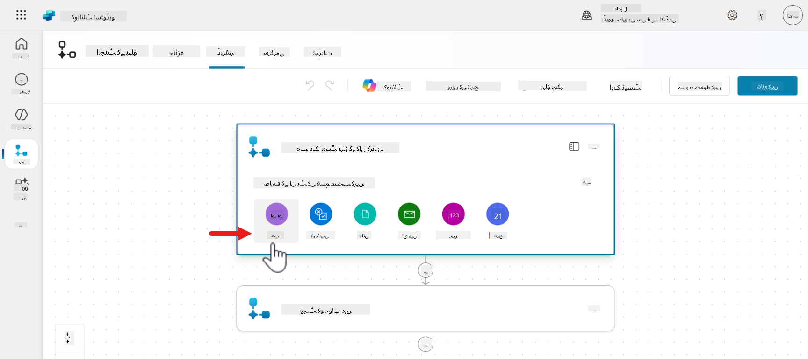

1. انپٹ ٹیکسٹ فیلڈ میں، درج ذیل کو انپٹ پیرامیٹر نام کے طور پر کاپی اور پیسٹ کریں۔

```text
ResumeId
```

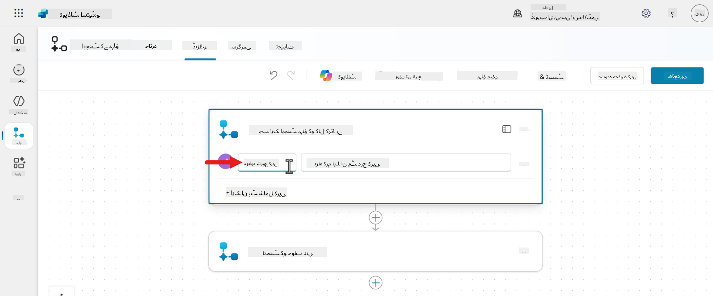

1. دوسرے ٹیکسٹ انپٹ شامل کرنے کے لیے وہی مراحل دہرائیں۔ درج ذیل کو انپٹ پیرامیٹر نام کے طور پر کاپی اور پیسٹ کریں۔

```text
ResumeTitle
```

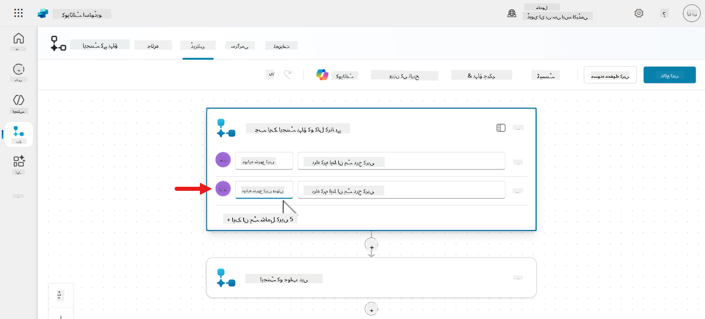

1. تیسرے ٹیکسٹ انپٹ شامل کرنے کے لیے وہی مراحل دہرائیں۔ درج ذیل کو انپٹ پیرامیٹر نام کے طور پر کاپی اور پیسٹ کریں۔

```text
ResumeNumber
```

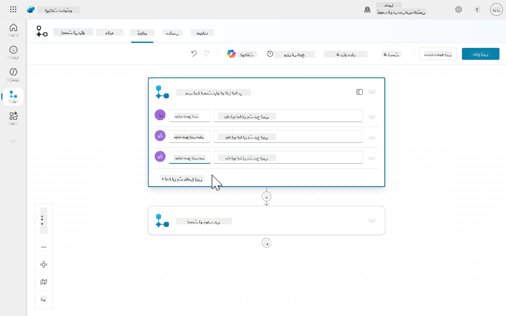

1. یاد ہے کہ [Recruit](../../recruit/08-add-adaptive-card/README.md#81-create-a-new-topic-with-an-adaptive-card-for-user-to-submit-their-request) میں ہم نے اپنے ایجنٹ کے لیے ایک موضوع میں ایڈاپٹیو کارڈ شامل کیا تھا؟ اس بار، ہم ایجنٹ فلو میں ایک ایڈاپٹیو کارڈ شامل کرنے جا رہے ہیں۔ اب ہم اپنے ایجنٹ فلو میں ایک اور ایکشن شامل کریں گے جو Teams چینل پر ایک ایڈاپٹیو کارڈ پوسٹ کرے گا۔

**+ آئیکن** کو ٹریگر کے نیچے منتخب کریں۔

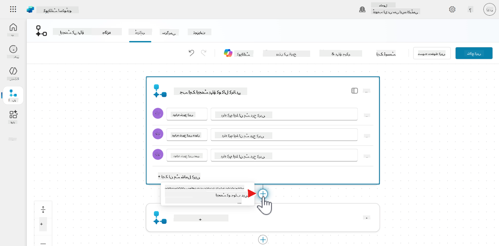

1. **Post card in a chat or channel** ایکشن منتخب کریں۔

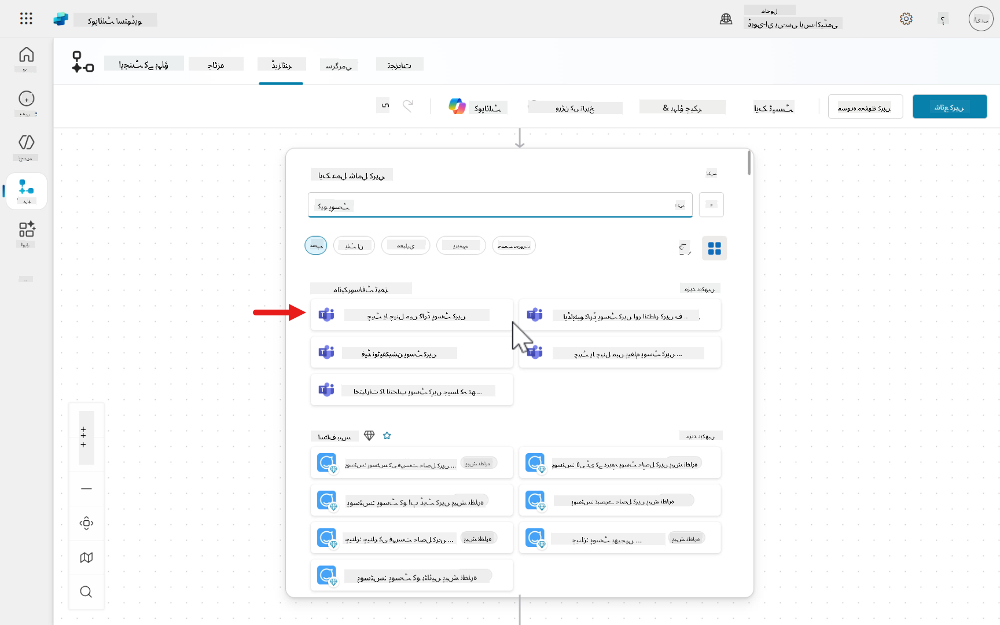

1. Microsoft Teams کے ساتھ آپ کے سائن ان کردہ صارف اکاؤنٹ کے ذریعے ایک کنکشن ریفرنس بنانا ہوگا۔ **Sign in** منتخب کریں۔

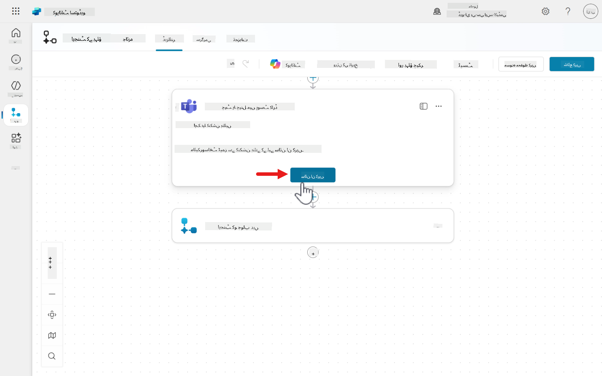

1. اپنا صارف اکاؤنٹ منتخب کریں اور پھر **Allow access** منتخب کریں۔

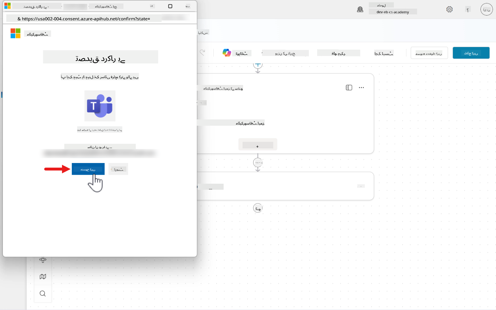

1. درج ذیل انپٹ پیرامیٹرز کے لیے،

| پیرامیٹر | کیسے سیٹ کریں | تفصیلات |
|----------|------------|---------|
| **Post as** | ڈراپ ڈاؤن | `Flow bot` آپشن منتخب کریں |
| **Post in** | ڈراپ ڈاؤن | `Channel` آپشن منتخب کریں |
| **Team** | ڈراپ ڈاؤن | اپنی ماحول میں دستیاب ٹیم منتخب کریں جس تک آپ کو اس لیب مشق کو مکمل کرنے کے مقصد کے لیے رسائی حاصل ہو |
| **Team** | ڈراپ ڈاؤن | اپنی ماحول میں دستیاب چینل منتخب کریں جس تک آپ کو اس لیب مشق کو مکمل کرنے کے مقصد کے لیے رسائی حاصل ہو |

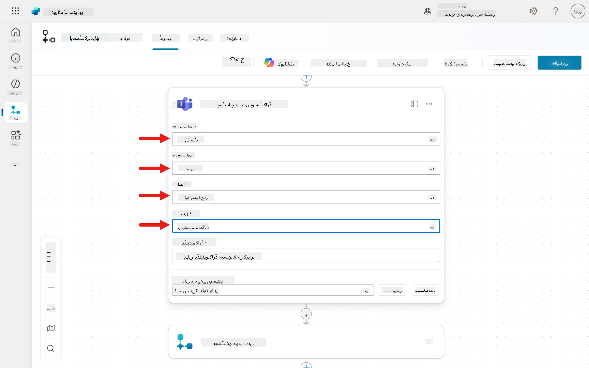

1. اگلے مرحلے میں ہم **Adaptive Card** فیلڈ ترتیب دیں گے۔ **Adaptive Card** فیلڈ منتخب کریں۔

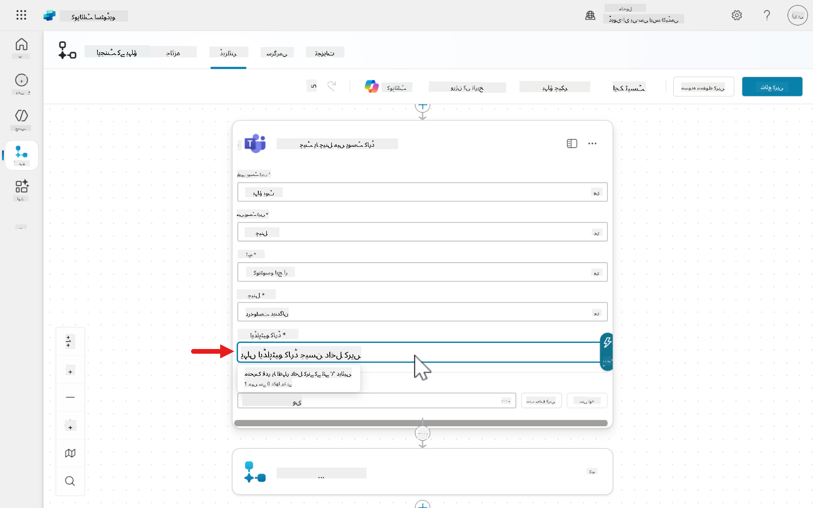

1. [Resume Table Updated JSON file](../../../../../docs/operative-preview/03-automate-triggers/assets/3.2_ResumeTableUpdated.json) کھولیں، اس کے تمام مواد کو کاپی کریں، اور Adaptive Card فیلڈ میں پیسٹ کریں۔

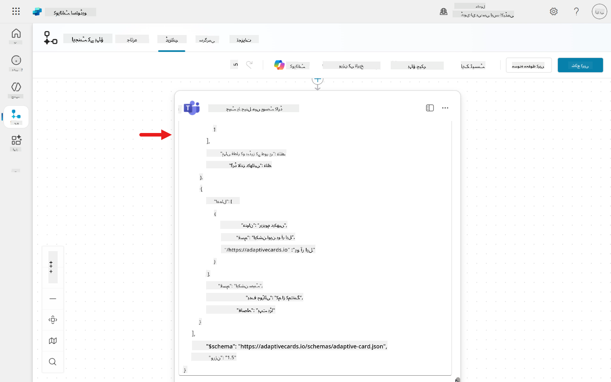

1. جیسے ہم نے [Recruit](../../recruit/08-add-adaptive-card/README.md#81-create-a-new-topic-with-an-adaptive-card-for-user-to-submit-their-request) میں کیا تھا، ہم JSON پیلوڈ میں موجود موجودہ ویلیوز کو حقیقی ویلیوز یا ڈائنامک مواد کے ساتھ تبدیل کریں گے۔

پہلے، `selectAction` پراپرٹی کے اندر `url` پراپرٹی کے لیے URL کو اپ ڈیٹ کریں۔ یہ URL **Hiring Hub** ماڈل ڈرائیون ایپ میں Resumes سسٹم ویو کے URL کے ساتھ تبدیل کیا جائے گا۔ یہ ریکروٹر کو ایکشن منتخب کرنے اور ماڈل ڈرائیون ایپ میں Resumes سسٹم ویو پر لے جانے کی اجازت دے گا۔

موجودہ URL ویلیو کو نمایاں کریں اور حذف کریں۔

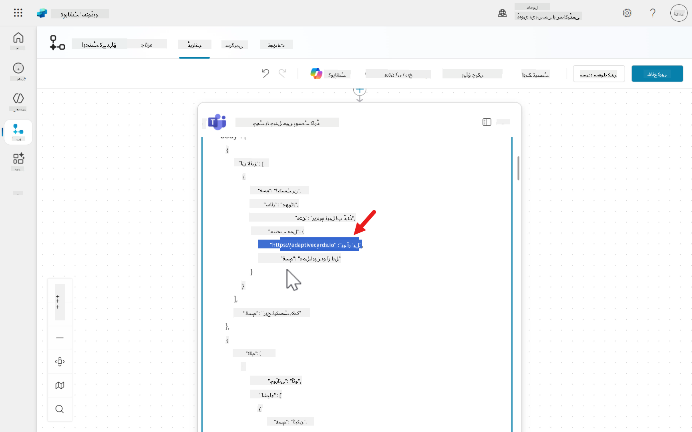

1. **Hiring Hub** ماڈل ڈرائیون ایپ میں جائیں، بائیں جانب مینو کا استعمال کرتے ہوئے **Resumes** سسٹم ویو پر جائیں اور URL کو کاپی کریں۔ پھر ایجنٹ فلو پر واپس جائیں، اور کاپی کردہ URL کو **selectAction پراپرٹی** کے اندر **url** پراپرٹی میں پیسٹ کریں۔

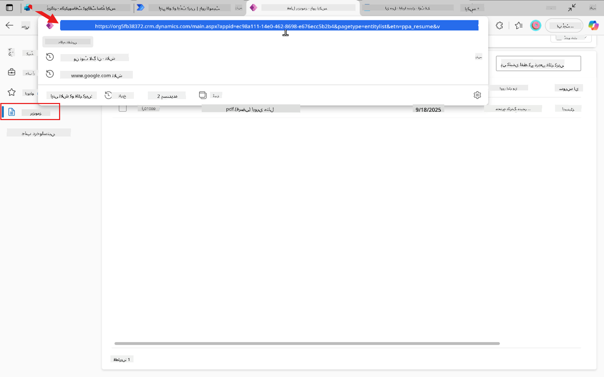
1. آپ کو درج ذیل نظر آنا چاہیے جہاں زرد رنگ میں نمایاں کردہ آپ کے ماحول کی تفصیلات **Hiring Hub** ماڈل ڈرائیون ایپ کی ہیں۔

     | پیرامیٹر | ویلیو | وضاحت |
     |----------|------------|---------|
     | **Organization URI** | GUID | Dataverse/Dynamics 365 ماحول کی تنظیم کا URL |
     | **appid** | GUID | کسی مخصوص ماڈل ڈرائیون ایپ کو کھولنے کے لیے، یا تو appid یا appname کا کوئری پیرامیٹر استعمال کیا جاتا ہے۔ اس صورت میں، appid استعمال کیا گیا ہے |
     | **viewid** | GUID | کوئری پیرامیٹر جو ویو کا id ہے |

       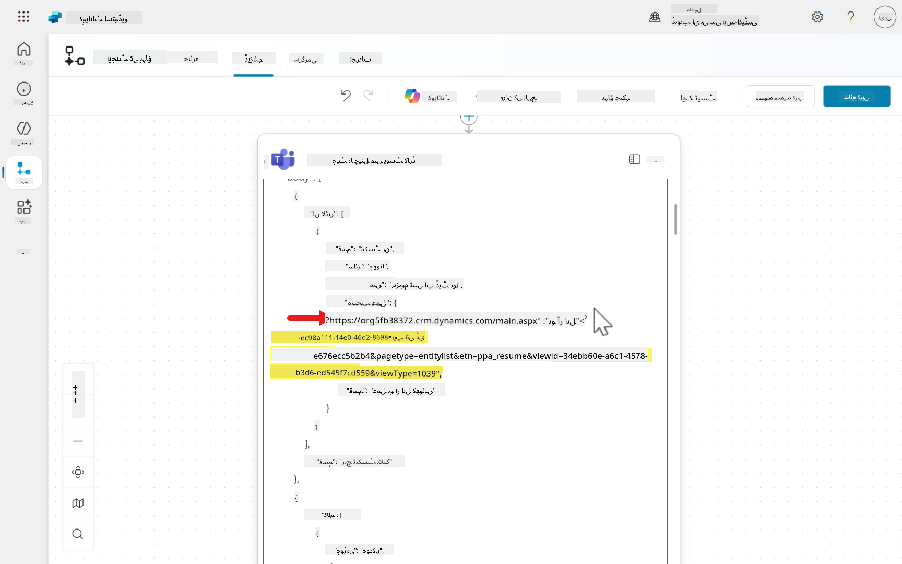

1. اگلے مرحلے میں، ہم کئی پراپرٹیز کے لیے ڈائنامک مواد کی ویلیوز شامل کریں گے۔ آئیے اس متن سے شروع کریں جو اس قطار کے **Resume Number** حوالہ کو ظاہر کرے گا جو ایونٹ ٹریگر کے ذریعے خود بخود تخلیق کی گئی تھی۔

      ایکشن پینل کو لوڈ کرنے کے لیے **پینل** آئیکن منتخب کریں۔

       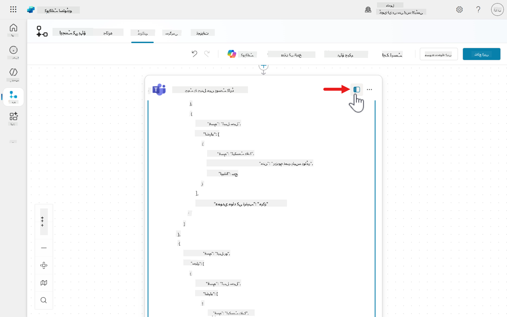

1. اس لائن تک نیچے سکرول کریں جہاں آپ `text` پراپرٹی کو `RESUME NUMBER PLACEHOLDER` کے لیے دیکھتے ہیں۔ پلیس ہولڈر ویلیو کو نمایاں کریں اور اسے حذف کریں۔

       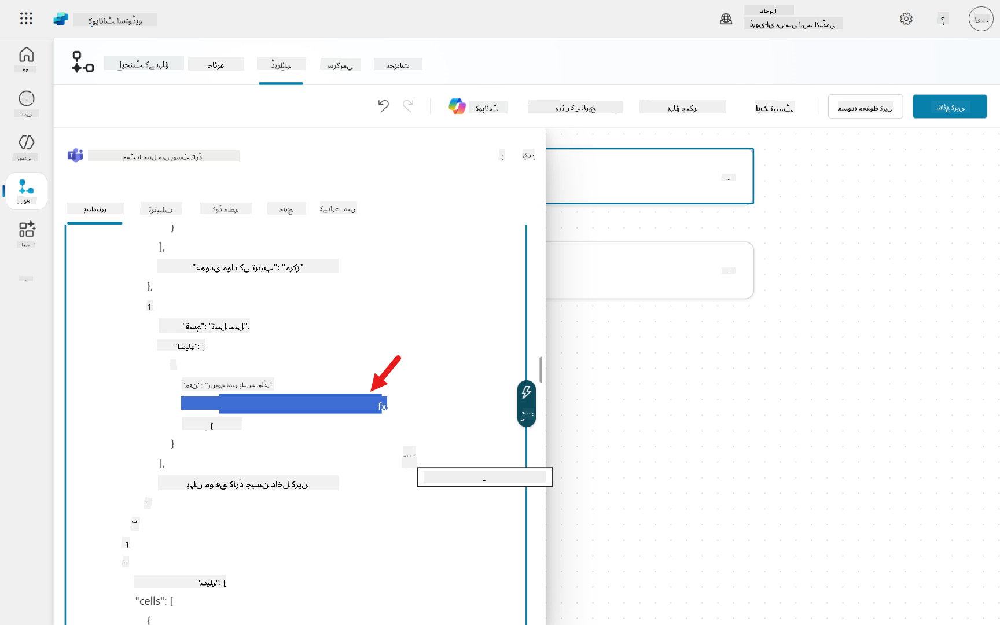

1. ڈبل کوٹیشن مارکس کے درمیان کلک کریں اور دائیں طرف **لائٹننگ بولٹ آئیکن** یا **fx آئیکن** منتخب کریں۔

      **Dynamic Content** ٹیب میں **ResumeNumber** پیرامیٹر منتخب کریں اور **Add** منتخب کریں۔

       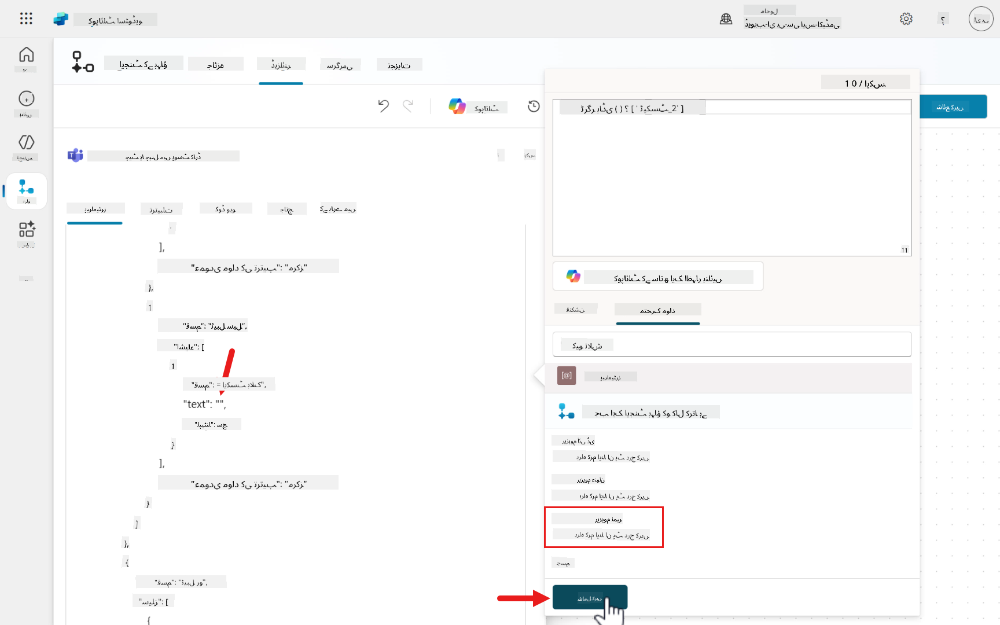

1. **ResumeNumber** پیرامیٹر اب `text` پراپرٹی میں ڈائنامک مواد کے طور پر شامل ہو جائے گا۔

       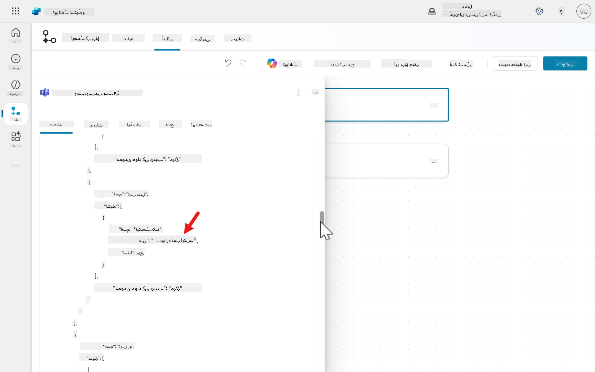

1. ہم وہی مراحل `RESUME NAME PLACEHOLDER` کے لیے دہرائیں گے۔ اس لائن تک نیچے سکرول کریں جہاں آپ `text` پراپرٹی کو `RESUME NAME PLACEHOLDER` کے لیے دیکھتے ہیں۔ پلیس ہولڈر ویلیو کو نمایاں کریں اور اسے حذف کریں۔

       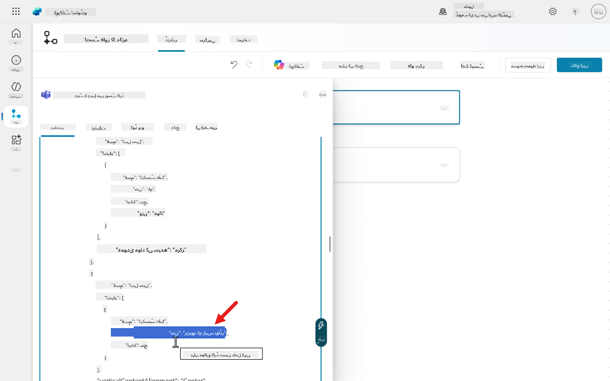

1. ڈبل کوٹیشن مارکس کے درمیان کلک کریں اور دائیں طرف **لائٹننگ بولٹ آئیکن** یا **fx آئیکن** منتخب کریں۔

      **Dynamic Content** ٹیب میں **ResumeTitle** پیرامیٹر منتخب کریں اور **Add** منتخب کریں۔

       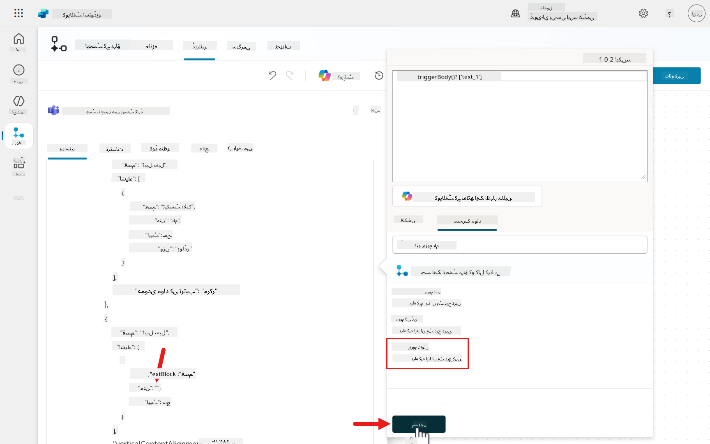

1. **ResumeTitle** پیرامیٹر اب `text` پراپرٹی میں ڈائنامک مواد کے طور پر شامل ہو جائے گا۔

       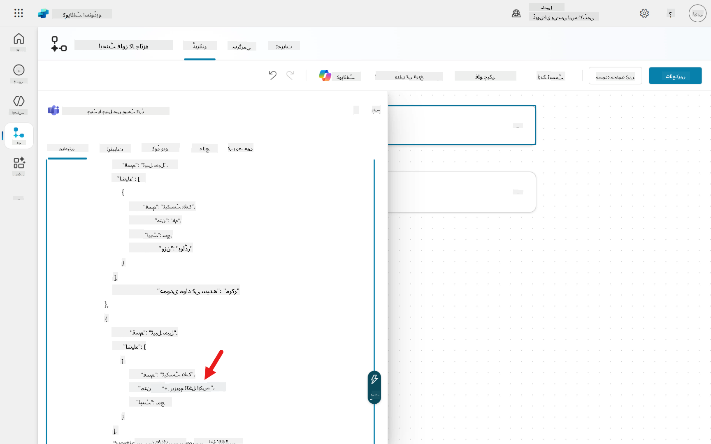

1. ہم وہی مراحل **Due Date** ویلیو کے لیے دہرائیں گے جو ظاہر کرتی ہے کہ ریکروٹر کو ریزیوم کا جائزہ کب لینا چاہیے۔ اس لائن تک نیچے سکرول کریں جہاں آپ `text` پراپرٹی کو `May 21, 2023` کے لیے دیکھتے ہیں۔

       

1. اس تاریخ کے پلیس ہولڈر ویلیو کو حذف کریں اور ڈبل کوٹیشن مارکس کے درمیان کلک کریں۔

       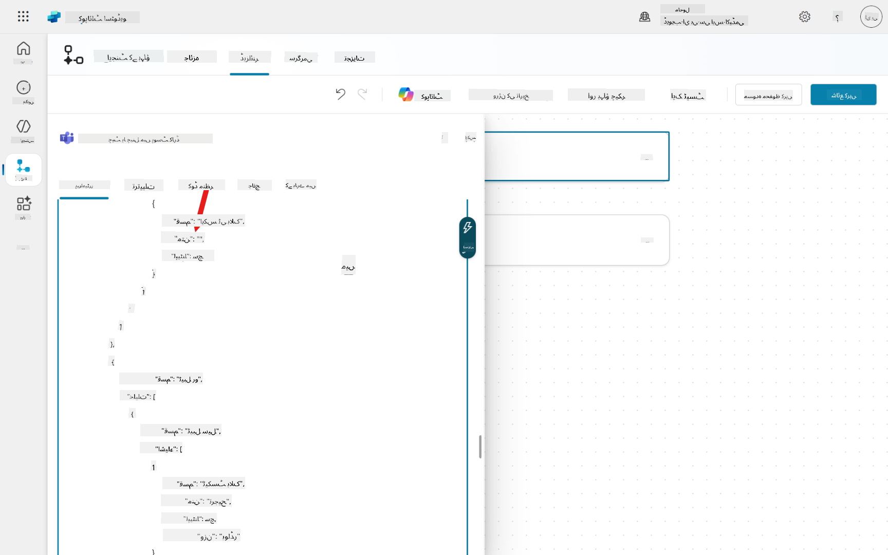

1. دائیں طرف **لائٹننگ بولٹ آئیکن** یا **fx آئیکن** منتخب کریں اور **Function** ٹیب میں درج ذیل ایکسپریشن درج کریں اور **Add** منتخب کریں۔

       ```text
       addDays(utcNow(), 3, 'MMM dd, yyyy')
       ```

      یہ ایکسپریشن دو فنکشنز استعمال کرتا ہے۔

     | فنکشن | وضاحت |
     |----------|------------|
     | **addDays** | دی گئی تاریخ میں مخصوص دنوں کا اضافہ کرتا ہے اور نتیجہ خیز تاریخ کو سٹرنگ فارمیٹ میں واپس کرتا ہے |
     | **utcNow** | موجودہ تاریخ اور وقت کو کوآرڈینیٹڈ یونیورسل ٹائم (UTC) فارمیٹ میں سٹرنگ کے طور پر واپس کرتا ہے۔ |

      utcNow ویلیو کے لیے، ہم تاریخ کو مہینہ اور دن، اس کے بعد سال کے طور پر فارمیٹ کر رہے ہیں۔

       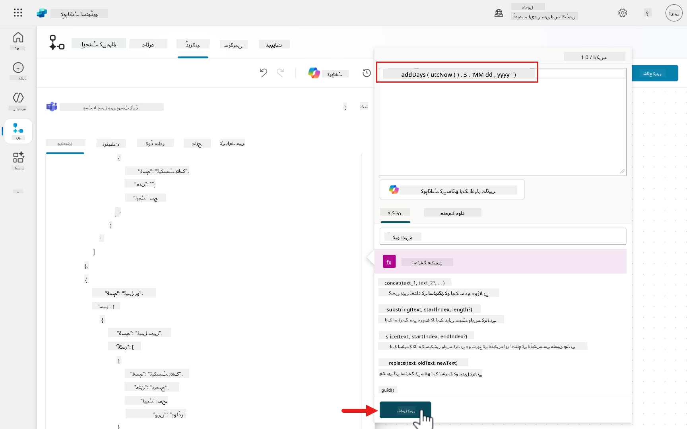

      ایکسپریشن اب `text` پراپرٹی میں شامل ہو جائے گا۔

       

1. آخر میں، ہم JSON پیلوڈ کے نیچے `actions` ایری پراپرٹی کے اندر `url` پراپرٹی کے لیے URL کو اپ ڈیٹ کریں گے۔ موجودہ پلیس ہولڈر URL کو **Hiring Hub** ماڈل ڈرائیون ایپ میں ریزیوم قطار کے URL سے تبدیل کیا جائے گا۔ یہ ریکروٹر کو ایڈاپٹیو کارڈ کے `Action.OpenURL` ایکشن کو منتخب کرنے اور ماڈل ڈرائیون ایپ میں ریزیوم پر جانے کی اجازت دے گا۔

       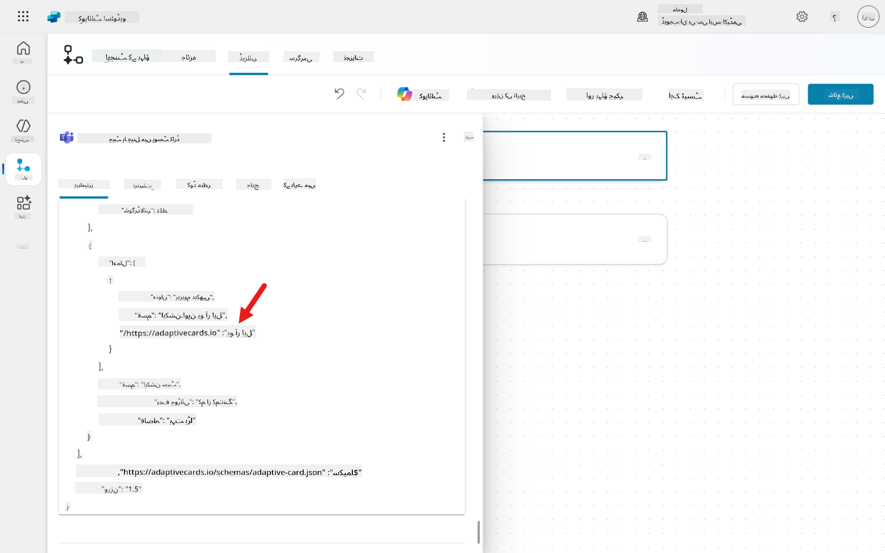

1. **Hiring Hub** ماڈل ڈرائیون ایپ میں، بائیں جانب مینو کا استعمال کرتے ہوئے **Resumes** سسٹم ویو میں ایک قطار کھولیں۔ ریزیوم قطار ماڈل ڈرائیون ایپ میں فارم کے طور پر لوڈ ہو جائے گی۔

      ریزیوم قطار کے URL کو کاپی کریں۔

    ??? info "اگر آپ نے **Hiring Hub** ماڈل ڈرائیون ایپ کو بند کر دیا ہو تو واپس کیسے جائیں"

        1. [https://make.powerapps.com](https://make.powerapps.com) پر جائیں اور یقینی بنائیں کہ آپ اس ڈیولپر ماحول میں ہیں جو آپ ان لیب مشقوں کے لیے استعمال کر رہے ہیں، ورنہ اسے تبدیل کریں۔
        
        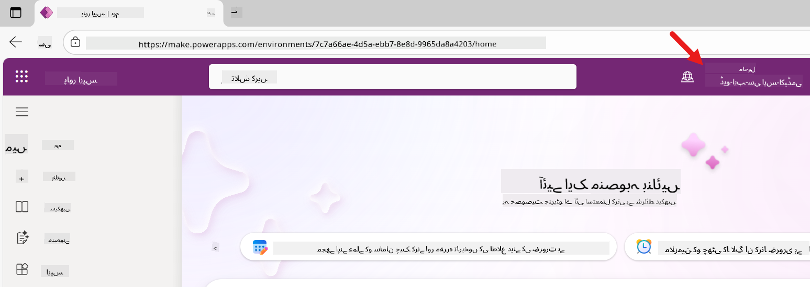

        1. بائیں جانب مینو پین میں **Apps** منتخب کریں اور **Hiring Hub** ماڈل ڈرائیون ایپ کے لیے، **Play** آئیکن منتخب کریں تاکہ اسے اپنے براؤزر میں لوڈ کریں۔
        
        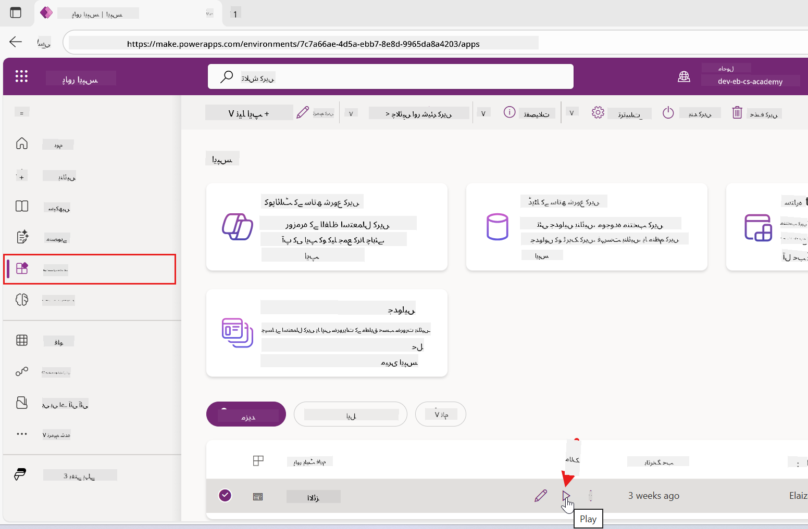

       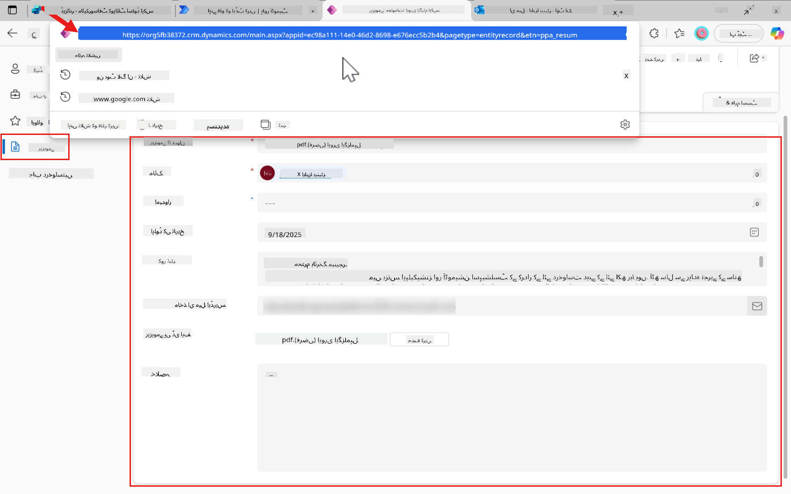

1. پھر ایجنٹ فلو پر واپس جائیں، موجودہ پلیس ہولڈر URL ویلیو کو نمایاں کریں اور اسے حذف کریں۔

       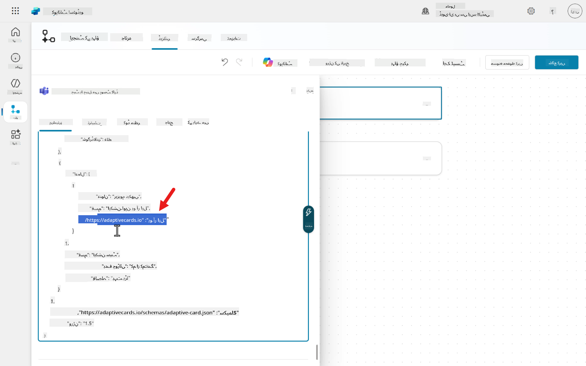

1. پھر کاپی کردہ URL کو `url` پراپرٹی میں پیسٹ کریں۔

       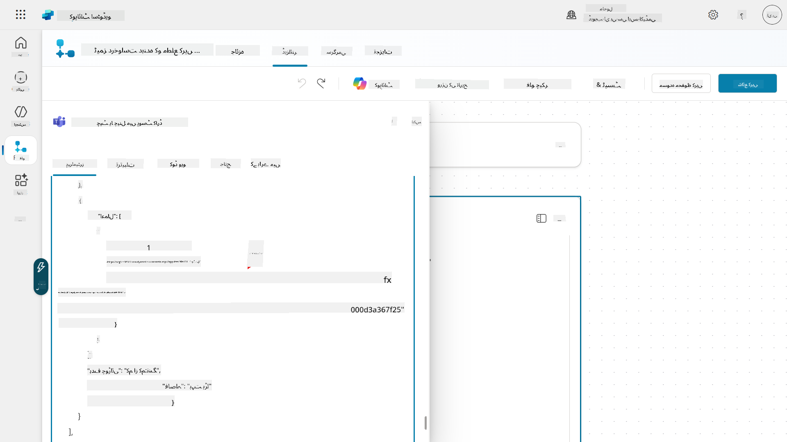

1. آپ کو درج ذیل نظر آنا چاہیے۔ آخر میں `GUID` id ویلیو کو حذف کریں۔ ہم اس ڈائنامک مواد کو **ResumeId** پیرامیٹر سے تبدیل کریں گے۔

       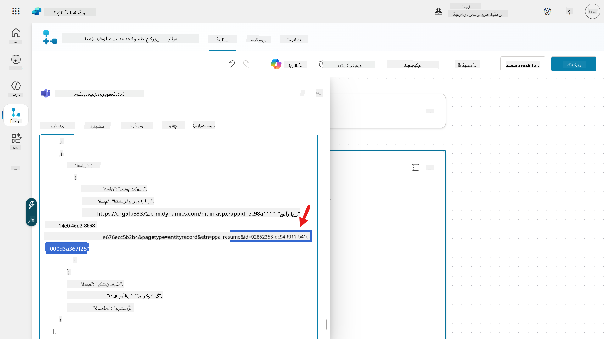

1. دائیں طرف **لائٹننگ بولٹ آئیکن** یا **fx آئیکن** منتخب کریں۔

      **Dynamic Content** ٹیب میں **ResumeId** پیرامیٹر منتخب کریں اور **Add** منتخب کریں۔

       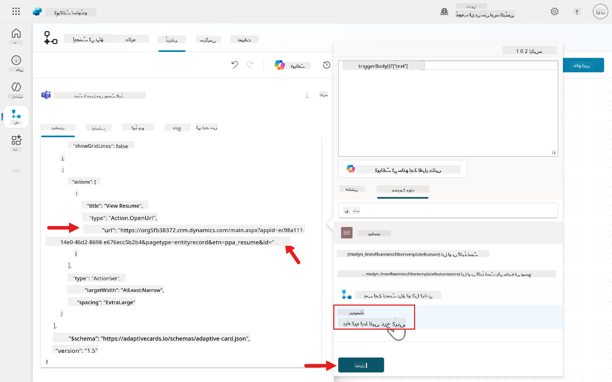

1. **ResumeId** اب ڈائنامک مواد کے طور پر شامل ہو جائے گا۔ درج ذیل زرد رنگ میں نمایاں کردہ آپ کے ماحول کی تفصیلات **Hiring Hub** ماڈل ڈرائیون ایپ کی ہیں۔

     | پیرامیٹر | ویلیو | وضاحت |
     |----------|------------|---------|
     | **Organization URI** | GUID | Dataverse/Dynamics 365 ماحول کی تنظیم کا URL |
     | **appid** | GUID | کسی مخصوص ماڈل ڈرائیون ایپ کو کھولنے کے لیے، یا تو appid یا appname کا کوئری پیرامیٹر استعمال کیا جاتا ہے۔ اس صورت میں، appid استعمال کیا گیا ہے |
     | **id** | GUID | کوئری پیرامیٹر جو ریزیوم قطار کا id ہے |

       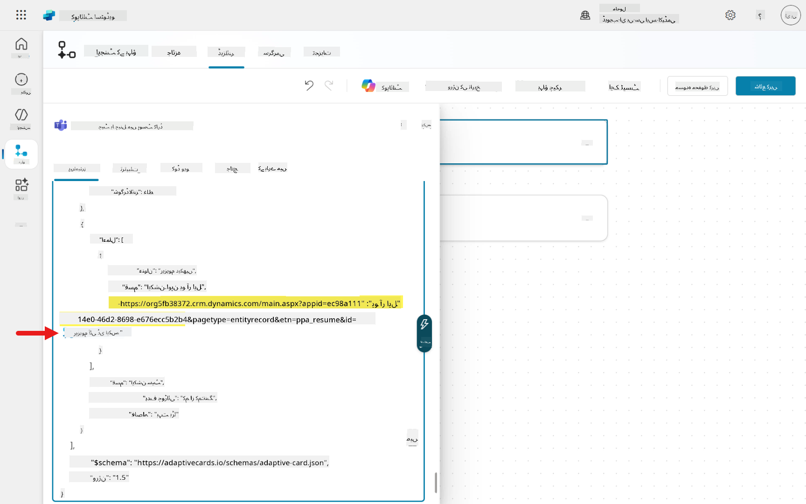

1. ہم نے **Post card in a chat or channel** ایکشن کی کنفیگریشن مکمل کر لی ہے 👏🏻 ایکشن کنفیگریشن پینل سے باہر نکلنے کے لیے **x** آئیکن منتخب کریں۔

       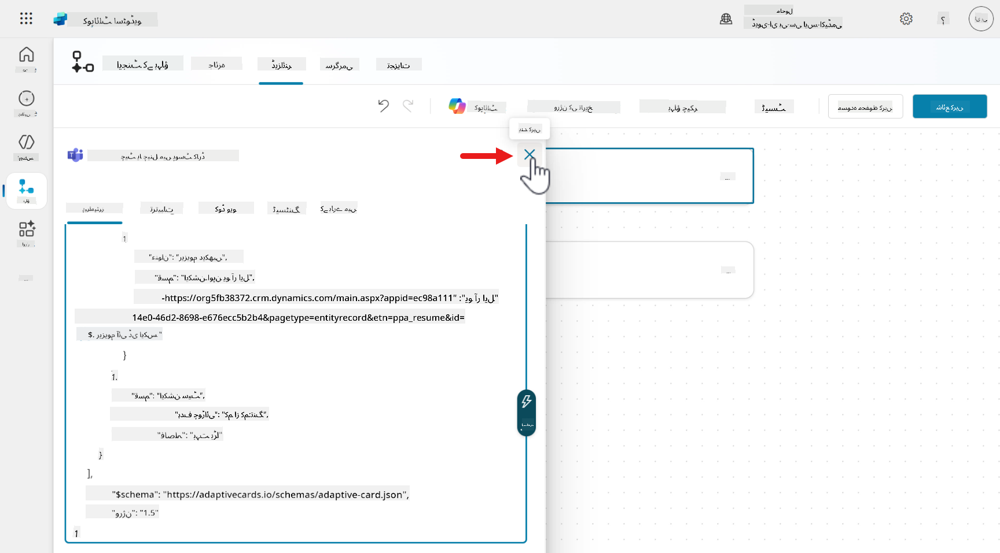

1. آخر میں، ہم آخری ایکشن **Respond to the agent** کو کنفیگر کریں گے تاکہ ایجنٹ کو ٹیکسٹ بھیج کر پراسیسنگ ختم کی جا سکے۔

      **Respond to the agent** ایکشن میں، **+Add an output** منتخب کریں۔

       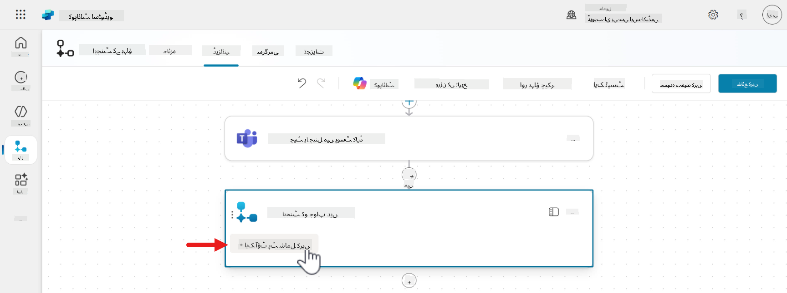

1. آؤٹ پٹ کی قسم کے طور پر **Text** منتخب کریں۔

       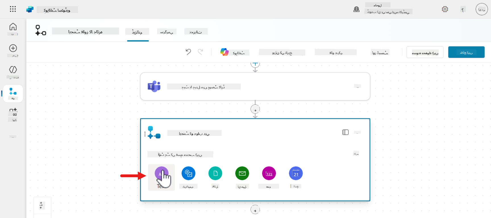

1. آؤٹپٹ کے نام کے طور پر درج ذیل درج کریں۔

       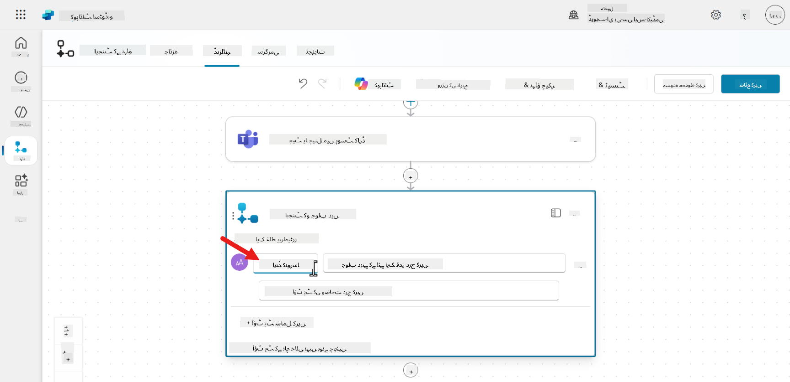

1. آؤٹپٹ کے ویلیو کے طور پر درج ذیل درج کریں۔

       ```text
       Finished
       ```

       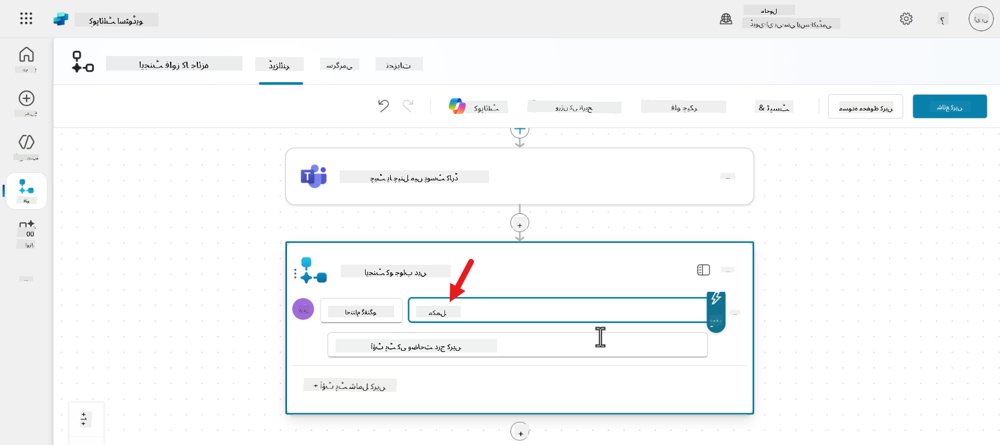

1. ہم نے ایجنٹ فلو کی کنفیگریشن مکمل کر لی ہے۔ ایجنٹ فلو کو محفوظ کرنے کے لیے **Save draft** منتخب کریں۔ محفوظ ہونے کے بعد تصدیقی پیغام ظاہر ہوگا۔

       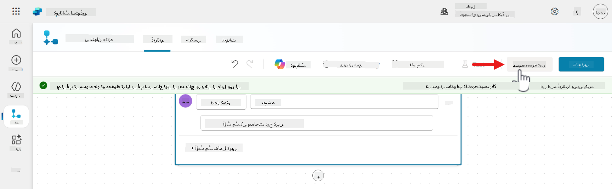

1. ایجنٹ فلو کو پبلش کرنے سے پہلے، ہمیں ایجنٹ فلو کی تفصیلات کو اپ ڈیٹ کرنے کی ضرورت ہے۔ **Overview** ٹیب منتخب کریں اور **Edit** منتخب کریں۔

      فلو نام کے فیلڈ میں درج ذیل درج کریں۔

       ```text
       Notify Teams Applicant channel
       ```      

      اس کے بعد، ایجنٹ فلو کی تفصیل کو AI کے ذریعے اپ ڈیٹ کرنے کے لیے **Refresh** آئیکن منتخب کریں۔

      پھر ایجنٹ فلو کی اپ ڈیٹ کردہ تفصیلات کو محفوظ کرنے کے لیے **Save** منتخب کریں۔

       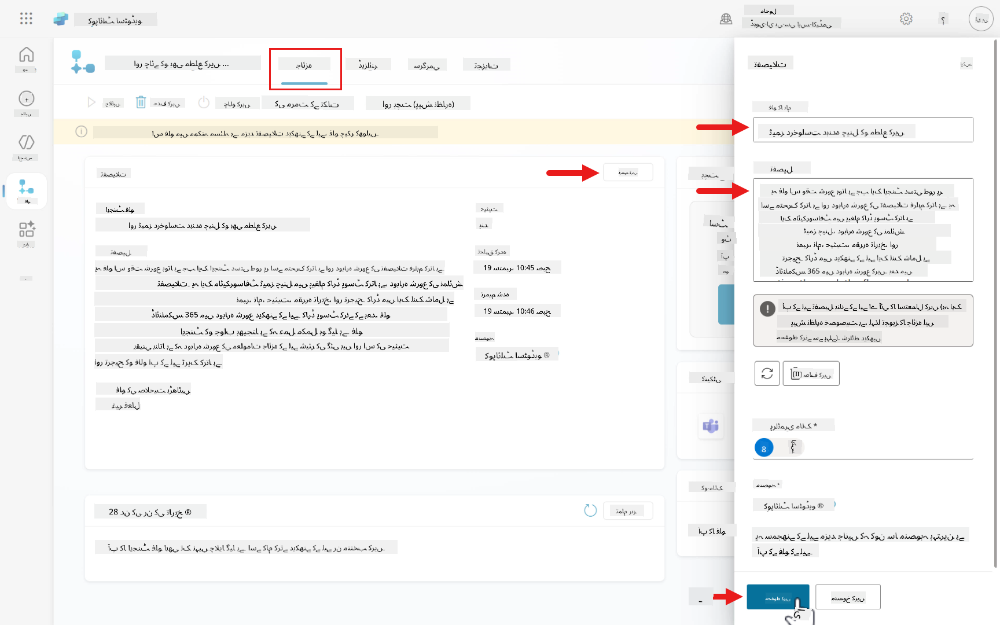

1. **Designer** ٹیب پر واپس جائیں اور ایجنٹ فلو کو پبلش کرنے کے لیے **Publish** منتخب کریں۔ محفوظ ہونے کے بعد تصدیقی پیغام ظاہر ہوگا۔

       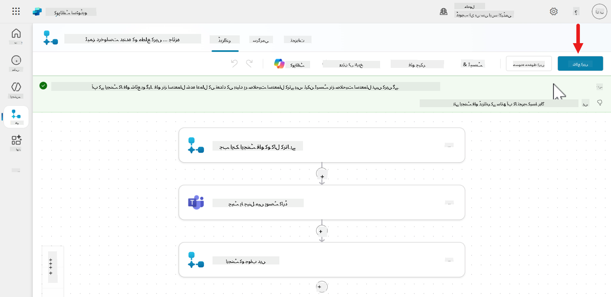

1. ایجنٹ فلو کو **Application Intake Agent** میں ایک ٹول کے طور پر شامل کرنے کی ضرورت ہے۔ **Hiring Agent** پر واپس جائیں اور **Agents** ٹیب منتخب کریں، پھر **Application Intake Agent** منتخب کریں۔

       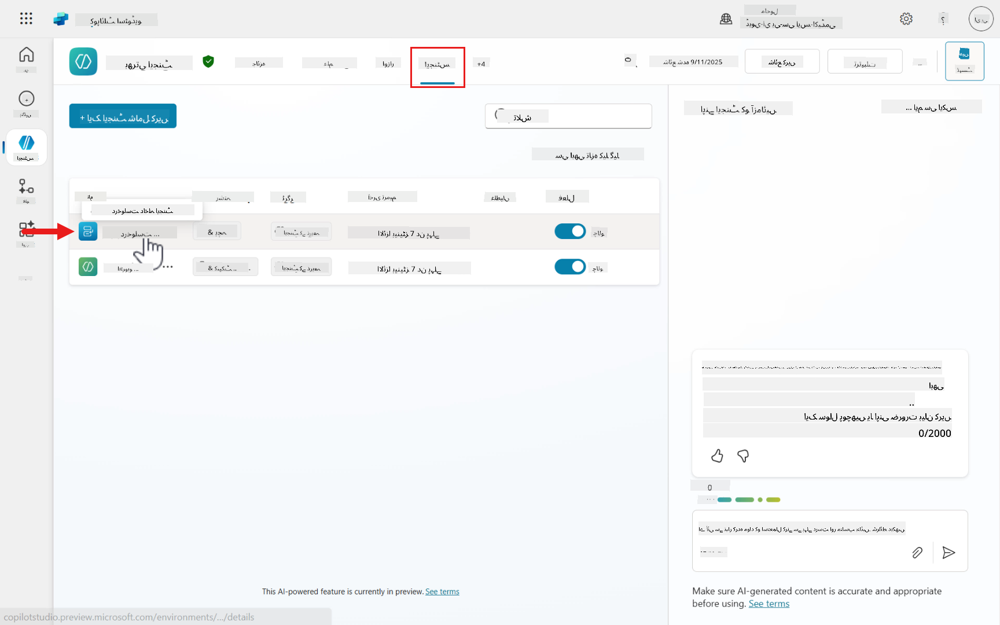

1. ایجنٹ کے **Details** سیکشن میں، ہم **Description** فیلڈ کو اپ ڈیٹ کریں گے۔ درج ذیل کو کاپی کریں اور تفصیل کے متن کے آخر میں پیسٹ کریں۔

       ```text
       and also notify the Teams Applicant channel
       ```

       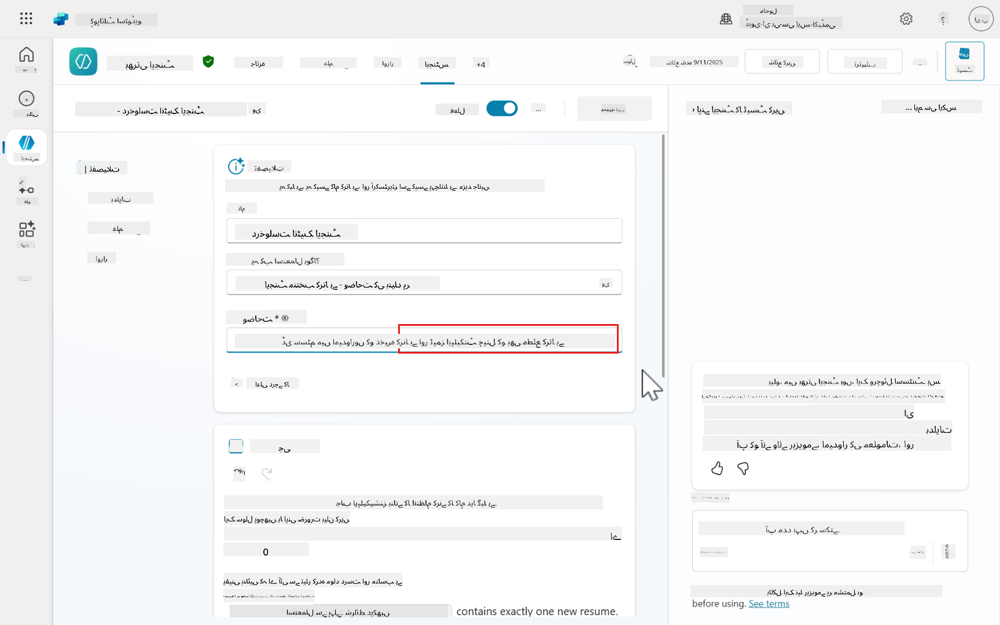

1. اگلے مرحلے میں، ہم ایجنٹ فلو کو ایک ٹول کے طور پر شامل کریں گے۔ نیچے سکرول کریں اور **+ Add** منتخب کریں۔

       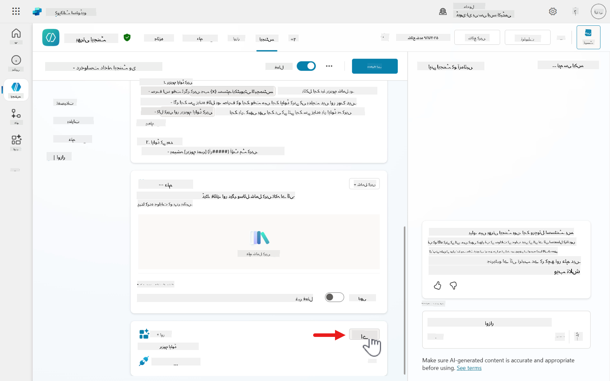

1. پہلے سے تخلیق کردہ ایجنٹ فلو، **Notify Teams Applicant Channel** منتخب کریں۔

       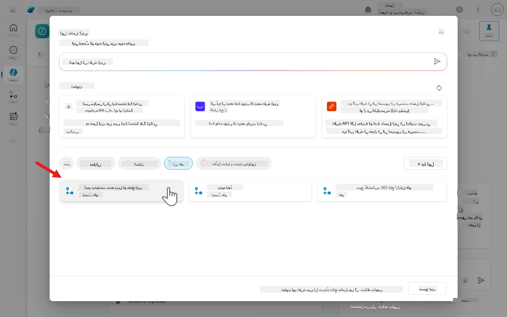

1. اگلے مرحلے میں **Add and configure** منتخب کریں۔

       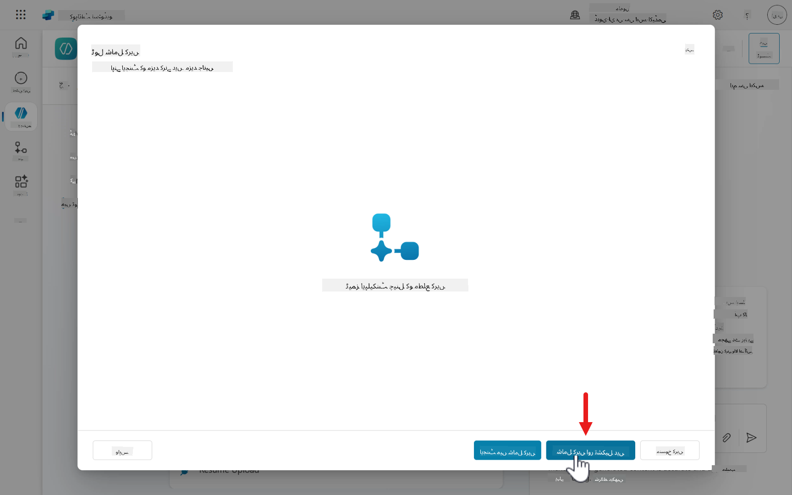

1. ایجنٹ فلو کے **Inputs** سیکشن میں، وہ تین ان پٹس نظر آئیں گے جو ہم نے پہلے ایجنٹ فلو میں کنفیگر کیے تھے۔ ڈیفالٹ کے طور پر، **Fill using** کنفیگریشن **Dynamically fill with AI** پر سیٹ ہے۔ ہم اس سیٹنگ کو اسی طرح رکھیں گے کیونکہ ایونٹ ٹریگر سے پرامپٹ (آخری ایکشن میں، **Sends a prompt to the specified copilot for processing** - یہ **Lab 3.1 - Automate uploading resumes to Dataverse received by email** کے مراحل 38-44 ہیں) میں پیرامیٹر ویلیوز شامل ہوں گی جنہیں AI نکالے گا۔

       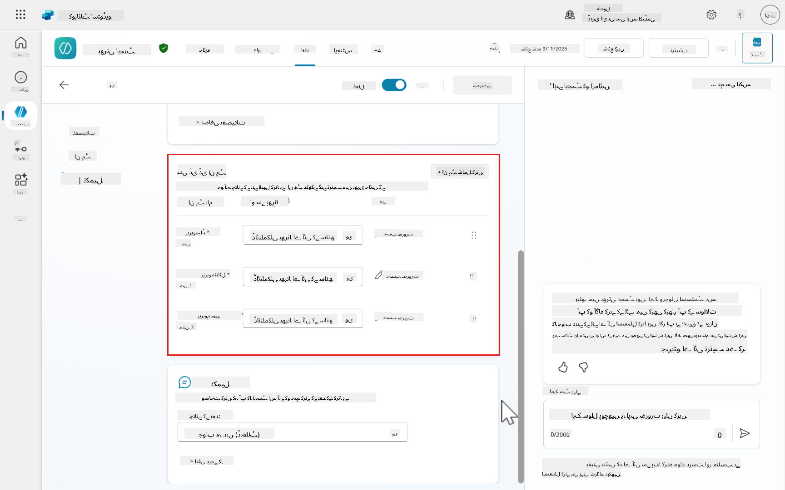

1. اب جب کہ ٹول کو **Application Intake Agent** میں شامل کر دیا گیا ہے، ایجنٹ کی ہدایات کو اپ ڈیٹ کرنے کی ضرورت ہے۔ ایجنٹس کی فہرست پر واپس جانے کے لیے **back arrow** آئیکن منتخب کریں۔

       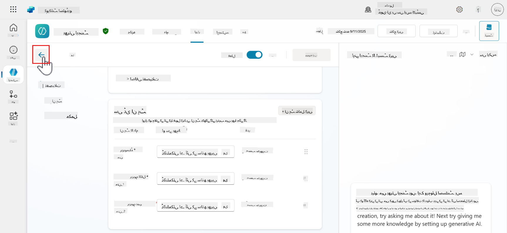

1. **Hiring Agent** کے **Agents** ٹیب میں **Application Intake Agent** منتخب کریں۔

       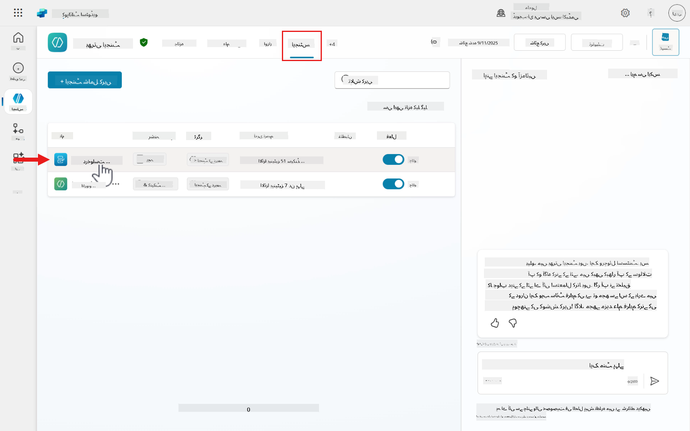

1. **Instructions** فیلڈ میں، `2.Post-Upload` ہدایات کے بعد ایک نئی لائن درج کریں۔ درج ذیل ہدایات کو کاپی کریں اور پیسٹ کریں۔

       ```text
       Process for Resume Upload via Email
       1. When you receive a message, **Send [ResumeId (text)] = "1680265f-5793-f011-b41b-7c1e525be9f7" and [ResumeTitle (text_1)] = "TAYLOR TESTPERSON (FICTITIOUS).pdf" and [ResumeNumber (text_2)]= "R01026" to the Tool "Notify Teams Applicant channel"** in the child agent "Application Intake Agent", call [AGENT FLOW PLACEHOLDER]
       ```

       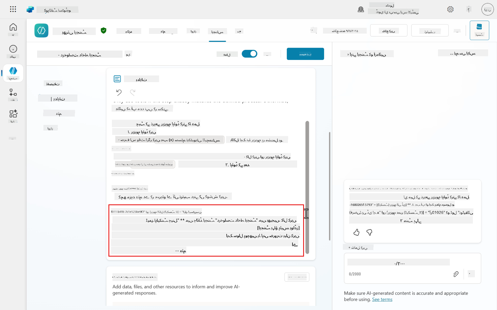

1. `[AGENT FLOW PLACEHOLDER` متن کو نمایاں کریں۔

       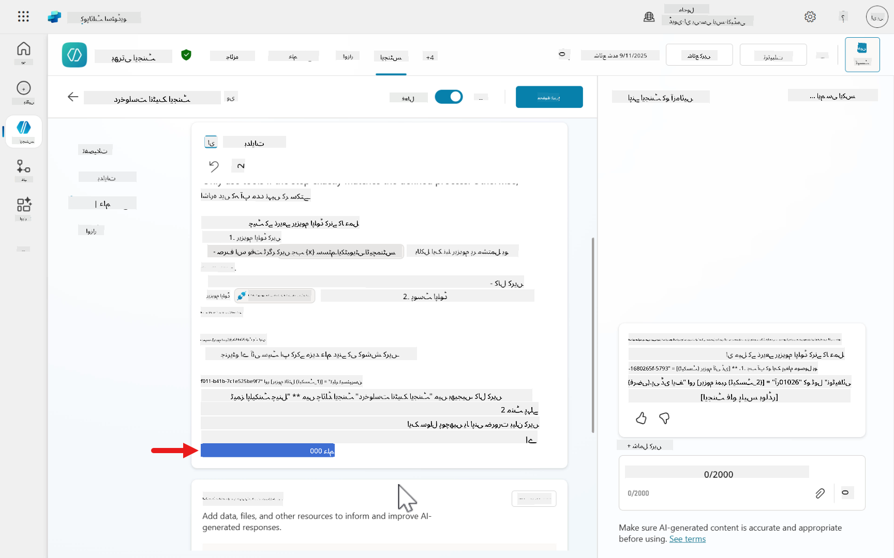

1. فارورڈ سلیش کریکٹر، `/` درج کریں اور **Notify Teams Applicant Channel** ٹول منتخب کریں۔

       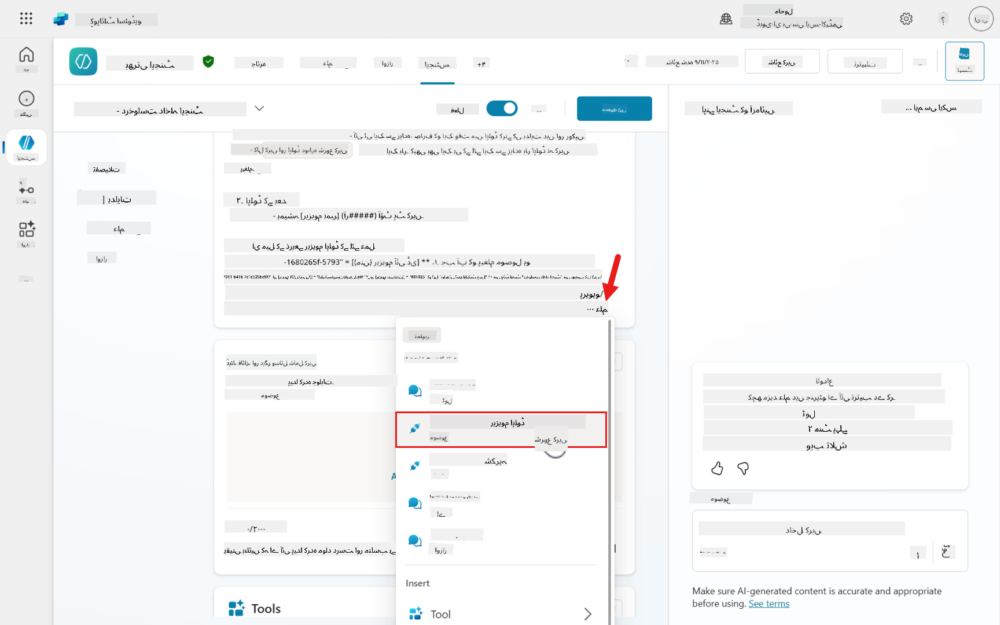
1. ایجنٹ کا فلو اب **Application Intake Agent** کے ذریعے ہدایات کے مطابق شروع کیا جائے گا، آخری عمل کے بعد (**پروسیسنگ کے لیے مخصوص کوپائلٹ کو پرامپٹ بھیجتا ہے**) ایونٹ ٹریگر میں پرامپٹ بھیجتا ہے جو پیرامیٹر ویلیوز کو ایجنٹ کے پاس واپس بھیجتا ہے۔

      **Save** کو منتخب کریں تاکہ **Application Intake Agent** کے لیے اپ ڈیٹ شدہ ہدایات محفوظ کی جا سکیں۔

       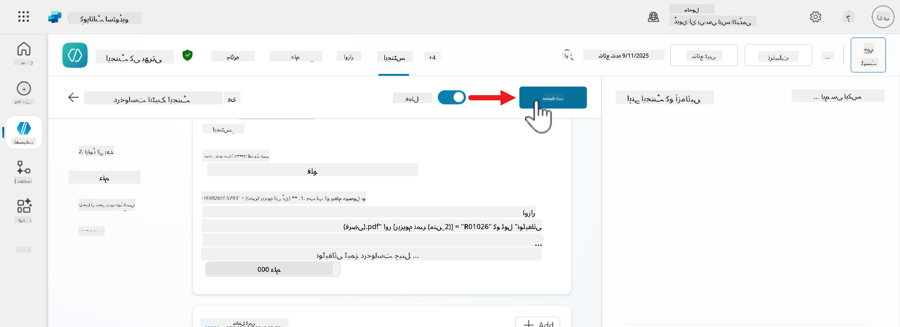

1. ایجنٹ کو محفوظ کرنے کے بعد ہدایات اپ ڈیٹ ہو جائیں گی۔

       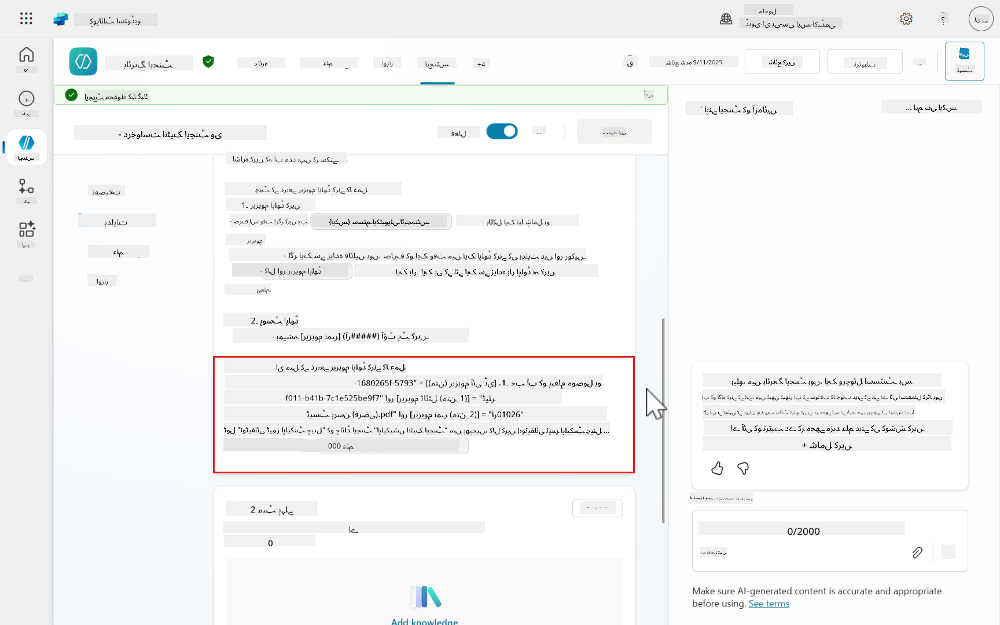

1. اب ہمیں **Hiring Agent** کو **Publish** کرنا ہوگا۔ اوپر دائیں جانب **Publish** کو منتخب کریں، اور جو _Publish this agent modal_ ظاہر ہو اس میں **Publish** کو منتخب کریں۔

       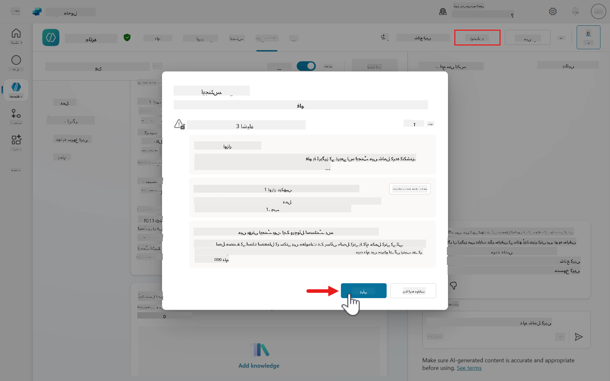

1. پبلش ہونے کے بعد ایک تصدیقی پیغام ظاہر ہوگا کہ ایجنٹ پبلش ہو چکا ہے۔

       

اب ہم ایجنٹ کو ٹیسٹ کر سکتے ہیں!

### لیب 3.3 - ایونٹ ٹریگر کا ٹیسٹ کریں

1. ایونٹ ٹریگر کو چلانے کے لیے، ایک ای میل بھیجنی ہوگی جس میں ایک Resume pdf فائل ہو۔ Outlook میں، ایک نیا ای میل میسج کمپوز کریں۔

     | ای میل کمپوننٹ | تفصیلات |
     |----------|------------|
     | **To recipient** | اپنے سائن ان کردہ یوزر اکاؤنٹ کو ویلیو کے طور پر استعمال کریں |
     | **File attachment** | [TAYLOR TESTPERSON (FICTITIOUS)](../../../../../docs/operative-preview/test-data/resumes/TAYLOR%20TESTPERSON%20(FICTITIOUS).pdf) فائل اپلوڈ کریں |
     | **Body** | ای میل کے باڈی میں نیچے دی گئی عبارت کو کاپی اور پیسٹ کریں |

       ```text
       محترم Hiring Manager،

       میں آپ کی تنظیم میں Senior Power Platform Engineer کے عہدے میں دلچسپی ظاہر کرنے کے لیے لکھ رہا ہوں۔ Microsoft کلاؤڈ پلیٹ فارمز پر محفوظ اور قابل توسیع حل فراہم کرنے کے نو سال سے زیادہ کے تجربے کے ساتھ، مجھے یقین ہے کہ میں آپ کی ٹیم میں مؤثر طریقے سے حصہ ڈال سکتا ہوں۔

       اپنی حالیہ پوزیشن میں Lead Power Platform Engineer کے طور پر، میں نے ایک خودکار ریزیومے انٹیک پائپ لائن تیار کی، جس سے دستی کام میں کمی آئی اور تلاش کی صلاحیت میں بہتری آئی۔ میں نے HR کیس مینجمنٹ ایپلیکیشنز فراہم کیں، سلوشن-اویئر فلو متعارف کروائے، اور PR چیکز نافذ کیے تاکہ ڈیپلائمنٹ کے وقت کو بہتر بنایا جا سکے۔ میری مہارت میں Power Apps، Power Automate، Power Pages، Dataverse، اور Microsoft 365 سروسز کی ایک رینج شامل ہے، نیز Graph/REST APIs اور Azure Functions کے ساتھ انٹیگریشن۔

       اس سے پہلے، میں نے Teams approvals کو adaptive cards کے ساتھ تیار کیا، منظوری کے وقت کو اسی دن تک کم کیا، اور مضبوط error-handling frameworks بنائے۔ میرا پس منظر پرانے ورک فلو کو Power Automate میں منتقل کرنے اور خود سروس پورٹلز بنانے میں بھی شامل ہے جو سیکڑوں ملازمین نے اپنائے۔

       میں نے کمپیوٹر سائنس میں بی ایس سی کی ڈگری حاصل کی ہے اور Power Platform Developer (PL-400) اور Solution Architect (PL-600) کے طور پر تصدیق شدہ ہوں۔ میں رہنمائی کے بارے میں بھی پرجوش ہوں اور مقامی میکر گروپس کے ساتھ رضاکارانہ طور پر کام کیا ہے۔

       براہ کرم میرے CV کو غور کے لیے منسلک کریں۔ میں آپ کی ضروریات کے مطابق اپنے مہارت اور تجربے پر بات کرنے کا موقع خوش آمدید کہوں گا۔

       آپ کے وقت اور غور کے لیے شکریہ۔

       نیک تمنائیں،
       Taylor Testperson
       ```

       **ای میل بھیجیں** جب کمپوز ہو جائے۔

       

1. Power Automate maker portal میں ایونٹ ٹریگر فلو کے لیے، **Refresh** آئیکن کو منتخب کریں تاکہ بھیجی گئی ای میل کے لیے کامیاب فلو رن کو دیکھا جا سکے۔

       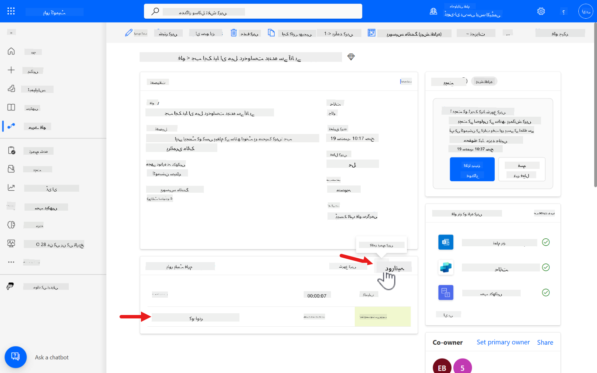

1. Copilot Studio میں واپس جائیں اور **Hiring Agent** میں **Activity** ٹیب کو منتخب کریں۔

       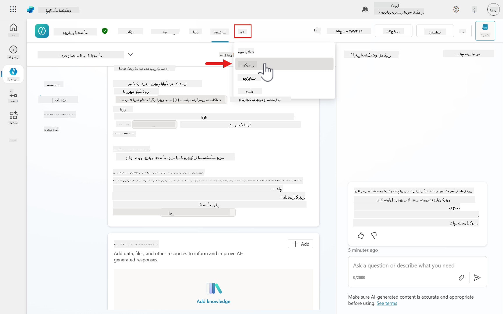

1. **Activity** ٹیب لوڈ ہوگا جو **Hiring Agent** کی تمام سرگرمیاں دکھائے گا۔ ایک سرگرمی ہوگی جس کا نام **Automated** ہوگا اور اس کی حیثیت **Complete** ہوگی۔ یہ سرگرمی ایونٹ ٹریگر اور ایجنٹ فلو کی نمائندگی کرتی ہے جو شروع کیا گیا تھا۔

       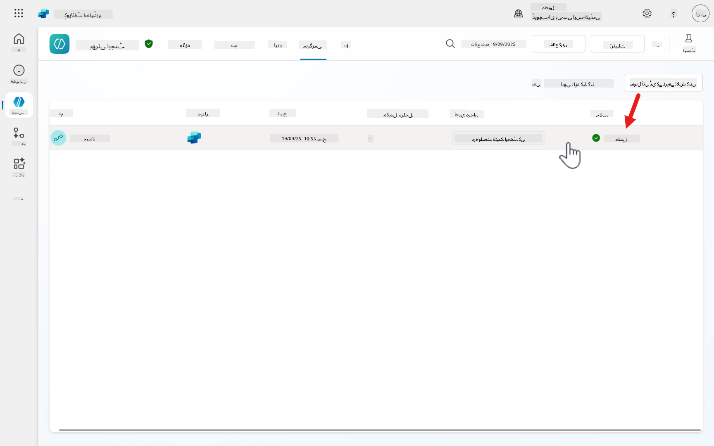

1. سرگرمی کو منتخب کریں، اور سرگرمی میپ میں ایونٹ ٹریگر کو منتخب کریں۔ دائیں جانب پینل میں دیکھیں کہ پرامپٹ میں ان پٹ پیرامیٹرز میں `Resume Id`, `Resume Title` اور `Resume Number` پیرامیٹر ویلیوز شامل ہیں جو **Dataverse** کی قطار سے بنائی گئی ہیں۔ یہ وہی ہے جو پہلے **Lab 3.1 - Automate uploading resumes to Dataverse received by email** کے مراحل 18 - 27 میں کنفیگر کیا گیا تھا۔

       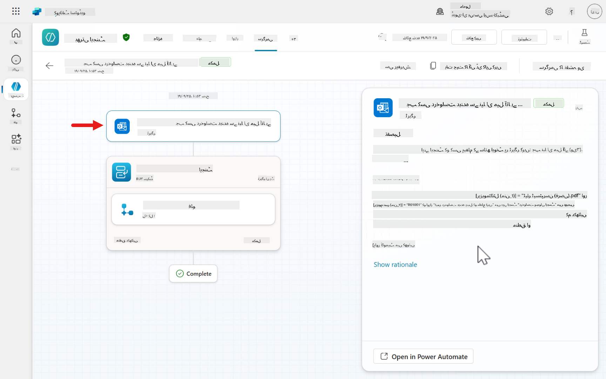

1. **Hiring Hub** ماڈل-ڈرائیو ایپ میں واپس جائیں اور **Resumes system view** میں **Refresh** کو منتخب کریں تاکہ ویو کو ریفریش کیا جا سکے۔ ای میل کے ذریعے بھیجی گئی ریزیومے کے لیے نئی بنائی گئی قطار اب درج ہوگی کیونکہ یہ ایونٹ ٹریگر کے ذریعے بنائی گئی تھی۔

       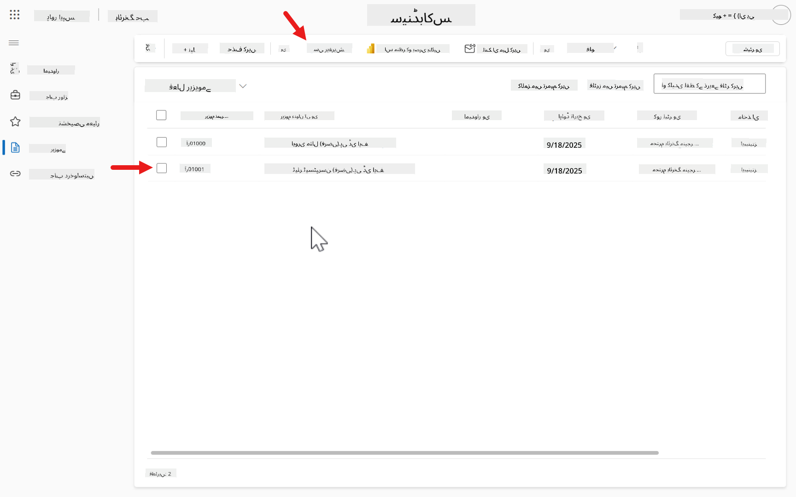

1. Copilot Studio میں واپس جائیں اور **Application Intake Agent** میں **Notify Teams Applicant Channel** ایجنٹ فلو کو سرگرمی میپ میں منتخب کریں۔ دائیں جانب پینل میں دیکھیں کہ ان پٹس میں Dataverse قطار سے ویلیوز ہیں۔ یہ پرامپٹ سے آیا تھا جو ایونٹ ٹریگر میں آخری عمل (**پروسیسنگ کے لیے مخصوص کوپائلٹ کو پرامپٹ بھیجتا ہے**) کے ذریعے بھیجا گیا تھا جو نئی بنائی گئی Dataverse قطار سے پیرامیٹر ویلیوز پر مشتمل تھا۔ یہ وہ طریقہ ہے جس سے ہم ایونٹ ٹریگرز سے ایجنٹ فلو تک پیرامیٹر ویلیوز منتقل کر سکتے ہیں۔

       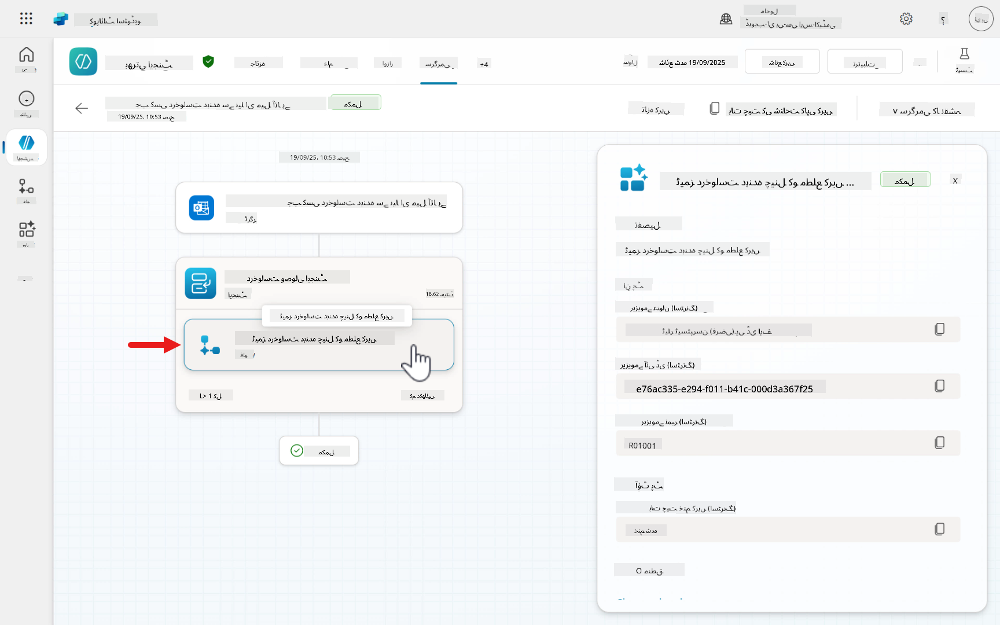

1. آخر میں، آئیے **Microsoft Teams** میں چینل پر پوسٹ کی گئی adaptive card کو دیکھتے ہیں۔ چینل میں، ہم adaptive card دیکھیں گے جو Dataverse میں نئی بنائی گئی ریزیومے قطار کے بارے میں معلومات دکھاتا ہے۔ adaptive card کے آغاز میں ہائپر لنک پر ہوور کریں، دیکھیں کہ URL وہی Resumes system view URL ہے جو ہم نے پہلے JSON (steps 15 - 19 of **Lab 3.2 - Notify a Teams channel using an adaptive card**) payload میں کنفیگر کیا تھا۔

       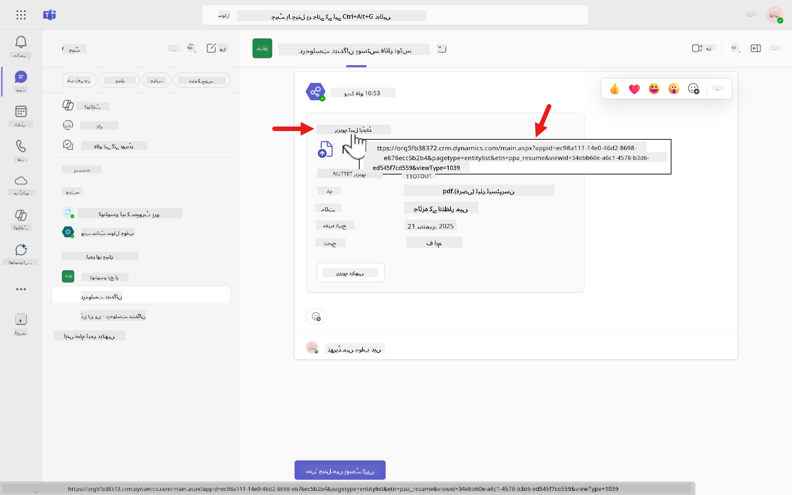

1. ہائپر لنک کو منتخب کریں، اور آپ کو **Hiring Hub** ماڈل-ڈرائیو ایپ میں Resumes system view پر اپنے براؤزر میں لے جایا جائے گا۔

       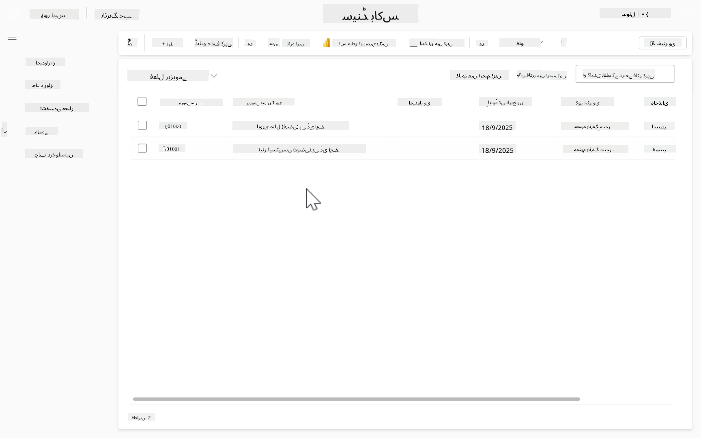

1. Microsoft Teams میں چینل پر واپس جائیں جہاں adaptive card پوسٹ کی گئی ہے۔ اس بار، **View Resume** پر ہوور کریں جو adaptive card کا `Action.OpenURL` ایکشن ہے۔ دیکھیں کہ URL وہی Resumes row ہے جو ہم نے پہلے JSON (steps 30 - 36 of **Lab 3.2 - Notify a Teams channel using an adaptive card**) payload میں کنفیگر کیا تھا۔

       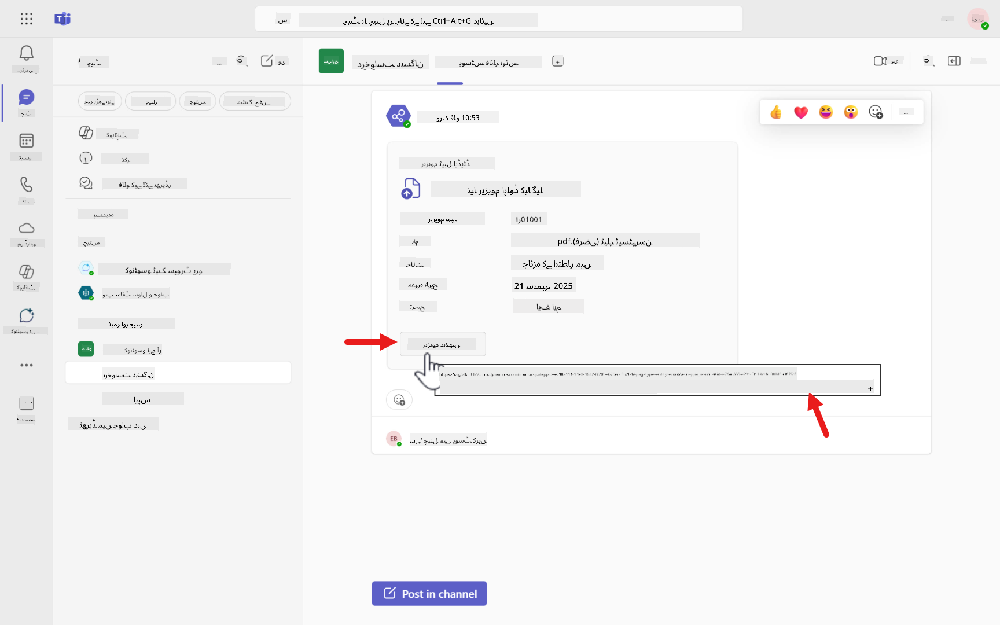

1. ایکشن کو منتخب کریں، اور آپ کو **Hiring Hub** ماڈل-ڈرائیو ایپ میں Resumes row فارم پر اپنے براؤزر میں لے جایا جائے گا۔

       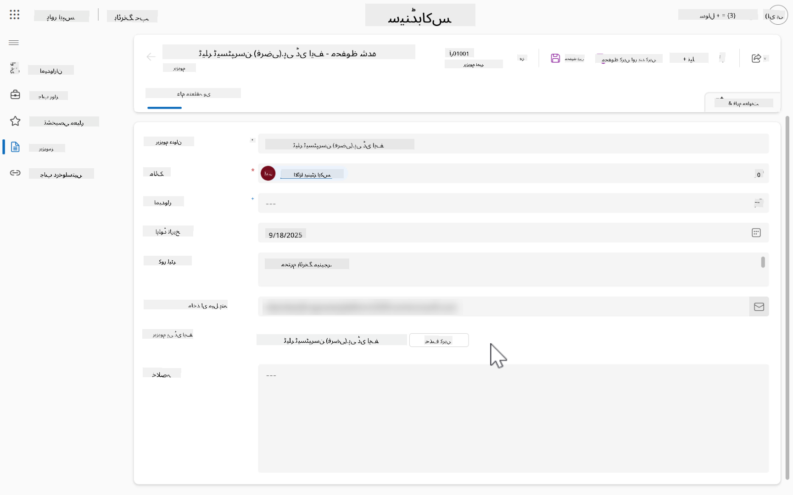

## ✅ مشن مکمل

مبارک ہو! 👏🏻 شاندار کام، Operative۔

✅ ایونٹ ٹریگر: آپ نے ایک ایونٹ ٹریگر بنایا ہے جو Dataverse پیرامیٹر ویلیوز کو ایجنٹ فلو تک منتقل کرتا ہے۔  
✅ ایجنٹ فلو بنایا: Dataverse پیرامیٹر ویلیوز کو استعمال کرتا ہے تاکہ Microsoft Teams میں چینل پر adaptive card پوسٹ کرے اور HR ریکروٹمنٹ ٹیم کو الرٹ کرے۔  
✅ چائلڈ ایجنٹ ہدایات اپ ڈیٹ کیں: تاکہ ایونٹ ٹریگر مکمل ہونے کے بعد فلو کو شروع کیا جا سکے۔

یہ **Hiring Agent** کو خود مختار طور پر کام کرنے کے قابل بناتا ہے جب بھی ریزیومے ای میل اٹیچمنٹس کے طور پر موصول ہوں اور HR ریکروٹمنٹ ٹیم کو دستی جائزے کے لیے مطلع کرے۔

یہ **Lab 03 - Automating candidate application emails** کا اختتام ہے، نیچے دیے گئے لنک کو منتخب کریں تاکہ اگلے سبق پر جائیں۔

⏭️ [**Authoring Agent Instructions** سبق پر جائیں](../04-agent-instructions/README.md)

## 📚 حکمت عملی وسائل

📖 [Copilot Studio میں اپنے ایجنٹ کو خود مختار بنائیں](https://learn.microsoft.com/training/modules/autonomous-agents-online-workshop/?WT.mc_id=power-188561-ebenitez)

📖 [ایونٹ ٹریگر شامل کریں](https://learn.microsoft.com/microsoft-copilot-studio/authoring-trigger-event?WT.mc_id=power-188561-ebenitez)

📖 [اپنے ایجنٹ کے ساتھ ایجنٹ فلو استعمال کریں](https://learn.microsoft.com/microsoft-copilot-studio/advanced-flow?WT.mc_id=power-188561-ebenitez)

📖 [Power Automate ٹریگرز کا تعارف](https://learn.microsoft.com/power-automate/triggers-introduction?WT.mc_id=power-188561-ebenitez)

📖 [ایجنٹس کے ساتھ Power Automate فلو استعمال کرنا](https://learn.microsoft.com/microsoft-copilot-studio/advanced-flow-create?WT.mc_id=power-188561-ebenitez)

📖 [Copilot Studio کے لیے ڈیٹا نقصان کی روک تھام](https://learn.microsoft.com/microsoft-copilot-studio/admin-data-loss-prevention?WT.mc_id=power-188561-ebenitez)

---

**ڈسکلیمر**:  
یہ دستاویز AI ترجمہ سروس [Co-op Translator](https://github.com/Azure/co-op-translator) کا استعمال کرتے ہوئے ترجمہ کی گئی ہے۔ ہم درستگی کے لیے کوشش کرتے ہیں، لیکن براہ کرم آگاہ رہیں کہ خودکار ترجمے میں غلطیاں یا غیر درستیاں ہو سکتی ہیں۔ اصل دستاویز کو اس کی اصل زبان میں مستند ذریعہ سمجھا جانا چاہیے۔ اہم معلومات کے لیے، پیشہ ور انسانی ترجمہ کی سفارش کی جاتی ہے۔ ہم اس ترجمے کے استعمال سے پیدا ہونے والی کسی بھی غلط فہمی یا غلط تشریح کے ذمہ دار نہیں ہیں۔