<!--
CO_OP_TRANSLATOR_METADATA:
{
  "original_hash": "616d142d4fb5f45d2a168fad6c1f9545",
  "translation_date": "2025-10-22T19:05:45+00:00",
  "source_file": "docs/operative-preview/07-multimodal-prompts/README.md",
  "language_code": "ur"
}
-->
# 🚨 مشن 07: ملٹی موڈل پرامپٹس کے ذریعے ریزیومے کے مواد نکالنا

--8<-- "disclaimer.md"

## 🕵️‍♂️ کوڈ نیم: `ڈاکیومنٹ ریزیومے ریکون`

> **⏱️ آپریشن کا وقت:** `~45 منٹ`

## 🎯 مشن کا خلاصہ

خوش آمدید، آپریٹو۔ آپ کے پچھلے مشنز نے آپ کو طاقتور ایجنٹ آرکسٹریشن کی مہارتیں فراہم کی ہیں، لیکن اب وقت آ گیا ہے کہ آپ ایک گیم چینجنگ صلاحیت کو ان لاک کریں: **ملٹی موڈل ڈاکیومنٹ تجزیہ**۔

آپ کا کام، اگر آپ اسے قبول کرتے ہیں، **ڈاکیومنٹ ریزیومے ریکون** ہے - کسی بھی ڈاکیومنٹ سے درست طریقے سے ساختی ڈیٹا نکالنا۔ جبکہ آپ کے ایجنٹس متن کو آسانی سے پروسیس کر سکتے ہیں، حقیقی دنیا میں روزانہ پی ڈی ایف، تصاویر، اور پیچیدہ ڈاکیومنٹس کو ہینڈل کرنے کی ضرورت ہوتی ہے۔ ریزیومے جمع ہوتے ہیں، انوائسز کو پروسیس کرنے کی ضرورت ہوتی ہے، اور فارم کو فوری ڈیجیٹائزیشن کی ضرورت ہوتی ہے۔

یہ مشن آپ کو ایک متن پر مبنی ایجنٹ بلڈر سے **ملٹی موڈل ماہر** میں تبدیل کرے گا۔ آپ AI کو ترتیب دینا سیکھیں گے جو ڈاکیومنٹس کو انسانی تجزیہ کار کی طرح پڑھتا اور سمجھتا ہے - لیکن AI کی رفتار اور مستقل مزاجی کے ساتھ۔ مشن کے اختتام تک، آپ ایک مکمل ریزیومے نکالنے کا نظام بنا چکے ہوں گے جو آپ کے ہائرنگ ورک فلو کے ساتھ انٹیگریٹ ہوتا ہے۔

یہ تکنیکیں آپ کے اگلے مشن میں ایڈوانسڈ ڈیٹا گراؤنڈنگ آپریشنز کے لیے ضروری ہوں گی۔

## 🔎 مقاصد

اس مشن میں، آپ سیکھیں گے:

1. ملٹی موڈل پرامپٹس کیا ہیں اور مختلف AI ماڈلز کو کب استعمال کرنا ہے
1. امیج اور ڈاکیومنٹ ان پٹس کے ساتھ پرامپٹس کو کیسے ترتیب دینا ہے
1. پرامپٹ آؤٹ پٹس کو JSON کے طور پر فارمیٹ کرنے کا طریقہ
1. ڈاکیومنٹ تجزیہ کے ساتھ پرامپٹ انجینئرنگ کے بہترین طریقے
1. ملٹی موڈل پرامپٹس کو ایجنٹ فلو کے ساتھ کیسے انٹیگریٹ کرنا ہے

## 🧠 ملٹی موڈل پرامپٹس کو سمجھنا

### ایک پرامپٹ کو "ملٹی موڈل" کیا بناتا ہے؟

روایتی پرامپٹس صرف متن کے ساتھ کام کرتے ہیں۔ لیکن ملٹی موڈل پرامپٹس مختلف قسم کے مواد کو پروسیس کر سکتے ہیں:

- **متن**: تحریری ہدایات اور مواد
- **تصاویر**: فوٹوز، اسکرین شاٹس، چارٹس، اور ڈایاگرام (.PNG, .JPG, .JPEG)  
- **ڈاکیومنٹس**: انوائسز، ریزیومے، فارم (.PDF)

یہ صلاحیت طاقتور منظرنامے کھولتی ہے جیسے ریزیومے کا تجزیہ، انوائسز کا پروسیسنگ، یا فارم سے ڈیٹا نکالنا۔

### آپ کے ورک فلو کے لیے ملٹی موڈل کیوں اہم ہے

ہر روز، آپ کی تنظیم کو ان ڈاکیومنٹ پروسیسنگ چیلنجز کا سامنا ہوتا ہے:

- **ریزیومے اسکریننگ**: سینکڑوں ریزیومے کو دستی طور پر پڑھنا قیمتی وقت لیتا ہے
- **انوائس پروسیسنگ**: مختلف ڈاکیومنٹ فارمیٹس سے وینڈر کی تفصیلات، رقم، اور تاریخیں نکالنا
- **فارم تجزیہ**: کاغذی فارم کو ڈیجیٹل ڈیٹا میں تبدیل کرنا

ملٹی موڈل پرامپٹس ان رکاوٹوں کو ختم کرتے ہیں AI کی زبان کو سمجھنے کی صلاحیت کو بصری تجزیہ کی صلاحیتوں کے ساتھ ملا کر۔ یہ آپ کے AI کو ڈاکیومنٹس کو متن کی طرح مؤثر طریقے سے پروسیس کرنے کی صلاحیت دیتا ہے۔

### عام کاروباری منظرنامے

یہاں کچھ مثالیں ہیں کہ ملٹی موڈل پرامپٹس کو کیسے استعمال کیا جا سکتا ہے:

| منظرنامہ                | کام                                                                                                                                      | مثال آؤٹ پٹ فیلڈز                                                                                   |
|-------------------------|-------------------------------------------------------------------------------------------------------------------------------------------|---------------------------------------------------------------------------------------------------------|
| **ریزیومے اسکریننگ**    | امیدوار کا نام، ای میل، فون، موجودہ عنوان، تجربے کے سال، اور کلیدی مہارتیں نکالیں۔                                                 | امیدوار کا نام، ای میل ایڈریس، فون نمبر، موجودہ جاب ٹائٹل، تجربے کے سال، کلیدی مہارتیں         |
| **انوائس پروسیسنگ**  | وینڈر کی معلومات، انوائس کی تاریخ، کل رقم، اور انوائس کی لائن آئٹمز نکالیں۔                                                 | وینڈر کا نام، انوائس کی تاریخ، کل رقم، انوائس لائن آئٹمز                                             |
| **فارم تجزیہ**       | اس درخواست فارم کا تجزیہ کریں اور تمام بھری ہوئی فیلڈز نکالیں۔                                                                              | فیلڈ کا نام (مثلاً، درخواست دہندہ کا نام)، درج کردہ قدر (مثلاً، جان ڈو)، ...                                  |
| **آئی ڈی ڈاکیومنٹ کی تصدیق** | اس شناختی ڈاکیومنٹ سے نام، آئی ڈی نمبر، ختم ہونے کی تاریخ، اور پتہ نکالیں۔ تصدیق کریں کہ تمام متن واضح طور پر پڑھا جا سکتا ہے اور کسی بھی غیر واضح حصے کو نشان زد کریں۔ | مکمل نام، شناختی نمبر، ختم ہونے کی تاریخ، پتہ، غیر واضح حصے کا نشان                        |

## ⚙️ AI بلڈر میں ماڈل کا انتخاب

AI بلڈر مختلف ماڈلز پیش کرتا ہے جو مخصوص کاموں کے لیے بہتر ہیں۔ یہ سمجھنا کہ کون سا ماڈل استعمال کرنا ہے کامیابی کے لیے اہم ہے۔

!!! note "ستمبر 2025 کے مطابق درست"
    AI بلڈر ماڈلز کو باقاعدگی سے اپ ڈیٹ کیا جاتا ہے، لہذا موجودہ ماڈل کی دستیابی کے لیے [AI بلڈر ماڈل سیٹنگز دستاویزات](https://learn.microsoft.com/ai-builder/prompt-modelsettings) کو چیک کریں۔

### ماڈل کا موازنہ

ذیل میں دیے گئے تمام ماڈلز وژن اور ڈاکیومنٹ پروسیسنگ کو سپورٹ کرتے ہیں:

| ماڈل | 💰قیمت | ⚡رفتار | ✅بہترین استعمال |
|-------|------|-------|----------|
| **GPT-4.1 mini** | بنیادی (سب سے زیادہ کفایتی) | تیز | معیاری ڈاکیومنٹ پروسیسنگ، خلاصہ، بجٹ کے لحاظ سے منصوبے |
| **GPT-4.1** | معیاری | معتدل | پیچیدہ ڈاکیومنٹس، ایڈوانس مواد کی تخلیق، اعلیٰ درستگی کی ضروریات |
| **o3** | پریمیم | سست (پہلے وجوہات) | ڈیٹا تجزیہ، تنقیدی سوچ، پیچیدہ مسئلہ حل کرنا |
| **GPT-5 chat** | معیاری | بہتر | تازہ ترین ڈاکیومنٹ سمجھنا، سب سے زیادہ درستگی |
| **GPT-5 reasoning** | پریمیم | سست (پیچیدہ تجزیہ) | سب سے زیادہ پیچیدہ تجزیہ، منصوبہ بندی، ایڈوانس استدلال |

### درجہ حرارت کی ترتیبات کی وضاحت

درجہ حرارت کنٹرول کرتا ہے کہ آپ کے AI کے جوابات کتنے تخلیقی یا پیش گوئی کے قابل ہیں:

- **درجہ حرارت 0**: سب سے زیادہ پیش گوئی، مستقل نتائج (ڈیٹا نکالنے کے لیے بہترین)
- **درجہ حرارت 0.5**: تخلیقی صلاحیت اور مستقل مزاجی کا متوازن امتزاج  
- **درجہ حرارت 1**: زیادہ سے زیادہ تخلیقی صلاحیت (مواد کی تخلیق کے لیے بہترین)

ڈاکیومنٹ تجزیہ کے لیے، **درجہ حرارت 0** استعمال کریں تاکہ ڈیٹا نکالنے میں مستقل مزاجی کو یقینی بنایا جا سکے۔

## 📊 آؤٹ پٹ فارمیٹس: متن بمقابلہ JSON

صحیح آؤٹ پٹ فارمیٹ کا انتخاب نیچے کی پروسیسنگ کے لیے اہم ہے۔

### متن آؤٹ پٹ کب استعمال کریں

متن آؤٹ پٹ ان کے لیے بہتر کام کرتا ہے:

- انسان کے لیے قابل پڑھائی خلاصے
- سادہ درجہ بندیاں
- مواد جو ساختی پروسیسنگ کی ضرورت نہیں رکھتا

### JSON آؤٹ پٹ کب استعمال کریں

JSON آؤٹ پٹ ضروری ہے:

- ساختی ڈیٹا نکالنے کے لیے
- ڈیٹا بیس یا سسٹمز کے ساتھ انٹیگریشن کے لیے
- پاور آٹومیٹ فلو پروسیسنگ کے لیے
- مستقل فیلڈ میپنگ کے لیے

### JSON کے بہترین طریقے

1. **واضح فیلڈ ناموں کی وضاحت کریں**: وضاحتی، مستقل نام استعمال کریں
1. **مثالیں فراہم کریں**: ہر فیلڈ کے لیے نمونہ آؤٹ پٹ اور اقدار شامل کریں
1. **ڈیٹا کی اقسام کی وضاحت کریں**: تاریخوں، نمبروں، اور متن کے لیے مثالیں شامل کریں
1. **غائب ڈیٹا کو ہینڈل کریں**: null یا خالی اقدار کے لیے منصوبہ بنائیں
1. **ساخت کی توثیق کریں**: مختلف ڈاکیومنٹ اقسام کے ساتھ ٹیسٹ کریں

### ڈاکیومنٹ کے معیار کے تحفظات

- **ریزولوشن**: یقینی بنائیں کہ تصاویر واضح اور پڑھنے کے قابل ہیں
- **اورینٹیشن**: پروسیسنگ سے پہلے ڈاکیومنٹس کو صحیح سمت میں گھمائیں
- **فارمیٹ سپورٹ**: اپنے مخصوص ڈاکیومنٹ اقسام (PDF, JPG, PNG) کے ساتھ ٹیسٹ کریں
- **سائز کی حدود**: اپنے ماحول میں فائل سائز کی پابندیوں سے آگاہ رہیں

### کارکردگی کی اصلاح

- **مناسب ماڈلز کا انتخاب کریں**: صرف ضرورت پڑنے پر ماڈلز کو اپ گریڈ کریں
- **پرامپٹس کو بہتر بنائیں**: اکثر، مختصر، واضح ہدایات بہتر کارکردگی دکھاتی ہیں
- **غلطی کا ہینڈلنگ**: ان ڈاکیومنٹس کے لیے منصوبہ بنائیں جو پروسیس نہیں ہو سکتے
- **اخراجات کی نگرانی کریں**: مختلف ماڈلز مختلف مقدار میں AI بلڈر کریڈٹس استعمال کرتے ہیں

## 🧪 لیب 7: ریزیومے نکالنے کا نظام بنانا

وقت آ گیا ہے کہ آپ اپنی ملٹی موڈل معلومات کو عملی جامہ پہنائیں۔ آپ ایک جامع ریزیومے نکالنے کا نظام بنائیں گے جو امیدوار کے ڈاکیومنٹس کا تجزیہ کرتا ہے اور انہیں آپ کے ہائرنگ ورک فلو کے لیے ساختی ڈیٹا میں تبدیل کرتا ہے۔

### اس مشن کو مکمل کرنے کے لیے ضروریات

1. آپ کو **یا تو**:

    - **مشن 06 مکمل کر چکے ہوں** اور اپنا ملٹی ایجنٹ ہائرنگ سسٹم تیار ہو، **یا**
    - **مشن 07 اسٹارٹر حل درآمد کریں** اگر آپ نئے شروع کر رہے ہیں یا پکڑنے کی ضرورت ہے۔ [مشن 07 اسٹارٹر حل ڈاؤن لوڈ کریں](https://aka.ms/agent-academy)

1. [ٹیسٹ ریزیومے](https://download-directory.github.io/?url=https://github.com/microsoft/agent-academy/tree/main/operative/sample-data/resumes&filename=operative_sampledata) سے نمونہ ریزیومے ڈاکیومنٹس

!!! note "حل درآمد اور نمونہ ڈیٹا"
    اگر آپ اسٹارٹر حل استعمال کر رہے ہیں، تو [مشن 01](../01-get-started/README.md) میں تفصیلی ہدایات کے لیے رجوع کریں کہ اپنے ماحول میں حل اور نمونہ ڈیٹا کیسے درآمد کریں۔

### 7.1 ملٹی موڈل پرامپٹ بنائیں

آپ کا پہلا مقصد: ایک پرامپٹ بنائیں جو ریزیومے ڈاکیومنٹس کا تجزیہ کرنے اور ساختی ڈیٹا نکالنے کے قابل ہو۔

1. [Copilot Studio](https://copilotstudio.microsoft.com) میں سائن ان کریں اور بائیں نیویگیشن سے **Tools** منتخب کریں۔

1. **+ New tool** منتخب کریں، پھر **Prompt** منتخب کریں۔  
    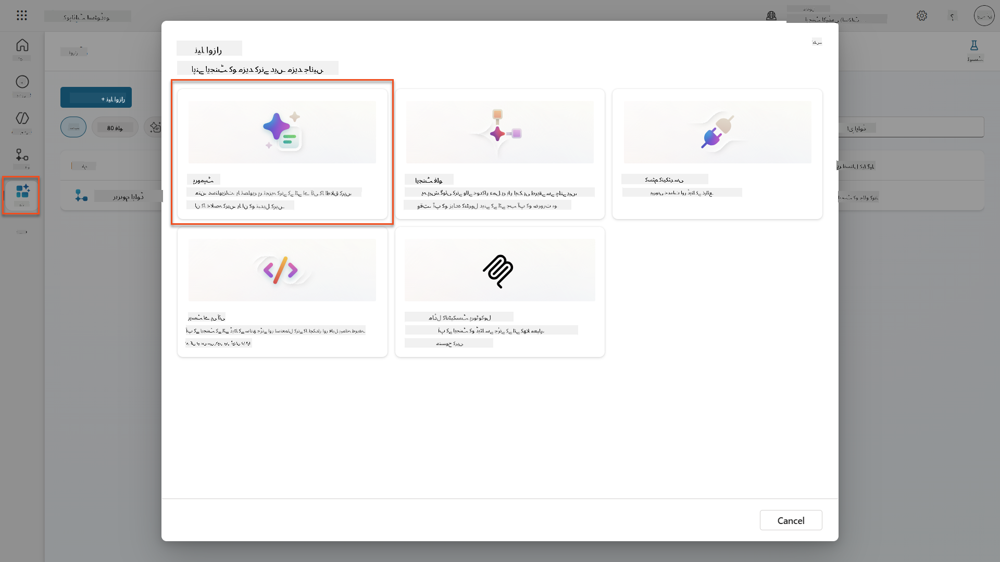

1. پرامپٹ کو ڈیفالٹ ٹائم اسٹیمپ نام (مثلاً *Custom prompt 09/04/2025, 04:59:11 PM*) سے `Summarize Resume` میں **نام تبدیل کریں**۔

1. انسٹرکشنز فیلڈ میں، یہ پرامپٹ شامل کریں:

    ```text
    You are tasked with extracting key candidate information from a resume and cover letter to facilitate matching with open job roles and creating a summary for application review.
    
    Instructions:
    1. Extract Candidate Details:
        - Identify and extract the candidate’s full name.
        - Extract contact information, specifically the email address.
    2. Create Candidate Summary:
        - Summarize the candidate’s profile as multiline text (max 2000 characters) with the following sections:
            - Candidate name
            - Role(s) applied for if present
            - Contact and location
            - One-paragraph summary
            - Experience snapshot (last 2–3 roles with outcomes)
            - Key projects (1–3 with metrics)
            - Education and certifications
            - Top skills (Top 10)
            - Availability and work authorization
    
    Guidelines:
    - Extract information only from the provided resume and cover letter documents.
    - Ensure accuracy in identifying all details such as contact details and skills.
    - The summary should be concise but informative, suitable for quick application review.
    
    Resume: /document
    CoverLetter: /text
    ```

    !!! tip "Copilot کی مدد استعمال کریں"
        آپ "Get started with Copilot" استعمال کر سکتے ہیں تاکہ قدرتی زبان کے ذریعے اپنا پرامپٹ تیار کریں۔ Copilot سے ریزیومے کا خلاصہ بنانے کے لیے پرامپٹ بنانے کو کہیں!

1. ان پٹ پیرامیٹرز **ترتیب دیں**:

    | پیرامیٹر | قسم | نام | نمونہ ڈیٹا |
    |-----------|------|------|-------------|
    | ریزیومے | امیج یا ڈاکیومنٹ | ریزیومے | ٹیسٹ ڈیٹا فولڈر سے نمونہ ریزیومے اپ لوڈ کریں |
    | کور لیٹر | متن | کور لیٹر | یہاں ایک ریزیومے ہے! |

1. **Test** منتخب کریں تاکہ اپنے پرامپٹ سے ابتدائی متن آؤٹ پٹ دیکھ سکیں۔  
    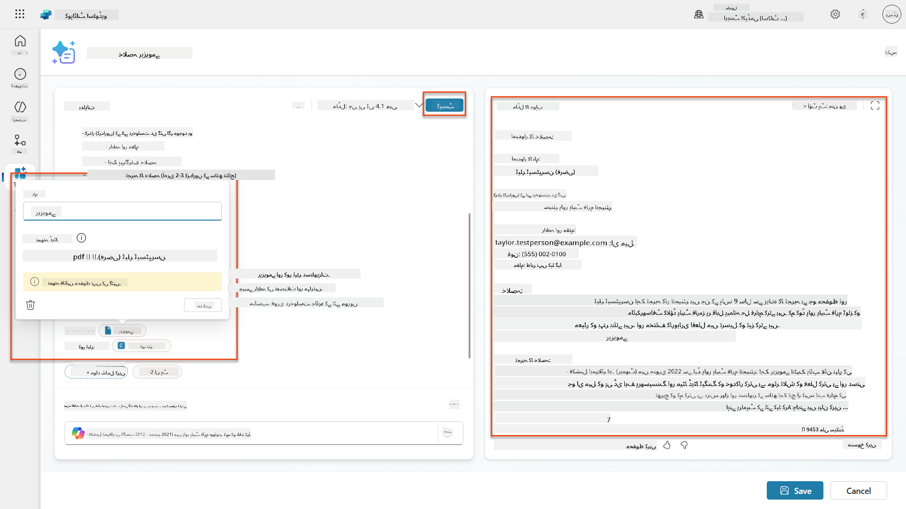

### 7.2 JSON آؤٹ پٹ ترتیب دیں

اب آپ پرامپٹ کو عام متن کے بجائے ساختی JSON ڈیٹا آؤٹ پٹ کرنے کے لیے تبدیل کریں گے۔

1. اپنے پرامپٹ انسٹرکشنز کے آخر میں یہ JSON فارمیٹ وضاحت شامل کریں:

    ```text
    Output Format:
    Provide the output in valid JSON format with the following structure:
    
    {
        "CandidateName": "string",
        "Email": "string",
        "Summary": "string max 2000 characters",
        "Skills": [ {"item": "Skill 1"}, {"item": "Skill 2"}],
        "Experience": [ {"item": "Experience 1"}, {"item": "Experience 2"}],
    }
    ```

1. **Output** سیٹنگ کو "Text" سے **JSON** میں تبدیل کریں۔

1. دوبارہ **Test** منتخب کریں تاکہ تصدیق کریں کہ آؤٹ پٹ اب JSON کے طور پر فارمیٹ کیا گیا ہے۔  
    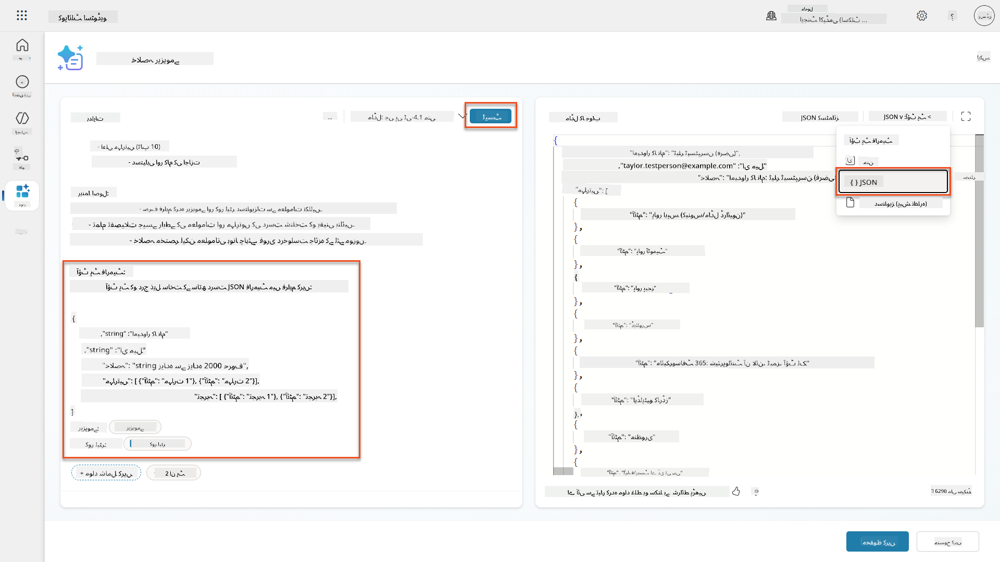

1. **اختیاری:** مختلف AI ماڈلز کے ساتھ تجربہ کریں تاکہ دیکھیں کہ آؤٹ پٹس کیسے مختلف ہوتے ہیں، پھر ڈیفالٹ ماڈل پر واپس آئیں۔

1. پرامپٹ بنانے کے لیے **Save** منتخب کریں۔

1. **Configure for use in Agent** ڈائیلاگ میں، **Cancel** منتخب کریں۔

    !!! info "ہم اسے ابھی ایک ٹول کے طور پر کیوں نہیں شامل کر رہے"
        آپ اس پرامپٹ کو ایجنٹ فلو میں استعمال کریں گے بجائے اس کے کہ براہ راست ایک ٹول کے طور پر، جو آپ کو ڈیٹا پروسیسنگ ورک فلو پر زیادہ کنٹرول دیتا ہے۔

### 7.3 پرامپٹ کو ایجنٹ فلو میں شامل کریں

آپ ایک ایجنٹ فلو بنائیں گے جو آپ کے پرامپٹ کو Dataverse میں محفوظ ریزیومے پروسیس کرنے کے لیے استعمال کرتا ہے۔

!!! tip "ایجنٹ فلو ایکسپریشنز"
    یہ بہت اہم ہے کہ آپ اپنے نوڈز کے نام دینے اور ایکسپریشنز داخل کرنے کی ہدایات کو بالکل درست طریقے سے فالو کریں کیونکہ ایکسپریشنز پچھلے نوڈز کو ان کے نام کے ذریعے حوالہ دیتے ہیں! [ایجنٹ فلو مشن میں ریفریش](../../recruit/09-add-an-agent-flow/README.md#you-mentioned-expressions-what-are-expressions) کے لیے رجوع کریں!

1. Copilot Studio میں اپنے **Hiring Agent** پر جائیں

1. **Agents** ٹیب منتخب کریں، اور چائلڈ **Application Intake Agent** منتخب کریں

1. **Tools** پینل کے اندر، **+ Add** → **+ New tool** → **Agent flow** منتخب کریں

1. جب ایجنٹ فلو کو کال کرتا ہے نوڈ پر، **+ Add an input** استعمال کریں تاکہ درج ذیل پیرامیٹر شامل کریں:

    | قسم | نام | وضاحت |
    |------|------|-------------|
    | متن | ResumeNumber | یقینی بنائیں کہ [ResumeNumber] استعمال کریں۔ یہ ہمیشہ حرف R سے شروع ہونا چاہیے |

1. **+** Insert action آئیکن منتخب کریں جو پہلے نوڈ کے نیچے ہے، **Dataverse** تلاش کریں، **See more** منتخب کریں، اور پھر **List rows** ایکشن کو تلاش کریں

1. **ellipsis (...)** منتخب کریں List rows نوڈ پر، اور **Rename** منتخب کریں `Get Resume Record`، اور درج ذیل پیرامیٹرز سیٹ کریں:

    | پراپرٹی | کیسے سیٹ کریں | قدر |
    |----------|------------|-------|
    | **Table name** | منتخب کریں | Resumes |
    | **Filter rows** | Dynamic data (thunderbolt icon) | `ppa_resumenumber eq 'ResumeNumber'` **ResumeNumber** کو **When an agent calls the flow** → **ResumeNumber** سے تبدیل کریں |
    | **Row count** | درج کریں | 1 |

    !!! tip "ان سوالات کو بہتر بنائیں!"
        جب پروڈکشن میں اس تکنیک کا استعمال کریں، تو آپ کو ہمیشہ منتخب کردہ کالمز کو صرف ان تک محدود کرنا چاہیے جو ایجنٹ فلو کے لیے ضروری ہوں۔

    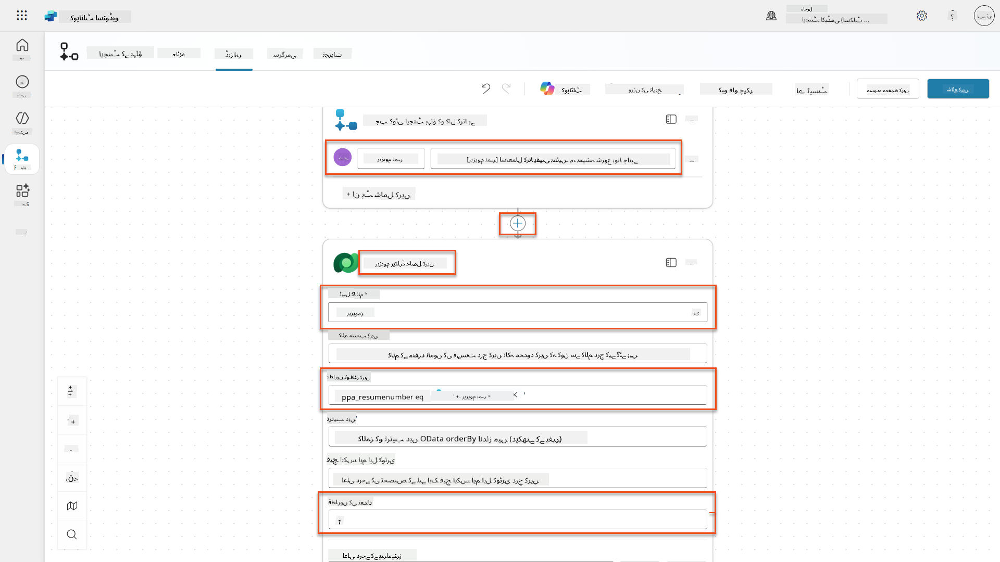

1. **+** Insert action آئیکن منتخب کریں Get Resume Record نوڈ کے نیچے، **Dataverse** تلاش کریں، **See more** منتخب کریں، اور پھر **Download
| **پرامپٹ** | منتخب کریں | خلاصہ ریزیومے |
| **کور لیٹر** | اظہار (fx آئیکن) | `first(body('Get_Resume_Record')?['value'])?['ppa_coverletter']` |
| **ریزیومے** | متحرک ڈیٹا (تھنڈر بولٹ آئیکن) | ریزیومے ڈاؤنلوڈ کریں → فائل یا تصویر کا مواد |

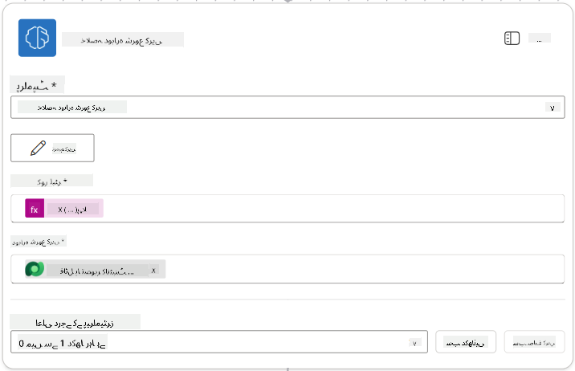

!!! tip "پرامپٹ پیرامیٹرز"
دھیان دیں کہ جو پیرامیٹرز آپ بھر رہے ہیں وہی ہیں جو آپ نے پرامپٹ بناتے وقت ان پٹ پیرامیٹرز کے طور پر ترتیب دیے تھے۔

### 7.4 امیدوار کا ریکارڈ بنائیں

اب آپ کو پرامپٹ سے حاصل کردہ معلومات کو استعمال کرتے ہوئے ایک نیا امیدوار ریکارڈ بنانا ہوگا اگر وہ پہلے سے موجود نہیں ہے۔

1. **+** ایکشن آئیکن منتخب کریں جو خلاصہ ریزیومے نوڈ کے نیچے ہے، **Dataverse** تلاش کریں، **See more** منتخب کریں، اور پھر **List rows** ایکشن کو تلاش کریں۔

1. نوڈ کا نام `Get Existing Candidate` رکھیں، اور درج ذیل پیرامیٹرز سیٹ کریں:

| پراپرٹی | کیسے سیٹ کریں | ویلیو |
|----------|------------|-------|
| **ٹیبل کا نام** | منتخب کریں | Candidates |
| **فلٹر رووز** | متحرک ڈیٹا (تھنڈر بولٹ آئیکن) | `ppa_email eq 'Email'`  **Replace** `Email` کو **Summarize Resume → Email** سے بدلیں |
| **روو کاؤنٹ** | درج کریں | 1 |

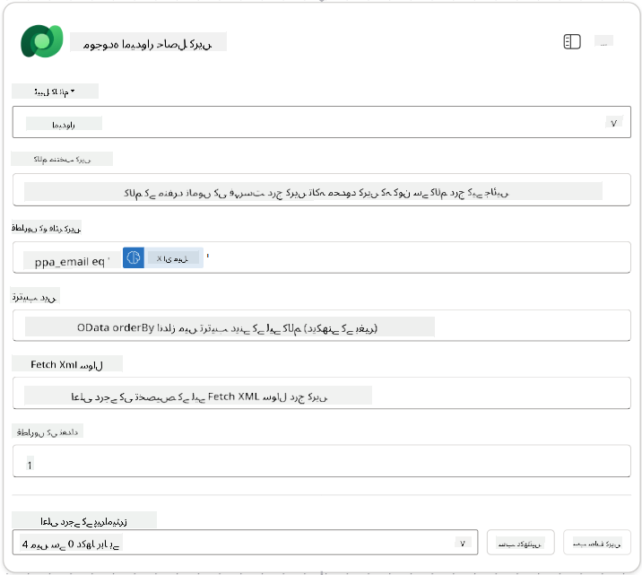

1. **+** ایکشن آئیکن منتخب کریں جو Get Existing Candidate نوڈ کے نیچے ہے، **Control** تلاش کریں، **See more** منتخب کریں، اور پھر **Condition** ایکشن کو تلاش کریں۔

1. کنڈیشن پراپرٹیز میں درج ذیل کنڈیشن سیٹ کریں:

| کنڈیشن | آپریٹر | ویلیو |
|-----------|----------|-------|
| اظہار (fx آئیکن): `length(outputs('Get_Existing_Candidate')?['body/value'])` | برابر ہے | 0 |

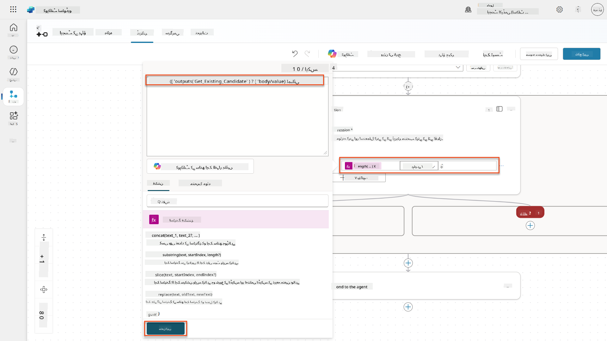

1. **True** برانچ میں **+** ایکشن آئیکن منتخب کریں، **Dataverse** تلاش کریں، **See more** منتخب کریں، اور پھر **Add a new row** ایکشن کو تلاش کریں۔

1. نوڈ کا نام `Add a New Candidate` رکھیں، اور درج ذیل پیرامیٹرز سیٹ کریں:

| پراپرٹی | کیسے سیٹ کریں | ویلیو |
|----------|------------|-------|
| **ٹیبل کا نام** | منتخب کریں | Candidates |
| **امیدوار کا نام** | متحرک ڈیٹا (تھنڈر بولٹ آئیکن) | Summarize Resume → `CandidateName` |
| **ای میل** | متحرک ڈیٹا (تھنڈر بولٹ آئیکن) | Summarize Resume → `Email` |

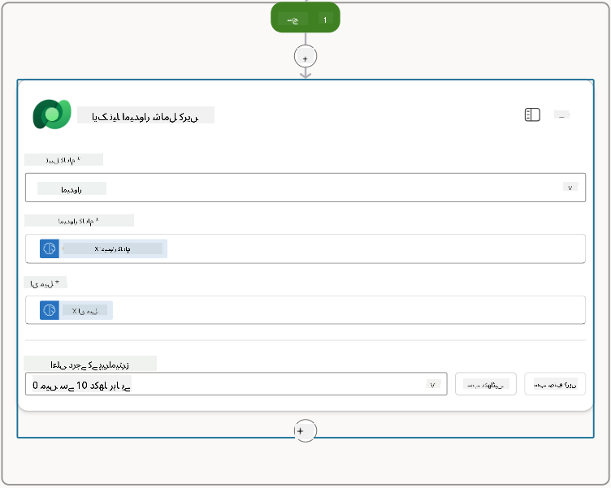

### 7.5 ریزیومے کو اپ ڈیٹ کریں اور فلو آؤٹ پٹس کو ترتیب دیں

فلو کو مکمل کریں ریزیومے ریکارڈ کو اپ ڈیٹ کرکے اور ایجنٹ کو واپس کرنے کے لیے ڈیٹا کو ترتیب دے کر۔

1. کنڈیشن کے نیچے **+** ایکشن آئیکن منتخب کریں، **Dataverse** تلاش کریں، **See more** منتخب کریں، اور پھر **Update a row** ایکشن کو تلاش کریں۔

1. نوڈ کا عنوان `Update Resume` رکھیں، **Show all** منتخب کریں، اور درج ذیل پیرامیٹرز سیٹ کریں:

| پراپرٹی | کیسے سیٹ کریں | ویلیو |
|----------|------------|-------|
| **ٹیبل کا نام** | منتخب کریں | Resumes |
| **روو آئی ڈی** | اظہار (fx آئیکن) | `first(body('Get_Resume_Record')?['value'])?['ppa_resumeid']` |
| **خلاصہ** | متحرک ڈیٹا (تھنڈر بولٹ آئیکن) | Summarize Resume → Text |
| **امیدوار (Candidates)** | اظہار (fx آئیکن) | `if(equals(length(outputs('Get_Existing_Candidate')?['body/value']), 1), first(outputs('Get_Existing_Candidate')?['body/value'])?['ppa_candidateid'], outputs('Add_a_New_Candidate')?['body/ppa_candidateid'])` |

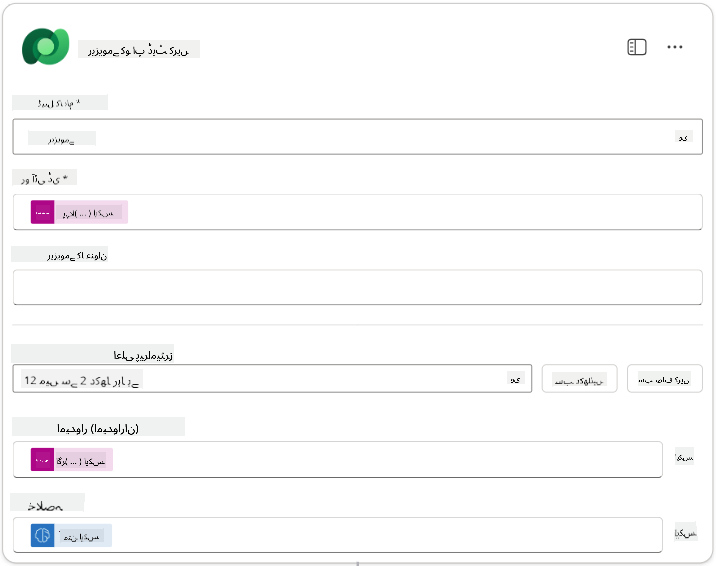

1. **Respond to the agent** نوڈ منتخب کریں اور پھر **+ Add an output** استعمال کریں:

| قسم | نام              | کیسے سیٹ کریں                      | ویلیو                                                        | وضاحت                                            |
| ---- | ----------------- | ------------------------------- | ------------------------------------------------------------ | ------------------------------------------------------ |
| ٹیکسٹ | `CandidateName`   | متحرک ڈیٹا (تھنڈر بولٹ آئیکن) | Summarize Resume → See more → CandidateName                  | ریزیومے پر دیا گیا [CandidateName]                |
| ٹیکسٹ | `CandidateEmail`  | متحرک ڈیٹا (تھنڈر بولٹ آئیکن) | Summarize Resume → See more → Email                          | ریزیومے پر دیا گیا [CandidateEmail]               |
| ٹیکسٹ | `CandidateNumber` | اظہار (fx آئیکن)            | `concat('ppa_candidates/', if(equals(length(outputs('Get_Existing_Candidate')?['body/value']), 1), first(outputs('Get_Existing_Candidate')?['body/value'])?['ppa_candidateid'], outputs('Add_a_New_Candidate')?['body/ppa_candidateid']) )` | نئے یا موجودہ امیدوار کا [CandidateNumber] |
| ٹیکسٹ | `ResumeSummary`   | متحرک ڈیٹا (تھنڈر بولٹ آئیکن) | Summarize Resume → See more → body/responsev2/predictionOutput/structuredOutput | ریزیومے کا خلاصہ اور تفصیلات JSON فارمیٹ میں            |

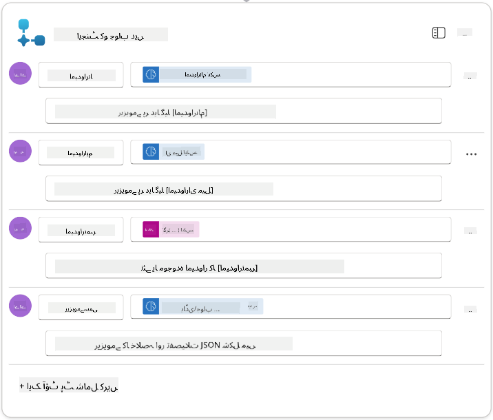

1. اوپر دائیں جانب **Save draft** منتخب کریں۔ آپ کا ایجنٹ فلو درج ذیل کی طرح نظر آنا چاہیے  
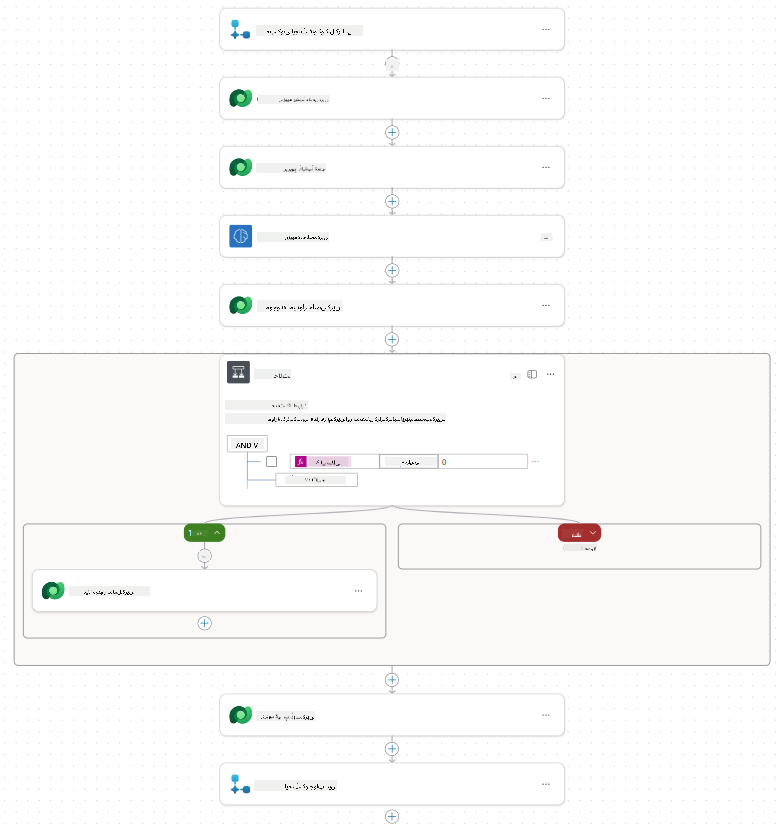

1. **Overview** ٹیب منتخب کریں، **Details** پینل پر **Edit** منتخب کریں

    1. **فلو کا نام**:`Summarize Resume`
    1. **تفصیل**:

        ```text
        Summarize an existing Resume stored in Dataverse using a [ResumeNumber] as input, return the [CandidateNumber], and resume summary JSON
        ```

1. **Save** منتخب کریں

1. دوبارہ **Designer** ٹیب منتخب کریں، اور **Publish** منتخب کریں۔

### 7.6 فلو کو اپنے ایجنٹ سے جوڑیں

اب آپ فلو کو ایک ٹول کے طور پر شامل کریں گے اور اپنے ایجنٹ کو اس کے استعمال کے لیے ترتیب دیں گے۔

1. **Hiring Agent** کو Copilot Studio میں کھولیں

1. **Agents** ٹیب منتخب کریں، اور **Application Intake Agent** کھولیں

1. **Tools** پینل منتخب کریں، اور **+ Add a tool** - > **Flow** -> **Summarize Resume** **(Agent Flow)** منتخب کریں

1. **Add and configure** منتخب کریں

1. ٹول سیٹنگز کو درج ذیل کے مطابق ترتیب دیں:

| سیٹنگ | ویلیو |
|---------|-------|
| **تفصیل** | Dataverse میں محفوظ موجودہ ریزیومے کا خلاصہ کریں [ResumeNumber] کو ان پٹ کے طور پر استعمال کرتے ہوئے، [CandidateNumber] اور ریزیومے خلاصہ JSON واپس کریں |
| **یہ ٹول کب استعمال ہو سکتا ہے** | صرف جب موضوعات یا ایجنٹس کے ذریعے حوالہ دیا جائے |

1. **Save** منتخب کریں  
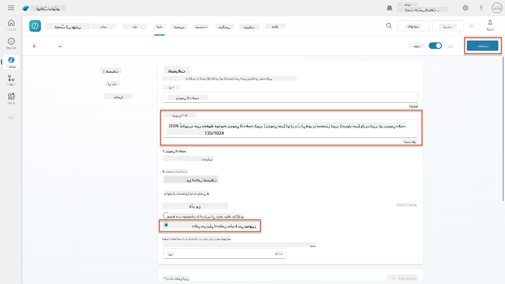

1. اگر آپ Hiring Agent کے اندر Tools منتخب کریں، تو آپ دیکھیں گے کہ ہمارے دونوں ٹولز **Application Intake Agent** کے ذریعے استعمال کے لیے دستیاب ہیں۔  
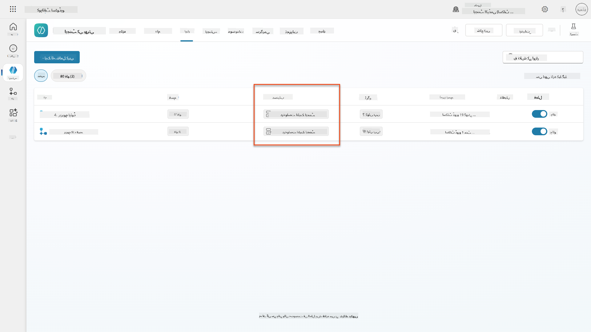

1. **Application Intake Child** ایجنٹ انسٹرکشنز پر جائیں، اور **Post-Upload** مرحلہ درج ذیل میں تبدیل کریں:

    ```text
    2. Post-Upload Processing  
        - After uploading, be sure to also output the [ResumeNumber] in all messages
        - Pass [ResumeNumber] to /Summarize Resume  - Be sure to use the correct value that will start with the letter R.
        - Be sure to also output the [CandidateNumber] in all messages
        - Use the [ResumeSummary] to output a summary of the processed Resume and candidate
    ```

`/Summarize Resume` کو **Summarize Resume agent flow** کے حوالہ سے تبدیل کریں، فارورڈ سلیش (`/)` ٹائپ کرکے یا `/Summarize` منتخب کرکے حوالہ شامل کریں۔  
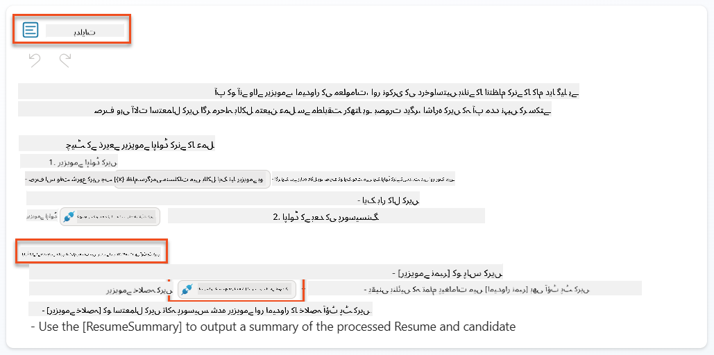

1. **Save** منتخب کریں۔

### 7.7 اپنے ایجنٹ کو ٹیسٹ کریں

اپنے مکمل ملٹی موڈل سسٹم کو ٹیسٹ کریں تاکہ یہ یقینی بنایا جا سکے کہ سب کچھ صحیح کام کر رہا ہے۔

1. **ٹیسٹنگ شروع کریں**:

    - **Test** منتخب کریں تاکہ ٹیسٹ پینل کھلے
    - ٹائپ کریں: `یہ ایک امیدوار کا ریزیومے ہے`

    - [Test Resumes](https://download-directory.github.io/?url=https://github.com/microsoft/agent-academy/tree/main/operative/sample-data/resumes&filename=operative_sampledata) سے ایک نمونہ ریزیومے اپ لوڈ کریں

1. **نتائج کی تصدیق کریں**:
    - جب آپ پیغام اور ریزیومے بھیجیں، تو چیک کریں کہ آپ کو ایک ریزیومے نمبر (فارمیٹ: R#####) ملے
    - تصدیق کریں کہ آپ کو امیدوار نمبر اور خلاصہ ملے
    - ایکٹیویٹی میپ استعمال کریں تاکہ دونوں ریزیومے اپ لوڈ ٹول اور خلاصہ ریزیومے ٹول کو ایکشن میں دیکھ سکیں، اور خلاصہ پرامپٹ کے آؤٹ پٹس ایجنٹ کو موصول ہوں:  
        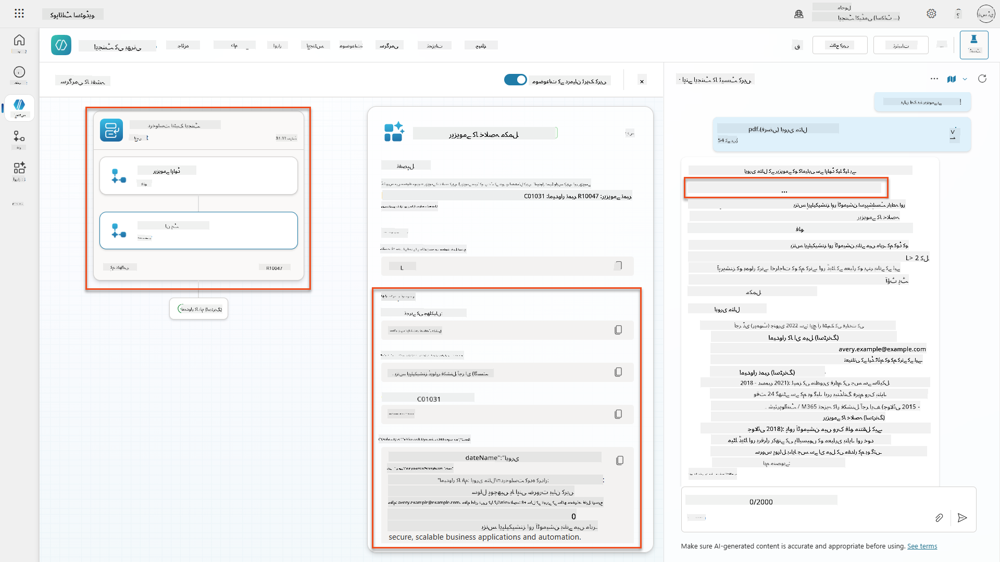

1. **ڈیٹا کی مستقل مزاجی چیک کریں**:
    - [Power Apps](https://make.powerapps.com) پر جائیں
    - **Apps** → **Hiring Hub** → **Play** کھولیں
    - **Resumes** پر جائیں تاکہ تصدیق کریں کہ ریزیومے اپ لوڈ اور پروسیس ہوا۔ اس میں خلاصہ معلومات اور ایک متعلقہ امیدوار ریکارڈ ہونا چاہیے۔
    - **Candidates** چیک کریں تاکہ نکالا گیا امیدوار معلومات دیکھ سکیں  
        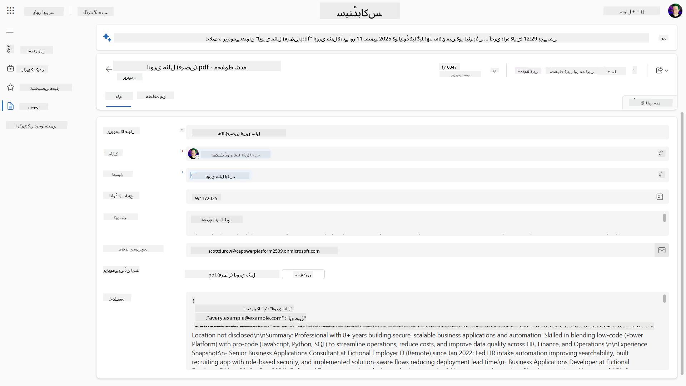
    - جب آپ عمل کو دوبارہ چلائیں، تو یہ موجودہ امیدوار (ریزیومے سے نکالا گیا ای میل پر میچ کیا گیا) استعمال کرے گا بجائے کہ نیا بنائے۔

!!! tip "مسائل کا حل"
    - **ریزیومے پروسیس نہیں ہو رہا**: یقینی بنائیں کہ فائل PDF ہے اور سائز کی حد کے اندر ہے
    - **کوئی امیدوار نہیں بنایا گیا**: چیک کریں کہ ای میل ریزیومے سے صحیح نکالا گیا ہے
    - **JSON فارمیٹ کی غلطیاں**: تصدیق کریں کہ آپ کے پرامپٹ انسٹرکشنز میں بالکل وہی JSON ساخت شامل ہے
    - **فلو کی غلطیاں**: چیک کریں کہ تمام Dataverse کنکشنز اور اظہار صحیح ترتیب دیے گئے ہیں

### پروڈکشن کے لیے تیاری

اگرچہ یہ مشن کا حصہ نہیں ہے، اس ایجنٹ فلو کو پروڈکشن کے لیے تیار کرنے کے لیے آپ درج ذیل پر غور کر سکتے ہیں:

1. **غلطی کا انتظام** - اگر ریزیومے نمبر نہیں ملا، یا پرامپٹ دستاویز کو پارس کرنے میں ناکام رہا، تو غلطی کا انتظام شامل کیا جانا چاہیے تاکہ ایجنٹ کو واضح غلطی واپس کی جا سکے۔
1. **موجودہ امیدواروں کو اپ ڈیٹ کرنا** - امیدوار ای میل کے ذریعے پایا جاتا ہے، پھر نام کو ریزیومے پر موجود نام سے اپ ڈیٹ کیا جا سکتا ہے۔
1. **ریزیومے خلاصہ اور امیدوار تخلیق کو الگ کرنا** - اس فعالیت کو چھوٹے ایجنٹ فلو میں تقسیم کیا جا سکتا ہے تاکہ انہیں برقرار رکھنا آسان ہو، اور پھر ایجنٹ کو ہدایات دی جائیں کہ انہیں باری باری استعمال کریں۔

## 🎉 مشن مکمل

شاندار کام، آپریٹو! **ڈاکیومنٹ ریزیومے ریکون** اب مکمل ہو چکا ہے۔ آپ نے کامیابی سے ملٹی موڈل پرامپٹس میں مہارت حاصل کی اور اب کسی بھی دستاویز سے درست ڈیٹا نکال سکتے ہیں۔

یہ ہے جو آپ نے اس مشن میں حاصل کیا:

**✅ ملٹی موڈل پرامپٹ مہارت**  
آپ اب سمجھتے ہیں کہ ملٹی موڈل پرامپٹس کیا ہیں اور مختلف AI ماڈلز کو بہترین نتائج کے لیے کب استعمال کرنا ہے۔

**✅ دستاویز پروسیسنگ کی مہارت**  
آپ نے سیکھا کہ پرامپٹس کو تصویر اور دستاویز ان پٹ کے ساتھ ترتیب دینا اور آؤٹ پٹس کو JSON کے طور پر فارمیٹ کرنا۔

**✅ ریزیومے نکالنے کا نظام**  
آپ نے ایک مکمل ریزیومے نکالنے کا نظام بنایا جو امیدوار دستاویزات کو پروسیس کرتا ہے اور آپ کے ہائرنگ ورک فلو کے ساتھ انٹیگریٹ کرتا ہے۔

**✅ بہترین طریقوں کا نفاذ**  
آپ نے دستاویز تجزیہ کے ساتھ پرامپٹ انجینئرنگ کے بہترین طریقے اپنائے اور ملٹی موڈل پرامپٹس کو ایجنٹ فلو کے ساتھ انٹیگریٹ کیا۔

**✅ اعلیٰ پروسیسنگ کے لیے بنیاد**  
آپ کی بہتر دستاویز تجزیہ کی صلاحیتیں اب ان اعلیٰ ڈیٹا گراؤنڈنگ فیچرز کے لیے تیار ہیں جو ہم آنے والے مشنز میں شامل کریں گے۔

🚀 **اگلا:** مشن 08 میں، آپ دریافت کریں گے کہ اپنے پرامپٹس کو Dataverse سے حقیقی وقت کے ڈیٹا کے ساتھ کیسے بہتر بنایا جائے، اور متحرک AI حل تخلیق کریں جو بدلتے کاروباری تقاضوں کے مطابق ہوں۔

⏩ [مشن 08 پر جائیں: Dataverse گراؤنڈنگ کے ساتھ بہتر پرامپٹس](../08-dataverse-grounding/README.md)

## 📚 حکمت عملی وسائل

📖 [پرامپٹ بنائیں](https://learn.microsoft.com/ai-builder/create-a-custom-prompt?WT.mc_id=power-power-182762-scottdurow)

📖 [اپنے پرامپٹ میں ٹیکسٹ، تصویر، یا دستاویز ان پٹ شامل کریں](https://learn.microsoft.com/ai-builder/add-inputs-prompt?WT.mc_id=power-182762-scottdurow)

📖 [JSON آؤٹ پٹ کے ساتھ جوابات پروسیس کریں](https://learn.microsoft.com/ai-builder/process-responses-json-output?WT.mc_id=power-182762-scottdurow)

📖 [ماڈل کا انتخاب اور درجہ حرارت کی ترتیبات](https://learn.microsoft.com/ai-builder/prompt-modelsettings?WT.mc_id=power-182762-scottdurow)

📖 [اپنے پرامپٹ کو پاور آٹومیٹ میں استعمال کریں](https://learn.microsoft.com/ai-builder/use-a-custom-prompt-in-flow?WT.mc_id=power-182762-scottdurow)

📺 [AI Builder: JSON آؤٹ پٹس پرامپٹ بلڈر میں](https://www.youtube.com/watch?v=F0fGnWrRY_I)

---

**ڈسکلیمر**:  
یہ دستاویز AI ترجمہ سروس [Co-op Translator](https://github.com/Azure/co-op-translator) کا استعمال کرتے ہوئے ترجمہ کی گئی ہے۔ ہم درستگی کے لیے کوشش کرتے ہیں، لیکن براہ کرم آگاہ رہیں کہ خودکار ترجمے میں غلطیاں یا غیر درستیاں ہو سکتی ہیں۔ اصل دستاویز کو اس کی اصل زبان میں مستند ذریعہ سمجھا جانا چاہیے۔ اہم معلومات کے لیے، پیشہ ور انسانی ترجمہ کی سفارش کی جاتی ہے۔ ہم اس ترجمے کے استعمال سے پیدا ہونے والی کسی بھی غلط فہمی یا غلط تشریح کے ذمہ دار نہیں ہیں۔