<!--
CO_OP_TRANSLATOR_METADATA:
{
  "original_hash": "750f3ea8a94930439ebd8a10871b1d73",
  "translation_date": "2025-10-22T18:55:45+00:00",
  "source_file": "docs/operative-preview/08-dataverse-grounding/README.md",
  "language_code": "ur"
}
-->
# 🚨 مشن 08: ڈیٹاورس گراؤنڈنگ کے ساتھ بہتر پرامپٹس

--8<-- "disclaimer.md"

## 🕵️‍♂️ کوڈ نام: `آپریشن گراؤنڈنگ کنٹرول`

> **⏱️ آپریشن کا وقت:** `~60 منٹ`

## 🎯 مشن کا خلاصہ

خوش آمدید، آپریٹو۔ آپ کا ملٹی ایجنٹ ہائرنگ سسٹم فعال ہے، لیکن **ڈیٹا گراؤنڈنگ** کے لیے ایک اہم بہتری کی ضرورت ہے - آپ کے AI ماڈلز کو ذہین فیصلے کرنے کے لیے آپ کی تنظیم کے ساختہ ڈیٹا تک حقیقی وقت میں رسائی کی ضرورت ہے۔

فی الحال، آپ کا Summarize Resume پرامپٹ جامد معلومات کے ساتھ کام کرتا ہے۔ لیکن اگر یہ آپ کے جاب رولز ڈیٹا بیس تک متحرک رسائی حاصل کر سکے تاکہ درست، تازہ ترین میچز فراہم کر سکے؟ اگر یہ آپ کے ایویلیوایشن معیار کو سمجھ سکے بغیر آپ کو انہیں ہارڈ کوڈ کرنے کی ضرورت پڑے؟

اس مشن میں، آپ اپنے کسٹم پرامپٹ کو **ڈیٹاورس گراؤنڈنگ** کے ساتھ بہتر بنائیں گے - اپنے پرامپٹس کو براہ راست لائیو ڈیٹا سورسز سے جوڑنا۔ یہ آپ کے ایجنٹس کو جامد جواب دہندگان سے متحرک، ڈیٹا پر مبنی نظام میں تبدیل کرتا ہے جو کاروباری ضروریات میں تبدیلی کے ساتھ مطابقت رکھتا ہے۔

آپ کا مشن: حقیقی وقت کے جاب رول اور ایویلیوایشن معیار کے ڈیٹا کو اپنے ریزیومے تجزیہ ورک فلو میں شامل کریں، ایک خود اپ ڈیٹ ہونے والا نظام بنائیں جو آپ کی تنظیم کی ہائرنگ ضروریات کے ساتھ موجودہ رہے۔

## 🔎 مقاصد

اس مشن میں، آپ سیکھیں گے:

1. کس طرح **ڈیٹاورس گراؤنڈنگ** کسٹم پرامپٹس کو بہتر بناتی ہے
1. جامد ہدایات کے مقابلے میں ڈیٹا گراؤنڈنگ کب استعمال کریں
1. ایسے پرامپٹس ڈیزائن کرنا جو لائیو ڈیٹا کو متحرک طور پر شامل کریں
1. Summarize Resume فلو کو جاب رول میچنگ کے ساتھ بہتر بنانا

## 🧠 پرامپٹس کے لیے ڈیٹاورس گراؤنڈنگ کو سمجھنا

**ڈیٹاورس گراؤنڈنگ** آپ کے کسٹم پرامپٹس کو ڈیٹاورس ٹیبلز سے لائیو ڈیٹا تک رسائی کی اجازت دیتی ہے جب درخواستوں کو پروسیس کیا جاتا ہے۔ جامد ہدایات کے بجائے، آپ کے پرامپٹس حقیقی وقت کی معلومات کو شامل کر سکتے ہیں تاکہ باخبر فیصلے کیے جا سکیں۔

### ڈیٹاورس گراؤنڈنگ کیوں اہم ہے

روایتی پرامپٹس مقررہ ہدایات کے ساتھ کام کرتے ہیں:

```text
Match this candidate to these job roles: Developer, Manager, Analyst
```

ڈیٹاورس گراؤنڈنگ کے ساتھ، آپ کا پرامپٹ موجودہ ڈیٹا تک رسائی حاصل کرتا ہے:

```text
Match this candidate to available job roles from the Job Roles table, 
considering current evaluation criteria and requirements
```

یہ طریقہ کئی اہم فوائد فراہم کرتا ہے:

- **متحرک اپ ڈیٹس:** جاب رولز اور معیار بغیر پرامپٹ میں تبدیلی کے تبدیل ہو سکتے ہیں
- **مطابقت:** تمام ایجنٹس ایک ہی موجودہ ڈیٹا سورسز استعمال کرتے ہیں
- **اسکیل ایبلٹی:** نئے رولز اور معیار خود بخود دستیاب ہو جاتے ہیں
- **درستگی:** حقیقی وقت کا ڈیٹا یقینی بناتا ہے کہ فیصلے موجودہ ضروریات کی عکاسی کرتے ہیں

### ڈیٹاورس گراؤنڈنگ کیسے کام کرتی ہے

جب آپ کسٹم پرامپٹ کے لیے ڈیٹاورس گراؤنڈنگ کو فعال کرتے ہیں:

1. **ڈیٹا کا انتخاب:** شامل کرنے کے لیے مخصوص ڈیٹاورس ٹیبلز اور کالمز کا انتخاب کریں۔ آپ متعلقہ ٹیبلز بھی منتخب کر سکتے ہیں جنہیں سسٹم والدین کے ریکارڈز کی بنیاد پر فلٹر کرے گا۔
1. **سیاق و سباق کا انجیکشن:** پرامپٹ خود بخود بازیافت شدہ ڈیٹا کو پرامپٹ سیاق و سباق میں شامل کرتا ہے
1. **ذہین فلٹرنگ:** سسٹم صرف موجودہ درخواست سے متعلق ڈیٹا شامل کرتا ہے اگر آپ کوئی فلٹرنگ فراہم کرتے ہیں۔
1. **ساختہ آؤٹ پٹ:** آپ کا پرامپٹ بازیافت شدہ ڈیٹا کا حوالہ دے سکتا ہے اور پیداوار بنانے کے لیے بازیافت شدہ ریکارڈز کے بارے میں استدلال کر سکتا ہے۔

### جامد سے متحرک: گراؤنڈنگ کا فائدہ

آئیے آپ کے موجودہ Summarize Resume فلو کو مشن 07 سے دیکھتے ہیں اور دیکھتے ہیں کہ ڈیٹاورس گراؤنڈنگ اسے جامد سے متحرک ذہانت میں کیسے تبدیل کرتی ہے۔

**موجودہ جامد طریقہ:**
آپ کے موجودہ پرامپٹ میں ہارڈ کوڈڈ ایویلیوایشن معیار اور پہلے سے طے شدہ میچنگ منطق شامل تھی۔ یہ طریقہ کام کرتا ہے لیکن جب بھی آپ نئے جاب رولز شامل کرتے ہیں، ایویلیوایشن معیار تبدیل کرتے ہیں، یا کمپنی کی ترجیحات کو تبدیل کرتے ہیں تو دستی اپ ڈیٹس کی ضرورت ہوتی ہے۔

**ڈیٹاورس گراؤنڈنگ تبدیلی:**
ڈیٹاورس گراؤنڈنگ شامل کرنے سے، آپ کا Summarize Resume فلو:

- **موجودہ جاب رولز تک رسائی حاصل کرے گا** آپ کے جاب رولز ٹیبل سے
- **جامد وضاحتوں کے بجائے لائیو ایویلیوایشن معیار استعمال کرے گا**
- **حقیقی وقت کی ضروریات کی بنیاد پر درست میچز فراہم کرے گا**

## 🎯 مخصوص پرامپٹس بمقابلہ ایجنٹ گفتگو کیوں

مشن 02 میں، آپ نے تجربہ کیا کہ انٹرویو ایجنٹ امیدواروں کو جاب رولز سے میچ کر سکتا ہے، لیکن پیچیدہ صارف پرامپٹس کی ضرورت تھی جیسے:

```text
Upload this resume, then show me open job roles,
each with a description of the evaluation criteria, 
then use this to match the resume to at least one suitable
job role even if not a perfect match.
```

جبکہ یہ کام کرتا تھا، مخصوص پرامپٹس کے ساتھ ڈیٹاورس گراؤنڈنگ مخصوص کاموں کے لیے اہم فوائد پیش کرتی ہے:

### مخصوص پرامپٹس کے کلیدی فوائد

| پہلو | ایجنٹ گفتگو | مخصوص پرامپٹس |
|--------|-------------------|------------------|
| **مطابقت** | نتائج صارف کے پرامپٹ بنانے کی مہارت پر منحصر ہوتے ہیں | ہر بار معیاری پروسیسنگ |
| **تخصص** | عمومی مقصد کی استدلال کاروباری باریکیوں کو نظر انداز کر سکتی ہے | کاروباری منطق کے ساتھ بہتر بنایا گیا |
| **خودکاریت** | انسانی تعامل اور تشریح کی ضرورت ہوتی ہے | ساختہ JSON آؤٹپٹ کے ساتھ خود بخود متحرک ہوتا ہے |

## 🧪 لیب 8: پرامپٹس میں ڈیٹاورس گراؤنڈنگ شامل کریں

اپنی ریزیومے تجزیہ کی صلاحیتوں کو اپ گریڈ کرنے کا وقت! آپ موجودہ Summarize Resume فلو کو متحرک جاب رول میچنگ کے ساتھ بہتر بنائیں گے۔

### اس مشن کو مکمل کرنے کے لیے ضروریات

1. آپ کو **یا تو**:

    - **مشن 07 مکمل کیا ہو** اور آپ کا ریزیومے تجزیہ نظام تیار ہو، **یا**
    - **مشن 08 اسٹارٹر حل درآمد کریں** اگر آپ نئے شروع کر رہے ہیں یا پکڑنے کی ضرورت ہے۔ [مشن 08 اسٹارٹر حل ڈاؤن لوڈ کریں](https://aka.ms/agent-academy)

1. [ٹیسٹ ریزیومے](https://download-directory.github.io/?url=https://github.com/microsoft/agent-academy/tree/main/operative/sample-data/resumes&filename=operative_sampledata) سے نمونہ ریزیومے دستاویزات

!!! نوٹ "حل درآمد اور نمونہ ڈیٹا"
    اگر آپ اسٹارٹر حل استعمال کر رہے ہیں، تو [مشن 01](../01-get-started/README.md) کا حوالہ دیں تاکہ اپنی ماحول میں حل اور نمونہ ڈیٹا درآمد کرنے کے تفصیلی ہدایات حاصل کریں۔

### 8.1 اپنے پرامپٹ میں ڈیٹاورس گراؤنڈنگ شامل کریں

آپ مشن 07 میں بنائے گئے Summarize Resume پرامپٹ پر کام کریں گے۔ فی الحال یہ صرف ریزیومے کا خلاصہ کرتا ہے، لیکن اب آپ اسے ڈیٹاورس میں موجود جاب رولز کے ساتھ گراؤنڈ کریں گے، اسے ہمیشہ موجودہ رکھیں گے۔

پہلے، آئیے ڈیٹاورس ٹیبلز کا جائزہ لیتے ہیں جن کے ساتھ آپ گراؤنڈنگ کریں گے:

1. **پاور ایپس** پر جائیں [Power Apps](https://make.powerapps.com) اور نیویگیشن بار کے اوپر دائیں جانب **ماحول سوئچر** کا استعمال کرتے ہوئے اپنا ماحول منتخب کریں۔

1. **ٹیبلز** منتخب کریں اور **جاب رولز** ٹیبل کو تلاش کریں

1. کلیدی کالمز کا جائزہ لیں جنہیں آپ گراؤنڈنگ کے لیے استعمال کریں گے:

    | کالم | مقصد |
    |--------|---------|
    | **جاب رول نمبر** | رول میچنگ کے لیے منفرد شناخت کنندہ |
    | **جاب ٹائٹل** | رول کے لیے ڈسپلے نام |
    | **تفصیل** | رول کی تفصیلی ضروریات |

1. اسی طرح، دوسرے ٹیبلز جیسے **ایویلیوایشن معیار** ٹیبل کا جائزہ لیں۔

### 8.2 اپنے پرامپٹ میں ڈیٹاورس گراؤنڈنگ ڈیٹا شامل کریں

1. **کوپائلٹ اسٹوڈیو** پر جائیں، اور نیویگیشن بار کے اوپر دائیں جانب **ماحول سوئچر** کا استعمال کرتے ہوئے اپنا ماحول منتخب کریں۔

1. بائیں جانب نیویگیشن سے **ٹولز** منتخب کریں۔

1. **پرامپٹ** منتخب کریں اور مشن 07 سے اپنے **Summarize Resume** پرامپٹ کو تلاش کریں۔  
    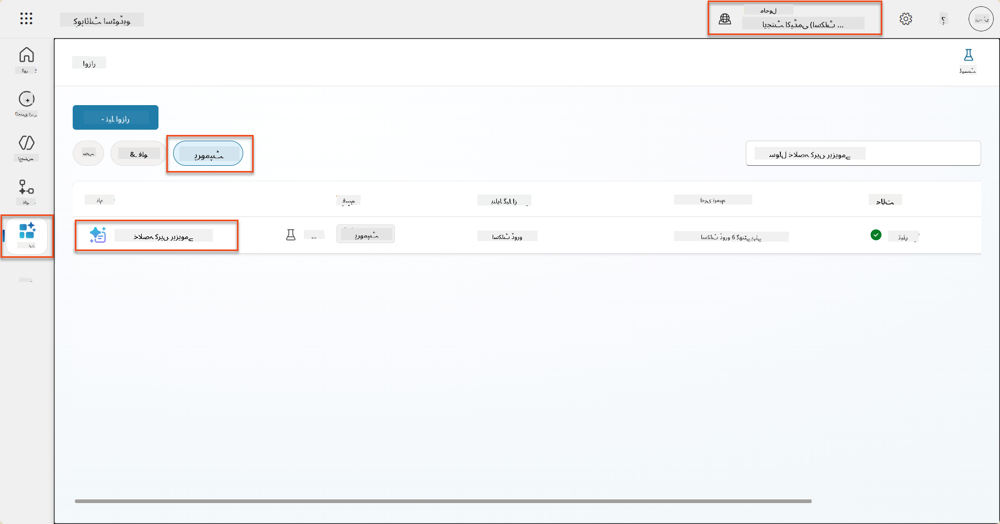

1. **ترمیم کریں** منتخب کریں تاکہ پرامپٹ میں ترمیم کریں، اور نیچے دیے گئے بہتر ورژن کے ساتھ تبدیل کریں:

    !!! اہم
        یقینی بنائیں کہ ریزیومے اور کور لیٹر پیرامیٹرز پیرامیٹرز کے طور پر برقرار رہیں۔

    ```text
    You are tasked with extracting key candidate information from a resume and cover letter to facilitate matching with open job roles and creating a summary for application review.
    
    ### Instructions:
    1. **Extract Candidate Details:**
       - Identify and extract the candidate's full name.
       - Extract contact information, specifically the email address.
    
    2. **Analyze Resume and Cover Letter:**
       - Review the resume content to identify relevant skills, experience, and qualifications.
       - Review the cover letter to understand the candidate's motivation and suitability for the roles.
    
    3. **Match Against Open Job Roles:**
       - Compare the extracted candidate information with the requirements and descriptions of the provided open job roles.
       - Use the job descriptions to assess potential fit.
       - Identify all roles that align with the candidate's cover letter and profile. You don't need to assess perfect suitability.
       - Provide reasoning for each match based on the specific job requirements.
    
    4. **Create Candidate Summary:**
       - Summarize the candidate's profile as multiline text with the following sections:
          - Candidate name
          - Role(s) applied for if present
          - Contact and location
          - One-paragraph summary
          - Top skills (8–10)
          - Experience snapshot (last 2–3 roles with outcomes)
          - Key projects (1–3 with metrics)
          - Education and certifications
          - Availability and work authorization
    
    ### Output Format
    
    Provide the output in valid JSON format with the following structure:
    
    {
      "CandidateName": "string",
      "Email": "string",
      "MatchedRoles": [
        {
          "JobRoleNumber": "ppa_jobrolenumber from grounded data",
          "RoleName": "ppa_jobtitle from grounded data",
          "Reasoning": "Detailed explanation based on job requirements"
        }
      ],
      "Summary": "string"
    }
    
    ### Guidelines
    
    - Extract information only from the provided resume and cover letter documents.
    - Ensure accuracy in identifying contact details.
    - Use the available job role data for matching decisions.
    - The summary should be concise but informative, suitable for quick application review.
    - If no suitable matches are found, indicate an empty list for MatchedRoles and explain briefly in the summary.
    
    ### Input Data
    Open Job Roles (ppa_jobrolenumber, ppa_jobtitle): /Job Role 
    Resume: {Resume}
    Cover Letter: {CoverLetter}
    ```

1. پرامپٹ ایڈیٹر میں، `/Job Role` کو تبدیل کریں **+ مواد شامل کریں** منتخب کرکے، **ڈیٹاورس** → **جاب رول** منتخب کریں اور درج ذیل کالمز منتخب کریں، اور پھر **شامل کریں** منتخب کریں:

    1. **جاب رول نمبر**

    1. **جاب ٹائٹل**

    1. **تفصیل**

    !!! ٹپ
        آپ ٹیبل کا نام ٹائپ کرکے تلاش کر سکتے ہیں۔

1. **جاب رول** ڈائیلاگ میں، **فلٹر** ایٹریبیوٹ منتخب کریں، **اسٹیٹس** منتخب کریں، اور پھر **فعال** کو **فلٹر** ویلیو کے طور پر ٹائپ کریں۔  
    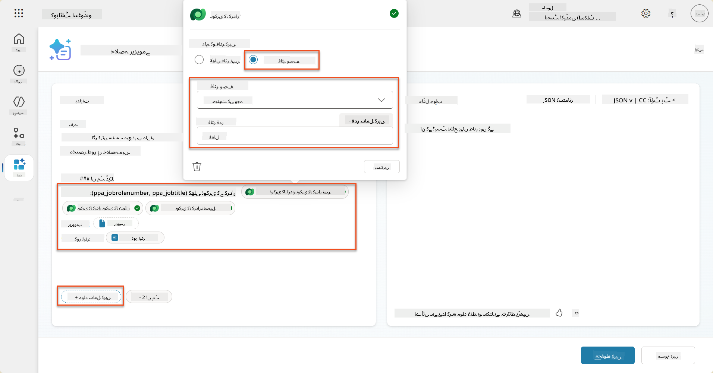

    !!! ٹپ
        آپ یہاں **ویلیو شامل کریں** استعمال کر سکتے ہیں تاکہ ان پٹ پیرامیٹر بھی شامل کریں - مثال کے طور پر اگر آپ کے پاس موجودہ ریکارڈ کا خلاصہ کرنے کے لیے پرامپٹ ہو، تو آپ فلٹر کرنے کے لیے ریزیومے نمبر پیرامیٹر فراہم کر سکتے ہیں۔

1. اگلا، آپ متعلقہ ڈیٹاورس ٹیبل **ایویلیوایشن معیار** شامل کریں گے، دوبارہ **+ مواد شامل کریں** منتخب کرکے، **جاب رولز** تلاش کریں، اور جاب رولز پر کالمز منتخب کرنے کے بجائے، **جاب رول (ایویلیوایشن معیار)** کو بڑھائیں اور درج ذیل کالمز منتخب کریں، اور پھر **شامل کریں** منتخب کریں:

    1. **معیار کا نام**

    1. **تفصیل**  
        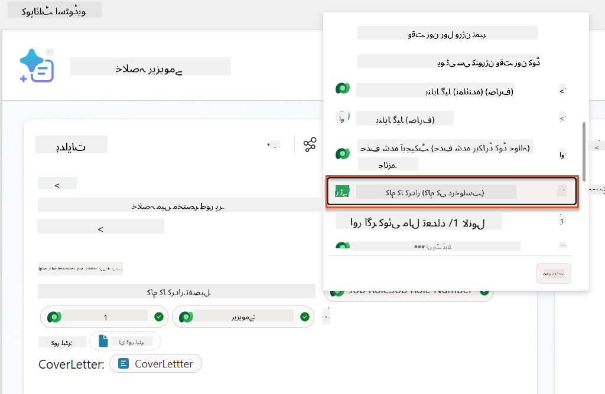

        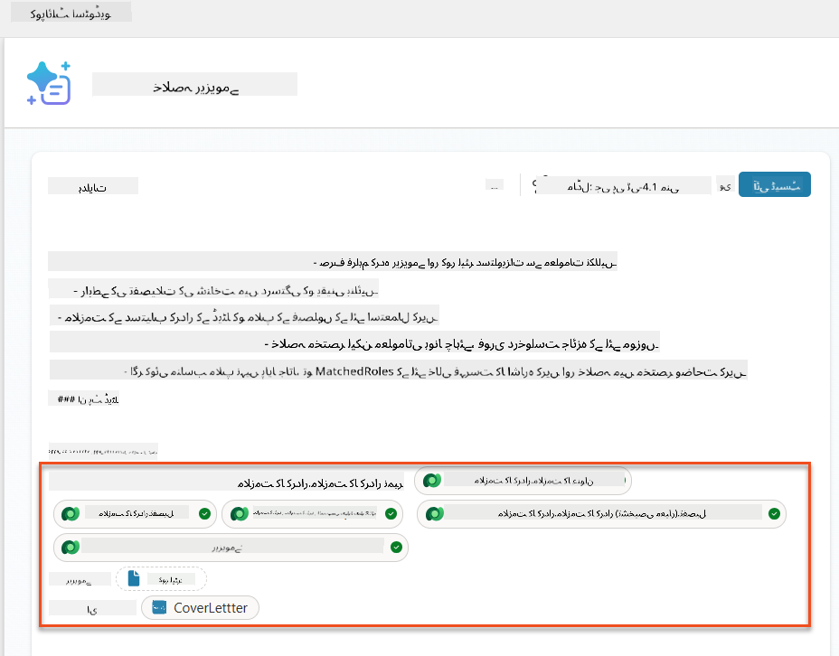

    !!! ٹپ
        یہ ضروری ہے کہ متعلقہ ایویلیوایشن معیار کو پہلے جاب رول منتخب کرکے، اور پھر مینو میں جاب رول (ایویلیوایشن معیار) پر نیویگیٹ کرکے منتخب کریں۔ یہ یقینی بنائے گا کہ صرف جاب رول کے متعلقہ ریکارڈز لوڈ ہوں گے۔

1. **سیٹنگز** منتخب کریں، اور **ریکارڈ بازیافت** کو 1000 پر ایڈجسٹ کریں - یہ زیادہ سے زیادہ جاب رولز اور ایویلیوایشن معیار کو آپ کے پرامپٹ میں شامل کرنے کی اجازت دے گا۔  
    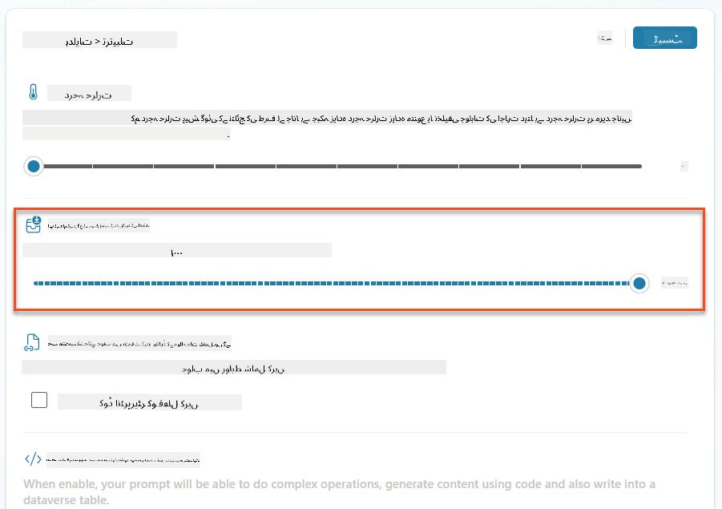

### 8.3 بہتر پرامپٹ کی جانچ کریں

1. **ریزیومے** پیرامیٹر منتخب کریں، اور مشن 07 میں استعمال کیا گیا نمونہ ریزیومے اپ لوڈ کریں۔
1. **ٹیسٹ** منتخب کریں۔
1. ایک بار جب ٹیسٹ چل جائے، نوٹ کریں کہ JSON آؤٹپٹ اب **Matched Roles** شامل کرتا ہے۔
1. **استعمال شدہ علم** ٹیب منتخب کریں، تاکہ ڈیٹاورس ڈیٹا دیکھ سکیں جو پرامپٹ کے ساتھ عملدرآمد سے پہلے ضم ہوا۔
1. **اپنے اپ ڈیٹ شدہ پرامپٹ کو محفوظ کریں۔** سسٹم اب خود بخود اس ڈیٹاورس ڈیٹا کو آپ کے پرامپٹ کے ساتھ شامل کرے گا جب موجودہ Summarize Resume ایجنٹ فلو اسے کال کرے گا۔  
    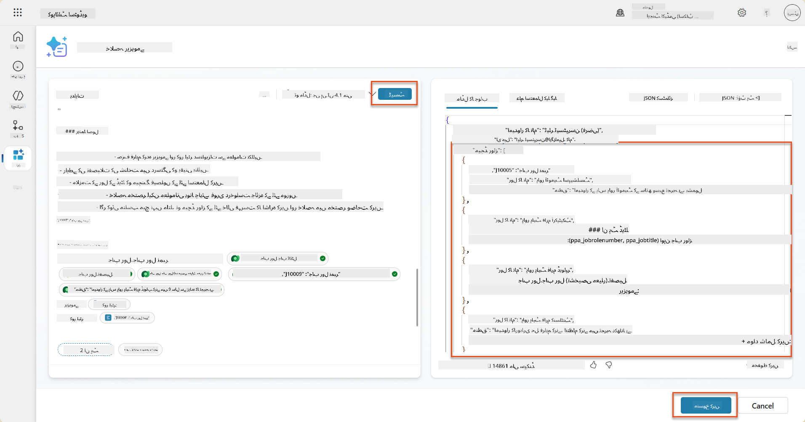

### 8.4 جاب اپلیکیشن ایجنٹ فلو شامل کریں

ہمارے اپلیکیشن انٹیک ایجنٹ کو امیدوار کے دلچسپی والے تجویز کردہ رولز کی بنیاد پر جاب رولز بنانے کی اجازت دینے کے لیے، ہمیں ایک ایجنٹ فلو بنانا ہوگا۔ ایجنٹ ہر تجویز کردہ جاب رول کے لیے اس ٹول کو کال کرے گا جس میں امیدوار دلچسپی رکھتا ہے۔

!!! ٹپ "ایجنٹ فلو ایکسپریشنز"
    یہ بہت اہم ہے کہ آپ اپنے نوڈز کے نام دینے اور ایکسپریشنز داخل کرنے کے لیے ہدایات کو بالکل فالو کریں کیونکہ ایکسپریشنز پچھلے نوڈز کا حوالہ ان کے نام کا استعمال کرتے ہوئے دیتے ہیں! [ایجنٹ فلو مشن میں ریکروٹ](../../recruit/09-add-an-agent-flow/README.md#you-mentioned-expressions-what-are-expressions) کا حوالہ دیں تاکہ ایکسپریشنز کے بارے میں جلدی سے دوبارہ معلومات حاصل کریں!

1. **ہائرنگ ایجنٹ** کے اندر، **ایجنٹس** ٹیب منتخب کریں، اور **اپلیکیشن انٹیک ایجنٹ** چائلڈ ایجنٹ کو کھولیں۔

1. **ٹولز** پینل کے اندر، **+ شامل کریں** → **+ نیا ٹول** → **ایجنٹ فلو** منتخب کریں۔

1. **جب ایجنٹ فلو کو کال کرے** نوڈ منتخب کریں، **+ ان پٹ شامل کریں** استعمال کریں تاکہ درج ذیل پیرامیٹر شامل کریں:

    | قسم | نام            | وضاحت                                                  |
    | ---- | --------------- | ------------------------------------------------------------ |
    | ٹیکسٹ | `ResumeNumber`  | یقینی بنائیں کہ صرف [ResumeNumber] استعمال کریں - یہ لازمی ہے کہ حرف R سے شروع ہو |
    | ٹیکسٹ | `JobRoleNumber` | یقینی بنائیں کہ صرف [JobRoleNumber] استعمال کریں - یہ لازمی ہے کہ حرف J سے شروع ہو |

    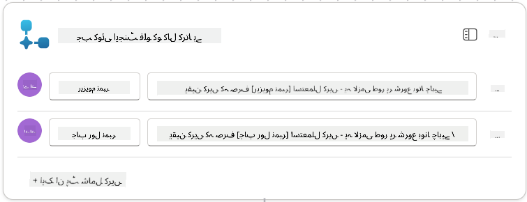

1. پہلے نوڈ کے نیچے **+** ایکشن آئیکن داخل کریں، **ڈیٹاورس** تلاش کریں، **مزید دیکھیں** منتخب کریں، اور پھر **لسٹ راؤز** ایکشن کو تلاش کریں۔

1. **نوڈ کا نام تبدیل کریں** `Get Resume`، اور پھر درج ذیل پیرامیٹرز سیٹ کریں:

    | پراپرٹی        | کیسے سیٹ کریں                      | ویلیو                                                        |
    | --------------- | ------------------------------- | ------------------------------------------------------------ |
    | **ٹیبل کا نام**  | منتخب کریں                          | Resumes                                                      |
    | **فلٹر راؤز** | ڈائنامک ڈیٹا (تھنڈر بولٹ آئیکن) | `ppa_resumenumber eq 'ResumeNumber'` منتخب کریں اور **ResumeNumber** کو **جب ایجنٹ فلو کو کال کرے** → **ResumeNumber** سے تبدیل کریں |
    | **راؤز کی تعداد**   | درج کریں                           | 1                                                            |

    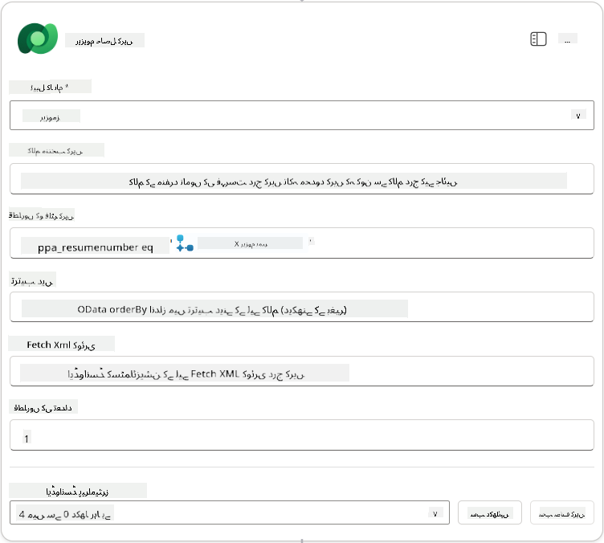

1. اب، **Get Resume** کے نیچے **+** ایکشن آئیکن داخل کریں، **ڈیٹاورس** تلاش کریں، **مزید دیکھیں** منتخب کریں، اور پھر **لسٹ راؤز** ایکشن کو تلاش کریں۔

1. **نوڈ کا نام تبدیل کریں** `Get Job Role`، اور پھر درج ذیل پیرامیٹرز سیٹ کریں:

    | پراپرٹی        | کیسے سیٹ کریں                      | ویلیو                                                        |
    | --------------- | ------------------------------- | ------------------------------------------------------------ |
    | **ٹیبل کا نام**  | منتخب کریں                          | Job Roles                                                    |
    | **فلٹر راؤز** | ڈائنامک ڈیٹا (تھنڈر بولٹ آئیکن) | `ppa_jobrolenumber eq 'JobRoleNumber'` منتخب کریں اور **JobRoleNumber** کو **جب ایجنٹ فلو کو کال کرے** → **JobRoleNumber** سے تبدیل کریں |
    | **راؤز کی تعداد**   | درج کریں                           | 1                                                            |

    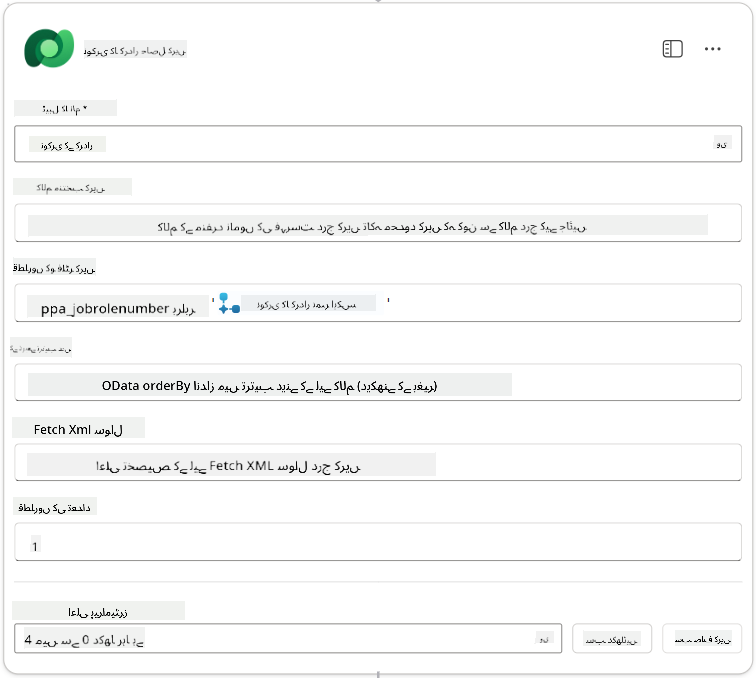

1. اب، Get Job Role کے نیچے **+** ایکشن آئیک
| **نوکری کا کردار (نوکری کے کردار)**               | اظہار (fx آئیکن) | `concat('ppa_jobroles/',first(outputs('Get_Job_Role')?['body/value'])?['ppa_jobroleid'])` |
| **ریزیومے (ریزیومے)**                   | اظہار (fx آئیکن) | `concat('ppa_resumes/', first(outputs('Get_Resume')?['body/value'])?['ppa_resumeid'])` |
| **درخواست کی تاریخ** (استعمال کریں **سب دکھائیں**) | اظہار (fx آئیکن) | `utcNow()`                                                   |

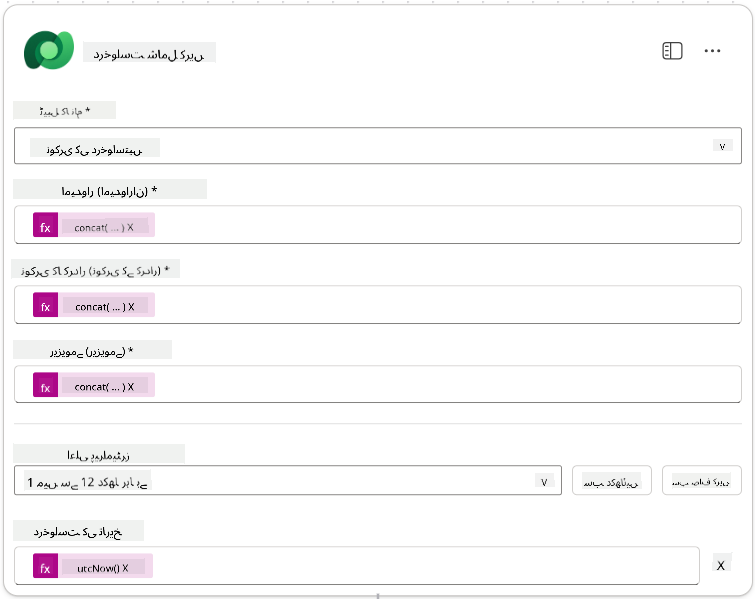

1. **ایجنٹ کے جواب دینے والے نوڈ** کو منتخب کریں، اور پھر **+ آؤٹ پٹ شامل کریں** منتخب کریں۔

     | پراپرٹی        | سیٹ کرنے کا طریقہ                      | تفصیلات                                         |
     | --------------- | ------------------------------- | ----------------------------------------------- |
     | **قسم**        | منتخب کریں                          | `Text`                                          |
     | **نام**        | درج کریں                           | `ApplicationNumber`                             |
     | **قدر**       | متحرک ڈیٹا (تھنڈر بولٹ آئیکن) | *درخواست شامل کریں → مزید دیکھیں → درخواست نمبر* |
     | **تفصیل** | درج کریں                           | `نوکری کی درخواست کے [ApplicationNumber] جو بنائی گئی ہے`      |

     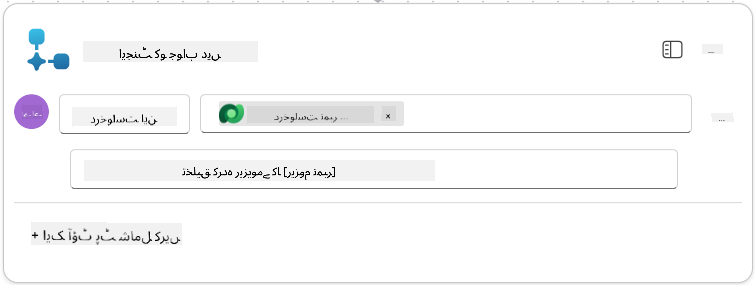

1. اوپر دائیں جانب **مسودہ محفوظ کریں** منتخب کریں۔

1. **جائزہ** ٹیب منتخب کریں، **تفصیلات** پینل پر **ترمیم کریں** منتخب کریں۔

      - **فلو کا نام**:`Create Job Application`
      - **تفصیل**:`ایک نئی نوکری کی درخواست بناتا ہے جب [ResumeNumber] اور [JobRoleNumber] دیے جائیں`
      - **محفوظ کریں**

1. دوبارہ **ڈیزائنر** ٹیب منتخب کریں، اور **شائع کریں** منتخب کریں۔

### 8.5 ایجنٹ میں نوکری کی درخواست بنانا شامل کریں

اب آپ شائع شدہ فلو کو اپنی درخواست انٹیک ایجنٹ سے جوڑیں گے۔

1. واپس **ہائرنگ ایجنٹ** پر جائیں اور **ایجنٹس** ٹیب منتخب کریں۔ **درخواست انٹیک ایجنٹ** کھولیں، اور پھر **ٹولز** پینل تلاش کریں۔

1. **+ شامل کریں** منتخب کریں۔

1. **فلو** فلٹر منتخب کریں، اور `Create Job Application` تلاش کریں۔ **Create Job Application** فلو منتخب کریں، اور پھر **شامل کریں اور ترتیب دیں**۔

1. درج ذیل پیرامیٹرز سیٹ کریں:

    | پیرامیٹر                                           | قدر                                                        |
    | --------------------------------------------------- | ------------------------------------------------------------ |
    | **تفصیل**                                     | `ایک نئی نوکری کی درخواست بناتا ہے جب [ResumeNumber] اور [JobRoleNumber] دیے جائیں` |
    | **اضافی تفصیلات → یہ ٹول کب استعمال کیا جا سکتا ہے** | `صرف جب موضوعات یا ایجنٹس کے ذریعہ حوالہ دیا جائے`                   |

1. **محفوظ کریں** منتخب کریں  
    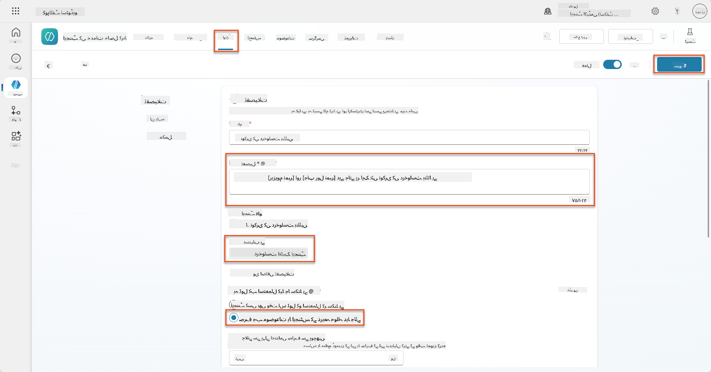

### 8.6 ایجنٹ کی ہدایات کی وضاحت کریں

نوکری کی درخواستیں بنانے کے لیے، آپ کو ایجنٹ کو بتانا ہوگا کہ نئے ٹول کو کب استعمال کرنا ہے۔ اس صورت میں، آپ صارف سے پوچھیں گے کہ کون سے تجویز کردہ نوکری کے کرداروں پر درخواست دینی ہے، اور ایجنٹ کو ہر کردار کے لیے ٹول چلانے کی ہدایت دیں گے۔

1. **درخواست انٹیک ایجنٹ** میں واپس جائیں، اور پھر **ہدایات** پینل تلاش کریں۔

1. **ہدایات** فیلڈ میں، **موجودہ ہدایات کے آخر میں** اپنے بچے ایجنٹ کے لیے درج ذیل واضح رہنمائی شامل کریں:

    ```text
    3. Post Resume Upload
       - Respond with a formatted bullet list of [SuggestedJobRoles] the candidate could apply for.  
       - Use the format: [JobRoleNumber] - [RoleDescription]
       - Ask the user to confirm which Job Roles to create applications for the candidate.
       - When the user has confirmed a set of [JobRoleNumber]s, move to the next step.
    
    4. Post Upload - Application Creation
        - After the user confirms which [SuggestedJobRoles] for a specific [ResumeNumber]:
        E.g. "Apply [ResumeNumber] for the Job Roles [JobRoleNumber], [JobRoleNumber], [JobRoleNumber]
        E.g. "apply to all suggested job roles" - this implies use all the [JobRoleNumbers] 
         - Loop over each [JobRoleNumber] and send with [ResumeNumber] to /Create Job Application   
         - Summarize the Job Applications Created
    
    Strict Rules (that must never be broken)
    You must always follow these rules and never break them:
    1. The only valid identifiers are:
      - ResumeNumber (ppa_resumenumber)→ format R#####
      - CandidateNumber (ppa_candidatenumber)→ format C#####
      - ApplicationNumber (ppa_applicationnumber)→ format A#####
      - JobRoleNumber (ppa_jobrolenumber)→ format J#####
    2. Never guess or invent these values.
    3. Always extract identifiers from the current context (conversation, data, or system output). 
    ```

1. جہاں ہدایات میں فارورڈ سلیش (/) شامل ہو، / کے بعد کے متن کو منتخب کریں اور **Create Job Application** ٹول منتخب کریں۔

1. **محفوظ کریں** منتخب کریں  
    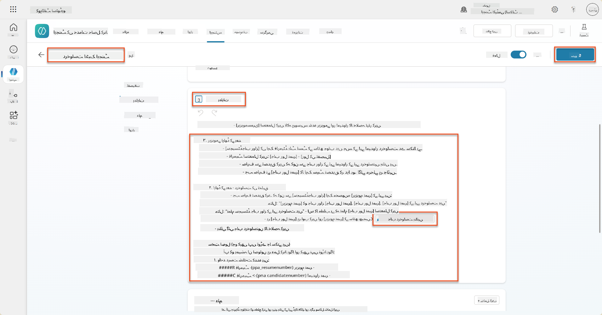

!!! tip "جنریٹو آرکسٹریشن میں متعدد آئٹمز پر تکرار کرنا"
    یہ ہدایات جنریٹو آرکسٹریشن کی صلاحیت کو استعمال کرتی ہیں جو متعدد قطاروں پر تکرار کرتی ہیں جب یہ فیصلہ کرتے ہیں کہ کون سے اقدامات اور ٹولز استعمال کرنے ہیں۔ میچ شدہ نوکری کے کردار خود بخود پڑھے جائیں گے اور درخواست انٹیک ایجنٹ ہر قطار کے لیے چلایا جائے گا۔ جنریٹو آرکسٹریشن کی جادوئی دنیا میں خوش آمدید!

### 8.7 اپنے ایجنٹ کی جانچ کریں

1. **Copilot Studio** میں اپنا **ہائرنگ ایجنٹ** کھولیں۔

1. چیٹ میں ایک نمونہ ریزیومے **اپ لوڈ** کریں، اور ٹائپ کریں:

    ```text
    This is a new resume for the Power Platform Developer Role.
    ```

1. دیکھیں کہ ایجنٹ تجویز کردہ نوکری کے کرداروں کی فہرست فراہم کرتا ہے - ہر ایک کے ساتھ ایک نوکری کا کردار نمبر۔  
    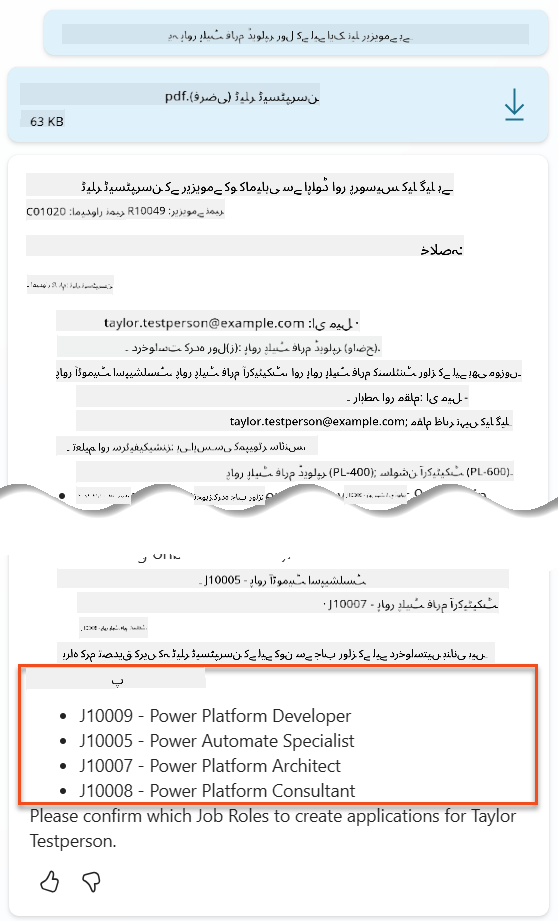

1. آپ پھر بتا سکتے ہیں کہ ان میں سے کون سا ریزیومے نوکری کی درخواست کے طور پر شامل کرنا چاہتے ہیں۔
    **مثالیں:**

    ```text
    "Apply for all of those job roles"
    "Apply for the J10009 Power Platform Developer role"
    "Apply for the Developer and Architect roles"
    ```

    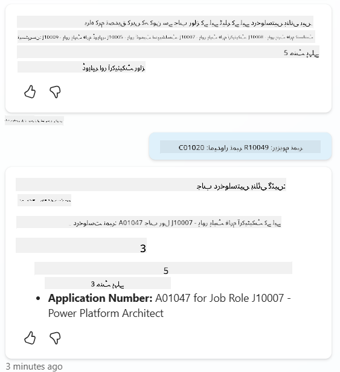

1. **Create Job Application ٹول** پھر ہر نوکری کے کردار کے لیے چلایا جائے گا جس کے لیے آپ نے درخواست بنانے کو کہا۔ ایکٹیویٹی میپ کے اندر، آپ دیکھیں گے کہ Create Job Application ٹول ہر نوکری کے کردار کے لیے چلایا گیا جس کے لیے آپ نے درخواست بنانے کو کہا:  
    

## 🎉 مشن مکمل

شاندار کام، آپریٹو! **آپریشن گراؤنڈنگ کنٹرول** اب مکمل ہو گیا ہے۔ آپ نے اپنی AI صلاحیتوں کو متحرک ڈیٹا گراؤنڈنگ کے ساتھ کامیابی سے بڑھایا ہے، ایک حقیقی ذہین ہائرنگ سسٹم بنایا ہے۔

یہ وہ ہے جو آپ نے اس مشن میں حاصل کیا:

**✅ ڈیٹاورس گراؤنڈنگ مہارت**  
اب آپ سمجھتے ہیں کہ کس طرح کسٹم پرامپٹس کو متحرک ذہانت کے لیے لائیو ڈیٹا سورسز سے جوڑنا ہے۔

**✅ ریزیومے تجزیہ میں بہتری**  
آپ کا Summarize Resume فلو اب حقیقی وقت کے نوکری کے کردار کے ڈیٹا اور تشخیصی معیار تک رسائی حاصل کرتا ہے تاکہ درست میچنگ ہو۔

**✅ ڈیٹا پر مبنی فیصلہ سازی**  
آپ کے ہائرنگ ایجنٹس اب نوکری کی ضروریات میں تبدیلی کے مطابق خود بخود ڈھل سکتے ہیں بغیر کسی دستی پرامپٹ اپ ڈیٹس کے۔

**✅ نوکری کی درخواست بنانا**  
آپ کا بہتر نظام اب نوکری کی درخواستیں بنا سکتا ہے اور مزید پیچیدہ ورک فلو آرکسٹریشن کے لیے تیار ہے۔

🚀 **اگلا:** اپنے اگلے مشن میں، آپ سیکھیں گے کہ گہرے استدلال کی صلاحیتوں کو کیسے نافذ کیا جائے جو آپ کے ایجنٹس کو پیچیدہ فیصلے کرنے اور ان کی سفارشات کے لیے تفصیلی وضاحت فراہم کرنے میں مدد دے۔

⏩ [مشن 09 پر جائیں: گہرا استدلال](../09-deep-reasoning/README.md)

## 📚 حکمت عملی وسائل

📖 [اپنے پرامپٹ میں اپنا ڈیٹا استعمال کریں](https://learn.microsoft.com/ai-builder/use-your-own-prompt-data?WT.mc_id=power-182762-scottdurow)

📖 [ایک کسٹم پرامپٹ بنائیں](https://learn.microsoft.com/ai-builder/create-a-custom-prompt?WT.mc_id=power-182762-scottdurow)

📖 [Copilot Studio میں ڈیٹاورس کے ساتھ کام کریں](https://learn.microsoft.com/microsoft-copilot-studio/knowledge-add-dataverse?WT.mc_id=power-182762-scottdurow)

📖 [AI Builder کسٹم پرامپٹس کا جائزہ](https://learn.microsoft.com/ai-builder/prompts-overview?WT.mc_id=power-182762-scottdurow)

📖 [پاور پلیٹ فارم AI Builder دستاویزات](https://learn.microsoft.com/ai-builder/?WT.mc_id=power-182762-scottdurow)

📖 [تربیت: اپنے ڈیٹاورس ڈیٹا کا استعمال کرتے ہوئے AI Builder پرامپٹس بنائیں](https://learn.microsoft.com/training/modules/ai-builder-grounded-prompts/?WT.mc_id=power-182762-scottdurow)

---

**ڈسکلیمر**:  
یہ دستاویز AI ترجمہ سروس [Co-op Translator](https://github.com/Azure/co-op-translator) کا استعمال کرتے ہوئے ترجمہ کی گئی ہے۔ ہم درستگی کے لیے کوشش کرتے ہیں، لیکن براہ کرم آگاہ رہیں کہ خودکار ترجمے میں غلطیاں یا غیر درستیاں ہو سکتی ہیں۔ اصل دستاویز کو اس کی اصل زبان میں مستند ذریعہ سمجھا جانا چاہیے۔ اہم معلومات کے لیے، پیشہ ور انسانی ترجمہ کی سفارش کی جاتی ہے۔ ہم اس ترجمے کے استعمال سے پیدا ہونے والی کسی بھی غلط فہمی یا غلط تشریح کے ذمہ دار نہیں ہیں۔