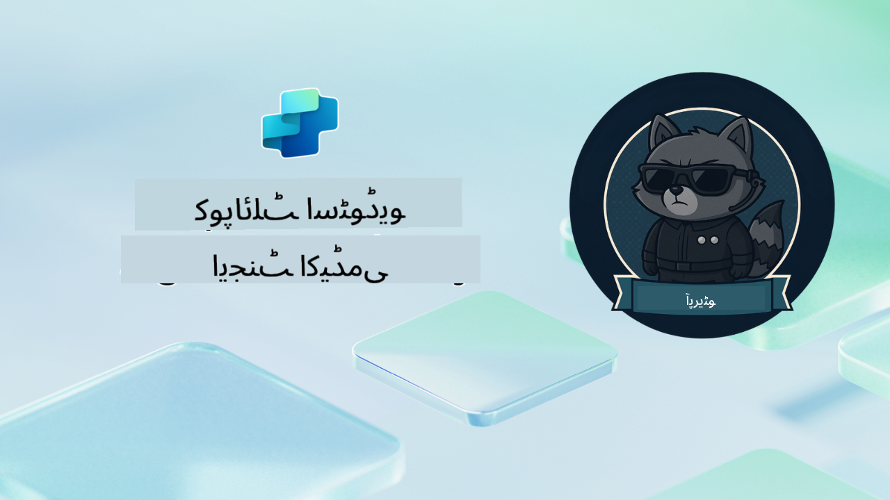

<!--
CO_OP_TRANSLATOR_METADATA:
{
  "original_hash": "24fcbe9a57d3439e05f8866e550c0a84",
  "translation_date": "2025-10-22T18:47:44+00:00",
  "source_file": "docs/operative-preview/README.md",
  "language_code": "ur"
}
-->
# خوش آمدید، آپریٹو

**خوش آمدید، آپریٹو۔**  
آپ کا جدید مشن—اگر آپ اسے قبول کرنے کا انتخاب کرتے ہیں—یہ ہے کہ **Microsoft Copilot Studio** کا استعمال کرتے ہوئے **انٹرپرائز گریڈ ملٹی ایجنٹ سسٹمز** بنانے کے فن میں مہارت حاصل کریں۔

یہ جامع تربیت آپ کو بنیادی ایجنٹ تخلیق سے آگے لے جاتی ہے اور آپ کو **ملٹی ایجنٹ آرکسٹریشن** کی پیچیدہ دنیا میں لے جاتی ہے: ہائرنگ آٹومیشن سے لے کر AI سیفٹی تک، آپ حقیقی دنیا کے انٹرپرائز منظرناموں کا استعمال کرتے ہوئے ذہین ایجنٹ ایکو سسٹمز بنانے، ان کا ہم آہنگی کرنے اور تعینات کرنے کا طریقہ سیکھیں گے۔

--8<-- "disclaimer.md"

---

## 🎯 مشن کا مقصد

ایجنٹ اکیڈمی آپریٹو پروگرام مکمل کرنے کے بعد، آپ قابل ہوں گے:

- پیچیدہ کاروباری منظرناموں کے لیے **ملٹی ایجنٹ سسٹمز** ڈیزائن اور نافذ کریں
- **ایجنٹ آرکسٹریشن** اور تعاون کے نمونوں میں مہارت حاصل کریں
- پروڈکشن سسٹمز میں **AI سیفٹی اور مواد کی نگرانی** نافذ کریں
- دستاویزات کی پروسیسنگ اور تجزیہ کے لیے **ملٹی موڈل پرامپٹس** بنائیں
- مناسب گورننس اور ٹیسٹنگ کے ساتھ **انٹرپرائز ریڈی ایجنٹس** تعینات کریں

---

## 🧪 ضروریات

تمام مشنز مکمل کرنے کے لیے آپ کو ضرورت ہوگی:

- **ایجنٹ اکیڈمی ریکروٹ** تربیت مکمل کی ہو
- **Copilot Studio** لائسنس کے ساتھ Microsoft Power Platform ماحول
- **Microsoft Dataverse** تک رسائی
- حل اور ایجنٹس بنانے کے لیے انتظامی اجازتیں

---

## 🧬 یہ کس کے لیے ہے

یہ اعلیٰ درجے کا کورس ان لوگوں کے لیے مثالی ہے:

- **سلوشن آرکیٹیکٹس** جو انٹرپرائز AI سسٹمز ڈیزائن کر رہے ہیں
- **ڈیولپرز** جو پروڈکشن ریڈی ایجنٹ سلوشنز بنا رہے ہیں
- **آئی ٹی پروفیشنلز** جو AI گورننس اور سیفٹی نافذ کر رہے ہیں
- **بزنس اینالسٹس** جو پیچیدہ آٹومیشن ورک فلو بنا رہے ہیں
- وہ کوئی بھی جو بنیادی ایجنٹس سے انٹرپرائز سسٹمز تک **لیول اپ** کرنے کے لیے تیار ہے

---

## 🧭 نصاب کا جائزہ

یہ اکیڈمی ایک ترقی پسند سلسلے کے طور پر ترتیب دی گئی ہے، ہر مشن پچھلے مشن پر مبنی ہوتا ہے تاکہ ایک جامع ہائرنگ آٹومیشن سسٹم بنایا جا سکے۔

| مشن | عنوان | آپریشن بریفنگ |
|---------|-------|-------------------|
| `01` | 🚨 [ہائرنگ ایجنٹ کے ساتھ شروعات کریں](./01-get-started/README.md) | بنیادی انفراسٹرکچر تعینات کریں اور اپنا مرکزی آرکسٹریٹر ایجنٹ بنائیں |
| `02` | 🎭 [اپنے ایجنٹ کو ملٹی ایجنٹ کے لیے تیار کریں، کنیکٹڈ ایجنٹس کے ساتھ](./02-multi-agent/README.md) | سنگل ایجنٹ کو مربوط ملٹی ایجنٹ سسٹم میں تبدیل کریں |
| `03` | ⚡ [اپنے ایجنٹ کو ٹرگرز کے ساتھ خودکار بنائیں](./03-automate-triggers/README.md) | ایونٹ ڈرائیون ٹرگرز کے ساتھ خود مختار ایجنٹ کے رویے نافذ کریں |
| `04` | 📝 [ایجنٹ انسٹرکشنز لکھنا](./04-agent-instructions/README.md) | ایجنٹ کی درست مواصلات اور رویے کے کنٹرول میں مہارت حاصل کریں |
| `05` | 💬 [ایجنٹ کے جوابات کو ذاتی بنانا](./05-agent-responses/README.md) | زیادہ سے زیادہ اثر اور مشغولیت کے لیے ایجنٹ کے جوابات کو حسب ضرورت بنائیں |
| `06` | 🛡️ [مواد کی نگرانی اور AI سیفٹی کے بنیادی اصول](./06-ai-safety/README.md) | انٹرپرائز گریڈ سیفٹی اور تعمیل کے اقدامات نافذ کریں |
| `07` | 🎨 [ملٹی موڈل پرامپٹس کے ساتھ ریزیومے کے مواد نکالنا](./07-multimodal-prompts/README.md) | دستاویزات اور تصاویر کو جدید AI صلاحیتوں کے ساتھ پروسیس کریں |
| `08` | 🗄️ [پرامپٹس - ڈیٹاورس گراؤنڈنگ](./08-dataverse-grounding/README.md) | درست جوابات کے لیے ایجنٹس کو انٹرپرائز ڈیٹا میں گراؤنڈ کریں |
| `09` | 🧠 [امیدوار کی موزونیت کا جائزہ لینے اور انٹرویو کی تیاری کے لیے گہری استدلال کا اطلاق](./09-deep-reasoning/README.md) | پیچیدہ فیصلوں کے لیے نفیس AI استدلال نافذ کریں |
| `10` | 📄 [پرامپٹس کے ساتھ امیدوار کے مخصوص انٹرویو دستاویزات تیار کریں](./10-generate-documents/README.md) | ایجنٹ کے تجزیے کی بنیاد پر متحرک دستاویزات بنائیں |
| `11` | 📊 [ایڈاپٹیو کارڈز کے ساتھ صارف کی رائے حاصل کریں](./11-obtain-user-feedback/README.md) | مسلسل بہتری کے لیے صارف کی رائے جمع کریں اور پروسیس کریں |
| `12` | 🌐 [اپنے ایجنٹس کو اسٹیک ہولڈر ٹیسٹنگ کے لیے ڈیمو ویب سائٹ پر شائع کریں](./12-demo-website/README.md) | اسٹیک ہولڈر مظاہرے اور ٹیسٹنگ کے لیے مکمل حل تعینات کریں |

!!! note
    ✅ اس نصاب کو مکمل کرنے سے آپ کو **آپریٹو** بیج حاصل ہوگا۔  
    🔓 **کمانڈر** مستقبل کے مراحل میں ان لاک ہوگا۔

<!-- markdownlint-disable-next-line MD033 -->

---

**ڈسکلیمر**:  
یہ دستاویز AI ترجمہ سروس [Co-op Translator](https://github.com/Azure/co-op-translator) کا استعمال کرتے ہوئے ترجمہ کی گئی ہے۔ ہم درستگی کے لیے کوشش کرتے ہیں، لیکن براہ کرم آگاہ رہیں کہ خودکار ترجمے میں غلطیاں یا غیر درستیاں ہو سکتی ہیں۔ اصل دستاویز کو اس کی اصل زبان میں مستند ذریعہ سمجھا جانا چاہیے۔ اہم معلومات کے لیے، پیشہ ور انسانی ترجمہ کی سفارش کی جاتی ہے۔ ہم اس ترجمے کے استعمال سے پیدا ہونے والی کسی بھی غلط فہمی یا غلط تشریح کے ذمہ دار نہیں ہیں۔