<!--
CO_OP_TRANSLATOR_METADATA:
{
  "original_hash": "d9cd8cd1a4fbd8915171a2ed972cc322",
  "translation_date": "2025-10-22T19:58:00+00:00",
  "source_file": "docs/recruit/00-course-setup/README.md",
  "language_code": "ur"
}
-->
# 🚨 مشن 00: کورس سیٹ اپ

## 🕵️‍♂️ کوڈ نام: `آپریشن ڈیپلائمنٹ ریڈی`

> **⏱️ آپریشن کا وقت:** `~30 منٹ`  

## 🎯 مشن کا خلاصہ

آپ کوپائلٹ اسٹوڈیو ایجنٹ کی تربیت کے پہلے مشن میں خوش آمدید کہتے ہیں۔  
اپنا پہلا AI ایجنٹ بنانے سے پہلے، آپ کو اپنا **فیلڈ ریڈی ڈیولپمنٹ ماحول** قائم کرنا ہوگا۔

یہ بریفنگ ان سسٹمز، رسائی کی تفصیلات، اور سیٹ اپ کے مراحل کو بیان کرتی ہے جو Microsoft 365 ایکو سسٹم میں کامیابی سے کام کرنے کے لیے ضروری ہیں۔

## 🔎 مقاصد

آپ کے مشن میں شامل ہیں:

1. Microsoft 365 اکاؤنٹ حاصل کرنا  
1. Microsoft Copilot Studio تک رسائی حاصل کرنا  
1. (اختیاری) Microsoft 365 Copilot لائسنس حاصل کرنا پروڈکشن پبلشنگ کے لیے  
1. ایک ڈیولپر ماحول بنانا جو آپ کے Copilot Studio کے ماحول کے طور پر کام کرے  
1. ایک SharePoint سائٹ بنانا جو بعد کے مشنز میں آپ کے ڈیٹا سورس کے طور پر کام کرے

---

## 🔍 ضروریات

شروع کرنے سے پہلے، یقینی بنائیں کہ آپ کے پاس:

1. ایک **کام یا اسکول کا ای میل ایڈریس** (ذاتی @outlook.com، @gmail.com وغیرہ، سپورٹ نہیں کیے جاتے)۔
1. انٹرنیٹ تک رسائی اور ایک جدید براؤزر (Edge، Chrome، یا Firefox تجویز کردہ)۔  
1. Microsoft 365 کی بنیادی واقفیت (مثال کے طور پر، Office ایپس یا Teams میں سائن ان کرنا)۔  
1. (اختیاری) ایک کریڈٹ کارڈ یا بلنگ کا طریقہ اگر آپ نے ادا شدہ لائسنس خریدنے کا منصوبہ بنایا ہے۔

---

## مرحلہ 1: Microsoft 365 اکاؤنٹ حاصل کریں

Copilot Studio Microsoft 365 کے اندر موجود ہے، لہذا آپ کو اس تک رسائی کے لیے Microsoft 365 اکاؤنٹ کی ضرورت ہوگی۔ آپ موجودہ اکاؤنٹ استعمال کر سکتے ہیں یا مناسب لائسنس حاصل کرنے کے لیے درج ذیل مراحل پر عمل کریں:

1. **Microsoft 365 بزنس سبسکرپشن حاصل کریں**  
   1. [Microsoft 365 بزنس پلانز اور قیمتوں کے صفحے](https://www.microsoft.com/microsoft-365/business/microsoft-365-plans-and-pricing) پر جائیں  
   1. شروع کرنے کے لیے سب سے سستا آپشن Microsoft 365 بزنس بیسک پلان ہے۔ `Try for free` منتخب کریں اور سبسکرپشن، اکاؤنٹ کی تفصیلات، اور ادائیگی کی معلومات بھرنے کے لیے گائیڈڈ فارم پر عمل کریں۔
   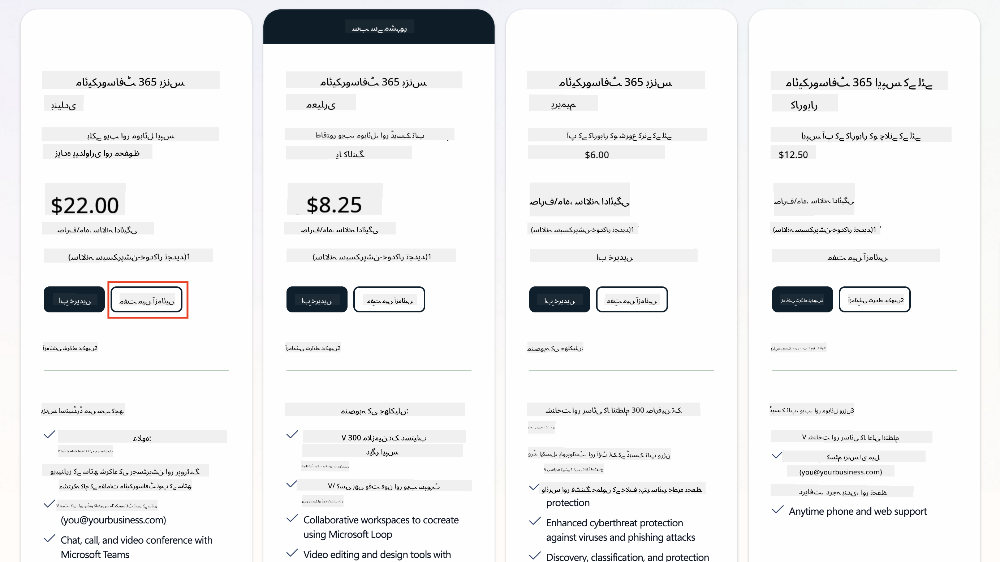
   1. ایک بار جب آپ کے پاس نیا اکاؤنٹ ہو، لاگ ان کریں۔

    !!! Tip
        اگر آپ Microsoft 365 Copilot Chat میں ایجنٹس پبلش کرنے یا تنظیمی ڈیٹا (SharePoint، OneDrive، Dataverse) سے جڑنے کا منصوبہ بنا رہے ہیں، تو Microsoft 365 Copilot لائسنس کی ضرورت ہوگی۔ یہ ایک ایڈ آن لائسنس ہے جس کے بارے میں آپ مزید معلومات [لائسنسنگ سائٹ](https://www.microsoft.com/microsoft-365/copilot#plans) پر حاصل کر سکتے ہیں۔

---

## مرحلہ 2: Copilot Studio ٹرائل شروع کریں

ایک بار جب آپ کے پاس Microsoft 365 Tenant ہو، تو آپ کو Copilot Studio تک رسائی حاصل کرنی ہوگی۔ آپ درج ذیل مراحل پر عمل کرکے 30 دن کا مفت ٹرائل حاصل کر سکتے ہیں:

1. [aka.ms/TryCopilotStudio](https://aka.ms/TryCopilotStudio) پر جائیں۔  
1. نئے اکاؤنٹ کے ای میل ایڈریس درج کریں جو آپ نے پچھلے مرحلے میں ترتیب دیا تھا اور `Next` منتخب کریں۔  
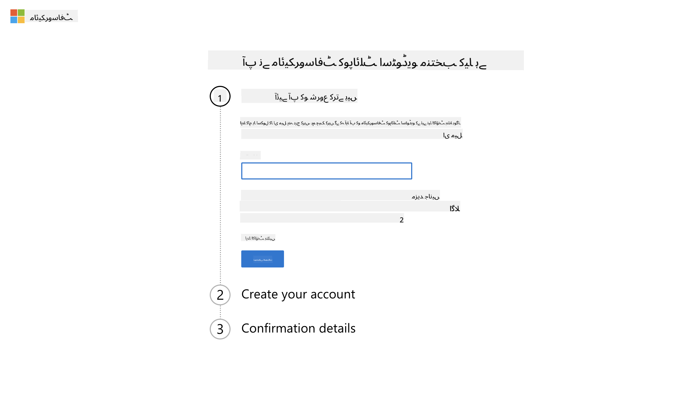
1. یہ آپ کے اکاؤنٹ کو پہچان لے گا۔ `Sign In` منتخب کریں۔
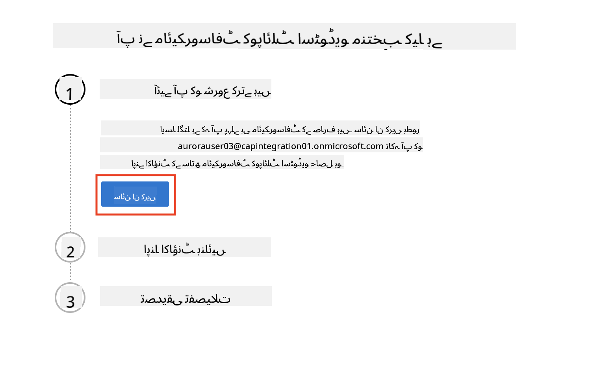  
1. `Start Free Trial` منتخب کریں۔
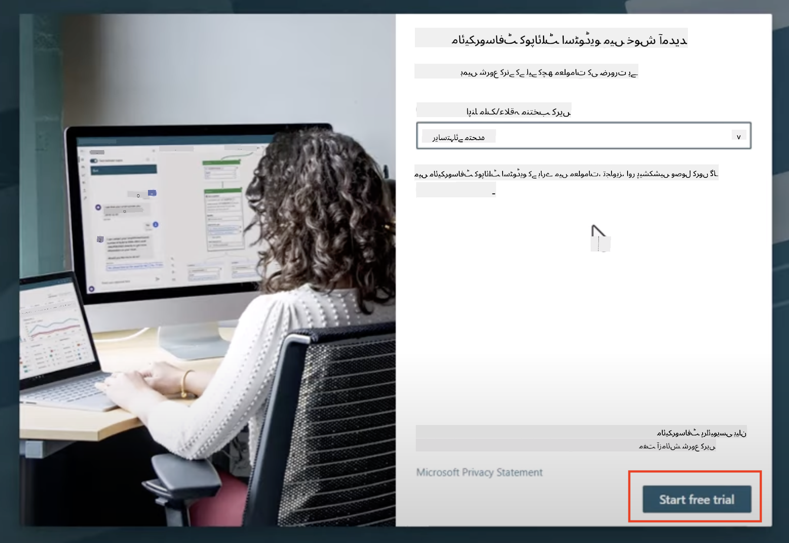

!!! info "ٹرائل نوٹس"  
     1. مفت ٹرائل **مکمل Copilot Studio صلاحیتیں** فراہم کرتا ہے۔  
     1. آپ کو اپنے ٹرائل کی میعاد ختم ہونے کے بارے میں ای میل نوٹیفیکیشنز موصول ہوں گے۔ آپ 30 دن کے اضافے میں ٹرائل کو بڑھا سکتے ہیں (ایجنٹ رن ٹائم کے 90 دن تک)۔  
     1. اگر آپ کے ٹیننٹ ایڈمنسٹریٹر نے سیلف سروس سائن اپ کو غیر فعال کر دیا ہے، تو آپ کو ایک ایرر نظر آئے گا—اپنے Microsoft 365 ایڈمن سے رابطہ کریں تاکہ اسے دوبارہ فعال کیا جا سکے۔

---

## مرحلہ 3: نیا ڈیولپر ماحول بنائیں

### Power Apps Developer Plan کے لیے سائن اپ کریں

مرحلہ 1 میں اسی Microsoft 365 ٹیننٹ کا استعمال کرتے ہوئے، Power Apps Developer Plan کے لیے سائن اپ کریں تاکہ Copilot Studio کے ساتھ بنانے اور ٹیسٹ کرنے کے لیے ایک مفت ڈیولپمنٹ ماحول بنایا جا سکے۔

1. [Power Apps Developer Plan ویب سائٹ](https://aka.ms/PowerAppsDevPlan) پر سائن اپ کریں۔

    - اپنا ای میل ایڈریس درج کریں
    - چیک باکس پر ٹک کریں
    - **Start free** منتخب کریں

    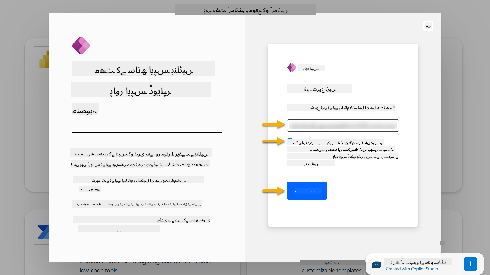

1. Developer Plan کے لیے سائن اپ کرنے کے بعد، آپ کو [Power Apps](https://make.powerapps.com/) پر ری ڈائریکٹ کر دیا جائے گا۔ ماحول آپ کے نام کا استعمال کرتا ہے، مثال کے طور پر **Adele Vance's environment**۔ اگر پہلے سے ہی اس نام کے ساتھ ایک ماحول موجود ہے، تو نیا ڈیولپر ماحول کا نام **Adele Vance's (1)** ہوگا۔

    Copilot Studio میں لیبز مکمل کرتے وقت اس ڈیولپر ماحول کا استعمال کریں۔

!!! Note
    اگر آپ موجودہ Microsoft 365 اکاؤنٹ استعمال کر رہے ہیں اور مرحلہ 1 میں نیا اکاؤنٹ نہیں بنایا، مثال کے طور پر - اپنے کام کی تنظیم میں اپنا اکاؤنٹ استعمال کر رہے ہیں، تو آپ کے IT ایڈمنسٹریٹر (یا اس کے مساوی) ٹیم جو آپ کے ٹیننٹ/ماحول کو منظم کرتی ہے، نے سائن اپ کا عمل بند کر دیا ہو سکتا ہے۔ اس صورت میں، براہ کرم اپنے ایڈمنسٹریٹر سے رابطہ کریں، یا مرحلہ 1 کے مطابق ایک ٹیسٹ ٹیننٹ بنائیں۔

---

## مرحلہ 4: نیا SharePoint سائٹ بنائیں

ایک نیا SharePoint سائٹ بنانا ضروری ہے جو [سبق 06 - ایک کسٹم ایجنٹ بنائیں جو Copilot کے ساتھ بات چیت کے تجربے سے اور اپنے ڈیٹا کے ساتھ گراؤنڈنگ کے ذریعے](../06-create-agent-from-conversation/README.md#62-add-an-internal-knowledge-source-using-a-sharepoint-site) میں استعمال ہوگا۔

1. Microsoft Copilot Studio کے اوپر بائیں جانب وافل آئیکن منتخب کریں تاکہ مینو دیکھ سکیں۔ مینو سے SharePoint منتخب کریں۔

    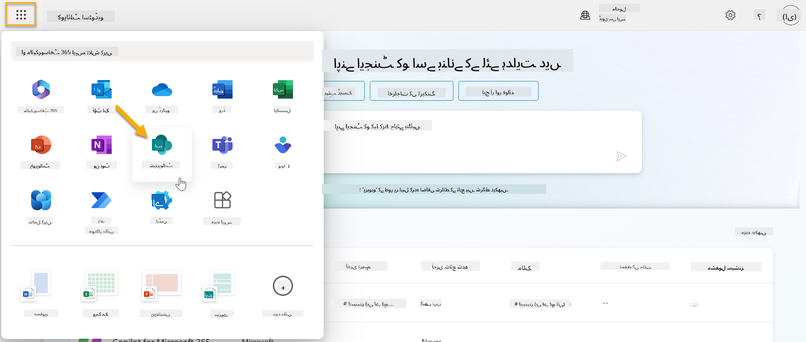

1. SharePoint لوڈ ہوگا۔ **+ Create site** منتخب کریں تاکہ نیا SharePoint سائٹ بنایا جا سکے۔

    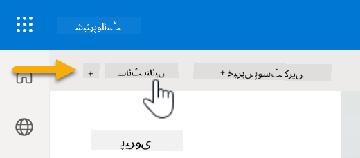

1. ایک ڈائیلاگ ظاہر ہوگا جو آپ کو نیا SharePoint سائٹ بنانے میں رہنمائی کرے گا۔ **Team site** منتخب کریں۔

    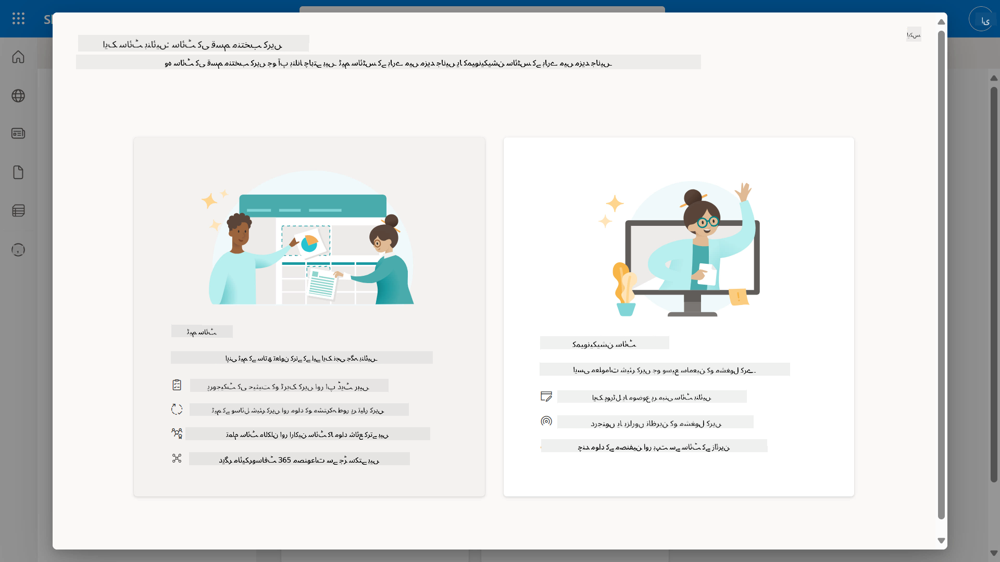

1. اگلے مرحلے میں، Microsoft ٹیمپلیٹس کی فہرست ڈیفالٹ کے طور پر لوڈ ہوگی۔ نیچے سکرول کریں اور **IT help desk** ٹیمپلیٹ منتخب کریں۔

    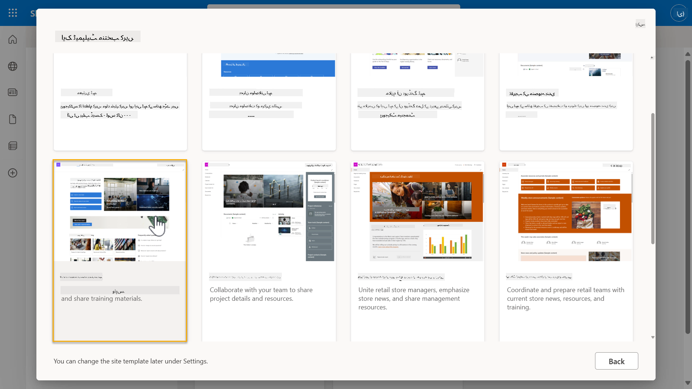

1. **Use template** منتخب کریں تاکہ IT help desk ٹیمپلیٹ کا استعمال کرتے ہوئے نیا SharePoint سائٹ بنایا جا سکے۔

    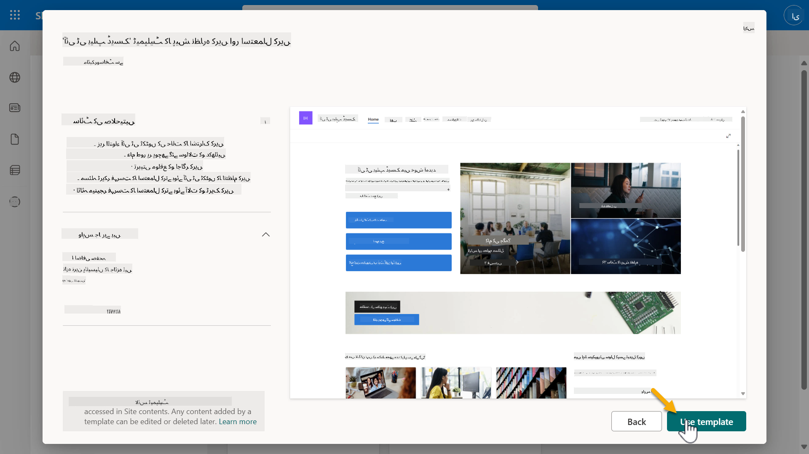

1. اپنے سائٹ کے لیے معلومات درج کریں۔ درج ذیل ایک مثال ہے:

    | فیلڈ | ویلیو |
    | --- | --- |
    | سائٹ کا نام | Contoso IT |
    | سائٹ کی تفصیل | Copilot Studio for Beginners |
    | سائٹ کا پتہ | ContosoIT |

    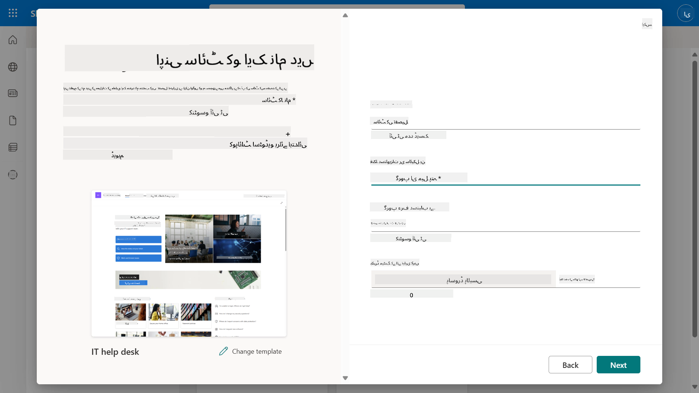

1. آخری مرحلے میں، SharePoint سائٹ کے لیے زبان منتخب کی جا سکتی ہے۔ ڈیفالٹ کے طور پر یہ **انگریزی** ہوگی۔ زبان کو **انگریزی** پر چھوڑیں اور **Create site** منتخب کریں۔

    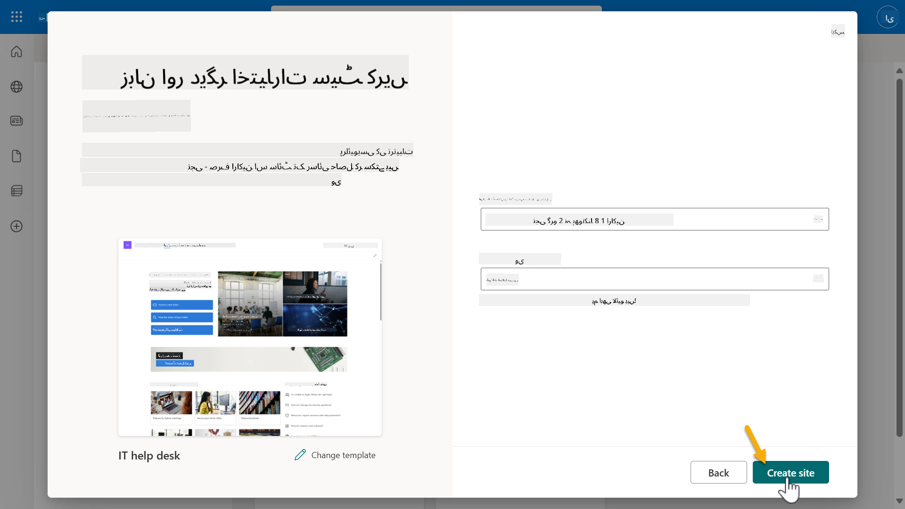

1. SharePoint سائٹ اگلے چند سیکنڈز میں پروویژن کرے گا۔ اس دوران، آپ اپنی سائٹ میں دوسرے صارفین کو شامل کرنے کے لیے ان کے ای میل ایڈریس **Add members** فیلڈ میں درج کر سکتے ہیں۔ مکمل ہونے پر، **Finish** منتخب کریں۔

    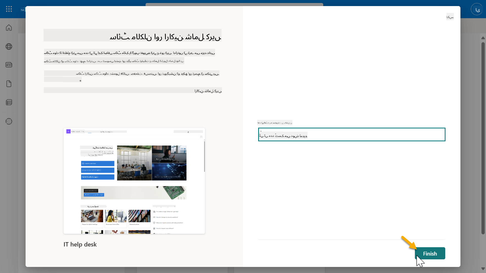

1. SharePoint سائٹ کا ہوم پیج اگلے لوڈ ہوگا۔ **SharePoint سائٹ URL کو کاپی کریں۔**

1. یہ ٹیمپلیٹ مختلف IT پالیسیوں کے بارے میں نمونہ ڈیٹا کے ساتھ صفحات اور دو نمونہ فہرستیں (Tickets اور Devices) فراہم کرتا ہے۔

### Devices SharePoint فہرست استعمال کریں

ہم **Devices** فہرست کو [مشن 07 - نیا موضوع شامل کریں ٹرگر اور نوڈز کے ساتھ](../07-add-new-topic-with-trigger/README.md#73-add-a-tool-using-a-connector) میں استعمال کریں گے۔

### نیا کالم شامل کریں

فہرست میں دائیں طرف سکرول کریں اور **+ Add column** بٹن منتخب کریں۔ **hyperlink** قسم منتخب کریں، کالم کا نام **Image** درج کریں، اور شامل کریں منتخب کریں۔

### Devices SharePoint فہرست میں نمونہ ڈیٹا بنائیں

آپ کو اس فہرست کو کم از کم 4 نمونہ ڈیٹا آئٹمز سے بھرنا ہوگا اور اس فہرست میں ایک اضافی کالم شامل کرنا ہوگا۔  

نمونہ ڈیٹا شامل کرتے وقت، یقینی بنائیں کہ درج ذیل فیلڈز بھرے گئے ہیں:

- ڈیوائس کی تصویر - [ڈیوائس تصاویر فولڈر](https://github.com/microsoft/agent-academy/tree/main/docs/recruit/00-course-setup/images/device-images) سے تصاویر استعمال کریں
- عنوان
- اسٹیٹس
- مینوفیکچرر
- ماڈل
- اثاثہ کی قسم
- رنگ
- سیریل نمبر
- خریداری کی تاریخ
- خریداری کی قیمت
- آرڈر #
- تصویر - درج ذیل لنکس استعمال کریں

|ڈیوائس  |URL  |
|---------|---------|
|Surface Laptop 13     | [https://raw.githubusercontent.com/microsoft/agent-academy/refs/heads/main/docs/recruit/00-course-setup/images/device-images/Surface-Laptop-13.png](https://raw.githubusercontent.com/microsoft/agent-academy/refs/heads/main/docs/recruit/00-course-setup/images/device-images/Surface-Laptop-13.png)        |
|Surface Laptop 15     | [https://raw.githubusercontent.com/microsoft/agent-academy/refs/heads/main/docs/recruit/00-course-setup/images/device-images/Surface-Laptop-15.png](https://raw.githubusercontent.com/microsoft/agent-academy/refs/heads/main/docs/recruit/00-course-setup/images/device-images/Surface-Laptop-15.png)        |
|Surface Pro    | [https://raw.githubusercontent.com/microsoft/agent-academy/refs/heads/main/docs/recruit/00-course-setup/images/device-images/Surface-Pro-12.png](https://raw.githubusercontent.com/microsoft/agent-academy/refs/heads/main/docs/recruit/00-course-setup/images/device-images/Surface-Pro-12.png)        |
|Surface Studio    | [https://raw.githubusercontent.com/microsoft/agent-academy/refs/heads/main/docs/recruit/00-course-setup/images/device-images/Surface-Studio.png](https://raw.githubusercontent.com/microsoft/agent-academy/refs/heads/main/docs/recruit/00-course-setup/images/device-images/Surface-Studio.png)        |

---

## ✅ مشن مکمل

آپ نے کامیابی سے:

- Microsoft 365 ڈیولپمنٹ ماحول سیٹ اپ کیا  
- اپنا Copilot Studio ٹرائل ایکٹیویٹ کیا  
- ایجنٹس کو گراؤنڈ کرنے کے لیے ایک SharePoint سائٹ بنائی  
- مستقبل کے مشنز کے لیے Devices فہرست کو ڈیٹا سے بھرا  

آپ کو [سبق 01](../01-introduction-to-agents/README.md) میں **ریکروٹ لیول ایجنٹ ٹریننگ** شروع کرنے کی باضابطہ اجازت ہے۔  

<!-- markdownlint-disable-next-line MD033 -->

---

**ڈسکلیمر**:  
یہ دستاویز AI ترجمہ سروس [Co-op Translator](https://github.com/Azure/co-op-translator) کا استعمال کرتے ہوئے ترجمہ کی گئی ہے۔ ہم درستگی کے لیے کوشش کرتے ہیں، لیکن براہ کرم آگاہ رہیں کہ خودکار ترجمے میں غلطیاں یا غیر درستیاں ہو سکتی ہیں۔ اصل دستاویز کو اس کی اصل زبان میں مستند ذریعہ سمجھا جانا چاہیے۔ اہم معلومات کے لیے، پیشہ ور انسانی ترجمہ کی سفارش کی جاتی ہے۔ ہم اس ترجمے کے استعمال سے پیدا ہونے والی کسی بھی غلط فہمی یا غلط تشریح کے ذمہ دار نہیں ہیں۔