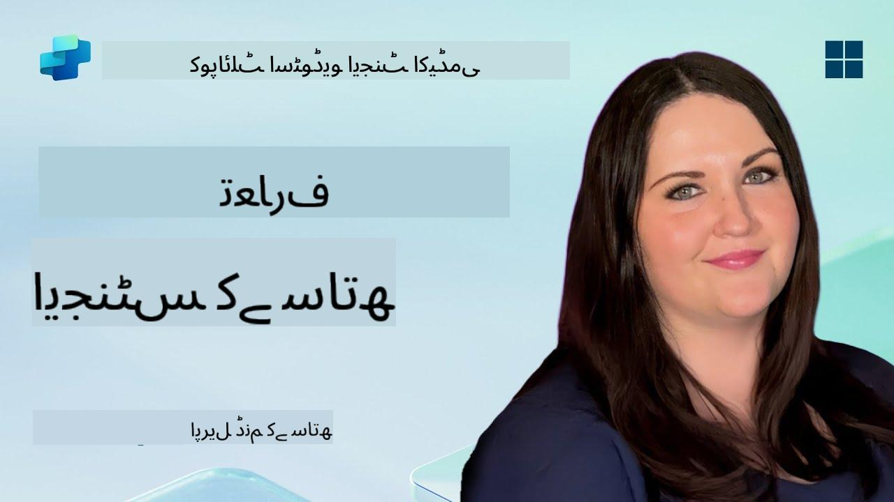

<!--
CO_OP_TRANSLATOR_METADATA:
{
  "original_hash": "d6706e107678264168d77b2e107710b1",
  "translation_date": "2025-10-22T19:30:45+00:00",
  "source_file": "docs/recruit/01-introduction-to-agents/README.md",
  "language_code": "ur"
}
-->
# 🚨 مشن 01: ایجنٹس کا تعارف

## 🕵️‍♂️ کوڈنام: `آپریشن AI ایجنٹ ڈی کوڈ`

> **⏱️ آپریشن کا وقت:** `~30 منٹ – صرف معلومات، کوئی فیلڈ ورک نہیں`

🎥 **ویڈیو دیکھیں**

## 🎯 مشن کا خلاصہ

خوش آمدید، ریکروٹ۔ ایجنٹس بنانے سے پہلے، آپ کو ان AI تصورات کی مضبوط سمجھ ہونی چاہیے جو انہیں طاقت دیتے ہیں۔ یہ مشن آپ کو گفتگو AI، بڑے زبان ماڈلز (LLMs)، ریٹریول-اگمینٹڈ جنریشن (RAG)، اور وہ قسم کے ایجنٹس جو آپ کوپائلٹ اسٹوڈیو میں بنا سکتے ہیں، کی بنیادی معلومات فراہم کرے گا۔

## 🔎 مقاصد

اس مشن میں، آپ سیکھیں گے:

1. گفتگو AI کیا ہے اور یہ کیوں اہم ہے  
1. بڑے زبان ماڈلز (LLMs) چیٹ تجربات کو کیسے طاقت دیتے ہیں  
1. ریٹریول-اگمینٹڈ جنریشن (RAG) کیا پیش کرتا ہے  
1. گفتگو ایجنٹس اور خود مختار ایجنٹس کے درمیان فرق  
1. کوپائلٹ اسٹوڈیو میں ایجنٹس ان تصورات کو کیسے استعمال کرتے ہیں  

چلیں شروع کرتے ہیں!

---

## گفتگو AI کیا ہے؟

گفتگو AI کسی بھی نظام کو کہتے ہیں جو انسانی زبان – چاہے وہ متن ہو یا آواز – کو سمجھ سکتا ہے، پروسیس کر سکتا ہے، اور قدرتی انداز میں جواب دے سکتا ہے۔ جیسے ہیلپ ڈیسک میں چیٹ بوٹس یا آپ کے پسندیدہ ایپس میں ورچوئل پرسنل اسسٹنٹس۔ اندرونی طور پر، زیادہ تر جدید گفتگو AI بڑے زبان ماڈلز (LLMs) پر انحصار کرتے ہیں، جنہیں ہم اگلے حصے میں دیکھیں گے۔

### یہ کیوں اہم ہے

- **صارف کا تجربہ:** گفتگو انٹرفیس اکثر مینو کے ذریعے کلک کرنے سے زیادہ آسان ہوتے ہیں۔  
- **اسکیل ایبلٹی:** ایک ایجنٹ درجنوں یا سینکڑوں بیک وقت گفتگو کو سنبھال سکتا ہے۔  
- **کارکردگی:** کسٹم رول-بیسڈ اسکرپٹس بنانے کے بجائے، LLM-پاورڈ ایجنٹس صارف کے ان پٹ کے مطابق فوری طور پر ایڈجسٹ ہو جاتے ہیں۔  
- **وسعت پذیری:** صحیح ڈیزائن کے ساتھ، ایجنٹس نالج بیسز تک رسائی حاصل کر سکتے ہیں، APIs سے جڑ سکتے ہیں، یا کاروباری ورک فلو میں "ڈیجیٹل ساتھی" کے طور پر کام کر سکتے ہیں۔

---

## بڑے زبان ماڈلز (LLMs) 101

زیادہ تر گفتگو AI نظاموں کے مرکز میں **بڑے زبان ماڈلز** ہوتے ہیں – نیورل نیٹ ورکس جو وسیع متن کے ذخیرے پر تربیت یافتہ ہوتے ہیں۔ یہ زبان کے شماریاتی نمونوں کو سیکھتے ہیں تاکہ وہ مربوط جملے بنا سکیں، سوالات کے جواب دے سکیں، یا خیالات پیش کر سکیں۔ اہم نکات:

1. **تربیتی ڈیٹا:** LLMs ٹیرابائٹس کے متن (ویب صفحات، کتابیں، مضامین) کو جذب کرتے ہیں۔ یہ "دنیا کا علم" انہیں مختلف موضوعات پر جواب دینے کی صلاحیت دیتا ہے۔  
1. **ٹوکینائزیشن:** متن کو چھوٹے یونٹس میں تقسیم کیا جاتا ہے جنہیں ٹوکن کہا جاتا ہے (الفاظ، سب ورڈز، یا حروف)۔ ماڈل ایک وقت میں ایک ٹوکن کی پیش گوئی کرتا ہے۔  
1. **کانٹیکسٹ ونڈو:** ہر LLM کی ایک حد ہوتی ہے کہ وہ ایک وقت میں کتنے ٹوکن "دیکھ" سکتا ہے۔ اس حد سے آگے، پچھلے ٹوکنز کو ختم کر دیا جاتا ہے۔  
1. **پرومپٹنگ:** آپ LLM کے ساتھ ایک پرومپٹ بھیج کر بات چیت کرتے ہیں۔ آپ کا پرومپٹ جتنا بہتر ہوگا، جواب اتنا ہی زیادہ مرکوز اور متعلقہ ہوگا۔  
1. **زیرو-شاٹ بمقابلہ فائن-ٹیوننگ:** زیرو-شاٹ کا مطلب ہے LLM کو جیسا ہے ویسا استعمال کرنا (صرف خام وزن)۔ فائن-ٹیوننگ کا مطلب ہے ماڈل کو ڈومین-اسپیسفک ڈیٹا پر ایڈجسٹ کرنا تاکہ یہ آپ کی ضروریات کے لیے زیادہ درست جواب دے۔

!!! Tip "پرو ٹپ"
    ایک عام تشبیہ یہ ہے کہ LLM ایک "بہت ہوشیار آٹو کمپلیٹ" کی طرح ہے۔ یہ انسانی دماغ کی طرح معنی کو واقعی نہیں سمجھتا، لیکن یہ ترتیب میں اگلا بہترین لفظ (یا جملہ) پیش کرنے میں انتہائی ماہر ہے۔

---

## ریٹریول-اگمینٹڈ جنریشن (RAG)

جب LLMs صرف جامد تربیتی ڈیٹا پر انحصار کرتے ہیں، تو وہ غلط معلومات دے سکتے ہیں یا پرانے ہو سکتے ہیں۔ RAG اس مسئلے کو حل کرتا ہے، ماڈل کو جواب تیار کرنے سے پہلے تازہ معلومات "دیکھنے" کی اجازت دے کر۔ مجموعی طور پر، RAG اس طرح کام کرتا ہے:

1. **صارف کا سوال:** صارف ایک سوال پوچھتا ہے (جیسے، "کنٹوسو کی سہ ماہی آمدنی کے بارے میں تازہ ترین کیا ہے؟")۔  
1. **ریٹریور مرحلہ:** نظام ایک نالج سورس (دستاویزات، اندرونی ڈیٹا بیس، شیئرپوائنٹ لائبریریاں وغیرہ) کو سوال کرتا ہے تاکہ متعلقہ حصے تلاش کرے۔  
1. **اگمینٹیشن:** حاصل کردہ حصے LLM پرومپٹ سے پہلے یا بعد میں شامل کیے جاتے ہیں۔  
1. **جنریشن:** LLM صارف کے سوال اور حاصل کردہ کانٹیکسٹ دونوں کو جذب کرتا ہے، پھر ایک جواب تیار کرتا ہے جو تازہ ترین ڈیٹا پر مبنی ہوتا ہے۔  

RAG کے ساتھ، آپ کا ایجنٹ اندرونی کمپنی ویکی، پلگ ان APIs، یا FAQ نالج بیس کو کال کر سکتا ہے – اور ایسے جوابات دے سکتا ہے جو جامد ماڈل پیرامیٹرز تک محدود نہیں ہیں۔

---

## گفتگو ایجنٹس بمقابلہ خود مختار ایجنٹس

کوپائلٹ اسٹوڈیو کے تناظر میں، **ایجنٹ** کی اصطلاح AI اسسٹنٹس کی مختلف اقسام کے لیے استعمال ہو سکتی ہے۔ یہ فرق کرنا مددگار ہے:

**گفتگو ایجنٹس:**

- بنیادی طور پر دو طرفہ مکالمے پر توجہ مرکوز کرتے ہیں۔  
- گفتگو کے متعدد مراحل کے دوران کانٹیکسٹ کو برقرار رکھتے ہیں۔  
- عام طور پر پہلے سے طے شدہ فلو یا ٹرگرز کے ذریعے ترتیب دیے جاتے ہیں (جیسے، "اگر صارف X کہے، تو Y کے ساتھ جواب دیں")۔  
- کسٹمر سپورٹ، FAQs، گائیڈڈ انٹریکشنز، شیڈولنگ، یا سادہ سوال و جواب کے لیے مثالی۔  
  - مثالیں:
    - ایک ٹیمز چیٹ بوٹ جو HR پالیسی کے سوالات کے جواب دیتا ہے۔  
    - ایک پاور ورچوئل ایجنٹس بوٹ جو شیئرپوائنٹ پیج پر صارفین کو فارم کے ذریعے رہنمائی کرتا ہے۔  

**خود مختار ایجنٹس:**

- دو طرفہ چیٹ سے آگے بڑھتے ہیں؛ وہ صارف کی طرف سے **عمل کر سکتے ہیں**۔  
- LLM ریزننگ لوپس استعمال کرتے ہیں (سوچیں "پلان → عمل → مشاہدہ → دوبارہ پلان") تاکہ کام مکمل کریں۔  
- بیرونی ٹولز یا APIs سے جڑتے ہیں (جیسے، پاور آٹومیٹ فلو کو کال کریں، کیلنڈر دعوتیں بھیجیں، ڈیٹا کو ڈیٹاورس میں تبدیل کریں)۔  
- مسلسل انسانی پرومپٹس کے بغیر کام کرتے ہیں – ایک بار شروع ہونے کے بعد، وہ خود مختار طور پر کئی مراحل کے عمل کو سنبھال سکتے ہیں۔  
  - مثالیں:  
    - ایک ایجنٹ جو سفر کا منصوبہ بناتا ہے، فلائٹس بک کرتا ہے، اور تصدیق ای میل کرتا ہے۔  
    - ایک "میٹنگ سمریزر" ایجنٹ جو ٹیمز کال میں شامل ہوتا ہے، اسے حقیقی وقت میں ٹرانسکرائب کرتا ہے، اور ون نوٹ میں ایگزیکٹو سمری لکھتا ہے۔  

!!! Info "اہم فرق"
    گفتگو ایجنٹس صارف کے ان پٹ کا انتظار کرتے ہیں اور مکالمے تک محدود رہتے ہیں۔ خود مختار ایجنٹس وسیع تر ٹول تک رسائی کے ساتھ منصوبہ بندی اور عملدرآمد کے مراحل کو خود مختار طور پر انجام دیتے ہیں۔

---

## کوپائلٹ اسٹوڈیو میں ایجنٹس

**کوپائلٹ اسٹوڈیو** گفتگو اور خود مختار دونوں منظرناموں کو ایک فریم ورک کے تحت یکجا کرتا ہے۔ کوپائلٹ اسٹوڈیو آپ کو ایجنٹس بنانے میں کیسے مدد کرتا ہے:

1. **ویژول ایجنٹ ڈیزائنر:** ایک لو-کوڈ کینوس جو چیٹ اور ایکشن ورک فلو کے لیے پرومپٹس، میموری، اور ٹولز کو ڈیفائن کرتا ہے۔  
1. **LLM کنفیگریشنز:** مختلف اوپن AI ماڈلز یا مائیکروسافٹ کے انٹرپرائز-گریڈ GPT میں سے انتخاب کریں تاکہ آپ کی کارکردگی اور لاگت کی ضروریات پوری ہوں۔  
1. **ریٹریول کنیکٹرز:** شیئرپوائنٹ، ون ڈرائیو، ایزور کوگنیٹو سرچ، اور ڈیٹاورس کے لیے پہلے سے تیار کردہ انٹیگریشنز، جو RAG کو فوری طور پر فعال کرتے ہیں۔  
1. **کسٹم ٹولز اور فنکشنز:** کسٹم HTTP ایکشنز یا پاور آٹومیٹ فلو ڈیفائن کریں جنہیں آپ کا ایجنٹ خود مختار طور پر کال کر سکتا ہے۔  
1. **ملٹی-موڈل سپورٹ:** متن کے علاوہ، کوپائلٹ اسٹوڈیو ایجنٹس تصاویر، فائلز، یا ساختی ڈیٹا کو کانٹیکسٹ کو بہتر بنانے کے لیے جذب کر سکتے ہیں۔  
1. **پبلشنگ اور ڈسٹریبیوشن:** جب آپ کا ایجنٹ تیار ہو جائے، تو آپ اسے مائیکروسافٹ 365 کوپائلٹ پر پبلش کر سکتے ہیں (تاکہ صارفین اسے ٹیمز، شیئرپوائنٹ، آؤٹ لک وغیرہ میں استعمال کریں) یا اسے ایک اسٹینڈ الون چیٹ ویجیٹ کے طور پر ویب پیج پر ایمبیڈ کریں۔

---

## 🎉 مشن مکمل

آپ نے ایجنٹس اور بنیادی AI تصورات کا تعارف مکمل کر لیا ہے۔ آپ سمجھتے ہیں:

1. **LLMs = آپ کے ایجنٹ کا "دماغ"**  
   - زبان کو سمجھنے اور جنریشن کے لیے ذمہ دار۔  
   - زیادہ ٹوکنز = زیادہ بھرپور کانٹیکسٹ، لیکن ہر کال پر زیادہ لاگت۔  

1. **RAG = حقیقی وقت میں نالج انٹیگریشن**  
   - جامد LLM اور مسلسل بدلتے ڈیٹا سورسز کے درمیان خلا کو پُر کرتا ہے۔  
   - متعلقہ دستاویزات یا ریکارڈز کو LLM پرومپٹ میں شامل کرتا ہے۔  

1. **گفتگو بمقابلہ خود مختار**  
   - **گفتگو:** مکالمے کے فلو اور کانٹیکسٹ کو برقرار رکھنے پر توجہ مرکوز (جیسے، "سیشن میموری")۔  
   - **خود مختار:** "ایکشن بلاکس" شامل کریں جو ایجنٹ کو بیرونی ٹولز یا سروسز کو کال کرنے کی اجازت دیتے ہیں۔

---
اگلے مرحلے میں، آپ [کوپائلٹ اسٹوڈیو کے بنیادی اصول](../02-copilot-studio-fundamentals/README.md) کو دریافت کریں گے!

تیار رہیں، ریکروٹ - آپ کا AI سفر ابھی شروع ہوا ہے!

## 📚 حکمت عملی وسائل

🔗 [کوپائلٹ اسٹوڈیو دستاویزات کا ہوم](https://learn.microsoft.com/microsoft-copilot-studio/)

---

<!-- markdownlint-disable-next-line MD033 -->

---

**اعلانِ لاتعلقی**:  
یہ دستاویز AI ترجمہ سروس [Co-op Translator](https://github.com/Azure/co-op-translator) کا استعمال کرتے ہوئے ترجمہ کی گئی ہے۔ ہم درستگی کی بھرپور کوشش کرتے ہیں، لیکن براہ کرم آگاہ رہیں کہ خودکار ترجمے میں غلطیاں یا عدم درستگی ہو سکتی ہے۔ اصل دستاویز کو اس کی اصل زبان میں مستند ذریعہ سمجھا جانا چاہیے۔ اہم معلومات کے لیے، پیشہ ور انسانی ترجمہ کی سفارش کی جاتی ہے۔ اس ترجمے کے استعمال سے پیدا ہونے والی کسی بھی غلط فہمی یا غلط تشریح کے لیے ہم ذمہ دار نہیں ہیں۔