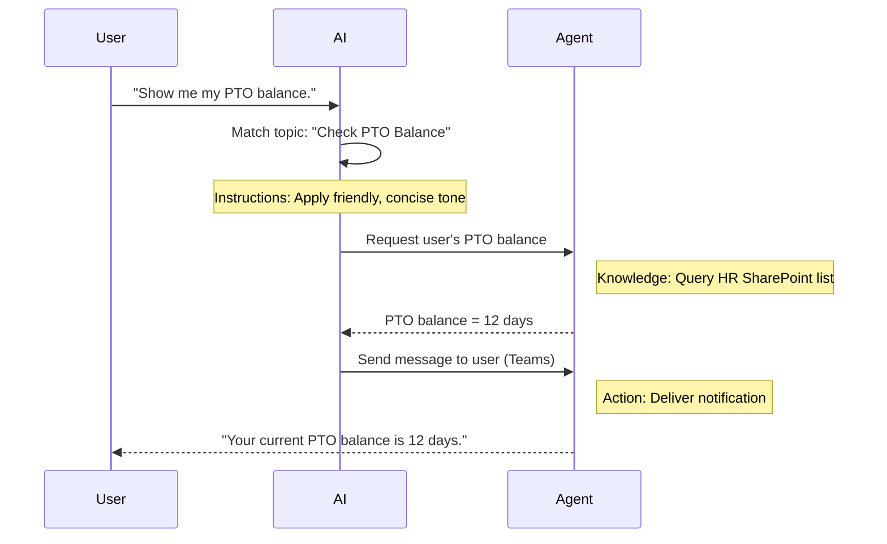

<!--
CO_OP_TRANSLATOR_METADATA:
{
  "original_hash": "90a3c5122f5687bbc8cc819990f175d4",
  "translation_date": "2025-10-22T19:50:06+00:00",
  "source_file": "docs/recruit/02-copilot-studio-fundamentals/README.md",
  "language_code": "ur"
}
-->
# 🚨 مشن 02: کوپائلٹ اسٹوڈیو کی بنیادی باتیں

## 🕵️‍♂️ کوڈنام: `آپریشن کور پروٹوکول`

> **⏱️ آپریشن کا وقت:** `~30 منٹ – صرف معلومات، کوئی فیلڈ ورک نہیں`  

🎥 **واچ واک تھرو**

[](https://www.youtube.com/watch?v=x4OCwDRGeLE "یوٹیوب پر واک تھرو دیکھیں")

## 🎯 مشن کا خلاصہ

خوش آمدید، ریکروٹ۔ یہ مشن آپ کو کوپائلٹ اسٹوڈیو کو سمجھنے کے لیے بنیادی معلومات فراہم کرے گا اور آپ کو ذہین ایجنٹس بنانے کا طریقہ سکھائے گا جو حقیقی کاروباری قدر فراہم کرتے ہیں۔

اپنا پہلا ایجنٹ بنانے سے پہلے، آپ کو ان چار اہم اجزاء کو سمجھنا ہوگا جو ہر کسٹم AI ایجنٹ کا حصہ ہیں: علم، ٹولز، موضوعات، اور ہدایات۔ آپ یہ بھی سیکھیں گے کہ یہ عناصر کوپائلٹ اسٹوڈیو آرکیسٹریٹر میں کیسے ایک ساتھ کام کرتے ہیں۔

## 🔎 مقاصد

اس مشن میں، آپ:

- **کوپائلٹ اسٹوڈیو کیا ہے سیکھیں گے**
- **ایجنٹس کب اور کیوں استعمال کیے جائیں سیکھیں گے**
- **ایجنٹس کے چار بنیادی اجزاء کو دریافت کریں گے**
      - **علم**
      - **ٹولز**
      - **موضوعات**
      - **ہدایات**
- **سمجھیں گے کہ یہ اجزاء کیسے ایک ساتھ کام کرتے ہیں** تاکہ ایک ذہین، خودکار ایجنٹ بنایا جا سکے

---

## کوپائلٹ اسٹوڈیو میں ایجنٹس کیا ہیں؟

ایک **ایجنٹ** ایک خاص AI اسسٹنٹ ہے جسے آپ مخصوص کاموں یا سوالات کو سنبھالنے کے لیے ڈیزائن کرتے ہیں۔ عام چیٹ بوٹ کے برعکس، آپ کا ایجنٹ:

- **کمپنی کے مخصوص ڈیٹا کو جانتا ہے** (پالیسیز، دستاویزات، ڈیٹا بیس)  
- **حقیقی دنیا کے کام انجام دیتا ہے** (پیغامات بھیجنا، کیلنڈر ایونٹس بنانا، ریکارڈز اپ ڈیٹ کرنا)  
- **گفتگو کا سیاق و سباق برقرار رکھتا ہے** تاکہ پچھلے سوالات پر فالو اپ کر سکے  

چونکہ کوپائلٹ اسٹوڈیو لو کوڈ ہے، آپ پہلے سے بنے ہوئے اجزاء کو ڈریگ اور ڈراپ کر سکتے ہیں—گہرے کوڈنگ کی مہارت کی ضرورت نہیں۔ ایک بار جب آپ کا ایجنٹ بن جائے، لوگ اسے ٹیمز، سلیک، یا یہاں تک کہ ایک کسٹم ویب پیج کے اندر کال کر سکتے ہیں تاکہ جوابات حاصل کریں یا خودکار ورک فلو کو ٹرگر کریں۔

---

## کوپائلٹ اسٹوڈیو کب اور کیوں استعمال کریں

جبکہ مائیکروسافٹ 365 کوپائلٹ آفس ایپس میں عمومی AI مدد فراہم کرتا ہے، آپ کو ایک کسٹم ایجنٹ کی ضرورت ہوگی جب:

### آپ کو ڈومین مخصوص علم کی ضرورت ہو

- آؤٹ آف دی باکس کوپائلٹ آپ کی کمپنی کے اندرونی طریقہ کار یا ڈیٹا کو نہیں جان سکتا۔ ایک ایجنٹ آپ کے شیئرپوائنٹ سائٹس، ڈیٹا بیس، یا کسٹم ذرائع کو سوالات کے درست اور تازہ ترین جوابات دینے کے لیے کوئری کر سکتا ہے۔  

### آپ ملٹی اسٹیپ ورک فلو کو خودکار بنانا چاہتے ہیں

- مثال کے طور پر: "جب کوئی خرچ جمع کرائے، اسے منظوری کے لیے بھیجیں، فنانس ٹریکر کو اپ ڈیٹ کریں، اور مینیجر کو مطلع کریں۔" ایک کسٹم ایجنٹ ہر قدم کو سنبھال سکتا ہے، ایک کمانڈ یا ایونٹ کے ذریعے ٹرگر کیا گیا۔  

### آپ کو سیاق و سباق، ان ٹول تجربہ کی ضرورت ہو  

- تصور کریں کہ ٹیمز میں ایک نیو ہائر آن بورڈنگ ایجنٹ HR اسٹاف کو ہر پالیسی کے ذریعے رہنمائی کرتا ہے، ضروری فارم بھیجتا ہے، اور اورینٹیشن میٹنگز کا شیڈول بناتا ہے—آپ کے موجودہ تعاون کے پلیٹ فارم کے اندر۔  

---

## ایجنٹ کے چار بنیادی اجزاء

ہر کوپائلٹ اسٹوڈیو ایجنٹ چار بنیادی اجزاء سے بنایا جاتا ہے:

1. **علم**  
1. **ٹولز (ایکشنز)**  
1. **موضوعات**  
1. **ہدایات**

نیچے، ہم ہر بنیادی جزو کی تعریف کریں گے اور دکھائیں گے کہ وہ ایک مؤثر ایجنٹ بنانے کے لیے کیسے ایک ساتھ کام کرتے ہیں۔

### 1. علم

**علم** وہ ڈیٹا اور سیاق و سباق ہے جسے آپ کا ایجنٹ سوالات کے درست جوابات دینے کے لیے استعمال کرتا ہے۔ اس کے دو حصے ہیں:

#### کسٹم ہدایات اور سیاق و سباق

- آپ ایجنٹ کے مقصد اور لہجے کی مختصر وضاحت لکھتے ہیں۔ مثال کے طور پر:  

    ```text
    You are an IT support agent. You help employees troubleshoot common software issues, provide troubleshooting steps, and escalate urgent tickets.
    ```

- گفتگو کے دوران، ایجنٹ پچھلے موڑ کو یاد رکھتا ہے تاکہ وہ پہلے سے بات چیت کیے گئے موضوعات کا حوالہ دے سکے (مثال کے طور پر، اگر صارف پہلے کہے، "میرا پرنٹر آف لائن ہے،" اور پھر پوچھے، "کیا آپ نے انک لیول چیک کیا؟" تو ایجنٹ پرنٹر کے سیاق و سباق کو یاد رکھتا ہے)۔

#### علم کے ذرائع (گراؤنڈنگ ڈیٹا)

- آپ اپنے ایجنٹ کو متعدد ڈیٹا ذرائع سے جوڑتے ہیں—شیئرپوائنٹ لائبریریاں، دستاویزاتی سائٹس، ویکی، یا دیگر ڈیٹا بیس۔  
- جب کوئی صارف سوال پوچھتا ہے، ایجنٹ ان ذرائع سے متعلقہ اقتباسات نکالتا ہے تاکہ جوابات آپ کی تنظیم کی اصل پالیسیز، پروڈکٹ مینوئلز، یا کسی بھی ملکیتی معلومات میں **گراؤنڈڈ** ہوں۔  
- آپ ایجنٹ کو مجبور کر سکتے ہیں کہ وہ صرف ان ذرائع سے معلومات کے ساتھ جواب دے، اسے اندازہ لگانے یا "ہیلوسینیٹ" کرنے سے روکنے کے لیے۔

!!! مثال
    ایک "پالیسی اسسٹنٹ" ایجنٹ آپ کے HR شیئرپوائنٹ سائٹ سے جڑ سکتا ہے۔ اگر کوئی صارف پوچھے، "ہمارا PTO اکروئل ریٹ کیا ہے؟" تو ایجنٹ HR پالیسی دستاویز سے بالکل متن نکالے گا بجائے اس کے کہ عام AI جواب پر انحصار کرے۔

---

### 2. ٹولز (ایکشنز)

**ٹولز (ایکشنز)** وہ کام ہیں جو ایجنٹ چیٹنگ کے علاوہ پروگرام کے ذریعے انجام دے سکتا ہے۔ ہر ایکشن ایک کام ہے جو ایجنٹ انجام دیتا ہے، جیسے:

- ای میل یا ٹیمز پیغام بھیجنا  
- کیلنڈر ایونٹ بنانا یا اپ ڈیٹ کرنا  
- ڈیٹا بیس میں ریکارڈ شامل کرنا یا ترمیم کرنا (مثال کے طور پر، شیئرپوائنٹ لسٹ یا ڈیٹاورس ٹیبل)  
- پاور آٹومیٹ فلو یا REST API کو کال کرنا  

#### ایکشنز کیسے کام کرتے ہیں

- **ان پٹ اور آؤٹ پٹ کی وضاحت کریں**  
      - مثال کے طور پر، ایک ای میل بھیجنے کا ایکشن درج ذیل کی ضرورت ہو سکتی ہے:  
        - `RecipientEmailAddress`  
        - `SubjectLine`  
        - `EmailBody`  

- **ایکشنز کو ورک فلو میں یکجا کریں**  
      - اکثر، صارف کی درخواست کو پورا کرنے میں متعدد مراحل شامل ہوتے ہیں۔  
      - آپ ایکشنز کو ترتیب دے سکتے ہیں تاکہ:  
             1. ایجنٹ شیئرپوائنٹ لسٹ سے ڈیٹا نکالے۔  
             2. LLM کا استعمال کرتے ہوئے خلاصہ تیار کرے۔  
             3. وہ خلاصہ ٹیمز پیغام کے ساتھ بھیجے۔  

- **بیرونی نظاموں سے جڑیں**  
      - اگر آپ کو CRM کو اپ ڈیٹ کرنے یا اندرونی API کو کال کرنے کی ضرورت ہو، تو اس کے لیے ایک کسٹم ایکشن بنائیں۔  
      - کوپائلٹ اسٹوڈیو پاور پلیٹ فارم یا کسی بھی HTTP پر مبنی اینڈ پوائنٹ کے ساتھ انٹیگریٹ کر سکتا ہے۔

!!! مثال "ایک "ایکسپنس ہیلپر" ایجنٹ کر سکتا ہے:"  
    1. "Submit Expense" درخواست سننا۔  
    2. صارف کے خرچ کی تفصیلات فارم سے نکالنا۔  
    3. "Add to SharePoint List" ایکشن کا استعمال کرتے ہوئے ڈیٹا کو اسٹور کرنا۔  
    4. "Send Email" ایکشن کو ٹرگر کرنا تاکہ منظوری دینے والے کو مطلع کیا جا سکے۔  

---

### 3. موضوعات

**موضوعات** ایجنٹ کے لیے گفتگو کے ٹرگرز یا انٹری پوائنٹس کی وضاحت کرتے ہیں۔ ہر موضوع ایک فنکشن یا سوال کی قسم سے مطابقت رکھتا ہے۔

#### گفتگو کے ٹرگرز  

- ایک موضوع "Submit IT Ticket"، "Check Vacation Balance"، یا "Create Sales Report" ہو سکتا ہے۔  
- اندرونی طور پر، کوپائلٹ اسٹوڈیو **جنریٹو آرکیسٹریشن** استعمال کرتا ہے: بالکل کلیدی الفاظ پر انحصار کرنے کے بجائے، AI صارف کے ارادے کو سمجھتا ہے اور آپ کے فراہم کردہ مختصر وضاحت کی بنیاد پر صحیح موضوع کا انتخاب کرتا ہے۔  

#### موضوع کی وضاحتیں  

- ہر موضوع میں، آپ اس موضوع کے احاطہ کرنے والے مواد کی واضح، مختصر وضاحت لکھتے ہیں۔

!!! مثال "موضوع کی وضاحت کی مثال"
    یہ موضوع صارفین کو IT سپورٹ ٹکٹ جمع کرانے میں مدد کرتا ہے، مسئلے کی تفصیلات، ترجیح، اور رابطے کی معلومات جمع کرتا ہے۔

- AI اس وضاحت کا استعمال کرتا ہے تاکہ فیصلہ کرے کہ کب اس موضوع کو فعال کرنا ہے، چاہے صارف کی عبارت بالکل مماثل نہ ہو۔

#### موضوعات کو ایکشنز سے میپ کرنا  

- ہر موضوع ایک یا زیادہ ایکشنز یا ڈیٹا ریٹریول مراحل سے جڑا ہوتا ہے۔  
- جب AI موضوع کا انتخاب کرتا ہے، تو یہ آپ کے بیان کردہ ترتیب کے ذریعے گفتگو کی رہنمائی کرتا ہے (فالو اپ سوالات پوچھنا، ایکشنز کو کال کرنا، نتائج واپس کرنا)۔

!!! مثال
    اگر کوئی صارف کہے، "مجھے اپنے نئے لیپ ٹاپ کو سیٹ اپ کرنے میں مدد کی ضرورت ہے،" تو AI اس ارادے کو "Submit IT Ticket" موضوع سے میچ کر سکتا ہے۔ پھر ایجنٹ لیپ ٹاپ ماڈل، صارف کی تفصیلات پوچھتا ہے، اور خودکار طور پر ہیلپ ڈیسک سسٹم میں ٹکٹ ڈال دیتا ہے۔

---

### 4. ہدایات

**ہدایات** (کبھی کبھی "پرومپٹس" یا "سسٹم میسیجز" کہا جاتا ہے) LLM کے لہجے، انداز، اور حدود کی رہنمائی کرتی ہیں۔ یہ کسی بھی صورتحال میں ایجنٹ کے ردعمل کو تشکیل دیتی ہیں۔

#### کردار اور شخصیت  

- آپ AI کو بتاتے ہیں کہ وہ کون ہے (مثال کے طور پر، "آپ کنٹوسو ریٹیل کے لیے کسٹمر سروس ایجنٹ ہیں")۔  
- یہ لہجہ طے کرتا ہے—دوستانہ، مختصر، رسمی، یا غیر رسمی—آپ کے استعمال کے کیس پر منحصر ہے۔

#### ردعمل کے رہنما اصول  

- ایجنٹ کو عمل کرنے کے لیے کوئی بھی اصول بتائیں، جیسے:  
      - "ہمیشہ پالیسی کی معلومات کو بلٹ پوائنٹس میں خلاصہ کریں۔"  
      - "اگر آپ جواب نہیں جانتے، تو کہیں ‘مجھے افسوس ہے، میرے پاس وہ معلومات نہیں ہیں۔’"  
      - "کبھی بھی سیاق و سباق سے باہر خفیہ ڈیٹا شامل نہ کریں۔"

#### میموری اور سیاق و سباق کے اصول

- آپ ایجنٹ کو ہدایت دے سکتے ہیں کہ گفتگو کے کتنے موڑ یاد رکھے جائیں۔  
- مثال کے طور پر: "اس صارف کی درخواستوں کی تفصیلات کو تین فالو اپ سوالات تک یاد رکھیں۔"

!!! مثال "ایک "بینفٹس ایڈوائزر" ایجنٹ میں، آپ شامل کر سکتے ہیں:"
    "ہمیشہ سوالات کے جواب دیتے وقت تازہ ترین HR ہینڈ بک کا حوالہ دیں۔ اگر اندراج کی آخری تاریخوں کے بارے میں پوچھا جائے، تو پالیسی سے مخصوص تاریخیں فراہم کریں۔ جوابات کو 150 الفاظ سے کم رکھیں۔"

---

## چار بنیادی اجزاء کیسے ایک ساتھ کام کرتے ہیں

جب آپ **علم**، **ٹولز**، **موضوعات**، اور **ہدایات** کو جمع کرتے ہیں، کوپائلٹ اسٹوڈیو کا AI آرکیسٹریٹر ایک ایجنٹ بناتا ہے جو:

1. **متعلقہ موضوع کے لیے سنتا ہے** (آپ کے موضوع کی وضاحتوں کے ذریعے رہنمائی کرتا ہے)۔  
1. **ہدایات کا اطلاق کرتا ہے** تاکہ اس کا لہجہ طے کرے، فیصلہ کرے کہ کب فالو اپ سوالات پوچھے جائیں، اور اصول نافذ کرے۔  
1. **علم کے ذرائع کا فائدہ اٹھاتا ہے** تاکہ اس کے جوابات آپ کی تنظیم کے ڈیٹا میں گراؤنڈڈ ہوں۔  
1. **ٹولز (ایکشنز) کو کال کرتا ہے** جیسا کہ ضرورت ہو تاکہ کام انجام دے—پیغامات بھیجنا، ریکارڈز اپ ڈیٹ کرنا، یا APIs کو کال کرنا۔  

اندرونی طور پر، آرکیسٹریٹر **جنریٹو پلاننگ** اپروچ استعمال کرتا ہے: یہ فیصلہ کرتا ہے کہ کون سے مراحل لینے ہیں، کس ترتیب میں، صارف کی درخواست کو پورا کرنے کے لیے۔ اگر کوئی ایکشن ناکام ہو (مثال کے طور پر، ای میل نہیں بھیجی جا سکتی)، ایجنٹ آپ کے ایکسیپشن ہینڈلنگ رہنما اصولوں پر عمل کرتا ہے (وضاحت طلب سوال پوچھنا یا غلطی کی اطلاع دینا)۔ چونکہ LLM گفتگو کے سیاق و سباق کے مطابق ڈھلتا ہے، ایجنٹ متعدد موڑ پر میموری برقرار رکھ سکتا ہے اور گفتگو کے دوران نئی معلومات کو شامل کر سکتا ہے۔

**بصری فلو کی مثال:**  
<!--
1. **صارف:** "مجھے اپنا PTO بیلنس دکھائیں۔"
1. **AI (موضوعات):** "Check PTO Balance" موضوع سے میچ کرتا ہے۔  
1. **AI (ہدایات):** دوستانہ، مختصر لہجہ استعمال کرتا ہے۔  
1. **ایجنٹ (علم):** صارف کے بیلنس کے لیے HR شیئرپوائنٹ لسٹ کو کوئری کرتا ہے۔  
1. **ایجنٹ (ایکشنز):** ویلیو نکالتا ہے اور ٹیمز پیغام بھیجتا ہے:  
   > "آپ کا موجودہ PTO بیلنس 12 دن ہے۔"  
-->



---

## 🎉 مشن مکمل

آپ نے کامیابی سے اپنی بنیادی معلومات کی بریفنگ مکمل کر لی ہے۔ آپ نے اب کوپائلٹ اسٹوڈیو میں کسی بھی ایجنٹ کے چار ضروری اجزاء سیکھ لیے ہیں:

1. **علم** – جہاں ایجنٹ حقائق کی معلومات دیکھتا ہے اور گفتگو کی میموری برقرار رکھتا ہے۔  
1. **ٹولز** – وہ کام جو ایجنٹ خودکار طور پر انجام دے سکتا ہے۔  
1. **موضوعات** – ایجنٹ صارف کے ارادے کو کیسے پہچانتا ہے اور فیصلہ کرتا ہے کہ کون سا ورک فلو چلانا ہے۔  
1. **ہدایات** – اصول، لہجہ، اور حدود جو ہر جواب کی رہنمائی کرتے ہیں۔

ان اجزاء کے ساتھ، آپ ایک بنیادی ایجنٹ بنا سکتے ہیں جو سوالات کے جوابات دیتا ہے اور سادہ ورک فلو کو انجام دیتا ہے۔ اگلے سبق میں، ہم ایک "سروس ڈیسک" ایجنٹ بنانے کے لیے مرحلہ وار ٹیوٹوریل کے ذریعے چلیں گے—اپنے پہلے علم کے ذریعہ کو جوڑنے سے لے کر ایک موضوع کی وضاحت کرنے اور ایکشن کو ترتیب دینے تک۔

اگلا: آپ اپنا [پہلا ڈیکلریٹو ایجنٹ M365 کوپائلٹ کے لیے بنائیں گے](../03-create-a-declarative-agent-for-M365Copilot/README.md)۔

<!-- markdownlint-disable-next-line MD033 -->


---

**ڈسکلیمر**:  
یہ دستاویز AI ترجمہ سروس [Co-op Translator](https://github.com/Azure/co-op-translator) کا استعمال کرتے ہوئے ترجمہ کی گئی ہے۔ ہم درستگی کے لیے کوشش کرتے ہیں، لیکن براہ کرم آگاہ رہیں کہ خودکار ترجمے میں غلطیاں یا غیر درستیاں ہو سکتی ہیں۔ اصل دستاویز کو اس کی اصل زبان میں مستند ذریعہ سمجھا جانا چاہیے۔ اہم معلومات کے لیے، پیشہ ور انسانی ترجمہ کی سفارش کی جاتی ہے۔ ہم اس ترجمے کے استعمال سے پیدا ہونے والی کسی بھی غلط فہمی یا غلط تشریح کے ذمہ دار نہیں ہیں۔