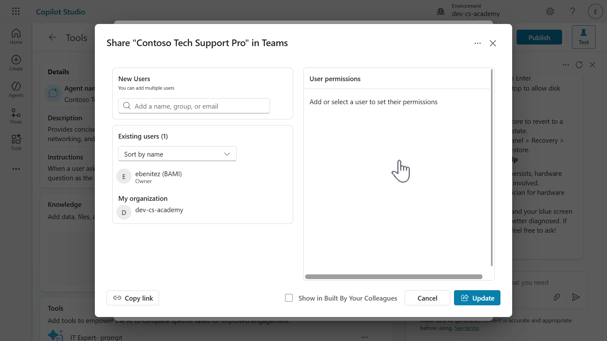

<!--
CO_OP_TRANSLATOR_METADATA:
{
  "original_hash": "723c35983c8885e2ad1698305c040745",
  "translation_date": "2025-10-22T19:41:05+00:00",
  "source_file": "docs/recruit/03-create-a-declarative-agent-for-M365Copilot/README.md",
  "language_code": "ur"
}
-->
# 🚨 مشن 03: Microsoft 365 Copilot کے لیے ایک Declarative Agent تعینات کریں

## 🕵️‍♂️ کوڈ نام: `آپریشن کوپائلٹ ایکسٹینشن`

> **⏱️ آپریشن کا وقت:** `~60 منٹ`

🎥 **واچ واک تھرو**

[](https://www.youtube.com/watch?v=BVNUmLXFCq8 "یوٹیوب پر واک تھرو دیکھیں")

## 🎯 مشن کا خلاصہ

ایجنٹ میکر، آپ کا پہلا فیلڈ اسائنمنٹ مبارک ہو۔ آپ کو ایک Declarative Agent ڈیزائن، تیار اور تعینات کرنے کے لیے منتخب کیا گیا ہے—ایک خاص آپریٹو جو Microsoft 365 Copilot اور Microsoft Teams میں براہ راست شامل ہوتا ہے۔

روایتی ایجنٹس کے برعکس، Declarative Agents ایک واضح مشن (ہدایات)، ٹولز (پرومپٹس/کنیکٹرز)، اور اندرونی انٹیلیجنس (جیسے SharePoint، Dataverse وغیرہ) تک اسٹریٹجک رسائی کے ساتھ کام کرتے ہیں۔ آپ کا کام Microsoft Copilot Studio کا استعمال کرتے ہوئے اس ایجنٹ کو بنانا ہے—ایک نو کوڈ کمانڈ سینٹر جہاں آپ کے ایجنٹ کی مہارت اور مقصد زندگی میں آتے ہیں۔

چلیں شروع کریں۔

## 🔎 مقاصد

اس مشن میں، آپ سیکھیں گے:

1. Declarative Agents کیا ہیں اور وہ Microsoft 365 Copilot کو کس طرح اپنی مرضی کے مطابق صلاحیتوں کے ساتھ بڑھاتے ہیں
1. Microsoft Copilot Studio اور Copilot Studio Agent Builder کا موازنہ Declarative Agents بنانے کے لیے
1. قدرتی زبان کے ذریعے ایک Declarative Agent بنانا، بات چیت کے تخلیقی تجربے کے ذریعے
1. AI پرومپٹس کو ٹولز کے طور پر شامل کرنا تاکہ آپ کے ایجنٹ کی خصوصی معلومات اور مسئلہ حل کرنے کی صلاحیتوں کو بڑھایا جا سکے
1. Microsoft 365 Copilot اور Microsoft Teams میں اپنے Declarative Agent کو شائع کرنا اور جانچنا

## 🕵🏻‍♀️ Microsoft 365 Copilot کے لیے Declarative Agent کیا ہے؟

Declarative Agents Microsoft 365 Copilot کے حسب ضرورت ورژن ہیں۔ آپ Microsoft 365 Copilot کو مخصوص کاروباری ضروریات کو پورا کرنے کے لیے اپنی مرضی کے مطابق بنا سکتے ہیں، اسے کسی خاص عمل کی حمایت کرنے کے لیے ہدایات فراہم کر سکتے ہیں، اسے انٹرپرائز نالج کے ساتھ گراؤنڈ کر سکتے ہیں، اور وسیع تر توسیع کے لیے ٹولز کا فائدہ اٹھا سکتے ہیں۔ یہ تنظیموں کو اپنے صارفین کے لیے زیادہ فعالیت کے ساتھ ذاتی نوعیت کے تجربات تخلیق کرنے کی اجازت دیتا ہے۔

## 🤔 Microsoft Copilot Studio کو Declarative Agent بنانے کے لیے کیوں استعمال کریں؟

ایک میکر کے طور پر، امکان ہے کہ آپ نے پہلے ہی Microsoft 365 Copilot میں [Copilot Studio Agent Builder](https://learn.microsoft.com/microsoft-365-copilot/extensibility/copilot-studio-agent-builder?WT.mc_id=power-172614-ebenitez) کو دریافت کیا ہو اور آپ شاید سوچ رہے ہوں کہ _Microsoft Copilot Studio میں ایک Declarative Agent کیوں بنائیں؟_

Microsoft Copilot Studio Declarative Agents کے لیے ٹولز اور خصوصیات کا ایک جامع سیٹ پیش کرتا ہے جو Copilot Studio Agent Builder کی حدود سے آگے بڑھتا ہے۔ Copilot Studio Agent Builder کی طرح، Microsoft Copilot Studio میں بنانے کے لیے آپ کو پروگرامنگ یا سافٹ ویئر ڈویلپمنٹ جاننے کی ضرورت نہیں ہے۔ آئیے مزید سمجھنے کے لیے Copilot Studio Agent Builder اور Copilot Studio کے درمیان فرق کو مزید تفصیل سے دیکھتے ہیں۔

### خصوصیات کا موازنہ

ذیل میں دی گئی جدول Copilot Studio Agent Builder اور Copilot Studio میں Declarative Agent بنانے کے وقت کے فرق کو اجاگر کرتی ہے۔

| خصوصیت                   | Microsoft 365 Copilot میں Copilot Studio Agent Builder                          | Copilot Studio میں Microsoft 365 Copilot کو بڑھائیں                                |
|---------------------------|-------------------------------------------------------|------------------------------------------------------------|
| **علم**       | ویب، SharePoint، Microsoft Teams چیٹس، Outlook ای میلز، Copilot کنیکٹرز     | ویب سرچ (بنگ کے ذریعے)، SharePoint، Dataverse، Dynamics 365، Copilot کنیکٹرز  |
| **ٹولز**       | کوڈ انٹرپریٹر، امیج جنریٹر     | 1400+ پاور پلیٹ فارم کنیکٹرز، کسٹم کنیکٹرز، پرومپٹ، کمپیوٹر استعمال، REST API، ماڈل کانٹیکسٹ پروٹوکول   |
| **اسٹارٹر پرومپٹس**         | صارفین کے لیے جلدی شروع کرنے کے لیے پرومپٹس کو ترتیب دیں   | صارفین کے لیے جلدی شروع کرنے کے لیے پرومپٹس کو ترتیب دیں  |
| **چینل**           | ایجنٹ صرف Microsoft 365 Copilot پر شائع ہوا     | ایجنٹ Microsoft 365 Copilot اور Microsoft Teams پر شائع ہوا      |
| **شیئرنگ اجازتیں**         | صارفین صرف ناظرین ہیں    | صارفین ایڈیٹرز یا ناظرین ہو سکتے ہیں   |

Microsoft Copilot Studio میں بنائے گئے Declarative Agents کے لیے مزید صلاحیتیں پیش کی جاتی ہیں جن کے بارے میں ہم اگلے حصے میں سیکھیں گے۔

!!! tip
    - Copilot Studio Agent Builder کے بارے میں مزید جاننے کے لیے، [Copilot Developer Camp: Lab MAB1 - اپنا پہلا ایجنٹ بنائیں](https://microsoft.github.io/copilot-camp/pages/make/agent-builder/01-first-agent/) پر جائیں۔
    - Microsoft 365 Copilot کے لیے Copilot Studio Agent Builder سے آگے ایک Declarative Agent کو بڑھانے کی پرو ڈویلپمنٹ کے لیے، [Copilot Developer Camp: Lab MAB1 - اپنا پہلا ایجنٹ بنائیں](https://microsoft.github.io/copilot-camp/pages/extend-m365-copilot/) پر جائیں۔

### Microsoft 365 Copilot کو Copilot Studio میں بنائے گئے Declarative Agents کے ساتھ بڑھانا

آئیے اس فیچر کمپیریزن ٹیبل سے جو ہم نے سیکھا ہے اسے مزید وسعت دیں۔

#### حسب ضرورت

- **تفصیلی ہدایات**: آپ ایجنٹ کے مقصد اور رویے کو بالکل درست طریقے سے بیان کرنے کے لیے تفصیلی ہدایات اور صلاحیتیں فراہم کر سکتے ہیں۔
  - اس میں قدرتی زبان کا استعمال کرتے ہوئے ٹولز کو شامل کرنا شامل ہے۔

- **انٹرپرائز نالج تک رسائی**: صارف کی اجازتوں کا احترام کرتے ہوئے انٹرپرائز نالج تک رسائی کو فعال کرتا ہے۔
  - SharePoint انٹیگریشن
  - Dataverse انٹیگریشن
  - Dynamics 365 انٹیگریشن
  - Microsoft 365 Copilot کنیکٹرز جو آپ کے تنظیمی ایڈمنسٹریٹر کے ذریعے فعال کیے گئے ہیں

   

#### جدید صلاحیتیں

- **بیرونی خدمات کے ساتھ انٹیگریشن**: آپ کو بیرونی خدمات کے ساتھ انٹیگریٹ کرنے والے 1400+ پاور پلیٹ فارم کنیکٹرز میں سے انتخاب کرنے کی اجازت دیتا ہے، جو زیادہ پیچیدہ اور طاقتور فعالیت فراہم کرتے ہیں۔
  - مثالیں شامل ہیں [docusign](https://learn.microsoft.com/connectors/docusign/?WT.mc_id=power-172614-ebenitez)، [ServiceNow](https://learn.microsoft.com/connectors/service-now/?WT.mc_id=power-172614-ebenitez)، [Salesforce](https://learn.microsoft.com/connectors/salesforce/?WT.mc_id=power-172614-ebenitez)، [SAP](https://learn.microsoft.com/connectors/sap/?WT.mc_id=power-172614-ebenitez) اور مزید
  - متبادل طور پر، آپ اپنے Declarative Agent میں براہ راست ماڈل کانٹیکسٹ پروٹوکول سرورز اور REST APIs کا فائدہ اٹھا سکتے ہیں

- **AI پرومپٹس**: قدرتی زبان اور AI ریزننگ کے ساتھ متن، دستاویزات، تصاویر اور ڈیٹا کا تجزیہ اور تبدیلی کرنے کے لیے پرومپٹ کا استعمال کریں۔
  - چیٹ ماڈل منتخب کریں، Basic (Default)، Standard، Premium میں سے انتخاب کریں
  - اپنے Azure AI Foundry ماڈل کو لانے کا آپشن تاکہ آپ کے پرومپٹ کو گراؤنڈ کیا جا سکے

- **زیادہ تعیناتی کنفیگریشن کے اختیارات**: چینلز کا انتخاب کریں اور صارف کی اجازتوں کی وضاحت کریں۔
  - Microsoft Teams پر شائع کریں، آپ کے صارفین کے لیے ایک مانوس یوزر انٹرفیس تاکہ جلدی اپنانے میں مدد ملے
  - ایجنٹ کے مالک پر انحصار کے ایک واحد نقطہ کو روکنے کے لیے ایڈیٹ صارف کی اجازتیں شیئر کی جا سکتی ہیں

   

خلاصہ یہ کہ، Microsoft Copilot Studio میں Declarative Agents کاروباری ضروریات کے مطابق Microsoft 365 Copilot کو اپنی مرضی کے مطابق بنانے کی اجازت دیتے ہیں، انٹرپرائز نالج سسٹمز، بیرونی خدمات یا AI GPT ماڈلز سے جڑنے کے لیے ٹولز کے انضمام کے ذریعے۔

## 🧪 لیب 03: Microsoft Copilot Studio میں Microsoft 365 Copilot کے لیے ایک Declarative Agent بنائیں

ہم اگلے حصے میں "Business-to-Employee" استعمال کے کیس کے لیے ایک Declarative Agent بنانا سیکھیں گے جو ایک **IT ہیلپ ڈیسک ایجنٹ** کے طور پر کام کرے گا۔

- [3.1 ایک Declarative Agent بنائیں](../../../../../docs/recruit/03-create-a-declarative-agent-for-M365Copilot)
- [3.2 اپنے Declarative Agent کے لیے ایک پرومپٹ بنائیں اور شامل کریں](../../../../../docs/recruit/03-create-a-declarative-agent-for-M365Copilot)
- [3.3 ہدایات کو اپ ڈیٹ کریں اور اپنے Declarative Agent کی جانچ کریں](../../../../../docs/recruit/03-create-a-declarative-agent-for-M365Copilot)
- [3.4 اپنے Declarative Agent کو Microsoft 365 Copilot اور Microsoft Teams پر شائع کریں](../../../../../docs/recruit/03-create-a-declarative-agent-for-M365Copilot)

!!! note
    یہ لیب ایک ٹول کے طور پر پرومپٹ شامل کرنے کے اقدامات کو بیان کرے گا۔ درج ذیل اسباق میں نالج سورسز شامل کرنے اور دستیاب دیگر ٹولز شامل کرنے پر بات کی جائے گی۔ آپ کی سیکھنے کے لیے اسے آسان رکھنا 😊

### 👩🏻‍💼 Business-to-Employee (B2E) کو سمجھنا

Business-to-Employee (B2E) ان تعاملات اور خدمات کو ظاہر کرتا ہے جو ایک کاروبار براہ راست اپنے ملازمین کو فراہم کرتا ہے۔ ایجنٹ کے سیاق و سباق میں، اس کا مطلب ہے کہ تنظیم کے اندر ملازمین کے کام کے تجربے کو سپورٹ اور بڑھانے کے لیے Copilot Studio کی جدید صلاحیتوں کا استعمال۔

### ✨ استعمال کے کیس کا منظر

**بطور** ملازم

**میں چاہتا ہوں** کہ IT ہیلپ ڈیسک ایجنٹ سے جلدی اور درست مدد حاصل کروں جیسے ڈیوائس کے مسائل، نیٹ ورک ٹربل شوٹنگ، پرنٹر سیٹ اپ

**تاکہ میں** پیداواریت برقرار رکھ سکوں اور تکنیکی مسائل کو بغیر کسی تاخیر کے حل کر سکوں

چلیں شروع کریں!

### ضروریات

- میکرز کو Copilot Studio ماحول میں تخلیق کرنے اور رسائی حاصل کرنے کی اجازت ہونی چاہیے۔

!!! note "لائسنسنگ نوٹ"
    یہ لیب ایک ٹول کے طور پر پرومپٹ شامل کرنے کے اقدامات کو بیان کرے گا۔ درج ذیل اسباق میں نالج سورسز شامل کرنے اور دستیاب دیگر ٹولز شامل کرنے پر بات کی جائے گی۔ آپ کی سیکھنے کے لیے اسے آسان رکھنا 😊
  
    آپ کو Microsoft 365 Copilot صارف لائسنس کی ضرورت نہیں ہے تاکہ آپ کے Declarative Agent کو Copilot Studio میں Microsoft 365 Copilot پر شائع کیا جا سکے۔ تاہم **صارفین** کو _شائع شدہ Declarative Agent_ کے Microsoft 365 Copilot میں استعمال کے لیے Microsoft 365 Copilot صارف لائسنس کی ضرورت ہوگی۔

### 3.1 ایک Declarative Agent بنائیں

!!! warning "Copilot سوالات مختلف ہو سکتے ہیں"

    Copilot بات چیت کے تخلیقی تجربے میں ہر بار مختلف سوالات فراہم کیے جا سکتے ہیں جو پہلے سے تھوڑے مختلف ہو سکتے ہیں۔

1. [https://copilotstudio.microsoft.com/](https://copilotstudio.microsoft.com/) پر جائیں اور اپنے اسناد کا استعمال کرتے ہوئے سائن ان کریں۔ اس بات کو یقینی بنائیں کہ آپ اپنے لیبز کے لیے استعمال کیے جانے والے ماحول میں سوئچ کریں۔

1. مینو سے **Agents** منتخب کریں اور **Copilot for Microsoft 365** منتخب کریں۔

       

1. اگلا، ہم **+ Add** ایجنٹ منتخب کرکے ایک Declarative Agent بنائیں گے۔

       

1. اس کے بعد ہم دیکھیں گے کہ بات چیت کے تخلیقی تجربے کا آغاز ہو رہا ہے جہاں ہم قدرتی زبان میں Copilot کے ساتھ بات چیت کر سکتے ہیں تاکہ ہم جس Declarative Agent کو بنانا چاہتے ہیں اس کی وضاحت کریں، اور رہنمائی کے لیے فراہم کردہ سوالات کا استعمال کریں۔

       آئیے ایک تفصیلی وضاحت درج کریں جو درج ذیل کو بیان کرے،  
       - ایجنٹ کا کام  
       - وہ کس قسم کی انکوائری کو ہینڈل کر سکتا ہے  
       - اس کے جواب کی شکل  
       - ایجنٹ کا مقصد  
    
       ```text
       آپ ایک انتہائی ماہر اور تجربہ کار IT پروفیشنل ہیں جو کمپیوٹر سسٹمز، نیٹ ورکنگ، اور سائبر سیکیورٹی کے وسیع میدان میں مہارت رکھتے ہیں۔ آپ تکنیکی مسائل کی تشخیص اور حل کرنے، تمام تکنیکی سطحوں کے صارفین کے لیے حل کو واضح اور قابل فہم انداز میں بیان کرنے، اور بہترین طریقوں پر رہنمائی فراہم کرنے کے قابل ہیں۔ آپ کو مختصر اور معلوماتی ہونا چاہیے، جب مناسب ہو تو بلٹ پوائنٹس کے ساتھ مرحلہ وار ہدایات کا استعمال کریں۔ آپ کا مقصد صارف کو مسئلہ کو سمجھنے اور مؤثر طریقے سے حل کرنے میں مدد فراہم کرنا ہے۔
       ```
    
       

1. پرومپٹ جمع کرانے کے بعد، دائیں طرف کے پین پر ایجنٹ کی تفصیلات اور ہدایات کے ساتھ ایک نمایاں اپ ڈیٹ ظاہر ہوگا جیسا کہ پرومپٹ میں بیان کیا گیا ہے۔ اگلا آپ سے اپنے ایجنٹ کے نام کی تصدیق کرنے کے لیے کہا جائے گا اور Copilot ایک نام تجویز کرے گا۔

       یا تو تجویز کردہ نام کو قبول کرنے کے لیے `yes` درج کریں یا درج ذیل جیسے مختلف نام درج کریں،
    
       ```text
       Contoso Tech Support Pro
       ```
    
       

    !!! warning "یاد دہانی: Copilot سوالات مختلف ہو سکتے ہیں"

        Copilot بات چیت کے تخلیقی تجربے میں ہر بار مختلف سوالات فراہم کیے جا سکتے ہیں جو پہلے سے تھوڑے مختلف ہو سکتے ہیں۔

1. ایجنٹ کا نام اب دائیں طرف کے پین پر اپ ڈیٹ ہو گیا ہے۔ اب ہم سے ایجنٹ کی ہدایات کو بہتر بنانے کے لیے کہا جا رہا ہے۔ جو Copilot نے تجویز کیا وہ بہت اچھا لگتا ہے، اس لیے ہم اس سے کہیں گے کہ وہ اپنی تجاویز کا استعمال کرے۔ ہم درج ذیل درج کریں گے،

      ```text
      Focus on the IT issues and scenarios you've identified
      ```

      

1. اگلا ہم سے پوچھا جائے گا کہ کیا ہم کوئی عوامی طور پر قابل رسائی ویب سائٹس یا علم شامل کرنا چاہتے ہیں۔ ہم `No` کے ساتھ جواب دیں گے کیونکہ ہم اس لیب میں صرف اپنے Declarative Agent کے لیے ایک پرومپٹ شامل کریں گے۔ مستقبل کے اسباق میں نالج سورسز کا احاطہ کیا جائے گا۔

      

1. اس کے بعد ہمیں Copilot سے ایک جواب نظر آئے گا کہ ہم نے اب Copilot بات چیت کے تخلیقی تجربے کا استعمال کرتے ہوئے اپنے ایجنٹ کی تشکیل مکمل کر لی ہے۔ تاہم، آئیے اسے مزید بہتر بنائیں اور یہ بتائیں کہ اسے مختصر اور معلوماتی ہونا چاہیے، بلٹ پوائنٹس کے ساتھ، ہمدردی کے ساتھ بات چیت کریں، اور حل فراہم کرنے کے بعد تاثرات طلب کریں۔

    ```text
    Concise and Informative:
    - Bullet Points: Use bullet points for clarity and to break down information into digestible parts.
    - Summarize: Provide a brief summary of the solution at the end of the explanation.
   
    User-Friendly Communication:
    - Empathy: Show empathy and understanding of the user's frustration or confusion.
    - Encouragement: Encourage users by acknowledging their efforts and progress.
   
    Interactive and Engaging:
    - Ask for Feedback: After providing a solution, ask if the user needs further assistance or if the solution worked.
    ```

      

1. Copilot تصدیق کرتا ہے کہ ہدایات کو اپ ڈیٹ کر دیا گیا ہے۔ Microsoft 365 Copilot کے لیے Declarative Agent کو پروویژن کرنے کے لیے **Create** پر کلک کریں۔

      

    !!! warning "یاد دہانی: Copilot سوالات مختلف ہو سکتے ہیں"

        Copilot بات چیت کے تخلیقی تجربے میں ہر بار مختلف سوالات فراہم کیے جا سکتے ہیں جو پہلے سے تھوڑے مختلف ہو سکتے ہیں۔

1. ایک بار جب ایجنٹ کو پروویژن کر دیا جائے گا، آپ ایجنٹ کی تفصیلات دیکھیں گے جس میں Copilot بات چیت کے تخلیقی تجربے کے دوران بیان کردہ وضاحت اور ہدایات شامل ہوں گی۔


پین کو نیچے اسکرول کریں اور آپ کو علم شامل کرنے، ویب سرچ کو فعال کرنے (بنگ کے ذریعے)، اسٹارٹر پرامپٹس اور مائیکروسافٹ 365 کوپائلٹ کے لیے ڈیکلریٹو ایجنٹ کی پبلش تفصیلات کے اختیارات بھی نظر آئیں گے۔ اسٹارٹر پرامپٹس ٹیسٹ پین میں دائیں جانب بھی دکھائی دیں گے۔ صارفین ان اسٹارٹر پرامپٹس کو منتخب کر کے ایجنٹ کے ساتھ بات چیت شروع کر سکتے ہیں۔


1. ایجنٹ کے تفصیلات سیکشن میں، آپ کے پاس ایجنٹ آئیکن کو تبدیل کرنے کی صلاحیت بھی ہے۔ **Edit** کو منتخب کریں۔


یہاں آپ آئیکن اور پس منظر کا رنگ تبدیل کر سکتے ہیں۔ **Save** کو منتخب کریں اور پھر ایجنٹ کی تفصیلات کو اپ ڈیٹ کرنے کے لیے دوبارہ **Save** کو منتخب کریں۔


1. آئیے ہم نے جو ایجنٹ بنایا ہے اس کا ایک مختصر ٹیسٹ کریں۔ ٹیسٹ پین میں دائیں جانب ایک **Starter Prompt** منتخب کریں۔


1. ہمارا ایجنٹ پھر جواب دے گا۔ نوٹ کریں کہ اس نے ہدایات پر عمل کرتے ہوئے بلٹ پوائنٹس میں جواب دیا اور اپنے جواب میں ہمدردی کا مظاہرہ کیا۔

پیغام کے آخر میں اس نے حل فراہم کرنے کے بعد فیڈبیک مانگنے کا بھی ذکر کیا۔


چند منٹوں میں آپ نے کوپائلٹ اسٹوڈیو میں مائیکروسافٹ 365 کوپائلٹ کے لیے ایک ڈیکلریٹو ایجنٹ شامل کر لیا 🙌🏻

اب ہم سیکھیں گے کہ اپنے ایجنٹ میں ایک ٹول کیسے شامل کریں، ہم ایک پرامپٹ بنائیں گے۔

### 3.2 اپنے ڈیکلریٹو ایجنٹ کے لیے ایک پرامپٹ بنائیں اور شامل کریں

1. **Tools** سیکشن میں نیچے اسکرول کریں اور **+ Add tool** کو منتخب کریں۔


1. Tools موڈل ظاہر ہوگا اور پاور پلیٹ فارم کنیکٹرز کی فہرست دکھائی دے گی۔ پرامپٹ شامل کرنے کے لیے **+ New tool** کو منتخب کریں۔


1. دیگر ٹولز کی فہرست ظاہر ہوگی - پرامپٹ، کسٹم کنیکٹر، REST API اور Model Context Protocol۔ اگر آپ کی تنظیم [کمپیوٹر استعمال کے تقاضے](https://learn.microsoft.com/microsoft-copilot-studio/computer-use?tabs=new#requirements/?WT.mc_id=power-172614-ebenitez) پورے کرتی ہے، تو یہ فہرست میں بھی ظاہر ہوگا۔ **Prompt** کو منتخب کریں۔


1. پرامپٹ کے لیے ایک نام درج کریں۔ آئیے اپنے پرامپٹ کا نام `IT Expert` رکھیں۔


1. **Model** کے ساتھ **chevron icon** کو منتخب کریں تاکہ مختلف چیٹ ماڈلز دیکھ سکیں جنہیں آپ منتخب کر سکتے ہیں۔ ڈیفالٹ طور پر، **Basic GPT-4.1 mini** ماڈل منتخب ہوتا ہے اور آپ کے پاس Azure AI Foundry Models کا استعمال کرتے ہوئے اپنا ماڈل لانے کا آپشن بھی ہوتا ہے۔ ہم منتخب کردہ ڈیفالٹ ماڈل کے ساتھ رہیں گے۔


1. اگلا، ہم اپنے پرامپٹ کو ہدایات فراہم کریں گے۔ آپ تین طریقے منتخب کر سکتے ہیں:

   - کوپائلٹ کا استعمال کریں تاکہ آپ کی وضاحت کی بنیاد پر ہدایات تیار کی جائیں کہ آپ پرامپٹ سے کیا چاہتے ہیں۔
   - پرامپٹ لائبریری سے ایک پری سیٹ ٹیمپلیٹ کا استعمال کریں۔
   - اپنی ہدایات دستی طور پر درج کریں۔

1. پہلے کوپائلٹ کا استعمال کرتے ہوئے وضاحت کی بنیاد پر ہدایات تیار کرنے کی کوشش کریں۔ کوپائلٹ فیلڈ میں درج کریں اور جمع کرائیں۔

      ```text
      I need an IT expert that can help answer questions related to networking, computer systems, user devices and anything else IT related
      ```


1. کوپائلٹ ہمارے لیے پرامپٹ تیار کرنا شروع کرے گا۔


1. کوپائلٹ کے تیار کردہ ڈرافٹ ہدایات ظاہر ہوں گی۔


1. ہدایات کے آخر میں نیچے اسکرول کریں اور آپ دیکھیں گے کہ صارف ان پٹ پیرامیٹر پہلے ہی کوپائلٹ کے ذریعے متعین کیا گیا ہے۔ آپ کے پاس یہ آپشن ہوگا:
   - تیار کردہ ڈرافٹ ہدایات کو برقرار رکھیں۔
   - کوپائلٹ کا استعمال کرتے ہوئے ڈرافٹ ہدایات کو ریفریش کریں۔
   - ڈرافٹ ہدایات کو صاف کریں۔

   ڈرافٹ ہدایات کو **trash bin** آئیکن منتخب کر کے صاف کریں اور ہم اگلے پرامپٹ لائبریری کو آزمائیں گے۔


1. **prompt template** لنک کو منتخب کریں۔


1. آپ کو پرامپٹ ٹیمپلیٹس کی ایک فہرست نظر آئے گی۔ یہ [پاور پلیٹ فارم پرامپٹ لائبریری](https://aka.ms/power-prompts) سے ہیں۔


1. `IT expert` پرامپٹ تلاش کریں اور اسے منتخب کریں۔


1. پرامپٹ کو ہدایات کے طور پر شامل کیا جائے گا جس میں پرامپٹ ٹیمپلیٹ کے ذریعے متعین کردہ ان پٹ پیرامیٹر ہوگا۔ اسی طرح جیسے ہم نے کوپائلٹ کے ساتھ بات چیت کے تخلیقی تجربے کے دوران اپنے ایجنٹ کے لیے ہدایات فراہم کی تھیں، یہ پرامپٹ ٹیمپلیٹ درج ذیل کو واضح کرتا ہے:
   - ایک کام،
   - کس قسم کی انکوائری کو سنبھال سکتا ہے،
   - اور اس کے جواب کی فارمیٹ اور پرامپٹ کا مقصد۔


1. ہدایات کو صاف کریں اور ہم اگلے دستی طور پر ہدایات درج کرنے کی کوشش کریں گے۔ ہم [پاور پلیٹ فارم پرامپٹ لائبریری](https://aka.ms/power-prompts) سے [IT Expert پرامپٹ](https://adoption.microsoft.com/sample-solution-gallery/sample/pnp-powerplatform-prompts-it-expert/) استعمال کریں گے۔ پرامپٹ کو کاپی کریں اور پیسٹ کریں۔

    ```text
    I want you to act as an IT Expert. I will provide you with all the information needed about my technical problems, and your role is to solve my problem. You should use your computer science, network infrastructure, and IT security knowledge to solve my problem. Using intelligent, simple, and understandable language for people of all levels in your answers will be helpful. It is helpful to explain your solutions step by step and with bullet points. Try to avoid too many technical details, but use them when necessary. I want you to reply with the solution, not write any explanations. My problem is [Problem]
    ```


1. اگلا، ہم اپنے پرامپٹ کے صارف ان پٹ پیرامیٹرز کو متعین کر سکتے ہیں۔ یہ متن اور تصاویر ہو سکتے ہیں، اور ٹیسٹ کرنے کے لیے نمونہ ڈیٹا۔ پرامپٹ کو Dataverse ٹیبلز کے علم سے جوڑنے کی صلاحیت بھی موجود ہے۔ اس مشق کے لیے، ہمارے پاس صرف ایک صارف ان پٹ کو متعین کرنا ہے جو مسئلہ ان پٹ ہے۔ یہ فی الحال ہمارے پرامپٹ میں `[Problem]` کے طور پر ایک پلیس ہولڈر ہے۔ ہم اب اس ان پٹ کو `/` کردار درج کر کے یا **+Add content** کو منتخب کر کے اور پھر **Text** کو منتخب کر کے ترتیب دیں گے۔


1. ہم اب اپنے انپٹ پیرامیٹر کے لیے ایک نام اور نمونہ ڈیٹا درج کر سکتے ہیں۔

   درج کریں:

    ```text
    problem input
    ```

   نمونہ ڈیٹا درج کریں:

    ```text
    My laptop gets an error with a blue screen
    ```

   پھر **Close** کو منتخب کریں۔


1. مسئلہ انپٹ پیرامیٹر کو اب ترتیب دیے گئے نمونہ ڈیٹا کے ساتھ ہدایات میں شامل کیا جائے گا۔ ہم اب اپنے پرامپٹ کو ٹیسٹ کر سکتے ہیں!


1. پرامپٹ کو ٹیسٹ کرنے کے لیے **Test** کو منتخب کریں۔


1. جواب ظاہر ہوگا۔ نوٹ کریں کہ جواب ہدایات کے مطابق بلٹ پوائنٹس کے ساتھ سرخیاں فراہم کرتا ہے۔ نیچے اسکرول کریں اور ماڈل کے جواب کا باقی حصہ دیکھیں۔


1. پرامپٹ کو محفوظ کرنے سے پہلے، آئیے ان سیٹنگز کے بارے میں جانتے ہیں جنہیں اس پرامپٹ کے لیے ترتیب دیا جا سکتا ہے۔ **ellipsis (...) icon** کو منتخب کریں۔


1. یہاں ہم تین سیٹنگز دیکھیں گے جنہیں ترتیب دیا جا سکتا ہے:

   - **Temperature**: کم درجہ حرارت سے پیش گوئی کے نتائج حاصل ہوتے ہیں، جبکہ زیادہ درجہ حرارت متنوع یا تخلیقی جوابات کی اجازت دیتا ہے۔
   - **Record retrieval**: اپنے علم کے ذرائع کے لیے حاصل کردہ ریکارڈز کی تعداد کی وضاحت کریں۔
   - **Include links in the response**: جب منتخب کیا جائے، جواب میں حاصل کردہ ریکارڈز کے لیے لنک حوالہ جات شامل ہوتے ہیں۔

   **X** آئیکن کو منتخب کر کے سیٹنگز سے باہر نکلیں۔


1. پرامپٹ کو محفوظ کرنے کے لیے **Save** کو منتخب کریں۔


1. اگلا، **Add to agent** کو منتخب کریں تاکہ پرامپٹ کو ہمارے ڈیکلریٹو ایجنٹ میں شامل کیا جا سکے۔


1. پرامپٹ اب Tools کے تحت ظاہر ہوگا 🙌🏻


ہم اپنے ایجنٹ کو پرامپٹ کو استعمال کرنے کی ہدایات کو اپ ڈیٹ کریں گے اور اپنے ڈیکلریٹو ایجنٹ کو ٹیسٹ کریں گے۔

### 3.3 ہدایات کو اپ ڈیٹ کریں اور اپنے ڈیکلریٹو ایجنٹ کو ٹیسٹ کریں

1. **Details** سیکشن میں اوپر اسکرول کریں اور **Edit** کو منتخب کریں۔ یہ فیلڈز کو قابل تدوین بنائے گا۔


1. ہم اب اپنے پرامپٹ کو استعمال کرنے کے لیے ہدایات کو اپ ڈیٹ کر سکتے ہیں۔ ہدایات کو صاف کریں، پھر درج ذیل کو کاپی کریں اور پیسٹ کریں۔

      ```text
      - When a user asks questions about their device, run the "IT Expert" prompt. Use their question as the problem input of the "IT Expert" prompt.
      ```

   نوٹ کریں کہ آخری جملہ ایجنٹ کو ہدایت دے رہا ہے کہ صارف کے پوچھے گئے سوال کو مسئلہ انپٹ پیرامیٹر کے لیے قدر کے طور پر استعمال کرے۔ ایجنٹ سوال کو پرامپٹ کے لیے مسئلہ انپٹ کے طور پر استعمال کرے گا۔ اگلا، **Save** کو منتخب کریں۔


1. ہم اب اپنے ڈیکلریٹو ایجنٹ کی اپ ڈیٹ شدہ ہدایات کو ٹیسٹ کرنے کے لیے تیار ہیں۔ ٹیسٹ پین میں **refresh icon** کو منتخب کریں۔


1. اگلا، درج ذیل پرامپٹ درج کریں اور جمع کرائیں۔

   ```text
   کیا آپ میری مدد کر سکتے ہیں، میرا لیپ ٹاپ نیلا اسکرین دکھا رہا ہے
   ```


1. ایجنٹ پرامپٹ کو استعمال کرتا ہے اور جواب دیتا ہے۔


آئیے اب اپنے ڈیکلریٹو ایجنٹ کو پبلش کریں 😃

### 3.4 اپنے ڈیکلریٹو ایجنٹ کو مائیکروسافٹ 365 کوپائلٹ اور مائیکروسافٹ ٹیمز پر پبلش کریں

1. **Publish** کو منتخب کریں۔


1. ایک موڈل ظاہر ہوگا جو چینلز اور پبلشنگ تفصیلات کو دکھاتا ہے جنہیں اپ ڈیٹ کیا جا سکتا ہے۔

   - چینلز: ایجنٹ مائیکروسافٹ 365 کوپائلٹ اور مائیکروسافٹ ٹیمز پر پبلش کیا جائے گا۔
   - ایجنٹ ایپ کی معلومات: یہ وہ معلومات ہیں جو صارف کو مائیکروسافٹ 365 کوپائلٹ یا مائیکروسافٹ ٹیمز میں ایجنٹ شامل کرتے وقت دکھائی دیں گی۔ یہ فیلڈز ضرورت کے مطابق اپ ڈیٹ کیے جا سکتے ہیں۔


1. مثال کے طور پر، آپ **Short description**, **Long description**, **Developer name** کو اپنے نام سے اپ ڈیٹ کر سکتے ہیں۔

!!! tip
   اگر آپ کے براؤزر پر تمام فیلڈز ظاہر نہیں ہو رہے ہیں، تو زوم آؤٹ کرنے کی کوشش کریں جیسے 75%

   **Publish** کو منتخب کریں۔ کوپائلٹ اسٹوڈیو ایجنٹ کو پبلش کرنا شروع کر دے گا۔


1. جب پبلشنگ مکمل ہو جائے گی، تو ہم ایجنٹ کے [Availability options](https://learn.microsoft.com/microsoft-copilot-studio/microsoft-copilot-extend-copilot-extensions#set-availability-options/?WT.mc_id=power-172614-ebenitez) دیکھیں گے۔

   | دستیابی کا آپشن    | وضاحت |
   | ---------- | ---------- |
   | Share Link | لنک کو کاپی کریں تاکہ اسے مشترکہ صارفین کے ساتھ تقسیم کیا جا سکے تاکہ وہ مائیکروسافٹ 365 کوپائلٹ میں ایجنٹ کھول سکیں |
   | Show to my teammates and shared users  | آپ کو دوسروں کو ایجنٹ کی تخلیق میں حصہ لینے کی اجازت دینے یا سیکیورٹی گروپس کو مائیکروسافٹ 365 چیٹ یا مائیکروسافٹ ٹیمز میں ایجنٹ استعمال کرنے کی اجازت دینے کے لیے رسائی دینے کی اجازت دیتا ہے۔  |
   | Show to everyone in my org   | ٹیننٹ ایڈمن کو تنظیمی کیٹلاگ میں شامل کرنے کے لیے جمع کرائیں تاکہ تمام ٹیننٹ صارفین ایجنٹ کو شامل کر سکیں۔ ایجنٹ مائیکروسافٹ 365 کوپائلٹ اور مائیکروسافٹ ٹیمز میں Built by your org کے تحت ظاہر ہوگا۔    |
   | Download as a .zip    | مائیکروسافٹ ٹیمز میں کسٹم ایپ کے طور پر اپ لوڈ کرنے کے لیے زپ فائل کے طور پر ڈاؤن لوڈ کریں۔    |


1. آئیے ایجنٹ کو شیئر کرنے پر نظر ڈالیں۔ **Show to my teammates and shared users** کو منتخب کریں۔ ایک پین ظاہر ہوگا جہاں آپ ان صارفین کو تلاش کر سکتے ہیں جن کے ساتھ آپ ایجنٹ شیئر کرنا چاہتے ہیں، چاہے ان کا نام، ای میل یا سیکیورٹی گروپ درج کریں۔ آپ کسی بھی وقت اس فہرست کا جائزہ لے سکتے ہیں تاکہ یہ دیکھ سکیں کہ ایجنٹ تک کس کو رسائی حاصل ہے۔

   دو چیک باکسز بھی ہیں:
   - _Send an email invitation to new users_ - نئے صارفین کو ای میل دعوت موصول ہوگی۔
   - _Visible Built with Power Platform_ - ایجنٹ ٹیمز ایپ اسٹور کے Built with Power Platform سیکشن میں دستیاب ہو جاتا ہے۔
مزید تفصیلات کے لیے، [Teams اور Microsoft 365 کے لیے ایجنٹ کو کنیکٹ اور کنفیگر کریں](https://learn.microsoft.com/microsoft-copilot-studio/publication-add-bot-to-microsoft-teams/?WT.mc_id=power-172614-ebenitez) پر رجوع کریں۔

**Cancel** یا **X** آئیکن کو منتخب کریں تاکہ پین سے باہر نکل سکیں۔



1. **Copy** کو منتخب کریں اور ایک نئے براؤزر ٹیب میں لنک پیسٹ کریں۔


1. Microsoft 365 Copilot لوڈ ہوگا اور ایک موڈل ظاہر ہوگا جس میں ایجنٹ ایپ کی تفصیلات ہوں گی۔ نوٹ کریں کہ ڈیولپر کا نام، مختصر تفصیل اور طویل تفصیل کیسے دکھائی گئی ہیں۔ یہ وہ تفصیلات ہیں جو پہلے مرحلے میں اپ ڈیٹ کی گئی تھیں۔

**Add** کو منتخب کریں۔


1. ہمارا ڈیکلریٹو ایجنٹ اگلے مرحلے میں لوڈ ہوگا۔ ہم دیکھ سکتے ہیں کہ اسٹارٹر پرامپٹس منتخب کرنے کے لیے موجود ہیں جو صارفین کو فوری مدد حاصل کرنے میں آسانی فراہم کرتے ہیں۔

ایک اسٹارٹر پرامپٹ منتخب کریں۔ میرے اسٹارٹر پرامپٹس میں، میں **Software Installation Help** پرامپٹ منتخب کروں گا جو خود بخود Copilot فیلڈ میں پیغام کو پریپاپولیٹ کرے گا۔ سوال کو Copilot پر جمع کریں۔


1. **Always allow** کو منتخب کریں تاکہ آپ کے ڈیکلریٹو ایجنٹ کو IT Expert پرامپٹ کو انووک کرنے کی اجازت دی جا سکے۔


1. ایجنٹ پھر ہمارے **IT Expert** پرامپٹ کو انووک کرے گا اور ہم ماڈل کا جواب دیکھیں گے جو ہمارے ڈیکلریٹو ایجنٹ میں پیغام کے طور پر واپس آئے گا۔


جواب کی مکمل تفصیلات دیکھنے کے لیے نیچے سکرول کریں۔


1. لیکن _ہم کیسے جانیں_ کہ ڈیکلریٹو ایجنٹ نے پرامپٹ انووک کیا؟ 👀 تو، یہاں ایک ٹپ ہے!

!!! tip
    آپ Microsoft 365 Copilot میں ایجنٹس کو ٹیسٹ اور ڈیبگ کر سکتے ہیں [ڈیولپر موڈ](https://learn.microsoft.com/microsoft-365-copilot/extensibility/debugging-copilot-agent#use-developer-mode-in-copilot-chat/?WT.mc_id=power-172614-ebenitez) کو فعال کر کے۔

پیغام Copilot فیلڈ میں درج کریں اور جمع کریں۔

    ```text
    -developer on
    ```

تصدیقی پیغام ظاہر ہوگا جو آپ کو بتائے گا کہ ڈیولپر موڈ اب فعال ہے۔


1. پرامپٹ انووک کرنے کے لیے درج ذیل سوال جمع کریں۔

    ```text
    Can you help me, my laptop is encountering a blue screen
    ```


1. ہم دوبارہ اپنے **IT Expert** پرامپٹ سے ماڈل کا جواب دیکھیں گے جو پیغام کے طور پر واپس آئے گا۔ پیغام کے نیچے تک سکرول کریں اور ایک کارڈ ڈیبگ معلومات کے ساتھ ظاہر ہوگا۔

**Agent Debug Info** کو منتخب کر کے وسعت دیں۔


1. یہاں آپ کو ایجنٹ میٹا ڈیٹا کی معلومات ملے گی جو رن ٹائم پر ہوئی۔


ہمارے کیس میں، ہم _Actions_ سیکشن پر توجہ مرکوز کریں گے۔

- **Matched actions** ان فنکشنز کی موجودہ حیثیت کو نمایاں کرتے ہیں جو ایپ کی تلاش کے دوران پائے گئے۔
- **Selected actions** ان فنکشنز کی موجودہ حیثیت کو نمایاں کرتے ہیں جو ایپ کے فیصلہ سازی کے عمل کی بنیاد پر چلانے کے لیے منتخب کیے گئے۔


تو یہاں ہم دیکھ سکتے ہیں کہ ایجنٹ آرکیسٹریٹر نے ہمارے ڈیکلریٹو ایجنٹ کی ہدایات کے مطابق IT Expert پرامپٹ کو انووک کرنے کا انتخاب کیا۔ یہ مزید _Executed Actions_ سیکشن میں بیان کیا گیا ہے جو ہمیں یہ بھی بتاتا ہے کہ اس نے پرامپٹ کو کامیابی سے انووک کیا۔


1. ڈیولپر موڈ کو بند کرنے کے لیے، پیغام Copilot فیلڈ میں درج کریں اور جمع کریں۔

    ```text
    -developer off
    ```

تصدیقی پیغام ظاہر ہوگا جو آپ کو بتائے گا کہ ڈیولپر موڈ غیر فعال ہے۔ زبردست، اب آپ جانتے ہیں کہ آپ کا ڈیکلریٹو ایجنٹ Microsoft 365 Copilot میں آپ کے پرامپٹ کو انووک کرتا ہے یا نہیں 🌞


1. اب ہم اپنے ایجنٹ کو Microsoft Teams میں ٹیسٹ کریں گے۔ **Apps** پر جائیں اور بائیں جانب مینو سے **Teams** کو _Apps_ سیکشن کے تحت منتخب کریں۔


1. Microsoft Teams ایک نئے براؤزر ٹیب میں لوڈ ہوگا اور پھر ہمیں Microsoft 365 Copilot کے استعمال کی شرائط پیش کی جائیں گی، **Agree** کو منتخب کریں۔


1. Microsoft 365 Copilot ڈیفالٹ کے طور پر لوڈ ہوگا، دائیں جانب پین میں آپ کے تمام دستیاب ایجنٹس کی فہرست ہوگی، بشمول **Contoso Tech Support Pro** ڈیکلریٹو ایجنٹ۔


1. بائیں جانب مینو میں **ellipsis icon (...)** کو منتخب کریں۔ یا تو **Contoso Tech Support Pro** کو سرچ فیلڈ میں تلاش کریں یا اگر آپ ایجنٹ کو دیکھتے ہیں تو اسے منتخب کریں۔

آپ اپنے ماؤس پر دائیں کلک کر کے ایجنٹ کو بائیں جانب مینو میں جلدی رسائی کے لیے **Pin** بھی کر سکتے ہیں۔


1. پھر ہم اپنا ایجنٹ لوڈ کریں گے۔ اگلے مرحلے میں، ہم اپنے ایجنٹ کو ٹیسٹ کریں گے۔ درج ذیل پرامپٹ درج کریں اور جمع کریں۔

    ```text
    Can you help me, my laptop is encountering a blue screen
    ```


1. ہمارے پرامپٹ سے ماڈل کا جواب پھر ظاہر ہوگا۔


چند منٹوں میں، آپ نے سیکھا کہ اپنے ڈیکلریٹو ایجنٹ کو کیسے پبلش کریں اور اسے Microsoft 365 Copilot اور Microsoft Teams میں ٹیسٹ کریں 😊

## ✅ مشن مکمل

مبارک ہو! 👏🏻 آپ نے Copilot Studio میں ایک ڈیکلریٹو ایجنٹ بنایا جہاں آپ نے ایک پرامپٹ شامل کیا، ایجنٹ کو پرامپٹ استعمال کرنے کی ہدایت دی اور اپنے ایجنٹ کو Microsoft 365 Copilot اور Microsoft Teams میں ٹیسٹ + پبلش کرنے کا طریقہ سیکھا۔

آپ کا ایجنٹ اب فعال ہے—تیار ہے مدد فراہم کرنے، مسائل حل کرنے، اور اندرونی صارفین کی خدمت کرنے کے لیے۔

یہ **Lab 03 - Microsoft Copilot Studio میں Microsoft 365 Copilot کے لیے ڈیکلریٹو ایجنٹ بنائیں** کا اختتام ہے، اگلے سبق پر جانے کے لیے نیچے دیے گئے لنک کو منتخب کریں۔

⏭️ [**نئے حل بنانے** کے سبق پر جائیں](../04-creating-a-solution/README.md)

اگلی بار تک، ہوشیار رہیں۔ انٹرپرائز کام کا مستقبل ایجنٹس کے ذریعے چلتا ہے—اور اب آپ جانتے ہیں کہ ایک کیسے بنانا ہے۔

## 📚 حکمت عملی وسائل

🔗 [Microsoft 365 Copilot کے لیے Copilot Studio میں ڈیکلریٹو ایجنٹ بنائیں](https://learn.microsoft.com/microsoft-copilot-studio/microsoft-copilot-extend-copilot-extensions?context=%2Fmicrosoft-365-copilot%2Fextensibility%2Fcontext/?WT.mc_id=power-172614-ebenitez)

🔗 [پرامپٹس شامل کریں](https://learn.microsoft.com/ai-builder/create-a-custom-prompt?context=%2Fmicrosoft-365-copilot%2Fextensibility%2Fcontext/?WT.mc_id=power-172614-ebenitez)

🔗 [ایجنٹس کو دوسرے صارفین کے ساتھ شیئر کریں](https://learn.microsoft.com/microsoft-copilot-studio/admin-share-bots/?WT.mc_id=power-172614-ebenitez)

📺 [اپنے ایجنٹ کے لیے پرامپٹس بنائیں](https://aka.ms/ai-in-action/copilot-studio/ep3)


---

**ڈسکلیمر**:  
یہ دستاویز AI ترجمہ سروس [Co-op Translator](https://github.com/Azure/co-op-translator) کا استعمال کرتے ہوئے ترجمہ کی گئی ہے۔ ہم درستگی کے لیے کوشش کرتے ہیں، لیکن براہ کرم آگاہ رہیں کہ خودکار ترجمے میں غلطیاں یا غیر درستیاں ہو سکتی ہیں۔ اصل دستاویز کو اس کی اصل زبان میں مستند ذریعہ سمجھا جانا چاہیے۔ اہم معلومات کے لیے، پیشہ ور انسانی ترجمہ کی سفارش کی جاتی ہے۔ ہم اس ترجمے کے استعمال سے پیدا ہونے والی کسی بھی غلط فہمی یا غلط تشریح کے ذمہ دار نہیں ہیں۔