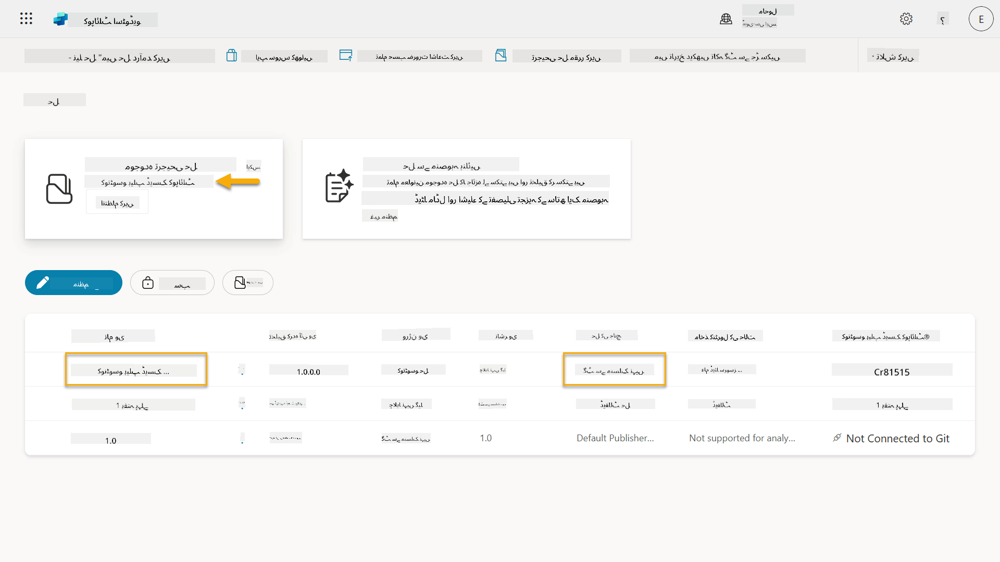

<!--
CO_OP_TRANSLATOR_METADATA:
{
  "original_hash": "0c51aabca81d6256990caf4c015e6195",
  "translation_date": "2025-10-22T19:32:38+00:00",
  "source_file": "docs/recruit/04-creating-a-solution/README.md",
  "language_code": "ur"
}
-->
# 🚨 مشن 04: اپنے ایجنٹ کے لیے ایک حل بنانا

## 🕵️‍♂️ کوڈ نام: `آپریشن CTRL-ALT-PACKAGE`

> **⏱️ آپریشن کا وقت:** `~45 منٹ`

🎥 **واچ واک تھرو**

[](https://www.youtube.com/watch?v=1iATbkgfcpU "یوٹیوب پر واک تھرو دیکھیں")

## 🎯 مشن کا خلاصہ

ایجنٹ میکر، آپ کے اگلے تاکتیکی آپریشن میں خوش آمدید۔ اس مشن میں، آپ ایک حل کو جمع کرنے کا طریقہ سیکھیں گے - یہ آپ کے آئی ٹی ہیلپ ڈیسک ایجنٹ کے لیے مائیکروسافٹ کوپائلٹ اسٹوڈیو کے ساتھ بنایا گیا آفیشل ڈپلائمنٹ وہیکل ہے۔ اسے ایک ڈیجیٹل بریف کیس سمجھیں جو آپ کے ایجنٹ اور اس کے آرٹفیکٹس کو محفوظ رکھتا ہے۔

ہر ایجنٹ کو ایک اچھی طرح سے منظم گھر کی ضرورت ہوتی ہے۔ یہی وہ چیز ہے جو پاور پلیٹ فارم کا حل فراہم کرتا ہے - ترتیب، پورٹیبلٹی، اور پروڈکشن کے لیے تیاری۔

چلیں، پیکنگ شروع کریں۔

## 🔎 مقاصد

اس مشن میں، آپ سیکھیں گے:

1. پاور پلیٹ فارم کے حل کیا ہیں اور ایجنٹ کی ترقی میں ان کا کردار
1. ایجنٹس کو منظم اور ڈپلائے کرنے کے لیے حل استعمال کرنے کے فوائد
1. حل کے پبلشرز کو دریافت کرنا اور اجزاء کے انتظام میں ان کی اہمیت
1. پاور پلیٹ فارم کے حل کی زندگی کے چکر کو ترقی سے پروڈکشن تک سمجھنا
1. اپنے آئی ٹی ہیلپ ڈیسک ایجنٹ کے لیے اپنا حل پبلشر اور کسٹم حل بنانا

## 🕵🏻‍♀️ حل؟ یہ کیا ہے؟

مائیکروسافٹ پاور پلیٹ فارم میں، حل ایسے کنٹینرز یا پیکجز کی طرح ہیں جو آپ کے ایپس یا ایجنٹس کے تمام حصے رکھتے ہیں - یہ ٹیبلز، فارم، فلو، اور کسٹم لاجک ہو سکتے ہیں۔ حل ایپلیکیشن لائف سائیکل مینجمنٹ (ALM) کے لیے ضروری ہیں، یہ آپ کو اپنے ایپ اور ایجنٹس کو آئیڈیا سے ترقی، ٹیسٹنگ، ڈپلائمنٹ، اور اپڈیٹس تک منظم کرنے کی اجازت دیتے ہیں۔

کوپائلٹ اسٹوڈیو میں، آپ کے بنائے گئے ہر ایجنٹ کو پاور پلیٹ فارم کے حل میں محفوظ کیا جاتا ہے۔ ڈیفالٹ کے طور پر، ایجنٹس ڈیفالٹ حل میں بنائے جاتے ہیں، جب تک کہ آپ ایک نیا کسٹم حل نہ بنائیں جس میں آپ اپنا ایجنٹ بنائیں۔ یہی ہم اس سبق اور ہینڈز آن لیب میں سیکھیں گے 🤓۔

حل روایتی طور پر **پاور ایپس میکر پورٹل** میں بنائے گئے ہیں - ایک ویب بیسڈ انٹرفیس جہاں آپ ایپس، ڈیٹا ورس، فلو، اے آئی اجزاء کو دریافت اور اپنی مرضی کے مطابق بنا سکتے ہیں۔

   

کوپائلٹ اسٹوڈیو میں، اب **حل ایکسپلورر** موجود ہے جہاں آپ اپنے حل کو براہ راست منظم کر سکتے ہیں۔ آپ کو پاور ایپس میکر پورٹل میں سوئچ کرنے کی ضرورت نہیں ہے، یہ کام کوپائلٹ اسٹوڈیو کے اندر ہی کیا جا سکتا ہے 🪄۔

اس کا مطلب ہے کہ آپ عام حل سے متعلقہ کام کر سکتے ہیں:

- **حل بنائیں** - کسٹم حل ایجنٹس کو ماحول کے درمیان ایکسپورٹ اور امپورٹ کرنے کی اجازت دیتے ہیں۔
- **اپنا پسندیدہ حل سیٹ کریں** - وہ حل منتخب کریں جس میں ایجنٹس، ایپس وغیرہ ڈیفالٹ کے طور پر بنائے جائیں گے۔
- **اجزاء شامل یا ہٹائیں** - آپ کا ایجنٹ دیگر اجزاء جیسے ماحول کے متغیرات یا کلاؤڈ فلو کا حوالہ دے سکتا ہے۔ لہذا ان اجزاء کو حل میں شامل کرنے کی ضرورت ہے۔
- **حل ایکسپورٹ کریں** - حل کو کسی دوسرے ہدف کے ماحول میں منتقل کرنے کے لیے۔
- **حل امپورٹ کریں** - کہیں اور بنائے گئے حل کو امپورٹ کریں، بشمول حل کو اپ گریڈ یا اپ ڈیٹ کرنا۔
- **حل پائپ لائنز بنائیں اور منظم کریں** - ماحول کے درمیان حل کی ڈپلائمنٹ کو خودکار بنائیں۔
- **Git انٹیگریشن** - ڈویلپرز کو ورژن کنٹرول، تعاون، اور ALM کے لیے Git ریپوزیٹریز کے ساتھ حل کو جوڑنے کی اجازت دیتا ہے۔ صرف ڈویلپر ماحول میں استعمال کے لیے۔

   

حل کی دو اقسام ہیں:

- **غیر منظم حل** - ترقی کے دوران استعمال ہوتے ہیں۔ آپ ضرورت کے مطابق آزادانہ طور پر ترمیم اور حسب ضرورت بنا سکتے ہیں۔
- **منظم حل** - جب آپ اپنی ایپ کو ٹیسٹنگ یا پروڈکشن کے لیے ڈپلائے کرنے کے لیے تیار ہوں۔ یہ حادثاتی تبدیلیوں کو روکنے کے لیے بند کر دیے جاتے ہیں۔

## 🤔 مجھے اپنے ایجنٹ کے لیے حل کیوں استعمال کرنا چاہیے؟

حل کو ایک _ٹول باکس_ کے طور پر سوچیں۔ جب آپ کو کسی مختلف جگہ (ماحول) میں کچھ ٹھیک یا بنانا ہو (ایجنٹ)، آپ تمام ضروری ٹولز (اجزاء) کو جمع کرتے ہیں اور انہیں اپنے ٹول باکس (حل) میں رکھتے ہیں۔ پھر آپ اس ٹول باکس کو نئی جگہ (ماحول) میں لے جا سکتے ہیں اور ٹولز (اجزاء) کو اپنا کام مکمل کرنے کے لیے استعمال کر سکتے ہیں، یا نئے ٹولز (اجزاء) کو شامل کر سکتے ہیں تاکہ آپ کے ایجنٹ یا پروجیکٹ کو اپنی مرضی کے مطابق بنایا جا سکے۔

!!! quote "ایلازا، آپ کی دوستانہ کلاؤڈ ایڈووکیٹ یہاں 🙋🏻‍♀️ کچھ الفاظ شیئر کرنے کے لیے:"
    نیوزی لینڈ میں ایک کہاوت ہے، "ایک صاف ستھرا کیوی بنیں!" جو نیوزی لینڈرز 🥝 کو اپنے ماحول کی ذمہ داری لینے، کچرا صحیح طریقے سے ٹھکانے لگانے اور عوامی جگہوں کو صاف رکھنے کی ترغیب دیتا ہے۔ ہم ایجنٹس کے لیے بھی یہی سیاق و سباق استعمال کر سکتے ہیں، اپنے ایجنٹ سے متعلق ہر چیز کو منظم اور پورٹیبل رکھ کر، اور یہ آپ کو ایک صاف ستھرا ماحول برقرار رکھنے میں مدد دے گا۔

اپنے سورس (ڈویلپر) ماحول میں ایک مخصوص حل میں ایجنٹ بنانا ایک اچھا عمل ہے۔ یہاں حل کی قدر کی وجوہات ہیں:

🧩 **منظم ترقی**

- آپ اپنے ایجنٹ کو ڈیفالٹ حل سے الگ رکھ رہے ہیں جس میں ماحول میں موجود ہر چیز شامل ہوتی ہے۔ آپ کے ایجنٹ کے تمام اجزاء ایک جگہ پر ہیں 🎯۔

- آپ کے ایجنٹ کے لیے ہر چیز ایک حل میں ہے، جس سے اسے ہدف کے ماحول میں ایکسپورٹ اور امپورٹ کرنا آسان ہو جاتا ہے 👉🏻 یہ ALM کی ایک صحت مند عادت ہے۔

🧩 **محفوظ ڈپلائمنٹ**

- آپ اپنی ایپ یا ایجنٹ کو ایک منظم حل کے طور پر ایکسپورٹ کر سکتے ہیں اور اسے دیگر ہدف کے ماحول (جیسے ٹیسٹنگ یا پروڈکشن) میں ڈپلائے کر سکتے ہیں بغیر حادثاتی ترمیم کے خطرے کے۔

🧩 **ورژن کنٹرول**

- آپ پیچز (ٹارگٹ فکسز)، اپڈیٹس (زیادہ جامع تبدیلی) یا اپ گریڈز (حل کو تبدیل کرنا - عام طور پر بڑی تبدیلیاں اور نئی خصوصیات متعارف کرانا) بنا سکتے ہیں۔

- آپ کو تبدیلیاں کنٹرولڈ طریقے سے رول آؤٹ کرنے میں مدد ملتی ہے۔

🧩 **انحصار کا انتظام**

- حل یہ ٹریک کرتے ہیں کہ کون سے حصے دوسروں پر منحصر ہیں۔ یہ آپ کو تبدیلیاں کرتے وقت چیزوں کو خراب کرنے سے روکتا ہے۔

🧩 **ٹیم تعاون**

- ڈویلپرز اور میکرز ترقی میں غیر منظم حل استعمال کرتے ہوئے مل کر کام کر سکتے ہیں، پھر ڈپلائمنٹ کے لیے ایک منظم حل حوالے کر سکتے ہیں۔

## 🪪 حل پبلشرز کو سمجھنا

پاور پلیٹ فارم میں ایک حل پبلشر ایک لیبل یا برانڈ کی طرح ہے جو یہ شناخت کرتا ہے کہ کس نے حل بنایا یا اس کا مالک کون ہے۔ یہ آپ کے ایپس، ایجنٹس اور فلو کسٹمائزیشنز کو منظم کرنے کا ایک چھوٹا لیکن اہم حصہ ہے، خاص طور پر ٹیموں یا ماحول کے درمیان کام کرتے وقت۔

جب آپ ایک حل بناتے ہیں، تو آپ کو ایک پبلشر منتخب کرنا ہوتا ہے۔ یہ پبلشر درج ذیل کو بیان کرتا ہے:

- ایک پری فکس جو تمام کسٹم اجزاء (جیسے ٹیبلز، فیلڈز، اور فلو) میں شامل کیا جاتا ہے۔

- تنظیم یا شخص کا نام اور رابطہ معلومات جو حل کا مالک ہے۔

### 🤔 یہ کیوں اہم ہے؟

1. **آسان شناخت** - پری فکس (مثال - `new_` یا `abc_`) آپ کو جلدی سے شناخت کرنے میں مدد کرتا ہے کہ کون سے اجزاء کس حل یا ٹیم سے تعلق رکھتے ہیں۔

1. **تنازعات سے بچاؤ** - اگر دو ٹیمیں ایک کالم بناتی ہیں جسے اسٹیٹس کہا جاتا ہے، تو ان کے پری فکسز (`teamA_status`, `teamB_status`) نام کے تصادم کو روک دیتے ہیں۔

1. **ALM کی حمایت** - ماحول کے درمیان حل منتقل کرتے وقت (ڈویلپمنٹ → ٹیسٹ → پروڈکشن)، پبلشر مالکیت کو ٹریک کرنے اور مستقل مزاجی کو برقرار رکھنے میں مدد کرتا ہے۔

### ✨ مثال

فرض کریں کہ آپ نے ایک پبلشر بنایا جس کا نام Contoso Solutions ہے اور پری فکس `cts_` ہے۔

اگر آپ نے ایک کسٹم کالم _Priority_ شامل کیا، تو یہ حل میں `cts_Priority` کے طور پر محفوظ ہوگا۔

جو بھی اس کالم کو حل کی سطح پر دیکھے گا، چاہے وہ کسی بھی ماحول میں ہو، وہ آسانی سے شناخت کر سکتا ہے کہ یہ کالم Contoso Solutions سے وابستہ ہے۔

## 🧭 پاور پلیٹ فارم حل کی زندگی کا چکر

اب جب کہ آپ نے حل کے مقصد کو سمجھ لیا ہے، آئیے زندگی کے چکر کے بارے میں سیکھتے ہیں۔

**1. ترقی کے ماحول میں حل بنائیں** - ترقی کے ماحول میں ایک نیا حل بنا کر شروع کریں۔

**2. اجزاء شامل کریں** - ایپس، فلو، ٹیبلز، اور دیگر عناصر کو اپنے حل میں شامل کریں۔

**3. منظم حل کے طور پر ایکسپورٹ کریں** - اپنے حل کو ڈپلائمنٹ کے لیے پیکج کریں اور اسے منظم حل کے طور پر ایکسپورٹ کریں۔

**4. ٹیسٹ ماحول میں امپورٹ کریں** - اپنے حل کو ایک علیحدہ ٹیسٹ ماحول میں ٹیسٹ کریں تاکہ یہ یقینی بنایا جا سکے کہ سب کچھ توقع کے مطابق کام کر رہا ہے۔

**5. پروڈکشن ماحول میں امپورٹ کریں** - ٹیسٹ شدہ حل کو اپنے لائیو پروڈکشن ماحول میں ڈپلائے کریں۔

**6. پیچز، اپڈیٹس یا اپ گریڈز لگائیں** - پیچز، اپڈیٹس، یا اپ گریڈز کا استعمال کرتے ہوئے بہتری یا اصلاحات کریں۔ 🔁 چکر کو دہرائیں!

### ✨ مثال

تصور کریں کہ آپ ایک آئی ٹی ہیلپ ڈیسک ایجنٹ بنا رہے ہیں جو ملازمین کو مسائل جیسے ڈیوائس کے مسائل، نیٹ ورک ٹربل شوٹنگ، پرنٹر سیٹ اپ اور مزید میں مدد فراہم کرتا ہے۔

- آپ ایک غیر منظم حل کا استعمال کرتے ہوئے ترقی کے ماحول میں شروع کرتے ہیں۔

- جب یہ تیار ہو جائے، تو آپ اسے ایک منظم حل کے طور پر ایکسپورٹ کرتے ہیں اور اسے ہدف کے ماحول جیسے سسٹم ٹیسٹ یا یوزر ایکسیپٹنس ٹیسٹنگ (UAT) ماحول میں امپورٹ کرتے ہیں۔

- ٹیسٹنگ کے بعد، آپ اسے پروڈکشن ماحول میں منتقل کرتے ہیں - اصل ترقی کے ورژن کو چھوئے بغیر۔

## 🧪 لیب 04: نیا حل بنائیں

اب ہم سیکھنے جا رہے ہیں:

- [4.1 حل پبلشر کیسے بنائیں](../../../../../docs/recruit/04-creating-a-solution)
- [4.2 نیا حل کیسے بنائیں](../../../../../docs/recruit/04-creating-a-solution)

ہم پہلے کی مثال کے ساتھ رہیں گے، جہاں ہم ایک مخصوص کوپائلٹ اسٹوڈیو ماحول میں ایک حل بنائیں گے تاکہ اس میں اپنا آئی ٹی ہیلپ ڈیسک ایجنٹ بنا سکیں۔

چلیں شروع کریں!

### ضروریات

#### سیکیورٹی رول

کوپائلٹ اسٹوڈیو میں، آپ **حل ایکسپلورر** میں کیا کر سکتے ہیں، یہ آپ کے یوزر سیکیورٹی رول پر منحصر ہے۔
اگر آپ کو پاور ایپس ایڈمن سینٹر میں حل منظم کرنے کی اجازت نہیں ہے، تو آپ کوپائلٹ اسٹوڈیو میں بھی وہ کام نہیں کر سکیں گے۔

یہ یقینی بنانے کے لیے کہ سب کچھ ہموار طریقے سے کام کرے، چیک کریں کہ آپ کے پاس صحیح سیکیورٹی رولز اور اجازتیں ہیں۔ یا اگر آپ اپنی تنظیم میں ماحول کو منظم نہیں کرتے ہیں، تو اپنے آئی ٹی ایڈمنسٹریٹر (یا مساوی) ٹیم سے پوچھیں جو آپ کے ٹیننٹ/ماحول کو منظم کرتی ہے۔

ذیل میں وہ سیکیورٹی رولز ہیں جو صارفین کو اپنے ماحول میں حل بنانے کی اجازت دیتے ہیں۔

| سیکیورٹی رول    | وضاحت |
| ---------- | ---------- |
| ماحول میکر | مخصوص ماحول کے اندر وسائل بنانے، حسب ضرورت بنانے، اور منظم کرنے کے لیے ضروری اجازتیں فراہم کرتا ہے، بشمول حل  |
| سسٹم کسٹمائزر  | ماحول میکر سے زیادہ وسیع اجازتیں، بشمول ماحول کو حسب ضرورت بنانے اور سیکیورٹی رولز کو منظم کرنے کی صلاحیت |
| سسٹم ایڈمنسٹریٹر   | سب سے زیادہ سطح کی اجازتیں اور ماحول کے تمام پہلوؤں کو منظم کرنے کی صلاحیت، بشمول سیکیورٹی رولز بنانا اور تفویض کرنا     |

#### ڈویلپر ماحول

یقینی بنائیں کہ آپ اپنے مخصوص ڈویلپر ماحول میں سوئچ کریں، [سبق 00 - کورس سیٹ اپ - مرحلہ 3: نیا ڈویلپر ماحول بنائیں](../00-course-setup/README.md#step-3-create-new-developer-environment) کا حوالہ دیں۔

1. اوپر دائیں جانب، **کاک وہیل** آئیکن منتخب کریں اور ڈیفالٹ ماحول سے اپنے ماحول میں سوئچ کریں، مثال کے طور پر **ایڈیل وینس کا ماحول**۔

    

### 4.1 حل پبلشر بنائیں

1. اسی کوپائلٹ اسٹوڈیو ماحول کا استعمال کرتے ہوئے جو پچھلے سبق میں استعمال کیا گیا تھا، کوپائلٹ اسٹوڈیو کے بائیں جانب مینو میں **تین نقطے (. . .)** آئیکن منتخب کریں۔ **ایکسپلور** ہیڈر کے تحت **حل** منتخب کریں۔

    

1. کوپائلٹ اسٹوڈیو میں **حل ایکسپلورر** لوڈ ہو جائے گا۔ **+ نیا حل** منتخب کریں۔

    

1. **نیا حل** پین ظاہر ہوگا جہاں ہم اپنے حل کی تفصیلات کی وضاحت کر سکتے ہیں۔ پہلے، ہمیں ایک نیا پبلشر بنانا ہوگا۔ **+ نیا پبلشر** منتخب کریں۔

      

1. **نئے پبلشر** پین کا **پراپرٹیز** ٹیب ظاہر ہوگا جس میں مطلوبہ اور غیر مطلوبہ فیلڈز کو **پراپرٹیز** ٹیب میں پُر کرنا ہوگا۔ یہ وہ جگہ ہے جہاں ہم پبلشر کی تفصیلات کا خاکہ بنا سکتے ہیں جو لیبل یا برانڈ کے طور پر استعمال ہوگا جو یہ شناخت کرتا ہے کہ کس نے حل بنایا یا اس کا مالک کون ہے۔

    | پراپرٹی    | وضاحت | مطلوبہ |
    | ---------- | ---------- | :----------: |
    | ڈسپلے نام | پبلشر کے لیے ڈسپلے نام | ہاں   |
    | نام  | پبلشر کے لیے منفرد نام اور اسکیمہ نام  | ہاں    |
    | وضاحت   | حل کے مقصد کا خاکہ    | نہیں     |
    | پری فکس    | پبلشر پری فکس جو نئے بنائے گئے اجزاء پر لاگو ہوگا   | ہاں      |
    | چوائس ویلیو پری فکس   | پبلشر پری فکس کی بنیاد پر ایک نمبر تیار کرتا ہے۔ یہ نمبر اس وقت استعمال ہوتا ہے جب آپ چوائسز میں آپشنز شامل کرتے ہیں اور یہ اس بات کا اشارہ فراہم کرتا ہے کہ آپشن شامل کرنے کے لیے کون سا حل استعمال کیا گیا تھا۔   | ہاں      |

    درج ذیل کو **ڈسپلے نام** کے طور پر کاپی اور پیسٹ کریں،

    ```text
    Contoso Solutions
    ```

    درج ذیل کو **نام** کے طور پر کاپی اور پیسٹ کریں،

    ```text
    ContosoSolutions
    ```

    درج ذیل کو **وضاحت** کے طور پر کاپی اور پیسٹ کریں،

    ```text
    Copilot Studio Agent Academy
    ```

    درج ذیل کو **پری فکس** کے لیے کاپی اور پیسٹ کریں،

    ```text
    cts
    ```

    ڈیفالٹ کے طور پر، **چوائس ویلیو** پری فکس ایک عددی قدر دکھائے گا۔ اس عددی قدر کو قریبی ہزار میں اپ ڈیٹ کریں۔ مثال کے طور پر، میرے اسکرین شاٹ میں، یہ ابتدائی طور پر `77074` تھا۔ اسے `77074` سے `77000` میں اپ ڈیٹ کریں۔

    ![حل
1. نیا پبلشر پین بند ہو جائے گا اور آپ کو **نیا حل** پین پر واپس لے جایا جائے گا جہاں نیا بنایا گیا پبلشر منتخب ہوگا۔

      

شاباش، آپ نے ایک حل پبلشر بنا لیا ہے! 🙌🏻 اب ہم سیکھیں گے کہ نیا کسٹم حل کیسے بنایا جائے۔

### 4.2 نیا حل بنائیں

1. چونکہ ہم نے اپنے حل بنا لیے ہیں، اب ہم **نیا حل** پین میں باقی فارم مکمل کر سکتے ہیں۔

    درج ذیل کو **ڈسپلے نام** کے طور پر کاپی اور پیسٹ کریں،

    ```text
    Contoso Helpdesk Agent
    ```

    درج ذیل کو **نام** کے طور پر کاپی اور پیسٹ کریں،

    ```text
    ContosoHelpdeskAgent
    ```

    چونکہ ہم نیا حل بنا رہے ہیں، [**ورژن** نمبر](https://learn.microsoft.com/power-apps/maker/data-platform/update-solutions#understanding-version-numbers-for-updates/?WT.mc_id=power-172615-ebenitez) ڈیفالٹ طور پر `1.0.0.0` ہوگا۔

    **اپنے پسندیدہ حل کے طور پر سیٹ کریں** چیک باکس کو ٹک کریں۔

      

1. **مزید اختیارات** کو بڑھائیں تاکہ اضافی تفصیلات دیکھ سکیں جو حل میں فراہم کی جا سکتی ہیں۔

    

1. آپ درج ذیل دیکھیں گے،

    - **انسٹال کیا گیا** - وہ تاریخ جب حل انسٹال کیا گیا تھا۔

    - **کنفیگریشن صفحہ** - ڈویلپرز ایک HTML ویب ریسورس سیٹ اپ کرتے ہیں تاکہ صارفین اپنے ایپ، ایجنٹ یا ٹول کے ساتھ تعامل کر سکیں جہاں یہ معلومات سیکشن میں ویب صفحہ کے طور پر ظاہر ہوگا جس میں ہدایات یا بٹن ہوں گے۔ یہ زیادہ تر کمپنیوں یا ڈویلپرز کے ذریعہ استعمال ہوتا ہے جو دوسروں کے ساتھ حل بناتے اور شیئر کرتے ہیں۔

    - **تفصیل** - حل یا کنفیگریشن صفحہ کی اعلی سطحی تفصیل بیان کرتا ہے۔

    ہم ان کو اس لیب کے لیے خالی چھوڑ دیں گے۔

    **بنانا** منتخب کریں۔

    

1. Contoso Helpdesk Agent کے لیے حل اب بنا دیا گیا ہے۔ اس میں کوئی اجزاء نہیں ہوں گے جب تک ہم Copilot Studio میں ایک ایجنٹ نہ بنائیں۔

    **پیچھے کے تیر** آئیکن کو منتخب کریں تاکہ حل ایکسپلورر پر واپس جائیں۔

    

1. نوٹ کریں کہ Contoso Helpdesk Agent اب **موجودہ پسندیدہ حل** کے طور پر ظاہر ہوتا ہے کیونکہ ہم نے پہلے **اپنے پسندیدہ حل کے طور پر سیٹ کریں** چیک باکس کو ٹک کیا تھا۔

    

## ✅ مشن مکمل

مبارک ہو! 👏🏻 آپ نے ایک پبلشر بنایا اور اسے اپنے نئے بنائے گئے حل میں استعمال کیا تاکہ اپنا ایجنٹ بنائیں!

بہت اچھا کام کیا، ایجنٹ میکر۔ ایک صاف ستھرا ڈیجیٹل فٹ پرنٹ بڑے پیمانے پر آپریبلٹی کی طرف پہلا قدم ہے۔ اب آپ کے پاس پائیدار، انٹرپرائز کے لیے تیار ایجنٹ ڈیولپمنٹ کے لیے ٹولز اور ذہنیت موجود ہے۔

یہ **لیب 04 - حل بنانا** کا اختتام ہے، نیچے دیے گئے لنک کو منتخب کریں تاکہ اگلے سبق پر جائیں۔ اس لیب میں بنایا گیا آپ کا حل اگلے سبق کی لیب میں استعمال ہوگا۔

⏭️ [**پری بلٹ ایجنٹس کے ساتھ جلدی شروع کریں** سبق پر جائیں](../05-using-prebuilt-agents/README.md)

## 📚 حکمت عملی وسائل

🔗 [حل بنائیں](https://learn.microsoft.com/power-apps/maker/data-platform/create-solution/?WT.mc_id=power-172615-ebenitez)

🔗 [Copilot Studio میں حل بنائیں اور منظم کریں](https://learn.microsoft.com/microsoft-copilot-studio/authoring-solutions-overview/?WT.mc_id=power-172615-ebenitez)

🔗 [ایجنٹس کو دوسرے صارفین کے ساتھ شیئر کریں](https://learn.microsoft.com/microsoft-copilot-studio/admin-share-bots/?WT.mc_id=power-172615-ebenitez)

🔗 [پری ڈیفائنڈ سیکیورٹی رولز کے لیے دستیاب وسائل کا خلاصہ](https://learn.microsoft.com/power-platform/admin/database-security#summary-of-resources-available-to-predefined-security-roles/?WT.mc_id=power-172615-ebenitez)

🔗 [حل کو اپ گریڈ یا اپ ڈیٹ کریں](https://learn.microsoft.com/power-apps/maker/data-platform/update-solutions/?WT.mc_id=power-172615-ebenitez)

🔗 [Power Platform میں پائپ لائنز کا جائزہ](https://learn.microsoft.com/power-platform/alm/pipelines/?WT.mc_id=power-172615-ebenitez)

🔗 [Power Platform میں Git انٹیگریشن کا جائزہ](https://learn.microsoft.com/power-platform/alm/git-integration/overview/?WT.mc_id=power-172615-ebenitez)


---

**ڈسکلیمر**:  
یہ دستاویز AI ترجمہ سروس [Co-op Translator](https://github.com/Azure/co-op-translator) کا استعمال کرتے ہوئے ترجمہ کی گئی ہے۔ ہم درستگی کے لیے کوشش کرتے ہیں، لیکن براہ کرم آگاہ رہیں کہ خودکار ترجمے میں غلطیاں یا غیر درستیاں ہو سکتی ہیں۔ اصل دستاویز کو اس کی اصل زبان میں مستند ذریعہ سمجھا جانا چاہیے۔ اہم معلومات کے لیے، پیشہ ور انسانی ترجمہ کی سفارش کی جاتی ہے۔ ہم اس ترجمے کے استعمال سے پیدا ہونے والی کسی بھی غلط فہمی یا غلط تشریح کے ذمہ دار نہیں ہیں۔