<!--
CO_OP_TRANSLATOR_METADATA:
{
  "original_hash": "8e2c64a7f9303e58329ec8bb468c80b4",
  "translation_date": "2025-10-22T19:43:47+00:00",
  "source_file": "docs/recruit/05-using-prebuilt-agents/README.md",
  "language_code": "ur"
}
-->
# 🧰 مشن 05: پہلے سے تیار شدہ ایجنٹ کا استعمال  

## 🕵️‍♂️ کوڈ نام: `آپریشن محفوظ سفر`

> **⏱️ آپریشن کا وقت:** `~30 منٹ`

🎥 **ویڈیو دیکھیں**

## 🎯 مشن کا خلاصہ

کوپائلٹ اسٹوڈیو ایجنٹ اکیڈمی میں آپ کا استقبال ہے۔ آپ **پہلے سے تیار شدہ ایجنٹس** کی دنیا کو دریافت کرنے والے ہیں—یہ ذہین، مقصد پر مبنی ایجنٹس ہیں جو مائیکروسافٹ نے آپ کی تعیناتی کو تیز کرنے اور وقت کی بچت کے لیے تیار کیے ہیں۔

نئے سرے سے بنانے کے بجائے، پہلے سے تیار شدہ ایجنٹس (جنہیں **ایجنٹ ٹیمپلیٹس** بھی کہا جاتا ہے) آپ کو ایک آغاز فراہم کرتے ہیں، جو فوری طور پر استعمال کے لیے تیار منظرنامے فراہم کرتے ہیں جنہیں آپ چند منٹوں میں اپنی مرضی کے مطابق بنا سکتے ہیں اور تعینات کر سکتے ہیں۔

اس مشن میں، آپ **محفوظ سفر** ایجنٹ کو تعینات کریں گے—ایک ایجنٹ جو آپ کے صارفین کو کاروباری سفر کی تیاری، کمپنی کی پالیسیوں کو سمجھنے، اور منصوبہ بندی کو آسان بنانے میں مدد فراہم کرتا ہے۔

---

## 🧭 مقاصد

اس مشن کے لیے آپ کے اہداف ہیں:

1. سمجھیں کہ پہلے سے تیار شدہ ایجنٹس کیا ہیں اور کیوں اہم ہیں  
1. **محفوظ سفر** ایجنٹ ٹیمپلیٹ کو تعینات کریں  
1. ایجنٹ کے جوابات اور مواد کو اپنی مرضی کے مطابق بنائیں  
1. ایجنٹ کو ٹیسٹ کریں اور شائع کریں  

---

## 🧠 پہلے سے تیار شدہ ایجنٹس کیا ہیں؟

پہلے سے تیار شدہ ایجنٹس مائیکروسافٹ کے تیار کردہ تیار شدہ AI ایجنٹس ہیں جو:

- عام کاروباری ضروریات کو پورا کرتے ہیں (جیسے سفر، HR، IT سپورٹ)
- مکمل طور پر فعال موضوعات، ٹرگر جملے، ہدایات اور نمونہ معلومات شامل کرتے ہیں۔
- آپ کے اپنے ڈیٹا کے ساتھ ترمیم، توسیع، اور بنیاد فراہم کی جا سکتی ہے

یہ ایجنٹس جلدی شروع کرنے یا ایجنٹس کی ساخت کو سیکھنے کے لیے بہترین ہیں۔

---

## 🧪 لیب 05: پہلے سے تیار شدہ ایجنٹ کے ساتھ جلدی شروع کریں

اب ہم سیکھیں گے کہ پہلے سے تیار شدہ ایجنٹ کو کیسے منتخب کریں اور اپنی مرضی کے مطابق بنائیں۔

- [5.1 کوپائلٹ اسٹوڈیو لانچ کریں](../../../../../docs/recruit/05-using-prebuilt-agents)
- [5.2 محفوظ سفر ایجنٹ ٹیمپلیٹ منتخب کریں](../../../../../docs/recruit/05-using-prebuilt-agents)
- [5.3 ایجنٹ کو اپنی مرضی کے مطابق بنائیں](../../../../../docs/recruit/05-using-prebuilt-agents)
- [5.4 ٹیسٹ کریں اور شائع کریں](../../../../../docs/recruit/05-using-prebuilt-agents)

ہم پہلے کے مثال پر قائم رہیں گے، جہاں ہم ایک مخصوص کوپائلٹ اسٹوڈیو ماحول میں اپنا IT ہیلپ ڈیسک ایجنٹ بنانے کے لیے حل تیار کریں گے۔

چلیں شروع کریں!

### 5.1 کوپائلٹ اسٹوڈیو لانچ کریں

1. [https://copilotstudio.microsoft.com](https://copilotstudio.microsoft.com) پر جائیں

1. اپنے Microsoft 365 ورک یا اسکول اکاؤنٹ کے ساتھ سائن ان کریں

!!! warning
    آپ کو ایسے ٹیننٹ میں ہونا ضروری ہے جہاں کوپائلٹ اسٹوڈیو فعال ہو۔ اگر آپ کو کوپائلٹ اسٹوڈیو نظر نہیں آتا، تو [مشن 00](../00-course-setup/README.md) پر واپس جائیں اور اپنی سیٹ اپ مکمل کریں۔

### 5.2 محفوظ سفر ایجنٹ ٹیمپلیٹ منتخب کریں

1. کوپائلٹ اسٹوڈیو ہوم پیج سے، **+ Create** پر کلک کریں  
    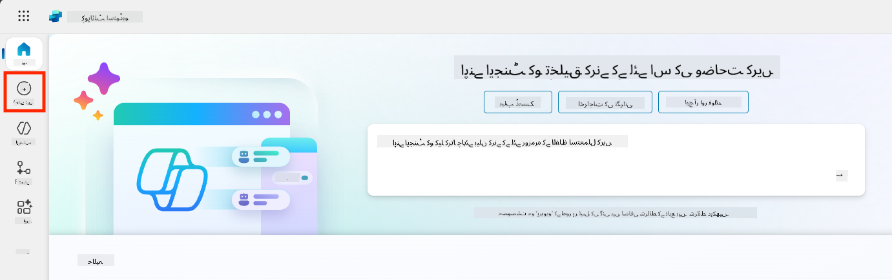

1. **ایجنٹ ٹیمپلیٹ کے ساتھ شروع کریں** سیکشن تک نیچے سکرول کریں  

1. **محفوظ سفر** کو تلاش کریں اور منتخب کریں  

    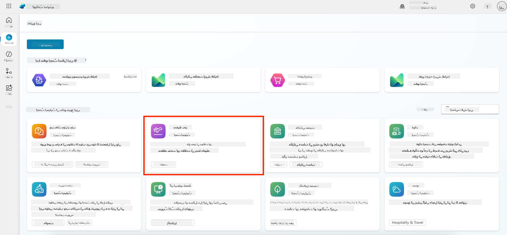

1. نوٹ کریں کہ ٹیمپلیٹ پہلے سے ایک وضاحت، ہدایات اور معلومات کے ساتھ لوڈ ہوتا ہے۔  

    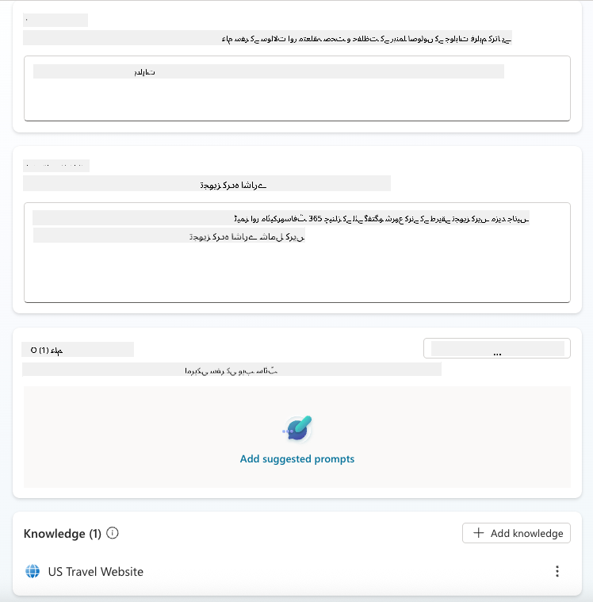

1. **Create** پر کلک کریں  

    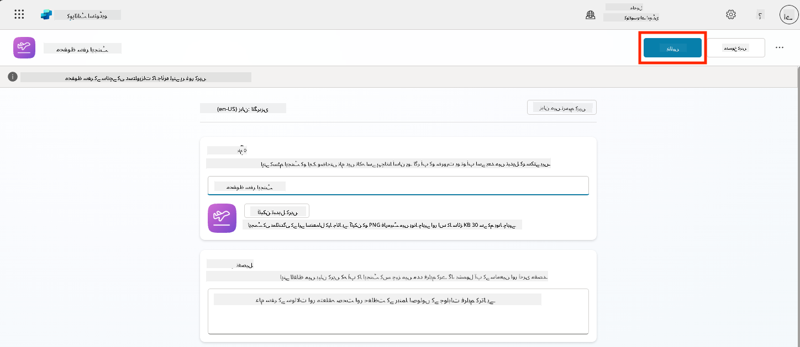

یہ آپ کے ماحول میں محفوظ سفر کی ترتیب پر مبنی ایک نیا ایجنٹ بنائے گا۔

### 5.3 ایجنٹ کو اپنی مرضی کے مطابق بنائیں

اب جب کہ ایجنٹ بن گیا ہے، آئیے اسے آپ کی تنظیم کے مطابق بنائیں:

1. **Enabled generative AI** کو منتخب کریں تاکہ جنریٹو AI فیچر کو آن کیا جا سکے تاکہ یہ ٹیمپلیٹ میں فراہم کردہ ہدایات استعمال کر سکے۔  

    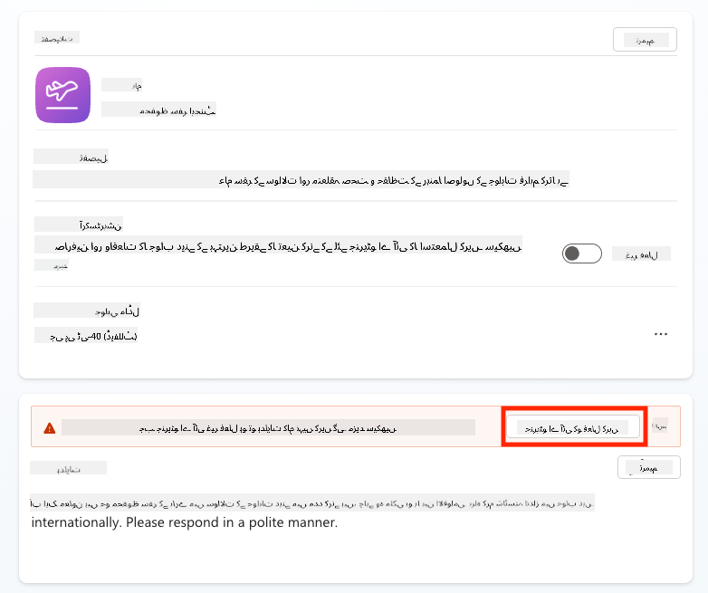

1. اب ہم ایجنٹ کو اضافی معلوماتی ذریعہ فراہم کریں گے تاکہ یہ یورپ کے سفر کے بارے میں سوالات کے جواب دے سکے۔ ایسا کرنے کے لیے، **knowledge** سیکشن تک نیچے سکرول کریں اور **Add knowledge** کو منتخب کریں  

    

1. **Public websites** کو منتخب کریں  

    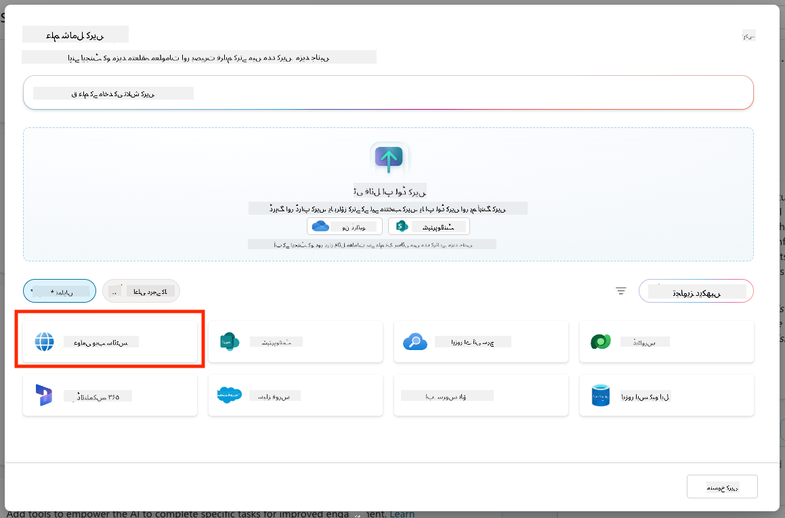

1. ٹیکسٹ ان پٹ میں، **<https://european-union.europa.eu/>** پیسٹ کریں اور **Add** کو منتخب کریں  

    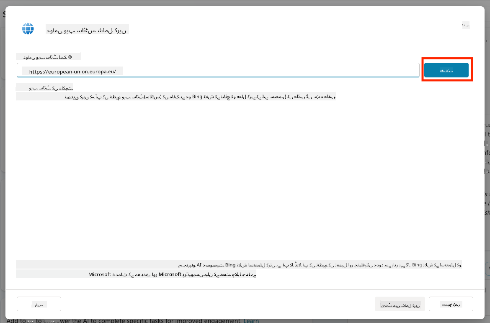

1. **Add to agent** کو منتخب کریں  

    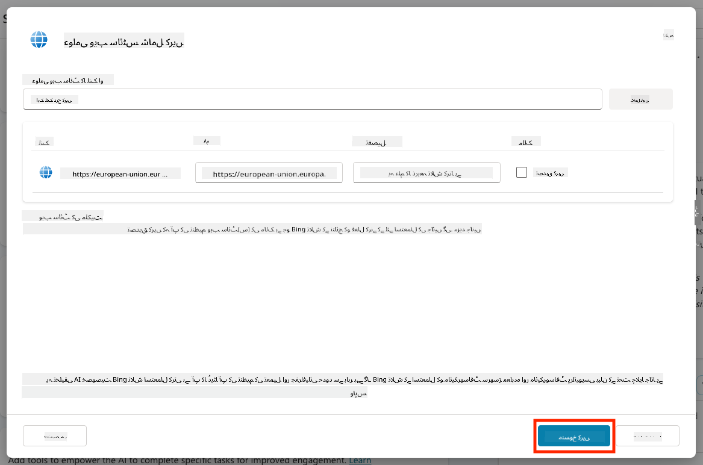

### 5.4 ٹیسٹ کریں اور شائع کریں

1. ٹیسٹ ونڈو لانچ کرنے کے لیے اوپر دائیں جانب **Test** پر کلک کریں  

1. جملے آزمائیں جیسے:

    - `“کیا مجھے امریکہ سے ایمسٹرڈیم جانے کے لیے ویزا کی ضرورت ہے؟”`
    - `“امریکی پاسپورٹ حاصل کرنے میں کتنا وقت لگتا ہے؟”`
    - `“ویلینسیا، اسپین میں قریب ترین امریکی سفارت خانہ کہاں ہے؟”`

1. تصدیق کریں کہ ایجنٹ درست اور مددگار معلومات کے ساتھ جواب دیتا ہے اور دیکھیں کہ اس نے معلومات کہاں سے حاصل کی ہیں۔  

    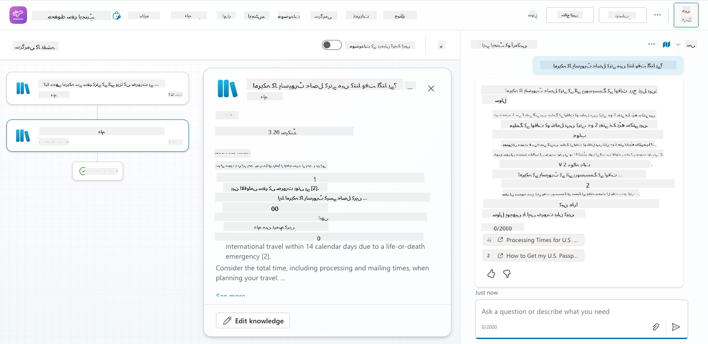

1. جب تیار ہو جائیں، **Publish** پر کلک کریں  

    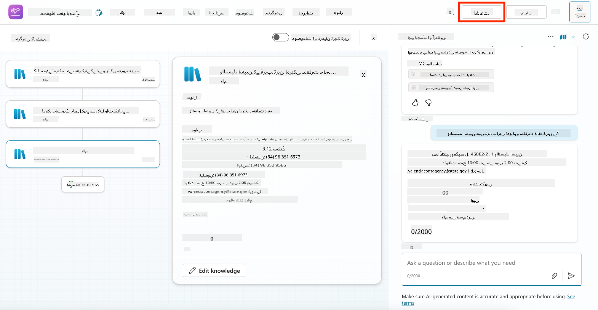

1. ڈائیلاگ باکس میں دوبارہ **Publish** کو منتخب کریں  
    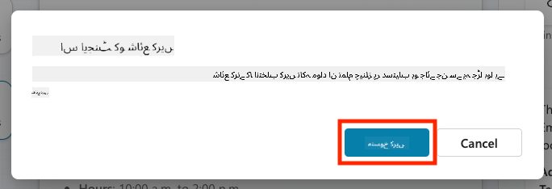

1. اختیاری طور پر، ایجنٹ کو Microsoft Teams میں بلٹ ان **Channels** فیچر کا استعمال کرتے ہوئے شامل کریں۔

!!! note "🧳 اضافی مقصد"
    محفوظ سفر ایجنٹ کو اپنی کمپنی کی سفر کی پالیسیوں کے لیے مزید متعلقہ بنانے کے لیے اسے SharePoint سائٹ یا FAQ فائل کے ساتھ بنیاد فراہم کرنے کی کوشش کریں۔

## ✅ مشن مکمل

آپ نے کامیابی سے:

- مائیکروسافٹ کے پہلے سے تیار شدہ ایجنٹ کو تعینات کیا  
- ایجنٹ کو اپنی مرضی کے مطابق بنایا  
- **محفوظ سفر** ایجنٹ ٹیمپلیٹ کا اپنا ورژن ٹیسٹ اور شائع کیا  

⏭️ [**شروع سے ایک کسٹم ایجنٹ بنانے** کے سبق پر جائیں](../06-create-agent-from-conversation/README.md).

---

**اعلانِ لاتعلقی**:  
یہ دستاویز AI ترجمہ سروس [Co-op Translator](https://github.com/Azure/co-op-translator) کا استعمال کرتے ہوئے ترجمہ کی گئی ہے۔ ہم درستگی کی بھرپور کوشش کرتے ہیں، لیکن براہ کرم آگاہ رہیں کہ خودکار ترجمے میں غلطیاں یا غیر درستیاں ہو سکتی ہیں۔ اصل دستاویز کو اس کی اصل زبان میں مستند ذریعہ سمجھا جانا چاہیے۔ اہم معلومات کے لیے، پیشہ ور انسانی ترجمہ کی سفارش کی جاتی ہے۔ اس ترجمے کے استعمال سے پیدا ہونے والی کسی بھی غلط فہمی یا غلط تشریح کے لیے ہم ذمہ دار نہیں ہیں۔