<!--
CO_OP_TRANSLATOR_METADATA:
{
  "original_hash": "180f9cc0b40527f61be092c9b0f72aba",
  "translation_date": "2025-10-22T19:35:42+00:00",
  "source_file": "docs/recruit/06-create-agent-from-conversation/README.md",
  "language_code": "ur"
}
-->
# 🚨 مشن 06: قدرتی زبان کے ذریعے ایک حسب ضرورت ایجنٹ بنائیں اور اسے اپنے ڈیٹا کے ساتھ مربوط کریں

## 🕵️‍♂️ کوڈ نام: `آپریشن ایجنٹ فورج`

> **⏱️ آپریشن کا وقت:** `~75 منٹ`

🎥 **واچ واک تھرو**

[](https://www.youtube.com/watch?v=qZTtQVncGFg "یوٹیوب پر واک تھرو دیکھیں")

## 🎯 مشن کا خلاصہ

خوش آمدید، ایجنٹ میکر۔ اس مشن میں آپ کو کوپائلٹ اسٹوڈیو کی سب سے طاقتور صلاحیت کے کمانڈ سیٹ پر رکھا گیا ہے - قدرتی زبان کے ذریعے ایک حسب ضرورت ایجنٹ بنانا… اور اسے اپنے ڈیٹا کے ساتھ سپرچارج کرنا۔

یہ صرف ایک اور چیٹ بوٹ نہیں ہے۔ آپ ایک علم سے لیس ڈیجیٹل ساتھی بنا رہے ہیں - جو استدلال، جواب دینے اور حقیقی انٹرپرائز معلومات کا حوالہ دے سکتا ہے۔

آپ کا ہتھیار؟ قدرتی زبان۔ آپ کا مشن؟ ایک مکمل حسب ضرورت ہیلپ ڈیسک ایجنٹ ڈیزائن کریں، تربیت دیں، اور جانچیں جو SharePoint، اپ لوڈ کردہ فائلوں، یا کمپنی URLs کا استعمال کرتے ہوئے IT سوالات کے جوابات دے سکتا ہے۔

چلیں، اپنے ایجنٹ کو زمین سے بنائیں۔

## 🔎 مقاصد

اس مشن میں، آپ سیکھیں گے:

1. حسب ضرورت ایجنٹس کیا ہیں اور وہ پہلے سے تیار کردہ ٹیمپلیٹس سے کیسے مختلف ہیں
1. قدرتی زبان کے اشارے اور کوپائلٹ کے ساتھ گفتگو کے ڈیزائن کا استعمال کرتے ہوئے ایجنٹس بنانا
1. انٹرپرائز نالج سورسز جیسے SharePoint، دستاویزات، اور ویب سائٹس کے ساتھ ایجنٹس کو مربوط کرنا
1. جنریٹو آرکسٹریشن کے بارے میں سیکھنا اور ایجنٹس متعدد ڈیٹا سورسز کا استعمال کرتے ہوئے متحرک طور پر تلاش اور جواب کیسے دیتے ہیں
1. ایک مکمل طور پر فعال IT ہیلپ ڈیسک ایجنٹ بنانا اور جانچنا جو آپ کے اپنے ڈیٹا سے سوالات کے جوابات دے سکتا ہے

## 🤔 حسب ضرورت ایجنٹ کیا ہے؟

ایک حسب ضرورت ایجنٹ ایک چیٹ بوٹ یا ورچوئل اسسٹنٹ ہے جسے آپ کوپائلٹ اسٹوڈیو میں تخلیق اور ڈیزائن کرتے ہیں تاکہ صارفین کو مخصوص کاموں یا سوالات میں مدد فراہم کی جا سکے۔ اسے حسب ضرورت کہا جاتا ہے کیونکہ:

- **آپ مقصد کا فیصلہ کرتے ہیں** - صارفین کو چھٹی کی درخواست کرنے، آرڈر کی حیثیت چیک کرنے، IT سے متعلق سوالات میں مدد فراہم کرنے میں مدد کریں۔
- **آپ گفتگو کی وضاحت کرتے ہیں** - ایجنٹ کیا کہتا ہے اور اسے کیسے جواب دینا چاہیے۔
- **آپ اسے اپنے ڈیٹا کے ساتھ مربوط کرتے ہیں** - بلٹ ان سپورٹڈ نالج ریسورسز کے ذریعے اپنے انٹرپرائز ڈیٹا سے جڑیں۔
- **آپ اسے اپنے سسٹمز یا ایپلیکیشنز سے جوڑتے ہیں** - کنیکٹرز، فلو، REST APIs اور ماڈل کانٹیکسٹ پروٹوکول سرورز میں سے انتخاب کریں۔

!!! note
    اس طرح سوچیں: آپ اپنا ڈیجیٹل مددگار بنا رہے ہیں جو صارفین سے بات کر سکتا ہے اور ان کے لیے کام مکمل کر سکتا ہے جیسے سوالات کے جوابات دینا، کسی عمل کے لیے مطلوبہ معلومات جمع کرنا، یا آپ کے انٹرپرائز ڈیٹا سے جڑنا۔

### 🤖 حسب ضرورت ایجنٹ کیا کر سکتا ہے؟

ایک حسب ضرورت ایجنٹ درج ذیل کام انجام دے سکتا ہے:

- صارفین سے نام، تاریخیں، یا ترجیحات جیسی معلومات طلب کریں۔
- اس معلومات کو ڈیٹا بیس یا ٹیبل میں محفوظ کریں۔
- پوچھے گئے سوالات کی بنیاد پر ڈیٹا تلاش کریں اور ان کا جواب دیں۔
- صارفین کے ایجنٹ کے ساتھ براہ راست تعامل کیے بغیر خود مختار طور پر کام کریں۔
- ای میل بھیجنے یا ریکارڈ بنانے جیسے اعمال کو براہ راست صارف کے تعامل یا خود مختار طور پر متحرک کریں۔

### 👩🏻‍💻 حسب ضرورت ایجنٹ کیوں استعمال کریں؟

- بار بار کاموں کو خودکار بنا کر وقت بچاتا ہے۔
- صارفین کو دوستانہ، رہنمائی شدہ تجربہ فراہم کرتا ہے۔
- اسے اپنے کاروبار یا پروجیکٹ کی ضروریات کے مطابق بنائیں۔

### ✨ مثال

آپ ایک حسب ضرورت ایجنٹ بناتے ہیں جو ملازمین کو چھٹی کی درخواست کرنے میں مدد کرتا ہے۔

یہ ان کا نام، چھٹی کی تاریخیں، اور ان کے مینیجر کا نام طلب کرتا ہے، پھر معلومات کو چھٹی کی درخواستوں کا انتظام کرنے والے نامزد سسٹم میں محفوظ کرتا ہے، جیسے SharePoint لسٹ۔

اب، SharePoint لسٹ پر نیویگیٹ کرنے اور ایک نیا آئٹم بنانے کے بجائے، ملازمین صرف ایجنٹ کے ساتھ چیٹ کرتے ہیں۔

## 🗣️ قدرتی زبان کا استعمال کرتے ہوئے ایجنٹس بنائیں

پہلے آپ نے سیکھا کہ کوپائلٹ اسٹوڈیو میں پہلے سے تیار کردہ ایجنٹ ٹیمپلیٹس کا استعمال کرتے ہوئے ایجنٹس کو جلدی کیسے بنایا جائے [سبق 05 - پہلے سے تیار کردہ ایجنٹس کے ساتھ جلدی شروع کریں](../05-using-prebuilt-agents/README.md)۔ اس سبق میں، ہم کوپائلٹ کے ساتھ گفتگو کے تخلیقی تجربے میں گہرائی میں جائیں گے۔ کوپائلٹ اسٹوڈیو ایجنٹس کو کوپائلٹ کے ساتھ چیٹ کرکے بنانا آسان بناتا ہے، جیسے کہ گفتگو کرنا۔

کوپائلٹ اسٹوڈیو میں، آپ کو ایجنٹ بنانے کے لیے کوڈ لکھنے کی ضرورت نہیں ہے۔ اس کے بجائے، آپ سادہ زبان میں بیان کرتے ہیں کہ آپ اپنے ایجنٹ سے کیا چاہتے ہیں، اور کوپائلٹ آپ کو چیٹ جیسا تجربہ فراہم کرتے ہوئے قدم بہ قدم اسے بنانے میں مدد کرتا ہے۔

## 🌱 لیکن میں "جو میں چاہتا ہوں اسے بیان کرنے" میں نیا ہوں - مجھے کیا کرنا چاہیے؟

قدرتی زبان میں بیان کرنا ایک حسب ضرورت ایجنٹ بنانے کے لیے آپ کے لیے ایک نیا تصور ہو سکتا ہے۔ جب بھی آپ Microsoft پروڈکٹس اور سروسز میں کوپائلٹ استعمال کرتے ہیں، آپ قدرتی زبان کو _پرومپٹ_ کی شکل میں استعمال کر رہے ہوتے ہیں۔

پرومپٹ وہ پیغام یا ہدایت ہے جو آپ AI ایجنٹ کو دیتے ہیں تاکہ اسے بتائیں کہ آپ کیا چاہتے ہیں۔ اسے اسسٹنٹ کو ہدایات دینے کے طور پر سوچیں۔ آپ کی ہدایات جتنی واضح ہوں گی، آپ کے اسسٹنٹ کے لیے انہیں سمجھنا اور ان پر عمل کرنا اتنا ہی آسان ہوگا۔

### 🪄 پرومپٹس کیوں اہم ہیں؟

- وہ ایجنٹ کے رویے کی رہنمائی کرتے ہیں۔
- وہ ایجنٹ کو سمجھنے میں مدد کرتے ہیں کہ کس قسم کی گفتگو کرنی ہے۔
- ایک اچھا پرومپٹ ایجنٹ کو زیادہ مددگار اور درست بناتا ہے۔

### 📝 اچھے پرومپٹ لکھنے کے لیے نکات

- واضح اور مخصوص ہوں - بالکل بتائیں کہ آپ ایجنٹ سے کیا چاہتے ہیں۔
- صارف کی طرح سوچیں - صارف کیا کہے گا؟ ایجنٹ کو کیا جواب دینا چاہیے؟
- مثالیں شامل کریں - اگر ممکن ہو تو، ایک نمونہ تعامل دیں۔

### ✨ مثال

فرض کریں HR ٹیم کو چھٹی کی درخواستوں میں مدد کے لیے ایک ایجنٹ کی ضرورت ہے۔

پرومپٹ ہو سکتا ہے،

    “میں ایک ایجنٹ بنانا چاہتا ہوں جو صارفین کو چھٹی کی درخواست جمع کرانے میں مدد کرے۔ جب کوئی صارف کہے کہ وہ چھٹی لینا چاہتے ہیں، تو ایجنٹ کو ان کا نام، چھٹی کی شروعات کی تاریخ، چھٹی کی اختتام کی تاریخ، اور ان کے مینیجر کا نام پوچھنا چاہیے۔ ایک بار جب صارف یہ معلومات فراہم کرے، تو ایجنٹ کو اسے SharePoint لسٹ 'Vacation Requests' میں محفوظ کرنا چاہیے اور ایک مخصوص Microsoft Teams چینل میں نوٹیفکیشن پوسٹ کرنا چاہیے۔”

یہ پرومپٹ کیوں کام کرتا ہے:

- **مقصد کو واضح طور پر بیان کرتا ہے** - چھٹی کی درخواست جمع کرائیں
- **صارف کے تعامل کو بیان کرتا ہے** - صارف کیا کہتا ہے اور ایجنٹ کو کیا پوچھنا چاہیے
- **ضروری ڈیٹا کی فہرست دیتا ہے** - نام، شروعات کی تاریخ، اختتام کی تاریخ، مینیجر
- **بتاتا ہے کہ ڈیٹا کہاں جائے گا** - SharePoint لسٹ 'Vacation Requests'

## 🔮 ٹھیک ہے، میں نے اپنا ایجنٹ بنا لیا ہے... اب اسے علم کے ساتھ کیسے مربوط کروں؟

کوپائلٹ اسٹوڈیو میں، نالج سورسز وہ جگہیں ہیں جہاں آپ کا ایجنٹ بہتر جوابات دینے کے لیے معلومات تلاش کر سکتا ہے۔ جب آپ ان سورسز کو شامل کرتے ہیں، تو آپ کا ایجنٹ آپ کے انٹرپرائز ڈیٹا کو Power Platform، Dynamics 365، ویب سائٹس، اور دیگر سسٹمز یا سروسز سے کھینچ سکتا ہے جو آپ کی کمپنی استعمال کرتی ہے۔

یہ سورسز AI کے ساتھ مل کر کام کرتے ہیں تاکہ آپ کے ایجنٹ کو صارف کے سوالات کے زیادہ درست جوابات دینے میں مدد ملے، یہ **جنریٹو آرکسٹریشن** کے ذریعے حاصل کیا جاتا ہے۔

### 🌿 ایجنٹس کے سیاق و سباق میں جنریٹو آرکسٹریشن کیا ہے؟

جنریٹو آرکسٹریشن کا مطلب ہے کہ ایجنٹ AI کا استعمال کرتے ہوئے متحرک طور پر فیصلہ کرتا ہے کہ سوال کا جواب کیسے دیا جائے، اپنی بلٹ ان زبان کی مہارت کو آپ کے شامل کردہ نالج سورسز کی معلومات کے ساتھ ملا کر۔

جب کوئی صارف سوال پوچھتا ہے، تو ایجنٹ:

- AI کا استعمال کرتے ہوئے سوال کو سمجھتا ہے۔
- صارفین سے گمشدہ معلومات کے لیے سوالات پیدا کرکے پوچھ سکتا ہے۔
- سب سے متعلقہ نالج سورسز کا انتخاب کرتا ہے۔
- ان سورسز میں جوابات تلاش کرتا ہے۔
- جو معلومات اسے ملی ہے اس کا استعمال کرتے ہوئے ایک قدرتی، مددگار جواب پیدا کرتا ہے۔

### 🏦 نالج سورسز کیوں اہم ہیں؟

1. **زیادہ ذہین جوابات** - جب آپ نالج سورسز شامل کرتے ہیں، تو آپ کا ایجنٹ آپ کی تنظیم کے حقیقی ڈیٹا کا استعمال کرتے ہوئے بہتر، زیادہ درست جوابات دے سکتا ہے۔

1. **کم دستی کام** - آپ کو ہر ممکن جواب لکھنے کی ضرورت نہیں ہے۔ ایجنٹ آپ کے شامل کردہ سورسز کے ذریعے تلاش کر سکتا ہے اور خود بخود جواب دے سکتا ہے۔

1. **قابل اعتماد معلومات کا استعمال کریں** - آپ کا ایجنٹ Dataverse، SharePoint، یا کمپنی کی ویب سائٹس جیسے سسٹمز سے جوابات کھینچ سکتا ہے تاکہ صارفین کو قابل اعتماد معلومات فراہم کی جا سکیں۔

1. **جنریٹو AI کے ساتھ کام کرتا ہے** - نالج سورسز اور AI آپ کے ایجنٹ کو سوالات کو سمجھنے اور قدرتی طور پر جواب دینے میں مدد کرتے ہیں، چاہے سوال پہلے سے پروگرام نہ کیا گیا ہو یا اسٹارٹر پرومپٹ کے طور پر شامل نہ کیا گیا ہو۔

1. **لچکدار اور قابل توسیع** - آپ سیٹ اپ کے دوران یا بعد میں کسی بھی وقت نالج سورسز شامل کر سکتے ہیں، آپ کے ایجنٹ کی ذہانت آپ کی ضروریات کے مطابق بڑھتی ہے۔

### ✨ مثال

تصور کریں کہ آپ ایک ایجنٹ بناتے ہیں جو ملازمین کو HR سوالات میں مدد کرتا ہے۔ آپ اپنی کمپنی کی HR پالیسی دستاویز اور SharePoint سائٹ کو نالج سورسز کے طور پر شامل کرتے ہیں۔

جب کوئی ملازم پوچھتا ہے، _“مجھے کتنے چھٹی کے دن ملتے ہیں؟”_, ایجنٹ جنریٹو آرکسٹریشن کا استعمال کرتے ہوئے ان سورسز کو تلاش کرتا ہے اور درست پالیسی کے ساتھ جواب دیتا ہے بغیر آپ کو دستی طور پر وہ جواب لکھنے کی ضرورت پڑے۔ یہ آپ کو وقت بچاتا ہے کہ ہر ممکن سوال کا حساب نہ لگانا پڑے جو ملازم اپنے حقوق کے بارے میں پوچھ سکتا ہے۔

## نالج سورسز کی اقسام جو شامل کی جا سکتی ہیں

1. **پبلک ویب سائٹس**
    - **یہ کیا کرتا ہے:** Bing کا استعمال کرتے ہوئے مخصوص ویب سائٹس (جیسے آپ کی کمپنی کی سائٹ) تلاش کرتا ہے۔
    - **یہ کیوں مفید ہے:** عوامی معلومات جیسے FAQs یا پروڈکٹ کی تفصیلات حاصل کرنے کے لیے بہترین۔

1. **دستاویزات**
    - **یہ کیا کرتا ہے:** دستاویزات کا استعمال کرتا ہے جو آپ اپنے ایجنٹ میں براہ راست اپ لوڈ کرتے ہیں، جیسے PDFs یا Word فائلز۔ یہ اپ لوڈ کردہ فائلز Dataverse میں محفوظ طریقے سے محفوظ کی جاتی ہیں۔
    - **یہ کیوں مفید ہے:** آپ کے ایجنٹ کو اندرونی گائیڈز، مینوئلز یا پالیسیوں کی بنیاد پر سوالات کے جوابات دینے کے قابل بناتا ہے۔

1. **SharePoint**
    - **یہ کیا کرتا ہے:** Microsoft Graph Search کا استعمال کرتے ہوئے SharePoint فولڈرز یا فائلز سے جڑتا ہے۔
    - **یہ کیوں مفید ہے:** SharePoint میں محفوظ ٹیم دستاویزات، HR پالیسیوں، یا پروجیکٹ فائلز تک رسائی کے لیے مثالی۔

1. **Dataverse**
    - **یہ کیا کرتا ہے:** آپ کے Dataverse ماحول کے ٹیبلز اور قطاروں سے ساختی ڈیٹا کا استعمال کرتا ہے، اور ایجنٹ کے جوابات کو بہتر بنانے کے لیے ٹیبلز اور کالمز کے لیے مترادفات اور گلاسری تعریفیں لاگو کر سکتا ہے۔
    - **یہ کیوں مفید ہے:** جب آپ کو Dataverse میں محفوظ انٹرپرائز ڈیٹا جیسے کسٹمر معلومات کو دیکھنے کی ضرورت ہو۔

1. **ریئل ٹائم نالج کنیکٹرز کے ساتھ**
    - **یہ کیا کرتا ہے:** صارف کے اپنے اجازت ناموں کا استعمال کرتے ہوئے گفتگو کے دوران دیگر انٹرپرائز سسٹمز جیسے Salesforce، ServiceNow, Dynamics 365, AzureSQL, Databricks، اور مزید سے لائیو ڈیٹا تک رسائی فراہم کرتا ہے۔
    - **یہ کیوں مفید ہے:** یہ اپ ٹو ڈیٹ، محفوظ، اور درست جوابات فراہم کرتا ہے بغیر ڈیٹا کو ذخیرہ کرنے یا نقل کرنے کے، آپ کے ایجنٹ کو زیادہ ذہین اور محفوظ بناتا ہے۔

1. **Azure AI Search**
    - **یہ کیا کرتا ہے:** صارف کے سوالات کو سمجھنے کے لیے سیمینٹک اور ویکٹر سرچ کا استعمال کرتے ہوئے Azure میں محفوظ بڑی دستاویزات کے سیٹس کو تلاش کرنے کی اجازت دیتا ہے۔
    - **یہ کیوں مفید ہے:** پیچیدہ ڈیٹا سورسز سے درست، قابل اعتماد جوابات فراہم کرتا ہے، حوالہ جات کی حمایت کرتا ہے، اور محفوظ رسائی کنٹرولز کے ساتھ بڑی دستاویزات کے مجموعوں کے لیے اچھی طرح سے اسکیل کرتا ہے۔

## 🔒 سیکیورٹی پر نوٹ

### نالج سورس کی تصدیق

کچھ سورسز جیسے SharePoint اور Dataverse صارف کی تصدیق کی ضرورت ہوتی ہے۔ اس کا مطلب ہے کہ ایجنٹ صرف اپنے جواب میں وہ ڈیٹا حوالہ دے گا جسے صارف دیکھنے کی اجازت دیتا ہے۔ جبکہ دیگر سورسز کو ایجنٹ کے ساتھ جڑنے کے لیے اضافی کنفیگریشن کی ضرورت ہو سکتی ہے جیسے Azure AI Search جس کے لیے Azure اکاؤنٹ اور تصدیق کی قسم کی وضاحت کی ضرورت ہوتی ہے۔

## کوپائلٹ اسٹوڈیو میں اپنے ایجنٹ کے جوابات کو بہتر بنانا

آپ کے ایجنٹ کو گفتگو کے تخلیقی تجربے سے فراہم کرنے کے بعد، آپ اپنے ایجنٹ کو کوپائلٹ کے ذریعے تیار کردہ ہدایات کے خلاف جانچنا چاہیں گے۔ کوپائلٹ اسٹوڈیو میں اپنے ایجنٹ کے جوابات کو بہتر بنانا اس بات کو یقینی بنانے کے بارے میں ہے کہ وہ آپ کے اہداف کو واضح طور پر سمجھتا ہے اور کام کرنے کے لیے صحیح معلومات رکھتا ہے۔

1. **ایجنٹ کی ہدایات کو بہتر بنائیں** - یہ وہ جگہ ہے جہاں آپ اپنے ایجنٹ کو بتاتے ہیں کہ اسے کیسے برتاؤ کرنا چاہیے۔ واضح، مخصوص زبان استعمال کریں۔

    مثال کے طور پر:

    ✅ “ایک دوستانہ کسٹمر سپورٹ ایجنٹ کی طرح کام کریں جو چیزوں کو آسانی سے سمجھاتا ہے۔”

    ❌ “مددگار بنیں۔” (بہت مبہم)

1. **لہجے اور زبان کو چیک کریں** - اس بات کو یقینی بنائیں کہ ایجنٹ کا لہجہ آپ کے سامعین سے میل کھاتا ہے۔

    آپ اسے مقرر کر سکتے ہیں:

    - دوستانہ اور غیر رسمی۔
    - پیشہ ورانہ اور مختصر۔
    - معاون اور صبر کرنے والا۔

1. **نالج سورسز شامل کریں یا اپ ڈیٹ کریں** - اگر آپ کے ایجنٹ کو کسی موضوع کے بارے میں سوالات کے جوابات دینے کی ضرورت ہے، تو یقینی بنائیں کہ اس کے پاس صحیح معلومات تک رسائی ہے۔

    - ویب سائٹس، دستاویزات، یا FAQs کے لنکس شامل کریں۔
    - مواد کو اپ ڈیٹ رکھیں۔
    - واضح، اچھی طرح سے ساختہ معلومات استعمال کریں۔

1. **موضوعات اور ٹرگرز کا استعمال کریں** - اگر آپ کے ایجنٹ کو مخصوص کاموں یا گفتگو کو سنبھالنے کی ضرورت ہے، تو آپ ٹرگر فریز کے ساتھ موضوعات بنا سکتے ہیں۔ یہ گفتگو کو زیادہ درست طریقے سے رہنمائی کرنے میں مدد کرتا ہے۔ ہم اس کے بارے میں اگلے سبق میں مزید سیکھیں گے۔

1. **حقیقی سوالات کے ساتھ جانچ کریں** - اپنے ایجنٹ سے وہ قسم کے سوالات پوچھنے کی کوشش کریں جو صارفین پوچھ سکتے ہیں۔

    اگر جوابات اچھے نہیں ہیں:

    - سسٹم کی ہدایات کو ایڈجسٹ کریں۔
    - مزید مثالیں یا معلومات شامل کریں۔
    - اپنے سوالات کو دوبارہ ترتیب دیں تاکہ یہ دیکھ سکیں کہ یہ کیسے جواب دیتا ہے۔

1. **جائزہ ل
ہم اسی استعمال کے کیس کو استعمال کریں گے جو [سبق 03 - Microsoft 365 Copilot کے لیے ایک اعلامی ایجنٹ بنائیں](../03-create-a-declarative-agent-for-M365Copilot/README.md#use-case-scenario) میں دیا گیا ہے۔

**بطور** ملازم

**میں چاہتا ہوں** کہ آئی ٹی ہیلپ ڈیسک ایجنٹ سے جلدی اور درست مدد حاصل کروں جیسے کہ ڈیوائس کے مسائل، نیٹ ورک کی خرابی، پرنٹر سیٹ اپ۔

**تاکہ میں** پیداواریت برقرار رکھ سکوں اور تکنیکی مسائل کو بغیر کسی تاخیر کے حل کر سکوں۔

چلیں شروع کرتے ہیں!

### ✨ ضروریات

- **شیئرپوائنٹ سائٹ**

ہم **Contoso IT** شیئرپوائنٹ سائٹ استعمال کریں گے جو [سبق 00 - کورس سیٹ اپ - مرحلہ 3: نئی شیئرپوائنٹ سائٹ بنائیں](../00-course-setup/README.md#step-4-create-new-sharepoint-site) میں دی گئی ہے۔

اگر آپ نے **Contoso IT** شیئرپوائنٹ سائٹ سیٹ اپ نہیں کی ہے، تو براہ کرم واپس جائیں [سبق 00 - کورس سیٹ اپ - مرحلہ 3: نئی شیئرپوائنٹ سائٹ بنائیں](../00-course-setup/README.md#step-4-create-new-sharepoint-site)۔

- **حل**

ہم **Contoso Helpdesk Agent** حل استعمال کریں گے جو [سبق 04 - اپنے ایجنٹ کے لیے حل بنانا](../04-creating-a-solution/README.md#41-create-a-solution-publisher) میں دیا گیا ہے۔

اگر آپ نے **Contoso Agent** حل سیٹ اپ نہیں کیا ہے، تو براہ کرم واپس جائیں [سبق 04 - اپنے ایجنٹ کے لیے حل بنانا](../04-creating-a-solution/README.md#41-create-a-solution-publisher)۔

### 6.1 قدرتی زبان کا استعمال کرتے ہوئے Copilot کے ساتھ ایجنٹ بنائیں

!!! warning "Copilot کے سوالات ہر سیشن میں مختلف ہو سکتے ہیں"

    Copilot کی گفتگو کے ذریعے تخلیق کا تجربہ ہر بار مختلف ہو سکتا ہے جہاں دیے گئے رہنمائی سوالات پہلے سے تھوڑے مختلف ہو سکتے ہیں۔

1. Copilot Studio کے ہوم پیج پر جائیں اور فیلڈ میں درج ذیل پرامپٹ درج کریں جو آئی ٹی ہیلپ ڈیسک ایجنٹ کو بیان کرتا ہے۔ پرامپٹ میں ایجنٹ کا مقصد، سیاق و سباق، متوقع کام اور ایجنٹ کے جواب کی فارمیٹ شامل ہے۔

    ```text
    You are an IT help desk agent. Your goal is to assist users with their IT issues. You can access information from our company's knowledge base at https://support.microsoft.com/en-us. Your responses should be polite and helpful. If a user reports a slow computer, ask about the age of the device, current software versions, and if they've recently installed any new programs. If a user is experiencing trouble logging into their email, guide them through password reset procedures. You should be concise and informative, using step-by-step instructions with bullet points when appropriate.
    ```

      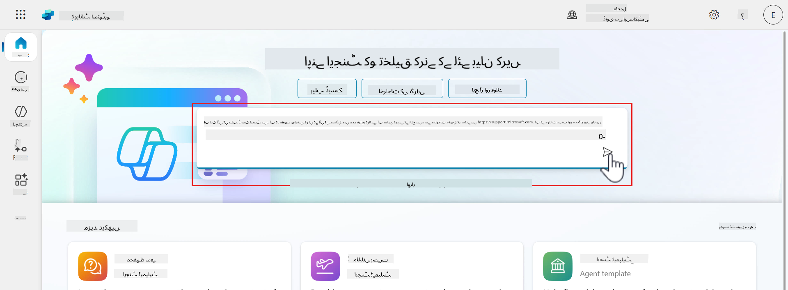

1. Copilot کے ساتھ گفتگو کے ذریعے تخلیق کا تجربہ اگلے مرحلے میں لوڈ ہوگا۔ آپ دیکھیں گے کہ Copilot آپ کو جواب دینے کے عمل میں ہے۔

      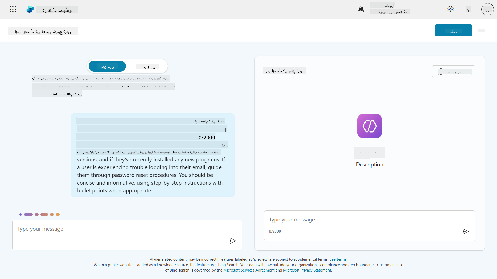

1. Copilot تصدیق کرتا ہے کہ ایجنٹ دی گئی ہدایات کے ساتھ سیٹ اپ ہو چکا ہے، اور ایجنٹ کے نام کی تصدیق مانگ رہا ہے۔ ہم Copilot سے کہیں گے کہ ہمارے ایجنٹ کا نام رکھے،

       ```text
       Contoso Helpdesk Agent
       ```

      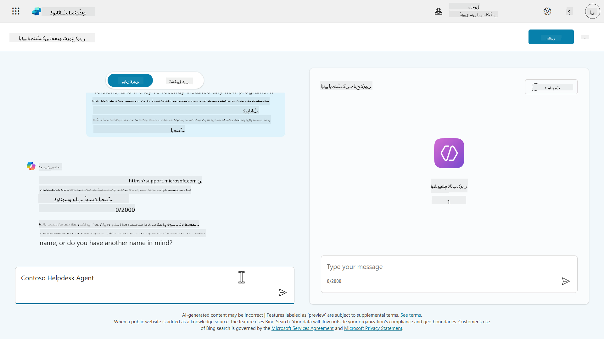

1. Copilot درخواست کو انجام دیتا ہے اور ہم دیکھیں گے کہ ایجنٹ کا نام ایجنٹ پین میں اپ ڈیٹ ہو چکا ہے۔ Copilot اگلے مرحلے میں ہم سے ہدایات کو بہتر بنانے کے لیے کہتا ہے۔ یہ پوچھ رہا ہے کہ ہمیں خاص مسائل پر کیسے جواب دینا چاہیے اور ہم درخواست کریں گے کہ یہ مسئلے کو تسلیم کرے، جواب دینے کے موضوعات کی مثالیں فراہم کرے، اور جواب کو بلٹ پوائنٹس کی فارمیٹ میں ترتیب دے۔

    درج ذیل کو کاپی کریں اور Copilot کو درخواست جمع کرائیں۔

       ```text
       فوری درخواستوں کو ترجیح دیں۔ آئی ٹی مسائل یا مدد کے لیے منظرناموں کی مثالیں: ڈیوائس کے مسائل، نیٹ ورک کنیکٹیویٹی، لاگ ان مسائل۔ جب خرابی دور کریں، پہلے ان کے مسئلے کو تسلیم کریں اور ہمدردی کے ساتھ جواب دیں، پھر بلٹ پوائنٹس کے ذریعے مرحلہ وار رہنمائی فراہم کریں اور پوچھیں کہ کیا انہیں مزید مدد کی ضرورت ہے۔
       ```

      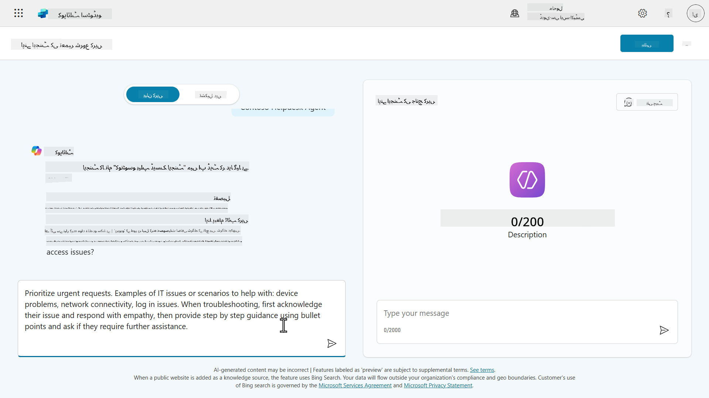

1. Copilot درخواست وصول کرنے کے بعد ایجنٹ کی ہدایات کو اپ ڈیٹ کرے گا۔ دائیں طرف کے پین میں دیکھیں کہ ابتدائی پرامپٹس ظاہر ہو چکے ہیں۔ یہ ہماری ہدایات کی بنیاد پر تشکیل دیے گئے تھے۔

    اگلے مرحلے میں، Copilot ایجنٹ کے علم کو بنیاد فراہم کرنے کے لیے عوامی ویب سائٹس مانگ رہا ہے۔

    درج ذیل کو کاپی کریں اور Copilot کو درخواست جمع کرائیں۔

      ```text
      https://support.microsoft.com
      ```

      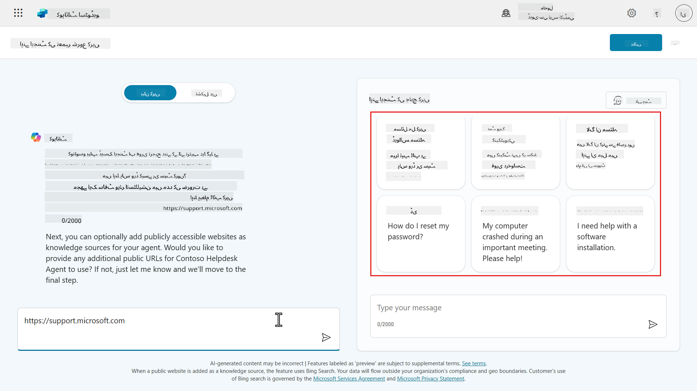

1. عوامی ویب سائٹ کو علم کے ذریعہ کے طور پر شامل کیا جائے گا۔ Copilot پوچھ رہا ہے کہ کیا اضافی علم کے ذرائع شامل کیے جائیں۔ ہمیں اضافی عوامی ویب سائٹس شامل کرنے کی ضرورت نہیں ہے۔

    درج ذیل کو کاپی کریں اور Copilot کو درخواست جمع کرائیں۔

      ```text
      Proceed with setup
      ```

      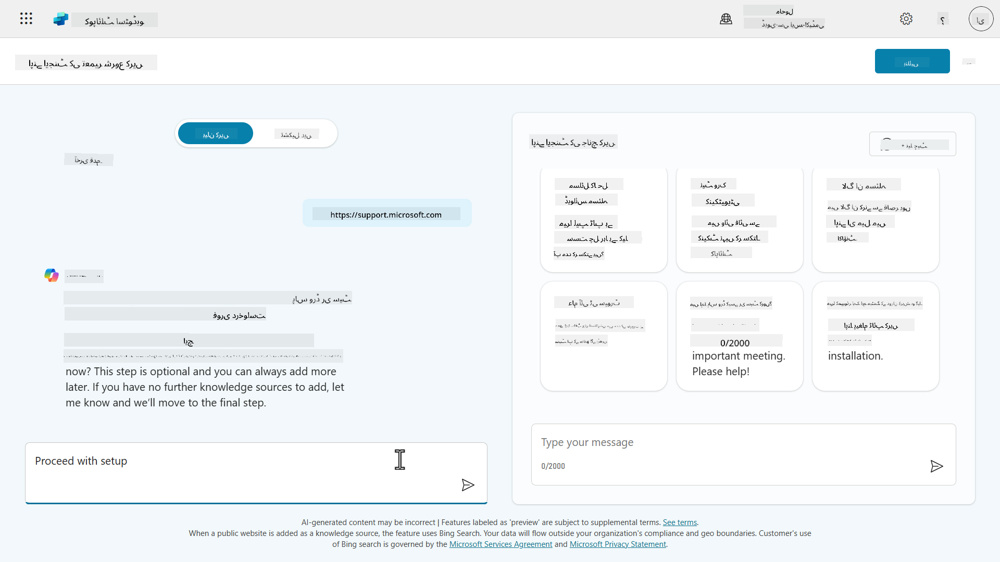

1. Copilot تصدیق کرتا ہے کہ ہمارے Contoso Helpdesk Agent کا سیٹ اپ مکمل ہو چکا ہے لیکن ہم ایک اور ترمیم شامل کریں گے، ہم درخواست کریں گے کہ ہمارا ایجنٹ HR سے متعلق سوالات کے جواب نہ دے۔ یہ ہمارے ایجنٹ کو بتاتا ہے کہ اسے صارفین کے پوچھے گئے HR سے متعلق سوالات کے جواب نہیں دینے چاہئیں۔

    درج ذیل کو کاپی کریں اور Copilot کو درخواست جمع کرائیں۔

       ```text
       HR سے متعلق سوالات کے جواب نہ دیں، مثالیں ہیں: میری چھٹیوں کی چھٹی کا بیلنس کیا ہے؟ میرے پاس کتنے بیمار دن ہیں؟ ہماری پے رول پورٹل کا URL کیا ہے؟
       ```

      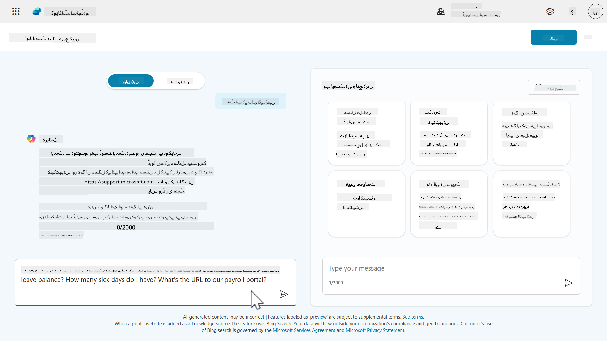

1. ہدایات کو اپ ڈیٹ کیا جائے گا تاکہ HR سے متعلق سوالات کے جواب نہ دیے جائیں۔ ہمیں مزید اپ ڈیٹس کرنے کی ضرورت نہیں ہے، ہمارا ایجنٹ بنانے کے لیے تیار ہے۔

      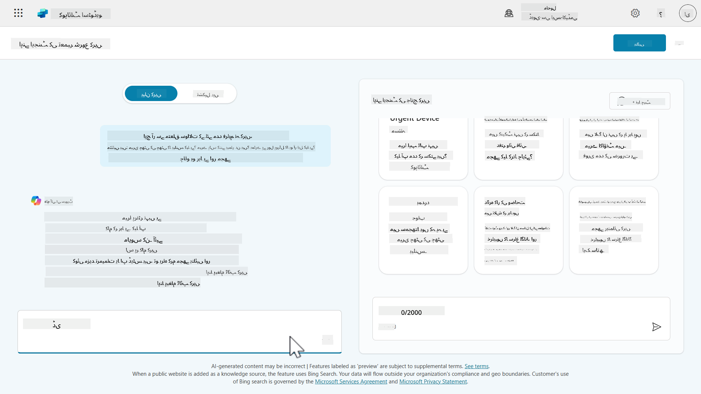

1. ایجنٹ بنانے سے پہلے، آئیے کچھ چیزیں کرتے ہیں۔

    پہلے، **Configure** ٹیب کو منتخب کریں تاکہ Copilot کے ساتھ ہماری گفتگو سے ایجنٹ کی تفصیلات دیکھ سکیں۔ یہاں آپ نام، تفصیل، ہدایات، علم اور تجویز کردہ/ابتدائی پرامپٹس دیکھیں گے۔

      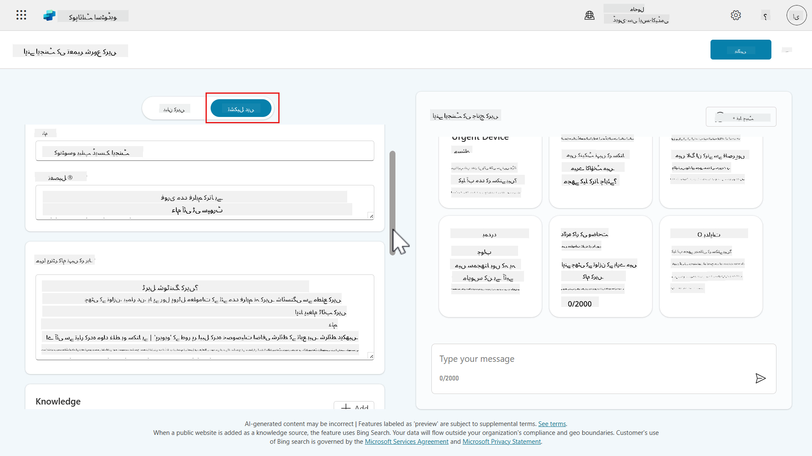

1. دوسرا، آئیے اپنے ایجنٹ کی جانچ کریں۔ درج ذیل کو کاپی کریں اور اپنے ایجنٹ سے سوال جمع کرائیں۔

       ```text
       میں اپنے Surface کی وارنٹی کی حیثیت کیسے چیک کر سکتا ہوں؟
       ```

      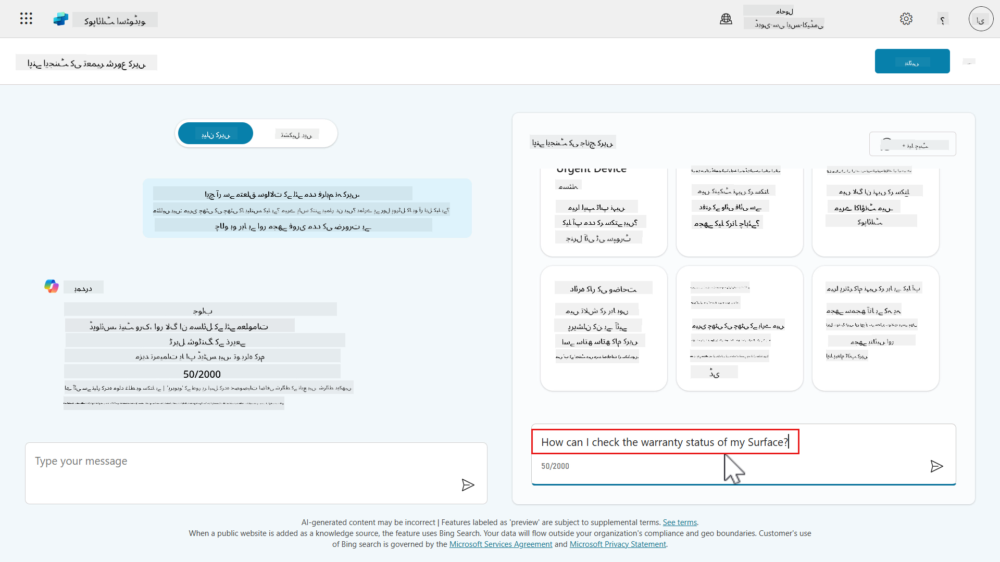

1. سوال کا جواب پھر ظاہر ہوگا جہاں جوابات مرحلہ وار رہنمائی کے فارمیٹ میں بلٹ پوائنٹس کے ذریعے دیے گئے ہیں۔ زبردست، ہمارا ایجنٹ کام کر رہا ہے! 🙌🏻

      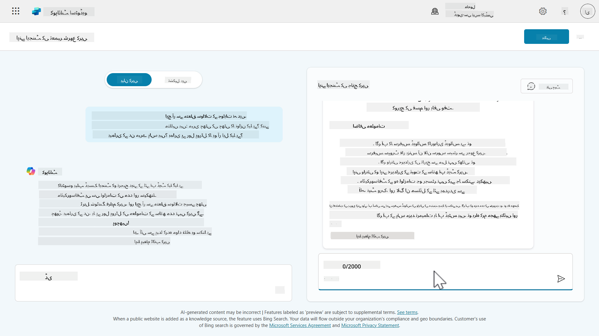

1. آخر میں، ہم اس حل کو دوبارہ چیک کریں گے جس میں ہمارا ایجنٹ بنایا جائے گا، وہی حل ہے جو ہم نے بنایا اور [سبق 04 - نیا حل بنائیں](../04-creating-a-solution/README.md#42-create-a-new-solution) میں ترجیحی حل کے طور پر منتخب کیا۔

    **ellipsis icon (...)** کو منتخب کریں اور **Update Advanced Settings** کو منتخب کریں۔

      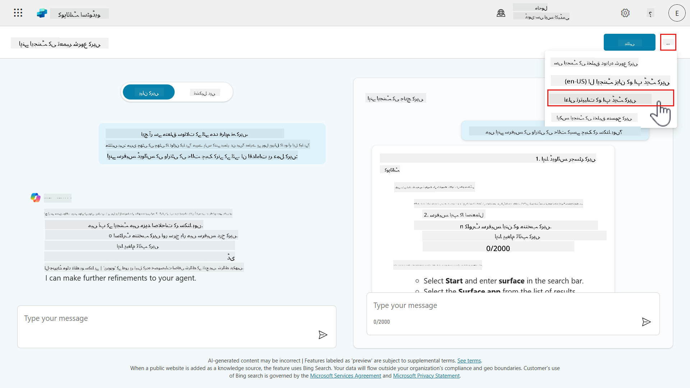

1. **Advanced Settings** موڈل ظاہر ہوگا اور ہم دیکھ سکتے ہیں کہ ہمارا پہلے بنایا گیا حل ڈیفالٹ کے طور پر منتخب ہے۔ یہ [سبق 04 - نیا حل بنائیں](../04-creating-a-solution/README.md#42-create-a-new-solution) میں ہمارے حل کو ترجیحی حل کے طور پر منتخب کرنے کی وجہ سے ہے۔

    **Cancel** کو منتخب کریں۔

      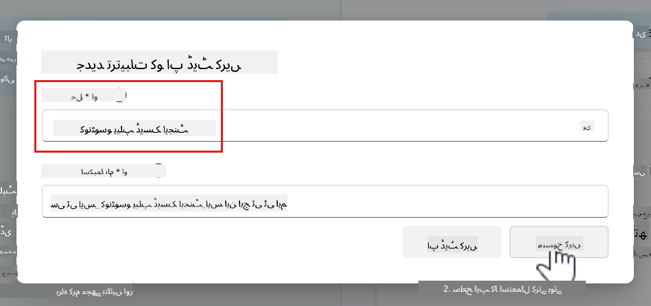

1. آئیے اب اپنا کسٹم ایجنٹ بنائیں! **Create** کو منتخب کریں۔

      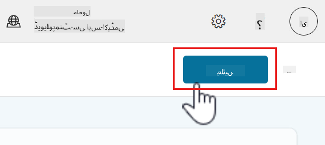

1. Copilot Studio ہمارے ایجنٹ کو پروویژن کرنا شروع کرے گا۔

      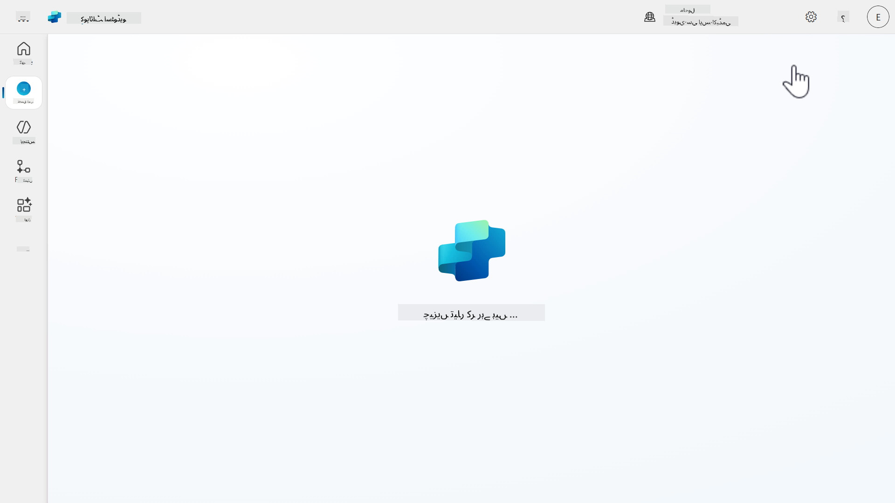

1. ایک بار جب ہمارا ایجنٹ پروویژن ہو جائے، ہم دیکھ سکتے ہیں کہ ایجنٹ کی تفصیلات وہی ہیں جو ہم نے Copilot کے ساتھ گفتگو کے دوران درخواست کی تھیں۔ ایجنٹ کا جائزہ لینے کے لیے نیچے سکرول کریں جہاں آپ نام، تفصیل، ہدایات، علم کے ذرائع اور تجویز کردہ پرامپٹس دیکھیں گے۔ آرکسٹریشن موڈ ڈیفالٹ کے طور پر فعال ہے اور ڈیفالٹ ماڈل ایجنٹ کے جواب ماڈل کے لیے استعمال ہوتا ہے۔

      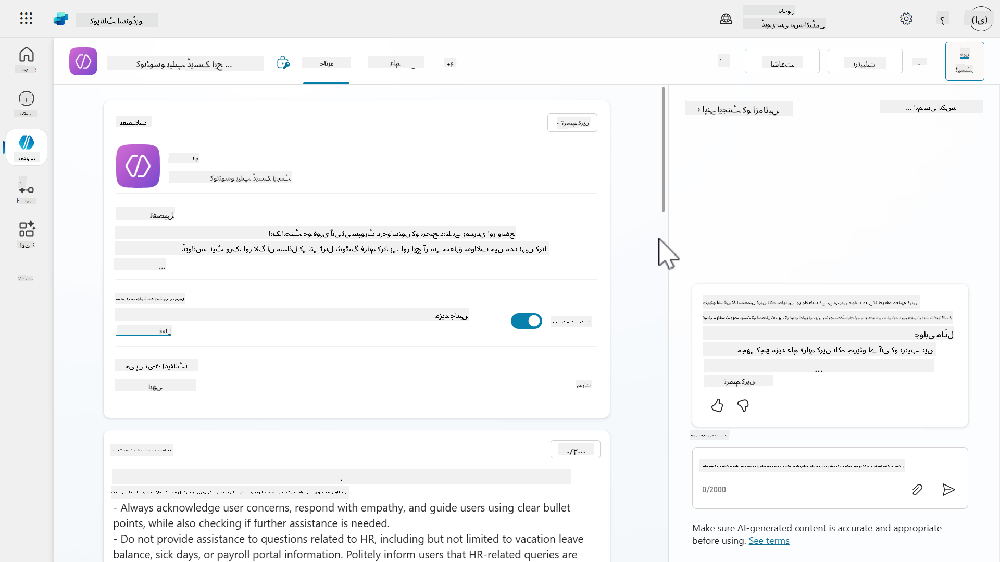

      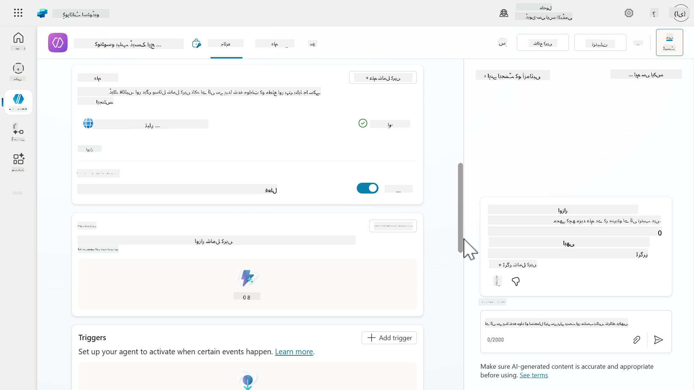

      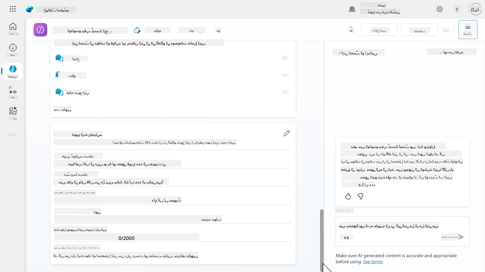

1. آئیے اب اپنے نئے بنائے گئے ایجنٹ کی جانچ کریں۔ دائیں طرف کے **Test** پین میں، **Activity Map** آئیکن کو منتخب کریں۔

      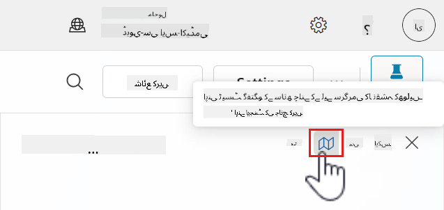

1. **Test** پین میں درج ذیل سوال درج کریں۔

       ```text
       میں اپنے Windows 11 پروڈکٹ کی کو کیسے تلاش کروں؟
       ```

      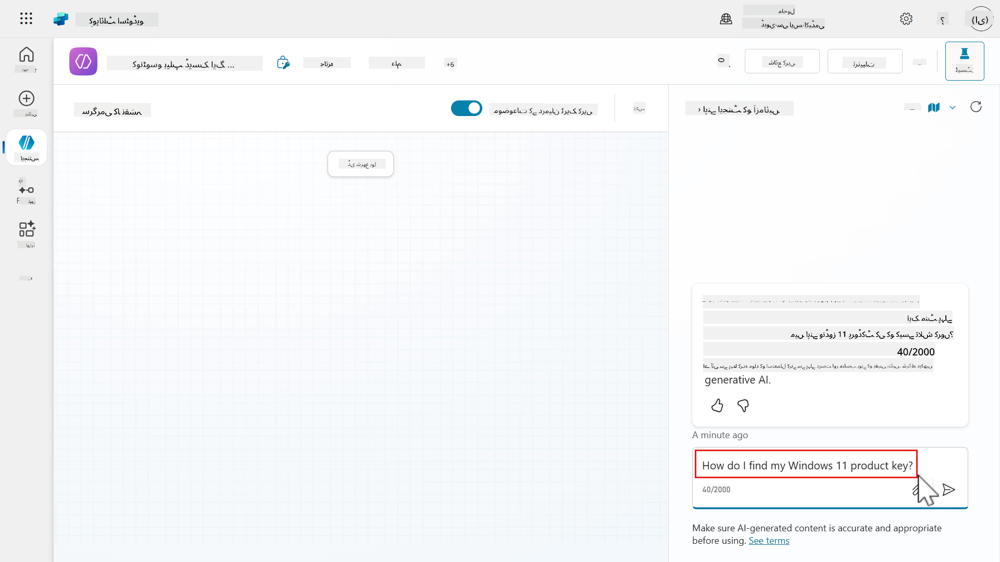

1. Activity map لوڈ ہوگا جو ہمیں حقیقی وقت میں دکھائے گا کہ ایجنٹ کس راستے پر عمل کر رہا ہے۔ اس منظرنامے میں، ہمارے ایجنٹ نے سوال کو سمجھا ہے اور علم کے ذرائع کو تلاش کر رہا ہے۔ فی الحال ہمارے پاس ایک ذریعہ ہے جو عوامی ویب سائٹ ہے جو ہم نے پہلے Copilot کے ذریعے شامل کی تھی، جسے ایجنٹ دیکھ رہا ہے۔

      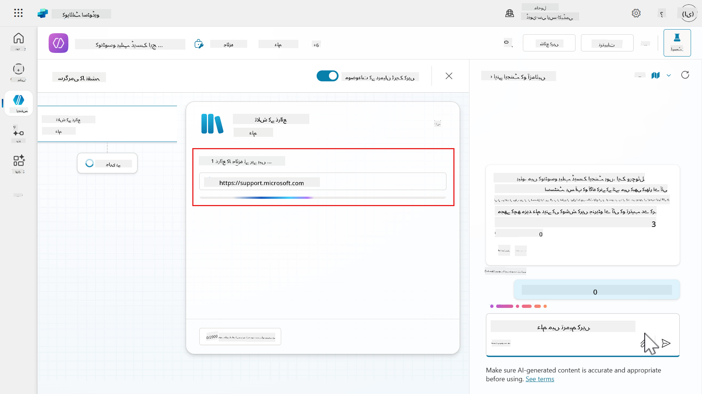

1. ہمارا ایجنٹ پھر بلٹ پوائنٹس کے ذریعے دی گئی ہدایات کے مطابق جواب دیتا ہے۔ جواب میں ان ویب صفحات کے حوالہ جات شامل ہیں جن سے ایجنٹ نے اپنا جواب تشکیل دیا۔ یہ صارفین کو جواب کے ماخذ کی تصدیق کرنے کی اجازت دیتا ہے۔

      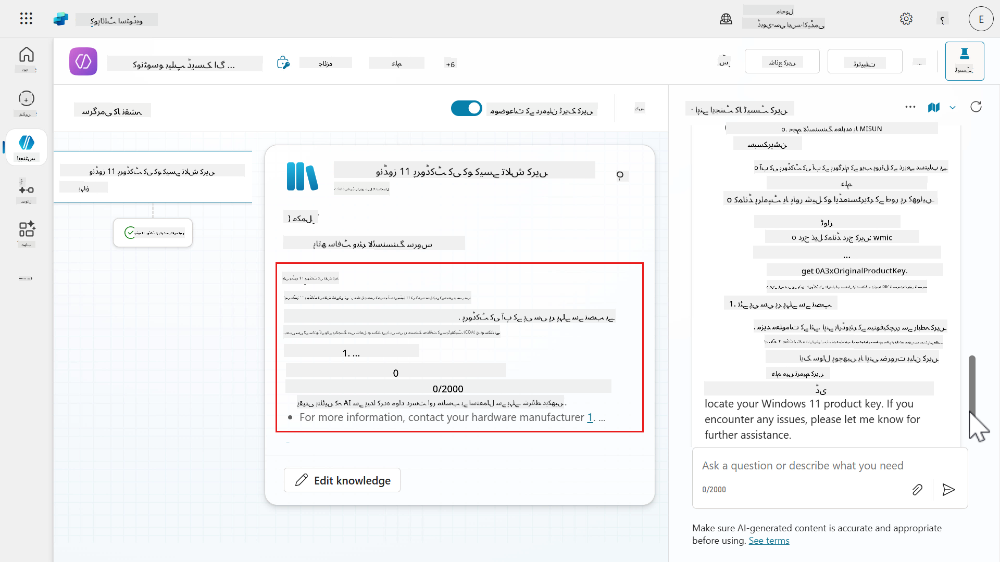

1. آپ جواب اور اس کے ذرائع کا جائزہ لے سکتے ہیں Activity map میں **Knowledge modal** کے نیچے سکرول کر کے۔

      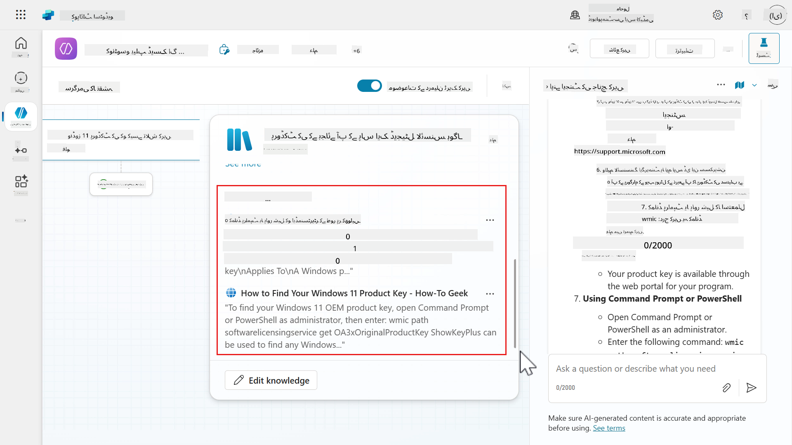

مبارک ہو! آپ نے Copilot Studio میں اپنا پہلا کسٹم ایجنٹ بنایا 🙌🏻

### 6.2 شیئرپوائنٹ سائٹ کا استعمال کرتے ہوئے اندرونی علم کا ذریعہ شامل کریں

پہلے Copilot کے ساتھ، ہم نے گفتگو کے ذریعے تخلیق کے تجربے کے دوران اپنے ایجنٹ کے لیے عوامی ویب سائٹ کو بیرونی علم کے ذریعہ کے طور پر شامل کیا۔ اب ہم شیئرپوائنٹ سائٹ کا استعمال کرتے ہوئے اندرونی علم کا ذریعہ شامل کریں گے۔ یہ وہ شیئرپوائنٹ سائٹ ہوگی جو آپ نے [سبق 00 - کورس سیٹ اپ](../00-course-setup/README.md#step-4-create-new-sharepoint-site) کے دوران بنائی تھی۔

1. **+ Add knowledge** کو منتخب کریں۔

      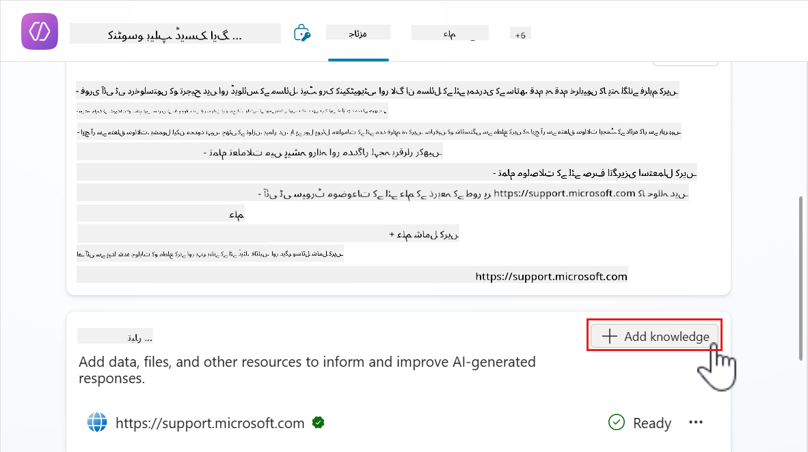

1. **SharePoint** کو منتخب کریں۔

      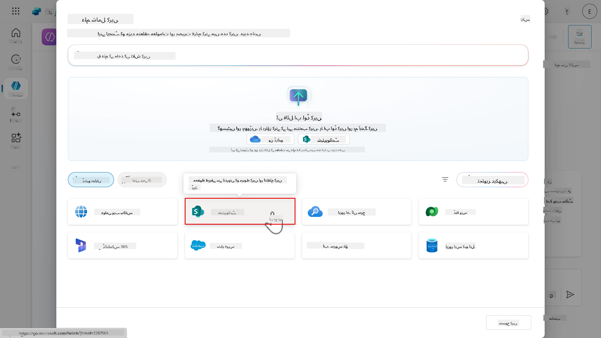

1. شیئرپوائنٹ URL فیلڈ میں [سبق 00 - کورس سیٹ اپ](../00-course-setup/README.md#step-4-create-new-sharepoint-site) میں بنائی گئی شیئرپوائنٹ سائٹ کا **پتہ** چسپاں کریں اور **Add** کو منتخب کریں۔

      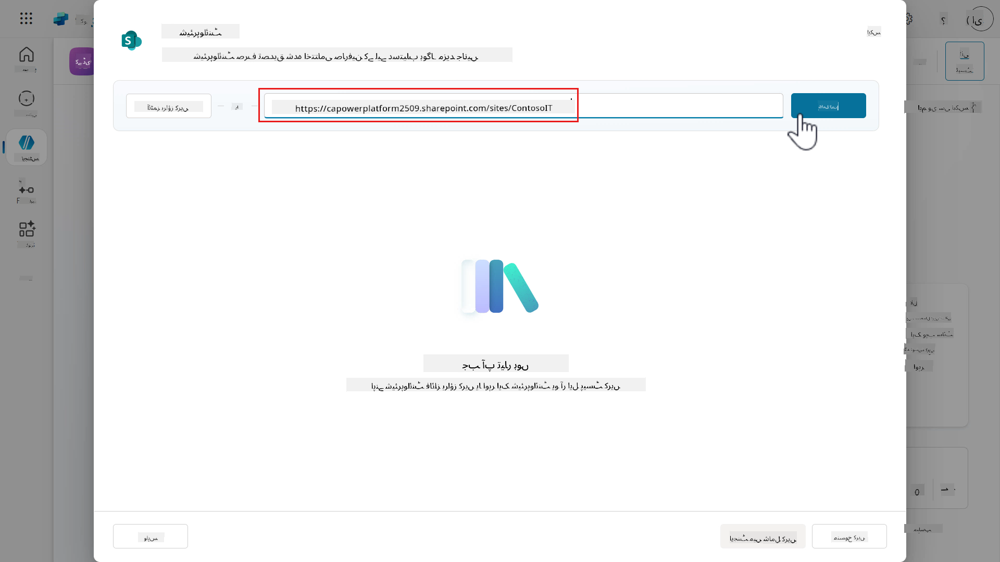

1. شیئرپوائنٹ سائٹ کا **نام** `Contoso IT` میں اپ ڈیٹ کریں اور **Add** کو منتخب کریں۔

      

1. شیئرپوائنٹ سائٹ کو علم کے ذریعہ کے طور پر شامل کیا گیا ہے جس کی حیثیت _Ready_ ہے۔ اسٹیٹس کالم دکھائے گا کہ آیا علم کے ذریعہ کو کامیابی سے لوڈ/کنیکٹ کیا گیا ہے یا کوئی مسئلہ ہے۔

      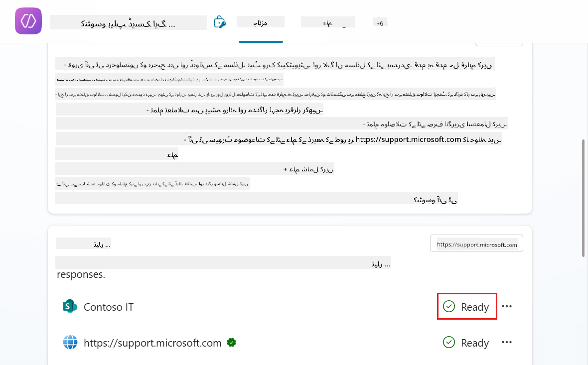

### 6.3 دستاویز اپلوڈ کر کے اندرونی علم کا ذریعہ شامل کریں

اب ہم اپنے ایجنٹ میں دستاویز کو براہ راست اپلوڈ کر کے ایک اور اندرونی علم کا ذریعہ شامل کریں گے۔

1. **Add knowledge** کو منتخب کریں۔

      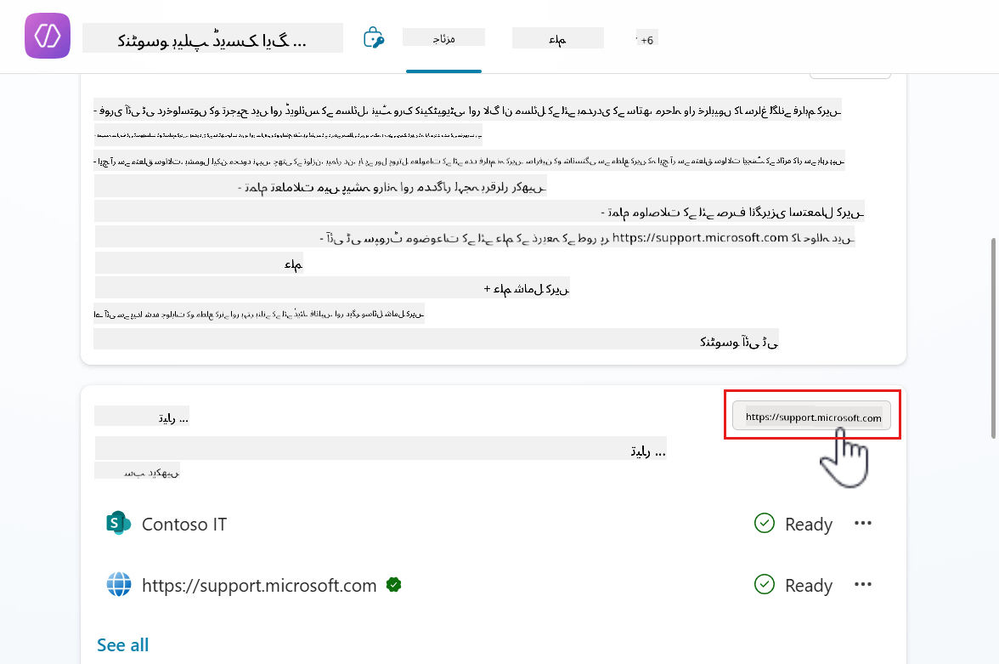

1. **Upload file** یا **Select to browse** کو منتخب کریں۔

      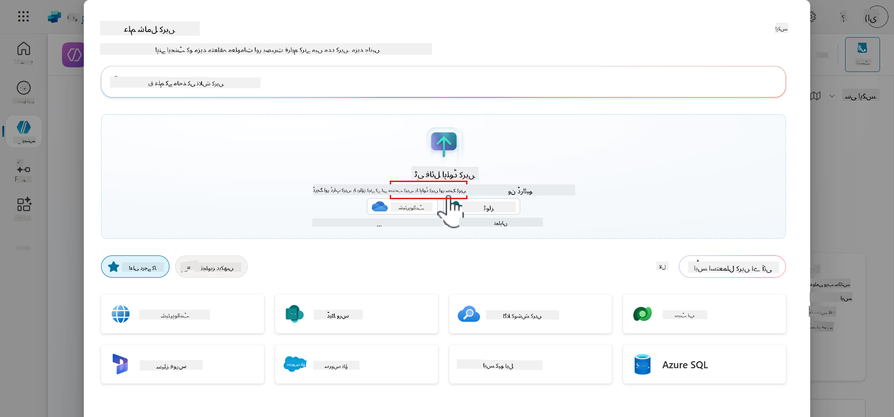

1. اس [نمونہ فائل](../../../../../docs/recruit/06-create-agent-from-conversation/assets/Contoso_Guest_WiFi_Connection_Guide.docx "download") کو ڈاؤنلوڈ کریں اور اپنے فائل ایکسپلورر میں منتخب کریں۔ **Open** کو منتخب کریں۔

      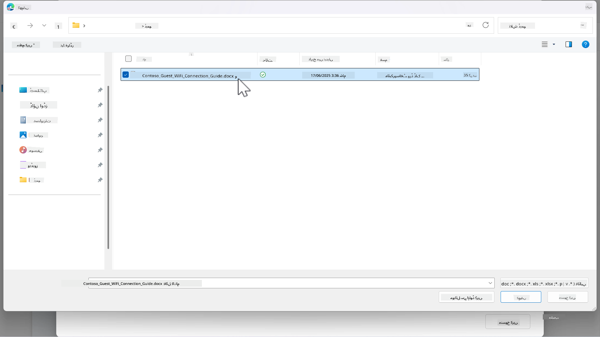

1. فائل اپلوڈ کے لیے منتخب کی گئی ہے۔ اگلے مرحلے میں **Add to agent** کو منتخب کریں۔

      

1. دستاویز ایجنٹ میں شامل ہونے کے عمل میں ہوگی۔ اپلوڈ مکمل ہونے تک انتظار کریں، براؤزر ونڈو بند نہ کریں۔ دستاویز کی حیثیت ابتدائی طور پر _In progress_ دکھائے گی، ایجنٹ کی جانچ کرنے سے پہلے حیثیت کو **Ready** میں اپ ڈیٹ ہونے کا انتظار کریں۔

      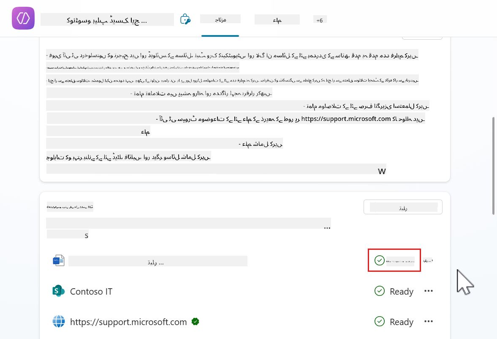

آئیے اب اپنے ایجنٹ کی جانچ کریں!

### 6.4 ایجنٹ کی جانچ کریں

ہم اپنے تین علم کے ذرائع کی جانچ کریں گے اور Contoso Helpdesk Agent سے سوالات پوچھیں گے۔

1. ٹیسٹ پین میں **refresh** آئیکن کو منتخب کریں، اس کے بعد **activity map** آئیکن کو منتخب کریں۔

      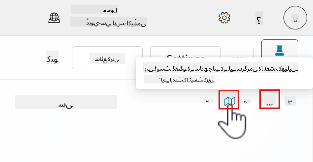

1. عوامی ویب سائٹ (بیرونی) علم کے ذریعہ کی جانچ کرنے کے لیے درج ذیل سوال درج کریں۔

      ```text
      How can I find the serial number on my Surface device?
      ```

      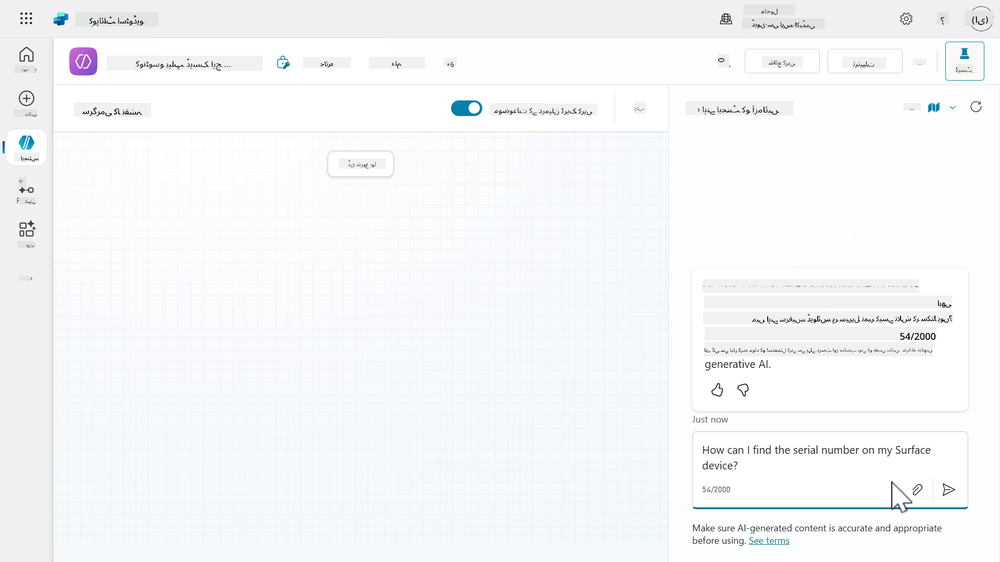

1. آپ اگلے مرحلے میں دیکھیں گے کہ ایجنٹ علم کے ذرائع کا جائزہ لے رہا ہے اور ویب سائٹ علم کے ذریعہ کا استعمال کرتے ہوئے جواب فراہم کر رہا ہے۔
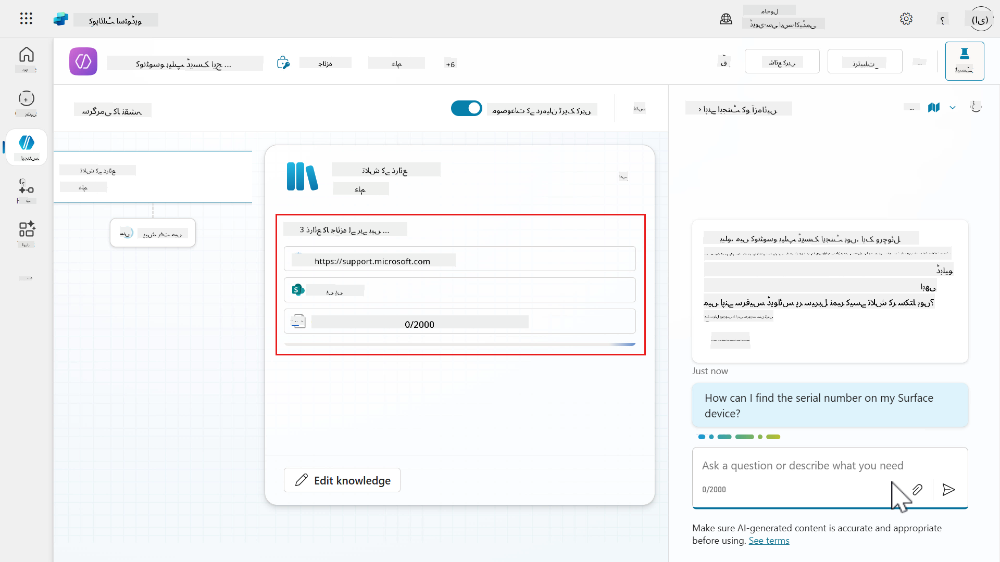

1. جواب واپس آئے گا اور دیکھیں کہ اس میں ویب صفحہ کے حوالے دیے گئے ہیں جس سے جواب بنایا گیا ہے۔ اگر آپ سرگرمی نقشے میں علم کے ماڈل کو نیچے اسکرول کریں، تو آپ ان دیگر علم کے ذرائع کو دیکھیں گے جنہیں ایجنٹ نے تلاش کیا، جیسے کہ SharePoint سائٹ اور اپلوڈ کردہ فائل۔

    تاہم، یہ استعمال نہیں کیے گئے کیونکہ **حوالہ دیے گئے ذرائع** کے سیکشن میں صرف ویب سائٹ علم کا ذریعہ حوالہ دیا گیا تھا۔ جواب ویب سائٹ علم کے ذریعے سے بنایا گیا تھا۔ اگر آپ حوالہ جات کو منتخب کریں، تو آپ کو ویب صفحہ پر لے جایا جائے گا۔

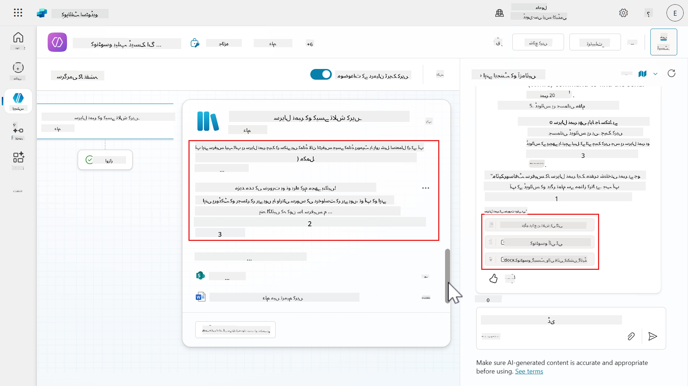

1. اب ہم SharePoint سائٹ علم کے ذریعہ اور دستاویز علم کے ذریعہ کو ایک ہی پیغام میں جانچتے ہیں۔ درج ذیل سوال درج کریں۔

      ```text
      How can I access our company Contoso VPN? How do guests connect to the Contoso Guest wifi?
      ```

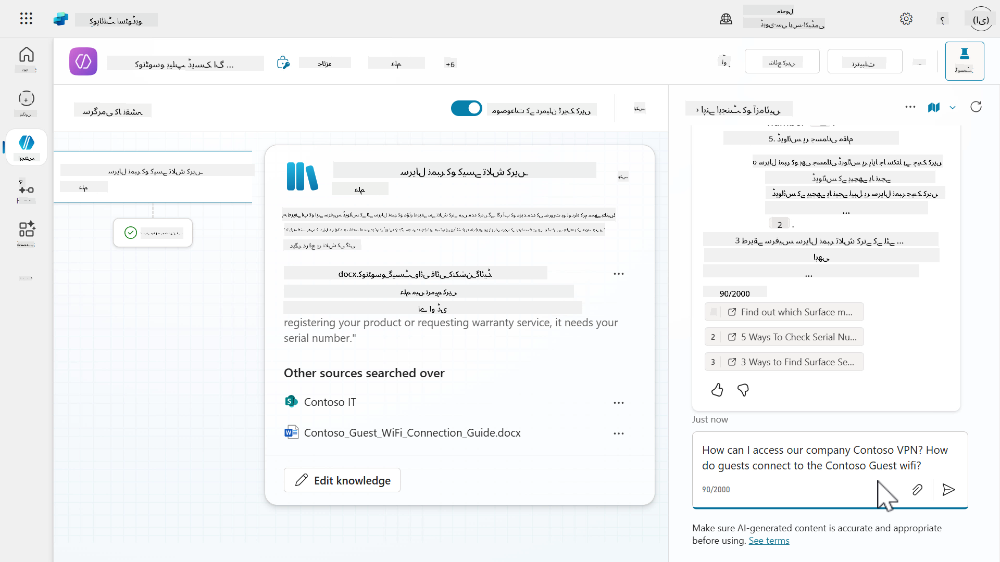

1. ایک بار پھر آپ دیکھیں گے کہ ایجنٹ تین علم کے ذرائع کا جائزہ لے رہا ہے تاکہ ہمارے ایک ہی پیغام کے سوالات کے جواب تیار کرے۔ ایجنٹ دونوں سوالات کا جواب ایک ہی پیغام میں دیتا ہے اور الگ الگ SharePoint صفحہ اور دستاویز کا حوالہ دیتا ہے جہاں سے اس نے جواب تیار کیا۔

    سرگرمی نقشے میں علم کے ماڈل میں، آپ دیکھیں گے کہ SharePoint سائٹ اور دستاویز کو حوالہ کے ذرائع کے طور پر استعمال کیا گیا۔ آپ کو مکمل طور پر نظر آئے گا کہ کون سے علم کے ذرائع دونوں سوالات کے جواب دینے کے لیے استعمال کیے گئے۔

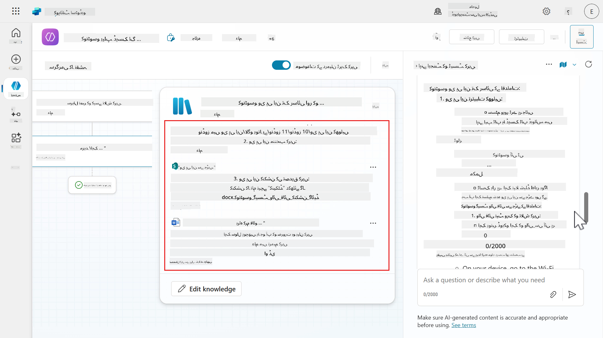

1. ہمیشہ یہ اچھا ہوتا ہے کہ تیار کردہ جواب کی درستگی کی تصدیق کریں۔ SharePoint سائٹ کے حوالہ کو منتخب کریں اور FAQs SharePoint صفحہ لوڈ ہوگا جہاں آپ VPN ہدایات کا جائزہ لینے کے لیے نیچے اسکرول کر سکتے ہیں۔

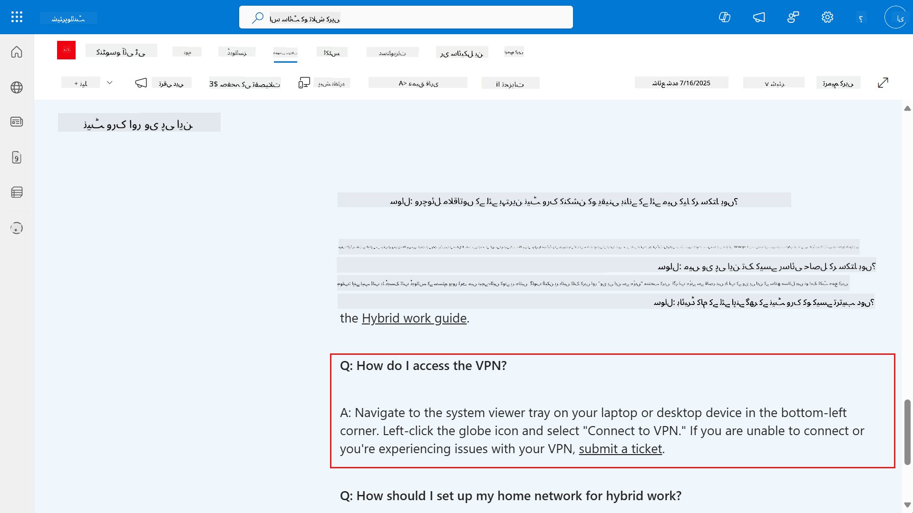

1. اگلا، دستاویز کے حوالہ کو منتخب کریں اور ایک ماڈل ظاہر ہوگا جس میں دستاویز سے وہ متن ہوگا جو جواب کی عکاسی کرتا ہے۔

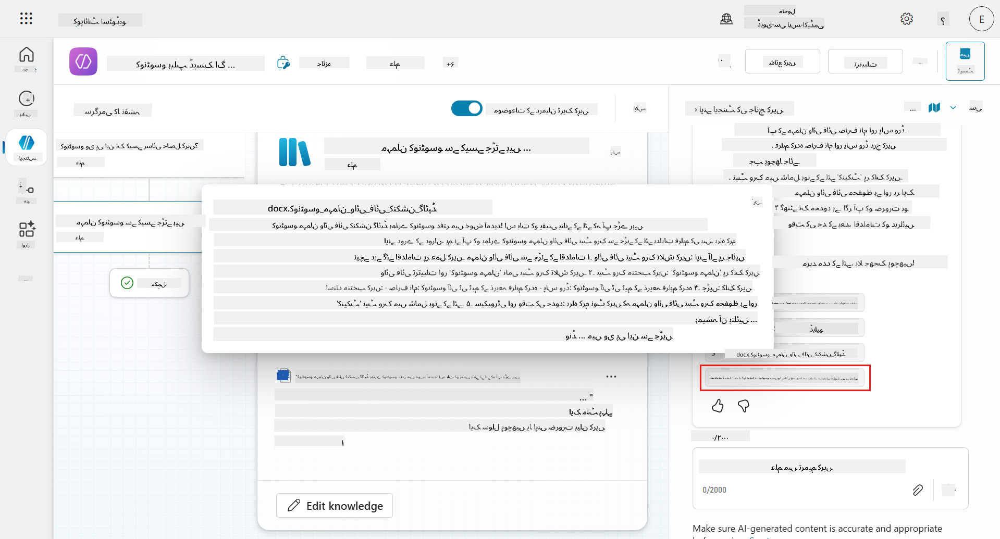

ایجنٹ ایک ہی پیغام میں متعدد سوالات کا جواب دے سکتا ہے، علم کے ذرائع کو تلاش کر سکتا ہے اور اپنے جواب میں علم کے ذرائع کا حوالہ دے سکتا ہے۔ ہمیشہ جواب کی درستگی کی تصدیق کریں اور حوالہ جات کا جائزہ لیں۔

## ✅ مشن مکمل

مبارک ہو! 👏🏻 آپ نے سیکھ لیا کہ قدرتی زبان کا استعمال کرتے ہوئے اپنا خود کا کسٹم ایجنٹ کیسے بنائیں جو آپ کے ڈیٹا پر بات چیت کر سکے تین مختلف علم کے ذرائع سے 🙌🏻

یہ **لیب 06 - Copilot کے ساتھ ایجنٹ بنائیں** کا اختتام ہے، نیچے دیے گئے لنک کو منتخب کریں تاکہ اگلے سبق میں جائیں۔ اس لیب میں بنایا گیا آپ کا کسٹم ایجنٹ اگلے سبق کے لیب میں استعمال ہوگا۔

⏭️ [**نیا موضوع شامل کریں اور ٹرگر کے ساتھ سبق** پر جائیں](../07-add-new-topic-with-trigger/README.md)

خوش آمدید ایلیٹ میں۔ آپ اب جانتے ہیں کہ ڈیجیٹل ایجنٹس کیسے بنائیں جو آپ کی زبان بولتے ہیں، آپ کے ڈیٹا کا حوالہ دیتے ہیں، اور آپ کی ٹیم کی مدد کرتے ہیں۔ آگے بڑھیں—آپ کا مشن ابھی شروع ہوا ہے۔

## 📚 حکمت عملی وسائل

🔗 [Quickstart: ایجنٹ بنائیں اور تعینات کریں](https://learn.microsoft.com/microsoft-copilot-studio/fundamentals-get-started?context=%2Fmicrosoft-365-copilot%2Fextensibility%2Fcontext/?WT.mc_id=power-172617-ebenitez)

🔗 [ایجنٹس بنائیں اور حذف کریں](https://learn.microsoft.com/microsoft-copilot-studio/authoring-first-bot?WT.mc_id=power-172617-ebenitez)

🔗 [اہم تصورات - ایجنٹس کی تخلیق](https://learn.microsoft.com/microsoft-copilot-studio/authoring-fundamentals/?WT.mc_id=power-172617-ebenitez)

📺 [قدرتی زبان کا استعمال کرتے ہوئے کسٹم ایجنٹ بنائیں](https://aka.ms/ai-in-action/copilot-studio/ep1)

📺 [اپنے ایجنٹس میں علم شامل کریں](https://aka.ms/ai-in-action/copilot-studio/ep2)


---

**ڈسکلیمر**:  
یہ دستاویز AI ترجمہ سروس [Co-op Translator](https://github.com/Azure/co-op-translator) کا استعمال کرتے ہوئے ترجمہ کی گئی ہے۔ ہم درستگی کے لیے کوشش کرتے ہیں، لیکن براہ کرم آگاہ رہیں کہ خودکار ترجمے میں غلطیاں یا غیر درستیاں ہو سکتی ہیں۔ اصل دستاویز کو اس کی اصل زبان میں مستند ذریعہ سمجھا جانا چاہیے۔ اہم معلومات کے لیے، پیشہ ور انسانی ترجمہ کی سفارش کی جاتی ہے۔ ہم اس ترجمے کے استعمال سے پیدا ہونے والی کسی بھی غلط فہمی یا غلط تشریح کے ذمہ دار نہیں ہیں۔