<!--
CO_OP_TRANSLATOR_METADATA:
{
  "original_hash": "c04b3587170139bc23e3b5cfc24c89ac",
  "translation_date": "2025-10-22T19:53:58+00:00",
  "source_file": "docs/recruit/07-add-new-topic-with-trigger/README.md",
  "language_code": "ur"
}
-->
# 🚨 مشن 07: نیا موضوع شامل کریں، ٹرگر اور نوڈز کے ساتھ

## 🕵️‍♂️ کوڈ نام: `آپریشن اسٹے آن ٹاپک`

> **⏱️ آپریشن کا وقت:** `~60 منٹ`

🎥 **ویڈیو دیکھیں**

[](https://www.youtube.com/watch?v=7iPAZaA8nJs "یوٹیوب پر ویڈیو دیکھیں")

## 🎯 مشن کا خلاصہ

آپ نے ایک ایجنٹ بنایا ہے۔ یہ سنتا ہے، سیکھتا ہے، اور سوالات کے جواب دیتا ہے - لیکن اب وقت آگیا ہے کہ آپ زیادہ حکمت عملی سے کام کریں۔ اس مشن میں، آپ ایجنٹ کو خاص سوالات کے جواب دینے کے لیے درستگی کے ساتھ تربیت دیں گے۔

موضوعات اور ٹرگرز کے ساتھ، آپ کا ایجنٹ کر سکتا ہے:

- ارادے کو پہچاننا

- منطق کے ساتھ گفتگو کو ترتیب دینا

- متغیرات جمع کرنا اور محفوظ کرنا

- فلو کو ٹرگر کرنا اور عمل کرنا

آپ صرف مکالمہ نہیں بنا رہے، بلکہ اس کے فیصلہ سازی کے مرکز کو ترتیب دے رہے ہیں۔ نیورل نیکسس میں خوش آمدید۔

## 🔎 مقاصد

اس مشن میں، آپ سیکھیں گے:

1. موضوعات کیا ہیں اور ایجنٹ کے لیے منظم گفتگو بنانے میں ان کا کردار
1. موضوعات کی ساخت، بشمول ٹرگر فریسز اور گفتگو کے نوڈز
1. مختلف قسم کے گفتگو کے نوڈز اور پاور Fx کا استعمال کرتے ہوئے متحرک منطق
1. مخصوص صارف کی درخواستوں اور کاموں کو سنبھالنے کے لیے کسٹم موضوعات بنانا
1. ایک فعال موضوع بنانا جو SharePoint ڈیٹا سے کنیکٹ کرتا ہے، کنیکٹرز اور ٹولز کے ذریعے

## 🤔 موضوع کیا ہے؟

موضوع ایک منظم گفتگو ہے جو آپ کے ایجنٹ کو مخصوص صارف سوالات یا کاموں کا جواب دینے میں مدد دیتی ہے۔ موضوع کو ایک چھوٹے مکالمے یا کام کے طور پر سوچیں جو آپ کا ایجنٹ سنبھال سکتا ہے۔ ہر موضوع خاص طور پر ایک مخصوص صارف سوال یا درخواست کا جواب دینے کے لیے ڈیزائن کیا گیا ہے۔

### 🌌 موضوع کا مقصد

موضوعات کے تین عام مقاصد ہیں جو صارفین کی ضروریات پر مبنی ہیں:

**معلوماتی** - سوالات کے جواب دیتا ہے جیسے:

- `کیا ہے …؟`
- `کب ہوگا …؟`
- `کیوں …؟`
- `کیا آپ مجھے بتا سکتے ہیں …؟`

**کام کی تکمیل** - صارفین کو کچھ کرنے میں مدد کرتا ہے:

- `"میں کرنا چاہتا ہوں …"`
- `"میں کیسے کروں …؟"`
- `"مجھے ضرورت ہے …؟"`

**مسائل کا حل** - مسائل حل کرتا ہے:

- `کچھ کام نہیں کر رہا ہے …`
- `مجھے ایک ایرر میسج مل رہا ہے …`
- `میں کچھ غیر متوقع دیکھ رہا ہوں …؟`

آپ مبہم سوالات جیسے `مجھے مدد کی ضرورت ہے` کے لیے بھی موضوعات بنا سکتے ہیں، جو صارفین سے مزید تفصیلات طلب کرتے ہیں۔

## 🐦 موضوعات کیوں مفید ہیں؟

موضوعات آپ کی مدد کرتے ہیں:

- آپ کے ایجنٹ کے علم کو منظم کرنے میں۔

- گفتگو کو قدرتی محسوس کرنے میں۔

- صارفین کے مسائل کو مؤثر طریقے سے حل کرنے میں۔

## 🪺 موضوعات کی اقسام

1. **سسٹم موضوعات** - یہ بلٹ ان ہیں اور عام واقعات کو سنبھالتے ہیں جیسے:
    - گفتگو شروع کرنا
    - گفتگو ختم کرنا
    - ایررز کو سنبھالنا
    - صارفین سے سائن ان کرنے کو کہنا
    - انسانی ایجنٹ کو منتقل کرنا

1. **کسٹم موضوعات** - آپ انہیں مخصوص کاموں یا سوالات کو سنبھالنے کے لیے بناتے ہیں جیسے:
    - ملازم کی چھٹی کی درخواست
    - نیا یا متبادل ڈیوائس کی درخواست

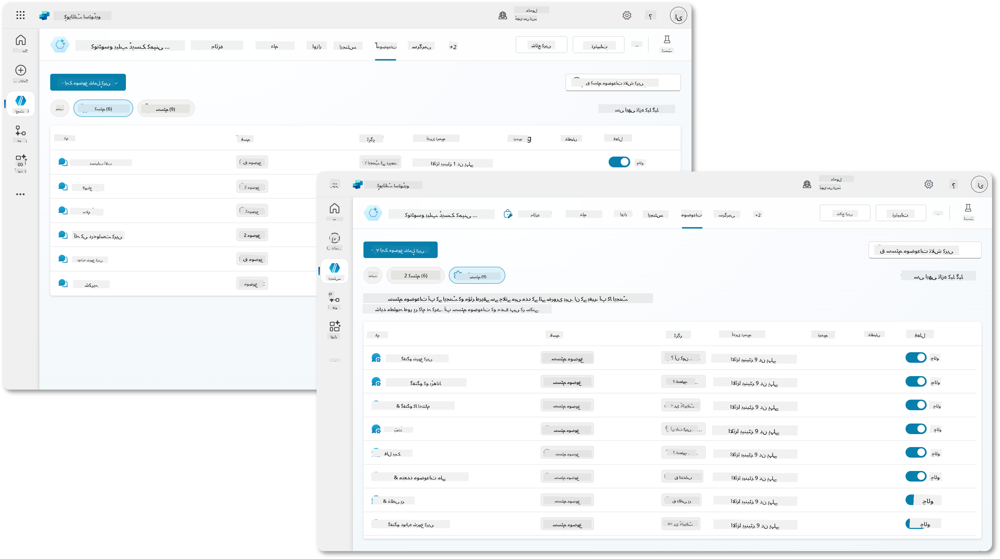

## 🧬 موضوع کی ساخت

ہر موضوع عام طور پر درج ذیل پر مشتمل ہوتا ہے۔

### 🗣️ ٹرگر فریسز

یہ وہ الفاظ یا جملے ہیں جو صارفین موضوع شروع کرنے کے لیے کہہ سکتے ہیں۔

**مثالیں:**

چھٹی کی درخواست کے موضوع کے لیے، ٹرگر فریسز ہو سکتی ہیں:

- `میں چھٹی لینا چاہتا ہوں`
- `چھٹی کی درخواست`
- `وقت کی چھٹی کے لیے درخواست دیں`
- `میں چھٹی کی درخواست کیسے جمع کراؤں؟`

ڈیوائس کی درخواست کے موضوع کے لیے، ٹرگر فریسز ہو سکتی ہیں:

- `مجھے ایک نیا ڈیوائس چاہیے`
- `کیا میں ڈیوائس کی درخواست کر سکتا ہوں؟`
- `کیا آپ مجھے ڈیوائس کی درخواست میں مدد کر سکتے ہیں؟`

### 💬 گفتگو کے نوڈز

ایک موضوع نوڈز پر مشتمل ہوتا ہے جو وہ اقدامات ہیں جو ایجنٹ موضوع کے ٹرگر ہونے کے بعد انجام دیتا ہے۔ آپ ان اقدامات کو جوڑ کر ایک گفتگو کا فلو بناتے ہیں جو آپ کا ایجنٹ صارفین کے ساتھ بات چیت کرتے وقت فالو کرتا ہے۔

انہیں ہدایات یا اعمال کے طور پر سوچیں جیسے:

- صارف سے سوالات پوچھنا
- پیغامات بھیجنا
- بیرونی سروس کو کال کرنا جیسے چھٹی مینجمنٹ سسٹم
- متغیرات سیٹ کرنا یا چیک کرنا
- گفتگو کو شاخوں میں تقسیم کرنے کے لیے شرائط کا استعمال
- دوسرے موضوع کی طرف رہنمائی کرنا

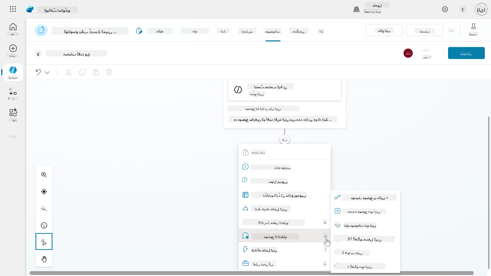

ایجنٹ میں شامل کرنے کے لیے نوڈز کی اہم اقسام درج ذیل ہیں:

#### پیغام بھیجیں

- **مقصد** - صارف کو پیغام بھیجتا ہے۔
- **مثال** - `آپ کی درخواست کا شکریہ! میں اس میں آپ کی مدد کروں گا۔`

یہ نوڈ آپ کے ایجنٹ کو صارفین کو پیغامات بھیجنے دیتا ہے، جو سادہ متن یا امیر مواد جیسے تصاویر، ویڈیوز، کارڈز، فوری جوابات اور ایڈاپٹیو کارڈز ہو سکتے ہیں۔

آپ پیغامات کو متغیرات کے ذریعے ذاتی بنا سکتے ہیں، مختلف پیغام کی اقسام شامل کر سکتے ہیں، اور حتیٰ کہ وائس چینلز کے لیے تقریر کے آؤٹ پٹ کو بھی حسب ضرورت بنا سکتے ہیں۔

!!! tip
    اسے "کچھ کہو" بلاک کے طور پر سوچیں جو آپ کے ایجنٹ کو صارفین کے ساتھ واضح اور انٹرایکٹو طور پر بات چیت کرنے میں مدد کرتا ہے۔

#### سوال پوچھیں

- **مقصد** - صارف سے سوال پوچھتا ہے اور ان کے جواب کا انتظار کرتا ہے۔
- **مثال** - `آپ کی چھٹی کی تاریخیں کیا ہیں؟`

یہ نوڈ گفتگو کے دوران صارفین سے مخصوص معلومات طلب کرنے اور ان کے جوابات کو بعد میں استعمال کے لیے متغیرات میں محفوظ کرنے کے لیے استعمال ہوتا ہے۔

آپ سوال کی قسم کو حسب ضرورت بنا سکتے ہیں جیسے متن ان پٹ یا صارف کے منتخب کرنے کے لیے اقدار کی ایک مقررہ فہرست استعمال کریں، اور یہ بھی طے کر سکتے ہیں کہ اگر صارف غلط جواب دے یا سوال کو چھوڑ دے تو ایجنٹ کو کیسے برتاؤ کرنا چاہیے۔

یہ امیر مواد جیسے تصاویر اور فوری جوابات کی حمایت کرتا ہے، اور گفتگو کو ہموار کرنے کے لیے توثیق، دوبارہ پوچھنے، اور مداخلت کی ترتیبات کو بہتر بنانے دیتا ہے۔

!!! tip
    اسے "پوچھو اور سنو" بلاک کے طور پر سوچیں جو آپ کے ایجنٹ کو صارفین کے ساتھ ایک منظم طریقے سے بات چیت کرنے میں مدد کرتا ہے۔

#### ایڈاپٹیو کارڈ کے ساتھ پوچھیں

- **مقصد** - JSON کا استعمال کرتے ہوئے ایک امیر، انٹرایکٹو کارڈ بھیجیں۔
- **مثال** - ایک کارڈ جو صارف کو تاریخ منتخب کرنے کے لیے کیلنڈر ڈیٹ پککر دکھاتا ہے۔

یہ نوڈ امیر، انٹرایکٹو کارڈز دکھاتا ہے جنہیں صارفین بھر سکتے ہیں اور جمع کر سکتے ہیں جیسے فارم جن میں ٹیکسٹ باکسز، بٹن، اور تصاویر شامل ہوں۔ یہ صارف کے ان پٹ کو پکڑتا ہے اور اسے متغیرات میں محفوظ کرتا ہے، جنہیں آپ کا ایجنٹ گفتگو میں بعد میں استعمال کر سکتا ہے۔

!!! tip
    اسے حسب ضرورت "فارم بلڈر" بلاک کے طور پر سوچیں جو آپ کے ایجنٹ کو صارفین سے تفصیلی معلومات جمع کرنے میں زیادہ دلچسپ اور قابل بناتا ہے۔

#### شرط شامل کریں

- **مقصد** - گفتگو میں منطق شامل کریں۔ یہ کچھ چیک کرتا ہے اور فیصلہ کرتا ہے کہ آگے کیا کرنا ہے۔
- **مثال** - اگر صارف کہے `ہاں`، اگلے قدم پر جائیں۔ اگر `نہیں`، گفتگو ختم کریں۔

یہ نوڈ آپ کے ایجنٹ کے گفتگو کے فلو میں فیصلہ کے پوائنٹس بناتا ہے، یہ چیک کر کے کہ آیا کوئی متغیر مخصوص معیار پر پورا اترتا ہے۔ اس بنیاد پر کہ شرط درست ہے یا غلط، ایجنٹ مختلف راستے اختیار کرتا ہے۔

!!! tip
    اسے "اگر-تو" بلاک کے طور پر سوچیں جو آپ کے ایجنٹ کو صارف کے انپٹ یا محفوظ ڈیٹا پر منحصر فیصلے کرنے میں مدد کرتا ہے۔

#### متغیرات کا انتظام

- **مقصد** - گفتگو کے دوران معلومات (جسے متغیرات کہا جاتا ہے) کو محفوظ یا صاف کرتا ہے۔
- **مثال** - ایڈاپٹیو کارڈ دکھانے والے سوال پوچھیں نوڈ میں صارف کے منتخب کردہ تاریخ کو محفوظ کرتا ہے۔

یہ نوڈ گفتگو کے دوران معلومات کو محفوظ اور منظم کرنے دیتا ہے، یہ صارف کا نام، جواب، یا ترجیحات ہو سکتی ہیں۔ آپ مختلف قسم کے متغیرات استعمال کر سکتے ہیں جیسے متن، نمبر، یا تاریخیں، اور انہیں ایک ہی موضوع تک محدود کر سکتے ہیں، موضوعات کے درمیان شیئر کر سکتے ہیں (گلوبل)، یا حتیٰ کہ سسٹم یا ماحول سے نکال سکتے ہیں۔

!!! tip
    اسے "یادداشت کا باکس" سمجھیں جو آپ کے ایجنٹ کو معلومات یاد رکھنے اور گفتگو کے دوران صارف کے ساتھ جاری رکھنے میں مدد کرتا ہے۔

#### موضوع کا انتظام

- **مقصد** - گفتگو کو دوسرے موضوع یا موضوع کے اندر کسی قدم پر منتقل کرتا ہے، گفتگو منتقل کرتا ہے، یا موضوع یا گفتگو ختم کرتا ہے۔
- **مثال** - "چھٹی کی پالیسی" موضوع پر ری ڈائریکٹ کریں۔

یہ نوڈ آپ کے ایجنٹ کو ایک موضوع سے دوسرے موضوع پر بغیر گفتگو کو دوبارہ شروع کیے منتقل کرنے، موضوع ختم کرنے، گفتگو منتقل یا ختم کرنے، یا اسی موضوع کے اندر کسی مختلف قدم پر جانے دیتا ہے۔ یہ صارفین کو گفتگو کے مختلف حصوں کے ذریعے رہنمائی کرنے میں مدد کرتا ہے، اور آپ ان کے درمیان متغیرات منتقل کر سکتے ہیں تاکہ سیاق و سباق برقرار رہے۔

!!! tip
    اسے "دوسرے سیکشن/قدم پر جاؤ" بلاک کے طور پر سوچیں جو آپ کے ایجنٹ کو صارفین کے ساتھ بات چیت میں لچکدار بناتا ہے۔

#### ٹول شامل کریں

- **مقصد** - کنیکٹرز، ایجنٹ فلو، پرامپٹس، کسٹم سرچ، سرچ کوئری، اسکلز، ماڈل کانٹیکسٹ پروٹوکول جیسے ٹولز سے کنیکٹ کرتا ہے۔
- **مثال** - صارف کے چھٹی کی درخواست جمع کرانے کے بعد ایجنٹ فلو کو انجام دیتا ہے۔

یہ نوڈ آپ کے ایجنٹ کو بیرونی سسٹمز کے ساتھ بات چیت کرنے یا مخصوص کام انجام دینے کی صلاحیت دیتا ہے، جیسے ای میل بھیجنا، موسم چیک کرنا، یا ڈیٹا بیس تک رسائی حاصل کرنا۔ آپ بلٹ ان کنیکٹرز، کسٹم APIs، ایجنٹ فلو، پرامپٹس، یا ماڈل کانٹیکسٹ پروٹوکول (MCP) سرورز سے کنیکٹ کرنے کے لیے ٹولز شامل کر سکتے ہیں، اور حتیٰ کہ گرافیکل یوزر انٹرفیس آٹومیشن کے ذریعے ڈیسک ٹاپ ایپس کے لیے کمپیوٹر یوز ٹول استعمال کر سکتے ہیں۔

!!! tip
    ٹولز کو "ایکشن بلاکس" کے طور پر سوچیں جو آپ کے ایجنٹ کو چیٹنگ سے آگے کام کرنے کی صلاحیت دیتے ہیں، جیسے API کال کرنا، پروسیس چلانا، یا خودکار طور پر صارف کا انپٹ جمع کرنا۔

#### جنریٹو جوابات نوڈ

- **مقصد** - بڑے زبان کے ماڈل کا استعمال کرتے ہوئے صارف کے سوال اور کسی بھی کنیکٹڈ ڈیٹا کی بنیاد پر قدرتی، انسانی جیسے جوابات تیار کرتا ہے۔
- **مثال** - کنیکٹڈ نالج سورس کا استعمال جو چھٹی کی درخواستوں کے بارے میں معلومات پر مشتمل ہے تاکہ صارف کے سوالات کے جواب دے سکے۔

یہ نوڈ آپ کے ایجنٹ کو مختلف نالج سورسز جیسے ویب سائٹس، دستاویزات، SharePoint، یا کسٹم ڈیٹا سے معلومات کا استعمال کرتے ہوئے صارف کے سوالات کا جواب دینے کی صلاحیت دیتا ہے۔ یہ اس وقت استعمال کیا جا سکتا ہے جب کوئی موضوع میچ نہ ہو، یا کسی موضوع کے اندر زیادہ تفصیلی، متحرک جوابات فراہم کرنے کے لیے جو آپ کے ایجنٹ کو استعمال کرنے کے لیے ترتیب دیا گیا ہو۔

!!! tip
    اسے "سمارٹ جواب بلاک" کے طور پر سوچیں جو آپ کے ایجنٹ کو مددگار، درست جوابات دینے میں مدد کرتا ہے، جو آپ کے ذریعہ متعین کردہ قابل اعتماد مواد کو تلاش کر کے فراہم کرتا ہے۔

#### HTTP درخواست نوڈ

- **مقصد** - آپ کے ایجنٹ کو بیرونی سسٹمز سے کنیکٹ کرتا ہے، API کالز (جیسے `GET` یا `POST`) بھیج کر ڈیٹا حاصل یا اپ ڈیٹ کرتا ہے۔
- **مثال** - جب صارف اپنے چھٹی کے دنوں کے بیلنس کے بارے میں پوچھتا ہے، تو ایجنٹ چھٹی مینجمنٹ سسٹم کو `GET` درخواست بھیجتا ہے اور API کے جواب سے `remainingLeaveDays` نکالتا ہے اور صارف کو اس قدر کے ساتھ جواب دیتا ہے۔

یہ نوڈ آپ کے ایجنٹ کو REST API کالز بھیج کر بیرونی سسٹمز سے کنیکٹ کرنے دیتا ہے، جیسے `GET` یا `POST` درخواستیں۔ آپ ہیڈرز، باڈی مواد کو حسب ضرورت بنا سکتے ہیں، اور حتیٰ کہ پاور Fx کا استعمال کرتے ہوئے متحرک ڈیٹا شامل کر سکتے ہیں، پھر جواب کو گفتگو میں بعد میں استعمال کے لیے متغیرات میں محفوظ کر سکتے ہیں۔

!!! tip
    اسے "معلومات حاصل کرنے کے لیے پہنچو" بلاک کے طور پر سوچیں جو آپ کے ایجنٹ کو دوسرے سروسز سے بات کرنے میں مدد کرتا ہے جیسے صارف کی تفصیلات حاصل کرنا یا دوسرے سسٹم کو ڈیٹا بھیجنا۔

#### ایونٹ بھیجیں

- **مقصد** - آپ کے ایجنٹ کو غیر پیغام اعمال، جیسے سسٹم اپ ڈیٹس یا ٹول ٹرگرز - کلائنٹ یا چینل کو بھیجنے دیتا ہے، جو اسے کام انجام دینے میں مدد دیتا ہے۔
- **مثال** - صارف کے چیٹ میں شامل ہونے پر خوش آمدید پیغام دکھانا۔

یہ نوڈ آپ کے ایجنٹ کو غیر پیغام اعمال بیرونی سسٹمز یا چینلز کو بھیجنے دیتا ہے، جو پھر فیصلہ کرتے ہیں کہ کیسے جواب دینا ہے۔ آپ ہر ایونٹ کو ایک نام دیتے ہیں اور ایک قدر منسلک کرتے ہیں، جو ایک سادہ نمبر یا متن، ایک متغیر، یا پاور Fx فارمولہ ہو سکتا ہے، اور یہ JSON آبجیکٹ کے طور پر بھیجا جاتا ہے۔

!!! tip
    اسے "خاموش ٹرگر" بلاک کے طور پر سوچیں جو آپ کے ایجنٹ کو پردے کے پیچھے کام کرنے یا صارف کے کچھ کہے بغیر بیرونی ٹولز کے ساتھ بات چیت کرنے میں مدد کرتا ہے۔

## 🏋🏻‍♀️ اپنے نوڈز میں پاور Fx کا استعمال

Copilot Studio میں، پاور Fx ایک لو کوڈ پروگرامنگ زبان ہے جو آپ کے ایجنٹ میں منطق اور متحرک رویہ شامل کرنے کے لیے استعمال ہوتی ہے۔ یہ وہی زبان ہے جو Microsoft Power Apps میں استعمال ہوتی ہے، اور یہ سادہ اور Excel جیسی ہے، جو اسے ڈویلپرز اور نان ڈویلپرز کے لیے آسان بناتی ہے۔

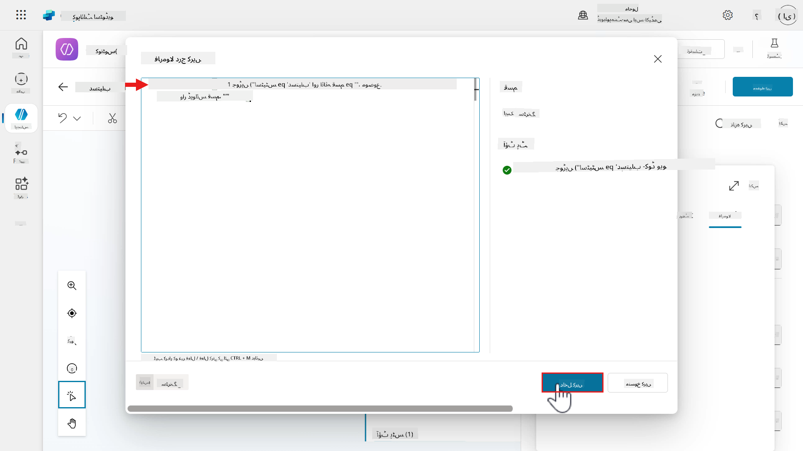

### موضوعات میں پاور Fx کیا کر سکتا ہے؟

- متغیرات سیٹ اور منظم کریں
      - مثال: `Set(userName, "Adele Vance")`
- شرائط بنائیں
      - مثال: `If(score > 80, "Pass", "Fail")`
- ڈیٹا کو فارمیٹ اور تبدیل کریں
      - مثال: `Text(DateValue, "dd/mm/yyyy")`

### پاور Fx کیوں استعمال کریں؟

- **لچکدار:** آپ بغیر مکمل کوڈ لکھے منطق بنا سکتے ہیں۔

- **مانوس:** اگر آپ نے Excel فارمولے استعمال کیے ہیں، تو یہ بہت مشابہ لگتا ہے۔

- **طاقتور:** یہ آپ کو گفتگو کو ذاتی بنانے، انپٹ کی توثیق کرنے، اور صارف کے ڈیٹا کی بنیاد پر ایجنٹ کے رویے کو کنٹرول کرنے دیتا ہے۔

## 🏗️ میں موضوعات کیسے بناؤں اور ایڈٹ کروں؟

آپ کے ایجنٹ کے لیے موضوعات بنانے اور ایڈٹ کرنے کے دو طریقے ہیں۔

### 1. خالی سے بنائیں

یہ آپ کو شروع سے کسٹم گفتگو کے فلو بنانے کی اجازت دیتا ہے، اور آپ ایڈٹ کرتے وقت نوڈز کو شامل یا ہٹا سکتے ہیں۔

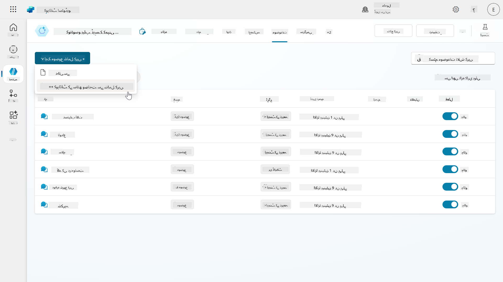

#### یہ کیوں مفید ہے؟

- یہ آپ کو مکمل کنٹرول دیتا ہے کہ آپ کا ایجنٹ کیسے جواب دے۔
- آپ متغیرات، پاور Fx، اور شرائط کا استعمال کرتے ہوئے منطق کو حسب ضرورت بنا سکتے ہیں
یہ آپ کو قدرتی زبان کا استعمال کرتے ہوئے اپنی مطلوبہ بات بیان کرنے کی اجازت دیتا ہے، اور کوپائلٹ آپ کے لیے گفتگو تیار کرے گا۔ یہی اصول آپ کے موضوع میں ترمیم کرتے وقت بھی لاگو ہوتا ہے، قدرتی زبان کا استعمال کریں اور کوپائلٹ آپ کے موضوع کا جائزہ لے کر اسے بہتر بنائے گا۔

#### کوپائلٹ کیا سپورٹ کرتا ہے؟

- تخلیق اور ترمیم کر سکتا ہے:
      - پیغام کے نوڈز
      - سوالات کے نوڈز
      - شرائط کے نوڈز
- پیچیدہ سیٹنگز کو سپورٹ نہیں کرتا جیسے کہ اگر صارف جواب نہ دے تو دوبارہ پوچھنے کا طریقہ یا سوال کے دوران مداخلت کو کیسے سنبھالنا ہے۔ اگر ضرورت ہو تو آپ ان سیٹنگز کو دستی طور پر ایڈجسٹ کر سکتے ہیں۔

#### یہ کیوں مفید ہے؟

- AI کی مدد سے ترقی کی رفتار بڑھاتا ہے۔
- آپ کو منطقی اور صارف کے تجربے پر توجہ مرکوز کرنے دیتا ہے بجائے اس کے کہ بار بار سیٹ اپ پر وقت ضائع کریں۔
- گفتگو کے بہاؤ کو کم سے کم کوشش کے ساتھ بہتر اور تیز کرنے میں آسانی فراہم کرتا ہے۔

#### ✨ مثال کے پرامپٹس

- **ایک موضوع تخلیق کریں**
      - `صارف کا نام، عمر اور تاریخ پیدائش قبول کریں اور پھر ان کے جوابات کو دوبارہ دہرائیں`
      - `صارف کا گلی کا پتہ، ریاست اور زپ کوڈ جمع کریں۔ صارف کو ہر سوال کو 4 بار تک دوبارہ کوشش کرنے کی اجازت ہونی چاہیے`

- **موضوع میں ترمیم کریں**
      - `صارف کی تاریخ پیدائش پوچھنے کے لیے ایک سوال شامل کریں`
      - `جمع کی گئی معلومات کو ایک Adaptive Card میں خلاصہ کریں۔`

## 👩🏻‍🎨 اچھا، اپنے ایجنٹ کے لیے موضوعات کیسے ڈیزائن کریں؟

### 🧙🏻‍♂️ مرحلہ 1 - صارفین کی ضروریات کو سمجھیں

سب سے پہلے عام سوالات یا کاموں کی شناخت کریں جو صارفین آپ کے ایجنٹ سے پوچھیں گے۔ یہ ہو سکتے ہیں:

- سوالات جو صارفین اکثر پوچھتے ہیں جیسے، `میرے بیمار دنوں کے لیے کیا حق ہے؟`
- عام کام جو صارفین مکمل کرنا چاہتے ہیں جیسے کہ فارم جمع کرنا
- مسائل جو صارفین اکثر سامنا کرتے ہیں جیسے کہ لاگ ان کے مسائل

### 📦 مرحلہ 2 - منظرنامے کو گروپ کریں

صارفین کی ضروریات کو تین اقسام میں منظم کریں جو ہم نے پہلے سیکھا - موضوع کا مقصد:

- معلوماتی - صارف کچھ جاننا چاہتا ہے
- کام کی تکمیل - صارف کچھ کرنا چاہتا ہے
- مسئلہ حل کرنا - صارف کو مسئلہ حل کرنے میں مدد کی ضرورت ہے

### 🗺️ مرحلہ 3 - گفتگو کا نقشہ بنائیں

ایک سادہ گفتگو کا بہاؤ تیار کریں کہ ایجنٹ کو کیسے جواب دینا چاہیے

- سلام یا تصدیق سے شروع کریں
- تفصیلات حاصل کرنے کے لیے مزید سوالات پوچھیں
- جوابات فراہم کریں یا کارروائی کریں

!!! tip
    گفتگو کو مختصر اور مرکوز رکھیں۔ صرف ضروری باتیں پوچھیں۔

### 🔀 مرحلہ 4 - مختلف قسم کی گفتگو کو سنبھالیں

دونوں کے لیے ڈیزائن کریں:

- **ایک سوال، ایک جواب** - سنگل ٹرن

- **بیک اینڈ گفتگو** - ملٹی ٹرن، جس میں مزید سوالات شامل ہوں

مثال:

- صارف: `میں چھٹی کی درخواست دینا چاہتا ہوں۔`

- ایجنٹ: `ضرور! آپ اپنی چھٹی کب سے شروع کرنا چاہتے ہیں؟`

- صارف: `15 جولائی`

- ایجنٹ: `سمجھ گیا۔ اور آپ کی چھٹی کب ختم ہوگی؟`

- صارف: `22 جولائی۔`

- ایجنٹ: `شکریہ! آپ کی چھٹی کی وجہ کیا ہے؟`

- صارف: `خاندانی چھٹی۔`

- ایجنٹ: `تفصیلات کے لیے شکریہ۔ میں نے آپ کی چھٹی کی درخواست 15 جولائی سے 22 جولائی تک خاندانی چھٹی کے لیے جمع کر دی ہے۔ آپ کو جلد ہی تصدیق ملے گی۔`

### 🤖 مرحلہ 5 - غیر متوقع سوالات کے لیے AI کا استعمال کریں

چاہے آپ نے چھٹی کی درخواستوں کے لیے ایک موضوع ڈیزائن کیا ہو، صارفین ایسے سوالات پوچھ سکتے ہیں جو براہ راست شامل نہ ہوں۔ یہ وہ جگہ ہے جہاں AI خصوصیات جیسے _Conversational boosting_ سسٹم موضوع مددگار ثابت ہوتا ہے۔

یہ موضوع ایک جنریٹو جوابات نوڈ شامل کرتا ہے، جو آپ کے ایجنٹ کو فوری طور پر منسلک علم کے ذرائع استعمال کرنے دیتا ہے۔ ایجنٹ سطح پر شامل کردہ کوئی بھی علم کے ذرائع خود بخود _Conversational boosting_ سسٹم موضوع میں جنریٹو جوابات نوڈ میں شامل ہو جاتے ہیں۔

#### مثال

- صارف: `کیا میں اپنے غیر استعمال شدہ چھٹی کے دن اگلے سال لے جا سکتا ہوں؟`

یہ سوال آپ کے پہلے سے طے شدہ موضوع کے بہاؤ کا حصہ نہیں ہو سکتا، خاص طور پر اگر آپ کا موضوع صرف چھٹی کی درخواستوں کو سنبھالنے کے لیے ہو۔

#### AI کیسے مدد کرتا ہے؟

اگر آپ کا ایجنٹ آپ کی کمپنی کی HR پالیسی دستاویزات یا داخلی ویب سائٹ سے منسلک ہے، تو AI کر سکتا ہے:

- متعلقہ چھٹی کی پالیسی تلاش کریں
- قواعد کو سمجھیں اور خلاصہ کریں
- ایجنٹ جواب دیتا ہے: `HR پالیسی کے مطابق، آپ اپنے غیر استعمال شدہ چھٹی کے دن اگلے کیلنڈر سال تک لے جا سکتے ہیں۔ مزید تفصیلات کے لیے، HR پورٹل پر چھٹی کی پالیسی سیکشن دیکھیں۔`

#### یہ کیوں مفید ہے؟

- آپ کو ہر پالیسی سے متعلق سوال کے لیے دستی طور پر موضوع بنانے کی ضرورت نہیں ہے۔
- AI قابل اعتماد علم کے ذرائع سے درست جوابات نکال سکتا ہے۔
- یہ صارف کے تجربے کو بہتر بناتا ہے، ایجنٹ کو زیادہ ہوشیار اور جوابدہ محسوس کراتا ہے۔

### 🔬 مرحلہ 6 - موضوع، گفتگو کا بہاؤ آزمائیں

موضوع کو شائع کرنے سے پہلے:

- حقیقی سوالات یا حقیقی نمونہ ان پٹ کا استعمال کرتے ہوئے آزمائیں۔
- یقینی بنائیں کہ یہ قدرتی اور مددگار لگتا ہے۔

!!! tip
    اپنے موضوع میں بہتری لائیں جیسے کہ مزید نوڈز شامل کرنا یا نوڈز کو ہٹانا اور دوسرے موضوع کی طرف ری ڈائریکٹ کرنا۔

### ⚠️ مرحلہ 7 - ویب سائٹ کے مواد کو نقل کرنے سے بچیں

جو پہلے سے آپ کی ویب سائٹ پر موجود ہے اسے نقل نہ کریں۔

- ان موضوعات پر توجہ مرکوز کریں جن کے بارے میں صارفین اکثر پوچھتے ہیں۔
- چیٹ کی تاریخ یا سپورٹ درخواستوں کی بنیاد پر نئے موضوعات شامل کریں۔

### ✨ گفتگو کے بہاؤ کی مثال

نیچے ایک موضوع کی مثال دی گئی ہے جو چھٹی کی درخواستوں کو سنبھالتا ہے۔

#### مرحلہ 1: ٹرگر فریس

صارف لکھتا ہے،

`میں چھٹی کی درخواست دینا چاہتا ہوں`

#### مرحلہ 2: ایجنٹ Adaptive Card کے ذریعے تفصیلات پوچھتا ہے

ایجنٹ پوچھتا ہے،

`ضرور! آپ کون سی تاریخوں کو چھٹی لینا چاہتے ہیں؟`

Adaptive Card میں شروع کی تاریخ اور ختم ہونے کی تاریخ کے لیے کیلنڈر پککر کنٹرول ہوتا ہے۔

#### مرحلہ 3: صارف تاریخیں فراہم کرتا ہے

صارف شروع کی تاریخ 5 اگست 2025 اور ختم ہونے کی تاریخ 10 اگست 2025 منتخب کرتا ہے، اور کارڈ جمع کراتا ہے۔ تاریخ کی قدریں Adaptive Card کے آؤٹ پٹ میں متغیرات کے طور پر محفوظ ہو جاتی ہیں۔

#### مرحلہ 4: کلاؤڈ فلو کا نفاذ

ایک Power Automate کلاؤڈ فلو نافذ کیا گیا ہے جو چھٹی کے انتظامی نظام میں ایک نئی درخواست بناتا ہے اور مینیجر کو چھٹی کی درخواست کے بارے میں ای میل بھیجتا ہے۔

#### مرحلہ 5: صارف کو تصدیقی پیغام بھیجیں

ایجنٹ جواب دیتا ہے،

`آپ کی چھٹی کی درخواست 5 اگست سے 10 اگست تک جمع کر دی گئی ہے۔ آپ کا مینیجر جائزہ لے گا اور جلد ہی آپ کو جواب دے گا۔`

## 🧪 لیب 07 - گفتگو کے نوڈز کے ساتھ نیا موضوع شامل کریں

اب ہم سیکھیں گے کہ ٹرگر اور ٹولز کے ساتھ نیا موضوع کیسے شامل کریں۔ یہ لیب خالی سے موضوع تخلیق کرنے کا احاطہ کرے گا تاکہ آپ اپنی ضروریات کے مطابق موضوعات کو کسٹمائز کرنا سمجھ سکیں۔

- [7.1 خالی سے نیا موضوع شامل کریں](../../../../../docs/recruit/07-add-new-topic-with-trigger)
- [7.2 ٹرگر ان پٹ اور آؤٹ پٹ کی وضاحت کریں](../../../../../docs/recruit/07-add-new-topic-with-trigger)
- [7.3 کنیکٹر کا استعمال کرتے ہوئے ایک ٹول شامل کریں](../../../../../docs/recruit/07-add-new-topic-with-trigger)

### ✨ استعمال کا کیس

**بطور** ملازم

**میں چاہتا ہوں** جاننا کہ کون سے آلات دستیاب ہیں

**تاکہ** میرے پاس دستیاب آلات کی فہرست ہو

چلیں شروع کریں!

### ضروریات

1. **SharePoint فہرست**

    ہم **Devices** SharePoint فہرست استعمال کریں گے [Lesson 00 - کورس سیٹ اپ - مرحلہ 3: نیا SharePoint سائٹ بنائیں](../00-course-setup/README.md#step-4-create-new-sharepoint-site) سے۔

    اگر آپ نے **Devices** SharePoint فہرست سیٹ اپ نہیں کی ہے، تو براہ کرم واپس جائیں [Lesson 00 - کورس سیٹ اپ - مرحلہ 3: نیا SharePoint سائٹ بنائیں](../00-course-setup/README.md#step-4-create-new-sharepoint-site)۔

1. **Contoso Helpdesk Agent**

    ہم وہی ایجنٹ استعمال کریں گے جو پہلے بنایا گیا تھا [Lesson 06 - کوپائلٹ کے ساتھ قدرتی زبان کا استعمال کرتے ہوئے کسٹم ایجنٹ بنائیں اور اپنے ڈیٹا کے ساتھ گراؤنڈ کریں](../06-create-agent-from-conversation/README.md) میں۔

### 7.1 خالی سے نیا موضوع شامل کریں

1. ایجنٹ کے نام کے قریب **Topics tab** منتخب کریں۔ اگر یہ نظر نہیں آ رہا ہے، تو **+6** منتخب کریں اور آپ کو **Topics** نظر آئے گا۔

    

1. **Topics** tab لوڈ ہو جائے گا اور ڈیفالٹ کے طور پر _Custom_ موضوعات دکھائے جائیں گے۔ آپ موضوعات کو All، Custom اور System کے ذریعے فلٹر کر سکتے ہیں۔ وہ کسٹم اور سسٹم موضوعات جو آپ فی الحال دیکھ رہے ہیں وہ ایجنٹ کے پروویژن ہونے پر خود بخود تخلیق کیے گئے تھے۔

    **+ Add a topic** منتخب کریں اور **From blank** منتخب کریں۔

    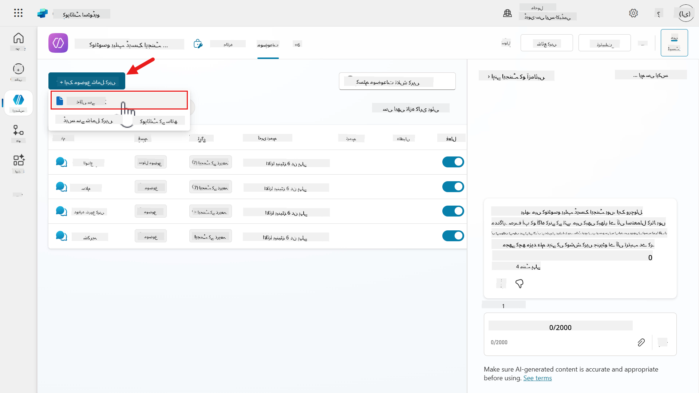

1. موضوع کے لیے ایک نام درج کریں۔ درج ذیل کو کاپی اور پیسٹ کریں۔

    ```text
    Available devices
    ```

    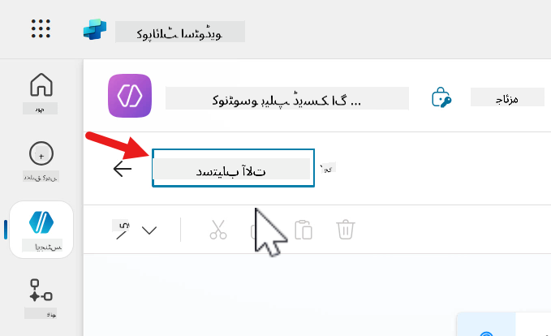

1. ٹرگر کی وضاحت درج کریں جو موضوع کیا کرتا ہے۔ درج ذیل کو کاپی اور پیسٹ کریں۔

    ```text
    This topic helps users find devices that are available from our SharePoint Devices list. User can ask to see available devices and it will return a list of devices that are available which can include laptops, smartphones, accessories and more.
    ```

    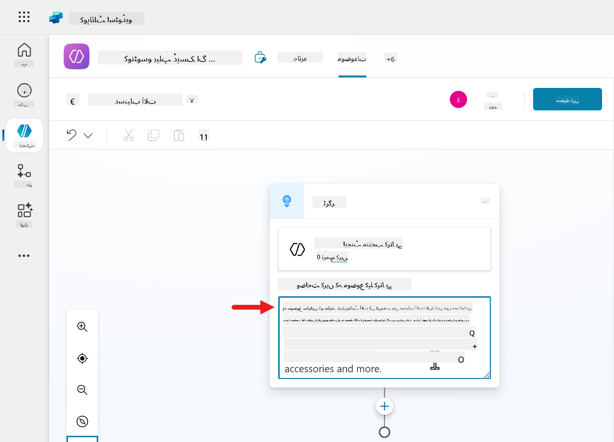

### 7.2 ٹرگر ان پٹ اور آؤٹ پٹ کی وضاحت کریں

1. اگلے مرحلے میں، ہم ایک نیا ان پٹ متغیر شامل کریں گے جو جنریٹو AI اپنے آرکیسٹریشن میں صارف کے پیغام سے ڈیوائس کی قسم کی قدر نکالنے کے لیے استعمال کرے گا۔ موضوع میں **More ellipsis (...)** منتخب کریں اور **Details** منتخب کریں تاکہ موضوع کی تفصیلات کا پین دیکھ سکیں۔

    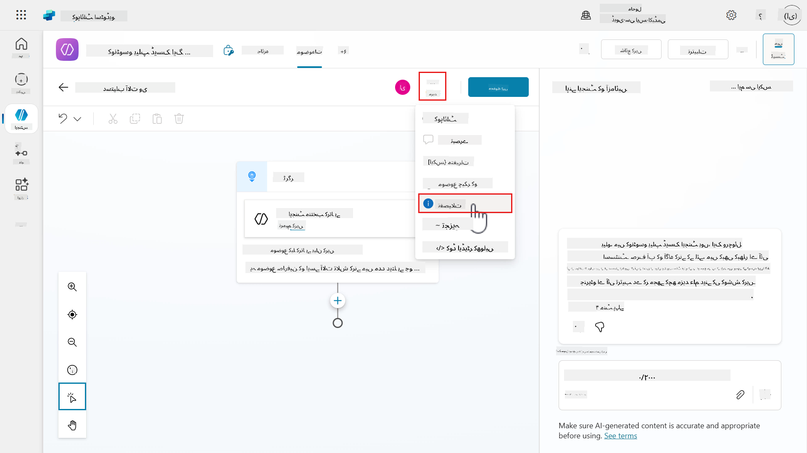

1. **Topic details** پین لوڈ ہو گیا ہے۔ **Input** tab منتخب کریں۔

    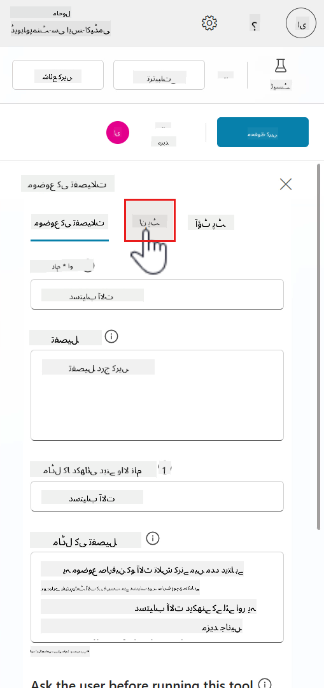

1. **Create a new variable** منتخب کریں۔

    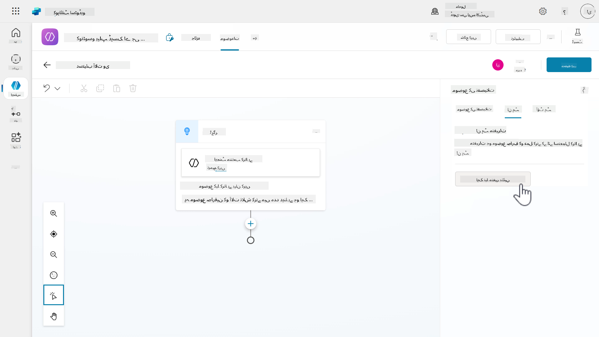

1. متغیر کے لیے ایک نام درج کریں۔ درج ذیل کو کاپی اور پیسٹ کریں۔

    ```text
    VarDeviceType
    ```

    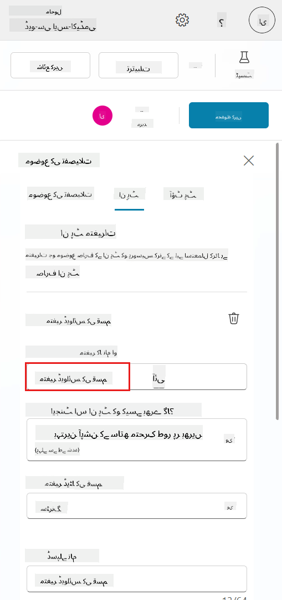

1. اب ہمیں اپنے ان پٹ اور آؤٹ پٹ متغیرات کی وضاحت کرنے کی ضرورت ہے۔ موضوع کے ان پٹ اور آؤٹ پٹ کے لیے درج ذیل خصوصیات کو بیان کیا جا سکتا ہے۔

    | فیلڈ    | قدر |
    | ---------- | :--------- |
    | ایجنٹ اس ان پٹ کو کیسے بھرے گا؟ | یہ طے کرتا ہے کہ ایجنٹ اس متغیر کو قدر کے ساتھ موضوع چلانے سے پہلے کیسے بھرے گا۔ ڈیفالٹ کے طور پر یہ _Dynamically fill with the best option_ پر سیٹ ہے۔ ورنہ آپ صارف سے پوچھے بغیر ان پٹ کو قدر کے ساتھ اووررائیڈ کر سکتے ہیں|
    | متغیر ڈیٹا کی قسم  | متغیر کی ڈیٹا کی قسم۔ سپورٹ شدہ ڈیٹا کی اقسام ہیں `String`, `Boolean`, `Number`, `Date`, `DateTime`, `DateTimeNoTimeZone`, `Time`, `Record`, `Table`, `Unspecified`, `From sample data` |
    | ڈسپلے نام   | متغیر کا نام   |
    | شناخت کریں  | ایجنٹ کے لیے صحیح قدر کی قسم کو پکڑنے کے لیے ادارہ کی قسم  |
    | وضاحت    | وضاحت ایجنٹ کو ان پٹ کو موضوع چلانے سے پہلے خود بخود بھرنے یا قدر کے لیے سوالات پیدا کرنے میں مدد دیتی ہے   |

    _ایجنٹ اس ان پٹ کو کیسے بھرے گا؟_, _متغیر ڈیٹا کی قسم_ اور _ڈسپلے نام_ کو جوں کا توں رہنے دیں۔ **Identify as** پراپرٹی کو **User's entire response** پر اپ ڈیٹ کریں۔

    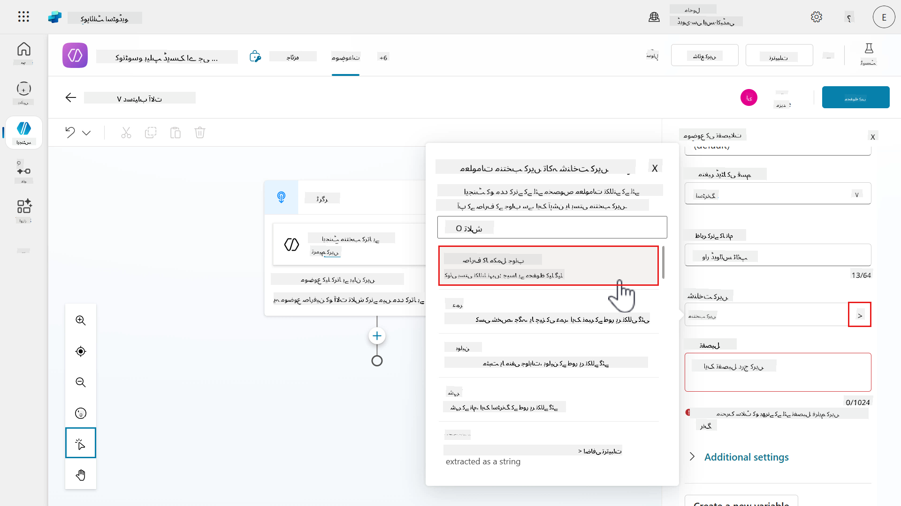

1. درج ذیل کو وضاحت کے طور پر کاپی اور پیسٹ کریں۔

    ```text
    List of possible values: Laptop, Desktop, Smartphone
    ```

    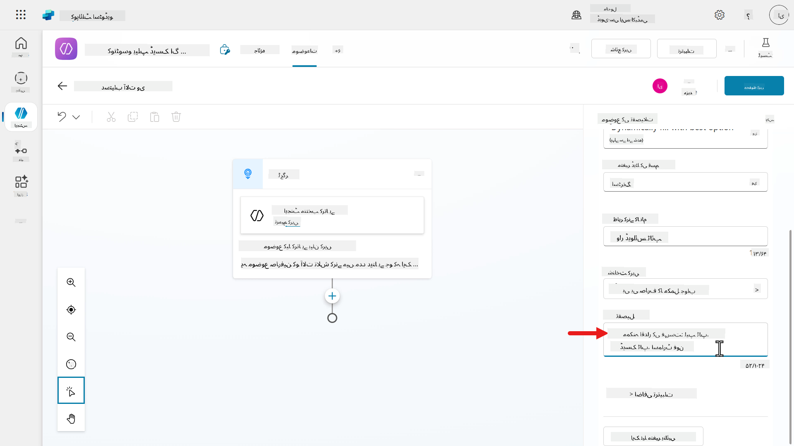

1. اگلے مرحلے میں، آئیے موضوع کے لیے آؤٹ پٹ کی وضاحت کریں۔ **Output** tab منتخب کریں۔

    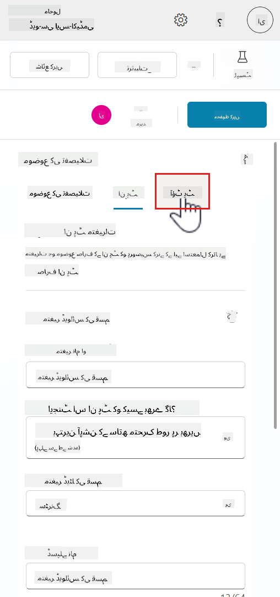

1. **Create a new variable** منتخب کریں۔

    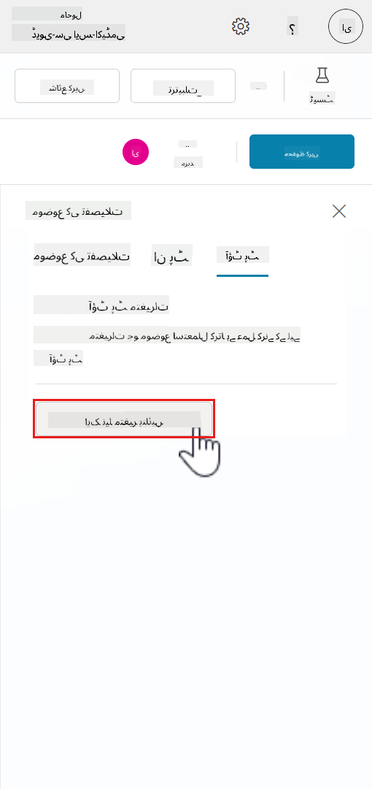

1. درج ذیل پراپرٹیز کو اپ ڈیٹ کریں۔

    **Variable name** - درج ذیل کو کاپی اور پیسٹ کریں۔

    ```text
    VarAvailableDevices
    ```

    **Variable data type** - ڈیٹا کی قسم کے طور پر **Table** منتخب کریں۔

    **Variable description** - درج ذیل کو کاپی اور پیسٹ کریں۔

    ```text
    List of available devices by device type
    ```

    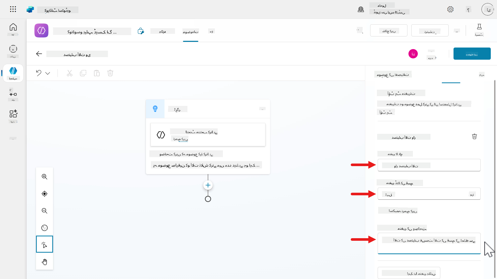

1. ہم نے اب موضوع کے ان پٹ اور آؤٹ پٹ کی وضاحت مکمل کر لی ہے۔ **Topic details** پین سے باہر نکلنے کے لیے **X icon** منتخب کریں۔

    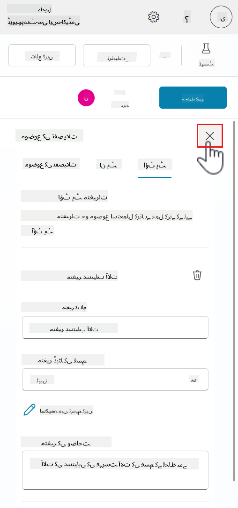

### 7.3 کنیکٹر کا استعمال کرتے ہوئے ایک ٹول شامل کریں

1. اگلے مرحلے میں، آئیے ایک نوڈ شامل کریں جو ایجنٹ کو **Devices** SharePoint فہرست سے آلات کی فہرست حاصل کرنے کے قابل بناتا ہے۔ ٹرگر کے نیچے **+ icon** منتخب کریں۔

    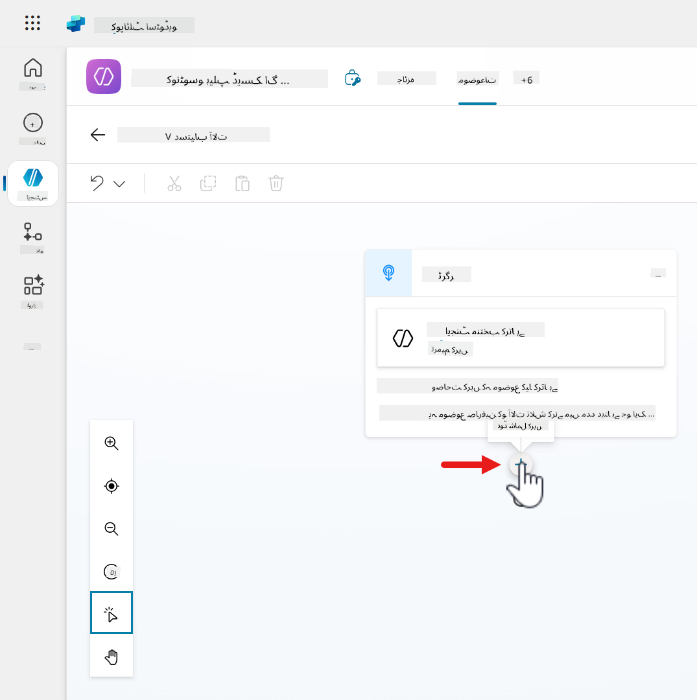

1. **Add a tool** نوڈ منتخب کریں، پھر **Connector** tab منتخب کریں۔ `Get items` تلاش کریں اور **Get items** SharePoint کنیکٹر ایکشن منتخب کریں۔

    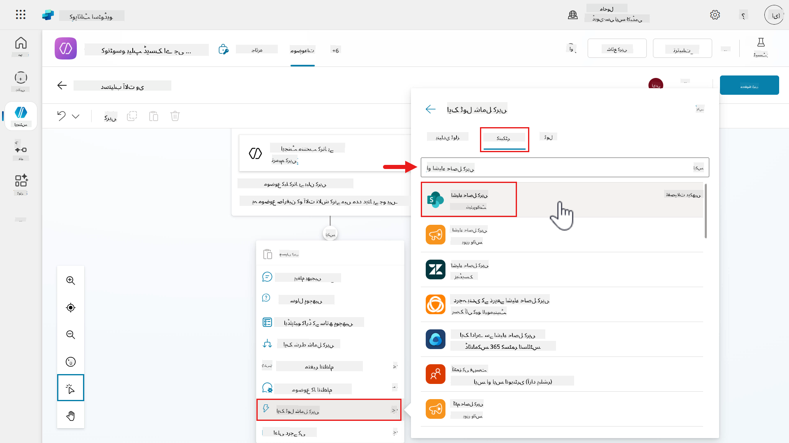

1. کنیکٹر کے لیے ایک نیا کنکشن تخلیق کرنے کی ضرورت ہے۔ **chevron** icon منتخب کریں اور **Create new connection** منتخب کریں۔

    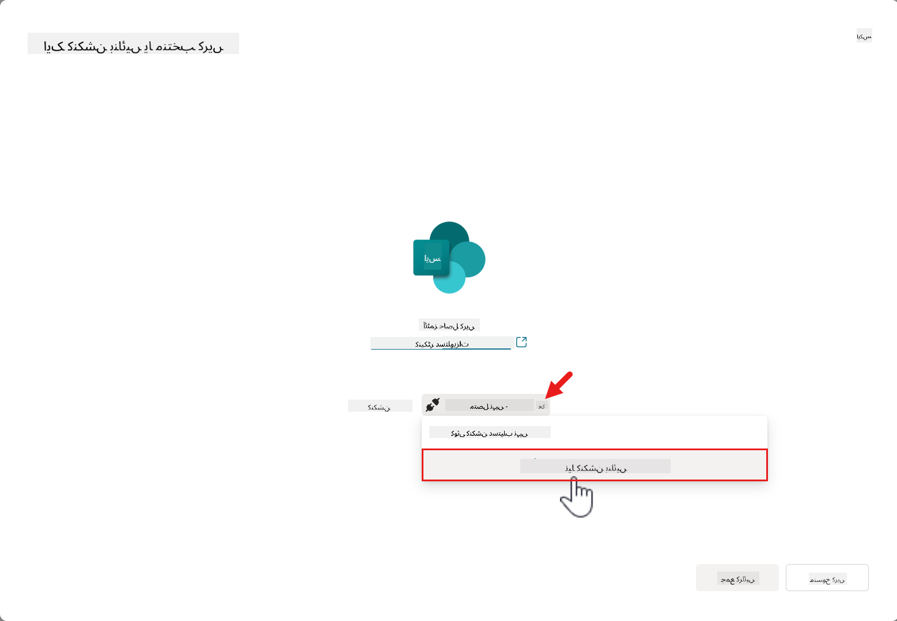

1. دو اختیارات دکھائے جائیں گے جو آپ کو SharePoint Online یا آن-پریمیس SharePoint سے براہ راست جڑنے کی اجازت دیتے ہیں۔ ڈیفالٹ کے طور پر **Connect directly (cloud-services)** آپشن منتخب ہوگا، جو ہم اپنے کنکشن کے لیے استعمال کریں گے۔
**کریٹ** منتخب کریں۔

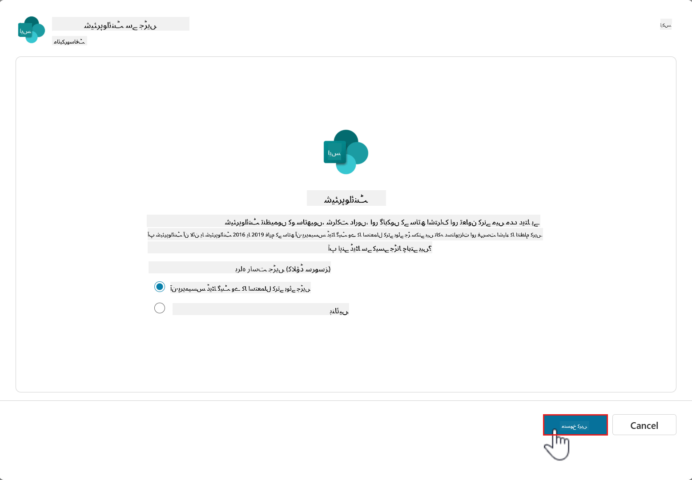

1. اپنے سائن ان کردہ یوزر اکاؤنٹ کو منتخب کریں۔

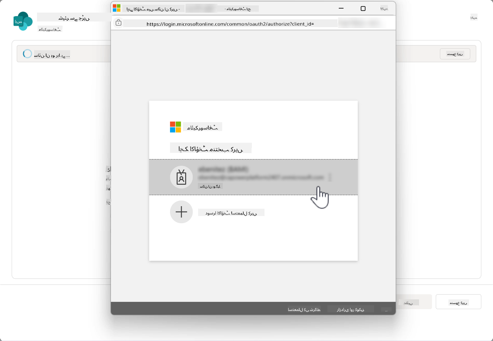

1. اگلا، آپ کو تصدیق کرنی ہوگی کہ آپ کا یوزر اکاؤنٹ SharePoint کنیکٹر کے ساتھ کنکشن کے لیے استعمال کیا جا سکتا ہے۔ **Allow access** منتخب کریں۔

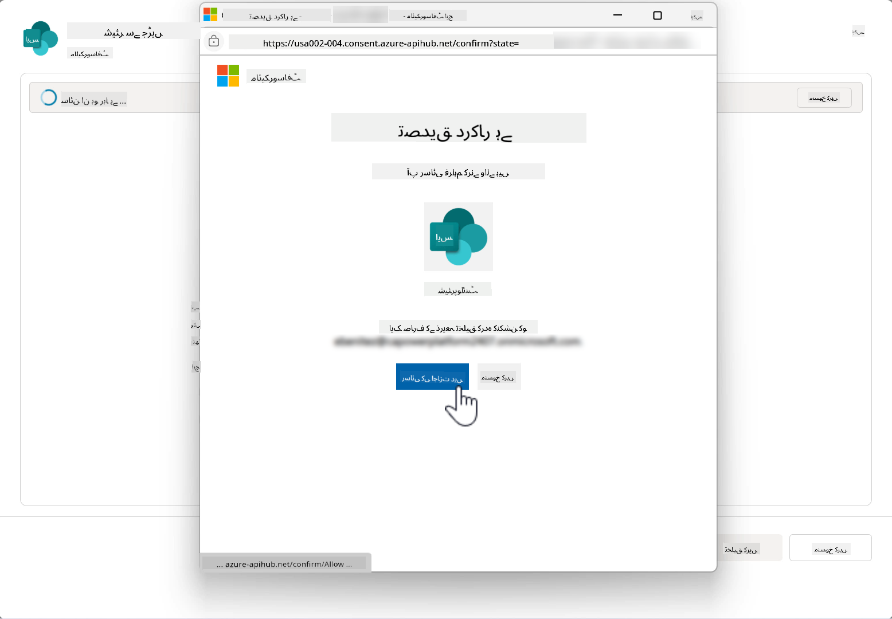

1. **Submit** منتخب کریں تاکہ **Get items** SharePoint کنیکٹر ایکشن کو موضوع کے ساتھ ایک نوڈ کے طور پر شامل کیا جا سکے۔

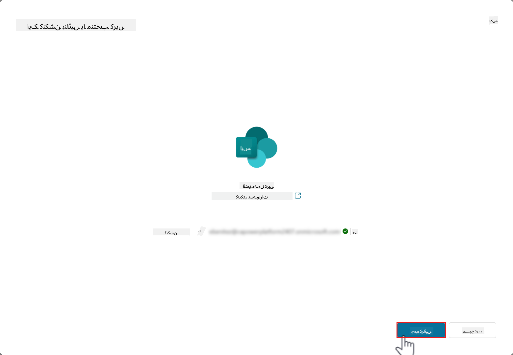

1. **Get items** SharePoint کنیکٹر ایکشن اب موضوع میں شامل ہو گیا ہے۔ اب ہم ایکشن کے ان پٹ کو ترتیب دینا شروع کر سکتے ہیں۔ **ellipsis (...) آئیکن** منتخب کریں اور **Properties** منتخب کریں۔

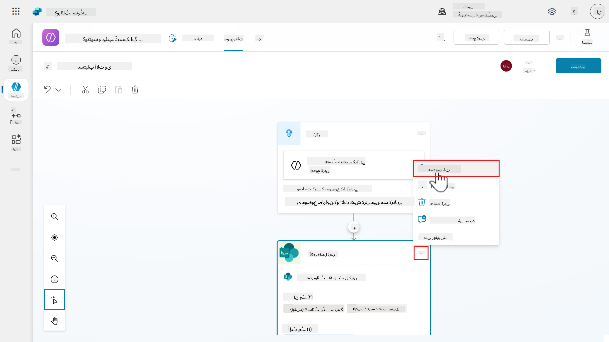

1. **Get items** کنفیگریشن پین ظاہر ہوگا اور ڈیفالٹ کے طور پر آپ کو **Inputs** ٹیب نظر آئے گا۔ **Initiation** ٹیب منتخب کریں اور **Usage Description** فیلڈ میں ایک وضاحت درج کریں۔ درج ذیل کو کاپی اور پیسٹ کریں۔

    ```text
    Retrieves devices from SharePoint list
    ```

> یہ اس وقت کام آئے گا جب ہم اپنے ایجنٹ کے _Manage your connections_ صفحے کو دیکھیں گے۔ ہم جلد ہی اس پر واپس آئیں گے۔

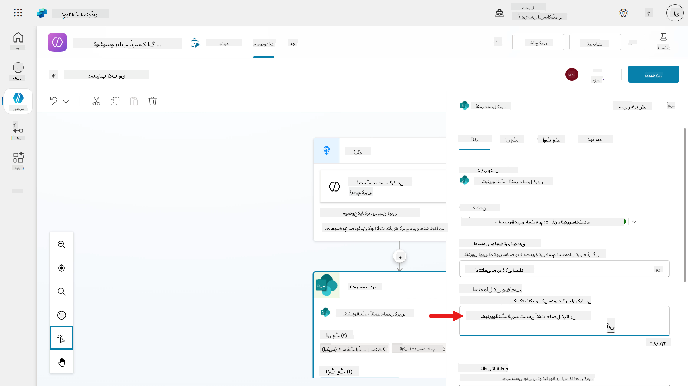

1. **Inputs** ٹیب منتخب کریں اور **Contoso IT** سائٹ اور **Devices** لسٹ منتخب کریں جو آپ نے [Lesson 00 - Course Setup - Step 3: Create new SharePoint site](../00-course-setup/README.md#step-4-create-new-sharepoint-site) میں ترتیب دی تھی۔

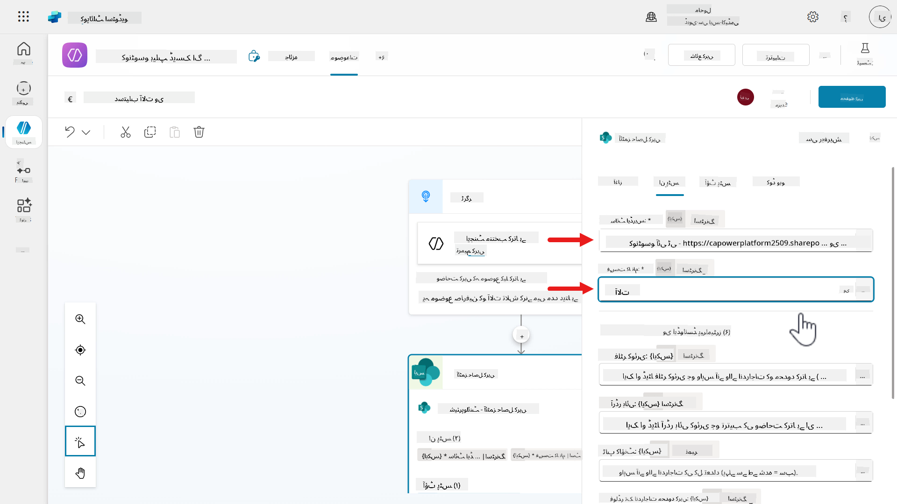

1. اب، صرف SharePoint لسٹ سے ڈیوائسز کو ظاہر کرنے کے لیے، 
   - منتخب کردہ ویلیو کی بنیاد پر،
   - اور صرف وہ ڈیوائسز جہاں اسٹیٹس _Available_ ہو،

   ہمیں ایک فلٹر لگانے کی ضرورت ہے۔ یہ Power Fx کی مدد سے فلٹر کوئری درج کرکے حاصل کیا جاتا ہے۔ **ellipsis (...) آئیکن** منتخب کریں۔

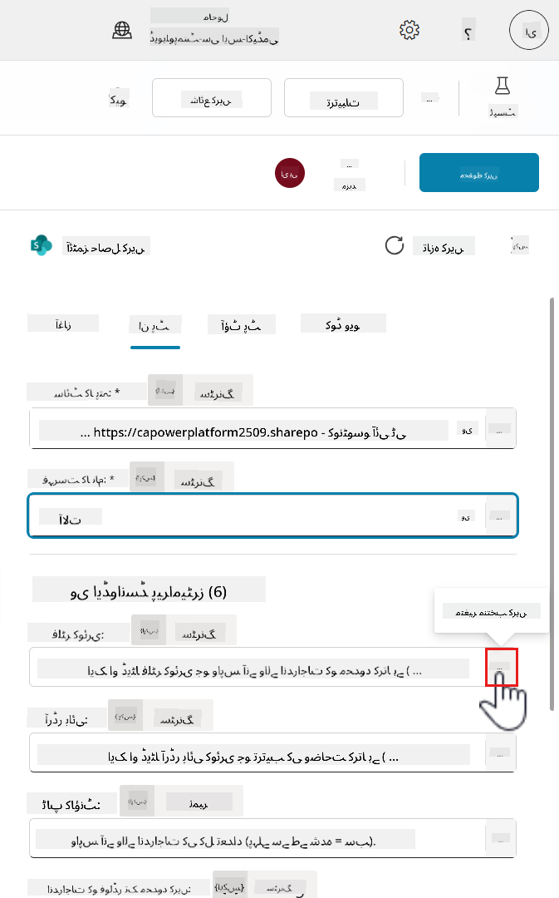

1. ڈیفالٹ کے طور پر، آپ **Custom** ٹیب میں ہوں گے۔ **Formula** ٹیب منتخب کریں۔

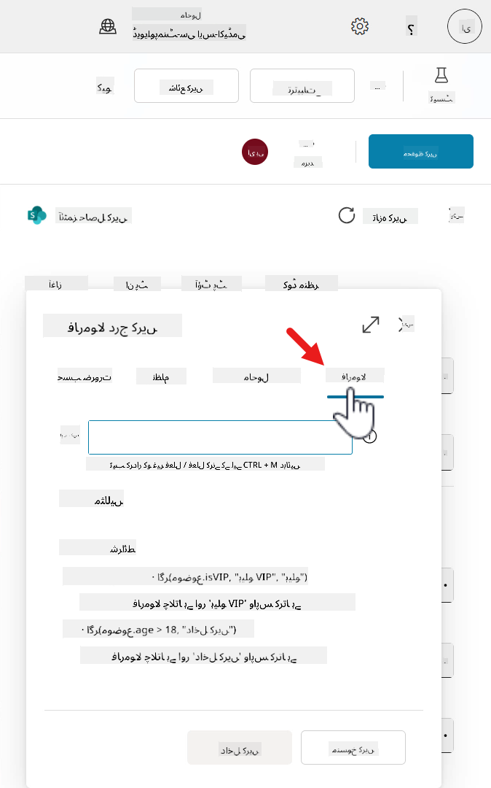

1. **Formula** فیلڈ کو بڑا کرنے کے لیے **expand** آئیکن منتخب کریں۔ درج ذیل Power Fx ایکسپریشن کو کاپی اور پیسٹ کریں۔

ہم `Concatenate` فنکشن استعمال کر رہے ہیں تاکہ ایک ایکسپریشن بنایا جا سکے جو فلٹر کرے:
   - SharePoint کالم **Status** برابر ہو _Available_،
   - اور SharePoint کالم **Asset type** برابر ہو _منتخب کردہ ڈیوائس سوال نوڈ سے_۔

    ```text
    Concatenate("Status eq 'Available' and AssetType eq '", Topic.VarDeviceType, "'")
    ```

**Insert** منتخب کریں۔


1. Power Fx ایکسپریشن اب **Get items** ایکشن کے Filter Query ان پٹ پیرامیٹر میں لاگو ہوگا۔ اگلا، **Limit Columns by View** میں **All items** ویو منتخب کریں۔ یہ صرف منتخب کردہ ویو کی بنیاد پر لسٹ میں کالمز کو حاصل کرے گا۔

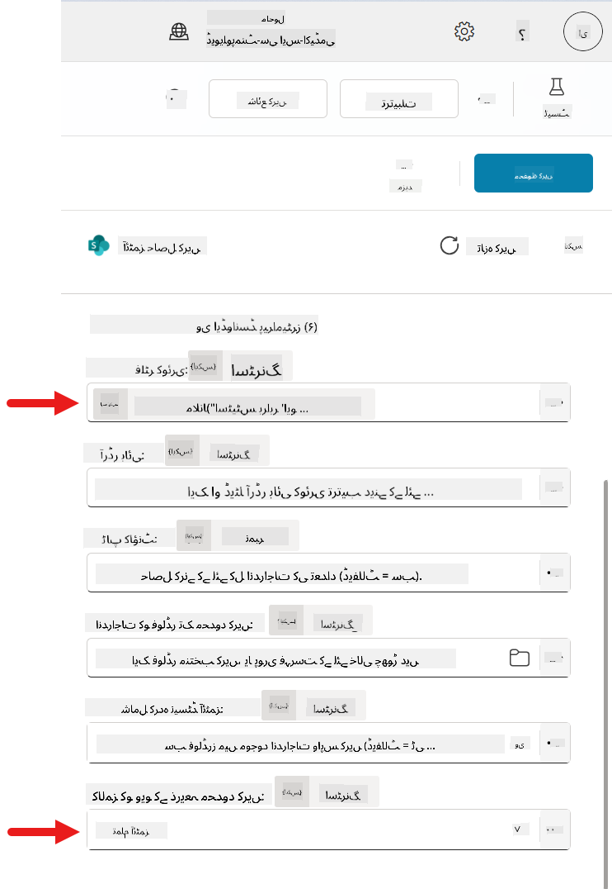

1. اگلا، ہم آؤٹ پٹ کے لیے ویریبل کا نام اپ ڈیٹ کریں گے۔ **Outputs** ٹیب منتخب کریں اور `GetItems` ویریبل منتخب کریں۔

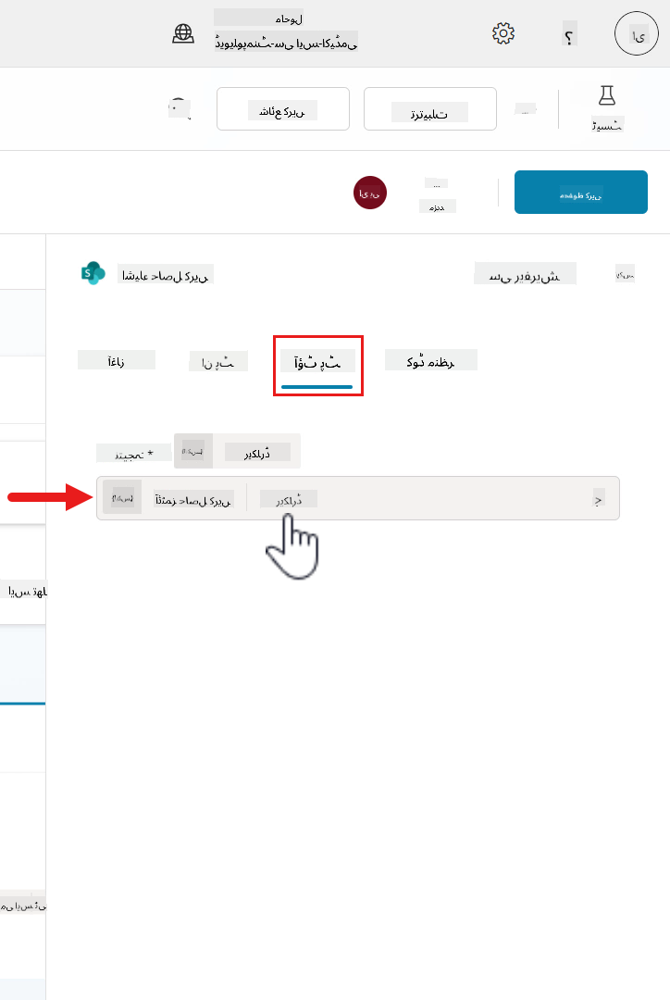

1. نام کو درج ذیل میں اپ ڈیٹ کریں۔

    ```text
    VarDevices
    ```

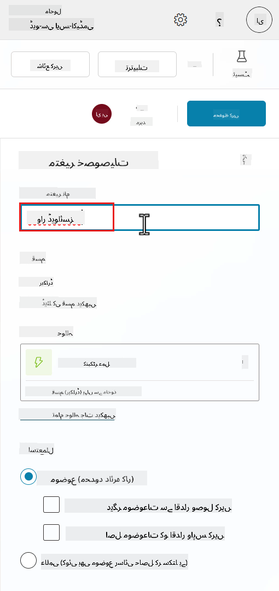

1. نیچے اسکرول کریں اور **Usage** سیکشن میں **Global** منتخب کریں۔ یہ ویریبل کو کسی بھی موضوع کے ذریعے قابل رسائی بنائے گا۔

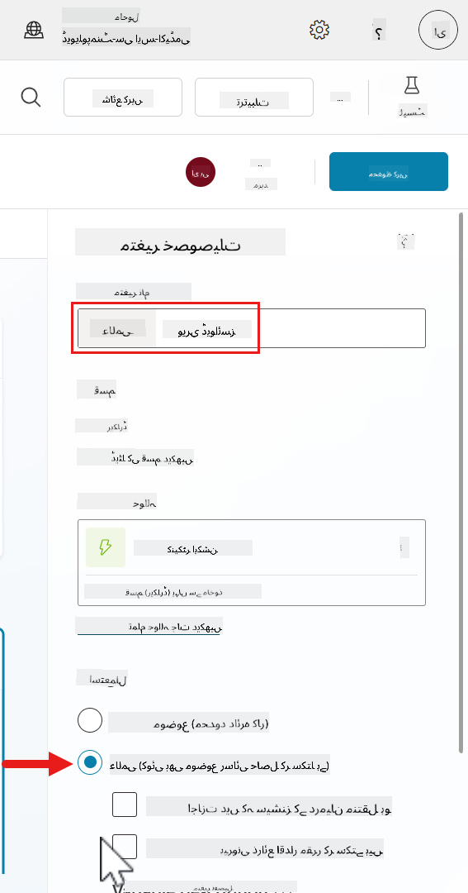

1. **Variable properties** پین کو **Close** کریں۔

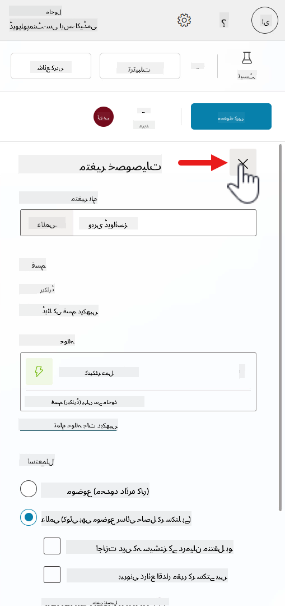

1. نیا نوڈ شامل کرنے کے لیے **plus +** آئیکن منتخب کریں، **Variable management** منتخب کریں اور پھر **Set a variable value** منتخب کریں۔

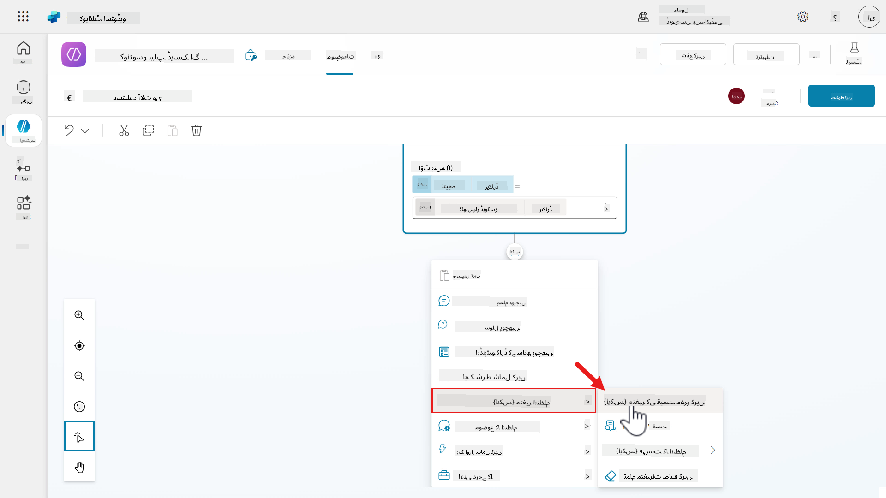

1. **Set variable** ان پٹ پیرامیٹر کے لیے **greater than** آئیکن منتخب کریں۔

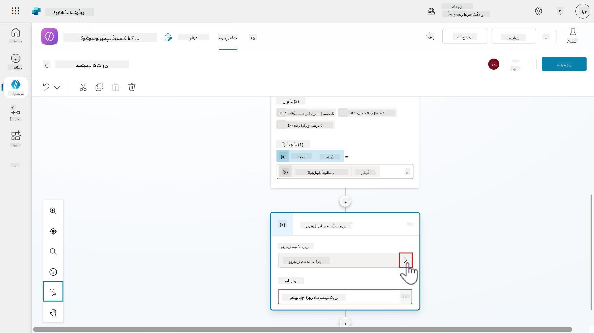

1. پہلے سے بنائے گئے Topic آؤٹ پٹ کو ویریبل کے طور پر منتخب کریں، **VarAvailableDevices**۔

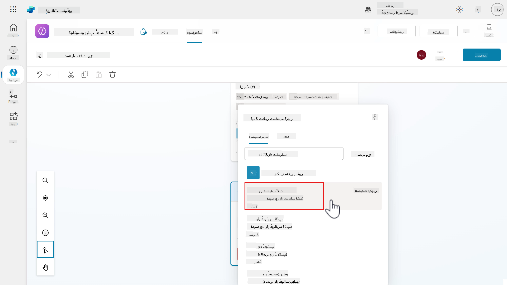

1. اگلا، ویریبل کی ویلیو کو ڈیفائن کرنے کے لیے **ellipsis (...) آئیکن** منتخب کریں۔


1. ہم اب PowerFx ایکسپریشن استعمال کریں گے تاکہ ویریبل ویلیو کو `value` پراپرٹی کے طور پر سیٹ کریں جو **Get items** رسپانس میں واپس آتی ہے، اور ویریبل کے [scope](https://learn.microsoft.com/microsoft-copilot-studio/advanced-power-fx?WT.mc_id=power-172618-ebenitez) کو گلوبل بنانے کے لیے `Global` کا پری فکس شامل کریں۔

**Insert** اور **save** منتخب کریں۔

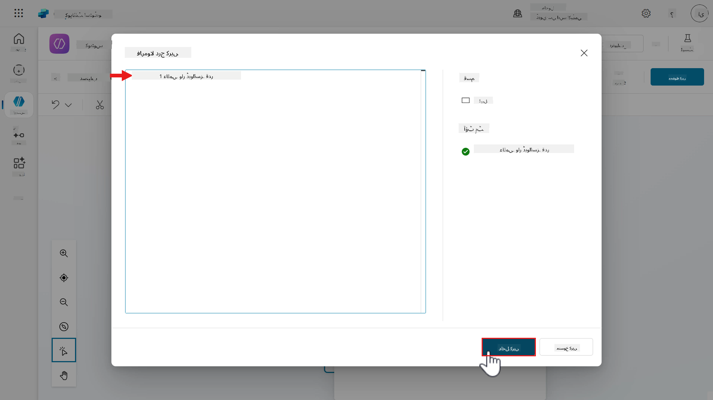

1. اگلا، ہمیں ایجنٹ انسٹرکشنز کو اپ ڈیٹ کرنا ہوگا۔ **Overview** ٹیب منتخب کریں اور **Edit** منتخب کریں۔

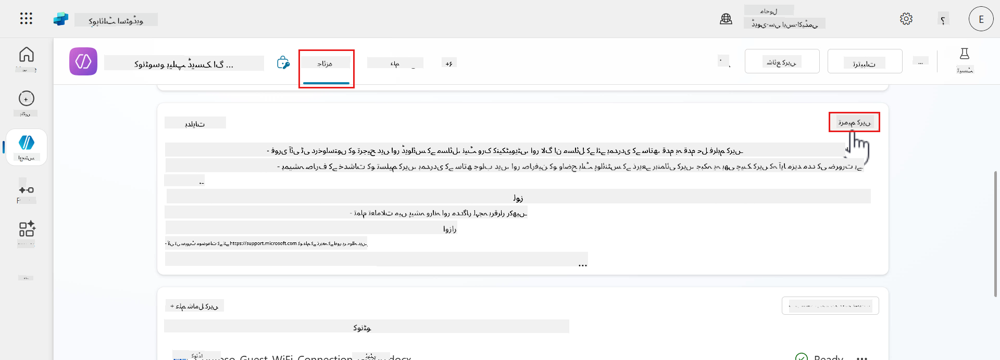

1. انسٹرکشنز میں ایک نئی لائن شامل کریں، درج ذیل کو کاپی اور پیسٹ کریں۔

    ```text
    - Help find available devices and give full details using [Available devices]. Always extract the VarDeviceType from the inputs. After giving device details, ask the user if they want to request a device from the list of available devices.
    ```

یہ انسٹرکشن جنریٹو AI کو **Available devices** ٹرگر کو فعال کرنے کے لیے رہنمائی کرے گا تاکہ **Devices** SharePoint لسٹ سے دستیاب ڈیوائسز کی فہرست دکھائی جا سکے۔ مربع بریکٹ میں پورے موضوع کے پلیس ہولڈر کو منتخب کریں۔


1. فارورڈ سلیش کریکٹر `/` ٹائپ کریں اور موضوعات کی فہرست ظاہر ہوگی۔ **Available devices** موضوع منتخب کریں۔

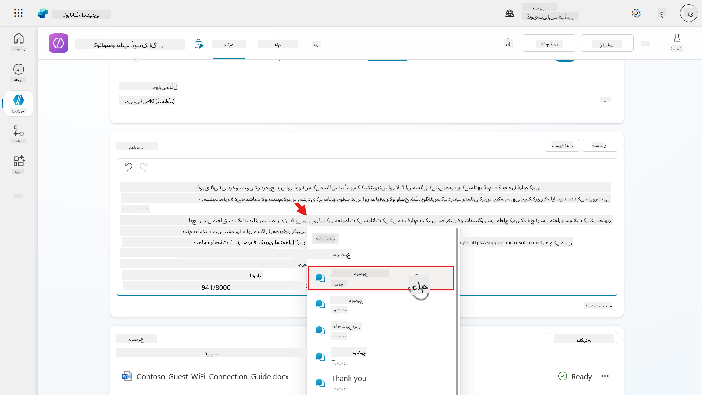

1. اپ ڈیٹ شدہ انسٹرکشنز کو **Save** کریں۔

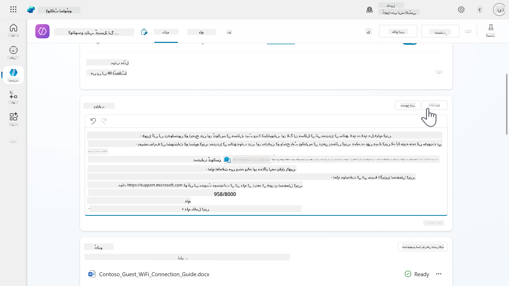

1. اب ہم اپنے اپ ڈیٹ شدہ ایجنٹ کو ٹیسٹ کرنے جا رہے ہیں۔ ٹیسٹ پین کو ظاہر کرنے کے لیے اوپر دائیں جانب **Test** منتخب کریں اور ٹیسٹ پین کو **refresh** کریں۔ ایجنٹ کو درج ذیل پیغام درج کریں۔

    ```text
    I need a laptop
    ```

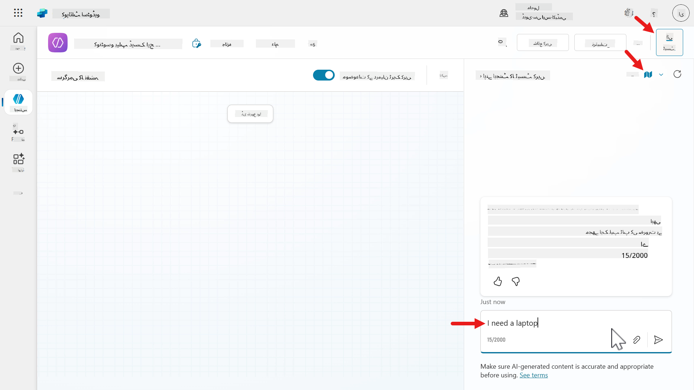

1. ایجنٹ آگے بڑھنے سے پہلے، یوزر کو تصدیق کرنی ہوگی کہ ان کا کنکشن استعمال کیا جا سکتا ہے۔ **Allow** منتخب کریں۔

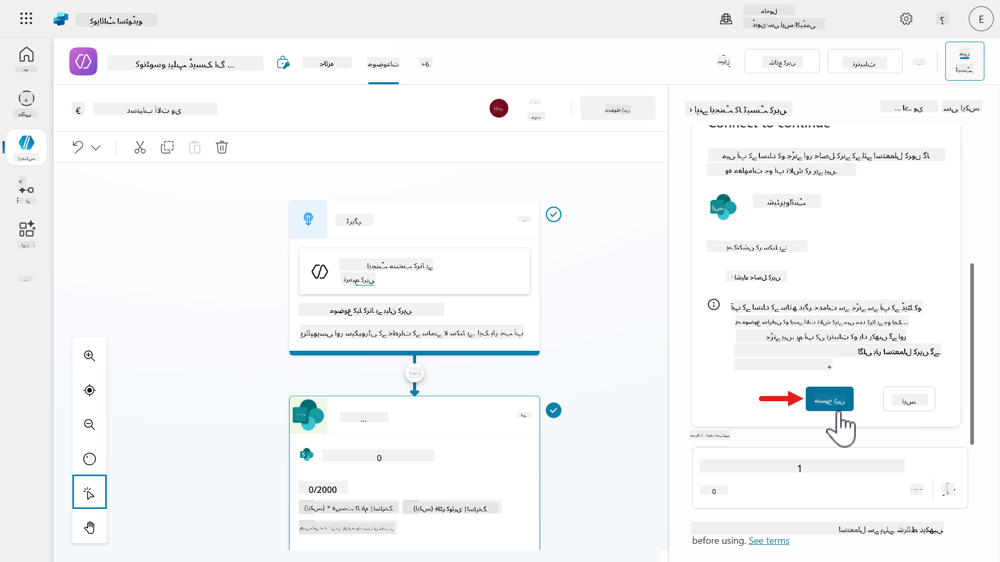

1. ایجنٹ SharePoint ٹول کو عمل میں لائے گا جو Power Fx ایکسپریشن کے ذریعے فلٹر شدہ ڈیوائسز کی فہرست حاصل کرے گا جہاں ڈیوائس ٹائپ "laptop" اور اسٹیٹس "available" ہو۔ یوزر کے پڑھنے کے لیے بلٹ پوائنٹس کی شکل میں رسپانس واپس آئے گا۔


1. ایک آخری چیز سیکھنے کے لیے یہ ہے کہ ایجنٹ کے _Manage your connections_ صفحے کو دیکھ کر کنکشنز کو کیسے دیکھا جائے۔ **ellipsis (...)** منتخب کریں اور **Manage Connection** منتخب کریں۔

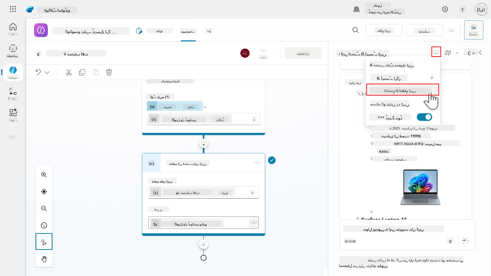

1. یہ وہ صفحہ ہے جہاں ہم ایجنٹ کے ذریعے استعمال ہونے والے تمام کنکشنز کو دیکھ سکتے ہیں۔ فی الحال، صرف ایک کنکشن درج ہے جو موضوع میں شامل کیے گئے SharePoint ٹول سے وابستہ ہے۔ **Used By** کالم میں **1 tool** منتخب کریں۔

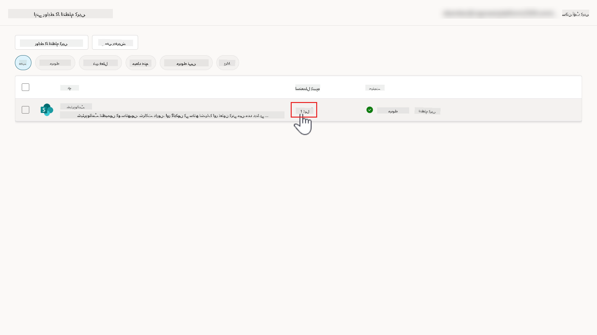

1. یہ وہ جگہ ہے جہاں ہم Get items ایکشن کی تفصیلات دیکھ سکتے ہیں اور یاد کریں کہ ہم نے پہلے _usage description_ درج کی تھی؟ یہ وہ جگہ ہے جہاں ہم _usage description_ دیکھیں گے۔ **Close** منتخب کریں۔

> یہ ہمیں بتاتا ہے کہ کون سے ایکشنز استعمال کیے گئے ہیں اور ان کا مقصد کیا ہے۔ یہ ہمارے کنکشنز کو منظم رکھنے میں مدد دیتا ہے 📁۔

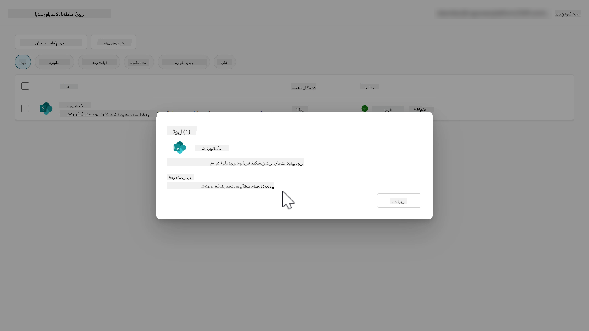

1. اپنے براؤزر ٹیب پر واپس جائیں جہاں Copilot Studio کھلا ہے اور ٹیسٹ پین کو صاف کرنے کے لیے **refresh** کریں۔

## ✅ مشن مکمل

مبارک ہو! 👏🏻 آپ نے سیکھا کہ کیسے ایک نیا موضوع شروع سے شامل کریں، کیسے ایک ٹول شامل کریں جو Get items SharePoint کنیکٹر ایکشن کو کال کرے اور Power Fx استعمال کرتے ہوئے رسپانس کو فلٹر کریں تاکہ صرف وہ ڈیوائسز واپس آئیں جہاں اسٹیٹس دستیاب ہو اور ڈیوائس ٹائپ لیپ ٹاپ ہو۔ 🙌🏻

یہ **Lab 07 - Add a new topic with conversation nodes** کا اختتام ہے، نیچے دیے گئے لنک کو منتخب کریں تاکہ اگلے سبق پر جائیں۔ ہم اس لیب کے یوز کیس کو اگلے سبق کے لیب میں مزید بڑھائیں گے۔

⏭️ [**Enhance user interactions with Adaptive Cards** سبق پر جائیں](../08-add-adaptive-card/README.md)

## 📚 حکمت عملی وسائل

🔗 [Use system topics](https://learn.microsoft.com/microsoft-copilot-studio/authoring-system-topics?mc_id=power-172618-ebenitez)

🔗 [Topics in Microsoft Copilot Studio](https://learn.microsoft.com/microsoft-copilot-studio/guidance/topics-overview?WT.mc_id=power-172618-ebenitez)

🔗 [Set topic triggers](https://learn.microsoft.com/microsoft-copilot-studio/authoring-triggers?WT.mc_id=power-172618-ebenitez)

🔗 [Defining agent topics](https://learn.microsoft.com/microsoft-copilot-studio/guidance/defining-chatbot-topics?WT.mc_id=power-172618-ebenitez)

🔗 [Create expressions using Power Fx](https://learn.microsoft.com/microsoft-copilot-studio/advanced-power-fx?WT.mc_id=power-172618-ebenitez)

📺 [Author topics using natural language](https://aka.ms/ai-in-action/copilot-studio/ep6)

📺 [Add actions to agents using connectors](https://aka.ms/ai-in-action/copilot-studio/ep4)


---

**ڈسکلیمر**:  
یہ دستاویز AI ترجمہ سروس [Co-op Translator](https://github.com/Azure/co-op-translator) کا استعمال کرتے ہوئے ترجمہ کی گئی ہے۔ ہم درستگی کے لیے کوشش کرتے ہیں، لیکن براہ کرم آگاہ رہیں کہ خودکار ترجمے میں غلطیاں یا غیر درستیاں ہو سکتی ہیں۔ اصل دستاویز کو اس کی اصل زبان میں مستند ذریعہ سمجھا جانا چاہیے۔ اہم معلومات کے لیے، پیشہ ور انسانی ترجمہ کی سفارش کی جاتی ہے۔ ہم اس ترجمے کے استعمال سے پیدا ہونے والی کسی بھی غلط فہمی یا غلط تشریح کے ذمہ دار نہیں ہیں۔