<!--
CO_OP_TRANSLATOR_METADATA:
{
  "original_hash": "dcbcd9396b076da0a0f5d389e9ec1b12",
  "translation_date": "2025-10-22T19:45:39+00:00",
  "source_file": "docs/recruit/08-add-adaptive-card/README.md",
  "language_code": "ur"
}
-->
# 🚨 مشن 08: موضوعات میں صارف کے تعاملات کو Adaptive Cards کے ذریعے بہتر بنائیں

## 🕵️‍♂️ کوڈ نام: `آپریشن انٹرفیس اپ لفٹ`

> **⏱️ آپریشن کا وقت:** `~45 منٹ`

🎥 **واچ واک تھرو**

[](https://www.youtube.com/watch?v=RhIlzYHPCXo "یوٹیوب پر واک تھرو دیکھیں")

## 🎯 مشن کا خلاصہ

ایجنٹس، آپ کا مشن یہ ہے کہ جامد صارف تجربے کو ختم کریں اور اسے بھرپور، متحرک، اور قابل عمل Adaptive Cards سے تبدیل کریں۔ آپ JSON payloads اور Power Fx فارمولے استعمال کریں گے تاکہ Copilot Studio کی گفتگو کو بنیادی سوال و جواب سے مکمل طور پر انٹرایکٹو تعاملات میں تبدیل کیا جا سکے۔ آپ کا مقصد صارف کی معلومات جمع کرنا، ڈیٹا کو خوبصورتی سے پیش کرنا، اور گفتگو کو درستگی اور انداز کے ساتھ ہدایت دینا ہے۔ اگر آپ موافقت نہیں کرتے تو آپ کے صارفین کم ذہین انٹرفیسز کی طرف جا سکتے ہیں۔

## 🔎 مقاصد

اس مشن میں، آپ سیکھیں گے:

1. Adaptive Cards کیا ہیں اور Copilot Studio میں صارف کے تعاملات کو کیسے بہتر بناتے ہیں
1. JSON اور Power Fx فارمولے استعمال کرتے ہوئے انٹرایکٹو کارڈز بنانا
1. Adaptive Card Designer اور اس کے اہم اجزاء کو بصری کارڈ تخلیق کے لیے دریافت کرنا
1. ایجنٹ موضوعات میں بھرپور، انٹرایکٹو فارم اور ڈیٹا جمع کرنے کے تجربات بنانا
1. Responsive اور صارف دوست Adaptive Cards ڈیزائن کرنے کے بہترین طریقے نافذ کرنا

## 🤔 Adaptive Card کیا ہے؟

**Adaptive Card** ایک طریقہ ہے انٹرایکٹو، بصری طور پر بھرپور UI عناصر بنانے کا جو Microsoft Teams، Microsoft Outlook یا ایجنٹس جیسے ایپس میں شامل کیے جا سکتے ہیں۔ یہ ایک منظم JSON آبجیکٹ ہے جو کارڈ کی ترتیب اور مواد کی وضاحت کرتا ہے:

- کارڈ پر کون سے عناصر ظاہر ہوں گے - متن، تصاویر، بٹن
- ان عناصر کو کیسے ترتیب دیا جائے
- صارفین کون سے اعمال لے سکتے ہیں جیسے فارم جمع کرنا یا لنک کھولنا

    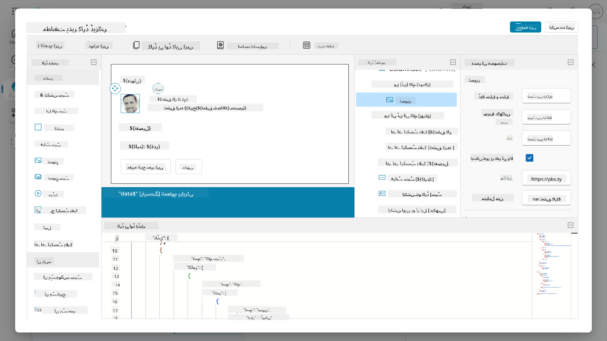

### Copilot Studio میں Adaptive Cards کیوں اہم ہیں؟

تصور کریں کہ آپ ایک ایجنٹ بنا رہے ہیں جو صارفین سے ان کا نام، ای میل، یا فیڈبیک پوچھتا ہے۔ اگر آپ صرف سادہ متن استعمال کرتے ہیں، تو گفتگو بورنگ یا مشکل محسوس ہو سکتی ہے۔ یہی وہ جگہ ہے جہاں Adaptive Cards کام آتے ہیں!

1. **گفتگو کو انٹرایکٹو بناتا ہے** - صارف کو پیغامات بھیجنے کے بجائے، آپ بٹن، فارم، تصاویر اور مزید دکھا سکتے ہیں۔
    - مثال: ایک کارڈ صارف سے صاف فارم میں ان کا نام اور ای میل بھرنے کے لیے کہہ سکتا ہے۔

1. **ہر جگہ خوبصورت نظر آتا ہے** - Adaptive Cards خود بخود اس ایپ کے انداز سے میل کھاتے ہیں جس میں وہ ہیں، جیسے Microsoft 365 Copilot چیٹ یا Microsoft Teams۔ آپ کو ڈارک موڈ، فونٹ، یا لے آؤٹ کے بارے میں فکر کرنے کی ضرورت نہیں - یہ موافقت کرتا ہے۔

1. **JSON کے ساتھ بنانا آسان ہے** - آپ JSON کوڈ استعمال کرتے ہوئے کارڈ کی وضاحت کرتے ہیں (UI کے لیے _recipe_ سوچیں)۔ Copilot Studio آپ کو اپنے کارڈ کو موضوع میں شامل کرنے سے پہلے پیش نظارہ کرنے میں مدد کرتا ہے۔

1. **ڈیٹا جمع کریں اور استعمال کریں** - آپ کارڈ کو سوالات پوچھنے، جوابات جمع کرنے، اور گفتگو کے بہاؤ میں اس ڈیٹا کو استعمال کرنے کے لیے استعمال کر سکتے ہیں۔
    - مثال: صارف کا فون نمبر پوچھیں، پھر ان کے فون نمبر کے ساتھ تصدیقی کارڈ دکھائیں۔

1. **صارف کے تجربے کو بڑھائیں** - کارڈز آپ کے ایجنٹ کو زیادہ انٹرایکٹو محسوس کراتے ہیں۔ یہ ایک زیادہ صاف، کلک کرنے کے قابل، اور صارف دوست قسم کا انٹرفیس ہے۔

## 🐱 کیا _JSON_ ایک شخص ہے؟

"Jason" کے طور پر تلفظ کیا جاتا ہے، یہ کوئی شخص نہیں ہے 😅

JSON، جسے _JavaScript Object Notation_ بھی کہا جاتا ہے، ایک ہلکا پھلکا فارمیٹ ہے جو ڈیٹا کو منظم کرنے کے لیے استعمال ہوتا ہے۔ اسے پڑھنا اور لکھنا آسان ہے، اور یہ کلیدی-ویلیو جوڑوں کی ایک سیریز کی طرح نظر آتا ہے جو curly braces {} کے اندر ہوتے ہیں۔

یہ ان اختیارات میں سے ایک ہے جو آپ کے موضوع میں Adaptive Card شامل کرتے وقت استعمال کیا جا سکتا ہے۔


## 👀 میں دیکھ رہا ہوں کہ Adaptive Card بنانے کے لیے _formula_ کا ایک اور آپشن ہے

یاد کریں کہ ہم نے [مشن 07 - اپنے نوڈز میں Power Fx استعمال کرنا](../07-add-new-topic-with-trigger/README.md#what-power-fx-can-do-in-topics) میں Power Fx کے بارے میں سیکھا تھا۔ یہی چیز Adaptive Cards میں Copilot Studio کے اندر لاگو کی جا سکتی ہے۔

ایک یاد دہانی کے طور پر،

!!! note
    Power Fx ایک low-code پروگرامنگ زبان ہے جو آپ کے ایجنٹ میں منطق اور متحرک رویے شامل کرنے کے لیے استعمال ہوتی ہے۔ یہ وہی زبان ہے جو Microsoft Power Apps میں استعمال ہوتی ہے، اور یہ سادہ اور Excel جیسی ہے، جس سے یہ ڈویلپرز اور غیر ڈویلپرز کے لیے آسان ہو جاتی ہے۔

### Adaptive Cards میں Power Fx کیسے کام کرتا ہے

جب آپ Copilot Studio میں Adaptive Card ڈیزائن کرتے ہیں، تو آپ Power Fx فارمولے استعمال کر سکتے ہیں:

- متحرک طور پر اقدار داخل کریں جیسے صارف کے نام، تاریخیں یا حیثیت۔
- متن یا نمبروں کو فارمیٹ کریں جیسے کرنسی دکھائیں یا نمبروں کو گول کریں۔
- شرائط کی بنیاد پر عناصر دکھائیں یا چھپائیں۔
- صارف کے ان پٹ، متغیرات، گفتگو کے نوڈز کے آؤٹ پٹس کی بنیاد پر جوابات کو حسب ضرورت بنائیں۔

مثال کے طور پر،

"`Hello`" & `System.User.DisplayName`

یہ فارمولا متحرک طور پر صارف کے نام کے ساتھ "Hello" لفظ کو جوڑتا ہے۔

### یہ کیوں مفید ہے

1. **ذاتی نوعیت**

    آپ ہر صارف کے لیے پیغام کو حسب ضرورت بنا سکتے ہیں، جس سے تعاملات زیادہ قدرتی اور متعلقہ محسوس ہوتے ہیں۔

1. **متحرک مواد**

    کارڈز متغیرات اور گفتگو کے نوڈز کے آؤٹ پٹس سے حقیقی ڈیٹا دکھا سکتے ہیں۔

1. **سمارٹ منطق**

    آپ شرائط کی بنیاد پر صارفین کو دکھانے یا ان کے ساتھ تعامل کرنے والے عناصر کو کنٹرول کر سکتے ہیں، جس سے استعمال میں بہتری اور غلطیوں میں کمی آتی ہے۔

1. **Low-code دوستانہ**

    Power Fx ایک low-code پروگرامنگ زبان ہے۔ جیسا کہ پہلے ذکر کیا گیا، یہ قابل پڑھائی، بدیہی اور Excel فارمولوں جیسی ہے۔

## 👷🏻‍♀️ Adaptive Card Designer کے ساتھ بنانا

**Adaptive Card Designer** ایک بصری ٹول ہے جو آپ کو متن، تصاویر، بٹن، اور ان پٹ جیسے ڈریگ اینڈ ڈراپ عناصر کا استعمال کرتے ہوئے انٹرایکٹو پیغام کارڈز بنانے دیتا ہے۔ اس کا مقصد پیچیدہ کوڈ لکھے بغیر بھرپور، متحرک پیغامات تخلیق کرنے میں مدد کرنا ہے، جس سے صارف دوست انٹرفیس ڈیزائن کرنا آسان ہو جاتا ہے۔

ڈیزائنر ٹول آپ کو بصری طور پر کارڈ بنانے میں مدد کرتا ہے، لیکن پس منظر میں، یہ آپ کے لیے JSON آبجیکٹ تیار کر رہا ہوتا ہے۔ آپ _formula_ پر بھی سوئچ کر سکتے ہیں جو کارڈ میں Power Fx expressions کو کہیں اور سے ڈیٹا دکھانے کے لیے استعمال کرنے کی اجازت دیتا ہے۔

## 🎨 Adaptive Card Designer کو سمجھنا

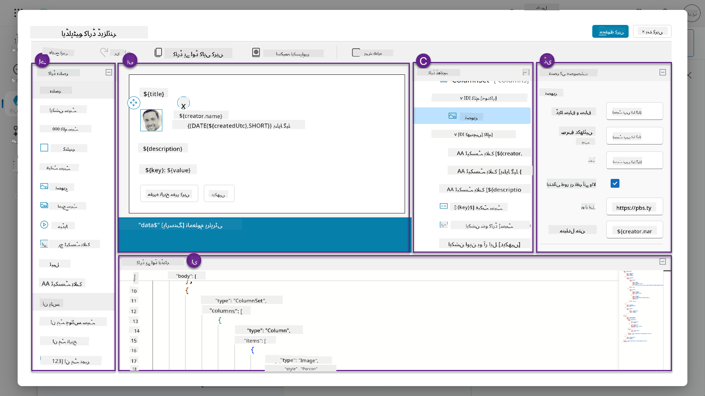

### A) کارڈ عناصر

یہ آپ کے Adaptive Card کے بنیادی اجزاء ہیں۔ آپ درج ذیل عناصر کو ڈریگ اور ڈراپ کر سکتے ہیں:

- **TextBlock** متن دکھانے کے لیے۔
- **Image** تصاویر دکھانے کے لیے۔
- **FactSet** کلیدی-ویلیو جوڑوں کے لیے۔
- **Input fields** متن کے باکس، تاریخ کے انتخاب، ٹوگلز دکھانے کے لیے۔
- **Actions** بٹن دکھانے کے لیے جیسے _Submit_, _Open URL_, یا _Show Card_۔

ہر عنصر کا اپنا مقصد ہوتا ہے اور اسے اسٹائل یا کنفیگر کیا جا سکتا ہے۔

### B) کارڈ ویور

یہ **پیش نظارہ** کا علاقہ ہے جہاں آپ حقیقی وقت میں دیکھ سکتے ہیں کہ آپ کا کارڈ کیسا نظر آئے گا۔ جیسے ہی آپ عناصر شامل یا ترمیم کرتے ہیں، ویور فوری طور پر تبدیلیوں کو ظاہر کرنے کے لیے اپ ڈیٹ ہوتا ہے۔ یہ آپ کو تکراری اپ ڈیٹس کرنے اور ڈیزائن آؤٹ پٹ کو ایک ہی وقت میں دیکھنے کے قابل بناتا ہے۔

### C) کارڈ کا ڈھانچہ

یہ آپ کے کارڈ کی **درجہ بندی اور ترتیب** دکھاتا ہے۔ مثال کے طور پر:

- ایک کارڈ **TextBlock** کے ساتھ شروع ہو سکتا ہے جو عنوان کے لیے ہو۔
- پھر ایک **ColumnSet** جس میں ایک طرف تصویر ہو اور دوسری طرف متن۔
- اس کے بعد ایک **FactSet** اور کچھ **Action buttons**۔

یہ آپ کو سمجھنے میں مدد کرتا ہے کہ عناصر کیسے nested اور منظم ہیں۔

### D) عنصر کی خصوصیات

جب آپ کارڈ میں کسی بھی عنصر پر کلک کرتے ہیں، تو یہ پینل آپ کو اس کی **ترتیبات کو حسب ضرورت بنانے** دیتا ہے:

- متن کا سائز، وزن، یا رنگ تبدیل کریں۔
- تصویر کے URLs یا alt متن سیٹ کریں۔
- ان پٹ آپشنز جیسے placeholder متن یا ڈیفالٹ ویلیوز کو کنفیگر کریں۔

یہ وہ جگہ ہے جہاں آپ ہر عنصر کو باریک بینی سے ترتیب دیتے ہیں۔

### E) کارڈ Payload ایڈیٹر

یہ آپ کے کارڈ کے پیچھے **خام JSON کوڈ** ہے۔ ایڈوانسڈ صارفین اسے براہ راست ایڈٹ کر سکتے ہیں:

- ٹیمپلیٹنگ فیچرز استعمال کریں۔
- کارڈ کی تعریفیں کاپی/پیسٹ کریں۔

یہاں تک کہ اگر آپ Adaptive Card ڈیزائنر میں نئے ہیں، تو یہ دیکھنا مددگار ہے کہ بصری ڈیزائن کوڈ میں کیسے تبدیل ہوتا ہے۔

!!! tip "ٹپ - Adaptive Card کے نمونے دیکھیں"

    1. [https://adaptivecards.microsoft.com/designer](https://adaptivecards.microsoft.com/designer) پر جائیں۔
    2. **نیا کارڈ** منتخب کریں تاکہ نمونوں کی فہرست دیکھ سکیں جنہیں آپ منتخب اور ترمیم کر سکتے ہیں۔
    3. نوٹ کریں کہ یہ ڈیزائنر بیرونی (ویب پر مبنی) ہے۔ جب آپ ویب پر مبنی Adaptive Card Designer میں اپنا کارڈ بناتے ہیں، تو Card Payload ایڈیٹر سے JSON کاپی کریں۔
    4. JSON کو اپنے ایجنٹ میں Copilot Studio میں اپنے Adaptive Card میں پیسٹ کریں۔

    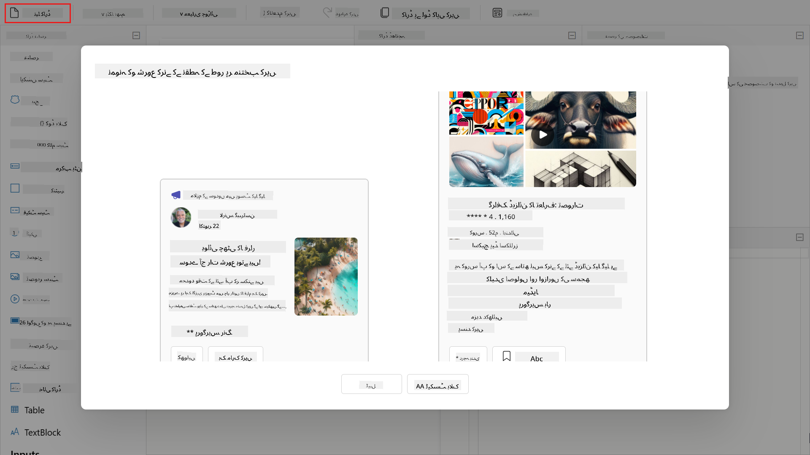

## 🌵 عام استعمال کے کیسز

Adaptive Cards کے عام استعمال کے کیسز درج ذیل ہیں جب Copilot Studio میں **Send a message** یا **Ask a question** نوڈز میں استعمال کیے جاتے ہیں۔

1. **فارمز اور ڈیٹا جمع کرنا**

    Adaptive Cards کا استعمال صارفین سے منظم ان پٹ جمع کرنے کے لیے کریں، جیسے:

    - چھٹی کی درخواستیں
    - فیڈبیک فارم
    - رابطے کی معلومات
    - ملاقات کا شیڈول

1. **متحرک معلومات دکھانا**

    صارفین کو صاف، پڑھنے کے قابل فارمیٹ میں ذاتی یا حقیقی وقت کا ڈیٹا دکھائیں جو ServiceNow، SAP, Dynamics 365, SharePoint وغیرہ جیسے انٹرپرائز ذرائع سے ہو۔

    - آرڈر کے خلاصے
    - اکاؤنٹ بیلنس
    - ٹکٹ یا کیس کی حیثیت
    - آنے والے واقعات یا ڈیڈ لائنز

1. **انٹرایکٹو انتخاب**

    صارفین کو گفتگو میں براہ راست انتخاب کرنے دیں:

    - اختیارات کی فہرست سے انتخاب کریں، مثال کے طور پر پروڈکٹ کیٹیگریز، سپورٹ موضوعات۔
    - عمل کی تصدیق یا منسوخی۔
    - سروس یا تجربے کی درجہ بندی کریں۔

1. **اعمال کو متحرک کرنا**

    بٹن شامل کریں جو گفتگو میں مزید اقدامات کو اندرونی یا بیرونی طور پر متحرک کریں۔

    - "درخواست جمع کریں"
    - "تفصیلات دیکھیں"

## ⭐ بہترین طریقے

Copilot Studio میں ایجنٹس کے لیے Adaptive Cards بنانے کے بہترین طریقے درج ذیل ہیں۔

1. **سادہ اور مرکوز رکھیں**

    - کارڈز کو واضح مقصد کے ساتھ ڈیزائن کریں، انہیں بہت زیادہ عناصر کے ساتھ اوورلوڈ نہ کریں۔
    - صارفین کو تعامل کے ذریعے رہنمائی کرنے کے لیے مختصر متن اور بدیہی لے آؤٹ استعمال کریں۔

1. **ان پٹس کے ساتھ ارادے سے کام کریں**

    - صرف ضروری ان پٹ عناصر شامل کریں جیسے متن، تاریخ کے انتخاب، تاکہ صارفین کو مغلوب نہ کریں۔
    - ان پٹس کو سمجھنے میں آسان بنانے کے لیے لیبلز استعمال کریں۔

1. **پڑھنے کے قابل بنانے کے لیے ڈھانچہ بنائیں**

    - **TextBlocks** کو سرخیوں اور ہدایات کے لیے استعمال کریں۔
    - بصری بہاؤ کو بہتر بنانے کے لیے **Containers** یا **ColumnSets** کا استعمال کرتے ہوئے متعلقہ عناصر کو گروپ کریں۔

1. **Action عناصر کو واضح بنائیں**

    - **Action.Submit** اور یا **Action.OpenUrl** کے ساتھ واضح بٹن کے عنوانات استعمال کریں جیسے "درخواست جمع کریں" یا "تفصیلات دیکھیں"
    - مبہم لیبلز جیسے "یہاں کلک کریں" سے گریز کریں۔

1. **موافقت کے لیے ڈیزائن کریں**

    - فرض کریں کہ کارڈ مختلف اسکرین سائز پر دیکھا جا سکتا ہے۔
    - مقررہ چوڑائیوں سے گریز کریں اور Responsiveness کے لیے **ColumnSets** جیسے لچکدار لے آؤٹ استعمال کریں۔

1. **ممکنہ طور پر متحرک مواد استعمال کریں**

    - صارف کے تجربے کو ذاتی نوعیت دینے کے لیے Power Fx کا استعمال کرتے ہوئے کارڈ عناصر کو متغیرات یا نوڈز کے آؤٹ پٹس سے باندھیں۔
    - مثال کے طور پر، صارف کا نام یا موجودہ حیثیت متحرک طور پر دکھائیں۔

## 🧪 لیب 08 - Adaptive Cards شامل کریں اور موضوع کی صلاحیتوں کو بہتر بنائیں

اب ہم سیکھیں گے کہ اپنے موضوع کو Adaptive Cards کے ساتھ کیسے بہتر بنایا جائے اور موضوعات اور نوڈز کی جدید فعالیت کا استعمال کیسے کیا جائے۔

- [8.1 صارف کی درخواست جمع کرنے کے لیے Adaptive Card کے ساتھ نیا موضوع بنائیں](../../../../../docs/recruit/08-add-adaptive-card)
- [8.2 ایجنٹ کی ہدایات کو درخواست ڈیوائس موضوع کو متحرک کرنے کے لیے اپ ڈیٹ کریں](../../../../../docs/recruit/08-add-adaptive-card)

### ✨ استعمال کا کیس

**بطور** ملازم

**میں چاہتا ہوں** کہ ایک ڈیوائس کی درخواست کروں

**تاکہ میں** دستیاب ڈیوائسز کی فہرست سے ایک ڈیوائس کی درخواست کر سکوں

چلیں شروع کریں!

### ضروریات

1. **SharePoint فہرست**

    ہم **Devices** SharePoint فہرست استعمال کریں گے جو [سبق 00 - کورس سیٹ اپ - مرحلہ 3: نیا SharePoint سائٹ بنائیں](../00-course-setup/README.md#step-4-create-new-sharepoint-site) سے ہے۔

    اگر آپ نے **Devices** SharePoint فہرست سیٹ اپ نہیں کی ہے، تو براہ کرم واپس جائیں [سبق 00 - کورس سیٹ اپ - مرحلہ 3: نیا SharePoint سائٹ بنائیں](../00-course-setup/README.md#step-4-create-new-sharepoint-site)۔

1. **Contoso Helpdesk Copilot**

    ہم وہی ایجنٹ استعمال کریں گے جو پہلے [سبق 06 - قدرتی زبان کے ساتھ Copilot کا استعمال کرتے ہوئے کسٹم ایجنٹ بنائیں اور اسے اپنے ڈیٹا کے ساتھ گراؤنڈ کریں](../06-create-agent-from-conversation/README.md) میں بنایا گیا تھا۔

### 8.1 صارف کی درخواست جمع کرنے کے لیے Adaptive Card کے ساتھ نیا موضوع بنائیں

ہم ایک نیا موضوع بنائیں گے جو صارف کی ڈیوائس کی درخواست کو ہینڈل کرے گا۔ یہ نیا موضوع **Ask with adaptive card** نوڈ پر مشتمل ہوگا تاکہ ایجنٹ کے ساتھ صارف کے تعامل کو فعال کیا جا سکے۔

چلیں شروع کریں!

1. **Topics** ٹیب منتخب کریں، پھر **+ Add a topic from blank** منتخب کریں۔

    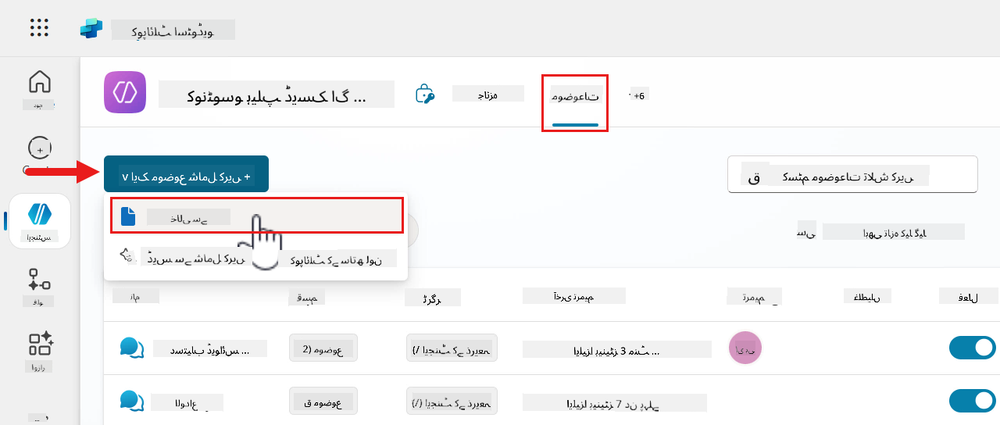

1. موضوع کا نام درج ذیل رکھیں،

    ```text
    Request device
    ```

    ٹرگر کے لیے درج ذیل کو وضاحت کے طور پر درج کریں۔

    ```text
    This topic helps users request a device when they answer yes to the question that asks the user if they would like to request one of these devices.
    ```

    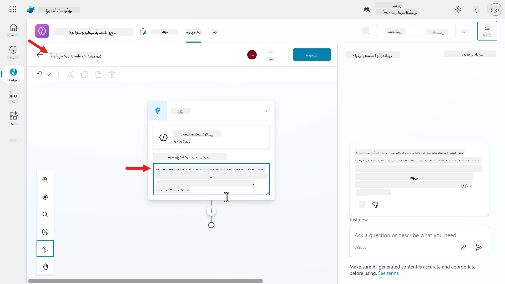
1. اگلا مرحلہ، **Ask with adaptive card** نوڈ شامل کریں۔ یہ نوڈ ایک انٹرایکٹو کارڈ دکھائے گا جس میں صارف منتخب کرے گا کہ وہ کون سا ڈیوائس درخواست کرنا چاہتے ہیں۔

    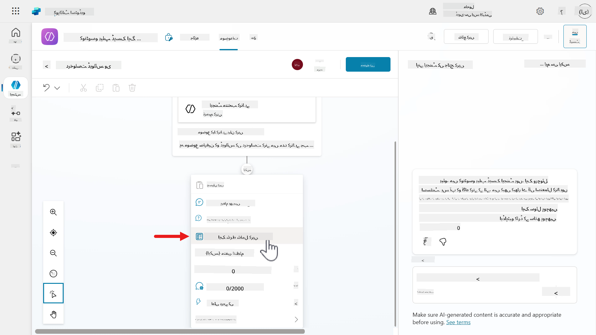

1. نوڈ منتخب کریں اور **Adaptive Card Node properties** پین ظاہر ہوگا۔ اب ہم JSON کو ایڈٹ کریں گے۔ **Edit adaptive card** منتخب کریں۔ **Edit adaptive card** منتخب کریں۔

    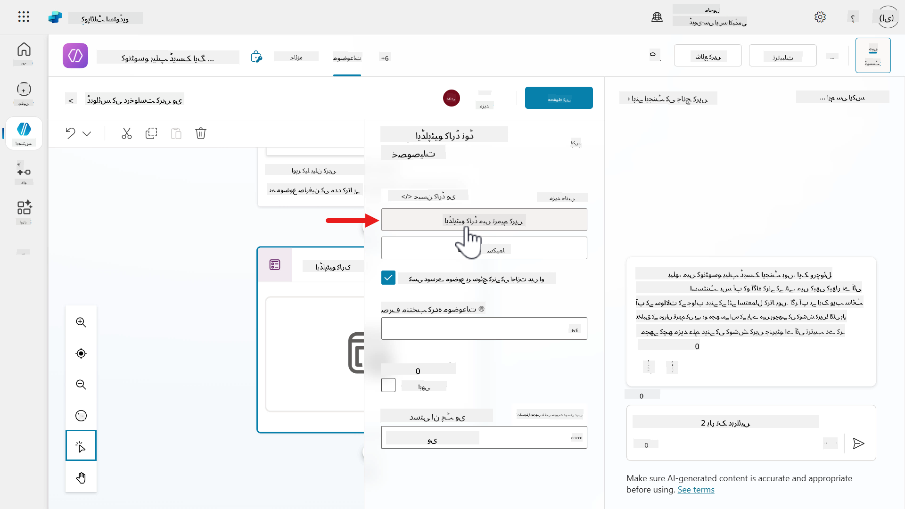

1. یہ **Adaptive Card Designer** ہے جہاں آپ اپنے کارڈ کو ڈیزائن کر سکتے ہیں اور کارڈ ڈیزائن کو حقیقی وقت میں دیکھ سکتے ہیں۔

    **TextBlock** اور **FactSet** کارڈ عناصر کو مصنف کینوس، کارڈ ویور ایریا میں ڈریگ اور ڈراپ کرنے کی کوشش کریں۔ دیکھیں کہ کارڈ کی ساخت اور کارڈ پے لوڈ ایڈیٹر کیسے اپ ڈیٹ ہوتا ہے جب یہ دو کارڈ عناصر شامل کیے جاتے ہیں۔ آپ کارڈ پے لوڈ ایڈیٹر اور عنصر پراپرٹیز پین کو براہ راست اپ ڈیٹ کر سکتے ہیں۔

    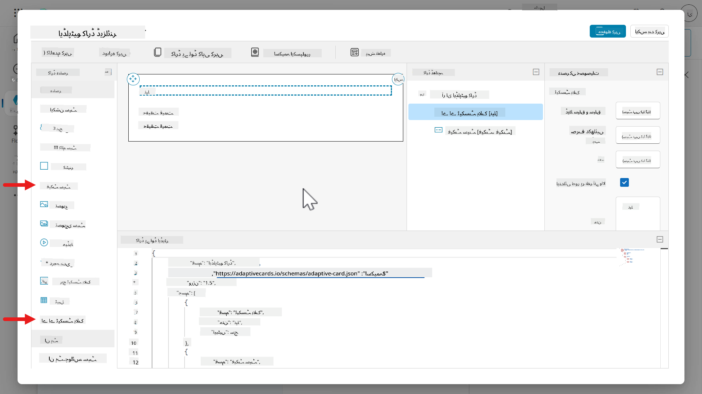

1. مختلف چوڑائیوں میں کارڈ دیکھنے کے لیے **Preview** منتخب کریں۔

    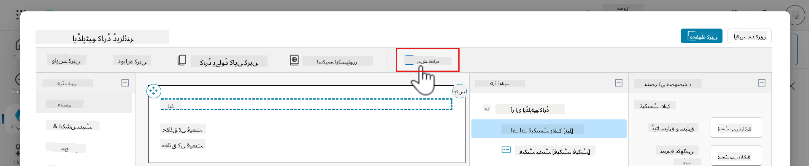

1. پریویو لوڈ ہوگا جہاں آپ مختلف چوڑائیوں کے حساب سے کارڈ آؤٹ پٹ دیکھیں گے۔

    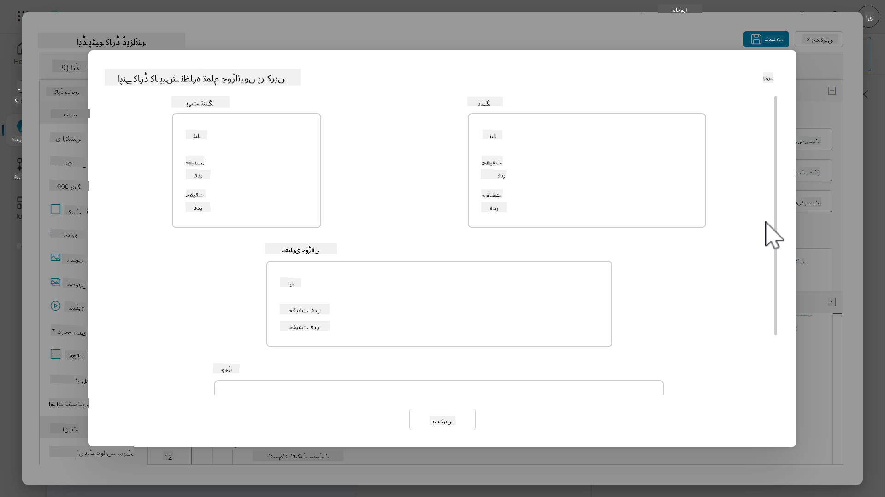

1. **Preview** سے باہر نکلیں **x icon** منتخب کرکے اور ڈیزائنر میں **Undo** منتخب کریں تاکہ پہلے شامل کیے گئے دو کارڈ عناصر کو ہٹا سکیں۔

    

1. **Card payload editor** میں جائیں اور ونڈوز کی بورڈ شارٹ کٹ _Ctrl + A_ یا میک کی بورڈ شارٹ کٹ _Command + A_ استعمال کرتے ہوئے تمام لائنیں منتخب کریں، پھر لائنیں حذف کریں۔ [Request devices .JSON file](../../../../../docs/recruit/08-add-adaptive-card/assets/8.1_RequestDevice.json) سے JSON **Paste** کریں۔

    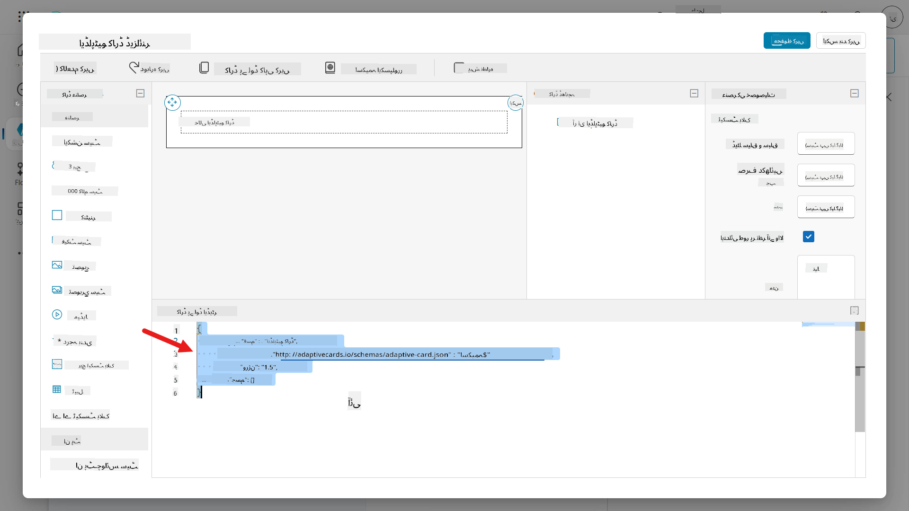

1. دیکھیں کہ **Card Preview** میں اب ایسے عناصر شامل ہیں جو کچھ متن اور دستیاب ڈیوائسز کی فہرست دکھاتے ہیں۔

    یہ JSON فی الحال ایک پلیس ہولڈر اور پریویو ہے جو ہم اپنے کارڈ کے لیے بیس کے طور پر استعمال کریں گے لیکن JSON کی بجائے فارمولے کی شکل میں کیونکہ ہم **global variable**, `Global.VarDevices.value` کا حوالہ دیں گے، جو **Get items** SharePoint کنیکٹر ایکشن کے جواب کو اسٹور کرتا ہے۔

    **Save** منتخب کریں اور **Close** منتخب کریں تاکہ Adaptive card designer موڈل سے باہر نکل سکیں۔

    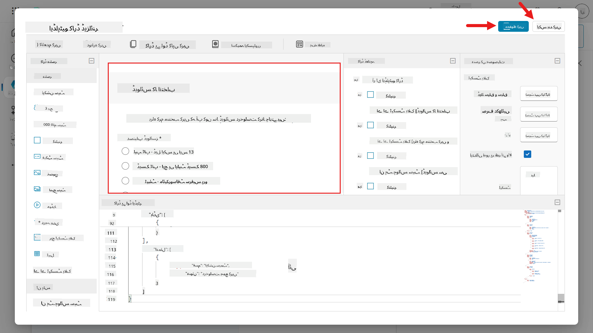

1. **Adaptive Card Node properties** پینل کو **X** آئیکن منتخب کرکے بند کریں۔

    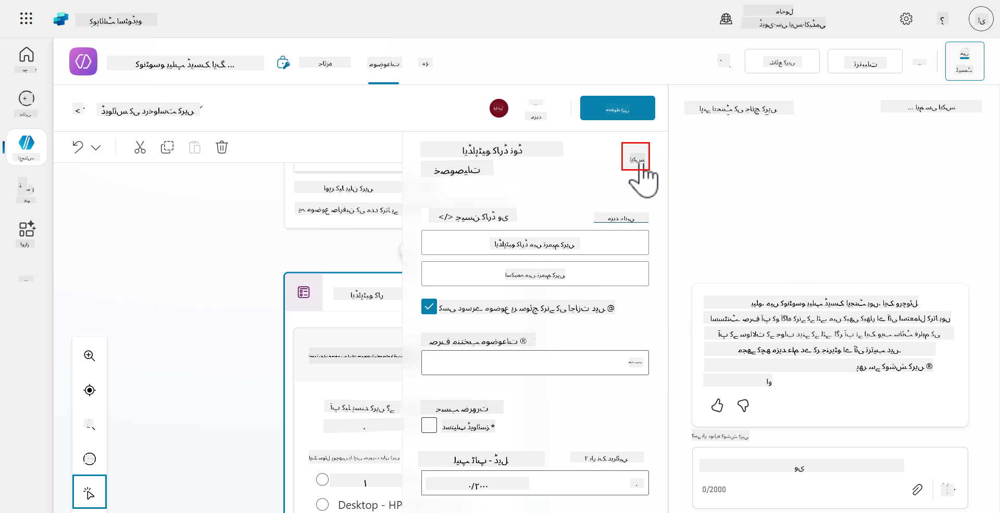

1. موضوع کے مصنف کینوس میں، آپ adaptive card دیکھیں گے۔

    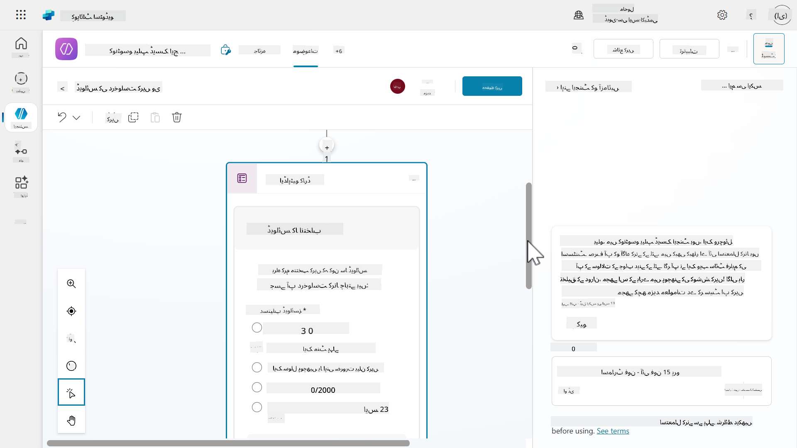

1. نوڈ کے نیچے اسکرول کریں اور آپ آؤٹ پٹ ویریبلز دیکھیں گے۔ `commentsId` اور `deviceSelectionId` عنصر پراپرٹیز میں ڈیفائن کیے گئے تھے۔ یہ دو ویریبلز کارڈ عناصر سے ویلیوز اسٹور کریں گے جن کے ساتھ صارفین انٹرایکٹ کرتے ہیں۔ یہ ویلیوز موضوع میں نیچے استعمال ہوں گی، جس کے بارے میں ہم اگلے سبق کی لیب میں سیکھیں گے۔

    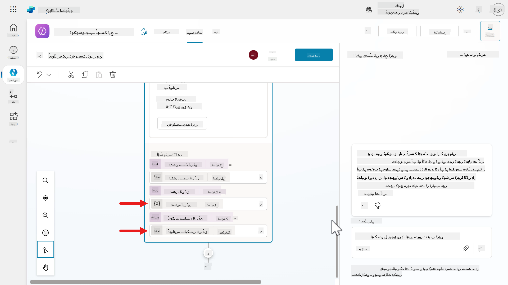

1. آئیے اب JSON سے فارمولے میں کارڈ کو اپ ڈیٹ کریں کیونکہ ہم دوبارہ Power Fx استعمال کریں گے تاکہ **Get items** SharePoint کنیکٹر ایکشن میں واپس آنے والے آئٹمز کو لوپ کریں، جو **global variable**, `Global.VarDevices.value` میں اسٹور کیے گئے ہیں، JSON جواب کی `value` پراپرٹی کے ذریعے۔

    > ہم نے یہ global variable [Lab 07 - Add a new topic with conversation nodes, 7.3 Add a tool using a connector](../07-add-new-topic-with-trigger/README.md#73-add-a-tool-using-a-connector) میں بنایا تھا۔

    **Ask with Adaptive Card** نوڈ میں کارڈ منتخب کریں، پھر **chevron** آئیکن منتخب کریں اور **Formula** منتخب کریں۔

    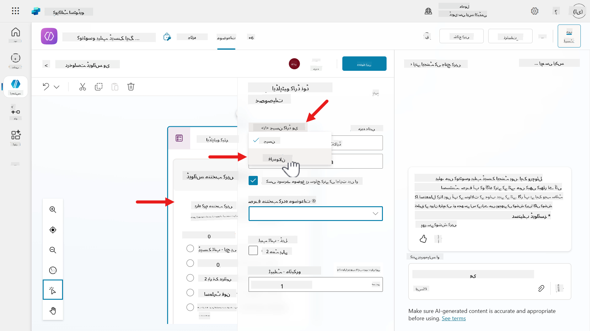

1. فارمولے فیلڈ کو بڑا کرنے کے لیے **expand** آئیکن پر کلک کریں۔

    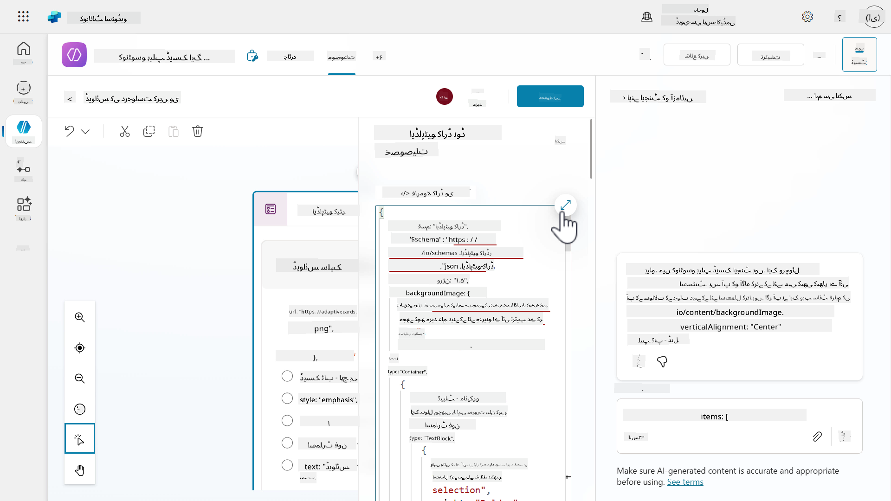

1. **Card payload editor** میں جائیں اور ونڈوز کی بورڈ شارٹ کٹ _Ctrl + A_ یا میک کی بورڈ شارٹ کٹ _Command + A_ استعمال کرتے ہوئے تمام لائنیں منتخب کریں، پھر لائنیں حذف کریں۔

    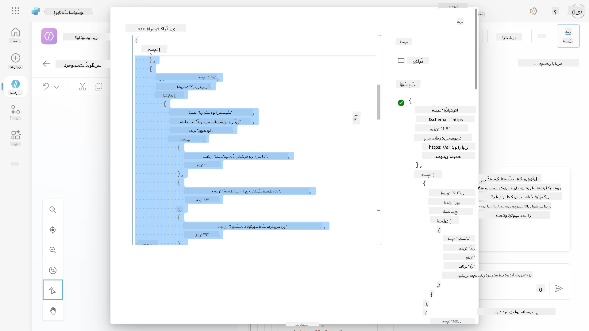

    [Request Devices formula file](../../../../../docs/recruit/08-add-adaptive-card/assets/8.1_RequestDeviceFormula.txt) سے فارمولہ Paste کریں۔

1. فارمولے میں، ہم `For All` فنکشن کا استعمال کرتے ہوئے ہر SharePoint لسٹ آئٹم کو لوپ کریں گے تاکہ `Model` کی ویلیوز کو چوائس آپشن کے ٹائٹل میں دکھایا جا سکے، اور SharePoint آئٹم `ID` کو ویلیو کے طور پر حوالہ دیا جائے۔ ہم ویلیوز کو `If(IsBlank()` فنکشنز کے ساتھ لپیٹ رہے ہیں کیونکہ فارمولہ ایک ویلیو کی توقع کرتا ہے تاکہ موضوع کے مصنف کینوس میں adaptive card کو رینڈر کیا جا سکے۔ ورنہ آپ کو ایک پیغام نظر آئے گا، "Property cannot be null"

    **Close** کارڈ موڈل۔

    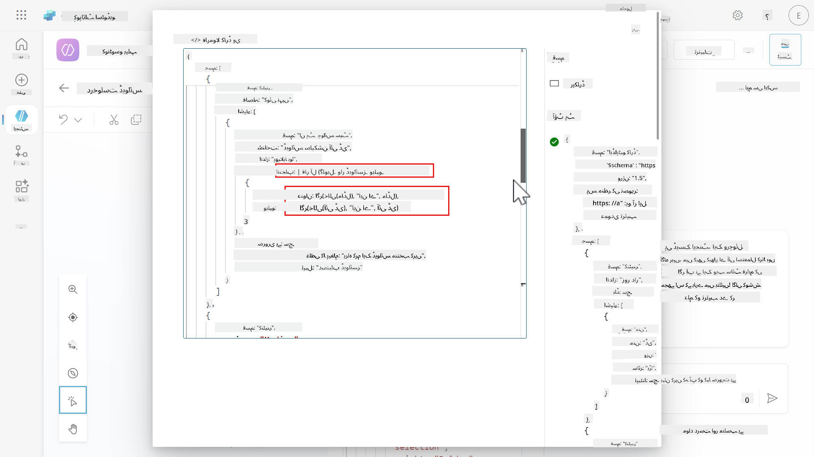

1. **Adaptive Card Node properties** پین بند کریں۔

1. موضوع **Save** کریں۔

    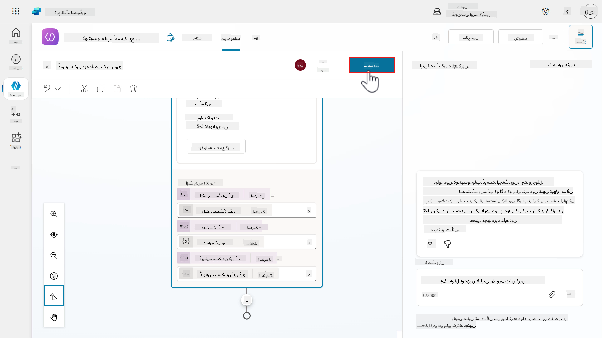

### 8.2 ایجنٹ ہدایات کو اپ ڈیٹ کریں تاکہ Request device موضوع کو انووک کریں

اب جب کہ ہم نے نیا موضوع بنایا ہے جو ڈیوائس درخواستوں کو ہینڈل کرتا ہے، ہمیں **ایجنٹ ہدایات** کو اپ ڈیٹ کرنے کی ضرورت ہے تاکہ موضوع کو انووک کیا جا سکے۔

1. **Overview** ٹیب منتخب کریں اور **ایجنٹ ہدایات** میں **Edit** منتخب کریں۔

    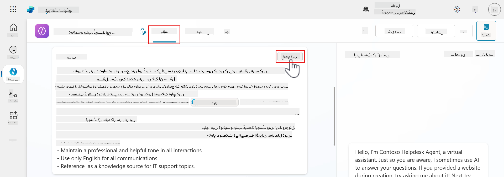

1. [Lab 07 - Add a new topic with conversation nodes, 7.3 Add a tool using a connector](../07-add-new-topic-with-trigger/README.md#73-add-a-tool-using-a-connector) سے پچھلی ہدایت کے نیچے ایک نئی لائن شامل کریں۔

    ```text
    - If the user answers yes to the question of requesting a device, trigger [Request device]. Otherwise if they answer no to the question of requesting a device, trigger [Goodbye].
    ```

    مربع بریکٹس میں پورے موضوع پلیس ہولڈر کو منتخب کریں اور پلیس ہولڈر حذف کریں۔

    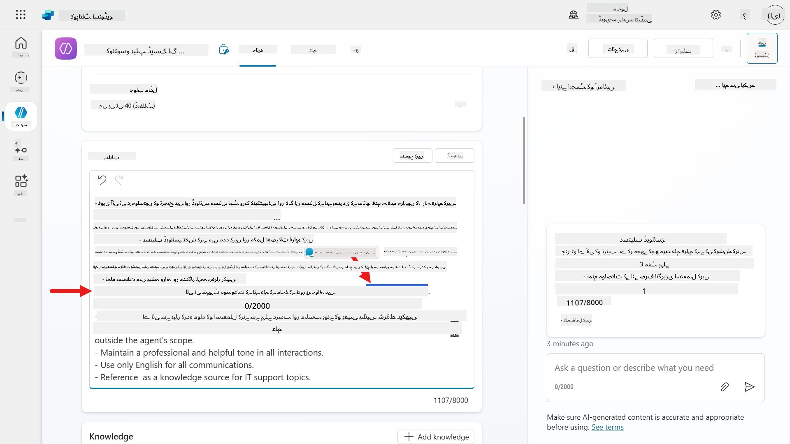

1. `/Req` ٹائپ کریں اور **Request devices** موضوع منتخب کریں۔

    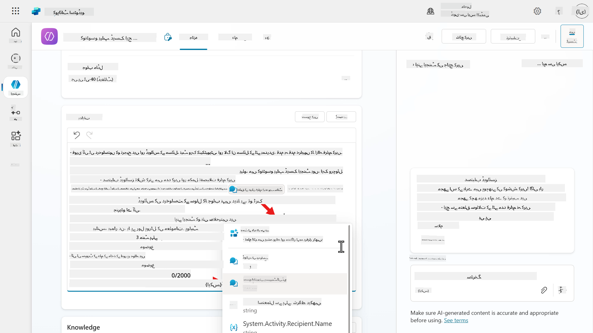

1. اگلے موضوع پلیس ہولڈر، **[Goodbye]** کے لیے وہی مراحل دہرائیں۔ مربع بریکٹس میں پورے موضوع پلیس ہولڈر کو منتخب کریں اور پلیس ہولڈر حذف کریں۔ `/Goodbye` ٹائپ کریں اور **Goodbye** موضوع منتخب کریں۔

    - جب صارف ایجنٹ کے سوال کا جواب **Yes** دیتا ہے کہ آیا وہ ڈیوائس درخواست کرنا چاہتے ہیں، تو ایجنٹ **Available devices** موضوع سے **Request devices** موضوع پر ری ڈائریکٹ کرے گا۔

    - ورنہ اگر صارف جواب **No** دیتا ہے، تو ایجنٹ **Available devices** موضوع سے **Goodbye** موضوع پر ری ڈائریکٹ کرے گا۔

    اپ ڈیٹ شدہ ہدایات **Save** کریں۔

    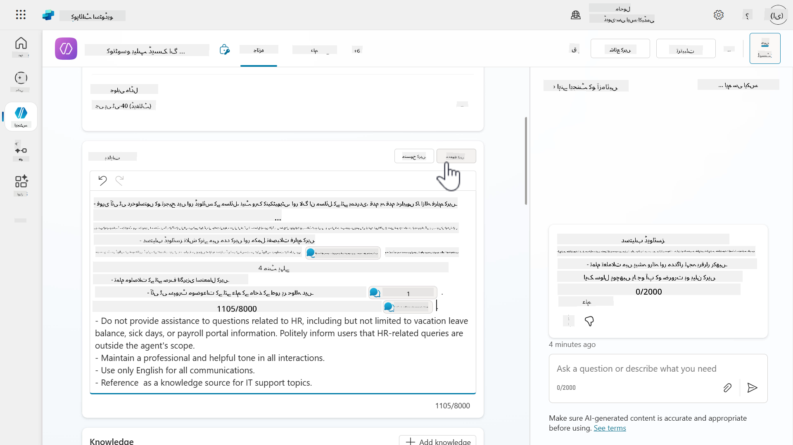

1. آئیے اب _Available devices_ موضوع سے _Request devices_ موضوع پر ری ڈائریکشن کا ٹیسٹ کریں۔ **Test** منتخب کریں تاکہ ٹیسٹنگ پین لوڈ ہو اور **Refresh** منتخب کریں۔

    پھر ٹیسٹ پین میں **Activity map** آئیکن منتخب کریں، اس کے بعد **Track between topics** کو فعال کریں۔ یہ ہمیں دکھائے گا کہ _Available devices_ موضوع _Request devices_ موضوع پر ری ڈائریکٹ ہوا ہے۔

    ٹھیک ہے، ہم ٹیسٹ کرنے کے لیے تیار ہیں! ٹیسٹ پین میں درج ذیل درج کریں۔

    ```text
    I need a laptop
    ```

    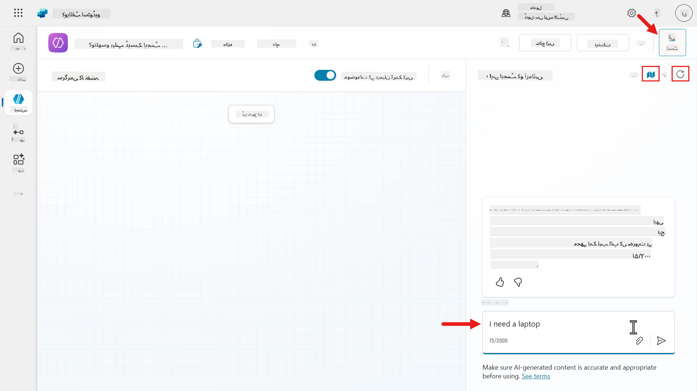

1. ایجنٹ دستیاب ڈیوائسز کی فہرست کے ساتھ جواب دے گا اس کے بعد صارف سے سوال کرے گا کہ آیا وہ ڈیوائس درخواست کرنا چاہتے ہیں۔ درج ذیل کو کاپی اور پیسٹ کریں،

    ```text
    yes please
    ```

    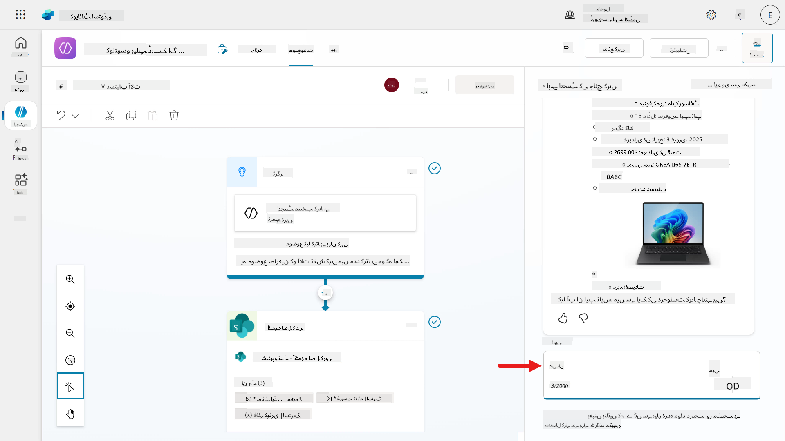

1. ہم اگلے دیکھیں گے کہ ایجنٹ **Request device** موضوع پر ری ڈائریکٹ ہو گیا ہے۔ ایجنٹ نے یہ موضوع انووک کیا جیسا کہ ہم نے ہدایات میں شامل کیا تھا۔

    انٹرایکٹو عناصر کے ساتھ adaptive card اب صارف کو پیغام کے طور پر دکھایا جائے گا۔

    

1. ہم نے کامیابی سے ٹیسٹ کیا 😄 کہ ہمارا _Available devices_ موضوع _Request devices_ موضوع پر ری ڈائریکٹ ہو رہا ہے۔ ہم اگلے سبق کی لیب میں اس موضوع میں مزید بہتریاں شامل کریں گے۔

    ٹیسٹ پین کو ریفریش کریں۔

    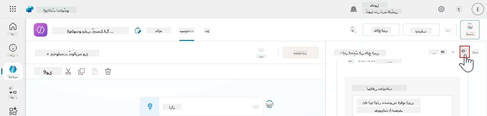

## ✅ مشن مکمل

مبارک ہو! 👏🏻 آپ نے سیکھا کہ Power Fx فارمولے استعمال کرتے ہوئے متغیرات سے ڈیٹا دکھانے کے لیے adaptive cards کیسے شامل کیے جاتے ہیں، اور آپ نے یہ بھی سیکھا کہ ایک موضوع سے دوسرے موضوع پر ری ڈائریکٹ کیسے کیا جاتا ہے۔ چھوٹے چھوٹے موضوعات بنانا آپ کے ایجنٹ کو زیادہ منظم بناتا ہے، بلکہ صارفین کو ایجنٹ کے ساتھ گفتگو کے مختلف حصوں کے ذریعے رہنمائی کرنے میں بھی مدد کرتا ہے۔

یہ **Lab 08 - Enhance user interactions with Adaptive Cards** کا اختتام ہے، نیچے دیے گئے لنک کو منتخب کریں تاکہ اگلے سبق پر جائیں۔ ہم اس لیب کے استعمال کے کیس کو اگلے سبق کی لیب میں مزید بڑھائیں گے۔

⏭️ [**Add an agent flow to your Topic for automation** سبق پر جائیں](../09-add-an-agent-flow/README.md)

## 📚 حکمت عملی وسائل

🔗 [Using Adaptive Cards in Copilot Studio](https://learn.microsoft.com/microsoft-copilot-studio/guidance/adaptive-cards-overview?WT.mc_id=power-172619-ebenitez)

🔗 [Add an adaptive card in Send a message node](https://learn.microsoft.com/microsoft-copilot-studio/authoring-send-message#add-an-adaptive-card?WT.mc_id=power-172619-ebenitez)

🔗 [Create expressions using Power Fx](https://learn.microsoft.com/microsoft-copilot-studio/advanced-power-fx?WT.mc_id=power-172619-ebenitez)

📺 [Building Adaptive Cards with Power FX](https://aka.ms/ai-in-action/copilot-studio/ep8)


---

**اعلانِ لاتعلقی**:  
یہ دستاویز AI ترجمہ سروس [Co-op Translator](https://github.com/Azure/co-op-translator) کا استعمال کرتے ہوئے ترجمہ کی گئی ہے۔ ہم درستگی کے لیے کوشش کرتے ہیں، لیکن براہ کرم آگاہ رہیں کہ خودکار ترجمے میں غلطیاں یا غیر درستیاں ہو سکتی ہیں۔ اصل دستاویز کو اس کی اصل زبان میں مستند ذریعہ سمجھا جانا چاہیے۔ اہم معلومات کے لیے، پیشہ ور انسانی ترجمہ کی سفارش کی جاتی ہے۔ ہم اس ترجمے کے استعمال سے پیدا ہونے والی کسی بھی غلط فہمی یا غلط تشریح کے ذمہ دار نہیں ہیں۔