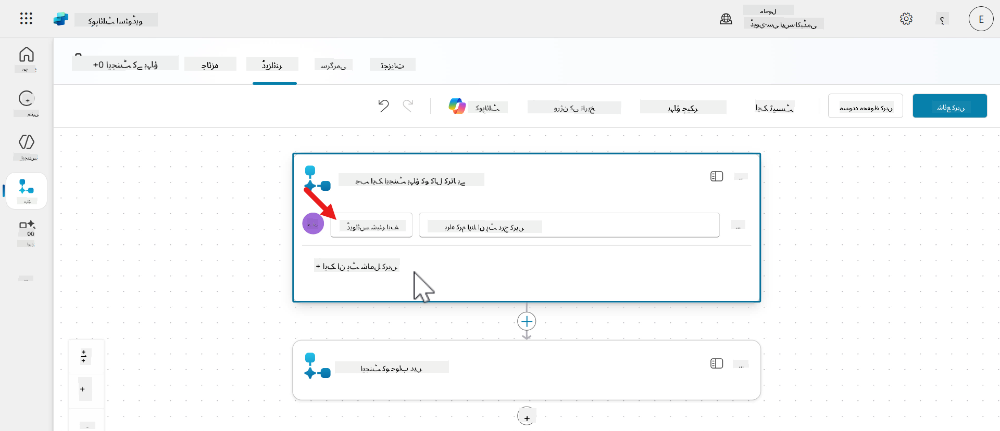
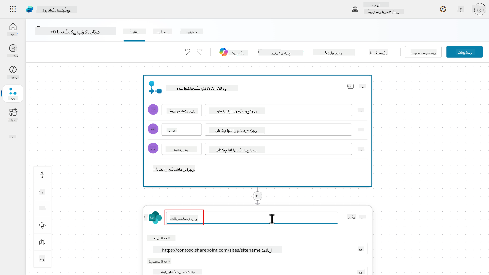
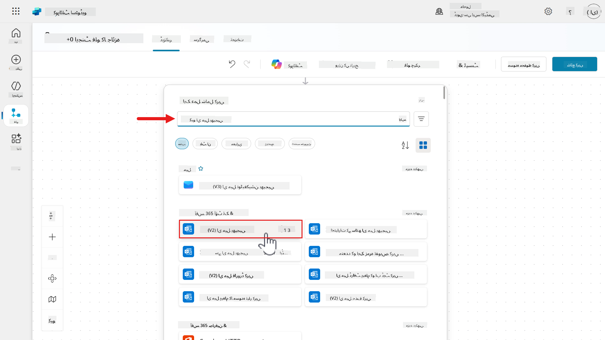
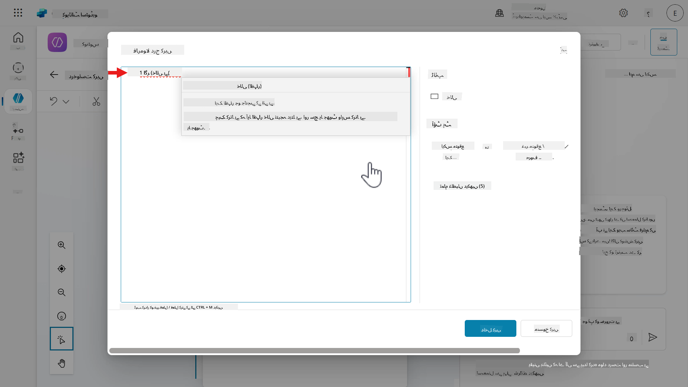
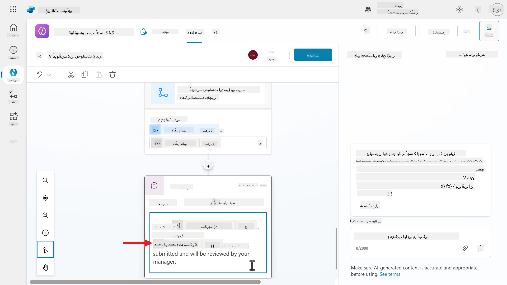
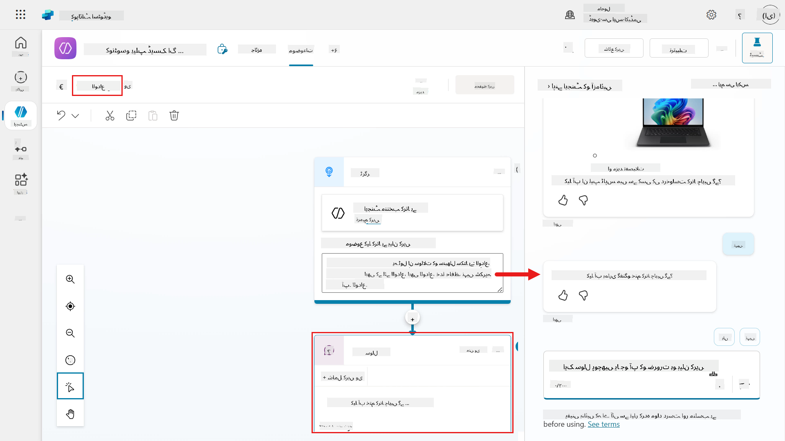

<!--
CO_OP_TRANSLATOR_METADATA:
{
  "original_hash": "cc4afa4a5a11c9d03896decfbcbd4060",
  "translation_date": "2025-10-22T19:27:09+00:00",
  "source_file": "docs/recruit/09-add-an-agent-flow/README.md",
  "language_code": "ur"
}
-->
# 🚨 مشن 09: اپنے موضوع میں ایجنٹ فلو شامل کریں خودکاریت کے لیے

## 🕵️‍♂️ کوڈ نام: `آپریشن آٹومیشن پاور ہاؤس`

> **⏱️ آپریشن کا وقت:** `~30 منٹ`  

🎥 **واچ واک تھرو**

[](https://www.youtube.com/watch?v=vtLZJT3eBXg "یوٹیوب پر واک تھرو دیکھیں")

## 🎯 مشن کا خلاصہ

آپ کا ایجنٹ اب صارفین سے بات چیت کر سکتا ہے اور معلومات فراہم کر سکتا ہے، لیکن حقیقی آپریشنل کمال کے لیے ضروری ہے کہ آپ کا ایجنٹ عمل کرے۔ یہ مشن آپ کے بات چیت کرنے والے ایجنٹ کو ایک خودکاریت کے پاور ہاؤس میں تبدیل کرے گا، جسے ایجنٹ فلو کے ساتھ لیس کیا جائے گا۔

مشن کے اختتام تک، آپ ایک مکمل ڈیوائس درخواست خودکاریت تخلیق کر چکے ہوں گے جو صارف کی معلومات کو ایک ایڈاپٹیو کارڈ کے ذریعے حاصل کرے گا، SharePoint سے ڈیٹا حاصل کرے گا، ای میل کے ذریعے مینیجرز کو نوٹیفیکیشن بھیجے گا، اور صارفین کو بغیر کسی رکاوٹ کے فیڈبیک فراہم کرے گا - یہ سب کچھ آپ کے ایجنٹ کے ذریعے ذہین ورک فلو خودکاریت کے ذریعے منظم ہوگا۔

## 🔎 مقاصد

اس مشن میں، آپ سیکھیں گے:

1. ایجنٹ فلو کیا ہیں اور خودکاریت کے لیے Power Automate کلاؤڈ فلو سے کیسے مختلف ہیں
1. وہ کلیدی خصوصیات جو ایجنٹ فلو کو طاقتور بناتی ہیں، بشمول AI ایکشنز اور قدرتی زبان کی تحریر
1. ایجنٹ فلو ڈیزائنر کو دریافت کرنا اور متحرک ڈیٹا ہینڈلنگ کے لیے ایکسپریشنز کا استعمال کرنا
1. ایک مکمل ڈیوائس درخواست خودکاریت تخلیق کرنا جو SharePoint ڈیٹا اور ای میل نوٹیفیکیشنز کو شامل کرے

## 🤔 ایجنٹ فلو کیا ہے؟

ایجنٹ فلو ایک طاقتور طریقہ ہے جو بار بار ہونے والے کاموں کو خودکار کرنے اور آپ کے ایپس اور سروسز کو مربوط کرنے میں مدد کرتا ہے۔ انہیں ایک منظم، قدم بہ قدم ورک فلو کے طور پر سوچیں جو آپ کا ایجنٹ کاموں کو خودکار کرنے یا دیگر ایپلیکیشنز اور سروسز کے ساتھ جڑنے کے لیے انجام دے سکتا ہے۔ آپ انہیں چھوٹے ورک فلو کے طور پر سوچ سکتے ہیں جو آپ کے ایجنٹ کو نوٹیفیکیشن بھیجنے، ریکارڈز اپ ڈیٹ کرنے، یا ایونٹس کا جواب دینے میں مدد کرتے ہیں۔

خود مختار ایجنٹس کے برعکس جو AI کا استعمال کرتے ہوئے فوری فیصلے کرتے ہیں، ایجنٹ فلو **ڈیٹرمینسٹک ورک فلو** ہیں - یعنی وہ ہر بار ایک ہی راستہ اختیار کرتے ہیں، مستقل اور قابل اعتماد نتائج کو یقینی بناتے ہیں۔

سادہ الفاظ میں:

- وہ آپ کے ایجنٹ کو _کام کرنے_ میں مدد دیتے ہیں، نہ کہ صرف _صارفین سے بات کرنے_ میں۔
- وہ موضوعات اور ایجنٹس کے درمیان دوبارہ استعمال کے قابل ہیں، اور صارف کے پیغامات، ایونٹس، یا دیگر ایپلیکیشنز اور سروسز کے ذریعے متحرک کیے جا سکتے ہیں۔

## 🙋🏽 ہاں، لیکن یہ Power Automate کلاؤڈ فلو سے کیسے مختلف ہے؟

ایجنٹ فلو اور Power Automate کلاؤڈ فلو دونوں کاموں کو خودکار کرنے میں مدد کرتے ہیں۔ وہ مختلف مقاصد کے لیے بنائے گئے ہیں اور مختلف طریقوں سے کام کرتے ہیں۔

### 🤖 Copilot Studio میں ایجنٹ فلو

**یہ کس کے لیے ہیں:**

- Copilot Studio میں بات چیت کرنے والے اور خود مختار ایجنٹس کے لیے بنائے گئے ہیں۔
- ذہین، AI سے چلنے والی خودکاریت پر مرکوز ہیں جو کاروباری نظاموں کے ساتھ تعامل کرتی ہے۔

**یہ کیوں مفید ہیں:**

- Copilot Studio میں براہ راست بنانا اور منظم کرنا آسان ہے۔
- صارفین کے ساتھ بات چیت کے دوران ہونے والے کاموں کو خودکار کرنے کے لیے بہترین، جیسے چھٹی کی درخواست جمع کروانا۔
- آپ کو الگ Power Automate لائسنس کی ضرورت نہیں کیونکہ بلنگ Copilot Studio کے اندر استعمال کی بنیاد پر ہوتی ہے۔ یہ انٹرپرائز ٹیموں کے لیے وقت اور لاگت بچا سکتا ہے۔

**حدود:**

- آپ انہیں شیئر، کاپی، یا کو-اونرز کو تفویض نہیں کر سکتے۔
- ایجنٹ فلو صرف Copilot Studio کے اندر نظر آتے ہیں اور استعمال کیے جا سکتے ہیں۔
- فی الحال، ایجنٹس کے لیے ایونٹ ٹرگرز Power Automate میکر پورٹل میں ایڈٹ کیے جا سکتے ہیں۔

### ☁️ Power Automate کلاؤڈ فلو

**یہ کس کے لیے ہیں:**

- بہت سے ایپس اور سروسز کے درمیان عمومی مقصد کی خودکاریت کے لیے ڈیزائن کیے گئے ہیں۔
- آزادانہ طور پر چل سکتے ہیں یا ایجنٹ فلو کے ساتھ کام کر سکتے ہیں۔

**یہ کیوں مفید ہیں:**

- وسیع رینج کے کنیکٹرز پیش کرتے ہیں۔
- ایجنٹس کے باہر عمل کو خودکار کرنے کے لیے مثالی۔
- ٹیموں کے درمیان شیئر، دوبارہ استعمال، اور منظم کیے جا سکتے ہیں۔

**ضروریات:**

- آپ کو Power Automate لائسنس کی ضرورت ہے۔

### 📗 خلاصہ

| یہ استعمال کریں | جب آپ چاہتے ہیں کہ |
| :- | :- |
| ایجنٹ فلو | ایجنٹ کے اندر کاموں کو خودکار کریں، AI استعمال کریں، اور سب کچھ Copilot Studio میں رکھیں |  
| Power Automate کلاؤڈ فلو | ایپس اور سروسز کے درمیان خودکاریت کریں، یا ایجنٹس کے باہر ورک فلو بنائیں |

## 👍🏻 ایجنٹ فلو کیوں استعمال کریں

ایجنٹ فلو ہمیشہ ایک مقررہ راستہ اختیار کرتے ہیں - وہ ہر بار ایک ہی کام کرتے ہیں جب انہیں ایک ہی ان پٹ دیا جائے۔

یہ انہیں بناتا ہے:

- **قابل اعتماد** - آپ یقین کر سکتے ہیں کہ وہ ہر بار ایک ہی طریقے سے کام کریں گے۔
- **پیش گوئی کے قابل** - آپ جانتے ہیں کہ جب فلو چلتا ہے تو کیا نتیجہ متوقع ہے۔
- **قواعد پر مبنی** - وہ وہی اقدامات کرتے ہیں جو آپ نے متعین کیے ہیں۔

دیگر فوائد ہیں:

- **خودکاریت** - آپ کے ایجنٹ کو بار بار ہونے والے کاموں کو سنبھالنے کے قابل بناتا ہے جیسے فارم جمع کروانا یا نوٹیفیکیشن بھیجنا۔
- **مربوط** - ServiceNow، SharePoint، Salesforce جیسے 1400+ کنیکٹرز کے ساتھ جڑیں۔ ورنہ آپ اپنا کسٹم کنیکٹر بنا سکتے ہیں۔
- **مضبوطی سے مربوط** - ایجنٹ فلو ایجنٹ کی منطق کا حصہ ہیں، وہ صارف کے پیغامات یا بات چیت میں اقدامات کے ذریعے براہ راست متحرک ہوتے ہیں۔
- **اسکیل ایبلٹی** - متعدد ایجنٹس یا منظرناموں کے درمیان فلو کو دوبارہ استعمال کریں۔
- **کوڈ کے بغیر یا کم کوڈ** - آپ قدرتی زبان یا بصری ڈیزائنر کا استعمال کرتے ہوئے فلو بنا سکتے ہیں۔
- **آل ان ون پلیٹ فارم** - آپ Copilot Studio میں ایک ہی جگہ پر ایجنٹ فلو کو ڈیزائن، ٹیسٹ اور تعینات کر سکتے ہیں۔ پلیٹ فارمز کے درمیان سوئچ کرنے کی ضرورت نہیں۔

## 🏄🏻‍♂️ ایجنٹ فلو آپ کے ایجنٹ کو کیسے بہتر بناتے ہیں؟

ایجنٹ فلو آپ کے ایجنٹ کی صلاحیتوں کو صارفین کے ساتھ "بات چیت" کرنے سے آگے بڑھاتے ہیں۔ وہ اسے عمل کرنے اور نظاموں کے ساتھ تعامل کرنے کی اجازت دیتے ہیں۔

فرض کریں کہ آپ فنانس ڈیپارٹمنٹ میں کام کر رہے ہیں اور آپ کو وینڈرز سے بہت سے انوائسز موصول ہوتے ہیں۔ عام طور پر، کسی کو ہر انوائس کو پڑھنا پڑتا ہے، اہم تفصیلات نکالنی پڑتی ہیں - رقم، تاریخ، کس نے بھیجا، اور چیک کرنا پڑتا ہے کہ سب کچھ آپ کے ریکارڈز سے مطابقت رکھتا ہے۔ پھر اسے منظوری کے لیے صحیح شخص کو بھیجنا پڑتا ہے۔ یہ وقت اور محنت لیتا ہے۔

Copilot Studio میں ایجنٹ فلو کے ساتھ، آپ اس عمل کو خودکار کر سکتے ہیں۔ جیسے ہی انوائس آتی ہے، ایجنٹ:

1. ذہین دستاویز پروسیسنگ کا استعمال کرتے ہوئے دستاویز کو پڑھتا ہے اور اہم معلومات تلاش کرتا ہے۔
1. آپ کے انٹرپرائز ڈیٹا کے خلاف تفصیلات چیک کرتا ہے تاکہ یہ یقینی بنایا جا سکے کہ سب کچھ درست ہے۔
1. اسے منظوری کے لیے صحیح شخص کو بھیجتا ہے۔

یہ وقت بچاتا ہے، غلطیوں کو کم کرتا ہے اور پورے عمل کو زیادہ ہموار بناتا ہے۔

### اس طرح سوچیں

- **ایجنٹس**: ذہین فیصلہ ساز
- **ایجنٹ فلو**: قابل اعتماد عمل کرنے والے

### یہ کیوں اہم ہے

- آپ کو دونوں دنیاوں کا بہترین فائدہ ملتا ہے: قابل اعتماد خودکاریت اور لچکدار AI۔
- جیسے جیسے آپ کے کاروباری ضروریات بدلتی ہیں، فلو کو بنانا اور اپ ڈیٹ کرنا آسان ہے۔
- آپ ٹیموں کے درمیان خودکاریت کو بڑھا سکتے ہیں۔

## 🔌 وہ کلیدی خصوصیات جو ایجنٹ فلو کو طاقتور بناتی ہیں

1. **قدرتی زبان کی تحریر**
    - آپ جو چاہتے ہیں وہ سادہ اردو میں بیان کر سکتے ہیں۔
    - Copilot آپ کے ارادے کو سمجھتا ہے اور آپ کے لیے فلو بناتا ہے۔
    - کوڈ لکھنے کی ضرورت نہیں - صرف اپنا خیال بیان کریں۔

1. **AI ایکشنز**

    AI کا استعمال کریں:

    - دستاویزات یا تصاویر کو پڑھنے اور سمجھنے کے لیے۔
    - طویل مواد کو مختصر، مفید جوابات میں خلاصہ کرنے کے لیے۔
    - ذہین سفارشات یا فیصلے کرنے کے لیے۔

1. **جنریٹو ایکشنز**
    - یہ فلو کو حقیقی وقت میں ڈھالنے کی اجازت دیتے ہیں۔
    - ایجنٹ بدلتی معلومات کی بنیاد پر اقدامات کی منصوبہ بندی اور ایڈجسٹ کر سکتا ہے۔

1. **انٹیگریشن ایکشنز**
    - اپنے فلو کو دیگر ٹولز جیسے Outlook، Microsoft Teams، ServiceNow، SharePoint اور دیگر ایپلیکیشنز اور سروسز سے جوڑیں، 1400+ بلٹ ان کنیکٹرز یا اپنے کسٹم کنیکٹر کے ذریعے۔
    - یہ آپ کے ایجنٹ کو ان ایپس کے ساتھ کام کرنے میں مدد کرتا ہے جو آپ کی ٹیم پہلے سے استعمال کر رہی ہے۔

1. **انسانی مداخلت**
    - منظوری کے مراحل شامل کریں جہاں کسی شخص کو کچھ جائزہ لینے یا تصدیق کرنے کی ضرورت ہو۔
    - [ایڈوانسڈ اپروولز](https://learn.microsoft.com/microsoft-copilot-studio/flows-advanced-approvals?WT.mc_id=power-172621-ebenitez) یاد دہانی، ڈیلیگیشن، اور ملٹی اسٹیج اپروولز کو سپورٹ کرتا ہے۔

## ⚙️ وہ کیسے کام کرتے ہیں

1. **ٹرگر**

    ایک ایونٹ فلو کو شروع کرتا ہے - جیسے صارف کا سوال پوچھنا، فلو کو کسی موضوع سے متحرک کرنا، مقررہ وقت، یا کسی دوسرے نظام میں ایونٹ ہونا۔

1. **ایکشنز**

    یہ وہ اقدامات ہیں جو ایجنٹ اگلے انجام دیتا ہے - ای میل بھیجنا، API کال کرنا، ServiceNow میں ٹکٹ اپ ڈیٹ کرنا۔

## 🧶 ایجنٹ فلو کیسے بنائیں

1. **قدرتی زبان**: بیان کریں کہ آپ چاہتے ہیں کہ ایجنٹ کیا کرے، اور Copilot اسے آپ کے لیے بناتا ہے۔
1. **ڈیزائنر کینوس**: ایجنٹ فلو ڈیزائنر میں ایکشنز، کنڈیشنز، اور لوپس کو ڈریگ اور ڈراپ کریں تاکہ اپنا ایجنٹ فلو بنائیں۔

## 🎨 ایجنٹ فلو ڈیزائنر کیا ہے؟

یہ Copilot Studio میں ایک بصری ٹول ہے جو آپ کو ایجنٹ فلو بنانے، ایڈٹ کرنے، اور منظم کرنے میں مدد کرتا ہے جو قدم بہ قدم ہدایات فراہم کرتا ہے جو آپ کا ایجنٹ کام مکمل کرنے کے لیے فالو کرتا ہے۔ یہ استعمال کرنے میں آسان ہے، چاہے آپ ایجنٹ فلو کے لیے نئے ہوں۔

### ایجنٹ فلو ڈیزائنر کی کلیدی خصوصیات

1. **بصری کینوس**
    - آپ اپنا پورا فلو ایک ڈایاگرام کی طرح دیکھ سکتے ہیں۔
    - آسانی سے زوم ان/آؤٹ کریں، ویو کو فٹ کریں یا بڑے فلو کو نیویگیٹ کرنے کے لیے منی میپ استعمال کریں۔

1. **ایکشنز شامل اور ہٹائیں**
    - _پلس (+)_ بٹن پر کلک کریں تاکہ نیا ایکشن شامل کریں جیسے پیغام بھیجنا یا SharePoint لسٹ میں آئٹم اپ ڈیٹ کرنا۔
    - آپ کنیکٹرز سے ایکشنز تلاش کر سکتے ہیں، اور ان کی سیٹنگز کے ذریعے انہیں کنفیگر کر سکتے ہیں۔
    - ایکشن کو ہٹانے کے لیے، _تین نقطے (⋮)_ پر کلک کریں اور _ڈیلیٹ_ منتخب کریں۔

1. **پیرامیٹرز چیک کریں**
    - کسی بھی ایکشن پر کلک کریں تاکہ اس کی سیٹنگز کو دیکھیں یا ایڈٹ کریں جنہیں _پیرامیٹرز_ کہا جاتا ہے۔
    - آپ دستی طور پر ویلیوز داخل کر سکتے ہیں یا انہیں متحرک بنانے کے لیے _ایکسپریشنز_ استعمال کر سکتے ہیں۔

1. **ورژن ہسٹری**
    - ہر بار جب آپ اپنا فلو محفوظ کرتے ہیں، ایک ورژن ریکارڈ کیا جاتا ہے۔
    - آپ واپس جا کر پچھلے ورژن کو دیکھ یا بحال کر سکتے ہیں۔

1. **ایرر چیکنگ**
    - _فلو چیکر_ کسی بھی ایرر کو نمایاں کرتا ہے۔
    - فلو کو شائع کرنے سے پہلے تمام ایررز کو حل کرنا ضروری ہوگا۔

1. **پبلش اور ٹیسٹ**
    - ایک بار جب آپ کا فلو ایرر فری ہو، اسے لائیو کرنے کے لیے پبلش کریں۔
    - _ٹیسٹ_ فیچر کا استعمال کریں تاکہ اپنے فلو کو دستی یا خودکار طور پر چلائیں، اور چیک کریں کہ آیا یہ توقع کے مطابق کام کرتا ہے۔

### ایجنٹ فلو ڈیزائنر کیوں استعمال کریں؟

- **بصری اور بدیہی** - آپ فلو کو ڈریگ اور کلک کر کے بنا سکتے ہیں۔
- **تجربہ کرنے کے لیے محفوظ** - ورژن ہسٹری آپ کو تبدیلیاں واپس لینے دیتی ہے۔
- **بلٹ ان ٹیسٹنگ** - آپ کو یہ یقینی بنانے میں مدد کرتا ہے کہ سب کچھ لائیو ہونے سے پہلے کام کرتا ہے۔

## 🔤 آپ نے _ایکسپریشنز_ کا ذکر کیا - ایکسپریشنز کیا ہیں؟

ایکسپریشنز چھوٹے فارمولے یا کمانڈز ہیں جو آپ کے ایجنٹ فلو کو ڈیٹا کے ساتھ کام کرنے میں مدد کرتے ہیں۔ آپ انہیں ویلیوز کا حساب لگانے، ٹیکسٹ فارمیٹ کرنے، فیصلے کرنے، یا ان پٹس سے مخصوص معلومات نکالنے کے لیے استعمال کرتے ہیں۔

### ایکسپریشنز کیوں استعمال کریں؟

ایکسپریشنز آپ کو اجازت دیتے ہیں:

- **ڈیٹا کو ہینڈل کرنے کا طریقہ حسب ضرورت بنائیں** - ناموں کو جوڑیں، تاریخوں کو فارمیٹ کریں۔
- **فیصلے کریں** - اگر ویلیو 10 سے زیادہ ہے، تو کچھ کریں۔
- **ڈیٹا کو تبدیل کریں** - ٹیکسٹ کو لوئر کیس میں تبدیل کریں، اسٹرنگ کا حصہ نکالیں۔
- **منطق کو خودکار کریں** - مکمل کوڈ لکھے بغیر۔

### ایکسپریشنز کیسے دکھتے ہیں؟

ایکسپریشنز فنکشنز استعمال کرتے ہیں۔ میں سابق Microsoft MVP، جیری وین اسٹاک کی وضاحت سے فنکشنز کے بارے میں وضاحت لینے جا رہا ہوں۔

!!! quote
    فنکشنز بلٹ ان منطق ہیں جو آپ کے ڈیٹا کو آپ کے ایکسپریشن میں سادہ یا پیچیدہ آپریشنز کے ذریعے تبدیل کرتی ہیں۔

فنکشنز آپ کو کوڈ لکھے بغیر ایکسپریشنز بنانے کی اجازت دیتے ہیں۔

جس طرح میں اسے بیان کرنا پسند کرتا ہوں، وہ یہ ہے کہ ایجنٹ فلو میں فنکشنز Excel فنکشنز کی طرح ہیں۔ آپ ڈیٹا پر آپریشن کر سکتے ہیں تاکہ اسے مطلوبہ آؤٹ پٹ میں تبدیل کیا جا سکے۔ Excel میں فارمولا بناتے وقت آپ ٹیبل یا رینج میں سیلز سے ان پٹ ویلیو منتخب کرتے ہیں، اور پھر ڈیٹا آؤٹ پٹ کو تبدیل کرنے کے لیے فنکشنز کا اطلاق کرتے ہیں۔ ایک مثال `COUNT` فنکشن کا استعمال ہے تاکہ معلوم کیا جا سکے کہ رینج میں کتنے سیلز میں نمبر موجود ہیں۔

ایجنٹ فلو میں، ٹیبل میں سیلز سے ڈیٹا کا حوالہ دینے کے بجائے، آپ ٹرگر یا ایکشنز کے ڈیٹا آؤٹ پٹس کا حوالہ دیتے ہیں جب آپ اپنے ایکسپریشنز بنا رہے ہوتے ہیں۔ پچھلی مثال کو جاری رکھتے ہوئے، فنکشن `length` کا استعمال کریں تاکہ _Get items_ SharePoint کنیکٹر ایکشن سے واپس آنے والے آئٹمز کی تعداد حاصل کریں۔

### فنکشنز کیوں اہم ہیں؟

فنکشنز آپ کے ایجنٹ فلو کو بناتے ہیں:

- **زیادہ ذہین** - وہ مختلف ان پٹس یا کنڈیشنز پر ردعمل دے سکتے ہیں۔
- **لچکدار** - آپ ڈیٹا کو ہینڈل کرنے کا طریقہ حسب ضرورت بنا سکتے ہیں۔
- **موثر** - آپ منطق کو خودکار کر کے دستی مراحل
- مثال: `addDays(utcNow(), 7)` کا نتیجہ 7 دن بعد کا ہوگا۔

- `formatDateTime()` - تاریخ کو پڑھنے کے قابل سٹرنگ میں تبدیل کرتا ہے۔
  - مثال: پیر، 7 جولائی، 2025

#### ✅ منطقی

- `if()` - اگر شرط درست ہو تو ایک ویلیو چلائیں، ورنہ دوسری۔
  - مثال: `if(score > 50, 'Pass', 'Fail')`

- `equals()` - چیک کرتا ہے کہ دو ویلیوز ایک جیسی ہیں یا نہیں۔

- `and()`, `or()`, `not()` - متعدد شرائط کو یکجا کریں۔

#### 🪣 دیگر مفید فنکشنز

- `coalesce()` - پہلی غیر خالی ویلیو واپس کرتا ہے۔
  - بیک اپ/ڈیفالٹ ویلیوز کے لیے مفید۔

- `guid()` - ایک منفرد ID بناتا ہے۔
  - ٹریکنگ یا لاگنگ کے لیے مفید۔

- `length()` - سٹرنگ یا آرے میں کتنے کریکٹرز یا آئٹمز ہیں، گنتا ہے۔

## ⭐ بہترین طریقے

یہاں کچھ بہترین طریقے ہیں جو آپ کو Copilot Studio میں ایجنٹ فلو بنانے میں مدد کریں گے۔

1. **سادہ شروع کریں اور آہستہ آہستہ ترقی کریں**

   - ایک چھوٹے، واضح کام سے شروع کریں جیسے کہ ایک پیغام بھیجنا۔
   - اپنی آٹومیشن کی بنیادی چیزوں کو ٹیسٹ کرنے کے بعد مزید مراحل شامل کریں۔

1. **واضح اور وضاحتی ایکشن نام استعمال کریں**

   - ہر مرحلے کو واضح طور پر لیبل کریں تاکہ آپ اور آپ کی ٹیم کو معلوم ہو کہ یہ کیا کرتا ہے۔
   - مثال: SharePoint کنیکٹر ایکشن کے ڈیفالٹ نام "Update item" کے بجائے، اسے اپ ڈیٹ کرنے والی چیز کے مطابق نام دیں، جیسے "Update device status"۔

1. **پبلش کرنے سے پہلے غلطیوں کی جانچ کریں**

   - **فلو چیکر** کا استعمال کریں تاکہ کسی بھی مسئلے کو تلاش کریں اور ٹھیک کریں۔
   - اگر غلطیاں ہوں تو آپ فلو پبلش نہیں کر سکتے، لہذا جب وہ ظاہر ہوں تو انہیں حل کرنے کی کوشش کریں۔

1. **اپنے فلو کو اچھی طرح ٹیسٹ کریں**

   - صرف اس لیے کہ یہ محفوظ اور پبلش ہوتا ہے، اس کا مطلب یہ نہیں کہ یہ توقع کے مطابق کام کرتا ہے۔
   - _Test_ فیچر کا استعمال کریں تاکہ اپنے فلو کو دستی یا خودکار طور پر چلائیں اور نتائج چیک کریں۔

1. **ورژن ہسٹری استعمال کریں**

   - اپنے فلو کو اکثر محفوظ کریں تاکہ ضرورت پڑنے پر آپ پچھلے ورژنز پر واپس جا سکیں۔
   - آپ _Version History_ پینل کا استعمال کرتے ہوئے پچھلے ورژنز دیکھ اور بحال کر سکتے ہیں۔

1. **پیرامیٹرز اور ایکسپریشنز کو دانشمندی سے استعمال کریں**

   - ایکشنز کو کنفیگر کرتے وقت، پیرامیٹرز کا استعمال کریں تاکہ آپ کا فلو ڈائنامک ہو۔
   - آپ ویلیوز کو دستی طور پر داخل کر سکتے ہیں یا ایکسپریشنز کا استعمال کر کے انہیں کیلکولیٹ کر سکتے ہیں، یا _dynamic content_ پککر کا استعمال کرتے ہوئے اپ اسٹریم ایکشنز سے ویلیوز کو یکجا کر سکتے ہیں۔

1. **غیر استعمال شدہ ایکشنز کو حذف کریں**

   - اگر آپ نے کوئی ایکشن شامل کیا اور بعد میں فیصلہ کیا کہ آپ کو اس کی ضرورت نہیں ہے، تو اسے ہٹا دیں تاکہ آپ کا فلو صاف رہے۔

## 🧪 لیب 09 - ایجنٹ فلو شامل کریں اور موضوع کی صلاحیتوں کو بہتر بنائیں

اب ہم سیکھیں گے کہ اپنے موضوع کو ایڈاپٹیو کارڈز کے ساتھ بہتر کریں اور موضوعات اور نوڈز کی ایڈوانسڈ فنکشنلٹی کا استعمال کریں۔

- [9.1 ایجنٹ فلو بنائیں](../../../../../docs/recruit/09-add-an-agent-flow)
- [9.2 ایجنٹ فلو کو موضوع میں شامل کریں](../../../../../docs/recruit/09-add-an-agent-flow)
- [9.3 درخواست ڈیوائس موضوع کو بہتر صارف تجربے کے لیے کئی نوڈز کے ساتھ اپ ڈیٹ کریں](../../../../../docs/recruit/09-add-an-agent-flow)
- [9.4 کئی منظرناموں کے ساتھ ایجنٹ کو ٹیسٹ کریں](../../../../../docs/recruit/09-add-an-agent-flow)

### ✨ استعمال کا کیس

**بطور** ایک ملازم کے مینیجر

**میں چاہتا ہوں** کہ ڈیوائس کی درخواستیں وصول کروں

**تاکہ میں** ملازم کی درخواست کردہ ڈیوائس کا جائزہ لے سکوں۔

چلیں شروع کریں!

### ضروریات

1. **SharePoint لسٹ**

   ہم **Devices** SharePoint لسٹ کا استعمال کریں گے جو [Lesson 00 - کورس سیٹ اپ - Step 3: نیا SharePoint سائٹ بنائیں](../00-course-setup/README.md#step-4-create-new-sharepoint-site) میں بنائی گئی تھی۔

   اگر آپ نے **Devices** SharePoint لسٹ سیٹ اپ نہیں کی ہے، تو براہ کرم واپس جائیں [Lesson 00 - کورس سیٹ اپ - Step 3: نیا SharePoint سائٹ بنائیں](../00-course-setup/README.md#step-4-create-new-sharepoint-site)۔

1. **Contoso Helpdesk Agent**

   ہم وہی ایجنٹ استعمال کریں گے جو پہلے [Lesson 06 - قدرتی زبان کے ساتھ Copilot کا استعمال کرتے ہوئے کسٹم ایجنٹ بنائیں اور اپنے ڈیٹا کے ساتھ اس کو گراؤنڈ کریں](../06-create-agent-from-conversation/README.md) میں بنایا گیا تھا۔

### 9.1 ایجنٹ فلو بنائیں

اس مشق میں، ہم ایک ایجنٹ فلو بنائیں گے جو منتخب کردہ ڈیوائس کے SharePoint آئٹم کو حاصل کرے گا اور مینیجر کو ڈیوائس کی تفصیلات کے ساتھ ای میل بھیجے گا۔

1. **Request device** موضوع میں، **Ask with adaptive card** نوڈ تک نیچے سکرول کریں اور ایک نیا نوڈ شامل کریں۔ **Add a tool** منتخب کریں اور فلائی آؤٹ پین کے **Basic tools** ٹیب میں، **New Agent flow** منتخب کریں۔

    

1. ایجنٹ فلو **Designer** ایک ٹرگر اور ایکشن کے ساتھ لوڈ ہوگا۔

    - **Trigger** - جب ایجنٹ فلو کو کال کرے
        - یہ Copilot Studio ایجنٹ سے فلو کو ٹرگر کرے گا۔

    - **Action** - ایجنٹ کو جواب دیں
        - یہ ایک جواب بھیجتا ہے جو Copilot Studio ایجنٹ کو آؤٹ پٹ ویلیوز پر مشتمل ہو سکتا ہے۔

    ٹرگر منتخب کریں۔

    

1. اگلے مرحلے میں، ہم ایجنٹ فلو کے لیے کئی ان پٹس شامل کریں گے۔

    - `DeviceSharePointId` - یہ ویلیو، ID، SharePoint آئٹم کا ذخیرہ کرے گا۔ یہ ID ویلیو وہ آؤٹ پٹ ہے جو Ask with adaptive card نوڈ سے آتی ہے جہاں صارف نے ڈیوائس منتخب کی۔

    - `User` - یہ صارف کا نام ہوگا جو ایجنٹ کے سسٹم ویریبل سے آئے گا۔

    - `AdditionalComments` - یہ وہ تبصرہ ہوگا جو صارف نے درج کیا ہے، جو Ask with adaptive card نوڈ سے آؤٹ پٹ ہوگا۔

    ہم پہلے `DeviceSharePointId` کو اپنے ٹرگر کے لیے ان پٹ کے طور پر شامل کریں گے۔ **+ Add an input** منتخب کریں۔

    

1. صارف ان پٹ کی قسم کے لیے، **Text** منتخب کریں۔

    

1. ان پٹ کے نام کے لیے، درج کریں:

    ```text
    DeviceSharePointId
    ```

    

1. اب ہم دوسرا ان پٹ، `User` شامل کریں گے۔ وہی مراحل دہرائیں، **+ Add an input** منتخب کریں اور **Text** منتخب کریں۔

    

1. ان پٹ کے نام کے لیے، درج کریں:

    ```text
    User
    ```

    

1. اب ہم تیسرا ان پٹ، `AdditionalComments` شامل کریں گے۔ وہی مراحل دہرائیں، **+ Add an input** منتخب کریں اور **Text** منتخب کریں۔

    

1. ان پٹ کے نام کے لیے، درج کریں:

    ```text
    AdditionalComments
    ```

    

1. `AdditionalComments` ان پٹ کے لیے، ہم اسے اختیاری بنانے کے لیے اپ ڈیٹ کریں گے۔ **ellipsis (...) آئیکن** منتخب کریں اور **Make the field optional** منتخب کریں۔

    

1. شاندار کام! ٹرگر اب کنفیگر ہو چکا ہے، آگے بڑھتے ہیں۔ ٹرگر کے نیچے **پلس + آئیکن** منتخب کریں تاکہ نیا ایکشن شامل کریں۔

    

1. **Actions pane** ظاہر ہوگا جہاں آپ Microsoft اور تھرڈ پارٹی سروسز کے 1400+ بلٹ ان کنیکٹرز سے ایکشنز دیکھ سکتے ہیں۔ **سرچ فیلڈ** میں درج کریں:

    ```text
    Get item
    ```

    سرچ نتائج میں ایکشنز کی فہرست ظاہر ہوگی۔ **SharePoint کنیکٹر** سے **Get item** ایکشن منتخب کریں۔

    

1. اب ہم **Get item** ایکشن کو کنفیگر کرنا شروع کر سکتے ہیں۔

    **Ellipsis (...)** آئیکن کو **Get item** ایکشن میں منتخب کریں۔

    

1. **Rename** منتخب کریں۔

    

1. ایکشن کا نام درج کریں:

    ```text
    Get Device
    ```

    

1. **Site Address** فیلڈ میں، Contoso IT SharePoint سائٹ کا **Site address** منتخب کریں جو [Lesson 00 - کورس سیٹ اپ - Step 3: نیا SharePoint سائٹ بنائیں](../00-course-setup/README.md#step-4-create-new-sharepoint-site) میں بنایا گیا تھا۔

    **List Name** فیلڈ میں، **Devices** SharePoint لسٹ منتخب کریں۔

    

1. **Id** فیلڈ میں، دائیں طرف **lightning bolt آئیکن** یا **fx آئیکن** منتخب کریں۔

    

1. فلائی آؤٹ پین کے **Dynamic content** ٹیب میں، درج کریں:

    ```text
    sharepoint
    ```

    سرچ نتائج میں وہ ان پٹ پیرامیٹرز ظاہر ہوں گے جو درج کردہ ویلیو سے میل کھاتے ہیں۔ ٹرگر سے **DeviceSharePointId** پیرامیٹر منتخب کریں۔

    پھر، **Add** منتخب کریں تاکہ ڈائنامک کنٹینٹ ان پٹ کو ایکشن کے **Id** پیرامیٹر میں شامل کریں۔

    

1. ٹرگر سے ڈائنامک کنٹینٹ ان پٹ اب ایکشن کے **Id** پیرامیٹر میں ریفرنس کیا گیا ہے۔ ہم اگلے مرحلے میں ایک ایڈوانسڈ پیرامیٹر اپ ڈیٹ کریں گے۔ ایڈوانسڈ پیرامیٹرز دیکھنے کے لیے **Show all** منتخب کریں۔

    

1. **Limit Columns by View** پیرامیٹر ظاہر ہوگا اور ڈیفالٹ کے طور پر یہ **Use all columns (Do not limit)** پر سیٹ ہوگا۔ ہم اس ویلیو کو ایک ویو میں اپ ڈیٹ کریں گے تاکہ ایکشن کے رسپانس میں واپس آنے والے کالمز کو محدود کیا جا سکے۔ ویوز کی فہرست دیکھنے کے لیے **Limit Columns by View** پیرامیٹر منتخب کریں۔

    

1. **All Items** ویو منتخب کریں۔

    

1. _Get Device_ ایکشن کے نیچے **پلس + آئیکن** منتخب کریں تاکہ نیا ایکشن شامل کریں۔

    

1. سرچ فیلڈ میں درج کریں:

    ```text
    send an email
    ```

    سرچ نتائج میں ایکشنز کی فہرست ظاہر ہوگی۔ **Office 365 Outlook کنیکٹر** سے **Send an email (V2)** ایکشن منتخب کریں۔

    

1. ہمیں کنیکٹر ایکشن کے لیے کنکشن بنانا ہوگا۔ **Sign in** منتخب کریں۔

    

1. اپنے سائن ان شدہ یوزر اکاؤنٹ کو منتخب کریں۔

    

1. **Allow access** منتخب کریں۔ کنکشن اب بن چکا ہے۔

    

1. ایکشن کا نام درج کریں:

    ```text
    Send an email to manager
    ```

    اب ہم اپنے ایکشن کے ان پٹ پیرامیٹرز کو ڈیفائن کریں گے۔

    **To** انپٹ پیرامیٹر کے لیے، خود کو منتخب کریں۔ عام طور پر یہ آپ کا مینیجر ہوگا یا ہم ایک اور ایکشن استعمال کریں گے جو آپ کے Entra ID پروفائل کی بنیاد پر آپ کے مینیجر کو کھینچتا ہے لیکن اس سبق کے مقصد کے لیے، خود کو منتخب کریں۔

    **Subject** انپٹ پیرامیٹر کے لیے، درج کریں:

    ```text
    Request type: new device
    ```

    **Body** انپٹ پیرامیٹر کے لیے، درج کریں:

    ```text
    Hi,

    New device requested from

    Manufacturer:
    Model:
    Link to item in SharePoint
    Additional comments from:

    This is an automated email from Contoso Helpdesk Copilot
    ```

    

1. اگلے مرحلے میں، ہم **Body** انپٹ پیرامیٹر کو ٹرگر یا **Get item** ایکشن سے ڈائنامک کنٹینٹ انپٹ کے ریفرنسز کے ساتھ اپ ڈیٹ کریں گے۔ دوسرے لائن کے بعد ایک اسپیس درج کریں کیونکہ ہم ٹرگر انپٹ، **User** سے یوزر کا نام شامل کریں گے۔

    دائیں طرف **lightning bolt آئیکن** یا **fx آئیکن** منتخب کریں۔

    

1. فلائی آؤٹ پین کے **Dynamic content** ٹیب میں، ٹرگر سے **User** انپٹ منتخب کریں۔

    **Add** منتخب کریں تاکہ ڈائنامک کنٹینٹ **User** انپٹ کو ایکشن کے **Body** پیرامیٹر میں شامل کریں۔

    
1. ٹرگر سے متحرک مواد کا ان پٹ اب ایکشن کے **Body** پیرامیٹر میں حوالہ دیا گیا ہے۔ ہم ای میل میسج کے باقی لائنز کے لیے بھی یہی عمل دہرائیں گے۔

    

1. `Manufacturer:` کے ساتھ والے جگہ پر کلک کریں۔ دائیں طرف **lightning bolt icon** یا **fx icon** منتخب کریں۔

    فلائی آؤٹ پین کے **Dynamic content** ٹیب میں، سرچ فیلڈ میں درج ذیل درج کریں،

    ```text
    manufacturer
    ```

    ٹرگر سے **Manufacturer value** ان پٹ منتخب کریں اور **Add** پر کلک کریں۔

    

1. `Model:` کے ساتھ والے جگہ پر کلک کریں۔ دائیں طرف **lightning bolt icon** یا **fx icon** منتخب کریں۔

    فلائی آؤٹ پین کے **Dynamic content** ٹیب میں، سرچ فیلڈ میں درج ذیل درج کریں،

    ```text
    model
    ```

    **Get item** ایکشن سے **Model** ان پٹ منتخب کریں اور **Add** پر کلک کریں۔

    

1. `Link to item in SharePoint` متن کے لیے، ہم اسے ای میل میسج کے باڈی میں ایک ہائپر لنک میں اپ ڈیٹ کریں گے۔ لائن کے شروع میں کلک کریں اور دائیں طرف **lightning bolt icon** یا **fx icon** منتخب کریں۔

    

1. HTML اینکر ٹیگ کے بعد کلک کریں اور دائیں طرف **lightning bolt icon** یا **fx icon** منتخب کریں۔

    فلائی آؤٹ پین کے **Dynamic content** ٹیب میں، سرچ فیلڈ میں درج ذیل درج کریں،

    ```text
    link to item
    ```

    **Get item** ایکشن سے **Link to item** ان پٹ منتخب کریں اور **Add** پر کلک کریں۔

    

1. ہمیں HTML ایڈیٹر پر سوئچ کرنا ہوگا۔ **&lt;/&gt;** آئیکن منتخب کریں۔

    

1. HTML ایڈیٹر اب فعال ہے۔ `Link to item in SharePoint` متن سے پہلے کلک کریں، ہائپر لنک بنانے کے لیے HTML اینکر ٹیگ شامل کریں۔ درج ذیل کو کاپی اور پیسٹ کریں۔

    ```text
    <a href="
    ```

    

1. **Link to item** کا متحرک مواد ان پٹ اب **Body** پیرامیٹر میں حوالہ دیا گیا ہے۔ **Link to item** ان پٹ کے بعد کلک کریں، درج ذیل کو کاپی اور پیسٹ کریں۔

    ```text
    ">
    ```

    

1. `Link to item in SharePoint` متن کے بعد کلک کریں، HTML اینکر ٹیگ بند کریں۔ درج ذیل کو کاپی اور پیسٹ کریں۔

    ```text
    </a>
    ```

    

1. کوڈ ویو کو ٹوگل کرنے کے لیے **&lt;/&gt;** آئیکن منتخب کریں۔

    

1. پھر کوڈ ویو کو دوبارہ ٹوگل کرنے کے لیے **&lt;/&gt;** آئیکن منتخب کریں۔

    

1. نوٹ کریں کہ کئی اضافی کریکٹرز `&lt;br&gt;` موجود ہیں۔ ان کریکٹرز کو حذف کریں۔

    

1. ہم نے اپنے ای میل میسج کے باڈی میں ہائپر لنک شامل کرنے کا کام مکمل کر لیا ہے 😎 **&lt;/&gt;** آئیکن منتخب کریں کوڈ ویو کو ٹوگل کرنے کے لیے۔

    

1. `Additional comments from` متن کے بعد، کالون کریکٹر سے پہلے کلک کریں اور دائیں طرف **lightning bolt icon** یا **fx icon** منتخب کریں۔

    

1. فلائی آؤٹ پین کے **Dynamic content** ٹیب میں، سرچ فیلڈ میں درج ذیل درج کریں،

    ```text
    user
    ```

    ٹرگر سے **User** پیرامیٹر منتخب کریں اور **Add** پر کلک کریں۔

    

1. اب ہم ایک اظہار داخل کرنے جا رہے ہیں جو **Ask an adaptive card** نوڈ میں صارف کے ذریعہ فراہم کردہ اضافی تبصرے کی قدر کو ظاہر کرے گا، بصورت دیگر "None" دکھائے گا اگر صارف کوئی تبصرہ فراہم نہیں کرتا۔

    کالون کے بعد کلک کریں اور دائیں طرف **lightning bolt icon** یا **fx icon** منتخب کریں۔

    

1. فلائی آؤٹ پین کے **Function** ٹیب میں اور اوپر اظہار فیلڈ میں درج ذیل درج کریں،

    ```text
    if(empty())
    ```

    یہ اظہار `if` فنکشن کا استعمال کرتا ہے ایک if-else بیان کے لیے۔

    اگلا فنکشن `empty` استعمال کیا جاتا ہے جو چیک کرتا ہے کہ آیا کسی سٹرنگ پیرامیٹر میں قدر موجود ہے یا نہیں۔ سٹرنگ پیرامیٹر جو حوالہ دیا جائے گا وہ ٹرگر سے `AdditionalComments` ان پٹ پیرامیٹر کی قدر ہے۔

    

1. اگلا، `empty` فنکشن کے بعد بریکٹس کے اندر کلک کریں۔ ہم ٹرگر سے `AdditionalComments` ان پٹ پیرامیٹر داخل کرنے جا رہے ہیں۔

    **Dynamic content** ٹیب منتخب کریں۔ سرچ فیلڈ میں درج ذیل درج کریں،

    ```text
    Additional
    ```

    پین کو نیچے سکرول کریں اور ٹرگر سے **AdditionalComments** ان پٹ منتخب کریں۔ پیرامیٹر اب اظہار میں ایک سٹرنگ پیرامیٹر کے طور پر شامل کیا جائے گا۔

    

1. اگلا ہم **_true_** منطق کی وضاحت کریں گے، جہاں اگر `AdditionalComments` سٹرنگ پیرامیٹر خالی ہے، تو ہم `None` کا سٹرنگ (متن) دکھانا چاہتے ہیں۔

    سٹرنگ پیرامیٹر کو بند کرنے والے بریکٹ کے بعد درج ذیل درج کریں،

    ```text
    , 'None',
    ```

    

1. آخر میں ہم **_false_** منطق کی وضاحت کریں گے، جہاں اگر `AdditionalComments` سٹرنگ پیرامیٹر خالی نہیں ہے، تو ہم ٹرگر سے **AdditionalComments** ان پٹ پیرامیٹر کی قدر دکھانا چاہتے ہیں۔

    > یاد دہانی یہ قدر **Request device** موضوع میں **Ask with adaptive card** نوڈ کے اضافی تبصرے فیلڈ سے ہوگی۔

    ہماری **_true_** منطق کے بعد کاما کے بعد، **Dynamic content** ٹیب منتخب کریں۔ سرچ فیلڈ میں درج ذیل درج کریں،

    ```text
    Additional
    ```

    پین کو نیچے سکرول کریں اور ٹرگر سے **AdditionalComments** ان پٹ منتخب کریں۔ پیرامیٹر اب اظہار میں ایک سٹرنگ پیرامیٹر کے طور پر شامل کیا جائے گا۔

    اب اسے ہمارے **Body** پیرامیٹر میں شامل کریں **Add** منتخب کر کے۔

    

1. شاندار، ہمارا اظہار مکمل ہو گیا ہے! اظہار اب **Body** پیرامیٹر میں شامل کر دیا گیا ہے۔ آخر میں آخری لائن کو Italics میں فارمیٹ کریں۔

    

1. اب ہم **Respond to the agent** ایکشن کو اپ ڈیٹ کرنے جا رہے ہیں تاکہ **Get item** ایکشن سے **Model value** پیرامیٹر کی قدر ایجنٹ کو واپس بھیجی جا سکے۔

    اپنے ماؤس کی بائیں کلید کو دبائے رکھیں اور ڈیزائنر کے اندر اوپر کی طرف حرکت کریں تاکہ **Respond to the agent** ایکشن کو دیکھ سکیں۔

    **Respond to the agent** ایکشن منتخب کریں اور **Text** آؤٹ پٹ کو قسم کے طور پر منتخب کریں۔

    

1. آؤٹ پٹ کا نام درج ذیل درج کریں۔

    ```text
    ModelValue
    ```

    

1. قدر فیلڈ منتخب کریں اور دائیں طرف **lightning bolt icon** یا **fx icon** منتخب کریں۔

    

1. فلائی آؤٹ پین کے **Dynamic content** ٹیب میں، سرچ فیلڈ میں درج ذیل درج کریں،

    ```text
    model
    ```

    **Get item** ایکشن سے **Model** پیرامیٹر منتخب کریں اور **Add** پر کلک کریں۔

    

1. **Model** پیرامیٹر اب ٹیکسٹ آؤٹ پٹ کی قدر ہے۔ ہمارے ایجنٹ فلو کو محفوظ کرنے کے لیے **Save draft** منتخب کریں۔

    ہم نے اپنے ایجنٹ فلو کو مکمل کر لیا ہے 👏🏻

    

1. اشاعت سے پہلے اپنے ایجنٹ فلو میں ایک اور اپ ڈیٹ کریں۔ **Overview** ٹیب منتخب کریں اور **Edit** منتخب کریں۔

    

1. **Flow name** کے لیے، درج ذیل کو کاپی اور پیسٹ کریں۔

    ```text
    Send device request email
    ```

    **Description** کے لیے، **refresh icon** منتخب کریں تاکہ AI کو خود بخود ایک وضاحت پیدا کرنے دیں جو ایجنٹ فلو میں ٹرگر اور ایکشنز کی بنیاد پر ہو۔

    ایجنٹ فلو کے اپ ڈیٹ شدہ نام اور وضاحت کو محفوظ کرنے کے لیے **Save** منتخب کریں۔

    

1. **Designer** ٹیب منتخب کریں اور ایجنٹ فلو کو شائع کرنے کے لیے **Publish** منتخب کریں تاکہ اسے **Request device** موضوع میں ایک نوڈ کے طور پر شامل کیا جا سکے۔

    

1. جلد ہی ایک تصدیقی پیغام ظاہر ہوگا کہ ایجنٹ فلو شائع ہو گیا ہے۔

    

### 9.2 ایجنٹ فلو کو موضوع میں شامل کریں

اب ہم ایجنٹ فلو کو **Request device** موضوع میں شامل کریں گے۔

1. بائیں جانب مینو میں **Agents** منتخب کریں اور **Contoso Helpdesk Agent** منتخب کریں۔

    

1. **Topics** ٹیب منتخب کریں۔

    

1. **Request device** موضوع منتخب کریں۔

    

1. **Ask with adaptive card** نوڈ تک نیچے سکرول کریں اور ایک نیا نوڈ شامل کریں۔

    **Add a tool** منتخب کریں اور فلائی آؤٹ پین کے **Basic tools** ٹیب میں، حال ہی میں تخلیق کردہ اور شائع شدہ **Send device request email** ایجنٹ فلو منتخب کریں۔

    

1. ہمارے ایجنٹ فلو کے ٹرگر ان پٹس کے لیے، ہمیں **Ask with adaptive card** نوڈ سے متغیر آؤٹ پٹس منتخب کرنے کی ضرورت ہے۔

    **DeviceSharePointId** ان پٹ کے لیے **ellipsis (...) icon** منتخب کریں۔

    

1. **Ask with adaptive card** نوڈ میں بیان کردہ آؤٹ پٹس میں سے ایک **deviceSelectionId** متغیر منتخب کریں۔

    

1. اگلا، **User** ان پٹ کے لیے **ellipsis (...) icon** منتخب کریں۔

    

1. فلائی آؤٹ متغیر پین میں **System** ٹیب منتخب کریں اور **User.DisplayName** منتخب کریں۔ یہ متغیر اندرونی صارف کا ڈسپلے نام ذخیرہ کرتا ہے جو ایجنٹ کے ساتھ تعامل کر رہا ہے۔

    

1. اگلا، **Advanced inputs** دیکھنے کے لیے **greater than icon** منتخب کریں۔

    

1. AdditionalComments ان پٹ کے لیے **ellipsis (...) icon** منتخب کریں۔

    

1. فلائی آؤٹ متغیر پین میں **Formula** ٹیب اور **expand icon** منتخب کریں کیونکہ ہم ایک Power Fx اظہار استعمال کریں گے۔

    

1. ایجنٹ فلو میں اظہار کی طرح جو _if_ فنکشن کا استعمال کرتا ہے ایک مشروط چیک کے لیے، لیکن اس بار
    - Power Fx فنکشنز کا استعمال کرتے ہوئے،
    - اور یا تو کوئی قدر داخل کرتے ہوئے، یا **Ask with adaptive card** نوڈ سے `commentsId` آؤٹ پٹ متغیر کی قدر۔

    Power Fx فیلڈ میں درج ذیل فنکشنز درج کریں،

    ```text
    If(IsBlank())
    ```

یہ اظہار `If` فنکشن کو ایک if-else بیان کے لیے استعمال کرتا ہے۔

اگلا فنکشن جو استعمال کیا گیا ہے وہ `IsBlank` ہے، جو چیک کرتا ہے کہ آیا کسی ویلیو کا وجود ہے یا نہیں ایک سٹرنگ پیرامیٹر میں۔ جس سٹرنگ پیرامیٹر کا حوالہ دیا جانا ہے وہ `commentsId` آؤٹ پٹ ویریبل ہے جو **Ask with adaptive card** نوڈ سے آتا ہے۔



1. اگلے مرحلے میں، **براکٹس کے اندر** `IsBlank` فنکشن کے بعد کلک کریں۔ ہم **Ask with adaptive card** نوڈ سے `commentsId` آؤٹ پٹ ویریبل داخل کرنے جا رہے ہیں۔

براکٹس کے اندر درج کریں،

    ```text
    Topic.commentsId
    ```

اور براکٹس کے بعد ایک کاما شامل کریں۔


1. اب ہم منطق کو بیان کریں گے۔

   - جب **_true_** ہو - اگر `Topic.commentsId` سٹرنگ پیرامیٹر خالی ہو، تو ہم کوئی ویلیو داخل نہیں کرنا چاہتے۔
   - جب **_false_** ہو - اگر `Topic.commentsId` سٹرنگ پیرامیٹر خالی نہ ہو، تو `commentsId` ویریبل کی ویلیو داخل کریں۔

براکٹس کے بعد جو سٹرنگ پیرامیٹر کو بند کرتا ہے، درج کریں،

    ```text
    "", Topic.commentsId)
    ```

Power Fx اظہار درج ذیل ہونا چاہیے،

    ```text
    If(IsBlank(Topic.commentsId), "", Topic.commentsId)
    ```

زبردست کام، ہمارا اظہار مکمل ہو گیا! 🙌🏻 اب **Insert** منتخب کریں تاکہ ایجنٹ فلو کے ان پٹ پیرامیٹر کو Power Fx اظہار کے ساتھ سیٹ کیا جا سکے۔


1. **Save** کریں موضوع کو۔

### 9.3 درخواست ڈیوائس موضوع کو بہتر صارف تجربے کے لیے کئی نوڈز کے ساتھ اپ ڈیٹ کریں

اب ہم دو مزید نوڈز شامل کریں گے:

- **Send a message** - یہ ایک تصدیقی پیغام کے طور پر کام کرے گا جو منتخب کردہ ڈیوائس کا حوالہ دے گا اور یہ کہ ان کی درخواست جمع کر دی گئی ہے۔

- **Topic management** - گفتگو کو بند کرنے کے لیے، ہم **End of conversation** نوڈ پر ری ڈائریکٹ کریں گے۔

چلیں شروع کرتے ہیں!

1. ایجنٹ فلو نوڈ کے نیچے **پلس + آئیکن** منتخب کریں اور **Send a message** نوڈ منتخب کریں۔


1. درج ذیل پیغام فیلڈ میں درج کریں،

    ```text
    Thanks
    ```

پھر **Insert variable** منتخب کریں کیونکہ ہم صارف کے نام کا حوالہ دیں گے۔


1. **System** ٹیب منتخب کریں اور سرچ فیلڈ میں `User` تلاش کریں۔ **User.DisplayName** ویریبل منتخب کریں۔


1. درج ذیل پیغام فیلڈ میں درج کریں،

    ```text
    . Your selected device,
    ```

پھر **Insert variable** منتخب کریں اور اس بار **Custom** ٹیب میں، **ModelValue** ویریبل منتخب کریں۔

پھر درج ذیل درج کریں تاکہ پیغام مکمل ہو جائے۔

    ```text
    , has been submitted and will be reviewed by your manager.
    ```

پیغام درج ذیل کی طرح نظر آنا چاہیے۔



1. آخر میں، **Send a message** نوڈ کے نیچے **پلس + آئیکن** منتخب کریں اور **Topic management** منتخب کریں، پھر **Go to another topic** اور **End of Conversation** منتخب کریں۔


1. **Save** کریں موضوع کو۔


### 9.4 ایجنٹ کو کئی منظرناموں کے ساتھ ٹیسٹ کریں

زبردست کام!!! 😁 اب ہم اپنے ایجنٹ کو ٹیسٹ کر سکتے ہیں۔

#### 9.4.1 ایک ڈیوائس کی درخواست کریں اور adaptive card میں ایک تبصرہ درج کریں

1. **Refresh** کریں ٹیسٹ پین کو، **activity map** آئیکن منتخب کریں اور ایجنٹ کو درج ذیل پیغام بھیجیں۔

    ```text
    I need a laptop
    ```


1. ایجنٹ **Available devices** کو ٹرگر کرتا ہے اور دستیاب ڈیوائسز کی فہرست کے ساتھ جواب دیتا ہے۔ ہم درج ذیل جواب دیں گے کہ آیا ہم ڈیوائس کی درخواست کرنا چاہتے ہیں۔

    ```text
    Yes
    ```


1. دیکھیں کہ ایجنٹ نے **Request device** کو ایجنٹ ہدایات کے مطابق ٹرگر کیا اور اب adaptive card ایجنٹ پیغام میں دکھائی دے رہا ہے۔

**Surface Laptop 15** ڈیوائس منتخب کریں اور درج ذیل تبصرہ شامل کریں۔

    ```text
    I need 16GB of RAM please
    ```


1. نیچے سکرول کریں جب تک کہ آپ **Submit Request** بٹن نہ دیکھیں اور adaptive card کو ایجنٹ کے پاس جمع کرانے کے لیے اسے منتخب کریں۔


1. ایجنٹ کو آپ کے کنکشن کی تصدیق کے لیے آپ کے اسناد استعمال کرنے کی اجازت دینے کے لیے **Allow** منتخب کریں۔


1. ایجنٹ پھر تصدیقی پیغام دکھائے گا جس میں منتخب کردہ ماڈل شامل ہوگا، اس کے بعد **End of Conversation** موضوع پر ری ڈائریکٹ کرے گا۔ زبردست!


1. باقی **End of Conversation** موضوع کی تصدیق کے لیے **Yes** منتخب کریں۔


1. اگلا، تجربے کی درجہ بندی کریں اور ریٹنگ اسکیل کارڈ میں کسی بھی ستارے کو منتخب کریں۔

ایجنٹ پھر **End of Conversation** موضوع میں آخری **Question** نوڈ پر جائے گا۔ **No** منتخب کریں۔


1. موضوع پھر مکمل ہو جائے گا کیونکہ ٹیسٹ پین میں ایک آخری پیغام دکھایا جائے گا۔


1. اپنے ای میل اکاؤنٹ کے ان باکس کو چیک کریں تاکہ ایجنٹ فلو کے ذریعے مینیجر کو بھیجے گئے ای میل کا جائزہ لیں۔ آپ منتخب کردہ ڈیوائس کی تفصیلات اور adaptive card میں درج نوٹ دیکھ سکتے ہیں۔


1. ہائپر لنک پر کلک کریں اور براؤزر کو ڈیوائس کے SharePoint آئٹم کو لوڈ کرنا چاہیے۔ زبردست!


#### 9.4.2 ایک ڈیوائس کی درخواست کریں اور adaptive card میں تبصرہ نہ کریں

اب ہم اس منظرنامے کو ٹیسٹ کریں گے جب تبصرہ درج نہ کیا جائے۔

1. وہی مراحل دہرائیں:

   - **Refresh** کریں ٹیسٹ پین کو اور **activity map** آئیکن منتخب کریں
   - پیغام درج کریں، `I need a laptop`
   - سوال کے جواب میں `Yes` دیں کہ آیا آپ ڈیوائس کی درخواست کرنا چاہتے ہیں


1. اس بار **Surface Laptop 13** ڈیوائس منتخب کریں اور تبصرہ درج نہ کریں۔


1. **Submit Request** بٹن منتخب کر کے درخواست جمع کریں۔


1. اس بار آپ کے ان باکس میں موصول ہونے والے ای میل میں تبصرہ کے طور پر **None** دکھایا جائے گا۔


#### 9.4.3 ڈیوائس کی درخواست نہ کریں

آخری منظرنامے کو ٹیسٹ کریں جس میں ڈیوائس کی درخواست نہ کی جائے، اور **Goodbye** موضوع ایجنٹ ہدایات کے مطابق ٹرگر ہونا چاہیے۔

1. وہی مراحل دہرائیں:

   - **Refresh** کریں ٹیسٹ پین کو اور **activity map** آئیکن منتخب کریں
   - پیغام درج کریں، `I need a laptop`
   - اس بار سوال کے جواب میں `No` دیں کہ آیا آپ ڈیوائس کی درخواست کرنا چاہتے ہیں


1. ایجنٹ نے **Goodbye** موضوع کو ٹرگر کیا اور موضوع میں بیان کردہ سوال پوچھا۔



## ✅ مشن مکمل

مبارک ہو! 👏🏻 آپ نے سیکھ لیا کہ ایجنٹ فلو کیسے بنائیں اور اسے موجودہ **Request device** موضوع میں شامل کریں، اور ایجنٹ کو دوسرے موضوع پر ری ڈائریکٹ کیسے کریں۔

یہ **Lab 09 - Add an agent flow for automation and enhance topic capabilities** کا اختتام ہے، نیچے دیے گئے لنک کو منتخب کریں تاکہ اگلے سبق پر جائیں۔ ہم اس لیب کے استعمال کے کیس کو اگلے سبق کے لیب میں مزید بڑھائیں گے۔

⏭️ [**Add Event Triggers - Enable autonomous agent capabilities** سبق پر جائیں](../10-add-event-triggers/README.md)

## 📚 حکمت عملی وسائل

🔗 [ایجنٹ فلو کا تعارف: AI-پہلے ورک فلو کے ساتھ آٹومیشن کو تبدیل کرنا](https://www.microsoft.com/microsoft-copilot/blog/copilot-studio/introducing-agent-flows-transforming-automation-with-ai-first-workflows/)

🔗 [ایجنٹ فلو کا جائزہ](https://learn.microsoft.com/microsoft-copilot-studio/flows-overview?WT.mc_id=power-172621-ebenitez)

🔗 [اپنے ایجنٹ کے ساتھ ایجنٹ فلو استعمال کریں](https://learn.microsoft.com/microsoft-copilot-studio/advanced-flow?WT.mc_id=power-172621-ebenitez)

🔗 [حوالہ گائیڈ میں فنکشنز کی فہرست](https://learn.microsoft.com/azure/logic-apps/workflow-definition-language-functions-reference?WT.mc_id=power-172621-ebenitez)

📺 [Copilot Studio میں ایجنٹ فلو](https://www.youtube.com/watch?v=VJTKyk3Pr7s)


---

**ڈسکلیمر**:  
یہ دستاویز AI ترجمہ سروس [Co-op Translator](https://github.com/Azure/co-op-translator) کا استعمال کرتے ہوئے ترجمہ کی گئی ہے۔ ہم درستگی کے لیے کوشش کرتے ہیں، لیکن براہ کرم آگاہ رہیں کہ خودکار ترجمے میں غلطیاں یا غیر درستیاں ہو سکتی ہیں۔ اصل دستاویز کو اس کی اصل زبان میں مستند ذریعہ سمجھا جانا چاہیے۔ اہم معلومات کے لیے، پیشہ ور انسانی ترجمہ کی سفارش کی جاتی ہے۔ ہم اس ترجمے کے استعمال سے پیدا ہونے والی کسی بھی غلط فہمی یا غلط تشریح کے ذمہ دار نہیں ہیں۔