<!--
CO_OP_TRANSLATOR_METADATA:
{
  "original_hash": "cd99a76bcb7372ac2771b6ae178b023d",
  "translation_date": "2025-10-22T19:21:40+00:00",
  "source_file": "docs/recruit/10-add-event-triggers/README.md",
  "language_code": "ur"
}
-->
# 🚨 مشن 10: ایونٹ ٹرگرز شامل کریں - خود مختار ایجنٹ کی صلاحیتوں کو فعال کریں

## 🕵️‍♂️ کوڈ نام: `آپریشن گوسٹ روٹین`

> **⏱️ آپریشن کا وقت:** `~45 منٹ`

🎥 **واچ واک تھرو**

[](https://www.youtube.com/watch?v=ZgwHL8PQ1nY "یوٹیوب پر واک تھرو دیکھیں")

## 🎯 مشن کا خلاصہ

اب وقت آگیا ہے کہ آپ اپنے ایجنٹ کو ایک بات چیت کرنے والے معاون سے خود مختار آپریٹو میں تبدیل کریں۔ آپ کا مشن یہ ہے کہ آپ اپنے ایجنٹ کو بغیر کسی طلب کے عمل کرنے کے قابل بنائیں - آپ کے ڈیجیٹل ڈومین سے سگنلز پر درستگی اور رفتار کے ساتھ ردعمل ظاہر کریں۔

ایونٹ ٹرگرز کے ساتھ، آپ اپنے ایجنٹ کو SharePoint، Teams، اور Outlook جیسے بیرونی نظاموں کی نگرانی کرنے اور سگنل موصول ہوتے ہی ذہین کارروائی کرنے کی تربیت دیں گے۔ یہ آپریشن آپ کے ایجنٹ کو ایک مکمل آپریشنل فیلڈ اثاثے میں تبدیل کرتا ہے - خاموش، تیز، اور ہمیشہ دیکھنے والا۔

کامیابی کا مطلب ہے ایسے ایجنٹس بنانا جو قدر کو شروع کریں - نہ کہ صرف اس پر ردعمل ظاہر کریں۔

## 🔎 مقاصد

📖 اس سبق میں شامل ہوگا:

- ایونٹ ٹرگرز کو سمجھنا اور یہ کیسے خود مختار ایجنٹ کے رویے کو فعال کرتے ہیں
- ایونٹ ٹرگرز اور ٹاپک ٹرگرز کے درمیان فرق سیکھنا، بشمول ٹرگر ورک فلو اور پے لوڈز
- عام ایونٹ ٹرگر کے منظرنامے دریافت کرنا
- ایونٹ سے چلنے والے ایجنٹس کے لیے تصدیق، سیکیورٹی، اور اشاعت کے تحفظات کو سمجھنا
- ایک خود مختار آئی ٹی ہیلپ ڈیسک ایجنٹ بنانا جو SharePoint ایونٹس پر ردعمل ظاہر کرتا ہے اور ای میل کی تصدیق بھیجتا ہے

## 🤔 ایونٹ ٹرگر کیا ہے؟

**ایونٹ ٹرگر** ایک ایسا طریقہ کار ہے جو آپ کے ایجنٹ کو بیرونی ایونٹس کے جواب میں خود مختار طور پر عمل کرنے کی اجازت دیتا ہے، بغیر کسی براہ راست صارف ان پٹ کی ضرورت کے۔ اسے اس طرح سمجھیں کہ آپ کا ایجنٹ مخصوص ایونٹس کو "دیکھتا" ہے اور جب وہ ایونٹس ہوتے ہیں تو خود بخود کارروائی کرتا ہے۔

ٹاپک ٹرگرز کے برعکس، جن کے لیے صارفین کو گفتگو شروع کرنے کے لیے کچھ ٹائپ کرنے کی ضرورت ہوتی ہے، ایونٹ ٹرگرز آپ کے منسلک نظاموں میں ہونے والی چیزوں کی بنیاد پر فعال ہوتے ہیں۔ مثال کے طور پر:

- جب SharePoint یا OneDrive for Business میں نئی فائل بنائی جاتی ہے
- جب Dataverse میں ریکارڈ بنایا جاتا ہے
- جب Planner میں کوئی کام مکمل ہوتا ہے
- جب Microsoft Form کا نیا جواب جمع کرایا جاتا ہے
- جب Microsoft Teams میں نیا پیغام شامل کیا جاتا ہے
- ایک بار بار آنے والے شیڈول کی بنیاد پر (جیسے روزانہ یاد دہانیاں)  
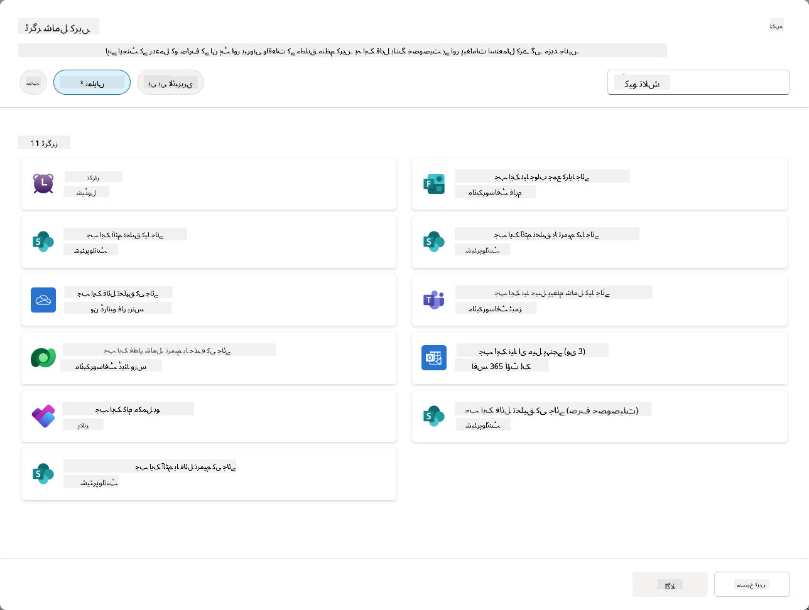

### خود مختار ایجنٹس میں ایونٹ ٹرگرز کیوں اہم ہیں

ایونٹ ٹرگرز آپ کے ایجنٹ کو ایک ردعمل دینے والے معاون سے ایک فعال، خود مختار مددگار میں تبدیل کرتے ہیں:

1. **خود مختار آپریشن** - آپ کا ایجنٹ انسانی مداخلت کے بغیر 24/7 کام کر سکتا ہے، جیسے ہی ایونٹس ہوتے ہیں ان پر ردعمل ظاہر کرتا ہے۔
    - *مثال:* جب نئے ٹیم ممبران ٹیم میں شامل کیے جاتے ہیں تو خود بخود ان کا استقبال کریں۔

1. **ریئل ٹائم ردعمل** - صارفین کے سوالات پوچھنے کا انتظار کرنے کے بجائے، آپ کا ایجنٹ متعلقہ ایونٹس پر فوری ردعمل ظاہر کرتا ہے۔
    - *مثال:* جب SharePoint دستاویز میں ترمیم کی جائے تو آئی ٹی ٹیم کو الرٹ کریں۔

1. **ورک فلو آٹومیشن** - ایک واحد ٹرگر ایونٹ کی بنیاد پر متعدد کارروائیوں کو ایک ساتھ جوڑیں۔
    - *مثال:* جب نیا سپورٹ ٹکٹ بنایا جائے، تو ایک کام بنائیں، مینیجر کو مطلع کریں، اور ٹریکنگ ڈیش بورڈ کو اپ ڈیٹ کریں۔

1. **مستقل عمل** - اہم اقدامات کو یقینی بنائیں کہ وہ کبھی نہ چھوٹیں، کلیدی ایونٹس کے جوابات کو خودکار بنا کر۔
    - *مثال:* ہر نئے ملازم کو خود بخود آن بورڈنگ مواد اور رسائی کی درخواستیں ملتی ہیں۔

1. **ڈیٹا پر مبنی کارروائیاں** - ٹرگر ایونٹ سے معلومات کا استعمال کریں تاکہ ہوشیار فیصلے کیے جا سکیں اور مناسب کارروائی کی جا سکے۔
    - *مثال:* ٹرگر پے لوڈ میں ترجیحی سطح کی بنیاد پر فوری ٹکٹوں کو سینئر اسٹاف کے پاس بھیجیں۔

## ⚙️ ایونٹ ٹرگرز کیسے کام کرتے ہیں؟

ایونٹ ٹرگرز ایک تین قدمی ورک فلو کے ذریعے کام کرتے ہیں جو آپ کے ایجنٹ کو بیرونی ایونٹس پر خود مختار طور پر ردعمل ظاہر کرنے کے قابل بناتا ہے:

### ٹرگر ورک فلو

1. **ایونٹ کا پتہ لگانا** - ایک مخصوص ایونٹ آپ کے منسلک نظام (SharePoint، Teams، Outlook، وغیرہ) میں ہوتا ہے۔
1. **ٹرگر ایکٹیویشن** - ایونٹ ٹرگر اس ایونٹ کا پتہ لگاتا ہے اور آپ کے ایجنٹ کو Power Automate Cloud Flow کے ذریعے ایک پے لوڈ بھیجتا ہے۔
1. **ایجنٹ کا ردعمل** - آپ کا ایجنٹ پے لوڈ وصول کرتا ہے اور وہ ہدایات انجام دیتا ہے جو آپ نے بیان کی ہیں۔

### ایونٹ بمقابلہ ٹاپک ٹرگرز

ان دونوں ٹرگر اقسام کے درمیان فرق کو سمجھنا ضروری ہے:

| **ایونٹ ٹرگرز** | **ٹاپک ٹرگرز** |
|-------------------|-------------------|
| بیرونی نظام کے ایونٹس کے ذریعے فعال | صارف ان پٹ/فقرے کے ذریعے فعال |
| خود مختار ایجنٹ کے رویے کو فعال کریں | بات چیت کے جوابات کو فعال کریں |
| بنانے والے کی تصدیق کا استعمال کریں | صارف کی تصدیق کا آپشن |
| صارف کے تعامل کے بغیر چلائیں | صارف کو گفتگو شروع کرنے کی ضرورت ہے |
| مثالیں: فائل بنائی گئی، ای میل موصول ہوئی | مثال: "موسم کیسا ہے؟" |

## 📦 ٹرگر پے لوڈز کو سمجھنا

جب کوئی ایونٹ ہوتا ہے، تو ٹرگر آپ کے ایجنٹ کو ایک **پے لوڈ** بھیجتا ہے جس میں ایونٹ کے بارے میں معلومات اور جواب دینے کے طریقے کے بارے میں ہدایات شامل ہوتی ہیں۔

### ڈیفالٹ بمقابلہ کسٹم پے لوڈز

ہر ٹرگر قسم کے ساتھ ایک ڈیفالٹ پے لوڈ ڈھانچہ آتا ہے، لیکن آپ اسے اپنی مرضی کے مطابق بنا سکتے ہیں:

**ڈیفالٹ پے لوڈ** - معیاری فارمیٹ استعمال کرتا ہے جیسے `Use content from {Body}`

- بنیادی ایونٹ کی معلومات پر مشتمل ہے
- عمومی پروسیسنگ ہدایات استعمال کرتا ہے
- سادہ منظرناموں کے لیے اچھا ہے

**کسٹم پے لوڈ** - مخصوص ہدایات اور ڈیٹا فارمیٹنگ شامل کریں

- آپ کے ایجنٹ کے لیے تفصیلی ہدایات شامل کریں
- بالکل وضاحت کریں کہ کون سا ڈیٹا استعمال کرنا ہے اور کیسے
- پیچیدہ ورک فلو کے لیے بہتر

### ایجنٹ کی ہدایات بمقابلہ کسٹم پے لوڈ ہدایات

ایونٹ ٹرگرز کے ساتھ آپ کے ایجنٹ کے رویے کی رہنمائی کے لیے آپ کے پاس دو جگہیں ہیں:

**ایجنٹ کی ہدایات** (گلوبل)

- وسیع رہنمائی جو تمام ٹرگرز پر لاگو ہوتی ہے
- مثال: "ٹکٹوں پر کارروائی کرتے وقت، ہمیشہ پہلے ڈپلیکیٹس چیک کریں"
- عمومی رویے کے نمونوں کے لیے بہترین

**پے لوڈ ہدایات** (ٹرگر مخصوص)

- انفرادی ٹرگر اقسام کے لیے مخصوص ہدایات  
- مثال: "اس SharePoint اپ ڈیٹ کے لیے، پروجیکٹ چینل کو خلاصہ بھیجیں"
- متعدد ٹرگرز کے ساتھ پیچیدہ ایجنٹس کے لیے بہترین

💡 **پرو ٹپ**: ان دونوں سطحوں کے درمیان متضاد ہدایات سے گریز کریں، کیونکہ اس سے غیر متوقع رویہ پیدا ہو سکتا ہے۔

## 🎯 عام ایونٹ ٹرگر کے منظرنامے

یہاں ایونٹ ٹرگرز کے ذریعے آپ کے ایجنٹ کو بہتر بنانے کے عملی مثالیں ہیں:

### آئی ٹی ہیلپ ڈیسک ایجنٹ

- **ٹرگر**: نیا SharePoint لسٹ آئٹم (سپورٹ ٹکٹ)
- **عمل**: خود بخود زمرہ بندی کریں، ترجیح تفویض کریں، اور متعلقہ ٹیم ممبران کو مطلع کریں

### ملازم آن بورڈنگ ایجنٹ

- **ٹرگر**: Dataverse میں نیا صارف شامل کیا گیا
- **عمل**: خوش آمدید پیغام بھیجیں، آن بورڈنگ کے کام بنائیں، اور رسائی فراہم کریں

### پروجیکٹ مینجمنٹ ایجنٹ

- **ٹرگر**: Planner میں کام مکمل ہوا
- **عمل**: پروجیکٹ ڈیش بورڈ کو اپ ڈیٹ کریں، اسٹیک ہولڈرز کو مطلع کریں، اور بلاکرز چیک کریں

### دستاویز مینجمنٹ ایجنٹ

- **ٹرگر**: مخصوص SharePoint فولڈر میں فائل اپ لوڈ کی گئی
- **عمل**: میٹا ڈیٹا نکالیں، ٹیگز لگائیں، اور دستاویز کے مالکان کو مطلع کریں

### میٹنگ اسسٹنٹ ایجنٹ

- **ٹرگر**: کیلنڈر ایونٹ بنایا گیا
- **عمل**: پری میٹنگ یاد دہانیاں اور ایجنڈا بھیجیں، وسائل بک کریں

## ⚠️ اشاعت اور تصدیق کے تحفظات

آپ کے ایجنٹ کے ایونٹ ٹرگرز کو پروڈکشن میں استعمال کرنے سے پہلے، آپ کو تصدیق اور سیکیورٹی کے مضمرات کو سمجھنا ہوگا۔

### بنانے والے کی تصدیق

ایونٹ ٹرگرز تمام تصدیق کے لیے **ایجنٹ تخلیق کنندہ کی اسناد** استعمال کرتے ہیں:

- آپ کا ایجنٹ آپ کی اجازتوں کا استعمال کرتے ہوئے نظاموں تک رسائی حاصل کرتا ہے
- صارفین ممکنہ طور پر آپ کی اسناد کے ذریعے ڈیٹا تک رسائی حاصل کر سکتے ہیں
- تمام کارروائیاں "آپ کے طور پر" انجام دی جاتی ہیں، یہاں تک کہ جب صارفین ایجنٹ کے ساتھ تعامل کرتے ہیں

### ڈیٹا تحفظ کے بہترین طریقے

ایونٹ ٹرگرز کے ساتھ ایجنٹس کو شائع کرتے وقت سیکیورٹی کو برقرار رکھنے کے لیے:

1. **ڈیٹا تک رسائی کا جائزہ لیں** - جائزہ لیں کہ آپ کے ٹرگرز کس نظام اور ڈیٹا تک رسائی حاصل کر سکتے ہیں
1. **مکمل طور پر ٹیسٹ کریں** - سمجھیں کہ ٹرگرز پے لوڈز میں کون سی معلومات شامل ہیں
1. **ٹرگر دائرہ کار کو محدود کریں** - مخصوص پیرامیٹرز استعمال کریں تاکہ یہ محدود ہو کہ کون سے ایونٹس ٹرگرز کو فعال کرتے ہیں
1. **پے لوڈ ڈیٹا کا جائزہ لیں** - یقینی بنائیں کہ ٹرگرز حساس معلومات کو ظاہر نہیں کرتے ہیں
1. **استعمال کی نگرانی کریں** - ٹرگر سرگرمی اور وسائل کی کھپت کو ٹریک کریں

## ⚠️ خرابیوں کا سراغ لگانا اور حدود

ایونٹ ٹرگرز کے ساتھ کام کرتے وقت ان اہم تحفظات کو ذہن میں رکھیں:

### کوٹہ اور بلنگ کے اثرات

- ہر ٹرگر ایکٹیویشن آپ کے پیغام کی کھپت میں شمار ہوتا ہے
- بار بار ٹرگرز (جیسے ہر منٹ کی تکرار) کوٹہ کو جلدی سے ختم کر سکتے ہیں
- تھروٹلنگ سے بچنے کے لیے استعمال کی نگرانی کریں

### تکنیکی ضروریات

- صرف ان ایجنٹس کے لیے دستیاب ہے جن کے پاس جنریٹو آرکسٹریشن فعال ہے
- آپ کے ماحول میں حل سے آگاہ کلاؤڈ فلو شیئرنگ کو فعال کرنے کی ضرورت ہے

### ڈیٹا لاس پریوینشن (DLP)

- آپ کی تنظیم کی DLP پالیسیاں طے کرتی ہیں کہ کون سے ٹرگرز دستیاب ہیں
- ایڈمنسٹریٹر ایونٹ ٹرگرز کو مکمل طور پر بلاک کر سکتے ہیں
- اگر متوقع ٹرگرز دستیاب نہیں ہیں تو اپنے ایڈمن سے رابطہ کریں

## 🧪 لیب 10 - خود مختار ایجنٹ کے رویے کے لیے ایونٹ ٹرگرز شامل کریں

### 🎯 استعمال کا کیس

آپ اپنے آئی ٹی ہیلپ ڈیسک ایجنٹ کو نئے سپورٹ درخواستوں کا خود بخود جواب دینے کے لیے بہتر بنائیں گے۔ جب کوئی آپ کے SharePoint سپورٹ ٹکٹ لسٹ میں نیا آئٹم بناتا ہے، تو آپ کا ایجنٹ:

1. SharePoint ٹکٹ بننے پر خود مختار طور پر ٹرگر کرے گا
1. ٹکٹ کی تفصیلات اور وہ ہدایات فراہم کرے گا جو آپ چاہتے ہیں کہ وہ انجام دے
1. AI کے ذریعے تیار کردہ ای میل کے ذریعے ٹکٹ کو جمع کرانے والے کو خود بخود تصدیق بھیجے گا

یہ لیب ظاہر کرتی ہے کہ ایونٹ ٹرگرز واقعی خود مختار ایجنٹ کے رویے کو کیسے فعال کرتے ہیں۔

### ضروریات

اس لیب کو شروع کرنے سے پہلے، یقینی بنائیں کہ آپ کے پاس:

- ✅ پچھلی لیبز مکمل ہو چکی ہیں (خاص طور پر لیب 6-8 آئی ٹی ہیلپ ڈیسک ایجنٹ کے لیے)
- ✅ SharePoint سائٹ تک رسائی جس میں آئی ٹی سپورٹ ٹکٹ لسٹ موجود ہے
- ✅ Copilot Studio ماحول جس میں ایونٹ ٹرگرز فعال ہیں
- ✅ آپ کے ایجنٹ کے پاس جنریٹو آرکسٹریشن فعال ہے
- ✅ SharePoint اور آپ کے Copilot Studio ماحول میں مناسب اجازتیں موجود ہیں

### 10.1 جنریٹو AI کو فعال کریں اور SharePoint آئٹم تخلیق ٹرگر بنائیں

1. اپنے **آئی ٹی ہیلپ ڈیسک ایجنٹ** کو **Copilot Studio** میں کھولیں

1. پہلے، اپنے ایجنٹ کے لیے **جنریٹو AI** کو فعال کریں:
   - **Overview** ٹیب پر جائیں
   - آرکسٹریشن سیکشن کے تحت، **جنریٹو آرکسٹریشن** کو **آن** پر ٹوگل کریں اگر یہ پہلے سے فعال نہیں ہے  
     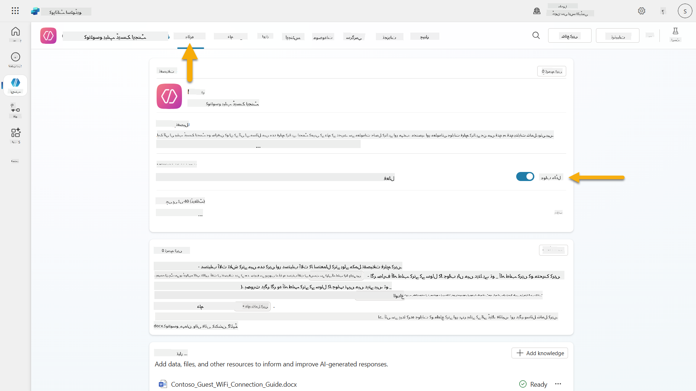

1. **Overview** ٹیب پر جائیں اور **Triggers** سیکشن کو تلاش کریں

1. **+ Add trigger** پر کلک کریں تاکہ ٹرگر لائبریری کھل جائے  
    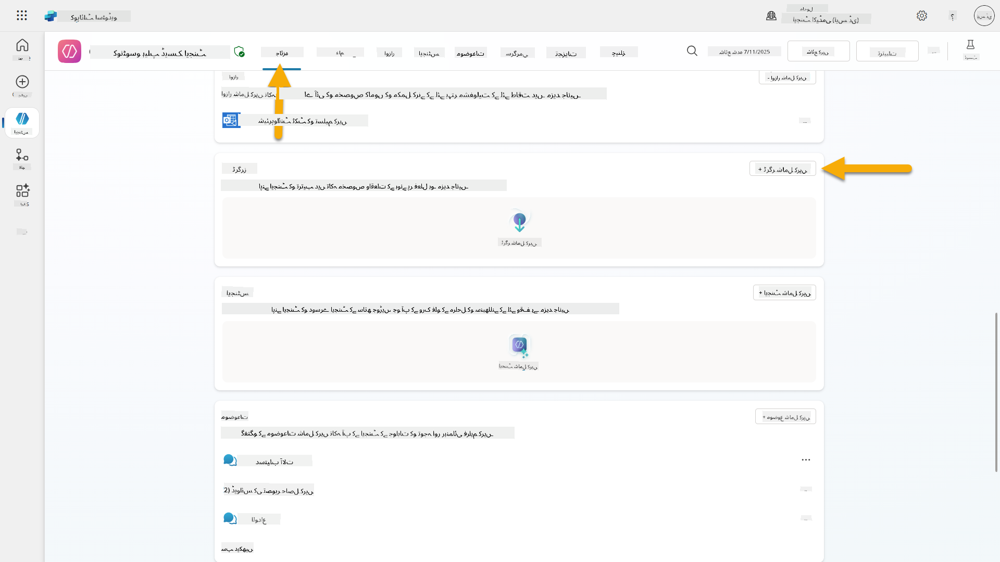

1. **When an item is created** (SharePoint) تلاش کریں اور منتخب کریں  
    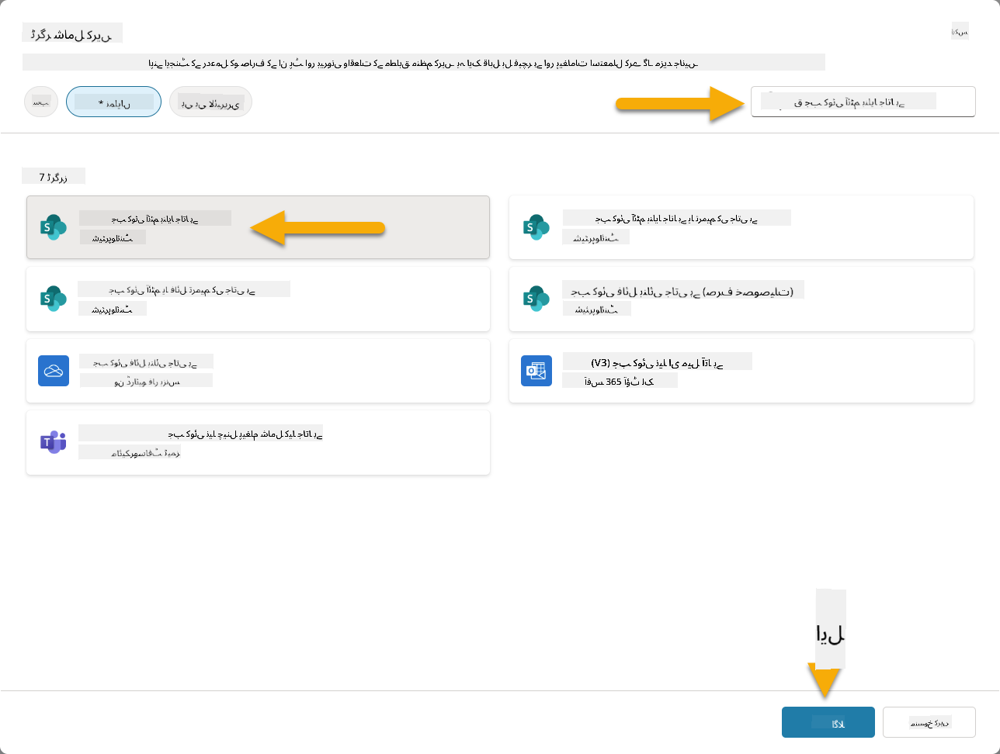

1. ٹرگر کا نام اور کنکشنز ترتیب دیں:

   - **Trigger name:** SharePoint میں نیا سپورٹ ٹکٹ بنایا گیا

1. کنکشنز کو ترتیب دینے کے لیے انتظار کریں، اور **Next** کو منتخب کریں تاکہ آگے بڑھ سکیں۔  
   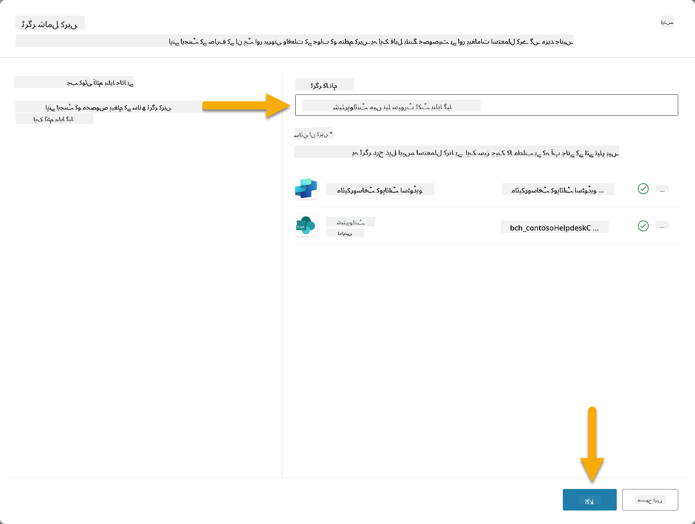

1. ٹرگر پیرامیٹرز ترتیب دیں:

   - **Site Address**: اپنے "Contoso IT" SharePoint سائٹ کو منتخب کریں

   - **List Name**: اپنی "Tickets" لسٹ کو منتخب کریں

   - **ایجنٹ کو اضافی ہدایات جب ٹرگر کے ذریعے فعال کیا جائے:**

     ```text
     New Support Ticket Created in SharePoint: {Body}
     
     Use the 'Acknowledge SharePoint Ticket' tool to generate the email body automatically and respond.
     
     IMPORTANT: Do not wait for any user input. Work completely autonomously.
     ```

     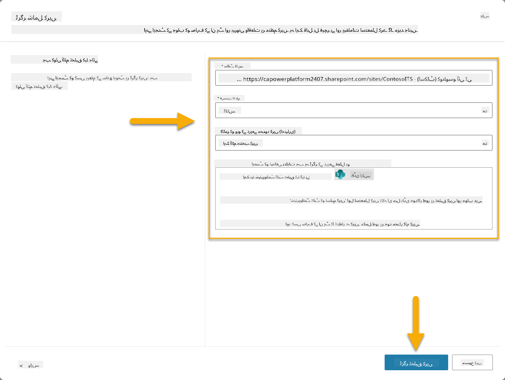

1. **Create trigger** کو منتخب کریں تاکہ ٹرگر تخلیق مکمل ہو۔ ایک Power Automate Cloud Flow خود بخود تخلیق کیا جاتا ہے تاکہ ایجنٹ کو خود مختار طور پر ٹرگر کیا جا سکے۔

1. **Close** کو منتخب کریں۔

### 10.2 ٹرگر میں ترمیم کریں

1. **Overview** ٹیب کے **Triggers** سیکشن کے اندر، **...** مینو کو منتخب کریں **SharePoint میں نیا سپورٹ ٹکٹ بنایا گیا** ٹرگر پر

1. **Edit in Power Automate** کو منتخب کریں  
   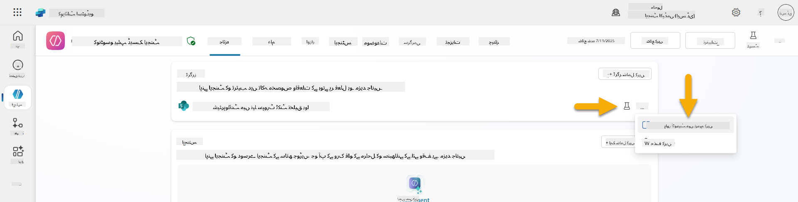

1. **Sends a prompt to the specified copilot for processing** نوڈ کو منتخب کریں

1. **Body/message** فیلڈ میں، Body مواد کو ہٹا دیں، **فارورڈ سلاش کی** (/) دبائیں اور **Insert Expression** کو منتخب کریں  
   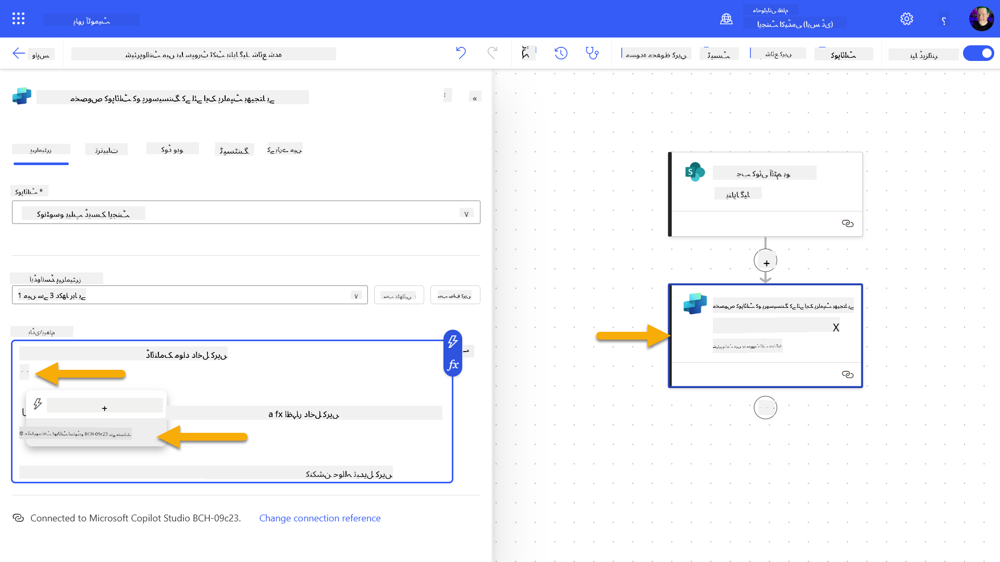

1. ایجنٹ کو ٹکٹ کے بارے میں مخصوص تفصیلات فراہم کرنے کے لیے درج ذیل ایکسپریشن درج کریں:

    ```text
    concat('Submitted By Name: ', first(triggerOutputs()?['body/value'])?['Author/DisplayName'], '\nSubmitted By Email: ', first(triggerOutputs()?['body/value'])?['Author/Email'], '\nTitle: ', first(triggerOutputs()?['body/value'])?['Title'], '\nIssue Description: ', first(triggerOutputs()?['body/value'])?['Description'], '\nPriority: ', first(triggerOutputs()?['body/value'])?['Priority/Value'],'\nTicket ID : ', first(triggerOutputs()?['body/value'])?['ID'])
    ```

1. **Add** کو منتخب کریں  
   ![ٹرگر آؤٹ پٹ ایکسپریشن](./assets/10
1. ایک نیا براؤزر ٹیب کھولیں اور اپنے **SharePoint IT Support Tickets list** پر جائیں۔
1. ایک ٹیسٹ ٹکٹ بنانے کے لیے **+ Add new item** پر کلک کریں:
   - **عنوان**: "VPN سے جڑنے میں ناکامی"
   - **تفصیل**: "حالیہ اپ ڈیٹ کے بعد کارپوریٹ WIFI نیٹ ورک سے جڑنے میں ناکامی"
   - **ترجیح**: "معمولی"

1. SharePoint آئٹم کو **محفوظ کریں**  
    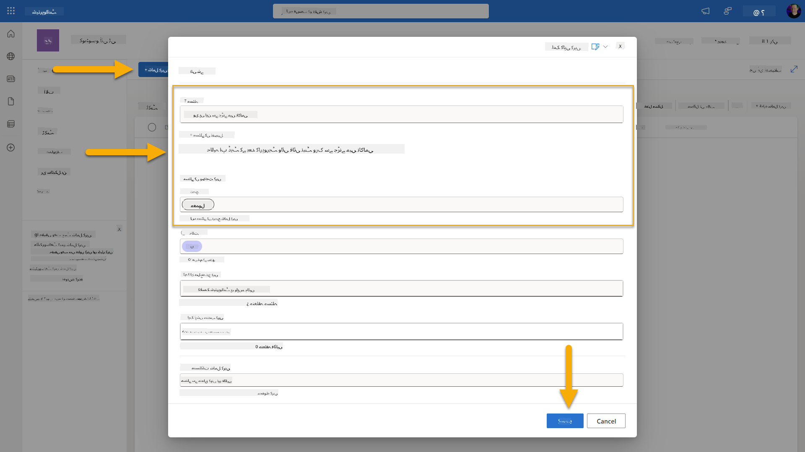
1. **Copilot Studio** پر واپس جائیں اور **Test your trigger** پینل میں ٹرگر ایکٹیویشن کی نگرانی کریں۔ ٹرگر ایونٹ کو لوڈ کرنے کے لیے **Refresh** آئیکن استعمال کریں، اس میں چند منٹ لگ سکتے ہیں۔  
    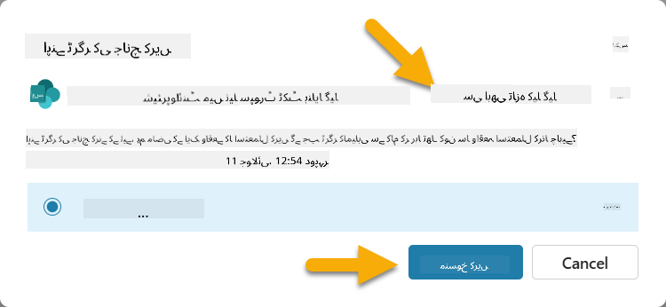
1. جب ٹرگر ظاہر ہو، **Start testing** منتخب کریں۔
1. **Test your agent** پینل کے اوپر **Activity Map icon** منتخب کریں۔
1. تصدیق کریں کہ آپ کا ایجنٹ:
   - ٹرگر پے لوڈ وصول کر چکا ہے۔
   - "Acknowledge SharePoint ticket" ٹول کو کال کیا ہے۔  
     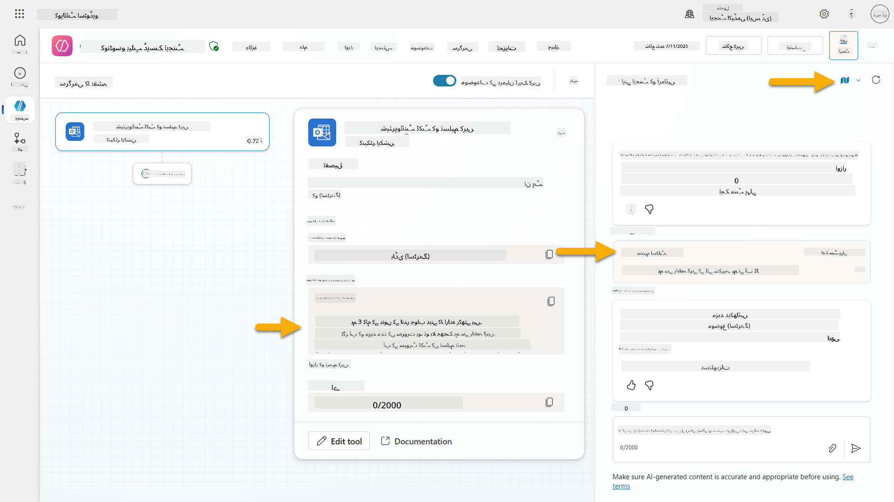
1. جمع کرانے والے کی ای میل ان باکس چیک کریں تاکہ تصدیق ہو سکے کہ acknowledgment ای میل بھیجی گئی ہے۔  
    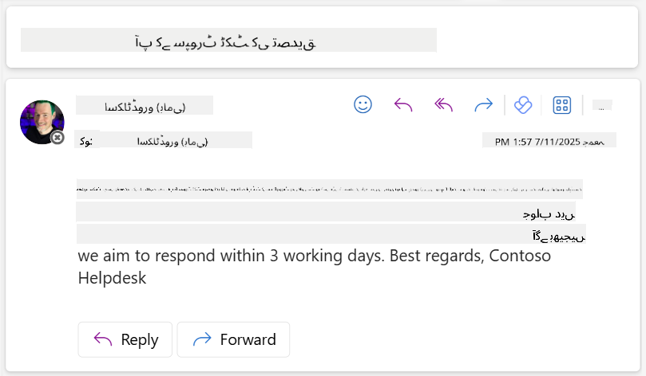
1. Copilot Studio میں **Activity** ٹیب کا جائزہ لیں تاکہ مکمل ٹرگر اور ٹول کی عملدرآمد دیکھ سکیں۔

## ✅ مشن مکمل

🎉 **مبارک ہو!** آپ نے کامیابی سے ایونٹ ٹرگرز کو کنیکٹر ٹولز کے ساتھ نافذ کیا ہے جو آپ کے ایجنٹ کو خود مختار طور پر کام کرنے کے قابل بناتے ہیں، ای میل acknowledgment خودکار طور پر بھیجتے ہیں اور سپورٹ ٹکٹس کو بغیر کسی صارف مداخلت کے پروسیس کرتے ہیں۔ جب آپ کا ایجنٹ شائع ہو جائے گا، یہ آپ کی طرف سے خود مختار طور پر کام کرے گا۔

🚀 **اگلا سبق**: ہمارے اگلے سبق میں، آپ سیکھیں گے کہ [اپنے ایجنٹ کو شائع کریں](../11-publish-your-agent/README.md) تاکہ اسے Microsoft Teams اور Microsoft 365 Copilot پر دستیاب بنایا جا سکے، اور یہ آپ کی پوری تنظیم کے لیے قابل رسائی ہو جائے۔

⏭️ [**Publish your agent** سبق پر جائیں](../11-publish-your-agent/README.md)

## 📚 حکمت عملی وسائل

ایونٹ ٹرگرز اور خود مختار ایجنٹس کے بارے میں مزید جاننے کے لیے تیار ہیں؟ ان وسائل کو دیکھیں:

- **Microsoft Learn**: [اپنے ایجنٹ کو Copilot Studio میں خود مختار بنائیں](https://learn.microsoft.com/training/modules/autonomous-agents-online-workshop/?WT.mc_id=power-177340-scottdurow)
- **دستاویزات**: [ایونٹ ٹرگر شامل کریں](https://learn.microsoft.com/microsoft-copilot-studio/authoring-trigger-event?WT.mc_id=power-177340-scottdurow)
- **بہترین طریقے**: [Power Automate ٹرگرز کا تعارف](https://learn.microsoft.com/power-automate/triggers-introduction?WT.mc_id=power-177340-scottdurow)
- **اعلی درجے کے منظرنامے**: [ایجنٹس کے ساتھ Power Automate flows کا استعمال](https://learn.microsoft.com/microsoft-copilot-studio/advanced-flow-create?WT.mc_id=power-177340-scottdurow)
- **سیکیورٹی**: [Copilot Studio کے لیے ڈیٹا نقصان کی روک تھام](https://learn.microsoft.com/microsoft-copilot-studio/admin-data-loss-prevention?WT.mc_id=power-177340-scottdurow)


---

**ڈسکلیمر**:  
یہ دستاویز AI ترجمہ سروس [Co-op Translator](https://github.com/Azure/co-op-translator) کا استعمال کرتے ہوئے ترجمہ کی گئی ہے۔ ہم درستگی کے لیے کوشش کرتے ہیں، لیکن براہ کرم آگاہ رہیں کہ خودکار ترجمے میں غلطیاں یا غیر درستیاں ہو سکتی ہیں۔ اصل دستاویز کو اس کی اصل زبان میں مستند ذریعہ سمجھا جانا چاہیے۔ اہم معلومات کے لیے، پیشہ ور انسانی ترجمہ کی سفارش کی جاتی ہے۔ ہم اس ترجمے کے استعمال سے پیدا ہونے والی کسی بھی غلط فہمی یا غلط تشریح کے ذمہ دار نہیں ہیں۔