<!--
CO_OP_TRANSLATOR_METADATA:
{
  "original_hash": "9dceeba2eae2bb73e328602a060eddab",
  "translation_date": "2025-10-22T19:48:13+00:00",
  "source_file": "docs/recruit/11-publish-your-agent/README.md",
  "language_code": "ur"
}
-->
# 🚨 مشن 11: اپنے ایجنٹ کو شائع کریں

## 🕵️‍♂️ کوڈ نام: `آپریشن شائع شائع شائع`

> **⏱️ آپریشن کا وقت:** `~30 منٹ`  

🎥 **واچ واک تھرو**

## 🎯 مشن کا خلاصہ

چیلنجنگ ماڈیولز کی ایک سیریز مکمل کرنے کے بعد، ایجنٹ میکر، آپ اب اپنے سب سے اہم قدم کے لیے تیار ہیں: اپنے ایجنٹ کو شائع کرنا۔ یہ وقت ہے کہ آپ اپنی تخلیق کو Microsoft Teams اور Microsoft 365 Copilot کے ذریعے صارفین کے لیے دستیاب بنائیں۔

آپ کا ایجنٹ—ایک واضح مشن، طاقتور ٹولز، اور کلیدی معلوماتی ذرائع تک رسائی کے ساتھ—خدمت کے لیے تیار ہے۔ Microsoft Copilot Studio کا استعمال کرتے ہوئے، آپ اپنے ایجنٹ کو تعینات کرتے ہیں تاکہ وہ حقیقی صارفین کی مدد شروع کر سکے، بالکل وہیں جہاں وہ کام کرتے ہیں۔

چلیں، اپنے ایجنٹ کو ایکشن میں لانچ کریں۔

## 🔎 مقاصد

📖 اس سبق میں شامل ہے:

1. اپنے ایجنٹ کو شائع کرنا کیوں ضروری ہے
1. جب آپ اپنے ایجنٹ کو شائع کرتے ہیں تو کیا ہوتا ہے
1. چینل شامل کرنے کا طریقہ (Microsoft Teams اور Microsoft 365 Copilot)
1. Microsoft Teams میں ایجنٹ شامل کرنے کا طریقہ
1. اپنے ایجنٹ کو پوری تنظیم کے لیے Microsoft Teams میں دستیاب بنانے کا طریقہ

## 🚀 ایجنٹ شائع کریں

جب بھی آپ Copilot Studio میں کسی ایجنٹ پر کام کرتے ہیں، آپ اسے علم یا ٹولز شامل کرکے اپ ڈیٹ کر سکتے ہیں۔ جب آپ تمام تبدیلیوں کے ساتھ تیار ہوں اور اچھی طرح سے جانچ کر لیں، تو آپ اسے شائع کرنے کے لیے تیار ہیں۔ شائع کرنا یقینی بناتا ہے کہ تازہ ترین اپ ڈیٹس لائیو ہیں۔ جب آپ اپنے ایجنٹ کو نئے ٹولز کے ساتھ اپ ڈیٹ کرتے ہیں اور شائع کرنے کے بٹن کو دبانے نہیں دیتے، تو یہ ابھی تک اختتامی صارفین کے لیے دستیاب نہیں ہے۔

جب آپ اپنے ایجنٹ کے صارفین کو اپ ڈیٹس بھیجنا چاہتے ہیں تو ہمیشہ شائع کرنے کے بٹن کو دبانا یقینی بنائیں۔ آپ کے ایجنٹ میں چینلز شامل ہو سکتے ہیں اور جب آپ شائع کرتے ہیں تو اپ ڈیٹس ان تمام چینلز کے لیے دستیاب ہو جاتی ہیں جو آپ نے ایجنٹ میں شامل کیے ہیں۔

## ⚙️ چینلز کو ترتیب دیں

چینلز یہ طے کرتے ہیں کہ آپ کے صارفین آپ کے ایجنٹ تک کہاں رسائی حاصل کر سکتے ہیں اور اس کے ساتھ بات چیت کر سکتے ہیں۔ اپنے ایجنٹ کو شائع کرنے کے بعد، آپ اسے متعدد چینلز میں دستیاب بنا سکتے ہیں۔ ہر چینل آپ کے ایجنٹ کے مواد کو مختلف طریقے سے ظاہر کر سکتا ہے۔

آپ اپنے ایجنٹ کو درج ذیل چینلز میں شامل کر سکتے ہیں:

- **Microsoft Teams اور Microsoft 365 Copilot** - اپنے ایجنٹ کو Teams چیٹس اور میٹنگز میں، اور Microsoft 365 Copilot تجربات میں دستیاب بنائیں ([مزید جانیں](https://learn.microsoft.com/microsoft-copilot-studio/publication-add-bot-to-microsoft-teams))
- **ڈیمو ویب سائٹ** - Copilot Studio کی فراہم کردہ ڈیمو ویب سائٹ پر اپنے ایجنٹ کی جانچ کریں ([مزید جانیں](https://learn.microsoft.com/microsoft-copilot-studio/publication-connect-bot-to-web-channels))
- **کسٹم ویب سائٹ** - اپنے ایجنٹ کو براہ راست اپنی ویب سائٹ میں شامل کریں ([مزید جانیں](https://learn.microsoft.com/microsoft-copilot-studio/publication-connect-bot-to-web-channels))
- **موبائل ایپ** - اپنے ایجنٹ کو کسٹم موبائل ایپلیکیشن میں ضم کریں ([مزید جانیں](https://learn.microsoft.com/microsoft-copilot-studio/publication-connect-bot-to-custom-application))
- **SharePoint** - اپنے ایجنٹ کو SharePoint سائٹس میں دستاویز اور سائٹ کی مدد کے لیے شامل کریں ([مزید جانیں](https://learn.microsoft.com/microsoft-copilot-studio/publication-add-bot-to-sharepoint))
- **Facebook Messenger** - Facebook کے میسجنگ پلیٹ فارم کے ذریعے صارفین سے جڑیں ([مزید جانیں](https://learn.microsoft.com/microsoft-copilot-studio/publication-add-bot-to-facebook))
- **Power Pages** - اپنے ایجنٹ کو Power Pages ویب سائٹس میں ضم کریں ([مزید جانیں](https://learn.microsoft.com/microsoft-copilot-studio/publication-add-bot-to-power-pages))
- **Azure Bot Service چینلز** - اضافی چینلز تک رسائی حاصل کریں، بشمول Slack، Telegram، Twilio SMS، اور مزید ([مزید جانیں](https://learn.microsoft.com/microsoft-copilot-studio/publication-connect-bot-to-azure-bot-service-channels))

چینل شامل کرنے کے لیے، اپنے ایجنٹ میں **چینلز** ٹیب پر جائیں اور وہ چینل منتخب کریں جسے آپ ترتیب دینا چاہتے ہیں۔ ہر چینل کے مخصوص سیٹ اپ کے تقاضے ہوتے ہیں اور اضافی تصدیق یا ترتیب کے مراحل کی ضرورت ہو سکتی ہے۔

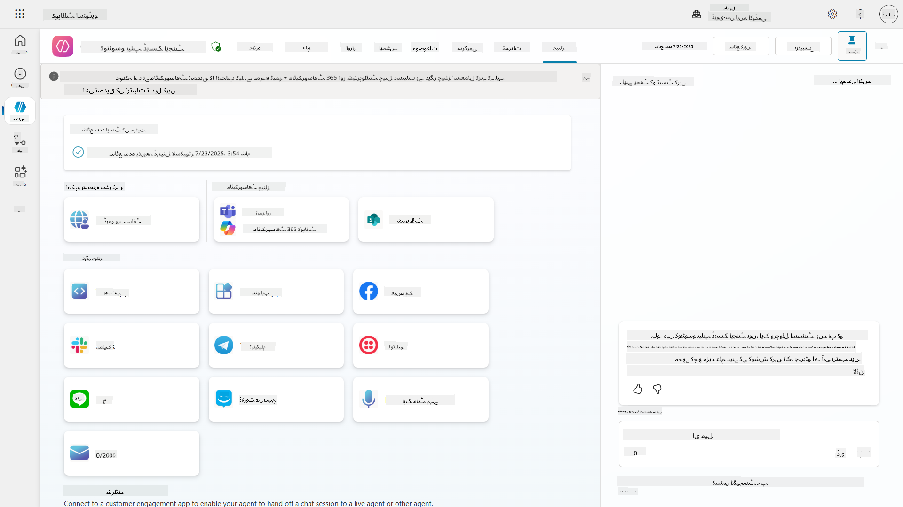

## 📺 چینل تجربات

مختلف چینلز کے مختلف صارف تجربات ہوتے ہیں۔ جب متعدد چینلز کے لیے ایجنٹ بنا رہے ہوں، تو ہر چینل کے فرق سے آگاہ رہنا ضروری ہے۔ یہ ہمیشہ ایک اچھی حکمت عملی ہے کہ اپنے ایجنٹ کو متعدد چینلز میں جانچیں تاکہ یہ دیکھ سکیں کہ آیا یہ واقعی وہی کرتا ہے جو آپ نے ارادہ کیا تھا۔

| تجربہ                          | ویب سائٹ       | Teams اور Microsoft 365 Copilot         | Facebook                 | Dynamics Omnichannel for Customer Service                   |
| ------------------------------ | ------------- | --------------------------------------- | ------------------------ | ----------------------------------------------------------- |
| [کسٹمر سیٹسفیکشن سروے][1]     | ایڈاپٹیو کارڈ | صرف ٹیکسٹ                              | صرف ٹیکسٹ                | صرف ٹیکسٹ                                                   |
| [ملٹیپل چوائس آپشنز][1]       | سپورٹڈ        | [سپورٹڈ چھ تک (ہیرو کارڈ کے طور پر)][4] | [سپورٹڈ تیرہ تک][6]     | [جزوی طور پر سپورٹڈ][8]                                    |
| [مارک ڈاؤن][2]                | سپورٹڈ        | [جزوی طور پر سپورٹڈ][5]                | [جزوی طور پر سپورٹڈ][7] | [جزوی طور پر سپورٹڈ][9]                                    |
| [ویلکم میسج][1]               | سپورٹڈ        | سپورٹڈ                                 | سپورٹڈ نہیں              | سپورٹڈ [چیٹ][10] کے لیے۔ دیگر چینلز کے لیے سپورٹڈ نہیں۔   |
| [کیا آپ کا مطلب یہ تھا][3]    | سپورٹڈ        | سپورٹڈ                                 | سپورٹڈ                  | سپورٹڈ [Microsoft Teams][11]، [چیٹ][10]، Facebook، اور صرف ٹیکسٹ چینلز (شارٹ میسج سروس (SMS) [TeleSign][12] اور [Twilio][13]، [WhatsApp][14]، [WeChat][15]، اور [Twitter][16] کے ذریعے)۔ تجویز کردہ اعمال کو صرف ٹیکسٹ لسٹ کے طور پر پیش کیا جاتا ہے؛ صارفین کو جواب دینے کے لیے ایک آپشن دوبارہ ٹائپ کرنا ہوگا۔ |

[1]: https://learn.microsoft.com/microsoft-copilot-studio/authoring-create-edit-topics
[2]: https://daringfireball.net/projects/markdown/
[3]: https://learn.microsoft.com/microsoft-copilot-studio/advanced-ai-features
[4]: https://learn.microsoft.com/microsoftteams/platform/concepts/cards/cards-reference#hero-card
[5]: https://learn.microsoft.com/microsoftteams/platform/bots/how-to/format-your-bot-messages#text-only-messages
[6]: https://developers.facebook.com/docs/messenger-platform/send-messages/quick-replies/
[7]: https://www.facebook.com/help/147348452522644?helpref=related
[8]: https://learn.microsoft.com/dynamics365/customer-service/asynchronous-channels#suggested-actions-support
[9]: https://learn.microsoft.com/dynamics365/customer-service/asynchronous-channels#preview-support-for-formatted-messages
[10]: https://learn.microsoft.com/dynamics365/customer-service/set-up-chat-widget
[11]: https://learn.microsoft.com/dynamics365/customer-service/configure-microsoft-teams
[12]: https://learn.microsoft.com/dynamics365/customer-service/configure-sms-channel
[13]: https://learn.microsoft.com/dynamics365/customer-service/configure-sms-channel-twilio
[14]: https://learn.microsoft.com/dynamics365/customer-service/configure-whatsapp-channel
[15]: https://learn.microsoft.com/dynamics365/customer-service/configure-wechat-channel
[16]: https://learn.microsoft.com/dynamics365/customer-service/configure-twitter-channel

> [!NOTE]
> کچھ مثالیں ہیں جہاں آپ مختلف چینلز کے لیے مختلف منطق استعمال کر سکتے ہیں۔ اس کی ایک مثال Power Platform Snippets ریپوزٹری میں مل سکتی ہے:
>
> ہنری جیمز نے ایک مثال شیئر کی کہ جب چینل Microsoft Teams ہو تو مختلف ایڈاپٹیو کارڈ کیسے دکھایا جائے۔ ([مثال کا لنک](https://github.com/pnp/powerplatform-snippets/blob/main/copilot-studio/multiple-topics-matched-topic/source/multiple-topics-matched.yaml#L40))

## 🧪 لیب 11: اپنے ایجنٹ کو Teams اور Microsoft 365 Copilot پر شائع کریں

### 🎯 استعمال کا کیس

آپ کا Contoso IT Help Desk ایجنٹ اب مکمل طور پر طاقتور صلاحیتوں کے ساتھ ترتیب دیا گیا ہے—یہ SharePoint معلوماتی ذرائع تک رسائی حاصل کر سکتا ہے، سپورٹ ٹکٹ بنا سکتا ہے، فعال اطلاعات بھیج سکتا ہے، اور صارفین کے سوالات کا ذہانت سے جواب دے سکتا ہے۔ تاہم، یہ تمام خصوصیات فی الحال صرف ترقیاتی ماحول میں دستیاب ہیں جہاں آپ نے انہیں بنایا ہے۔

**چیلنج:** اختتامی صارفین آپ کے ایجنٹ کی صلاحیتوں سے فائدہ نہیں اٹھا سکتے جب تک کہ اسے مناسب طریقے سے شائع نہ کیا جائے اور ان چینلز کے ذریعے قابل رسائی نہ بنایا جائے جہاں وہ اصل میں کام کرتے ہیں۔

**حل:** اپنے ایجنٹ کو شائع کرنا اس بات کو یقینی بناتا ہے کہ تازہ ترین ورژن—آپ کی حالیہ اپ ڈیٹس، نئے موضوعات، بہتر معلوماتی ذرائع، اور ترتیب شدہ فلو کے ساتھ—حقیقی صارفین کے لیے دستیاب ہے۔ شائع کیے بغیر، صارفین اب بھی آپ کے ایجنٹ کے پرانے ورژن کے ساتھ بات چیت کریں گے جس میں اہم فعالیت کی کمی ہو سکتی ہے۔

Teams اور Microsoft 365 Copilot چینل شامل کرنا بھی اتنا ہی اہم ہے کیونکہ:

- **Teams انضمام**: آپ کی تنظیم کے ملازمین زیادہ تر دن Microsoft Teams میں تعاون، میٹنگز، اور مواصلات کے لیے گزارتے ہیں۔ اپنے ایجنٹ کو Teams میں شامل کرکے، صارفین اپنی بنیادی کام کی جگہ چھوڑے بغیر IT سپورٹ حاصل کر سکتے ہیں۔

- **Microsoft 365 Copilot**: صارفین آپ کے خصوصی IT ہیلپ ڈیسک ایجنٹ تک براہ راست Microsoft 365 Copilot تجربے کے اندر رسائی حاصل کر سکتے ہیں، جس سے یہ Office ایپلیکیشنز میں ان کے روزمرہ کے ورک فلو میں بغیر کسی رکاوٹ کے ضم ہو جاتا ہے۔

- **مرکزی رسائی**: الگ الگ ویب سائٹس یا ایپلیکیشنز کو یاد رکھنے کے بجائے، صارفین IT سپورٹ تک رسائی ان پلیٹ فارمز کے ذریعے حاصل کر سکتے ہیں جنہیں وہ پہلے ہی استعمال کر رہے ہیں، رکاوٹ کو کم کرتے ہوئے اور اپنانے میں اضافہ کرتے ہوئے۔

یہ مشن آپ کے ترقیاتی کام کو ایک پروڈکشن ریڈی حل میں تبدیل کرتا ہے جو آپ کی تنظیم کے اختتامی صارفین کو حقیقی قدر فراہم کرتا ہے۔

### ضروریات

اس لیب کو شروع کرنے سے پہلے، یقینی بنائیں کہ آپ کے پاس ہے:

- ✅ پچھلی لیبز مکمل کی ہیں اور مکمل طور پر ترتیب دیا ہوا Contoso Helpdesk Agent ہے
- ✅ آپ کے ایجنٹ کی جانچ کی گئی ہے اور یہ پروڈکشن استعمال کے لیے تیار ہے
- ✅ Copilot Studio ماحول میں ایجنٹ شائع کرنے کی اجازتیں ہیں
- ✅ آپ کی تنظیم میں Microsoft Teams تک رسائی ہے

### 11.1 اپنے ایجنٹ کو شائع کریں

اب جب کہ ہم نے ایجنٹ پر اپنا کام مکمل کر لیا ہے، ہمیں یہ یقینی بنانا ہوگا کہ ہمارا تمام کام ان اختتامی صارفین کے لیے دستیاب ہے جو ہمارے ایجنٹ کو استعمال کرنے جا رہے ہیں۔ یہ یقینی بنانے کے لیے کہ مواد تمام صارفین کے لیے دستیاب ہے، ہمیں اپنے ایجنٹ کو شائع کرنے کی ضرورت ہے۔

1. Copilot Studio میں Contoso Helpdesk Agent پر جائیں ([Copilot Studio میکر پورٹل](https://copilotstudio.microsoft.com) کے ذریعے)

    Copilot Studio میں، اپنے ایجنٹ کو شائع کرنا آسان ہے۔ آپ صرف ایجنٹ کے جائزہ کے اوپر شائع کرنے کے بٹن کو منتخب کر سکتے ہیں۔

    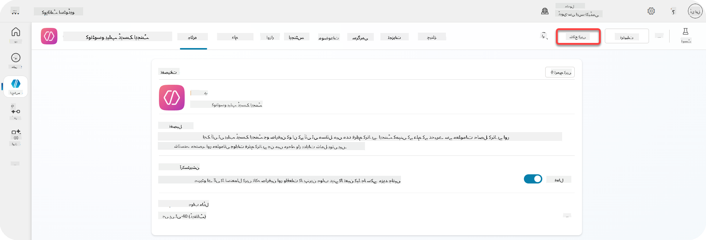

1. اپنے ایجنٹ میں **شائع کریں** بٹن منتخب کریں

    یہ شائع کرنے کا پاپ اپ کھولتا ہے - اس بات کی تصدیق کرنے کے لیے کہ آپ واقعی اپنے ایجنٹ کو شائع کرنا چاہتے ہیں۔

    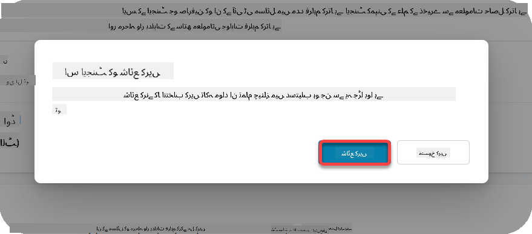

1. اپنے ایجنٹ کو شائع کرنے کی تصدیق کے لیے **شائع کریں** منتخب کریں

    اب ایک پیغام ظاہر ہوتا ہے کہ آپ کا ایجنٹ شائع ہو رہا ہے۔ آپ کو وہ پاپ اپ کھلا رکھنے کی ضرورت نہیں ہے۔ جب ایجنٹ شائع ہو جائے گا تو آپ کو مطلع کیا جائے گا۔

    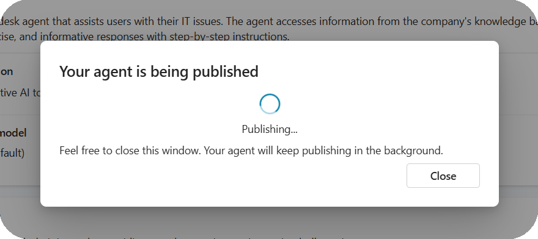

    جب ایجنٹ شائع ہو جائے گا، تو آپ ایجنٹ کے صفحے کے اوپر اطلاع دیکھیں گے۔

    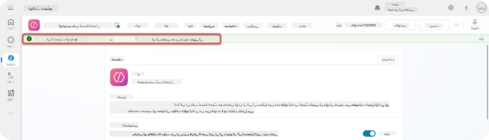

لیکن - ہم نے صرف ایجنٹ کو شائع کیا ہے، ہم نے اسے ابھی تک کسی چینل میں شامل نہیں کیا ہے، تو آئیے اب اسے ٹھیک کرتے ہیں!

### 11.2 Teams اور Microsoft 365 Copilot چینل شامل کریں

1. اپنے ایجنٹ میں Teams اور Microsoft 365 Copilot چینل شامل کرنے کے لیے، ہمیں ایجنٹ کے اوپر نیویگیشن میں **چینل** منتخب کرنا ہوگا

    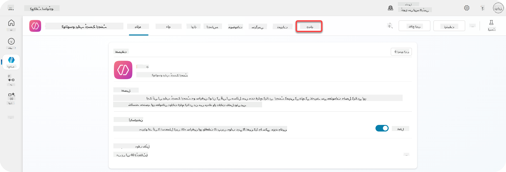

    یہاں ہم ان تمام چینلز کو دیکھ سکتے ہیں جنہیں ہم اس ایجنٹ میں شامل کر سکتے ہیں۔

1. **Teams اور Microsoft 365** منتخب کریں

    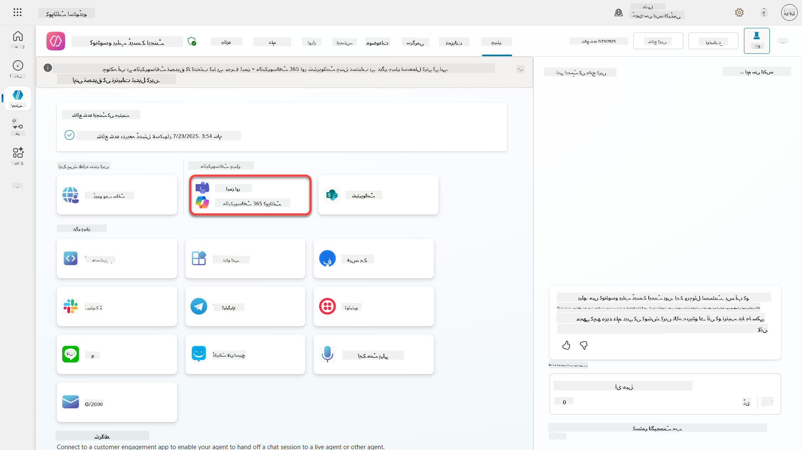

1. چینل کو ایجنٹ میں شامل کرنے کے لیے وزرڈ مکمل کرنے کے لیے **چینل شامل کریں** منتخب کریں

    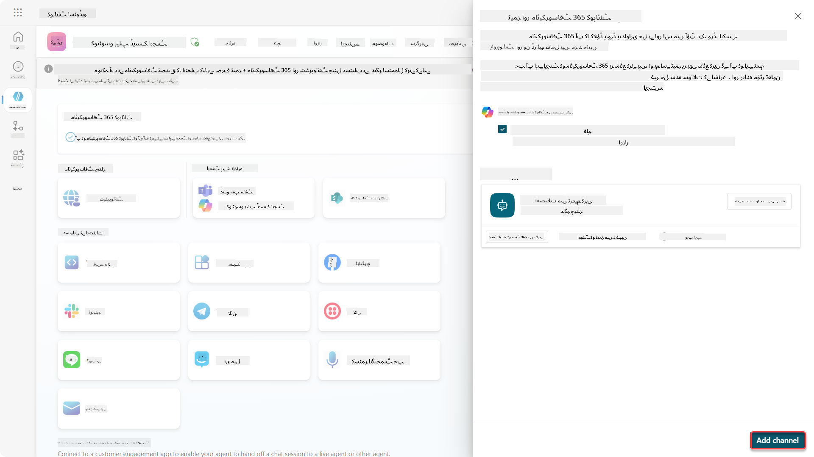

    اسے شامل ہونے میں تھوڑا وقت لگے گا۔ شامل ہونے کے بعد، سائڈبار کے اوپر ایک سبز اطلاع ظاہر ہوگی۔

    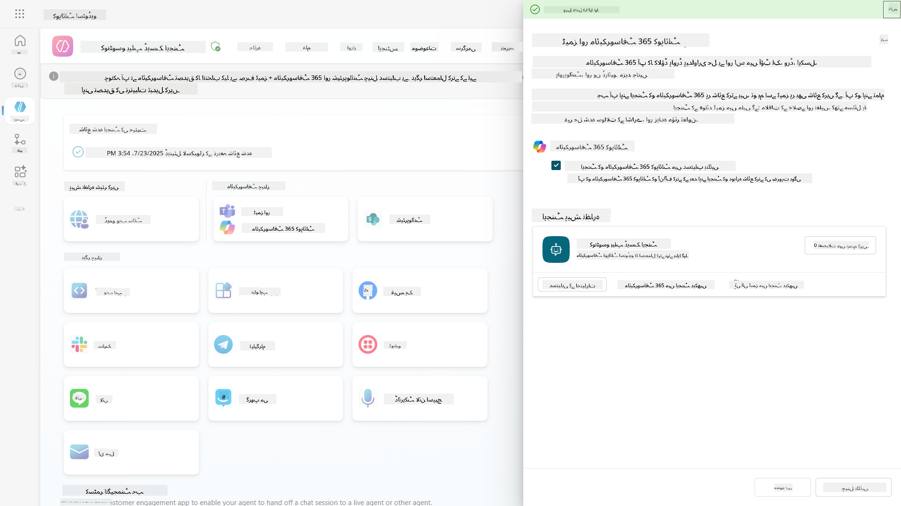

1. **Teams میں ایجنٹ دیکھیں** منتخب کریں تاکہ ایک نیا ٹیب کھلے

    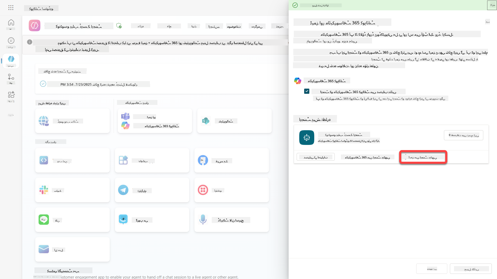

1. Contoso Helpdesk Agent کو Teams میں شامل کرنے کے لیے **شامل کریں** منتخب کریں

    

    اس میں تھوڑا وقت لگے گا۔ اس کے بعد درج ذیل اسکرین دکھائی دینی چاہیے:

    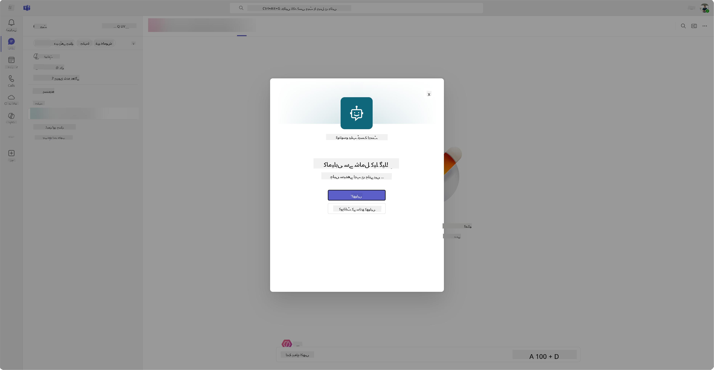

1. ایجنٹ کو Teams میں کھولنے کے لیے **کھولیں** منتخب کریں

    یہ ایجنٹ کو Teams میں ایک Teams ایپ کے طور پر کھول دے گا

    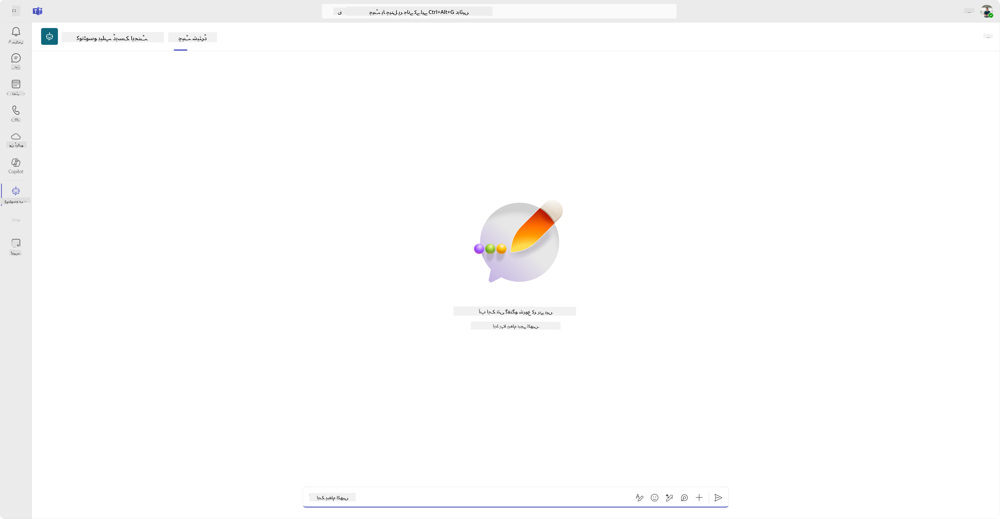

اب ہم نے ایجنٹ کو Microsoft Teams میں آپ کے لیے کام کرنے کے لیے شائع کیا ہے، لیکن آپ اسے مزید لوگوں کے لیے دستیاب بنانا چاہتے ہیں۔

### 11.3 ایجنٹ کو کرایہ دار میں تمام صارفین کے لیے دستیاب بنائیں

1. وہ براؤزر ٹیب بند کریں جہاں Contoso Helpdesk Agent کھلا ہوا ہے

    یہ آپ کو واپس Copilot Studio میں لے آنا چاہیے جہاں Teams اور Microsoft 365 Copilot سائیڈ پینل ابھی بھی کھلا ہے۔ ہم نے ابھی ایجنٹ کو Teams میں کھولا ہے، لیکن ہم یہاں بہت کچھ کر سکتے ہیں۔ ہم ایجنٹ کی تفصیلات میں ترمیم کر سکتے ہیں، ہم ایجنٹ کو مزید صارفین کے لیے تعینات کر سکتے ہیں اور مزید۔

1. **تفصیلات میں ترمیم کریں** منتخب کریں

    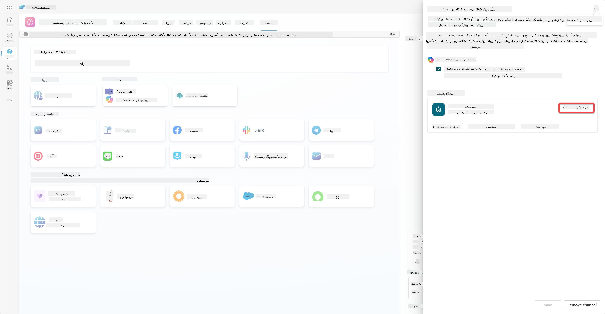
یہ ایک پین کھولے گا جہاں ہم ایجنٹ کی تفصیلات اور سیٹنگز کو تبدیل کر سکتے ہیں۔ ہم بنیادی تفصیلات جیسے آئیکن، آئیکن کے پس منظر کا رنگ اور وضاحتیں تبدیل کر سکتے ہیں۔ ہم یہاں Teams کی سیٹنگز بھی تبدیل کر سکتے ہیں (مثال کے طور پر، صارف کو ایجنٹ کو ٹیم میں شامل کرنے کی اجازت دینا، یا گروپ اور میٹنگ چیٹس میں اس ایجنٹ کو استعمال کرنے کی اجازت دینا)۔ جب آپ *مزید* منتخب کریں گے، تو آپ ڈویلپر کی تفصیلات بھی تبدیل کر سکتے ہیں جیسے ڈویلپر کا نام، ویب سائٹ، پرائیویسی بیان اور استعمال کی شرائط۔

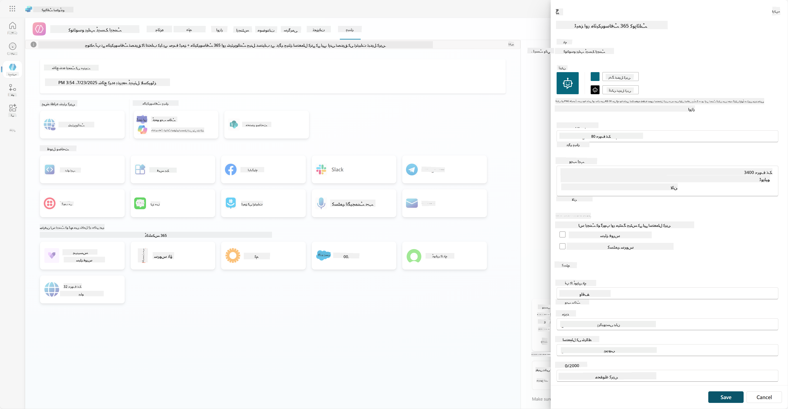

1. **Cancel** منتخب کریں تاکہ تفصیلات ایڈٹ کرنے کا پین بند ہو جائے۔

1. **Availability options** منتخب کریں۔

یہ دستیابی کے اختیارات کا پین کھولے گا، جہاں آپ صارفین کو ایجنٹ استعمال کرنے کے لیے لنک بھیجنے کے لیے کاپی کر سکتے ہیں (یاد رکھیں، آپ کو ایجنٹ کو صارف کے ساتھ بھی شیئر کرنا ہوگا) اور آپ ایک فائل ڈاؤنلوڈ کر سکتے ہیں تاکہ آپ کا ایجنٹ Microsoft Teams یا Microsoft 365 اسٹور میں شامل کیا جا سکے۔ ایجنٹ کو اسٹور میں دکھانے کے لیے آپ کے پاس دیگر اختیارات بھی ہیں: آپ اسے اپنی ٹیم کے ساتھیوں اور شیئر کیے گئے صارفین کو دکھا سکتے ہیں (تاکہ *Built with Power Platform* سیکشن میں دکھایا جا سکے) یا آپ اسے اپنی تنظیم کے ہر فرد کو دکھا سکتے ہیں (اس کے لیے ایڈمنسٹریٹر کی منظوری ضروری ہے)۔

1. **Show to everyone in my org** منتخب کریں۔

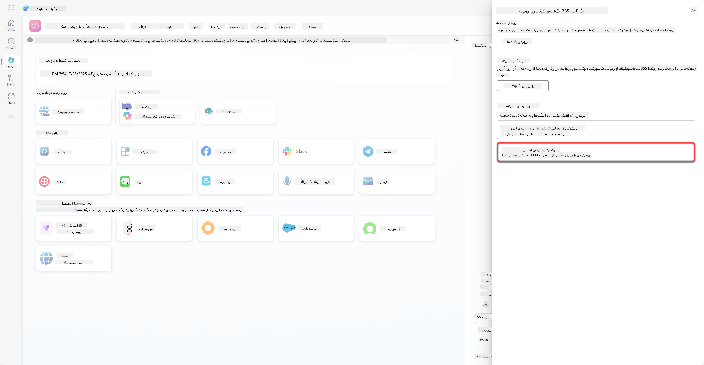

1. **Submit for admin approval** منتخب کریں۔

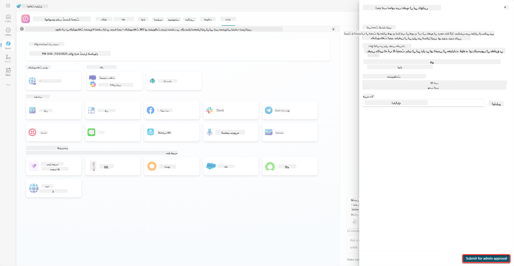

اب، آپ کے ایڈمنسٹریٹر کو آپ کے ایجنٹ کی جمع کرائی گئی درخواست کی منظوری دینی ہوگی۔ وہ یہ کام Teams Admin Center میں جا کر اور Apps میں Contoso Helpdesk Agent کو تلاش کر کے کر سکتے ہیں۔ اس اسکرین شاٹ میں آپ دیکھ سکتے ہیں کہ ایڈمنسٹریٹر Teams Admin Center میں کیا دیکھے گا۔

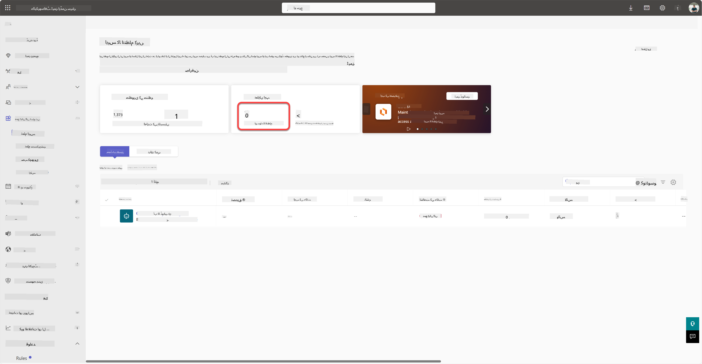

ایڈمنسٹریٹر کو Contoso Helpdesk Agent منتخب کرنا ہوگا اور *Publish* منتخب کرنا ہوگا تاکہ Contoso Helpdesk Agent کو سب کے لیے شائع کیا جا سکے۔

جب ایڈمنسٹریٹر نے ایجنٹ کی جمع کرائی گئی درخواست شائع کر دی، تو آپ Copilot Studio کو ریفریش کر سکیں گے اور آپ کو دستیابی کے اختیارات میں *available in app store* کا بینر نظر آئے گا۔

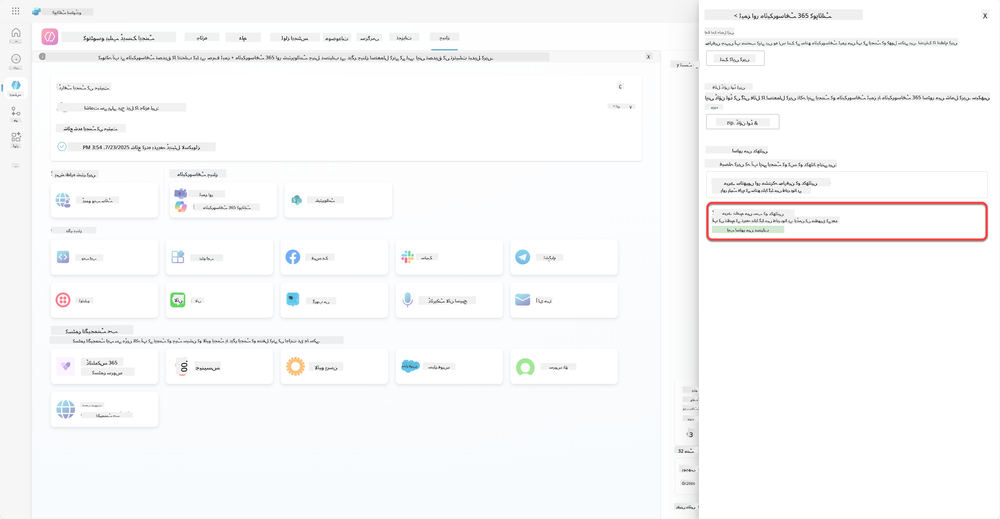

یہاں مزید امکانات بھی موجود ہیں۔ آپ کا ایڈمنسٹریٹر گلوبل سیٹ اپ پالیسی کو تبدیل کر سکتا ہے اور Contoso Helpdesk Agent کو ٹیننٹ میں سب کے لیے خودکار طور پر انسٹال کر سکتا ہے۔ اس کے علاوہ - آپ Contoso Helpdesk Agent کو بائیں جانب ریل پر پن کر سکتے ہیں تاکہ سب کو اس تک آسان رسائی حاصل ہو۔

## ✅ مشن مکمل

🎉 **مبارک ہو!** آپ نے کامیابی سے اپنا ایجنٹ شائع کیا اور اسے Teams اور Microsoft 365 Copilot میں شامل کیا! اگلا مرحلہ کورس کا آخری مشن ہے: لائسنسنگ کو سمجھنا۔

⏭️ [**لائسنسنگ کو سمجھنا** سبق پر جائیں](../12-understanding-licensing/README.md)

## 📚 حکمت عملی کے وسائل

🔗 [پبلش چینلز کی دستاویزات](https://learn.microsoft.com/microsoft-copilot-studio/publication-fundamentals-publish-channels)

---

**ڈسکلیمر**:  
یہ دستاویز AI ترجمہ سروس [Co-op Translator](https://github.com/Azure/co-op-translator) کا استعمال کرتے ہوئے ترجمہ کی گئی ہے۔ ہم درستگی کے لیے کوشش کرتے ہیں، لیکن براہ کرم آگاہ رہیں کہ خودکار ترجمے میں غلطیاں یا غیر درستیاں ہو سکتی ہیں۔ اصل دستاویز کو اس کی اصل زبان میں مستند ذریعہ سمجھا جانا چاہیے۔ اہم معلومات کے لیے، پیشہ ور انسانی ترجمہ کی سفارش کی جاتی ہے۔ ہم اس ترجمے کے استعمال سے پیدا ہونے والی کسی بھی غلط فہمی یا غلط تشریح کے ذمہ دار نہیں ہیں۔