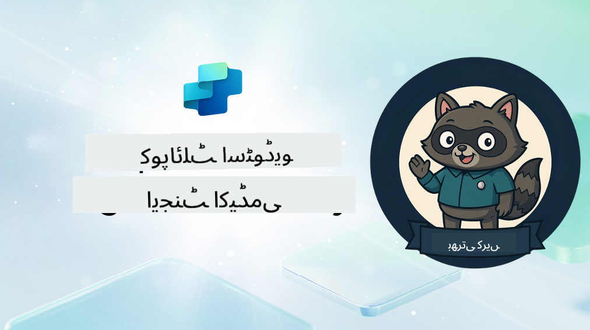

<!--
CO_OP_TRANSLATOR_METADATA:
{
  "original_hash": "8b5ecad9d5d073ea3f4c2b844e80f2e5",
  "translation_date": "2025-10-22T19:19:36+00:00",
  "source_file": "docs/recruit/README.md",
  "language_code": "ur"
}
-->
# خوش آمدید، ریکروٹ

**خوش آمدید، ریکروٹ۔**  
آپ کا مشن—اگر آپ اسے قبول کرتے ہیں—یہ ہے کہ **Microsoft Copilot Studio** کے ذریعے ایجنٹس بنانے کے فن میں مہارت حاصل کریں۔

یہ عملی تربیت آپ کو **ایجنٹس کی دنیا** میں داخل ہونے کا موقع فراہم کرتی ہے: بنیادی پرامپٹس سے لے کر Adaptive Cards اور ایجنٹ فلو تک، آپ حقیقی دنیا کے ٹولز اور استعمال کے کیسز کے ذریعے ذہین ایجنٹس بنانے، بڑھانے اور تعینات کرنے کا طریقہ سیکھیں گے۔

---

## 🎯 مشن کا مقصد

Agent Academy مکمل کرنے کے بعد آپ:

- Microsoft Copilot Studio کے تناظر میں ایجنٹس کو سمجھ سکیں گے
- یہ جان سکیں گے کہ Large Language Models (LLMs)، retrieval-augmented generation (RAG)، اور orchestration ایجنٹ میں کیسے یکجا ہوتے ہیں
- **declarative** اور **custom agents** دونوں بنا سکیں گے
- ایجنٹس کو **Topics**, **Adaptive Cards**, اور **Agent Flows** کے ذریعے بہتر بنا سکیں گے
- ایجنٹس کو **Microsoft Teams** اور **Microsoft 365 Copilot** پر تعینات کر سکیں گے

---

## 🧪 ضروریات

تمام مشنز مکمل کرنے کے لیے آپ کو ضرورت ہوگی:

- Microsoft 365 Developer tenant (جس میں SharePoint فعال ہو)
- **Microsoft Copilot Studio** تک رسائی (ٹرائل یا لائسنس یافتہ)
- اختیاری: SharePoint، Power Platform، یا Power Fx کا بنیادی علم

---

## 🧬 یہ کس کے لیے ہے؟

یہ کورس ان لوگوں کے لیے بہترین ہے:

- وہ میکرز اور ڈویلپرز جو **Copilot Studio** کو دریافت کر رہے ہیں
- وہ IT پروفیشنلز جو **Microsoft 365 Copilot extensions** بنا رہے ہیں
- وہ Power Platform کے شوقین جو ذہین ایجنٹس کے ساتھ **مہارت حاصل کرنا چاہتے ہیں**
- وہ لوگ جو **عملی طور پر سیکھنے** کو ترجیح دیتے ہیں

---

## 🧭 نصاب کا جائزہ

یہ اکیڈمی ترقی پسند اسباق میں تقسیم ہے—ہر سبق ایک فیلڈ مشن کے طور پر ڈیزائن کیا گیا ہے تاکہ آپ کی ایجنٹ بنانے کی مہارت کو بہتر بنایا جا سکے۔

| سبق | عنوان | مشن کی تفصیلات |
|--------|-------|------------------|
| `00` | 🧰 [کورس سیٹ اپ](./00-course-setup/README.md) | اپنا ڈویلپمنٹ ماحول، Copilot Studio ٹرائل، اور SharePoint سائٹ سیٹ اپ کریں |
| `01` | 🧠 [ایجنٹس کا تعارف](./01-introduction-to-agents/README.md) | conversational AI کے تصورات، LLMs، اور autonomous vs. declarative ایجنٹس کو سمجھیں |
| `02` | 🛠️ [Copilot Studio کی بنیادی باتیں](./02-copilot-studio-fundamentals/README.md) | بنیادی اجزاء سیکھیں: knowledge, skills, autonomy |
| `03` | 👩‍💻 [ایک Declarative Agent بنائیں](./03-create-a-declarative-agent-for-M365Copilot/README.md) | Microsoft 365 Copilot میں اپنا ایجنٹ شامل کریں، جو ایک پرامپٹ پر مبنی ہو |
| `04` | 🧩 [ایک حل بنانا](./04-creating-a-solution/README.md) | اپنے ایجنٹ کو ماحول کے انتظام کے لیے ایک قابل استعمال حل میں پیک کریں |
| `05` | 🚀 [پری بلٹ ایجنٹس کے ساتھ شروعات کریں](./05-using-prebuilt-agents/README.md) | سیٹ اپ کو تیز کرنے کے لیے ایک ٹیمپلیٹ ایجنٹ استعمال کریں اور حسب ضرورت بنائیں |
| `06` | ✍️ [ایک کسٹم ایجنٹ بنائیں](./06-create-agent-from-conversation/README.md) | علم کے ذرائع پر مبنی ایک نیا Copilot بنائیں |
| `07` | 🧠 [ایک ٹاپک کے ساتھ ٹرگرز شامل کریں](./07-add-new-topic-with-trigger/README.md) | سوال/جواب کے حسب ضرورت راستے کی وضاحت کے لیے Topics استعمال کریں |
| `08` | 🪪 [Adaptive Cards کے ساتھ اضافہ کریں](./08-add-adaptive-card/README.md) | Power Fx اور SharePoint کا استعمال کرتے ہوئے ایک Adaptive Card بنائیں |
| `09` | 🔁 [Agent Flows کے ساتھ خودکار بنائیں](./09-add-an-agent-flow/README.md) | Adaptive Card ان پٹ کا استعمال کرتے ہوئے بیک اینڈ فلو کو ٹرگر کریں |
| `10` | 🧭 [ایونٹ ٹرگرز شامل کریں](./10-add-event-triggers/README.md) | اپنے ایجنٹ کو ایونٹ پر مبنی منطق کا استعمال کرتے ہوئے خود مختار طور پر کام کرنے کے قابل بنائیں |
| `11` | 📢 [اپنا ایجنٹ شائع کریں](./11-publish-your-agent/README.md) | اپنے ایجنٹ کو Microsoft Teams اور Microsoft 365 Copilot پر تعینات کریں |
| `12` | 🪪 [لائسنسنگ کو سمجھنا](./12-understanding-licensing/README.md) | Copilot Studio کے ساتھ لائسنسنگ اور بلنگ کیسے کام کرتی ہے، یہ سیکھیں |
| `13` | 🚨 [اپنا ریکروٹ بیج حاصل کریں](./course-completion-badges-recruit/README.md) | اپنا بیج حاصل کریں اور اپنی کامیابی کو نشان زد کریں! |

!!! note
    ✅ اس نصاب کو مکمل کرنے سے آپ کو **ریکروٹ** بیج حاصل ہوگا۔  
    🔓 **Operative** اور **Commander** مستقبل کے مراحل میں کھلیں گے۔

<!-- markdownlint-disable-next-line MD033 -->

---

**ڈسکلیمر**:  
یہ دستاویز AI ترجمہ سروس [Co-op Translator](https://github.com/Azure/co-op-translator) کا استعمال کرتے ہوئے ترجمہ کی گئی ہے۔ ہم درستگی کے لیے کوشش کرتے ہیں، لیکن براہ کرم آگاہ رہیں کہ خودکار ترجمے میں غلطیاں یا غیر درستیاں ہو سکتی ہیں۔ اصل دستاویز کو اس کی اصل زبان میں مستند ذریعہ سمجھا جانا چاہیے۔ اہم معلومات کے لیے، پیشہ ور انسانی ترجمہ کی سفارش کی جاتی ہے۔ ہم اس ترجمے کے استعمال سے پیدا ہونے والی کسی بھی غلط فہمی یا غلط تشریح کے ذمہ دار نہیں ہیں۔