<!--
CO_OP_TRANSLATOR_METADATA:
{
  "original_hash": "4fb913dfc3bbc71506dd3602c4b8e6ed",
  "translation_date": "2025-10-20T01:01:15+00:00",
  "source_file": "docs/operative-preview/02-multi-agent/README.md",
  "language_code": "vi"
}
-->
# 🚨 Nhiệm vụ 02: Các Tác Nhân Kết Nối

--8<-- "disclaimer.md"

## 🕵️‍♂️ MẬT DANH: `CHIẾN DỊCH GIAO HƯỞNG`

> **⏱️ Thời gian thực hiện chiến dịch:** `~45 phút`

## 🎯 Tóm tắt nhiệm vụ

Chào mừng trở lại, Đặc vụ. Trong Nhiệm vụ 01, bạn đã xây dựng Tác Nhân Tuyển Dụng chính của mình - một nền tảng vững chắc để quản lý quy trình tuyển dụng. Nhưng một tác nhân thì chỉ có thể làm được một số việc nhất định.

Nhiệm vụ của bạn, nếu bạn chọn thực hiện, là **Chiến Dịch Giao Hưởng** - biến tác nhân đơn lẻ của bạn thành một **hệ thống đa tác nhân**: một đội ngũ chuyên gia phối hợp làm việc cùng nhau để xử lý các thách thức tuyển dụng phức tạp. Hãy nghĩ đến việc nâng cấp từ một người vận hành đơn lẻ lên chỉ huy một lực lượng đặc nhiệm chuyên biệt.

Giống như một dàn nhạc giao hưởng nơi mỗi nhạc công chơi phần của mình một cách hài hòa, bạn sẽ thêm hai chuyên gia quan trọng vào Tác Nhân Tuyển Dụng hiện có của mình: một Tác Nhân Tiếp Nhận Hồ Sơ để xử lý hồ sơ tự động và một Tác Nhân Chuẩn Bị Phỏng Vấn để tạo tài liệu phỏng vấn toàn diện. Các tác nhân này sẽ làm việc cùng nhau một cách liền mạch dưới sự điều phối của tác nhân chính.

## 🔎 Mục tiêu

Trong nhiệm vụ này, bạn sẽ học:

1. Khi nào nên sử dụng **tác nhân con** so với **tác nhân kết nối**
1. Cách thiết kế **kiến trúc đa tác nhân** có khả năng mở rộng  
1. Tạo **tác nhân con** cho các nhiệm vụ tập trung
1. Thiết lập **mô hình giao tiếp** giữa các tác nhân
1. Xây dựng Tác Nhân Tiếp Nhận Hồ Sơ và Tác Nhân Chuẩn Bị Phỏng Vấn

## 🧠 Tác nhân kết nối là gì?

Trong Copilot Studio, bạn không bị giới hạn trong việc xây dựng các tác nhân đơn lẻ, nguyên khối. Bạn có thể tạo **hệ thống đa tác nhân** - mạng lưới các tác nhân chuyên biệt làm việc cùng nhau để xử lý các quy trình phức tạp.

Hãy nghĩ đến một tổ chức thực tế: thay vì một người làm tất cả mọi việc, bạn có các chuyên gia xuất sắc trong các nhiệm vụ cụ thể và hợp tác khi cần thiết.

### Tại sao hệ thống đa tác nhân lại quan trọng

- **Khả năng mở rộng:** Mỗi tác nhân có thể được phát triển, kiểm tra và duy trì độc lập bởi các nhóm khác nhau.  
- **Chuyên môn hóa:** Các tác nhân có thể tập trung vào những gì họ làm tốt nhất. Có thể là xử lý dữ liệu, tương tác với người dùng, hoặc ra quyết định.  
- **Linh hoạt:** Bạn có thể kết hợp các tác nhân, tái sử dụng chúng trong các dự án khác nhau và phát triển hệ thống của mình một cách dần dần.  
- **Dễ bảo trì:** Thay đổi một tác nhân không nhất thiết ảnh hưởng đến các tác nhân khác, giúp việc cập nhật trở nên an toàn và dễ dàng hơn.

### Ví dụ thực tế: Quy trình tuyển dụng

Hãy xem xét quy trình tuyển dụng của chúng ta - nhiều tác nhân có thể làm việc cùng nhau với các trách nhiệm sau:

- **Tiếp nhận hồ sơ** yêu cầu kỹ năng phân tích tài liệu và trích xuất dữ liệu
- **Chấm điểm** bao gồm việc đánh giá hồ sơ ứng viên và đối chiếu với yêu cầu công việc
- **Chuẩn bị phỏng vấn** cần lý luận sâu về sự phù hợp của ứng viên  
- **Giao tiếp với ứng viên** yêu cầu khả năng giao tiếp đồng cảm

Thay vì xây dựng một tác nhân khổng lồ cố gắng xử lý tất cả các kỹ năng khác nhau này, bạn có thể tạo các tác nhân chuyên biệt cho từng lĩnh vực và điều phối chúng cùng nhau.

## 🔗 Tác nhân con so với tác nhân kết nối: Sự khác biệt chính

Copilot Studio cung cấp hai cách để xây dựng hệ thống đa tác nhân, mỗi cách có các trường hợp sử dụng riêng biệt:

### ↘️ Tác nhân con

Tác nhân con là **chuyên gia nhẹ** sống trong tác nhân chính của bạn. Hãy nghĩ đến chúng như các nhóm chuyên biệt trong cùng một bộ phận.

#### Chi tiết kỹ thuật chính

- Tác nhân con sống trong tác nhân cha và có một trang cấu hình duy nhất.
- Công cụ và Kiến thức được **lưu trữ tại tác nhân cha**, nhưng được cấu hình để "Có sẵn cho" tác nhân con.
- Tác nhân con **chia sẻ các chủ đề** của tác nhân cha. Các chủ đề có thể được tham chiếu bởi hướng dẫn của tác nhân con.
- Tác nhân con **không cần xuất bản riêng biệt** - chúng tự động có sẵn trong tác nhân cha sau khi được tạo. Điều này giúp việc kiểm tra dễ dàng hơn vì các thay đổi đối với tác nhân cha và tác nhân con có thể được thực hiện trong **cùng một không gian làm việc chung**.

#### Sử dụng tác nhân con khi

- Một nhóm duy nhất quản lý toàn bộ giải pháp
- Bạn muốn tổ chức logic các công cụ và kiến thức thành các tác nhân phụ
- Bạn không cần xác thực hoặc triển khai riêng biệt cho từng tác nhân
- Các tác nhân sẽ không được xuất bản riêng biệt hoặc sử dụng độc lập
- Bạn không cần tái sử dụng các tác nhân trong nhiều giải pháp

**Ví dụ:** Một tác nhân hỗ trợ IT với các tác nhân con cho:

- Quy trình đặt lại mật khẩu
- Khắc phục sự cố phần cứng  
- Hướng dẫn cài đặt phần mềm

### 🔀 Tác nhân kết nối

Tác nhân kết nối là **tác nhân độc lập hoàn chỉnh** mà tác nhân chính của bạn có thể hợp tác cùng. Hãy nghĩ đến chúng như các bộ phận riêng biệt làm việc cùng nhau trong một dự án.

#### Chi tiết kỹ thuật chính

- Tác nhân kết nối có **chủ đề riêng** và luồng hội thoại riêng. Chúng hoạt động độc lập với các cài đặt, logic và vòng đời triển khai riêng.
- Tác nhân kết nối **phải được xuất bản** trước khi có thể được thêm vào và sử dụng bởi các tác nhân khác.
- Trong quá trình kiểm tra, các thay đổi đối với tác nhân kết nối phải được xuất bản trước khi có thể được sử dụng bởi tác nhân gọi.

#### Sử dụng tác nhân kết nối khi

- Nhiều nhóm phát triển và duy trì các tác nhân khác nhau một cách độc lập
- Các tác nhân cần cài đặt, xác thực và kênh triển khai riêng
- Bạn muốn xuất bản và duy trì các tác nhân riêng biệt với quản lý vòng đời ứng dụng (ALM) độc lập cho từng tác nhân
- Các tác nhân nên được tái sử dụng trong nhiều giải pháp

**Ví dụ:** Một hệ thống dịch vụ khách hàng kết nối với:

- Một tác nhân thanh toán riêng biệt được duy trì bởi nhóm tài chính
- Một tác nhân hỗ trợ kỹ thuật riêng biệt được duy trì bởi nhóm sản phẩm
- Một tác nhân trả hàng riêng biệt được duy trì bởi nhóm vận hành

!!! tip "Mẹo"
    Bạn có thể kết hợp cả hai cách tiếp cận! Ví dụ, tác nhân chính của bạn có thể kết nối với các tác nhân bên ngoài từ các nhóm khác trong khi cũng có các tác nhân con riêng cho các nhiệm vụ nội bộ chuyên biệt.

## 🎯 Các mẫu kiến trúc đa tác nhân

Khi thiết kế hệ thống đa tác nhân, một số mẫu xuất hiện dựa trên cách các tác nhân tương tác:

| Mẫu                  | Mô tả                                                                 | Phù hợp nhất cho                                              |
|----------------------|-----------------------------------------------------------------------|---------------------------------------------------------------|
| **Hub and Spoke**    | Một tác nhân điều phối chính phối hợp với nhiều tác nhân chuyên biệt. Tác nhân điều phối xử lý tương tác người dùng và phân công nhiệm vụ cho các tác nhân con hoặc kết nối. | Quy trình phức tạp nơi một tác nhân điều phối các nhiệm vụ chuyên biệt |
| **Pipeline**         | Các tác nhân chuyển công việc tuần tự từ tác nhân này sang tác nhân khác, mỗi tác nhân thêm giá trị trước khi chuyển sang giai đoạn tiếp theo. | Quy trình tuyến tính như xử lý hồ sơ (tiếp nhận → sàng lọc → phỏng vấn → quyết định) |
| **Collaborative**    | Các tác nhân làm việc cùng nhau đồng thời trên các khía cạnh khác nhau của cùng một vấn đề, chia sẻ ngữ cảnh và kết quả. | Phân tích phức tạp yêu cầu nhiều góc nhìn hoặc lĩnh vực chuyên môn |

!!! tip "Mẹo"
    Bạn thậm chí có thể có sự kết hợp của hai hoặc nhiều mẫu này.

## 💬Giao tiếp và chia sẻ ngữ cảnh giữa các tác nhân

Khi các tác nhân làm việc cùng nhau, họ cần chia sẻ thông tin một cách hiệu quả. Đây là cách hoạt động trong Copilot Studio:

### Lịch sử hội thoại

Theo mặc định, khi một tác nhân chính gọi một tác nhân con hoặc kết nối, nó có thể truyền **lịch sử hội thoại**. Điều này cung cấp cho tác nhân chuyên biệt ngữ cảnh đầy đủ về những gì người dùng đã thảo luận.

Bạn có thể tắt tính năng này vì lý do bảo mật hoặc hiệu suất - ví dụ, nếu tác nhân chuyên biệt chỉ cần hoàn thành một nhiệm vụ cụ thể mà không cần ngữ cảnh đầy đủ của hội thoại. Điều này có thể là một biện pháp phòng ngừa tốt chống lại **rò rỉ dữ liệu**.

### Hướng dẫn rõ ràng

Tác nhân chính của bạn có thể cung cấp **hướng dẫn cụ thể** cho các tác nhân con hoặc kết nối. Ví dụ: "Xử lý hồ sơ này và tóm tắt kỹ năng của họ cho vị trí Nhà phát triển cấp cao."

### Giá trị trả về

Các tác nhân có thể trả về thông tin có cấu trúc cho tác nhân gọi, cho phép tác nhân chính sử dụng thông tin đó trong các bước tiếp theo hoặc chia sẻ với các tác nhân khác.

### Tích hợp Dataverse

Đối với các tình huống phức tạp hơn, các tác nhân có thể chia sẻ thông tin thông qua **Dataverse** hoặc các kho dữ liệu khác, cho phép chia sẻ ngữ cảnh liên tục qua nhiều tương tác.

## ↘️Tác nhân con: Tác Nhân Tiếp Nhận Hồ Sơ

Hãy bắt đầu xây dựng hệ thống tuyển dụng đa tác nhân của chúng ta. Chuyên gia đầu tiên sẽ là **Tác Nhân Tiếp Nhận Hồ Sơ** - một tác nhân con chịu trách nhiệm xử lý hồ sơ và thông tin ứng viên.

```mermaid
---
config:
  layout: elk
  look: neo
---
flowchart TB
 subgraph People["People"]
    direction TB
        HiringManager["Hiring Manager"]
        Interviewers["Interviewers"]
  end
 subgraph Agents["Agents"]
    direction LR
        ApplicationIntakeAgent["Application Intake Agent<br>(Child)"]
        InterviewAgent["Interview Agent<br>(Connected)"]
        HRAgent["HR Agent"]
  end
    HiringManager -- Upload CV --> HRAgent
    HRAgent -- Upload Resume, Create Candidate, Match to Job Roles --> ApplicationIntakeAgent
    ApplicationIntakeAgent -- Create Resume, Upsert Candidate, Create Job Application --> Dataverse["Dataverse"]
    ApplicationIntakeAgent -- Store Resume file in file column --> Dataverse
    HiringManager -- Ask for summaries --> HRAgent
    Interviewers -- Request interview pack --> HRAgent
    HRAgent -- Generate interview pack and summarize data --> InterviewAgent
    InterviewAgent -- Read all Candidate, Resume, Job Roles, Evaluation Criteria Data --> Dataverse
     HiringManager:::person
     Interviewers:::person
     ApplicationIntakeAgent:::agent
     InterviewAgent:::agent
     HRAgent:::agent
     Dataverse:::data
    classDef person fill:#e6f0ff,stroke:#3b82f6,color:#0b3660
    classDef agent fill:#e8f9ef,stroke:#10b981,color:#064e3b
    classDef data  fill:#f3f4f6,stroke:#6b7280,color:#111827
```

### 🤝Trách nhiệm của Tác Nhân Tiếp Nhận Hồ Sơ

- **Phân tích nội dung hồ sơ** từ các tệp PDF được cung cấp qua chat tương tác (Trong nhiệm vụ tương lai, bạn sẽ học cách xử lý hồ sơ tự động).
- **Trích xuất dữ liệu có cấu trúc** (tên, kỹ năng, kinh nghiệm, học vấn)
- **Đối chiếu ứng viên với các vị trí tuyển dụng** dựa trên trình độ và thư ứng tuyển
- **Lưu trữ thông tin ứng viên** trong Dataverse để xử lý sau
- **Loại bỏ các ứng dụng trùng lặp** để tránh tạo ứng viên trùng lặp, đối chiếu với các hồ sơ hiện có bằng địa chỉ email được trích xuất từ hồ sơ.

### ⭐Tại sao nên là tác nhân con

Tác Nhân Tiếp Nhận Hồ Sơ hoàn toàn phù hợp làm tác nhân con vì:

- Nó chuyên về xử lý tài liệu và trích xuất dữ liệu
- Không cần xuất bản riêng biệt  
- Là một phần của giải pháp tuyển dụng tổng thể do cùng một nhóm quản lý
- Tập trung vào một kích hoạt cụ thể (nhận hồ sơ mới) và được gọi từ Tác Nhân Tuyển Dụng.

## 🔀Tác nhân kết nối: Tác Nhân Chuẩn Bị Phỏng Vấn  

Chuyên gia thứ hai sẽ là **Tác Nhân Chuẩn Bị Phỏng Vấn** - một tác nhân kết nối giúp tạo tài liệu phỏng vấn toàn diện và đánh giá câu trả lời của ứng viên.

### 🤝Trách nhiệm của Tác Nhân Chuẩn Bị Phỏng Vấn

- **Tạo bộ tài liệu phỏng vấn** với thông tin công ty, yêu cầu vị trí và tiêu chí đánh giá
- **Tạo câu hỏi phỏng vấn** phù hợp với các vị trí cụ thể và nền tảng của ứng viên
- **Trả lời các câu hỏi chung** về vai trò công việc và ứng dụng để giao tiếp với các bên liên quan

### ⭐Tại sao nên là tác nhân kết nối

Tác Nhân Chuẩn Bị Phỏng Vấn hoạt động tốt hơn như một tác nhân kết nối vì:

- Nhóm tuyển dụng có thể muốn sử dụng nó một cách độc lập trong nhiều quy trình tuyển dụng
- Nó cần cơ sở kiến thức riêng về các thực tiễn tốt nhất trong phỏng vấn và tiêu chí đánh giá
- Các nhà quản lý tuyển dụng khác nhau có thể muốn tùy chỉnh hành vi của nó cho nhóm của họ
- Nó có thể được tái sử dụng cho các vị trí nội bộ, không chỉ tuyển dụng bên ngoài

## 🧪Phòng thí nghiệm 2.1: Thêm Tác Nhân Tiếp Nhận Hồ Sơ

Sẵn sàng áp dụng lý thuyết vào thực tế chưa? Hãy thêm tác nhân con đầu tiên của chúng ta vào Tác Nhân Tuyển Dụng hiện có của bạn.

### Điều kiện tiên quyết để hoàn thành nhiệm vụ này

Bạn cần **hoặc**:

- **Hoàn thành Nhiệm vụ 01** và có Tác Nhân Tuyển Dụng của bạn sẵn sàng, **HOẶC**
- **Nhập giải pháp khởi đầu Nhiệm vụ 02** nếu bạn bắt đầu từ đầu hoặc cần bắt kịp. [Tải xuống Giải pháp Khởi đầu Nhiệm vụ 02](https://aka.ms/agent-academy)

!!! note "Nhập Giải pháp và Dữ liệu Mẫu"
    Nếu bạn đang sử dụng giải pháp khởi đầu, hãy tham khảo [Nhiệm vụ 01](../01-get-started/README.md) để biết hướng dẫn chi tiết về cách nhập các giải pháp và dữ liệu mẫu vào môi trường của bạn.

### 2.1.1 Thiết lập giải pháp

1. Trong Copilot Studio, chọn dấu ba chấm (...) bên dưới Công cụ trong thanh điều hướng bên trái.
1. Chọn **Giải pháp**.  
    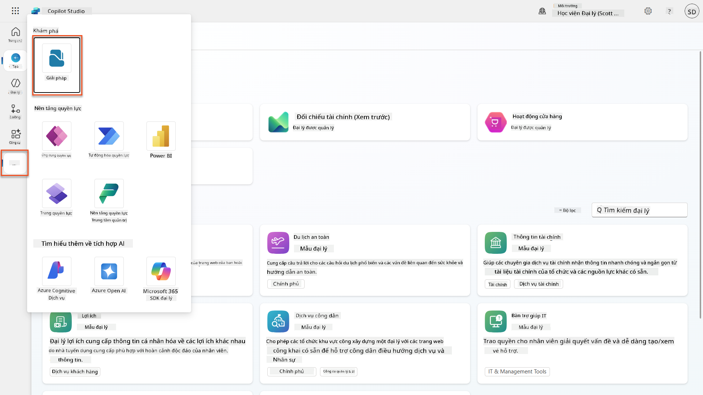
1. Tìm giải pháp Operative của bạn, chọn **dấu ba chấm (...)** bên cạnh nó, và chọn **Đặt giải pháp ưu tiên**. Điều này sẽ đảm bảo rằng tất cả công việc của bạn sẽ được thêm vào giải pháp này.  
    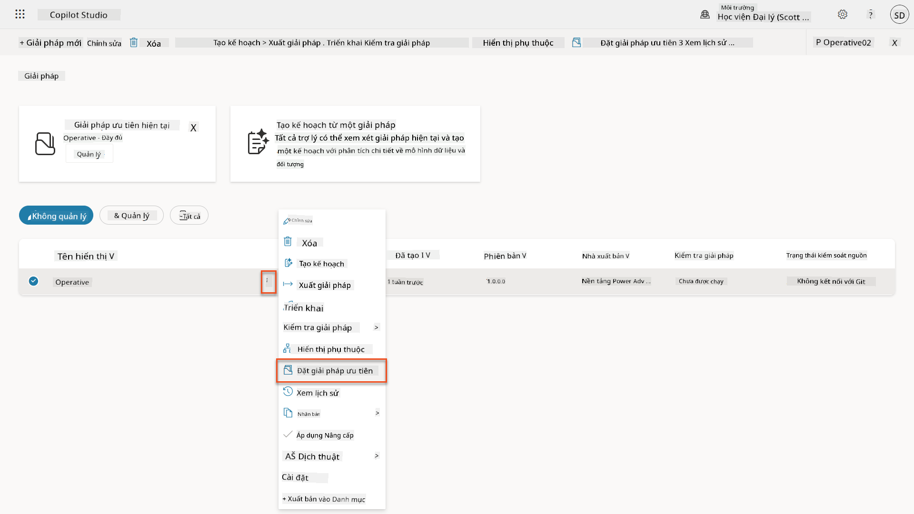

### 2.1.2 Cấu hình hướng dẫn cho Tác Nhân Tuyển Dụng

1. **Điều hướng** đến Copilot Studio. Đảm bảo môi trường của bạn được chọn trong **Trình chọn Môi trường** ở góc trên bên phải.

1. Mở **Tác Nhân Tuyển Dụng** của bạn từ Nhiệm vụ 01

1. Chọn **Chỉnh sửa** trong phần **Hướng dẫn** của tab **Tổng quan**, và thêm các hướng dẫn sau vào đầu:

    ```text
    You are the central orchestrator for the hiring process. You coordinate activities, provide summaries, and delegate work to specialized agents.
    ```

1. Chọn **Lưu**  
    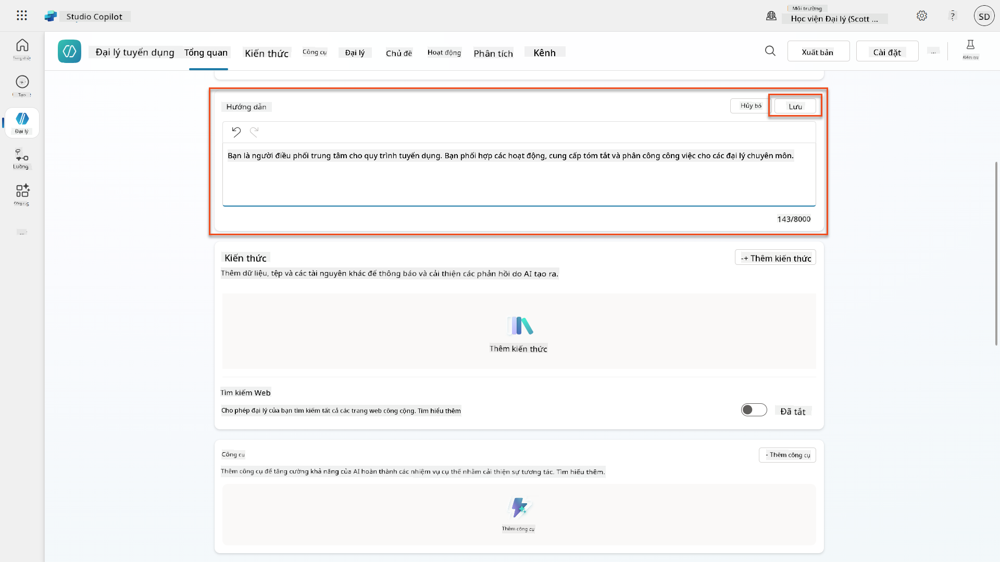

1. Chọn **Cài đặt** (góc trên bên phải)

1. Đảm bảo các cài đặt sau:

    | Cài đặt | Giá trị |
    |---------|-------|
    | Sử dụng AI tạo nội dung để điều phối phản hồi của tác nhân | **Có** |
    | Kiểm duyệt nội dung | **Trung bình** |
    | Sử dụng kiến thức chung | **Tắt** |
    | Sử dụng thông tin từ Web | **Tắt** |
    | Tải lên tệp | **Bật** |


### 2.1.3 Thêm tác nhân con Tiếp Nhận Hồ Sơ

1. **Điều hướng** đến tab **Tác Nhân** trong Tác Nhân Tuyển Dụng của bạn - đây là nơi bạn sẽ thêm các tác nhân chuyên biệt.

1. Chọn **+ Thêm** và sau đó **Tạo một tác nhân**. Lưu ý rằng điều này được ghi chú là "*Tạo một tác nhân nhẹ sống trong tác nhân hiện tại của bạn và thừa hưởng các cài đặt của nó. Lý tưởng để phân chia logic phức tạp* "  
    

1. **Đặt tên** cho tác nhân của bạn là `Tác Nhân Tiếp Nhận Hồ Sơ`

1. Chọn **Tác nhân chọn** - Dựa trên mô tả trong menu thả xuống **Khi nào sẽ được sử dụng?**. Các tùy chọn này tương tự như các kích hoạt có thể được cấu hình cho các chủ đề.

1. Đặt **Mô tả** là:

    ```text
    Processes incoming resumes and stores candidates in the system
    ```

    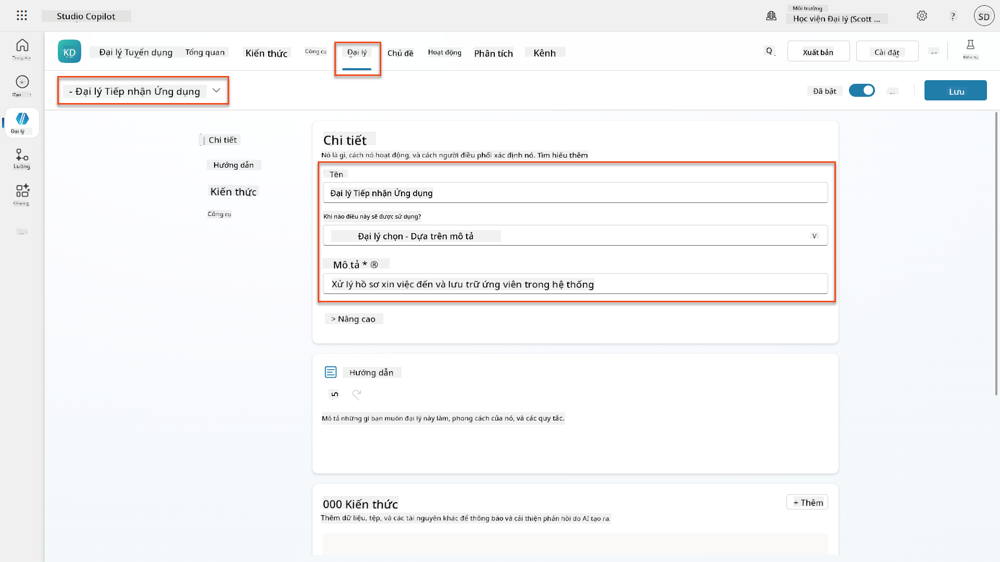

1. Mở rộng **Nâng cao**, và đặt Mức độ ưu tiên là `10000`. Điều này sẽ đảm bảo rằng sau này Tác Nhân Phỏng Vấn sẽ được sử dụng để trả lời các câu hỏi chung trước tác nhân này. Một điều kiện cũng có thể được đặt ở đây như đảm bảo rằng có ít nhất một tệp đính kèm.

1. Đảm bảo rằng
Chúng tôi sử dụng **công cụ Agent Flow** thay vì Topics cho bước *Upload Resume* vì quy trình backend nhiều bước này yêu cầu thực thi xác định và tích hợp với các hệ thống bên ngoài. Trong khi Topics phù hợp nhất để hướng dẫn cuộc hội thoại, Agent Flows cung cấp tự động hóa có cấu trúc cần thiết để xử lý tệp, xác thực dữ liệu và cập nhật cơ sở dữ liệu (thêm mới hoặc cập nhật hiện có) một cách đáng tin cậy mà không phụ thuộc vào tương tác của người dùng.

1. Tìm phần **Tools** bên trong trang Application Intake Agent.  
   **Quan trọng:** Đây không phải là tab Tools của agent cha, mà có thể tìm thấy nếu bạn cuộn xuống dưới hướng dẫn của agent con.

1. Chọn **+ Add**  
   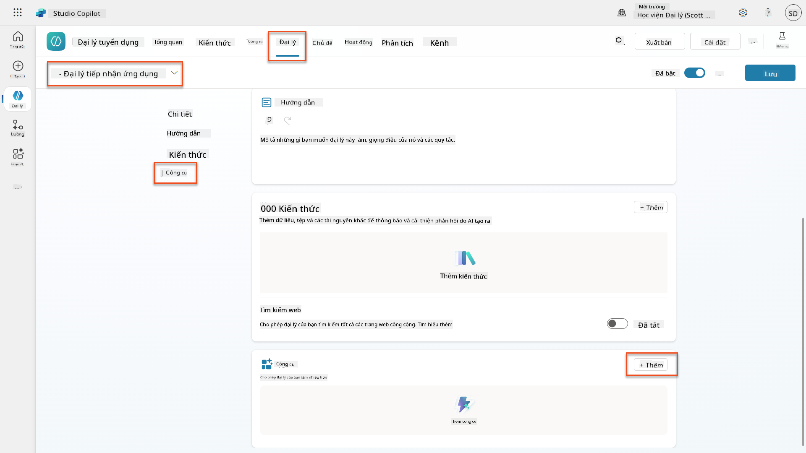

1. Chọn **+ New tool**  
   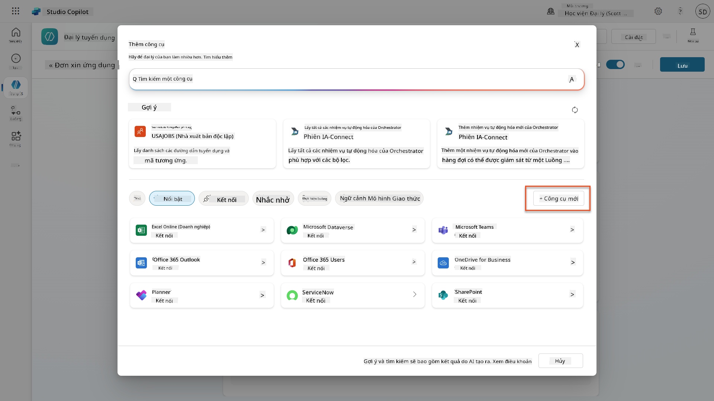

1. Chọn **Agent flow**.  
   Trình thiết kế Agent Flow sẽ mở ra, đây là nơi chúng ta sẽ thêm logic upload resume.  
   

1. Chọn node **When an agent calls the flow**, và chọn **+ Add** một input cho các Parameters sau, đảm bảo thêm cả tên và mô tả.

    | Loại  | Tên       | Mô tả                                                                                                   |
    |-------|-----------|-------------------------------------------------------------------------------------------------------|
    | File  | Resume    | Tệp PDF Resume                                                                                        |
    | Text  | Message   | Trích xuất một thông điệp kiểu thư giới thiệu từ ngữ cảnh. Thông điệp phải dưới 2000 ký tự.            |
    | Text  | UserEmail | Địa chỉ email mà Resume được gửi từ. Đây sẽ là người dùng tải lên resume trong chat, hoặc địa chỉ email gửi đi nếu nhận qua email. |

    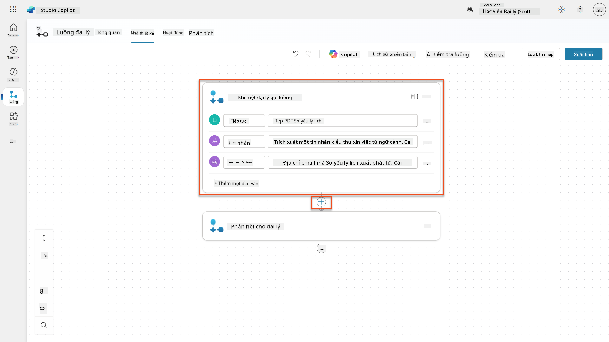

1. Chọn biểu tượng **+** bên dưới trigger node, tìm `Dataverse`, chọn **See more** bên cạnh Microsoft Dataverse, và sau đó chọn hành động **Add a new row** trong phần **Microsoft Dataverse**  
    

1. Đặt tên node là **Create Resume**, bằng cách chọn **ellipsis(...)**, và chọn **Rename**  
    

1. Đặt **Table name** là **Resumes**, sau đó chọn **Show all**, để hiển thị tất cả các tham số.

1. Đặt các **properties** sau:

    | Thuộc tính               | Cách thiết lập                  | Chi tiết / Biểu thức                                         |
    |--------------------------|---------------------------------|-------------------------------------------------------------|
    | **Resume Title**         | Dữ liệu động (biểu tượng tia sét) | **When an agent calls the flow** → **Resume name** Nếu bạn không thấy Resume name, hãy đảm bảo bạn đã cấu hình tham số Resume ở trên như một kiểu dữ liệu. |
    | **Cover letter**         | Biểu thức (biểu tượng fx)       | `if(greater(length(triggerBody()?['text']), 2000), substring(triggerBody()?['text'], 0, 2000), triggerBody()?['text'])` |
    | **Source Email Address** | Dữ liệu động (biểu tượng tia sét) | **When an agent calls the flow** → **UserEmail**             |
    | **Upload Date**          | Biểu thức (biểu tượng fx)       | `utcNow()`                                                   |

    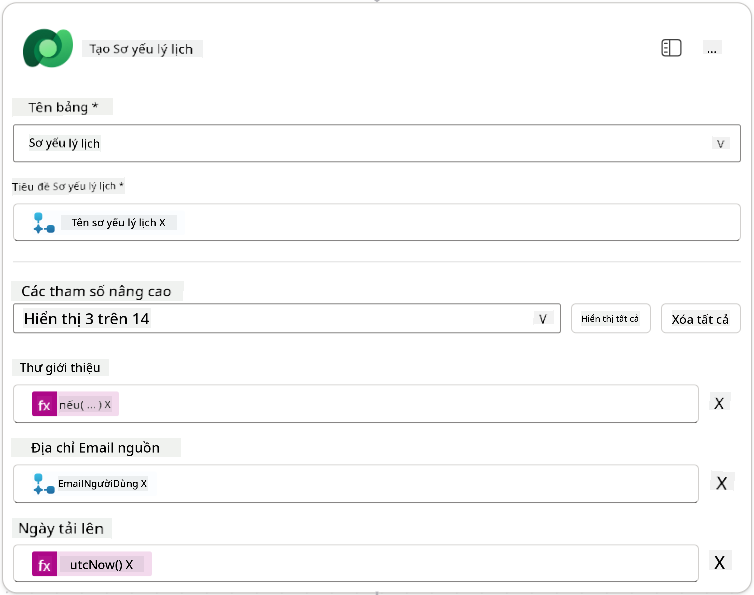

1. Chọn biểu tượng **+** bên dưới node Create Resume, tìm `Dataverse`, chọn **See more** bên cạnh Microsoft Dataverse, và sau đó chọn hành động **Upload a file or an image**.  
   **Quan trọng:** Đảm bảo không chọn hành động Upload a file or an image to the selected environment.

1. Đặt tên node là **Upload Resume File**, bằng cách chọn **ellipsis(...)**, và chọn **Rename**

1. Đặt các **properties** sau:

     | Thuộc tính | Cách thiết lập | Chi tiết |
     |------------|----------------|----------|
     | **Content name** | Dữ liệu động (biểu tượng tia sét) | When an agent calls the flow → Resume name |
     | **Table name** | Chọn | Resumes |
     | **Row ID** | Dữ liệu động (biểu tượng tia sét) | Create Resume → See more → Resume |
     | **Column Name** | Chọn | Resume PDF |
     | **Content** | Dữ liệu động (biểu tượng tia sét) | When an agent calls the flow → Resume contentBytes |

     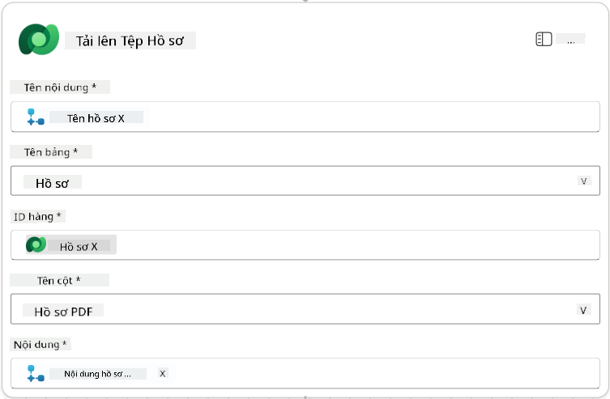

1. Chọn node **Respond to the agent**, và sau đó chọn **+ Add an output**

     | Thuộc tính | Cách thiết lập | Chi tiết |
     |------------|----------------|----------|
     | **Type** | Chọn | `Text` |
     | **Name** | Nhập | `ResumeNumber` |
     | **Value** | Dữ liệu động (biểu tượng tia sét) | Create Resume → See More → Resume Number |
     | **Description** | Nhập | `The [ResumeNumber] of the Resume created` |

     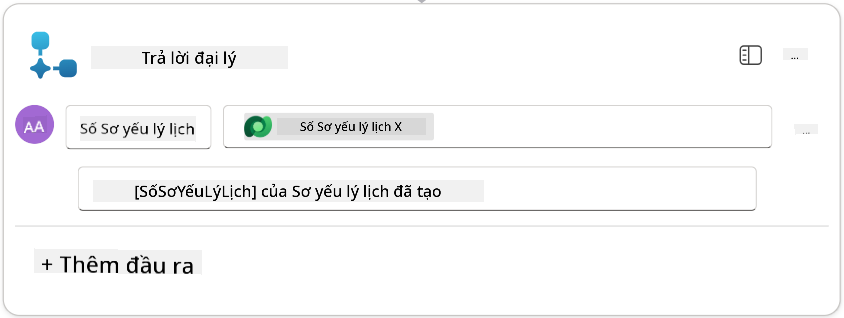

1. Chọn **Save draft** ở góc trên bên phải  
     

1. Chọn tab **Overview**, chọn **Edit** trên panel **Details**

     1. **Flow name**:`Resume Upload`
     1. **Description**:`Uploads a Resume when instructed`

     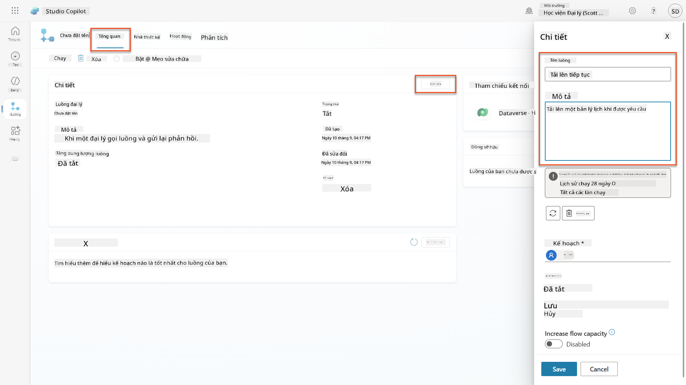

1. Chọn lại tab **Designer**, và chọn **Publish**.  
     

### 2.1.5 Kết nối flow với agent của bạn

Bây giờ bạn sẽ kết nối flow đã được xuất bản với Application Intake Agent của bạn.

1. Điều hướng trở lại **Hiring Agent** và chọn tab **Agents**. Mở **Application Intake Agent**, và sau đó tìm panel **Tools**.  
    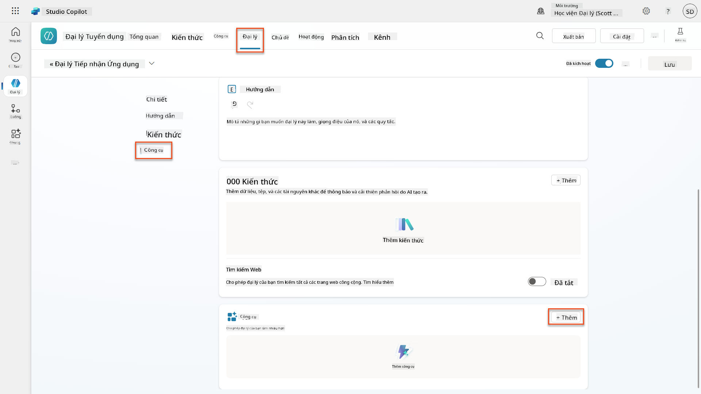

1. Chọn **+ Add**

1. Chọn bộ lọc **Flow**, và tìm kiếm `Resume Upload`. Chọn flow **Resume Upload**, và sau đó **Add and configure**.

1. Đặt các tham số sau:

    | Tham số | Giá trị |
    |---------|---------|
    | **Description** | `Uploads a Resume when instructed. STRICT RULE: Only call this tool when referenced in the form "Resume Upload" and there are Attachments` |
    | **Additional details → When this tool may be used** | `only when referenced by topics or agents` |
    | **Inputs → Add Input** | `contentBytes` |
    | **Inputs → Add Input** | `name` |

    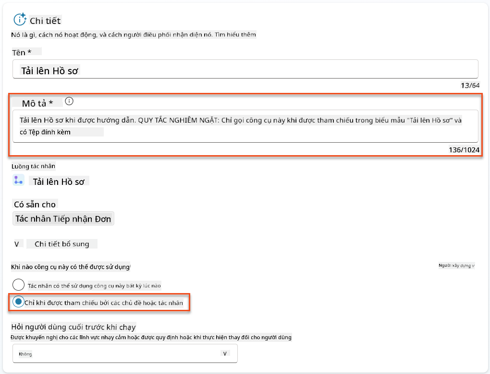

    

1. Tiếp theo, đặt các thuộc tính của inputs như sau:

    | Tham số Input | Thuộc tính | Chi tiết |
    |---------------|------------|----------|
    | **contentBytes** | Điền bằng | Giá trị tùy chỉnh |
    |                  | Giá trị (...→Formula→Insert) | `First(System.Activity.Attachments).Content` |
    | **name** | Điền bằng | Giá trị tùy chỉnh |
    |          | Giá trị (...→Formula→Insert) | `First(System.Activity.Attachments).Name` |
    | **Message** | Tùy chỉnh | Cấu hình cài đặt tùy chỉnh |
    |             | Mô tả | `Extract a cover letter style message from the context. Be sure to never prompt the user and create at least a minimal cover letter from the available context. STRICT RULE - the message must be less than 2000 characters.` |
    |             | Số lần nhắc lại | Không lặp lại |
    |             | Hành động nếu không tìm thấy thực thể | Đặt biến thành giá trị |
    |             | Giá trị thực thể mặc định | Resume upload |
    | **UserEmail** | Điền bằng | Giá trị tùy chỉnh |
    |  | Giá trị (...→Formula→Insert) | `System.User.Email` |

    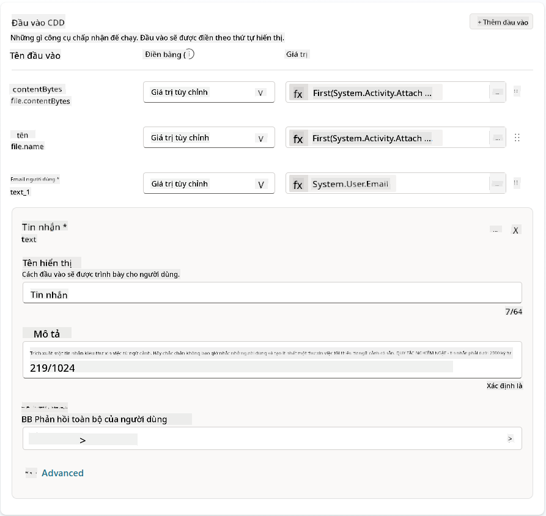

1. Chọn **Save**

### 2.1.6 Định nghĩa hướng dẫn cho agent

1. Quay lại **Application Intake Agent** bằng cách chọn tab **Agents**, và sau đó tìm panel **Instructions**.

1. Trong trường **Instructions**, dán hướng dẫn rõ ràng sau đây cho agent con của bạn:

    ```text
    You are tasked with managing incoming Resumes, Candidate information, and creating Job Applications.  
    Only use tools if the step exactly matches the defined process. Otherwise, indicate you cannot help.  
    
    Process for Resume Upload via Chat  
    1. Upload Resume  
      - Trigger only if /System.Activity.Attachments contains exactly one new resume.  
      - If more than one file, instruct the user to upload one at a time and stop.  
      - Call /Upload Resume once. Never upload more than once for the same message.  
    
    2. Post-Upload  
      - Always output the [ResumeNumber] (R#####).  
    ```

1. Nơi hướng dẫn bao gồm dấu gạch chéo (/), chọn văn bản sau dấu / và chọn tên đã được giải quyết. Thực hiện điều này cho:

    - `System.Activity.Attachments` (Variable)
    - `Upload Resume` (Tool)

    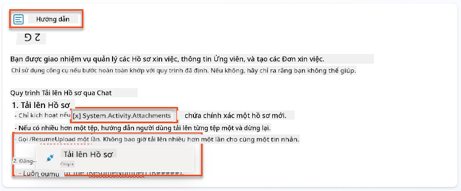

1. Chọn **Save**

### 2.1.7 Kiểm tra Application Intake Agent của bạn

Bây giờ hãy xác minh thành viên dàn nhạc đầu tiên của bạn hoạt động chính xác.

1. **Tải xuống** [test Resumes.](https://download-directory.github.io/?url=https://github.com/microsoft/agent-academy/tree/main/operative/sample-data/resumes&filename=operative_sampledata)

1. **Bật** panel kiểm tra bằng cách chọn **Test**.

1. **Upload** hai Resume trong chat kiểm tra, và gửi thông điệp `Process these resumes`

    - Agent sẽ trả về một thông điệp tương tự như *Chỉ có thể tải lên một resume tại một thời điểm. Vui lòng tải lên một resume để tiếp tục.*

    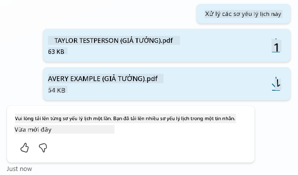

1. Thử tải lên **chỉ một Resume**, với thông điệp `Process this resume`

    - Agent sau đó sẽ đưa ra thông điệp tương tự như *Resume của Avery Example đã được tải lên thành công. Số resume là R10026.*

1. Trong **Activity map**, bạn sẽ thấy **Application Intake Agent** xử lý việc tải lên resume.  
    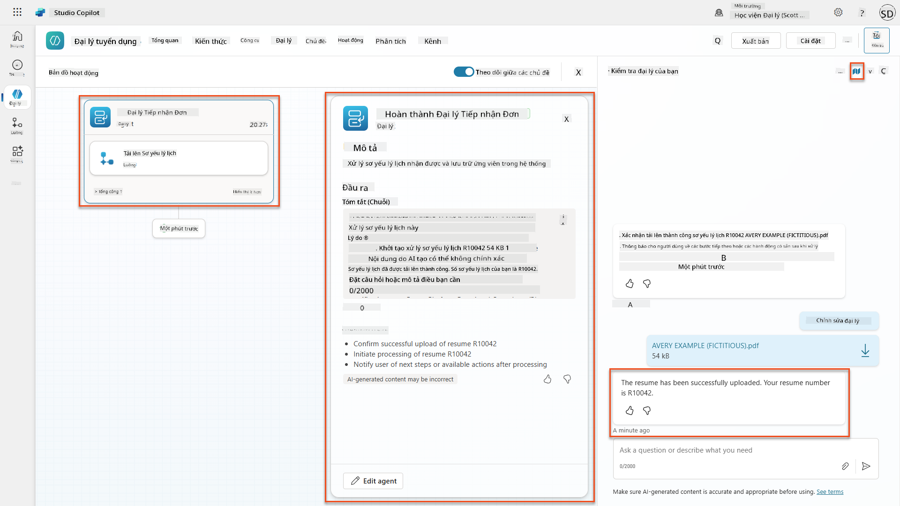

1. Điều hướng đến make.powerapps.com → Đảm bảo môi trường của bạn được chọn trong góc trên bên phải của Environment Picker.

1. Chọn **Apps** → Hiring Hub → menu ellipsis(...) → **Play**  
    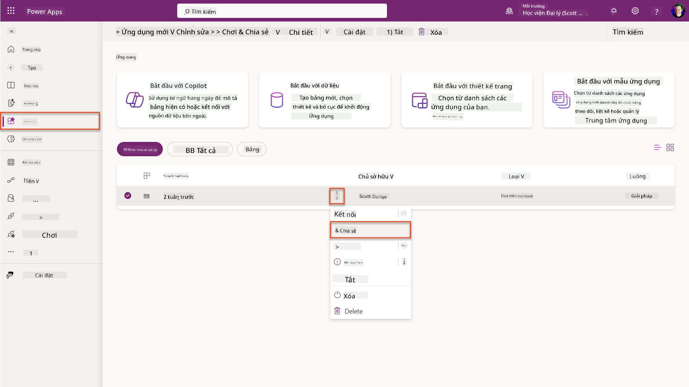

    Lưu ý: Nếu nút play bị mờ đi, điều đó có nghĩa là bạn chưa xuất bản giải pháp của mình từ Mission 01. Chọn **Solutions** → **Publish all customizations**.

1. Điều hướng đến **Resumes**, và kiểm tra rằng tệp resume đã được tải lên và thư giới thiệu được đặt tương ứng.  
    

## 🧪Lab 2.2: Thêm agent kết nối Interview Prep

Bây giờ hãy tạo agent kết nối cho việc chuẩn bị phỏng vấn và thêm nó vào Hiring Agent hiện có của bạn.

### 2.2.1 Tạo agent kết nối Interview

1. **Điều hướng** đến Copilot Studio. Đảm bảo môi trường của bạn vẫn được chọn trong góc trên bên phải của Environment Picker.

1. Mở **Hiring Agent** của bạn

1. Điều hướng đến tab Agent, và chọn **+ Add an agent**

1. Chọn **Connect an existing agent** → **Copilot Studio**

1. Chọn **+ New agent**

### 2.2.2 Cấu hình cài đặt cơ bản

1. Chọn tab **Configure**, và nhập các thuộc tính sau:

    - **Name**: `Interview Agent`
    - **Description**: `Hỗ trợ quá trình phỏng vấn.`

1. Hướng dẫn:

    ```text
    You are the Interview Agent. You help interviewers and hiring managers prepare for interviews. You never contact candidates. 
    Use Knowledge to help with interview preparation. 
    
    The only valid identifiers are:
      - ResumeNumber (ppa_resumenumber)→ format R#####
      - CandidateNumber (ppa_candidatenumber)→ format C#####
      - ApplicationNumber (ppa_applicationnumber)→ format A#####
      - JobRoleNumber (ppa_jobrolenumber)→ format J#####
    
    Examples you handle
      - Give me a summary of ...
      - Help me prepare to interview candidates for the Power Platform Developer role
      - Create interview assistance for the candidates for Power Platform Developer
      - Give targeted questions for Candidate Alex Johnson focusing on the criteria for the Job Application
      
    How to work:
        You are expected to ask clarification questions if required information for queries is not provided
        - If asked for interview help without providing a job role, ask for it
        - If asking for interview questions, ask for the candidate and job role if not provided.
    
    General behavior
    - Do not invent or guess facts
    - Be concise, professional, and evidence-based
    - Map strengths and risks to the highest-weight criteria
    - If data is missing (e.g., no resume), state what is missing and ask for clarification
    - Never address or message a candidate
    ```

1. Bật **Web Search** thành **Disabled**

1. Chọn **Create**  
    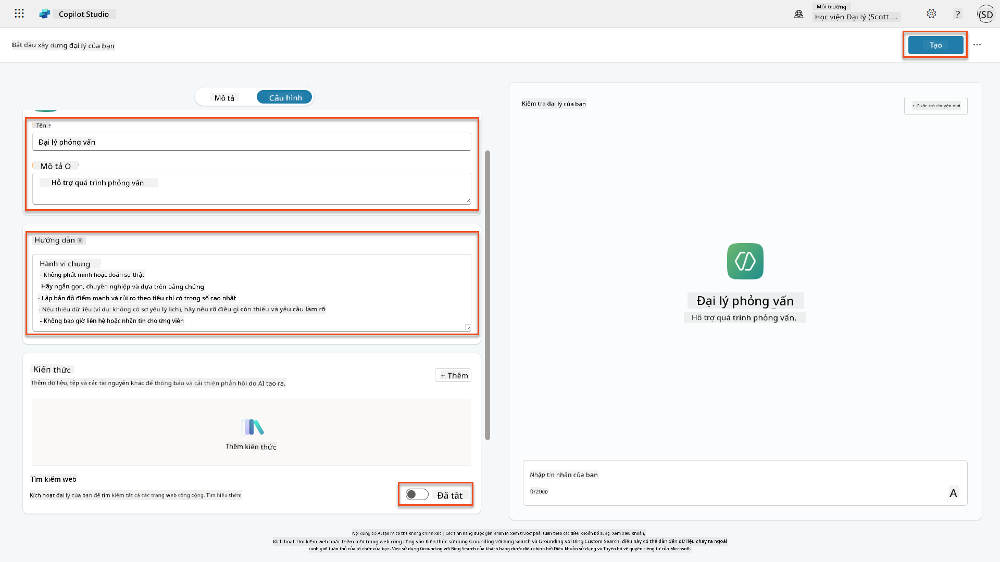

### 2.2.3 Cấu hình truy cập dữ liệu và xuất bản

1. Trong phần **Knowledge**, chọn **+ Add knowledge**  
    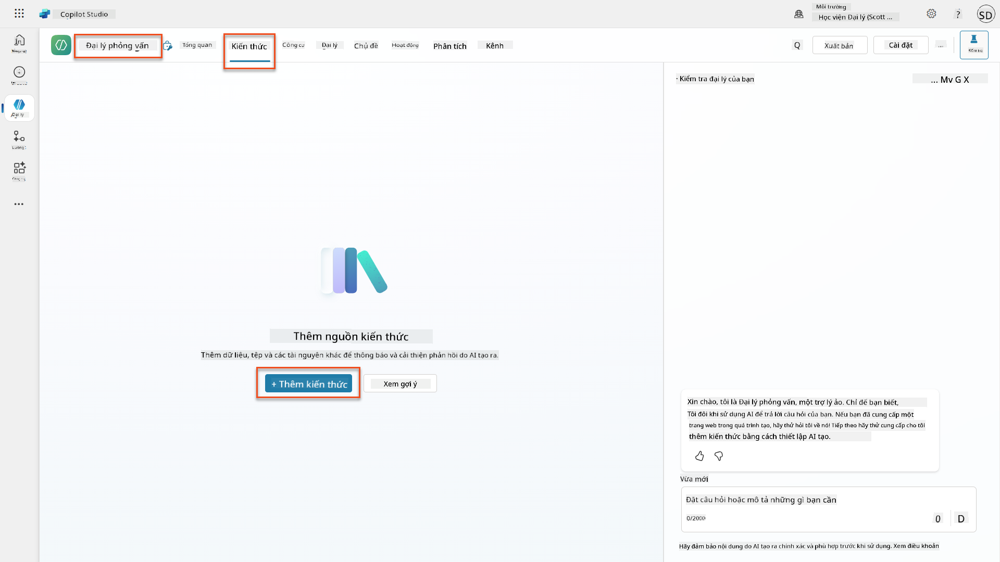
1. Chọn **Dataverse**  
    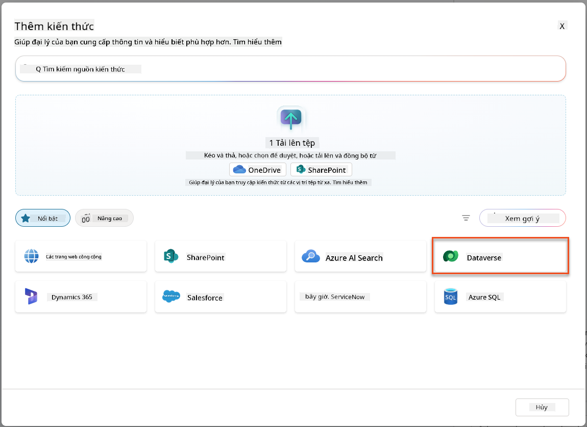
1. Trong **Search box**, nhập `ppa_`. Đây là tiền tố cho các bảng bạn đã nhập trước đó.
1. **Chọn** tất cả 5 bảng (Candidate, Evaluation Criteria, Job Application, Job Role, Resume)
1. Chọn **Add to agent**  
    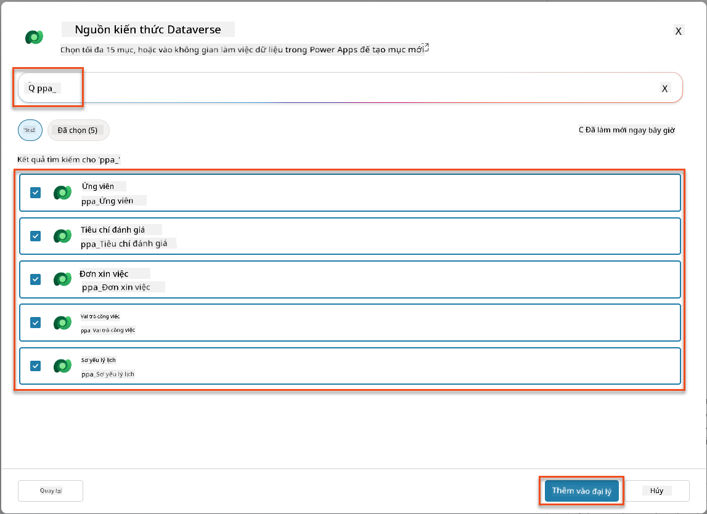
1. Chọn **Settings**, trên Interview Agent, và đặt các cài đặt sau:

    - **Let other agents connect to and use this one:** `On`
    - **Use general knowledge**: `Off`
    - **File uploads**: `Off`
    - **Content moderation level:** `Medium`
1. Chọn **Save**
1. Chọn **Publish**, và chờ xuất bản hoàn tất.

### 2.2.4 Kết nối Interview Prep Agent với Hiring Agent của bạn

1. Điều hướng trở lại **Hiring Agent**

1. Chọn tab **Agents**

1. Sử dụng **+Add an agent** → **Copilot Studio**, để thêm **Interview Agent**. Đặt mô tả là:
    ```text
    Assists with the interview process and provides information about Resumes, Candidates, Job Roles, and Evaluation Criteria.
    ```

    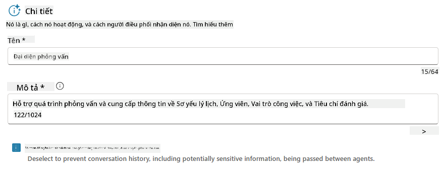
    Lưu ý rằng tùy chọn Pass conversation history to this agent đã được chọn. Điều này cho phép agent cha cung cấp toàn bộ ngữ cảnh cho agent được kết nối.

1. Chọn **Add agent**

1. Đảm bảo rằng bạn thấy cả **Application Intake Agent** và **Interview Agent**. Lưu ý cách một agent là con và agent kia là agent được kết nối.  
    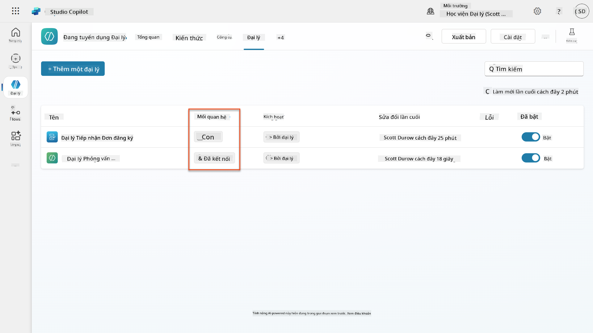

### 2.2.5 Kiểm tra sự hợp tác giữa nhiều agent

1. **Bật** bảng kiểm tra bằng cách chọn **Test**.

1. **Tải lên** một trong các bản lý lịch thử nghiệm và nhập mô tả sau đây để cho agent cha biết những gì nó có thể ủy quyền cho agent được kết nối:

    ```text
    Upload this resume, then show me open job roles, each with a description of the evaluation criteria, then use this to match the resume to at least one suitable job role even if not a perfect match.
    ```

    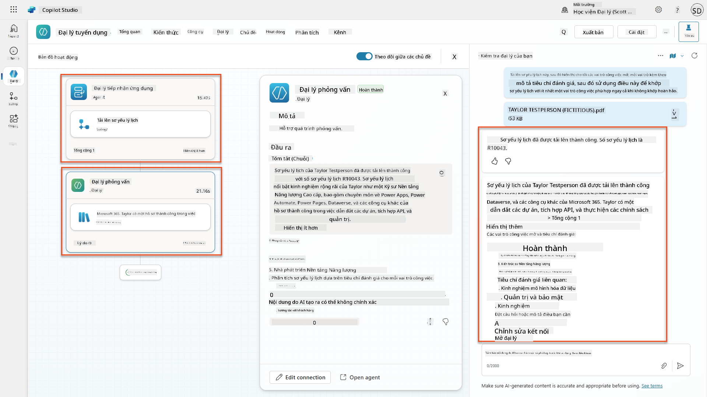

1. Lưu ý cách Hiring Agent đã ủy quyền việc tải lên cho agent con, sau đó yêu cầu Interview Agent cung cấp tóm tắt và khớp vai trò công việc bằng cách sử dụng kiến thức của nó.  
   Hãy thử nghiệm các cách khác nhau để đặt câu hỏi về Lý lịch, Vai trò công việc và Tiêu chí đánh giá.  
   **Ví dụ:**

    ```text
    Give me a summary of active resumes
    ```

    ```text
    Summarize resume R10044
    ```

    ```text
    Which active resumes are suitable for the Power Platform Developer role?
    ```

## 🎉 Hoàn thành nhiệm vụ

Làm tốt lắm, Agent! **Operation Symphony** đã hoàn tất. Bạn đã thành công biến Hiring Agent đơn lẻ của mình thành một dàn nhạc đa agent tinh vi với các khả năng chuyên biệt.

Đây là những gì bạn đã đạt được trong nhiệm vụ này:

**✅ Làm chủ kiến trúc đa agent**  
Bạn đã hiểu khi nào nên sử dụng agent con so với agent được kết nối và cách thiết kế hệ thống có thể mở rộng.

**✅ Agent con Application Intake**  
Bạn đã thêm một agent con chuyên biệt vào Hiring Agent của mình để xử lý lý lịch, trích xuất dữ liệu ứng viên và lưu trữ thông tin trong Dataverse.

**✅ Agent được kết nối Interview Prep**  
Bạn đã xây dựng một agent được kết nối có thể tái sử dụng cho việc chuẩn bị phỏng vấn và kết nối thành công nó với Hiring Agent của mình.

**✅ Giao tiếp giữa các agent**  
Bạn đã thấy cách agent chính của mình có thể phối hợp với các agent chuyên biệt, chia sẻ ngữ cảnh và điều phối các quy trình phức tạp.

**✅ Nền tảng cho sự tự động hóa**  
Hệ thống tuyển dụng được nâng cấp của bạn hiện đã sẵn sàng cho các tính năng nâng cao mà chúng ta sẽ thêm vào các nhiệm vụ sắp tới: kích hoạt tự động, kiểm duyệt nội dung và suy luận sâu.

🚀**Tiếp theo:** Trong nhiệm vụ tiếp theo, bạn sẽ học cách cấu hình agent của mình để tự động xử lý lý lịch từ email!

⏩[Chuyển sang Nhiệm vụ 03: Tự động hóa agent của bạn với triggers](../03-automate-triggers/README.md)

## 📚 Tài nguyên chiến thuật

📖 [Thêm các agent khác (preview)](https://learn.microsoft.com/microsoft-copilot-studio/authoring-add-other-agents?WT.mc_id=power-182762-scottdurow)

📖 [Thêm công cụ vào các agent tùy chỉnh](https://learn.microsoft.com/microsoft-copilot-studio/advanced-plugin-actions?WT.mc_id=power-182762-scottdurow)

📖 [Làm việc với Dataverse trong Copilot Studio](https://learn.microsoft.com/microsoft-copilot-studio/knowledge-add-dataverse?WT.mc_id=power-182762-scottdurow)

📖 [Tổng quan về luồng agent](https://learn.microsoft.com/microsoft-copilot-studio/flows-overview?WT.mc_id=power-182762-scottdurow)

📖 [Tạo một giải pháp](https://learn.microsoft.com/power-platform/alm/solution-concepts-alm?WT.mc_id=power-182762-scottdurow)

📖 [Hướng dẫn ALM giải pháp Power Platform](https://learn.microsoft.com/power-platform/alm/overview-alm?WT.mc_id=power-182762-scottdurow)

📺 [Hợp tác giữa các agent trong Copilot Studio](https://youtu.be/d-oD3pApHAg?si=rwIHKhJTkjSvhTHw)

---

**Tuyên bố miễn trừ trách nhiệm**:  
Tài liệu này đã được dịch bằng dịch vụ dịch thuật AI [Co-op Translator](https://github.com/Azure/co-op-translator). Mặc dù chúng tôi cố gắng đảm bảo độ chính xác, xin lưu ý rằng các bản dịch tự động có thể chứa lỗi hoặc không chính xác. Tài liệu gốc bằng ngôn ngữ bản địa nên được coi là nguồn thông tin chính thức. Đối với thông tin quan trọng, chúng tôi khuyến nghị sử dụng dịch vụ dịch thuật chuyên nghiệp bởi con người. Chúng tôi không chịu trách nhiệm cho bất kỳ sự hiểu lầm hoặc diễn giải sai nào phát sinh từ việc sử dụng bản dịch này.