<!--
CO_OP_TRANSLATOR_METADATA:
{
  "original_hash": "dcbcd9396b076da0a0f5d389e9ec1b12",
  "translation_date": "2025-10-20T00:47:26+00:00",
  "source_file": "docs/recruit/08-add-adaptive-card/README.md",
  "language_code": "vi"
}
-->
# 🚨 Nhiệm vụ 08: Nâng cao tương tác người dùng trong Chủ đề với Adaptive Cards

## 🕵️‍♂️ MẬT DANH: `CHIẾN DỊCH NÂNG CẤP GIAO DIỆN`

> **⏱️ Thời gian thực hiện nhiệm vụ:** `~45 phút`

🎥 **Xem video hướng dẫn**

[](https://www.youtube.com/watch?v=RhIlzYHPCXo "Xem video hướng dẫn trên YouTube")

## 🎯 Tóm tắt nhiệm vụ

Các đặc vụ, nhiệm vụ của các bạn là xâm nhập vào trải nghiệm người dùng tĩnh và thay thế nó bằng các Adaptive Cards phong phú, động và có thể hành động. Các bạn sẽ triển khai payload JSON và công thức Power Fx để biến các cuộc trò chuyện trong Copilot Studio từ hỏi đáp cơ bản thành các tương tác hoàn toàn. Mục tiêu của các bạn là thu thập thông tin từ người dùng, trình bày dữ liệu một cách đẹp mắt và điều hướng cuộc trò chuyện một cách chính xác và phong cách. Nếu không thích nghi, người dùng của các bạn có thể chuyển sang các giao diện kém thông minh hơn.

## 🔎 Mục tiêu

Trong nhiệm vụ này, các bạn sẽ học:

1. Hiểu Adaptive Cards là gì và cách chúng nâng cao tương tác người dùng trong Copilot Studio
1. Học cách tạo thẻ tương tác bằng JSON và công thức Power Fx để tạo nội dung động
1. Khám phá công cụ thiết kế Adaptive Card và các thành phần chính của nó để tạo thẻ trực quan
1. Tạo các biểu mẫu phong phú, tương tác và trải nghiệm thu thập dữ liệu trong các chủ đề của đặc vụ
1. Áp dụng các thực hành tốt nhất để thiết kế các thẻ thích ứng và thân thiện với người dùng

## 🤔 Adaptive Card là gì?

**Adaptive Card** là cách tạo các yếu tố giao diện người dùng tương tác, phong phú về mặt hình ảnh, có thể được nhúng vào các ứng dụng như Microsoft Teams, Microsoft Outlook hoặc các đặc vụ. Đây là một đối tượng JSON có cấu trúc định nghĩa bố cục và nội dung của thẻ:

- Các yếu tố xuất hiện trên thẻ - văn bản, hình ảnh, nút
- Cách sắp xếp các yếu tố đó
- Các hành động mà người dùng có thể thực hiện như gửi biểu mẫu hoặc mở liên kết

    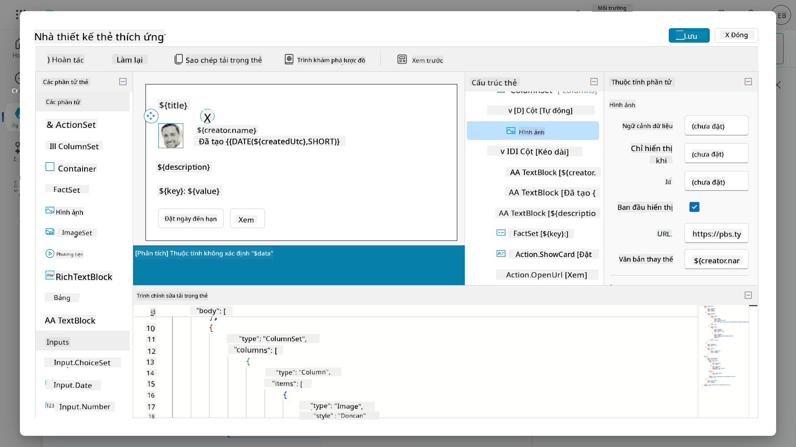

### Tại sao Adaptive Cards quan trọng trong Copilot Studio

Hãy tưởng tượng bạn đang xây dựng một đặc vụ yêu cầu người dùng cung cấp tên, email hoặc phản hồi của họ. Nếu bạn chỉ sử dụng văn bản đơn thuần, cuộc trò chuyện có thể trở nên nhàm chán hoặc khó theo dõi. Đó là lúc Adaptive Cards phát huy tác dụng!

1. **Làm cho cuộc trò chuyện trở nên tương tác** - thay vì gửi văn bản dưới dạng tin nhắn cho người dùng, bạn có thể hiển thị nút, biểu mẫu, hình ảnh và nhiều hơn nữa.
    - Ví dụ: một thẻ có thể yêu cầu người dùng điền tên và email của họ vào một biểu mẫu gọn gàng.

1. **Hiển thị đẹp mắt ở mọi nơi** - Adaptive Cards tự động phù hợp với phong cách của ứng dụng mà chúng được nhúng vào, chẳng hạn như Microsoft 365 Copilot chat hoặc Microsoft Teams. Bạn không cần lo lắng về chế độ tối, phông chữ hoặc bố cục - nó sẽ tự động thích nghi.

1. **Dễ dàng xây dựng với JSON** - bạn định nghĩa thẻ bằng mã JSON (nghĩa là _công thức_ cho giao diện người dùng). Copilot Studio giúp bạn xem trước thẻ của mình trước khi thêm nó vào chủ đề.

1. **Thu thập và sử dụng dữ liệu** - bạn có thể sử dụng thẻ để đặt câu hỏi, thu thập câu trả lời và sử dụng dữ liệu đó trong luồng cuộc trò chuyện.
    - Ví dụ: Yêu cầu số điện thoại của người dùng, sau đó hiển thị thẻ xác nhận với số điện thoại của họ.

1. **Nâng cao trải nghiệm người dùng** - thẻ làm cho đặc vụ của bạn trở nên tương tác hơn. Đây là một loại giao diện sạch sẽ, dễ nhấp và thân thiện với người dùng.

## 🐱 JSON có phải là một người?

Được phát âm là "Jason," nhưng không phải là một người 😅

JSON, còn được gọi là _JavaScript Object Notation_, là một định dạng nhẹ được sử dụng để cấu trúc dữ liệu. Nó dễ đọc và viết, và trông giống như một loạt các cặp khóa-giá trị bên trong dấu ngoặc nhọn {}.

Đây là một trong những tùy chọn để sử dụng khi thêm một thẻ thích ứng vào chủ đề của bạn.

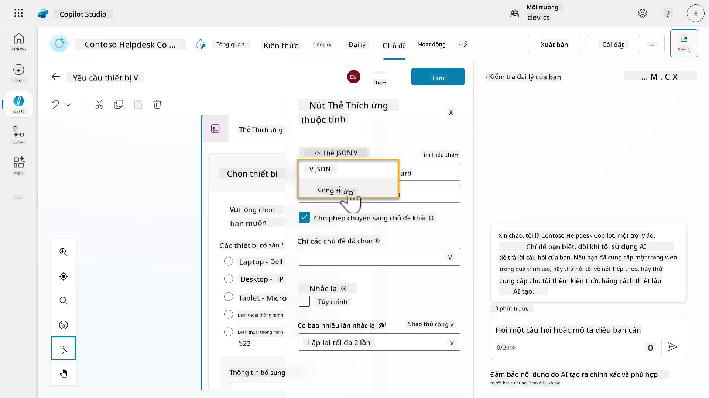

## 👀 Tôi thấy một tùy chọn khác để xây dựng thẻ thích ứng bằng _công thức_

Hãy nhớ cách chúng ta đã học về Power Fx trong [Nhiệm vụ 07 - Sử dụng Power Fx trong các nút của bạn](../07-add-new-topic-with-trigger/README.md#what-power-fx-can-do-in-topics). Điều tương tự cũng có thể được áp dụng trong Adaptive Cards trong Copilot Studio.

Tóm tắt lại,

!!! note
    Power Fx là một ngôn ngữ lập trình low-code được sử dụng để thêm logic và hành vi động vào đặc vụ của bạn. Đây là ngôn ngữ tương tự được sử dụng trong Microsoft Power Apps, và được thiết kế đơn giản và giống như công thức Excel, giúp dễ dàng cho cả nhà phát triển và người không phải là nhà phát triển.

### Cách Power Fx hoạt động trong Adaptive Cards

Khi bạn thiết kế một Adaptive Card trong Copilot Studio, bạn có thể sử dụng các công thức Power Fx để:

- Chèn giá trị động như tên người dùng, ngày tháng hoặc trạng thái.
- Định dạng văn bản hoặc số như hiển thị tiền tệ hoặc làm tròn số.
- Hiển thị hoặc ẩn các yếu tố dựa trên điều kiện.
- Tùy chỉnh phản hồi dựa trên đầu vào của người dùng, biến, kết quả từ các nút trong cuộc trò chuyện.

Ví dụ,

"`Xin chào`" & `System.User.DisplayName`

Công thức này kết hợp từ "Xin chào" với tên của người dùng một cách động.

### Tại sao nó hữu ích

1. **Cá nhân hóa**

    Bạn có thể tùy chỉnh thông điệp cho từng người dùng, làm cho tương tác trở nên tự nhiên và phù hợp hơn.

1. **Nội dung động**

    Thẻ có thể hiển thị dữ liệu thực từ các biến và kết quả từ các nút trong cuộc trò chuyện.

1. **Logic thông minh**

    Bạn có thể kiểm soát những gì người dùng nhìn thấy hoặc tương tác dựa trên các điều kiện, cải thiện khả năng sử dụng và giảm lỗi.

1. **Thân thiện với low-code**

    Power Fx là một ngôn ngữ lập trình low-code. Như đã đề cập trước đó, nó dễ đọc, trực quan và tương tự như các công thức Excel.

## 👷🏻‍♀️ Xây dựng với công cụ thiết kế Adaptive Card

**Adaptive Card Designer** là một công cụ trực quan cho phép bạn tạo các thẻ tin nhắn tương tác bằng cách kéo và thả các yếu tố như văn bản, hình ảnh, nút và đầu vào. Mục đích của nó là giúp bạn tạo ra các thông điệp phong phú, động mà không cần viết mã phức tạp, giúp dễ dàng thiết kế giao diện thân thiện với người dùng.

Công cụ thiết kế giúp bạn xây dựng thẻ một cách trực quan, nhưng phía sau, nó đang tạo ra đối tượng JSON cho bạn. Bạn cũng có thể chuyển sang _công thức_ để sử dụng các biểu thức Power Fx trong thẻ nhằm hiển thị dữ liệu từ nơi khác.

## 🎨 Hiểu về công cụ thiết kế Adaptive Card

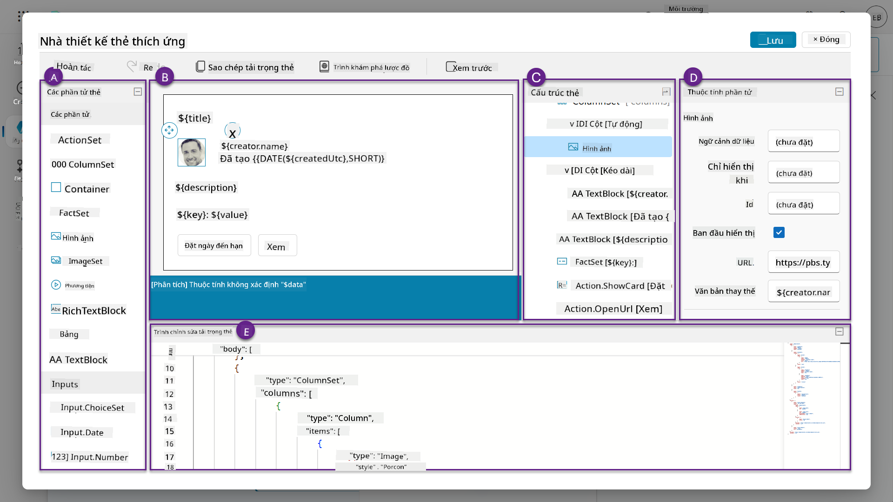

### A) Các yếu tố của thẻ

Đây là các khối xây dựng của thẻ thích ứng. Bạn có thể kéo và thả các yếu tố như sau:

- **TextBlock** để hiển thị văn bản.
- **Image** để hiển thị hình ảnh.
- **FactSet** cho các cặp khóa-giá trị.
- **Trường nhập liệu** để hiển thị hộp văn bản, bộ chọn ngày, nút chuyển đổi.
- **Actions** để hiển thị các nút như _Submit_, _Open URL_, hoặc _Show Card_.

Mỗi yếu tố có mục đích riêng và có thể được tùy chỉnh hoặc cấu hình.

### B) Trình xem thẻ

Đây là khu vực **Xem trước** nơi bạn có thể thấy thẻ của mình sẽ trông như thế nào trong thời gian thực. Khi bạn thêm hoặc chỉnh sửa các yếu tố, trình xem sẽ cập nhật ngay lập tức để phản ánh các thay đổi. Điều này cho phép bạn thực hiện các cập nhật lặp đi lặp lại và xem kết quả thiết kế cùng lúc.

### C) Cấu trúc thẻ

Điều này hiển thị **cấu trúc và bố cục** của thẻ của bạn. Ví dụ:

- Một thẻ có thể bắt đầu với **TextBlock** cho tiêu đề.
- Sau đó là **ColumnSet** với một hình ảnh ở một bên và văn bản ở bên kia.
- Tiếp theo là **FactSet** và một số **Nút hành động**.

Nó giúp bạn hiểu cách các yếu tố được lồng ghép và tổ chức.

### D) Thuộc tính yếu tố

Khi bạn nhấp vào bất kỳ yếu tố nào trong thẻ, bảng này cho phép bạn **tùy chỉnh cài đặt của nó**:

- Thay đổi kích thước, trọng lượng hoặc màu sắc của văn bản.
- Đặt URL hình ảnh hoặc văn bản thay thế.
- Cấu hình các tùy chọn đầu vào như văn bản gợi ý hoặc giá trị mặc định.

Đây là nơi bạn tinh chỉnh từng yếu tố.

### E) Trình chỉnh sửa Payload thẻ

Đây là **mã JSON thô** phía sau thẻ của bạn. Người dùng nâng cao có thể chỉnh sửa trực tiếp để:

- Sử dụng các tính năng mẫu.
- Sao chép/dán định nghĩa thẻ.

Ngay cả khi bạn mới sử dụng công cụ thiết kế Adaptive Card, việc xem cách thiết kế trực quan được chuyển đổi thành mã cũng rất hữu ích.

!!! tip "Mẹo - Xem các mẫu thẻ thích ứng"

    1. Truy cập [https://adaptivecards.microsoft.com/designer](https://adaptivecards.microsoft.com/designer).
    2. Chọn **New card** để xem danh sách các mẫu bạn có thể chọn và chỉnh sửa.
    3. Lưu ý rằng công cụ thiết kế này là bên ngoài (dựa trên web). Khi bạn xây dựng thẻ của mình trong công cụ thiết kế Adaptive Card dựa trên web, hãy sao chép JSON từ Trình chỉnh sửa Payload thẻ.
    4. Dán JSON vào thẻ thích ứng của bạn trong đặc vụ tại Copilot Studio.

    

## 🌵 Các trường hợp sử dụng phổ biến

Dưới đây là các trường hợp sử dụng phổ biến cho Adaptive Cards trong Copilot Studio khi được sử dụng trong các nút **Gửi tin nhắn** hoặc **Đặt câu hỏi**.

1. **Biểu mẫu và thu thập dữ liệu**

    Sử dụng thẻ thích ứng để thu thập đầu vào có cấu trúc từ người dùng, chẳng hạn như:

    - Yêu cầu nghỉ phép
    - Biểu mẫu phản hồi
    - Thông tin liên hệ
    - Lên lịch hẹn

1. **Hiển thị thông tin động**

    Hiển thị cho người dùng dữ liệu cá nhân hóa hoặc thời gian thực trong một định dạng sạch sẽ, dễ đọc từ các nguồn doanh nghiệp như ServiceNow, SAP, Dynamics 365, SharePoint, v.v.

    - Tóm tắt đơn hàng
    - Số dư tài khoản
    - Trạng thái vé hoặc trường hợp
    - Sự kiện hoặc thời hạn sắp tới

1. **Lựa chọn tương tác**

    Cho phép người dùng thực hiện lựa chọn trực tiếp trong cuộc trò chuyện:

    - Chọn từ danh sách các tùy chọn, ví dụ như danh mục sản phẩm, chủ đề hỗ trợ.
    - Xác nhận hoặc hủy hành động.
    - Đánh giá dịch vụ hoặc trải nghiệm.

1. **Kích hoạt hành động**

    Bao gồm các nút kích hoạt các bước tiếp theo trong cuộc trò chuyện nội bộ hoặc bên ngoài.

    - "Gửi yêu cầu"
    - "Xem chi tiết"

## ⭐ Thực hành tốt nhất

Dưới đây là một số thực hành tốt nhất để tạo Adaptive Cards cho đặc vụ trong Copilot Studio.

1. **Giữ cho nó đơn giản và tập trung**

    - Thiết kế thẻ với mục đích rõ ràng, không làm quá tải chúng với quá nhiều yếu tố.
    - Sử dụng văn bản ngắn gọn và bố cục trực quan để hướng dẫn người dùng qua tương tác.

1. **Cẩn thận với các đầu vào**

    - Chỉ bao gồm các yếu tố đầu vào cần thiết như văn bản, lựa chọn ngày, để tránh làm người dùng choáng ngợp.
    - Sử dụng nhãn để làm cho các đầu vào dễ hiểu.

1. **Cấu trúc để dễ đọc**

    - Sử dụng **TextBlocks** cho tiêu đề và hướng dẫn.
    - Nhóm các yếu tố liên quan bằng cách sử dụng **Containers** hoặc **ColumnSets** để cải thiện luồng hình ảnh.

1. **Làm rõ các yếu tố hành động**

    - Sử dụng **Action.Submit** hoặc **Action.OpenUrl** với các tiêu đề nút rõ ràng như "Gửi yêu cầu" hoặc "Xem chi tiết".
    - Tránh các nhãn mơ hồ như "Nhấn vào đây".

1. **Thiết kế để thích nghi**

    - Giả định rằng thẻ có thể được xem trên các kích thước màn hình khác nhau.
    - Tránh các chiều rộng cố định và sử dụng bố cục linh hoạt như **ColumnSets** để tăng khả năng đáp ứng.

1. **Sử dụng nội dung động khi có thể**

    - Liên kết các yếu tố thẻ với các biến hoặc kết quả từ các nút bằng Power Fx để cá nhân hóa trải nghiệm người dùng.
    - Ví dụ, hiển thị tên người dùng hoặc trạng thái hiện tại một cách động.

## 🧪 Phòng thí nghiệm 08 - Thêm thẻ thích ứng và nâng cao khả năng của chủ đề

Bây giờ chúng ta sẽ học cách nâng cao chủ đề của mình với các thẻ thích ứng và sử dụng các chức năng nâng cao của chủ đề và nút.

- [8.1 Tạo một chủ đề mới với thẻ thích ứng để người dùng gửi yêu cầu của họ](../../../../../docs/recruit/08-add-adaptive-card)
- [8.2 Cập nhật hướng dẫn đặc vụ để kích hoạt chủ đề Yêu cầu thiết bị](../../../../../docs/recruit/08-add-adaptive-card)

### ✨ Trường hợp sử dụng

**Là một** nhân viên

**Tôi muốn** yêu cầu một thiết bị

**Để tôi có thể** yêu cầu một thiết bị từ danh sách các thiết bị có sẵn

Hãy bắt đầu!

### Điều kiện tiên quyết

1. **Danh sách SharePoint**

    Chúng ta sẽ sử dụng danh sách **Devices** trên SharePoint từ [Bài học 00 - Thiết lập khóa học - Bước 3: Tạo trang web SharePoint mới](../00-course-setup/README.md#step-4-create-new-sharepoint-site).

    Nếu bạn chưa thiết lập danh sách **Devices** trên SharePoint, vui lòng quay lại [Bài học 00 - Thiết lập khóa học - Bước 3: Tạo trang web SharePoint mới](../00-course-setup/README.md#step-4-create-new-sharepoint-site).

1. **Contoso Helpdesk Copilot**

    Chúng ta sẽ sử dụng cùng một đặc vụ đã được tạo trước đó trong [Bài học 06 - Tạo một đặc vụ tùy chỉnh bằng ngôn ngữ tự nhiên với Copilot và liên kết nó với dữ liệu của bạn](../06-create-agent-from-conversation/README.md).

### 8.1 Tạo một chủ đề mới với thẻ thích ứng để người dùng gửi yêu cầu của họ

Chúng ta sẽ tạo một chủ đề mới để xử lý yêu cầu thiết bị của người dùng. Chủ đề mới này sẽ chứa một nút **Hỏi với thẻ thích ứng** để cho phép tương tác với đặc vụ.

Hãy bắt đầu!

1. Chọn tab **Topics**, sau đó chọn **+ Add a topic from blank**.

    

1. Đặt tên cho chủ đề như sau,

    ```text
    Request device
    ```

    Nhập nội dung sau làm mô tả cho trigger.

    ```text
    This topic helps users request a device when they answer yes to the question that asks the user if they would like to request one of these devices.
    ```

    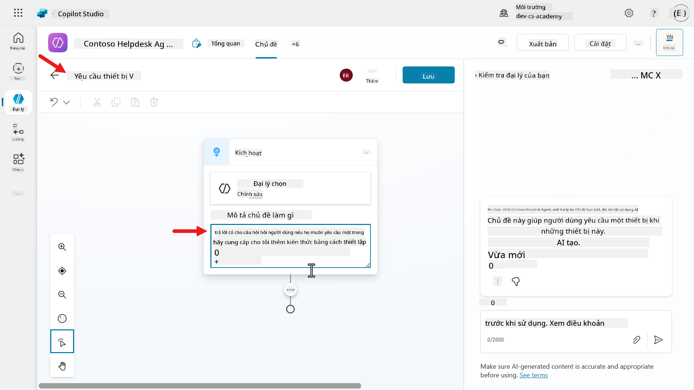
1. Tiếp theo, thêm một nút **Ask with adaptive card**. Nút này sẽ hiển thị một thẻ tương tác để người dùng chọn thiết bị mà họ muốn yêu cầu.

    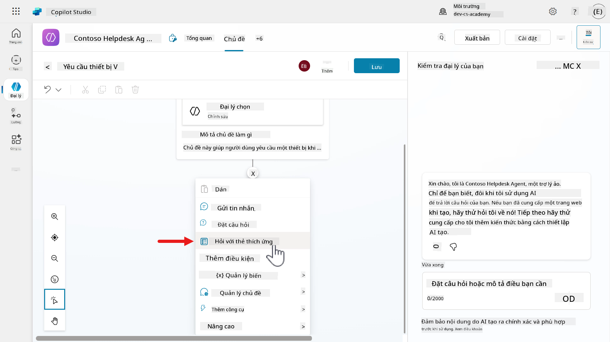

1. Chọn nút và bảng thuộc tính **Adaptive Card Node properties** sẽ xuất hiện. Bây giờ chúng ta sẽ chỉnh sửa JSON. Chọn **Edit adaptive card**. Chọn **Edit adaptive card**.

    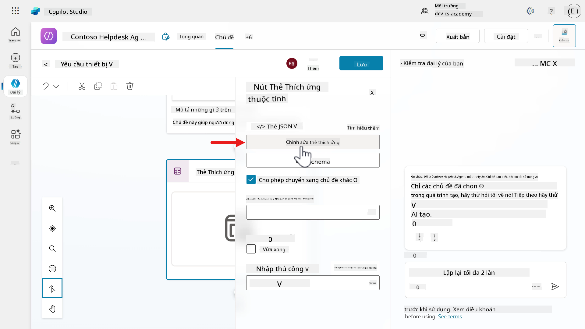

1. Đây là **Adaptive Card Designer**, nơi bạn có thể thiết kế thẻ và xem thiết kế thẻ theo thời gian thực.

    Hãy thử kéo và thả các phần tử thẻ **TextBlock** và **FactSet** vào khu vực tạo nội dung, khu vực xem thẻ. Lưu ý cách cấu trúc thẻ và trình chỉnh sửa payload thẻ cập nhật khi hai phần tử thẻ được thêm vào. Bạn có thể trực tiếp cập nhật trình chỉnh sửa payload thẻ và bảng thuộc tính phần tử.

    

1. Chọn **Preview** để xem thẻ ở các độ rộng khác nhau.

    

1. Bản xem trước sẽ tải, nơi bạn sẽ thấy các đầu ra thẻ khác nhau theo độ rộng.

    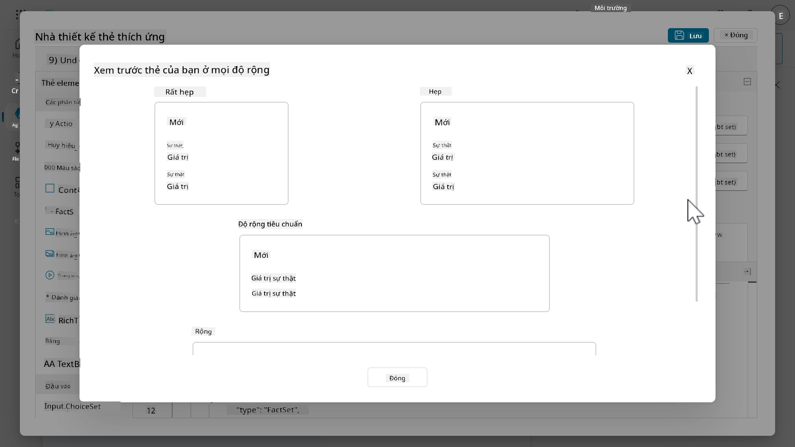

1. Thoát khỏi **Preview** bằng cách chọn biểu tượng **x** và chọn **Undo** trong trình thiết kế để xóa hai phần tử thẻ đã thêm trước đó.

    

1. Nhấp vào **Card payload editor** và chọn tất cả các dòng bằng phím tắt trên Windows _Ctrl + A_ hoặc phím tắt trên Mac _Command + A_, sau đó xóa các dòng. **Dán** JSON từ [Request devices .JSON file](../../../../../docs/recruit/08-add-adaptive-card/assets/8.1_RequestDevice.json).

    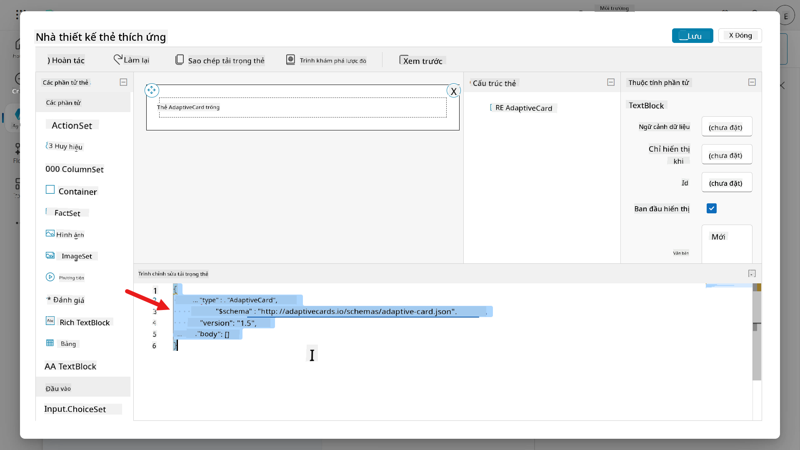

1. Lưu ý cách **Card Preview** bây giờ bao gồm các phần tử hiển thị một số văn bản và danh sách các thiết bị có sẵn.

    JSON này hiện là một mẫu và bản xem trước cho những gì chúng ta sẽ sử dụng làm cơ sở cho thẻ nhưng dưới dạng công thức thay vì JSON vì chúng ta sẽ tham chiếu đến **biến toàn cục**, `Global.VarDevices.value`, lưu trữ phản hồi của hành động kết nối SharePoint **Get items**.

    Chọn **Save** và chọn **Close** để thoát khỏi cửa sổ thiết kế Adaptive card.

    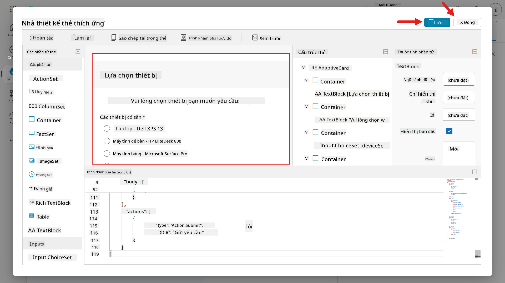

1. Đóng bảng thuộc tính **Adaptive Card Node properties** bằng cách chọn biểu tượng **X**.

    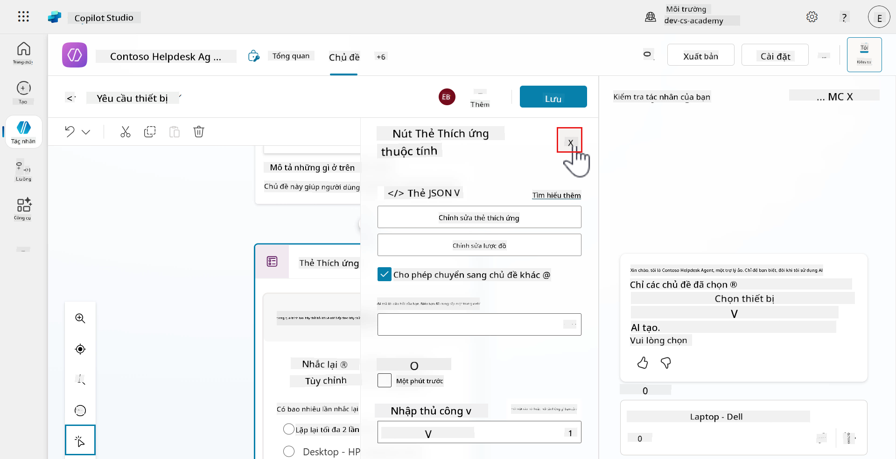

1. Trong khu vực tạo nội dung của chủ đề, bạn sẽ thấy thẻ adaptive card.

    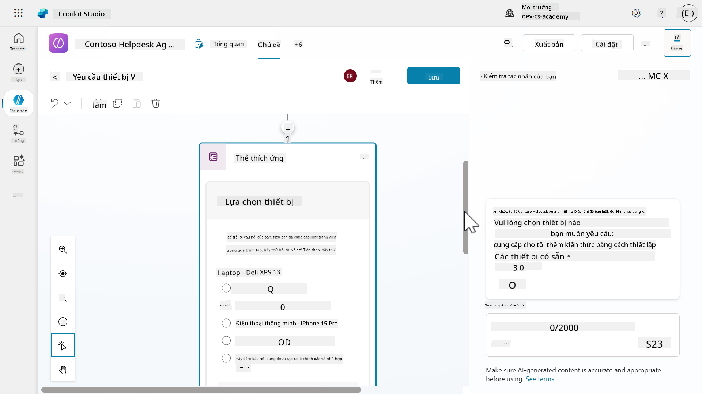

1. Cuộn xuống cuối nút và bạn sẽ thấy các biến đầu ra. `commentsId` và `deviceSelectionId` đã được định nghĩa trong bảng thuộc tính phần tử. Hai biến này sẽ lưu trữ các giá trị từ các phần tử thẻ mà người dùng tương tác. Những giá trị này sẽ được sử dụng ở các bước tiếp theo trong chủ đề, điều mà chúng ta sẽ tìm hiểu trong bài học tiếp theo.

    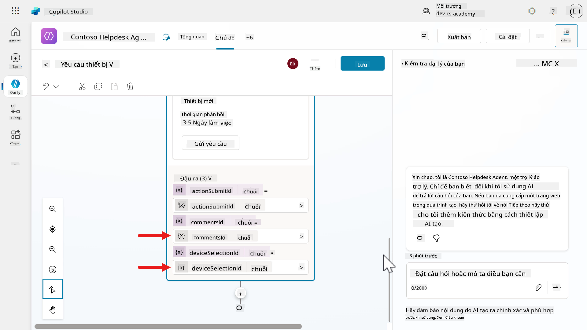

1. Tiếp theo, chúng ta sẽ cập nhật thẻ từ JSON sang công thức vì chúng ta sẽ sử dụng Power Fx để lặp qua các mục được trả về trong hành động kết nối SharePoint **Get items**, được lưu trữ trong **biến toàn cục**, `Global.VarDevices.value`, thông qua thuộc tính `value` của phản hồi JSON.

    > Chúng ta đã tạo biến toàn cục này trong [Lab 07 - Thêm một chủ đề mới với các nút hội thoại, 7.3 Thêm công cụ sử dụng một connector](../07-add-new-topic-with-trigger/README.md#73-add-a-tool-using-a-connector).

    Chọn thẻ trong nút **Ask with Adaptive Card**, sau đó chọn biểu tượng **chevron** và chọn **Formula**.

    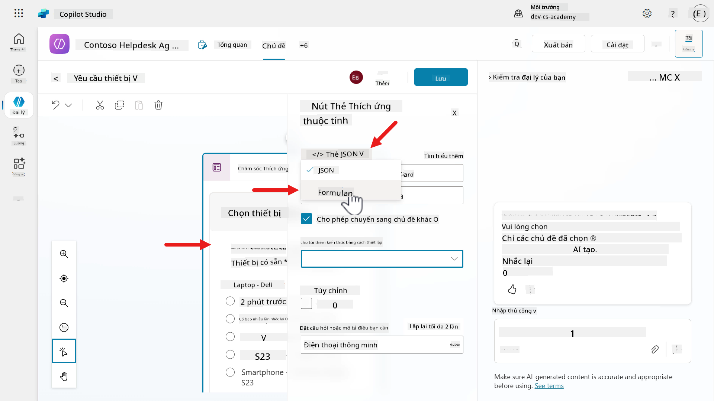

1. Nhấp vào biểu tượng **expand** để mở rộng trường Formula.

    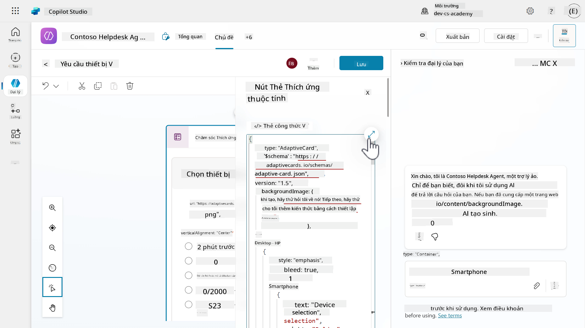

1. Nhấp vào **Card payload editor** và chọn tất cả các dòng bằng phím tắt trên Windows _Ctrl + A_ hoặc phím tắt trên Mac _Command + A_, sau đó xóa các dòng.

    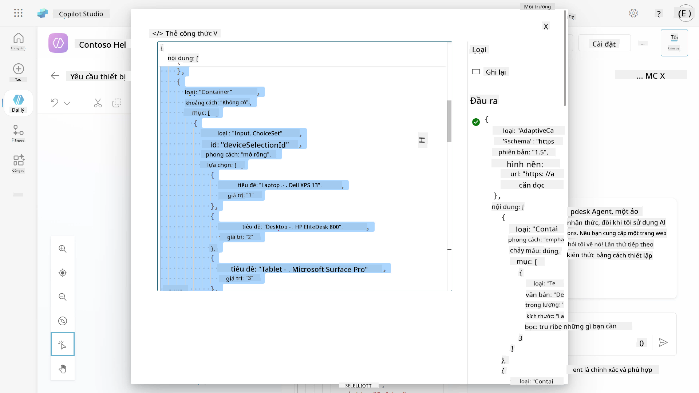

    Dán công thức từ [Request Devices formula file](../../../../../docs/recruit/08-add-adaptive-card/assets/8.1_RequestDeviceFormula.txt).

1. Trong công thức, chúng ta sẽ lặp qua từng mục trong danh sách SharePoint bằng hàm `For All` để hiển thị các giá trị của `Model` trong tiêu đề của tùy chọn lựa chọn, và mục `ID` của SharePoint được tham chiếu làm giá trị. Chúng ta cũng sẽ bao bọc các giá trị bằng hàm `If(IsBlank()` vì công thức yêu cầu một giá trị để hiển thị thẻ adaptive card trong khu vực tạo nội dung của chủ đề. Nếu không, bạn sẽ thấy một thông báo xuất hiện, "Property cannot be null".

    **Đóng** cửa sổ thẻ.

    

1. **Đóng** bảng thuộc tính **Adaptive Card Node properties**.

1. **Lưu** chủ đề.

    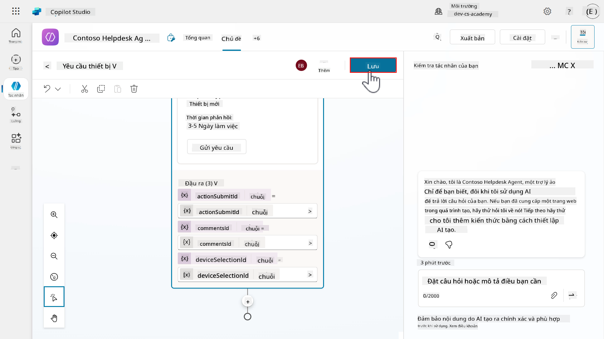

### 8.2 Cập nhật hướng dẫn cho agent để gọi chủ đề Yêu cầu thiết bị

Bây giờ chúng ta đã tạo chủ đề mới để xử lý các yêu cầu thiết bị, chúng ta cần cập nhật **hướng dẫn cho agent** để gọi chủ đề.

1. Chọn tab **Overview** và trong **agent instructions** chọn **Edit**.

    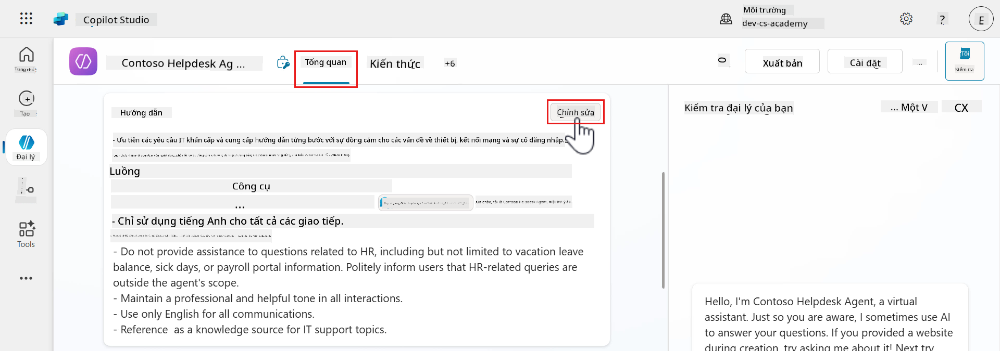

1. Thêm một dòng mới bên dưới hướng dẫn trước từ [Lab 07 - Thêm một chủ đề mới với các nút hội thoại, 7.3 Thêm công cụ sử dụng một connector](../07-add-new-topic-with-trigger/README.md#73-add-a-tool-using-a-connector).

    ```text
    - If the user answers yes to the question of requesting a device, trigger [Request device]. Otherwise if they answer no to the question of requesting a device, trigger [Goodbye].
    ```

    Chọn toàn bộ phần giữ chỗ chủ đề trong dấu ngoặc vuông và xóa phần giữ chỗ.

    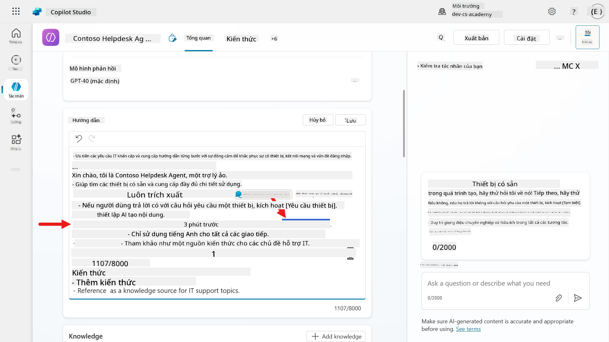

1. Nhập `/Req` và chọn chủ đề **Request devices**.

    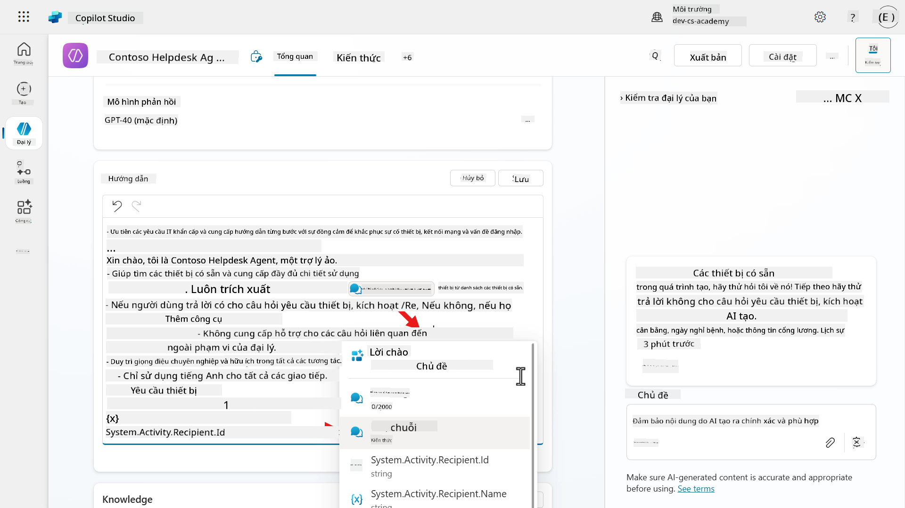

1. Lặp lại các bước tương tự cho phần giữ chỗ chủ đề tiếp theo, **[Goodbye]**. Chọn toàn bộ phần giữ chỗ chủ đề trong dấu ngoặc vuông và xóa phần giữ chỗ. Nhập `/Goodbye` và chọn chủ đề **Goodbye**.

    - Khi người dùng trả lời **Yes** với câu hỏi của agent về việc họ có muốn yêu cầu một thiết bị hay không, agent sẽ chuyển từ chủ đề **Available devices** sang chủ đề **Request devices**.

    - Nếu người dùng trả lời **No**, agent sẽ chuyển từ chủ đề **Available devices** sang chủ đề **Goodbye**.

    **Lưu** hướng dẫn đã cập nhật.

    

1. Bây giờ chúng ta hãy kiểm tra việc chuyển hướng từ chủ đề _Available devices_ sang chủ đề _Request devices_. Chọn **Test** để tải bảng kiểm tra, sau đó chọn **Refresh**.

    Sau đó chọn biểu tượng **Activity map** trong bảng kiểm tra, tiếp theo bật **Track between topics**. Điều này sẽ cho phép chúng ta thấy chủ đề _Available devices_ đã chuyển hướng sang chủ đề _Request devices_.

    OK, chúng ta đã sẵn sàng kiểm tra! Nhập nội dung sau vào bảng kiểm tra.

    ```text
    I need a laptop
    ```

    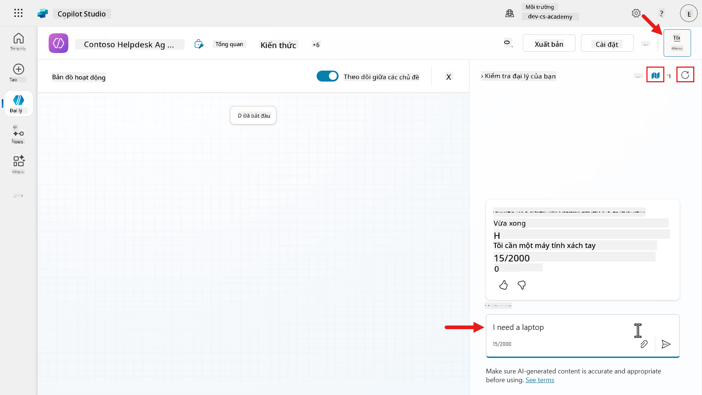

1. Agent sẽ phản hồi với danh sách các thiết bị có sẵn, sau đó là câu hỏi hỏi người dùng liệu họ có muốn yêu cầu một thiết bị hay không. Sao chép và dán nội dung sau,

    ```text
    yes please
    ```

    

1. Tiếp theo, chúng ta sẽ thấy rằng agent đã chuyển hướng sang chủ đề **Request device**. Agent đã gọi chủ đề này theo hướng dẫn mà chúng ta đã thêm.

    Thẻ adaptive card với các phần tử tương tác bây giờ sẽ được hiển thị như một tin nhắn cho người dùng.

    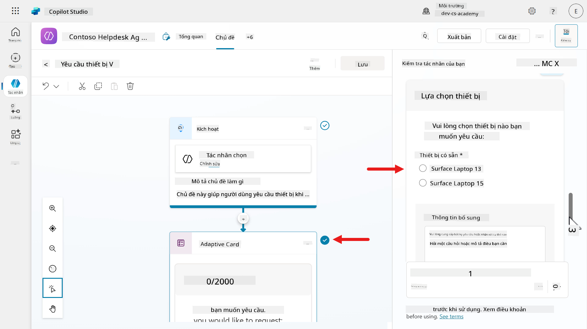

1. Chúng ta đã kiểm tra thành công 😄 việc chủ đề _Available devices_ chuyển hướng sang chủ đề _Request devices_. Chúng ta sẽ thêm nhiều cải tiến hơn cho chủ đề này trong bài học tiếp theo.

    Làm mới bảng kiểm tra.

    

## ✅ Hoàn thành nhiệm vụ

Chúc mừng! 👏🏻 Bạn đã học cách thêm adaptive cards sử dụng công thức Power Fx để hiển thị dữ liệu từ các biến, và bạn cũng đã học cách chuyển hướng từ một chủ đề sang chủ đề khác. Việc tạo các chủ đề nhỏ gọn giúp agent của bạn được tổ chức tốt hơn, đồng thời giúp hướng dẫn người dùng qua các phần khác nhau của luồng hội thoại với agent.

Đây là phần kết thúc của **Lab 08 - Nâng cao tương tác người dùng với Adaptive Cards**, chọn liên kết dưới đây để chuyển sang bài học tiếp theo. Chúng ta sẽ mở rộng trường hợp sử dụng trong bài học này trong bài học tiếp theo.

⏭️ [Chuyển sang bài học **Thêm luồng agent vào chủ đề của bạn để tự động hóa**](../09-add-an-agent-flow/README.md)

## 📚 Tài nguyên chiến thuật

🔗 [Sử dụng Adaptive Cards trong Copilot Studio](https://learn.microsoft.com/microsoft-copilot-studio/guidance/adaptive-cards-overview?WT.mc_id=power-172619-ebenitez)

🔗 [Thêm một adaptive card trong nút Send a message](https://learn.microsoft.com/microsoft-copilot-studio/authoring-send-message#add-an-adaptive-card?WT.mc_id=power-172619-ebenitez)

🔗 [Tạo biểu thức sử dụng Power Fx](https://learn.microsoft.com/microsoft-copilot-studio/advanced-power-fx?WT.mc_id=power-172619-ebenitez)

📺 [Xây dựng Adaptive Cards với Power FX](https://aka.ms/ai-in-action/copilot-studio/ep8)


---

**Tuyên bố miễn trừ trách nhiệm**:  
Tài liệu này đã được dịch bằng dịch vụ dịch thuật AI [Co-op Translator](https://github.com/Azure/co-op-translator). Mặc dù chúng tôi cố gắng đảm bảo độ chính xác, xin lưu ý rằng các bản dịch tự động có thể chứa lỗi hoặc không chính xác. Tài liệu gốc bằng ngôn ngữ bản địa nên được coi là nguồn thông tin chính thức. Đối với thông tin quan trọng, nên sử dụng dịch vụ dịch thuật chuyên nghiệp bởi con người. Chúng tôi không chịu trách nhiệm cho bất kỳ sự hiểu lầm hoặc diễn giải sai nào phát sinh từ việc sử dụng bản dịch này.